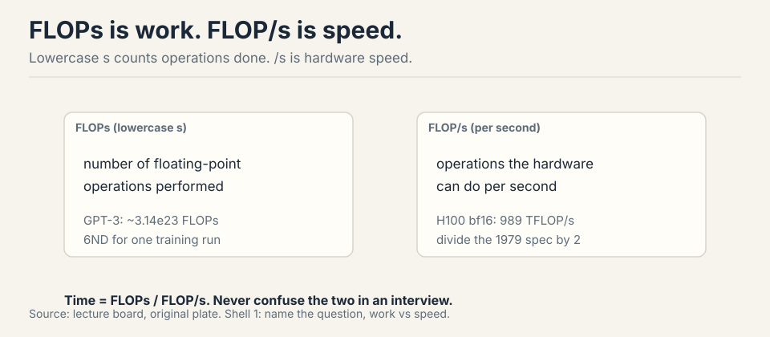
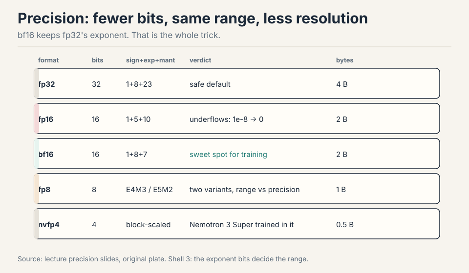
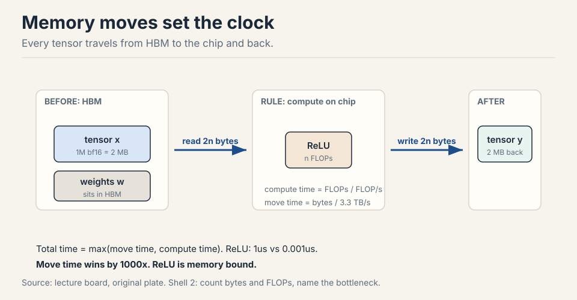
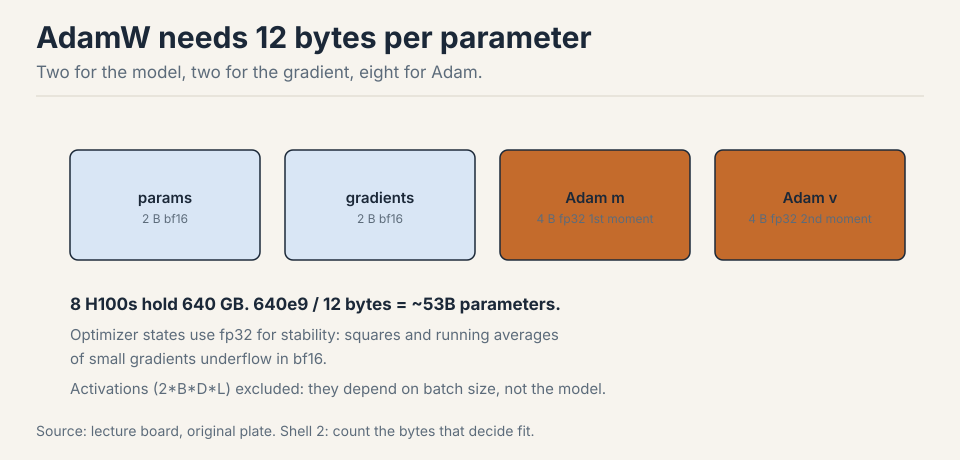
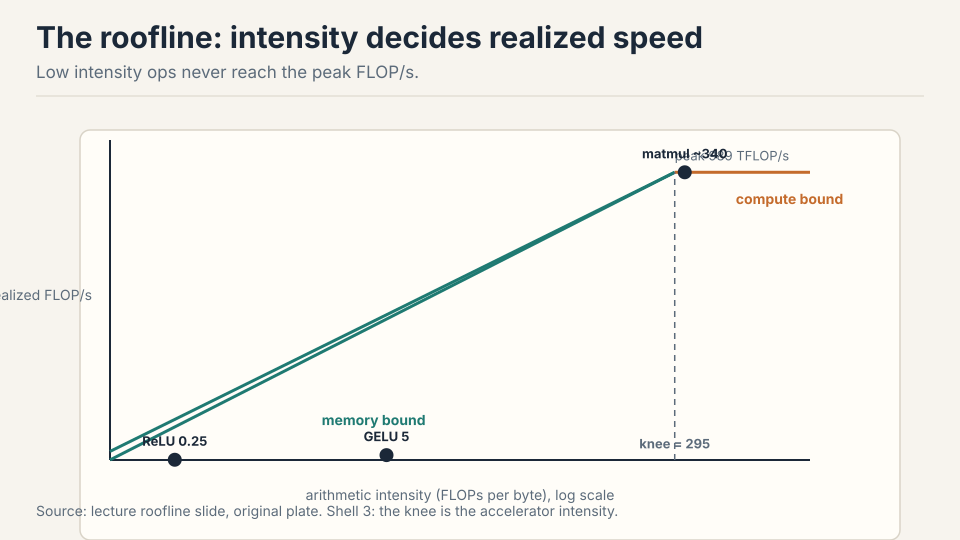
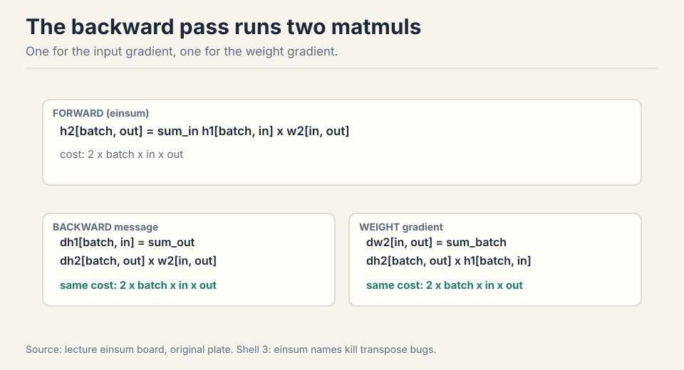
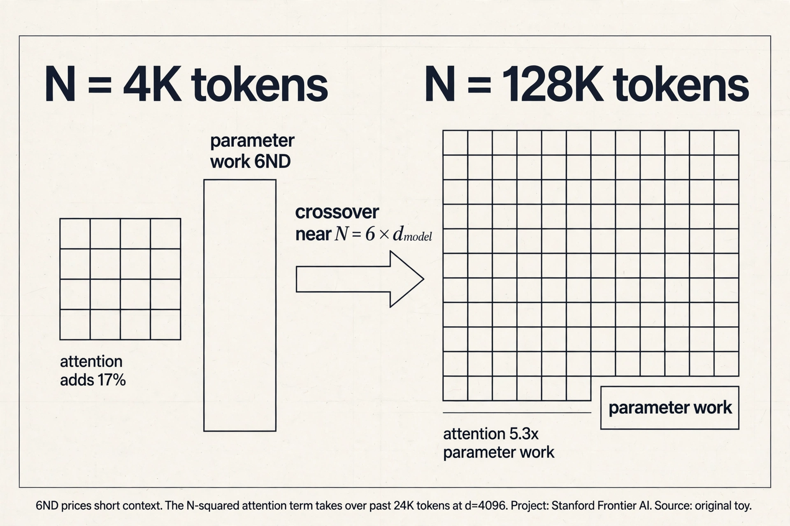
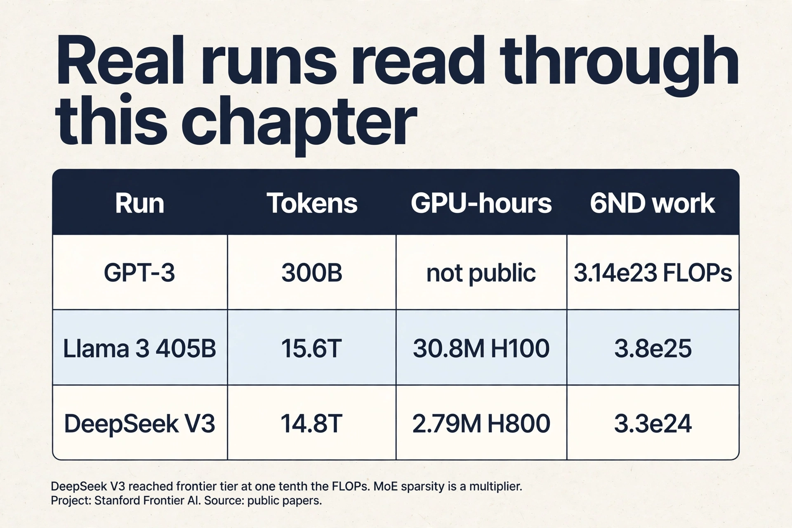

## Two questions open the lecture

The professor walked in with news. The Marin project had finished a
1e23 FLOP training run, and the final loss landed within 0.05 of what
the scaling-law fits had predicted before the run started
[00:09](ts:00:09). The forecast matched the outcome. That is what good
accounting buys: you price the run before you pay for it.

Then he posed two questions. Every tool in this chapter exists to
answer them.

**Question 1.** How long to train a 70B parameter model on 15T tokens
on 1024 H100s? Answer: 143 days [02:05](ts:02:05).

**Question 2.** What is the largest model you can train on 8 H100s
with AdamW? Answer: about 53B parameters [02:51](ts:02:51).

The goal of the course is plain: train the best model possible given a
finite set of resources. Resources mean compute and memory. Data is not
the limit here. Before you can optimize efficiency, you must measure
it. This chapter builds the measurement system.

## First attempt: count the arithmetic

Start with the pieces. Everything in training is a **tensor**: a grid
of numbers with any number of dimensions. Parameters are tensors.
Gradients are tensors. Optimizer states are tensors. Data and
activations are tensors [04:46](ts:04:46).

Memory for one tensor is simple: number of elements times bytes per
element. A 4x8 matrix in float32 holds 32 elements at 4 bytes each: 128
bytes [07:15](ts:07:15). One matrix in GPT-3's feedforward layer is
about 2.3 GB [07:47](ts:07:47). Tensors get big fast.

Now count the work. A **FLOP** is one floating-point operation: an
addition, a multiplication, one unit of math [27:36](ts:27:36). FLOP/s
is hardware speed: how many of those the chip does per second.



The pet peeve: FLOPs with a lowercase s is work done. FLOP/s is speed.
GPT-3 took about 3.14e23 FLOPs of work. The H100 promises 989 TFLOP/s
of speed in dense bf16. Time equals work divided by speed
[28:03](ts:28:03).

The dominant op is the matrix multiply. A matmul of B x D by D x K
costs 2 x B x D x K FLOPs [31:52](ts:31:52). Each output entry needs D
multiplications and D-1 additions. Round D-1 to D: 2 FLOPs per triple.
Elementwise ops cost just the matrix size: addition on m x n costs mn
FLOPs. No other op rivals matmul at large sizes, so accounting focuses
on matmuls [32:34](ts:32:34).

Reframe the matmul cost. B is the number of data points. D x K is the
parameter count. The forward pass of one linear layer costs 2 x tokens
x parameters. Hold that shape. It grows into the 6ND rule.

So the naive recipe for Question 1: total FLOPs = 6 x parameters x
tokens (the 6 comes from forward plus backward, derived below). Look up
the H100 speed on the spec sheet. Multiply by a utilization factor.
Divide. Done.

Benchmarking honesty: GPUs run asynchronously. Wrap timing with
`torch.cuda.synchronize()` before and after, average several runs, or
your numbers are fiction [35:27](ts:35:27).

## Where the naive recipe breaks

The recipe works on paper and fails in four specific ways. Each one
has numbers.

### Break 1: the wrong precision corrupts everything

A float32 number has 32 bits: 1 sign bit, 8 exponent bits, 23 mantissa
bits [06:08](ts:06:08). The exponent sets dynamic range: how big and
how small the numbers can be. The mantissa sets resolution: how finely
they are spaced.

Cut the bits in half and you get float16: 1 sign, 5 exponent, 10
mantissa. The 5-bit exponent kills dynamic range. The value 1e-8 rounds
to zero. Gradients in training routinely hit 1e-8. Train in fp16 and you
get underflow, overflow, and NaNs [08:52](ts:08:52). The arithmetic is
fast but the answers are garbage.

**bf16** was built in 2018 to fix this. Same 16 bits, different split:
1 sign, 8 exponent, 7 mantissa. The exponent keeps fp32's 8 bits, so
bf16 has fp32's full dynamic range with worse resolution
[09:53](ts:09:53). Deep learning tolerates sloppy resolution: gradients
are noisy anyway. It does not tolerate overflow. bf16 is the sweet
spot.



Below bf16, the frontier keeps pushing. fp8 has two variants, one
favoring range and one favoring resolution, supported by NVIDIA's
Transformer Engine [13:15](ts:13:15). nvfp4 uses 4 bits per value with
a per-block scale factor, so neighbors share dynamic range. Nemotron 3
Super trained in fp4 [13:47](ts:13:47). One-bit training has no credible
result yet: the working recipe is train in bf16, then quantize to 1-2
bits after [16:21](ts:16:21).

Mixed precision is standard practice. Use bf16 for parameters,
activations, and gradients. Use fp32 for optimizer states: the
optimizer squares gradients and keeps running averages across thousands
of steps, and those tiny accumulated numbers underflow in bf16. PyTorch
AMP wraps your code and casts automatically: matmuls go to bf16,
exponentiation stays fp32 [11:52](ts:11:52).

> [!QA]
> Q: Why is bf16 preferred over fp16 for training?
> A: bf16 keeps the 8-bit exponent of fp32, so it has the same dynamic range: no underflow of small gradients, no overflow of large activations. fp16 has only 5 exponent bits, so values like 1e-8 round to zero and training produces NaNs. Deep learning needs range more than resolution, because gradients are noisy anyway. That single bit-budget trade is why bf16 won.
> Follow-up: Why do optimizer states stay in fp32?
> A: The optimizer squares gradients and keeps running averages across steps. Those are tiny numbers accumulated over thousands of updates. In bf16 the squares underflow and the averages lose the signal. The states are not the compute bottleneck, so paying 4 or 8 bytes per parameter there buys stability cheaply.

### Break 2: the spec sheet lies, and you never reach it

The H100 lists 1979 TFLOP/s. The footnote says that number assumes
sparsity. Dense math, the kind training actually does, runs at half:
989 TFLOP/s [29:29](ts:29:29). Always read the footnote.

And you never get the full 989. **Model FLOPs Utilization**, MFU, is
actual FLOP/s divided by spec-sheet FLOP/s [37:15](ts:37:15). An MFU
of 0.5 on a real model is good. A pure matmul can reach 0.8. An MFU of
0.1 means something is broken and you should fix it. You never exceed
1.0.

Intuition check: 8 H100s for one week give about 5e21 FLOPs
[30:09](ts:30:09). That is 8 x 989e12 x 604800 seconds. Napkin math like
this is the whole game.

So Question 1's recipe needs two corrections: halve the spec number,
then multiply by MFU ~0.5. Now it reads: 6 x 70e9 x 15e12 = 6.3e24
FLOPs of work. Effective speed: 1024 GPUs x 989e12 x 0.5 = 5.1e17
FLOP/s, about 4.4e22 per day. Divide: 6.3e24 / 4.4e22 = 143 days.

### Break 3: moving data costs more than computing

Here is the break that reshapes everything. Hardware is two boxes: HBM
memory and the compute chip. Every op reads tensors from HBM, computes,
and writes back [40:50](ts:40:50). Total time is the slower of move time
and compute time [44:46](ts:44:46).

Worked example: ReLU on a 1M-element bf16 vector. Bytes moved: read 2
bytes per element, write 2 bytes per element, 4 MB total. FLOPs: 1M
comparisons. Move time: 4e6 bytes / 3.3e12 bytes/s = about 1
microsecond. Compute time: 1e6 / 989e12 = about 1 nanosecond
[42:38](ts:42:38). The op spends its life waiting for bits. The compute
is free by comparison.



**Arithmetic intensity** is FLOPs divided by bytes moved. The H100's own
intensity: 989e12 / 3.3e12 = about 295 [46:00](ts:46:00). An op with
intensity below 295 is memory bound: the chip waits on data. Above 295,
compute bound.

| Op | Bytes | FLOPs | Intensity | Bound by |
|---|---|---|---|---|
| ReLU | 4n | n | 0.25 | memory |
| GELU | 4n | 20n | 5 | memory |
| Dot product | 4n | 2n | 0.5 | memory |
| Matvec | 2n^2 | 2n^2 | ~0.5 | memory |
| Matmul | 6n^2 | 2n^3 | n/3 ~ 340 | compute |

GELU does 20x the work of ReLU per element, yet runs no slower: both
are memory bound, so the extra FLOPs are free [48:23](ts:48:23).
Matmul is the only compute-bound op here, because it does n^3 work on
n^2 bytes. Intensity grows with matrix size, which is why large
batches and large matrices saturate GPUs [52:19](ts:52:19).

The inference foreshadow: generating one token at a time is a
matrix-vector product, hence memory bound. Training processes whole
sequences at once, hence compute bound [53:29](ts:53:29).

### Break 4: the memory budget decides what fits

Question 2 is a memory question. Four residents live in GPU memory
during training [69:27](ts:69:27).



| Resident | Bytes | Notes |
|---|---|---|
| Parameters | 2 x P | bf16 |
| Gradients | 2 x P | bf16, one copy of params |
| Activations | 2 x B x D x L | bf16, scales with batch |
| Optimizer (Adam) | 8 x P | fp32: 4 for m, 4 for v |

AdaGrad keeps one fp32 state per parameter: 4 bytes. Adam keeps two: 8
bytes. Optimizer states are the capacity hog: they decide whether the
model fits, even though they barely affect step speed
[71:04](ts:71:04).

The quiz answer falls out directly: 8 H100s = 640 GB. 640e9 / 12 bytes
per parameter = about 53B parameters with AdamW.

> [!QA]
> Q: Your training run reports MFU 0.15. What do you check first?
> A: Memory bottlenecks. Low MFU with high FLOP counts means the GPUs wait on data movement instead of computing. Check arithmetic intensity of your ops, batch sizes, and whether small elementwise ops dominate the profile. Compute the intensity, compare to 295, and find the memory-bound ops.
> Follow-up: Why can a run with huge FLOP counts still have low MFU?
> A: Because MFU divides actual throughput by peak throughput. If every op is memory bound, the chip spends its time waiting for HBM and the achieved FLOP/s sits far below peak. The fix is not more FLOPs but higher intensity: bigger matmuls, larger batches, fewer elementwise passes.

## The key question

The naive recipe counts arithmetic and assumes the chip delivers it.
But the ReLU example shows the chip waiting a thousand times longer
than it computes. What if the measurement system tracked data movement
with the same care it tracks FLOPs? That question gives the roofline.

## The roofline: one plot, one diagnosis

Plot intensity on the x-axis and realized FLOP/s on the y-axis. Each
accelerator is a roofline: a rising ramp capped by its peak FLOP/s
[54:48](ts:54:48).



Ops left of the knee never reach the peak, no matter how well written.
ReLU sits at 0.25, GELU at 5, both deep in memory-bound territory.
Matmul at about 340 sits right of the knee and can saturate the chip.
This plot is the diagnostic: compute your op's intensity, find it on
the x-axis, read your ceiling. If you sit left of 295, no amount of
kernel tuning gets you to peak. You must change the op or its shape.

## The 6ND rule, derived

Now derive the number that prices Question 1. Zoom into one linear
layer. Forward: h2 = h1 @ w2. The backward pass computes two gradients
[61:14](ts:61:14).

```ascii
forward:  h2[batch, out] = sum_in h1[batch, in] * w2[in, out]
backward: dh1[batch, in]  = sum_out dh2[batch, out] * w2[in, out]
          dw2[in, out]    = sum_batch dh2[batch, out] * h1[batch, in]
```

Each backward line is a matmul over the same three dimensions, so each
costs the same as the forward. Two of them: the backward pass is
exactly 2x the forward pass.



Total: 2ND forward + 4ND backward = 6ND FLOPs per training step, where N
is parameters and D is tokens [65:52](ts:65:52). This holds for
transformers too, as long as context length stays modest: with very long
contexts the n^2 attention term needs separate accounting
[66:28](ts:66:28).

> [!QA]
> Q: Derive the 6 in the 6ND rule.
> A: One linear layer forward costs 2 FLOPs per parameter per token: one multiply and one add. The backward pass computes two gradients, each a matmul over the same dimensions, so it costs 2 x 2 = 4 FLOPs per parameter per token. Add forward and backward: 2 + 4 = 6. The rule counts multiply-adds across all parameters and all tokens in the batch.
> Follow-up: When does 6ND underestimate?
> A: When attention dominates: its cost grows with sequence length squared, which 6ND ignores. For long-context training you add the attention term separately. It also ignores the optimizer step and elementwise ops, but those are small next to the matmuls.

### Subchapter: when 6ND breaks (the attention term)

The 6ND rule counts parameters, not pairs. The attention score matrix
costs extra: QK^T and the value mix each cost 2N^2 d per layer for N
tokens of width d. Forward plus backward triples it: about 12Nd extra
FLOPs per token per layer.

Compare with the parameter work: roughly 72d^2 FLOPs per token per
layer (6 times about 12d^2 parameters per layer). The ratio is 12Nd /
72d^2 = N / (6d). Worked numbers for d = 4,096:

- N = 4,096: ratio = 4,096 / 24,576 = 0.17. Attention adds 17% on top
  of 6ND. The lecture's caveat holds: 6ND is fine here.
- N = 32,768: ratio = 1.33. Attention costs more than all the
  parameters combined. 6ND now misses half the bill.
- N = 131,072: ratio = 5.3. Attention is 5 times the parameter work.
  6ND misses most of the bill.

The crossover sits near N = 6 times d_model. For a d = 4,096 model
that is about 24K tokens. Below it, 6ND prices the run. Above it, add
the attention term. Long-context training budgets and all long-context
inference budgets must carry the N^2 term.



## Two memory tricks that change the budget

Activations scale with batch size: 2 x B x D x L bytes. Large batches
stabilize training up to a critical batch size, but they may not fit in
memory. Two tricks buy back the budget.

**Gradient accumulation** splits the batch into microbatches. Run one
microbatch, add its gradients without zeroing, repeat, and step the
optimizer every B/microbatch steps [72:30](ts:72:30). Effective batch
size B with the activation memory of one microbatch. Zero extra
compute. A small code change for a large memory win.

**Activation checkpointing** attacks depth instead of batch. Training
stores every layer's activations for the backward pass. Checkpointing
stores only a subset and recomputes the rest during backward
[73:21](ts:73:21).

 spacing balances memory against recompute.")

The trade: memory down, compute up. Store nothing and recompute costs
O(L^2). The sweet spot stores every sqrt(L)-th layer: O(sqrt(L)) memory
and O(sqrt(L)) extra compute. In PyTorch, wrap a block with
`torch.utils.checkpoint`: the block runs forward without saving
intermediates, then recomputes them on the backward pass.

> [!QA]
> Q: When do you reach for gradient accumulation vs activation checkpointing?
> A: Gradient accumulation when the batch does not fit: it cuts activation memory by the accumulation factor with zero extra compute, but it does not change per-layer memory. Activation checkpointing when depth does not fit: it cuts activation memory to O(sqrt(L)) at the cost of about 30% extra compute from recomputation. Use both when both batch and depth are large. Neither reduces parameter or optimizer memory: that needs sharding or offloading, covered in the parallelism lectures.
> Follow-up: Why sqrt(L) spacing for checkpoints?
> A: Store nothing and recompute everything and the backward pass costs O(L^2): each layer's recompute replays the whole chain. Store every k-th layer and the cost is L/k memory plus k recompute per layer. Minimizing the sum gives k = sqrt(L): O(sqrt(L)) memory and O(sqrt(L)) extra compute. It is the balance point.

## einops: names instead of indices

One tool for reading the code you will write. `x.transpose(-2, -1)`
forces you to track what -2 and -1 mean. einops names the dimensions
instead [18:12](ts:18:12).

einsum is generalized matrix multiplication with bookkeeping. Name each
dimension. Dimensions that appear on both inputs but not the output get
summed out.

```ascii
shapes:  x is 3 x 4,  y is 4 x 3
index soup:  z[i,j] = sum_k x[i,k] * y[k,j]   # what is k?
named:       x[seq1, hidden] * y[hidden, seq2] -> z[seq1, seq2]
```

The named version needs no transpose: the names do the work. With
batches, heads, and sequences stacked, `...` absorbs the batch
dimensions you do not want to name [22:05](ts:22:05). `reduce`
generalizes sum, mean, max, min over named dimensions
[22:55](ts:22:55). `rearrange` splits or merges dimensions, for example
splitting a width-8 dimension into 2 heads x 4 hidden before a per-head
operation [24:06](ts:24:06).

> [!QA]
> Q: What does einops buy you over raw PyTorch index ops?
> A: Correctness and readability, not speed: it compiles to the same primitives. Named dimensions make the contraction pattern explicit, so transpose bugs and wrong-axis reductions become visible. In attention code with batch, head, and sequence dimensions, that clarity prevents the most common shape bugs.
> Follow-up: When would you not use einops?
> A: In the innermost hot loop where you need a fused kernel anyway, you write the kernel directly. einops is for model code, where clarity dominates and the ops lower to the same cuBLAS calls.

## Mapping back: the tools answer the two questions

| Question | Tool | The correction it adds |
|---|---|---|
| 143 days to train 70B | 6ND | Prices the work: 2 forward + 4 backward per parameter per token. |
| 143 days | Dense spec 989 TFLOP/s | Halve the 1979 number: the footnote assumes sparsity. |
| 143 days | MFU ~0.5 | You never reach spec. Real models get half. |
| Why MFU is low | Intensity vs 295 | Left of the knee: memory bound. No kernel fix reaches peak. |
| 53B on 8 H100s | 12 bytes per param | 2 params + 2 grads + 8 Adam states. 640 GB / 12 = 53B. |
| Batch too big | Gradient accumulation | Microbatches, same effective batch, zero extra compute. |
| Depth too deep | Checkpointing | Store sqrt(L), recompute the rest, ~30% extra compute. |

### Subchapter: what the real runs look like

The whole chapter is a reading lens for training announcements. Apply
it to three public runs.

| Run | Tokens | GPU-hours (reported) | 6ND work estimate |
|---|---|---|---|
| GPT-3 (175B) | 300B | not public | 3.14e23 FLOPs (paper) |
| Llama 3 405B | 15.6T | 30.8M H100-hours (paper) | 6 x 405e9 x 15.6e12 = 3.8e25 |
| DeepSeek-V3 (671B MoE, 37B active) | 14.8T | 2.788M H800-hours (paper) | 6 x 37e9 x 14.8e12 = 3.3e24 |

Check DeepSeek-V3's arithmetic. Capacity: 2.788M hours x 3,600
seconds x 989e12 FLOP/s (H800 dense bf16) = 9.9e24 FLOPs. Estimated
work: 3.3e24. Ratio: about one third of peak, a realistic sustained
number. The announcement survives the accounting.

The lesson of the table: DeepSeek-V3 reached frontier tier at roughly
one tenth the FLOPs of Llama 3 405B (3.3e24 vs 3.8e25). MoE sparsity
is a cost multiplier, not an architecture footnote. This is what the
chapter's tools are for: precision accounting, MFU discipline, and
6ND turn press releases into checkable numbers.



> [!QA]
> Q: Walk me through diagnosing a slow training step with the roofline, numbers included.
> A: Profile one step and find the dominant op. Say the profile shows GELU taking 40% of step time. Compute its intensity: GELU moves 4n bytes and does 20n FLOPs, so intensity is 5. The H100 knee is 295. Intensity 5 sits far left: memory bound. The ceiling is bandwidth times intensity: 3.3e12 x 5 = 16.5 TFLOP/s, a tiny fraction of the 989 peak. No kernel rewrite fixes that. The op must be fused into a neighbor or deleted. Compare with the matmul at intensity about 340: its ceiling is the 989 peak, so if the matmul underperforms, tuning actually pays. The workflow: compute intensity, find the position on the roofline, read the ceiling, then decide whether to tune the op or change the math.
> Follow-up: What is the single most common roofline mistake?
> A: Optimizing the arithmetic of a memory-bound op. Teams fuse and tile an elementwise op sitting at intensity 5, gain nothing, and miss the real fix: fewer passes over the data. Fuse it into the neighboring matmul or remove it.

> [!QA]
> Q: Your lab has 64 H100s for 30 days. Roughly what is the biggest model you can train?
> A: Budget first. 64 GPUs x 30 days x 86,400 seconds x 989e12 FLOP/s x 0.5 MFU = 8.2e22 FLOPs. Now invert 6ND. Pick 20 tokens per parameter, the Chinchilla-ish optimum: N = sqrt(8.2e22 / 120) = sqrt(6.8e20) = 2.6e10. About 26B parameters on 520B tokens. Check memory: 12 bytes x 26e9 = 312 GB across 64 GPUs, about 5 GB per GPU. That fits easily with room for activations. The interview signal: quote the budget, state the MFU and token assumptions, invert the rule, then check memory. Anyone who skips the memory check is guessing.
> Follow-up: Why 20 tokens per parameter?
> A: The Chinchilla optimum is roughly 20 tokens per parameter for compute-optimal training. Spending the budget there gives the best model for the FLOPs. Train longer on fewer parameters only when inference cost dominates, which is a serving decision, not a training one.

## The honest price

Every number in this chapter is a back-of-the-envelope. The 143-day
estimate ignores communication overhead and assumes a flat 0.5 MFU.
Real runs vary. The 53B figure excludes activations, which depend on
batch size and sequence length. 6ND ignores attention's n^2 term: it
underestimates long-context training. Mixed precision details (which
ops stay fp32) are handled by AMP heuristics, not derived here.

The deeper price: this chapter prices training. Inference is a
different economy. Training is compute bound (whole sequences at once).
Inference is memory bound (one token at a time, a matrix-vector
product). The intensity table already shows why: a matvec sits at
intensity ~0.5, far left of the knee. The inference lecture spends a
full chapter on that world.

## Recap: the whole lesson on one screen

The story in eight steps. Each step answers the one before it.

1. **Two questions.** 143 days to train 70B on 1024 H100s. 53B max on
   8 H100s with AdamW. Every tool below exists to answer them.
2. **Count the arithmetic.** Tensors: elements x bytes. Matmul: 2BDK
   FLOPs. FLOPs is work, FLOP/s is speed. Time = work / speed.
3. **Precision can corrupt.** fp16 underflows: 5 exponent bits, 1e-8
   rounds to zero, NaNs. bf16 keeps fp32's 8-bit exponent: same range,
   16 bits, the sweet spot.
4. **The spec lies.** 1979 TFLOP/s assumes sparsity. Dense is 989.
   MFU: actual over promised. 0.5 is good, 0.1 is broken.
5. **Movement dominates.** ReLU on 1M values: 1 microsecond moving, 1
   nanosecond computing. Intensity = FLOPs / bytes. The H100 knee is
   295. GELU's extra FLOPs are free.
6. **Backward is 2x forward.** Two gradients per layer, each a matmul
   over the same dimensions. Total: 6ND. The price of every training
   run.
7. **Memory decides what fits.** AdamW: 2 + 2 + 4 + 4 = 12 bytes per
   parameter. Optimizer states are the capacity hog.
8. **Two tricks buy budget.** Gradient accumulation: microbatches, zero
   extra compute. Checkpointing: store sqrt(L), recompute the rest,
   ~30% extra compute.

## Go deeper

<div style="position:relative;padding-bottom:56.25%;height:0;overflow:hidden;max-width:100%;margin:16px 0;">
<iframe style="position:absolute;top:0;left:0;width:100%;height:100%;" src="https://www.youtube-nocookie.com/embed/DfnV32AmtlE" title="The Memory Wall Explained (Roofline Model)" frameborder="0" allow="accelerometer; autoplay; clipboard-write; encrypted-media; gyroscope; picture-in-picture" allowfullscreen></iframe>
</div>
- The Memory Wall Explained, Roofline Model (the embed above): https://www.youtube.com/watch?v=DfnV32AmtlE
- Williams et al., Roofline: An Insightful Visual Performance Model: https://www2.eecs.berkeley.edu/Pubs/TechRpts/2008/EECS-2008-134.html
- Micikevicius et al., Mixed Precision Training: https://arxiv.org/abs/1710.03740

## Official sources and further reading

**Official:**
- Lecture 2 video and executable code (lecture_02.py): all numbers
  above are computed live in the notebook.
- einops tutorial: the named-dimension system used in the lecture.

**Further reading:**
- Williams et al., Roofline (2009): the visual performance model
  behind the intensity analysis.
- NVIDIA H100 spec sheet: the 1979 TFLOP/s figure and its sparsity
  footnote.

**Caveats from these sources.** The 143-day estimate ignores
communication overhead and assumes a flat 0.5 MFU. Real runs vary. The
53B figure excludes activations, which depend on batch size and
sequence length. 6ND ignores attention's n^2 term: it underestimates
long-context training. Mixed precision details (which ops stay fp32)
are handled by AMP heuristics, not derived here.

## Connections to the other courses

- **CS229:** the loss chip is defined there. Here it becomes the work
  unit that 6ND prices.
- **CS336 later lectures:** 6ND prices every scaling-law fit. The
  intensity table returns in the inference lecture. The 12-bytes budget
  gets sharded by the parallelism lectures.
- **CS229S:** the device block and memory hierarchy here become the
  multi-GPU topology there.
- **CS329A:** test-time compute is priced in FLOPs with the same
  accounting.
