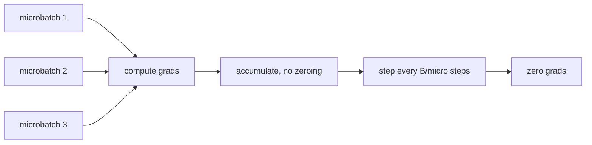
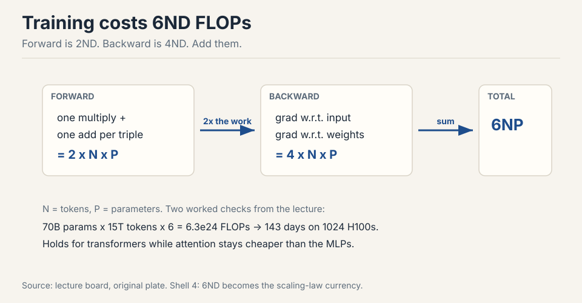
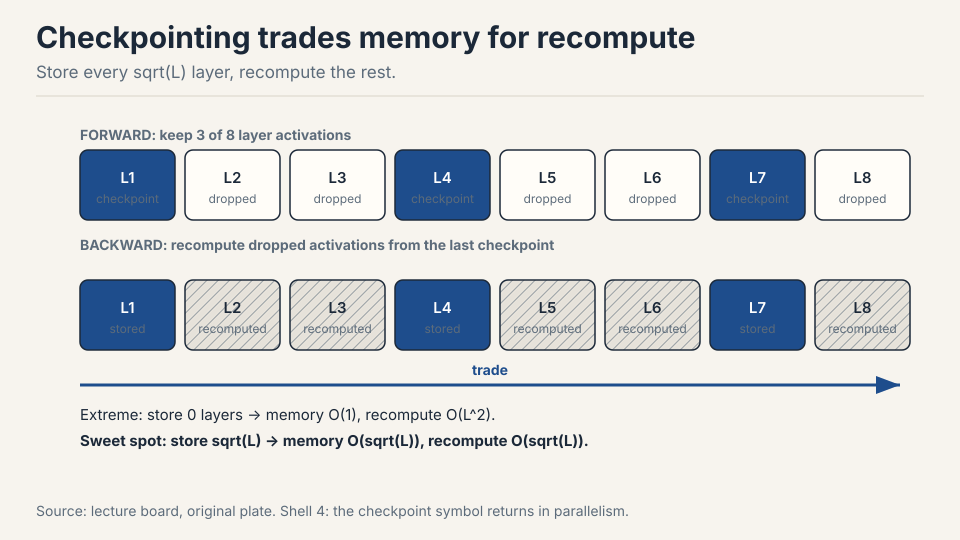

## How to read this lesson

This lesson has two levels. **Level 1 (Core)** gives you the accounting
system: how to count compute, how to count memory, and how to tell which
one limits you. **Level 2 (Deep)** adds the derivations and the memory
tricks used in real training runs.

No prerequisites are assumed. Every term is defined at first use. This
lesson links back to [Lecture 1](l01-tokenization.html) for the pipeline.

## Level 1: The goal

Train the best model possible given a finite set of resources. Resources
mean compute and memory. Data is not the limit in this course.

```ascii
given    : compute budget (FLOPs), memory budget (bytes)
maximize : model quality
measure  : everything below (precision, FLOPs, intensity)
```

Before you can optimize efficiency, you must measure it. This lecture
builds the measurement system. By the end you answer questions like the
two below.

The professor opened with news: the Marin project ran at 1e23 FLOPs and
landed within 0.05 of the loss predicted by scaling-law fits
[00:09](ts:00:09). Prediction before the run matched the run. That is
the power of good accounting.

## Level 1: Two questions you will be able to answer

**Question 1.** How long to train a 70B parameter model on 15T tokens on
1024 H100s? Answer: 143 days [02:05](ts:02:05).

```ascii
Q1 : 6 x params x tokens / (spec speed x MFU)  =  training days
Q2 : total GPU memory / 12 bytes per param     =  max params
```

The recipe: total FLOPs = 6 x parameters x tokens. Look up H100 speed
on the spec sheet. Multiply by MFU, about 0.5. Divide.

**Question 2.** What is the largest model you can train on 8 H100s with
AdamW? Answer: about 53B parameters [02:51](ts:02:51).

The recipe: each H100 holds 80 GB. AdamW needs 12 bytes per parameter.
640 GB divided by 12 bytes gives about 53B.

These are back-of-the-envelope numbers. The point is the shape of the
calculation, not the last digit.

> [!QA]
> Q: Estimate the training time for a 70B model on 15T tokens with 1024 H100s.
> A: Compute total FLOPs first: 6 x 70e9 x 15e12 = 6.3e24 FLOPs. An H100 delivers 989 TFLOP/s dense in bf16. At 0.5 MFU that is ~495 TFLOP/s effective per GPU. With 1024 GPUs, that is ~5.1e17 FLOP/s, or ~4.4e22 FLOP/day. Divide: 6.3e24 / 4.4e22 = ~143 days. Every step is one line of arithmetic once you know the 6ND rule and MFU.
> Follow-up: What breaks first if you double the tokens?
> A: Time doubles linearly, but the memory picture does not change: memory depends on model size and batch size, not token count. This is why compute accounting (6ND) and memory accounting (12 bytes per parameter) are separate systems.

## Level 1: Tensors are the building blocks

Everything is a tensor: parameters, gradients, optimizer states, data,
activations [04:46](ts:04:46). A tensor generalizes vectors and matrices
to any number of dimensions.

Memory for one tensor = number of elements x bytes per element. A 4x8
matrix in float32 holds 32 elements x 4 bytes = 128 bytes
[07:15](ts:07:15). One matrix in GPT-3's feedforward layer is about 2.3
GB [07:47](ts:07:47). Tensors get big.

By default PyTorch creates tensors on CPU in float32. Move them to GPU
for speed. Declare the dtype you want.

## Level 1: FLOPs is work, FLOP/s is speed

A FLOP is one floating-point operation, such as an addition or a
multiplication [27:36](ts:27:36).


The pet peeve: FLOPs with a lowercase s is work done. FLOP/s is hardware
speed. GPT-3 took ~3.14e23 FLOPs of work. The H100 promises 989 TFLOP/s
of speed in dense bf16. Time = work divided by speed
[28:03](ts:28:03).

Spec sheet trap: the H100 lists 1979 TFLOP/s, but the footnote says that
number assumes sparsity. Dense math runs at half: 989 TFLOP/s
[29:29](ts:29:29). Always read the footnote.

Intuition check: 8 H100s for one week give about 5e21 FLOPs
[30:09](ts:30:09). That is 8 x 989e12 x 604800 seconds. Napkin math like
this is the whole game.

## Level 1: Precision, from fp32 down to fp4

Float32 has 32 bits: 1 sign bit, 8 exponent bits, 23 mantissa bits
[06:08](ts:06:08). The exponent sets dynamic range. The mantissa sets
resolution.


Cut bits in half and you get float16: 1 sign, 5 exponent, 10 mantissa.
The 5-bit exponent kills dynamic range. The value 1e-8 rounds to zero.
Training in fp16 gives underflow, overflow, and NaNs
[08:52](ts:08:52).

bf16 was built in 2018 to fix this. Same 16 bits, but the exponent
keeps fp32's 8 bits and the mantissa shrinks to 7. Same dynamic range as
fp32, worse resolution. Deep learning tolerates sloppy resolution but
not overflow. bf16 is the sweet spot [09:53](ts:09:53).

Mixed precision is standard practice. Use bf16 for parameters,
activations, and gradients. Use fp32 for optimizer states. PyTorch AMP
wraps your code and casts automatically: matmuls go to bf16,
exponentiation stays fp32 [11:52](ts:11:52).

Below bf16: fp8 has two variants, one favoring range and one favoring
resolution, supported by NVIDIA's Transformer Engine [13:15](ts:13:15).
nvfp4 uses 4 bits per value with a per-block scale factor, so neighbors
share dynamic range. Nemotron 3 Super trained in fp4
[13:47](ts:13:47). One-bit training has no credible result yet: the
working recipe is train in bf16, then quantize to 1-2 bits after
[16:21](ts:16:21).

> [!QA]
> Q: Why is bf16 preferred over fp16 for training?
> A: bf16 keeps the 8-bit exponent of fp32, so it has the same dynamic range: no underflow of small gradients, no overflow of large activations. fp16 has only 5 exponent bits, so values like 1e-8 round to zero and training produces NaNs. Deep learning needs range more than resolution, because gradients are noisy anyway. That single bit-budget trade is why bf16 won.
> Follow-up: Why do optimizer states stay in fp32?
> A: The optimizer squares gradients and keeps running averages across steps. Those are tiny numbers accumulated over thousands of updates. In bf16 the squares underflow and the averages lose the signal. The states are not the compute bottleneck, so paying 4 or 8 bytes per parameter there buys stability cheaply.

## Level 1: einops, names instead of indices

Reading `x.transpose(-2, -1)` forces you to track what -2 and -1 mean.
einops names the dimensions instead [18:12](ts:18:12).

einsum is generalized matrix multiplication with bookkeeping. Name each
dimension. Dimensions that appear on both inputs but not the output get
summed out.

```ascii
shapes:  x is 3 x 4,  y is 4 x 3
index soup:  z[i,j] = sum_k x[i,k] * y[k,j]   # what is k?
named:       x[seq1, hidden] * y[hidden, seq2] -> z[seq1, seq2]
```

The named version needs no transpose: the names do the work. With
batches, heads, and sequences stacked, `...` absorbs the batch
dimensions you do not want to name [22:05](ts:22:05).

Two more tools. `reduce` generalizes sum, mean, max, min over named
dimensions [22:55](ts:22:55). `rearrange` splits or merges dimensions,
for example splitting a width-8 dimension into 2 heads x 4 hidden before
a per-head operation [24:06](ts:24:06).

> [!QA]
> Q: What does einops buy you over raw PyTorch index ops?
> A: Correctness and readability, not speed: it compiles to the same primitives. Named dimensions make the contraction pattern explicit, so transpose bugs and wrong-axis reductions become visible. In attention code with batch, head, and sequence dimensions, that clarity prevents the most common shape bugs.
> Follow-up: When would you not use einops?
> A: In the innermost hot loop where you need a fused kernel anyway, you write the kernel directly. einops is for model code, where clarity dominates and the ops lower to the same cuBLAS calls.

## Level 1: Counting FLOPs of a matmul

A matmul of B x D by D x K costs 2 x B x D x K FLOPs
[31:52](ts:31:52). Each output entry needs D multiplications and D-1
additions. Round D-1 to D: 2 FLOPs per triple.

Elementwise ops cost the matrix size: addition on m x n costs mn FLOPs.
No other op rivals matmul at large sizes, so accounting focuses on
matmuls [32:34](ts:32:34).

Reframe: B is the number of data points, D x K is the parameter count.
Forward pass of one linear layer = 2 x tokens x parameters. This shape
grows into the 6ND rule below.

Benchmarking note: GPUs run asynchronously. Wrap timing with
`torch.cuda.synchronize()` before and after, average several runs, or
your numbers are fiction [35:27](ts:35:27).

## Level 1: MFU, actual over promised

Model FLOPs Utilization = actual FLOP/s divided by spec-sheet FLOP/s
[37:15](ts:37:15).


An MFU of 0.5 on a real model is good. A pure matmul can reach 0.8. An
MFU of 0.1 means something is wrong and you should fix it. You never
exceed 1.0.

> [!QA]
> Q: Your training run reports MFU 0.15. What do you check first?
> A: Memory bottlenecks. Low MFU with high FLOP counts means the GPUs wait on data movement instead of computing. Check arithmetic intensity of your ops, batch sizes, and whether small elementwise ops dominate the profile. The next section gives you the diagnostic language: compute the intensity, compare to 295, and find the memory-bound ops.

## Level 2: Arithmetic intensity

Hardware is two boxes: HBM memory and the compute chip. Every op reads
tensors from HBM, computes, and writes back [40:50](ts:40:50). Total time
is the slower of move time and compute time, assuming perfect overlap
[44:46](ts:44:46).


Worked example: ReLU on a 1M-element bf16 vector. Bytes moved: read 2n,
write 2n = 4n = 4 MB. FLOPs: n = 1M comparisons. Move time = 4e6 bytes /
3.3e12 bytes/s = ~1 microsecond. Compute time = 1e6 / 989e12 = ~1
nanosecond. The op is memory bound: it spends its life waiting for bits
[42:38](ts:42:38).

Arithmetic intensity = FLOPs divided by bytes moved. The H100's
accelerator intensity = 989e12 / 3.3e12 = ~295 FLOP/s per byte/s
[46:00](ts:46:00). An op with intensity below 295 is memory bound. Above
295, compute bound.

| Op | Bytes | FLOPs | Intensity | Bound by |
|---|---|---|---|---|
| ReLU | 4n | n | 0.25 | memory |
| GELU | 4n | 20n | 5 | memory |
| Dot product | 4n | 2n | 0.5 | memory |
| Matvec | 2n^2 | 2n^2 | ~0.5 | memory |
| Matmul | 6n^2 | 2n^3 | n/3 ~ 340 | compute |

GELU does 20x the work of ReLU per element, yet runs no slower: both are
memory bound, so the extra FLOPs are free [48:23](ts:48:23). Matmul is
the only compute-bound op here, because it does n^3 work on n^2 bytes.
Intensity grows with matrix size, which is why large batches and large
matrices saturate GPUs [52:19](ts:52:19).

The inference foreshadow: generating one token at a time is a
matrix-vector product, hence memory bound. Training processes whole
sequences at once, hence compute bound [53:29](ts:53:29).

## Level 2: The roofline

Plot intensity on the x-axis and realized FLOP/s on the y-axis. Each
accelerator is a roofline: a rising ramp capped by its peak FLOP/s
[54:48](ts:54:48).


Ops left of the knee never reach the peak, no matter how well written.
ReLU sits at 0.25, GELU at 5, both deep in memory-bound territory.
Matmul at ~340 sits right of the knee and can saturate the chip. This
plot is the diagnostic: compute your op's intensity, find it on the
x-axis, read your ceiling.

## Level 2: The backward pass costs twice the forward

Zoom into one linear layer. Forward: h2 = h1 @ w2. The backward pass
computes two gradients [61:14](ts:61:14).

```ascii
forward:  h2[batch, out] = sum_in h1[batch, in] * w2[in, out]
backward: dh1[batch, in]  = sum_out dh2[batch, out] * w2[in, out]
          dw2[in, out]    = sum_batch dh2[batch, out] * h1[batch, in]
```

Each backward line is a matmul over the same three dimensions, so each
costs the same as the forward. Two of them: the backward pass is exactly
2x the forward pass.


Total: 2ND forward + 4ND backward = 6ND FLOPs per training step, where N
is tokens and D is parameters [65:52](ts:65:52). This holds for
transformers too, as long as context length stays modest: with very long
contexts the n^2 attention term needs separate accounting
[66:28](ts:66:28).

> [!QA]
> Q: Derive the 6 in the 6ND rule.
> A: One linear layer forward costs 2 FLOPs per parameter per token: one multiply and one add. The backward pass computes two gradients, each a matmul over the same dimensions, so it costs 2 x 2 = 4 FLOPs per parameter per token. Add forward and backward: 2 + 4 = 6. The rule counts multiply-adds across all parameters and all tokens in the batch.
> Follow-up: When does 6ND underestimate?
> A: When attention dominates: its cost grows with sequence length squared, which 6ND ignores. For long-context training you add the attention term separately. It also ignores the optimizer step and elementwise ops, but those are small next to the matmuls.

## Level 2: Memory inventory for training

Four residents live in GPU memory during training [69:27](ts:69:27).


| Resident | Bytes | Notes |
|---|---|---|
| Parameters | 2 x P | bf16 |
| Gradients | 2 x P | bf16, one copy of params |
| Activations | 2 x B x D x L | bf16, scales with batch |
| Optimizer (Adam) | 8 x P | fp32: 4 for m, 4 for v |

AdaGrad keeps one fp32 state per parameter: 4 bytes. Adam keeps two: 8
bytes. Optimizer states are the capacity hog: they decide whether the
model fits, even though they barely affect step speed
[71:04](ts:71:04).

The lecture's quiz answer falls out directly: 8 H100s = 640 GB. 640e9 /
12 bytes per parameter = ~53B parameters with AdamW.

## Level 2: Gradient accumulation

Activation memory scales with batch size. Large batches stabilize
training up to a critical batch size, but they may not fit in memory.
Gradient accumulation splits the difference [72:30](ts:72:30).



Run microbatches, add their gradients without zeroing, and step the
optimizer every B/microbatch steps. Effective batch size B with the
activation memory of one microbatch. A small code change for a large
memory win.

## Level 2: Activation checkpointing

Training stores every layer's activations for the backward pass: 2 x B x
D x L bytes. Checkpointing stores only a subset and recomputes the rest
during backward [73:21](ts:73:21).

 spacing balances memory against recompute.")

The trade: memory down, compute up. Store nothing and recompute costs
O(L^2). The sweet spot stores every sqrt(L)-th layer: O(sqrt(L)) memory
and O(sqrt(L)) extra compute. In PyTorch, wrap a block with
`torch.utils.checkpoint`: the block runs forward without saving
intermediates, then recomputes them on the backward pass.

> [!QA]
> Q: When do you reach for gradient accumulation vs activation checkpointing?
> A: Gradient accumulation when the batch does not fit: it cuts activation memory by the accumulation factor with zero extra compute, but it does not change per-layer memory. Activation checkpointing when depth does not fit: it cuts activation memory to O(sqrt(L)) at the cost of ~30% extra compute from recomputation. Use both when both batch and depth are large. Neither reduces parameter or optimizer memory: that needs sharding or offloading, covered in the parallelism lectures.

## Recap: the whole lesson on one screen

Eight ideas carry this lecture. Read each card. Say the core sentence
out loud. If you can, you own the lesson.

<div class="recap-grid">
<div class="recap-card">

<div class="rc-body">
<strong>1. Training costs 6ND FLOPs</strong>
<p>Forward is 2 FLOPs per parameter per token. Backward is twice that.
Add them: 6 x tokens x parameters. This one formula prices every
training run.</p>
<p class="rc-num">Key: 6 x 70B x 15T = 6.3e24 FLOPs</p>
</div>
</div>
<div class="recap-card">

<div class="rc-body">
<strong>2. FLOPs is work, FLOP/s is speed</strong>
<p>Lowercase s counts operations done. Per-second is hardware speed.
Time equals work divided by speed. The H100 spec halves for dense math:
989 TFLOP/s, not 1979.</p>
<p class="rc-num">Key: read the sparsity footnote</p>
</div>
</div>
<div class="recap-card">

<div class="rc-body">
<strong>3. bf16 is the training sweet spot</strong>
<p>fp16 underflows because its exponent is only 5 bits. bf16 keeps
fp32's 8-bit exponent with 16-bit storage. Same range, less
resolution, no NaNs.</p>
<p class="rc-num">Key: 1 sign + 8 exponent + 7 mantissa</p>
</div>
</div>
<div class="recap-card">

<div class="rc-body">
<strong>4. AdamW needs 12 bytes per parameter</strong>
<p>2 for params, 2 for grads, 4 + 4 for Adam's two fp32 moments.
Optimizer states decide whether the model fits in memory. 8 H100s fit
about 53B parameters.</p>
<p class="rc-num">Key: 2 + 2 + 4 + 4 = 12</p>
</div>
</div>
<div class="recap-card">

<div class="rc-body">
<strong>5. Intensity 295 is the knee</strong>
<p>Arithmetic intensity is FLOPs per byte moved. Below 295 on the H100
you are memory bound and never reach peak speed. ReLU sits at 0.25.
Matmul sits near 340.</p>
<p class="rc-num">Key: intensity = FLOPs / bytes</p>
</div>
</div>
<div class="recap-card">

<div class="rc-body">
<strong>6. Moving data costs more than computing</strong>
<p>ReLU on 1M values: 1 microsecond moving, 1 nanosecond computing.
GELU does 20x the FLOPs of ReLU and runs no slower, because both wait
on memory.</p>
<p class="rc-num">Key: time = max(move, compute)</p>
</div>
</div>
<div class="recap-card">

<div class="rc-body">
<strong>7. Backward costs twice the forward</strong>
<p>Two gradients per layer: one for the input, one for the weights.
Both are matmuls over the same dimensions. Same cost each. That is
where the 4 in 6ND comes from.</p>
<p class="rc-num">Key: 2 forward + 4 backward = 6</p>
</div>
</div>
<div class="recap-card">

<div class="rc-body">
<strong>8. Checkpointing trades memory for recompute</strong>
<p>Store every sqrt(L)-th layer activation, recompute the rest during
backward. Gradient accumulation instead cuts batch memory with zero
extra compute.</p>
<p class="rc-num">Key: O(sqrt(L)) memory, O(sqrt(L)) recompute</p>
</div>
</div>
</div>

## Official sources and further reading

**Official:**
- Lecture 2 video and executable code (lecture_02.py): all numbers above
  are computed live in the notebook.
- einops tutorial: the named-dimension system used in the lecture.

**Further reading:**
- Williams et al., Roofline (2009): the visual performance model behind
  the intensity analysis.
- NVIDIA H100 spec sheet: the 1979 TFLOP/s figure and its sparsity
  footnote.

**Caveats from these sources.** The 143-day estimate ignores
communication overhead and assumes a flat 0.5 MFU. Real runs vary. The
53B figure excludes activations, which depend on batch size and sequence
length. 6ND ignores attention's n^2 term: it underestimates long-context
training. Mixed precision details (which ops stay fp32) are handled by
AMP heuristics, not derived here.

## Connections to the other courses

- **CS229:** the loss chip is defined there. Here it becomes the work
  unit that 6ND prices.
- **CS336 later lectures:** 6ND prices every scaling-law fit. The
  memory-bound inference lecture reuses the intensity table. Parallelism
  lectures shard the 12-bytes-per-parameter budget.
- **CS229S:** the device block and memory hierarchy here become the
  multi-GPU topology there.
- **CS329A:** test-time compute is priced in FLOPs with the same
  accounting.

> [!CHEAT]
> **Resource accounting cheatsheet.** Goal: best model for fixed compute and memory. Tensors: memory = elements x bytes. Precision: fp32 (1+8+23), fp16 underflows (5-bit exponent), bf16 sweet spot (1+8+7), fp8 two variants, nvfp4 block-scaled, 1-bit only post-training. Mixed precision: bf16 for params/acts/grads, fp32 for optimizer states (AMP). FLOPs = work. FLOP/s = speed. H100 dense bf16 = 989 TFLOP/s (halve the 1979 spec). Matmul = 2BDK FLOPs. MFU = actual/promised. 0.5 good, 0.1 broken. Intensity = FLOPs/byte. H100 knee = 295. ReLU 0.25, GELU 5, matmul n/3. time = max(move, compute). Backward = 2x forward. Total 6ND. AdamW = 12 B/param (2+2+4+4). Activations = 2BDL. Grad accum: microbatches, no zeroing, zero extra compute. Checkpointing: store sqrt(L), recompute rest.

> [!MEMORY]
> **The three numbers.** 6ND prices the run. 12 bytes per parameter sizes the cluster. 295 decides the bottleneck. If you remember nothing else, remember these.
