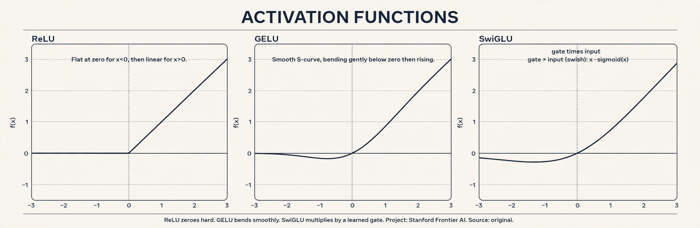
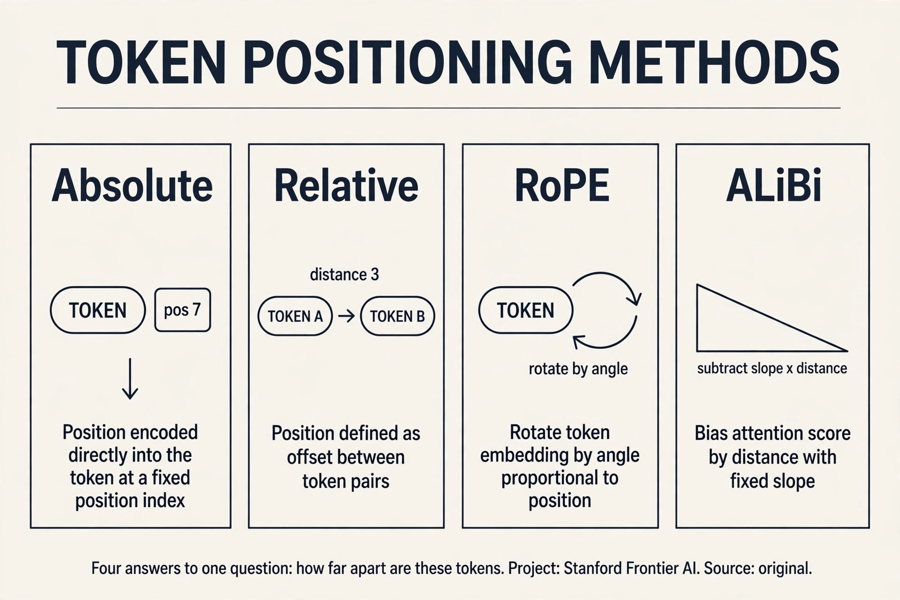
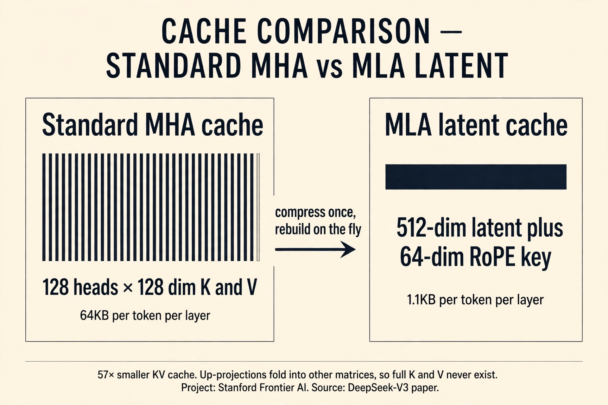
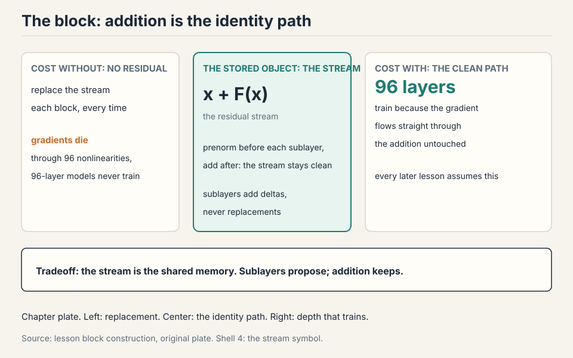
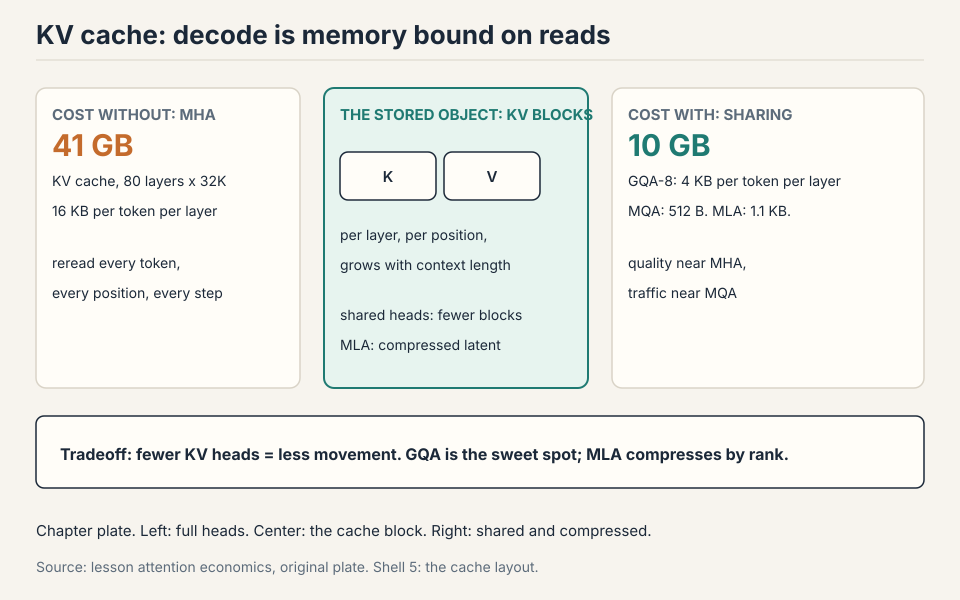
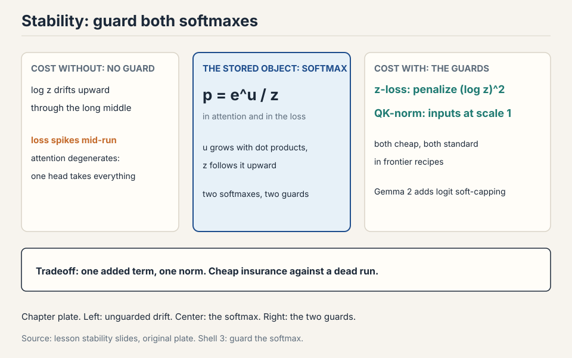

## How to read this lesson

No prerequisites are assumed. Every term is defined at first use.
The chapter builds the transformer block from zero, then surveys what
19+ production models actually kept. The professor's method is a
survey: look at what everyone built, keep what stayed constant, vary
the rest. Theory is thin here. Experience is the guide.

## The problem: one block, repeated

A token arrives as an integer ID. The model must predict the next ID.
Between those two facts sits the whole machine: some function that
reads a sequence of vectors and, at each position, produces a vector
that knows enough to pick the next token.

Modern language models are one block, copied many times. Llama 3 70B
copies it 80 times. GPT-3 copies it 96 times. Every copy has the same
shape. Learn one block and you own the architecture.

## The need: context inside every token

Take the sentence "The counselor helped frame the situation." The
model reads it left to right and must predict "situation" after
"frame the". To pick well, the vector for "frame" must carry its
context: who is doing the framing (the counselor), and what is being
framed (the situation).

A **contextual representation** is a token vector that has absorbed
the other tokens around it. The word "frame" means one thing in
"frame the situation" and another in "he hung the photo frame". Same
token ID, different meaning. The vector must hold the difference.
Everything in this chapter serves that one need.

## The embedding: integers become vectors

Before the block can do anything, integer IDs must become vectors.
Each ID indexes one row of a learned table called the **embedding
matrix**. Token 1169 becomes row 1169: a vector of d_model numbers.
For a model with d_model = 4096, every token starts as a list of
4096 numbers.

Two facts about this step. First, it is learned: the vectors start
random and move during training. Second, it is the same for every
position: position information is not here yet. That is the first gap
the block must fill, and positions get their own section below.

### Subchapter: the unembedding ties the ends together

The last layer reverses the first. The final block's output vector
is multiplied by the **unembedding matrix** (often the transpose of
the embedding matrix, a trick called weight tying) to produce one
score per vocabulary entry. The scores go through a **softmax**,
which turns scores into probabilities: it exponentiates each score
and divides by the total. The model picks the next token from those
probabilities.

Work the shapes. d_model = 4,096, vocab = 128,000. The unembedding
is a 4,096 x 128,000 matrix: 524M parameters, the same size as the
embedding table. With weight tying, the two tables are one table
used twice: the model learns a single mapping between token IDs and
vectors, and reads it in both directions. Without tying, the model
pays the 524M twice.

## Attention, step by step, by hand

Now the core. Each token needs to pull in context from the other
tokens. The mechanism is a lookup. Picture a hash table built from
the sequence. Every token deposits two things: a **key**, a label
saying what it contains, and a **value**, the content it offers.
Every token also forms a **query**, a description of what it needs.
To build the new representation of "frame", compare its query
against every key, and mix the values in proportion to the match.
The best matches contribute the most.

In the lecture's intuition, the new "frame" becomes about 0.25 of
"counselor" plus 0.45 of "helped" plus 0.30 of "situation", with
small bits of the rest. The weights sum to 1. "frame" now carries
its context inside its own vector.

Watch the mechanism on a toy, by hand. Three tokens,
two-dimensional vectors. The projections are identity here so the
arithmetic stays visible. The real model learns the projections.
The mechanism is the same.

```ascii
tokens:  counselor = [1, 0]   helped = [0, 1]   frame = [1, 1]
query for "frame": q = [1, 1]

step 1, scores (dot products of q with each key):
  q . k_counselor = [1,1] . [1,0] = 1
  q . k_helped    = [1,1] . [0,1] = 1
  q . k_frame     = [1,1] . [1,1] = 2

step 2, softmax (turn scores into weights that sum to 1):
  e^1 = 2.72,  e^1 = 2.72,  e^2 = 7.39;  total = 12.83
  weights = [0.21, 0.21, 0.58]

step 3, mix the values:
  new "frame" = 0.21 * [1,0] + 0.21 * [0,1] + 0.58 * [1,1]
              = [0.79, 0.79]
```

Read the result. "frame" pulled 21 percent from "counselor", 21
percent from "helped", and 58 percent from itself. The numbers came
from the data, not from a fixed rule. The query-key match decided
the mix. That is **attention**.

Three properties matter. First, the weights sum to 1, so the output
is a genuine blend, not a sum that grows. Second, every token does
this against every other token at the same time: a matrix multiply,
fully parallel. Third, the path between any two tokens is one step.
"The" and "situation" meet directly, with no chain to dilute the
signal.

### Subchapter: the softmax, one line

The **softmax** exponentiates each score and divides by the total,
so the outputs are positive and sum to 1. Larger scores get much
larger weights: the e^2 = 7.39 dominates the two 2.72s. That
sharpness is the point. Attention picks favorites.

### Subchapter: divide by sqrt(d), or the softmax saturates

One more scaling step lives in the real formula. Before the softmax,
divide the scores by the square root of d, the vector dimension.
Dot products grow with dimension: for random vectors of dimension
d, the spread of the scores grows like sqrt(d). An unscaled softmax
saturates, one weight nears 1, the rest near 0, and learning stalls.
Dividing by sqrt(d) keeps the softmax in its responsive range.
Numerical hygiene, one line, real training effect.

Work it. d = 128. Random q and k with unit variance: the dot
product has variance 128, standard deviation about 11.3. Scores
spread over tens. Softmax of [30, -5, 12]: e^30 dominates, weight 1
on the first token, 0 elsewhere. The model attends to exactly one
token and the gradients through the rest are zero. Divide by
sqrt(128) = 11.3: scores become [2.65, -0.44, 1.06], weights
[0.80, 0.04, 0.16]. The softmax breathes again.

### Subchapter: causal masking, the arrow of time

A language model predicts the next token. During training, it sees
the whole sequence at once. Without a guard, position 5 could attend
to position 8, which is the future: the model would cheat by reading
the answer.

The guard is the **causal mask**: a matrix of negative infinities
above the diagonal, added to the scores before the softmax. e^-inf
is 0, so future positions get zero weight.

```ascii
scores:        mask:          masked:
[1, 2, 3]      [0, -inf, -inf]  [1, -inf, -inf]
[4, 5, 6]  +   [0, 0, -inf]  =  [4, 5, -inf]
[7, 8, 9]      [0, 0, 0]        [7, 8, 9]
```

Row 1 (position 1) sees only itself. Row 2 sees positions 1 and 2.
Row 3 sees all three. The triangle is the arrow of time, enforced
in arithmetic. Every decoder-only model (GPT, Llama, Mistral)
trains with this mask. Encoder models (BERT) skip it: they read the
whole sentence both ways.

### Subchapter: attention costs n squared, worked

The score matrix is n x n. For n = 4,096: 16.8M scores. For n =
131,072: 17.2B scores. In bf16, that is 34 GB for one head, one
layer, one sequence. Times 32 heads: over a terabyte. The n^2 term
is why long context is expensive, why FlashAttention exists, and
why the next lecture changes the complexity class.

Work the FLOPs too. QK^T costs 2 x n^2 x d. At n = 131,072 and d =
128 per head: 2 x 1.7e10 x 128 = 4.4e12 FLOPs per head per layer.
Times 32 heads, times 80 layers: 1.1e16 FLOPs per forward pass of
one sequence. The 6ND rule from the last lecture ignores this term.
At 128K context, the term is the budget.

> [!QA]
> Q: What do the query, key, and value actually mean?
> A: Three views of the same token, made by three learned projections. The key says what the token contains. The query says what the token is looking for. The value is the content the token offers if chosen. Attention compares each query against all keys, turns the matches into weights, and mixes the values by those weights. In the worked toy, "frame" with query [1,1] matched keys with scores [1,1,2], giving weights [0.21, 0.21, 0.58] and a new vector [0.79, 0.79].
> Follow-up: Why three projections instead of comparing tokens directly?
> A: "What I need" and "what I contain" are different jobs. A token might need context about verbs while containing noun information. Separate learned projections let the model specialize each role. With one shared representation the query and key spaces would be forced identical, which limits what matches can be expressed.

> [!QA]
> Q: Why does the causal mask use negative infinity and not zero?
> A: Because the mask is added before the softmax, and softmax exponentiates. Adding 0 would leave the score unchanged: e^score still contributes. Adding negative infinity makes e^-inf = 0, which zeroes the weight exactly. The mask must kill the future, not just ignore it. Zero would be a no-op. Negative infinity is the off switch.
> Follow-up: What breaks if you forget the mask during training?
> A: The model cheats. Position 5 attends to position 8, reads the future token, and predicts it perfectly. Training loss collapses to near zero. At inference time there is no future to read, and the model fails completely. The symptom is unmistakable: near-zero training loss with garbage generation. The mask is the difference between a language model and a lookup table.

## Multi-head attention: many lookups in parallel

One attention lookup can only express one kind of match. "frame"
might need its verb from "helped" and its object from "situation"
at the same time. **Multi-head attention** runs several attentions
in parallel, each on a slice of the vector.

Take d_model = 4096 and 32 heads. Split every token's vector into
32 slices of 128 numbers each. Head 1 runs attention on slice 1,
head 2 on slice 2, and so on. Each head has its own learned
projections, so each head can learn a different matching pattern:
one head might track subjects, another might track positions, a
third might track objects. Then concatenate the 32 outputs back
into a 4096-vector and project once more.

The cost of the split is zero extra arithmetic: 32 small attentions
cost the same as one big one. The gain is representational: the
model gets 32 independent channels of context instead of one.

### Subchapter: what heads actually learn

Heads specialize, and the specializations have names. **Induction
heads** are the famous one: they look for the pattern [A][B] ...
[A] and predict [B]. Given "the cat sat on the" earlier and "the
cat" now, the induction head predicts "sat". This single mechanism
explains much of in-context learning: the model copies patterns
from the prompt.

Other documented heads: previous-token heads (attend to position
i-1, building bigrams), subject heads (link verbs to their
subjects across clauses), and duplicate-token heads (notice when a
token appeared before). Not every head is interpretable. But enough
are that "heads specialize" is an empirical fact, not a hope.

### Subchapter: the head dimension sits in a flat basin

The survey found head dims that multiply back to d_model sit in a
wide flat basin: the exact split matters little as long as the
total is preserved. 128 is the common choice (4096 / 32). The
hardware likes it too: 128 divides the tensor-core tile sizes
cleanly. Pick 128 unless you have a reason not to.

> [!QA]
> Q: Why split into heads instead of one big attention?
> A: One attention computes one query-key match pattern per token. Language needs several at once: syntax, coreference, position, topic. With 32 heads each head can specialize in a different pattern while sharing the same compute budget, since 32 small matmuls cost the same as one large one. Empirically, heads do specialize: some track the previous token, some track subjects, some spread broadly.
> Follow-up: What is the head dimension in practice?
> A: 128 is the common choice (4096 / 32). The survey found head dims that multiply back to d_model sit in a wide flat basin: the exact split matters little as long as the total is preserved.

## The residual stream: a highway through the block

Attention rewrote the token vectors. But the block must not lose
what it had before. The **residual stream** is the design that
protects it: add the sublayer's output back to its input.

```ascii
x_out = x_in + sublayer(x_in)
```

Work it on a toy. x = [1.0, 0.0]. The attention sublayer returns
[0.0, 0.5]. The output is [1.0, 0.5]. The original 1.0 survived
the addition untouched. The sublayer can only nudge the stream,
never replace it.

This shape does two jobs. Forward, information never gets trapped:
the input is always present in the output. Backward, gradients flow
straight through the addition. The gradient of the loss with respect
to x_in is the gradient with respect to x_out times 1, plus the
sublayer's term. That clean path through the addition is what keeps
gradients alive across 80 or 96 stacked blocks. Without it, deep
networks stall.

### Subchapter: the stream as shared memory

The residual stream runs the full depth of the model. Each block
reads from it, computes, and adds its result back. Think of it as a
highway with on-ramps at every block. Nothing ever has to exit.

This view explains a subtle fact: later blocks can read features
written by much earlier blocks, because the additions accumulate.
The stream is the model's shared memory. Attention writes
contextual information into it. The MLP writes computed features
into it. The final unembedding reads the accumulated result. The
block is not a pipeline of transformations. It is a sequence of
edits to a shared document.

> [!QA]
> Q: Why add instead of replacing the vector?
> A: Replacement would force each block to re-encode everything the earlier blocks learned, and gradients would have to pass through every block's nonlinearities to reach the bottom. Addition creates a clean identity path: the original signal is always present, and the gradient flows straight through the addition untouched. This is what lets 96-layer models train at all.
> Follow-up: Could the additions blow up the vector magnitudes over 96 blocks?
> A: In principle yes, which is why normalization exists (next section). In practice the sublayer outputs stay small relative to the stream, and the norm keeps them bounded. The empirical record is clear: residual networks train, non-residual deep networks do not.

## Normalization: keep the vectors calm

Attention and the MLP do large matrix multiplies. Their outputs can
have any scale. Feed unscaled vectors into 96 stacked blocks and the
numbers drift: each block multiplies the scale, and by block 50 the
activations are enormous or tiny. **Normalization** rescales each
vector to a calm, predictable scale before the next block reads it.

### Subchapter: LayerNorm, worked

**LayerNorm** is the original. For a vector v of d numbers, subtract
the mean, divide by the standard deviation, then multiply by a
learned scale and add a learned bias.

Work it on [2, 4, 6, 8]. The mean is 5. The variance is 5, so the
standard deviation is about 2.24. Subtract and divide: [2-5, 4-5,
6-5, 8-5] / 2.24 = [-1.34, -0.45, 0.45, 1.34]. The output has mean 0
and spread 1, whatever the input was. Every block now receives
vectors at the same scale.

### Subchapter: prenorm moves it out of the stream

Where the norm sits matters as much as what it computes. The
original transformer placed it inside the residual stream: add
first, then normalize the sum. Every modern model moved it out. The
norm now sits before each sublayer, outside the stream. This is
**prenorm**.


Why everyone agrees: the residual stream runs untouched from input
to output, so gradients propagate straight through in the backward
pass with constant size. Under postnorm, each block rescales the
stream and gradient norms drift, which causes spikes and needs
warmup to converge. The practitioner's rule is simple: keep your
residual stream clean. Some models (Grok, Gemma 2, OLMo 2) put the
norm after the sublayer computation instead of before: still outside
the stream, equally valid by the same logic.

### Subchapter: RMSNorm drops the mean and the bias

**RMSNorm** divides by the root mean square and scales. No mean
subtraction, no bias term.


Work it on [2, 4, 6, 8]. The rms is sqrt((4+16+36+64)/4) =
sqrt(30), about 5.48. Divide: [0.36, 0.73, 1.10, 1.46]. Compare
LayerNorm's [-1.34, -0.45, 0.45, 1.34]. Same ballpark, one less pass
over the vector. Models train just as well: the mean subtraction
bought expressiveness on paper, not in practice. It is a free
systems win.

The systems reason it matters: normalization is 0.17 percent of
FLOPs, yet up to 25 percent of runtime on small models. The workload
is memory movement: read the vector, compute a mean, write it back.
The chip waits on bits, not math. Bias terms in linear layers die by
the same logic: memory traffic for almost no gain.

> [!QA]
> Q: Why did every lab switch from postnorm to prenorm?
> A: Postnorm places LayerNorm inside the residual stream, so each block rescales the stream and gradient norms drift as they flow backward. This causes gradient spikes and requires warmup to converge at all. Prenorm keeps the stream untouched, so gradients propagate straight through with constant size. Training is more stable and converges without warmup. The one exception in the survey is OPT-350M, and OPT was widely regarded as unstable.
> Follow-up: If outside the stream is what matters, why prenorm instead of post-computation norm?
> A: Both satisfy the clean-stream principle, and both are used: Grok, Gemma 2, and OLMo 2 normalize after the sublayer computation. The choice between them is second-order. What is not second-order is keeping the norm out of the residual path itself.

## The MLP: per-position computation

Attention mixes information across positions. The **MLP** (also
called the feedforward layer) does the other job: per-position
computation. Each token's vector goes through two matrix multiplies
with an activation between them, alone, no mixing with neighbors.

```ascii
mlp(x) = down( activation( up(x) ) )
```

Up projects from d_model to a wider ff dim (classically 4x
d_model). The activation applies elementwise. Down projects back to
d_model. The widening gives the network room: a 4096-vector expands
to 16384, gets transformed, and compresses back. Two-thirds of the
model's parameters typically live in these MLPs, which is why the ff
dim ratio is one of the most-scrutinized numbers in the survey.

### Subchapter: the MLP holds the knowledge

Attention moves information between positions. The MLP stores it.
The evidence: editing one MLP's weights changes what the model
"knows" (a fact about a person, a definition), while editing
attention changes how it reasons. The MLP's up-projection acts like
a key-value memory: the up matrix detects patterns, the down matrix
writes the associated content.

Work the parameter share. d_model = 4,096, ff = 16,384. Up:
4,096 x 16,384 = 67M. Down: 16,384 x 4,096 = 67M. Per layer:
134M. Attention QKVO at 32 heads: 4 x 4,096 x 4,096 = 67M. The MLP
is 2x the attention per layer. Times 80 layers: the MLPs hold about
10.7B of a 16B model. When MoE replaces the MLP (next lecture), it
is replacing two-thirds of the model.

### Subchapter: the activation ladder, ReLU to SwiGLU

**Rung 0: ReLU.** relu(x) = max(0, x). On [-2, -1, 0, 1, 2] it gives
[0, 0, 0, 1, 2]. Negatives are killed hard. The gradient is 0 or 1,
nothing between. Simple, but dead neurons never recover.

**Rung 0.1: GELU.** gelu(x) = x times the Gaussian CDF of x. On the
same five numbers: [-0.046, -0.159, 0, 0.841, 1.955]. Small
negatives pass through, scaled down. The curve is smooth everywhere,
so the gradient is never exactly zero. One new idea: replace the
hard corner with a smooth bend. GPT-2, GPT-3, and BERT use GELU.

**Rung 0.12: SwiGLU.** SwiGLU(x) = (xW1) elementwise-times silu(xV),
then down-project. The gate silu(xV) is learned and input-dependent:
the network decides per unit, per token, how much passes. One new
idea: replace the fixed curve with a learned gate. Shazeer's
ablations show GLU variants beat GELU at matched parameter counts.
Llama, Mistral, and DeepSeek use SwiGLU. Google uses GeGLU (same
gate, GELU as the curve) in Gemma and T5.

The ladder: fixed switch, smooth curve, learned gate. Each rung
keeps the rung below and adds one mechanism.



### Subchapter: the 2/3 rule for gated MLPs

A **gated linear unit** adds a gate: take xW, apply the activation,
and multiply elementwise by a second projection xV. Then
down-project. Three matrices instead of two means more parameters at
the same width. The rule of thumb: shrink the feedforward dim by 2/3
to keep the parameter count matched.

Work it. d_model = 4,096. Plain MLP at 4x: ff = 16,384, params =
2 x 4,096 x 16,384 = 134M. Gated at 4x: 3 x 4,096 x 16,384 = 201M.
Shrink ff to 2/3: ff = 10,922, params = 3 x 4,096 x 10,922 = 134M.
Matched. Shazeer's ablations show GLU variants consistently beat
non-gated ones at matched parameter counts. Gating is close to a
free win.


### Subchapter: serial blocks beat parallel blocks

The standard block is serial: attention, then MLP, each adding into
the stream. GPT-J and PaLM tried parallel blocks: attention and MLP
read the same input and add their outputs together, which allows
sharing the norm and fusing matmuls.

```ascii
serial:    x -> attn -> (+) -> mlp -> (+) -> out
parallel:  x -> attn -+-> (+) -> out     (norm shared, matmuls fused)
           x -> mlp  --+
```

Parallel fell out of favor. Serial optimization got good enough that
the systems gain was not worth the representation cost: parallel
blocks effectively halve your depth.

## Where the original block breaks

The original 2017 block works. It trains. It generates. But six
cracks showed up as models scaled, and each one got a worked
demonstration from the survey of 19+ models.

**Crack 1: postnorm gradients drift.** The norm inside the stream
rescales the residual path at every block. Gradient norms drift
backward, spikes appear, and training needs warmup to converge at
all.

**Crack 2: LayerNorm costs runtime, not FLOPs.** Normalization is
0.17 percent of FLOPs, yet up to 25 percent of runtime on small
models. The workload is memory movement.

**Crack 3: the MLP has no gate.** A plain activation treats every
hidden unit the same. The network cannot modulate units by learned,
input-dependent amounts.

**Crack 4: attention is permutation invariant.** Shuffle the tokens
and the scores do not change: nothing in the attention formula knows
about order. The original added absolute position embeddings, but
those bake position indices into the vectors. A model trained on
2048 positions has no embedding for position 3000, so longer inputs
break.

**Crack 5: softmax blows up mid-training.** Both softmaxes, the
output and the attention, exponentiate and divide. A slightly large
logit becomes an astronomically large numerator. Million-dollar runs
spike halfway through.

**Crack 6: decode drowns in KV reads.** During generation, each new
token needs the keys and values of all previous tokens. Those get
reread from memory every step. The arithmetic intensity collapses,
and the KV cache, not the compute, sets the speed.

## The key question

The original block works, and every one of its choices has a crack.
What if each choice gets re-examined against what 19+ models
actually did, keeping what stayed constant and changing what broke?
That is the survey. Here is what it found.

## RoPE: position via rotation

The design goal: the score between two tokens should depend only on
their relative distance, never on absolute position. Inner products
are invariant to rotation. So rotate each token's vector by an angle
proportional to its position. Two tokens one apart always differ by
one rotation step, wherever they sit.


Work the toy in 2D. Token A at position 0: vector [1, 0], angle 0.
Token B at position 1: rotate by 30 degrees, [cos 30, sin 30] =
[0.87, 0.50]. The inner product is 1 x 0.87 + 0 x 0.50 = 0.87 =
cos(30). Now shift both tokens one position right: A at 30, B at 60.
The inner product is cos(60 - 30) = cos(30) = 0.87. Identical. Only
the difference survived. That is the whole trick.

In d dimensions, split the vector into pairs and rotate each pair at
its own frequency. Slow pairs capture long-range dependence. Fast
pairs capture adjacency. Apply the rotations to queries and keys at
every attention layer. Crucially, RoPE multiplies by sines and
cosines instead of adding them, so no cross terms leak absolute
position.

### Subchapter: the frequencies, worked

RoPE's frequencies follow a geometric schedule. For head dim 128,
pair i (0 to 63) rotates at theta_i = base^(-2i/128). With base
10,000: pair 0 spins at theta = 1 radian per position (full turn
every 6.3 positions), pair 63 spins at 10,000^(-126/128) = 0.00012
radians per position (full turn every 54,000 positions).

The fast pairs resolve adjacency: positions 1 apart differ by a
large angle. The slow pairs resolve distance: positions 50,000
apart still differ by a measurable angle on the slowest pairs. This
is why raising the base extends context: Llama 3 raised the RoPE
base to 500,000, which slows every pair and stretches the distance
the rotations can resolve. Longer context, one number changed.

### Subchapter: the position zoo

RoPE is one answer to the order question. The full family has four
members. Each adds one idea on the previous one.

**Absolute.** Add a learned vector for position i to token i. One
vector per position, learned during training. GPT-2 and BERT use
this. The limit: a model trained on 2,048 positions has no vector
for position 3,000. Longer inputs break. Work the cost. GPT-2:
1,024 positions x 768 dims = 786,432 learned numbers, one table.
And the hard limit: position 1,025 has no vector at all. Feed a
longer input and the lookup fails.

**Relative bias (T5).** Stop adding position to the tokens. Instead,
add a learned bias to each attention score based on the distance i -
j. The scores carry distance directly. One new idea: position lives
in the scores, not the vectors. Work the cost. T5 keeps 32 distance
buckets. 12 heads x 32 buckets = 384 learned biases per layer,
against 786,432 for GPT-2's absolute table. Distances past 128 share
the last bucket: the model treats distance 200 and distance 2,000 as
the same.

**RoPE.** Rotate Q and K by an angle set by position. One new idea:
encode distance as rotation, which makes the score a pure function
of relative angle. No position parameters at all. Llama, Mistral,
Qwen, DeepSeek, and Gemma all use RoPE.

**ALiBi.** Skip learned positions and rotations both. Subtract m
times (i - j) from each score: a fixed linear penalty, with a
head-specific slope m. One new idea: distance as a fixed penalty
needs no parameters and never runs out. BLOOM and MPT use ALiBi.
The price: the penalty is fixed, so the model cannot learn to attend
far when it wants to. Work the penalty. 8 heads: slopes 1/2, 1/4,
down to 1/256. Distance 10: head 1 subtracts 10 x 1/2 = 5.0, so its
attention weight shrinks by e^5, about 148x. Head 8 subtracts
10/256 = 0.04, barely a touch. The slopes, not training, decide how
far each head looks.

The ladder: identity, score bias, rotation, fixed penalty. RoPE won
the frontier because it keeps full expressiveness with zero
parameters. ALiBi wins when extrapolation matters more than
flexibility.



> [!QA]
> Q: Why did RoPE replace absolute position embeddings?
> A: Absolute embeddings bake position indices into the token vectors, so the model must learn every position separately and cannot generalize past the trained length cleanly. RoPE encodes only relative distance through rotation, which generalizes to new positions by construction and adds no parameters. Since 2024 nearly every new model uses it or a variant.
> Follow-up: Why multiply by sines and cosines instead of adding them like the original transformer?
> A: Adding creates cross terms between the position embedding and the word embedding, and from those cross terms the model can recover absolute position. Multiplying rotates the vector, which keeps the inner product purely a function of relative angle. That is the entire trick.

## Hyperparameters that forgive

Three ratios and one size decision cover nearly every model. All have
wide basins: defaults win, and only FLOPs truly move the needle.


### Subchapter: feedforward ratio 4x

ff dim = 4 x d model. GLU variants use about 2.67x after the 2/3
correction. Llama multiplied by 1.33x to about 3.5x because
efficient attention freed budget for the MLP. T5 tried 64x for
hardware efficiency, then quietly returned to 2.5x in v1.1.
Kaplan's sweep shows a flat basin from 1x to 10x.

### Subchapter: aspect ratio near 100

d model divided by n layers lands near 100 for GPT-3, Llama, and
most modern models. Wide models parallelize cleanly with tensor
parallelism. Deep models force pipeline parallelism, which everyone
avoids. EK et al. found that sweeping depth-vs-width mostly measures
FLOPs: bigger compute wins regardless of shape.

### Subchapter: vocabulary follows language coverage

Monolingual English models used ~30k. Multilingual production models
use 100k-200k. Bigger models can carry bigger vocabs. Side note on
comparisons: bits per byte is always a valid metric across
tokenizers, because modern tokenizers are complete (nothing dropped)
and bytes are the fixed normalizer.

> [!QA]
> Q: How do you pick hyperparameters for a new training run?
> A: Do not search from scratch. Copy the consensus: ff dim 4x (2.67x for GLU), head dims multiplying to d model, aspect ratio ~100, vocab sized to language coverage. These sit in wide flat basins, so small deviations cost little. Spend your experimentation budget on one thesis at a time, usually an architecture change, not on re-tuning forgiving ratios. What actually moves loss is total FLOPs, not the shape.
> Follow-up: T5 used 64x ff dim and worked. Why not copy that?
> A: It worked but was compute-inefficient: the matrices were oversized for the gain. T5 v1.1 reverted to 2.5x, which tells you what the authors concluded. Bold deviations can train, but the basin around 4x is where efficiency lives.

## Weight decay is an optimizer, not a regularizer

Language models train single-pass: more internet data than FLOPs, so
the model never sees most data twice. Overfitting barely happens.
Dropout has mostly died out. Yet weight decay remains popular. Why?

Because it is not regularizing. It interacts with the optimizer:
stronger weight decay with learning-rate decay converges to a better
minimum, even though train and validation loss track each other the
whole way. Shrinkage toward zero lets you use higher learning rates
or decay faster. The lesson: in deep learning, knobs interact in ways
ML-101 intuition does not predict. Test, do not assume.

### Subchapter: initialization, the forgotten first step

Weights start random, and the scale of the random matters. The
standard: initialize with standard deviation 0.02, sometimes scaled
down by layer depth (deeper layers get smaller init so the residual
additions do not blow up the stream).

Work why. The residual stream adds 96 sublayer outputs. If each
sublayer output has variance v, the stream variance after 96 blocks
is 96v (variances add for independent terms). To keep the final
scale near 1, each sublayer should start with variance about 1/96.
Small init is not a detail: it is what keeps the stream calm before
the norms take over. Some labs scale the init by 1/sqrt(2L)
explicitly. The lecture's survey treats init as settled: small,
depth-aware, then let training move it.

## Stability, three interventions

Training can blow up halfway through a million-dollar run. The usual
suspect is softmax: an exponential plus a division, in two places
(the output and attention).

### Subchapter: z-loss tames the output softmax

The log normalizer log z can drift far from zero even when model
outputs look fine. Add c x (log z)^2 to the loss: penalize the
drift, keep z near 1.

^2. Source: lecture stability slides.")

Work it. Logits [3, 1, 0]. z = e^3 + e^1 + e^0 = 20.09 + 2.72 + 1 =
23.81. log z = 3.17. z-loss adds c x 10.05 to the loss. The
optimizer pushes the logits down until log z nears 0, which keeps
every later exponentiation in a safe range. The typical c is tiny
(1e-4): the penalty is a guardrail, not a target.

### Subchapter: QK norm tames attention

LayerNorm the Qs and Ks before they multiply, so the softmax inputs
sit at scale ~1. Borrowed from multimodal models (Idefics,
Chameleon), now standard in large LMs, with no measured performance
cost.


Work why it helps. Q and K with norm 10: dot products near 100
before the sqrt(d) division, near 9 after. Softmax of [9, 2, 1]:
weights [0.999, 0.001, 0.000]. Attention collapses to one token and
the gradients through the rest vanish. QK norm keeps the norms near
1: dot products near 1, softmax responsive, gradients alive. One
norm, two projections, the collapse never happens.

### Subchapter: logit soft-capping, the strong version

**Logit soft-capping** is the strong version: tanh-cap attention
logits so they can never grow large (Gemma 2/3). Very safe, but it
clips confident signals and measurably costs quality. QK norm gives
the stability without the tax. The order to try: z-loss first, QK
norm second, soft-capping last.

> [!QA]
> Q: Your loss curve shows sudden spikes mid-training. What do you try, in order?
> A: First, check whether the spikes come from attention or the output: both have softmaxes with exp and division. Add z-loss to pin the output normalizer near zero. Add QK norm so attention softmax inputs stay at scale 1. Both are cheap and cost no quality. Reach for logit soft-capping only if those fail, knowing it caps expressiveness. And remember the standing rule: sprinkle LayerNorms at the instability until it stops.
> Follow-up: Why is softmax the danger zone and not the matmuls?
> A: Matmuls are linear: large inputs give proportionally large outputs, and norms stay predictable. Softmax exponentiates, so a slightly large logit becomes an astronomically large numerator, and then it divides by a sum that can underflow toward zero. Both directions explode. That is why both softmaxes get dedicated interventions.

## GQA, because decode is memory bound

Serving pays for FLOPs and for memory accesses. During prefill and
training, intensity is healthy. During decode, each step generates
one token: the KV cache must be re-read every step, and the
arithmetic intensity collapses. Small models with long contexts
suffer most.

### Subchapter: MQA, the extreme

Multi-Query Attention shares one K head and one V head across all
query heads. The KV cache shrinks by the head count, memory traffic
drops, but expressiveness drops too. One new idea: share everything.
The bill shrinks 32x. The quality drops: every query head reads the
same keys.

### Subchapter: GQA, the sweet spot

Grouped-Query Attention is the middle: G groups of KV heads shared
across all query heads. Near-MHA quality at near-MQA inference cost.

Work the numbers. d_model = 4096, 32 heads, head dim 128, bf16 (2
bytes). KV cache per token per layer: 2 (K and V) x heads x 128 x 2
bytes. MHA with 32 KV heads: 16 KB per token per layer. GQA with 8
KV heads: 4 KB. MQA with 1 KV head: 512 bytes. At 80 layers and 32k
context: MHA holds 41 GB of KV cache. GQA-8 holds 10 GB. The decode
step rereads all of it, every token.


### Subchapter: MLA compresses by rank, not by heads

**MLA (DeepSeek)** compresses all KV into one 512-dim latent per
token, then reconstructs per-head K and V on the fly. One new idea:
compress by rank instead of by head count. The up-projections fold
into the query matrix and the output matrix, so full K and V never
materialize. The cache holds the latent, not 128 separate vectors.

Work MLA's numbers for DeepSeek-V3's own config (d = 7,168, 128
heads, head dim 128). MHA cache: 2 x 128 x 128 x 2 bytes = 65,536
bytes = 64 KB per token per layer. MLA cache: 512-dim latent plus a
64-dim decoupled RoPE key = 576 dims x 2 bytes = 1,152 bytes, about
1.1 KB. That is 57x smaller. The RoPE stream is decoupled because
rotation does not survive the low-rank compression: rotary
embeddings need the full per-head vectors, so they ride alongside
the latent in their own small stream.

The ladder: full heads, one shared head, grouped heads, compressed
latent. Each step keeps the attention math and shrinks what gets
stored. Linear attention (L04) is the step that changes the math
itself.



> [!QA]
> Q: GQA-8 cuts the KV cache 4x. Why not always use fewer KV heads?
> A: Because expressiveness drops with the head count. MQA (1 KV head) shows the limit: every query head reads the same keys, and quality degrades on tasks that need diverse attention patterns. GQA-8 is the empirical sweet spot: 4x smaller cache at near-MHA quality. The conversion from MHA is cheap (uptrain ~5% of pretraining compute), which is why Llama 3, Mistral, and Gemma all landed there.
> Follow-up: When does MLA beat GQA?
> A: When the KV cache must shrink far more than 4-8x. MLA's 57x compression (on DeepSeek-V3's config) enables contexts and batch sizes GQA cannot reach. The price is complexity: the decoupled RoPE stream and the folded projections are harder to implement and serve. GQA is the default. MLA is the answer when the cache is the binding constraint.

## Sliding window attention

Full attention costs n^2. Sliding window restricts each position to a
fixed local window. GPT-3 alternated full and banded layers. The idea
returned because long context is the current frontier.

```ascii
layers:  F  W  W  W  F  W  W  W  F
         |  |  |  |  |  |  |  |  |
window:  *  w  w  w  *  w  w  w  *     F = full, W = window
```

Every fourth layer attends globally. The rest attend locally. Local
layers aggregate into the global ones as you go up, so the top of the
network still sees everything. Gemma 2 uses this local-global
alternating pattern. Qwen3.5 swaps the window layers for a gated delta
net (a state-space layer, next lecture) in the same alternating
skeleton. Long-context architecture is still the most active design
space in the field.

### Subchapter: the window math

Window size w = 4,096. Each position attends to 4,096 previous
positions, not n. The cost per layer: 2 x n x w x d instead of 2 x n^2
x d. At n = 128K: the windowed cost is 32x smaller. The KV cache for
windowed layers holds only w positions: 4,096 x 4 KB (GQA-8) = 16 MB
per layer instead of 512 MB. The full layers every fourth carry the
global bill. The pattern trades a constant fraction of global layers
for a large constant saving.

## What is used where: the architecture census

Every production model is a row in the survey table. The facts below
are verified against public papers and model cards as of October
2026. Anything not public is marked unknown.

| Model | Attention | Position | Norm | MLP | Source |
|---|---|---|---|---|---|
| Llama 3 | GQA, 8 KV heads | RoPE, base 500k | RMSNorm, prenorm | SwiGLU | Llama 3 paper |
| Mistral 7B | sliding window 4K + GQA-8 | RoPE | RMSNorm, prenorm | SwiGLU | Mistral release docs |
| DeepSeek-V3 | MLA, 512-dim latent | decoupled RoPE | RMSNorm, prenorm | MoE SwiGLU | DeepSeek-V3 paper |
| Kimi K2 | MLA | RoPE | RMSNorm, prenorm | MoE (384 experts) | Kimi K2 report |
| Qwen3-235B | GQA | RoPE | RMSNorm + QK-norm, prenorm | MoE SwiGLU, no shared expert | Qwen3 report |
| Gemma 2 | local-global alternating + GQA | RoPE | RMSNorm, pre+post | GeGLU | Gemma 2 paper |
| GPT-4 | unknown | unknown | unknown | unknown | not public |

Read the convergence. Every open model uses RMSNorm, prenorm, RoPE,
and a gated MLP. The differences are all in the attention column:
that is where the KV cache bill lives, and that is where the labs
still disagree. Gemma 2 is the outlier on norms (sandwich: pre and
post) and on stability (logit soft-capping). DeepSeek is the outlier
on attention: MLA compresses by rank where everyone else shares
heads. Qwen3 dropped the shared expert and added QK-norm: the
DeepSeek recipe is not the only answer.

The survey table above is the figure: every production model is a row.

### Subchapter: DeepSeek-V3, the full config worked

The census row for DeepSeek-V3, expanded into a parameter count. From
the technical report: 61 layers, hidden dim 7,168, 128 heads, head
dim 128. MoE in 58 layers: 1 shared expert + 256 routed experts,
expert intermediate dim 2,048, top-8 routed active.

```ascii
attention per layer:  QKV + out projections ~ 4 x 7168 x 7168 = 205M
  (MLA compresses the KV, so this is approximate)
MoE per layer:       257 experts x 3 x 7168 x 2048 = 11.3B
  (SwiGLU: 3 matrices per expert)
58 MoE layers:       58 x 11.3B = 655B
3 dense layers:      3 x 3 x 7168 x 18432 = 1.2B
embeddings:          128K x 7168 x 2 bytes = 1.8 GB ~ 0.9B params
total:               ~671B, of which 37B active per token
```

The arithmetic lands on the reported 671B. The active count: 8
routed experts plus 1 shared per layer, 58 layers: 9 x 3 x 7168 x
2048 x 58 = 23B, plus attention and dense: ~37B. The census is not
just names. It is checkable numbers.

## Mapping back: what each verdict fixes

Each survey verdict answers one crack, by name:

| Crack | Verdict | How |
|---|---|---|
| Postnorm gradients drift | Prenorm | Norm leaves the residual stream. The stream runs untouched, gradients flow straight through. |
| Norms cost runtime, not FLOPs | RMSNorm, no biases | Drop the mean and the bias. Same modeling power, less memory traffic. |
| Plain activations, no gate | SwiGLU / GeGLU | A learned gate modulates each unit. Consistent gains at matched parameters. |
| Permutation invariance | RoPE | Rotate by position. Scores depend only on relative distance. No parameters, generalizes past training length. |
| Softmax blowups | z-loss, QK norm | Pin the output normalizer near zero. Keep attention softmax inputs at scale 1. |
| Decode drowns in KV reads | GQA | Share KV heads across query groups. Cache shrinks 4x at 8 groups. |
| n^2 at long context | Sliding window | Local layers plus a global layer every fourth. The top still sees everything. |
| Init blows up the stream | Depth-aware small init | 1/sqrt(2L) scaling keeps 96 additions calm. |

## The honest price

The survey method has a limit, and the lecture states it. There is no
VC-dimension-style theory here. Nobody proved prenorm optimal or RoPE
correct. The verdicts are empirical: they survived because models that
used them trained well and models that did not hit the cracks. A
closed lab may have found something different and stayed silent.

Every fix also has its own tax. Soft-capping is safe but clips
confident signals and measurably costs quality. Sliding windows push
global reasoning to every fourth layer. The hyperparameter basins are
wide but flat: copying defaults is safe, not optimal. And the deepest
caveat: architecture explains a fraction of final quality. Data and
FLOPs move the loss more than any block choice. The block just has to
not break.







## Recap: the whole lesson on one screen

The story in eight steps. Each step answers the one before it.

1. **One block, repeated.** Every modern LM is one block copied 80 to
   96 times. Tokens enter as vectors. Each block must give every token
   a contextual representation.
2. **Attention mixes context.** Queries meet keys, weights mix values.
   "frame" = 0.21 counselor + 0.21 helped + 0.58 self = [0.79, 0.79].
   Causal mask enforces the arrow of time. Cost is n^2.
3. **Multi-head splits the work.** 32 heads on 32 slices. Induction
   heads explain in-context copying. Zero extra arithmetic.
4. **The residual stream protects.** x_out = x_in + sublayer(x_in).
   The stream is shared memory: every block reads and edits it.
   Gradients flow straight through the addition.
5. **Norms keep vectors calm.** RMSNorm drops the mean and bias: same
   power, less memory traffic. Prenorm keeps the stream clean.
   Init small and depth-aware.
6. **The MLP computes per position.** Up, activate, down. SwiGLU adds
   a learned gate: shrink ff by 2/3 to match params. The MLP holds
   two-thirds of the parameters and most of the knowledge.
7. **RoPE encodes relative position.** Rotate Q and K by position.
   Inner products depend only on distance. Frequencies span adjacency
   to 50K+ positions. Multiply, do not add.
8. **Stability and serving close the loop.** z-loss pins the output
   softmax. QK norm steadies attention. GQA shrinks the KV cache 4x.
   MLA compresses 57x by rank. Sliding windows alternate local and
   global layers.

## Go deeper

<div style="position:relative;padding-bottom:56.25%;height:0;overflow:hidden;max-width:100%;margin:16px 0;">
<iframe style="position:absolute;top:0;left:0;width:100%;height:100%;" src="https://www.youtube-nocookie.com/embed/lVynu4bo1rY" title="Stanford CS336 Spring 2026 Lecture 3: Architectures" frameborder="0" allow="accelerometer; autoplay; clipboard-write; encrypted-media; gyroscope; picture-in-picture" allowfullscreen></iframe>
</div>
- Lecture 3, the session this chapter follows (the embed above): https://www.youtube.com/watch?v=lVynu4bo1rY

<div style="position:relative;padding-bottom:56.25%;height:0;overflow:hidden;max-width:100%;margin:16px 0;">
<iframe style="position:absolute;top:0;left:0;width:100%;height:100%;" src="https://www.youtube-nocookie.com/embed/kCc8FmEb1nY" title="Karpathy: Let's build GPT, from scratch, in code" frameborder="0" allow="accelerometer; autoplay; clipboard-write; encrypted-media; gyroscope; picture-in-picture" allowfullscreen></iframe>
</div>
- Karpathy, Let's build GPT (the embed above): https://www.youtube.com/watch?v=kCc8FmEb1nY
- Vaswani et al., Attention Is All You Need: https://arxiv.org/abs/1706.03762
- Su et al., RoFormer: Rotary Position Embedding: https://arxiv.org/abs/2104.09864
- Shazeer, GLU Variants Improve Transformer: https://arxiv.org/abs/2002.05202
- Ainslie et al., GQA: https://arxiv.org/abs/2305.13245
- DeepSeek-V3 Technical Report: https://arxiv.org/abs/2412.19437

## Official sources and further reading

**Official:**
- Lecture 3 video and slides: the 19-model survey table this chapter
  follows.
- Vaswani et al. (2017): the original transformer. Postnorm inside the
  residual stream.
- Shazeer (2020): GLU variants with parameter-matched ablations.
- Su et al. (2021): RoFormer, the RoPE paper.

**Further reading:**
- Kaplan et al. (2020): scaling laws with the hyperparameter sweeps
  (ff ratio basin, aspect ratio): https://arxiv.org/abs/2001.08361
- Ainslie et al. (2023): GQA, the inference-quality trade-off.
- Elhage et al., induction heads and in-context learning: https://arxiv.org/abs/2209.11895

**Caveats from these sources.** The survey reflects open models up to
early 2026. Closed labs may differ silently. Parallel-vs-serial has no
clean controlled ablation: the field's verdict is implicit (later
Google models dropped parallel). Soft-capping numbers come from Gemma
reports. The quality tax is real but workload-dependent.
Bits-per-byte comparisons assume complete tokenizers. Kimi K2 and
Qwen3 details are from their public reports.

## Connections to the other courses

- **CS224N:** the vanilla transformer and absolute/sinusoidal
  positions. This lecture is the diff to modern practice.
- **CS336 later lectures:** QK norm and z-loss return in the stability
  discussion. GQA's KV cache is the core object of the inference
  lecture. The alternating local-global pattern returns with SSMs in
  L04.
- **CS229S:** tensor vs pipeline parallelism explains the aspect-ratio
  sweet spot.
- **CS229:** the loss chip is defined there. Here the block becomes the
  machine that minimizes it.

> [!CHEAT]
> **Architecture cheatsheet.** Block: attention mixes, MLP computes, residual adds, norm calms. Attention: QK^T/sqrt(d), causal mask, softmax, xV. Heads: 32 slices, induction heads copy patterns. Stream: shared memory, gradients flow through +. Norm: RMSNorm, prenorm, init 1/sqrt(2L). MLP: 2/3 of params, SwiGLU gate, ff 2.67x. RoPE: rotate by position, frequencies span scales. Stability: z-loss, QK norm, soft-cap last. Serving: GQA-8 4x cache cut, MLA 57x by rank, sliding windows 32x cheaper.

> [!MEMORY]
> **The survey method.** Look at 19+ models. Keep what stayed constant. Change what broke. No theorems, only survivors.

## Coverage map: every lecture claim, mapped

Each row ties a claim from Lecture 3 (transcript `sources/cs336/text/lec03.txt`,
video lVynu4bo1rY) to the section that covers it.

| Session claim | Covered in | File line |
|---|---|---|
| One block repeated 80-96 times; survey method over 19+ models | The problem: one block, repeated | 48 |
| Contextual representation: "frame" means different things | The need: context inside every token | 59 |
| Embedding matrix: IDs index learned rows of d_model | The embedding: integers become vectors | 73 |
| Unembedding reverses the embedding; weight tying | the unembedding ties the ends together | 86 |
| Attention as Q/K/V lookup; worked toy [1,1] scores | Attention, step by step, by hand | 103 |
| Softmax turns scores into weights summing to 1 | the softmax, one line | 154 |
| Divide by sqrt(d) or the softmax saturates | divide by sqrt(d), or the softmax saturates | 161 |
| Causal mask: -inf above diagonal, arrow of time | causal masking, the arrow of time | 179 |
| Attention costs n^2; 34 GB for one head at 131K | attention costs n squared, worked | 203 |
| Multi-head: 32 heads on 32 slices, zero extra arithmetic | Multi-head attention | 229 |
| Induction heads explain in-context copying | what heads actually learn | 248 |
| Head dim 128 sits in a flat basin | the head dimension sits in a flat basin | 263 |
| Residual stream: x_out = x_in + sublayer(x_in) | The residual stream | 277 |
| Stream as shared memory across all blocks | the stream as shared memory | 300 |
| LayerNorm worked on [2,4,6,8] | LayerNorm, worked | 328 |
| Prenorm vs postnorm; clean stream; Grok/Gemma 2/OLMo 2 | prenorm moves it out of the stream | 340 |
| RMSNorm drops mean and bias; 0.17% FLOPs, 25% runtime | RMSNorm drops the mean and the bias | 359 |
| MLP: up, activate, down; 2/3 of params | The MLP: per-position computation | 385 |
| MLP holds the knowledge; 134M per layer at 4096 | the MLP holds the knowledge | 403 |
| Activation ladder: ReLU, GELU, SwiGLU with numbers | the activation ladder, ReLU to SwiGLU | 419 |
| Gated MLP 2/3 rule; Shazeer ablations | the 2/3 rule for gated MLPs | 444 |
| Serial blocks beat parallel (halves effective depth) | serial blocks beat parallel blocks | 461 |
| Six cracks of the original 2017 block | Where the original block breaks | 478 |
| RoPE: rotate by position; 2D toy cos(30) | RoPE: position via rotation | 521 |
| RoPE frequency schedule; Llama 3 base 500k | the frequencies, worked | 545 |
| Position zoo: absolute, relative bias, RoPE, ALiBi | the position zoo | 560 |
| Hyperparameters: ff 4x, aspect ratio 100, vocab by language | Hyperparameters that forgive | 611 |
| Weight decay as optimizer interaction, not regularization | Weight decay is an optimizer, not a regularizer | 648 |
| Initialization: std 0.02, 1/sqrt(2L) depth scaling | initialization, the forgotten first step | 661 |
| z-loss: c*(log z)^2, worked on [3,1,0] | z-loss tames the output softmax | 683 |
| QK norm: softmax inputs at scale ~1 | QK norm tames attention | 697 |
| Logit soft-capping (Gemma): safe but taxes quality | logit soft-capping, the strong version | 713 |
| MQA: one KV head, 32x smaller cache, quality drop | MQA, the extreme | 735 |
| GQA-8: 4 KB vs 16 KB per token per layer; 41 GB vs 10 GB | GQA, the sweet spot | 743 |
| MLA: 512-dim latent + 64-dim RoPE; 57x smaller | MLA compresses by rank, not by heads | 757 |
| Sliding window: F/W/W/W pattern; 32x cheaper at 128K | Sliding window attention | 787 |
| Architecture census: Llama 3, Mistral, DeepSeek-V3, Kimi K2, Qwen3, Gemma 2 | What is used where | 817 |
| DeepSeek-V3 full config: 671B total, 37B active, worked | DeepSeek-V3, the full config worked | 844 |
