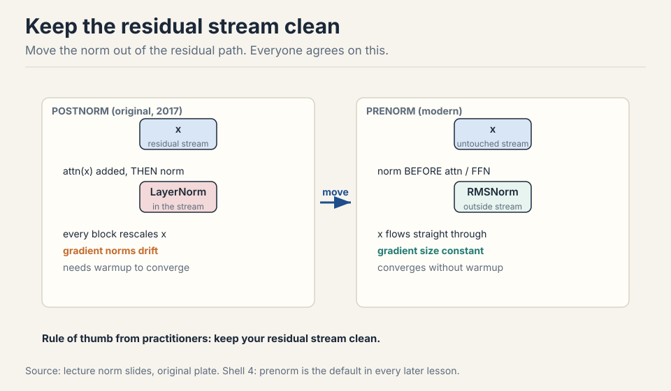
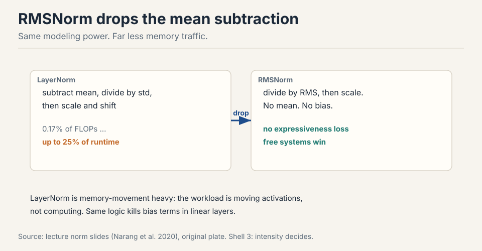
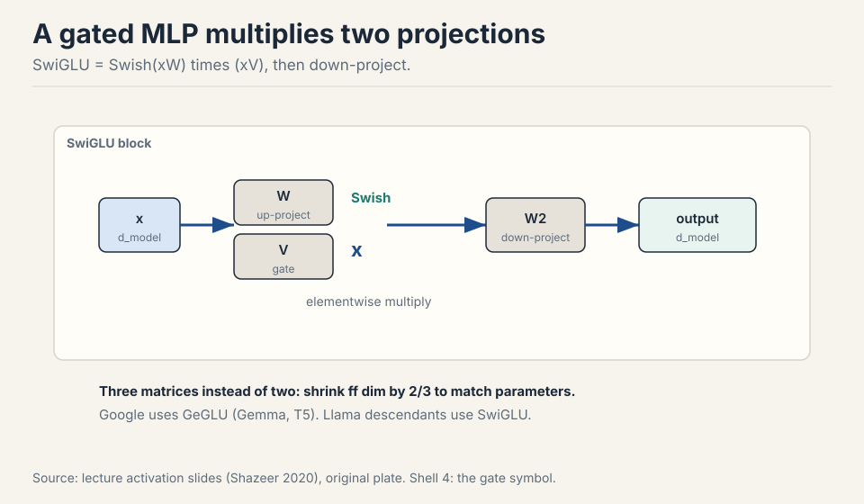
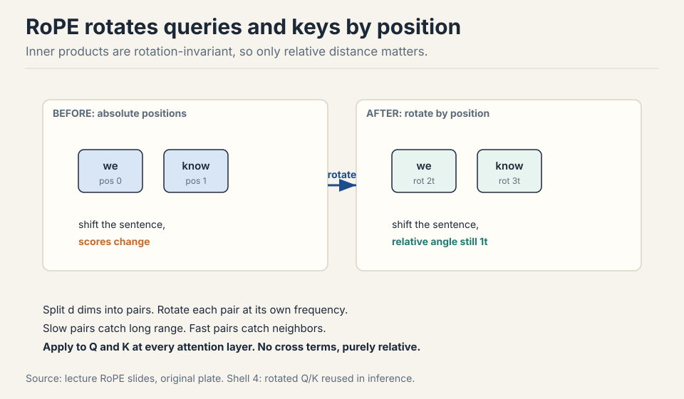
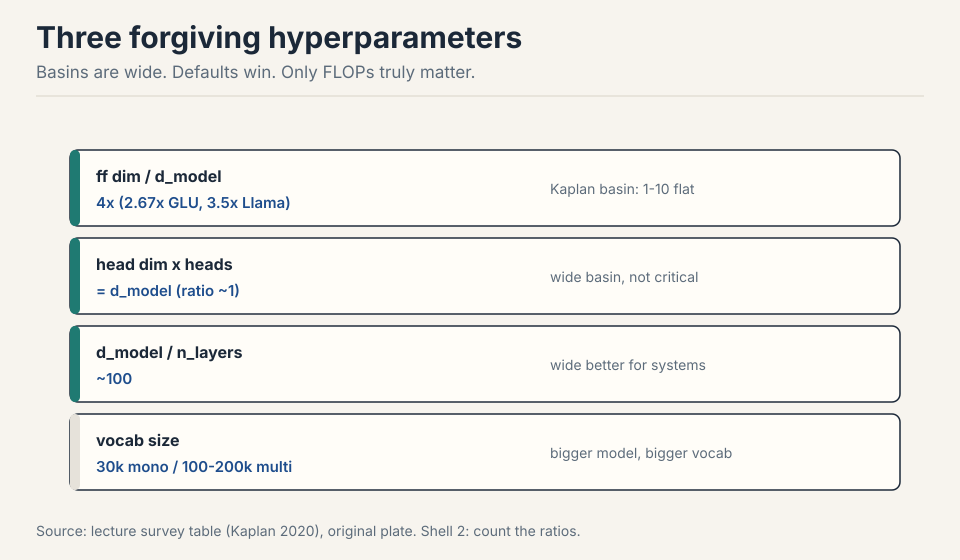
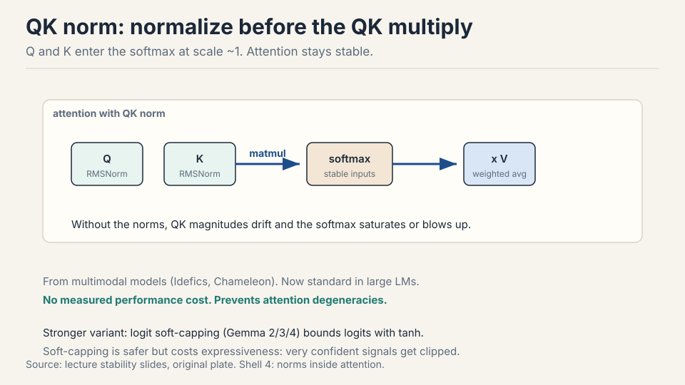
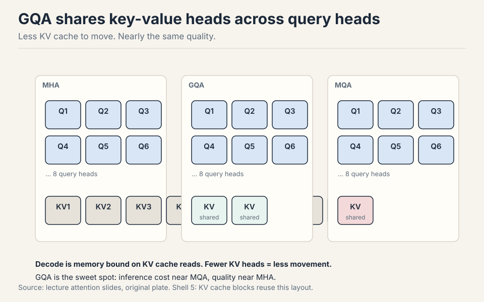
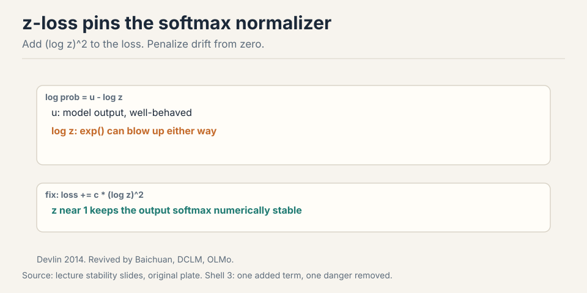

## How to read this lesson

This lesson has two levels. **Level 1 (Core)** covers the transformer
block as every modern lab builds it: where the norms go, which
activation wins, and how position gets in. **Level 2 (Deep)** covers the
numbers behind the choices: hyperparameters, stability interventions,
and inference-driven attention variants.

The method of this lecture is a survey: look at what 19+ dense models
actually did, keep what is constant, and vary the rest
[00:05](ts:00:05). Links back: [Lecture 1](l01-tokenization.html) for
tokens, [Lecture 2](l02-resource-accounting.html) for intensity.

## Level 1: How we got here

Three eras. Before GPT-3, everyone experimented and nothing was
standard. Then Llama 2 shipped, and every lab trained a Llama 2 alike
with small variations. Then came stability fixes, and now long-context
variants [06:25](ts:06:25).

```ascii
before GPT-3 : everyone experiments, nothing standard
Llama 2      : every lab trains a Llama alike
stability era: fixes that stop blowups
now          : long-context variants
```

Architecture serves three masters at once: it must learn from data, run
efficiently on GPUs, and not blow up mid-training
[05:47](ts:05:47). Every odd-looking choice below traces to one of
these.

## Level 1: Move the norm out of the residual stream

The original transformer put LayerNorm inside the residual stream: add
the attention output to x, then normalize the sum
[07:31](ts:07:31). Every modern model moved it out. The norm now sits
before each sublayer, outside the stream. This is prenorm.



Why everyone agrees: the residual stream x runs untouched from input to
output, so gradients propagate straight through in the backward pass.
Gradient sizes stay constant at initialization. Under postnorm, each
block rescales the stream and gradient norms drift, which causes spikes
and needs warmup to converge [11:00](ts:11:00). The practitioner's rule:
keep your residual stream clean.

Variants exist. Some models (Grok, Gemma 2, OLMo 2) put the norm after
the computation instead of before: still outside the stream, equally
valid by the same logic [12:59](ts:12:59). When stability breaks, labs
sprinkle norms everywhere, including inside attention. Ridiculous, and
it works.

> [!QA]
> Q: Why did every lab switch from postnorm to prenorm?
> A: Postnorm places LayerNorm inside the residual stream, so each block rescales the stream and gradient norms drift as they flow backward. This causes gradient spikes and requires warmup to converge at all. Prenorm keeps the stream untouched, so gradients propagate straight through with constant size. Training is more stable and converges without warmup. The one exception in the survey is OPT-350M, and OPT was widely regarded as unstable.
> Follow-up: If outside the stream is what matters, why prenorm instead of post-computation norm?
> A: Both satisfy the clean-stream principle, and both are used: Grok, Gemma 2, and OLMo 2 normalize after the sublayer computation. The choice between them is second-order. What is not second-order is keeping the norm out of the residual path itself.

## Level 1: RMSNorm and the death of the bias

LayerNorm subtracts the mean, divides by the standard deviation, then
scales and shifts. RMSNorm only divides by the root mean square and
scales. No mean subtraction, no bias [13:56](ts:13:56).



LayerNorm is more expressive on paper, but models train just as well
without the mean. The win is systems: normalization is 0.17% of FLOPs
yet up to 25% of runtime on small models, because the workload is memory
movement, not compute [16:02](ts:16:02). RMSNorm removes low-intensity
work for free. Same logic kills bias terms in linear layers: they cost
memory traffic, add little, and can even hurt stability
[18:02](ts:18:02).

## Level 1: Gate the MLP

The activation zoo (ReLU, GeLU, Swish, ELU, SeLU) collapsed to one
winner: the gated linear unit. A GLU adds a gate to the feedforward
layer [20:15](ts:20:15).



Take xW, apply the activation, and multiply elementwise by a second
projection xV. Then down-project with W2. Name it by the activation:
ReGLU, GeGLU, SwiGLU. Google uses GeGLU (Gemma, T5). Llama descendants
use SwiGLU [23:47](ts:23:47).

Three matrices instead of two means more parameters. The rule of thumb:
shrink the feedforward dim by 2/3 to keep the parameter count matched
[24:31](ts:24:31). Shazeer's ablations show GLU variants consistently
beat non-gated ones at matched parameter counts. Gating is close to a
free win.

> [!QA]
> Q: Why does every modern model use a gated activation?
> A: The gate lets the network modulate each hidden unit by a learned, input-dependent scale, which adds expressiveness at almost no compute cost: the extra projection is one more matmul of the same shape. Controlled ablations show consistent gains over ReLU and GeLU at matched parameter counts. GPT-3 and Nemotron-340B prove non-gated models can work, but the evidence points one way and the field followed it.
> Follow-up: Why shrink the feedforward dim by 2/3 for GLUs?
> A: Three matrices instead of two inflates the MLP parameter count by 1.5x at the same width. Multiplying ff dim by 2/3 restores the original budget, so comparisons measure the gating idea rather than extra parameters. It is a rule of thumb, not an iron law.

## Level 1: Serial blocks beat parallel blocks

The standard block is serial: attention, then MLP, each adding into the
stream. GPT-J and PaLM tried parallel blocks: attention and MLP read the
same input and add their outputs together, which allows sharing the norm
and fusing matmuls [27:26](ts:27:26).

```ascii
serial:    x -> attn -> (+) -> mlp -> (+) -> out
parallel:  x -> attn -+-> (+) -> out     (norm shared, matmuls fused)
           x -> mlp  --+
```

Parallel fell out of favor. Serial optimization got good enough that
the systems gain was not worth the representation cost: parallel blocks
effectively halve your depth [29:04](ts:29:04).

## Level 1: Position via rotation

Attention is permutation invariant: shuffle the tokens and the scores
do not change. Position must be injected [31:22](ts:31:22). The field
tried sinusoidal, absolute, and relative embeddings. The winner since
2024 is RoPE.

The design goal: the score between two tokens should depend only on
their relative distance, never on absolute position
[33:01](ts:33:01). Inner products are invariant to rotation. So rotate
each token's vector by an angle proportional to its position. Two tokens
one apart always differ by one rotation step, wherever they sit.



In d dimensions, split the vector into pairs and rotate each pair at its
own frequency. Slow pairs capture long-range dependence. Fast pairs
capture adjacency [36:23](ts:36:23). Apply the rotations to queries and
keys at every attention layer. Crucially, RoPE multiplies by sines and
cosines instead of adding them, so no cross terms leak absolute position
[37:57](ts:37:57). Gemma 4's p-RoPE rotates only the first two
coordinates, a valid cheap variant [37:15](ts:37:15).

> [!QA]
> Q: Why did RoPE replace absolute position embeddings?
> A: Absolute embeddings bake position indices into the token vectors, so the model must learn every position separately and cannot generalize past the trained length cleanly. RoPE encodes only relative distance through rotation, which generalizes to new positions by construction and adds no parameters. Since 2024 nearly every new model uses it or a variant.
> Follow-up: Why multiply by sines and cosines instead of adding them like the original transformer?
> A: Adding creates cross terms between the position embedding and the word embedding, and from those cross terms the model can recover absolute position. Multiplying rotates the vector, which keeps the inner product purely a function of relative angle. That is the entire trick.

## Level 2: Hyperparameters that forgive

Three ratios and one size decision cover nearly every model. All have
wide basins: defaults win, and only FLOPs truly move the needle
[43:40](ts:43:40).



**Feedforward ratio: 4x.** ff dim = 4 x d model. GLU variants use ~2.67x
after the 2/3 correction. Llama multiplied by 1.33x to ~3.5x because
efficient MQA attention freed budget for the MLP. T5 tried 64x for
hardware efficiency, then quietly returned to 2.5x in v1.1
[45:04](ts:45:04). Kaplan's sweep shows a flat basin from 1x to 10x.

**Head dimensions multiply to d model.** h heads of d/h each: the ratio
sits near 1 across models, with another wide basin
[49:53](ts:49:53).

**Aspect ratio ~100.** d model divided by n layers lands near 100 for
GPT-3, Llama, and most modern models. Wide models parallelize cleanly
with tensor parallelism. Deep models force pipeline parallelism, which
everyone avoids [51:31](ts:51:31). EK et al. found that sweeping
depth-vs-width mostly measures FLOPs: bigger compute wins regardless of
shape.

**Vocabulary size follows language coverage.** Monolingual English
models used ~30k. Multilingual production models use 100k-200k. Bigger
models can carry bigger vocabs [55:11](ts:55:11).

Side note on comparisons: bits per byte is always a valid metric across
tokenizers, because modern tokenizers are complete (nothing dropped) and
bytes are the fixed normalizer [57:12](ts:57:12).

> [!QA]
> Q: How do you pick hyperparameters for a new training run?
> A: Do not search from scratch. Copy the consensus: ff dim 4x (2.67x for GLU), head dims multiplying to d model, aspect ratio ~100, vocab sized to language coverage. These sit in wide flat basins, so small deviations cost little. Spend your experimentation budget on one thesis at a time, usually an architecture change, not on re-tuning forgiving ratios. What actually moves loss is total FLOPs, not the shape.
> Follow-up: T5 used 64x ff dim and worked. Why not copy that?
> A: It worked but was compute-inefficient: the matrices were oversized for the gain. T5 v1.1 reverted to 2.5x, which tells you what the authors concluded. Bold deviations can train, but the basin around 4x is where efficiency lives.

## Level 2: Weight decay is an optimizer, not a regularizer

Language models train single-pass: more internet data than FLOPs, so the
model never sees most data twice. Overfitting barely happens
[59:51](ts:59:51). Dropout has mostly died out. Yet weight decay remains
popular. Why?

```ascii
single pass  ->  no overfitting  ->  decay is not regularizing
decay + lr   ->  better minimum   ->  decay is an optimizer trick
```

Because it is not regularizing. It interacts with the optimizer:
stronger weight decay with learning-rate decay converges to a better
minimum, even though train and validation loss track each other the
whole way [62:14](ts:62:14). Shrinkage toward zero lets you use higher
learning rates or decay faster. The lesson: in deep learning, knobs
interact in ways ML-101 intuition does not predict. Test, do not assume.

## Level 2: Stability, three interventions

Training can blow up halfway through a million-dollar run. The usual
suspect is softmax: an exponential plus a division, in two places (the
output and attention) [65:01](ts:65:01).

**z-loss** tames the output softmax. The log normalizer log z can blow
up either direction even when model outputs are fine. Add c x (log z)^2
to the loss: penalize drift from zero, keep z near 1
[67:06](ts:67:06).

^2 and it stays near zero.")

**QK norm** tames attention. LayerNorm the Qs and Ks before they
multiply, so the softmax inputs sit at scale ~1
[69:48](ts:69:48). Borrowed from multimodal models (Idefics, Chameleon),
now standard in large LMs, with no measured performance cost.



**Logit soft-capping** is the strong version: tanh-cap attention logits
so they can never grow large (Gemma 2/3/4) [72:07](ts:72:07). Very safe,
but it clips confident signals and measurably costs quality. QK norm
gives the stability without the tax.

> [!QA]
> Q: Your loss curve shows sudden spikes mid-training. What do you try, in order?
> A: First, check whether the spikes come from attention or the output: both have softmaxes with exp and division. Add z-loss to pin the output normalizer near zero. Add QK norm so attention softmax inputs stay at scale 1. Both are cheap and cost no quality. Reach for logit soft-capping only if those fail, knowing it caps expressiveness. And remember the standing rule: sprinkle LayerNorms at the instability until it stops.
> Follow-up: Why is softmax the danger zone and not the matmuls?
> A: Matmuls are linear: large inputs give proportionally large outputs, and norms stay predictable. Softmax exponentiates, so a slightly large logit becomes an astronomically large numerator, and then it divides by a sum that can underflow toward zero. Both directions explode. That is why both softmaxes get dedicated interventions.

## Level 2: GQA, because decode is memory bound

Serving pays for FLOPs and for memory accesses. During prefill and
training, intensity is healthy. During decode, each step generates one
token: the KV cache must be re-read every step, and the arithmetic
intensity collapses to n/d + 1/b [77:02](ts:77:02). Small models with
long contexts suffer most.

Multi-Query Attention shares one K head and one V head across all query
heads. The KV cache shrinks by the head count, memory traffic drops, but
expressiveness drops too [79:32](ts:79:32). Grouped-Query Attention is
the sweet spot: G groups of KV heads shared across all query heads.
Near-MHA quality at near-MQA inference cost [81:07](ts:81:07).



## Level 2: Sliding window attention

Full attention costs n^2. Sliding window restricts each position to a
fixed local window. GPT-3 alternated full and banded layers. The idea
returned because long context is the current frontier
[85:08](ts:85:08).

```ascii
layers:  F  W  W  W  F  W  W  W  F
         |  |  |  |  |  |  |  |  |
window:  *  w  w  w  *  w  w  w  *     F = full, W = window
```

Every fourth layer attends globally. The rest attend locally. Local
layers aggregate into the global ones as you go up, so the top of the
network still sees everything [86:07](ts:86:07). Llama 4, Gemma 4, and
OLMo 3 use this pattern. Qwen3.5 swaps the window layers for a gated
delta net (a state-space layer, next lecture) in the same alternating
skeleton. Long-context architecture is still the most active design
space in the field [87:13](ts:87:13).

## Recap: the whole lesson on one screen

<div class="recap-grid">
<div class="recap-card">

<div class="rc-body">
<strong>1. Keep the residual stream clean</strong>
<p>Move the norm out of the residual path. Gradients flow straight
through with constant size. No warmup needed. Everyone does this.</p>
<p class="rc-num">Key: prenorm, not postnorm</p>
</div>
</div>
<div class="recap-card">

<div class="rc-body">
<strong>2. RMSNorm drops the mean</strong>
<p>Same modeling power as LayerNorm, far less memory traffic.
Normalization is 0.17% of FLOPs but up to 25% of runtime. Drop biases
too.</p>
<p class="rc-num">Key: free systems win</p>
</div>
</div>
<div class="recap-card">

<div class="rc-body">
<strong>3. Gate the MLP</strong>
<p>SwiGLU and GeGLU beat ReLU consistently at matched parameters.
Three matrices, so shrink ff dim by 2/3. Google uses GeGLU, Llama uses
SwiGLU.</p>
<p class="rc-num">Key: gate = free expressiveness</p>
</div>
</div>
<div class="recap-card">

<div class="rc-body">
<strong>4. RoPE rotates by position</strong>
<p>Inner products ignore rotation, so scores depend only on relative
distance. Split dims into pairs, rotate each at its own frequency.
Multiply, do not add.</p>
<p class="rc-num">Key: relative by construction</p>
</div>
</div>
<div class="recap-card">

<div class="rc-body">
<strong>5. Hyperparameters forgive</strong>
<p>ff dim 4x, head dims multiply to d model, aspect ratio 100, vocab by
language coverage. Wide flat basins. Only FLOPs truly move the
needle.</p>
<p class="rc-num">Key: copy the defaults</p>
</div>
</div>
<div class="recap-card">

<div class="rc-body">
<strong>6. z-loss pins the output softmax</strong>
<p>Add (log z)^2 to the loss. The normalizer stays near 1 instead of
exploding. Cheap, effective, revived from 2014.</p>
<p class="rc-num">Key: penalize drift from zero</p>
</div>
</div>
<div class="recap-card">

<div class="rc-body">
<strong>7. QK norm steadies attention</strong>
<p>Normalize Q and K before they multiply. Softmax inputs sit at scale
1. No quality cost. Soft-capping is stronger but taxes
expressiveness.</p>
<p class="rc-num">Key: norms inside attention</p>
</div>
</div>
<div class="recap-card">

<div class="rc-body">
<strong>8. GQA fixes decode economics</strong>
<p>Decode is memory bound on KV cache reads. Share KV heads across
query groups: near-MQA cost, near-MHA quality. Sliding windows handle
long context the same way.</p>
<p class="rc-num">Key: share KVs, keep queries</p>
</div>
</div>
</div>

## Official sources and further reading

**Official:**
- Lecture 3 video and slides: the 19-model survey table.
- Vaswani et al. (2017): the original transformer. Postnorm inside the
  residual stream.
- Shazeer (2020): GLU variants with parameter-matched ablations.
- Su et al. (2021): RoFormer, the RoPE paper.

**Further reading:**
- Kaplan et al. (2020): scaling laws with the hyperparameter sweeps
  (ff ratio basin, aspect ratio).
- Ainslie et al. (2023): GQA, the inference-quality trade-off.
- Narang et al. (2020): architecture ablations including RMSNorm speed.

**Caveats from these sources.** The survey reflects open models up to
early 2026. Closed labs may differ silently. Parallel-vs-serial has no
clean controlled ablation: the field's verdict is implicit (later Google
models dropped parallel). Soft-capping numbers come from Gemma reports.
the quality tax is real but workload-dependent. Bits-per-byte
comparisons assume complete tokenizers.

## Connections to the other courses

- **CS224N:** the vanilla transformer and absolute/sinusoidal positions
  are defined there. This lecture is the diff to modern practice.
- **CME295:** the attention arrow symbol (Q, K, V, score, mix) is defined
  there and reused in every attention figure here.
- **CS336 later lectures:** QK norm and z-loss return in the stability
  discussion. GQA's KV cache is the core object of the inference
  lecture. The alternating local-global pattern returns with SSMs.
- **CS229S:** tensor vs pipeline parallelism explains the aspect-ratio
  sweet spot.

> [!CHEAT]
> **Architecture cheatsheet.** Prenorm: norm outside the residual stream, gradients flow straight through. RMSNorm: drop mean and bias, free systems win (0.17% FLOPs, up to 25% runtime). Biases: drop everywhere. GLU: gate the MLP, shrink ff dim by 2/3, SwiGLU (Llama) vs GeGLU (Google). Blocks: serial beats parallel (parallel halves effective depth). RoPE: rotate Q/K by position, relative by construction, multiply not add. Hyperparams: ff 4x (2.67x GLU), heads multiply to d model, aspect ratio ~100, vocab 30k mono / 100-200k multi. Regularization: single-pass means no overfitting. Weight decay is an optimizer. Stability: z-loss for output softmax, QK norm for attention, soft-capping as last resort. GQA: share KV heads, fix decode economics. Sliding window: full every 4th layer for long context.

> [!MEMORY]
> **Clean stream, gated MLP, rotated positions.** Prenorm keeps gradients honest. GLU gates for free. RoPE makes distance relative. Everything else is defaults in wide basins.
