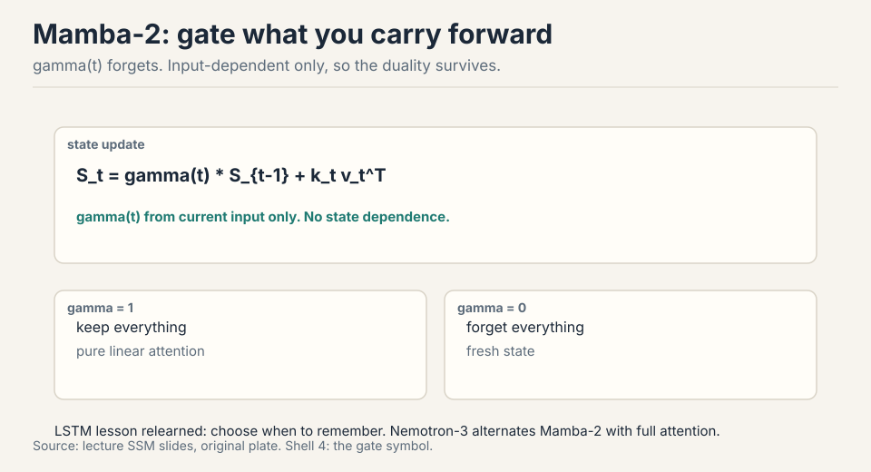

## How to read this lesson

This lesson has two levels. **Level 1 (Core)** covers linear-time
attention: the one idea behind it, the RNN duality, and the three
battle-tested variants. **Level 2 (Deep)** covers mixture of experts:
the mental model, routing, training heuristics, and the DeepSeek
evolution.

Two halves, one theme: get more capability per unit of compute. Links
back: [Lecture 3](l03-architecture.html) for the transformer block,
[Lecture 2](l02-resource-accounting.html) for intensity.

## Level 1: The long-context problem

Context windows keep growing: vendors race to larger sizes on a log
scale [01:37](ts:01:37). The feedforward cost grows linearly with
sequence length. Attention grows quadratically. Past a point, attention
dominates everything.

```ascii
feedforward : O(n)     linear in sequence length
attention   : O(n^2)   quadratic, dominates past a point
escapes     : linear attention, hybrids, FlashAttention (~2x)
```

The toolkit has two drawers. Hybrids: mix cheap local layers with rare
full-attention layers (last lecture's sliding windows). Systems:
FlashAttention rearranges attention to minimize memory traffic, a pure
constant-factor win of ~2x that also avoids materializing the n x n
matrix [03:18](ts:03:18). Constants matter enormously. But for 5-10M
tokens, constants are not enough. That is where linear time comes in.

## Level 1: The one idea, associativity

Write attention as (QK^T)V. Drop the softmax for a moment. Matrix
multiplication is associative: (QK^T)V = Q(K^TV)
[06:05](ts:06:05).


Left path: n x n scores first, cost n^2 x d. Right path: d x d summary
first, cost n x d^2. Sequence lengths are millions. Hidden dims are
thousands. The right path wins by orders of magnitude. Every linear
attention method is an elaboration of this reorder.

## Level 1: The RNN duality

The right path has a second form. Sweep left to right, maintaining a
fixed-size state S: S_t = S_{t-1} + k_t v_t^T, then output q_t S_t
[08:11](ts:08:11).


Dense form: parallel, great for training. Recurrent form: fixed-size
state, great for inference. RNNs were always good at inference and bad
at training. Linear attention gets both. The dense-to-recurrent
equivalence is exact. The lossy step was dropping the softmax at the
start [21:02](ts:21:02).

> [!QA]
> Q: Why is linear attention a big deal if it just drops the softmax?
> A: Dropping the softmax is exactly what enables the reorder: without it, associativity moves the quadratic term from n^2 to d^2, and the recurrent form gives fixed-size-state inference. Softmax attention needs a KV cache that grows with context. Linear attention carries a fixed state instead. The price is expressiveness: the all-to-all softmax connection is genuinely powerful, which is why every deployed system is a hybrid, not pure linear.
> Follow-up: If dense and recurrent forms are equivalent, why do hybrids lose quality at high ratios?
> A: The equivalence is between the two forms of linear attention, not between linear and softmax attention. Dropping the softmax is the lossy step. As you replace more softmax layers with linear ones, you lose more of the all-to-all modeling power, and long-context QA degrades first.

## Level 1: Mamba-2 adds a forget gate

Pure linear attention always carries the full state forward. The LSTM
lesson: learn when to forget. Mamba-2 adds gamma(t), computed from the
current input only [11:46](ts:11:46).

 S_{t-1} + k_t v_t^T. gamma depends on the input, not the state, so train-parallel and infer-recurrent both still work.")

Because gamma depends on the input and not the state, the dense/recurrent
duality survives. Nemotron-3 alternates Mamba-2 layers with full softmax
attention and matches strong models with much better long-context
throughput [13:28](ts:13:28).

## Level 1: Gated delta net erases before writing

Push further: add a second gate beta(t) controlling how much of the
current input enters the state, plus a projector (I - beta k k^T) that
erases the old key direction before writing the new one
[15:02](ts:15:02).


The intuition: when writing key k_t, first remove what the state already
stored along k_t, then add the new information. Same projector appears
independently in meta-learning least squares and fast weight
programming: different derivations, same solution. Qwen 3.5 and Qwen
Next use a 3:1 gated-delta-net-to-attention hybrid with strong results
and much higher decode throughput at long contexts
[18:21](ts:18:21).

Controlled ablations (ByteDance Seed + UC Santa Cruz) show the hybrid
pattern clearly: at low ratios of linear layers, no quality hit. Past a
threshold, long-context performance degrades steadily toward pure-RNN
levels [19:03](ts:19:03). Single-key retrieval is explicitly optimized by
these architectures and hides the degradation. QA reveals it.

## Level 1: DSA, the indexer alternative

DeepSeek Sparse Attention takes a different route. Keep softmax
attention, but run it on a subset. A lightweight indexer scores tokens
from qk inner products through ReLU and learned weights, takes the
top-k positions, and full attention runs only on those
[23:13](ts:23:13).


The indexer is cheap by design: low-dimensional, low-precision. The
second stage is quadratic but on a short, bounded context. The clever
deployment trick: train a normal transformer, then bolt the indexer on
during the long-context extension phase you were running anyway
[24:49](ts:24:49). DeepSeek v3.2 matches Claude 4.5 Sonnet and Gemini 3.
GLM5's ablations show near-zero loss vs full attention even on hard
retrieval [26:00](ts:26:00). And note the pattern: top-k selection with
an auxiliary loss is the same trick MoE routing uses below.

> [!QA]
> Q: Compare linear attention, DSA, and sliding windows for long context.
> A: Linear attention changes the complexity class to O(n) via the associativity reorder, at the cost of dropping softmax expressiveness. It needs hybrid softmax layers to stay competitive. DSA keeps full softmax quality on a top-k subset chosen by a cheap indexer. The indexer itself is still quadratic but with tiny constants. Sliding windows keep exact softmax in a fixed local window plus periodic global layers. Simplest, but the window bound is rigid. All three ship as hybrids with full attention, never pure.
> Follow-up: Why bolt DSA on during extension instead of training with it from scratch?
> A: Training with the indexer is complex and annoying, and you run long-context extension anyway. Bolting it on in that phase costs little extra training and works surprisingly well despite the non-differentiable top-k. Do the expensive thing once, add the cheap thing late.

## Level 2: MoE, more parameters than you pay for

Replace the MLP with several smaller FFNs called experts. A router sends
each token to one (or k) of them. Four experts of the original size: 4x
the parameters, ~1x the FLOPs per token [34:26](ts:34:26).


The evidence: Switch Transformer (Fedus et al. 2022) shows test loss
falling as expert count rises at fixed active parameters. OlMoE trains
~2x faster than its dense counterpart. DeepSeek v2 showed far fewer
active parameters matching or beating dense models. Past a certain
size, nearly every released model is an MoE [36:54](ts:36:54).

MoE is also a parallelization axis: experts are natural chunks for
different devices (expert parallelism), trading communication for the
ability to scale further [39:55](ts:39:55).

> [!QA]
> Q: Why is everyone shipping MoEs above a certain size?
> A: Because parameters keep helping even when only a subset is active per token. At fixed training FLOPs, more experts means lower loss. At fixed inference FLOPs, fewer active parameters means cheaper serving at the same quality. The Switch and OlMoE results show this is not subtle: ~2x training speedups and strictly better loss at matched compute. Above the size where infrastructure can handle routing, there is little reason to stay dense.
> Follow-up: What is the catch?
> A: Infrastructure complexity. Routing adds communication, experts must be sharded across devices, training needs balancing heuristics, the router softmax is a stability risk, and fine-tuning overfits badly. Small labs often stay dense because the operational cost exceeds the quality gain at their scale.

## Level 2: Token-choice TopK routing

Three routing designs exist: token chooses experts, expert chooses
tokens, or a global assignment solver. Nearly everything ships
token-choice TopK: each token picks its k favorite experts
[48:15](ts:48:15). OlMoE shows token choice beats expert choice on both
loss and benchmarks.

The router itself is embarrassingly simple: one matmul. Each expert owns
a vector. Score = inner product with the token. Softmax. Take top-k
[50:02](ts:50:02). Hash routing (no learning) works a little. RL routing
works but nobody uses it: too much overhead and variance for what
heuristics achieve. Global linear assignment is optimal and far too
expensive.


DeepSeek's widely copied refinement: fine-grained experts (many small
ones instead of few big) plus shared experts that bypass the router and
process every token [54:27](ts:54:27). Common processing moves to the
shared expert. Routed experts specialize. OlMoE disagrees slightly on
shared experts helping, but agrees fine-grained helps.

## Level 2: Training MoEs, heuristics beat theory

Sparsity during training is the hard part: only k experts are active, so
gating is non-differentiable and you never see the counterfactual
experts [58:26](ts:58:26). RL and stochastic perturbations (noise
injection from the early papers) were tried. Later ablations showed the
noise was unnecessary and even harmful. What ships is heuristics.

The core problem is rich-gets-richer: chosen experts get gradient
signal, get stronger, get chosen more, and collapse to a few experts
doing everything [63:36](ts:63:36). The fix is the Switch auxiliary
loss: L = F x P, where F is the fraction of tokens dispatched to expert
i and P is the router's probability mass on expert i. The gradient of
F*P with respect to P is F, so popular experts get pushed down in
proportion to their popularity. Not derived from first principles.
understood through its gradient action.


DeepSeek v2 adds device-level balancing (balance machines, not just
experts) as a second auxiliary loss [66:31](ts:66:31). DeepSeek v3 moves
toward aux-loss-free balancing with a per-expert bias term, though some
auxiliary loss remains against extreme imbalance. The OlMoE ablation is
stark: remove the balancing loss and nearly all tokens pile onto two
experts. The rest of the parameters do nothing for most of training
[68:03](ts:68:03).

## Level 2: MoE systems and stability notes

Expert parallelism ships activations between devices, so communication
is the tax. Nemotron-3 downprojects the residual stream before the
all-to-all collective: smaller vectors to move, without shrinking the
model's hidden dim [71:38](ts:71:38).

```ascii
tax   : all-to-all communication between experts
fix 1 : downproject before the collective (Nemotron-3)
fix 2 : never silently drop tokens (MegaBlocks)
fix 3 : guard the router softmax
```

Historical warning: early MoE inference silently dropped tokens when an
expert's queue overflowed, making outputs depend on other users'
traffic. Modern frameworks (MegaBlocks and descendants) fixed this
[75:12](ts:75:12).

The router adds another softmax, another danger zone. Fixes that ship:
run the router in fp32, and put z-loss on the router (OlMoE ablations
show it calms spiky loss curves) [76:35](ts:76:35).

Fine-tuning MoEs overfits badly: huge train/val gaps vs dense models.
Common workarounds: fine-tune attention only, fine-tune non-MoE layers,
or just use far more data [78:11](ts:78:11).

Upcycling (copy a trained dense model's MLPs into experts, add a random
router, keep training) gave real wins: miniCPM 2.4B to 13.4B, Qwen 1.8B
to a strong 2.7B MoE. Nobody does it now: train the MoE from scratch
instead [79:40](ts:79:40).

## Level 2: DeepSeek v1 to v3

v1 is the platonic MoE: shared + fine-grained experts, TopK routing,
auxiliary balancing [82:33](ts:82:33). v2 scales up with two shared
experts and adds device-routing and communication-balancing losses:
systems respect as architecture. v3 goes aux-loss-free-ish with
per-expert bias, switches expert weighting to sigmoid+softmax, and adds
two more ideas: MLA and MTP.

```ascii
v1 : platonic MoE, TopK routing, aux balancing
v2 : two shared experts, routing and comm losses
v3 : per-expert bias, sigmoid+softmax, MLA, MTP
```

Multi-head Latent Attention compresses Q/K/V into a low-dimensional
latent c, and the KV cache stores c instead of K and V
[83:56](ts:83:56). Care needed where MLA meets RoPE in the cache.
Multi-Token Prediction predicts several future tokens at once: a
statistical win that doubles as a built-in speculative decoder
[85:06](ts:85:06).

## Recap: the whole lesson on one screen

<div class="recap-grid">
<div class="recap-card">

<div class="rc-body">
<strong>1. Move the parentheses</strong>
<p>(QK^T)V = Q(K^TV). Drop the softmax, reorder, and the quadratic term
moves from n^2 to d^2. One idea, all of linear attention.</p>
<p class="rc-num">Key: n^2 d becomes n d^2</p>
</div>
</div>
<div class="recap-card">

<div class="rc-body">
<strong>2. Train dense, infer recurrent</strong>
<p>The same math runs parallel over the sequence for training and as a
fixed-size state update for inference. The dense-recurrent equivalence
is exact.</p>
<p class="rc-num">Key: S_t = S_{t-1} + k_t v_t^T</p>
</div>
</div>
<div class="recap-card">

<div class="rc-body">
<strong>3. Mamba-2 learns to forget</strong>
<p>gamma(t) gates how much state carries forward. Input-dependent only,
so the train/infer duality survives. The LSTM lesson, relearned.</p>
<p class="rc-num">Key: forget gate, no state dependence</p>
</div>
</div>
<div class="recap-card">

<div class="rc-body">
<strong>4. Erase before you write</strong>
<p>(I - beta k k^T) projects out the old key direction before storing
the new one. Qwen 3.5 uses a 3:1 hybrid with full attention.</p>
<p class="rc-num">Key: projector + input gate</p>
</div>
</div>
<div class="recap-card">

<div class="rc-body">
<strong>5. DSA indexes, then attends</strong>
<p>A cheap indexer picks top-k tokens. Full attention runs on the
subset. Bolted on during long-context extension. Matches frontier
models.</p>
<p class="rc-num">Key: cheap select, exact attend</p>
</div>
</div>
<div class="recap-card">

<div class="rc-body">
<strong>6. MoE: params without FLOPs</strong>
<p>Split the FFN into experts, route each token to one. 4x parameters,
1x FLOPs. More experts at fixed active params means lower loss.</p>
<p class="rc-num">Key: sparsity decouples params from FLOPs</p>
</div>
</div>
<div class="recap-card">

<div class="rc-body">
<strong>7. Routing is one matmul</strong>
<p>Token-choice TopK is the consensus. Score experts by inner product,
softmax, take top k. DeepSeek adds fine-grained + shared experts.</p>
<p class="rc-num">Key: router = W_r x, top-k</p>
</div>
</div>
<div class="recap-card">

<div class="rc-body">
<strong>8. Balance or collapse</strong>
<p>Rich-gets-richer kills experts without the F x P auxiliary loss.
Its gradient pushes probability mass off popular experts. Removing it
is catastrophic.</p>
<p class="rc-num">Key: L_aux = F x P</p>
</div>
</div>
</div>

## Official sources and further reading

**Official:**
- Lecture 4 video and slides.
- Fedus et al. (2022): Switch Transformer, expert scaling and the F x P
  auxiliary loss.
- Dao and Gu (2024): Mamba-2, the gated linear-attention view.
- DeepSeekMoE (2024): fine-grained and shared experts.

**Further reading:**
- OlMoE (Ai2): the careful open MoE study, token-vs-expert choice,
  load-balancing and z-loss ablations.
- Su et al. RoPE paper: background for the MLA/RoPE interaction note.

**Caveats from these sources.** Hybrid-ratio ablations are messy and
from one study. Treat the degradation curves as directional. DSA
frontier-matching claims come from DeepSeek's own report. Upcycling is
documented but currently unfashionable: no 2026 examples. MoE
fine-tuning overfitting numbers are from one GLUE-style task.

## Connections to the other courses

- **CS224N:** softmax attention is defined there. This lecture is the
  linear-time diff.
- **CME295:** the attention arrow symbol is reused in every variant
  figure. Only the score computation changes.
- **CS336 later lectures:** the KV cache from the inference lecture is
  what DSA and MLA shrink. Expert parallelism returns in the systems
  lectures. MTP's speculative decoder returns in inference.
- **CS329Z:** the router is a tiny agent: observe token, pick expert,
  get reward via gradient.

> [!CHEAT]
> **Linear attention + MoE cheatsheet.** Long context: attention O(n^2), FFN O(n). FlashAttention: 2x constant factor, no materialized matrix. Linear attention: drop softmax, (QK^T)V = Q(K^TV), n^2d to nd^2. Duality: dense trains, recurrent infers, equivalence exact, softmax-drop lossy. Mamba-2: gamma(t) forget gate, input-dependent. Gated delta net: beta(t) input gate + (I - beta k k^T) projector. Hybrids: 7:1 (Minimax M1), 3:1 (Qwen 3.5). Low ratios free, high ratios degrade. DSA: cheap indexer, top-k, full attention on subset, bolted on at extension. MoE: split FFN, route tokens, params up FLOPs flat. Routing: token-choice TopK, one-matmul router, hash/RL/assignment rejected. DeepSeek: fine-grained + shared experts. Training: sparsity is non-differentiable, heuristics win, noise removed. Balance: L = F x P, gradient pushes down popular experts. Removal is catastrophic. v3: per-expert bias, MLA (cache latent c), MTP (built-in speculative decode). Systems: expert parallel comms, downproject before all-to-all, no silent token drops anymore. Upcycling: copy dense MLPs, now unfashionable.

> [!MEMORY]
> **Reorder, gate, route, balance.** Associativity makes attention linear. Gates make the state smart. Routing makes parameters cheap. Balancing keeps experts alive.
