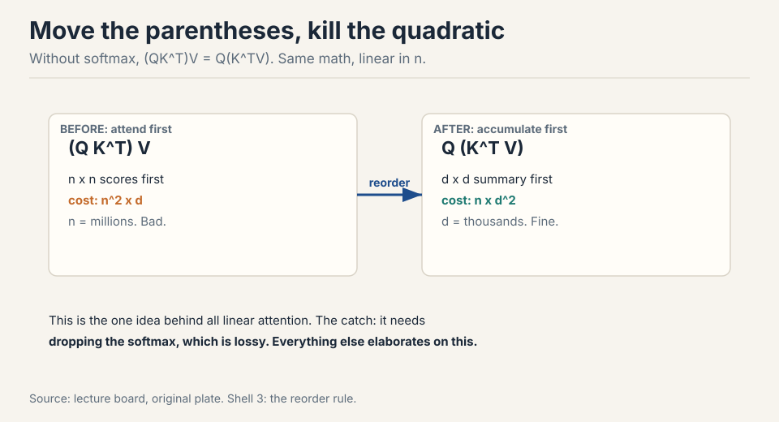
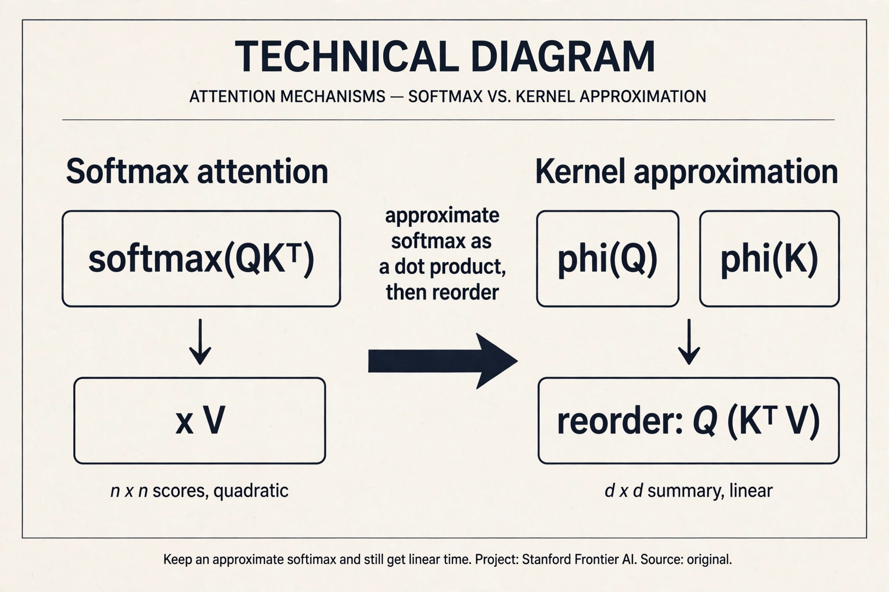
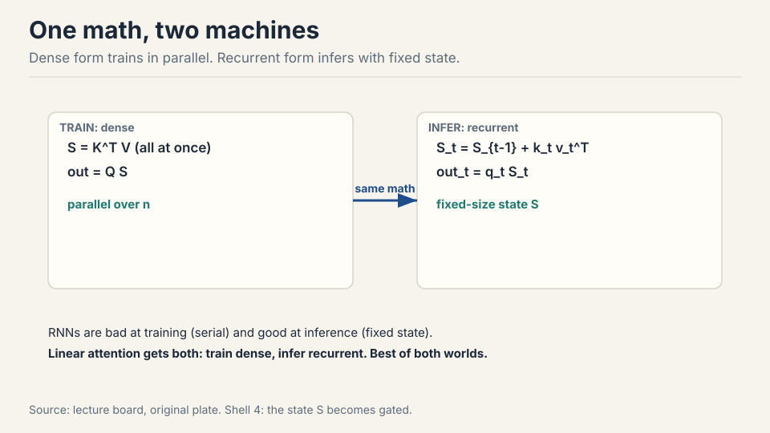
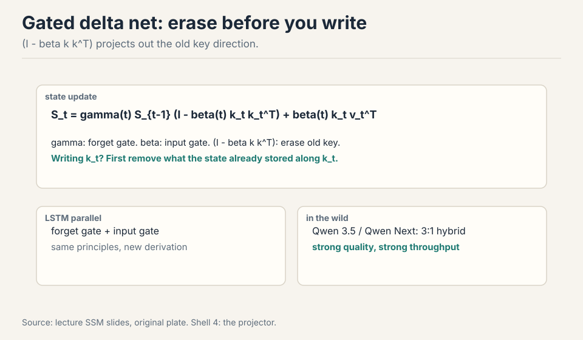
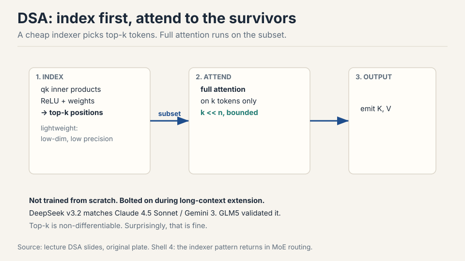
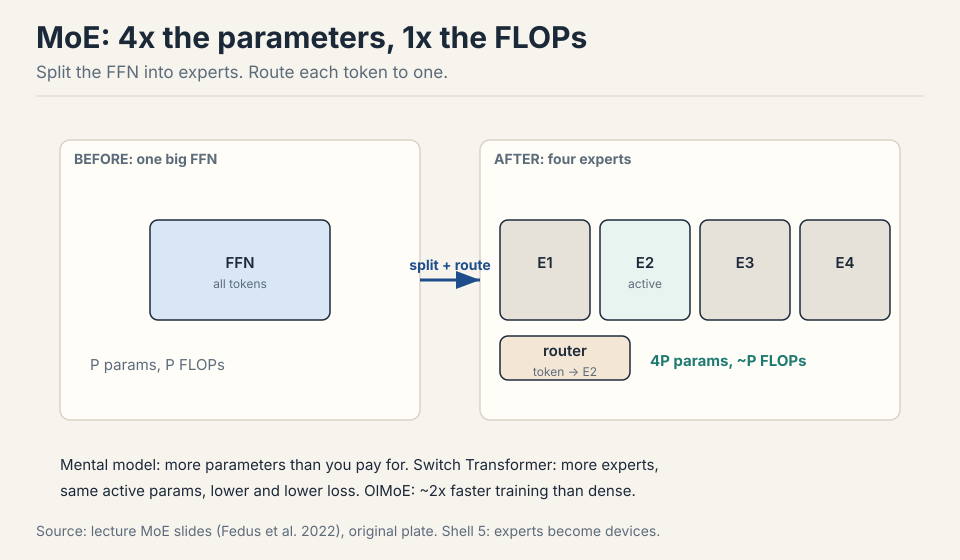
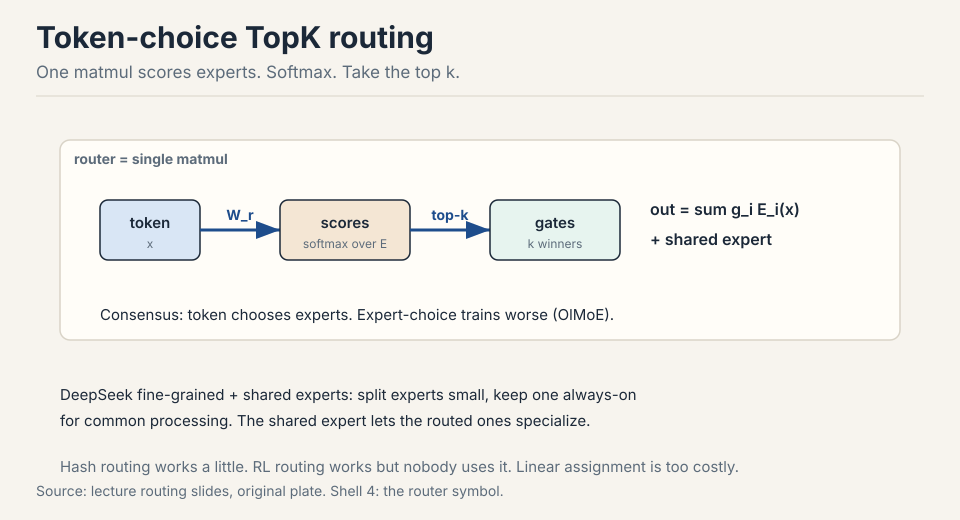
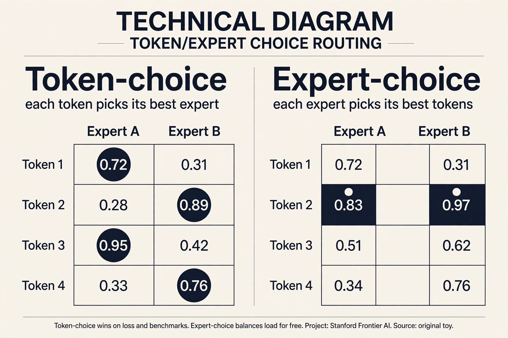
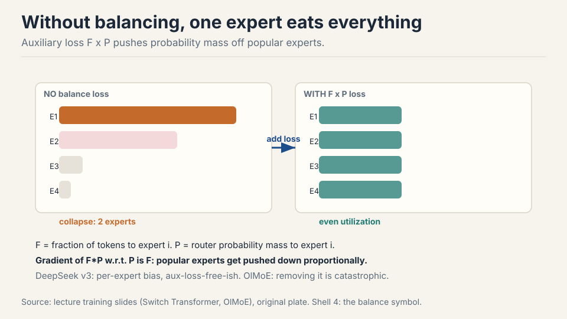
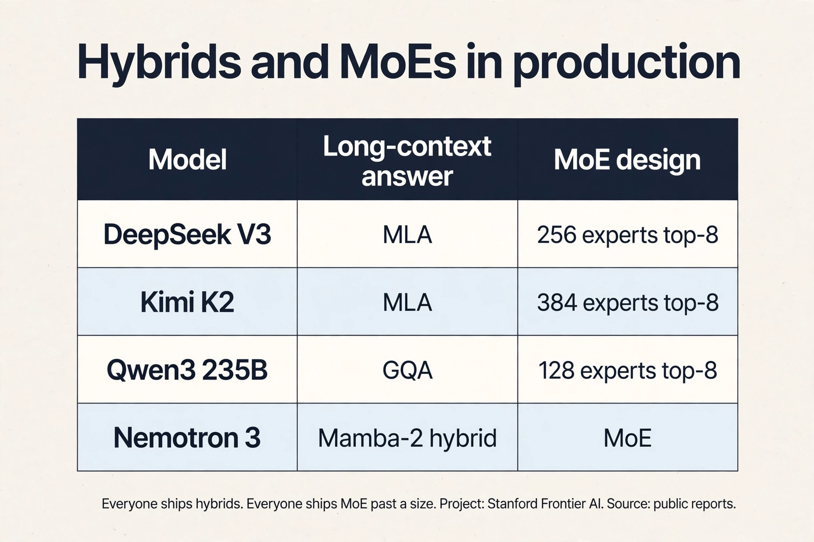

## The problem: the quadratic bill comes due

Context windows keep growing. Vendors race to larger sizes on a log
scale [01:37](ts:01:37). The feedforward layers cost O(n): double the
sequence, double the work. Attention costs O(n^2): double the sequence,
quadruple the work. Past a point, attention dominates everything.

Two drawers of tools exist. Hybrids: mix cheap local layers with rare
full-attention layers (last lecture's sliding windows). Systems:
FlashAttention rearranges attention to minimize memory traffic, a pure
constant-factor win of about 2x that also avoids materializing the n x
n matrix [03:18](ts:03:18). Constants matter enormously. But for 5 to
10M tokens, constants are not enough. The complexity class itself has
to change. That is where linear time comes in.

This lecture has two halves and one theme: more capability per unit of
compute. First half: attention in linear time. Second half: parameters
you do not have to pay for.

## The one idea: move the parentheses

Write attention without the softmax for a moment: (QK^T)V. Matrix
multiplication is associative. So (QK^T)V = Q(K^TV)
[06:05](ts:06:05).



The left path builds the n x n score matrix first: cost n^2 x d. The
right path builds a d x d summary, K^TV, first: cost n x d^2. Run the
numbers. n = 1,000,000 tokens, d = 1,000 dimensions. Left: 1e15
operations. Right: 1e9. Six orders of magnitude, from one parenthesis
move. Sequence lengths are millions. Hidden dims are thousands. The
right path wins. Every linear attention method is an elaboration of
this reorder.

Watch it on a toy. Two tokens, two dimensions. Q = [[1,0],[0,1]],
K = [[1,0],[1,1]], V = [[2,0],[0,3]].

```ascii
left path:   scores = QK^T = [[1,1],[0,1]]
             out = scores x V = [[2,3],[0,3]]
right path:  S = K^TV = [[1,0],[1,1]]^T x [[2,0],[0,3]]
                   = [[2,3],[0,3]]
             out = Q x S = [[1,0],[0,1]] x [[2,3],[0,3]] = [[2,3],[0,3]]
both paths:  [[2, 3], [0, 3]]     same answer
```

Same answer, different work. The left path built a 2x2 score matrix.
The right path built a 2x2 summary S and skipped the scores entirely.
That summary S is the whole idea. It is small (d x d, not n x n), and
everything flows through it.

### Subchapter: the kernel view (keep an approximate softmax)

The lecture drops the softmax to get associativity. One idea further:
keep an approximate softmax and still reorder. A **feature map** φ
turns the softmax into a dot product: softmax(q, k) ≈ φ(q) · φ(k).
With that, attention becomes φ(Q)(φ(K)^T V), and the parentheses move
again.

Worked toy in 1D. q = 2, k = 3. True exp(qk) = e^6 ≈ 403. Feature map
φ(x) = [1, x, x²/2] (Taylor of exp). φ(2)·φ(3) = 1 + 6 + (4×9)/4 = 16.
Not exact, but the ranking survives: larger qk gives a larger dot
product. Real kernels (elu(x)+1, random Fourier features) do this in d
dimensions. One idea added: approximate first, then reorder. The
softmax stays in spirit, the quadratic term leaves.



## The RNN duality: train dense, infer recurrent

The right path has a second form. Sweep left to right, maintaining the
summary as a running state: S_t = S_{t-1} + k_t v_t^T, then output
q_t S_t [08:11](ts:08:11).



Two views of the same math. Dense form: compute the whole summary in
parallel, great for training on GPUs. Recurrent form: update a
fixed-size state one token at a time, great for inference. RNNs were
always good at inference and bad at training, because their state
update had to run in order. Linear attention gets both: the
dense-to-recurrent equivalence is exact.

The lossy step was dropping the softmax at the start
[21:02](ts:21:02). Everything after that is just algebra.

> [!QA]
> Q: Why is linear attention a big deal if it just drops the softmax?
> A: Dropping the softmax is exactly what enables the reorder: without it, associativity moves the quadratic term from n^2 to d^2, and the recurrent form gives fixed-size-state inference. Softmax attention needs a KV cache that grows with context. Linear attention carries a fixed state instead. The price is expressiveness: the all-to-all softmax connection is genuinely powerful, which is why every deployed system is a hybrid, not pure linear.
> Follow-up: If dense and recurrent forms are equivalent, why do hybrids lose quality at high ratios?
> A: The equivalence is between the two forms of linear attention, not between linear and softmax attention. Dropping the softmax is the lossy step. As you replace more softmax layers with linear ones, you lose more of the all-to-all modeling power, and long-context QA degrades first.

## Where the reorder breaks: the state is dumb

Pure linear attention always carries the full state forward. S_t adds
the new key-value pair and never forgets. Work the failure. A 1M-token
document's summary S is a d x d matrix: at d = 1000, that is 1M
numbers. One million tokens of information compressed into one million
numbers: one number per token, on average. Old tokens pollute the state
forever. The model cannot erase.

The degradation is measurable. Controlled ablations (ByteDance Seed +
UC Santa Cruz) show the hybrid pattern clearly: at low ratios of linear
layers, no quality hit. Past a threshold, long-context performance
degrades steadily toward pure-RNN levels [19:03](ts:19:03). Single-key
retrieval is explicitly optimized by these architectures and hides the
degradation. QA reveals it: ask questions that need many scattered
facts and the linear layers fail first.

## The key question

The state can only accumulate. What if it could forget, and erase
before writing? Two gates answer, one after the other.

## Mamba-2: learn when to forget

The LSTM lesson, relearned: add a forget gate. Mamba-2 adds gamma(t),
computed from the current input only [11:46](ts:11:46).

 S_{t-1} + k_t v_t^T. gamma depends on the input, not the state, so train-parallel and infer-recurrent both still work.")

The update: S_t = gamma(t) x S_{t-1} + k_t v_t^T. When gamma is near 0,
the past is wiped. When it is near 1, the past survives. Because gamma
depends on the input and not the state, the dense/recurrent duality
survives: the parallel training form still works. If the gate depended
on the state, the recurrence would be sequential and training would
stall. That constraint is the whole design.

Nemotron-3 alternates Mamba-2 layers with full softmax attention and
matches strong models with much better long-context throughput
[13:28](ts:13:28).

### Subchapter: Mamba-1 vs Mamba-2 (from scan to duality)

One increment on the selective SSM. **Mamba-1** makes the SSM
matrices input-dependent (selection: the model decides per token what
to keep) and computes the recurrence with a hardware-aware parallel
scan. Fast at inference, because the state is fixed size. But the scan
is the only fast path: training parallelizes the scan, not the model.

**Mamba-2** rewrites the same selection idea as gated linear
attention. The state update S_t = gamma(t) S_{t-1} + k_t v_t^T is
exactly the Mamba-2 gate from this lecture. One idea added: the SSD
(state-space duality) form. Now the dense form trains in parallel on
GPUs and the recurrent form infers with a fixed state, the same
duality as linear attention. Mamba-1 selected. Mamba-2 selects and
dualizes. Same selection, new math form, both fast paths available.

## Gated delta net: erase before writing

Push further. Add a second gate beta(t) controlling how much of the
current input enters the state, plus a projector (I - beta k k^T) that
erases the old key direction before writing the new one
[15:02](ts:15:02).



The intuition: when writing key k_t, first remove what the state
already stored along k_t, then add the new information. Same projector
appears independently in meta-learning least squares and fast weight
programming: different derivations, same solution. Qwen 3.5 and Qwen
Next use a 3:1 gated-delta-net-to-attention hybrid with strong results
and much higher decode throughput at long contexts
[18:21](ts:18:21).

## DSA: the indexer alternative

DeepSeek Sparse Attention takes a different route. Keep softmax
attention, but run it on a subset. A lightweight indexer scores tokens
from qk inner products through ReLU and learned weights, takes the
top-k positions, and full attention runs only on those
[23:13](ts:23:13).



The indexer is cheap by design: low-dimensional, low-precision. The
second stage is quadratic but on a short, bounded context. The clever
deployment trick: train a normal transformer, then bolt the indexer on
during the long-context extension phase you were running anyway
[24:49](ts:24:49). DeepSeek v3.2 matches Claude 4.5 Sonnet and Gemini 3
on the reported evaluations. GLM5's ablations show near-zero loss vs
full attention even on hard retrieval [26:00](ts:26:00). Note the
pattern: top-k selection with an auxiliary loss is the same trick MoE
routing uses below.

> [!QA]
> Q: Compare linear attention, DSA, and sliding windows for long context.
> A: Linear attention changes the complexity class to O(n) via the associativity reorder, at the cost of dropping softmax expressiveness. It needs hybrid softmax layers to stay competitive. DSA keeps full softmax quality on a top-k subset chosen by a cheap indexer. The indexer itself is still quadratic but with tiny constants. Sliding windows keep exact softmax in a fixed local window plus periodic global layers. Simplest, but the window bound is rigid. All three ship as hybrids with full attention, never pure.
> Follow-up: Why bolt DSA on during extension instead of training with it from scratch?
> A: Training with the indexer is complex and annoying, and you run long-context extension anyway. Bolting it on in that phase costs little extra training and works surprisingly well despite the non-differentiable top-k. Do the expensive thing once, add the cheap thing late.

## Half two. The problem: parameters cost FLOPs

Dense models tie parameters to FLOPs: every parameter fires on every
token. A 1T-parameter dense model costs 1T-scale FLOPs per token. What
if most parameters could sit idle most of the time? Then parameters
could grow without the FLOP bill growing.

## MoE: more parameters than you pay for

Replace the MLP with several smaller FFNs called **experts**. A
**router** sends each token to one (or k) of them. Four experts of the
original size: 4x the parameters, about 1x the FLOPs per token
[34:26](ts:34:26).



The evidence: Switch Transformer (Fedus et al. 2022) shows test loss
falling as expert count rises at fixed active parameters. OlMoE trains
about 2x faster than its dense counterpart. DeepSeek v2 showed far
fewer active parameters matching or beating dense models. Past a
certain size, nearly every released model is an MoE
[36:54](ts:36:54).

MoE is also a parallelization axis: experts are natural chunks for
different devices (**expert parallelism**), trading communication for
the ability to scale further [39:55](ts:39:55).

> [!QA]
> Q: Why is everyone shipping MoEs above a certain size?
> A: Because parameters keep helping even when only a subset is active per token. At fixed training FLOPs, more experts means lower loss. At fixed inference FLOPs, fewer active parameters means cheaper serving at the same quality. The Switch and OlMoE results show this is not subtle: about 2x training speedups and strictly better loss at matched compute. Above the size where infrastructure can handle routing, there is little reason to stay dense.
> Follow-up: What is the catch?
> A: Infrastructure complexity. Routing adds communication, experts must be sharded across devices, training needs balancing heuristics, the router softmax is a stability risk, and fine-tuning overfits badly. Small labs often stay dense because the operational cost exceeds the quality gain at their scale.

## Token-choice TopK routing: one matmul

Three routing designs exist: token chooses experts, expert chooses
tokens, or a global assignment solver. Nearly everything ships
token-choice TopK: each token picks its k favorite experts
[48:15](ts:48:15). OlMoE shows token choice beats expert choice on both
loss and benchmarks.

The router itself is embarrassingly simple: one matmul. Each expert
owns a vector. Score = inner product with the token. Softmax. Take
top-k [50:02](ts:50:02). Hash routing (no learning) works a little. RL
routing works but nobody uses it: too much overhead and variance for
what heuristics achieve. Global linear assignment is optimal and far too
expensive.



DeepSeek's widely copied refinement: **fine-grained experts** (many
small ones instead of few big) plus **shared experts** that bypass the
router and process every token [54:27](ts:54:27). Common processing
moves to the shared expert. Routed experts specialize. OlMoE disagrees
slightly on shared experts helping, but agrees fine-grained helps.

### Subchapter: the routing zoo (who chooses whom)

Three designs, one worked toy. Router scores for 4 tokens and 2
experts:

```ascii
        A     B
tok1   0.72  0.31
tok2   0.28  0.89
tok3   0.95  0.42
tok4   0.33  0.76
```

**Token-choice top-1.** Each row picks its max. tok1 goes to A, tok2
to B, tok3 to A, tok4 to B. Every token gets its best expert. Load is
2 and 2 here, but nothing guarantees it: collapse is the failure
mode. OlMoE shows token-choice beating expert-choice on both loss
and benchmarks.

**Expert-choice top-2.** Each column picks its top 2. A takes tok3
(0.95) and tok1 (0.72). B takes tok2 (0.89) and tok4 (0.76). Load is
balanced by construction: 2 each, always. One idea flipped: the
experts choose. The price: a token can be dropped if no expert picks
it, and tokens get experts that ranked them low. Balance is free,
coverage is not.

**Hash.** Token i goes to expert (i mod E). No learning, no
collapse, worse loss. The baseline that ships nowhere.

The ladder: learn who chooses (token), flip the chooser (expert),
remove the learning (hash). Token-choice plus the F x P aux loss is
the production answer.



## Where MoE breaks: rich gets richer

Sparsity during training is the hard part: only k experts are active,
so gating is non-differentiable and you never see the counterfactual
experts [58:26](ts:58:26). The failure mode is **collapse**. The chosen
experts get gradient signal, get stronger, get chosen more, and the
model ends with two experts doing everything while the rest sit idle
[63:36](ts:63:36).

The OlMoE ablation is stark: remove the balancing loss and nearly all
tokens pile onto two experts. The rest of the parameters do nothing for
most of training [68:03](ts:68:03). Work the waste: 64 experts, 2
active, 62 dead. You paid for 64 and got 2.

The fix is the Switch auxiliary loss: L = F x P, where F is the
fraction of tokens dispatched to expert i and P is the router's
probability mass on expert i. The gradient of F x P with respect to P
is F: popular experts get pushed down in proportion to their
popularity. Not derived from first principles. Understood through its
gradient action.



DeepSeek v2 adds device-level balancing (balance machines, not just
experts) as a second auxiliary loss [66:31](ts:66:31). DeepSeek v3 moves
toward aux-loss-free balancing with a per-expert bias term, though some
auxiliary loss remains against extreme imbalance.

## MoE systems and stability notes

Expert parallelism ships activations between devices, so communication
is the tax. Nemotron-3 downprojects the residual stream before the
all-to-all collective: smaller vectors to move, without shrinking the
model's hidden dim [71:38](ts:71:38).

Historical warning: early MoE inference silently dropped tokens when an
expert's queue overflowed, making outputs depend on other users'
traffic. Modern frameworks (MegaBlocks and descendants) fixed this
[75:12](ts:75:12).

The router adds another softmax, another danger zone. Fixes that ship:
run the router in fp32, and put z-loss on the router (OlMoE ablations
show it calms spiky loss curves) [76:35](ts:76:35).

Fine-tuning MoEs overfits badly: huge train/val gaps vs dense models.
Common workarounds: fine-tune attention only, fine-tune non-MoE layers,
or just use far more data [78:11](ts:78:11).

**Upcycling**: copy a trained dense model's MLPs into experts, add a
random router, keep training. It gave real wins: miniCPM 2.4B to 13.4B,
Qwen 1.8B to a strong 2.7B MoE. Nobody does it now: train the MoE from
scratch instead [79:40](ts:79:40).

## DeepSeek v1 to v3: the evolution in one screen

v1 is the platonic MoE: shared + fine-grained experts, TopK routing,
auxiliary balancing [82:33](ts:82:33). v2 scales up with two shared
experts and adds device-routing and communication-balancing losses:
systems respect as architecture. v3 goes aux-loss-free-ish with
per-expert bias, switches expert weighting to sigmoid+softmax, and adds
two more ideas: MLA and MTP.

**Multi-head Latent Attention** compresses Q/K/V into a low-dimensional
latent c, and the KV cache stores c instead of K and V
[83:56](ts:83:56). Care needed where MLA meets RoPE in the cache.
**Multi-Token Prediction** predicts several future tokens at once: a
statistical win that doubles as a built-in speculative decoder
[85:06](ts:85:06).

### Subchapter: what is used where (MoE and linear hybrids in production)

Verified against public reports as of October 2026.

| Model | Long-context answer | MoE design | Source |
|---|---|---|---|
| DeepSeek-V3 | MLA | 256 experts, top-8 + 1 shared | DeepSeek-V3 paper |
| DeepSeek v3.2 | MLA + DSA bolt-on | same as V3 | DeepSeek report; lecture |
| Kimi K2 | MLA | 384 experts, top-8 + 1 shared | Kimi K2 report (arXiv 2507.20534) |
| Qwen3-235B-A22B | GQA, no linear layers | 128 experts, top-8, no shared, QK-norm | Qwen3 report |
| Nemotron-3 | Mamba-2 + attention hybrid | MoE | NVIDIA; lecture |

Read it. MLA won the open frontier twice (DeepSeek, Kimi K2). Routed
expert counts grew: 128, then 256, then 384, always top-8 active. The
shared expert survived at DeepSeek and Kimi but not at Qwen3, which
dropped it and added QK-norm instead: the DeepSeek recipe is not the
only answer. And Qwen3 shows a frontier lab shipping no linear
attention at all: GQA plus scale still competes.



> [!QA]
> Q: Walk me through one MoE forward pass for a single token, with numbers.
> A: Token x arrives, dim 4096. The router scores 256 experts: one matmul xW_g, a softmax, then top-8. Say experts 7, 42, 103, 118, 155, 190, 221, 244 win, with weights renormalized to sum to 1. Each chosen expert runs its SwiGLU FFN on x: up to 2048 dims and back down. The shared expert also runs on x. Output = shared(x) + sum of w_i * expert_i(x). FLOPs: 8 small experts plus 1 shared, about the same as one dense FFN. Parameters touched: 9 experts' worth. The other 247 experts sit idle. That is the whole trick: capacity without the bill.
> Follow-up: Where does this token's gradient go?
> A: Back through the 8 chosen experts and the router weights w_i, plus the router's own scores via the softmax. The 247 idle experts get no gradient from this token. That sparsity is why MoE needs the balancing loss: experts that never get chosen never learn.

> [!QA]
> Q: You must serve a 1T-parameter MoE at low latency. What breaks first?
> A: Memory capacity and expert all-to-all communication. 1T parameters in bf16 is 2TB: you need many GPUs just to hold the weights, so expert parallelism shards experts across devices. Each token's top-8 experts usually live on different devices, so every layer does an all-to-all exchange of activations. At batch size 1 the all-to-all latency dominates. The fixes from the field: downproject before the collective (Nemotron-3), keep hot experts on the same device, and quantize weights to fp8. The interview signal: name the two bottlenecks (capacity, all-to-all), then the tool that attacks each.
> Follow-up: Why does batch size matter so much for MoE serving?
> A: The all-to-all moves activations per token per layer. Small batches give the communication nothing to amortize against, so latency per token stays high. Large batches amortize it but need more KV cache. MoE serving is a batch-size negotiation between the router's traffic and the cache.

> [!QA]
> Q: Expert-choice routing balances load for free. Why does token-choice still win?
> A: Because load balance is not the objective. Loss is. Token-choice gives every token its best experts, so each token gets the highest-quality computation. Expert-choice gives every expert a fair workload, so some tokens get served by experts that scored them low, or get dropped entirely. OlMoE's ablations show token-choice beating expert-choice on both loss and benchmarks. The field's answer: take token-choice and pay for balance separately with the F x P auxiliary loss.
> Follow-up: When would expert-choice be the right call?
> A: When the serving system cannot tolerate imbalance. Expert-choice guarantees fixed compute per expert per step, which simplifies capacity planning. Production frontier models still pick token-choice, but research systems with strict device budgets sometimes prefer the guarantee.

> [!QA]
> Q: When would you pick a dense model over an MoE?
> A: Below the size where your infrastructure can handle routing. The operational cost (expert parallelism, all-to-all tuning, balancing losses, router stability) exceeds the quality gain at small scale, and MoE fine-tuning overfits worse. The rule from the lecture: past a certain size nearly every released model is an MoE, because the threshold is operational, not scientific. If you cannot afford a systems engineer for the router, stay dense.
> Follow-up: Does the MoE advantage show at small scale at all?
> A: Yes, on loss: Switch Transformer showed gains at modest sizes. The question is total cost, not loss. At small scale the extra engineering and serving complexity outweigh the loss win. That is why small labs stay dense while frontier labs go MoE.

## Mapping back: what each idea fixes

| Pain | Fix | How |
|---|---|---|
| n^2 attention at long context | Associativity reorder | (QK^T)V = Q(K^TV). Cost n^2 d becomes n d^2. |
| KV cache grows with context | RNN duality | Fixed-size state S_t updated recurrently at inference. |
| State never forgets | Mamba-2 gamma(t) | Input-dependent forget gate. Duality survives. |
| State overwrites blindly | Gated delta net | (I - beta k k^T) erases the old key direction first. |
| Quality loss at high linear ratios | Hybrids | Keep some full softmax layers. Low ratios free, high ratios degrade. |
| Softmax too expensive, quality needed | DSA | Cheap indexer picks top-k. Full attention on the subset. |
| Parameters cost FLOPs | MoE | Route each token to k experts. Params up, FLOPs flat. |
| Experts collapse | F x P aux loss | Gradient pushes mass off popular experts. |
| Router softmax spikes | fp32 router, z-loss | Calm the danger zone. |

## The honest price

Linear attention only ships as a hybrid. The ablations are clear: past
a threshold ratio, long-context QA degrades toward pure-RNN levels. The
pure linear model is a research object, not a product. DSA's
frontier-matching claims come from DeepSeek's own report.

MoE's price is operational. Routing adds communication. Experts must be
sharded. The router is another softmax to guard. Fine-tuning overfits.
Small labs stay dense because at their scale the infrastructure cost
exceeds the quality gain. And the deepest caveat from the lecture:
these are engineering verdicts, not theorems. They hold until the next
ablation says otherwise.

## Recap: the whole lesson on one screen

The story in eight steps. Each step answers the one before it.

1. **The bill comes due.** Attention is O(n^2), the FFN is O(n). At
   5-10M tokens, constant-factor wins like FlashAttention are not
   enough. The complexity class must change.
2. **Move the parentheses.** (QK^T)V = Q(K^TV). Drop the softmax,
   reorder, and n^2 d becomes n d^2. One idea, all of linear
   attention.
3. **Train dense, infer recurrent.** S_t = S_{t-1} + k_t v_t^T runs
   parallel for training and as a fixed-size state for inference. The
   equivalence is exact. The softmax drop is the lossy step.
4. **The state is dumb.** It only accumulates. Past a threshold of
   linear layers, long-context QA degrades toward pure-RNN levels.
   Single-key retrieval hides it. QA reveals it.
5. **Gates make the state smart.** Mamba-2's gamma(t) forgets.
   Input-dependent only, so the duality survives. The gated delta net
   adds beta(t) and a projector that erases the old key direction
   before writing.
6. **DSA indexes, then attends.** A cheap indexer picks top-k tokens.
   Full attention runs on the subset. Bolted on during long-context
   extension.
7. **MoE decouples params from FLOPs.** Route each token to k experts.
   4x parameters, 1x FLOPs. The router is one matmul plus top-k.
   DeepSeek adds fine-grained and shared experts.
8. **Balance or collapse.** Without the F x P aux loss, two experts
   take everything and 62 sit idle. The gradient pushes probability
   mass off popular experts.

## Go deeper

<div style="position:relative;padding-bottom:56.25%;height:0;overflow:hidden;max-width:100%;margin:16px 0;">
<iframe style="position:absolute;top:0;left:0;width:100%;height:100%;" src="https://www.youtube-nocookie.com/embed/9dSkvxS2EB0" title="Mamba Explained" frameborder="0" allow="accelerometer; autoplay; clipboard-write; encrypted-media; gyroscope; picture-in-picture" allowfullscreen></iframe>
</div>
- Mamba Explained (the embed above): https://www.youtube.com/watch?v=9dSkvxS2EB0
- Gu and Dao, Mamba: Linear-Time Sequence Modeling: https://arxiv.org/abs/2312.00752
- DeepSeek-V3 Technical Report: https://arxiv.org/abs/2412.19437
- Fedus et al., Switch Transformers: https://arxiv.org/abs/2101.03961

## Official sources and further reading

**Official:**
- Lecture 4 video and slides.
- Fedus et al. (2022): Switch Transformer, expert scaling and the F x
  P auxiliary loss.
- Dao and Gu (2024): Mamba-2, the gated linear-attention view.
- DeepSeekMoE (2024): fine-grained and shared experts.

**Further reading:**
- OlMoE (Ai2): the careful open MoE study, token-vs-expert choice,
  load-balancing and z-loss ablations.
- Su et al. RoPE paper: background for the MLA/RoPE interaction note.

**Caveats from these sources.** Hybrid-ratio ablations are messy and
from one study. Treat the degradation curves as directional. DSA
frontier-matching claims come from DeepSeek's own report. Upcycling is
documented but currently unfashionable: no 2026 examples. MoE
fine-tuning overfitting numbers are from one GLUE-style task.

## Connections to the other courses

- **CS224N:** softmax attention is defined there. This lecture is the
  linear-time diff.
- **CS336 L03:** the transformer block this lecture modifies. RoPE
  meets MLA in the KV cache.
- **CS336 later lectures:** the KV cache from the inference lecture is
  what DSA and MLA shrink. Expert parallelism returns in the systems
  lectures. MTP's speculative decoder returns in inference.
- **CS329Z:** the router is a tiny agent: observe token, pick expert,
  get reward via gradient.
