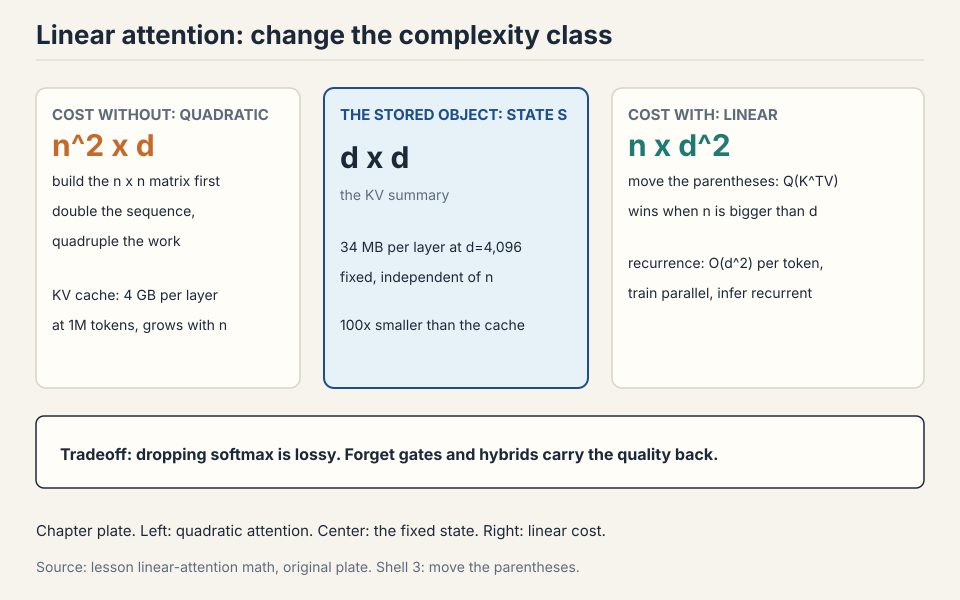
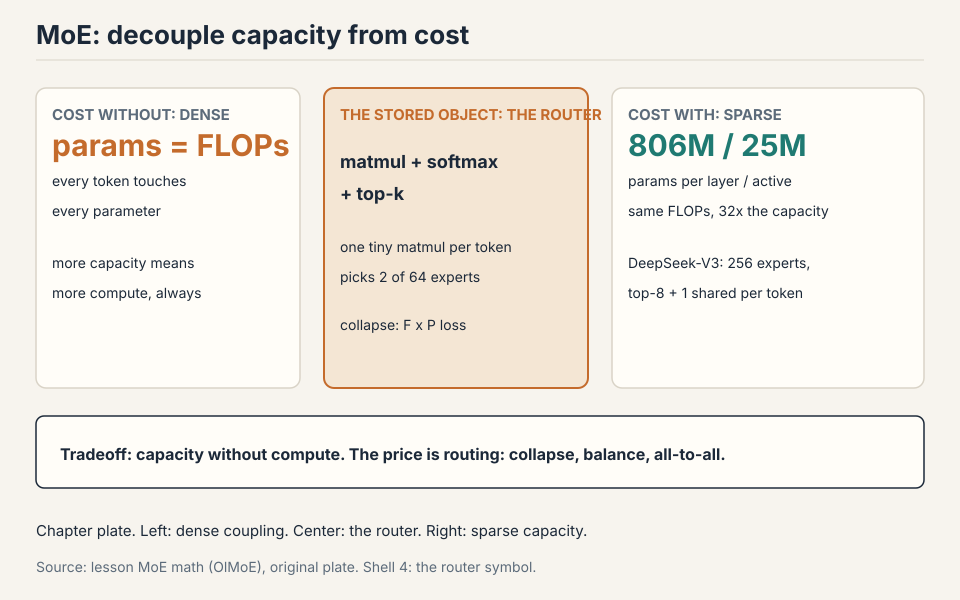

## How to read this lesson

No prerequisites are assumed. Every term is defined at first use.
This lecture has two halves and one theme: more capability per unit
of compute. First half: attention in linear time. Second half:
parameters you do not have to pay for. The previous lecture built
the transformer block. This one rebuilds its two most expensive
parts.

## The problem: the quadratic bill comes due

Context windows keep growing. Vendors race to larger sizes on a log
scale. The feedforward layers cost O(n): double the sequence, double
the work. Attention costs O(n^2): double the sequence, quadruple the
work. Past a point, attention dominates everything.

Two drawers of tools exist. Hybrids: mix cheap local layers with rare
full-attention layers (last lecture's sliding windows). Systems:
FlashAttention rearranges attention to minimize memory traffic, a
pure constant-factor win of about 2x that also avoids materializing
the n x n matrix. Constants matter enormously. But for 5 to 10M
tokens, constants are not enough. The complexity class itself has to
change. That is where linear time comes in.

## The one idea: move the parentheses

Write attention without the softmax for a moment: (QK^T)V. Matrix
multiplication is associative. So (QK^T)V = Q(K^TV).


The left path builds the n x n score matrix first: cost n^2 x d. The
right path builds a d x d summary, K^TV, first: cost n x d^2. Run the
numbers. n = 1,000,000 tokens, d = 1,000 dimensions. Left: 1e15
operations. Right: ~1e12. Three orders of magnitude, from one
parenthesis move. Sequence lengths are millions. Hidden dims are thousands. The
right path wins. Every linear attention method is an elaboration of
this reorder.

### Subchapter: worked on a toy, both paths

Two tokens, two dimensions. Q = [[1,0],[0,1]], K = [[1,0],[1,1]],
V = [[2,0],[0,3]].

```ascii
left path:   scores = QK^T = [[1,1],[0,1]]
             out = scores x V = [[2,3],[0,3]]
right path:  S = K^TV = [[1,0],[1,1]]^T x [[2,0],[0,3]]
                   = [[2,3],[0,3]]
             out = Q x S = [[1,0],[0,1]] x [[2,3],[0,3]] = [[2,3],[0,3]]
both paths:  [[2, 3], [0, 3]]     same answer
```

Same answer, different work. The left path built a 2x2 score matrix.
The right path built a 2x2 summary S and skipped the scores entirely.
That summary S is the whole idea. It is small (d x d, not n x n), and
everything flows through it.

### Subchapter: the kernel view (keep an approximate softmax)

The lecture drops the softmax to get associativity. One idea further:
keep an approximate softmax and still reorder. A **feature map** φ
turns the softmax into a dot product: softmax(q, k) ≈ φ(q) · φ(k).
With that, attention becomes φ(Q)(φ(K)^T V), and the parentheses move
again.

Worked toy in 1D. q = 2, k = 3. True exp(qk) = e^6 ≈ 403. Feature map
φ(x) = [1, x, x²/2] (Taylor of exp). φ(2)·φ(3) = 1 + 6 + (4×9)/4 =
16. Not exact, but the ranking survives: larger qk gives a larger dot
product. Real kernels (elu(x)+1, random Fourier features) do this in
d dimensions. One idea added: approximate first, then reorder. The
softmax stays in spirit, the quadratic term leaves.


### Subchapter: where the reorder wins and loses

The reorder wins when n >> d: long sequences, modest width. It loses
when d >> n: short sequences, wide model. Work the crossover. Left
cost: n^2 d. Right cost: n d^2. The right wins when n d^2 < n^2 d,
i.e., d < n. For d = 4,096, the reorder wins past 4,096 tokens. Below
that, plain attention is cheaper: the reorder adds overhead for no
gain. This is why linear attention targets long context, not all
context.

## The RNN duality: train dense, infer recurrent

The right path has a second form. Sweep left to right, maintaining
the summary as a running state: S_t = S_{t-1} + k_t v_t^T, then
output q_t S_t.


Two views of the same math. Dense form: compute the whole summary in
parallel, great for training on GPUs. Recurrent form: update a
fixed-size state one token at a time, great for inference. RNNs were
always good at inference and bad at training, because their state
update had to run in order. Linear attention gets both: the
dense-to-recurrent equivalence is exact.

### Subchapter: the recurrent form, worked on the toy

Same toy as above. Q = [[1,0],[0,1]], K = [[1,0],[1,1]], V =
[[2,0],[0,3]]. Start S_0 = [[0,0],[0,0]].

```ascii
t=1: k1 = [1,0], v1 = [2,0]
     S_1 = S_0 + k1 v1^T = [[2,0],[0,0]]
     out_1 = q1 S_1 = [1,0] x [[2,0],[0,0]] = [2,0]
t=2: k2 = [1,1], v2 = [0,3]
     S_2 = S_1 + k2 v2^T = [[2,0],[0,0]] + [[0,3],[0,3]] = [[2,3],[0,3]]
     out_2 = q2 S_2 = [0,1] x [[2,3],[0,3]] = [0,3]
result: [[2,0],[0,3]]
```

Compare with the dense form's [[2,3],[0,3]]. The outputs differ here
because the dense form was non-causal (every query saw every key)
while the recurrent form is causal (each query sees only past keys).
Add the causal mask to the dense form and they match exactly. The
duality is between causal-dense and recurrent. That is the form
training and inference both use.

### Subchapter: the state size, in numbers

The state S is d x d. At d = 1,000: 1M numbers, 2 MB in bf16. At d =
4,096: 16.8M numbers, 34 MB. Per layer, fixed, independent of n. A
1M-token context carries the same 34 MB state as a 1K-token context.
The KV cache for the same context at 1M tokens: 1M x 4 KB (GQA-8) =
4 GB per layer. The state is 100x smaller and never grows. That is
the inference prize.

The lossy step was dropping the softmax at the start. Everything
after that is just algebra.

> [!QA]
> Q: Why is linear attention a big deal if it just drops the softmax?
> A: Dropping the softmax is exactly what enables the reorder: without it, associativity moves the quadratic term from n^2 to d^2, and the recurrent form gives fixed-size-state inference. Softmax attention needs a KV cache that grows with context. Linear attention carries a fixed state instead. The price is expressiveness: the all-to-all softmax connection is genuinely powerful, which is why every deployed system is a hybrid, not pure linear.
> Follow-up: If dense and recurrent forms are equivalent, why do hybrids lose quality at high ratios?
> A: The equivalence is between the two forms of linear attention, not between linear and softmax attention. Dropping the softmax is the lossy step. As you replace more softmax layers with linear ones, you lose more of the all-to-all modeling power, and long-context QA degrades first.

## Where the reorder breaks: the state is dumb

Pure linear attention always carries the full state forward. S_t adds
the new key-value pair and never forgets. Work the failure. A 1M-token
document's summary S is a d x d matrix: at d = 1000, that is 1M
numbers. One million tokens of information compressed into one million
numbers: one number per token, on average. Old tokens pollute the
state forever. The model cannot erase.

The degradation is measurable. Controlled ablations (ByteDance Seed +
UC Santa Cruz) show the hybrid pattern clearly: at low ratios of
linear layers, no quality hit. Past a threshold, long-context
performance degrades steadily toward pure-RNN levels. Single-key
retrieval is explicitly optimized by these architectures and hides the
degradation. QA reveals it: ask questions that need many scattered
facts and the linear layers fail first.

## The key question

The state can only accumulate. What if it could forget, and erase
before writing? Two gates answer, one after the other.

## The selective SSM, from zero

Before Mamba-2, there was the selective state space model. Build it
from zero. A **state space model** is a recurrence with a fixed-size
hidden state: h_t = A h_{t-1} + B x_t, y_t = C h_t. The matrices A,
B, C are fixed. The state has constant size. This is an RNN with
linear updates.

### Subchapter: selection makes it input-dependent

The fixed matrices are the weakness: every token gets the same
treatment. **Selection** makes B, C, and the step size input-dependent:
the model computes them from x_t. Now the recurrence decides per
token what to keep and what to ignore. A token carrying noise gets a
small step size: it barely enters the state. A token carrying a name
gets a large one: it writes strongly.

This is Mamba-1's idea. The recurrence stays linear in the state
(which keeps the fast parallel scan), but the coefficients vary with
the input (which gives the selectivity of attention). One idea added
to the SSM: let the input tune the recurrence.

### Subchapter: the hardware-aware scan

The selective recurrence is still sequential: h_t needs h_{t-1}. The
trick is the **parallel scan**: an associative operation can be
parallelized with a tree reduction, like a parallel prefix sum. The
selective SSM's update is associative in the right form, so training
runs the scan in O(log n) parallel steps instead of n sequential
ones. Mamba-1 trains fast because the math was rewritten into a
scannable form, not because the recurrence changed.

## Mamba-2: learn when to forget

The LSTM lesson, relearned: add a forget gate. Mamba-2 adds gamma(t),
computed from the current input only.

 S_{t-1} + k_t v_t^T. Source: lecture SSM slides.")

The update: S_t = gamma(t) x S_{t-1} + k_t v_t^T. When gamma is near
0, the past is wiped. When it is near 1, the past survives. Because
gamma depends on the input and not the state, the dense/recurrent
duality survives: the parallel training form still works. If the gate
depended on the state, the recurrence would be sequential and training
would stall. That constraint is the whole design.

### Subchapter: Mamba-1 vs Mamba-2, one increment

**Mamba-1** makes the SSM matrices input-dependent and computes the
recurrence with a hardware-aware parallel scan. Fast at inference,
because the state is fixed size. But the scan is the only fast path.

**Mamba-2** rewrites the same selection idea as gated linear
attention. The state update S_t = gamma(t) S_{t-1} + k_t v_t^T is
exactly the gate from this lecture. One idea added: the SSD
(state-space duality) form. Now the dense form trains in parallel on
GPUs and the recurrent form infers with a fixed state, the same
duality as linear attention. Mamba-1 selected. Mamba-2 selects and
dualizes. Same selection, new math form, both fast paths available.

### Subchapter: the state size in Mamba

Mamba's state is d_model x d_state, with d_state typically 16. At
d_model = 4,096: 65,536 numbers per layer, 131 KB in bf16. Compare
the KV cache at 32K context with GQA-8: 32,768 x 4 KB = 128 MB per
layer. The Mamba state is 1,000x smaller. Mamba-2's larger state
(the SSD form carries more per head) trades some of this for
quality, but the ratio stays enormous. This is why hybrids use
Mamba layers for the bulk of the sequence: the memory economics are
not close.

Nemotron-3 alternates Mamba-2 layers with full softmax attention and
matches strong models with much better long-context throughput.

> [!QA]
> Q: What exactly did Mamba-2 add over Mamba-1?
> A: The SSD (state-space duality) form. Mamba-1's selective recurrence trained through a hardware-aware parallel scan: fast, but the scan was the only fast path. Mamba-2 rewrote selection as gated linear attention, S_t = gamma(t) S_{t-1} + k_t v_t^T, which has both a dense parallel form for training and a recurrent fixed-state form for inference. Same selection idea, new math form, both fast paths available. The constraint that makes it work: gamma depends on the input, not the state, so the recurrence stays parallelizable.
> Follow-up: Why does the gate have to be input-dependent and not state-dependent?
> A: A state-dependent gate makes the recurrence genuinely sequential: you cannot compute step t until step t-1's state is known, which kills parallel training. An input-dependent gate is known for all t upfront (the inputs are all available during training), so the whole sequence parallelizes. That one constraint is the difference between a fast model and a slow one.

## Gated delta net: erase before writing

Push further. Add a second gate beta(t) controlling how much of the
current input enters the state, plus a projector (I - beta k k^T)
that erases the old key direction before writing the new one.


The intuition: when writing key k_t, first remove what the state
already stored along k_t, then add the new information. Same
projector appears independently in meta-learning least squares and
fast weight programming: different derivations, same solution. Qwen
3.5 and Qwen Next use a 3:1 gated-delta-net-to-attention hybrid with
strong results and much higher decode throughput at long contexts.

### Subchapter: the projector, worked on a toy

State S holds an old association for key k = [1, 0]: the first row
of S is [5, 0] (stale information). New input arrives with the same
key k = [1, 0] and new value v = [0, 3].

```ascii
without projector: S_new = S + k v^T. Row 1: [5,0] + [0,3] = [5,3].
  The stale 5 pollutes the new association.
with projector (beta=1): S = S (I - k k^T) first. (I - k k^T) zeroes
  the k direction: row 1 becomes [0, 0]. Then add k v^T: [0, 3].
  The stale 5 is gone before the write.
```

Erase before writing. The state never accumulates contradictions
along the same key. One idea added to Mamba-2's forget gate: the
forget is targeted at the key being written, not global.

## DSA: the indexer alternative

DeepSeek Sparse Attention takes a different route. Keep softmax
attention, but run it on a subset. A lightweight indexer scores
tokens from qk inner products through ReLU and learned weights,
takes the top-k positions, and full attention runs only on those.


The indexer is cheap by design: low-dimensional, low-precision. The
second stage is quadratic but on a short, bounded context. The clever
deployment trick: train a normal transformer, then bolt the indexer
on during the long-context extension phase you were running anyway.
DeepSeek's own report claims v3.2 matches Claude 4.5 Sonnet and Gemini 3 on its reported evaluations (the DSA report is linked in Go deeper). GLM5's ablations show near-zero loss vs full attention even on hard retrieval. Note the pattern: top-k selection with an **auxiliary loss** is the same trick **mixture-of-experts (MoE)** routing uses below. An auxiliary loss is a second training objective added beside the main loss. It shapes behavior the main loss ignores, like picking the right tokens or keeping experts balanced.

### Subchapter: the indexer cost, worked

Full attention on n = 128K, d = 128: 2 x n^2 x d = 4.2e12 FLOPs per
head. The DSA indexer runs at d_index = 32 in fp8: roughly 2 x n^2
x 32 / 4 (low precision) = 2.6e11, about 16x cheaper. Then top-k =
4,096 tokens get full attention: 2 x 4,096^2 x 128 = 4.3e9. Total:
2.6e11 + 4.3e9, about 16x cheaper than full attention. The indexer
is still quadratic, but with tiny constants. The top-k stage is
quadratic on a short context. Both terms beat n^2 x d.

> [!QA]
> Q: Compare linear attention, DSA, and sliding windows for long context.
> A: Linear attention changes the complexity class to O(n) via the associativity reorder, at the cost of dropping softmax expressiveness. It needs hybrid softmax layers to stay competitive. DSA keeps full softmax quality on a top-k subset chosen by a cheap indexer. The indexer itself is still quadratic but with tiny constants. Sliding windows keep exact softmax in a fixed local window plus periodic global layers. Simplest, but the window bound is rigid. All three ship as hybrids with full attention, never pure.
> Follow-up: Why bolt DSA on during extension instead of training with it from scratch?
> A: Training with the indexer is complex and annoying, and you run long-context extension anyway. Bolting it on in that phase costs little extra training and works surprisingly well despite the non-differentiable top-k. Do the expensive thing once, add the cheap thing late.

## Half two. The problem: parameters cost FLOPs

Dense models tie parameters to FLOPs: every parameter fires on every
token. A 1T-parameter dense model costs 1T-scale FLOPs per token.
What if most parameters could sit idle most of the time? Then
parameters could grow without the FLOP bill growing.

## MoE: more parameters than you pay for

Replace the MLP with several smaller FFNs called **experts**. A
**router** sends each token to one (or k) of them. Four experts of
the original size: 4x the parameters, about 1x the FLOPs per token.


The evidence: Switch Transformer (Fedus et al. 2022) shows test loss
falling as expert count rises at fixed active parameters. OlMoE
trains about 2x faster than its dense counterpart. DeepSeek v2 showed
far fewer active parameters matching or beating dense models. Past a
certain size, nearly every released model is an MoE.

MoE is also a parallelization axis: experts are natural chunks for
different devices (**expert parallelism**), trading communication for
the ability to scale further.

### Subchapter: the arithmetic of sparsity

Work a concrete layer. d_model = 4,096, 64 experts, each expert a
SwiGLU FFN with intermediate dim 1,024 (fine-grained: small
experts). Top-2 routing.

```ascii
params per expert: 3 x 4096 x 1024 = 12.6M
total MoE params:  64 x 12.6M = 806M
active per token:  2 x 12.6M = 25M
dense equivalent:  3 x 4096 x 14336 = 176M (matched to ~25M active? no)
```

Compare fairly: a dense FFN with the same active compute has
intermediate dim 2,048 (3 x 4096 x 2048 = 25M). The MoE layer holds
806M parameters and computes 25M per token. The dense layer holds
25M and computes 25M. Same FLOPs per token, 32x the parameters.
The parameters are capacity. The FLOPs are the bill. MoE separates
them.

> [!QA]
> Q: Why is everyone shipping MoEs above a certain size?
> A: Because parameters keep helping even when only a subset is active per token. At fixed training FLOPs, more experts means lower loss. At fixed inference FLOPs, fewer active parameters means cheaper serving at the same quality. The Switch and OlMoE results show this is not subtle: about 2x training speedups and strictly better loss at matched compute. Above the size where infrastructure can handle routing, there is little reason to stay dense.
> Follow-up: What is the catch?
> A: Infrastructure complexity. Routing adds communication, experts must be sharded across devices, training needs balancing heuristics, the router softmax is a stability risk, and fine-tuning overfits badly. Small labs often stay dense because the operational cost exceeds the quality gain at their scale.

## Token-choice TopK routing: one matmul

Three routing designs exist: token chooses experts, expert chooses
tokens, or a global assignment solver. Nearly everything ships
token-choice TopK: each token picks its k favorite experts. OlMoE
shows token choice beats expert choice on both loss and benchmarks.

The router itself is embarrassingly simple: one matmul. Each expert
owns a vector. Score = inner product with the token. Softmax. Take
top-k. Hash routing (no learning) works a little. RL routing works
but nobody uses it: too much overhead and variance for what
heuristics achieve. Global linear assignment is optimal and far too
expensive.


### Subchapter: the router, worked on a toy

Token x = [0.5, -0.2, 0.8, 0.1], 4 experts with router vectors:

```ascii
expert A: [1, 0, 0, 0]   score = 0.5
expert B: [0, 1, 0, 0]   score = -0.2
expert C: [0, 0, 1, 0]   score = 0.8
expert D: [0, 0, 0, 1]   score = 0.1
softmax([0.5, -0.2, 0.8, 0.1]) = [0.284, 0.141, 0.384, 0.191]
top-2: C (0.384), A (0.284). Renormalize: [0.575, 0.425].
output = 0.575 * expert_C(x) + 0.425 * expert_A(x)
```

One matmul (x against 4 vectors), one softmax, one top-k. The whole
router is smaller than one attention head. The complexity is not in
the router. It is in what the router's decisions do to the system.

### Subchapter: fine-grained and shared experts

DeepSeek's widely copied refinement: **fine-grained experts** (many
small ones instead of few big) plus **shared experts** that bypass
the router and process every token. Common processing moves to the
shared expert. Routed experts specialize. OlMoE disagrees slightly
on shared experts helping, but agrees fine-grained helps.

Work why fine-grained helps. 8 big experts, top-2: each token picks
2 of 8, so 28 possible pairs. 64 small experts (1/8 the size),
top-8: each token picks 8 of 64, so 4 billion possible
combinations. Same active compute, vastly more combinatorial
choice. The router can compose specialists instead of picking
generalists.

### Subchapter: the routing zoo (who chooses whom)

Three designs, one worked toy. Router scores for 4 tokens and 2
experts:

```ascii
        A     B
tok1   0.72  0.31
tok2   0.28  0.89
tok3   0.95  0.42
tok4   0.33  0.76
```

**Token-choice top-1.** Each row picks its max. tok1 goes to A, tok2
to B, tok3 to A, tok4 to B. Every token gets its best expert. Load is
2 and 2 here, but nothing guarantees it: collapse is the failure
mode. OlMoE shows token-choice beating expert-choice on both loss
and benchmarks.

**Expert-choice top-2.** Each column picks its top 2. A takes tok3
(0.95) and tok1 (0.72). B takes tok2 (0.89) and tok4 (0.76). Load is
balanced by construction: 2 each, always. One idea flipped: the
experts choose. The price: a token can be dropped if no expert picks
it, and tokens get experts that ranked them low. Balance is free,
coverage is not.

**Hash.** Token i goes to expert (i mod E). No learning, no collapse,
worse loss. The baseline that ships nowhere.

The ladder: learn who chooses (token), flip the chooser (expert),
remove the learning (hash). Token-choice plus the F x P aux loss is
the production answer.


> [!QA]
> Q: Expert-choice routing balances load for free. Why does token-choice still win?
> A: Because load balance is not the objective. Loss is. Token-choice gives every token its best experts, so each token gets the highest-quality computation. Expert-choice gives every expert a fair workload, so some tokens get served by experts that scored them low, or get dropped entirely. OlMoE's ablations show token-choice beating expert-choice on both loss and benchmarks. The field's answer: take token-choice and pay for balance separately with the F x P auxiliary loss.
> Follow-up: When would expert-choice be the right call?
> A: When the serving system cannot tolerate imbalance. Expert-choice guarantees fixed compute per expert per step, which simplifies capacity planning. Production frontier models still pick token-choice, but research systems with strict device budgets sometimes prefer the guarantee.

## Where MoE breaks: rich gets richer

Sparsity during training is the hard part: only k experts are active,
so gating is non-differentiable and you never see the counterfactual
experts. The failure mode is **collapse**. The chosen experts get
gradient signal, get stronger, get chosen more, and the model ends
with two experts doing everything while the rest sit idle.

The OlMoE ablation is stark: remove the balancing loss and nearly all
tokens pile onto two experts. The rest of the parameters do nothing
for most of training. Work the waste: 64 experts, 2 active, 62 dead.
You paid for 64 and got 2.

### Subchapter: the F x P loss, worked

The fix is the Switch auxiliary loss: L = F x P, where F is the
fraction of tokens dispatched to expert i and P is the router's
probability mass on expert i. The gradient of F x P with respect to
P is F: popular experts get pushed down in proportion to their
popularity. Not derived from first principles. Understood through
its gradient action.

Work it. 4 experts, 100 tokens. Dispatch: A gets 70, B gets 20, C
gets 8, D gets 2. F = [0.7, 0.2, 0.08, 0.02]. Router mass P =
[0.6, 0.25, 0.1, 0.05]. L = sum(F x P) = 0.42 + 0.05 + 0.008 +
0.001 = 0.479. The gradient pushes P_A down hardest (F_A = 0.7):
the router learns to send fewer tokens to A. Over steps, the
dispatch evens out. The loss does not know what the experts do. It
only knows the load.


### Subchapter: aux-loss-free balancing (DeepSeek-V3)

DeepSeek v3 moves toward aux-loss-free balancing with a per-expert
bias term, though some auxiliary loss remains against extreme
imbalance. The mechanism: add a bias b_i to each expert's router
score. After each step, measure the load: experts above the average
get their bias decreased, experts below get it increased. The bias
steers routing without touching the loss function, so the main
objective never pays a balancing tax.

Work one step. Expert A load 40%, average 25%. Bias b_A -= 0.01.
Next step, A's scores drop by 0.01: marginal tokens flip to other
experts. The bias is a thermostat, not a penalty. The lecture notes
the direction: the field is moving from loss-based to bias-based
balancing.

DeepSeek v2 adds device-level balancing (balance machines, not just
experts) as a second auxiliary loss.

## MoE systems and stability notes

### Subchapter: expert parallelism and the all-to-all

Expert parallelism shards experts across devices. Each token's top-k
experts usually live on different devices, so every MoE layer does
an **all-to-all** exchange: each device sends each token's
activations to the devices holding its experts, then receives the
results back.

Work the traffic. Batch 4,096 tokens, d_model 4,096, bf16, top-8.
Per layer per step: 4,096 x 8 x 4,096 x 2 bytes = 268 MB moved in
the all-to-all (before the return trip). At 50 GB/s inter-node
bandwidth: ~5.4 ms per layer per step if serialized. Overlap
and NVLink cut this, but the all-to-all is the MoE tax. This is why
DeepSeek limits each token to 4 nodes: the routing is
node-constrained to bound the traffic.

Expert parallelism ships activations between devices, so
communication is the tax. Nemotron-3 downprojects the residual stream
before the all-to-all collective: smaller vectors to move, without
shrinking the model's hidden dim.

### Subchapter: the capacity factor and token dropping

Each expert has a **capacity**: the max tokens it accepts per step.
Capacity factor 1.0 means exactly the average load. Tokens beyond
capacity are dropped: they skip the MoE layer entirely (their
residual stream passes through unchanged).

Work it. 4,096 tokens, 64 experts, capacity factor 1.25. Average
load: 64 tokens per expert. Capacity: 80. If the router sends 100
tokens to expert A, 20 are dropped. Dropping is silent: no error,
just missing computation. Early MoE inference dropped tokens when
an expert's queue overflowed, making outputs depend on other users'
traffic. Modern frameworks (MegaBlocks and descendants) fixed this.

The capacity factor is a knob: 1.0 is efficient but drops tokens
under imbalance, 2.0 never drops but wastes half the expert compute.
Production uses 1.25 to 1.5.

### Subchapter: router stability

The router adds another softmax, another danger zone. Fixes that
ship: run the router in fp32, and put z-loss on the router (OlMoE
ablations show it calms spiky loss curves). The router's softmax
over 256 experts is the widest softmax in the model: the most
chances for one logit to explode.

### Subchapter: fine-tuning overfits

Fine-tuning MoEs overfits badly: huge train/val gaps vs dense
models. Common workarounds: fine-tune attention only, fine-tune
non-MoE layers, or just use far more data. The mechanism: 671B
parameters with a small fine-tuning set means every expert
memorizes its few tokens. Dense models have fewer parameters to
overfit with.

### Subchapter: upcycling, worked

**Upcycling**: copy a trained dense model's MLPs into experts, add a
random router, keep training. It gave real wins: miniCPM 2.4B to
13.4B, Qwen 1.8B to a strong 2.7B MoE. Nobody does it now: train
the MoE from scratch instead.

Work the miniCPM case. Dense 2.4B model, MLP per layer ~60M. Copy
each MLP 8 times into 8 experts: the MoE layer holds 480M. Add a
random router. Keep training. The experts start identical (copies)
and diverge as the router learns to specialize them. The win: you
skip the early training where the model learns basics, because the
dense checkpoint already knows them. The reason nobody does it now:
from-scratch MoE training got efficient enough that the complexity
is not worth it.

> [!QA]
> Q: Walk me through one MoE forward pass for a single token, with numbers.
> A: Token x arrives, dim 4096. The router scores 256 experts: one matmul xW_g, a softmax, then top-8. Say experts 7, 42, 103, 118, 155, 190, 221, 244 win, with weights renormalized to sum to 1. Each chosen expert runs its SwiGLU FFN on x: up to 2048 dims and back down. The shared expert also runs on x. Output = shared(x) + sum of w_i * expert_i(x). FLOPs: 8 small experts plus 1 shared, about the same as one dense FFN. Parameters touched: 9 experts' worth. The other 247 experts sit idle. That is the whole trick: capacity without the bill.
> Follow-up: Where does this token's gradient go?
> A: Back through the 8 chosen experts and the router weights w_i, plus the router's own scores via the softmax. The 247 idle experts get no gradient from this token. That sparsity is why MoE needs the balancing loss: experts that never get chosen never learn.

> [!QA]
> Q: You must serve a 1T-parameter MoE at low latency. What breaks first?
> A: Memory capacity and expert all-to-all communication. 1T parameters in bf16 is 2TB: you need many GPUs just to hold the weights, so expert parallelism shards experts across devices. Each token's top-8 experts usually live on different devices, so every layer does an all-to-all exchange of activations. At batch size 1 the all-to-all latency dominates. The fixes from the field: downproject before the collective (Nemotron-3), keep hot experts on the same device, and quantize weights to fp8. The interview signal: name the two bottlenecks (capacity, all-to-all), then the tool that attacks each.
> Follow-up: Why does batch size matter so much for MoE serving?
> A: The all-to-all moves activations per token per layer. Small batches give the communication nothing to amortize against, so latency per token stays high. Large batches amortize it but need more KV cache. MoE serving is a batch-size negotiation between the router's traffic and the cache.

> [!QA]
> Q: When would you pick a dense model over an MoE?
> A: Below the size where your infrastructure can handle routing. The operational cost (expert parallelism, all-to-all tuning, balancing losses, router stability) exceeds the quality gain at small scale, and MoE fine-tuning overfits worse. The rule from the lecture: past a certain size nearly every released model is an MoE, because the threshold is operational, not scientific. If you cannot afford a systems engineer for the router, stay dense.
> Follow-up: Does the MoE advantage show at small scale at all?
> A: Yes, on loss: Switch Transformer showed gains at modest sizes. The question is total cost, not loss. At small scale the extra engineering and serving complexity outweigh the loss win. That is why small labs stay dense while frontier labs go MoE.

## DeepSeek v1 to v3: the evolution in one screen

v1 is the platonic MoE: shared + fine-grained experts, TopK routing,
auxiliary balancing. v2 scales up with two shared experts and adds
device-routing and communication-balancing losses: systems respect
as architecture. v3 goes aux-loss-free-ish with per-expert bias,
switches expert weighting to sigmoid+softmax, and adds two more
ideas: MLA and MTP.

### Subchapter: MLA, the attention upgrade

**Multi-head Latent Attention** compresses Q/K/V into a
low-dimensional latent c, and the KV cache stores c instead of K and
V. Care needed where MLA meets RoPE in the cache: the decoupled
RoPE stream rides alongside the latent. (Full MLA numbers are in
L03: 64 KB per token per layer becomes 1.1 KB, 57x smaller.)

### Subchapter: MTP, the training upgrade

**Multi-Token Prediction** predicts several future tokens at once
instead of one. The statistical win: the model learns longer-range
dependencies because it must commit to tokens 2 and 3 ahead, not
just the next one. The systems win: MTP doubles as a built-in
speculative decoder at inference. Predict 2 tokens per step, verify
both, keep the ones that pass. The lecture notes both uses.

### Subchapter: what is used where (MoE and linear hybrids in production)

Verified against public reports as of October 2026.

| Model | Long-context answer | MoE design | Source |
|---|---|---|---|
| DeepSeek-V3 | MLA | 256 experts, top-8 + 1 shared | DeepSeek-V3 paper |
| DeepSeek v3.2 | MLA + DSA bolt-on | same as V3 | DeepSeek report; lecture |
| Kimi K2 | MLA | 384 experts, top-8 + 1 shared | Kimi K2 report (arXiv 2507.20534) |
| Qwen3-235B-A22B | GQA, no linear layers | 128 experts, top-8, no shared, QK-norm | Qwen3 report |
| Nemotron-3 | Mamba-2 + attention hybrid | MoE | NVIDIA; lecture |

Read it. MLA won the open frontier twice (DeepSeek, Kimi K2).
Routed expert counts grew: 128, then 256, then 384, always top-8
active. The shared expert survived at DeepSeek and Kimi but not at
Qwen3, which dropped it and added QK-norm instead: the DeepSeek
recipe is not the only answer. And Qwen3 shows a frontier lab
shipping no linear attention at all: GQA plus scale still competes.

The production table above is the figure: every model is a row.

## Mapping back: what each idea fixes

| Pain | Fix | How |
|---|---|---|
| n^2 attention at long context | Associativity reorder | (QK^T)V = Q(K^TV). Cost n^2 d becomes n d^2. |
| KV cache grows with context | RNN duality | Fixed-size state S_t updated recurrently at inference. |
| State never forgets | Mamba-2 gamma(t) | Input-dependent forget gate. Duality survives. |
| State overwrites blindly | Gated delta net | (I - beta k k^T) erases the old key direction first. |
| Quality loss at high linear ratios | Hybrids | Keep some full softmax layers. Low ratios free, high ratios degrade. |
| Softmax too expensive, quality needed | DSA | Cheap indexer picks top-k. Full attention on the subset. |
| Parameters cost FLOPs | MoE | Route each token to k experts. Params up, FLOPs flat. |
| Experts collapse | F x P aux loss | Gradient pushes mass off popular experts. |
| Router softmax spikes | fp32 router, z-loss | Calm the danger zone. |
| All-to-all dominates serving | Node-limited routing, downproject | Bound the traffic before the collective. |

## The honest price

Linear attention only ships as a hybrid. The ablations are clear:
past a threshold ratio, long-context QA degrades toward pure-RNN
levels. The pure linear model is a research object, not a product.
DSA's frontier-matching claims come from DeepSeek's own report.

MoE's price is operational. Routing adds communication. Experts must
be sharded. The router is another softmax to guard. Fine-tuning
overfits. Small labs stay dense because at their scale the
infrastructure cost exceeds the quality gain. And the deepest caveat
from the lecture: these are engineering verdicts, not theorems. They
hold until the next ablation says otherwise.





## Recap: the whole lesson on one screen

The story in eight steps. Each step answers the one before it.

1. **The bill comes due.** Attention is O(n^2), the FFN is O(n). At
   5-10M tokens, constant-factor wins like FlashAttention are not
   enough. The complexity class must change.
2. **Move the parentheses.** (QK^T)V = Q(K^TV). Drop the softmax,
   reorder, and n^2 d becomes n d^2. The reorder wins when n > d.
3. **Train dense, infer recurrent.** S_t = S_{t-1} + k_t v_t^T runs
   parallel for training and as a fixed-size state for inference.
   The state is d x d: 34 MB at d = 4,096, fixed for any n.
4. **The state is dumb.** It only accumulates. Selection (Mamba-1)
   makes the recurrence input-dependent. The parallel scan keeps
   training fast.
5. **Gates make the state smart.** Mamba-2's gamma(t) forgets.
   Input-dependent only, so the duality survives. The gated delta net
   erases the old key direction before writing. State: 131 KB per
   layer vs 128 MB of KV cache.
6. **DSA indexes, then attends.** A cheap indexer picks top-k tokens.
   Full attention runs on the subset. 16x cheaper, bolted on during
   extension.
7. **MoE decouples params from FLOPs.** Route each token to k
   experts. 806M params, 25M active: same FLOPs, 32x the capacity.
   The router is one matmul plus top-k.
8. **Balance or collapse.** F x P aux loss, then bias-based balancing.
   Expert parallelism pays the all-to-all tax. Capacity factor 1.25.

## Go deeper

<div style="position:relative;padding-bottom:56.25%;height:0;overflow:hidden;max-width:100%;margin:16px 0;">
<iframe style="position:absolute;top:0;left:0;width:100%;height:100%;" src="https://www.youtube-nocookie.com/embed/cKSwj_qZ8Jg" title="Stanford CS336 Spring 2026 Lecture 4: Advanced Architectures" frameborder="0" allow="accelerometer; autoplay; clipboard-write; encrypted-media; gyroscope; picture-in-picture" allowfullscreen></iframe>
</div>
- Lecture 4, the session this chapter follows (the embed above): https://www.youtube.com/watch?v=cKSwj_qZ8Jg

<div style="position:relative;padding-bottom:56.25%;height:0;overflow:hidden;max-width:100%;margin:16px 0;">
<iframe style="position:absolute;top:0;left:0;width:100%;height:100%;" src="https://www.youtube-nocookie.com/embed/9dSkvxS2EB0" title="Mamba Explained" frameborder="0" allow="accelerometer; autoplay; clipboard-write; encrypted-media; gyroscope; picture-in-picture" allowfullscreen></iframe>
</div>
- Mamba Explained (the embed above): https://www.youtube.com/watch?v=9dSkvxS2EB0
- Gu and Dao, Mamba: Linear-Time Sequence Modeling: https://arxiv.org/abs/2312.00752
- Dao and Gu, Mamba-2: https://arxiv.org/abs/2405.21060
- DeepSeek-V3 Technical Report: https://arxiv.org/abs/2412.19437
- Fedus et al., Switch Transformers: https://arxiv.org/abs/2101.03961
- Songlin et al., Gated DeltaNet: https://arxiv.org/abs/2412.06464
- DeepSeek Sparse Attention: https://arxiv.org/abs/2502.11089

## Official sources and further reading

**Official:**
- Lecture 4 video and slides.
- Fedus et al. (2022): Switch Transformer, expert scaling and the F x
  P auxiliary loss.
- Dao and Gu (2024): Mamba-2, the gated linear-attention view.
- DeepSeekMoE (2024): fine-grained and shared experts.

**Further reading:**
- OlMoE (Ai2): the careful open MoE study, token-vs-expert choice,
  load-balancing and z-loss ablations: https://arxiv.org/abs/2409.02060
- Kimi K2 report: 384-expert MoE with MLA: https://arxiv.org/abs/2507.20534

**Caveats from these sources.** Hybrid-ratio ablations are messy and
from one study. Treat the degradation curves as directional. DSA
frontier-matching claims come from DeepSeek's own report. Upcycling
is documented but currently unfashionable: no 2026 examples. MoE
fine-tuning overfitting numbers are from one GLUE-style task. Kimi
K2 and Qwen3 details are from their public reports.

## Connections to the other courses

- **CS224N:** softmax attention is defined there. This lecture is the
  linear-time diff.
- **CS336 L03:** the transformer block this lecture modifies. RoPE
  meets MLA in the KV cache.
- **CS336 later lectures:** the KV cache from the inference lecture is
  what DSA and MLA shrink. Expert parallelism returns in the systems
  lectures. MTP's speculative decoder returns in inference.
- **CS329Z:** the router is a tiny agent: observe token, pick expert,
  get reward via gradient.

> [!CHEAT]
> **Linear attention + MoE cheatsheet.** Reorder: (QK^T)V = Q(K^TV), n^2 d to n d^2, wins when n > d. Duality: dense trains, recurrent infers, state d x d fixed. Mamba-1: input-dependent recurrence + parallel scan. Mamba-2: gamma(t) forget gate, SSD duality. Delta net: erase key direction before writing. DSA: cheap indexer, top-k, full attention on subset. MoE: route to k experts, params up, FLOPs flat. Router: one matmul + top-k. Balance: F x P, then bias thermostat. Systems: all-to-all tax, capacity 1.25, fp32 router.

> [!MEMORY]
> **The two halves.** Linear attention: change the complexity class. MoE: change the parameter bill. Both ship as hybrids. Both pay a systems tax.

## Coverage map: every lecture claim, mapped

Each row ties a claim from Lecture 4 (transcript `sources/cs336/text/lec04.txt`,
video cKSwj_qZ8Jg) to the section that covers it.

| Session claim | Covered in | File line |
|---|---|---|
| Context windows grow on a log scale; attention O(n^2), FFN O(n) | The problem: the quadratic bill comes due | 52 |
| FlashAttention is a 2x constant-factor win, not a complexity change | The problem: the quadratic bill comes due | 52 |
| Associativity: (QK^T)V = Q(K^TV); 1e15 vs ~1e12 at n=1M, d=1K | The one idea: move the parentheses | 67 |
| Toy both-paths worked: [[2,3],[0,3]] | worked on a toy, both paths | 82 |
| Kernel view: feature map phi, approximate softmax then reorder | the kernel view | 101 |
| Reorder wins when n > d; crossover at 4,096 tokens | where the reorder wins and loses | 118 |
| RNN duality: S_t = S_{t-1} + k_t v_t^T; dense trains, recurrent infers | The RNN duality | 128 |
| Recurrent form worked causally on the toy | the recurrent form, worked on the toy | 143 |
| State size: d x d, 34 MB at d=4096, fixed for any n | the state size, in numbers | 165 |
| Softmax drop is the lossy step; rest is algebra | The RNN duality | 128 |
| State is dumb: 1M tokens into 1M numbers; QA degrades past threshold | Where the reorder breaks | 183 |
| Selective SSM: input-dependent B, C, step size | The selective SSM, from zero | 205 |
| Parallel scan: associative form trains in O(log n) steps | the hardware-aware scan | 227 |
| Mamba-2: gamma(t) forget gate, input-dependent only | Mamba-2: learn when to forget | 237 |
| Mamba-1 vs Mamba-2: scan vs SSD duality | Mamba-1 vs Mamba-2, one increment | 251 |
| Mamba state 131 KB/layer vs 128 MB KV cache | the state size in Mamba | 265 |
| Nemotron-3: Mamba-2 + attention hybrid | the state size in Mamba | 265 |
| Gated delta net: beta(t) + (I - beta k k^T) projector | Gated delta net: erase before writing | 285 |
| Projector worked: stale [5,0] erased before writing [0,3] | the projector, worked on a toy | 300 |
| Qwen 3.5 / Qwen Next 3:1 hybrid | Gated delta net: erase before writing | 285 |
| DSA: cheap indexer, top-k, full attention on subset | DSA: the indexer alternative | 318 |
| DSA bolted on during long-context extension | DSA: the indexer alternative | 318 |
| DSA indexer cost: ~16x cheaper, worked | the indexer cost, worked | 333 |
| MoE: 4 experts, 4x params, 1x FLOPs; Switch/OlMoE/DeepSeek v2 evidence | MoE: more parameters than you pay for | 356 |
| Expert parallelism as a scaling axis | MoE: more parameters than you pay for | 356 |
| Sparsity arithmetic: 806M params, 25M active | the arithmetic of sparsity | 374 |
| Token-choice TopK; OlMoE token > expert choice | Token-choice TopK routing: one matmul | 400 |
| Router worked: softmax over 4 experts, top-2, renormalize | the router, worked on a toy | 416 |
| Fine-grained + shared experts; combinatorial argument | fine-grained and shared experts | 434 |
| Routing zoo: token-choice, expert-choice, hash on one toy | the routing zoo (who chooses whom) | 449 |
| Collapse: chosen experts get stronger; OlMoE 2-expert pileup | Where MoE breaks: rich gets richer | 490 |
| F x P loss worked: gradient pushes mass off popular experts | the F x P loss, worked | 503 |
| Aux-loss-free bias thermostat (DeepSeek-V3) | aux-loss-free balancing (DeepSeek-V3) | 522 |
| All-to-all traffic: 268 MB/layer/step, node-limited routing | expert parallelism and the all-to-all | 543 |
| Capacity factor 1.25; token dropping history | the capacity factor and token dropping | 564 |
| Router in fp32; z-loss on router | router stability | 582 |
| MoE fine-tuning overfits; workarounds | fine-tuning overfits | 590 |
| Upcycling: miniCPM 2.4B->13.4B, Qwen 1.8B MoE | upcycling, worked | 599 |
| DeepSeek v1/v2/v3 evolution; MLA; MTP | DeepSeek v1 to v3 | 633 |
| Production table: V3, v3.2, Kimi K2, Qwen3, Nemotron-3 | what is used where | 659 |
