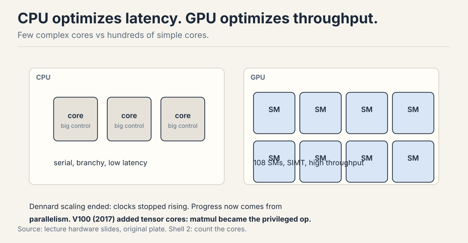
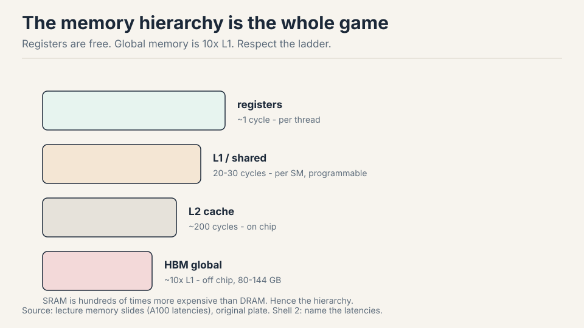
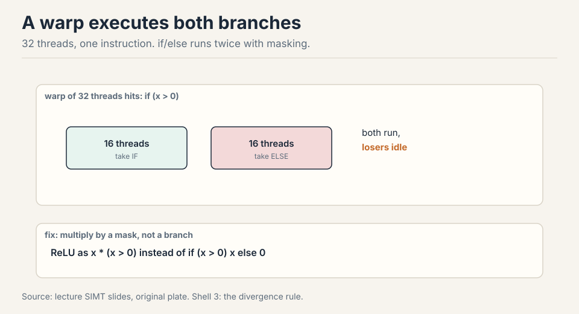
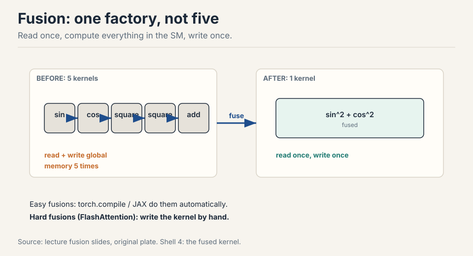
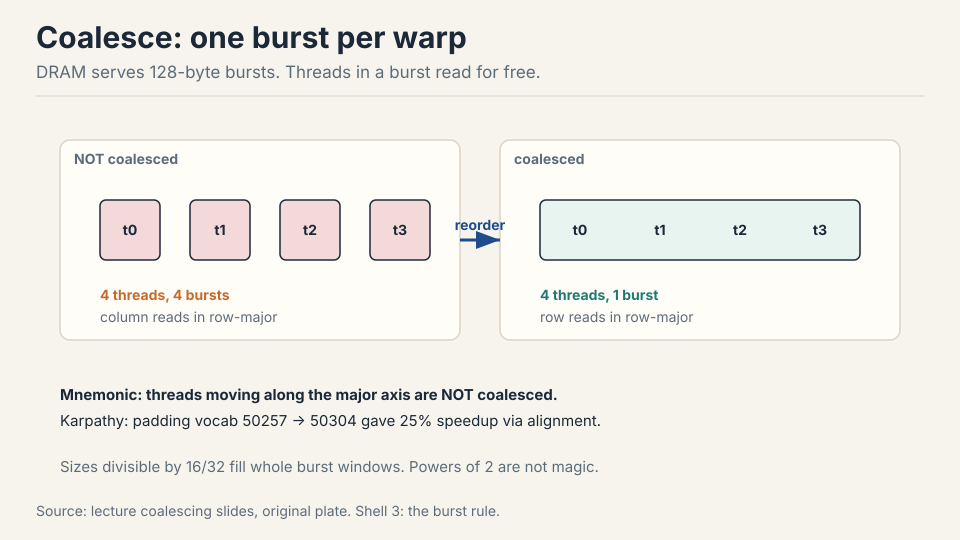
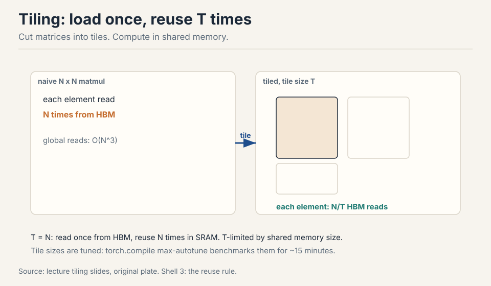
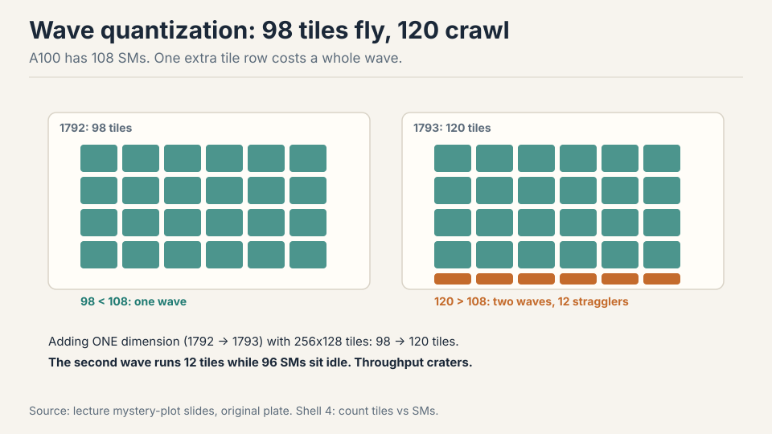
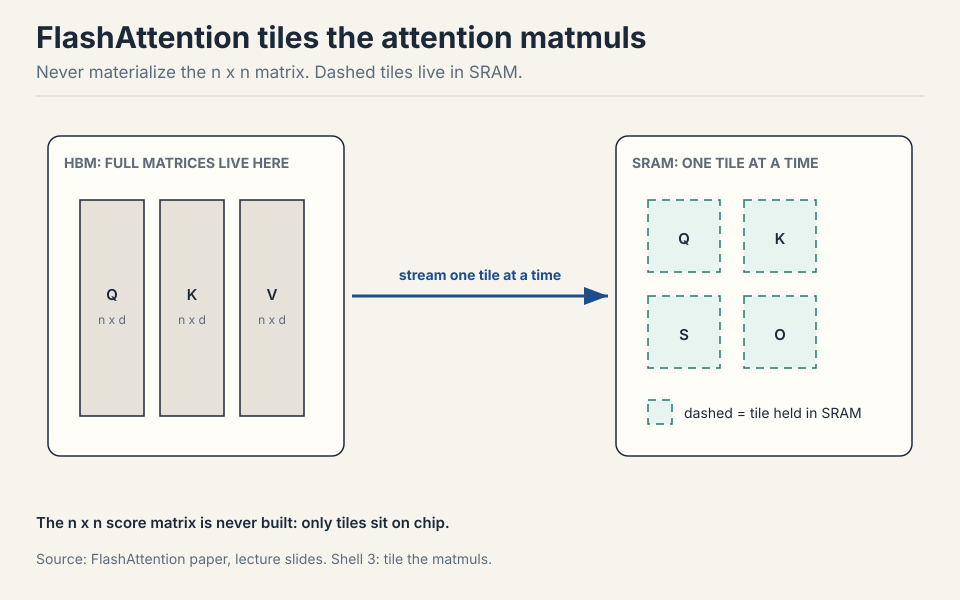
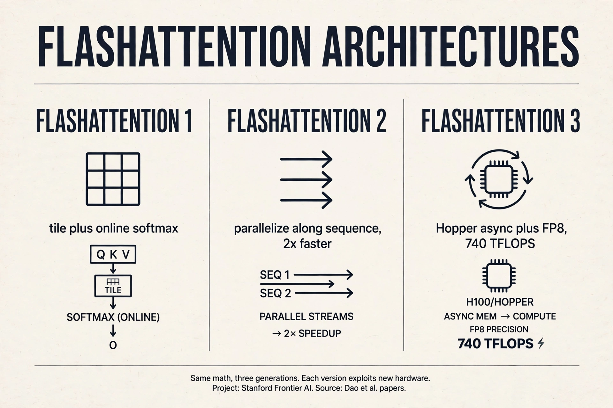
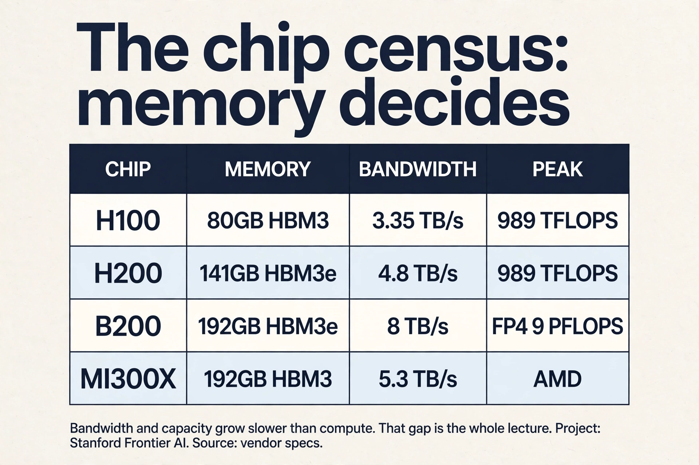

## The problem: the chip is fast, your code is not

An A100 has 108 streaming multiprocessors, thousands of cores, and a
spec sheet promising hundreds of TFLOP/s. Naive code gets a tenth of
that. The gap between the spec and your kernel is the entire subject
of systems work. This lecture closes it, in three parts: the hardware,
the tricks, the victory lap [03:20](ts:03:20).

## The old mental model, and why it broke

In the 1990s, computers got faster by raising clock speed. That ended
in the 2000s: smaller transistors stopped meaning faster clocks
(Dennard scaling ended) [04:56](ts:04:56). The field switched from
faster serial execution to wider parallel execution. GPUs are that
switch made silicon. The FLOPS curve tells the story: modest gains
through K20/M40, then a takeoff at P100/V100 driven by tensor cores,
structured sparsity, and lower number formats [06:26](ts:06:26).

So the first mental model to build: a CPU runs a few complex cores
with big control units. Complex branches, complex control flow, minimal
time from instruction to result. Design goal: **latency**
[07:31](ts:07:31). A GPU runs hundreds of simple cores executing in
parallel. One task may take long to finish, but aggregate throughput
across all tasks is enormous. Design goal: **throughput**.



## The SM is the unit

The **streaming multiprocessor** (SM) is the discrete compute unit of
a GPU: an independent core with its own subcomponents and memory access
[09:25](ts:09:25). Inside each SM sit streaming processors running
threads in parallel. An A100 carries 108 SMs, each independently
programmable.

Three terms carry the programming model [13:35](ts:13:35).

- **Thread:** one lightweight parallel worker. All threads obey SIMT:
  every thread executes the same instruction on different data.
- **Block:** a group of threads guaranteed to run on one SM, sharing
  that SM's shared memory. Blocks matter for tiling later.
- **Warp:** 32 consecutively numbered threads, the scheduling unit.
  The scheduler swaps whole warps quickly when one stalls.

Shared memory is programmable: you put things in and take them out.
The L1 cache is automatic: it just holds recent data
[12:54](ts:12:54). Beyond shared memory, everything is slow. Grouping
blocks to cut global reads is the name of the game
[17:08](ts:17:08).

> [!QA]
> Q: What is the difference between a block and a warp?
> A: A block is a programming unit: a group of threads guaranteed to land on one SM, sharing its shared memory. A warp is a hardware scheduling unit: 32 threads that always execute the same instruction together under SIMT. You organize work into blocks to control data sharing. The hardware schedules it in warps. Confusing them leads to bugs about what memory threads can share.
> Follow-up: Why 32 threads per warp?
> A: It amortizes scheduler overhead: one scheduling decision drives 32 threads. The number is architectural, not mathematical. What matters for you is the consequence: 32 threads move in lockstep, so make their memory accesses land in the same burst.

## Where data lives: the memory hierarchy

Compute is only half the story. Modern LLM optimization is defined by
memory: where data lives and how fast it moves [10:27](ts:10:27).



Registers are fastest and most local. L1 and shared memory answer in
20-30 cycles. L2 is slower. Global HBM is about 10x L1 latency.
Physically, global memory chips sit outside the compute die. L2 and L1
live on the chip, close to the SMs [11:40](ts:11:40).

Why not build everything from fast SRAM? It costs hundreds of times
more than DRAM and burns far more power [12:10](ts:12:10). Groq tried
giant SRAM (great for inference, expensive always). Everyone else lives
with the hierarchy and programs against it.

## Three curves diverge

Compute throughput climbs fast. Memory bandwidth climbs slowly.
Interconnect climbs slowest [25:31](ts:25:31). The growing gap is why
this lecture's tricks are memory tricks: every year, utilizing the
hardware takes more data-movement work. Inference hardware splits
already reflect this: prefill (matmul heavy) and decode (bandwidth
heavy) want different chips [28:52](ts:28:52).

One more fact before the tricks. Before V100, no dedicated matmul unit
existed: researchers hand-programmed shaders to multiply matrices
[24:35](ts:24:35). Tensor cores changed the game: matmul throughput
exceeds other FP ops by 10x or more. Any architecture that scales with
compute will contain a matmul, because nothing else converts silicon
to FLOPs as efficiently.

## Where naive code breaks, six demonstrations

### Break 1: branches idle the warp

SIMT means every thread in a warp executes the same instruction. An if
statement runs both branches: each side executes while the other side's
threads sit idle and masked [32:57](ts:32:57).



This is **control divergence**. Work the waste: a warp of 32 threads
hits `if (x > 0)`. Sixteen take the branch, sixteen do not. Both paths
execute. Sixteen threads idle through each path. Half the warp's
throughput is gone. The fix: multiply by a mask instead of branching.
ReLU as `x * (x > 0)` beats `if (x > 0) x else 0`, because the multiply
runs uniformly [34:26](ts:34:26).

### Break 2: half the bits, half the traffic

Halve the bits, halve the bytes moved, halve the memory bottleneck.
The subtlety: tensor cores downcast inputs, accumulate partial sums in
full precision, and emit fp32 [36:34](ts:36:34). The black art is
choosing which op gets which format: matmuls can be low precision,
softmax and exponentials usually need fp32.

FP8 has no single format: E4M3 (range) vs E5M2 (precision), chosen per
use [38:04](ts:38:04). MXFP8 goes further: one scale factor per 32
elements, scales stored as E8M0 (pure powers of two)
[39:45](ts:39:45). The trap: transposing an MXFP8 matrix breaks the
scaling pattern, so training keeps two copies of every quantized
matrix, one for each orientation [41:16](ts:41:16). Real savings are
20-30%, not 2x: quantization overhead eats the rest. MXFP4 (-6 to 6,
per-16 scales) is next. First and last layers resist quantization: the
last layer drives the loss directly [42:48](ts:42:48).

> [!QA]
> Q: Why does MXFP8 keep two copies of every matrix?
> A: MXFP8 attaches one scale factor to each block of 32 elements. Transpose the matrix and the blocks land in different positions: the scaling pattern no longer matches the data. Requantizing on every transpose would be prohibitive, so the framework stores both orientations pre-quantized. It is a memory-for-sanity trade that shows how exotic sub-8-bit formats get.
> Follow-up: Why not quantize the first and last layers?
> A: The last layer's outputs feed the loss directly, so quantization error there propagates undiluted into every gradient. The first layer sees raw input distributions with the widest dynamic range. Both are high-stakes, low-redundancy positions: the accuracy cost of quantizing them exceeds the throughput gain.

### Break 3: small ops mean round trips

Think of the GPU as a factory with a warehouse (memory) and a conveyor
belt between them. Five small ops mean five round trips. Fuse them into
one kernel: read once, compute everything inside the SM, write once
[47:43](ts:47:43).



Easy fusions (sin^2+cos^2) are automatic via torch.compile or JAX.
Hard fusions (FlashAttention) are hand-written kernels. Same idea,
different effort.

### Break 4: storing costs more than recomputing

Backprop stores activations, then reads them on the backward pass. With
compute cheap and memory dear, throw the activations away and
recompute them during backward [50:13](ts:50:13).

```ascii
naive     : 1 read + 3 writes fwd, 3 reads + 1 write bwd = 8 accesses
recompute : 1 read + 1 write fwd, recompute on the fly = 5 accesses
same math, 5/8 the memory traffic
```

Example: x through three sigmoids. Naive: 1 read + 3 writes forward, 3
reads + 1 write backward = 8 accesses. Recompute: forward 1 read + 1
write. Backward re-runs the sigmoids on the fly: 5 total. Same math,
5/8 the memory traffic, a little extra compute. (This is Lecture 2's
checkpointing, seen from the kernel's point of view.)

### Break 5: scattered reads waste the burst

DRAM serves bursts: one access returns about 128 contiguous bytes, the
rest effectively free [53:52](ts:53:52). If all threads in a warp fall
in one burst, the access is **coalesced**: full utilization of the
burst.



Work the waste. Four threads need four 4-byte values: 16 bytes of real
data. Scattered across four bursts, that costs 4 x 128 = 512 bytes of
bandwidth: 3% utilization. Inside one burst, 16 bytes out of 128: 12.5%
utilization, 4x better. For row-major matrices, threads sweeping along
rows coalesce. Threads sweeping down columns touch four bursts for
four values. Mnemonic: threads moving along the major axis are not
coalesced [56:22](ts:56:22).

### Break 6: every element read N times

Cut matrices into tiles, load each tile into shared memory once, and do
all reuse there [57:51](ts:57:51).



Naive N x N matmul reads each element N times from HBM. With tile size
T, each element is read N/T times from HBM and T times from shared
memory. At T = N, one HBM read and N fast reuses. Tile sizes are tuned,
not guessed: torch.compile max-autotune benchmarks candidates for
minutes [63:31](ts:63:31). Misaligned tiles break coalescing, hence
padding: Karpathy's vocab 50257 to 50304 bought 25% speedup through
alignment alone [65:18](ts:65:18).

## Two mystery plots, solved

Plot matmul throughput vs matrix size and color by divisibility. Sizes
divisible by 1 or 2 crawl. 8 improves. 16 and 32 are equivalent and
fast [66:39](ts:66:39). Not magic: 16 and 32 fill whole burst windows,
so tiles read coalesced.

The periodic craters are **wave quantization**. At 1792 with 256x128
tiles: 98 tiles, fits in 108 SMs, one wave. At 1793: 120 tiles, needs
two waves, and the second wave runs 12 tiles while 96 SMs idle
[68:08](ts:68:08).



One extra dimension. Twelve tiles in the second wave. Ninety-six SMs
idle. A crater in the throughput plot. Count your tiles against your
SMs.

## The key question

Six breaks, one theme. Branches idle threads. Bits cost traffic. Small
ops cost round trips. Storage costs reads. Scatter wastes bursts.
Untiled reads repeat N times. What if every optimization is a
data-movement optimization? Then the fastest attention kernel ever
written is just these six tricks, applied to one op, all at once.

## FlashAttention: the victory lap

Attention = three matmuls + one global softmax. The softmax couples all
tiles, which seems to defeat tiling. The escape is the **online
softmax**: sweep blocks, track the running max m and running sum l,
rescale when a new max appears [74:07](ts:74:07).

```ascii
m_new = max(m, rowmax of this tile)
rescale accumulated sum by exp(m_old - m_new)
each tile's softmax needs no future tiles
```

Work the idea on one row. Tiles arrive left to right. After tile 1, the
max is 3, the sum is 12. Tile 2 has max 5. Rescale: multiply the old
sum by e^(3-5) = 0.135, add tile 2's sum. The running statistics are
exact, and no tile ever waits for a future one. Keep K/Q/V tiles in
SRAM, accumulate the softmax statistics in registers, multiply by V in
tiles, divide once at the end. Fuse it all into one kernel. On the
backward pass, recompute instead of storing the n x n matrix
[76:51](ts:76:51).



That is FlashAttention: tiling + online softmax + fusion +
recomputation. Every trick in this lecture, in one kernel. The n x n
score matrix is never materialized. The backward pass recomputes it on
the fly.

### Subchapter: FlashAttention 1, 2, 3 (one idea per version)

Same math, three generations. Each version adds one idea about the
hardware.

**FlashAttention-1 (2022).** The lecture's version: tiling, online
softmax, fusion, recomputation. The n x n matrix is never
materialized. The idea: make attention IO-aware.

**FlashAttention-2 (2023).** Same math, better scheduling.
Parallelize across thread blocks along the sequence-length
dimension: FA1 only split batch and heads, which starved the GPU at
small batch sizes. Halve the non-matmul FLOPs with better rescaling
math. About 2x faster than FA1. One idea added: schedule the same
work better.

**FlashAttention-3 (2024).** Written for Hopper's async hardware.
Three ideas in one version: warp specialization (some warps load,
some compute, so loads and math overlap), ping-pong GEMM-softmax
(the slow exp unit runs while tensor cores run), and FP8 with
incoherent processing (multiply by a random Hadamard matrix first:
outliers spread across dims, error 2.6x lower). 740 TFLOPS in FP16:
75% of the H100's 989 peak, 1.5 to 2x over FA2. One idea added:
exploit the chip's async hardware.

The ladder: correct IO, then schedule, then async hardware. As of
early 2026, FA3 has no full Blackwell port: FA2 runs on B200 through
its general path. Kernels track chips, not just papers.



> [!QA]
> Q: Walk me through the online softmax on one row with numbers.
> A: Row scores arrive in two tiles. Tile 1: [3, 1]. Running max m = 3. Running sum l = e^(3-3) + e^(1-3) = 1 + 0.135 = 1.135. Tile 2: [5, 2]. New max m = 5. Rescale the old sum: 1.135 x e^(3-5) = 1.135 x 0.135 = 0.153. Add tile 2's sum: e^(5-5) + e^(2-5) = 1 + 0.050 = 1.050. New l = 1.203. True denominator for [3,1,5,2]: 20.09 + 2.72 + 148.41 + 7.39 = 178.6. Rescaled: 1.203 x e^5 = 1.203 x 148.41 = 178.5. Exact up to rounding. No tile ever waited for a future tile.
> Follow-up: Why track the max at all instead of just summing exponentials?
> A: Exponentials overflow: e^90 exceeds fp32. Subtracting the running max keeps every exponent at or below 0, so nothing overflows. The rescale step corrects for the max changing. It is numerical hygiene that also enables tiling: one mechanism solves both problems.

> [!QA]
> Q: Why does FlashAttention-2 beat FlashAttention-1 if the math is identical?
> A: Scheduling. FA1 parallelized over batch and heads only, which starved the GPU at small batch sizes: too few thread blocks to fill 108 SMs. FA2 also parallelizes along the sequence-length dimension, so every sequence length yields enough blocks. It also rewrote the rescaling math to halve non-matmul FLOPs. Same outputs, better occupancy, less overhead: about 2x faster. The lesson: the algorithm was fine. The mapping to hardware was not.
> Follow-up: What does that imply for writing your own kernels?
> A: Parallelism structure matters as much as the math. Always ask: along which dimensions does this kernel split work, and is there enough work per SM? A correct kernel with a bad split is a slow kernel.

> [!QA]
> Q: When does FlashAttention not help?
> A: When attention is not the bottleneck. During decode, each step is a memory-bound matrix-vector operation: the KV cache reads dominate, and no attention kernel changes that. FlashAttention helps prefill and training, where the n x n computation actually happens. It also does not help short sequences: launch and tiling overhead exceed the savings. The interview signal: name the regime (long-sequence prefill and training) before prescribing the tool.
> Follow-up: What helps decode instead?
> A: Everything that shrinks memory traffic: GQA and MLA (smaller KV cache), cache quantization, and speculative decoding (fewer steps). Decode is a bandwidth problem, so the fixes are bandwidth fixes.

## TPUs, the convergent cousin

TPUs are the alternative evolution of the same idea: an
energy-efficient ML accelerator converges to the same shape
[17:18](ts:17:18). Same memory hierarchy (HBM + fast local memory),
same matrix-multiply unit (systolic arrays underneath both), same
concepts with different names.

The differences: TPUs use few giant matrix units (2 cores, 8 MXUs) vs
the GPU's many small ones (100+ SMs, hundreds of tensor cores). Giant
units are less flexible: a TPU tensor core refuses inputs below 64
dims, so batch sweeps stop at 64 [21:46](ts:21:46). Naming trap: a TPU
"tensor core" is a processor. A GPU "tensor core" is a matrix-multiply
unit [20:30](ts:20:30).

### Subchapter: what is used where (the chip census, October 2026)

Verified against vendor specs as of October 2026.

| Chip | Memory | Bandwidth | Dense peak | Notes |
|---|---|---|---|---|
| H100 | 80GB HBM3 | 3.35 TB/s | 989 TFLOP/s bf16 | the training workhorse |
| H200 | 141GB HBM3e | 4.8 TB/s | 989 TFLOP/s bf16 | same compute, 1.8x memory: the inference pick |
| B200 | 192GB HBM3e | 8 TB/s | 9 PFLOP/s FP4 | 2.4x memory and bandwidth over H100 |
| MI300X (AMD) | 192GB HBM3 | 5.3 TB/s | [uncertain] | the memory-capacity alternative |

Read the trend. Compute leaps (989 TFLOP/s to 9 PFLOP/s). Memory
crawls (80GB to 192GB). The gap between the curves is the whole
lecture, and it widens every generation. Inference fleets buy memory:
an 8xB200 node holds 1.5TB of HBM, so a 405B model in FP4 with a 32K
context fits on one node. Training fleets buy FLOPs per dollar, where
deployed H100s still compete.



> [!QA]
> Q: Your kernel runs at 10% of peak. Debug it in order.
> A: First, compute arithmetic intensity and check the roofline. If the op sits left of the knee, it is memory bound and no tuning reaches peak: fuse it or remove passes. Second, check occupancy: wave quantization means a bad tile count leaves SMs idle, so count tiles against SMs. Third, check divergence: profile warp execution efficiency. Branches idle threads, so mask instead. Fourth, check precision: are tensor cores actually engaged, or is the math running on CUDA cores in fp32? Fifth, check alignment: sizes divisible by 16 or 32 coalesce, and padding buys real speed. The order matters: intensity first, because a memory-bound op defeats all the other fixes.
> Follow-up: When do you stop tuning?
> A: When the kernel sits at its roofline ceiling: actual throughput matches bandwidth times intensity for memory-bound ops, or a high fraction of peak for compute-bound ones. FlashAttention-3 reaches 75% of H100 peak. That is the neighborhood of done.

> [!QA]
> Q: H100 or B200 for an inference fleet in late 2026?
> A: B200, on memory grounds. Inference is memory bound: the KV cache and weights must fit, and bandwidth sets tokens per second. B200 has 192GB vs 80GB and 8 TB/s vs 3.35 TB/s, plus native FP4 that halves weight memory. H100 remains the cost-efficient training workhorse where it is already deployed. The rule: training buys FLOPs, inference buys memory.
> Follow-up: Why not always wait for the next chip?
> A: Because allocation is the constraint. The newest chips are supply-limited and priced accordingly. The fleet decision is total cost per token, not peak specs. Buy the chip you can actually get at the price that clears your margin.

## Mapping back: what each trick fixes

| Break | Trick | How |
|---|---|---|
| Branches idle the warp | Mask, never branch | `x * (x > 0)`: one instruction, all threads work. |
| Bytes cost traffic | Low precision | bf16/fp8: halve the bytes. Tensor cores accumulate in fp32. |
| Small ops = round trips | Fusion | One kernel: read once, compute inside, write once. |
| Storing costs reads | Recomputation | 8 accesses become 5. Trade cheap compute for dear memory. |
| Scatter wastes bursts | Coalescing | Keep each warp in one 128-byte burst. |
| Elements read N times | Tiling | N/T HBM reads, T fast shared reuses. Tune, pad, align. |
| 96 SMs idle | Count tiles | 1792: one wave. 1793: two waves, a crater. |
| n x n materialized | FlashAttention | Online softmax + tiling + fusion + recompute. |

## The honest price

Every trick has a tax. Low precision needs format archaeology per op.
Fusion that compilers cannot do is hand-written and brittle. Tiling
sizes are tuned per chip, and the tuning takes minutes per shape.
Wave quantization means one extra dimension can crater throughput for
no mathematical reason. And the three curves keep diverging: compute
climbs fast, bandwidth slowly, interconnect slowest. Every year the
tricks matter more. The hardware will not save you. The memory model
will.

## Recap: the whole lesson on one screen

The story in eight steps. Each step answers the one before it.

1. **The chip is fast, your code is not.** Dennard ended. Clocks
   stopped scaling. GPUs are the parallel switch made silicon:
   throughput, not latency.
2. **The SM is the unit.** 108 on an A100. Threads run SIMT. Blocks
   share one SM's memory. Warps of 32 schedule together.
3. **Memory is the hierarchy.** Registers ~1 cycle, shared 20-30, HBM
   ~10x L1. SRAM costs hundreds of times DRAM. Program against the
   hierarchy or pay.
4. **Branches idle the warp.** if/else runs both sides. Mask instead:
   `x * (x > 0)`.
5. **Bits cost traffic.** Halve the bits, halve the bottleneck. bf16
   for range, fp8 per op, MXFP8 per-32 scales with two copies for
   transpose. Real savings 20-30%.
6. **Fuse, recompute, coalesce, tile.** One kernel: read once, write
   once. 8 accesses become 5. One burst per warp. N/T HBM reads.
7. **Count tiles against SMs.** 1792 fits 108 SMs in one wave. 1793
   needs two waves and 96 SMs idle. Divisibility 16/32 wins.
8. **FlashAttention is all six.** Tiled matmuls, online softmax with
   running max, one fused kernel, recomputed backward. Never
   materialize n x n.

## Go deeper

<div style="position:relative;padding-bottom:56.25%;height:0;overflow:hidden;max-width:100%;margin:16px 0;">
<iframe style="position:absolute;top:0;left:0;width:100%;height:100%;" src="https://www.youtube-nocookie.com/embed/9vcsZK3a76w" title="FlashAttention Explained" frameborder="0" allow="accelerometer; autoplay; clipboard-write; encrypted-media; gyroscope; picture-in-picture" allowfullscreen></iframe>
</div>
- FlashAttention Explained (the embed above): https://www.youtube.com/watch?v=9vcsZK3a76w
- Dao et al., FlashAttention: https://arxiv.org/abs/2205.14135
- Dao, FlashAttention-2: https://arxiv.org/abs/2307.08691
- Shah et al., FlashAttention-3: https://arxiv.org/abs/2407.08608

## Official sources and further reading

**Official:**
- Lecture 5 video.
- Dao et al. (2022): FlashAttention, the tiled exact-attention paper.

**Further reading:**
- Horace He's GPU blogs: the clearest written versions of these
  mechanics.
- GPU Mode community: kernels, exercises, and the speedrun culture.
- Google's TPU/GPU book: exercises matching the assignment style.

**Caveats from these sources.** SM counts and latencies are A100-era
numbers. Newer chips differ in degree, not in kind. MXFP8/MXFP4 details
track NVIDIA's evolving formats. Check the current spec before
implementing. The 20-30% MXFP8 savings are workload-dependent.

## Connections to the other courses

- **CS336 L06:** Triton kernels are hand-written versions of these
  tricks: blocks, tiling, coalescing, fusion.
- **CS336 L07/L08:** parallelism lectures tile across devices the way
  this lecture tiles across SMs.
- **CS336 L10:** inference reuses fusion and recomputation. Decode is
  the bandwidth-heavy half of the diverging curves.
- **CS229S:** the device block starts here: SM counts, HBM sizes, and
  the compute/bandwidth gap curves.
- **CS229:** the roofline here is the same diagnostic as the intensity
  analysis in L02.
