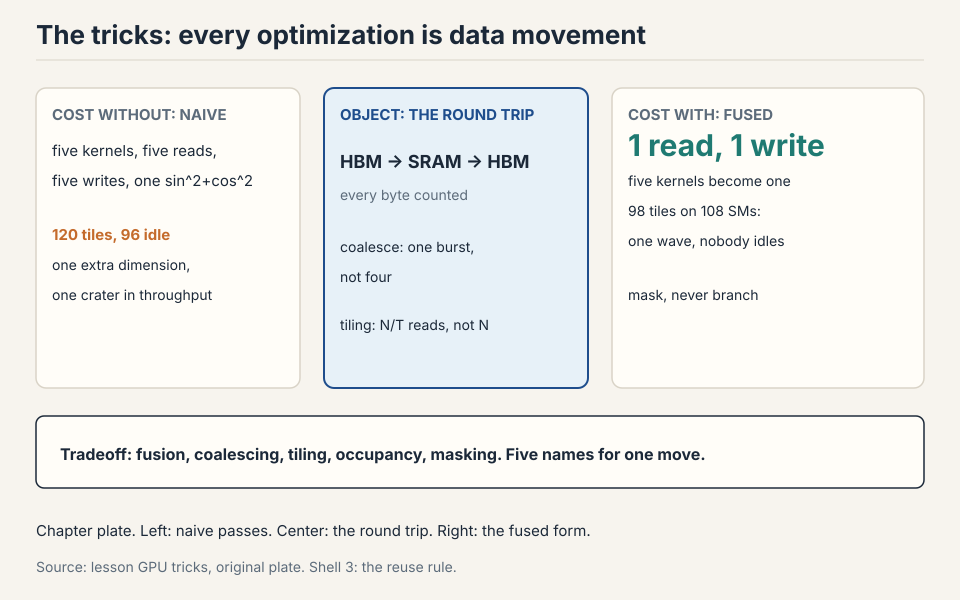
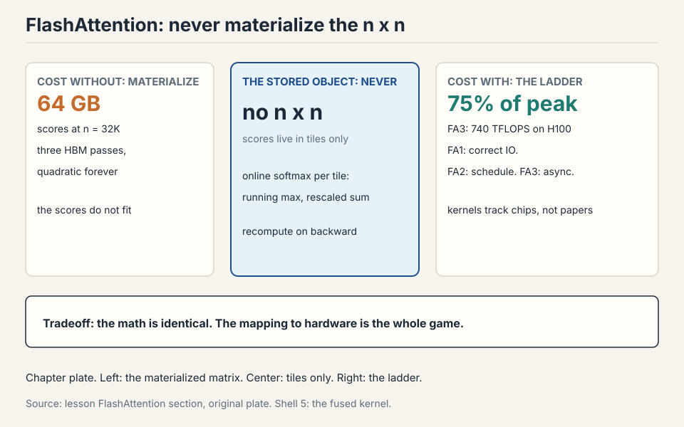

## How to read this lesson

No prerequisites are assumed. Every term is defined at first use.
This lecture has three parts: the hardware, the tricks, the victory
lap. The hardware tells you what the chip can do. The tricks tell you
why naive code gets a tenth of it. FlashAttention is an exact-attention
algorithm. It applies all six tricks to one op at once.

## The problem: the chip is fast, your code is not

An A100 has 108 streaming multiprocessors, thousands of cores, and a
spec sheet promising hundreds of TFLOP/s. Naive code gets a tenth of
that. The gap between the spec and your kernel is the entire subject
of systems work.

## The old mental model, and why it broke

In the 1990s, computers got faster by raising clock speed. That ended
in the 2000s: smaller transistors stopped meaning faster clocks
(Dennard scaling ended). The field switched from faster serial
execution to wider parallel execution. GPUs are that switch made
silicon. The FLOPS curve tells the story: modest gains through
K20/M40, then a takeoff at P100/V100 driven by tensor cores (dedicated
matrix-multiply units), structured sparsity, and lower number formats.

So the first mental model to build: a CPU runs a few complex cores
with big control units. Complex branches, complex control flow,
minimal time from instruction to result. Design goal: **latency**.
A GPU runs hundreds of simple cores executing in parallel. One task
may take long to finish, but aggregate throughput across all tasks
is enormous. Design goal: **throughput**.


### Subchapter: the numbers behind the switch

A modern CPU: 32 to 96 cores, each ~5 GHz, each doing ~64 FLOPs per
cycle with vector units. Peak: roughly 10 to 30 TFLOP/s fp32. An
H100: 144 SMs, each with 128 CUDA cores and 4 tensor cores. Peak:
989 TFLOP/s dense bf16. The GPU's peak is 30 to 100x the CPU's. The
catch: the GPU only reaches it on parallel matrix math. Serial code
runs slower on a GPU than on a CPU. The switch was not free. It
traded latency for throughput, and ML happened to be the workload
that only needs throughput.

## The SM is the unit

The **streaming multiprocessor** (SM) is the discrete compute unit
of a GPU: an independent core with its own subcomponents and memory
access. Inside each SM sit streaming processors running threads in
parallel. An A100 carries 108 SMs, each independently programmable.
An H100 carries 144.

### Subchapter: thread, block, warp

Three terms carry the programming model.

- **Thread:** one lightweight parallel worker. All threads obey
  SIMT: every thread executes the same instruction on different
  data.
- **Block:** a group of threads guaranteed to run on one SM,
  sharing that SM's shared memory. Blocks matter for tiling later.
- **Warp:** 32 consecutively numbered threads, the scheduling unit.
  The scheduler swaps whole warps quickly when one stalls.

Shared memory is programmable: you put things in and take them out.
The L1 cache is automatic: it just holds recent data. Beyond shared
memory, everything is slow. Grouping blocks to cut global reads is
the name of the game.

### Subchapter: the SM's own memory, with numbers

Each H100 SM holds: a 256 KB register file (65,536 32-bit registers
shared by all resident threads), up to 228 KB of combined L1/shared
memory, and 4 tensor cores. Times 144 SMs: 36 MB of registers and up
to 32 MB of shared memory chip-wide, against 80 GB of HBM.

Read the ratio. The fast memory is 0.1 percent of the total. Every
byte the SM touches must be fetched from HBM through this tiny
window. The whole lecture is about managing that window: what to
keep in it, how to reuse it, and how to avoid going back for more.

> [!QA]
> Q: What is the difference between a block and a warp?
> A: A block is a programming unit: a group of threads guaranteed to land on one SM, sharing its shared memory. A warp is a hardware scheduling unit: 32 threads that always execute the same instruction together under SIMT. You organize work into blocks to control data sharing. The hardware schedules it in warps. Confusing them leads to bugs about what memory threads can share.
> Follow-up: Why 32 threads per warp?
> A: It amortizes scheduler overhead: one scheduling decision drives 32 threads. The number is architectural, not mathematical. What matters for you is the consequence: 32 threads move in lockstep, so make their memory accesses land in the same burst.

## Where data lives: the memory hierarchy

Compute is only half the story. Modern LLM optimization is defined
by memory: where data lives and how fast it moves.


### Subchapter: the ladder, rung by rung

Registers are fastest and most local: ~1 cycle. L1 and shared memory
answer in 20-30 cycles. L2 is slower. Global HBM is about 10x L1
latency. Physically, global memory chips sit outside the compute
die. L2 and L1 live on the chip, close to the SMs.

Work the H100's ladder: 80 GB HBM3 at 3.35 TB/s, 50 MB L2 at ~12
TB/s, 32 MB shared/L1, 36 MB registers at ~100+ TB/s effective.
Each rung is ~10x smaller and ~3x faster than the one below. The
kernel's job is to keep data as high on the ladder as possible for
as long as possible.

### Subchapter: why not all SRAM

Why not build everything from fast SRAM? It costs hundreds of times
more than DRAM and burns far more power. Groq tried giant SRAM
(great for inference, expensive always). Everyone else lives with
the hierarchy and programs against it. The hierarchy is an economic
fact, not a design choice anyone would reverse.

## Tensor cores: the matmul engine

Before V100, no dedicated matmul unit existed: researchers
hand-programmed shaders to multiply matrices. Tensor cores changed
the game: matmul throughput exceeds other FP ops by 10x or more. Any
architecture that scales with compute will contain a matmul, because
nothing else converts silicon to FLOPs as efficiently.

### Subchapter: what a tensor core computes

A tensor core computes D = A x B + C on small matrices in one
instruction. V100/A100: 4x4x4 per clock per core. H100's wgmma
(warpgroup matrix-multiply-accumulate): much larger tiles, async.
The programming consequence: matrix dims should be multiples of 8
(minimum) or 16 (good). Odd sizes leave tensor cores idle and fall
back to slow CUDA cores.

### Subchapter: the 10x gap, worked

H100 dense bf16: 989 TFLOP/s on tensor cores. H100 fp32 on CUDA
cores: 67 TFLOP/s. Ratio: 14.8x. Code that accidentally runs in
fp32 (a forgotten cast, a CPU-side op) pays 15x. This is the most
expensive common bug in training: everything looks correct, the
loss falls, but the run takes 15 times longer than it should. Check
dtypes before checking anything else.

## Three curves diverge

Compute throughput climbs fast. Memory bandwidth climbs slowly.
Interconnect climbs slowest. The growing gap is why this lecture's
tricks are memory tricks: every year, utilizing the hardware takes
more data-movement work. Inference hardware splits already reflect
this: prefill (matmul heavy) and decode (bandwidth heavy) want
different chips.

### Subchapter: the curves, with numbers

H100: 989 TFLOP/s dense bf16 compute (NVIDIA's 1,979 headline figure assumes 2x structured sparsity), 3.35 TB/s memory, 900 GB/s NVLink (the GPU-to-GPU link).
B200: ~4,500 TFLOP/s dense FP8 compute (NVIDIA's 9,000 figure assumes 2x structured sparsity), 8 TB/s memory, 1.8 TB/s NVLink.
Like-for-like (dense FP8): 4,500 vs 1,979, about 2.3x. Memory grew 2.4x. Interconnect grew 2x. The headline 9x mixes three doublings: 2.3x chip growth, 2x from the bf16-to-FP8 precision change, 2x from sparsity. Every
generation, the chip gets relatively more starved for data. The
tricks in this lecture are not optimizations. They are the price of
admission, rising every generation.

## Where naive code breaks, six demonstrations

### Break 1: branches idle the warp

SIMT means every thread in a warp executes the same instruction. An
if statement runs both branches: each side executes while the other
side's threads sit idle and masked.


This is **control divergence**. Work the waste: a warp of 32 threads
hits `if (x > 0)`. Sixteen take the branch, sixteen do not. Both
paths execute. Sixteen threads idle through each path. Half the
warp's throughput is gone. The fix: multiply by a mask instead of
branching. ReLU as `x * (x > 0)` beats `if (x > 0) x else 0`,
because the multiply runs uniformly.

### Subchapter: the nested-branch disaster

One if costs half the warp. Nested ifs cost more: 4 paths, each
executing, each with 3/4 of the warp idle. A warp with 4 nested
branches runs at 1/4 throughput. The fix is the same: flatten the
branches into arithmetic. `out = a * c1 + b * c2 + d * c3` with
one-hot conditions runs at full throughput. Branchy code is the
slowest code on a GPU, and the profiler will not flag it: the
instructions all execute, they just execute idle.

### Break 2: half the bits, half the traffic

Halve the bits, halve the bytes moved, halve the memory bottleneck.
The subtlety: tensor cores downcast inputs, accumulate partial sums
in full precision, and emit fp32. The black art is choosing which op
gets which format: matmuls can be low precision, softmax and
exponentials usually need fp32.

FP8 has no single format: E4M3 (range) vs E5M2 (precision), chosen
per use. MXFP8 goes further: one scale factor per 32 elements,
scales stored as E8M0 (pure powers of two). The trap: transposing an
MXFP8 matrix breaks the scaling pattern, so training keeps two
copies of every quantized matrix, one for each orientation. Real
savings are 20-30%, not 2x: quantization overhead eats the rest.
MXFP4 (-6 to 6, per-16 scales) is next. First and last layers resist
quantization: the last layer drives the loss directly.

> [!QA]
> Q: Why does MXFP8 keep two copies of every matrix?
> A: MXFP8 attaches one scale factor to each block of 32 elements. Transpose the matrix and the blocks land in different positions: the scaling pattern no longer matches the data. Requantizing on every transpose would be prohibitive, so the framework stores both orientations pre-quantized. It is a memory-for-sanity trade that shows how exotic sub-8-bit formats get.
> Follow-up: Why not quantize the first and last layers?
> A: The last layer's outputs feed the loss directly, so quantization error there propagates undiluted into every gradient. The first layer sees raw input distributions with the widest dynamic range. Both are high-stakes, low-redundancy positions: the accuracy cost of quantizing them exceeds the throughput gain.

### Subchapter: the E4M3 vs E5M2 choice, worked

A gradient tensor with values up to 1,000: E4M3 maxes near 448, so
it overflows. E5M2 maxes near 57,344, so it fits. An activation
tensor with values in [0, 1]: E4M3's 3 mantissa bits give 8 steps
per power of two, E5M2's 2 bits give 4. E4M3 resolves the small
values better. The framework assigns E5M2 to gradients and E4M3 to
activations by default. Override it when your tensors are unusual.
Silent overflow is the failure: the numbers look fine until the
loss explodes three hours later.

### Break 3: small ops mean round trips

Think of the GPU as a factory with a warehouse (memory) and a
conveyor belt between them. Five small ops mean five round trips.
Fuse them into one kernel: read once, compute everything inside the
SM, write once.


Easy fusions (sin^2+cos^2) are automatic via torch.compile or JAX.
Hard fusions (FlashAttention) are hand-written kernels. Same idea,
different effort.

### Subchapter: the LayerNorm fusion, worked

LayerNorm as five PyTorch ops: mean, subtract, variance, divide,
scale. Each op reads the full vector from HBM and writes it back:
5 reads + 5 writes = 10 passes over the data. Fused: 1 read, 1
write, the statistics computed in registers. 10 passes become 2.
At 4,096 dims in bf16: 10 x 8 KB = 80 KB of traffic becomes 16 KB.
This is why every framework ships a fused LayerNorm: the unfused
version is 5x the memory traffic for identical math.

### Break 4: storing costs more than recomputing

Backprop stores activations, then reads them on the backward pass.
With compute cheap and memory dear, throw the activations away and
recompute them during backward.

```ascii
naive     : 1 read + 3 writes fwd, 3 reads + 1 write bwd = 8 accesses
recompute : 1 read + 1 write fwd, recompute on the fly = 5 accesses
same math, 5/8 the memory traffic
```

Example: x through three sigmoids. Naive: 1 read + 3 writes forward,
3 reads + 1 write backward = 8 accesses. Recompute: forward 1 read +
1 write. Backward re-runs the sigmoids on the fly: 5 total. Same
math, 5/8 the memory traffic, a little extra compute. (This is
Lecture 2's checkpointing, seen from the kernel's point of view.)

### Break 5: scattered reads waste the burst

DRAM serves bursts: one access returns about 128 contiguous bytes,
the rest effectively free. If all threads in a warp fall in one
burst, the access is **coalesced**: full utilization of the burst.


Work the waste. Four threads need four 4-byte values: 16 bytes of
real data. Scattered across four bursts, that costs 4 x 128 = 512
bytes of bandwidth: 3% utilization. Inside one burst, 16 bytes out
of 128: 12.5% utilization, 4x better. For row-major matrices,
threads sweeping along rows coalesce. Threads sweeping down columns
touch four bursts for four values. Mnemonic: threads moving along
the major axis are not coalesced.

### Subchapter: the transpose tax

A matrix read row-wise coalesces. Read it column-wise and every warp
scatters. The fix is a transpose: pay one coalesced read plus one
coalesced write to flip the layout, then read the transposed matrix
row-wise. The transpose costs 2 passes. The scattered reads cost 32x
on every access. One transpose pays for itself the second time you
read the matrix. Libraries transpose eagerly for this reason.

### Break 6: every element read N times

Cut matrices into tiles, load each tile into shared memory once, and
do all reuse there.


Naive N x N matmul reads each element N times from HBM. With tile
size T, each element is read N/T times from HBM and T times from
shared memory. At T = N, one HBM read and N fast reuses. Tile sizes
are tuned, not guessed: torch.compile max-autotune benchmarks
candidates for minutes. Misaligned tiles break coalescing, hence
padding: Karpathy's vocab 50257 to 50304 bought 25% speedup through
alignment alone.

### Subchapter: the padding math

50257 is prime-ish: 50257 = 29 x 1733. No power of two divides it.
Tensor cores want multiples of 8 at minimum, 16 for good
throughput. 50304 = 2^7 x 3 x 131: divisible by 64. Padding the
vocab from 50257 to 50304 wastes 47 embedding rows (47 x 12,288 x 2
bytes = 1.2 MB) and buys 25% speedup on every embedding lookup and
every unembedding matmul. The waste is megabytes. The win is
forever. Pad everything the hardware touches.

## Two mystery plots, solved

Plot matmul throughput vs matrix size and color by divisibility.
Sizes divisible by 1 or 2 crawl. 8 improves. 16 and 32 are
equivalent and fast. Not magic: 16 and 32 fill whole burst windows,
so tiles read coalesced.

### Subchapter: wave quantization, worked

The periodic craters are **wave quantization**. At 1792 with 256x128
tiles: 98 tiles, fits in 108 SMs, one wave. At 1793: 120 tiles,
needs two waves, and the second wave runs 12 tiles while 96 SMs idle.


One extra dimension. Twelve tiles in the second wave. Ninety-six SMs
idle. A crater in the throughput plot. Count your tiles against your
SMs.

Work the general rule. Tiles T, SMs S. Waves = ceil(T / S). Idle
SMs in the last wave = S - (T mod S). At T = 120, S = 108: 2 waves,
96 idle. The fix: pick tile counts near multiples of the SM count.
215 tiles: 2 waves, 1 idle... still 2 waves. 108 tiles: 1 wave, 0
idle. The plot's craters are at every T just above a multiple of S.

## The key question

Six breaks, one theme. Branches idle threads. Bits cost traffic.
Small ops cost round trips. Storage costs reads. Scatter wastes
bursts. Untiled reads repeat N times. What if every optimization is
a data-movement optimization? Then the fastest attention kernel ever
written is just these six tricks, applied to one op, all at once.

## FlashAttention: the victory lap

Attention = three matmuls + one global softmax. The softmax couples
all tiles, which seems to defeat tiling. The escape is the **online
softmax**: sweep blocks, track the running max m and running sum l,
rescale when a new max appears.

```ascii
m_new = max(m, rowmax of this tile)
rescale accumulated sum by exp(m_old - m_new)
each tile's softmax needs no future tiles
```

Work the idea on one row. Tiles arrive left to right. After tile 1,
the max is 3, the sum is 12. Tile 2 has max 5. Rescale: multiply the
old sum by e^(3-5) = 0.135, add tile 2's sum. The running statistics
are exact, and no tile ever waits for a future one. Keep K/Q/V tiles
in SRAM, accumulate the softmax statistics in registers, multiply by
V in tiles, divide once at the end. Fuse it all into one kernel. On
the backward pass, recompute instead of storing the n x n matrix.


That is FlashAttention: tiling + online softmax + fusion +
recomputation. Every trick in this lecture, in one kernel. The n x n
score matrix is never materialized. The backward pass recomputes it
on the fly.

### Subchapter: the backward pass, why recompute wins

The forward pass could save the n x n scores for the backward pass.
At n = 32K: 1B scores, 2 GB in bf16, per head, per layer. Times 32
heads: 64 GB. The scores do not fit. Recompute: re-run the tiled
forward during backward, regenerating each tile's scores in SRAM
and immediately consuming them. Extra compute: one more forward
pass, about 1/3 of the step. Memory saved: the entire n x n matrix.
The trade is the chapter's Break 4 at full scale.

### Subchapter: FlashAttention 1, 2, 3 (one idea per version)

Same math, three generations. Each version adds one idea about the
hardware.

**FlashAttention-1 (2022).** The lecture's version: tiling, online
softmax, fusion, recomputation. The n x n matrix is never
materialized. The idea: make attention IO-aware.

**FlashAttention-2 (2023).** Same math, better scheduling.
Parallelize across thread blocks along the sequence-length
dimension: FA1 only split batch and heads, which starved the GPU at
small batch sizes. Halve the non-matmul FLOPs with better rescaling
math. About 2x faster than FA1. One idea added: schedule the same
work better.

**FlashAttention-3 (2024).** Written for Hopper's async hardware.
Three ideas in one version: warp specialization (some warps load,
some compute, so loads and math overlap), ping-pong GEMM-softmax
(the slow exp unit runs while tensor cores run), and FP8 with
incoherent processing (multiply by a random Hadamard matrix first:
outliers spread across dims, error 2.6x lower). 740 TFLOPS in FP16:
75% of the H100's 989 peak, 1.5 to 2x over FA2. One idea added:
exploit the chip's async hardware.

The ladder: correct IO, then schedule, then async hardware. As of
early 2026, FA3 has no full Blackwell port: FA2 runs on B200 through
its general path. Kernels track chips, not just papers.

| Version | The one idea | Hardware payoff |
|---|---|---|
| FA1 (2022) | make attention IO-aware: tiling, online softmax, fusion, recompute | the n x n matrix is never materialized |
| FA2 (2023) | schedule better: sequence-dim parallelism, halved non-matmul FLOPs | about 2x over FA1 |
| FA3 (2024) | exploit Hopper async: warp specialization, ping-pong GEMM-softmax, FP8 | 740 TFLOPS: 75% of the H100's 989 peak |

> [!QA]
> Q: Walk me through the online softmax on one row with numbers.
> A: Row scores arrive in two tiles. Tile 1: [3, 1]. Running max m = 3. Running sum l = e^(3-3) + e^(1-3) = 1 + 0.135 = 1.135. Tile 2: [5, 2]. New max m = 5. Rescale the old sum: 1.135 x e^(3-5) = 1.135 x 0.135 = 0.153. Add tile 2's sum: e^(5-5) + e^(2-5) = 1 + 0.050 = 1.050. New l = 1.203. True denominator for [3,1,5,2]: 20.09 + 2.72 + 148.41 + 7.39 = 178.6. Rescaled: 1.203 x e^5 = 1.203 x 148.41 = 178.5. Exact up to rounding. No tile ever waited for a future tile.
> Follow-up: Why track the max at all instead of just summing exponentials?
> A: Exponentials overflow: e^90 exceeds fp32. Subtracting the running max keeps every exponent at or below 0, so nothing overflows. The rescale step corrects for the max changing. It is numerical hygiene that also enables tiling: one mechanism solves both problems.

> [!QA]
> Q: Why does FlashAttention-2 beat FlashAttention-1 if the math is identical?
> A: Scheduling. FA1 parallelized over batch and heads only, which starved the GPU at small batch sizes: too few thread blocks to fill 108 SMs. FA2 also parallelizes along the sequence-length dimension, so every sequence length yields enough blocks. It also rewrote the rescaling math to halve non-matmul FLOPs. Same outputs, better occupancy, less overhead: about 2x faster. The lesson: the algorithm was fine. The mapping to hardware was not.
> Follow-up: What does that imply for writing your own kernels?
> A: Parallelism structure matters as much as the math. Always ask: along which dimensions does this kernel split work, and is there enough work per SM? A correct kernel with a bad split is a slow kernel.

> [!QA]
> Q: When does FlashAttention not help?
> A: When attention is not the bottleneck. During decode, each step is a memory-bound matrix-vector operation: the KV cache reads dominate, and no attention kernel changes that. FlashAttention helps prefill and training, where the n x n computation actually happens. It also does not help short sequences: launch and tiling overhead exceed the savings. The interview signal: name the regime (long-sequence prefill and training) before prescribing the tool.
> Follow-up: What helps decode instead?
> A: Everything that shrinks memory traffic: GQA and MLA (smaller KV cache), cache quantization, and speculative decoding (fewer steps). Decode is a bandwidth problem, so the fixes are bandwidth fixes.

## Multi-GPU: NVLink and the node

One GPU is the unit. Eight is the node. The node connects its GPUs
with **NVLink**: 900 GB/s per GPU on Hopper, 1.8 TB/s on Blackwell.
Compare PCIe: 64 GB/s. NVLink is 14x faster. The all-reduce from the
last lecture runs over NVLink inside the node and over InfiniBand
(~50 GB/s per GPU) between nodes.

### Subchapter: the node as a memory pool

8 H100s: 640 GB of HBM, 27 TB/s of aggregate bandwidth, 900 GB/s
between any two GPUs. A 70B model in bf16 is 140 GB: it fits on one
GPU, but the KV cache at long context does not. Tensor parallelism
splits the model across the 8 GPUs: each holds 17.5 GB of weights,
and the NVLink all-reduce synchronizes every layer. The node is the
reason 70B models serve at all: no single GPU holds the working
set, but the node does.

### Subchapter: why interconnect is the slowest curve

NVLink 4 (Hopper): 900 GB/s. NVLink 5 (Blackwell): 1.8 TB/s. Two
generations, 2x. Compute in the same span: 2.3x like-for-like (the
9x headline mixes precision and sparsity). The interconnect
falls further behind every generation, which is why the parallelism
lectures minimize cross-GPU traffic: the less you move, the less
the slowest curve matters.

## TPUs, the convergent cousin

TPUs are the alternative evolution of the same idea: an
energy-efficient ML accelerator converges to the same shape. Same
memory hierarchy (HBM + fast local memory), same matrix-multiply
unit (systolic arrays underneath both), same concepts with different
names.

The differences: TPUs use few giant matrix units (2 cores, 8 MXUs)
vs the GPU's many small ones (100+ SMs, hundreds of tensor cores).
Giant units are less flexible: a TPU tensor core refuses inputs
below 64 dims, so batch sweeps stop at 64. Naming trap: a TPU
"tensor core" is a processor. A GPU "tensor core" is a
matrix-multiply unit.

### Subchapter: the systolic array, one idea

A GPU's tensor core is a small parallel multiplier. A TPU's MXU is
a **systolic array**: data flows through a grid of multiply-add
units like blood through a heart, each unit adding its product and
passing the sum along. The array computes a full matmul with each
weight loaded once and each activation flowing past. Same math as
the GPU. Different dataflow: the TPU moves the data through the
compute, the GPU moves the compute to the data (tiles in shared
memory). Convergent evolution, two implementations.

## What is used where: the chip census, October 2026

Verified against vendor specs as of October 2026.

| Chip | Memory | Bandwidth | Dense peak | Notes |
|---|---|---|---|---|
| H100 SXM | 80GB HBM3 | 3.35 TB/s | 989 TFLOP/s bf16 | the training workhorse |
| H200 SXM | 141GB HBM3e | 4.8 TB/s | 989 TFLOP/s bf16 | same compute, 1.8x memory: the inference pick |
| B200 SXM | 192GB HBM3e | 8 TB/s | ~4.5 PFLOP/s FP8 (dense) | 2.4x memory and bandwidth over H100 |
| MI300X (AMD) | 192GB HBM3 | 5.3 TB/s | [uncertain] | the memory-capacity alternative |
| TPU v5p | 95GB HBM | 4.6 TB/s [uncertain] | [uncertain] | Google's fleet chip |

Read the trend. Compute leaps (989 TFLOP/s to 4.5 PFLOP/s dense, part
precision change, part chip). Memory
crawls (80GB to 192GB). The gap between the curves is the whole
lecture, and it widens every generation. Inference fleets buy
memory: an 8xB200 node holds 1.5TB of HBM, so a 405B model in FP4
with a 32K context fits on one node. Training fleets buy FLOPs per
dollar, where deployed H100s still compete. AMD's MI300X competes
on memory capacity (192GB) for inference fleets that want an
alternative.

The census table above is the figure.

> [!QA]
> Q: Your kernel runs at 10% of peak. Debug it in order.
> A: First, compute arithmetic intensity and check the roofline. If the op sits left of the knee, it is memory bound and no tuning reaches peak: fuse it or remove passes. Second, check occupancy: wave quantization means a bad tile count leaves SMs idle, so count tiles against SMs. Third, check divergence: profile warp execution efficiency. Branches idle threads, so mask instead. Fourth, check precision: are tensor cores actually engaged, or is the math running on CUDA cores in fp32? Fifth, check alignment: sizes divisible by 16 or 32 coalesce, and padding buys real speed. The order matters: intensity first, because a memory-bound op defeats all the other fixes.
> Follow-up: When do you stop tuning?
> A: When the kernel sits at its roofline ceiling: actual throughput matches bandwidth times intensity for memory-bound ops, or a high fraction of peak for compute-bound ones. FlashAttention-3 reaches 75% of H100 peak. That is the neighborhood of done.

> [!QA]
> Q: H100 or B200 for an inference fleet in late 2026?
> A: B200, on memory grounds. Inference is memory bound: the KV cache and weights must fit, and bandwidth sets tokens per second. B200 has 192GB vs 80GB and 8 TB/s vs 3.35 TB/s, plus native FP4 that halves weight memory. H100 remains the cost-efficient training workhorse where it is already deployed. The rule: training buys FLOPs, inference buys memory.
> Follow-up: Why not always wait for the next chip?
> A: Because allocation is the constraint. The newest chips are supply-limited and priced accordingly. The fleet decision is total cost per token, not peak specs. Buy the chip you can actually get at the price that clears your margin.

> [!QA]
> Q: Your training run is 10x slower than expected but the loss looks fine. What do you check?
> A: Dtypes first. The most expensive common bug is math silently running in fp32 on CUDA cores instead of bf16 on tensor cores: a 15x throughput gap with correct-looking loss. Check every tensor's dtype, check that AMP is actually casting, and profile one step to see which kernels ran. If the profile shows fp32 GEMMs where bf16 was expected, you found it. Only after dtypes check out do you look at batch size, fusion, and communication.
> Follow-up: Why does the loss still look fine in fp32?
> A: Because fp32 is more precise than bf16. The math is correct, just slow. The bug is invisible to the loss curve and visible only in the step time. This is why the check is "profile the kernels" and not "watch the loss".

## Mapping back: what each trick fixes

| Break | Trick | How |
|---|---|---|
| Branches idle the warp | Mask, never branch | `x * (x > 0)`: one instruction, all threads work. |
| Bytes cost traffic | Low precision | bf16/fp8: halve the bytes. Tensor cores accumulate in fp32. |
| Small ops = round trips | Fusion | One kernel: read once, compute inside, write once. |
| Storing costs reads | Recomputation | 8 accesses become 5. Trade cheap compute for dear memory. |
| Scatter wastes bursts | Coalescing | Keep each warp in one 128-byte burst. |
| Elements read N times | Tiling | N/T HBM reads, T fast shared reuses. Tune, pad, align. |
| 96 SMs idle | Count tiles | 1792: one wave. 1793: two waves, a crater. |
| n x n materialized | FlashAttention | Online softmax + tiling + fusion + recompute. |
| 8 GPUs, one model | NVLink node | 900 GB/s inside the node. The node is the memory pool. |

## The honest price

Every trick has a tax. Low precision needs format archaeology per
op. Fusion that compilers cannot do is hand-written and brittle.
Tiling sizes are tuned per chip, and the tuning takes minutes per
shape. Wave quantization means one extra dimension can crater
throughput for no mathematical reason. And the three curves keep
diverging: compute climbs fast, bandwidth slowly, interconnect
slowest. Every year the tricks matter more. The hardware will not
save you. The memory model will.





## Recap: the whole lesson on one screen

The story in eight steps. Each step answers the one before it.

1. **The chip is fast, your code is not.** Dennard ended. Clocks
   stopped scaling. GPUs are the parallel switch made silicon:
   throughput, not latency. 30-100x the CPU's peak on matmuls.
2. **The SM is the unit.** 108 on A100, 144 on H100. Threads run
   SIMT. Blocks share one SM's memory. Warps of 32 schedule
   together. Fast memory is 0.1% of the total.
3. **Memory is the hierarchy.** Registers ~1 cycle, shared 20-30,
   HBM ~10x L1. SRAM costs hundreds of times DRAM. The kernel keeps
   data high on the ladder.
4. **Tensor cores are the engine.** 4x4x4 MMA per instruction,
   wgmma on Hopper. 15x the CUDA-core fp32 rate. Check dtypes first.
5. **Six breaks, six tricks.** Mask branches. Halve bits. Fuse
   kernels. Recompute. Coalesce bursts. Tile with padding. Each
   demonstrated with its waste in numbers.
6. **Count tiles against SMs.** 1792 fits 108 SMs in one wave. 1793
   needs two waves and 96 SMs idle. Divisibility 16/32 wins.
7. **FlashAttention is all six.** Tiled matmuls, online softmax with
   running max, one fused kernel, recomputed backward. FA2
   schedules better. FA3 exploits async hardware. 75% of peak.
8. **The node is the unit of serving.** 8 GPUs, NVLink 900 GB/s,
   640 GB pooled. Interconnect is the slowest curve. TPUs converge
   to the same shape with systolic arrays.

## Go deeper

<div style="position:relative;padding-bottom:56.25%;height:0;overflow:hidden;max-width:100%;margin:16px 0;">
<iframe style="position:absolute;top:0;left:0;width:100%;height:100%;" src="https://www.youtube-nocookie.com/embed/izZba4UA7iY" title="Stanford CS336 Spring 2026 Lecture 5: GPUs and Systems" frameborder="0" allow="accelerometer; autoplay; clipboard-write; encrypted-media; gyroscope; picture-in-picture" allowfullscreen></iframe>
</div>
- Lecture 5, the session this chapter follows (the embed above): https://www.youtube.com/watch?v=izZba4UA7iY

<div style="position:relative;padding-bottom:56.25%;height:0;overflow:hidden;max-width:100%;margin:16px 0;">
<iframe style="position:absolute;top:0;left:0;width:100%;height:100%;" src="https://www.youtube-nocookie.com/embed/9vcsZK3a76w" title="FlashAttention Explained" frameborder="0" allow="accelerometer; autoplay; clipboard-write; encrypted-media; gyroscope; picture-in-picture" allowfullscreen></iframe>
</div>
- FlashAttention Explained (the embed above): https://www.youtube.com/watch?v=9vcsZK3a76w
- Dao et al., FlashAttention: https://arxiv.org/abs/2205.14135
- Dao, FlashAttention-2: https://arxiv.org/abs/2307.08691
- Shah et al., FlashAttention-3: https://arxiv.org/abs/2407.08608

## Official sources and further reading

**Official:**
- Lecture 5 video.
- Dao et al. (2022): FlashAttention, the tiled exact-attention paper.

**Further reading:**
- Horace He's GPU blogs: the clearest written versions of these
  mechanics: https://horace.io/
- GPU Mode community: kernels, exercises, and the speedrun culture:
  https://github.com/gpu-mode
- NVIDIA H100 datasheet: https://www.nvidia.com/en-us/data-center/h100/

**Caveats from these sources.** SM counts and latencies are A100/H100-era
numbers. Newer chips differ in degree, not in kind. MXFP8/MXFP4 details
track NVIDIA's evolving formats. Check the current spec before
implementing. The 20-30% MXFP8 savings are workload-dependent. TPU v5p
numbers are marked uncertain: verify against Google's current specs.

## Connections to the other courses

- **CS336 L06:** Triton kernels are hand-written versions of these
  tricks: blocks, tiling, coalescing, fusion.
- **CS336 L07/L08:** parallelism lectures tile across devices the way
  this lecture tiles across SMs.
- **CS329Z:** the agents course uses these systems facts for
  cost-aware agent design.
- **CS229S:** the device block starts here: SM counts, HBM sizes, and
  the compute/bandwidth gap curves.
- **CS229:** the roofline here is the same diagnostic as the intensity
  analysis in L02.

> [!CHEAT]
> **GPU cheatsheet.** Unit: SM (144 on H100). Model: thread/block/warp-32, SIMT. Memory: registers 1c, shared 20-30c, HBM 10x L1. Engine: tensor cores, 15x CUDA fp32. Tricks: mask, halve bits, fuse, recompute, coalesce, tile+pad. Waves: count tiles vs SMs. FlashAttention: tiling + online softmax + fusion + recompute; FA2 schedules, FA3 async. Node: 8 GPUs, NVLink 900 GB/s. Curves: compute 2.3x like-for-like (the 9x headline mixes precision and sparsity), memory 2.4x, interconnect 2x per gen.

> [!MEMORY]
> **Every optimization is a data-movement optimization.** The chip is fast. The memory is slow. The gap grows every generation.

## Coverage map: every lecture claim, mapped

Each row ties a claim from Lecture 5 (transcript `sources/cs336/text/lec05.txt`,
video izZba4UA7iY) to the section that covers it.

| Session claim | Covered in | File line |
|---|---|---|
| Chip is fast, code is not; three parts: hardware, tricks, victory lap | The problem: the chip is fast, your code is not | 49 |
| Dennard scaling ended; serial to parallel switch | The old mental model, and why it broke | 56 |
| CPU latency vs GPU throughput; 30-100x peak gap on matmuls | the numbers behind the switch | 75 |
| SM as the unit; A100 108 SMs, H100 144 | The SM is the unit | 86 |
| Thread, block, warp; SIMT; shared vs L1 | thread, block, warp | 94 |
| SM memory: 256 KB registers, 228 KB shared/L1 per SM | the SM's own memory, with numbers | 111 |
| Memory hierarchy ladder; Groq SRAM; hierarchy as economic fact | Where data lives | 129 |
| H100 ladder: 80 GB HBM, 50 MB L2, 32 MB shared, 36 MB registers | the ladder, rung by rung | 136 |
| Tensor cores: V100 first; 10x+ over other FP ops | Tensor cores: the matmul engine | 157 |
| 4x4x4 MMA, wgmma; dims multiples of 8/16 | what a tensor core computes | 165 |
| fp32 accident costs 15x; check dtypes first | the 10x gap, worked | 174 |
| Three curves: compute fast, bandwidth slow, interconnect slowest | Three curves diverge | 183 |
| Curve numbers: compute 2.3x like-for-like, memory 2.4x, interconnect 2x per gen | the curves, with numbers | 192 |
| Control divergence: both branches execute; mask instead | Break 1: branches idle the warp | 203 |
| Nested branches: 4 paths, 1/4 throughput | the nested-branch disaster | 218 |
| bf16/fp8/MXFP8; two copies for transpose; 20-30% real savings | Break 2: half the bits, half the traffic | 228 |
| E4M3 vs E5M2 worked: gradients need range, activations need resolution | the E4M3 vs E5M2 choice, worked | 251 |
| Fusion: 5 round trips become 1; easy vs hard fusions | Break 3: small ops mean round trips | 262 |
| LayerNorm fusion: 10 passes become 2 | the LayerNorm fusion, worked | 275 |
| Recomputation: 8 accesses become 5; checkpointing from kernel view | Break 4: storing costs more than recomputing | 285 |
| Coalescing: 128-byte bursts; 3% vs 12.5% utilization | Break 5: scattered reads waste the burst | 303 |
| Transpose tax: 2 passes now vs 32x on every read | the transpose tax | 319 |
| Tiling: N/T HBM reads; 50257->50304 padding buys 25% | Break 6: every element read N times | 328 |
| Divisibility plot: 16/32 fast; burst windows | Two mystery plots, solved | 353 |
| Wave quantization: 1792 one wave, 1793 two waves, 96 idle | wave quantization, worked | 360 |
| Online softmax: running max m, running sum l, rescale | FlashAttention: the victory lap | 386 |
| Backward recompute: 64 GB saved at n=32K | the backward pass, why recompute wins | 414 |
| FA1/FA2/FA3: IO, scheduling, async hardware; 740 TFLOPS | FlashAttention 1, 2, 3 | 424 |
| NVLink 900 GB/s; node as 640 GB memory pool | Multi-GPU: NVLink and the node | 473 |
| TPUs: systolic arrays, giant MXUs, 64-dim minimum | TPUs, the convergent cousin | 500 |
| Chip census: H100/H200/B200/MI300X/TPU v5p, Oct 2026 | What is used where | 526 |
