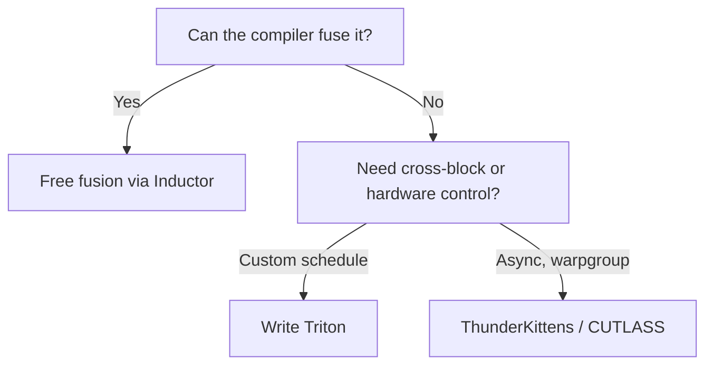
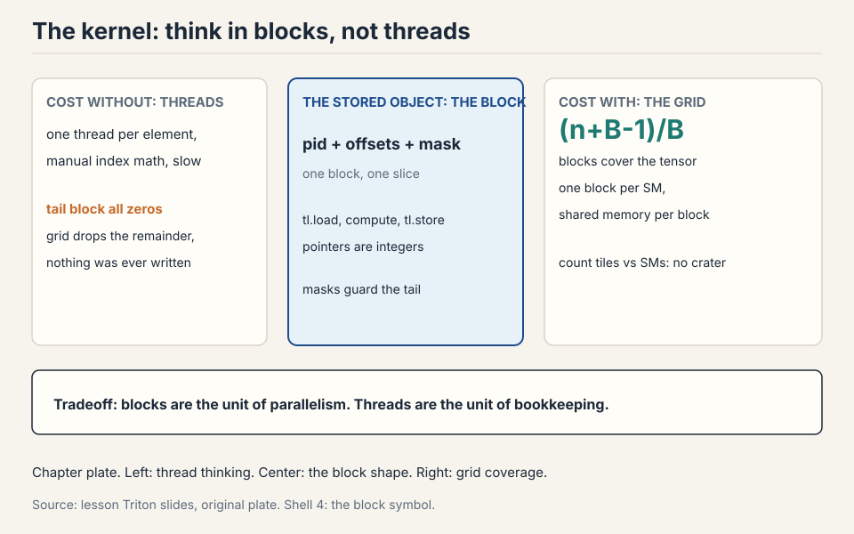
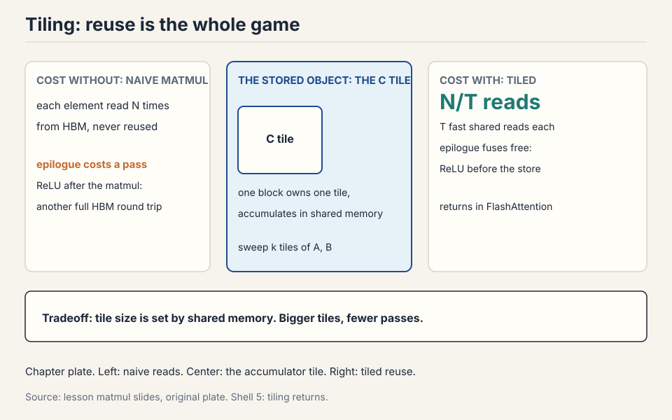
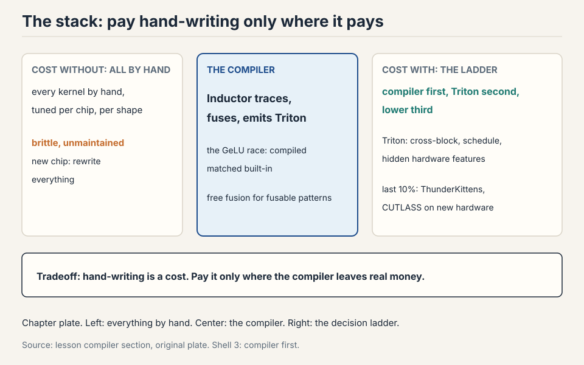

## How to read this lesson

No prerequisites are assumed. Every term is defined at first use.
The lecture's order is deliberate: measure first, understand the
hardware second, write kernels third. The philosophy: benchmark and
profile first, change code second, measure again. This chapter
follows that order.

## The problem: same math, 3.75x slower

Three implementations of GeLU. Same function. Same input. The naive
PyTorch version runs at 3.75 (slowest in the demo). The compiled
version is fast. The built-in is fastest. Nothing about the math
changed. Everything about the memory traffic did.

### Subchapter: the GeLU race, explained

Naive PyTorch GeLU: tanh, multiply, add, each a separate kernel.
Between kernels, every intermediate returns to HBM. Five kernels,
ten HBM passes. The compiled version (torch.compile): the graph
fuses into one Triton kernel, one read, one write. The built-in:
one hand-written kernel, same shape. The race is not about
arithmetic. It is about round trips. The naive version loses
because it commutes to the warehouse between every step.

## The hardware, once more, with numbers

SMs: 100-200 per GPU. Registers: 65K per thread-block budget class,
256K per SM on B200. L1/shared per SM, L2 chip-wide, HBM large and
growing. Bandwidth runs inverse to size: registers fastest, HBM
slowest at about 8 TB/s and still the bottleneck. Newer chips add
wrinkles (H100/B200 thread-block clusters, tensor memory between
registers and shared), but the model from the GPUs lecture holds.

### Subchapter: the grid

Kernels launch as a **grid** of thread blocks. The grid is 1D, 2D,
or 3D. Each block knows its position via `program_id`. The GeLU
kernel launches a 1D grid: block i handles elements [i*BLOCK,
(i+1)*BLOCK). The matmul launches a 2D grid: block (i, j) handles
C tile (i, j). The grid is the work decomposition. Get it wrong and
elements are skipped or computed twice.


## Why thread blocks exist

Threads alone suffice for elementwise ops: GeLU maps one thread per
element. Softmax and matmul need threads to communicate: a softmax
row must agree on a max and a sum, a matmul tile must share its
inputs. The thread block is the unit that shares memory: one block
lands on one SM, reads from HBM into shared memory, lets threads
talk, writes back.

### Subchapter: Triton thinks in blocks

**Triton** (from OpenAI) is built on this. You specify what each
block does, not what each thread does. For communicating ops,
block-thinking removes CUDA's synchronization bookkeeping. It sits
between PyTorch (whole tensors) and CUDA (single threads). The
compiler maps your block program to threads, warps, and PTX. You
think at the level the hardware rewards.

## Where naive code breaks: the hardware decides speed

The programming model (threads, blocks, grid) gives correctness. The
hardware (warps, banks, SM counts) decides speed. Four
demonstrations.

### Break 1: warps stall on HBM

Thirty-two threads execute in lockstep as a warp. The SM runs many
warps and switches between them at zero cost: while one warp waits
100 cycles on HBM, another runs tensor cores. Latency hiding is
free, but only if enough warps are resident to switch between. A
kernel with too few warps stalls: nothing to switch to.

### Subchapter: the latency math

HBM latency: ~400 cycles. A warp switch: ~0 cycles. To hide 400
cycles of latency, the SM needs enough warps that one is always
ready. If each warp computes for 50 cycles between memory waits, you
need 8 warps in flight per stalled warp. This is why occupancy
matters: resident warps are the latency-hiding budget. Few warps,
no hiding, the SM idles.

### Break 2: registers cap occupancy

Each thread caps at 255 registers. More registers per thread means
fewer threads per SM.


Work it: 128 threads/block x 160 registers = about 20K registers per
block. At 65K registers per SM, 3 blocks fit: 12 warps out of a
64-warp max = 18% occupancy. Low occupancy is not automatically bad:
**thread coarsening** (one thread, 8 elements) does more work per
thread with fewer threads, and the compiler does this for you in
PTX. Fix occupancy when profiling shows the SM stalling for lack of
ready warps. Otherwise chase memory coalescing and tiling first:
they move the needle more.

### Subchapter: the occupancy tradeoff, worked

Two designs for the same GeLU on 1M elements. Design A: 1,024
threads per block, 32 registers each. Blocks per SM: limited by the
2,048-thread cap to 2 blocks, 64 warps, 100% occupancy. Each thread
does little. Design B: 128 threads per block, 160 registers each, 8
elements per thread (coarsened). 3 blocks per SM, 12 warps, 18%
occupancy. Each thread does 8x the work with values in registers.

Design B often wins: fewer threads means less scheduling overhead,
and register-resident values never touch shared memory. The lesson:
occupancy is a means, not a goal. The goal is useful work per
cycle. Measure the kernel time, not the occupancy ratio.

> [!QA]
> Q: Your kernel reports 18% occupancy. Should you fix it?
> A: Not necessarily. Occupancy measures how many warps are resident, not how much work gets done. If each thread does substantial work (high registers from thread coarsening), low occupancy with fat threads can beat high occupancy with thin threads. Fix occupancy when profiling shows the SM stalling for lack of ready warps. Otherwise, chase memory coalescing and tiling first: they move the needle more.
> Follow-up: Bank conflicts vs coalescing: which memory do they govern?
> A: Bank conflicts govern shared memory. It has 32 banks, one accessor per cycle, and conflicts serialize. Coalescing governs HBM: a warp's accesses merge into 128-byte cache-line transactions. One is about on-chip parallelism, the other about off-chip bursts. Profile both. They fail independently.

### Break 3: bank conflicts serialize shared memory

Shared memory has 32 banks of 4 bytes. One thread per bank per cycle.
Thirty-two threads reading one column all hit bank 0: a 32-way
conflict, 32x serialized. Work the waste: 32 threads that should
finish in 1 cycle take 32. Matmul needs rows and columns, so
conflicts are unavoidable by layout alone. **Swizzling** rearranges
shared memory to dodge them.


### Subchapter: swizzling, the idea

Swizzling permutes the shared-memory layout so that the access
pattern that was conflicted becomes spread. The classic: XOR the row
index into the column index when storing a tile. Thread (i, j)
stores at column (j XOR i) instead of j. Now the column access that
hit bank 0 thirty-two times hits thirty-two different banks. The
data is the same. The layout changed. One XOR in the address math,
32x on the access. This is the kind of trick that separates a
working matmul from a fast one.

### Break 4: block counts leave SMs idle

With 148 SMs and 160 blocks, the last wave runs 12 blocks while 136
SMs idle. Size block counts to divide SM counts. Same
wave-quantization idea as the GPUs lecture's tiles: one extra unit
of work can cost a whole extra wave.

### Subchapter: the grid-size rule

Grid size G, SM count S. Waves = ceil(G / S). The last wave runs
G mod S blocks. Pick G as a multiple of S when you can. When you
cannot (the problem size decides G), pick the tile size so that G
lands near a multiple. The autotuner tries several tile sizes: the
ones that wave-quantize badly lose. This is not a separate
optimization. It falls out of tuning.

## Measure first: benchmark rules

Benchmarking measures end-to-end time. It does not say where time
goes, but it is the number you ultimately care about, and it shows
scaling with dimension.


### Subchapter: the five rules, each with its reason

**Warm up.** Run the kernel 10 times before timing. The first run
includes lazy compilation, cold caches, and clock ramp-up. Timing it
measures the setup, not the kernel.

**CUDA events.** Record start and end events on the device, then
synchronize. The GPU is async: without the barrier you time the
launch, not the work. `torch.cuda.synchronize()` before and after,
or your numbers are fiction.

**Repeat and average.** Run 100 times. Report the median. The mean
is dragged by outliers: a context switch during one run poisons the
average. Report P95 too when tail latency matters.

**Scale the problem.** Matmul time is flat until dim ~2000, then
grows cubically, because small matrices cannot fill the machine.
Report the size where throughput flattens: that is the kernel's
real number.

**Compare against the roofline.** The ceiling for your op's
intensity tells you when to stop. A kernel at its ceiling is done.
A kernel below it has headroom.

### Subchapter: a benchmark harness, sketched

```python
def bench(fn, *args, warmup=10, iters=100):
    for _ in range(warmup):
        fn(*args)                          # flush compile + caches
    torch.cuda.synchronize()
    start = torch.cuda.Event(enable_timing=True)
    end = torch.cuda.Event(enable_timing=True)
    times = []
    for _ in range(iters):
        start.record(); fn(*args); end.record()
        torch.cuda.synchronize()
        times.append(start.elapsed_time(end))  # milliseconds
    times.sort()
    return times[len(times)//2]            # median
```

Every benchmark that skips a step is fiction. Warmup, events,
synchronize, repeat, median. In that order, every time.

## Profiling reads the kernel names

Profiling says where time goes and what actually ran. PyTorch's
profiler (Nsight in the assignment) reveals the kernels underneath
`a + b` and `a @ b`.

```ascii
cutlass _ sm100 _ f32 _ 64x64x16
library   arch    dtype  tile shape
```

The names are informative: `cutlass` (NVIDIA's linear-algebra
library), `sm100` (Blackwell), `f32` (dtype), `64x64x16` (tile
shape). Change dimensions and the kernel changes: 128x128 picks a
different tile than 64x64. What looks like one PyTorch op is a
dispatch over many hand-tuned kernels. The GeLU race is explained
the same way: naive builds one kernel per primitive with HBM round
trips between each. Built-in is one hand-written kernel. Compiled
fuses the graph into one Triton kernel automatically.


### Subchapter: reading a profiler timeline

The timeline shows kernels as blocks on a row per stream. Wide
blocks are slow kernels. Gaps between blocks are launch overhead or
synchronization. The first question: which block is widest? The
second: are there gaps? A timeline of many thin blocks with gaps is
the launch-overhead failure. A timeline with one wide block is the
tuning target. Profile before you optimize. The widest block is the
only one that matters.

> [!QA]
> Q: Why is the naive GeLU so much slower if it computes the same function?
> A: It launches one kernel per primitive (tanh, multiply, add), and between kernels every intermediate returns to HBM. The runtime is dominated by memory round trips, not arithmetic: the op is memory bound, so kernel count is the cost. The fused versions read once and write once. Same FLOPs, far fewer bytes moved.
> Follow-up: When would you still write the naive version?
> A: For correctness first: get the math right in PyTorch, verify against the built-in, then compile or hand-write the kernel. The lecture's order is deliberate: naive for understanding, profiler for diagnosis, Triton for speed.

## The key question

The breaks are all about the gap between the programming model and
the hardware. Threads are the wrong unit of thought for speed: they
are too fine. What if you think in blocks instead? One block, one
SM, one chunk of shared memory, one trip to HBM. That is the Triton
shape.

## The Triton kernel shape

Every kernel follows one shape:


```python
@triton.jit
def gelu_kernel(x_ptr, y_ptr, n, BLOCK: tl.constexpr):
    pid = tl.program_id(0)              # which block am I
    offs = pid * BLOCK + tl.arange(0, BLOCK)
    mask = offs < n                     # tail guard
    x = tl.load(x_ptr + offs, mask=mask)  # HBM -> registers
    y = gelu(x)                           # compute
    tl.store(y_ptr + offs, y, mask=mask)   # write back
# launch: gelu_kernel[(n // BLOCK,)](x, y, n, BLOCK)
```

`BLOCK: tl.constexpr` marks BLOCK as a compile-time constant. The
compiler builds a separate specialized kernel for each BLOCK value.
The subchapter below unpacks why that matters.

Read it line by line. `pid`: which block am I. `offs`: my slice of
the array. `mask`: the tail guard, for when n does not divide BLOCK.
`tl.load`: one HBM read into registers or shared memory (the
compiler decides which). Compute. `tl.store`: one write back.
Pointers are integers: addresses, not objects. The grid `(n //
BLOCK,)` says how many blocks run.

### Subchapter: the mask, why it matters

Without the mask, the last block reads past the array when n does
not divide BLOCK. Reading past the end is undefined: it can return
garbage or fault. The mask sets out-of-range positions to a safe
value (0 for loads) and skips the store. Every Triton kernel has
one. Forgetting it is the most common correctness bug, and it is
silent: the kernel runs, the numbers are almost right, the tail is
wrong.

### Subchapter: tl.constexpr, the compile-time knob

`BLOCK: tl.constexpr` means BLOCK is known at compile time. The
compiler unrolls loops over it, sizes the shared memory, and picks
the thread count. Change BLOCK and the kernel recompiles: a new
specialization, tuned for that size. This is why autotuning works:
each candidate BLOCK is a separate compiled kernel, benchmarked
against the others.

### Subchapter: the PTX underneath

Underneath, Triton compiles to PTX: `ld.global` into registers,
arithmetic, `st.global` back. The PTX shows the compiler's thread
coarsening: one thread processing 8 elements because the
per-element work was too thin. PTX is generated, not hand-written,
unless you believe you beat NVIDIA's compiler.

Read one line: `ld.global.v4.b32` loads 4 32-bit values at once
(vectorized: one instruction, 16 bytes). The compiler vectorized
your scalar loads because the addresses were contiguous. Write
scattered addresses and you get 4 scalar loads. The PTX tells you
whether the compiler saw what you meant.

## Softmax: one row per block

Naive PyTorch softmax: max, subtract, exp, sum, divide = 5MN reads
+ 3MN writes across separate kernels. Triton: one row per block,
everything in one kernel.


### Subchapter: the kernel, line by line

```python
@triton.jit
def softmax_kernel(x_ptr, y_ptr, n_cols, BLOCK: tl.constexpr):
    pid = tl.program_id(0)                    # which row am I
    row = pid * n_cols + tl.arange(0, BLOCK)  # my row's offsets
    mask = tl.arange(0, BLOCK) < n_cols       # tail guard
    x = tl.load(x_ptr + row, mask=mask, other=-float('inf'))
    m = tl.max(x, axis=0)                     # row max
    x = x - m                                 # subtract max
    e = tl.exp(x)                             # exp
    s = tl.sum(e, axis=0)                     # row sum
    y = e / s                                 # normalize
    tl.store(y_ptr + row, y, mask=mask)
```

Blocksize = next power of two above the column count. Masked-out
tail elements become -inf (zero after softmax). The max-subtract
keeps the exp in range. One block, one row, one kernel. Rows never
interact: blocks do not share memory, so the decomposition is clean.

### Subchapter: the savings, worked

M rows, N columns. Naive: 5MN reads + 3MN writes = 8MN memory
accesses across 5 kernels. Triton: MN reads + MN writes in one
kernel = 2MN. Four times fewer accesses, one kernel launch instead
of five. The max-subtract-exp-sum-divide all happen in fast memory.

### Subchapter: long rows tile with an accumulator

If the row exceeds the block, loop over tiles: each thread
accumulates its tile's partial max and sum, then reduce across
threads. This is the online softmax from the GPUs lecture, now as
code: track running m and l, rescale when a new max appears. Same
math as FlashAttention's inner loop. The kernel shape scales from
one row to any row by adding the accumulator.

## Tiled matmul

Naive per-element kernel: for each C element, loop over k reading A
and B from HBM. Reads scale as MxKxN: arithmetic intensity O(1),
terrible.

Idealized: load all of A and B into shared memory, compute, write
once. Reads O(n^2), intensity O(n). Impossible: matrices do not fit.

Tiled: globally naive, locally ideal. Each C tile gets one thread
block. The block sweeps row-tiles of A and column-tiles of B into
shared memory, accumulates `tl.dot` partials, writes the tile once.
Intensity rises to O(tile size).


### Subchapter: the k-loop, worked with numbers

C is 1024x1024, tile 128x128. Block (0,0) owns C[0:128, 0:128]. Its
k-loop runs 8 iterations (1024/128). Iteration 0: load A[0:128,
0:128] and B[0:128, 0:128] into shared memory, tl.dot gives a
128x128 partial, add it to the accumulator. Iteration 1: load
A[0:128, 128:256] and B[128:256, 0:128], accumulate. After 8
iterations the accumulator holds the full C tile. One HBM write. A
and B elements were read from HBM once each instead of 1024 times.
That is the whole loop: stream, multiply, accumulate, write once.

### Subchapter: why 128 and not 1024

Shared memory is about 228KB per SM on Hopper. A 1024x1024 bf16 tile
is 2MB: it does not fit. A 128x128 bf16 tile is 32KB: the A tile,
the B tile, and the accumulator fit together. Tile size is set by
the fastest memory that must hold the working set. The autotuner
tries 64, 128, 256 and keeps the winner: the answer varies by chip
and dtype.

### Subchapter: strides map (row, col) to addresses

Triton has no 2D arrays. Block (i, j) computes its offsets as
`i * BLOCK_M * stride_am + j * BLOCK_N * stride_bn`-style
arithmetic. Strides map (row, col) to linear addresses. Transposes
flip them: the same kernel with swapped strides reads B^T. This is
why the kernel takes stride arguments: the caller decides the
layout, the kernel just does the address math.

### Subchapter: the free epilogue

Bonus fusion: apply the ReLU to the accumulator before the write.
The epilogue rides free: the data is already in registers, so the
activation costs no extra memory traffic.

> [!QA]
> Q: Why does the tiled matmul assign one C tile per thread block?
> A: The C tile is the natural unit of shared-memory reuse. Computing it needs one row-band of A and one column-band of B, which the block streams through shared memory in k-tiles. The accumulator lives in fast memory for the whole sweep, and the block writes HBM exactly once. Assigning finer units (per element) would forfeit the reuse. Coarser units would not fit in shared memory.
> Follow-up: Where does the ReLU go and why is it free?
> A: On the accumulator, after the k-loop, before the single HBM write. The data is already in registers/shared memory, so the activation costs no extra memory traffic: the kernel was already going to touch every element once. This is the same fusion principle as the GeLU race, applied as an epilogue.

> [!QA]
> Q: Walk me through the tiled matmul's k-loop with numbers. One C tile.
> A: C is 1024x1024, tile 128x128. Block (0,0) owns C[0:128, 0:128]. Its k-loop runs 8 iterations (1024/128). Iteration 0: load A[0:128, 0:128] and B[0:128, 0:128] into shared memory, tl.dot gives a 128x128 partial, add it to the accumulator. Iteration 1: load A[0:128, 128:256] and B[128:256, 0:128], accumulate. After 8 iterations the accumulator holds the full C tile. One HBM write. A and B elements were read from HBM once each instead of 1024 times. That is the whole loop: stream, multiply, accumulate, write once.
> Follow-up: Why 128 and not 1024?
> A: Shared memory is about 228KB per SM on Hopper. A 1024x1024 bf16 tile is 2MB: it does not fit. A 128x128 bf16 tile is 32KB: the A tile, the B tile, and the accumulator fit together. Tile size is set by the fastest memory that must hold the working set.

## Autotuning: let the machine pick the tile

Tile size, block size, number of warps: these are tunables, and the
right answer varies by chip, shape, and dtype. **Autotuning**
benchmarks the candidates and keeps the winner.

### Subchapter: @triton.autotune, the mechanism

```python
@triton.autotune(
    configs=[
        triton.Config({'BLOCK': 128}, num_warps=4),
        triton.Config({'BLOCK': 256}, num_warps=8),
        triton.Config({'BLOCK': 512}, num_warps=8),
    ],
    key=['n'],
)
@triton.jit
def gelu_kernel(x_ptr, y_ptr, n, BLOCK: tl.constexpr):
    ...
```

The `key=['n']` means: retune when n changes. Each config compiles
to a separate kernel. The first call with a new n benchmarks all
three and caches the winner. Later calls reuse it. The tuning cost
is paid once per shape. The win is every call after.

### Subchapter: what the tuner finds

The tuner finds what the rules predict: BLOCK sizes near multiples
of the SM count win (wave quantization), sizes divisible by 128 win
(coalescing), and the winner changes between A100 and H100 (different
SM counts, different shared memory). Hand-pick a default, let the
tuner correct you. The tuner is never wrong about the chip it runs
on.

## Debugging a Triton kernel

Kernels fail silently: wrong numbers, not crashes. Four common bugs,
each with its signature.

### Subchapter: bug 1, the missing mask

Symptom: the output is correct except the last few elements, which
are garbage or zero. Cause: no tail mask, the last block read past
the array. Fix: add the mask. This is the most common Triton bug.
Check it first.

### Subchapter: bug 2, the wrong offsets

Symptom: the output looks like the input, shifted or scrambled.
Cause: the offset math maps blocks to the wrong slice. Common
variant: forgetting the stride, so a 2D problem is read as 1D.
Fix: print the offsets for a 2-block launch by hand. Two blocks,
small n, verify each element lands once.

### Subchapter: bug 3, the dtype surprise

Symptom: the kernel runs but the numbers are wrong by a scale
factor, or NaN. Cause: tl.load with the wrong dtype (fp32 tensor
read as bf16 reinterprets the bits), or the accumulator in too
narrow a type. Fix: check every pointer's dtype against the
tensor's. Accumulate in fp32, store in the target dtype.

### Subchapter: bug 4, the grid that skips the tail

Symptom: the last elements are never written (stale values from a
previous allocation). Cause: grid = n // BLOCK drops the remainder
when n does not divide BLOCK. Fix: grid = (n + BLOCK - 1) // BLOCK
(the ceiling), plus the mask. The mask guards the extra block's
overrun. Ceiling division and masking are a pair: never one without
the other.

> [!QA]
> Q: Design the benchmark harness for a kernel you just wrote.
> A: Five steps in order. Warm up: run the kernel 10 times to flush lazy compilation and cold caches. Time with CUDA events recorded on the device, then synchronize: without the barrier you time the launch, not the work. Repeat 100 times and report the median, plus P95 if tail latency matters. Sweep the problem size: small sizes cannot fill the machine, so report the size where throughput flattens. Compare against the roofline ceiling for your op's intensity, not against zero: the ceiling tells you when to stop. Every benchmark that skips a step is fiction.
> Follow-up: Why median and not mean?
> A: The mean is dragged by outliers: a context switch or a thermal throttle during one run poisons the average. The median ignores them. Report P95 too when the kernel serves live traffic, because tail latency is the user experience.

> [!QA]
> Q: The PyTorch compiler vs hand-written Triton: when do you hand-write?
> A: When the compiler cannot see the optimization. The compiler fuses elementwise and simple reduction patterns for free: the GeLU race shows compiled matching built-in. Hand-write when the win needs cross-block communication (tiled matmul with a custom epilogue), a schedule the compiler will not invent (FlashAttention's online softmax), or hardware features Triton hides (async copies, warpgroup matmuls). The decision flow: compiler first, Triton second, ThunderKittens or CUTLASS for the last 10%. Hand-writing is a cost: brittle, per-chip, per-shape. Pay it only where the compiler leaves real money.
> Follow-up: Does the compiler ever beat hand-written Triton?
> A: Yes, on maintenance: the compiler re-tunes for each new chip automatically, while a hand-written kernel rots. On raw speed for exotic patterns, no: the hand-written kernel wins until the compiler learns the pattern. Most teams compile first and hand-write only the two or three kernels that dominate the profile.

> [!QA]
> Q: What breaks when you move a tuned kernel from A100 to H100?
> A: Everything sized to the old chip. SM count changed (108 to 144): tile counts that divided 108 now wave-quantize on 144. Shared memory grew: tiles sized for A100 underuse H100. Tensor core instructions changed: H100 has warpgroup MMA and TMA async copies that A100 lacks, so the old kernel leaves the new hardware's best features unused. Register budgets shifted. The fix is re-tuning, not porting: rerun the autotuner, recheck the roofline, and consider whether async patterns now beat your old schedule. Kernels are per-chip artifacts.
> Follow-up: How do you write kernels that survive chip changes?
> A: You do not, fully. You parametrize: tile sizes, block counts, and stages as tunables, and autotune per chip at install time. The PyTorch compiler does this for you. Hand-written kernels carry a tuning table per architecture. The honest answer: portability is a compiler feature, not a kernel property.

## The PyTorch compiler vs hand-written Triton

The PyTorch compiler (Inductor backend) traces your code into a
graph, fuses elementwise and reduction ops, and emits Triton kernels
automatically. The GeLU race is the demo: compiled matched built-in.
One idea: free fusion for fusable patterns.

Hand-write when the compiler cannot see the optimization. Three
cases: the pattern needs cross-block communication (a tiled matmul
with a custom epilogue), the schedule matters more than the math
(FlashAttention's online softmax), or you need hardware features
Triton hides (async copies, warpgroup matrix instructions).

Below Triton sit ThunderKittens and CUTLASS: the last 10%.
ThunderKittens is an embedded DSL that exposes warp-level control
with less pain than CUDA. CUTLASS is NVIDIA's template library for
GEMMs. Both buy the final drops on new hardware at the cost of
complexity and brittleness.

The decision flow: compiler first, Triton second, lower third.
Hand-writing is a cost: tuned per chip, per shape, per dtype. Pay it
only where the compiler leaves real money.



## What is used where: the kernel stack in production

Each layer of the lowering stack has its production tool. Tools
verified against their public project pages as of October 2026.

| Layer | Tool | Where it ships | Source |
|---|---|---|---|
| Graph fusion | PyTorch compiler (Inductor) | every training stack: free fusion | PyTorch docs |
| Attention | FlashAttention-2/3, hand-written CUDA | every training run at scale | lecture 6 |
| Serving decode | FlashInfer kernel library | vLLM and SGLang serving | FlashInfer project docs |
| Paged KV | vLLM's paged-attention kernels | the serving standard | vLLM project docs |
| Fused LLM ops | Liger-Kernel (Triton) | RMSNorm, RoPE, cross-entropy patches | Liger-Kernel project docs |
| Custom masks | FlexAttention (PyTorch 2.5) | user-defined attention masks as Triton kernels | PyTorch 2.5 docs |
| Research peak | ThunderKittens, CUTLASS DSLs | squeezing the newest chips | project repos |

The compiler handles the easy fusions everywhere. FlashAttention
handles the one op that matters most. Liger-Kernel ships
production-quality fused Triton kernels for the LLM ops every
training run needs (RMSNorm, RoPE, fused cross-entropy). Serving
gets its own kernels because decode is a different economy (memory
bound, batch sensitive). Research chases the last 10% on hardware
the compilers have not learned yet.

The kernel stack table above is the figure: each layer has its production tool.

> [!QA]
> Q: Your Triton softmax returns correct values except the last row block is all zeros. Diagnose it.
> A: Two suspects, in order. First, the grid: grid = n // BLOCK drops the remainder, so the last partial block never launched and its outputs were never written (stale zeros). Fix: grid = (n + BLOCK - 1) // BLOCK. Second, the mask: if the grid is right but the mask is wrong (mask = offs < n computed with the wrong n, or missing entirely), the tail block's stores were skipped. Check the grid first because it is the more common bug, then the mask. The signature "all zeros in exactly the tail" points at launch coverage, not arithmetic.
> Follow-up: Why stale zeros and not garbage?
> A: Because the output tensor was freshly allocated (torch.empty or zeros) and the kernel never wrote those positions. Fresh allocations read as zeros. If the tensor had been reused, the tail would show stale values from the previous use instead. Either way, the cause is the same: those elements were never written.

## Mapping back: what each idea fixes

| Break | Fix | How |
|---|---|---|
| One kernel per op, HBM round trips | Fusion | GeLU: many kernels become one. Read once, write once. |
| Async GPU, fiction timings | Benchmark discipline | Warm up, CUDA events, synchronize, repeat, scale. |
| Warps stall on HBM | Enough resident warps | Zero-cost switching hides 400-cycle latency. |
| 18% occupancy panic | Register math | Fat threads beat thin threads. Fix stalls, not ratios. |
| 32-way bank conflicts | Swizzling | XOR the layout. Rows and columns both needed. |
| 136 SMs idle | Divide SM counts | 160 blocks on 148 SMs: size the grid. |
| O(1) intensity matmul | Tiling | One C tile per block. N/T HBM reads, T fast reuses. |
| 5MN+3MN softmax accesses | One row per block | 2MN accesses, one kernel. Accumulate in fast memory. |
| Silent wrong numbers | The four bugs | Mask, offsets, dtype, ceiling grid. In that order. |
| Tile-size guessing | Autotune | Benchmark configs per shape. Cache the winner. |

## The honest price

Hand-written kernels are brittle. They are tuned per chip, per shape,
per dtype: change any of the three and the tuning may rot. The
compiler does the easy fusions for you (torch.compile), so hand-write
only what the compiler cannot fuse. Triton does not expose every new
hardware feature: the last 10% needs lower-level tools like
ThunderKittens or CUTLASS DSLs. Kernel timings are demo numbers on
one chip, not guarantees. And the deepest price: kernel skill is
necessary but not sufficient. The parallelism lectures show that
single-GPU speed is only one axis. The fastest kernel on one GPU
still loses to a slower kernel on eight.







## Recap: the whole lesson on one screen

The story in eight steps. Each step answers the one before it.

1. **Same math, 3.75x slower.** Three GeLUs, one function. The naive
   version pays HBM round trips between kernels. The fused versions
   read once and write once.
2. **Think in blocks.** One block per SM, shared memory per block.
   Triton specifies per-block work. The compiler handles threads.
   Masks guard tails. constexpr specializes.
3. **Warps hide latency.** 32 threads in lockstep. Zero-cost switching
   covers 400-cycle HBM waits, but only with enough resident warps.
4. **Registers cap occupancy.** 128 x 160 = 3 blocks per SM = 12 of 64
   warps = 18%. Fat threads beat thin threads. Fix stalls, not ratios.
5. **Banks serialize.** 32 banks, one thread per cycle. Column access:
   32-way conflict. Swizzle with XOR.
6. **Measure before you optimize.** Warm up, CUDA events, synchronize,
   repeat, median, scale, roofline. The GPU is async: no barrier, no
   measurement.
7. **Softmax: one row per block.** 5MN+3MN accesses become 2MN in one
   kernel. Long rows tile with an accumulator. The mask makes -inf.
8. **Tile the matmul, tune the tiles.** One C tile per block, sweep
   k-tiles through shared memory, write once. Fuse the epilogue free.
   Autotune per chip per shape. Debug in order: mask, offsets, dtype,
   grid.

## Go deeper

<div style="position:relative;padding-bottom:56.25%;height:0;overflow:hidden;max-width:100%;margin:16px 0;">
<iframe style="position:absolute;top:0;left:0;width:100%;height:100%;" src="https://www.youtube-nocookie.com/embed/xnDHaNUvHBg" title="Stanford CS336 Spring 2026 Lecture 6: Triton and Benchmarking" frameborder="0" allow="accelerometer; autoplay; clipboard-write; encrypted-media; gyroscope; picture-in-picture" allowfullscreen></iframe>
</div>
- Lecture 6, the session this chapter follows (the embed above): https://www.youtube.com/watch?v=xnDHaNUvHBg

<div style="position:relative;padding-bottom:56.25%;height:0;overflow:hidden;max-width:100%;margin:16px 0;">
<iframe style="position:absolute;top:0;left:0;width:100%;height:100%;" src="https://www.youtube-nocookie.com/embed/DdTsX6DQk24" title="gpu-mode Lecture 14: Practitioner's Guide to Triton" frameborder="0" allow="accelerometer; autoplay; clipboard-write; encrypted-media; gyroscope; picture-in-picture" allowfullscreen></iframe>
</div>
- gpu-mode, Practitioner's Guide to Triton (the embed above): https://www.youtube.com/watch?v=DdTsX6DQk24
- Triton documentation: https://triton-lang.org/main/index.html
- Tillet et al., Triton: An Intermediate Language and Compiler: https://arxiv.org/abs/1904.00962
- Liger-Kernel: production Triton kernels for LLMs: https://github.com/linkedin/Liger-Kernel

## Official sources and further reading

**Official:**
- Lecture 6 video and executable code (lecture_06.py): the GeLU race,
  softmax, and matmul kernels run live.
- Triton language documentation and tutorials.

**Further reading:**
- ThunderKittens and CUTLASS DSLs: alternatives below/above Triton for
  squeezing the last drops from new hardware.

**Caveats from these sources.** Kernel timings are hardware-dependent
demo numbers, not guarantees. Register/SM counts are H100/B200-era
figures. Triton does not expose every new hardware feature: the last
10% needs lower-level tools.

## Connections to the other courses

- **CS336 L07/L08:** the block/grid mental model scales to devices:
  parallelism lectures tile across GPUs the way this lecture tiles
  across SMs.
- **CS336 L10:** FlashAttention is the capstone kernel combining every
  trick here.
- **CS229S:** Nsight profiling and the device block deepen here.
- **CS229:** the roofline/intensity diagnostic from L02 is what the
  profiler checks.

> [!CHEAT]
> **Triton cheatsheet.** Shape: pid, offsets, mask, tl.load, compute, tl.store. Grid: (n+BLOCK-1)//BLOCK, mask guards tail. Perf: warps hide latency, registers cap occupancy, banks serialize (swizzle), count blocks vs SMs. Softmax: one row per block, 2MN accesses. Matmul: one C tile per block, k-loop streams, epilogue free. Tune: @triton.autotune per shape. Debug: mask, offsets, dtype, grid. Stack: compiler first, Triton second, lower third.

> [!MEMORY]
> **Think in blocks.** One block, one SM, one chunk of shared memory, one trip to HBM. Threads are too fine. Blocks are the unit.

## Coverage map: every lecture claim, mapped

Each row ties a claim from Lecture 6 (transcript `sources/cs336/text/lec06.txt`,
video xnDHaNUvHBg) to the section that covers it.

| Session claim | Covered in | File line |
|---|---|---|
| Same math, 3.75x slower: naive vs compiled vs built-in GeLU | The problem: same math, 3.75x slower | 43 |
| GeLU race explained: 5 kernels and 10 HBM passes vs 1 | the GeLU race, explained | 50 |
| Hardware numbers: SMs, registers, L1/shared, HBM 8 TB/s | The hardware, once more, with numbers | 60 |
| Grid of blocks: 1D/2D/3D, program_id, work decomposition | the grid | 69 |
| Thread blocks exist for communication: softmax rows, matmul tiles | Why thread blocks exist | 80 |
| Triton thinks in blocks, not threads | Triton thinks in blocks | 89 |
| Warps stall on HBM; zero-cost switching needs resident warps | Break 1: warps stall on HBM | 104 |
| Latency math: 400-cycle HBM, 8 warps in flight per stalled warp | the latency math | 112 |
| Registers cap occupancy: 128x160 = 3 blocks = 18% | Break 2: registers cap occupancy | 121 |
| Occupancy tradeoff: fat coarsened threads beat thin threads | the occupancy tradeoff, worked | 137 |
| Bank conflicts: 32 banks, column access 32x serialized | Break 3: bank conflicts | 157 |
| Swizzling: XOR layout dodge for the 32-way conflict | swizzling, the idea | 168 |
| Block counts vs SMs: 160 blocks on 148 SMs, 136 idle | Break 4: block counts leave SMs idle | 179 |
| Grid-size rule: multiples of SM count; tuner finds it | the grid-size rule | 186 |
| Benchmark rules: warmup, CUDA events, synchronize, repeat, scale | Measure first: benchmark rules | 195 |
| Five rules each with its reason | the five rules, each with its reason | 203 |
| Benchmark harness sketched in code | a benchmark harness, sketched | 227 |
| Profiler reads kernel names: cutlass sm100 f32 64x64x16 | Profiling reads the kernel names | 248 |
| Reading a profiler timeline: widest block, gaps | reading a profiler timeline | 270 |
| Triton kernel shape: pid, offsets, mask, load, compute, store | The Triton kernel shape | 294 |
| Mask: tail guard; most common silent bug | the mask, why it matters | 323 |
| tl.constexpr: compile-time specialization; autotune hook | tl.constexpr, the compile-time knob | 333 |
| PTX underneath: ld.global.v4.b32 vectorization signal | the PTX underneath | 342 |
| Softmax: one row per block; -inf tail; 8MN to 2MN | Softmax: one row per block | 356 |
| Softmax kernel line by line | the kernel, line by line | 364 |
| Long rows: tiled accumulator = online softmax as code | long rows tile with an accumulator | 393 |
| Tiled matmul: naive O(1), idealized O(n), tiled O(tile) | Tiled matmul | 402 |
| k-loop worked: 8 iterations, stream-multiply-accumulate | the k-loop, worked with numbers | 418 |
| Tile 128: 32 KB fits the 228 KB shared budget | why 128 and not 1024 | 429 |
| Strides map (row, col) to addresses; transposes flip them | strides map (row, col) to addresses | 438 |
| Free epilogue: ReLU on the accumulator before the write | the free epilogue | 447 |
| Autotune: configs, key=['n'], compile-cache-benchmark | Autotuning | 465 |
| What the tuner finds: SM multiples, /128, per-chip winners | what the tuner finds | 492 |
| Debug bugs: mask, offsets, dtype, ceiling grid | Debugging a Triton kernel | 501 |
| Compiler vs Triton vs ThunderKittens/CUTLASS decision flow | The PyTorch compiler vs hand-written Triton | 556 |
| Kernel stack: Inductor, FA2/3, FlashInfer, Liger, FlexAttention | What is used where | 581 |
