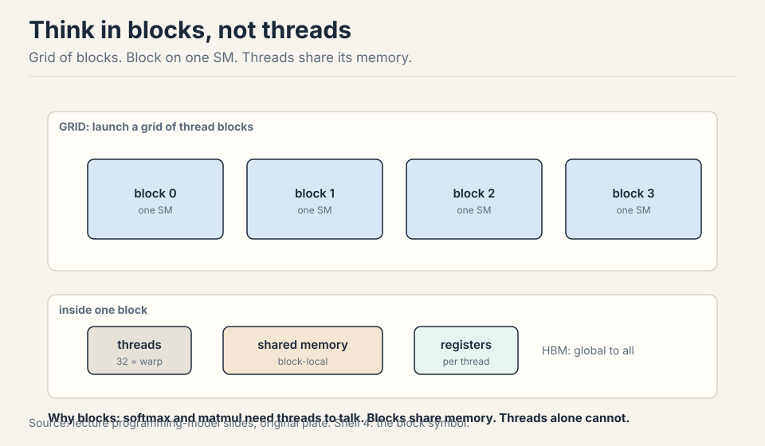
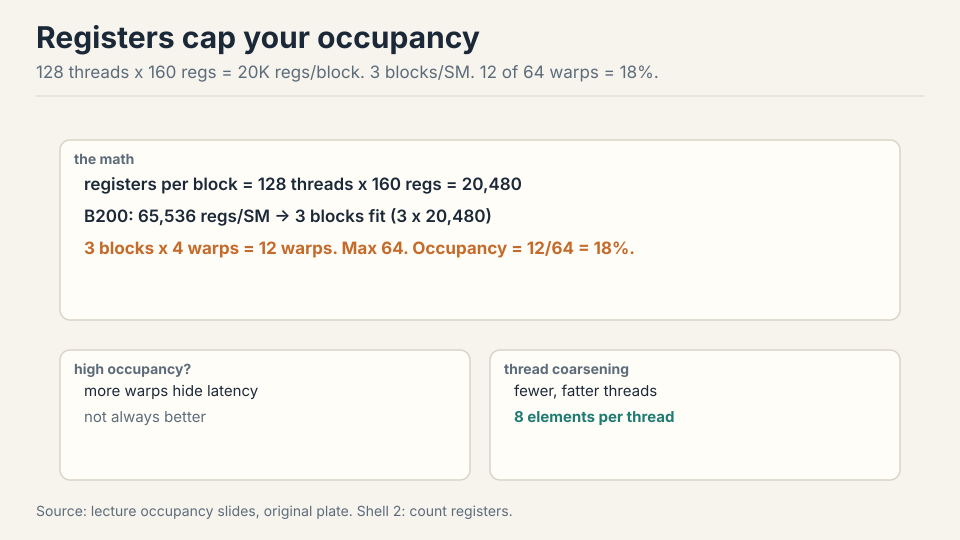
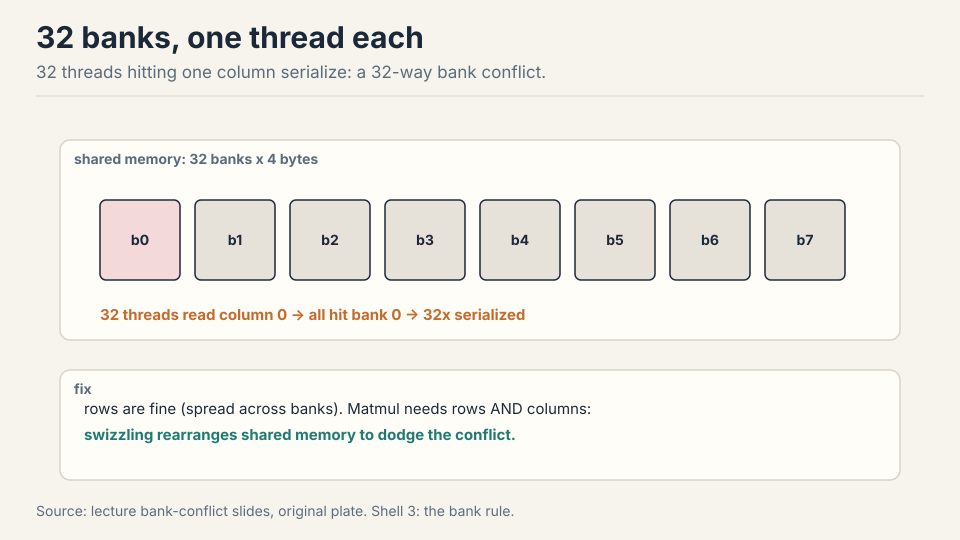
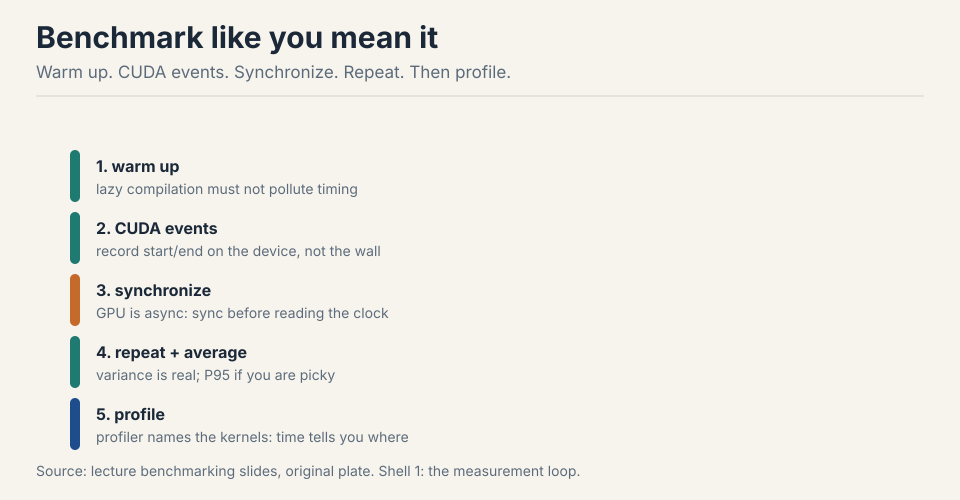
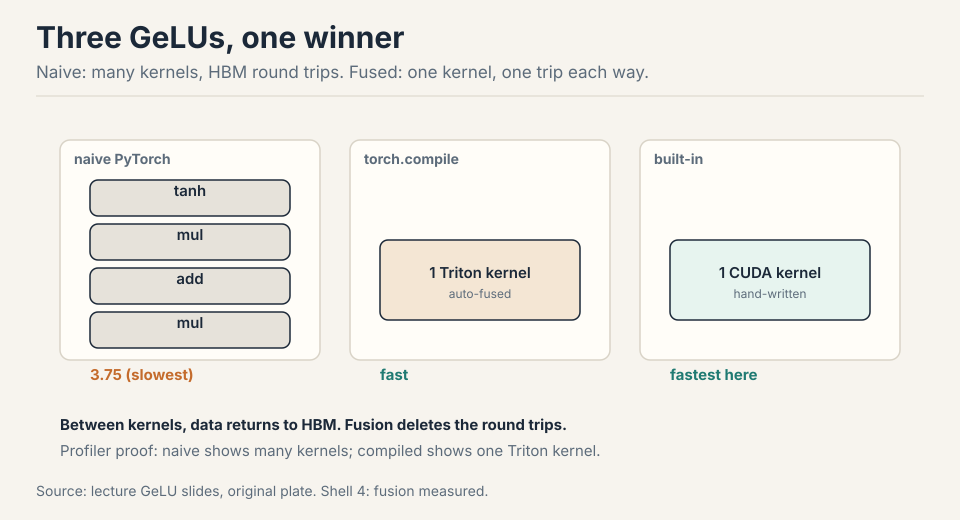
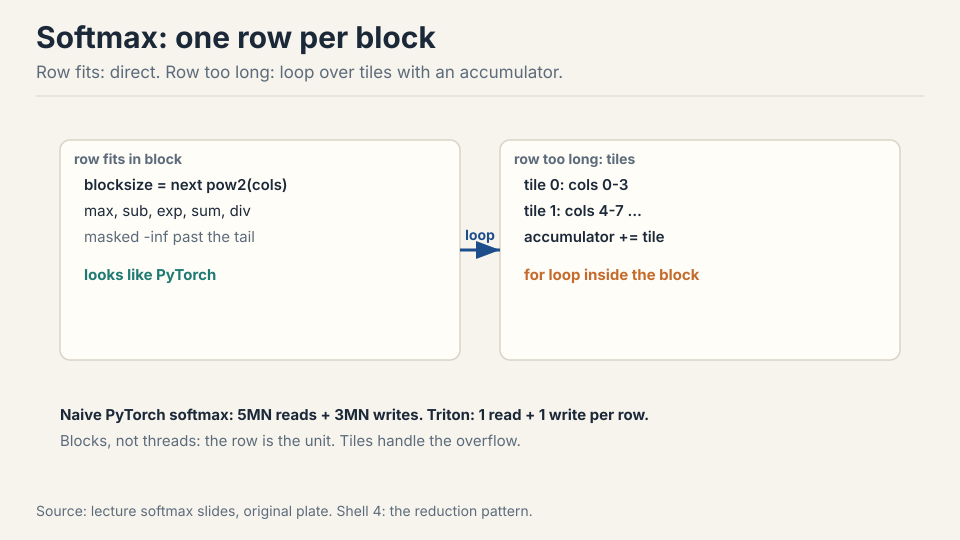
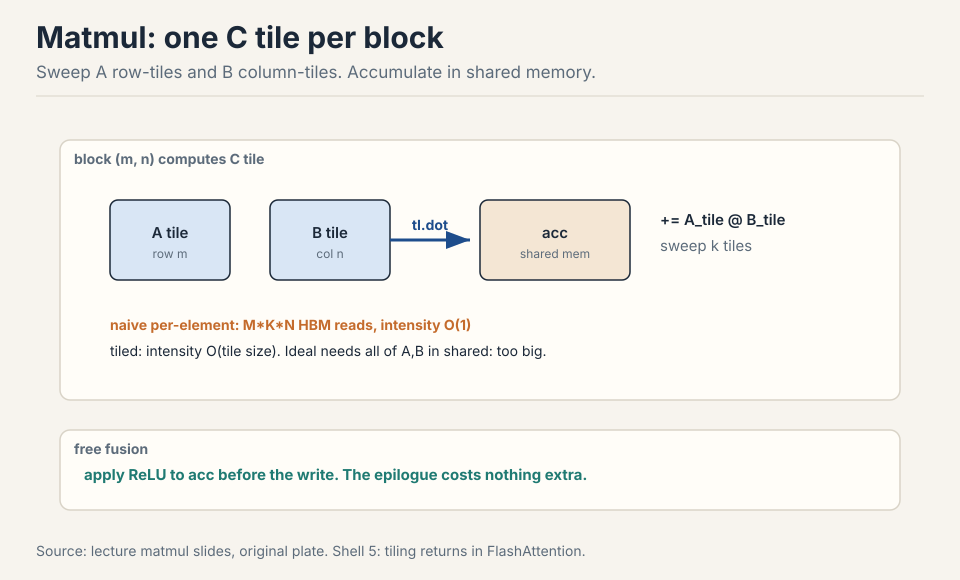
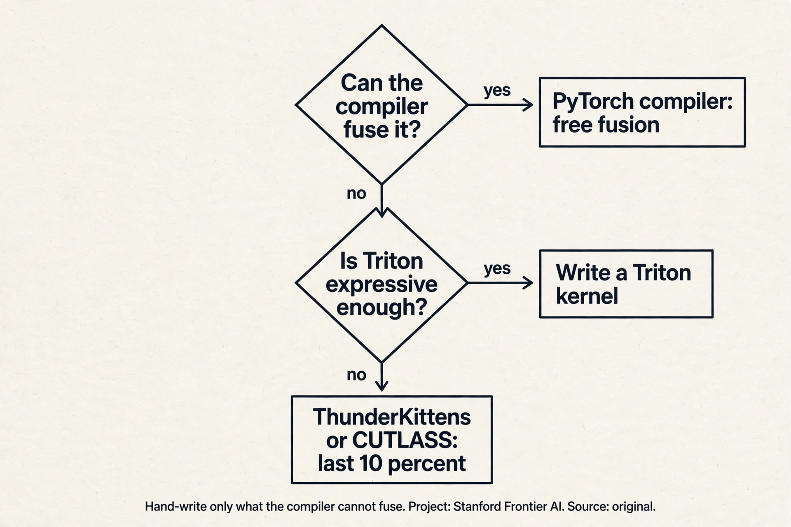
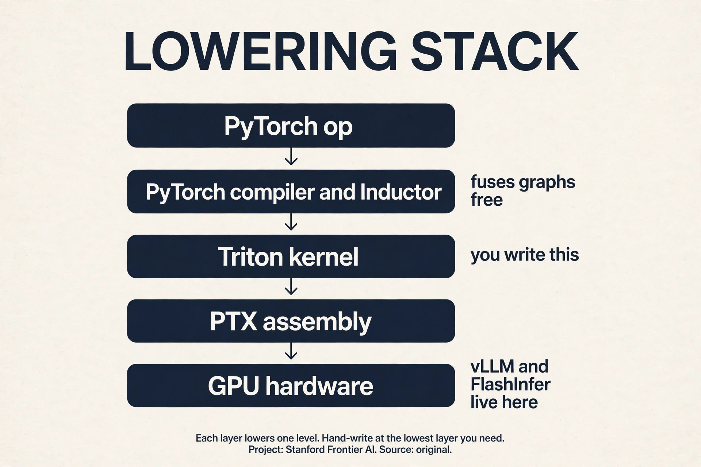

## The problem: same math, 3.75x slower

Three implementations of GeLU. Same function. Same input. The naive
PyTorch version runs at 3.75 (slowest in the demo). The compiled
version is fast. The built-in is fastest [30:14](ts:30:14). Nothing
about the math changed. Everything about the memory traffic did.

This lecture is about that gap. Philosophy first: benchmark and
profile first, change code second, measure again
[21:49](ts:21:49). Then the hardware details that decide speed. Then
writing the kernels yourself.

## The hardware, once more, with numbers

SMs: 100-200 per GPU. Registers: 65K per thread-block budget class,
256K per SM on B200. L1/shared per SM, L2 chip-wide, HBM large and
growing. Bandwidth runs inverse to size: registers fastest, HBM
slowest at about 8 TB/s and still the bottleneck [00:30](ts:00:30).
Newer chips add wrinkles (H100/B200 thread-block clusters, tensor
memory between registers and shared), but the model from the GPUs
lecture holds.

## Why thread blocks exist

Threads alone suffice for elementwise ops: GeLU maps one thread per
element [04:34](ts:04:34). Softmax and matmul need threads to
communicate: a softmax row must agree on a max and a sum, a matmul
tile must share its inputs. The thread block is the unit that shares
memory: one block lands on one SM, reads from HBM into shared memory,
lets threads talk, writes back.



**Triton** (from OpenAI) is built on this. You specify what each block
does, not what each thread does. For communicating ops, block-thinking
removes CUDA's synchronization bookkeeping [06:45](ts:06:45). It sits
between PyTorch (whole tensors) and CUDA (single threads).

## Where naive code breaks: the hardware decides speed

The programming model (threads, blocks, grid) gives correctness. The
hardware (warps, banks, SM counts) decides speed
[07:04](ts:07:04). Four demonstrations.

### Break 1: warps stall on HBM

Thirty-two threads execute in lockstep as a warp. The SM runs many
warps and switches between them at zero cost: while one warp waits 100
cycles on HBM, another runs tensor cores [10:14](ts:10:14). Latency
hiding is free, but only if enough warps are resident to switch
between. A kernel with too few warps stalls: nothing to switch to.

### Break 2: registers cap occupancy

Each thread caps at 255 registers. More registers per thread means
fewer threads per SM.



Work it: 128 threads/block x 160 registers = about 20K registers per
block. At 65K registers per SM, 3 blocks fit: 12 warps out of a 64-warp
max = 18% occupancy [12:49](ts:12:49). Low occupancy is not
automatically bad: **thread coarsening** (one thread, 8 elements) does
more work per thread with fewer threads, and the compiler does this
for you in PTX [12:10](ts:12:10). Fix occupancy when profiling shows
the SM stalling for lack of ready warps. Otherwise chase memory
coalescing and tiling first: they move the needle more.

### Break 3: bank conflicts serialize shared memory

Shared memory has 32 banks of 4 bytes. One thread per bank per cycle.
Thirty-two threads reading one column all hit bank 0: a 32-way
conflict, 32x serialized [14:24](ts:14:24). Work the waste: 32 threads
that should finish in 1 cycle take 32. Matmul needs rows and columns,
so conflicts are unavoidable by layout alone. **Swizzling** rearranges
shared memory to dodge them.



### Break 4: block counts leave SMs idle

With 148 SMs and 160 blocks, the last wave runs 12 blocks while 136
SMs idle [18:15](ts:18:15). Size block counts to divide SM counts. Same
wave-quantization idea as the GPUs lecture's tiles: one extra unit of
work can cost a whole extra wave.

> [!QA]
> Q: Your kernel reports 18% occupancy. Should you fix it?
> A: Not necessarily. Occupancy measures how many warps are resident, not how much work gets done. If each thread does substantial work (high registers from thread coarsening), low occupancy with fat threads can beat high occupancy with thin threads. Fix occupancy when profiling shows the SM stalling for lack of ready warps. Otherwise, chase memory coalescing and tiling first: they move the needle more.
> Follow-up: Bank conflicts vs coalescing: which memory do they govern?
> A: Bank conflicts govern shared memory. It has 32 banks, one accessor per cycle, and conflicts serialize. Coalescing governs HBM: a warp's accesses merge into 128-byte cache-line transactions. One is about on-chip parallelism, the other about off-chip bursts. Profile both. They fail independently.

## Measure first: benchmark rules

Benchmarking measures end-to-end time. It does not say where time
goes, but it is the number you ultimately care about, and it shows
scaling with dimension [22:36](ts:22:36).



The rules: warm up first (lazy compilation pollutes the first run).
Time with CUDA events recorded on the device, then synchronize: the
GPU is async, and without the barrier you time nothing
[24:41](ts:24:41). Repeat and average. Use P95 if picky. Then scale the
problem: matmul time is flat until dim ~2000, then grows cubically,
because small matrices cannot fill the machine [25:55](ts:25:55).

## Profiling reads the kernel names

Profiling says where time goes and what actually ran. PyTorch's
profiler (Nsight in the assignment) reveals the kernels underneath
`a + b` and `a @ b` [26:25](ts:26:25).

```ascii
cutlass _ sm100 _ f32 _ 64x64x16
library   arch    dtype  tile shape
```

The names are informative: `cutlass` (NVIDIA's linear-algebra
library), `sm100` (Blackwell), `f32` (dtype), `64x64x16` (tile shape).
Change dimensions and the kernel changes: 128x128 picks a different
tile than 64x64. What looks like one PyTorch op is a dispatch over many
hand-tuned kernels [28:46](ts:28:46). The GeLU race is explained the
same way: naive builds one kernel per primitive with HBM round trips
between each. Built-in is one hand-written kernel. Compiled fuses the
graph into one Triton kernel automatically.



> [!QA]
> Q: Why is the naive GeLU so much slower if it computes the same function?
> A: It launches one kernel per primitive (tanh, multiply, add), and between kernels every intermediate returns to HBM. The runtime is dominated by memory round trips, not arithmetic: the op is memory bound, so kernel count is the cost. The fused versions read once and write once. Same FLOPs, far fewer bytes moved.
> Follow-up: When would you still write the naive version?
> A: For correctness first: get the math right in PyTorch, verify against the built-in, then compile or hand-write the kernel. The lecture's order is deliberate: naive for understanding, profiler for diagnosis, Triton for speed.

## The key question

The breaks are all about the gap between the programming model and the
hardware. Threads are the wrong unit of thought for speed: they are too
fine. What if you think in blocks instead? One block, one SM, one chunk
of shared memory, one trip to HBM. That is the Triton shape.

## The Triton kernel shape

Every kernel follows one shape [39:44](ts:39:44):


```python
@triton.jit
def gelu_kernel(x_ptr, y_ptr, n, BLOCK: tl.constexpr):
    pid = tl.program_id(0)              # which block am I
    offs = pid * BLOCK + tl.arange(0, BLOCK)
    mask = offs < n                     # tail guard
    x = tl.load(x_ptr + offs, mask=mask)  # HBM -> registers
    y = gelu(x)                           # compute
    tl.store(y_ptr + offs, y, mask=mask)   # write back
# launch: gelu_kernel[(n // BLOCK,)](x, y, n, BLOCK)
```

Read it line by line. `pid`: which block am I. `offs`: my slice of the
array. `mask`: the tail guard, for when n does not divide BLOCK.
`tl.load`: one HBM read into registers or shared memory (the compiler
decides which). Compute. `tl.store`: one write back. Pointers are
integers: addresses, not objects. The grid `(n // BLOCK,)` says how
many blocks run.

Underneath, Triton compiles to PTX: `ld.global` into registers,
arithmetic, `st.global` back [50:41](ts:50:41). The PTX shows the
compiler's thread coarsening: one thread processing 8 elements because
the per-element work was too thin. PTX is generated, not hand-written,
unless you believe you beat NVIDIA's compiler.

## Softmax: one row per block

Naive PyTorch softmax: max, subtract, exp, sum, divide = 5MN reads +
3MN writes across separate kernels [59:40](ts:59:40). Triton: one row
per block, everything in one kernel.



Blocksize = next power of two above the column count. Masked-out tail
elements become -inf (zero after softmax). If the row exceeds the
block, loop over tiles: each thread accumulates its tile's partial sum,
then reduce across threads [65:23](ts:65:23). Blocks do not share
memory, so rows never interact: the decomposition is clean.

Work the savings. M rows, N columns. Naive: 5MN reads + 3MN writes = 8
MN memory accesses across 5 kernels. Triton: MN reads + MN writes in
one kernel = 2 MN. Four times fewer accesses, one kernel launch
instead of five. The max-subtract-exp-sum-divide all happen in fast
memory.

## Tiled matmul

Naive per-element kernel: for each C element, loop over k reading A
and B from HBM. Reads scale as MxKxN: arithmetic intensity O(1),
terrible [72:44](ts:72:44).

Idealized: load all of A and B into shared memory, compute, write
once. Reads O(n^2), intensity O(n). Impossible: matrices do not fit
[75:55](ts:75:55).

Tiled: globally naive, locally ideal. Each C tile gets one thread
block. The block sweeps row-tiles of A and column-tiles of B into
shared memory, accumulates `tl.dot` partials, writes the tile once.
Intensity rises to O(tile size) [76:14](ts:76:14).



Bonus fusion: apply the ReLU to the accumulator before the write. The
epilogue rides free [78:36](ts:78:36): the data is already in
registers, so the activation costs no extra memory traffic. Strides map
(row, col) to linear addresses. Transposes flip them
[79:03](ts:79:03).

The ladder of examples: elementwise (GeLU), reduction in one block
(softmax), tiled reduction (long rows), tiled matmul. Each adds one
idea. Together they are the full assignment toolkit, including
FlashAttention.

> [!QA]
> Q: Why does the tiled matmul assign one C tile per thread block?
> A: The C tile is the natural unit of shared-memory reuse. Computing it needs one row-band of A and one column-band of B, which the block streams through shared memory in k-tiles. The accumulator lives in fast memory for the whole sweep, and the block writes HBM exactly once. Assigning finer units (per element) would forfeit the reuse. Coarser units would not fit in shared memory.
> Follow-up: Where does the ReLU go and why is it free?
> A: On the accumulator, after the k-loop, before the single HBM write. The data is already in registers/shared memory, so the activation costs no extra memory traffic: the kernel was already going to touch every element once. This is the same fusion principle as the GeLU race, applied as an epilogue.

### Subchapter: the PyTorch compiler vs hand-written Triton

The PyTorch compiler (Inductor backend) traces your code into a
graph, fuses elementwise and reduction ops, and emits Triton
kernels automatically. The GeLU race is the demo: compiled matched
built-in. One idea: free fusion for fusable patterns.

Hand-write when the compiler cannot see the optimization. Three
cases: the pattern needs cross-block communication (a tiled matmul
with a custom epilogue), the schedule matters more than the math
(FlashAttention's online softmax), or you need hardware features
Triton hides (async copies, warpgroup matrix instructions).

Below Triton sit ThunderKittens and CUTLASS: the last 10%.
ThunderKittens is an embedded DSL that exposes warp-level control
with less pain than CUDA. CUTLASS is NVIDIA's template library for
GEMMs. Both buy the final drops on new hardware at the cost of
complexity and brittleness.

The decision flow: compiler first, Triton second, lower third.
Hand-writing is a cost: tuned per chip, per shape, per dtype. Pay it
only where the compiler leaves real money.



### Subchapter: what is used where (the kernel stack in production)

Each layer of the lowering stack has its production tool.

| Layer | Tool | Where it ships |
|---|---|---|
| Graph fusion | PyTorch compiler (Inductor) | every training stack: free fusion |
| Attention | FlashAttention-2/3, hand-written CUDA | every training run at scale |
| Serving decode | FlashInfer kernel library | vLLM and SGLang serving |
| Paged KV | vLLM's paged-attention kernels | the serving standard |
| Research peak | ThunderKittens, CUTLASS DSLs | squeezing the newest chips |

Read it as the lecture's ladder in production. The compiler handles
the easy fusions everywhere. FlashAttention handles the one op that
matters most. Serving gets its own kernels because decode is a
different economy (memory bound, batch sensitive). Research chases
the last 10% on hardware the compilers have not learned yet.



> [!QA]
> Q: Walk me through the tiled matmul's k-loop with numbers. One C tile.
> A: C is 1024x1024, tile 128x128. Block (0,0) owns C[0:128, 0:128]. Its k-loop runs 8 iterations (1024/128). Iteration 0: load A[0:128, 0:128] and B[0:128, 0:128] into shared memory, tl.dot gives a 128x128 partial, add it to the accumulator. Iteration 1: load A[0:128, 128:256] and B[128:256, 0:128], accumulate. After 8 iterations the accumulator holds the full C tile. One HBM write. A and B elements were read from HBM once each instead of 1024 times. That is the whole loop: stream, multiply, accumulate, write once.
> Follow-up: Why 128 and not 1024?
> A: Shared memory is about 228KB per SM on Hopper. A 1024x1024 bf16 tile is 2MB: it does not fit. A 128x128 bf16 tile is 32KB: the A tile, the B tile, and the accumulator fit together. Tile size is set by the fastest memory that must hold the working set.

> [!QA]
> Q: Design the benchmark harness for a kernel you just wrote.
> A: Five steps in order. Warm up: run the kernel 10 times to flush lazy compilation and cold caches. Time with CUDA events recorded on the device, then synchronize: without the barrier you time the launch, not the work. Repeat 100 times and report the median, plus P95 if tail latency matters. Sweep the problem size: small sizes cannot fill the machine, so report the size where throughput flattens. Compare against the roofline ceiling for your op's intensity, not against zero: the ceiling tells you when to stop. Every benchmark that skips a step is fiction.
> Follow-up: Why median and not mean?
> A: The mean is dragged by outliers: a context switch or a thermal throttle during one run poisons the average. The median ignores them. Report P95 too when the kernel serves live traffic, because tail latency is the user experience.

> [!QA]
> Q: The PyTorch compiler vs hand-written Triton: when do you hand-write?
> A: When the compiler cannot see the optimization. The compiler fuses elementwise and simple reduction patterns for free: the GeLU race shows compiled matching built-in. Hand-write when the win needs cross-block communication (tiled matmul with a custom epilogue), a schedule the compiler will not invent (FlashAttention's online softmax), or hardware features Triton hides (async copies, warpgroup matmuls). The decision flow: compiler first, Triton second, ThunderKittens or CUTLASS for the last 10%. Hand-writing is a cost: brittle, per-chip, per-shape. Pay it only where the compiler leaves real money.
> Follow-up: Does the compiler ever beat hand-written Triton?
> A: Yes, on maintenance: the compiler re-tunes for each new chip automatically, while a hand-written kernel rots. On raw speed for exotic patterns, no: the hand-written kernel wins until the compiler learns the pattern. Most teams compile first and hand-write only the two or three kernels that dominate the profile.

> [!QA]
> Q: What breaks when you move a tuned kernel from A100 to H100?
> A: Everything sized to the old chip. SM count changed (108 to 144): tile counts that divided 108 now wave-quantize on 144. Shared memory grew: tiles sized for A100 underuse H100. Tensor core instructions changed: H100 has warpgroup MMA and TMA async copies that A100 lacks, so the old kernel leaves the new hardware's best features unused. Register budgets shifted. The fix is re-tuning, not porting: rerun the autotuner, recheck the roofline, and consider whether async patterns now beat your old schedule. Kernels are per-chip artifacts.
> Follow-up: How do you write kernels that survive chip changes?
> A: You do not, fully. You parametrize: tile sizes, block counts, and stages as tunables, and autotune per chip at install time. The PyTorch compiler does this for you. Hand-written kernels carry a tuning table per architecture. The honest answer: portability is a compiler feature, not a kernel property.

## Mapping back: what each idea fixes

| Break | Fix | How |
|---|---|---|
| One kernel per op, HBM round trips | Fusion | GeLU: many kernels become one. Read once, write once. |
| Async GPU, fiction timings | Benchmark discipline | Warm up, CUDA events, synchronize, repeat, scale. |
| Warps stall on HBM | Enough resident warps | Zero-cost switching hides 100-cycle latency. |
| 18% occupancy panic | Register math | Fat threads beat thin threads. Fix stalls, not ratios. |
| 32-way bank conflicts | Swizzling | Rearrange shared memory. Rows and columns both needed. |
| 136 SMs idle | Divide SM counts | 160 blocks on 148 SMs: size the grid. |
| O(1) intensity matmul | Tiling | One C tile per block. N/T HBM reads, T fast reuses. |
| 5MN+3MN softmax accesses | One row per block | 2MN accesses, one kernel. Accumulate in fast memory. |

## The honest price

Hand-written kernels are brittle. They are tuned per chip, per shape,
per dtype: change any of the three and the tuning may rot. The
compiler does the easy fusions for you (torch.compile), so hand-write
only what the compiler cannot fuse. Triton does not expose every new
hardware feature: the last 10% needs lower-level tools like
ThunderKittens or CUTLASS DSLs. Kernel timings are demo numbers on one
chip, not guarantees. And the deepest price: kernel skill is necessary
but not sufficient. The parallelism lectures show that single-GPU speed
is only one axis. The fastest kernel on one GPU still loses to a
slower kernel on eight.

## Recap: the whole lesson on one screen

The story in eight steps. Each step answers the one before it.

1. **Same math, 3.75x slower.** Three GeLUs, one function. The naive
   version pays HBM round trips between kernels. The fused versions
   read once and write once.
2. **Think in blocks.** One block per SM, shared memory per block.
   Triton specifies per-block work. The compiler handles threads.
3. **Warps hide latency.** 32 threads in lockstep. Zero-cost switching
   covers 100-cycle HBM waits, but only with enough resident warps.
4. **Registers cap occupancy.** 128 x 160 = 3 blocks per SM = 12 of 64
   warps = 18%. Fat threads beat thin threads. Fix stalls, not ratios.
5. **Banks serialize.** 32 banks, one thread per cycle. Column access:
   32-way conflict. Swizzle the layout.
6. **Measure before you optimize.** Warm up, CUDA events, synchronize,
   repeat, profile. The GPU is async: no barrier, no measurement.
7. **Softmax: one row per block.** 5MN+3MN accesses become 2MN in one
   kernel. Long rows tile with an accumulator.
8. **Tile the matmul.** One C tile per block, sweep k-tiles through
   shared memory, write once. Fuse the epilogue free.

## Official sources and further reading

**Official:**
- Lecture 6 video and executable code (lecture_06.py): the GeLU race,
  softmax, and matmul kernels run live.
- Triton language documentation and tutorials.

**Further reading:**
- ThunderKittens and CUTLASS DSLs: alternatives below/above Triton for
  squeezing the last drops from new hardware.

**Caveats from these sources.** Kernel timings are hardware-dependent
demo numbers, not guarantees. Register/SM counts are B200-era figures.
Triton does not expose every new hardware feature: the last 10% needs
lower-level tools.

## Connections to the other courses

- **CS336 L07/L08:** the block/grid mental model scales to devices:
  parallelism lectures tile across GPUs the way this lecture tiles
  across SMs.
- **CS336 L10:** FlashAttention is the capstone kernel combining every
  trick here.
- **CS229S:** Nsight profiling and the device block deepen here.
- **CS229:** the roofline/intensity diagnostic from L02 is what the
  profiler checks.
