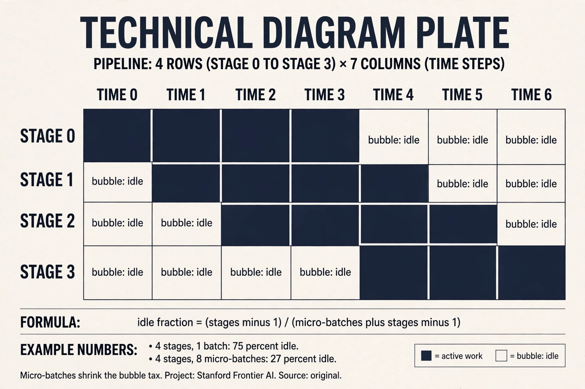
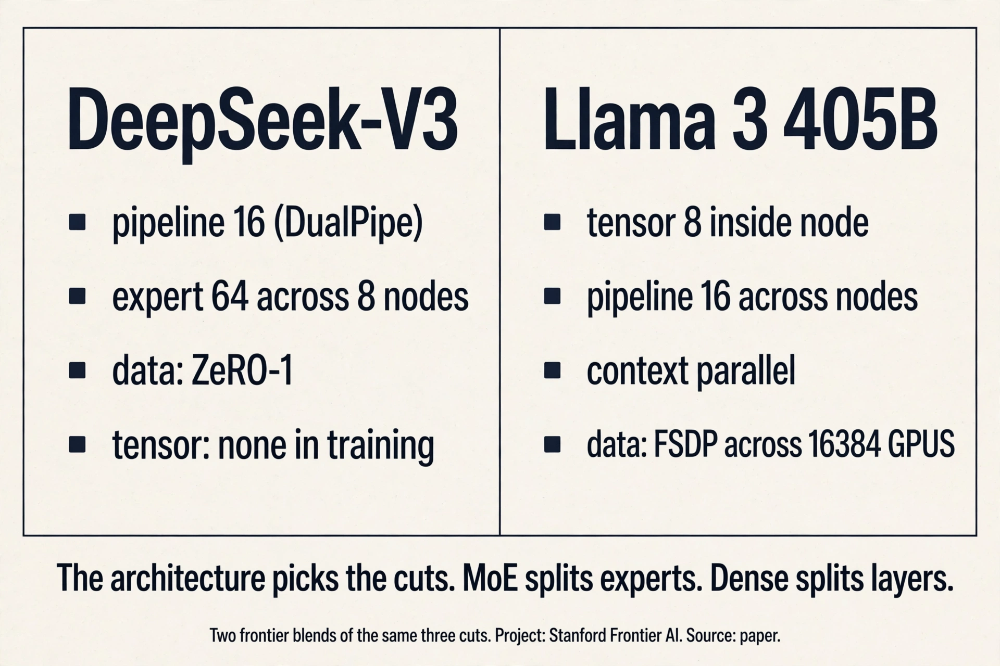

## The problem: the model does not fit

Two reasons to use many GPUs [03:17](ts:03:17). The model does not fit:
parameters, activations, gradients, and optimizer state overflow one
GPU's HBM. A B200 holds 192 GB. One trillion parameters at 12 bytes
each (from Lecture 2) need 12 TB. That is 63 B200s just for the
weights. Or the model fits and you want speed anyway.

But spreading work costs communication. The game is orchestration:
avoid data-transfer bottlenecks [01:49](ts:01:49). This lecture cuts the
work three ways and shows which cut each piece of hardware can afford.

## First, the vocabulary: collectives

GPUs talk in patterns, not messages. **Collectives** are communication
templates from 1980s parallel programming, still the interface today
[05:53](ts:05:53). A **rank** is one device. **World size** is the
device count.

Three collectives run training. Work them on a toy: 4 ranks, each
holding one number. Rank 0 holds 1, rank 1 holds 2, rank 2 holds 3,
rank 3 holds 4.


- **all-gather:** each rank's piece ends up on every rank. After: every
  rank holds [1, 2, 3, 4]. Forward pass use: assemble full parameters
  from shards.
- **reduce-scatter:** reduce (sum) per shard, scatter the results.
  After: rank 0 holds 1, rank 1 holds 2, and so on, but summed. Backward
  pass use: sum gradients, redistribute storage.
- **all-reduce:** reduce-scatter then all-gather. After: every rank
  holds the sum, 10. One call, sum replicated everywhere
  [46:05](ts:46:05).

**all-to-all** generalizes: each rank sends arbitrary bytes to each
other rank. It routes tokens to experts in MoE (load balancing keeps it
near a transpose) [17:44](ts:17:44).

Why not point-to-point messages? Collectives name the whole pattern at
once, so the library (NCCL) can pick the best topology, ring or tree,
and pipeline the transfers. Point-to-point forces you to schedule every
send and receive by hand, and one wrong ordering deadlocks.

> [!QA]
> Q: All-reduce is reduce-scatter plus all-gather. Why ever split it?
> A: Splitting lets you intervene between the two halves. FSDP all-gathers parameters for the forward pass, computes, then reduce-scatters gradients, never holding the full model. The monolithic all-reduce cannot do that because it never exposes the intermediate. Next lecture's topic.
> Follow-up: Why does the effective bandwidth formula have a 2x?
> A: All-reduce moves the data twice: once in the reduce-scatter half, once in the all-gather half. The accounting is 2 x (world-1)/world x size / duration. Reduce-scatter moves half the data (no 2x). The (world-1)/world term converges to 1, so bandwidth is independent of world size: NCCL handles that.

> [!QA]
> Q: Walk me through one data-parallel step with numbers. Four GPUs, batch 128, a 100M-parameter MLP.
> A: Split rows: each rank gets 32 rows. Forward runs locally, and the losses differ per rank. Backward runs locally: each rank holds 100M gradients, 400MB in bf16. All-reduce sums them: each rank moves about 2 x 400MB through the ring. Divide by 4: the average. The optimizer steps locally. Parameters stay bit-identical everywhere, forever. Cost: one 800MB-equivalent transfer per step. If the step takes 2 seconds of compute and the link delivers 400GB/s, the sync takes 2ms: negligible. That ratio is the whole game.
> Follow-up: What happens if you forget the divide by world size?
> A: You sum instead of averaging, and the effective learning rate multiplies by the world size. Training diverges or behaves like a much larger step. Every DDP bug of this form looks like instability at scale and like nothing at small scale. Always average.

### Subchapter: the ring all-reduce (bandwidth-optimal by construction)

The ring all-reduce is the algorithm behind the accounting. n ranks
form a circle. Each rank splits its data into n chunks. In the
reduce-scatter phase, n-1 steps: each rank sends one chunk to its
right neighbor and adds the chunk it receives from its left. In the
all-gather phase, n-1 more steps: each rank forwards the summed
chunks around the ring without adding.

Work it on the lecture's toy. 4 ranks, each holding 4MB (1MB chunks).
Reduce-scatter: 3 steps, each rank sends 1MB and receives 1MB per
step. Each rank ends with 1MB of the global sum. All-gather: 3 more
steps, each rank collects the other three 1MB sums. Total per rank:
6 steps x 1MB = 6MB moved. The formula: 2 x (n-1)/n x size.

The (n-1)/n term converges to 1 as n grows. So each rank moves about
2x the data no matter how many ranks join. Bandwidth is independent
of world size: adding GPUs never makes the sync relatively cheaper
or more expensive. That is why the lecture's 100M-element all-reduce
landed in the same 400GB/s band for both all-reduce and
reduce-scatter.

/n of the data. Source: original. Project: Stanford Frontier AI.")

> [!QA]
> Q: Ring vs tree: when does the topology matter?
> A: The ring is bandwidth-optimal for large messages: every rank sends and receives constantly, no link idles. The tree is latency-optimal for small messages: the sum reaches the root in log(n) hops instead of n-1. NCCL picks per message size. The lecture's 100M-element all-reduce (400MB) used the ring: at 400GB/s, latency is irrelevant. A 1KB gradient sync would use the tree: 7 hops on 128 ranks instead of 127. Rule: big messages want the ring, small messages want the tree. NCCL already knows this.
> Follow-up: What breaks the ring's optimality?
> A: Slow or missing links. One straggler rank stalls the whole circle: every step waits on its slowest neighbor. Heterogeneous bandwidth (NVLink inside the node, InfiniBand between) breaks the symmetry the ring assumes. That is why real stacks build hierarchical collectives: rings inside the node, trees or rings across nodes.

## The terrain: hardware topology

The memory hierarchy extends one level out from the GPUs lecture.


HBM was slow last week and is fast this week. Eight GPUs per node,
NVLinked to an NVSwitch: any GPU reaches any GPU and the switch routes
[23:35](ts:23:35). NVLink 5 gives 1.8 TB/s, about 4x slower than B200's
8 TB/s HBM [23:56](ts:23:56). Beyond the node: InfiniBand, much slower.
Beyond that: Ethernet, slowest, and it routes through the CPU.


**RDMA** is the reason the fast paths are fast: a GPU reads or writes
another GPU's memory directly, no CPU in the loop [27:05](ts:27:05).
Standard Ethernet copies through the CPU kernel's socket buffer:
latency. RoCE (RDMA over converged Ethernet) bypasses the CPU and is
the cheap answer to InfiniBand [28:55](ts:28:55). NVL72 packs nine
8-GPU trays into one 72-GPU NVLink domain for buyers with deep pockets
[27:59](ts:27:59).


**NCCL** translates collectives into actual packets: it learns the
topology, finds paths, and launches communication kernels (everything
on a GPU is a kernel) [30:03](ts:30:03). `torch.distributed` wraps NCCL
(gloo on CPU). `spawn` launches one process per rank. `barrier()`
synchronizes processes: async ranks may otherwise interleave
arbitrarily. Benchmarking collectives needs both CUDA synchronize and
the barrier, because there are two asynchronies: kernels and processes
[47:28](ts:47:28).

Effective bandwidth check: all-reduce 100M elements in 1.6 ms gives
about 400 GB/s [48:41](ts:48:41). The accounting: 2 x (world-1)/world x
size / duration. The 2x is send plus reduce. Reduce-scatter moves half
the data (no 2x) and lands in the same 400s [52:16](ts:52:16).

## First cut: data parallelism

Split the data, not the model. Batch 128 rows across 4 ranks: each
gets 32 rows of the 128x1024 matrix [56:44](ts:56:44). Forward and
backward run locally. Then the one line that makes DDP work:

```python
for p in params:
    dist.all_reduce(p.grad)   # sum across ranks
    p.grad /= world_size      # average
```


Losses differ per rank. Gradients start different, all-reduce makes
them identical. Parameters stay identical everywhere, forever
[60:11](ts:60:11). DDP is modular: it does not care what the forward
pass looks like, so transformers work the same as MLPs
[61:47](ts:61:47). Batch size must exceed world size, ideally by a lot:
each rank needs enough examples to keep its GPUs busy and amortize the
sync.

## Where data parallelism breaks

DDP replicates the full model on every GPU. Every rank holds all P
parameters, all gradients, all optimizer state: 12 x P bytes each
(Lecture 2). A 70B model needs 840 GB per GPU. A B200 holds 192 GB.
DDP cannot train it. The first cut fails on memory, exactly the
problem this lecture opened with.

Two more limits. DDP's batch must exceed world size by a lot, or
communication dominates. And past the **critical batch size**, bigger
batches waste compute (Lecture 9): the gradients stop improving, but
the all-reduce still costs the same. Data parallelism hits a ceiling
that more data cannot lift.

## The key question

The model must be split, not just the data. But splitting the model
means the pieces must talk during the forward pass, not just at the
sync point. What if each cut is chosen to match the communication the
hardware can afford? Two more cuts answer.

## Second cut: tensor parallelism

Split each layer, not the data. Column split: rank r holds dim x dim/4
of each weight matrix [63:37](ts:63:37). Forward: each rank computes
its local activations, then all-gather to full width for the next
layer. Backward: the dual, reduce-scatter the gradients
[68:12](ts:68:12).


Work the traffic. One layer of a 7B model: hidden size 4096, so one
weight matrix is 4096x4096 = 16.7M parameters, 33MB in bf16. With
4-way tensor parallel, column split: each rank holds 8MB. Forward:
each rank computes its 1024-wide slice, then all-gather to full 4096
width. Per token the activation is 4096 x 2 bytes = 8KB. The
all-gather moves about 6KB per rank per layer forward. Backward:
reduce-scatter the same size. Per layer per step: about 12KB per rank
per token at batch 1. Multiply by 32 layers, 2048 tokens, batch 4:
roughly 3GB per rank per step of activation traffic. This traffic
repeats every layer, every step. That is why tensor parallel lives on
NVLink and never crosses InfiniBand.

> [!QA]
> Q: Tensor parallel: how much traffic per layer per step, with numbers?
> A: One 7B layer at hidden 4096: the weight is 4096x4096, 33MB in bf16. With 4-way column split, each rank holds 8MB. Forward: each rank computes its 1024-wide slice, then all-gather to full 4096 width. Per token the activation is 8KB. The all-gather moves about 6KB per rank per layer forward. Backward: reduce-scatter the same size. So about 12KB per rank per token per layer. At 32 layers, 2048 tokens, batch 4: roughly 3GB per rank per step. That is the tax, and it repeats every layer.
> Follow-up: Why does this force NVLink but data parallel does not?
> A: Frequency. Tensor parallel's traffic fires per layer per step: thousands of small all-gathers with tight synchronization. Data parallel's traffic fires once per step: one big all-reduce that tolerates latency. The slow link survives the rare big transfer. It drowns under the constant chatter.

## Third cut: pipeline parallelism

Split the layers: rank r owns a contiguous layer group, sees all
dimensions and all data eventually [69:42](ts:69:42). Rank 0 takes
input, forwards activations to rank 1 via send/recv, and so on.

The tax is **bubbles**: ranks idle while waiting on neighbors. Work
it: 4 ranks, 1 batch. Rank 3 waits while ranks 0-2 compute forward,
then ranks 0-2 wait while rank 3 finishes. With one batch, 3 of 4
ranks idle at any moment: 75% idle tax. **Micro-batches** chop the
batch so work flows continuously, shrinking bubbles [73:00](ts:73:00).
With 8 micro-batches, the pipe stays mostly full: the idle fraction
drops toward ranks/micro-batches. The missing piece (next lecture):
overlap communication with computation, receiving while computing, so
waiting time nearly vanishes [74:02](ts:74:02).


### Subchapter: the pipeline bubble, worked

The bubble has a formula. With p stages and m micro-batches, the
fill-and-drain cost is p-1 idle slots against m+p-1 total slots:

idle fraction = (p-1) / (m+p-1)

Work the lecture's numbers. p=4 stages, m=1 batch: 3/4 = 75% idle.
That is the naive pipe: rank 3 waits while ranks 0-2 compute, then
the reverse. p=4, m=8 micro-batches: 3/11 = 27% idle. The pipe stays
mostly full because there is always another micro-batch to feed a
stage that just finished.

Two more increments shrink it further. Interleaved schedules assign
each rank multiple non-adjacent stage chunks, cutting the bubble by
roughly the interleave factor. DualPipe (DeepSeek-V3) feeds
micro-batches from both ends and overlaps each chunk's communication
with a neighbor's computation, hiding nearly all of it. The lesson:
the bubble is not a fixed tax. It is a schedule, and better schedules
cost engineering, not hardware.



## Mapping back: the hardware picks the strategy


| Cut | What splits | Communication | Hardware it needs |
|---|---|---|---|
| Data | batch rows | one all-reduce per step | any link, scales far |
| Tensor | layer columns | all-gather + reduce-scatter per layer | NVLink only |
| Pipeline | layer groups | point-to-point activations | tolerates slow links |

The hardware picks the strategy [76:10](ts:76:10). Tensor parallel
needs NVLink: it moves big activations every layer. Pipeline tolerates
slow links: point-to-point, small tensors, so decentralized training
uses it across the world. Data parallel scales far but hits the
critical batch size: past it, bigger batches waste compute, and you
switch to tensor [77:35](ts:77:35). In practice: tensor within a node,
data/FSDP across, pipeline if you still need it.

Uncovered here: sequence parallelism (chop the sequence for attention),
expert parallelism (all-to-all for MoE), and the combinations in the
assignment.

> [!QA]
> Q: You have 8 GPUs on NVLink and 128 more across InfiniBand. Sketch the parallelization.
> A: Tensor parallel inside each 8-GPU node: the per-layer activation traffic needs NVLink bandwidth. Data parallel or FSDP across the nodes: one gradient sync per step tolerates InfiniBand. Pipeline parallel across node groups only if the model still does not fit or bubbles are cheaper than the alternative. Never tensor across the InfiniBand boundary: the per-layer all-gathers would drown.
> Follow-up: Why does DDP need the batch to exceed world size?
> A: Each rank must receive at least one example, or it contributes nothing and still pays the all-reduce. In practice you want many examples per rank: tiny per-rank batches make the communication dominate and waste the GPUs.

### Subchapter: what is used where (who trains how)

Two frontier runs, two different blends of the same cuts.

**DeepSeek-V3** (2048 H800s, per the technical report): 16-way
pipeline with the DualPipe schedule, 64-way expert parallelism across
8 nodes, ZeRO-1 data parallelism, and no tensor parallelism in
training. Expert parallelism replaces tensor's job: the MoE experts
are the thing that splits. TP appears only at inference (TP=4 for
prefill/decode).

**Llama 3 405B** (up to 16,384 H100s, per the Llama 3 paper): 4D
parallelism. Tensor-8 inside each node, pipeline-16 across nodes,
context parallel for the long sequences, FSDP data parallel across
the fleet. It is dense: every parameter is active every step, so there
are no experts to split. TP is the only layer-split available.

**Decentralized training** (Prime Intellect-style runs): pipeline
across the world. The point-to-point activation traffic tolerates
slow links, so this is the only cut that survives the open internet.

The rule: the architecture picks the cuts. MoE splits experts. Dense
splits layers. Nobody uses one cut alone at scale.



> [!QA]
> Q: Why can DeepSeek-V3 skip tensor parallelism but Llama 3 405B cannot?
> A: DeepSeek-V3 replaces TP's job. TP exists to split layers when the model does not fit and traffic can ride NVLink. V3 splits differently: 16-way pipeline splits the layers across stages, and 64-way expert parallelism splits the MoE experts across nodes. DualPipe overlaps the pipeline's communication with computation, and hand-written all-to-all kernels hide the EP traffic. With memory and traffic solved another way, TP's per-layer NVLink chatter buys nothing. Llama 3 405B is dense: every parameter is active every step, no experts to split. Its only layer-split is TP, and 16,384 GPUs need the TP-8 in-node cut to fit activations. The architecture picks the cuts: MoE gets EP, dense gets TP.
> Follow-up: Could a dense model skip TP too?
> A: Only by replacing it with something equivalent. FSDP with full sharding plus activation checkpointing can fit a dense model without TP, at the cost of re-materializing activations and extra all-gathers. The trade is memory traffic vs layer-split traffic. At 405B scale with 128K context, the FSDP-only path is slower. TP wins where NVLink is fast and free.

> [!QA]
> Q: Design the parallelization for a 70B dense model on 64 GPUs: 8 nodes, NVLink in-node, InfiniBand between.
> A: First the memory check: 70B x 12 bytes = 840GB per full copy. One GPU holds 80GB: DDP alone is dead. Tensor parallel 8 inside each node: each rank holds 1/8 of every layer, and the per-layer traffic stays on NVLink. Data parallel across the 8 nodes: one gradient sync per step tolerates InfiniBand. Add ZeRO-1 on the data dimension: sharding the AdamW optimizer state cuts its memory about 4x, and it is the bulkiest part. Final answer: TP-8 in node, DP-8 with ZeRO-1 across nodes, pipeline only if the activations still overflow. Never TP across the InfiniBand boundary.
> Follow-up: When would you add pipeline parallel here?
> A: When memory still binds after TP-8 and ZeRO-1: activations at long sequence lengths are the usual trigger. Pipeline across node pairs costs bubbles but removes a full layer-group from each GPU. The rule: add cuts in order of cheapest communication. TP in-node first, DP across nodes second, pipeline third.

## The honest price

Every cut taxes something. Data parallel taxes the batch: it must be
big, and past the critical batch size the extra examples are wasted
compute. Tensor parallel taxes the interconnect: per-layer traffic that
only NVLink can carry. Pipeline parallel taxes utilization: bubbles
that micro-batching shrinks but never kills. And all three tax the
engineer: the orchestration in `torch.distributed` (spawn, barrier, two
asynchronies) is a new class of bugs. The next lecture combines all
three cuts at once, plus sharding, and the price goes up again.

## Recap: the whole lesson on one screen

The story in eight steps. Each step answers the one before it.

1. **The model does not fit.** 1T params x 12 bytes = 12 TB. A B200
   holds 192 GB. Or it fits and you want speed. Either way,
   communication is the tax.
2. **Collectives are the vocabulary.** All-gather assembles,
   reduce-scatter sums and splits, all-reduce does both. One pattern,
   NCCL picks the topology.
3. **The terrain decides.** NVLink 1.8 TB/s inside the node, HBM 8
   TB/s, InfiniBand across, Ethernet last. RDMA bypasses the CPU.
4. **Data parallel splits rows.** Batch 128 over 4 ranks: 32 rows
   each. One all-reduce of gradients per step. Params stay identical.
5. **DDP breaks on memory.** Full model per GPU: 70B x 12 bytes = 840
   GB > 192 GB. Plus the critical batch size ceiling.
6. **Tensor parallel splits columns.** All-gather forward,
   reduce-scatter backward, per layer. NVLink only.
7. **Pipeline parallel splits depth.** Micro-batches shrink the bubble
   tax. Tolerates slow links.
8. **Hardware picks the cut.** Tensor in the node, data across nodes,
   pipeline if needed. Match communication to links.

## Go deeper

<div style="position:relative;padding-bottom:56.25%;height:0;overflow:hidden;max-width:100%;margin:16px 0;">
<iframe style="position:absolute;top:0;left:0;width:100%;height:100%;" src="https://www.youtube-nocookie.com/embed/JA1l96tjrs4" title="Deepak Narayanan: Training Large Language Models at Scale" frameborder="0" allow="accelerometer; autoplay; clipboard-write; encrypted-media; gyroscope; picture-in-picture" allowfullscreen></iframe>
</div>
- Deepak Narayanan, Training LLMs at Scale (the embed above): https://www.youtube.com/watch?v=JA1l96tjrs4
- Rajbhandari et al., ZeRO: https://arxiv.org/abs/1910.02054
- Shoeybi et al., Megatron-LM: https://arxiv.org/abs/1909.08053
- Narayanan et al., Efficient Large-Scale LM Training on GPU Clusters: https://arxiv.org/abs/2104.04473

## Official sources and further reading

**Official:**
- Lecture 7 video, slides (lecture_7.pdf), and executable code
  (lecture_07.py): the collectives and the three parallelisms run live.
- torch.distributed documentation: the spawn/barrier/collective API.

**Further reading:**
- ZeRO/FSDP papers: the fancier data parallelism promised for next
  lecture.
- Decentralized training work: pipeline parallel across the world.

**Caveats from these sources.** The 256-GPU pod number is made up.
Eight per node is the real figure. Bandwidth numbers (1.8 TB/s NVLink
5, ~400 GB/s effective all-reduce) are demo measurements on specific
hardware. The pipeline code is naive: no comm/compute overlap.

## Connections to the other courses

- **CS336 L08:** FSDP and ZeRO split the all-reduce. 4D parallelism
  combines all three cuts.
- **CS336 L04:** expert parallelism reuses all-to-all for MoE routing.
- **CS229S:** NCCL topology and RDMA deepen on the systems side.
