### Coverage and sourcing

This lesson follows Lecture 7 of Stanford CS336 (Language Modeling
from Scratch, Spring 2026, instructor Tatsunori Hashimoto), "Parallelism,
Data, Tensor, Pipeline," delivered April 20, 2026, duration 1:20:54.
It uses the official subtitle transcript, the executable lecture code
(lecture_07.py), and the slide deck. Every timestamped claim below
comes from the lecture. Figures marked October 2026 are updates added
after the session, each with its source: the DeepSeek-V3 technical
report and the Llama 3 paper for the training-run recipes, current as
of October 2026. Model-internal training configs that are not public
are marked [uncertain] or unknown, never asserted. The coverage map
at the end of the chapter maps every major lecture claim to the
section that covers it, with file line numbers.

## The problem: the model does not fit

Two reasons to use many GPUs [03:17](ts:03:17). The model does not fit:
parameters, activations, gradients, and optimizer state overflow one
GPU's HBM. A B200 holds 192 GB. One trillion parameters at 12 bytes
each (from Lecture 2) need 12 TB. That is 63 B200s just for the
weights. Or the model fits and you want speed anyway.

But spreading work costs communication. The game is orchestration:
avoid data-transfer bottlenecks [01:49](ts:01:49). This lecture cuts the
work three ways and shows which cut each piece of hardware can afford.

## First, the vocabulary: collectives

GPUs talk in patterns, not messages. **Collectives** are communication
templates from 1980s parallel programming, still the interface today
[05:53](ts:05:53). A **rank** is one device. **World size** is the
device count.

Three collectives run training. Work them on a toy: 4 ranks, each
holding one number. Rank 0 holds 1, rank 1 holds 2, rank 2 holds 3,
rank 3 holds 4.

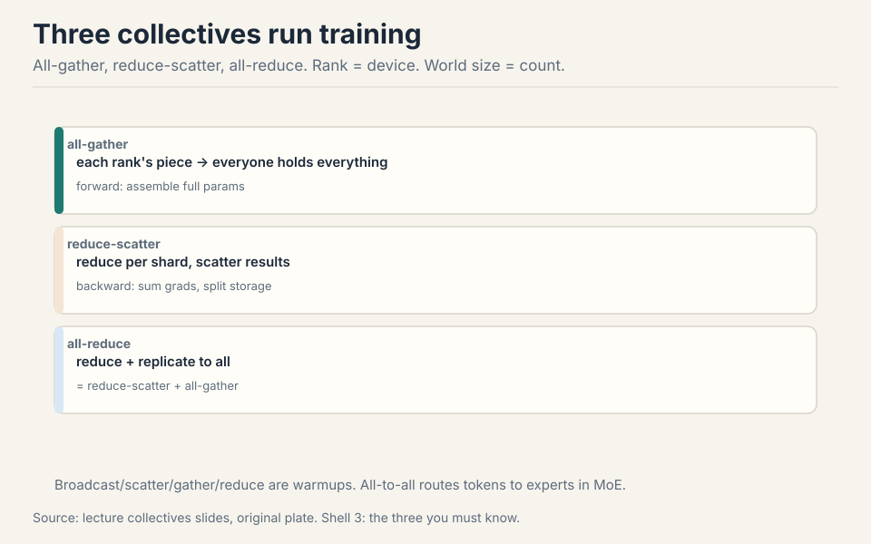

- **all-gather:** each rank's piece ends up on every rank. After: every
  rank holds [1, 2, 3, 4]. Forward pass use: assemble full parameters
  from shards.
- **reduce-scatter:** reduce (sum) per shard, scatter the results.
  After: rank 0 holds 1, rank 1 holds 2, and so on, but summed. Backward
  pass use: sum gradients, redistribute storage.
- **all-reduce:** reduce-scatter then all-gather. After: every rank
  holds the sum, 10. One call, sum replicated everywhere
  [46:05](ts:46:05).

**all-to-all** generalizes: each rank sends arbitrary bytes to each
other rank. It routes tokens to experts in MoE (mixture of experts; load balancing keeps it
near a transpose) [17:44](ts:17:44).

Why not point-to-point messages? Collectives name the whole pattern at
once, so the library (NCCL, NVIDIA's collective-communication library)
can pick the best topology, ring or tree,
and pipeline the transfers. Point-to-point forces you to schedule every
send and receive by hand, and one wrong ordering deadlocks.

> [!QA]
> Q: All-reduce is reduce-scatter plus all-gather. Why ever split it?
> A: Splitting lets you intervene between the two halves. FSDP (Fully Sharded Data Parallel) all-gathers parameters for the forward pass, computes, then reduce-scatters gradients, never holding the full model. The monolithic all-reduce cannot do that because it never exposes the intermediate. Next lecture's topic.
> Follow-up: Why does the effective bandwidth formula have a 2x?
> A: All-reduce moves the data twice: once in the reduce-scatter half, once in the all-gather half. The accounting is 2 x (world-1)/world x size / duration. Reduce-scatter moves half the data (no 2x). The (world-1)/world term converges to 1, so bandwidth is independent of world size: NCCL handles that.

### Subchapter: FSDP traffic, worked

The Q&A above named FSDP's trick: all-gather parameters for the
forward pass, then reduce-scatter gradients, never holding the full
model. Work what that costs. One 1GB layer, 8 ranks, bf16.

Forward: all-gather the 1GB layer. Each rank collects 7/8 of the
layer from the other ranks: 875MB moved, and now holds the full 1GB.
Compute, then free it: back to its 125MB shard.

Backward: all-gather the 1GB again (875MB moved), compute the local
gradients, free the parameters. Then reduce-scatter the gradients:
each rank's 1GB of gradients is summed and split, and each rank keeps
1/8 of the sum: 875MB moved.

Total per rank per layer: 875MB + 875MB + 875MB = 2.6GB. DDP (Distributed Data Parallel)'s
all-reduce on the same layer moves 2 x 7/8 x 1GB = 1.75GB. The extra
all-gather is the price of sharding the parameters: 3P traffic
instead of 2P. Overlap (all-gather layer n+1 while computing layer n)
hides it when compute dominates. The next lecture climbs this ladder
in full.

| | FSDP (3P) | DDP (2P) |
|---|---|---|
| Forward all-gather | 875MB | 0 |
| Backward all-gather | 875MB | 0 |
| Reduce-scatter / all-reduce | 875MB | 1.75GB |
| Per rank per layer | 2.6GB | 1.75GB |

One 1GB layer, 8 ranks, bf16. The extra all-gather is the price of
sharding the parameters. Figure: Shell 3. Source: original worked toy.

### Subchapter: latency vs bandwidth, the two costs

Every transfer pays two costs. **Latency** is the fixed startup
price: the microseconds to launch the transfer, negotiate the path,
and synchronize the ranks. **Bandwidth** is the per-byte price: the
rate the link moves data once it flows. Total time:

time = latency + size / bandwidth

Work both regimes. Sending 1KB over NVLink (NVIDIA's high-bandwidth
GPU-to-GPU link inside a node) at 1.8 TB/s with 5us
latency: the size term is 1KB / 1.8 TB/s = 0.0006us. Latency
dominates 10,000 to 1. The link's speed is irrelevant: you pay the
startup. Sending 400MB: the size term is 222us. Bandwidth
dominates 44 to 1. The startup is noise.

This decides the topology. Small messages want low latency: the
tree, log(n) hops, each hop short. Large messages want high
bandwidth: the ring, every link saturated, latency amortized to
nothing. NCCL's per-message-size choice is this arithmetic, not a
preference. And it explains a training rule you will meet again:
collect small gradients into buckets before the all-reduce, so the
sync lives in the bandwidth regime. Latency is a tax on the small.
Bandwidth is a tax on the big. Know which regime you are in.

| Message | Size term | Latency term | Regime |
|---|---|---|---|
| 1KB over NVLink (1.8 TB/s, 5us) | 0.0006us | 5us | latency wins 10,000 to 1 |
| 400MB over NVLink | 222us | 5us | bandwidth wins 44 to 1 |

Figure: Shell 2. time = latency + size/bandwidth. Source: original worked toy.

> [!QA]
> Q: Walk me through one data-parallel step with numbers. Four GPUs, batch 128, a 100M-parameter MLP.
> A: Split rows: each rank gets 32 rows. Forward runs locally, and the losses differ per rank. Backward runs locally: each rank holds 100M gradients, 400MB in bf16. All-reduce sums them: each rank moves about 2 x 400MB through the ring. Divide by 4: the average. The optimizer steps locally. Parameters stay bit-identical everywhere, forever. Cost: one 800MB-equivalent transfer per step. If the step takes 2 seconds of compute and the link delivers 400GB/s, the sync takes 2ms: negligible. That ratio is the whole game.
> Follow-up: What happens if you forget the divide by world size?
> A: You sum instead of averaging, and the effective learning rate multiplies by the world size. Training diverges or behaves like a much larger step. Every DDP bug of this form looks like instability at scale and like nothing at small scale. Always average.

### Subchapter: the ring all-reduce (bandwidth-optimal by construction)

The ring all-reduce is the algorithm behind the accounting. n ranks
form a circle. Each rank splits its data into n chunks. In the
reduce-scatter phase, n-1 steps: each rank sends one chunk to its
right neighbor and adds the chunk it receives from its left. In the
all-gather phase, n-1 more steps: each rank forwards the summed
chunks around the ring without adding.

Work it on the lecture's toy. 4 ranks, each holding 4MB (1MB chunks).
Reduce-scatter: 3 steps, each rank sends 1MB and receives 1MB per
step. Each rank ends with 1MB of the global sum. All-gather: 3 more
steps, each rank collects the other three 1MB sums. Total per rank:
6 steps x 1MB = 6MB moved. The formula: 2 x (n-1)/n x size.

The (n-1)/n term converges to 1 as n grows. So each rank moves about
2x the data no matter how many ranks join. Bandwidth is independent
of world size: adding GPUs never makes the sync relatively cheaper
or more expensive. That is why the lecture's 100M-element all-reduce
landed in the same 400GB/s band for both all-reduce and
reduce-scatter.

/n of the data, 6MB for the 4MB toy. Source: lecture all-reduce toy, original plate.")

> [!QA]
> Q: Ring vs tree: when does the topology matter?
> A: The ring is bandwidth-optimal for large messages: every rank sends and receives constantly, no link idles. The tree is latency-optimal for small messages: the sum reaches the root in log(n) hops instead of n-1. NCCL picks per message size. The lecture's 100M-element all-reduce (400MB) used the ring: at 400GB/s, latency is irrelevant. A 1KB gradient sync would use the tree: 7 hops on 128 ranks instead of 127. Rule: big messages want the ring, small messages want the tree. NCCL already knows this.
> Follow-up: What breaks the ring's optimality?
> A: Slow or missing links. One straggler rank stalls the whole circle: every step waits on its slowest neighbor. Heterogeneous bandwidth (NVLink inside the node, InfiniBand between) breaks the symmetry the ring assumes. That is why real stacks build hierarchical collectives: rings inside the node, trees or rings across nodes.

### Subchapter: NCCL's topology playbook

NCCL does not run one ring. It builds a plan from the machine it
finds. Inside one node, NVLink connects every GPU to every other
through the switch: NCCL forms rings over the fast fabric, or uses
NVLS (NVLink SHARP) to reduce inside the switch itself. Across
nodes, InfiniBand links form a second level: NCCL nests a ring or
tree across the nodes inside the per-node ring. The result is a
hierarchy: fast small collectives within the node, slower big ones
across.

The tree variant has a name: the double binary tree. Two trees,
each rank an interior node in one and a leaf in the other, so no
link sits idle. It halves the latency of a single tree while keeping
log(n) hops. NCCL picks ring, tree, or double binary tree per
message size and per topology: small messages on trees, large on
rings, medium on the double tree. The programmer writes one
all-reduce call. NCCL writes the plan.

One more mechanism: protocol choice. NCCL's LL (low latency)
protocol moves 4 bytes of data with 4 bytes of flag per 8-byte
transfer: half the bandwidth, minimal latency. The Simple protocol
moves full payloads: full bandwidth, higher latency. Small syncs
use LL. Big syncs use Simple. Same two-regime arithmetic as the
latency-vs-bandwidth subchapter, one level down.

| Message size | Topology | Protocol | Why |
|---|---|---|---|
| Small (KB) | tree / double binary tree | LL (4B data + 4B flag) | latency regime: log(n) hops |
| Medium | double binary tree | Simple | halves single-tree latency |
| Large (100MB+) | ring | Simple | bandwidth regime: every link saturated |

Figure: Shell 3. Source: lecture NCCL discussion, original table.

> [!QA]
> Q: NCCL picked a tree for my 4KB all-reduce and a ring for my 400MB one. Explain the choice.
> A: The 4KB message lives in the latency regime: 4KB / 1.8 TB/s is 0.002us of transfer against ~5us of startup. The tree's log(n) hops minimize the startup-dominated time. The 400MB message lives in the bandwidth regime: 222us of transfer against 5us of startup. The ring saturates every link and the startup amortizes to nothing. NCCL measured the message, did the two-regime arithmetic, and picked the topology that wins in that regime. Your one line of code became two different algorithms.
> Follow-up: When does NCCL's plan fail?
> A: When the topology lies. A shared InfiniBand fabric with other jobs' traffic, a degraded link that reports full speed, a straggler rank with a slow GPU: NCCL plans from the static topology, not the live one. The symptom is a collective that should take milliseconds taking seconds, with no error. The fix is operational: isolate the fabric, find the slow rank, replace the cable. The plan was optimal for the machine NCCL thought it had.

## The terrain: hardware topology

The memory hierarchy extends one level out from the GPUs lecture.

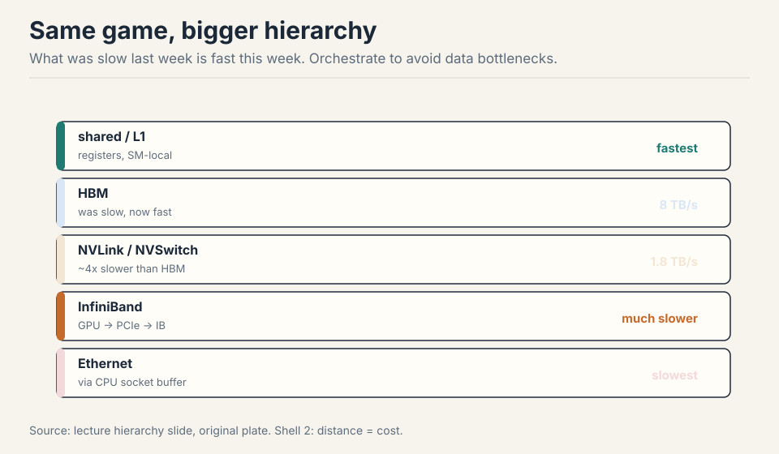

HBM was slow last week and is fast this week. Eight GPUs per node,
NVLinked to an NVSwitch: any GPU reaches any GPU and the switch routes
[23:35](ts:23:35). NVLink 5 gives 1.8 TB/s, about 4x slower than B200's
8 TB/s HBM [23:56](ts:23:56). Beyond the node: InfiniBand, much slower.
Beyond that: Ethernet, slowest, and it routes through the CPU.

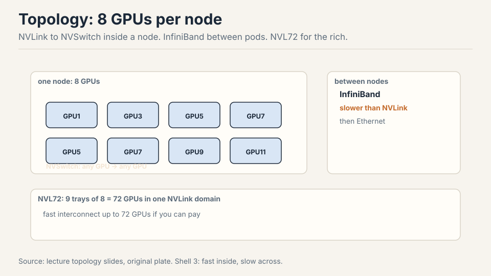

**RDMA** is the reason the fast paths are fast: a GPU reads or writes
another GPU's memory directly, no CPU in the loop [27:05](ts:27:05).
Standard Ethernet copies through the CPU kernel's socket buffer:
latency. RoCE (RDMA over converged Ethernet) bypasses the CPU and is
the cheap answer to InfiniBand [28:55](ts:28:55). NVL72 packs nine
8-GPU trays into one 72-GPU NVLink domain for buyers with deep pockets
[27:59](ts:27:59).

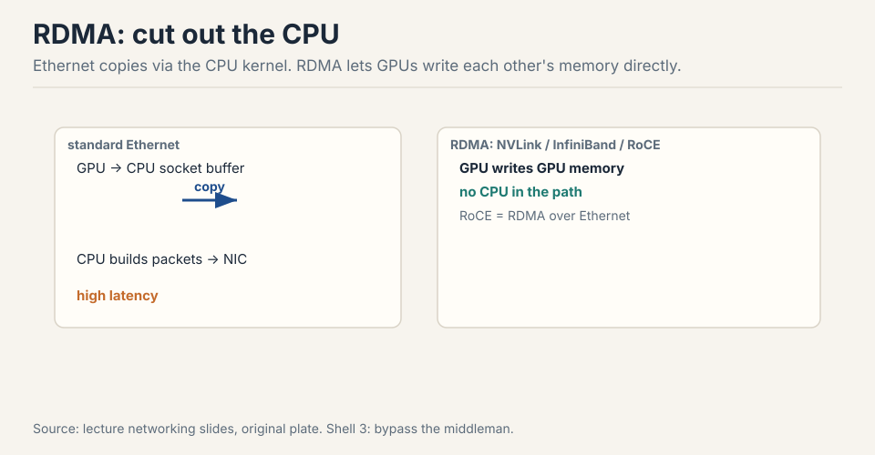

**NCCL** translates collectives into actual packets: it learns the
topology, finds paths, and launches communication kernels (everything
on a GPU is a kernel) [30:03](ts:30:03). `torch.distributed` wraps NCCL
(gloo on CPU). `spawn` launches one process per rank. `barrier()`
synchronizes processes: async ranks may otherwise interleave
arbitrarily. Benchmarking collectives needs both CUDA synchronize and
the barrier, because there are two asynchronies: kernels and processes
[47:28](ts:47:28).

Effective bandwidth check: all-reduce 100M elements in 1.6 ms gives
about 400 GB/s [48:41](ts:48:41). The accounting: 2 x (world-1)/world x
size / duration. The 2x is send plus reduce. Reduce-scatter moves half
the data (no 2x) and lands in the same 400s [52:16](ts:52:16).

## First cut: data parallelism

Split the data, not the model. Batch 128 rows across 4 ranks: each
gets 32 rows of the 128x1024 matrix [56:44](ts:56:44). Forward and
backward run locally. Then the one line that makes DDP work:

```python
for p in params:
    dist.all_reduce(p.grad)   # sum across ranks
    p.grad /= world_size      # average
```

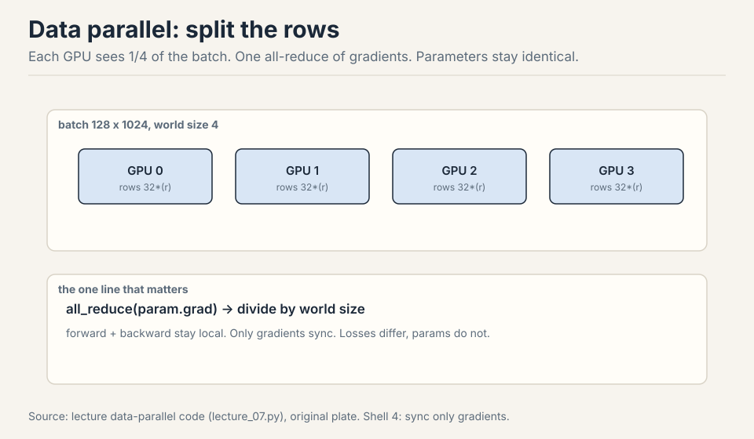

Losses differ per rank. Gradients start different, all-reduce makes
them identical. Parameters stay identical everywhere, forever
[60:11](ts:60:11). DDP is modular: it does not care what the forward
pass looks like, so transformers work the same as MLPs
[61:47](ts:61:47). Batch size must exceed world size, ideally by a lot:
each rank needs enough examples to keep its GPUs busy and amortize the
sync.

### Subchapter: DDP's bucketing trick, worked

The naive DDP sync waits for the whole backward pass, then
all-reduces all P gradients at once. The GPUs sit idle during the
sync. DDP's fix: **bucketing**. Gradients are collected into buckets
(about 25MB by default) as the backward pass produces them, and each
bucket's all-reduce launches the moment its bucket fills, while the
backward pass continues on the remaining layers.

Work the overlap. A 7B model in bf16: gradients are 14GB. One
monolithic all-reduce at 400GB/s effective: 2 x 14GB / 400GB/s =
70ms of dead time after backward. Bucketed into 25MB buckets: 560
buckets. The first bucket's all-reduce (2 x 25MB / 400GB/s = 0.125ms)
launches while the backward pass still has 90% of its layers to go.
By the time the last layer's gradients are ready, 559 buckets have
already synced. The exposed sync is one bucket: 0.125ms instead of
70ms. The communication did not shrink. It hid behind the compute.

The price: bucketing needs the backward pass to produce gradients
in a predictable order, and the all-reduce of bucket k must not
start before bucket k is full. DDP hooks into autograd for this:
each parameter's gradient-ready callback feeds its bucket. The
mechanism is invisible until it breaks: a parameter that never gets
a gradient (a dead branch) stalls its bucket forever. The debug
rule: unused parameters need find_unused_parameters=True, or DDP
hangs with no error.

| | Naive sync | Bucketed (25MB) |
|---|---|---|
| When it syncs | after the whole backward pass | as each bucket fills |
| Exposed sync, 7B bf16 at 400GB/s | 70ms dead time | 0.125ms (one bucket) |
| Bytes moved | same 14GB | same 14GB |
| What changed | nothing | the schedule |

Figure: Shell 4. The communication did not shrink. It hid behind the compute. Source: original worked toy.

> [!QA]
> Q: Why does DDP bucket gradients instead of syncing once at the end?
> A: To hide the sync behind the backward pass. One 14GB all-reduce after backward is 70ms of dead time. 560 buckets of 25MB launch their all-reduces as the backward pass produces them, so 559 of 560 syncs finish before backward ends. The exposed cost is one bucket: 0.125ms. Same bytes, different schedule. The schedule is the optimization.
> Follow-up: What breaks bucketing?
> A: Parameters that never receive gradients. A dead branch, a conditional path not taken: its bucket never fills, its all-reduce never launches, and every rank waits at the barrier forever. DDP hangs with no error message. The fix is find_unused_parameters=True, which pays a small extra cost to detect the unused ones. The hang is the classic DDP debugging story: nothing is wrong with the math, the schedule just never completes.

### Subchapter: the 12 bytes per parameter, mapped

Lecture 2's accounting, placed where DDP feels it. One parameter in
mixed-precision Adam training costs about 12 bytes:

- 2 bytes: the bf16 parameter itself (the working copy).
- 2 bytes: the bf16 gradient.
- 4 bytes: the fp32 master copy (the optimizer updates this).
- 4 bytes: the fp32 first and second moments (2 + 2).

DDP replicates all four on every rank: 12 x P bytes per GPU. A 7B
model: 84GB per GPU, before activations. An 80GB A100 cannot hold
it: DDP alone is dead at 7B on A100s. This is the number the ZeRO
ladder attacks in the next lecture: ZeRO-1 shards the 8 bytes of
optimizer state, ZeRO-2 shards the 2 bytes of gradients, ZeRO-3
shards the 2 bytes of parameters. Each stage removes one line from
this table. Memorize the four lines: every memory question in the
parallelism lectures is answered by pointing at which lines each
GPU holds.

| Line | What | Bytes |
|---|---|---|
| bf16 parameter (working copy) | the weights | 2 |
| bf16 gradient | the backward signal | 2 |
| fp32 master copy | what the optimizer updates | 4 |
| fp32 moments (m + v) | Adam state | 4 |
| Total per parameter | | 12 |

Figure: Shell 4. Source: Lecture 2 accounting, reused here.

## Where data parallelism breaks

DDP replicates the full model on every GPU. Every rank holds all P
parameters, all gradients, all optimizer state: 12 x P bytes each
(Lecture 2). A 70B model needs 840 GB per GPU. A B200 holds 192 GB.
DDP cannot train it. The first cut fails on memory, exactly the
problem this lecture opened with.

Two more limits. DDP's batch must exceed world size by a lot, or
communication dominates. And past the **critical batch size**, bigger
batches waste compute (Lecture 9): the gradients stop improving, but
the all-reduce still costs the same. Data parallelism hits a ceiling
that more data cannot lift.

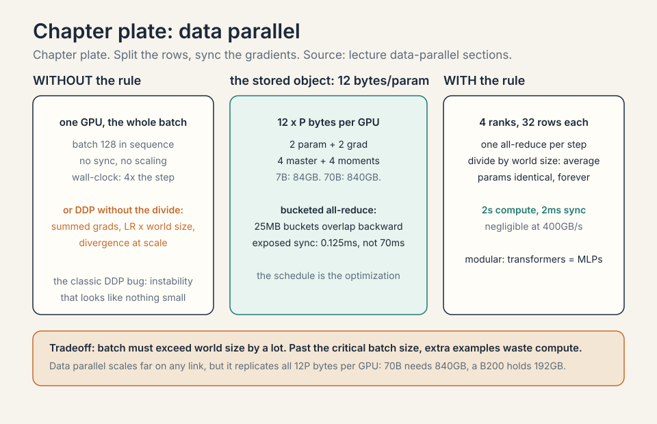

## The key question

The model must be split, not just the data. But splitting the model
means the pieces must talk during the forward pass, not just at the
sync point. What if each cut is chosen to match the communication the
hardware can afford? Two more cuts answer.

## Second cut: tensor parallelism

Split each layer, not the data. Column split: rank r holds dim x dim/4
of each weight matrix [63:37](ts:63:37). Forward: each rank computes
its local activations, then all-gather to full width for the next
layer. Backward: the dual, reduce-scatter the gradients
[68:12](ts:68:12).

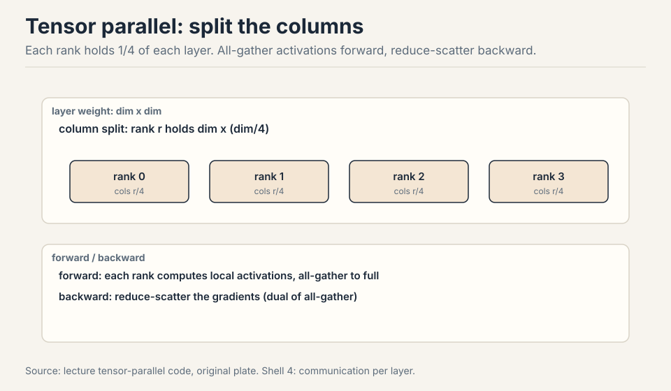

Work the traffic. One layer of a 7B model: hidden size 4096, so one
weight matrix is 4096x4096 = 16.7M parameters, 33MB in bf16. With
4-way tensor parallel, column split: each rank holds 8MB. Forward:
each rank computes its 1024-wide slice, then all-gather to full 4096
width. Per token the activation is 4096 x 2 bytes = 8KB. The
all-gather moves about 6KB per rank per layer forward. Backward:
reduce-scatter the same size. Per layer per step: about 12KB per rank
per token at batch 1. Multiply by 32 layers, 2048 tokens, batch 4:
roughly 3GB per rank per step of activation traffic. This traffic
repeats every layer, every step. That is why tensor parallel lives on
NVLink and never crosses InfiniBand.

| | 7B layer (hidden 4096, TP-4) | Llama-70B (hidden 8192, 80 layers, TP-8) |
|---|---|---|
| Per all-reduce | 8KB activation per token | 268MB at batch 4, seq 4096 |
| Per layer per step | ~12KB per rank per token | ~1GB per rank |
| Per step | ~3GB per rank (32 layers, 2048 tok, batch 4) | ~86GB per rank |
| On NVLink 1.8 TB/s | fast | 48ms |
| On InfiniBand ~50GB/s | slow | 1.7s |

Figure: Shell 4. The link decides whether tensor parallel is viable. Source: original worked toy.

> [!QA]
> Q: Tensor parallel: how much traffic per layer per step, with numbers?
> A: One 7B layer at hidden 4096: the weight is 4096x4096, 33MB in bf16. With 4-way column split, each rank holds 8MB. Forward: each rank computes its 1024-wide slice, then all-gather to full 4096 width. Per token the activation is 8KB. The all-gather moves about 6KB per rank per layer forward. Backward: reduce-scatter the same size. So about 12KB per rank per token per layer. At 32 layers, 2048 tokens, batch 4: roughly 3GB per rank per step. That is the tax, and it repeats every layer.
> Follow-up: Why does this force NVLink but data parallel does not?
> A: Frequency. Tensor parallel's traffic fires per layer per step: thousands of small all-gathers with tight synchronization. Data parallel's traffic fires once per step: one big all-reduce that tolerates latency. The slow link survives the rare big transfer. It drowns under the constant chatter.

### Subchapter: wiring a transformer block for tensor parallel

The Megatron rule, the one every TP implementation follows. A
transformer block has two sub-blocks, each a pair of matmuls with a
nonlinearity between: attention (QKV then output) and the MLP
(up-projection then down-projection). The rule: **column-split the
first matmul, row-split the second**, so that exactly one
synchronization sits between the pair.

Attention: Q, K, V projections are column-split: each rank computes
its own heads from the full input. No communication yet. The
attention scores and weighted sums are local per head. The output
projection is row-split: each rank produces a partial sum of the
output, then one all-reduce sums the partials. One all-reduce per
attention block.

MLP: the up-projection (d to 4d) is column-split: each rank applies
the nonlinearity to its own slice, no communication. The
down-projection (4d to d) is row-split: partial sums, one
all-reduce. One all-reduce per MLP block.

Two all-reduces per layer, forward. The backward pass mirrors with
two more. Why column-then-row and not the reverse? Row-then-column
would need the all-reduce before the nonlinearity: the nonlinearity
is elementwise, so it can run on the local slice. Column first
keeps the elementwise work local and pushes the single sync to the
boundary. The rule is: split so the nonlinearity never needs remote
data.

Work the traffic at Llama-70B scale. Hidden 8192, 80 layers, TP-8.
One all-reduce moves the activation: batch x seq x 8192 x 2 bytes.
At batch 4, seq 4096: 4 x 4096 x 8192 x 2 = 268MB per all-reduce.
Four per layer per step (2 forward, 2 backward): about 1GB per
layer. 80 layers: 86GB per rank per step of TP traffic. At NVLink's
1.8 TB/s that is 48ms per step. On InfiniBand at ~50GB/s effective:
1.7 seconds. The link decides whether TP is viable. It always does.

### Subchapter: sequence parallelism, the leftover

Tensor parallel splits the matmuls, but the layernorms, dropouts,
and residuals are elementwise: they scale with the sequence, not the
width, so TP cannot touch them. **Sequence parallelism** (Korthikanti
et al., 2022) splits those leftovers along the sequence axis:
each rank holds 1/t of the sequence for the norm/dropout/residual
chain, sharded FSDP-style, materialized only where needed.

The trick that makes it free: the TP all-reduce at the block
boundary already moves the full activation. Sequence parallel
replaces that all-reduce with a reduce-scatter: each rank keeps its
1/t slice instead of the full tensor. The communication volume is
identical to the TP all-reduce it replaces. The memory of the
elementwise chain falls by t. Nothing extra is paid: the sync that
already existed now shards.

Work the leftover. The stubborn 10sbh from the next lecture: at
s=4096, b=4, h=8192, t=8: 10 x 4096 x 4 x 8192 x 2 bytes = 2.68GB
across the batch without sequence parallel, 336MB with it. Still
large: sequence parallel divides the remainder, it does not delete
it. The full floor, 34sbh/t, is the next lecture's subject. The
point here: TP alone leaves the sequence-scaling terms intact, and
the fix rides on the sync TP already pays.

> [!QA]
> Q: Why is sequence parallelism "free" when tensor parallelism costs an all-reduce?
> A: Because the all-reduce was already there. TP's block boundary sync moves the full activation so every rank can start the next block. Sequence parallel replaces it with a reduce-scatter of the same volume: each rank keeps its 1/t slice. Same bytes moved, but now the elementwise chain (norms, dropouts, residuals) runs on the shard. The memory falls by t at zero extra communication. Free means no new sync, not no sync.
> Follow-up: What does sequence parallel not fix?
> A: The attention computation itself. The KV cache and the attention matmuls still scale with the full sequence on the ranks that compute them. Splitting the sequence for computation is context parallel (ring attention), the next lecture's tool. Sequence parallel is a memory trick for the leftovers, not a way to compute attention faster. The names mislead: sequence parallel shards memory, context parallel shards work.

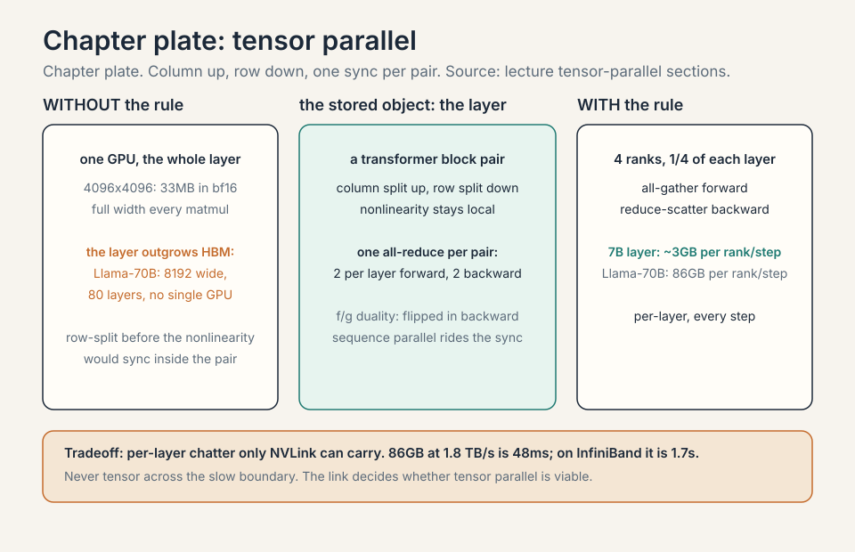

## Third cut: pipeline parallelism

Split the layers: rank r owns a contiguous layer group, sees all
dimensions and all data eventually [69:42](ts:69:42). Rank 0 takes
input, forwards activations to rank 1 via send/recv, and so on.

The tax is **bubbles**: ranks idle while waiting on neighbors. Work
it: 4 ranks, 1 batch. Rank 3 waits while ranks 0-2 compute forward,
then ranks 0-2 wait while rank 3 finishes. With one batch, 3 of 4
ranks idle at any moment: 75% idle tax. **Micro-batches** chop the
batch so work flows continuously, shrinking bubbles [73:00](ts:73:00).
With 8 micro-batches, the pipe stays mostly full: the idle fraction
drops toward ranks/micro-batches. The missing piece (next lecture):
overlap communication with computation, receiving while computing, so
waiting time nearly vanishes [74:02](ts:74:02).

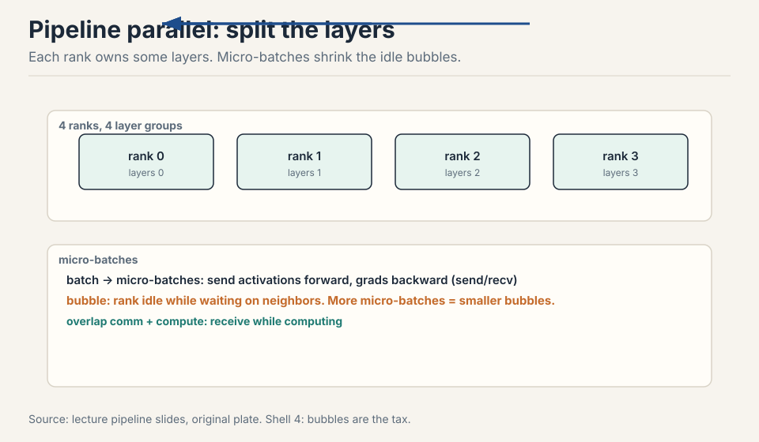

### Subchapter: the pipeline bubble, worked

The bubble has a formula. With p stages and m micro-batches, the
fill-and-drain cost is p-1 idle slots against m+p-1 total slots:

idle fraction = (p-1) / (m+p-1)

Work the lecture's numbers. p=4 stages, m=1 batch: 3/4 = 75% idle.
That is the naive pipe: rank 3 waits while ranks 0-2 compute, then
the reverse. p=4, m=8 micro-batches: 3/11 = 27% idle. The pipe stays
mostly full because there is always another micro-batch to feed a
stage that just finished.

Two more increments shrink it further. Interleaved schedules assign
each rank multiple non-adjacent stage chunks, cutting the bubble by
roughly the interleave factor. DualPipe (DeepSeek-V3) feeds
micro-batches from both ends and overlaps each chunk's communication
with a neighbor's computation, hiding nearly all of it. The lesson:
the bubble is not a fixed tax. It is a schedule, and better schedules
cost engineering, not hardware.

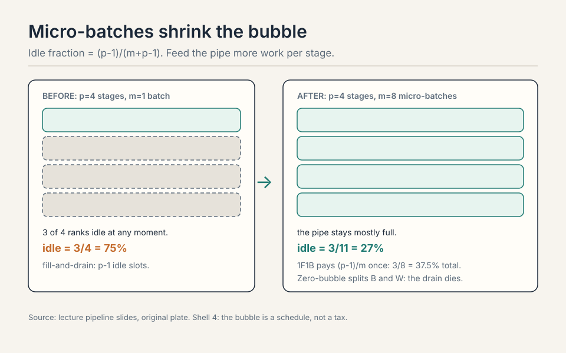

### Subchapter: GPipe vs 1F1B, the two schedules

Two ways to order the micro-batches, two different bubbles.

**GPipe** (Huang et al., 2019): all forwards first, then all
backwards. The pipe fills with forwards, drains, then fills with
backwards. The bubble is (p-1)/(m+p-1) on each side: the fill and
the drain both idle. Memory cost: every micro-batch's activations
for the whole forward pass must be held until its backward arrives.
With m micro-batches, that is m times the per-micro-batch
activations per stage.

**1F1B** (PipeDream-Flush, Narayanan et al., 2021): one forward, one
backward, steady state. Each stage alternates: forward micro-batch k,
backward micro-batch k-p+1, forward k+1, and so on. The backward of
an early micro-batch frees its activations while later forwards
still flow. The bubble shrinks to (p-1)/m: only the initial fill
idles, because the backward wave follows the forward wave with no
drain gap. Memory: each stage holds at most p micro-batches of
activations, not m.

Work the difference. p=4, m=8. GPipe bubble: 3/11 = 27% per side,
roughly 54% of the step in fill and drain combined (forward and
backward each pay it). 1F1B bubble: 3/8 = 37.5% total, paid once.
Memory: GPipe holds 8 micro-batches of activations per stage, 1F1B
holds 4. 1F1B wins on both axes. The price: the schedule is
tighter, and the backward of micro-batch k must wait for the
forward wave to reach the last stage first. The lecture's naive
pipe is GPipe without the name. Production uses 1F1B.

| | GPipe | 1F1B |
|---|---|---|
| Order | all forwards, then all backwards | forward k, backward k-p+1, alternating |
| Bubble (p=4, m=8) | 27% per side, paid twice | 37.5%, paid once |
| Activation memory per stage | m micro-batches (8) | p micro-batches (4) |
| Schedule | trivially simple | tight timing |

Figure: Shell 4. Source: lecture pipeline schedules, original table.

### Subchapter: interleaved virtual stages

The bubble comes from stages, not ranks. Give each rank more than
one stage and the bubble shrinks. **Interleaved 1F1B** (Narayanan et
al., Megatron-LM): with v virtual stages per rank, rank r owns
chunks r, r+p, r+2p, ... The forward wave passes through v times
more stages, so the fill cost (p-1) is paid against v times more
work: the bubble falls to (p-1)/(v x m).

Work it. p=4 ranks, v=2 virtual stages each, m=8 micro-batches.
Standard 1F1B bubble: 3/8 = 37.5%. Interleaved: 3/16 = 18.75%.
The communication doubles (twice as many stage boundaries), but
each message is point-to-point activations on slow-tolerant links.
The price is memory: each rank holds v chunks' activations, and the
schedule bookkeeping grows. The pattern: the bubble is (stages - 1)
over (work), so add work per stage by slicing finer. Zero-bubble
scheduling (next lecture) takes this further by splitting the
backward itself.

> [!QA]
> Q: GPipe vs 1F1B: which bubble is smaller, and what does 1F1B pay for it?
> A: 1F1B's bubble is smaller: (p-1)/m paid once, vs GPipe's (p-1)/(m+p-1) paid on both the forward fill and the backward drain. At p=4, m=8: 1F1B pays 37.5% once, GPipe pays 27% twice. 1F1B also halves the activation memory: p micro-batches per stage instead of m. What it pays: schedule complexity. The backward wave must chase the forward wave with exact timing, and the first backward cannot start until the forward wave reaches the last stage. GPipe's schedule is trivially simple: all forwards, then all backwards. Production pays the complexity because the bubble and memory savings compound at scale.
> Follow-up: Why not interleave with v=8 virtual stages and kill the bubble entirely?
> A: Diminishing returns and rising costs. The bubble falls as 1/v, but the communication doubles with each doubling of v (more stage boundaries), the activation memory per rank grows with v, and the schedule's bookkeeping gets fragile. At some point the extra point-to-point messages on slow links cost more than the bubble they remove. The optimum is empirical: v=2 to 4 in practice. And the bubble never fully dies this way: zero-bubble needs the B/W split, not finer slicing.

/(m+p-1); 1F1B pays once; zero-bubble splits B and W. Right: 8 micro-batches: 27% idle; point-to-point activations tolerate slow links. Bottom: the bubble never fully dies; schedules trade memory for utilization. Dense chapter plate. Source: original synthesis of the lecture.")

## Mapping back: the hardware picks the strategy

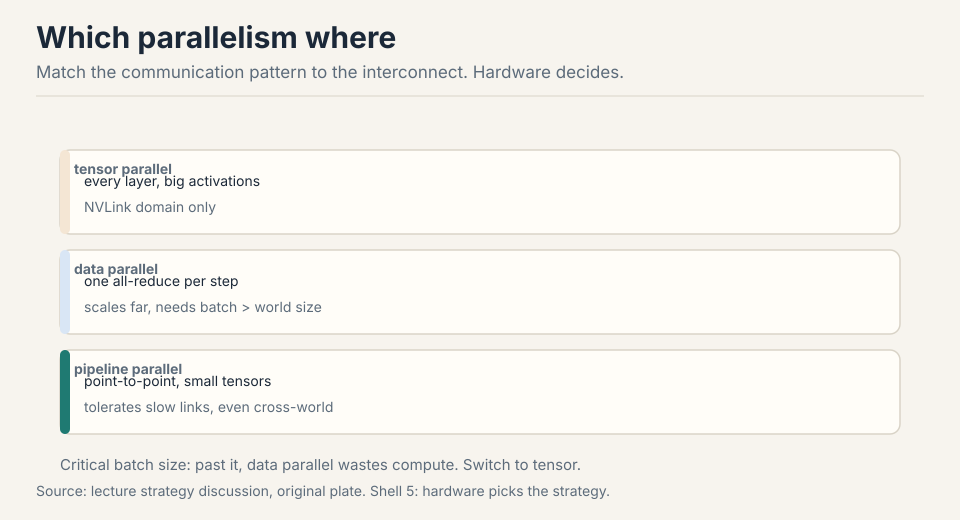

| Cut | What splits | Communication | Hardware it needs |
|---|---|---|---|
| Data | batch rows | one all-reduce per step | any link, scales far |
| Tensor | layer columns | all-gather + reduce-scatter per layer | NVLink only |
| Pipeline | layer groups | point-to-point activations | tolerates slow links |

The hardware picks the strategy [76:10](ts:76:10). Tensor parallel
needs NVLink: it moves big activations every layer. Pipeline tolerates
slow links: point-to-point, small tensors, so decentralized training
uses it across the world. Data parallel scales far but hits the
critical batch size: past it, bigger batches waste compute, and you
switch to tensor [77:35](ts:77:35). In practice: tensor within a node,
data/FSDP across, pipeline if you still need it.

Uncovered here: expert parallelism (token routing gets only a mention
under all-to-all, not a full treatment), context parallel (ring
attention splits the attention compute itself, the next lecture's
tool), and the combinations in the assignment.

> [!QA]
> Q: You have 8 GPUs on NVLink and 128 more across InfiniBand. Sketch the parallelization.
> A: Tensor parallel inside each 8-GPU node: the per-layer activation traffic needs NVLink bandwidth. Data parallel or FSDP across the nodes: one gradient sync per step tolerates InfiniBand. Pipeline parallel across node groups only if the model still does not fit or bubbles are cheaper than the alternative. Never tensor across the InfiniBand boundary: the per-layer all-gathers would drown.
> Follow-up: Why does DDP need the batch to exceed world size?
> A: Each rank must receive at least one example, or it contributes nothing and still pays the all-reduce. In practice you want many examples per rank: tiny per-rank batches make the communication dominate and waste the GPUs.

### Subchapter: what is used where (who trains how)

Two frontier runs, two different blends of the same cuts.

**DeepSeek-V3** (2048 H800s, per the technical report): 16-way
pipeline with the DualPipe schedule, 64-way expert parallelism across
8 nodes, ZeRO-1 data parallelism, and no tensor parallelism in
training. Expert parallelism replaces tensor's job: the MoE experts
are the thing that splits. TP appears only at inference (TP=4 for
prefill/decode).

**Llama 3 405B** (up to 16,384 H100s, per the Llama 3 paper): 4D
parallelism. The paper describes three types of parallelization
(model, pipeline, and data) but publishes no exact degrees. The
commonly reported recipe, marked [uncertain]: tensor-8 inside each
node, pipeline-16 across nodes, context parallel for the long
sequences, FSDP data parallel across the fleet. It is dense: every
parameter is active every step, so there are no experts to split.
TP is the only layer-split available.

**Decentralized training** (Prime Intellect-style runs): pipeline
across the world. The point-to-point activation traffic tolerates
slow links, so this is the only cut that survives the open internet.

The rule: the architecture picks the cuts. MoE splits experts. Dense
splits layers. Nobody uses one cut alone at scale.

. Source: DeepSeek-V3 report, Llama 3 paper, Oct 2026.")

> [!QA]
> Q: Why can DeepSeek-V3 skip tensor parallelism but Llama 3 405B cannot?
> A: DeepSeek-V3 replaces TP's job. TP exists to split layers when the model does not fit and traffic can ride NVLink. V3 splits differently: 16-way pipeline splits the layers across stages, and 64-way expert parallelism splits the MoE experts across nodes. DualPipe overlaps the pipeline's communication with computation, and hand-written all-to-all kernels hide the EP traffic. With memory and traffic solved another way, TP's per-layer NVLink chatter buys nothing. Llama 3 405B is dense: every parameter is active every step, no experts to split. Its only layer-split is TP, and 16,384 GPUs need the TP-8 in-node cut
[uncertain] to fit activations. The architecture picks the cuts: MoE gets EP, dense gets TP.
> Follow-up: Could a dense model skip TP too?
> A: Only by replacing it with something equivalent. FSDP with full sharding plus activation checkpointing can fit a dense model without TP, at the cost of re-materializing activations and extra all-gathers. The trade is memory traffic vs layer-split traffic. At 405B scale with 128K context, the FSDP-only path is slower. TP wins where NVLink is fast and free.

> [!QA]
> Q: Design the parallelization for a 70B dense model on 64 GPUs: 8 nodes, NVLink in-node, InfiniBand between.
> A: First the memory check: 70B x 12 bytes = 840GB per full copy. One GPU holds 80GB: DDP alone is dead. Tensor parallel 8 inside each node: each rank holds 1/8 of every layer, and the per-layer traffic stays on NVLink. Data parallel across the 8 nodes: one gradient sync per step tolerates InfiniBand. Add ZeRO-1 on the data dimension: sharding the AdamW optimizer state cuts its memory about 4x, and it is the bulkiest part. Final answer: TP-8 in node, DP-8 with ZeRO-1 across nodes, pipeline only if the activations still overflow. Never TP across the InfiniBand boundary.
> Follow-up: When would you add pipeline parallel here?
> A: When memory still binds after TP-8 and ZeRO-1: activations at long sequence lengths are the usual trigger. Pipeline across node pairs costs bubbles but removes a full layer-group from each GPU. The rule: add cuts in order of cheapest communication. TP in-node first, DP across nodes second, pipeline third.

### Subchapter: the history, in three systems

The three cuts were not invented together. Each arrived as the
answer to a specific wall.

**Megatron-LM (2019, NVIDIA).** The paper that made tensor parallel
standard. Shoeybi et al. split an 8.3B transformer across 512 V100s
with TP-8 in node and data parallel across: the column/row wiring
rule above is theirs. Before Megatron, splitting a transformer
layer across GPUs was folk art. After it, the f/g duality and the
column-up/row-down convention became the default every framework
copies.

**GPT-3 (2020, OpenAI).** The first famous 3D-parallel run. 175B
parameters across 10,000 V100s: data parallel across the fleet,
tensor parallel within nodes, pipeline parallel across node groups
(Brown et al. report the blend. Exact degrees were not published,
[uncertain]). It proved the combination scales: no single cut could
hold 175B, but the three together could. Every frontier run since
is a variation on this blend.

| System | Contribution |
|---|---|
| Megatron-LM (2019) | tensor-parallel wiring: column-up, row-down, f/g duality, one all-reduce per block pair |
| GPT-3 (2020) | the proof: 175B with all three cuts combined; no single cut suffices at frontier scale |
| DeepSpeed (2020) | ZeRO: sharded data parallel stops replicating everything; 3D parallelism for the rest |

Figure: Shell 5. The toolbox is young because the problem is young. Source: the three papers.

**DeepSpeed (2020, Microsoft).** ZeRO made the data-parallel cut
memory-efficient: the ZeRO paper's headline was 100B parameters on
400 V100s without model parallelism at all. DeepSpeed's 3D
parallelism then added TP and PP for the models ZeRO alone could
not hold. The lineage: Megatron wired the layer split, DeepSpeed
removed the state replication, GPT-3 proved the blend. The lecture
teaches all three because production uses all three.

> [!QA]
> Q: Megatron, DeepSpeed, GPT-3: what did each contribute to parallelism?
> A: Megatron-LM (2019) contributed the tensor-parallel wiring: column-split up, row-split down, the f/g duality, one all-reduce per block pair. It made splitting a transformer layer a solved problem. DeepSpeed (2020) contributed ZeRO: sharding the optimizer state, gradients, and parameters so data parallel stops replicating everything. It made the data cut memory-efficient. GPT-3 (2020) contributed the proof: 175B parameters trained with all three cuts combined, showing no single cut suffices at frontier scale but the blend does. The lecture's three cuts are these three contributions, taught as one toolbox.
> Follow-up: Why did it take until 2019-2020 for this toolbox to exist?
> A: The models were not big enough to need it. Pre-2019, the largest models fit on a handful of GPUs with data parallel alone. GPT-2 (1.5B) trained on 256 TPUv3 cores with data parallel. The transformer scaling of 2019-2020 pushed past single-node memory, and each wall got its answer within months: Megatron for the layer split, ZeRO for the state replication, pipeline for the depth. The toolbox is young because the problem is young.

## The honest price

Every cut taxes something. Data parallel taxes the batch: it must be
big, and past the critical batch size the extra examples are wasted
compute. Tensor parallel taxes the interconnect: per-layer traffic that
only NVLink can carry. Pipeline parallel taxes utilization: bubbles
that micro-batching shrinks but never kills. And all three tax the
engineer: the orchestration in `torch.distributed` (spawn, barrier, two
asynchronies) is a new class of bugs. The next lecture combines all
three cuts at once, plus sharding, and the price goes up again.

## Coverage map: every lecture claim and where it lives

| Lecture claim | Covered in | File line |
|---|---|---|
| Two reasons for many GPUs: model does not fit, or speed | The problem: the model does not fit | L44 |
| 1T params x 12 bytes = 12 TB vs 192 GB B200 | The problem: the model does not fit | L44 |
| Avoid data-transfer bottlenecks: orchestration is the game | The problem: the model does not fit | L44 |
| Collectives: templates from 1980s parallel programming; rank, world size | First, the vocabulary: collectives | L56 |
| All-gather, reduce-scatter, all-reduce on the 4-rank toy | First, the vocabulary: collectives | L56 |
| All-to-all for MoE expert routing | First, the vocabulary: collectives | L56 |
| Why collectives, not point-to-point: NCCL picks topology | First, the vocabulary: collectives | L56 |
| FSDP traffic worked: 1GB layer, 2.6GB per rank vs DDP 1.75GB | FSDP traffic, worked | L95 |
| Latency vs bandwidth: time = latency + size/bandwidth | latency vs bandwidth, the two costs | L117 |
| Ring all-reduce: n-1 reduce-scatter steps + n-1 all-gather steps | the ring all-reduce (bandwidth-optimal by construction) | L148 |
| Bandwidth formula 2 x (n-1)/n; independent of world size | the ring all-reduce (bandwidth-optimal by construction) | L148 |
| Ring vs tree: bandwidth-optimal vs latency-optimal | the ring all-reduce (bandwidth-optimal by construction) (Q&A) | L148 |
| NCCL: rings, trees, double binary tree, LL vs Simple protocols | NCCL's topology playbook | L178 |
| 8 GPUs per node on NVSwitch; NVLink 5 at 1.8 TB/s vs 8 TB/s HBM | The terrain: hardware topology | L210 |
| InfiniBand beyond the node, Ethernet last through the CPU | The terrain: hardware topology | L210 |
| RDMA: GPU-to-GPU memory directly; RoCE as the cheap answer | The terrain: hardware topology | L210 |
| NVL72: 72 GPUs in one NVLink domain | The terrain: hardware topology | L210 |
| NCCL learns topology, launches communication kernels | The terrain: hardware topology | L210 |
| torch.distributed: spawn, barrier, two asynchronies in benchmarking | The terrain: hardware topology | L210 |
| 100M-element all-reduce at ~400 GB/s effective | The terrain: hardware topology | L210 |
| Data parallel: split rows, all-reduce gradients, average | First cut: data parallelism | L248 |
| Parameters stay identical everywhere, forever | First cut: data parallelism | L248 |
| DDP modular: transformers same as MLPs | First cut: data parallelism | L248 |
| Batch must exceed world size, ideally by a lot | First cut: data parallelism | L248 |
| DDP bucketing: overlap all-reduce with backward | DDP's bucketing trick, worked | L270 |
| 12 bytes per parameter: 2+2+4+4 mapped | the 12 bytes per parameter, mapped | L303 |
| DDP breaks: 70B x 12 bytes = 840 GB > 192 GB | Where data parallelism breaks | L323 |
| Critical batch size ceiling on data parallel | Where data parallelism breaks | L323 |
| Key question: split the model, match cuts to hardware | The key question | L337 |
| Tensor parallel: column split, all-gather forward, reduce-scatter backward | Second cut: tensor parallelism | L344 |
| TP traffic worked: 7B layer, ~3GB per rank per step | Second cut: tensor parallelism | L344 |
| Megatron wiring: column-up, row-down, one all-reduce per pair | wiring a transformer block for tensor parallel | L372 |
| Llama-70B TP traffic: ~86GB per rank per step | wiring a transformer block for tensor parallel | L372 |
| Sequence parallelism: shard the elementwise leftovers | sequence parallelism, the leftover | L409 |
| Pipeline: rank owns layer group, send/recv activations | Third cut: pipeline parallelism | L440 |
| Bubbles: 75% idle with 1 batch; micro-batches shrink them | Third cut: pipeline parallelism | L440 |
| Bubble formula (p-1)/(m+p-1); 4 stages 8 micros = 27% | the pipeline bubble, worked | L458 |
| Interleaved schedules cut the bubble by the interleave factor | the pipeline bubble, worked | L458 |
| DualPipe: feed from both ends, overlap comm with compute | the pipeline bubble, worked | L458 |
| GPipe vs 1F1B: schedules, bubbles, memory | GPipe vs 1F1B, the two schedules | L481 |
| Interleaved virtual stages: bubble (p-1)/(v x m) | interleaved virtual stages | L511 |
| Overlap comm with computation (next lecture preview) | Third cut: pipeline parallelism | L440 |
| Hardware picks the strategy: TP in node, DP across, PP if needed | Mapping back: the hardware picks the strategy | L536 |
| The mapping table: cut, split, communication, hardware | Mapping back: the hardware picks the strategy | L536 |
| Uncovered: expert and context parallelism, combinations | Mapping back: the hardware picks the strategy | L536 |
| DeepSeek-V3: PP16 DualPipe, EP64, ZeRO-1, no training TP | what is used where (who trains how) | L565 |
| Llama 3 405B: 4D recipe, exact degrees [uncertain] (Oct 2026 update) | what is used where (who trains how) | L565 |
| Decentralized training: pipeline across the world | what is used where (who trains how) | L565 |
| Megatron-LM, GPT-3, DeepSpeed: the history | the history, in three systems | L607 |
| Honest price: every cut's tax | The honest price | L642 |

## Recap: the whole lesson on one screen

The story in eight steps. Each step answers the one before it.

1. **The model does not fit.** 1T params x 12 bytes = 12 TB. A B200
   holds 192 GB. Or it fits and you want speed. Either way,
   communication is the tax.
2. **Collectives are the vocabulary.** All-gather assembles,
   reduce-scatter sums and splits, all-reduce does both. One pattern,
   NCCL picks the topology.
3. **The terrain decides.** NVLink 1.8 TB/s inside the node, HBM 8
   TB/s, InfiniBand across, Ethernet last. RDMA bypasses the CPU.
4. **Data parallel splits rows.** Batch 128 over 4 ranks: 32 rows
   each. One all-reduce of gradients per step. Params stay identical.
5. **DDP breaks on memory.** Full model per GPU: 70B x 12 bytes = 840
   GB > 192 GB. Plus the critical batch size ceiling.
6. **Tensor parallel splits columns.** All-gather forward,
   reduce-scatter backward, per layer. NVLink only.
7. **Pipeline parallel splits depth.** Micro-batches shrink the bubble
   tax. Tolerates slow links.
8. **Hardware picks the cut.** Tensor in the node, data across nodes,
   pipeline if needed. Match communication to links.

## Go deeper

<div style="position:relative;padding-bottom:56.25%;height:0;overflow:hidden;max-width:100%;margin:16px 0;">
<iframe style="position:absolute;top:0;left:0;width:100%;height:100%;" src="https://www.youtube-nocookie.com/embed/JA1l96tjrs4" title="Training LLMs at Scale - Deepak Narayanan | Stanford MLSys #83" frameborder="0" allow="accelerometer; autoplay; clipboard-write; encrypted-media; gyroscope; picture-in-picture" allowfullscreen></iframe>
</div>
- Training LLMs at Scale - Deepak Narayanan, Stanford MLSys #83 (the embed above): https://www.youtube.com/watch?v=JA1l96tjrs4
- Rajbhandari et al., ZeRO: https://arxiv.org/abs/1910.02054
- Shoeybi et al., Megatron-LM: https://arxiv.org/abs/1909.08053
- Narayanan et al., Efficient Large-Scale LM Training on GPU Clusters: https://arxiv.org/abs/2104.04473

## Official sources and further reading

**Official:**
- Lecture 7 video, slides (lecture_7.pdf), and executable code
  (lecture_07.py): the collectives and the three parallelisms run live.
- torch.distributed documentation: the spawn/barrier/collective API.

**Further reading:**
- ZeRO/FSDP papers: the fancier data parallelism promised for next
  lecture.
- Decentralized training work: pipeline parallel across the world.

**Caveats from these sources.** The 256-GPU pod number is made up.
Eight per node is the real figure. Bandwidth numbers (1.8 TB/s NVLink
5, ~400 GB/s effective all-reduce) are demo measurements on specific
hardware. The pipeline code is naive: no comm/compute overlap.

## Connections to the other courses

- **CS336 L08:** FSDP and ZeRO split the all-reduce. 4D parallelism
  combines all three cuts.
- **CS336 L04:** expert parallelism reuses all-to-all for MoE routing.
- **CS229S:** NCCL topology and RDMA deepen on the systems side.
