## The problem: DDP replicates everything

Two bottlenecks drive everything: compute (more than one chip holds)
and memory (models do not fit) [01:27](ts:01:27). The new unit of
compute is the data center [10:34](ts:10:34).

Naive data parallel replicates everything and saves zero memory. The
real cost: with Adam you hold roughly 16 bytes per parameter, about
five copies of the weights [13:55](ts:13:55). Parameters and gradients
match. The optimizer state, the Adam first and second moments in high
precision, dominates.

Work the failure. A 7B model at 16 bytes per parameter needs 112 GB on
every GPU. An A100 holds 80 GB. The baseline could not fit 7B
[28:04](ts:28:04). And data parallel is capped twice more: by the
batch (8 examples feed at most 8 GPUs [29:15](ts:29:15)), and by the
critical batch size, past which extra examples add less than another
SGD step. Worst of all, ZeRO-1/2 never touch activation memory, which
dwarfs parameters at scale. The way out is model parallelism:
communicate activations, not just parameters [31:02](ts:31:02).

## The key question

Every GPU holds the whole model because DDP never asked whether it
had to. What if no GPU held the whole model? What if each rank owned
one slice of everything, and the full tensors existed only for the
instants they were needed? That is the ZeRO ladder.

## The ZeRO ladder: shard the state

Shard instead of replicate. Three stages, each sharding more.

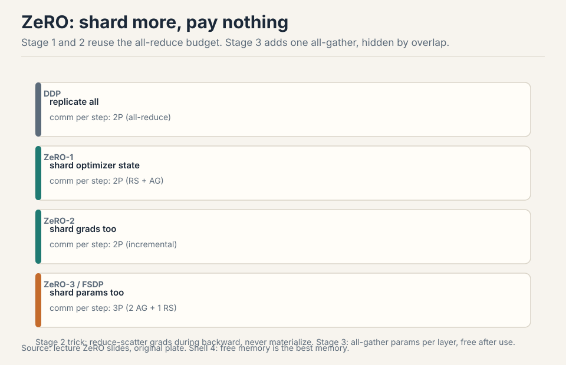

**Stage 1: shard optimizer state.** Each GPU updates its slice:
reduce-scatter the gradients to the right owners, update, all-gather
the new parameters. Communication: reduce-scatter plus all-gather,
which equals one all-reduce. Same cost as DDP, memory divided by N.
Free [18:52](ts:18:52).

**Stage 2: shard gradients too.** Trick: during the backward sweep,
reduce-scatter each layer's gradients the moment they are computed and
free them. Never materialize the full gradient. Same communication,
more memory saved [19:16](ts:19:16).

**Stage 3 (FSDP): shard parameters too.** Each GPU holds a slice of
everything. All-gather the layer's parameters on demand, forward, free.
All-gather again for backward, reduce-scatter the gradients, free.
Cost: two all-gathers plus one reduce-scatter. One all-gather more
than DDP [20:25](ts:20:25).

Two ideas make stage 3 near-free: **sweep-and-free** (communicate, use,
immediately release) and **overlap** (all-gather layer n+1 while
computing layer n). The FSDP timeline shows compute and communication
streams interleaved. If compute outlasts communication, the extra
traffic hides completely [24:02](ts:24:02). The payoff on an A100:
stage 3 fits 50B parameters where the baseline could not fit 7B
[28:04](ts:28:04).

> [!QA]
> Q: ZeRO-1 is literally free. Why does anyone run plain DDP?
> A: DDP is the simple mental model and the debugging baseline: every rank holds the full model, so any rank's state is inspectable and checkpointable directly. ZeRO-1 adds the reduce-scatter/all-gather choreography and sharded optimizer bookkeeping. For small models that fit comfortably, the memory savings buy nothing and the complexity buys risk. Use DDP until memory forces your hand, then climb the ladder.
> Follow-up: Why does overlap make FSDP "essentially free"?
> A: Communication and computation use different hardware: the network moves bytes while the SMs multiply matrices. If the all-gather for the next layer finishes before the current matmul does, its cost never appears on the critical path. The requirement is that compute dominates per layer, which holds for big layers on fast interconnects. Small layers or slow networks break the illusion.

### Subchapter: ZeRO stage costs, worked

Work the lecture's 7B example on 8 GPUs, Adam at 16 bytes per
parameter. DDP holds 112GB per GPU: dead on an 80GB A100. ZeRO-1
shards the optimizer state, the bulkiest part: about 56GB per GPU.
ZeRO-2 shards the gradients too: about 40GB per GPU. ZeRO-3 shards
the parameters: the lecture's payoff, 50B on an A100 where the
baseline could not fit 7B.

The communication stays flat, then jumps once. Stages 1 and 2 cost
2P per step: a reduce-scatter plus an all-gather, which equals one
all-reduce. Stage 3 costs 3P: two all-gathers (forward and backward)
plus one reduce-scatter. One extra all-gather. That is the price of
sharding the parameters, and overlap hides it when compute dominates.

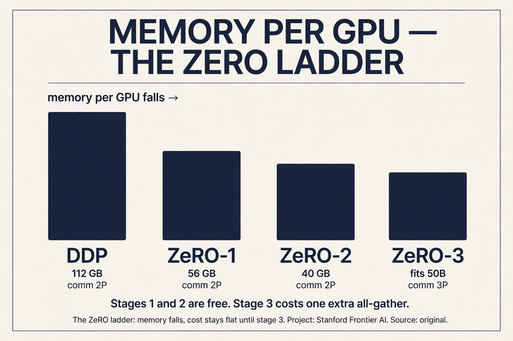

> [!QA]
> Q: Walk me through ZeRO-3 forward and backward for one layer. Eight GPUs, one 1GB layer.
> A: Forward: all-gather the 1GB layer. Each rank collects 1/8 from everyone and now holds the full 1GB. Compute. Free it: back to 1/8. Backward: all-gather the 1GB again, compute the local gradients (1GB), free the parameters. Reduce-scatter the gradients: each rank ends with 1/8 of the summed gradient, then updates its optimizer slice. Traffic per layer per rank: two all-gathers (about 1.75GB) plus one reduce-scatter (about 0.875GB), roughly 2.6GB. DDP would move about 1.75GB for one all-reduce. The extra all-gather is the 3P vs 2P. Sweep-and-free means the full 1GB exists only during use.
> Follow-up: Why not stay at ZeRO-2 forever?
> A: ZeRO-2 still replicates the parameters on every GPU. Once the parameters alone exceed HBM, no amount of optimizer and gradient sharding helps. Stage 3 is the only stage that shrinks the parameter footprint. Climb when the weights themselves stop fitting.

## Pipeline: cut by layers, pay bubbles

Cut by layers: GPU 0 owns layers 0-3, GPU 1 owns 4-7, and so on. Naive
execution: one GPU works at a time, forward then backward.
Utilization is terrible [32:15](ts:32:15).

Work the tax. 4 GPUs, 1 batch, forward pass. GPU 0 computes while 1-3
wait. Then GPU 1 computes while 0, 2, 3 wait. At any moment 3 of 4
GPUs idle: 75% idle tax, before the backward pass even starts.

**Micro-batches** chop the batch so work flows continuously: the bubble
shrinks as 1/microbatches [33:52](ts:33:52). With 8 micro-batches on 4
GPUs, the pipe fills and the idle fraction drops toward 4/8.

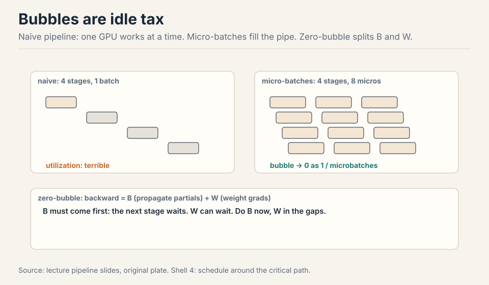

Pipeline's virtue is communication: point-to-point, only b x s x h
activations, far less than whole parameter matrices. It lives on the
slowest links: across pods, across data centers [34:58](ts:34:58).

**Zero-bubble scheduling** splits the backward pass in two.
Propagating partials (B) is on the critical path: the next stage waits
for it. Weight gradients (W) are leaf nodes: they can happen anytime.
Do B first, defer W into the gaps, and the pipeline nearly fills
[37:28](ts:37:28).

### Subchapter: the B/W split, why it works

Every layer's backward pass has two children. B is the partial
derivative with respect to the inputs: stage r-1 cannot start its
backward until stage r's B arrives. B is the critical path. W is the
weight gradient: nothing downstream waits for it. It is a leaf until
the optimizer step.

The standard schedule computes B then W together, so W blocks the
next stage's B. Zero-bubble splits them: compute B immediately, ship
it down the pipe, and do W in the idle gaps that the schedule leaves
behind: the B chain stays continuous while W fills the holes.

The price: W needs the activations, so holding W for later means
holding activations longer. Memory rises slightly. DualPipe is the
same idea taken further: it splits each chunk into attention,
dispatch, MLP, and combine, and overlaps communication with
computation in both directions. The lesson: the bubble is a schedule,
and the schedule is free to redesign.

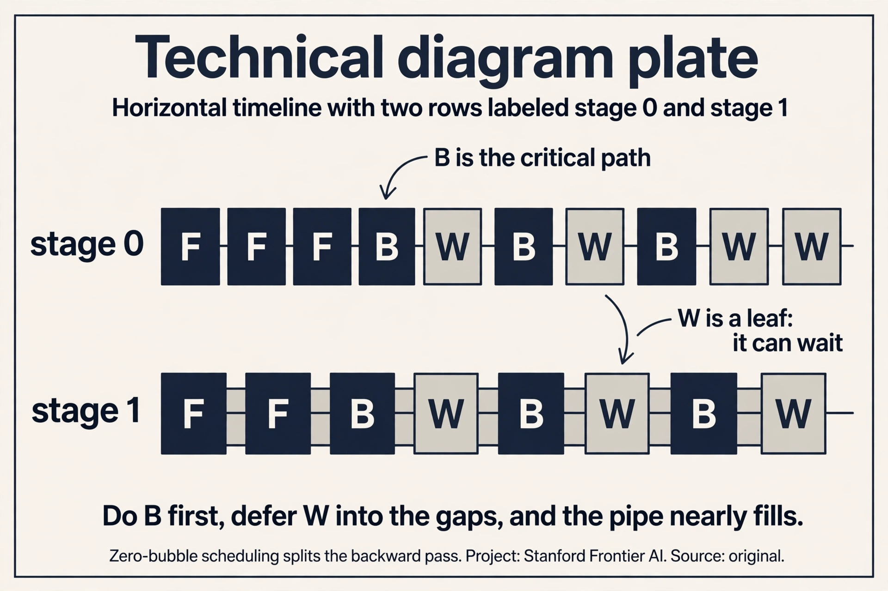

## Tensor parallel: cut by width

Cut by width: matmuls split into smaller matmuls, partial sums added
back. The transformer rule: column cuts on the way up (MLP
up-projection, attention QKV), row cuts on the way down (MLP
down-projection, attention output). Small layers (norms, nonlinears,
MoE routers) replicate: not worth the overhead [41:41](ts:41:41).

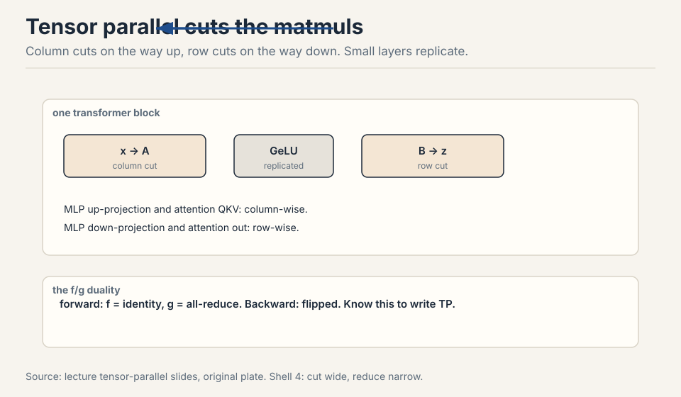

The f/g duality: forward uses f=identity then g=all-reduce. Backward
flips them [40:48](ts:40:48). Tensor parallel is communication-hungry:
an all-reduce per matmul at activation size, every layer. Keep it
inside the fast node: TP of 8 on GPUs, then stop [42:50](ts:42:50).
TPUs, with their uniform mesh, can push tensor parallel much further
than GPUs can [43:28](ts:43:28).

The networks follow the workloads. TPU mesh: neighbor talk, scales
forever. GPU tree: any-to-any, flexible. MoE's all-to-all pushed TPUs
toward trees.

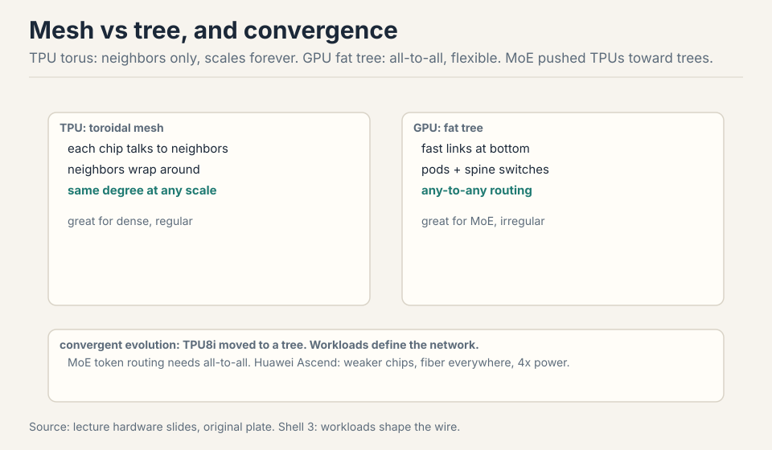

> [!QA]
> Q: Why does tensor parallel stop at 8 on GPUs but scale further on TPUs?
> A: The limit is the size of the fast domain, not the algorithm. A GPU node holds 8 GPUs on NVSwitch: any-to-any at full bandwidth. The 9th GPU crosses onto InfiniBand, and TP's per-layer chatter drowns there. TPUs are built as a mesh: neighbor-to-neighbor links scale uniformly, so the fast domain is the whole pod. The irony: MoE's all-to-all pushed TPUs toward tree-like interconnects anyway, because expert routing is any-to-any traffic, which the mesh serves poorly. Hardware follows the workload, then the workload changes.
> Follow-up: Could NVL72 change the answer?
> A: Yes, in principle: 72 GPUs in one NVLink domain extends the fast domain 9x. TP could run wider inside it. The price is the rack: one NVL72 is a single failure domain and a single buyer's budget. The physics did not change, only the boundary moved.

## Activation memory, exactly

Storing everything costs 34 x s x b x h plus 5 x a x s / h, where the
second term is the quadratic attention (softmax, dropout)
[46:51](ts:46:51). FlashAttention recomputation drops that term.

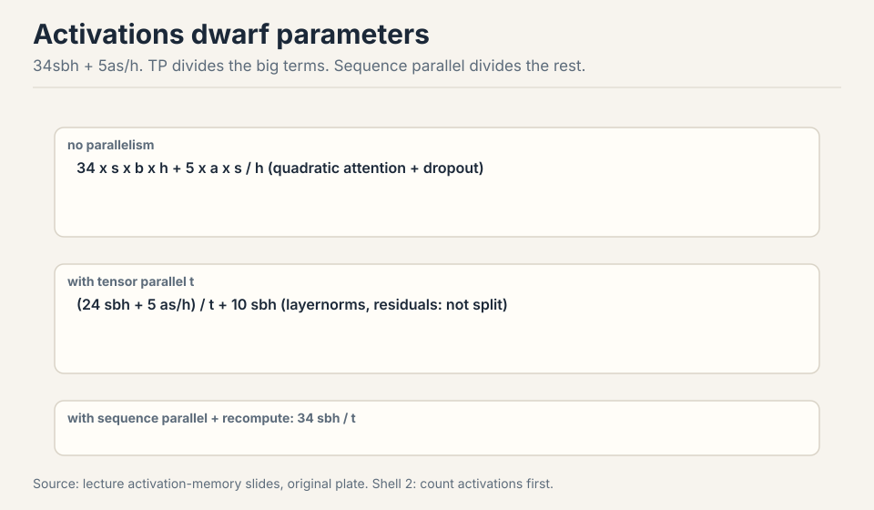

Tensor parallel divides the MLP (24 of the 34) and attention terms by
t, but not the layernorms, dropouts, and residuals: a stubborn 10sbh
remains [48:53](ts:48:53). **Sequence parallel** splits those leftovers
along the sequence axis, FSDP-style: shard now, materialize on demand
[49:25](ts:49:25). With recomputation, the floor is 34sbh/t: the
number to memorize for fitting models by hand [51:44](ts:51:44).

Work the floor. s = 4096, b = 4, h = 8192, t = 8, bf16 (2 bytes). 34 x
4096 x 4 x 8192 / 8 = 5.7e11 elements = 1.1 TB. Still too big for one
node: add pipeline or shrink the batch. The formula tells you before
you launch.

### Subchapter: the 34sbh/t floor, worked again

The baseline stores 34sbh plus the attention quadratic, 5as/h.
FlashAttention recomputation deletes the quadratic term. Tensor
parallel divides the MLP terms (24 of the 34) and the attention terms
by t. A stubborn 10sbh remains: layernorms, dropouts, residuals.
Sequence parallel splits those leftovers along the sequence axis,
FSDP-style. With recomputation, the floor is 34sbh/t.

Work a bigger case. s = 8192, b = 8, h = 8192, t = 8. 34 x 8192 x 8
x 8192 / 8 = 2.28e12 elements. In bf16: 4.5 TB. One 8xH100 node holds
640GB. It does not fit. The options: shrink the batch (b=8 to b=1
cuts 8x), add pipeline stages, or add context parallel to split the
sequence. The formula named the fix before any GPU was booked.

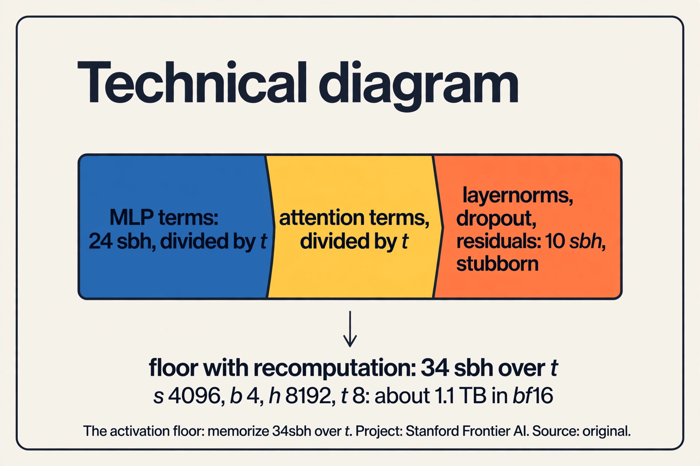

> [!QA]
> Q: Work the activation floor: s=8192, b=8, h=8192, t=8. Does it fit on one 8xH100 node?
> A: 34 x 8192 x 8 x 8192 / 8 = 2.28e12 elements. In bf16 that is 4.5 TB. One 8xH100 node holds 640GB. It does not fit, by 7x. Options: shrink the batch to 1 (cuts 8x, lands at 570GB, still tight), add pipeline stages, or add context parallel to split the sequence axis. The formula named the fix before any GPU was booked.
> Follow-up: Why is the 10sbh part called stubborn?
> A: It is not inside the big matmuls, so tensor parallel cannot touch it. Layernorms, dropouts, and residuals are elementwise: they scale with the sequence, not with the width splits. Sequence parallel exists precisely to divide this remainder. Without it, the floor would be 34sbh/t + 10sbh, and the 10sbh would dominate at high t.

## Expert parallel: route, not slice

For MoEs, prefer expert parallel over tensor parallel. Tensor slicing
makes matmuls small and utilization suffers. Routing whole tokens to
whole experts keeps matmuls big [54:45](ts:54:45). The dispatch is
all-to-all, latency-sensitive: computation waits for tokens to arrive.
DeepSeek's DeepEP and NVIDIA's Hybrid EP push this to undocumented-PTX
extremes [56:16](ts:56:16).

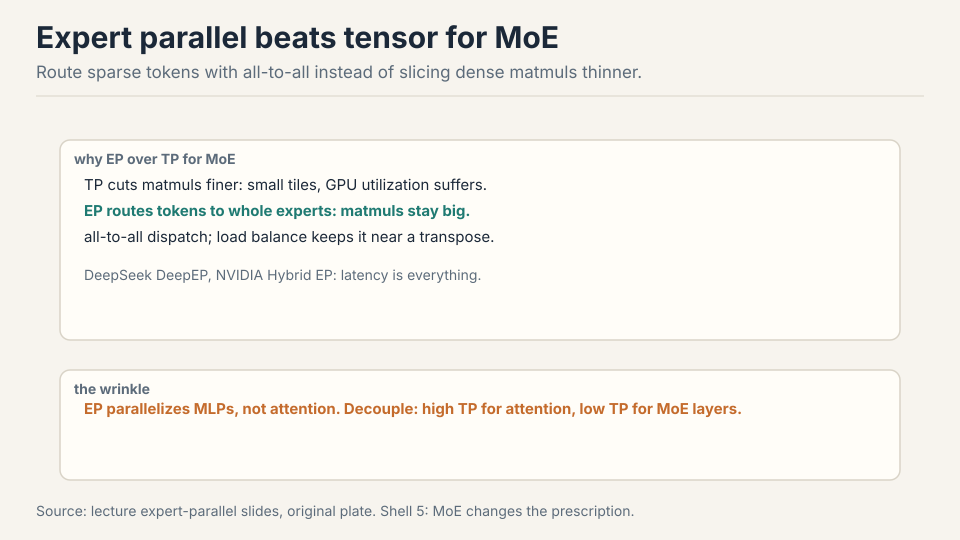

The wrinkle: EP parallelizes the MLPs, not the attention. Want high TP
for attention but low TP for MLPs, or the slices get tiny. Modern
setups decouple them: one TP degree for attention, another for MoE
layers [60:27](ts:60:27).

**Context parallel** (ring attention) splits long sequences across
devices, passing activations around the ring: the standard move for
long-context extension and serving [61:05](ts:61:05).

> [!QA]
> Q: When do you pick tensor parallel over expert parallel for an MoE?
> A: For the attention layers, always tensor: experts do not touch attention, so EP cannot help there. For the MoE layers, prefer expert parallel: it keeps expert matmuls whole and routes sparse tokens instead. The modern answer is both at once, with decoupled degrees: high TP on attention, high EP on the experts. The Megatron guideline says exactly this: EP over TP for MoE layers, TP for attention.
> Follow-up: Why does sequence parallel have a misleading name?
> A: It does not parallelize the sequence computation the way context parallel does. It is an activation-memory trick that rides along with tensor parallel: shard the layernorm and residual activations along the sequence axis, materialize on demand. Conceptually it is FSDP for activations, not a way to compute attention faster.

## The 4D prescription

No strategy dominates. The table of tradeoffs has red in every row
[62:07](ts:62:07). But the combination rule is simple:

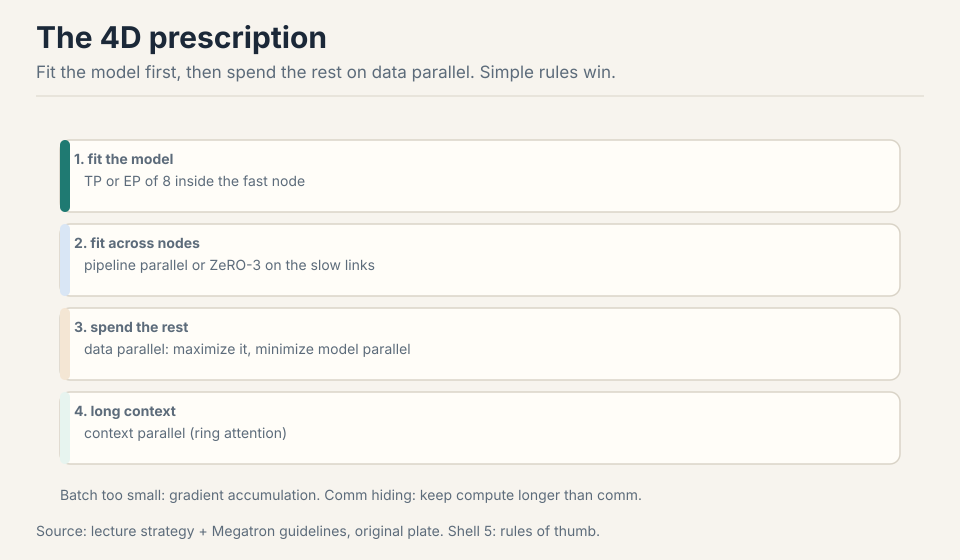

1. Until the model fits: tensor or expert parallel of 8 inside the
   fast node.
2. Across nodes: pipeline parallel or ZeRO-3 on the slow links.
3. Then data parallel for everything left. Minimize model parallel,
   maximize data parallel.
4. Long sequences: add context parallel.

Batch too small: gradient accumulation restores utilization. The
compute-vs-communication roofline tells you when to add a dimension:
big batch, FSDP alone is compute-bound. Shrinking batch, add tensor
parallel to stay compute-bound [64:49](ts:64:49). The old
NVIDIA/Stanford scaling study shows the pattern exactly: DP maxed, TP
rises to 8 and stops, PP grows, DP falls at the extreme, utilization
flat throughout [70:13](ts:70:13).

Counterintuitive: do more computation via recomputation to get better
utilization. It saves memory, memory becomes batch size, batch size
becomes utilization [71:54](ts:71:54).

> [!QA]
> Q: Why does gradient accumulation restore utilization?
> A: Small batches starve the GPUs: each kernel launch covers too little work, and the all-reduce cost is fixed per step. Accumulation runs K micro-steps locally, summing gradients without syncing, then performs one all-reduce and one optimizer step. The arithmetic intensity per sync rises Kx. The math equals one big batch (gradients add linearly), but memory holds only the small batch. The price: Kx more forward and backward passes per optimizer step, so the optimizer steps less often per wall-clock hour. It restores utilization, not learning speed.
> Follow-up: Accumulation vs a bigger batch: any difference?
> A: In exact arithmetic, none: the summed gradients are identical. In practice, small differences: batchnorm-style statistics (absent in transformers), loss scaling in fp16, and the optimizer stepping less often per hour. For transformers the two are interchangeable, which is why accumulation is the standard answer to a batch that is too small.

## In the wild

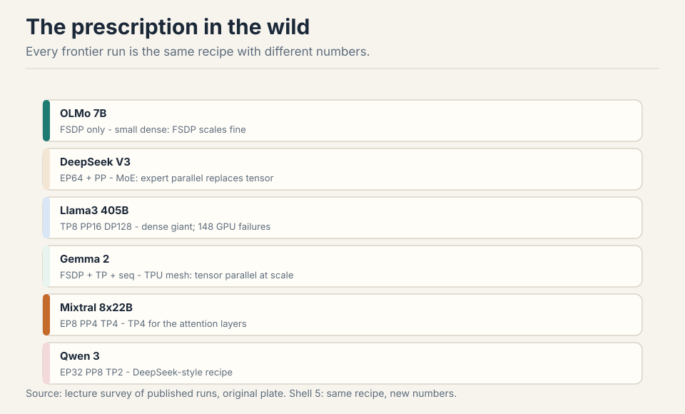

OLMo 7B: FSDP only, small dense models do not need more
[72:46](ts:72:46). DeepSeek V1: ZeRO-1 plus tensor, sequence, pipeline.
DeepSeek V3: expert parallel of 64 across 8 machines, pipeline tricks
to keep utilization up. Yi: the classic ZeRO-1/TP/PP combo. Llama3
405B: TP8, CP1, PP16, DP128 for pretraining. More context parallel for
long-context extension. 148 GPU failures during the run: redundancy is
a distributed-systems problem too [76:02](ts:76:02). Gemma 2: FSDP plus
tensor plus sequence on the TPU mesh. Mixtral 8x22B: EP8, PP4, TP4 for
attention. Qwen 3: EP32, PP8, TP2, the DeepSeek recipe.

### Subchapter: what is used where (verified frontier recipes)

Two runs verified against their papers, current as of October 2026.

**DeepSeek-V3** (2048 H800s, technical report section 3.2): expert
parallel 64 across 8 nodes, pipeline 16 with the DualPipe schedule,
ZeRO-1 data parallelism, and no tensor parallelism in training.
Tensor parallel appears only at inference (TP=4 for prefill and
decode). The MoE experts are the thing that splits, so expert
parallelism replaces tensor's job.

**Llama 3 405B** (up to 16,384 H100s, the Llama 3 paper): tensor
parallel 8 inside each node, pipeline 16 across nodes, context
parallel 1 for pretraining (more for long-context extension), FSDP
data parallel 128 across the fleet. It is dense: every parameter is
active every step, so tensor parallel is the only layer-split
available.

The remaining runs above (OLMo, DeepSeek V1, Yi, Gemma 2, Mixtral,
Qwen 3) are as reported in the lecture and public repos [uncertain]:
internal configs may differ. The pattern holds regardless: fit with
TP or EP inside the fast node, cross slow links with pipeline or
FSDP, spend the rest on data parallel.

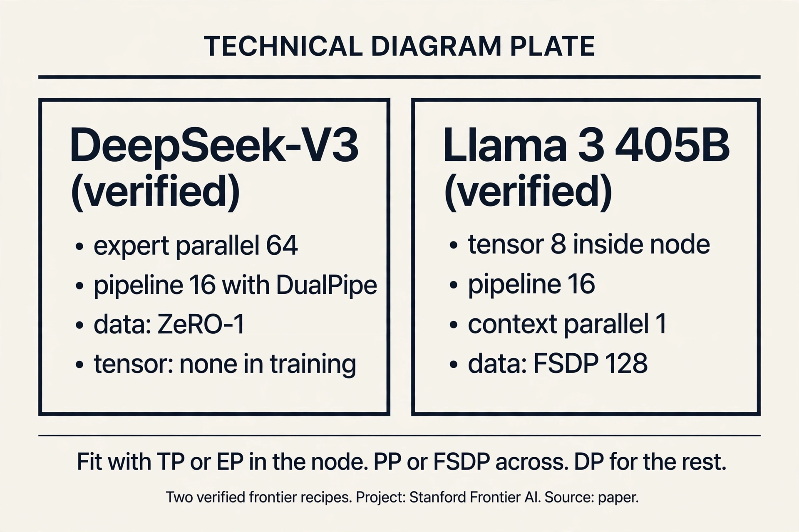

> [!QA]
> Q: Design the parallelism for a 70B dense model on 256 GPUs.
> A: Memory first: 70B x 16 bytes = 1.1TB per full copy. An 80GB GPU cannot hold it. Tensor parallel 8 inside each node: the layers split and the per-layer traffic stays on NVLink. 256 / 8 = 32 groups: data parallel 32 with FSDP (ZeRO-3) across the nodes for the rest. Activations: check the 34sbh/t floor against your sequence length. If it overflows, add context parallel for long sequences or pipeline stages for depth. Follow the prescription: minimize model parallel, maximize data parallel. The recipe is TP-8, FSDP-32, CP as needed.
> Follow-up: Why FSDP and not pipeline across the nodes?
> A: FSDP's extra all-gather hides under compute when layers are big. Pipeline's bubbles never fully hide. Pipeline wins when memory binds harder than communication: activations at very long sequences, or optimizer state that ZeRO cannot shrink. Start with FSDP, add pipeline when the floor says so.

## Mapping back: what each tool fixes

| Pain | Tool | How |
|---|---|---|
| 16 bytes/param replicated everywhere | ZeRO-1/2 | Shard optimizer and gradients. 2P comm, free memory. |
| Parameters do not fit | ZeRO-3/FSDP | Shard params too. Sweep-and-free, overlap hides the extra all-gather. |
| Batch caps DDP | Gradient accumulation | Restores utilization for small batches. |
| Activations dwarf params | Sequence parallel + recompute | Floor 34sbh/t. Recompute buys batch size. |
| Per-layer traffic | Tensor parallel, TP8 max | Columns up, rows down. NVLink only. |
| Slow links between pods | Pipeline parallel | Point-to-point bsh. Zero-bubble: B now, W in gaps. |
| MoE matmuls sliced thin | Expert parallel | Route tokens to whole experts. Decouple TP for attention. |
| Sequences too long | Context parallel | Ring attention across devices. |

## The honest price

No strategy dominates and the table has red in every row. ZeRO-3's
extra all-gather hides only when compute dominates per layer. Pipeline
bubbles shrink but never vanish. Tensor parallel stops at 8 on GPUs.
Expert parallel's all-to-all is latency-critical. And the run table is
as reported: internal runs may differ, and 148 GPU failures during
Llama 3 remind you that redundancy is a distributed-systems problem
too. The prescription is a starting point, not a proof.

## Recap: the whole lesson on one screen

The story in eight steps. Each step answers the one before it.

1. **DDP replicates everything.** 16 bytes/param x 7B = 112 GB >
   80 GB A100. The baseline could not fit 7B. Batch and critical
   batch size cap it further.
2. **Shard the state.** ZeRO-1: optimizer. ZeRO-2: gradients. Both at
   2P comm, free. ZeRO-3/FSDP: params too, one extra all-gather.
3. **Overlap hides the cost.** Sweep-and-free: communicate, use,
   release. All-gather layer n+1 during layer n's matmul. Result:
   50B on an A100.
4. **Pipeline cuts depth.** 75% idle tax with 1 batch on 4 GPUs.
   Micro-batches shrink bubbles as 1/m. Zero-bubble: B now, W in
   the gaps.
5. **Tensor cuts width.** Columns up, rows down. f/g duality flips in
   backward. All-reduce per matmul: TP8 on GPUs, then stop.
6. **Activations have a floor.** 34sbh + attention quadratic. TP
   divides the big terms, sequence parallel the rest. Floor: 34sbh/t.
7. **EP for MoE.** Route tokens to whole experts, keep matmuls big.
   Decouple: high TP for attention, high EP for experts. Context
   parallel for long sequences.
8. **The prescription.** Fit with TP/EP in the node, PP/FSDP across,
   DP for the rest. Minimize model parallel, maximize data parallel.
   Recompute buys batch size buys utilization.

## Go deeper

<iframe style="position:absolute;top:0;left:0;width:100%;height:100%;" src="https://www.youtube-nocookie.com/embed/G4hPCbS71P4" title="ZeRO and FSDP explained: sharding optimizer state, gradients and parameters" frameborder="0" allow="accelerometer; autoplay; clipboard-write; encrypted-media; gyroscope; picture-in-picture" allowfullscreen></iframe>

- ZeRO and FSDP explained (the embed above): https://www.youtube.com/watch?v=G4hPCbS71P4
- Rajbhandari et al., ZeRO: https://arxiv.org/abs/1910.02054
- Zhao et al., PyTorch FSDP: https://arxiv.org/abs/2304.11277
- DeepSpeed ZeRO tutorial: https://www.deepspeed.ai/tutorials/zero/

## Official sources and further reading

**Official:**
- Lecture 8 video and slides (lecture_8.pdf).
- Megatron parallelism guidelines for MoEs: the practitioner version
  of the prescription.
- NVIDIA Megatron Bridge: recommended configs per model size.

**Further reading:**
- ZeRO paper (Rajbhandari et al.): the three stages.
- Zero-bubble pipeline paper. DeepSeek V3 report: EP at 64-way.
- The NVIDIA/Stanford large-scale parallelism study (Zaharia,
  Narayanan): how strategies shift with scale.

**Caveats from these sources.** Training-run configs are as reported
in public papers and repos. Internal runs may differ. The TPU8i
announcement was same-day news, treat topology claims as preliminary.
Undocumented-PTX claims about DeepEP are secondhand.

## Connections to the other courses

- **CS336 L07:** the three basic parallelisms this lecture extends.
- **CS336 L04:** MoE routing and load balancing feed the EP
  discussion.
- **CS229S:** the distributed-systems side: failures, redundancy,
  NCCL internals.
