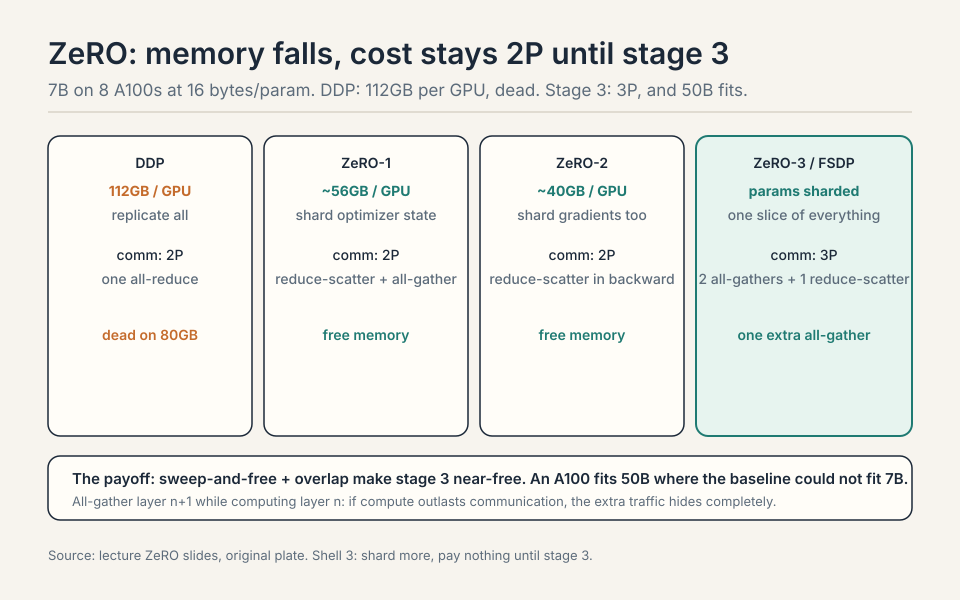
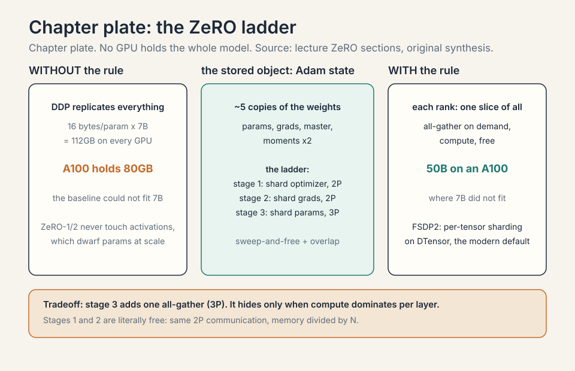
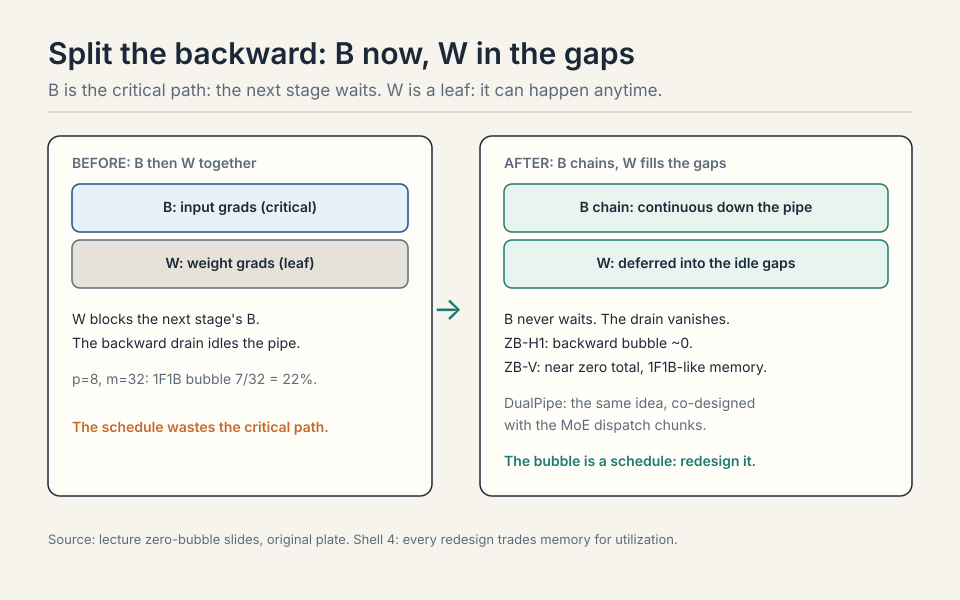
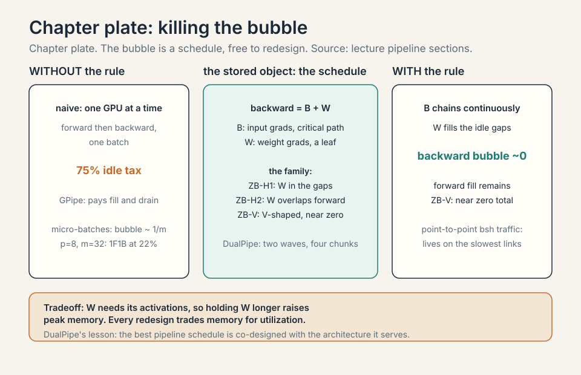
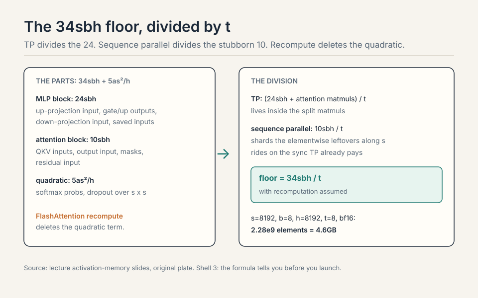
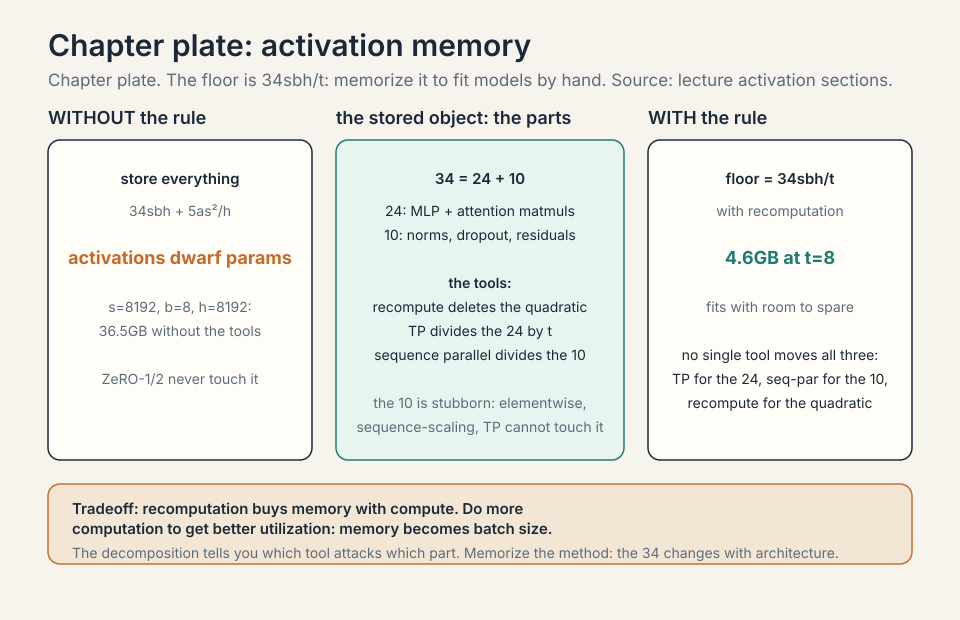
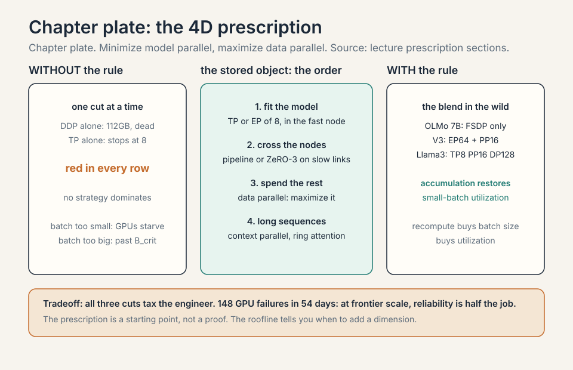

### Coverage and sourcing

This lesson follows Lecture 8 of Stanford CS336 (Language Modeling
from Scratch, Spring 2026, instructor Tatsunori Hashimoto),
"4D Parallelism at Scale," delivered April 22, 2026, duration
1:20:01. It uses the official subtitle transcript and the slide deck
(lecture_8.pdf). Every timestamped claim below comes from the lecture.
Figures marked October 2026 are updates added after the session, each
with its source: the DeepSeek-V3 technical report and the Llama 3
paper for the verified training recipes, current as of October 2026.
Other training-run configs are as reported in the lecture and public
repos and marked [uncertain]: internal runs may differ. The coverage
map at the end of the chapter maps every major lecture claim to the
section that covers it, with file line numbers.

## The problem: DDP replicates everything

Two bottlenecks drive everything: compute (more than one chip holds)
and memory (models do not fit) [01:27](ts:01:27). The new unit of
compute is the data center [10:34](ts:10:34).

Naive data parallel replicates everything and saves zero memory. The
real cost: with Adam you hold roughly 16 bytes per parameter, about
five copies of the weights [13:55](ts:13:55). Parameters and gradients
match. The optimizer state, the Adam first and second moments in high
precision, dominates.

Work the failure. A 7B model at 16 bytes per parameter needs 112 GB on
every GPU. An A100 holds 80 GB. The baseline could not fit 7B
[28:04](ts:28:04). And data parallel is capped twice more: by the
batch (8 examples feed at most 8 GPUs [29:15](ts:29:15)), and by the
critical batch size, past which extra examples add less than another
SGD step. Worst of all, ZeRO-1/2 never touch activation memory, which
dwarfs parameters at scale. The way out is model parallelism:
communicate activations, not just parameters [31:02](ts:31:02).

## The key question

Every GPU holds the whole model because DDP never asked whether it
had to. What if no GPU held the whole model? What if each rank owned
one slice of everything, and the full tensors existed only for the
instants they were needed? That is the ZeRO ladder.

## The ZeRO ladder: shard the state

Shard instead of replicate. Three stages, each sharding more.

**Stage 1: shard optimizer state.** Each GPU updates its slice:
reduce-scatter the gradients to the right owners, update, all-gather
the new parameters. Communication: reduce-scatter plus all-gather,
which equals one all-reduce. Same cost as DDP, memory divided by N.
Free [18:52](ts:18:52).

**Stage 2: shard gradients too.** Trick: during the backward sweep,
reduce-scatter each layer's gradients the moment they are computed and
free them. Never materialize the full gradient. Same communication,
more memory saved [19:16](ts:19:16).

**Stage 3 (FSDP): shard parameters too.** Each GPU holds a slice of
everything. All-gather the layer's parameters on demand, forward, free.
All-gather again for backward, reduce-scatter the gradients, free.
Cost: two all-gathers plus one reduce-scatter. One all-gather more
than DDP [20:25](ts:20:25).

Two ideas make stage 3 near-free: **sweep-and-free** (communicate, use,
immediately release) and **overlap** (all-gather layer n+1 while
computing layer n). The FSDP timeline shows compute and communication
streams interleaved. If compute outlasts communication, the extra
traffic hides completely [24:02](ts:24:02). The payoff on an A100:
stage 3 fits 50B parameters where the baseline could not fit 7B
[28:04](ts:28:04).

> [!QA]
> Q: ZeRO-1 is literally free. Why does anyone run plain DDP?
> A: DDP is the simple mental model and the debugging baseline: every rank holds the full model, so any rank's state is inspectable and checkpointable directly. ZeRO-1 adds the reduce-scatter/all-gather choreography and sharded optimizer bookkeeping. For small models that fit comfortably, the memory savings buy nothing and the complexity buys risk. Use DDP until memory forces your hand, then climb the ladder.
> Follow-up: Why does overlap make FSDP "essentially free"?
> A: Communication and computation use different hardware: the network moves bytes while the SMs multiply matrices. If the all-gather for the next layer finishes before the current matmul does, its cost never appears on the critical path. The requirement is that compute dominates per layer, which holds for big layers on fast interconnects. Small layers or slow networks break the illusion.

### Subchapter: ZeRO stage costs, worked

Work the lecture's 7B example on 8 GPUs, Adam at 16 bytes per
parameter. DDP holds 112GB per GPU: dead on an 80GB A100. ZeRO-1
shards the optimizer state, the bulkiest part: about 56GB per GPU.
ZeRO-2 shards the gradients too: about 40GB per GPU. ZeRO-3 shards
the parameters: the lecture's payoff, 50B on an A100 where the
baseline could not fit 7B.

The communication stays flat, then jumps once. Stages 1 and 2 cost
2P per step: a reduce-scatter plus an all-gather, which equals one
all-reduce. Stage 3 costs 3P: two all-gathers (forward and backward)
plus one reduce-scatter. One extra all-gather. That is the price of
sharding the parameters, and overlap hides it when compute dominates.

> [!QA]
> Q: Walk me through ZeRO-3 forward and backward for one layer. Eight GPUs, one 1GB layer.
> A: Forward: all-gather the 1GB layer. Each rank collects 1/8 from everyone and now holds the full 1GB. Compute. Free it: back to 1/8. Backward: all-gather the 1GB again, compute the local gradients (1GB), free the parameters. Reduce-scatter the gradients: each rank ends with 1/8 of the summed gradient, then updates its optimizer slice. Traffic per layer per rank: two all-gathers (about 1.75GB) plus one reduce-scatter (about 0.875GB), roughly 2.6GB. DDP would move about 1.75GB for one all-reduce. The extra all-gather is the 3P vs 2P. Sweep-and-free means the full 1GB exists only during use.
> Follow-up: Why not stay at ZeRO-2 forever?
> A: ZeRO-2 still replicates the parameters on every GPU. Once the parameters alone exceed HBM, no amount of optimizer and gradient sharding helps. Stage 3 is the only stage that shrinks the parameter footprint. Climb when the weights themselves stop fitting.

### Subchapter: FSDP's flat parameter, how the shard is stored

ZeRO-3 is the idea. FSDP is the implementation, and it stores the
shard in a specific way. FSDP flattens every parameter of a unit
(usually a transformer layer) into one 1D vector: the **flat
parameter**. Then it shards that vector across the ranks. Each rank
holds a contiguous slice of the flat vector, not a set of whole
tensors.

Why flatten? The collectives move bytes, not tensors. One flat
shard means one all-gather per unit instead of hundreds of small
ones: the transfer lives in the bandwidth regime, not the latency
regime. It also makes the padding explicit: the flat vector is
padded so it divides evenly across ranks, and the padding is a few
elements, not a tensor-shaped hole.

Work the numbers. One transformer layer of a 7B model: about 220M
parameters, 440MB in bf16. Flattened: a 220M-element vector. On 8
GPUs: each rank holds 27.5M elements, 55MB. The all-gather for the
forward pass moves 385MB per rank (7/8 of 440MB) and lands the full
440MB. After the compute, the full copy is freed: back to 55MB.
The flat parameter is why FSDP's memory accounting is clean: one
number per rank per unit, no per-tensor bookkeeping.

The unit choice matters. Too fine (per tensor): the all-gathers
fragment into the latency regime. Too coarse (whole model): the
full copy exists too long and memory spikes. One transformer layer
per unit is the standard answer: big enough for bandwidth-regime
transfers, small enough that sweep-and-free keeps the peak low.

| | One 7B transformer layer, 8 GPUs |
|---|---|
| Flattened | 220M-element vector, 440MB in bf16 |
| Per-rank shard | 27.5M elements, 55MB |
| Forward all-gather per rank | 385MB moved, full 440MB lands |
| After compute | freed: back to 55MB |
| Too fine (per tensor) | all-gathers fragment into the latency regime |
| Too coarse (whole model) | the full copy exists too long, memory spikes |

Figure: Shell 3. One number per rank per unit, no per-tensor bookkeeping. Source: original worked toy.

### Subchapter: FSDP2 and DTensor, the modern default

FSDP1 (the original, ZeRO-3 in PyTorch) shards the flat parameter.
FSDP2 (PyTorch 2.x) rebuilds the same idea on **DTensor**: every
tensor carries its sharding plan as metadata. Instead of one flat
vector per unit, each parameter tensor is individually sharded, and
the DTensor machinery tracks which rank holds which piece.

What changes in practice. Per-parameter sharding removes the flat
parameter's padding waste and lets different parameters use
different plans. Communication becomes more granular: the runtime
can fuse and reorder more freely. The user-facing change is small:
the same FSDP API, better composability with torch.compile and with
tensor parallelism (the 2D mesh of FSDP2 + TP is the standard
Megatron-free stack). What does not change: the 3P communication
cost, the sweep-and-free discipline, the overlap requirement.

What is used where, October 2026: FSDP2 is the default in new
PyTorch training stacks. Llama 3 405B's FSDP-128 [uncertain] ran on the FSDP
lineage. OLMo 7B's FSDP-only recipe is the small-model proof that
the mechanism needs no companions. If you start a training run
today on PyTorch, you reach for FSDP2 first and add TP/PP only when
the floor says so.

> [!QA]
> Q: FSDP1 vs FSDP2: what actually changed?
> A: The sharding substrate. FSDP1 flattens each unit's parameters into one 1D flat parameter and shards that. FSDP2 shards each parameter tensor individually on DTensor, which carries the sharding plan as metadata. The communication cost is the same 3P. What improves: no padding waste, per-parameter sharding plans, better fusion and reordering, and clean composition with torch.compile and tensor parallelism. The user code barely changes. The machinery underneath got more precise.
> Follow-up: When would you still see FSDP1?
> A: In older codebases and in DeepSpeed's ZeRO-3, which is the same idea under a different API. The concepts transfer exactly: flat or per-tensor, the discipline is shard, all-gather on demand, compute, free. If you inherit a run on FSDP1, the migration question is composability (compile, TP meshes), not correctness.

## Pipeline: cut by layers, pay bubbles

Cut by layers: GPU 0 owns layers 0-3, GPU 1 owns 4-7, and so on. Naive
execution: one GPU works at a time, forward then backward.
Utilization is terrible [32:15](ts:32:15).

Work the tax. 4 GPUs, 1 batch, forward pass. GPU 0 computes while 1-3
wait. Then GPU 1 computes while 0, 2, 3 wait. At any moment 3 of 4
GPUs idle: 75% idle tax, before the backward pass even starts.

**Micro-batches** chop the batch so work flows continuously: the bubble
shrinks as 1/microbatches [33:52](ts:33:52). With 8 micro-batches on 4
GPUs, the pipe fills and the idle fraction drops toward 4/8.

Pipeline's virtue is communication: point-to-point, only b x s x h
activations, far less than whole parameter matrices. It lives on the
slowest links: across pods, across data centers [34:58](ts:34:58).

**Zero-bubble scheduling** splits the backward pass in two.
Propagating partials (B) is on the critical path: the next stage waits
for it. Weight gradients (W) are leaf nodes: they can happen anytime.
Do B first, defer W into the gaps, and the pipeline nearly fills
[37:28](ts:37:28).

### Subchapter: the B/W split, why it works

Every layer's backward pass has two children. B is the partial
derivative with respect to the inputs: stage r-1 cannot start its
backward until stage r's B arrives. B is the critical path. W is the
weight gradient: nothing downstream waits for it. It is a leaf until
the optimizer step.

The standard schedule computes B then W together, so W blocks the
next stage's B. Zero-bubble splits them: compute B immediately, ship
it down the pipe, and do W in the idle gaps that the schedule leaves
behind: the B chain stays continuous while W fills the holes.

The price: W needs the activations, so holding W for later means
holding activations longer. Memory rises slightly. DualPipe is the
same idea taken further: it splits each chunk into attention,
dispatch, MLP, and combine, and overlaps communication with
computation in both directions. The lesson: the bubble is a schedule,
and the schedule is free to redesign.

### Subchapter: ZB-H1, the baseline zero-bubble

The B/W split is one point in a family. Qi et al. (2024) mapped the
design space: the backward pass splits into B (input gradients, on
the critical path) and W (weight gradients, a leaf), and the
schedules differ in where W goes and how much memory they spend.

**ZB-H1**: the baseline zero-bubble. B chains continuously down the
pipe, W fills the gaps left behind. Memory: W's activations are held
longer, so the peak rises modestly over 1F1B. The bubble from the
forward fill remains, but the backward drain vanishes: B never
waits.

### Subchapter: ZB-H2, less bubble for more memory

**ZB-H2**: pushes further. It reorders so that W's also overlap with
the forward wave, not just the gaps. Less bubble, more memory: the
activation lifetime stretches further. The tradeoff is explicit:
bubble fraction vs peak activation memory, one dial.

### Subchapter: ZB-V, the V-shaped schedule

**ZB-V**: the V-shaped schedule. Micro-batches flow down one side
of the V and back up the other, so each rank's forward and backward
for the same micro-batch sit close together in time. Activation
lifetimes shrink back toward 1F1B levels while keeping the bubble
near zero. The price is schedule complexity: the V must be timed
exactly, and the implementation is the hardest of the three.

Work the comparison at p=8 stages, m=32 micro-batches. 1F1B bubble:
7/32 = 22%. ZB-H1: the backward bubble goes to ~0, the forward
fill remains: about half of 1F1B's total. ZB-V: near zero total,
at 1F1B-like memory. The lecture's message stands: the bubble is a
schedule, and the schedule is free to redesign. The family's
message: every redesign trades memory for utilization, and the
frontier is the memory you can afford.

### Subchapter: DualPipe, worked

DeepSeek-V3's pipeline schedule, the one that let 2048 H800s train
with PP-16 at high utilization. DualPipe feeds micro-batches from
both ends of the pipe simultaneously: the forward wave and the
backward wave travel toward each other. Each chunk of work splits
into four pieces: attention, dispatch (the MoE all-to-all), MLP,
and combine. While one micro-batch's attention computes, another's
dispatch communicates: communication hides behind computation in
both directions.

Why it works where 1F1B stalls: the standard schedule's bubble
comes from the wave's fill and drain. Two waves from opposite ends
keep every stage fed: when the forward wave has passed a stage, the
backward wave arrives. The four-way chunk split matters because the
dispatch (all-to-all) is the latency-sensitive piece: pairing it
with a neighbor's attention compute hides exactly the traffic that
expert parallelism cannot avoid.

The price: memory. Holding both waves' activations raises the peak,
and the schedule assumes the workload splits cleanly into the four
chunks. It was co-designed with the MoE architecture: the dispatch
and combine chunks exist because the experts do. A dense model
gains less. The lesson generalizes though: the best pipeline
schedule is co-designed with the architecture it serves, not chosen
from a catalog.

> [!QA]
> Q: DualPipe vs ZB-V: both kill the bubble. What is the real difference?
> A: What they co-design with. ZB-V is architecture-agnostic: it reorders the B/W split into a V shape and works for any model, at the cost of schedule complexity. DualPipe is architecture-specific: it splits each chunk into attention, dispatch, MLP, and combine because DeepSeek-V3 is an MoE and the dispatch all-to-all is its latency-sensitive traffic. DualPipe hides communication behind computation in both directions by pairing chunks across the two waves. ZB-V hides the bubble by geometry. If you train a dense model, ZB-V is the tool. If you train an MoE with heavy dispatch traffic, DualPipe's chunk pairing is the tool. The bubble dies either way. The co-design decides which death is cheaper.
> Follow-up: Why can the pipeline schedule be co-designed with the MoE but not with data parallel?
> A: Because the pipeline schedule controls the order of layer execution, and the MoE's dispatch traffic is per-layer: which chunks run when decides which all-to-alls overlap with which computes. Data parallel's all-reduce fires once per step, after the whole backward pass: no schedule of micro-batches changes its timing. The pipeline schedule shapes per-layer traffic. It cannot shape per-step traffic. Co-design works where the schedule and the traffic share a granularity.

| | ZB-H1 | ZB-H2 | ZB-V | DualPipe |
|---|---|---|---|---|
| Bubble | backward ~0 | less than H1 | near zero total | near zero |
| Memory | 1F1B + modest | higher | 1F1B-like | higher (two waves) |
| Schedule | baseline split | W overlaps forward | V-shaped, hardest | bidirectional, 4 chunks |
| Co-design | any model | any model | any model | MoE dispatch |

Worked at p=8, m=32: 1F1B 22%, ZB-H1 halves it, ZB-V near zero. Figure: Shell 4. Every redesign trades memory for utilization. Source: lecture zero-bubble slides, original table.

## Tensor parallel: cut by width

Cut by width: matmuls split into smaller matmuls, partial sums added
back. The transformer rule: column cuts on the way up (MLP
up-projection, attention QKV), row cuts on the way down (MLP
down-projection, attention output). Small layers (norms, nonlinears,
MoE routers) replicate: not worth the overhead [41:41](ts:41:41).

The f/g duality: forward uses f=identity then g=all-reduce. Backward
flips them [40:48](ts:40:48). Tensor parallel is communication-hungry:
an all-reduce per matmul at activation size, every layer. Keep it
inside the fast node: TP of 8 on GPUs, then stop [42:50](ts:42:50).
TPUs, with their uniform mesh, can push tensor parallel much further
than GPUs can [43:28](ts:43:28).

The networks follow the workloads. TPU mesh: neighbor talk, scales
forever. GPU tree: any-to-any, flexible. MoE's all-to-all pushed TPUs
toward trees.

> [!QA]
> Q: Why does tensor parallel stop at 8 on GPUs but scale further on TPUs?
> A: The limit is the size of the fast domain, not the algorithm. A GPU node holds 8 GPUs on NVSwitch: any-to-any at full bandwidth. The 9th GPU crosses onto InfiniBand, and TP's per-layer chatter drowns there. TPUs are built as a mesh: neighbor-to-neighbor links scale uniformly, so the fast domain is the whole pod. The irony: MoE's all-to-all pushed TPUs toward tree-like interconnects anyway, because expert routing is any-to-any traffic, which the mesh serves poorly. Hardware follows the workload, then the workload changes.
> Follow-up: Could NVL72 change the answer?
> A: Yes, in principle: 72 GPUs in one NVLink domain extends the fast domain 9x. TP could run wider inside it. The price is the rack: one NVL72 is a single failure domain and a single buyer's budget. The physics did not change, only the boundary moved.

## Activation memory, exactly

Storing everything costs 34 x s x b x h plus 5 x a x s^2 / h, where the
second term is the quadratic attention (softmax, dropout)
[46:51](ts:46:51). FlashAttention recomputation (activation
checkpointing: discard the activations in the forward pass and
recompute them in the backward pass instead of storing them) drops
that term.

Tensor parallel divides the MLP (24 of the 34) and attention terms by
t, but not the layernorms, dropouts, and residuals: a stubborn 10sbh
remains [48:53](ts:48:53). **Sequence parallel** splits those leftovers
along the sequence axis, FSDP-style: shard now, materialize on demand
[49:25](ts:49:25). With recomputation, the floor is 34sbh/t: the
number to memorize for fitting models by hand [51:44](ts:51:44).

Work the floor. s = 4096, b = 4, h = 8192, t = 8, bf16 (2 bytes). 34 x
4096 x 4 x 8192 / 8 = 5.7e8 elements = 1.1 GB. That fits on one node
with room to spare: at this batch and sequence length, the activation
floor is not the binding constraint. Grow the batch or the sequence
and recompute: the floor rises linearly in both. The formula tells
you before you launch.

### Subchapter: where the 34 comes from

The 34 is not a constant of nature. It is a parts list. Walk one
transformer layer's saved activations, in units of s x b x h
(sequence x batch x hidden), counting what the backward pass needs.

The attention block contributes about 10sbh: the Q, K, V
projections' inputs, the attention output's input, plus the dropout
masks and the block's input for the residual, across the pieces the
lecture counts. The MLP block contributes about 24sbh: the
up-projection input, the gate and up outputs before the
nonlinearity (at 4h width, times two for the gated variant's twin
projections), the down-projection input, and the activation
function's saved inputs. Sum: 34sbh per layer.

Then the attention quadratic: 5 x a x s^2 / h, the softmax
probabilities and dropout mask over the s x s attention matrix, per
head. FlashAttention's recomputation deletes this term: the softmax
is recomputed in the backward pass from the stored block
statistics instead of saved.

Tensor parallel divides the MLP's 24 and the attention block's
matmul terms by t, because those live inside the split matmuls. It
cannot touch the layernorms, dropouts, and residuals: elementwise,
sequence-scaling, worth 10sbh. That is the stubborn remainder.
Sequence parallel divides it by sharding along s. The floor:
34sbh/t, with recomputation assumed.

Work the parts at s=2048, b=8, h=4096, t=4, bf16. 34 x 2048 x 8 x
4096 / 4 = 5.7e8 elements = 1.1 GB. Without TP: 4.6 GB. The
decomposition tells you which tool attacks which part: TP for the
24, sequence parallel for the 10, recomputation for the quadratic.
No single tool moves all three.

> [!QA]
> Q: Why can tensor parallel divide the 24 but not the 10?
> A: The 24 lives inside the big matmuls: the MLP's up and down projections, which TP splits column-wise and row-wise. Each rank's shard of the matmul needs only its shard of the activations. The 10 lives in the elementwise chain: layernorms, dropouts, residuals. Those scale with the sequence, not with the width split: rank 0's layernorm still sees the full sequence. TP's cut is along the width. The 10 needs a cut along the sequence. That is sequence parallel's job, and it rides on the sync TP already pays.
> Follow-up: Does the 34 change with a different architecture?
> A: Yes. The gated MLP (SwiGLU) has two up-projections instead of one, so the MLP's share is larger than a plain ReLU MLP's. The exact integer depends on the details: which nonlinearities, which norms, whether dropout masks are saved. Memorize the decomposition method, not the number: walk the saved tensors, sort them into matmul-inside vs elementwise, divide accordingly.

### Subchapter: the 34sbh/t floor, worked again

The baseline stores 34sbh plus the attention quadratic, 5as^2/h.
FlashAttention recomputation deletes the quadratic term. Tensor
parallel divides the MLP terms (24 of the 34) and the attention terms
by t. A stubborn 10sbh remains: layernorms, dropouts, residuals.
Sequence parallel splits those leftovers along the sequence axis,
FSDP-style. With recomputation, the floor is 34sbh/t.

Work a bigger case. s = 8192, b = 8, h = 8192, t = 8. 34 x 8192 x 8
x 8192 / 8 = 2.28e9 elements. In bf16: 4.6 GB. One 8xH100 node holds
640GB: it fits with room to spare. The floor only binds when the
batch or the sequence grows another order of magnitude. The formula
tells you before you launch which knob to turn.

> [!QA]
> Q: Work the activation floor: s=8192, b=8, h=8192, t=8. Does it fit on one 8xH100 node?
> A: 34 x 8192 x 8 x 8192 / 8 = 2.28e9 elements. In bf16 that is 4.6 GB. One 8xH100 node holds 640GB. It fits, with the floor far below the cap. If the floor ever threatened the cap, the options would be: shrink the batch to 1 (cuts 8x, lands at 570MB), add pipeline stages, or add context parallel to split the sequence axis. The formula names the fix before any GPU is booked.
> Follow-up: Why is the 10sbh part called stubborn?
> A: It is not inside the big matmuls, so tensor parallel cannot touch it. Layernorms, dropouts, and residuals are elementwise: they scale with the sequence, not with the width splits. Sequence parallel exists precisely to divide this remainder. Without it, the floor would be 34sbh/t + 10sbh, and the 10sbh would dominate at high t.

## Expert parallel: route, not slice

For MoEs, prefer expert parallel over tensor parallel. Tensor slicing
makes matmuls small and utilization suffers. Routing whole tokens to
whole experts keeps matmuls big [54:45](ts:54:45). The dispatch is
all-to-all, latency-sensitive: computation waits for tokens to arrive.
DeepSeek's DeepEP and NVIDIA's Hybrid EP push this to undocumented-PTX (Parallel Thread Execution, NVIDIA's virtual ISA)
extremes [56:16](ts:56:16).

The wrinkle: EP parallelizes the MLPs, not the attention. Want high TP
for attention but low TP for MLPs, or the slices get tiny. Modern
setups decouple them: one TP degree for attention, another for MoE
layers [60:27](ts:60:27).

> [!QA]
> Q: When do you pick tensor parallel over expert parallel for an MoE?
> A: For the attention layers, always tensor: experts do not touch attention, so EP cannot help there. For the MoE layers, prefer expert parallel: it keeps expert matmuls whole and routes sparse tokens instead. The modern answer is both at once, with decoupled degrees: high TP on attention, high EP on the experts. The Megatron guideline says exactly this: EP over TP for MoE layers, TP for attention.
> Follow-up: Why does sequence parallel have a misleading name?
> A: It does not parallelize the sequence computation the way its name suggests. It is an activation-memory trick that rides along with tensor parallel: shard the layernorm and residual activations along the sequence axis, materialize on demand. Conceptually it is FSDP for activations, not a way to compute attention faster.

## Context parallel: shard the attention compute

**Context parallel** (context parallelism: split the sequence across
devices so each device computes attention over its own slice,
circulating K/V blocks around a ring) splits long sequences across
devices, passing activations around the ring: the standard move for
long-context extension and serving [61:05](ts:61:05).

### Subchapter: context parallel (ring attention), worked

Sequence parallel shards activation memory. **Context parallel**
shards the attention computation itself: the sequence is split
across devices, and each device computes attention over the full
sequence by circulating key/value blocks around a ring (Liu et al.,
2023, "Ring Attention").

The mechanism: with c devices, device i holds queries for its 1/c
slice of the sequence. The K/V blocks rotate: at step k, device i
receives the K/V block from device i-1, computes attention between
its queries and that block, accumulates the partial softmax
statistics, and passes the block along. After c-1 steps, every
device has seen every K/V block. The partial results combine with
the online softmax rescaling: the running maximum and sum are
updated per block, so the final output is exact.

The causal mask needs care: with a naive rotation, device i
computes attention over blocks it should not see. The fix is the
zigzag schedule: blocks are assigned so that each device's local
computation respects causality, or the mask is applied per
block-pair. The communication volume per device: (c-1)/c of the K/V
tensors, moved in c-1 steps, overlapped with the attention compute
of the previous block.

Work it. s=128K, h=8192, 8 KV heads (GQA), bf16, c=8 devices. K/V
per device slice: 16K x 8 x 128 x 2 x 2 bytes = 67MB. Each device
sends and receives 7 x 67MB = 469MB per layer per forward pass,
overlapped with its local attention. Without context parallel, one
device holds the full 537MB K/V and computes the full 128K attention:
the memory and the quadratic compute both bind. Context parallel
divides both by c. That is why the Llama 3 recipe adds CP for
long-context extension: the sequence dimension is the one that
grew, so the sequence dimension is the one that splits.

| | Context parallel, s=128K, h=8192, 8 KV heads, bf16, c=8 |
|---|---|
| K/V per device slice | 16K x 8 x 128 x 2 x 2 bytes = 67MB |
| Moved per device per layer | 7 x 67MB = 469MB, overlapped with local attention |
| Without CP | one device holds 537MB K/V and the full 128K quadratic |

Figure: Shell 4. The causal mask needs the zigzag schedule, or devices burn bandwidth on masked-out blocks. Source: original worked toy.

> [!QA]
> Q: Context parallel vs sequence parallel: which splits the attention compute?
> A: Context parallel. Sequence parallel shards the elementwise leftovers (norms, dropouts, residuals) along the sequence axis: a memory trick that rides on TP's sync. Context parallel shards the attention computation: each device holds 1/c of the queries and circulates K/V blocks around a ring, computing exact attention with online softmax rescaling. Sequence parallel does not touch the attention matmuls. Context parallel exists to divide them. The names mislead in opposite directions: sequence parallel is about memory, context parallel is about work.
> Follow-up: Why does the ring need the zigzag schedule?
> A: Causality. In a causal model, query at position i attends only to keys up to i. If device 3 holds queries for positions 48K-64K and receives the K/V block for positions 96K-112K, that block is entirely in its future: the attention is masked to zero, pure waste. The zigzag assigns blocks so each device's K/V rotation order respects the causal structure, or equivalently applies the per-block-pair mask. Without it, devices burn bandwidth and compute on masked-out blocks. The schedule is the difference between dividing the work and duplicating it.

## The 4D prescription

No strategy dominates. The table of tradeoffs has red in every row
[62:07](ts:62:07). But the combination rule is simple:

1. Until the model fits: tensor or expert parallel of 8 inside the
   fast node.
2. Across nodes: pipeline parallel or ZeRO-3 on the slow links.
3. Then data parallel for everything left. Minimize model parallel,
   maximize data parallel.
4. Long sequences: add context parallel.

Batch too small: gradient accumulation restores utilization. The
compute-vs-communication roofline tells you when to add a dimension:
big batch, FSDP alone is compute-bound. Shrinking batch, add tensor
parallel to stay compute-bound [64:49](ts:64:49). The old
NVIDIA/Stanford scaling study shows the pattern exactly: DP maxed, TP
rises to 8 and stops, PP grows, DP falls at the extreme, utilization
flat throughout [70:13](ts:70:13).

Counterintuitive: do more computation via recomputation to get better
utilization. It saves memory, memory becomes batch size, batch size
becomes utilization [71:54](ts:71:54).

> [!QA]
> Q: Why does gradient accumulation restore utilization?
> A: Small batches starve the GPUs: each kernel launch covers too little work, and the all-reduce cost is fixed per step. Accumulation runs K micro-steps locally, summing gradients without syncing, then performs one all-reduce and one optimizer step. The arithmetic intensity per sync rises Kx. The math equals one big batch (gradients add linearly), but memory holds only the small batch. The price: Kx more forward and backward passes per optimizer step, so the optimizer steps less often per wall-clock hour. It restores utilization, not learning speed.
> Follow-up: Accumulation vs a bigger batch: any difference?
> A: In exact arithmetic, none: the summed gradients are identical. In practice, small differences: batchnorm-style statistics (absent in transformers), loss scaling in fp16, and the optimizer stepping less often per hour. For transformers the two are interchangeable, which is why accumulation is the standard answer to a batch that is too small.

## In the wild

OLMo 7B: FSDP only, small dense models do not need more
[72:46](ts:72:46). DeepSeek V1: ZeRO-1 plus tensor, sequence, pipeline.
DeepSeek V3: expert parallel of 64 across 8 machines, pipeline tricks
to keep utilization up. Yi: the classic ZeRO-1/TP/PP combo. Llama3
405B: TP8, CP1, PP16, DP128 for pretraining (exact degrees [uncertain]:
the paper publishes no exact degrees). More context parallel for
long-context extension. 148 GPU failures during the run: redundancy is
a distributed-systems problem too [76:02](ts:76:02). Gemma 2: FSDP plus
tensor plus sequence on the TPU mesh. Mixtral 8x22B: EP8, PP4, TP4 for
attention. Qwen 3: EP32, PP8, TP2, the DeepSeek recipe.

### Subchapter: the failure ledger: 148 GPUs

The Llama 3 405B run lost 148 GPUs to failures over 54 days
[76:02](ts:76:02). At 16,384 GPUs, that is roughly 3 failures per
day: a failure every 8 hours. Training at frontier scale is a
distributed-systems problem wearing a machine-learning costume.

The arithmetic of failure: with N GPUs and per-GPU daily failure
probability p, the expected failures per day are N x p. At N =
16,384 and p = 0.0002 (one failure per GPU per 5000 days), that is
3.3 per day. The run cannot stop for each one: checkpoint every N
minutes, detect the failed rank, restart from the checkpoint with a
spare. The checkpoint interval is its own optimization: too
frequent and the I/O taxes the run, too rare and each failure
wastes hours of compute.

What this costs: the 54-day run at 90% effective utilization loses
about 5 days to failures and restarts. Elastic training (ranks join
and leave), hot spares (extra nodes on standby), and fast
checkpoint load (parallel reads from distributed storage) are not
optimizations. They are the difference between a run that finishes
and one that never converges. The lecture's one-line mention hides
an industry: at 16K GPUs, reliability engineering is half the job.

| | Llama 3 405B: 148 failures, 54 days |
|---|---|
| Rate | ~3 per day, one every 8 hours |
| Model | 16,384 x 1/5000 per GPU-day = 3.3 per day |
| Cost at 90% utilization | ~5 days lost to failures and restarts |
| Defense | checkpoint, detect, restart with spares; elastic training, hot spares |

Figure: Shell 5. The checkpoint interval balances I/O tax against expected waste: T ~ sqrt(2 x 1440 x C / F). Source: lecture failure discussion, original table.

> [!QA]
> Q: 148 GPU failures in 54 days. Why did the run not collapse?
> A: Because the failure rate was expected and the system was built for it. 16,384 GPUs at one failure per GPU per 5000 days gives ~3 failures per day. The run checkpointed regularly, detected failed ranks, and restarted from the last checkpoint with spares. Each failure cost the compute since the last checkpoint, not the whole run. The design assumption: at frontier scale, hardware fails continuously. The run that assumes otherwise is the one that collapses.
> Follow-up: How do you pick the checkpoint interval?
> A: Balance the I/O tax against the expected waste. Checkpointing every T minutes costs C minutes of I/O per interval and wastes T/2 minutes of compute per failure on average (failures land uniformly in the interval). With F failures per day, daily waste is F x T/2 and daily I/O cost is (1440/T) x C. Minimize the sum: T ~ sqrt(2 x 1440 x C / F). More failures or cheaper checkpoints mean checkpoint more often. It is the same two-cost arithmetic as latency vs bandwidth, one level up.

### Subchapter: what is used where (verified frontier recipes)

Two runs verified against their papers, current as of October 2026.

**DeepSeek-V3** (2048 H800s, technical report section 3.2): expert
parallel 64 across 8 nodes, pipeline 16 with the DualPipe schedule,
ZeRO-1 data parallelism, and no tensor parallelism in training.
Tensor parallel appears only at inference (TP=4 for prefill and
decode). The MoE experts are the thing that splits, so expert
parallelism replaces tensor's job.

**Llama 3 405B** (up to 16,384 H100s, the Llama 3 paper): 4D
parallelism. The paper describes three types of parallelization
(model, pipeline, and data) but publishes no exact degrees. The
commonly reported recipe, marked [uncertain]: tensor parallel 8
inside each node, pipeline 16 across nodes, context parallel 1 for
pretraining (more for long-context extension), FSDP data parallel
128 across the fleet. It is dense: every parameter is active every
step, so tensor parallel is the only layer-split available.

The remaining runs above (OLMo, DeepSeek V1, Yi, Gemma 2, Mixtral,
Qwen 3) are as reported in the lecture and public repos [uncertain]:
internal configs may differ. The pattern holds regardless: fit with
TP or EP inside the fast node, cross slow links with pipeline or
FSDP, spend the rest on data parallel.

. Source: DeepSeek-V3 report, Llama 3 paper, Oct 2026.")

> [!QA]
> Q: Design the parallelism for a 70B dense model on 256 GPUs.
> A: Memory first: 70B x 16 bytes = 1.1TB per full copy. An 80GB GPU cannot hold it. Tensor parallel 8 inside each node: the layers split and the per-layer traffic stays on NVLink. 256 / 8 = 32 groups: data parallel 32 with FSDP (ZeRO-3) across the nodes for the rest. Activations: check the 34sbh/t floor against your sequence length. If it overflows, add context parallel for long sequences or pipeline stages for depth. Follow the prescription: minimize model parallel, maximize data parallel. The recipe is TP-8, FSDP-32, CP as needed.
> Follow-up: Why FSDP and not pipeline across the nodes?
> A: FSDP's extra all-gather hides under compute when layers are big. Pipeline's bubbles never fully hide. Pipeline wins when memory binds harder than communication: activations at very long sequences, or optimizer state that ZeRO cannot shrink. Start with FSDP, add pipeline when the floor says so.

## Mapping back: what each tool fixes

| Pain | Tool | How |
|---|---|---|
| 16 bytes/param replicated everywhere | ZeRO-1/2 | Shard optimizer and gradients. 2P comm, free memory. |
| Parameters do not fit | ZeRO-3/FSDP | Shard params too. Sweep-and-free, overlap hides the extra all-gather. |
| Batch caps DDP | Gradient accumulation | Restores utilization for small batches. |
| Activations dwarf params | Sequence parallel + recompute | Floor 34sbh/t. Recompute buys batch size. |
| Per-layer traffic | Tensor parallel, TP8 max | Columns up, rows down. NVLink only. |
| Slow links between pods | Pipeline parallel | Point-to-point bsh. Zero-bubble: B now, W in gaps. |
| MoE matmuls sliced thin | Expert parallel | Route tokens to whole experts. Decouple TP for attention. |
| Sequences too long | Context parallel | Ring attention across devices. |

## The honest price

No strategy dominates and the table has red in every row. ZeRO-3's
extra all-gather hides only when compute dominates per layer. Pipeline
bubbles shrink but never vanish. Tensor parallel stops at 8 on GPUs.
Expert parallel's all-to-all is latency-critical. And the run table is
as reported: internal runs may differ, and 148 GPU failures during
Llama 3 remind you that redundancy is a distributed-systems problem
too. The prescription is a starting point, not a proof.

## Coverage map: every lecture claim and where it lives

| Lecture claim | Covered in | File line |
|---|---|---|
| Two bottlenecks: compute and memory; the data center as the unit | The problem: DDP replicates everything | L43 |
| Adam holds ~16 bytes/param, ~5 copies of the weights | The problem: DDP replicates everything | L43 |
| 7B at 16 bytes/param = 112 GB > 80 GB A100: baseline could not fit 7B | The problem: DDP replicates everything | L43 |
| Data parallel capped by batch and by critical batch size | The problem: DDP replicates everything | L43 |
| ZeRO-1/2 never touch activation memory, which dwarfs params | The problem: DDP replicates everything | L43 |
| Key question: what if no GPU held the whole model | The key question | L64 |
| ZeRO-1: shard optimizer state, 2P comm, free | The ZeRO ladder: shard the state | L71 |
| ZeRO-2: shard gradients too, reduce-scatter in backward | The ZeRO ladder: shard the state | L71 |
| ZeRO-3/FSDP: shard params, two all-gathers + one reduce-scatter | The ZeRO ladder: shard the state | L71 |
| Sweep-and-free and overlap make stage 3 near-free | The ZeRO ladder: shard the state | L71 |
| Stage 3 fits 50B where the baseline could not fit 7B | The ZeRO ladder: shard the state | L71 |
| ZeRO stage costs worked: 7B on 8 GPUs, 2P then 3P | ZeRO stage costs, worked | L108 |
| FSDP's flat parameter: flatten, shard, one all-gather per unit | FSDP's flat parameter, how the shard is stored | L131 |
| FSDP2/DTensor: per-parameter sharding, the modern default | FSDP2 and DTensor, the modern default | L161 |
| Pipeline: cut by layers, naive 75% idle tax | Pipeline: cut by layers, pay bubbles | L191 |
| Micro-batches shrink the bubble as 1/m | Pipeline: cut by layers, pay bubbles | L191 |
| Pipeline comm: point-to-point b x s x h, lives on slow links | Pipeline: cut by layers, pay bubbles | L191 |
| Zero-bubble: split backward into B (critical) and W (leaf) | Pipeline: cut by layers, pay bubbles | L191 |
| The B/W split: why it works, the memory price | the B/W split, why it works | L217 |
| ZB-H1, ZB-H2, ZB-V: the zero-bubble family, one subchapter each | ZB-H1, the baseline zero-bubble; ZB-H2, less bubble for more memory; ZB-V, the V-shaped schedule | L239 |
| DualPipe: bidirectional waves, four chunks, MoE co-design | DualPipe, worked | L276 |
| Tensor parallel: column-up, row-down, f/g duality | Tensor parallel: cut by width | L309 |
| TP is comm-hungry: all-reduce per matmul, TP-8 max on GPUs | Tensor parallel: cut by width | L309 |
| TPUs: uniform mesh scales TP further; MoE pushed them to trees | Tensor parallel: cut by width | L309 |
| Activation memory: 34sbh + 5as^2/h; FlashAttention drops the quadratic | Activation memory, exactly | L338 |
| TP divides the 24, sequence parallel the stubborn 10 | Activation memory, exactly | L338 |
| Where the 34 comes from: the parts list | where the 34 comes from | L363 |
| The 34sbh/t floor, worked twice | the 34sbh/t floor, worked again | L403 |
| Expert parallel: route tokens, keep matmuls big | Expert parallel: route, not slice | L426 |
| DeepEP / Hybrid EP: undocumented-PTX extremes | Expert parallel: route, not slice | L426 |
| Decouple TP for attention from EP for MoE | Expert parallel: route, not slice | L426 |
| Context parallel (ring attention): split the sequence, circulate K/V | context parallel (ring attention), worked | L456 |
| The 4D prescription: TP/EP in node, PP/FSDP across, DP for the rest | The 4D prescription | L497 |
| Gradient accumulation restores utilization | The 4D prescription | L497 |
| Roofline: big batch FSDP compute-bound, shrinking batch add TP | The 4D prescription | L497 |
| Recomputation buys batch size buys utilization | The 4D prescription | L497 |
| NVIDIA/Stanford scaling study: DP maxed, TP to 8, PP grows | The 4D prescription | L497 |
| In the wild: OLMo, DeepSeek V1/V3, Yi, Llama3, Gemma 2, Mixtral, Qwen 3 | In the wild | L529 |
| 148 GPU failures: redundancy is a distributed-systems problem | the failure ledger: 148 GPUs | L544 |
| DeepSeek-V3 verified: EP64, PP16 DualPipe, ZeRO-1, no training TP | what is used where (verified frontier recipes) | L574 |
| Llama 3 405B: 4D recipe, exact degrees [uncertain] | what is used where (verified frontier recipes) | L574 |
| Mapping table: pain, tool, how | Mapping back: what each tool fixes | L608 |
| Honest price: red in every row | The honest price | L621 |

## Recap: the whole lesson on one screen

The story in eight steps. Each step answers the one before it.

1. **DDP replicates everything.** 16 bytes/param x 7B = 112 GB >
   80 GB A100. The baseline could not fit 7B. Batch and critical
   batch size cap it further.
2. **Shard the state.** ZeRO-1: optimizer. ZeRO-2: gradients. Both at
   2P comm, free. ZeRO-3/FSDP: params too, one extra all-gather.
3. **Overlap hides the cost.** Sweep-and-free: communicate, use,
   release. All-gather layer n+1 during layer n's matmul. Result:
   50B on an A100.
4. **Pipeline cuts depth.** 75% idle tax with 1 batch on 4 GPUs.
   Micro-batches shrink bubbles as 1/m. Zero-bubble: B now, W in
   the gaps.
5. **Tensor cuts width.** Columns up, rows down. f/g duality flips in
   backward. All-reduce per matmul: TP8 on GPUs, then stop.
6. **Activations have a floor.** 34sbh + attention quadratic. TP
   divides the big terms, sequence parallel the rest. Floor: 34sbh/t.
7. **EP for MoE.** Route tokens to whole experts, keep matmuls big.
   Decouple: high TP for attention, high EP for experts. Context
   parallel for long sequences.
8. **The prescription.** Fit with TP/EP in the node, PP/FSDP across,
   DP for the rest. Minimize model parallel, maximize data parallel.
   Recompute buys batch size buys utilization.

## Go deeper

<iframe style="position:absolute;top:0;left:0;width:100%;height:100%;" src="https://www.youtube-nocookie.com/embed/LFNtwpJFHtc" title="How to Train Models Bigger Than Your GPU (DeepSpeed ZeRO Explained)" frameborder="0" allow="accelerometer; autoplay; clipboard-write; encrypted-media; gyroscope; picture-in-picture" allowfullscreen></iframe>

- How to Train Models Bigger Than Your GPU, DeepSpeed ZeRO Explained, AI Learning Hub (the embed above): https://www.youtube.com/watch?v=LFNtwpJFHtc

<iframe style="position:absolute;top:0;left:0;width:100%;height:100%;" src="https://www.youtube-nocookie.com/embed/ITZuqvYY1Qk" title="Tensor Parallelism: Slicing the Weight Matrix, Not the Data | Training LLMs at Scale #3" frameborder="0" allow="accelerometer; autoplay; clipboard-write; encrypted-media; gyroscope; picture-in-picture" allowfullscreen></iframe>

- Tensor Parallelism: Slicing the Weight Matrix, Not the Data, Papers by Hand (the embed above): https://www.youtube.com/watch?v=ITZuqvYY1Qk
- Rajbhandari et al., ZeRO: https://arxiv.org/abs/1910.02054
- Zhao et al., PyTorch FSDP: https://arxiv.org/abs/2304.11277
- DeepSpeed ZeRO tutorial: https://www.deepspeed.ai/tutorials/zero/

## Official sources and further reading

**Official:**
- Lecture 8 video and slides (lecture_8.pdf).
- Megatron parallelism guidelines for MoEs: the practitioner version
  of the prescription.
- NVIDIA Megatron Bridge: recommended configs per model size.

**Further reading:**
- ZeRO paper (Rajbhandari et al.): the three stages.
- Zero-bubble pipeline paper. DeepSeek V3 report: EP at 64-way.
- The NVIDIA/Stanford large-scale parallelism study (Zaharia,
  Narayanan): how strategies shift with scale.

**Caveats from these sources.** Training-run configs are as reported
in public papers and repos. Internal runs may differ. The TPU8i
announcement was same-day news, treat topology claims as preliminary.
Undocumented-PTX claims about DeepEP are secondhand.

## Connections to the other courses

- **CS336 L07:** the three basic parallelisms this lecture extends.
- **CS336 L04:** MoE routing and load balancing feed the EP
  discussion.
- **CS229S:** the distributed-systems side: failures, redundancy,
  NCCL internals.
