## The problem: 10,000 B200s, one month

Your wealthy friend hands you 10,000 B200s for a month. How do you
spend them without wasting millions? The naive approach tunes
hyperparameters on the big run and hopes. The scaling approach
optimizes at small scale and extrapolates with a simple rule
[02:48](ts:02:48). It works only if the small-to-large connection is
regular, and making it regular is engineering: pick the right x-axis,
set hyperparameters right, and predictability appears
[38:28](ts:38:28).

```ascii
naive approach  : tune hyperparameters on the big run
scaling approach: optimize small, extrapolate with a rule
works when     : the small-to-large connection is regular
```

This chapter builds the rule. It starts a century before deep
learning, because the ideas are old. The scale is new.

## A long history


Generalization bounds were the theorists' scaling laws: error bounds
that decay with sample size [04:55](ts:04:55). Cortes and Vapnik (1993)
fit error decay on small samples to predict large ones: a data scaling
law, literally. Banko and Brill showed data beats algorithms. Hestness
(2017) found neural scaling across speech, translation, and language
modeling, and already noted emergence: accuracy is discontinuous where
loss is smooth [08:37](ts:08:37).

## First attempt: grow the data, watch the error fall

Fix the model (bigger than the dataset, about 10x), grow the data,
plot log-log. A straight line means error decays polynomially: error ~
1/n^alpha plus the noise floor [14:34](ts:14:34).

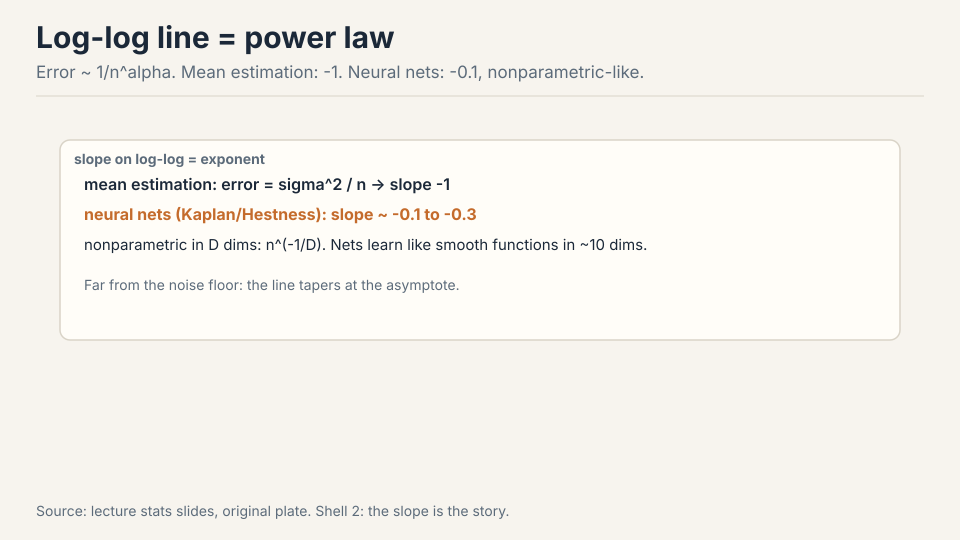

The stats interlude makes the numbers concrete. Estimating a Gaussian
mean gives sigma^2/n: slope -1. Double the data, halve the error.
Neural nets show -0.1 to -0.3: much slower. Double the data and the
error falls by about 2^0.1 = 1.07x: seven percent. The model that
fits: nonparametric regression in D dimensions has rate n^(-1/D).
Neural nets learn like smooth functions in about 10 dimensions
[19:25](ts:19:25). The exponent tells you how fast the network really
learns, and it is the price of flexibility: parametric estimators
assume the truth lives in a small known family, while the net must
learn the shape of the function too.

> [!QA]
> Q: Why is the neural exponent (-0.1) so much worse than the parametric rate (-1)?
> A: Parametric estimators assume the truth lives in a small, known family: every sample refines a few numbers. A neural net makes far weaker assumptions, so it must learn the shape of the function too, like a nonparametric smoother spreading samples across a high-dimensional space. The exponent is the price of flexibility. That is also why the slope is stable across interventions: it reflects the model class, not the data.
> Follow-up: When does the log-log line break?
> A: Near the noise floor. The line is the far-from-asymptote regime. As error approaches the irreducible level, the curve tapers. That is why the setup keeps the model much bigger than the dataset: it stays in the power-law regime instead of the saturated one.

### Subchapter: read a log-log plot

The whole chapter is one skill: read the slope. On log-log axes, a
power law error ~ n^(-alpha) is a straight line with slope -alpha.
Steeper line, faster learning. The slope is the exponent.

Work the two cases the lecture gives. Gaussian mean estimation:
slope -1. Double the data, halve the error. Neural nets: slope
about -0.1. Double the data, error falls by 2^0.1 = 1.07x: seven
percent. One doubling buys you half the error in the parametric
world and seven percent in the neural world. That gap is the price
of flexibility, drawn as two lines.

The intercept is the constant out front: same slope, lower line,
better model at every data size. Interventions move the line down.
Nothing in the data interventions moved the slope. Keep the two
readings separate: slope for the learning rate of the model class,
intercept for the quality of the intervention.

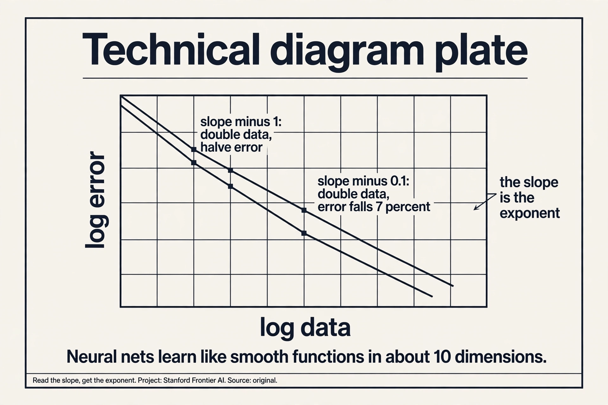

## Where naive scaling breaks: slopes are stubborn

Three data interventions, one recurring lesson: they move intercepts,
rarely slopes [27:05](ts:27:05).

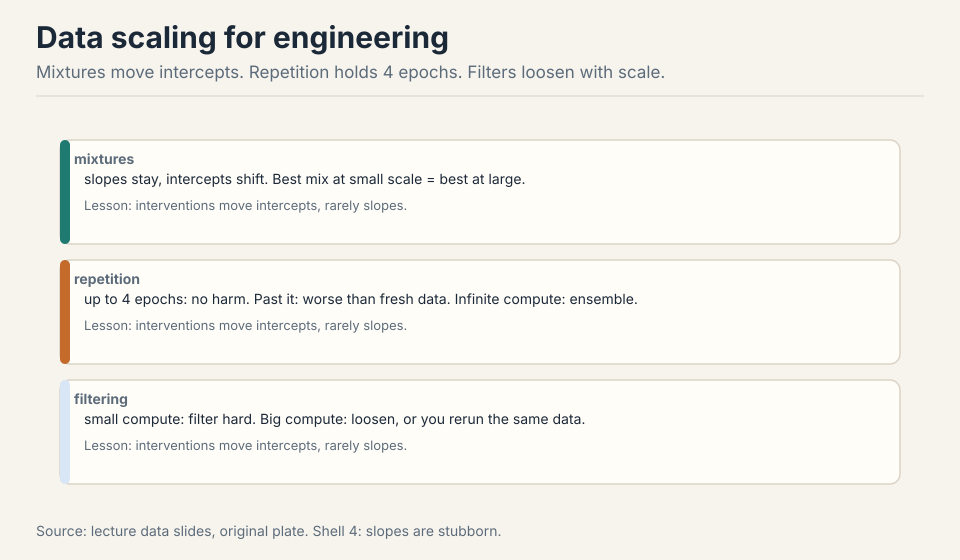

- **Mixtures.** Data composition shifts intercepts, not slopes. Fit
  mixtures at small scale, pick the best, scale it up. Often no
  scaling law is even needed: the best small mix is the best large
  mix [24:48](ts:24:48).
- **Repetition.** Up to about 4 epochs, no harm. Past it, the realized
  curve falls below the fresh-data projection. At infinite compute:
  stop repeating, start ensembling [25:42](ts:25:42).
- **Filtering.** Scale-dependent. Small compute: filter hard, keep the
  best. Big compute: loosen the filter, or you run out of data and
  repeat yourself [27:34](ts:27:34).

Architecture scaling shows the same stubbornness. Transformers vs
LSTMs: different intercepts, possibly different slopes. The plot
justifies the transformer [31:40](ts:31:40). Tay et al.'s T5 studies
caught the winners early: GLU scales well, Performer does not, Switch
Transformer does [33:18](ts:33:18). Rule of thumb: if it does not show
up in the scaling law, it is not a good intervention
[34:35](ts:34:35). SGD vs Adam (Hestness): different intercepts, nearly
identical slopes. Even that big a change leaves the slope alone
[34:57](ts:34:57). Caution: not all parameters are equal. Kaplan
excluded embeddings and got clean laws. For MoEs, Apple/MIT show the
right axes are total vs active parameters, with sparsity growing at
scale and inactive parameters still helping [39:09](ts:39:09).

> [!QA]
> Q: Why do mixtures, filters, and optimizers move intercepts but never slopes?
> A: The slope reflects the model class: how fast this architecture converts data into error reduction, like a nonparametric smoother in about 10 dimensions. The intercept reflects everything else: data quality, mixture composition, optimizer efficiency. A better mixture lowers the error at every data size by a constant factor: the whole line shifts down. It does not change how fast error falls with more data, because that rate is set by the architecture's learning dynamics. That is why the lecture's rule of thumb works: if an intervention does not move the slope, it is a constant-factor win, not a new regime.
> Follow-up: Could an intervention ever move the slope?
> A: Yes: change the model class. Transformers vs LSTMs showed different intercepts and possibly different slopes: the architecture itself sets the learning rate. For MoEs, Apple and MIT showed the right axes are total vs active parameters, and sparsity grows at scale. A genuinely new architecture can bend the line. Data and optimizer tweaks cannot.

## The key question

The naive question is "bigger model or more data?" The sharper
question is "given fixed FLOPs, what split of model size and data
minimizes loss?" FLOPs ~ N x D: one budget, two dials. Answer that,
and the 10,000 B200s spend themselves.

## Critical batch size: the batch has a ceiling

Two regimes [42:24](ts:42:24). **Noise-limited:** extra examples cut
gradient variance, perfect returns. **Bias-limited:** you see only the
local objective, and the local direction disagrees with the global
optimum, so extra examples buy little.

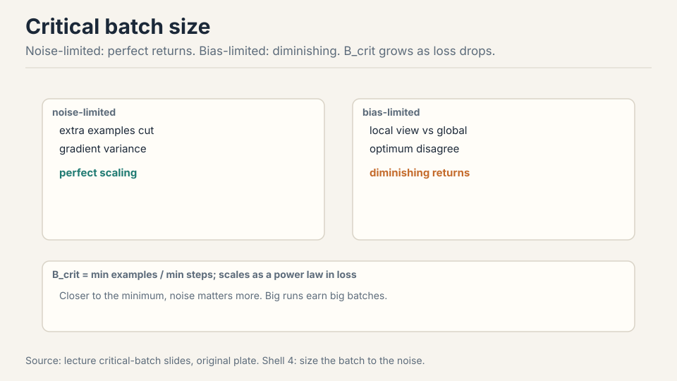

Work the crossover. At batch 1k, doubling the batch halves the steps:
perfect returns, noise-limited. At batch 1M, doubling the batch cuts
steps by 5%: bias-limited, the extra examples mostly re-confirm what
you knew. The **critical batch size** is the crossover: B_crit = min
examples / min steps, fit from sweeps [46:01](ts:46:01). It scales: as
the target loss drops, B_crit grows as a power law. Closer to the
minimum, noise matters more, so big runs earn big batches
[47:36](ts:47:36). This is the ceiling data parallel hits in the
parallelism lectures.

### Subchapter: B_crit, worked

Work the crossover with the lecture's numbers. Batch 1k, noise
limited: doubling the batch halves the steps. 1000 steps become 500.
Perfect returns: the extra examples each cut variance. Batch 1M,
bias limited: doubling cuts the steps by 5%. 100 steps become 95.
The extra 1M examples mostly re-confirm the direction you knew.

B_crit is the batch size where the two regimes meet: B_crit =
E_min / S_min, the minimum examples divided by the minimum steps,
fit from sweeps. Below it, grow the batch: free steps. Above it,
grow the model or the data instead: the batch is spent.

And B_crit grows as the target loss drops. Early training tolerates
small batches: far from the minimum, the direction is obvious. Late
training needs big batches: near the minimum, noise drowns the
signal. The schedule follows: ramp the batch as the loss falls.

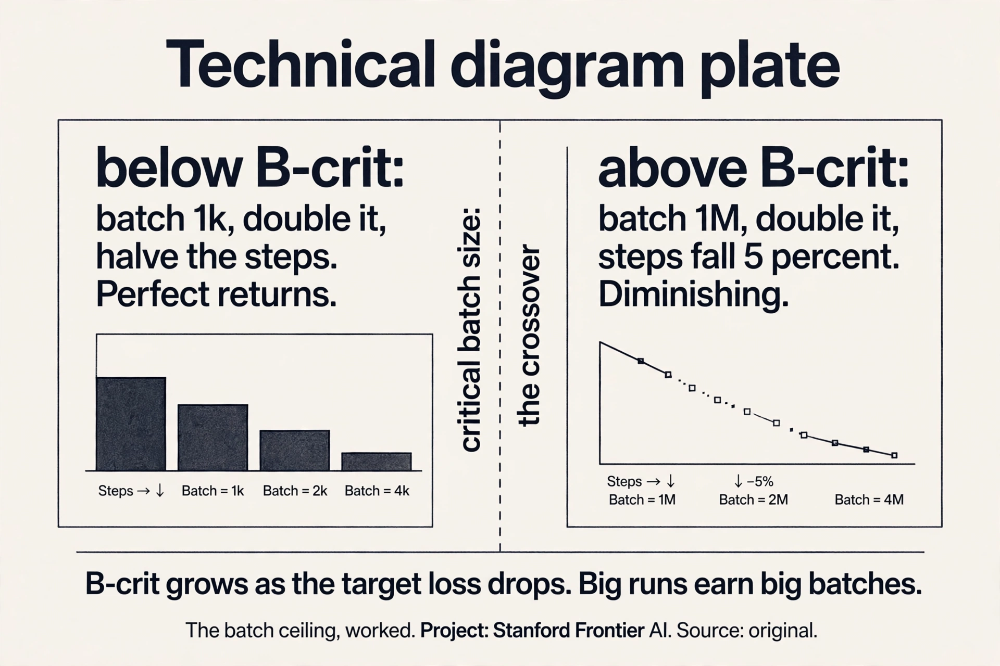

> [!QA]
> Q: Work B_crit. Your B_crit is 2M examples. You run batch 8k. Doubling to 16k: how many steps do you save?
> A: You are far below B_crit, deep in the noise-limited regime: doubling the batch nearly halves the steps. 10,000 steps become about 5,000. The extra 8k examples per step each cut gradient variance. Now flip it: you run batch 8M, four times B_crit. Doubling to 16M saves almost nothing: the steps barely move, because the batch direction already matches the true gradient. Same doubling, opposite payoff. The regime decides, not the arithmetic.
> Follow-up: How do you find B_crit in practice?
> A: Sweep the batch at small scale: plot steps-to-target vs batch size on log-log. The curve bends at B_crit: linear gains below, flat above. Fit E_min / S_min from the sweep. Then scale it: B_crit grows as a power law of the target loss, so the big run's ceiling is predictable from the small runs.

Learning rate, the other knob: width scaling suggests LR ~ 1/width.
The alternative school, muP, reparameterizes so the optimal LR stays
fixed across scales. Both have succeeded at scale. The advanced
lecture goes deeper [48:34](ts:48:34).

> [!QA]
> Q: Width scaling says LR ~ 1/width. muP says keep LR fixed. What do you actually do?
> A: Pick one and commit. Width scaling: tune the LR on the narrow model, then divide by the width ratio for the wide one. muP: reparameterize the network (scale the initialization and per-layer LRs) so the optimal LR transfers unchanged across widths. Both remove the big-run LR sweep, which is the expensive part. muP is the more complete system: it transfers all hyperparameters, not just LR, and it is what the advanced lecture builds. The sin is retuning from scratch at scale: that is the naive approach the lecture opened with.
> Follow-up: Why does the naive LR fail at scale?
> A: Wider layers have larger activation and gradient magnitudes. A LR tuned for a narrow model overshoots in a wide one: the update norm grows with width. Width scaling and muP both keep the update-to-weight ratio constant across scales. Without that correction, the big run diverges or needs its own sweep, which is exactly the millions the scaling approach saves.

## Upstream is not downstream

Perplexity vs parameters: a beautiful line. Downstream: the best
perplexity model (NL12) lost to a worse-perplexity one (NL32XL)
[51:37](ts:51:37).

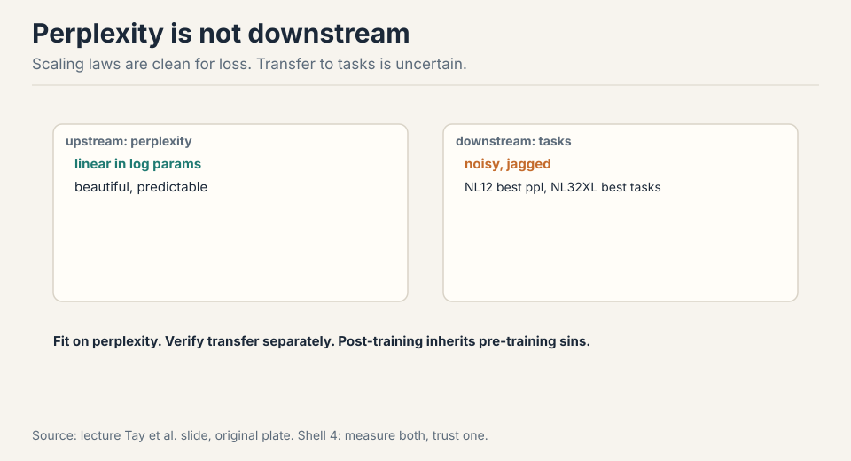

Fit scaling laws on perplexity, where variance is tiny (singletons,
second-decimal noise). Then verify transfer separately. The
post-training team inherits pre-training's sins [52:13](ts:52:13). The
procedure: train small models, fit log-log lines, predict the big
run's numbers before spending the money [53:04](ts:53:04).

## The Kaplan-Chinchilla saga: details decide

Fixed FLOPs, more data or bigger model? Tiny model plus huge data
wastes compute (flat purple line) [57:32](ts:57:32). Kaplan and
Rosenfeld fit joint laws L(N, D). Kaplan said N ~ C^0.27, D ~ C^0.73:
train giants. The GPT-3 era listened [60:21](ts:60:21).

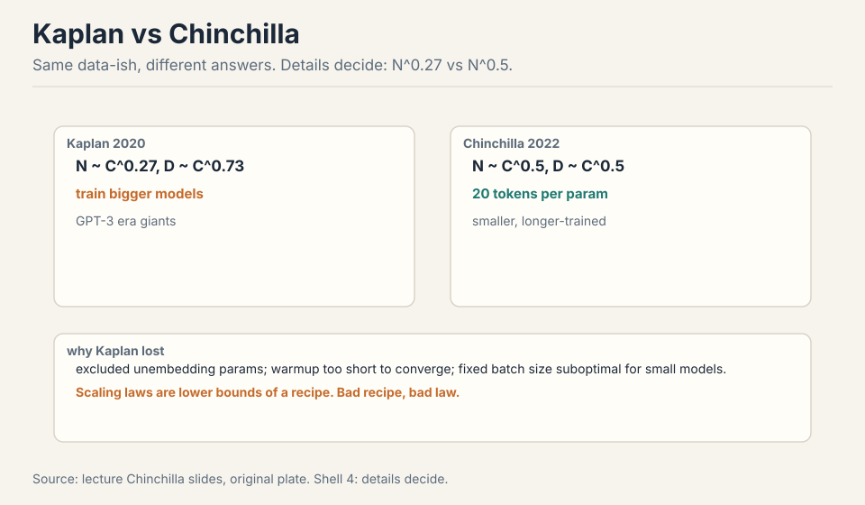

Chinchilla (2022) said both exponents ~0.5: 20 tokens per parameter,
smaller models trained longer. Three methods agreed: lower envelope,
IsoFLOP, parametric fit [62:30](ts:62:30).

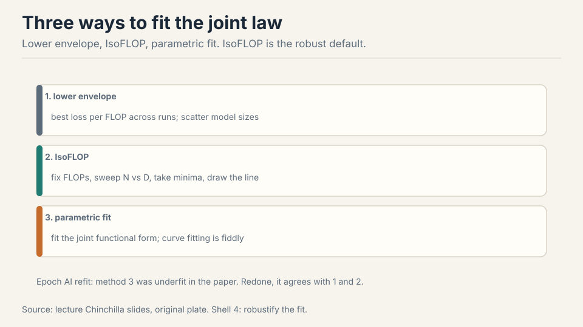

Why Kaplan lost: they excluded the unembedding parameters (big effect
at small scale), ran warmup too short for small models to converge,
and fixed a batch size that was suboptimal for small models
[67:55](ts:67:55). Minor details, big shifts. Epoch AI later showed
Chinchilla's method 3 was underfit: refit, it agrees with methods 1
and 2 [73:15](ts:73:15).

The lesson is not the number 20. It is the method: how to fit scaling
laws and how to think about them. IsoFLOP is the default you reach
for: fix the FLOP budget, sweep the N-vs-D tradeoff, take the minima,
draw the line through them. Fewest modeling assumptions, most general.

> [!QA]
> Q: If Chinchilla is right, why does nobody train at exactly 20 tokens per parameter?
> A: Chinchilla optimizes training compute. Production optimizes serving: most FLOPs go to R&D and inference, not the training run. Serving wants small, capable models, so labs overtrain far past 20:1. The ratio answers "how do I spend a training budget," not "what model should I ship." Different objective, different optimum.
> Follow-up: What is the single most reliable scaling-law tool?
> A: IsoFLOP. Fix the FLOP budget, sweep the N-vs-D tradeoff, take the minima, draw the line through them. It makes the fewest modeling assumptions of the three Chinchilla methods, and it generalizes: fix any budget, sweep any tradeoff. The lecture calls it the default for a reason.

### Subchapter: work an IsoFLOP sweep

IsoFLOP is a procedure, not a formula. Fix the FLOP budget C. Pick
five model sizes. For each, train with D = C / 6N tokens (the 6ND
rule from Lecture 2). Plot loss vs N. The curve is U-shaped: tiny
models waste compute on data they cannot use (the flat purple line),
giant models starve for data. Take the minimum: the optimal split
for this budget.

Repeat at three budgets. Three minima, three optimal (N, D) pairs.
Plot them on log-log: a straight line. Its slope is the exponent.
That line is the scaling law, and it cost no parametric model: just
sweeps and minima.

Why it beats the alternatives. The lower envelope needs many runs
to trace the frontier. The parametric fit assumes a functional form
L(N, D) that Epoch AI showed was underfit in Chinchilla's method 3.
IsoFLOP assumes only that the minimum exists. Fewest assumptions,
most general: fix any budget, sweep any tradeoff.

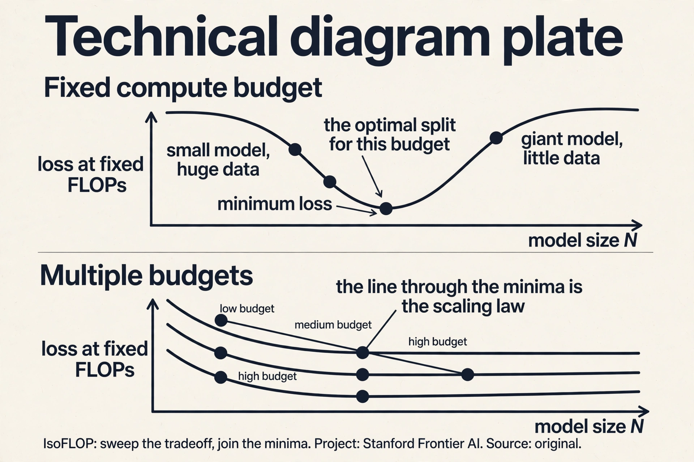

> [!QA]
> Q: Walk me through fitting a scaling law from four small runs.
> A: Fix a small FLOP budget, say 1e20. Pick four model sizes: 100M, 300M, 1B, 3B. For each, set tokens D = C / 6N: the 100M model gets about 1.7e11 tokens, the 3B model about 5.6e9. Train all four with tuned hyperparameters. Plot final loss vs N: a U-shape. Read the minimum: suppose it lands at 1B. That is your optimal N for 1e20 FLOPs. Repeat at 1e21 and 1e22. Three minima give three (N, D) pairs. Plot log N vs log C: the slope is your exponent. Extrapolate to the big budget. That is the whole procedure: sweeps, minima, a line.
> Follow-up: What breaks the extrapolation?
> A: Anything that changes the regime: a new architecture, a different data mixture, a hyperparameter that does not transfer. The line is fit in the small-scale regime; the big run must live in the same one. Kaplan's miss is the warning: exclude the unembedding, shortchange warmup, fix a bad batch size, and the small-scale minima point the wrong way. Details decide.

## Overtrain for serving

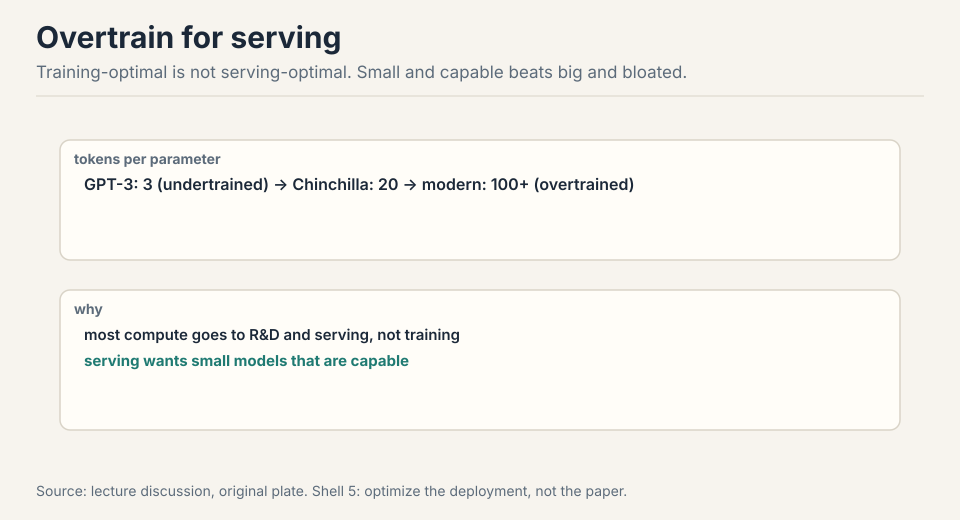

GPT-3: 3 tokens per parameter, undertrained. Chinchilla: 20, the
research optimum. Modern: overtrained on purpose, because the model
that minimizes training cost is big and expensive to serve
[75:25](ts:75:25). Serving FLOPs dwarf training FLOPs over a model's
life, so the economic optimum pushes tokens per parameter far past 20.
Chinchilla's importance is not the number. It is the method.

### Subchapter: what is used where (tokens per parameter in production)

The research optimum is 20 tokens per parameter. Production ignores
it on purpose. The verified numbers, current as of October 2026:

| Model | Tokens | Params | Tok/param |
|---|---|---|---|
| Qwen 3 235B-A22B | 36T | 235B | ~153 |
| Llama 3 405B | 15.6T | 405B | ~39 |
| DeepSeek-V3 | 14.8T | 671B | ~22 |
| Kimi K2 | 15.5T | 1T | ~16 |

Read the pattern. DeepSeek-V3 sits near the Chinchilla optimum: it
optimized training compute, and its small active size (37B) serves
cheaply anyway. Llama 3 405B overtrains 2x past it: a dense 405B
model is expensive to serve, so the extra tokens buy serving
efficiency. Qwen 3 goes 7x past: the MoE's active params are small,
so training long is cheap and the capability gain is worth it. Kimi
K2 trains at ~16: a 1T model where even the research optimum is
unaffordable, so it undertrains relative to Chinchilla and relies on
scale.

The lesson: the ratio answers "how do I spend a training budget,"
not "what model should I ship." Serving FLOPs dwarf training FLOPs
over a model's life. The economic optimum pushes tokens per
parameter past 20 whenever the serving savings exceed the training
cost.

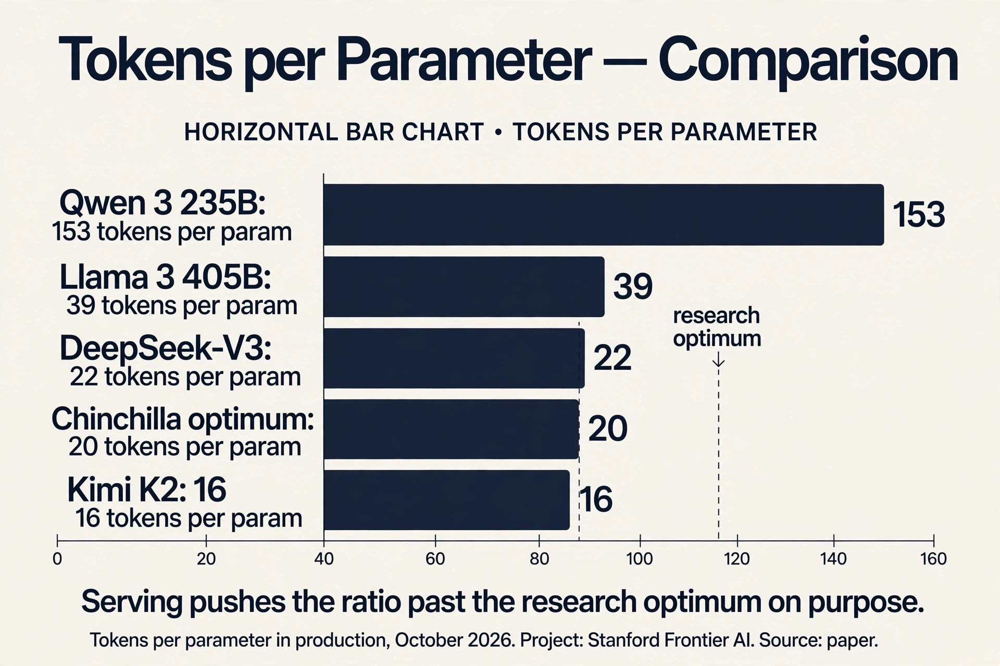

> [!QA]
> Q: You have the 10,000 B200s for a month. Spend them, step by step.
> A: Do not touch the big run yet. First, pick three small FLOP budgets, about 1/1000, 1/100, and 1/10 of the big budget. At each, run an IsoFLOP sweep: five model sizes, tokens set by 6ND, tuned hyperparameters, read the minima. Fit the scaling law: the line through the minima gives the optimal N and D for the full budget. Check the batch: fit B_crit from the sweeps and confirm the planned batch sits below it. Check serving: if the model will serve at scale, overtrain past the research optimum on purpose. Only then launch the big run, with the hyperparameters transferred (muP or width scaling), not retuned. The month is spent on the small runs; the big run is the receipt.
> Follow-up: What is the most expensive mistake in this plan?
> A: Tuning hyperparameters on the big run. One failed big run costs more than all the small sweeps combined. The second most expensive: fitting the law with the wrong details, Kaplan-style. Count all the parameters, warm up fully, and tune the batch per scale. The small runs must live in the same regime as the big one, or the extrapolation points the wrong way.

## Mapping back: what each tool fixes

| Pain | Tool | How |
|---|---|---|
| How to spend 10,000 B200s | IsoFLOP fits | Sweep N-vs-D at fixed FLOPs. Minima give the split. |
| Naive big-run tuning | Small-to-large rules | Optimize small, extrapolate. Regular only with the right x-axis. |
| Interventions that fail to scale | Slope stubbornness | Mixtures, filters, optimizers move intercepts. If it is not in the law, skip it. |
| Batch too big | Critical batch size | B_crit = E_min / S_min. Noise-limited below, bias-limited above. |
| Loss lies about tasks | Upstream/downstream split | Fit on perplexity, verify on tasks. NL12 lost to NL32XL downstream. |
| Train giants (Kaplan) | Chinchilla 20:1 | Both exponents ~0.5. Three methods agree. |
| Training-optimal != serving-optimal | Overtraining | Serve small, train long. 100+ tokens per param. |

## The honest price

Exponents are fit, not derived: treat them as recipe lower bounds, not
physics. The 20:1 ratio is training-optimal, not serving-optimal.
Downstream transfer is the weakest link in every claim here:
perplexity is clean, tasks are noisy. The Kaplan saga warns that the
details (which parameters you count, how long you warm up, what batch
size you fix) decide the answer more than the method does. And
emergence sits outside the frame: loss is smooth where accuracy is
discontinuous, so the laws predict the loss, not the capabilities.

## Recap: the whole lesson on one screen

The story in eight steps. Each step answers the one before it.

1. **10,000 B200s, one month.** Optimize small, extrapolate big. The
   small-to-large connection must be made regular by engineering.
2. **Ideas are old, scale is new.** 1993 Cortes and Vapnik, 2017
   Hestness, 2020 Kaplan, 2022 Chinchilla. Same power law, bigger
   machines.
3. **Slope is the exponent.** Log-log line means polynomial decay.
   Gaussian mean: -1. Neural nets: about -0.1, like nonparametric
   regression in ~10 dims. The price of flexibility.
4. **Slopes are stubborn.** Mixtures, repetition (4 epochs safe),
   filtering, even SGD vs Adam: intercepts move, slopes stay. If it
   is not in the law, skip it.
5. **Batches have a ceiling.** Noise-limited: perfect returns.
   Bias-limited: diminishing. B_crit grows as loss drops.
6. **Perplexity is not the task.** Fit on perplexity, verify on
   tasks. NL12 won perplexity, NL32XL won downstream.
7. **Details decide.** Kaplan said train giants (N^0.27). Chinchilla
   said 20 tok/param (N^0.5). Param counting, warmup, batch size:
   the devil in the details. IsoFLOP is the reliable default.
8. **Serve small, train long.** Training-optimal is big. Serving
   wants small and capable: overtrain past 20:1 on purpose.

## Official sources and further reading

**Official:**
- Lecture 9 video and slides (lecture_9.pdf).
- Kaplan et al. 2020, "Scaling Laws for Neural Language Models."
- Hoffmann et al. 2022, "Training Compute-Optimal Large Language
  Models" (Chinchilla).

**Further reading:**
- Hestness et al. 2017: the under-cited origins.
- "Resolving Discrepancy to Compute-Optimal Scaling" (Porian et
  al.): why Kaplan and Chinchilla disagree.
- Epoch AI refit of Chinchilla method 3.
- Tay et al. architecture scaling studies.

**Caveats from these sources.** Exponents are fit, not derived: treat
them as recipe lower bounds, not physics. The 20:1 ratio is
training-optimal, not serving-optimal. Downstream transfer is the
weakest link in every claim here.

## Connections to the other courses

- **CS336 L11:** advanced scaling: muP, initialization, optimizers.
- **CS336 L02:** the 6ND compute model that the joint laws optimize.
- **CS229:** generalization bounds, the theoretical ancestor.
