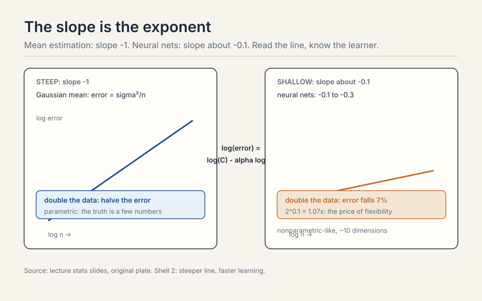
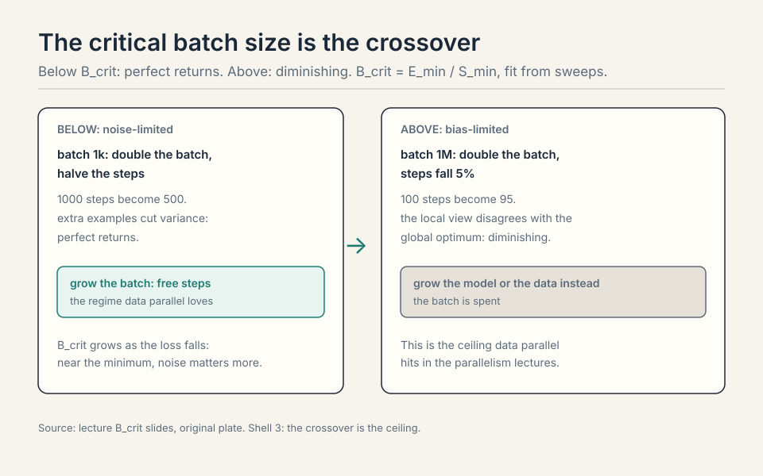
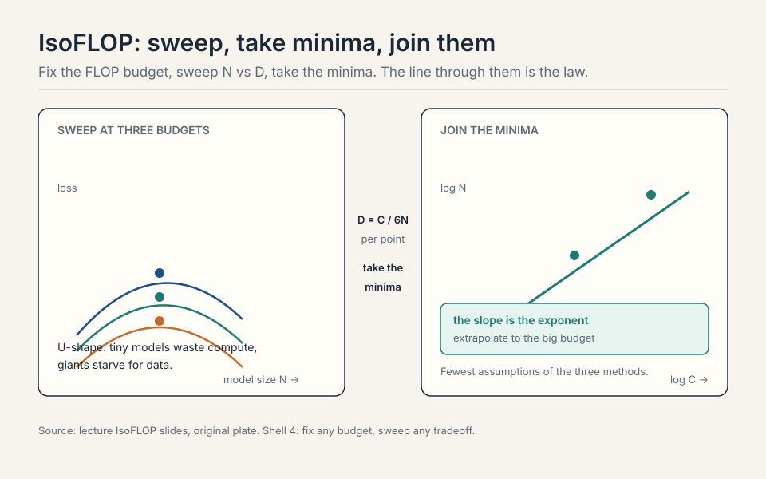
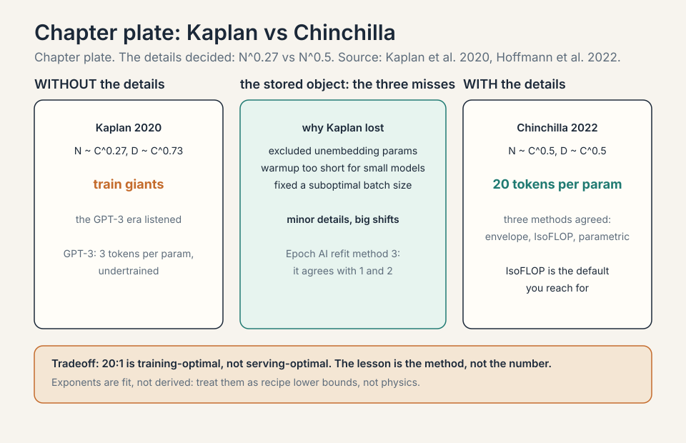
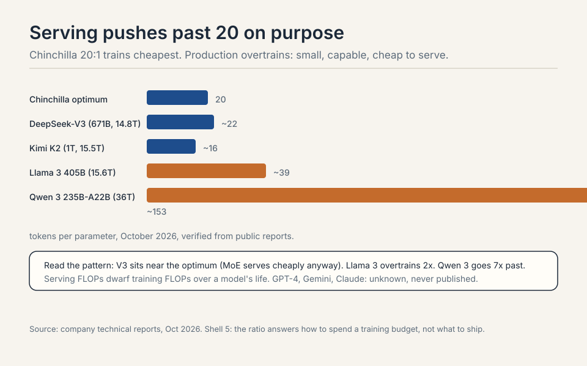
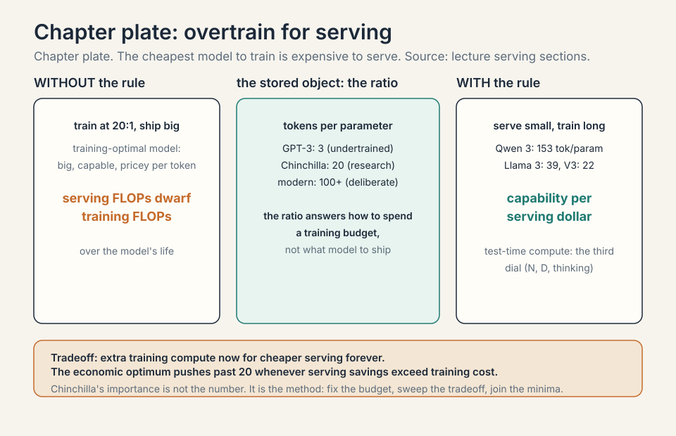

### Coverage and sourcing

This lesson follows Lecture 9 of Stanford CS336 (Language Modeling
from Scratch, Spring 2026, instructor Tatsunori Hashimoto),
"Scaling Laws, the Basics," delivered April 27, 2026, duration
1:17:47. It uses the official subtitle transcript and the slide deck
(lecture_9.pdf). Every timestamped claim below comes from the
lecture. Figures and claims marked October 2026 are updates added
after the session, each with its source: company technical reports
and papers for the tokens-per-parameter table, current as of October
2026. Model internals that are not public are marked [uncertain] or
unknown, never asserted. The coverage map at the end of the chapter
maps every major lecture claim to the section that covers it, with
file line numbers.

## The problem: 10,000 B200s, one month

Your wealthy friend hands you 10,000 B200s for a month. How do you
spend them without wasting millions? The naive approach tunes
hyperparameters on the big run and hopes. The scaling approach
optimizes at small scale and extrapolates with a simple rule
[02:48](ts:02:48). It works only if the small-to-large connection is
regular, and making it regular is engineering: pick the right x-axis,
set hyperparameters right, and predictability appears
[38:28](ts:38:28).

```ascii
naive approach  : tune hyperparameters on the big run
scaling approach: optimize small, extrapolate with a rule
works when     : the small-to-large connection is regular
```

This chapter builds the rule. It starts a century before deep
learning, because the ideas are old. The scale is new.

## A long history


Generalization bounds were the theorists' scaling laws: error bounds
that decay with sample size [04:55](ts:04:55). Cortes and Vapnik (1993)
fit error decay on small samples to predict large ones: a data scaling
law, literally. Banko and Brill showed data beats algorithms. Hestness
(2017) found neural scaling across speech, translation, and language
modeling, and already noted emergence: accuracy is discontinuous where
loss is smooth [08:37](ts:08:37).

## First attempt: grow the data, watch the error fall

Fix the model (bigger than the dataset, about 10x), grow the data,
plot log-log. A straight line means error decays polynomially: error ~
1/n^alpha plus the noise floor [14:34](ts:14:34).


The stats interlude makes the numbers concrete. Estimating a Gaussian
mean gives sigma^2/n: slope -1. Double the data, halve the error.
Neural nets show -0.1 to -0.3: much slower. Double the data and the
error falls by about 2^0.1 = 1.07x: seven percent. The model that
fits: nonparametric regression in D dimensions has rate n^(-1/D).
Neural nets learn like smooth functions in about 10 dimensions
[19:25](ts:19:25). The exponent tells you how fast the network really
learns, and it is the price of flexibility: parametric estimators
assume the truth lives in a small known family, while the net must
learn the shape of the function too.

> [!QA]
> Q: Why is the neural exponent (-0.1) so much worse than the parametric rate (-1)?
> A: Parametric estimators assume the truth lives in a small, known family: every sample refines a few numbers. A neural net makes far weaker assumptions, so it must learn the shape of the function too, like a nonparametric smoother spreading samples across a high-dimensional space. The exponent is the price of flexibility. That is also why the slope is stable across interventions: it reflects the model class, not the data.
> Follow-up: When does the log-log line break?
> A: Near the noise floor. The line is the far-from-asymptote regime. As error approaches the irreducible level, the curve tapers. That is why the setup keeps the model much bigger than the dataset: it stays in the power-law regime instead of the saturated one.

### Subchapter: read a log-log plot

The whole chapter is one skill: read the slope. On log-log axes, a
power law error ~ n^(-alpha) is a straight line with slope -alpha.
Steeper line, faster learning. The slope is the exponent.

Work the two cases the lecture gives. Gaussian mean estimation:
slope -1. Double the data, halve the error. Neural nets: slope
about -0.1. Double the data, error falls by 2^0.1 = 1.07x: seven
percent. One doubling buys you half the error in the parametric
world and seven percent in the neural world. That gap is the price
of flexibility, drawn as two lines.

The intercept is the constant out front: same slope, lower line,
better model at every data size. Interventions move the line down.
Nothing in the data interventions moved the slope. Keep the two
readings separate: slope for the learning rate of the model class,
intercept for the quality of the intervention.



### Subchapter: fit the line, the mechanics

A power law on log-log axes is a line, so fitting it is linear
regression on the logs. Take the measured errors at data sizes n1,
n2, ..., nk. Compute log(error) and log(n) for each. Fit the line
log(error) = log(C) - alpha x log(n) by least squares. The slope
is -alpha. The intercept is log(C).

Work the fit on three points. n = 1e9, 1e10, 1e11 tokens. Errors =
2.80, 2.65, 2.51. Logs of n: 9, 10, 11. Logs of error: 0.447,
0.424, 0.400. Slope: (0.400 - 0.447) / (11 - 9) = -0.0235. Alpha =
0.0235. That is a shallow slope even by neural standards: each
10x of data cuts the error by 10^0.0235 = 1.056x, about five
percent.

| n (tokens) | error | log(n) | log(error) |
|---|---|---|---|
| 1e9 | 2.80 | 9 | 0.447 |
| 1e10 | 2.65 | 10 | 0.424 |
| 1e11 | 2.51 | 11 | 0.400 |

Slope: (0.400 - 0.447) / (11 - 9) = -0.0235. Each 10x of data cuts
the error by 10^0.0235 = 1.056x, about five percent. Figure: Shell 2.
Source: original worked toy.

The mechanics hide three judgments. One: which points belong to
the power-law regime. Points near the noise floor bend the line
flat. Points where the model underfits bend it steep. Fit only the
straight middle. Two: the error bars. Each point is one training
run with its own noise: seeds, data order, early stopping. Two
runs at the same n differ in the second decimal. The slope from
three noisy points is a guess, not a measurement. Three: the
extrapolation distance. Fitting n = 1e9 to 1e11 and predicting
1e13 is two orders of magnitude past the data. The line is a
promise the regime will not change. Kaplan's miss is what a broken
promise looks like.

> [!QA]
> Q: You fit alpha = 0.1 on three runs. How much do you trust the fourth decimal?
> A: Not at all. Each point carries training noise: different seeds and data orders move the loss in the second decimal. Three points determine a line, but the slope's uncertainty spans the noise of the noisiest point. The honest report is alpha = 0.1 plus or minus the fit's standard error, and the extrapolation to 100x the data carries that error multiplicatively. The fourth decimal is fiction. The first decimal is the claim.
> Follow-up: How many points do you need for a trustworthy fit?
> A: Enough to see the regime, not just the line. Three points make a line by construction: they cannot tell you whether you are in the power-law regime or fitting a curve's tangent. Five to seven points across two orders of magnitude let you check straightness: if the middle points sit on the line, the regime is real. The Chinchilla fits (Chinchilla: the 2022 DeepMind
study behind the ~20 tokens-per-parameter rule) used many runs per
budget for exactly this reason. The cost of the fit is the cost of
the runs, which is why the IsoFLOP minima (IsoFLOP: fix the FLOP
budget, sweep the model-vs-data tradeoff, take the minima) are the
practical default: fewer, cheaper runs.

 vs log(n); interventions move intercepts, rarely slopes. Right: IsoFLOP sweeps at small budgets; the big run is the receipt. Bottom: the line is a promise the regime will not change; fit the bends. Dense chapter plate. Source: original synthesis of the lecture.")

## Where naive scaling breaks: slopes are stubborn

Three data interventions, one recurring lesson: they move intercepts,
rarely slopes [27:05](ts:27:05).


- **Mixtures.** Data composition shifts intercepts, not slopes. Fit
  mixtures at small scale, pick the best, scale it up. Often no
  scaling law is even needed: the best small mix is the best large
  mix [24:48](ts:24:48).
- **Repetition.** Up to about 4 epochs, no harm. Past it, the realized
  curve falls below the fresh-data projection. At infinite compute:
  stop repeating, start ensembling [25:42](ts:25:42).
- **Filtering.** Scale-dependent. Small compute: filter hard, keep the
  best. Big compute: loosen the filter, or you run out of data and
  repeat yourself [27:34](ts:27:34).

Architecture scaling shows the same stubbornness. Transformers vs
LSTMs: different intercepts, possibly different slopes. The plot
justifies the transformer [31:40](ts:31:40). Tay et al.'s T5 studies
caught the winners early: GLU (gated linear unit) scales well, Performer does not, Switch
Transformer does [33:18](ts:33:18). Rule of thumb: if it does not show
up in the scaling law, it is not a good intervention
[34:35](ts:34:35). SGD vs Adam (Hestness): different intercepts, nearly
identical slopes. Even that big a change leaves the slope alone
[34:57](ts:34:57). Caution: not all parameters are equal. Kaplan
excluded embeddings and got clean laws. For MoEs, Apple/MIT show the
right axes are total vs active parameters, with sparsity growing at
scale and inactive parameters still helping [39:09](ts:39:09).

> [!QA]
> Q: Why do mixtures, filters, and optimizers move intercepts but never slopes?
> A: The slope reflects the model class: how fast this architecture converts data into error reduction, like a nonparametric smoother in about 10 dimensions. The intercept reflects everything else: data quality, mixture composition, optimizer efficiency. A better mixture lowers the error at every data size by a constant factor: the whole line shifts down. It does not change how fast error falls with more data, because that rate is set by the architecture's learning dynamics. That is why the lecture's rule of thumb works: if an intervention does not move the slope, it is a constant-factor win, not a new regime.
> Follow-up: Could an intervention ever move the slope?
> A: Yes: change the model class. Transformers vs LSTMs showed different intercepts and possibly different slopes: the architecture itself sets the learning rate. For MoEs, Apple and MIT showed the right axes are total vs active parameters, and sparsity grows at scale. A genuinely new architecture can bend the line. Data and optimizer tweaks cannot.

### Subchapter: emergence and its discontents

The lecture notes what Hestness saw in 2017: accuracy is
discontinuous where loss is smooth [08:37](ts:08:37). The loss
falls on its straight log-log line. The task accuracy sits at
chance, then jumps. Wei et al. (2022) named it **emergence**:
abilities that appear suddenly at scale, unpredictable from small
models.

The discontent: Schaeffer et al. (2023) showed the jumps are
partly a metric artifact. Accuracy is a thresholded metric: it
scores 0 below the threshold and 1 above. A smooth underlying
improvement crosses the threshold at one scale and looks like a
jump. Change the metric to a continuous one (probability of the
correct answer), and many emergences smooth out into the same
power law the loss follows.

Work the artifact. A task needs 3 correct sub-steps, each with
probability p rising smoothly with scale: p = 0.3, 0.5, 0.7, 0.9.
| p (per sub-step) | accuracy = p^3 | continuous = p |
|---|---|---|
| 0.3 | 0.027 | 0.3 |
| 0.5 | 0.125 | 0.5 |
| 0.7 | 0.343 | 0.7 |
| 0.9 | 0.729 | 0.9 |

Accuracy (all 3 correct): p^3 = 0.027, 0.125, 0.343, 0.729. The
accuracy curve looks flat then steep: emergence. The continuous
metric (average p): 0.3, 0.5, 0.7, 0.9: a straight line. Same
model, same scale, different story. The jump was in the ruler, not
the thing measured. Figure: Shell 3. Source: original worked toy.

What survives the critique: some capabilities genuinely need
composition that small models cannot do at all, and the
thresholded metrics are the ones users care about (the answer is
right or it is not). The interview-ready position: emergence is
real as a user-facing phenomenon and suspect as a claim about the
model's internals. The scaling laws predict the loss. The loss
predicts the continuous metrics. The discontinuous ones need
their own curves.

> [!QA]
> Q: Is emergence real or a metric artifact?
> A: Both, at different levels. The Schaeffer critique is correct about the mechanism: thresholded metrics (accuracy) turn smooth probability gains into jumps, because p^3 looks flat-then-steep while p looks linear. Many BIG-bench "emergences" smooth out under continuous metrics. What survives: the user-facing jump is real (the answer flips from wrong to right), and some tasks genuinely need composition depth that small models lack. The scaling laws predict the loss. The loss predicts continuous metrics. Discontinuous metrics need their own curves. Never extrapolate a jump from a line.
> Follow-up: How does this change how you read a scaling plot?
> A: Ask what the y-axis is. Log loss or perplexity (perplexity: the
exponentiated average negative log-probability, the model's average
surprise per token): the line is trustworthy, fit it and extrapolate. Accuracy or pass rate: expect threshold effects, and do not extrapolate the flat part. The lecture's rule (fit on perplexity, verify on tasks) is this distinction in procedure form. The metric decides what the plot can promise.

### Subchapter: the data wall, worked

Chinchilla assumes fresh data. What if the data runs out? The
lecture's repetition finding (about 4 epochs safe) is the first
answer. Muennighoff et al. (2023) gave the fuller picture:
repeating data with the epochs spread out (not back-to-back) keeps
working longer, but the returns diminish against fresh data, and
past ~4-16 epochs (depending on the setup) the curve flattens
hard.

Work the wall. You have 1T fresh tokens and a Chinchilla-optimal
plan wants 3T for your model size. Option A: train 1T tokens, 3
epochs each. The first epoch behaves like fresh data. The second
adds less. The third adds little. Effective data: roughly 1.6T
fresh-equivalent, not 3T. Option B: shrink the model to fit 1T at
20:1. The scaling law with the repetition penalty says B usually
wins: a smaller model on fresh data beats a bigger model on
repeated data, because the repeated epochs buy fractions.

| | Option A: 3 epochs on 1T | Option B: shrink to fit 1T at 20:1 |
|---|---|---|
| Fresh-equivalent | ~1.6T, not 3T | 1T, all fresh |
| Verdict | repeated epochs buy fractions | smaller model on fresh data usually wins |

Figure: Shell 3. The scaling law's x-axis is fresh-equivalent tokens, not tokens seen. Source: original worked toy.

The strategic consequence: data became the binding constraint, not
compute. The frontier response was data manufacturing: better
filtering (DCLM, DataComp-LM), synthetic data, and the mixture work the lecture
covers. The scaling laws did not break. Their x-axis changed from
"tokens seen" to "fresh-equivalent tokens," and the labs that
measured the conversion won.

> [!QA]
> Q: You have 1T fresh tokens and compute for 3T. What do you do?
> A: Do not train 3 epochs blindly. The repetition studies say the second and third epochs buy fractions of fresh data: roughly 1.6T fresh-equivalent from 3T of repeats. The better move is usually to shrink the model to the Chinchilla-optimal size for 1T fresh tokens, or to manufacture more fresh-equivalent data (filtering, mixtures, synthetic). The scaling law still governs: its x-axis is fresh-equivalent tokens, not tokens seen. Measure the conversion on your data, then spend.
> Follow-up: Why does spreading epochs out help?
> A: Back-to-back repetition lets the model memorize the epoch boundary: it sees the same sequence twice in quick succession and overfits to the repetition pattern. Spreading the repeats across the run (epoch 2's copy of a document lands far from epoch 1's) makes each encounter closer to independent. The effect is second-order, but at the data wall, second order is the margin.

## The key question

The naive question is "bigger model or more data?" The sharper
question is "given fixed FLOPs, what split of model size and data
minimizes loss?" FLOPs ~ N x D: one budget, two dials. Answer that,
and the 10,000 B200s spend themselves.

## Critical batch size: the batch has a ceiling

Two regimes [42:24](ts:42:24). **Noise-limited:** extra examples cut
gradient variance, perfect returns. **Bias-limited:** you see only the
local objective, and the local direction disagrees with the global
optimum, so extra examples buy little.


Work the crossover. At batch 1k, doubling the batch halves the steps:
perfect returns, noise-limited. At batch 1M, doubling the batch cuts
steps by 5%: bias-limited, the extra examples mostly re-confirm what
you knew. The **critical batch size** is the crossover: B_crit = min
examples / min steps, fit from sweeps [46:01](ts:46:01). It scales: as
the target loss drops, B_crit grows as a power law. Closer to the
minimum, noise matters more, so big runs earn big batches
[47:36](ts:47:36). This is the ceiling data parallel hits in the
parallelism lectures.

### Subchapter: B_crit, worked

Work the crossover with the lecture's numbers. Batch 1k, noise
limited: doubling the batch halves the steps. 1000 steps become 500.
Perfect returns: the extra examples each cut variance. Batch 1M,
bias limited: doubling cuts the steps by 5%. 100 steps become 95.
The extra 1M examples mostly re-confirm the direction you knew.

B_crit is the batch size where the two regimes meet: B_crit =
E_min / S_min, the minimum examples divided by the minimum steps,
fit from sweeps. Below it, grow the batch: free steps. Above it,
grow the model or the data instead: the batch is spent.

And B_crit grows as the target loss drops. Early training tolerates
small batches: far from the minimum, the direction is obvious. Late
training needs big batches: near the minimum, noise drowns the
signal. The schedule follows: ramp the batch as the loss falls.



> [!QA]
> Q: Work B_crit. Your B_crit is 2M examples. You run batch 8k. Doubling to 16k: how many steps do you save?
> A: You are far below B_crit, deep in the noise-limited regime: doubling the batch nearly halves the steps. 10,000 steps become about 5,000. The extra 8k examples per step each cut gradient variance. Now flip it: you run batch 8M, four times B_crit. Doubling to 16M saves almost nothing: the steps barely move, because the batch direction already matches the true gradient. Same doubling, opposite payoff. The regime decides, not the arithmetic.
> Follow-up: How do you find B_crit in practice?
> A: Sweep the batch at small scale: plot steps-to-target vs batch size on log-log. The curve bends at B_crit: linear gains below, flat above. Fit E_min / S_min from the sweep. Then scale it: B_crit grows as a power law of the target loss, so the big run's ceiling is predictable from the small runs.

### Subchapter: learning rate scaling, the other knob

Learning rate, the other knob: width scaling suggests LR ~ 1/width.
The alternative school, muP, reparameterizes so the optimal LR stays
fixed across scales. Both have succeeded at scale. The advanced
lecture goes deeper [48:34](ts:48:34).

The two rules, side by side:

width scaling: eta ~ 1 / width (from the update-to-weight ratio)
muP: reparameterize so the optimal eta stays fixed across scales

Figure: Shell 4. Pick one and commit. The sin is retuning from scratch at scale. Source: lecture LR discussion.

> [!QA]
> Q: Width scaling says LR ~ 1/width. muP says keep LR fixed. What do you actually do?
> A: Pick one and commit. Width scaling: tune the LR on the narrow model, then divide by the width ratio for the wide one. muP: reparameterize the network (scale the initialization and per-layer LRs) so the optimal LR transfers unchanged across widths. Both remove the big-run LR sweep, which is the expensive part. muP is the more complete system: it transfers all hyperparameters, not just LR, and it is what the advanced lecture builds. The sin is retuning from scratch at scale: that is the naive approach the lecture opened with.
> Follow-up: Why does the naive LR fail at scale?
> A: Wider layers have larger activation and gradient magnitudes. A LR tuned for a narrow model overshoots in a wide one: the update norm grows with width. Width scaling and muP both keep the update-to-weight ratio constant across scales. Without that correction, the big run diverges or needs its own sweep, which is exactly the millions the scaling approach saves.

## Upstream is not downstream

Perplexity vs parameters: a beautiful line. Downstream: the best
perplexity model (NL12) lost to a worse-perplexity one (NL32XL)
[51:37](ts:51:37).


Fit scaling laws on perplexity, where variance is tiny (singletons,
second-decimal noise). Then verify transfer separately. The
post-training team inherits pre-training's sins [52:13](ts:52:13). The
procedure: train small models, fit log-log lines, predict the big
run's numbers before spending the money [53:04](ts:53:04).

## The Kaplan-Chinchilla saga: details decide

Fixed FLOPs, more data or bigger model? Tiny model plus huge data
wastes compute (flat purple line) [57:32](ts:57:32). Kaplan and
Rosenfeld fit joint laws L(N, D). Kaplan said N ~ C^0.27, D ~ C^0.73:
train giants. The GPT-3 era listened [60:21](ts:60:21).


Chinchilla (2022) said both exponents ~0.5: 20 tokens per parameter,
smaller models trained longer. Three methods agreed: lower envelope,
IsoFLOP, parametric fit [62:30](ts:62:30).


Why Kaplan lost: they excluded the unembedding parameters (big effect
at small scale), ran warmup too short for small models to converge,
and fixed a batch size that was suboptimal for small models
[67:55](ts:67:55). Minor details, big shifts. Epoch AI later showed
Chinchilla's method 3 was underfit: refit, it agrees with methods 1
and 2 [73:15](ts:73:15).

The lesson is not the number 20. It is the method: how to fit scaling
laws and how to think about them. IsoFLOP is the default you reach
for: fix the FLOP budget, sweep the N-vs-D tradeoff, take the minima,
draw the line through them. Fewest modeling assumptions, most general.

> [!QA]
> Q: If Chinchilla is right, why does nobody train at exactly 20 tokens per parameter?
> A: Chinchilla optimizes training compute. Production optimizes serving: most FLOPs go to R&D and inference, not the training run. Serving wants small, capable models, so labs overtrain far past 20:1. The ratio answers "how do I spend a training budget," not "what model should I ship." Different objective, different optimum.
> Follow-up: What is the single most reliable scaling-law tool?
> A: IsoFLOP. Fix the FLOP budget, sweep the N-vs-D tradeoff, take the minima, draw the line through them. It makes the fewest modeling assumptions of the three Chinchilla methods, and it generalizes: fix any budget, sweep any tradeoff. The lecture calls it the default for a reason.

### Subchapter: work an IsoFLOP sweep

IsoFLOP is a procedure, not a formula. Fix the FLOP budget C. Pick
five model sizes. For each, train with D = C / 6N tokens (the 6ND
rule from Lecture 2). Plot loss vs N. The curve is U-shaped: tiny
models waste compute on data they cannot use (the flat purple line),
giant models starve for data. Take the minimum: the optimal split
for this budget.

Repeat at three budgets. Three minima, three optimal (N, D) pairs.
Plot them on log-log: a straight line. Its slope is the exponent.
That line is the scaling law, and it cost no parametric model: just
sweeps and minima.

Why it beats the alternatives. The lower envelope needs many runs
to trace the frontier. The parametric fit assumes a functional form
L(N, D) that Epoch AI showed was underfit in Chinchilla's method 3.
IsoFLOP assumes only that the minimum exists. Fewest assumptions,
most general: fix any budget, sweep any tradeoff.



> [!QA]
> Q: Walk me through fitting a scaling law from four small runs.
> A: Fix a small FLOP budget, say 1e20. Pick four model sizes: 100M, 300M, 1B, 3B. For each, set tokens D = C / 6N: the 100M model gets about 1.7e11 tokens, the 3B model about 5.6e9. Train all four with tuned hyperparameters. Plot final loss vs N: a U-shape. Read the minimum: suppose it lands at 1B. That is your optimal N for 1e20 FLOPs. Repeat at 1e21 and 1e22. Three minima give three (N, D) pairs. Plot log N vs log C: the slope is your exponent. Extrapolate to the big budget. That is the whole procedure: sweeps, minima, a line.
> Follow-up: What breaks the extrapolation?
> A: Anything that changes the regime: a new architecture, a different data mixture, a hyperparameter that does not transfer. The line is fit in the small-scale regime. The big run must live in the same one. Kaplan's miss is the warning: exclude the unembedding, shortchange warmup, fix a bad batch size, and the small-scale minima point the wrong way. Details decide.

### Subchapter: Broken Neural Scaling Laws

The power law is the far-from-asymptote regime. Real curves bend:
they hit noise floors, they transition between regimes, they
saturate. Caballero et al. (2022), "Broken Neural Scaling Laws"
(BNSL), fit the bends instead of pretending the line continues.

The BNSL form: a sum of power laws with smooth transitions between
them. Each segment has its own exponent. The breaks sit where the
regime changes. A curve that looks like one line from 1e9 to 1e11
tokens can break at 1e12: the exponent shifts, and the
extrapolation from the early segment overshoots.

Work the break. Segment 1: error ~ n^(-0.1), fit on n = 1e9 to
1e11. Extrapolate to 1e13: predicted error falls by 100^0.1 =
1.58x. The true curve breaks at 1e12 to exponent -0.05 (the noise
floor approaches). True improvement from 1e11 to 1e13: 10^0.1 x
10^0.05 = 1.26 x 1.12 = 1.41x. The single-line extrapolation
promised 1.58x and the bend delivered 1.41x. At frontier budgets,
that gap is millions of dollars of expected gain that never
arrives.

The practical use: fit BNSL when your data spans enough range to
see a bend, and distrust any extrapolation more than one order of
magnitude past the largest run. The lecture's laws are the
first-order story. BNSL is the second-order correction, and at the
| | Single line | Broken law |
|---|---|---|
| Fit | n = 1e9 to 1e11, alpha = 0.1 | breaks at 1e12 to alpha = 0.05 |
| Predicted gain, 1e11 to 1e13 | 100^0.1 = 1.58x | 10^0.1 x 10^0.05 = 1.41x |

Figure: Shell 4. The extrapolation promised 1.58x; the bend delivered 1.41x. At frontier budgets, that gap is millions. Source: original worked toy.

scale of the 10,000 B200s, second order is real money.

> [!QA]
> Q: When do you fit a broken scaling law instead of a straight line?
> A: When the data shows a bend or you have reason to expect one: approaching a noise floor, a data mixture that exhausts, a regime change in the training setup. BNSL fits segments with smooth transitions, each with its own exponent. The straight line is the special case of zero breaks. The cost: more parameters to fit, so you need more runs to pin the break location. The rule: fit the line first. If the residuals curve systematically (not noise, a shape), fit the break.
> Follow-up: What is the most expensive scaling-law mistake at frontier scale?
> A: Extrapolating a straight line two orders of magnitude past the data through an unseen break. The line promises gains the bend will not deliver, and the budget is spent on the promise. Kaplan's miss was a details error. A break miss is a regime error. Both cost the same: a big run that underdelivers. The defense is range: fit across as many orders of magnitude as you can afford, and mark every extrapolation past the data as a bet, not a measurement.



## Overtrain for serving


GPT-3: 3 tokens per parameter, undertrained. Chinchilla: 20, the
research optimum. Modern: overtrained on purpose, because the model
that minimizes training cost is big and expensive to serve
[75:25](ts:75:25). Serving FLOPs dwarf training FLOPs over a model's
life, so the economic optimum pushes tokens per parameter far past 20.
Chinchilla's importance is not the number. It is the method.

### Subchapter: what is used where (tokens per parameter in production)

The research optimum is 20 tokens per parameter. Production ignores
it on purpose. The verified numbers, current as of October 2026:

| Model | Tokens | Params | Tok/param |
|---|---|---|---|
| Qwen 3 235B-A22B | 36T | 235B | ~153 |
| Llama 3 405B | 15.6T | 405B | ~39 |
| DeepSeek-V3 | 14.8T | 671B | ~22 |
| Kimi K2 | 15.5T | 1T | ~16 |

Read the pattern. DeepSeek-V3 sits near the Chinchilla optimum: it
optimized training compute, and its small active size (37B) serves
cheaply anyway. Llama 3 405B overtrains 2x past it: a dense 405B
model is expensive to serve, so the extra tokens buy serving
efficiency. Qwen 3 goes 7x past: the MoE's active params are small,
so training long is cheap and the capability gain is worth it. Kimi
K2 trains at ~16: a 1T model where even the research optimum is
unaffordable, so it undertrains relative to Chinchilla and relies on
scale.

The lesson: the ratio answers "how do I spend a training budget,"
not "what model should I ship." Serving FLOPs dwarf training FLOPs
over a model's life. The economic optimum pushes tokens per
parameter past 20 whenever the serving savings exceed the training
cost.



### Subchapter: who trains at what ratio, honestly

The table above is verified from public reports. What about the
labs that do not publish? Honesty requires the unknowns.

**GPT-4 / GPT-5 (OpenAI):** training token counts not public.
[uncertain] estimates circulate (13T tokens for GPT-4 is a common
unofficial figure), but OpenAI has never confirmed. Unknown.

**Gemini (Google DeepMind):** the technical reports describe the
models, not the token budgets. Unknown.

**Claude (Anthropic):** same: capabilities published, training
mixtures not. Unknown.

The pattern: the Chinchilla ratio is verifiable only where labs
publish it (DeepSeek, Meta, Alibaba, Moonshot). The closed labs'
ratios are inferred from behavior, not measured. The interview
rule: cite the verified numbers, mark the rest unknown, and never
let an [uncertain] estimate harden into a fact across retellings.
The table's lesson does not need the unknowns: serving pushes past
20 wherever the serving savings exceed the training cost, and that
logic holds regardless of any one lab's number.

> [!QA]
> Q: You have the 10,000 B200s for a month. Spend them, step by step.
> A: Do not touch the big run yet. First, pick three small FLOP budgets, about 1/1000, 1/100, and 1/10 of the big budget. At each, run an IsoFLOP sweep: five model sizes, tokens set by 6ND, tuned hyperparameters, read the minima. Fit the scaling law: the line through the minima gives the optimal N and D for the full budget. Check the batch: fit B_crit from the sweeps and confirm the planned batch sits below it. Check serving: if the model will serve at scale, overtrain past the research optimum on purpose. Only then launch the big run, with the hyperparameters transferred (muP or width scaling), not retuned. The month is spent on the small runs. The big run is the receipt.
> Follow-up: What is the most expensive mistake in this plan?
> A: Tuning hyperparameters on the big run. One failed big run costs more than all the small sweeps combined. The second most expensive: fitting the law with the wrong details, Kaplan-style. Count all the parameters, warm up fully, and tune the batch per scale. The small runs must live in the same regime as the big one, or the extrapolation points the wrong way.

### Subchapter: the new axis: test-time compute

Everything so far scales training. Snell et al. (2024) asked the
other question: given a fixed model, what does more compute at
inference buy? The answer is its own scaling law, and it reshaped
the frontier.

Two ways to spend test-time compute: sample many answers and pick
(majority vote, best-of-N), or let one answer think longer
(chain-of-thought with more steps). On hard reasoning tasks, both
show smooth gains with compute: accuracy rises as a power law of
the inference budget, just as loss falls as a power law of the
training budget.

Work the tradeoff. A 7B model with 100x test-time compute vs a 70B
model with 1x: on MATH-style problems, the small model with long
thinking matches or beats the big model's single pass. The
implication: the Chinchilla-optimal training split is no longer
the whole answer. The budget now has three dials (N, D, and
inference compute per query), and the optimum depends on how many
queries the model will serve. A model serving billions of queries
still wants training-heavy spending. A model answering a few hard
questions wants inference-heavy spending.

| | Training-heavy | Inference-heavy |
|---|---|---|
| Spend | big model, 1x thinking | 7B model, 100x test-time compute |
| Wins when | billions of queries amortize training | a few hard questions |
| Rule | queries x inference-per-query decides | Snell et al.: test-time scales smoothly too |

Figure: Shell 5. The budget has three dials now: N, D, and inference compute per query. Source: Snell et al. 2024, original table.

The reasoning-model era (o1/o3 and their open followers) is this
subchapter in production: the labs scaled the inference axis and
found capabilities the training axis alone did not reach. The
evaluation lecture's ARC-2 numbers are downstream of this shift.
The scaling-law toolkit grew a third dimension, and the interview
question changed from "how big" to "where do you spend the next
FLOP: training, or thinking?"

> [!QA]
> Q: Training compute vs test-time compute: how do you split the budget?
> A: By the query count. Training is a one-time cost amortized over every query. Test-time compute is paid per query. Billions of queries: spend on training, serve the strong model cheaply per query. A few hard questions: spend on thinking, serve a smaller model with a big inference budget. The Snell result gives the exchange rate: on reasoning tasks, test-time compute scales smoothly, so you can compute the crossover. The wrong answer is scaling only one axis: the 2024-2026 frontier moved precisely because labs scaled the axis everyone had ignored.
> Follow-up: Does test-time scaling break the Chinchilla optimum?
> A: It extends it. Chinchilla optimizes the training split (N vs D) for a fixed training budget. The full optimum now includes inference: total cost = training + queries x inference-per-query. For high query counts the Chinchilla split survives (training dominates). For low query counts the optimum shifts toward smaller models with bigger inference budgets. The method is the same (fix the budget, sweep the tradeoff, join the minima). The budget got bigger.



## Mapping back: what each tool fixes

| Pain | Tool | How |
|---|---|---|
| How to spend 10,000 B200s | IsoFLOP fits | Sweep N-vs-D at fixed FLOPs. Minima give the split. |
| Naive big-run tuning | Small-to-large rules | Optimize small, extrapolate. Regular only with the right x-axis. |
| Interventions that fail to scale | Slope stubbornness | Mixtures, filters, optimizers move intercepts. If it is not in the law, skip it. |
| Batch too big | Critical batch size | B_crit = E_min / S_min. Noise-limited below, bias-limited above. |
| Loss lies about tasks | Upstream/downstream split | Fit on perplexity, verify on tasks. NL12 lost to NL32XL downstream. |
| Train giants (Kaplan) | Chinchilla 20:1 | Both exponents ~0.5. Three methods agree. |
| Training-optimal != serving-optimal | Overtraining | Serve small, train long. 100+ tokens per param. |

## The honest price

Exponents are fit, not derived: treat them as recipe lower bounds, not
physics. The 20:1 ratio is training-optimal, not serving-optimal.
Downstream transfer is the weakest link in every claim here:
perplexity is clean, tasks are noisy. The Kaplan saga warns that the
details (which parameters you count, how long you warm up, what batch
size you fix) decide the answer more than the method does. And
emergence sits outside the frame: loss is smooth where accuracy is
discontinuous, so the laws predict the loss, not the capabilities.

## Coverage map: every lecture claim and where it lives

| Lecture claim | Covered in | File line |
|---|---|---|
| 10,000 B200s for a month: optimize small, extrapolate with a rule | The problem: 10,000 B200s, one month | L43 |
| The small-to-large connection must be made regular by engineering | The problem: 10,000 B200s, one month | L43 |
| History: Cortes/Vapnik 1993, Banko/Brill, Hestness 2017, Kaplan 2020, Chinchilla 2022 | A long history | L63 |
| Generalization bounds as the theorists' scaling laws | A long history | L63 |
| Emergence noted: accuracy discontinuous where loss is smooth | A long history | L63 |
| Fix the model, grow the data: error ~ 1/n^alpha + noise floor | First attempt: grow the data, watch the error fall | L75 |
| Gaussian mean: slope -1; neural nets: -0.1 to -0.3 | First attempt: grow the data, watch the error fall | L75 |
| Neural nets learn like nonparametric regression in ~10 dims | First attempt: grow the data, watch the error fall | L75 |
| Read a log-log plot: slope is the exponent, intercept the constant | read a log-log plot | L100 |
| Fit the line: least squares on logs, three judgments | fit the line, the mechanics | L121 |
| Mixtures shift intercepts, not slopes | Where naive scaling breaks: slopes are stubborn | L159 |
| Repetition: ~4 epochs safe, then falls below fresh-data projection | Where naive scaling breaks: slopes are stubborn | L159 |
| Filtering: scale-dependent, loosen at big compute | Where naive scaling breaks: slopes are stubborn | L159 |
| Transformers vs LSTMs: the plot justifies the transformer | Where naive scaling breaks: slopes are stubborn | L159 |
| Tay et al.: GLU scales, Performer does not, Switch does | Where naive scaling breaks: slopes are stubborn | L159 |
| SGD vs Adam: different intercepts, nearly identical slopes | Where naive scaling breaks: slopes are stubborn | L159 |
| Kaplan excluded embeddings; MoE needs total vs active axes | Where naive scaling breaks: slopes are stubborn | L159 |
| Emergence: real as user phenomenon, suspect as internal claim | emergence and its discontents | L196 |
| Schaeffer et al.: thresholded metrics manufacture jumps | emergence and its discontents | L196 |
| The data wall: repetition buys fractions, fresh-equivalent tokens | the data wall, worked | L238 |
| Who trains at what ratio: verified numbers, honest unknowns | who trains at what ratio, honestly | L485 |
| Key question: fixed FLOPs, what N/D split minimizes loss | The key question | L270 |
| Critical batch size: noise-limited vs bias-limited | Critical batch size: the batch has a ceiling | L277 |
| B_crit = E_min / S_min; grows as a power law of target loss | Critical batch size: the batch has a ceiling | L277 |
| B_crit worked: the crossover arithmetic | B_crit, worked | L296 |
| LR ~ 1/width vs muP: pick one and commit | learning rate scaling, the other knob | L322 |
| Upstream is not downstream: NL12 won perplexity, NL32XL won tasks | Upstream is not downstream | L335 |
| Fit on perplexity, verify transfer separately | Upstream is not downstream | L335 |
| Kaplan: N^0.27, train giants; Chinchilla: N^0.5, 20 tok/param | The Kaplan-Chinchilla saga: details decide | L349 |
| Three methods: envelope, IsoFLOP, parametric fit | The Kaplan-Chinchilla saga: details decide | L349 |
| Why Kaplan lost: unembedding, warmup, fixed batch size | The Kaplan-Chinchilla saga: details decide | L349 |
| Epoch AI: Chinchilla method 3 was underfit | The Kaplan-Chinchilla saga: details decide | L349 |
| Work an IsoFLOP sweep: the procedure | work an IsoFLOP sweep | L382 |
| Broken Neural Scaling Laws: fit the bends | Broken Neural Scaling Laws | L410 |
| GPT-3 at 3 tok/param: undertrained; modern serving overtrains | Overtrain for serving | L444 |
| Tokens-per-parameter table, Oct 2026: Qwen3, Llama3, V3, Kimi K2 | what is used where (tokens per parameter in production) | L455 |
| Test-time compute: the new axis, Snell et al. | the new axis: test-time compute | L515 |
| Mapping table: pain, tool, how | Mapping back: what each tool fixes | L553 |
| Honest price: exponents are fit, not derived | The honest price | L565 |

## Recap: the whole lesson on one screen

The story in eight steps. Each step answers the one before it.

1. **10,000 B200s, one month.** Optimize small, extrapolate big. The
   small-to-large connection must be made regular by engineering.
2. **Ideas are old, scale is new.** 1993 Cortes and Vapnik, 2017
   Hestness, 2020 Kaplan, 2022 Chinchilla. Same power law, bigger
   machines.
3. **Slope is the exponent.** Log-log line means polynomial decay.
   Gaussian mean: -1. Neural nets: about -0.1, like nonparametric
   regression in ~10 dims. The price of flexibility.
4. **Slopes are stubborn.** Mixtures, repetition (4 epochs safe),
   filtering, even SGD vs Adam: intercepts move, slopes stay. If it
   is not in the law, skip it.
5. **Batches have a ceiling.** Noise-limited: perfect returns.
   Bias-limited: diminishing. B_crit grows as loss drops.
6. **Perplexity is not the task.** Fit on perplexity, verify on
   tasks. NL12 won perplexity, NL32XL won downstream.
7. **Details decide.** Kaplan said train giants (N^0.27). Chinchilla
   said 20 tok/param (N^0.5). Param counting, warmup, batch size:
   the devil in the details. IsoFLOP is the reliable default.
8. **Serve small, train long.** Training-optimal is big. Serving
   wants small and capable: overtrain past 20:1 on purpose.

## Go deeper

<div style="position:relative;padding-bottom:56.25%;height:0;overflow:hidden;max-width:100%;margin:16px 0;">
<iframe style="position:absolute;top:0;left:0;width:100%;height:100%;" src="https://www.youtube-nocookie.com/embed/MFLU1c7uf-8" title="Chinchilla Scaling Laws: Why Bigger Isn't Better (70B beats 280B) | 20-Min Deep Dive" frameborder="0" allow="accelerometer; autoplay; clipboard-write; encrypted-media; gyroscope; picture-in-picture" allowfullscreen></iframe>
</div>
- Chinchilla Scaling Laws: Why Bigger Isn't Better (70B beats 280B), 20-Min Deep Dive, Papers by Hand (the embed above): https://www.youtube.com/watch?v=MFLU1c7uf-8
- Hoffmann et al., Chinchilla: https://arxiv.org/abs/2203.15556
- Kaplan et al., Scaling Laws for Neural Language Models: https://arxiv.org/abs/2001.08361
- Li et al., DataComp-LM / DCLM: https://arxiv.org/abs/2406.11794

## Official sources and further reading

**Official:**
- Lecture 9 video and slides (lecture_9.pdf).
- Kaplan et al. 2020, "Scaling Laws for Neural Language Models."
- Hoffmann et al. 2022, "Training Compute-Optimal Large Language
  Models" (Chinchilla).

**Further reading:**
- Hestness et al. 2017: the under-cited origins.
- "Resolving Discrepancy to Compute-Optimal Scaling" (Porian et
  al.): why Kaplan and Chinchilla disagree.
- Epoch AI refit of Chinchilla method 3.
- Tay et al. architecture scaling studies.

**Caveats from these sources.** Exponents are fit, not derived: treat
them as recipe lower bounds, not physics. The 20:1 ratio is
training-optimal, not serving-optimal. Downstream transfer is the
weakest link in every claim here.

## Connections to the other courses

- **CS336 L11:** advanced scaling: muP, initialization, optimizers.
- **CS336 L02:** the 6ND compute model that the joint laws optimize.
- **CS229:** generalization bounds, the theoretical ancestor.
