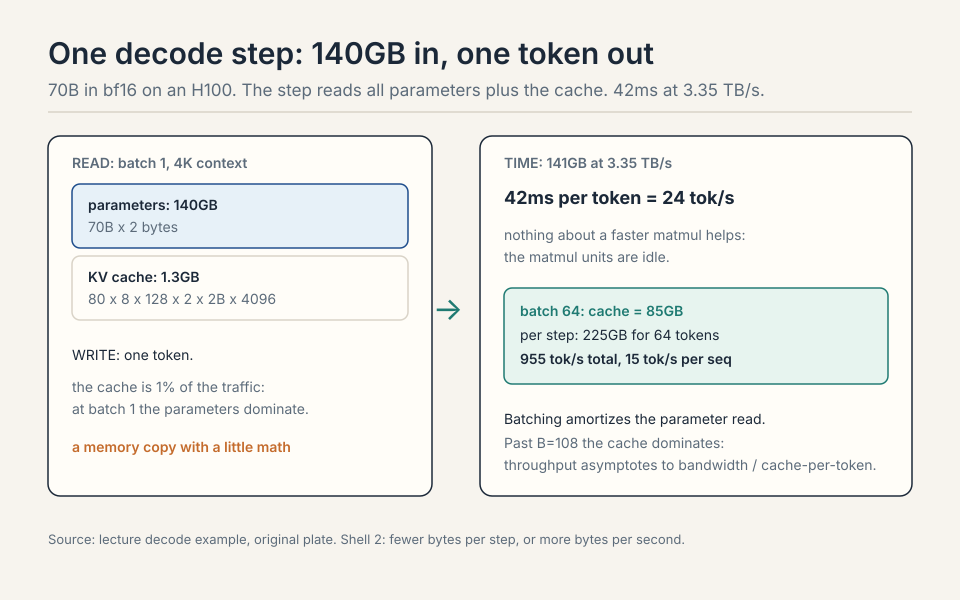
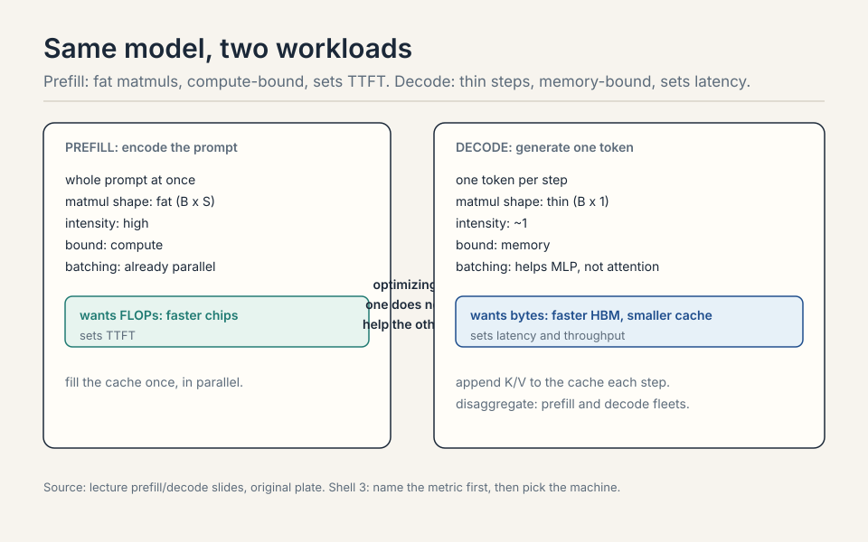
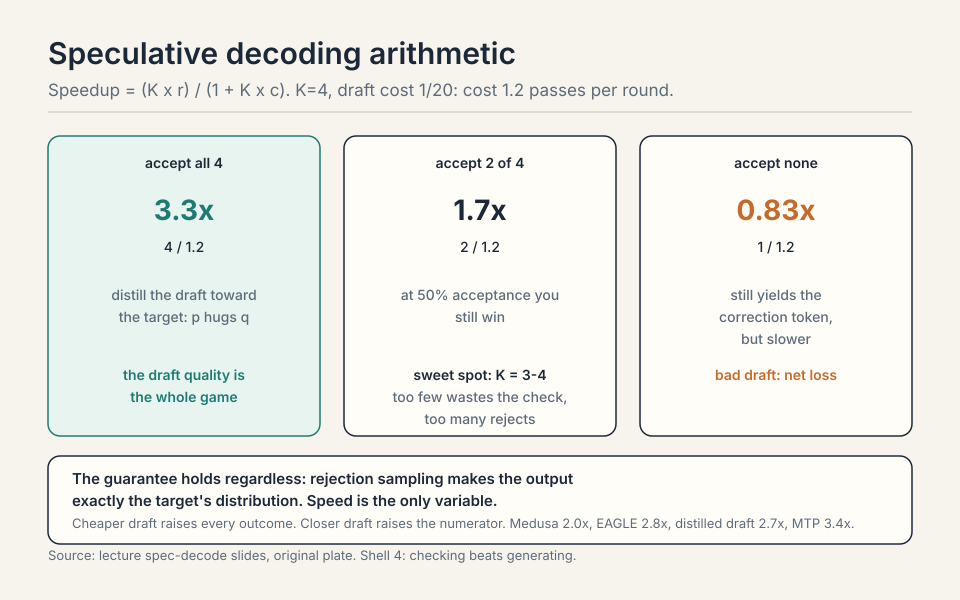
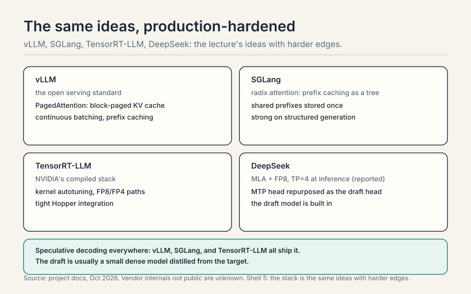
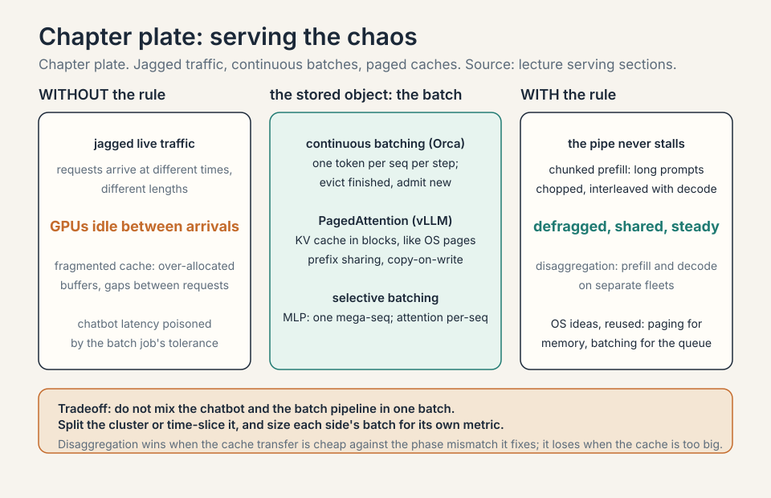

### Coverage and sourcing

This lesson follows Lecture 10 of Stanford CS336 (Language Modeling
from Scratch, Spring 2026, instructor Percy Liang), "Inference,"
delivered April 29, 2026, duration 1:25:21. It uses the official
subtitle transcript and the Google scaling book's transformers and
inference chapter, which supplies much of the math and some figures.
Every timestamped claim below comes from the lecture. Figures marked
October 2026 are updates added after the session, each with its
source: the DeepSeek-V3 technical report, vLLM/SGLang/TensorRT-LLM
project docs, current as of October 2026. Vendor serving internals
that are not public are marked unknown, never asserted. The coverage
map at the end of the chapter maps every major lecture claim to the
section that covers it, with file line numbers.

## The problem: inference has no ceiling

Training is a one-time cost. Inference is a daily cost, and in the
agentic world it has no ceiling. OpenAI serves an estimated 8.6
trillion tokens a day. DeepSeek-V4 trained on 32 trillion tokens:
under four days of inference matches a frontier training run
[02:01](ts:02:01). Chatbots had a natural speed limit: humans read
slowly. Agents have none: most tokens are never read, they are compute
spend [03:20](ts:03:20). A 10% speedup is a big deal.

```ascii
OpenAI      : ~8.6 trillion tokens per day
DeepSeek-V4 : trained on 32T tokens = under 4 days of OpenAI inference
chatbots    : humans read slowly, a natural speed limit
agents      : no reading, tokens are pure compute spend
```

## Name the metric first

Three questions, three answers.


- **TTFT**, time to first token: the wait before anything appears.
  Interactive UX.
- **Latency**: seconds per token for one query. Streaming speed.
- **Throughput**: tokens per second across many queries. Batch jobs.

Latency and throughput usually improve together, but batch size pits
them against each other, as we will see.

## First attempt: run training code to generate

Training sees the whole sequence: the sequence is just a tensor
dimension, matmuls stay fat. The naive way to generate: run the same
code one token at a time, recomputing everything for every new token.


Work the cost. Generating token t attends over t previous tokens:
O(t^2) work per step. Sum over T steps: O(T^3) total
[21:36](ts:21:36). At T = 1000, that is 1e9 attention operations to
produce a paragraph. The recomputation is pure waste: the past never
changes.

The deeper break is structural. Inference is autoregressive: one token
at a time, no parallelization across the sequence. Each step is a
matrix-vector product: thin, with arithmetic intensity near 1
[07:50](ts:07:50). The H100 needs intensity ~295 to saturate (Lecture
2). Generation sits 300x below that. The chip waits on memory.

## The key question

The past never changes in a causal model. Token i's keys and values
depend only on tokens up to i. Appending token i+1 cannot change them.
What if we never recompute the past? That is the KV cache. And once
the cache exists, a second question: what if less memory is more
speed? Everything after is answers to that.

## The KV cache: never recompute the past

Cache the keys and values of every token as they are generated. Two
phases.


**Prefill**: encode the prompt in parallel, fill the cache.
Compute-bound, like training: the whole prompt is a fat tensor.

**Decode**: generate one token, append its K/V to the cache.
Memory-bound: one thin step that rereads all parameters plus the
growing cache [23:12](ts:23:12).

Cache size: B x S x layers x KV-heads x head-dim x 2 (K and V) x 2
bytes. Work it for Llama2-13B-ish: B=1, S=4096, 40 layers, 40 KV
heads, head dim 128, bf16. 1 x 4096 x 40 x 40 x 128 x 2 x 2 = 3.36 GB.
One request, one 3.36 GB cache that gets reread every token.

> [!QA]
> Q: Why does the KV cache work for causal models but not bidirectional ones?
> A: Causality means token i's keys and values depend only on tokens up to i. Appending token i+1 cannot change them, so caching is exact. In a bidirectional model, every token attends to every other, so a new token changes all representations and the cache would be wrong. The cache is a direct consequence of the causal mask.
> Follow-up: Prefill is compute-bound, decode is memory-bound. Why?
> A: Prefill processes the whole prompt at once: B x S is large, matmuls stay fat, intensity is high. Decode handles one token: thin matvecs, intensity near 1, and every step reloads all parameters plus the growing KV cache from HBM. Same model, different workload shape, different bound.

 total, 1e9 ops for a paragraph. Center: the cache formula; prefill compute-bound, decode memory-bound. Right: prefill once, decode linear; caching is exact for causal models. Bottom: the cache is memory per token; past B=108 it dominates. Dense chapter plate. Source: original synthesis of the lecture.")

### Subchapter: the decode step, byte by byte

Work one decode step for a 70B model in bf16 on an H100. The step
reads all 70B parameters: 140GB. It reads the KV cache: batch x
length x layers x KV heads x head dim x 2 x 2 bytes. It writes one
token. At 3.35 TB/s of HBM bandwidth, 140GB takes 42ms: 24 tokens
per second per GPU, before the cache is even counted.

That is the whole workload: a memory copy with a little math
attached. Nothing about a faster matmul helps, because the matmul
units are idle. The only levers: fewer bytes per step (smaller
model, smaller cache, fewer bits) or more bytes per second (faster
HBM, more GPUs splitting the read). Every inference optimization
in this lecture is one of those two.



> [!QA]
> Q: Walk me through one decode step for a 70B model with numbers. Batch 1, 4K context, bf16, H100.
> A: Read the parameters: 70B x 2 bytes = 140GB. Read the KV cache: 80 layers x 8 KV heads x 128 dim x 2 (K,V) x 2 bytes x 4096 tokens = 1.3GB. Total per step: about 141GB. At 3.35 TB/s: 42ms per token, 24 tok/s. The cache is 1% of the traffic here: at batch 1 the parameters dominate. Now batch 64: the cache becomes 64 x 1.3GB = 85GB, and the per-step read is 225GB for 64 tokens: 15 tok/s per sequence but 955 tok/s total. Batching amortizes the parameter read across sequences. That amortization is the entire throughput game.
> Follow-up: At what batch does the cache dominate the parameters?
> A: When B x cache-per-seq exceeds 140GB: B > 108 at 4K context. Past that, each step is mostly cache traffic, and throughput asymptotes toward bandwidth divided by cache-per-token. Longer contexts hit the crossover sooner. This is why long-context serving is a cache problem, not a parameter problem.

## Intensity, precisely: attention is the wall

Notation: B batch, S context tokens, T generated tokens, D model dim,
N heads, K KV heads, H head dim, F = 4D. MLP intensity: B x T. In
prefill (T = S), large and good. In generation (T = 1), just B: fine
only with many concurrent requests [27:33](ts:27:33).

Attention intensity: S x T / (S + T). Prefill: S/2, workable.
Generation: S/(S+1), about 1. The H100 needs ~295 to saturate. This is
the bottleneck, and no batching fixes it: MLP weights are shared
across the batch (load once), but each sequence owns its KV cache (B
independent matvecs) [31:07](ts:31:07).


Summary: prefill compute-bound, generation memory-bound, generation
attention the fundamental wall [33:58](ts:33:58). Batching raises MLP
intensity linearly. Attention in generation stays at ~1 forever.

> [!QA]
> Q: Why can batching not fix the attention wall in generation?
> A: Batching shares the MLP weights: one parameter load serves B sequences, so MLP intensity rises with B. But each sequence owns its KV cache: the attention step is B independent matvecs, each at intensity ~1. Loading the cache for sequence 1 does nothing for sequence 2. So batching raises the MLP's intensity linearly and leaves attention's at 1. The wall is per-sequence, and the batch dimension cannot cross it. Only a smaller cache (GQA, grouped-query attention: share each KV head across a group of query heads. MLA, multi-head latent attention: compress K and V into a small latent vector) lowers the wall itself.
> Follow-up: Does bigger batch ever hurt attention?
> A: Yes, through memory: the cache grows linearly in B, so each step moves more bytes and latency per token worsens. Throughput still rises until memory caps the batch. The tradeoff is the bus analogy: worse per-rider latency, better total throughput. Attention sets the per-token floor that no batch can go under.

### Subchapter: prefill vs decode, one table

The asymmetry in one place.

| | Prefill | Decode |
|---|---|---|
| Work per step | whole prompt at once | one token |
| Matmul shape | fat (B x S) | thin (B x 1) |
| Intensity | high | ~1 |
| Bound | compute | memory |
| Batching | already parallel | helps MLP, not attention |
| Metric it sets | TTFT | latency, throughput |

Prefill wants FLOPs: faster chips, bigger batches of prompt tokens. Decode wants
bytes: faster HBM, smaller caches, fewer bits. Optimizing one does
not help the other. TTFT is a prefill number. Tokens per second is
a decode number. Name the metric first, then pick the machine.



## Latency vs throughput: the bus

Llama2-13B on H100, bf16. Batch 1: 0.008 s/token, 124 tok/s
[41:40](ts:41:40). Grow the batch: latency worsens (KV cache grows
linearly in B, so each step moves more bytes), throughput improves
(amortize the parameter load), asymptotically [40:35](ts:40:35).
Memory caps the batch: the KV cache eventually fills the H100.


The bus analogy: waiting for the bus is slow per rider, but the bus
moves many people. Shrinking memory helps both metrics. Only the batch
dimension forces the tradeoff [49:49](ts:49:49).

## Shrinking the KV cache: less memory is more speed

Inference is memory-bound, so every byte removed is speed gained. Four
axes of shrinking, one tradeoff each.


- **GQA**: fewer KV heads. Cache divided by N/K. K=8 keeps accuracy
  and is much faster than MHA [47:54](ts:47:54).
- **MLA** (DeepSeek): project K,V to C dims (16000 to 512), store the
  compressed latent, materialize on demand. Matches MHA accuracy, beats
  GQA [52:07](ts:52:07). Wrinkle: RoPE needs raw keys, so extra dims
  handle position.
- **CLA**: share KV across layers, like GQA shares across heads
  [55:30](ts:55:30).
- **Sliding window**: attend to the last K tokens. Cache independent
  of length. Alone it hurts accuracy. Interleaved with global layers
  (hybrid), it works [56:53](ts:56:53).
- **Linear attention / Mamba**: compress history into a fixed state.
  More expressive than sliding window. Hybrids combine all three
  [59:13](ts:59:13).

With GQA, batch 256 fits where it did not before: shrink the cache,
then spend the savings on batch size [50:06](ts:50:06). The savings
compound: smaller cache means bigger batches, bigger batches mean
higher throughput, and the latency penalty per request stays flat
until memory caps again.

> [!QA]
> Q: GQA vs MLA vs CLA: which do you pick and why?
> A: GQA is the default: divide the KV heads by N/K, keep accuracy, simple to implement, and every serving stack supports it. Pick it unless you have a reason not to. MLA is the stronger compression: project K,V to a small latent (16000 to 512 in DeepSeek's case), store the latent, materialize on demand. It beats GQA on the size-accuracy frontier but complicates RoPE (position needs raw keys, so extra dims carry it). CLA shares KV across layers: orthogonal to both, stackable. The real answer in production is combinations: GQA everywhere, MLA where the cache dominates (long context), sliding window or CLA on top. One axis is rarely enough.
> Follow-up: Why did DeepSeek pick MLA over GQA?
> A: Their bottleneck was the KV cache at long context and large batch: the 57x compression (64KB to 1.1KB per token) buys batch size that GQA's 8x cannot. The price was engineering: decoupled RoPE, the latent projection, materialization on demand. When the cache is the wall, the stronger compression wins. When simplicity and ecosystem support matter, GQA wins.

### Subchapter: MLA, the numbers

DeepSeek-V2's Multi-head Latent Attention, the strongest cache
compression in production. Standard MHA cache per token per layer:
2 (K and V) x n_heads x head_dim x 2 bytes. For DeepSeek-V2's
geometry that is about 64KB per token per layer. MLA projects the
K and V into a single compressed latent of dimension d_c = 512
(from 16000), and stores only the latent: about 1.1KB per token
per layer. Compression: 57x.

The wrinkle is RoPE. Rotary position embeddings need the raw keys:
position is applied per head, per position, before the projection
would destroy it. MLA's fix is decoupled RoPE: a small separate
key (d_h^R = 64 dims) carries the position, computed alongside the
latent. The attention then runs on the latent plus the RoPE key.
The engineering cost is real: the kernels must materialize K/V
from the latent on demand during attention, and the decoupled
position path doubles part of the bookkeeping.

The inference payoff, DeepSeek-V3's numbers: with the cache at
1.1KB per token per layer, a 60-layer model holds 66KB per token.
At 128K context: 8.4GB per sequence. The MHA equivalent would be
480GB: impossible. MLA is what makes DeepSeek's long-context
serving viable, and the absorbed variant (folding the projection
into the weights at inference) removes the materialization cost.
The lesson: when the cache is the wall, compress the cache, not
the model.

> [!QA]
> Q: Work the MLA compression. MHA cache 64KB per token per layer, MLA 1.1KB. What does that buy at 128K context?
> A: Per sequence, 60 layers: MHA is 64KB x 60 x 128K = 480GB. MLA is 1.1KB x 60 x 128K = 8.4GB. The MHA cache alone exceeds any single GPU's HBM by 6x: the request cannot be served. The MLA cache fits in a fraction of one H100. That is the 57x as a serving decision: it moves long-context inference from impossible to routine. The price was the decoupled RoPE engineering and the on-demand materialization kernels.
> Follow-up: Why not compress further, to d_c = 128?
> A: The latent is a bottleneck on the model's information: 512 dims must carry everything the attention needs about the past. Squeeze it too far and accuracy degrades: the compression is lossy in the information-theoretic sense. DeepSeek's 512 was the empirical sweet spot for their geometry. Smaller models with smaller head dims use smaller latents. The dial is accuracy per byte, and 57x was where their curve bent.

| | MHA cache | MLA cache |
|---|---|---|
| Per token per layer | 64KB | 1.1KB |
| Per sequence, 60 layers, 128K context | 480GB | 8.4GB |
| Verdict | 6x any GPU's HBM: cannot serve | fits in a fraction of one H100 |

Compression: 57x. The wrinkle: RoPE needs raw keys, so decoupled RoPE carries position in 64 extra dims. Figure: Shell 4. When the cache is the wall, compress the cache, not the model. Source: DeepSeek-V2 report, original table.

### Subchapter: KV cache quantization

The weights are not the only bytes. The cache can be quantized
too. **KIVI** (Liu et al., 2024): quantize the key cache
per-channel and the value cache per-token, to 2 bits, with almost
no accuracy loss. Why the asymmetry? Keys have large-magnitude
outlier channels: per-channel scaling tames them. Values have no
such structure: per-token scaling suffices.

Work the savings. The Llama2-13B-ish cache from the lecture: 3.36GB
per request at 4K context in bf16. KIVI at 2 bits: 8x smaller,
0.42GB. The batch that fits in the remaining HBM grows 8x, and
throughput follows. The price: the quantization runs per decode
step (the new K/V must be quantized on arrival), and the
dequantization runs inside the attention kernel. The kernels must
be written for it: this is not a free config flag.

**FP8 cache** is the coarser alternative: store K/V in FP8 (E4M3),
2x smaller than bf16, nearly free accuracy-wise, and natively
supported on Hopper. The production answer is usually FP8 first
(simple, hardware-backed), KIVI-style 2-bit where the cache still
binds (long context, big batch). The pattern repeats: the cache is
the wall, so every byte removed is speed gained, and the
quantization axis stacks with the architecture axis (GQA/MLA).

> [!QA]
> Q: Why does KIVI quantize keys per-channel but values per-token?
> A: The statistics differ. Key caches develop large-magnitude outlier channels: a few channels dominate, so per-channel scales (one scale per channel) capture the range without wasting bits. Value caches show no channel structure: the magnitudes spread evenly, so per-token scales (one scale per token) are enough and cheaper. Quantize keys per-token and the outlier channels blow out the range: every other channel gets crushed. The rule: match the quantization granularity to the outlier structure. Profile first, quantize second.
> Follow-up: KV quantization vs weight quantization: which matters more for decode?
> A: Depends on the batch. At batch 1, the weights dominate the per-step bytes (140GB vs 1.3GB cache for 70B at 4K): quantize the weights. At batch 128, the cache dominates (170GB vs 140GB): quantize the cache. The crossover batch is where B x cache-per-seq equals the weight bytes. Long context moves the crossover down. The serving stack quantizes both, because production lives on both sides of the crossover.

| | KIVI 2-bit | FP8 cache |
|---|---|---|
| Granularity | keys per-channel, values per-token | per-tensor |
| Size vs bf16 | 8x smaller | 2x smaller |
| Llama2-13B-ish cache at 4K | 3.36GB to 0.42GB | 3.36GB to 1.68GB |
| Price | quantize on arrival, dequantize in-kernel | nearly free, Hopper-native |

Figure: Shell 4. Match the granularity to the outlier structure: keys have outlier channels, values do not. Source: KIVI paper, original table.

## Quantization and pruning

Less precision, less memory, more speed.

**QAT** (quantization-aware training) simulates quantization during
training: the forward pass rounds the weights, so the weights adapt
to the rounding noise as they learn. Best accuracy at low precision.
The price: a full large-scale training run.

**PTQ** (post-training quantization) quantizes a finished model with
no retraining. The naive form picks one scale and one zero-point
(the offset that maps the quantized integers back to real values)
per tensor. Cheap, and lossy at low bit-widths: one scale cannot fit
a tensor with outliers. PTQ is the practical default because it
costs no training.

**GPTQ** sharpens PTQ layer by layer. It uses the Hessian (the
matrix of second derivatives, which measures how much the loss
curves along each weight direction) to decide the rounding order,
then compensates each rounding error into the weights not yet
quantized. Moderate cost, much smaller accuracy gap than naive PTQ.

**AWQ** (activation-aware weight quantization) protects the few
weight channels that matter. It profiles the activations, finds the
salient channels (the ones whose magnitudes dominate), keeps those
in fp16, and quantizes the rest aggressively. Moderate cost, strong
accuracy: the salient channels carry most of the signal.

| Method | Idea | Cost |
|---|---|---|
| QAT | simulate quantization during training | expensive retrain |
| PTQ naive | per-tensor scale and zero-point | cheap, lossy |
| GPTQ | Hessian-guided, layer by layer, error compensation | moderate |
| AWQ | keep salient activation channels in fp16 | moderate, strong |

QAT adapts weights to quantization noise but needs large-scale
training. PTQ is the practical default. GPTQ and AWQ close the gap
[64:33](ts:64:33). Pruning (NVIDIA): rank units and layers by
calibration activations, remove, then heal with post-training. 15B to
8B with small accuracy loss [67:39](ts:67:39). Distillation repairs any
of these Frankenstein models [69:42](ts:69:42).

## Speculative decoding: checking beats generating

Checking is faster than generating: prefill runs in parallel. Exploit
the asymmetry. A cheap draft model generates K tokens sequentially.
The big target model verifies them in one parallel pass. Accept each
with probability min(1, q/p). On reject, sample the residual. The
result is an exact sample from the target: rejection sampling with a
guarantee [71:58](ts:71:58).

. Source: lecture speculative-decoding slides, original plate.")

Work the arithmetic. Draft generates 4 tokens at 1/20th the cost each:
0.2 target-equivalents. Target verifies all 4 in one pass: 1
target-equivalent. Total 1.2 for 4 tokens: 3.3x speedup if all accept.
If half reject, the math collapses: you paid the draft plus the full
pass and gained little. Sweet spot: K = 3-4. Too few wastes the
parallel check. Too many rejects. Distill the draft toward the target:
the closer p is to q, the more accepts [76:04](ts:76:04). A shrunk
model you would not serve can still be a draft model.

### Subchapter: the speculative decoding arithmetic

The speedup has a formula. Draft K tokens at cost c per token
(relative to one target pass), verify in one target pass, accept a
fraction r. Cost per round: 1 + K x c passes. Tokens per round: K x
r. Speedup: (K x r) / (1 + K x c).

Work the lecture's numbers. K=4, c=1/20: cost 1.2 passes. Accept
all 4: 4/1.2 = 3.3x. Accept 2: 2/1.2 = 1.7x. Accept 0: the round
still yields 1 token (the correction): 1/1.2 = 0.83x, slower than
baseline: accept 4, accept 2, accept 0.

Two levers, one tradeoff. Cheaper draft (smaller c) raises every
outcome. Closer draft (higher r) raises the numerator: distillation
is the lever. Bigger K raises the ceiling but lowers r: long drafts
drift. The optimum sits at K=3-4 for most pairs. And the guarantee
holds regardless: rejection sampling makes the output exactly the
target's distribution, so speed is the only variable.



> [!QA]
> Q: Work the speculative decoding math. K=4, draft cost 1/20, acceptance 50%.
> A: Cost per round: 1 target pass + 4 x 1/20 = 1.2 passes. Expected tokens: 4 x 0.5 = 2, plus the correction token on reject keeps it near 2. Speedup: 2/1.2 = 1.7x. Now distill the draft so acceptance hits 90%: 3.6/1.2 = 3x. The draft quality is the whole game: at 50% you get 1.7x, at 90% you get 3x, at 10% you lose. K=4 is the sweet spot because longer drafts drift and shorter ones waste the parallel check.
> Follow-up: Why is the output exactly the target's distribution?
> A: Rejection sampling. Accept each draft token with probability min(1, q/p): where the draft overproposes, the target downweights. On reject, sample from the residual (q - p normalized). The math guarantees the accepted stream matches q exactly. Speed changes, quality does not. That guarantee is what makes it safe to deploy: it is an optimization, not an approximation.

### Subchapter: the draft-head family: Medusa, EAGLE, MTP

The lecture's speculative decoding uses a separate small model as
the draft. The family keeps the verify-in-parallel idea and changes
where the draft comes from.

**Medusa** (Cai et al., 2024): bolt extra heads onto the target
model itself. Each head predicts the token at position t+k from the
target's own hidden states. No separate draft model to train and
serve: the heads are fine-tuned while the backbone stays frozen.
The draft cost c drops toward zero (the heads are tiny), so the
speedup formula's denominator shrinks to ~1. The price: the heads'
accuracy lags a distilled draft model's, so the acceptance rate r
is lower. Medusa wins where serving a second model is operationally
painful.

**EAGLE** (Li et al., 2024): draft from the target's features, not
its tokens. A tiny autoregressive head consumes the target's
second-to-top hidden states and predicts the next ones: it drafts
in feature space, where the signal is richer than the token
surface. Acceptance rates beat Medusa's and approach distilled
drafts', at the cost of training the feature head against the
target's internals.

**MTP** (DeepSeek-V3's multi-token prediction): the training-time
version. V3 trains an extra module to predict two tokens ahead
alongside the main next-token loss. At inference, that module is
repurposed as the draft head for speculative decoding: the draft
was co-trained with the target from birth, so p hugs q and the
acceptance rate is high. The lesson: the best draft is the one
that trained next to the target.

Work the family's speedups with the formula (K x r) / (1 + K x c),
K=4 throughout, r and c as worked toys. Medusa: r=0.5, c near 0:
(4 x 0.5) / 1.0 = 2.0x. EAGLE: r=0.75 (beats Medusa's 0.5,
approaches a distilled draft's 0.8), c=1/50 for the tiny feature
head: (4 x 0.75) / (1 + 0.08) = 3.0 / 1.08 = 2.8x. MTP: r=0.85
(p hugs q from co-training), c near 0: (4 x 0.85) / 1.0 = 3.4x.
Compare the separate distilled draft from the Q&A below: r=0.8,
c=1/20: 3.2 / 1.2 = 2.7x. The ranking: MTP 3.4x, EAGLE 2.8x,
distilled draft 2.7x, Medusa 2.0x. The draft's origin moves r,
and r moves the speedup.

The family tree: separate draft model (lecture default, highest r,
extra serving cost), Medusa heads (c near zero, lower r, no second
model), EAGLE feature head (better r than Medusa, needs target
internals), MTP (co-trained, highest r, needs training-time
support). The verification math is identical in all four: draft
cheap, verify in parallel, accept with min(1, q/p). Only the
draft's origin changes.

> [!QA]
> Q: Medusa vs a separate distilled draft model: which wins?
> A: It depends on which term of the speedup formula binds. The separate draft has higher acceptance r (it was distilled toward the target) but nonzero cost c and the operational cost of serving a second model. Medusa's heads have c near zero (tiny heads on the frozen backbone) but lower r (heads are weaker predictors). Work it: separate draft r=0.8, c=1/20, K=4: speedup = 3.2/1.2 = 2.7x. Medusa r=0.5, c~0, K=4: speedup = 2.0/1.0 = 2.0x. The separate draft wins on speed, Medusa wins on operations (one model to serve, no draft training pipeline). EAGLE and MTP push r back up while keeping c low: the family converges on high-r, low-c drafts.
> Follow-up: Why does MTP's co-training give the highest acceptance?
> A: Because p and q were shaped by the same training run. The MTP module learned to predict two tokens ahead from the same hidden states the main head uses for one token ahead: its distribution p is the target's own forward model, not an approximation learned after the fact. Distillation tries to match q after training. MTP grew up with q. The closer p is to q, the more accepts. Co-training is distillation with no gap.

| | Medusa | EAGLE | Distilled draft | MTP |
|---|---|---|---|---|
| Draft origin | heads on the target | feature head | separate small model | co-trained module |
| r (K=4) | 0.5 | 0.75 | 0.8 | 0.85 |
| c | ~0 | 1/50 | 1/20 | ~0 |
| Speedup | 2.0x | 2.8x | 2.7x | 3.4x |

Figure: Shell 4. The draft's origin moves r, and r moves the speedup. The verification math is identical in all four. Source: original worked toys.

; check beats generate. Right: MLA moves 128K context from impossible to routine; spec decode hits 3.3x with exact samples. Bottom: every shrink trades something. Dense chapter plate. Source: original synthesis of the lecture.")

## Serving the chaos

Live traffic is jagged: requests arrive at different times with
different lengths. **Continuous batching** (Orca): decode one token per
sequence per step, evict finished sequences, admit new ones
[77:30](ts:77:30). **Selective batching**: MLP layers concatenate all
sequences into one mega-sequence. Attention stays per-sequence
[78:51](ts:78:51).


**PagedAttention** (vLLM): store the KV cache in non-contiguous
blocks, like OS pages. Kills internal fragmentation (over-allocated
buffers) and external fragmentation (gaps between requests). Bonus:
prefix sharing. Same system prompt? Cache it once. Multiple samples?
Share the prompt blocks, copy-on-write on divergence
[79:34](ts:79:34).

> [!QA]
> Q: You have a live chatbot and a batch document pipeline on one cluster. How do you split it?
> A: The chatbot wants latency and TTFT: small batches, fast prefill, continuous batching to keep GPUs busy between arrivals. The pipeline wants throughput: big batches, amortized parameter loads, memory as the only cap. Do not mix them in one batch: the batch job's latency tolerance would poison the chatbot's. Split the cluster or time-slice it, and size each side's batch for its own metric.
> Follow-up: When is speculative decoding a win?
> A: When the draft is cheap and close to the target. If p rarely matches q, you pay the draft cost plus a full target pass per token and gain nothing. Distillation is the lever: a well-distilled small model accepts often, and the parallel verification turns sequential generation into batched checking. Memory-bound targets benefit most, since the verification pass is the cheap part.

### Subchapter: what is used where (the serving stack)

The lecture's ideas, production-hardened.

- **vLLM**: the open serving standard. PagedAttention (the paper's
  block-paged KV cache), continuous batching, prefix caching. If you
  serve open models, you start here.
- **SGLang**: radix attention generalizes prefix caching into a
  tree: shared prefixes across requests are stored once. Strong on
  structured generation and long shared contexts.
- **TensorRT-LLM**: NVIDIA's compiled stack. Kernel autotuning,
  FP8/FP4 paths, tight Hopper integration. The choice inside
  NVIDIA-flavored clouds.
- **DeepSeek**: MLA plus FP8 training carried into serving, tensor
  parallel 4 at inference (reported), and the MTP head repurposed
  for speculative decoding (per the V3 report). The draft model is
  built in.
- **Speculative decoding everywhere**: vLLM, SGLang, and
  TensorRT-LLM all ship it. The draft is usually a small dense
  model distilled from the target.

The stack is the same ideas with harder edges: the cache is paged,
the batch is continuous, the draft is distilled, the kernels are
autotuned.



> [!QA]
> Q: Size the GPUs for serving Llama-3-70B at 1000 tok/s. H100s, bf16, 4K context.
> A: Per GPU, one decode step reads 140GB of parameters. At 3.35 TB/s that is 42ms per step. Per step, batch B produces B tokens, so throughput is B / 0.042s, minus the cache traffic. Cache per sequence at 4K: 80 layers x 8 KV heads x 128 x 2 x 2B x 4096 = 1.3GB. At batch 64: per step read = 140 + 64 x 1.3 = 223GB, 67ms per step, 64 tokens per 67ms = 955 tok/s per GPU. So one H100 nearly does it at batch 64. Take two for headroom, TTFT, and the chatbot's latency needs. The cache at batch 64 is 85GB: it fits in the remaining HBM after the 140GB of weights. That is the sizing loop: batch for throughput, cache for memory, GPUs for headroom.
> Follow-up: What changes at 128K context?
> A: Everything. The cache per sequence grows 32x to 42GB: batch 64 no longer fits. You drop to batch ~8 per GPU, throughput collapses, and the cache dominates the parameter read. The fixes: MLA-style compression, context parallel across GPUs, or sliding-window attention to bound the cache. Long context is a cache problem wearing a serving problem's clothes.

### Subchapter: prefill-decode disaggregation

Prefill is compute-bound. Decode is memory-bound. One GPU doing
both compromises both: the prefill's fat matmuls want FLOPs, the
decode's thin steps want bandwidth, and mixing them in one batch
forces one schedule for two workloads. **Disaggregation**
(Splitwise, DistServe): put prefill on some GPUs and decode on
others, and ship the KV cache between them.

The mechanism: the prefill GPU encodes the prompt, builds the KV
cache, and sends it over the interconnect to a decode GPU, which
generates tokens. The prefill fleet is sized for TTFT: enough
FLOPs to absorb prompt bursts. The decode fleet is sized for
throughput: enough HBM for the caches. Each fleet runs the
schedule its phase wants: prefills batch for compute, decodes batch
for memory.

Work the tradeoff. The cache transfer costs bytes: per request,
layers x cache-per-token x prompt-length. At 4K context on a 70B
model: 80 x 8 x 128 x 2 x 2 x 4096 = 1.3GB per request over
NVLink/InfiniBand. At 1.8 TB/s that is under 1ms: negligible
against a 42ms decode step. At 128K context: 42GB per request,
23ms on NVLink, seconds on slow links. Disaggregation wins when
the transfer is cheap against the phase mismatch it fixes, and
loses when the cache is too big to move. The interconnect decides,
as always.

| | 4K context, 70B | 128K context, 70B |
|---|---|---|
| Cache to transfer | 1.3GB per request | 42GB per request |
| Transfer at 1.8 TB/s | under 1ms: negligible | 23ms: hurts |
| Verdict | disaggregate | the link decides |

Figure: Shell 5. Disaggregation wins when the transfer is cheap against the phase mismatch it fixes. Source: original worked toy.

### Subchapter: chunked prefill

The TTFT problem: a 128K prompt's prefill is one giant fat matmul
that blocks every decode in the batch. TTFT spikes, latency SLOs
die. **Chunked prefill** (Sarathi-Serve): split the long prompt
into chunks (say 512 tokens each) and interleave one chunk with
the decode batch per step.

The mechanism: each step processes the decode batch's one token
plus one prefill chunk. The prefill chunk is a small fat matmul:
compute-efficient enough, and bounded in time. The decode tokens
keep flowing: their latency stays flat while the long prompt
fills its cache over many steps. TTFT for the long request rises
(it waits for all its chunks), but every other request's latency
is protected.

Work the bound. A 128K prompt at 512-token chunks: 256 chunks.
Each step adds one chunk's compute to the batch: roughly 512/4096
of a full 4K prefill's work. The decode batch of 64 sees its step
time grow by ~12%: tolerable. Without chunking, the 128K prefill
is 32x a 4K prefill: the decode batch stalls for the whole
thing. Chunked prefill is the same idea as micro-batching in
pipeline parallel: chop the big unit so the pipe never stalls.
Different lecture, same schedule.

> [!QA]
> Q: Disaggregation vs chunked prefill: which fixes the long-prompt problem?
> A: Different problems. Chunked prefill fixes head-of-line blocking: the long prompt's prefill no longer stalls everyone else's decodes, because it is chopped into bounded chunks interleaved with the batch. Disaggregation fixes the phase mismatch: prefill and decode run on separate fleets, each scheduled for its own bound. They compose: a disaggregated prefill fleet can still chunk its long prompts. The long prompt's own TTFT is not fixed by either: it still waits for all its chunks. What is fixed is everyone else's latency, and the fleet's utilization.
> Follow-up: When does disaggregation lose?
> A: When the cache transfer costs more than the mismatch it fixes. The transfer is layers x cache-per-token x prompt-length bytes per request. At 128K context on slow interconnect, that is tens of GB per request: the prefill GPU spends longer sending than it saved by specializing. Disaggregation also needs two fleets with independent autoscaling: operational complexity. The rule: disaggregate when the interconnect is fast (NVLink/InfiniBand) and the phases' optimal batch shapes differ a lot. Colocate when the cache is small or the link is slow.



## Mapping back: what each technique fixes

| Pain | Technique | How |
|---|---|---|
| O(T^3) recomputation | KV cache | Prefill once in parallel, decode linear. Causal past never changes. |
| Intensity ~1 in decode | Shrink the cache | Less memory per token is more tokens per second. |
| Cache too big for batch | GQA / MLA / CLA | Fewer heads, compressed latent, shared layers. |
| Context unbounded | Sliding window | Cache independent of length. Hybrid with global layers. |
| Memory traffic per step | Quantization | Fewer bytes per weight. GPTQ/AWQ close the accuracy gap. |
| Sequential generation | Speculative decoding | Draft cheap, verify in parallel. Exact samples, K=3-4. |
| Jagged live traffic | Continuous batching | Evict finished, admit new. One token per sequence per step. |
| Fragmented cache memory | PagedAttention | Blocks like OS pages. Prefix sharing, copy-on-write. |

## The honest price

The 8.6T tokens/day figure is an estimate. Llama2 numbers are a worked
example, not a benchmark. Accuracy claims for GQA vs MLA come from
specific models: take with a grain of salt, per the lecture. Every
shrinking technique trades something: MLA complicates RoPE, sliding
windows hurt accuracy alone, quantization needs calibration, pruning
needs healing. Speculative decoding is a net loss with a bad draft.
And the deepest price: this lecture optimizes serving a fixed model.
It cannot fix a model that was trained wrong. That is the data and
scaling lectures' job.

## Coverage map: every lecture claim and where it lives

| Lecture claim | Covered in | File line |
|---|---|---|
| Inference has no ceiling: 8.6T tokens/day, agents removed the speed limit | The problem: inference has no ceiling | L44 |
| DeepSeek-V4's 32T training tokens = under 4 days of OpenAI inference | The problem: inference has no ceiling | L44 |
| Three metrics: TTFT, latency, throughput | Name the metric first | L61 |
| Batch pits latency against throughput | Name the metric first | L61 |
| Naive generation: run training code one token at a time, O(T^3) | First attempt: run training code to generate | L75 |
| Autoregressive: intensity near 1, 300x below the H100's 295 | First attempt: run training code to generate | L75 |
| Key question: the past never changes, so never recompute it | The key question | L95 |
| KV cache: prefill in parallel (compute-bound), decode one token (memory-bound) | The KV cache: never recompute the past | L103 |
| Cache size formula; Llama2-13B-ish worked at 3.36 GB | The KV cache: never recompute the past | L103 |
| The decode step, byte by byte: 70B in bf16, 140GB read, 24 tok/s | the decode step, byte by byte | L128 |
| Batch amortization: the entire throughput game | the decode step, byte by byte | L128 |
| MLP intensity: B x T; attention intensity: S x T / (S + T) | Intensity, precisely: attention is the wall | L151 |
| Generation attention sits at ~1; batching cannot fix it | Intensity, precisely: attention is the wall | L151 |
| Prefill vs decode: one table | prefill vs decode, one table | L176 |
| Latency vs throughput: the bus; memory caps the batch | Latency vs throughput: the bus | L196 |
| GQA: fewer KV heads, cache divided by N/K | Shrinking the KV cache: less memory is more speed | L210 |
| MLA: project K,V to latent, 57x; RoPE needs raw keys | Shrinking the KV cache: less memory is more speed | L210 |
| CLA: share KV across layers | Shrinking the KV cache: less memory is more speed | L210 |
| Sliding window: cache independent of length; hybrid with global layers | Shrinking the KV cache: less memory is more speed | L210 |
| Linear attention / Mamba: fixed state; hybrids | Shrinking the KV cache: less memory is more speed | L210 |
| MLA, the numbers: 64KB to 1.1KB per token per layer | MLA, the numbers | L244 |
| Decoupled RoPE: the position fix | MLA, the numbers | L244 |
| KV cache quantization: KIVI 2-bit, FP8 cache | KV cache quantization | L278 |
| Quantization: QAT, PTQ, GPTQ, AWQ | Quantization and pruning | L309 |
| Pruning 15B to 8B; distillation heals | Quantization and pruning | L309 |
| Speculative decoding: draft K, verify in parallel, accept min(1,q/p) | Speculative decoding: checking beats generating | L351 |
| The arithmetic: (K x r) / (1 + K x c); K=3-4 | the speculative decoding arithmetic | L371 |
| The draft-head family: Medusa, EAGLE, MTP | the draft-head family: Medusa, EAGLE, MTP | L398 |
| Continuous batching (Orca); selective batching | Serving the chaos | L455 |
| PagedAttention: blocks like OS pages; prefix sharing | Serving the chaos | L455 |
| The serving stack: vLLM, SGLang, TensorRT-LLM, DeepSeek | what is used where (the serving stack) | L479 |
| Prefill-decode disaggregation: Splitwise, DistServe | prefill-decode disaggregation | L512 |
| Chunked prefill: Sarathi, interleave chunks with decode | chunked prefill | L539 |
| Mapping table: pain, technique, how | Mapping back: what each technique fixes | L570 |
| Honest price: estimates, worked examples, tradeoffs | The honest price | L583 |

## Recap: the whole lesson on one screen

The story in eight steps. Each step answers the one before it.

1. **Inference has no ceiling.** 8.6T tokens/day. Training is
   one-time, inference is daily. Agents removed the reading speed
   limit.
2. **Name the metric.** TTFT for the wait, latency for the stream,
   throughput for the job. Batch trades latency against throughput.
3. **Naive generation is O(T^3).** Recompute everything per token.
   Autoregressive: one token at a time, intensity near 1, 300x below
   the H100's 295.
4. **Cache the past.** Causal models never change the past. Prefill in
   parallel (compute-bound), decode one token (memory-bound).
5. **Attention is the wall.** MLP intensity scales with batch.
   Generation attention sits at ~1, and batching cannot help: each
   sequence owns its cache.
6. **Shrink the cache.** GQA shares heads, MLA compresses to a
   latent, CLA shares layers, sliding window bounds the past. Less
   memory is more speed. Spend savings on batch.
7. **Check beats generate.** Draft K tokens cheap, verify in parallel,
   accept with min(1,q/p). Exact samples. K=3-4. Distill the draft.
8. **Batch the chaos.** Continuous batching fills gaps. PagedAttention
   defrags the cache and shares prefixes. OS ideas, reused.

## Go deeper

<div style="position:relative;padding-bottom:56.25%;height:0;overflow:hidden;max-width:100%;margin:16px 0;">
<iframe style="position:absolute;top:0;left:0;width:100%;height:100%;" src="https://www.youtube-nocookie.com/embed/emZxqRScfc0" title="Build KV Cache Layer From Scratch That Makes LLMs 20x Faster" frameborder="0" allow="accelerometer; autoplay; clipboard-write; encrypted-media; gyroscope; picture-in-picture" allowfullscreen></iframe>
</div>
- Build KV Cache Layer From Scratch That Makes LLMs 20x Faster, Rahul Pandey (the embed above): https://www.youtube.com/watch?v=emZxqRScfc0
- Kwon et al., PagedAttention: https://arxiv.org/abs/2305.13245
- Leviathan et al., Speculative Decoding: https://arxiv.org/abs/2211.05102
- vLLM project: https://github.com/vllm-project/vllm

## Official sources and further reading

**Official:**
- Lecture 10 video.
- Google scaling book, inference chapter: much of the math and some
  figures.

**Further reading:**
- vLLM / PagedAttention paper. Orca (continuous batching).
- GQA paper (2023). DeepSeek-V2 (MLA). Speculative decoding papers.
- GPTQ, AWQ papers for quantization.

**Caveats from these sources.** The 8.6T tokens/day figure is an
estimate. Llama2 numbers are a worked example, not a benchmark.
Accuracy claims for GQA vs MLA come from specific models: take with a
grain of salt, per the lecture.

## Connections to the other courses

- **CS336 L04:** MLA, GQA, sliding window, linear attention
  originated as architecture choices. Here they pay off in serving.
- **CS336 L09:** overtraining for serving is the economic reason this
  lecture exists.
- **CS329H:** RL rollouts are inference workloads: every speedup here
  compounds there.
