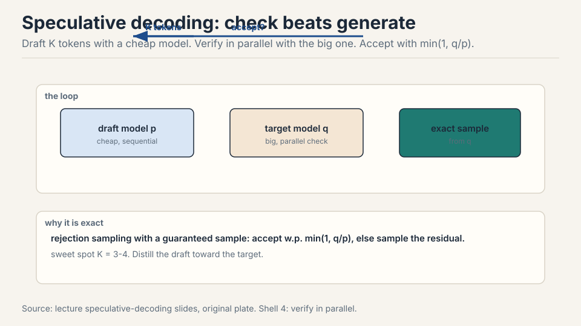

## How to read this lesson

Training is a one-time cost. Inference is a daily cost, and in the
agentic world it has no ceiling. **Level 1 (Core):** metrics, why
inference is memory-bound, the KV cache. **Level 2 (Deep):** shrinking
the cache, quantization, speculative decoding, serving systems.

## Level 1: Why inference matters now

OpenAI serves an estimated 8.6 trillion tokens a day. DeepSeek-V4
trained on 32 trillion: under four days of inference matches a
frontier training run [02:01](ts:02:01). Chatbots had a natural speed
limit: humans read slowly. Agents have none: most tokens are never
read, they are compute spend [03:20](ts:03:20). A 10% speedup is a big
deal.

```ascii
OpenAI      : ~8.6 trillion tokens per day
DeepSeek-V4 : trained on 32T tokens = under 4 days of OpenAI inference
chatbots    : humans read slowly, a natural speed limit
agents      : no reading, tokens are pure compute spend
```

## Level 1: Three metrics


- **TTFT**, time to first token: the wait before anything appears.
  Interactive UX.
- **Latency**: seconds per token for one query. Streaming speed.
- **Throughput**: tokens per second across many queries. Batch jobs.

Latency and throughput usually improve together, but batch size pits
them against each other, as we will see.

## Level 1: The fundamental asymmetry


Training sees the whole sequence: the sequence is just a tensor
dimension, matmuls stay fat. Inference is autoregressive: one token at
a time, no parallelization across the sequence, arithmetic intensity
collapses [07:50](ts:07:50).

## Level 1: The KV cache

Naive generation recomputes everything per token: attention is O(T^2)
per step, O(T^3) total [21:36](ts:21:36). But causal models never
change the past: cache the keys and values.


Two phases. **Prefill**: encode the prompt in parallel, fill the
cache, compute-bound like training. **Decode**: generate one token,
append its K/V, memory-bound [23:12](ts:23:12). Cache size: B x S x
layers x KV-heads x head-dim x 2 (K,V) x 2 bytes.

> [!QA]
> Q: Why does the KV cache work for causal models but not bidirectional ones?
> A: Causality means token i's keys and values depend only on tokens up to i. Appending token i+1 cannot change them, so caching is exact. In a bidirectional model, every token attends to every other, so a new token changes all representations and the cache would be wrong. The cache is a direct consequence of the causal mask.
> Follow-up: Prefill is compute-bound, decode is memory-bound. Why?
> A: Prefill processes the whole prompt at once: B x S is large, matmuls stay fat, intensity is high. Decode handles one token: thin matvecs, intensity near 1, and every step reloads all parameters plus the growing KV cache from HBM. Same model, different workload shape, different bound.

## Level 1: Intensity, precisely

Notation: B batch, S context tokens, T generated tokens, D model dim,
N heads, K KV heads, H head dim, F = 4D. MLP intensity: B x T. In
prefill (T = S), large and good. In generation (T = 1), just B: fine
only with many concurrent requests [27:33](ts:27:33).

Attention intensity: S x T / (S + T). Prefill: S/2, workable.
Generation: S/(S+1), about 1. H100 needs ~295 to saturate. This is the
bottleneck, and no batching fixes it: MLP weights are shared across
the batch (load once), but each sequence owns its KV cache (B
independent matvecs) [31:07](ts:31:07).


Summary: prefill compute-bound, generation memory-bound, generation
attention the fundamental wall [33:58](ts:33:58).

## Level 1: Latency vs throughput

Llama2-13B on H100, bf16. Batch 1: 0.008 s/token, 124 tok/s
[41:40](ts:41:40). Grow the batch: latency worsens (KV cache grows
linearly in B), throughput improves (amortize the parameter load),
asymptotically [40:35](ts:40:35). Memory caps the batch: the KV cache
eventually fills the H100.


The bus analogy: waiting for the bus is slow per rider, but the bus
moves many people. Shrinking memory helps both metrics. Only the batch
dimension forces the tradeoff [49:49](ts:49:49).

## Level 2: Shrinking the KV cache

Inference is memory-bound, so less memory is more speed. The game:
shrink the cache without hurting accuracy.


- **GQA**: fewer KV heads. KV cache divided by N/K. K=8 keeps accuracy
  and is much faster than MHA [47:54](ts:47:54).
- **MLA** (DeepSeek): project K,V to C dims (16000 to 512), store the
  compressed latent, materialize on demand. Matches MHA accuracy, beats
  GQA [52:07](ts:52:07). Wrinkle: RoPE needs raw keys, so extra dims
  handle position.
- **CLA**: share KV across layers, like GQA shares across heads
  [55:30](ts:55:30).
- **Sliding window**: attend to the last K tokens. Cache independent
  of length. Alone it hurts accuracy. Interleaved with global layers
  (hybrid), it works [56:53](ts:56:53).
- **Linear attention / Mamba**: compress history into a fixed state.
  More expressive than sliding window. Hybrids combine all three
  [59:13](ts:59:13).

With GQA, batch 256 fits where it did not before: shrink the cache,
then spend the savings on batch size [50:06](ts:50:06).

## Level 2: Quantization and pruning

Less precision, less memory, more speed. Options:

| Method | Idea | Cost |
|---|---|---|
| QAT | simulate quantization during training | expensive retrain |
| PTQ naive | per-tensor scale and zero-point | cheap, lossy |
| GPTQ | Hessian-guided, layer by layer, error compensation | moderate |
| AWQ | keep salient activation channels in fp16 | moderate, strong |

QAT adapts weights to quantization noise but needs large-scale
training. PTQ is the practical default. GPTQ and AWQ close the gap
[64:33](ts:64:33). Pruning (NVIDIA): rank units and layers by
calibration activations, remove, then heal with post-training. 15B to
8B with small accuracy loss [67:39](ts:67:39). Distillation repairs any
of these Frankenstein models [69:42](ts:69:42).

## Level 2: Speculative decoding

Checking is faster than generating: prefill runs in parallel. Exploit
the asymmetry. A cheap draft model generates K tokens sequentially.
The big target model verifies them in one parallel pass. Accept each
with probability min(1, q/p). On reject, sample the residual. The
result is an exact sample from the target: rejection sampling with a
guarantee [71:58](ts:71:58).

.")

Sweet spot: K = 3-4. Too few wastes the parallel check. Too many
rejects. Distill the draft toward the target: the closer p is to q,
the more accepts [76:04](ts:76:04). A shrunk model you would not serve
can still be a draft model.

## Level 2: Serving the chaos

Live traffic is jagged: requests arrive at different times with
different lengths. **Continuous batching** (Orca): decode one token
per sequence per step, evict finished sequences, admit new ones
[77:30](ts:77:30). **Selective batching**: MLP layers concatenate all
sequences into one mega-sequence. Attention stays per-sequence
[78:51](ts:78:51).


**PagedAttention** (vLLM): store the KV cache in non-contiguous
blocks, like OS pages. Kills internal fragmentation (over-allocated
buffers) and external fragmentation (gaps between requests). Bonus:
prefix sharing. Same system prompt? Cache it once. Multiple samples?
Share the prompt blocks, copy-on-write on divergence
[79:34](ts:79:34).

> [!QA]
> Q: You have a live chatbot and a batch document pipeline on one cluster. How do you split it?
> A: The chatbot wants latency and TTFT: small batches, fast prefill, continuous batching to keep GPUs busy between arrivals. The pipeline wants throughput: big batches, amortized parameter loads, memory as the only cap. Do not mix them in one batch: the batch job's latency tolerance would poison the chatbot's. Split the cluster or time-slice it, and size each side's batch for its own metric.
> Follow-up: When is speculative decoding a win?
> A: When the draft is cheap and close to the target. If p rarely matches q, you pay the draft cost plus a full target pass per token and gain nothing. Distillation is the lever: a well-distilled small model accepts often, and the parallel verification turns sequential generation into batched checking. Memory-bound targets benefit most, since the verification pass is the cheap part.

## Recap: the whole lesson on one screen

<div class="recap-grid">
<div class="recap-card">

<div class="rc-body">
<strong>1. Name the metric</strong>
<p>TTFT for the wait, latency for the stream, throughput for the job.
Batch size trades latency against throughput.</p>
<p class="rc-num">Key: three speeds</p>
</div>
</div>
<div class="recap-card">

<div class="rc-body">
<strong>2. One token at a time</strong>
<p>Autoregressive generation cannot parallelize the sequence. Thin
matvecs, intensity near 1. Agents removed the reading speed limit.</p>
<p class="rc-num">Key: the asymmetry</p>
</div>
</div>
<div class="recap-card">

<div class="rc-body">
<strong>3. Cache the past</strong>
<p>Causal models never change the past. Prefill in parallel, decode
one token. Naive T^3 becomes linear decode.</p>
<p class="rc-num">Key: prefill + decode</p>
</div>
</div>
<div class="recap-card">

<div class="rc-body">
<strong>4. Attention is the wall</strong>
<p>MLP scales with batch. Generation attention: intensity ~1, and
batching cannot help. Prefill compute-bound, decode memory-bound.</p>
<p class="rc-num">Key: S/(S+1)</p>
</div>
</div>
<div class="recap-card">

<div class="rc-body">
<strong>5. The bus tradeoff</strong>
<p>Bigger batch: worse latency, better throughput, until memory caps
it. Llama2-13B: 0.008 s/token at batch 1.</p>
<p class="rc-num">Key: B/(B+const)</p>
</div>
</div>
<div class="recap-card">

<div class="rc-body">
<strong>6. Shrink without hurting</strong>
<p>GQA shares heads, MLA compresses, CLA shares layers, sliding
window bounds the past. Less memory is more speed.</p>
<p class="rc-num">Key: cache / accuracy</p>
</div>
</div>
<div class="recap-card">

<div class="rc-body">
<strong>7. Check beats generate</strong>
<p>Draft K tokens cheap, verify in parallel, accept with min(1,q/p).
Exact samples. Sweet spot K=3-4. Distill the draft.</p>
<p class="rc-num">Key: verify in parallel</p>
</div>
</div>
<div class="recap-card">

<div class="rc-body">
<strong>8. Batch the chaos</strong>
<p>Continuous batching fills gaps. PagedAttention defrags the cache
and shares prefixes. OS ideas, reused.</p>
<p class="rc-num">Key: pages, not slabs</p>
</div>
</div>
</div>

## Official sources and further reading

**Official:**
- Lecture 10 video.
- Google scaling book, inference chapter: much of the math and some
  figures.

**Further reading:**
- vLLM / PagedAttention paper. Orca (continuous batching).
- GQA paper (2023). DeepSeek-V2 (MLA). Speculative decoding papers.
- GPTQ, AWQ papers for quantization.

**Caveats from these sources.** The 8.6T tokens/day figure is an
estimate. Llama2 numbers are a worked example, not a benchmark.
Accuracy claims for GQA vs MLA come from specific models: take with a
grain of salt, per the lecture.

## Connections to the other courses

- **CS336 Lecture 4:** MLA, GQA, sliding window, linear attention
  originated as architecture choices. Here they pay off in serving.
- **CS336 Lecture 9:** overtraining for serving is the economic
  reason this lecture exists.
- **CS329H:** RL rollouts are inference workloads: every speedup here
  compounds there.

> [!CHEAT]
> **Inference cheatsheet.** Metrics: TTFT, latency, throughput. Training 1x cost, inference daily. Agents: tokens = spend, no ceiling. Asymmetry: autoregressive, no seq parallel. KV cache: naive T^3, cache K/V, prefill (parallel, compute) + decode (1 token, memory). Size: B*S*layers*KVheads*H*2*2B. Intensity: MLP B*T, attn S*T/(S+T). Prefill: BS and S/2. Generate: B and ~1. H100 needs ~295. Bottleneck: generation attention, batching cannot help. Llama2-13B/H100: B=1: 0.008s/tok, 124 tok/s. Latency ~B, throughput ~B/(B+c). Shrink KV: GQA (N/K), MLA (compress to C), CLA (layers), sliding window, linear/Mamba. Quant: QAT, PTQ, GPTQ, AWQ. Prune + heal + distill. Spec decode: draft K, verify parallel, min(1,q/p), K=3-4. Serving: continuous batching, selective batching, PagedAttention (blocks, prefix share, copy-on-write).

> [!MEMORY]
> **Inference is memory-bound.** Shrink the KV cache without hurting accuracy, then batch for your metric.
