## The problem: inference has no ceiling

Training is a one-time cost. Inference is a daily cost, and in the
agentic world it has no ceiling. OpenAI serves an estimated 8.6
trillion tokens a day. DeepSeek-V4 trained on 32 trillion tokens:
under four days of inference matches a frontier training run
[02:01](ts:02:01). Chatbots had a natural speed limit: humans read
slowly. Agents have none: most tokens are never read, they are compute
spend [03:20](ts:03:20). A 10% speedup is a big deal.

```ascii
OpenAI      : ~8.6 trillion tokens per day
DeepSeek-V4 : trained on 32T tokens = under 4 days of OpenAI inference
chatbots    : humans read slowly, a natural speed limit
agents      : no reading, tokens are pure compute spend
```

## Name the metric first

Three questions, three answers.

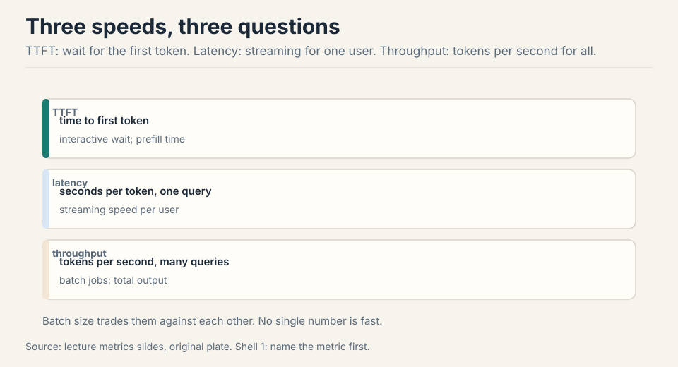

- **TTFT**, time to first token: the wait before anything appears.
  Interactive UX.
- **Latency**: seconds per token for one query. Streaming speed.
- **Throughput**: tokens per second across many queries. Batch jobs.

Latency and throughput usually improve together, but batch size pits
them against each other, as we will see.

## First attempt: run training code to generate

Training sees the whole sequence: the sequence is just a tensor
dimension, matmuls stay fat. The naive way to generate: run the same
code one token at a time, recomputing everything for every new token.

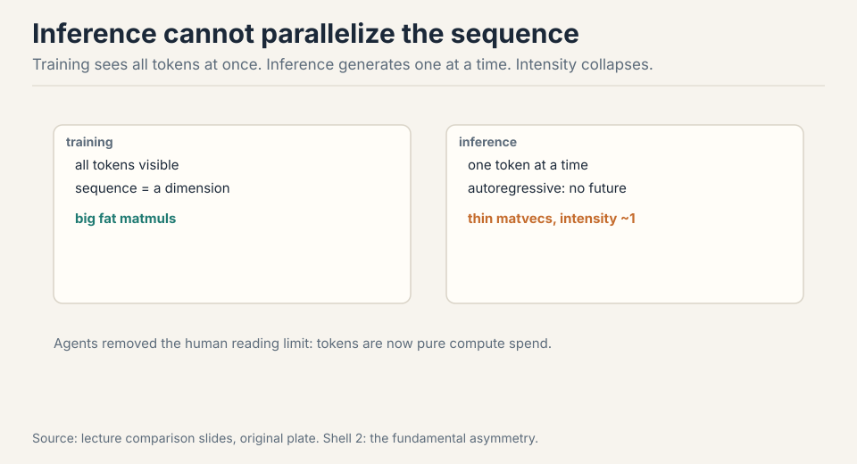

Work the cost. Generating token t attends over t previous tokens:
O(t^2) work per step. Sum over T steps: O(T^3) total
[21:36](ts:21:36). At T = 1000, that is 1e9 attention operations to
produce a paragraph. The recomputation is pure waste: the past never
changes.

The deeper break is structural. Inference is autoregressive: one token
at a time, no parallelization across the sequence. Each step is a
matrix-vector product: thin, with arithmetic intensity near 1
[07:50](ts:07:50). The H100 needs intensity ~295 to saturate (Lecture
2). Generation sits 300x below that. The chip waits on memory.

## The key question

The past never changes in a causal model. Token i's keys and values
depend only on tokens up to i. Appending token i+1 cannot change them.
What if we never recompute the past? That is the KV cache. And once
the cache exists, a second question: what if less memory is more
speed? Everything after is answers to that.

## The KV cache: never recompute the past

Cache the keys and values of every token as they are generated. Two
phases.

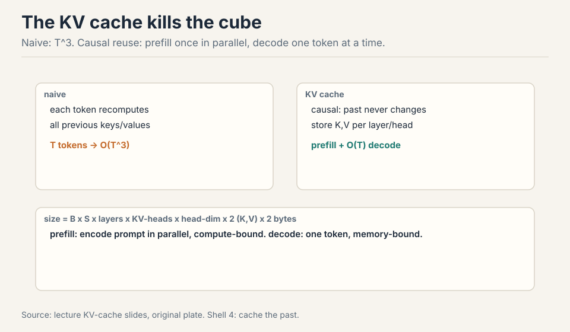

**Prefill**: encode the prompt in parallel, fill the cache.
Compute-bound, like training: the whole prompt is a fat tensor.

**Decode**: generate one token, append its K/V to the cache.
Memory-bound: one thin step that rereads all parameters plus the
growing cache [23:12](ts:23:12).

Cache size: B x S x layers x KV-heads x head-dim x 2 (K and V) x 2
bytes. Work it for Llama2-13B-ish: B=1, S=4096, 40 layers, 40 KV
heads, head dim 128, bf16. 1 x 4096 x 40 x 40 x 128 x 2 x 2 = 6.7 GB.
One request, one 6.7 GB cache that gets reread every token.

> [!QA]
> Q: Why does the KV cache work for causal models but not bidirectional ones?
> A: Causality means token i's keys and values depend only on tokens up to i. Appending token i+1 cannot change them, so caching is exact. In a bidirectional model, every token attends to every other, so a new token changes all representations and the cache would be wrong. The cache is a direct consequence of the causal mask.
> Follow-up: Prefill is compute-bound, decode is memory-bound. Why?
> A: Prefill processes the whole prompt at once: B x S is large, matmuls stay fat, intensity is high. Decode handles one token: thin matvecs, intensity near 1, and every step reloads all parameters plus the growing KV cache from HBM. Same model, different workload shape, different bound.

### Subchapter: the decode step, byte by byte

Work one decode step for a 70B model in bf16 on an H100. The step
reads all 70B parameters: 140GB. It reads the KV cache: batch x
length x layers x KV heads x head dim x 2 x 2 bytes. It writes one
token. At 3.35 TB/s of HBM bandwidth, 140GB takes 42ms: 24 tokens
per second per GPU, before the cache is even counted.

That is the whole workload: a memory copy with a little math
attached. Nothing about a faster matmul helps, because the matmul
units are idle. The only levers: fewer bytes per step (smaller
model, smaller cache, fewer bits) or more bytes per second (faster
HBM, more GPUs splitting the read). Every inference optimization
in this lecture is one of those two.

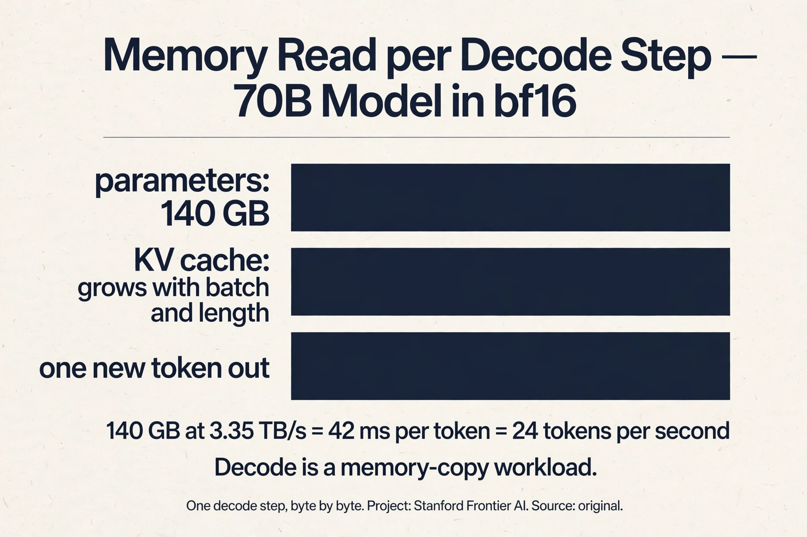

> [!QA]
> Q: Walk me through one decode step for a 70B model with numbers. Batch 1, 4K context, bf16, H100.
> A: Read the parameters: 70B x 2 bytes = 140GB. Read the KV cache: 80 layers x 8 KV heads x 128 dim x 2 (K,V) x 2 bytes x 4096 tokens = 1.3GB. Total per step: about 141GB. At 3.35 TB/s: 42ms per token, 24 tok/s. The cache is 1% of the traffic here: at batch 1 the parameters dominate. Now batch 64: the cache becomes 64 x 1.3GB = 85GB, and the per-step read is 225GB for 64 tokens: 15 tok/s per sequence but 955 tok/s total. Batching amortizes the parameter read across sequences. That amortization is the entire throughput game.
> Follow-up: At what batch does the cache dominate the parameters?
> A: When B x cache-per-seq exceeds 140GB: B > 108 at 4K context. Past that, each step is mostly cache traffic, and throughput asymptotes toward bandwidth divided by cache-per-token. Longer contexts hit the crossover sooner. This is why long-context serving is a cache problem, not a parameter problem.

## Intensity, precisely: attention is the wall

Notation: B batch, S context tokens, T generated tokens, D model dim,
N heads, K KV heads, H head dim, F = 4D. MLP intensity: B x T. In
prefill (T = S), large and good. In generation (T = 1), just B: fine
only with many concurrent requests [27:33](ts:27:33).

Attention intensity: S x T / (S + T). Prefill: S/2, workable.
Generation: S/(S+1), about 1. The H100 needs ~295 to saturate. This is
the bottleneck, and no batching fixes it: MLP weights are shared
across the batch (load once), but each sequence owns its KV cache (B
independent matvecs) [31:07](ts:31:07).

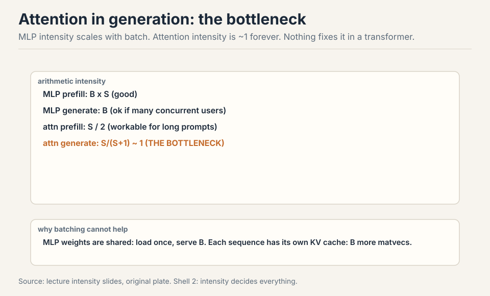

Summary: prefill compute-bound, generation memory-bound, generation
attention the fundamental wall [33:58](ts:33:58). Batching raises MLP
intensity linearly. Attention in generation stays at ~1 forever.

> [!QA]
> Q: Why can batching not fix the attention wall in generation?
> A: Batching shares the MLP weights: one parameter load serves B sequences, so MLP intensity rises with B. But each sequence owns its KV cache: the attention step is B independent matvecs, each at intensity ~1. Loading the cache for sequence 1 does nothing for sequence 2. So batching raises the MLP's intensity linearly and leaves attention's at 1. The wall is per-sequence, and the batch dimension cannot cross it. Only a smaller cache (GQA, MLA) lowers the wall itself.
> Follow-up: Does bigger batch ever hurt attention?
> A: Yes, through memory: the cache grows linearly in B, so each step moves more bytes and latency per token worsens. Throughput still rises until memory caps the batch. The tradeoff is the bus analogy: worse per-rider latency, better total throughput. Attention sets the per-token floor that no batch can go under.

### Subchapter: prefill vs decode, one table

The asymmetry in one place.

| | Prefill | Decode |
|---|---|---|
| Work per step | whole prompt at once | one token |
| Matmul shape | fat (B x S) | thin (B x 1) |
| Intensity | high | ~1 |
| Bound | compute | memory |
| Batching | already parallel | helps MLP, not attention |
| Metric it sets | TTFT | latency, throughput |

Read it as two different machines sharing one model. Prefill wants
FLOPs: faster chips, bigger batches of prompt tokens. Decode wants
bytes: faster HBM, smaller caches, fewer bits. Optimizing one does
not help the other. TTFT is a prefill number; tokens per second is
a decode number. Name the metric first, then pick the machine.

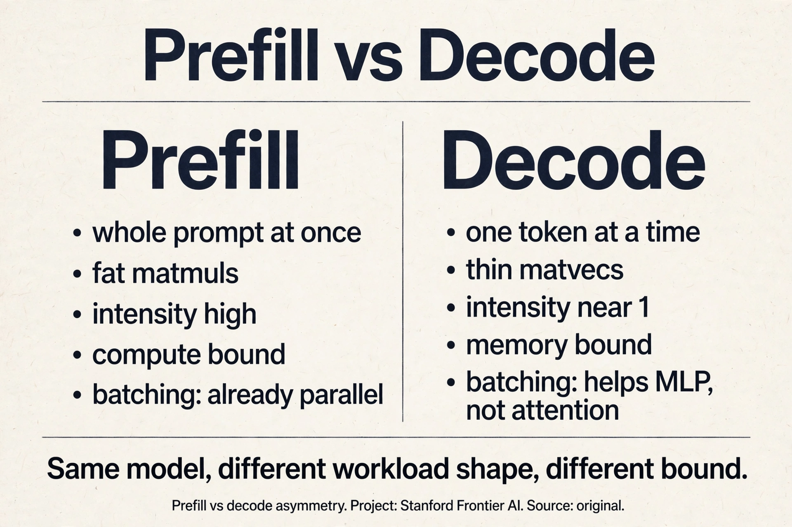

## Latency vs throughput: the bus

Llama2-13B on H100, bf16. Batch 1: 0.008 s/token, 124 tok/s
[41:40](ts:41:40). Grow the batch: latency worsens (KV cache grows
linearly in B, so each step moves more bytes), throughput improves
(amortize the parameter load), asymptotically [40:35](ts:40:35).
Memory caps the batch: the KV cache eventually fills the H100.

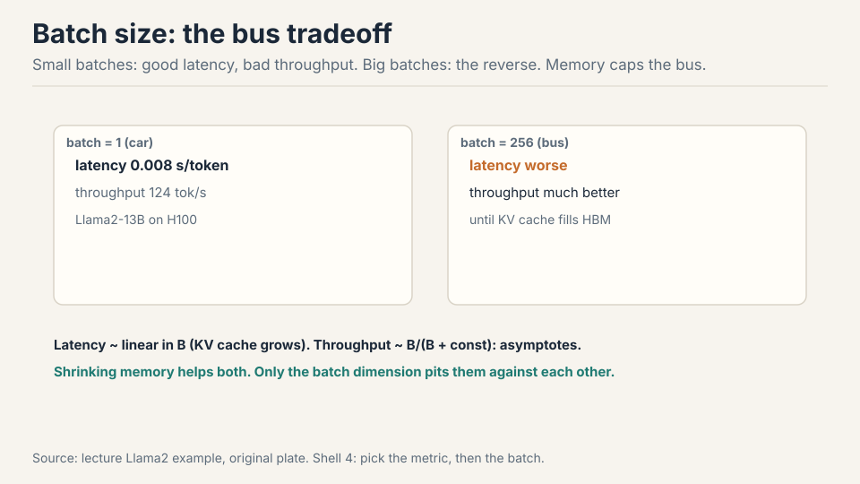

The bus analogy: waiting for the bus is slow per rider, but the bus
moves many people. Shrinking memory helps both metrics. Only the batch
dimension forces the tradeoff [49:49](ts:49:49).

## Shrinking the KV cache: less memory is more speed

Inference is memory-bound, so every byte removed is speed gained. Four
axes of shrinking, one tradeoff each.

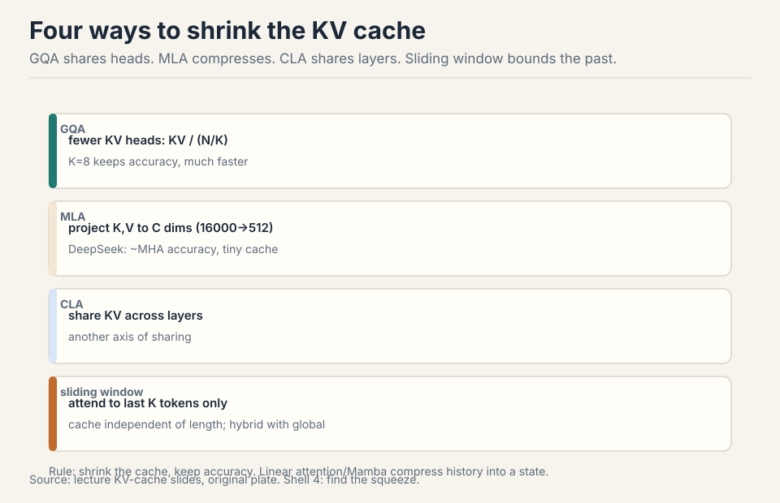

- **GQA**: fewer KV heads. Cache divided by N/K. K=8 keeps accuracy
  and is much faster than MHA [47:54](ts:47:54).
- **MLA** (DeepSeek): project K,V to C dims (16000 to 512), store the
  compressed latent, materialize on demand. Matches MHA accuracy, beats
  GQA [52:07](ts:52:07). Wrinkle: RoPE needs raw keys, so extra dims
  handle position.
- **CLA**: share KV across layers, like GQA shares across heads
  [55:30](ts:55:30).
- **Sliding window**: attend to the last K tokens. Cache independent
  of length. Alone it hurts accuracy. Interleaved with global layers
  (hybrid), it works [56:53](ts:56:53).
- **Linear attention / Mamba**: compress history into a fixed state.
  More expressive than sliding window. Hybrids combine all three
  [59:13](ts:59:13).

With GQA, batch 256 fits where it did not before: shrink the cache,
then spend the savings on batch size [50:06](ts:50:06). The savings
compound: smaller cache means bigger batches, bigger batches mean
higher throughput, and the latency penalty per request stays flat
until memory caps again.

> [!QA]
> Q: GQA vs MLA vs CLA: which do you pick and why?
> A: GQA is the default: divide the KV heads by N/K, keep accuracy, simple to implement, and every serving stack supports it. Pick it unless you have a reason not to. MLA is the stronger compression: project K,V to a small latent (16000 to 512 in DeepSeek's case), store the latent, materialize on demand. It beats GQA on the size-accuracy frontier but complicates RoPE (position needs raw keys, so extra dims carry it). CLA shares KV across layers: orthogonal to both, stackable. The real answer in production is combinations: GQA everywhere, MLA where the cache dominates (long context), sliding window or CLA on top. One axis is rarely enough.
> Follow-up: Why did DeepSeek pick MLA over GQA?
> A: Their bottleneck was the KV cache at long context and large batch: the 57x compression (64KB to 1.1KB per token) buys batch size that GQA's 8x cannot. The price was engineering: decoupled RoPE, the latent projection, materialization on demand. When the cache is the wall, the stronger compression wins. When simplicity and ecosystem support matter, GQA wins.

## Quantization and pruning

Less precision, less memory, more speed.

| Method | Idea | Cost |
|---|---|---|
| QAT | simulate quantization during training | expensive retrain |
| PTQ naive | per-tensor scale and zero-point | cheap, lossy |
| GPTQ | Hessian-guided, layer by layer, error compensation | moderate |
| AWQ | keep salient activation channels in fp16 | moderate, strong |

QAT adapts weights to quantization noise but needs large-scale
training. PTQ is the practical default. GPTQ and AWQ close the gap
[64:33](ts:64:33). Pruning (NVIDIA): rank units and layers by
calibration activations, remove, then heal with post-training. 15B to
8B with small accuracy loss [67:39](ts:67:39). Distillation repairs any
of these Frankenstein models [69:42](ts:69:42).

## Speculative decoding: checking beats generating

Checking is faster than generating: prefill runs in parallel. Exploit
the asymmetry. A cheap draft model generates K tokens sequentially.
The big target model verifies them in one parallel pass. Accept each
with probability min(1, q/p). On reject, sample the residual. The
result is an exact sample from the target: rejection sampling with a
guarantee [71:58](ts:71:58).

.")

Work the arithmetic. Draft generates 4 tokens at 1/20th the cost each:
0.2 target-equivalents. Target verifies all 4 in one pass: 1
target-equivalent. Total 1.2 for 4 tokens: 3.3x speedup if all accept.
If half reject, the math collapses: you paid the draft plus the full
pass and gained little. Sweet spot: K = 3-4. Too few wastes the
parallel check. Too many rejects. Distill the draft toward the target:
the closer p is to q, the more accepts [76:04](ts:76:04). A shrunk
model you would not serve can still be a draft model.

### Subchapter: the speculative decoding arithmetic

The speedup has a formula. Draft K tokens at cost c per token
(relative to one target pass), verify in one target pass, accept a
fraction r. Cost per round: 1 + K x c passes. Tokens per round: K x
r. Speedup: (K x r) / (1 + K x c).

Work the lecture's numbers. K=4, c=1/20: cost 1.2 passes. Accept
all 4: 4/1.2 = 3.3x. Accept 2: 2/1.2 = 1.7x. Accept 0: the round
still yields 1 token (the correction): 1/1.2 = 0.83x, slower than
baseline. The plate shows the three outcomes.

Two levers, one tradeoff. Cheaper draft (smaller c) raises every
outcome. Closer draft (higher r) raises the numerator: distillation
is the lever. Bigger K raises the ceiling but lowers r: long drafts
drift. The optimum sits at K=3-4 for most pairs. And the guarantee
holds regardless: rejection sampling makes the output exactly the
target's distribution, so speed is the only variable.

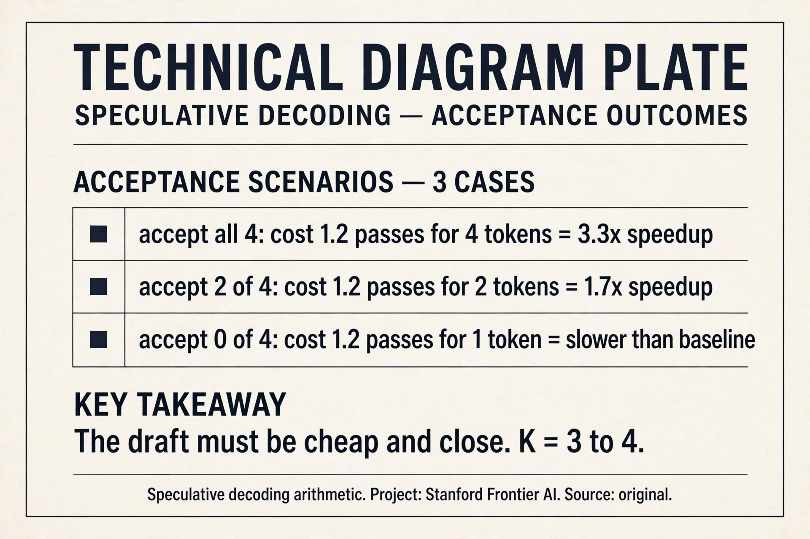

> [!QA]
> Q: Work the speculative decoding math. K=4, draft cost 1/20, acceptance 50%.
> A: Cost per round: 1 target pass + 4 x 1/20 = 1.2 passes. Expected tokens: 4 x 0.5 = 2, plus the correction token on reject keeps it near 2. Speedup: 2/1.2 = 1.7x. Now distill the draft so acceptance hits 90%: 3.6/1.2 = 3x. The draft quality is the whole game: at 50% you get 1.7x, at 90% you get 3x, at 10% you lose. K=4 is the sweet spot because longer drafts drift and shorter ones waste the parallel check.
> Follow-up: Why is the output exactly the target's distribution?
> A: Rejection sampling. Accept each draft token with probability min(1, q/p): where the draft overproposes, the target downweights; on reject, sample from the residual (q - p normalized). The math guarantees the accepted stream matches q exactly. Speed changes, quality does not. That guarantee is what makes it safe to deploy: it is an optimization, not an approximation.

## Serving the chaos

Live traffic is jagged: requests arrive at different times with
different lengths. **Continuous batching** (Orca): decode one token per
sequence per step, evict finished sequences, admit new ones
[77:30](ts:77:30). **Selective batching**: MLP layers concatenate all
sequences into one mega-sequence. Attention stays per-sequence
[78:51](ts:78:51).

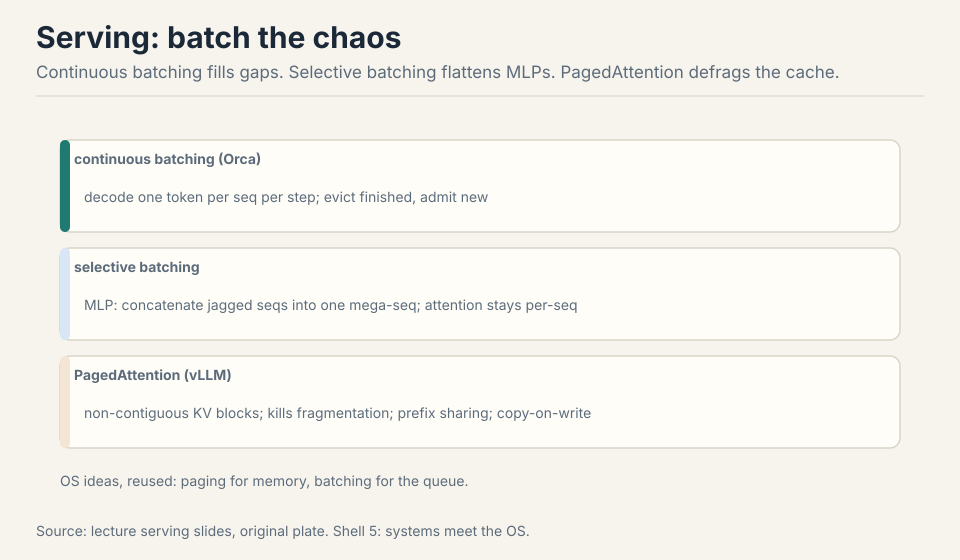

**PagedAttention** (vLLM): store the KV cache in non-contiguous
blocks, like OS pages. Kills internal fragmentation (over-allocated
buffers) and external fragmentation (gaps between requests). Bonus:
prefix sharing. Same system prompt? Cache it once. Multiple samples?
Share the prompt blocks, copy-on-write on divergence
[79:34](ts:79:34).

> [!QA]
> Q: You have a live chatbot and a batch document pipeline on one cluster. How do you split it?
> A: The chatbot wants latency and TTFT: small batches, fast prefill, continuous batching to keep GPUs busy between arrivals. The pipeline wants throughput: big batches, amortized parameter loads, memory as the only cap. Do not mix them in one batch: the batch job's latency tolerance would poison the chatbot's. Split the cluster or time-slice it, and size each side's batch for its own metric.
> Follow-up: When is speculative decoding a win?
> A: When the draft is cheap and close to the target. If p rarely matches q, you pay the draft cost plus a full target pass per token and gain nothing. Distillation is the lever: a well-distilled small model accepts often, and the parallel verification turns sequential generation into batched checking. Memory-bound targets benefit most, since the verification pass is the cheap part.

### Subchapter: what is used where (the serving stack)

The lecture's ideas, production-hardened.

- **vLLM**: the open serving standard. PagedAttention (the paper's
  block-paged KV cache), continuous batching, prefix caching. If you
  serve open models, you start here.
- **SGLang**: radix attention generalizes prefix caching into a
  tree: shared prefixes across requests are stored once. Strong on
  structured generation and long shared contexts.
- **TensorRT-LLM**: NVIDIA's compiled stack. Kernel autotuning,
  FP8/FP4 paths, tight Hopper integration. The choice inside
  NVIDIA-flavored clouds.
- **DeepSeek**: MLA plus FP8 training carried into serving, tensor
  parallel 4 at inference (reported), and the MTP head repurposed
  for speculative decoding (per the V3 report). The draft model is
  built in.
- **Speculative decoding everywhere**: vLLM, SGLang, and
  TensorRT-LLM all ship it. The draft is usually a small dense
  model distilled from the target.

The stack is the same ideas with harder edges: the cache is paged,
the batch is continuous, the draft is distilled, the kernels are
autotuned. Nothing here contradicts the lecture. It is the lecture
at 3am under load.

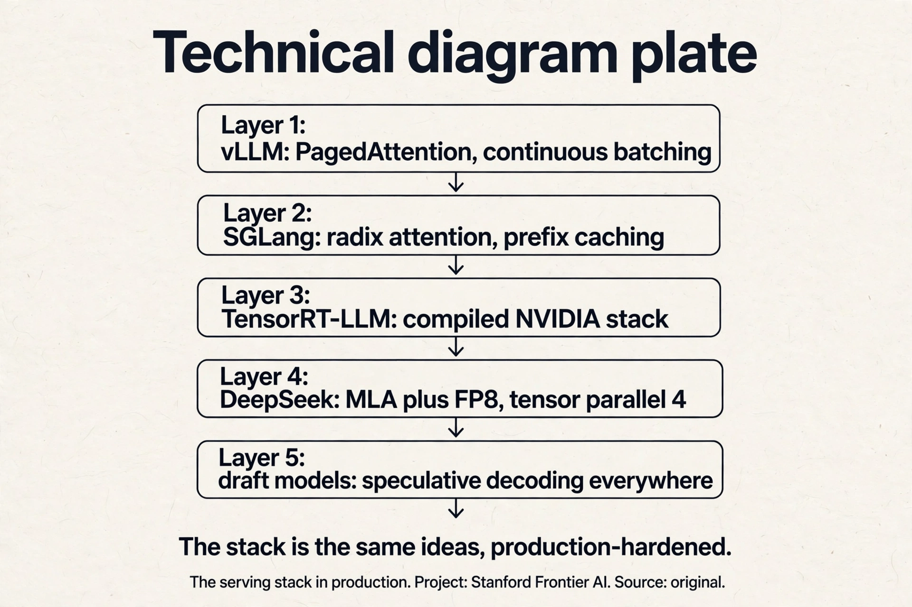

> [!QA]
> Q: Size the GPUs for serving Llama-3-70B at 1000 tok/s. H100s, bf16, 4K context.
> A: Per GPU, one decode step reads 140GB of parameters. At 3.35 TB/s that is 42ms per step. Per step, batch B produces B tokens, so throughput is B / 0.042s, minus the cache traffic. Cache per sequence at 4K: 80 layers x 8 KV heads x 128 x 2 x 2B x 4096 = 1.3GB. At batch 64: per step read = 140 + 64 x 1.3 = 223GB, 67ms per step, 64 tokens per 67ms = 955 tok/s per GPU. So one H100 nearly does it at batch 64; take two for headroom, TTFT, and the chatbot's latency needs. The cache at batch 64 is 85GB: it fits in the remaining HBM after the 140GB of weights. That is the sizing loop: batch for throughput, cache for memory, GPUs for headroom.
> Follow-up: What changes at 128K context?
> A: Everything. The cache per sequence grows 32x to 42GB: batch 64 no longer fits. You drop to batch ~8 per GPU, throughput collapses, and the cache dominates the parameter read. The fixes: MLA-style compression, context parallel across GPUs, or sliding-window attention to bound the cache. Long context is a cache problem wearing a serving problem's clothes.

## Mapping back: what each technique fixes

| Pain | Technique | How |
|---|---|---|
| O(T^3) recomputation | KV cache | Prefill once in parallel, decode linear. Causal past never changes. |
| Intensity ~1 in decode | Shrink the cache | Less memory per token is more tokens per second. |
| Cache too big for batch | GQA / MLA / CLA | Fewer heads, compressed latent, shared layers. |
| Context unbounded | Sliding window | Cache independent of length. Hybrid with global layers. |
| Memory traffic per step | Quantization | Fewer bytes per weight. GPTQ/AWQ close the accuracy gap. |
| Sequential generation | Speculative decoding | Draft cheap, verify in parallel. Exact samples, K=3-4. |
| Jagged live traffic | Continuous batching | Evict finished, admit new. One token per sequence per step. |
| Fragmented cache memory | PagedAttention | Blocks like OS pages. Prefix sharing, copy-on-write. |

## The honest price

The 8.6T tokens/day figure is an estimate. Llama2 numbers are a worked
example, not a benchmark. Accuracy claims for GQA vs MLA come from
specific models: take with a grain of salt, per the lecture. Every
shrinking technique trades something: MLA complicates RoPE, sliding
windows hurt accuracy alone, quantization needs calibration, pruning
needs healing. Speculative decoding is a net loss with a bad draft.
And the deepest price: this lecture optimizes serving a fixed model.
It cannot fix a model that was trained wrong. That is the data and
scaling lectures' job.

## Recap: the whole lesson on one screen

The story in eight steps. Each step answers the one before it.

1. **Inference has no ceiling.** 8.6T tokens/day. Training is
   one-time, inference is daily. Agents removed the reading speed
   limit.
2. **Name the metric.** TTFT for the wait, latency for the stream,
   throughput for the job. Batch trades latency against throughput.
3. **Naive generation is O(T^3).** Recompute everything per token.
   Autoregressive: one token at a time, intensity near 1, 300x below
   the H100's 295.
4. **Cache the past.** Causal models never change the past. Prefill in
   parallel (compute-bound), decode one token (memory-bound).
5. **Attention is the wall.** MLP intensity scales with batch.
   Generation attention sits at ~1, and batching cannot help: each
   sequence owns its cache.
6. **Shrink the cache.** GQA shares heads, MLA compresses to a
   latent, CLA shares layers, sliding window bounds the past. Less
   memory is more speed. Spend savings on batch.
7. **Check beats generate.** Draft K tokens cheap, verify in parallel,
   accept with min(1,q/p). Exact samples. K=3-4. Distill the draft.
8. **Batch the chaos.** Continuous batching fills gaps. PagedAttention
   defrags the cache and shares prefixes. OS ideas, reused.

## Official sources and further reading

**Official:**
- Lecture 10 video.
- Google scaling book, inference chapter: much of the math and some
  figures.

**Further reading:**
- vLLM / PagedAttention paper. Orca (continuous batching).
- GQA paper (2023). DeepSeek-V2 (MLA). Speculative decoding papers.
- GPTQ, AWQ papers for quantization.

**Caveats from these sources.** The 8.6T tokens/day figure is an
estimate. Llama2 numbers are a worked example, not a benchmark.
Accuracy claims for GQA vs MLA come from specific models: take with a
grain of salt, per the lecture.

## Connections to the other courses

- **CS336 L04:** MLA, GQA, sliding window, linear attention
  originated as architecture choices. Here they pay off in serving.
- **CS336 L09:** overtraining for serving is the economic reason this
  lecture exists.
- **CS329H:** RL rollouts are inference workloads: every speedup here
  compounds there.
