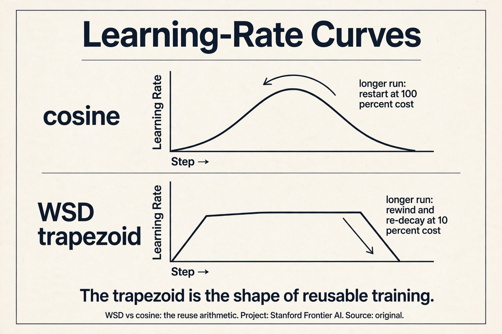
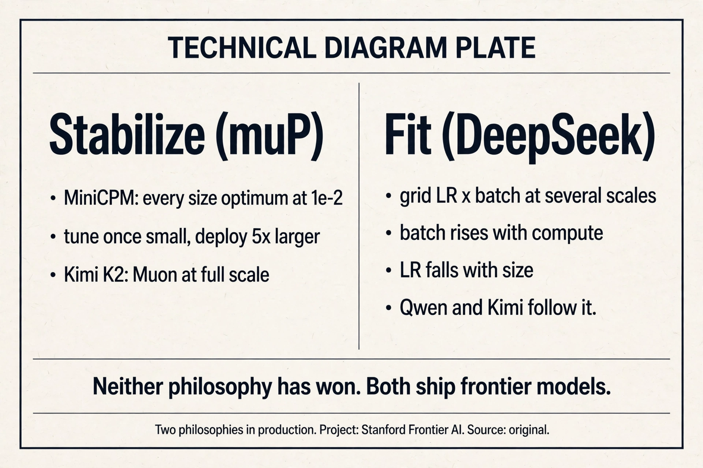
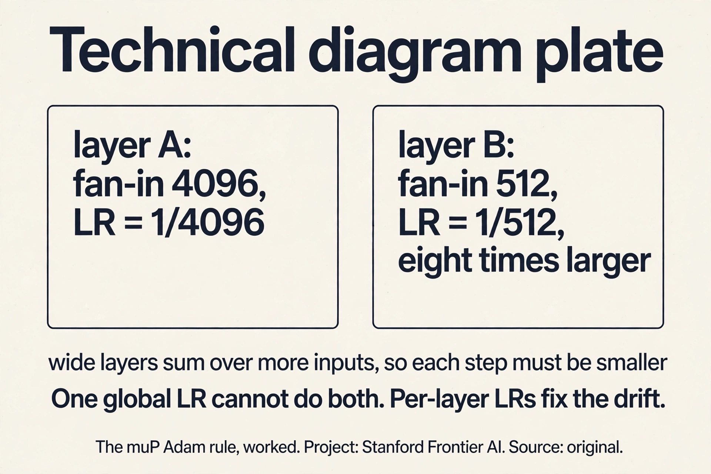
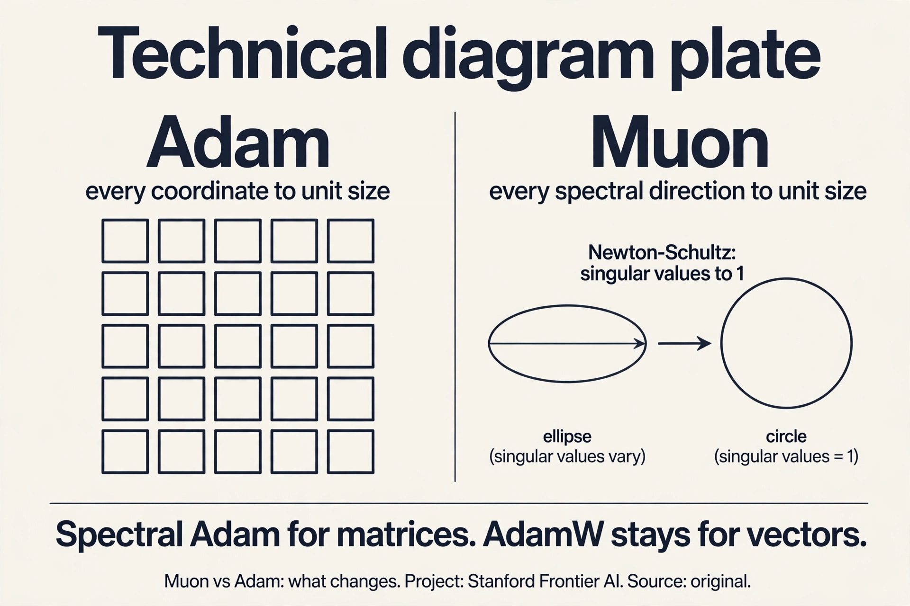

## The problem: the learning rate moved

You tuned the learning rate on a 1B model. Now you want to train at 5x
the scale. Does the same learning rate still work? Usually not: the
optimum drifts with size, and retuning on the big run costs a fortune.
Lecture 9 gave the classical canon for N-vs-D. This lecture is the
frontier: what the open labs actually do about hyperparameters that
refuse to transfer.

## First attempt: fit the drift

One school grids LR x batch at several scales, fits the drift, and
extrapolates. DeepSeek's recipe: batch rises with compute, LR falls
[16:31](ts:16:31). Qwen 2.5/3 and Kimi follow it. It is now standard
practice [23:02](ts:23:02).

The StepFun study burned serious compute gridding LR x batch across
models and data sizes [30:31](ts:30:31). Findings:

- The hyperparameter surface is smooth and convex per slice: gridding
  is viable [34:49](ts:34:49).
- Optimal batch size depends only on D (data), roughly sqrt(D):
  model size does not matter [35:36](ts:35:36).
- Optimal LR falls with model size N and rises with data D.
  Counterintuitive, fragile across studies, but clear in theirs
  [36:11](ts:36:11).
- Under Chinchilla scaling (N and D move together), LR falls with
  compute: consistent with the DeepSeek law [38:44](ts:38:44).

The laws transfer to MoE at fixed active parameters. They shift with
the data distribution: numbers are contingent, phenomena are not
[37:46](ts:37:46).

> [!QA]
> Q: Should I just copy the StepFun LR and batch formulas instead of running my own grid?
> A: If you are near their compute regime, yes: their numbers beat guesses from a hat. If you run a big pretraining run with your own architecture, weight decay, or data, redo the check. Scaling laws feel scientific, but transfer is vibes: tiny setup differences move the numbers. The lecture's advice is to treat published laws as strong defaults, then verify first-order correctness on your own setup.
> Follow-up: Why does the optimal batch size ignore model size?
> A: The batch size balances gradient noise against steps, and the noise scale is set by the data and the loss level, not by how many parameters average it. A bigger model at the same loss sees the same noise geometry per step. What changes with N is the learning rate: more parameters move more things at once, so each step must be smaller.

## Where the frontier breaks: three cautionary tales

### Break 1: cosine schedules waste every sweep

Chinchilla sweeps with cosine schedules are wasteful: every data
budget needs its own schedule, so every run restarts from scratch
[10:37](ts:10:37). Work the waste: sweep 5 data budgets, train 5 full
runs, throw away 5 warmups. The schedule is the tax.

**WSD** (warmup-stable-decay) fixes it. Warmup in constant steps
(horizon-independent), hold constant through the stable phase, then
decay rapidly (10-20% of the run) to about 10% of max
[11:13](ts:11:13). Want a longer run? Roll back to a stable
checkpoint, extend, re-decay: 10% cost instead of 100%.

WSD looks worse than cosine until the decay hits, then matches or
exceeds it [13:08](ts:13:08). The decay is doing the real annealing
work. The trapezoid is the shape of reusable training.

### Subchapter: WSD vs cosine, the reuse arithmetic

Work the waste. You sweep 5 data budgets with cosine: 5 full runs,
5 warmups, 5 decays. You decide the winner deserves 2x more data:
restart from scratch, 100% cost again. Total: 6 full runs for one
answer.

With WSD: 5 runs share one stable phase each. The winner rewinds to
its stable checkpoint and re-decays: 10-20% of a run. Total: about
5.1 runs for the same answer. The savings compound with every
decision: longer run, different decay length, second sweep. Each is
a rewind, not a restart.

Why it works: the stable phase is horizon-independent. Constant LR,
constant steps of warmup, no schedule information about the total
length. The model at step 100k of a stable phase does not know
whether the run ends at 200k or 2M. Only the decay needs the
horizon, and the decay is the last 10-20%. Cosine bakes the horizon
into every step: the LR at step 100k depends on the total, so
extending the run invalidates the whole curve.

> [!QA]
> Q: Walk me through a WSD run. When do you rewind, exactly?
> A: Warmup: 2k steps, LR climbs to max. Stable: hold max for 100k steps, checkpointing every 10k. You decide at step 100k that the run deserves 2x more data. Rewind: load the step-90k checkpoint (a stable-phase checkpoint, safely before the end). Extend: train 100k more stable steps to 190k. Re-decay: decay rapidly over the last 20k steps to 10% of max. Total extra cost: 120k steps instead of 210k for a fresh run. The rewind point must be inside the stable phase: rewinding into the decay contaminates the annealing. Checkpoint often during stable, rarely during decay.
> Follow-up: Why does WSD look worse than cosine until the decay?
> A: Cosine anneals the whole run: the LR falls from step one, so the loss falls faster early. WSD holds the LR high: it explores longer and the loss lags. The decay is where WSD catches up: the rapid anneal at the end does the same work cosine spread across the run. Judge a schedule only after its decay. Comparing mid-run is comparing an unfinished anneal to a finished one.

### Break 2: beautiful scaling, then blowup

The Marin story (cautious AdamW): beautiful Chinchilla scaling for
orders of magnitude, then deviation, then blowup. The fix was
muP-style parameterization [47:32](ts:47:32). Scaling trends are not
promises. The trend held until the parameterization's assumptions
broke, and then it broke suddenly, expensively.

### Break 3: small wins lie

Muon beat Adam badly on the NanoGPT speedrun. At larger scales, the
gap shrank [42:24](ts:42:24). Two lessons. First, tune the baseline:
an under-tuned Adam manufactures fake wins for anything
[44:00](ts:44:00). Second, watch both axes: compute and the Chinchilla
ratio D/N. An optimizer can win overparameterized and lose data-rich
[46:00](ts:46:00).

## The key question

Fitting the drift works, but it is reactive: every new setup needs a
new grid. What if the optimum did not move at all? What if the
parameterization itself could be fixed so the learning rate transfers?
That is the other philosophy, and it has a derivation.

## muP: stabilize the optimum

MiniCPM (2024), a state-of-the-art 1-2B model at release, built on
muP: a reparameterization whose whole point is that the optimal
learning rate stops moving with scale [05:22](ts:05:22).

, init by fan ratios, per-tensor LRs. Every size's minimum lands at 1e-2.")

The recipe: scale the embedding output, scale residuals by the square
root of depth, initialize matrices by fan-in/fan-out ratios, use
per-tensor learning rates, scale the LM head. Result: sweep the LR
across model sizes and every minimum sits at 1e-2 [07:50](ts:07:50).
Tune once small, deploy 5x larger. Cerebras GPT found muP also
stabilizes the scaling-law fits themselves [59:14](ts:59:14).

Two philosophies, side by side:

- **Stabilize** (MiniCPM/muP): change the parameterization until the
  optimum stops moving.
- **Fit** (DeepSeek): grid LR x batch at several scales, fit the
  drift, extrapolate. Batch rises with compute, LR falls.

Neither philosophy has won. Both have shipped frontier models.

### Subchapter: what is used where (who stabilizes, who fits)

The two philosophies in production, current as of October 2026.

**Stabilize.** MiniCPM (2024): muP end to end, every size's LR
optimum at 1e-2, tuned small and deployed 5x larger. Kimi K2: Muon
for the full training run (per its report), the spectral optimizer
at trillion-parameter scale. Cerebras GPT: muP to stabilize the
scaling-law fits themselves.

**Fit.** DeepSeek: grid LR x batch across scales, batch rises with
compute, LR falls. Qwen 2.5/3 and Kimi follow the recipe: it is
now standard practice. The StepFun study: the most thorough public
grid, batch ~ sqrt(D), LR falls with N and rises with D.

The choice is organizational as much as technical. Stabilize pays
upfront: reparameterize the model, adopt per-layer LRs, verify the
theory survives your architecture. Fit pays per project: every new
setup needs its grid. Labs with stable architectures stabilize.
Labs iterating on architecture fit. Most do both: stabilize what
you can, fit the rest.

> [!QA]
> Q: Your 1B LR sweep says 3e-4. You scale to 5B. What learning rate do you use?
> A: It depends on your philosophy. With muP: the same 3e-4, or whatever your small-scale optimum was, transferred unchanged: the parameterization holds the optimum still. Verify first-order on the big model with a short run, then commit. With the fit philosophy: apply the drift law, LR falls with N: roughly 3e-4 divided by the size ratio's exponent from your grid, and confirm with a small sweep at the new scale. With neither: you retune from scratch on the big run and pay the fortune the lecture warned about. The wrong answer is copying 3e-4 blindly without a parameterization that justifies it.
> Follow-up: How do you verify the transfer cheaply?
> A: Train the big model for 2-5% of the planned steps at the transferred LR and at 2x and 0.5x. The loss curves separate within the first percent: the right LR is visibly best. This costs a few percent of the run and catches a broken transfer before it burns the budget. Never skip it: transfer is vibes until verified.

## The muP derivation, in brief

Two physicist invariants [60:44](ts:60:44):

 at init. A2: O(1) feature learning per step. Out come the init and LR rules.")

- **A1**: activations at init stay O(1) in width. Solve the init scale
  from the random matrix's spectral norm: init carries
  1/sqrt(fan-in) times sqrt(fan-out/fan-in).
- **A2**: one gradient step changes activations by O(1) (feature
  learning, not NTK). Track the update's terms, demand they match:
  LR ~ fan-out/fan-in for SGD, 1/fan-in for Adam. Per-layer LRs.

Work the Adam rule on a toy. A layer with fan-in 4096: LR ~
1/4096. A layer with fan-in 512: LR ~ 1/512, eight times larger. The
wide layer sums over eight times more inputs, so each step must be
eight times smaller to move activations by O(1). One global LR cannot
do both. That is why the optimum drifts with scale, and why per-layer
LRs fix it.

Assumptions are strong (no cancellations, unit loss progress), but the
rules that drop out work. Stress tests: SwiGLU and RMSNorm survive in
practice. Learned RMSNorm gains, Lion, and large decoupled weight
decay break it [72:43](ts:72:43).

> [!QA]
> Q: Why does muP give per-layer learning rates instead of one global LR?
> A: Different layers have different fan-in/fan-out geometry, so the same global step changes their activations by different amounts. The derivation solves for the step that keeps every layer's feature learning O(1), and that step depends on the layer's shape. Adam's version (1/fan-in) says it plainly: wide layers, which sum over many inputs, need smaller steps. One LR for all layers is the thing that drifts with scale.
> Follow-up: If muP is so principled, why do labs still fit scaling laws for LR?
> A: muP's theory covers width scaling with clean architectures. Reality has depth, SwiGLU, RMSNorm, exotic optimizers, and weight decay, all outside the proof. Fitting the drift makes no theoretical claims and absorbs all of it. Stabilize what you can, fit the rest. The lecture presents them as complementary, not competing.

### Subchapter: the Adam per-layer rule, worked

The derivation's payoff is one rule: for Adam, each layer's LR
scales as 1/fan-in. Work it on two layers. Layer A: fan-in 4096,
LR = 1/4096. Layer B: fan-in 512, LR = 1/512: eight times larger.

Why: layer A sums over eight times more inputs. A global step that
moves layer B's activations by O(1) moves layer A's by O(8): too
far. To keep every layer's feature learning at O(1) per step, the
wide layer's step must be eight times smaller. One global LR cannot
do both: it either starves the narrow layer or blows up the wide
one. That mismatch is the drift. Per-layer LRs fix it by
construction.

The invariants behind it: A1 says activations at init stay O(1) in
width (solve the init scale from the random matrix's spectral
norm). A2 says one gradient step changes activations by O(1), the
feature-learning regime, not the NTK regime. The assumptions are
strong (no cancellations, unit loss progress), but the rules that
drop out survive SwiGLU and RMSNorm in practice. They break on
learned RMSNorm gains, Lion, and large decoupled weight decay:
those change the update geometry the proof assumed.

> [!QA]
> Q: Work the muP Adam rule. Two layers: fan-in 8192 and fan-in 1024. What LRs, and why?
> A: Layer A (8192): LR = 1/8192. Layer B (1024): LR = 1/1024, eight times larger. The wide layer sums over eight times more inputs, so the same global step moves its activations eight times further. To keep both layers' per-step feature learning at O(1), the wide layer's step shrinks by 8x. A single global LR would need to be 1/8192 for A and 1/1024 for B simultaneously: impossible. The drift with scale is this mismatch growing as layers widen.
> Follow-up: What breaks first when you violate muP's assumptions?
> A: The per-layer LR ratios. Learned RMSNorm gains rescale activations after the init the proof assumed. Lion's sign-based update changes the update geometry from Adam's. Large decoupled weight decay adds a shrinkage term the derivation ignored. Each violation bends the 1/fan-in rule, and the optimum starts drifting again. The stress tests tell you which violations are survivable (SwiGLU, RMSNorm) and which are not (learned gains, Lion). Empirical survival is not a proof: verify on your architecture.

## Muon: spectral Adam

Muon treats matrix parameters as matrices. Momentum as usual, then
Newton-Schultz (5 iterations): orthogonalize the update, all singular
values to 1 [51:15](ts:51:15). Intuition: Adam makes every coordinate
unit size. Muon makes every spectral direction unit size. Vector
parameters (norms) keep AdamW. Newton-Schultz uses only matmuls, so it
is GPU-friendly: no SVD needed [55:03](ts:55:03).

Kimi K2 trained entirely on Muon, with extra stabilization, and is an
outstanding model [54:38](ts:54:38). No ablation at that scale, so
"better than Adam" is unproven, but "works at scale" is settled. The
meta-lesson: small-scale ideas do reach big models, slowly and with
surprises. And the caution from Break 3 applies: the NanoGPT gap
shrank with scale. Watch both axes before declaring victory.

> [!QA]
> Q: Muon vs Adam: what changes in the update, concretely?
> A: Adam: keep momentum, then divide each coordinate by its root-mean-square: every coordinate ends up unit size. The geometry is per-coordinate: a million tiny independent scalings. Muon: keep momentum, then run Newton-Schultz (5 iterations of matmuls): orthogonalize the update matrix, all singular values to 1. Every spectral direction ends up unit size. The geometry is per-direction: the update's shape is preserved, only its scale is normalized. Vector parameters (norms, biases) keep AdamW: Muon is for matrices. The cost: 5 extra matmuls per step, GPU-friendly, no SVD.
> Follow-up: Why would spectral normalization beat coordinate normalization?
> A: Coordinates are arbitrary: the basis you wrote the matrix in has no geometric meaning. Spectral directions are intrinsic: they are the directions the matrix actually stretches. Normalizing them treats the update as a linear map, not a bag of numbers. Whether that wins at scale is unproven (no Kimi K2 ablation), but the geometric argument is why people tried. Kimi K2 settling "works at scale" is the current state of knowledge.

## MoE scaling at the frontier

2026 is the MoE era, and the scaling questions moved with it
[23:51](ts:23:51):

- **Kimi K2**: sweep sparsity at fixed FLOPs. Sparser wins until
  diminishing returns at sparsity 48 [24:46](ts:24:46).
- **Hunyuan**: 96 tokens per active parameter at fixed sparsity
  [25:27](ts:25:27).
- **LLaMA 3**: IsoFLOP ratios plus a loss-to-accuracy sigmoid: the
  bridge from perplexity scaling to downstream [25:53](ts:25:53).
- **MiniMax-01**: architecture bake-off, lightning vs hybrid vs
  softmax attention. Comparable scaling, hybrid deployed
  [27:03](ts:27:03).

The old questions (Chinchilla, LR scaling) are now assumed knowledge
and disappearing from papers [28:47](ts:28:47). Post-training synergy
remains open: no good integrated scaling with post-training exists
yet [29:47](ts:29:47).

## Mapping back: what each tool fixes

| Pain | Tool | How |
|---|---|---|
| LR drifts with scale | muP | Reparameterize. Every size's optimum lands at 1e-2. Tune once small. |
| Cosine wastes every sweep | WSD | Trapezoid: warmup, stable, rapid decay. Rewind and re-decay at 10% cost. |
| New setup, new grid | Fit philosophy | Grid LR x batch, fit drift, extrapolate. Batch ~ sqrt(D), LR falls with N. |
| Beautiful trend, sudden blowup | muP-style parameterization | Marin: the fix for deviation-then-blowup. Trends are not promises. |
| Small wins lie | Two-axis checks | Watch compute and D/N. Tune the baseline first. |
| Adam's coordinate scaling | Muon | Orthogonalize the update. Spectral directions to unit size. |
| MoE has new dials | Frontier bake-offs | Sparsity 48 (Kimi), 96 tok/active (Hunyuan). Sweep at fixed FLOPs. |

## The honest price

muP's theory does not cover SwiGLU, RMSNorm, Lion, or large decoupled
weight decay: empirical survival is not a proof. Muon's superiority
over Adam at scale is unproven: no Kimi K2 ablation exists. The
DeepSeek LR-fit lines are visibly noisy: directional, not precise. The
StepFun findings are contingent on their setup: numbers move, phenomena
stay. Post-training synergy with scaling is open: no integrated law
exists yet. And the oldest warning in the lecture: scaling laws feel
scientific, but transfer is vibes. Verify on your own setup.

## Recap: the whole lesson on one screen

The story in eight steps. Each step answers the one before it.

1. **The learning rate moved.** Tune at 1B, deploy at 5x: the optimum
   drifts. Retuning on the big run costs a fortune.
2. **Fit the drift.** Grid LR x batch, extrapolate. Batch ~ sqrt(D),
   ignores N. LR falls with N, rises with D. Numbers contingent,
   phenomena not.
3. **Cosine wastes sweeps.** Every budget restarts from scratch. WSD:
   warmup, long stable phase, rapid decay. Rewind and re-decay at
   10% cost.
4. **Trends are not promises.** Marin: beautiful Chinchilla scaling,
   then deviation, then blowup. Fix: muP-style parameterization.
5. **Stabilize the optimum.** muP: A1 activations O(1) at init, A2
   O(1) feature learning. Out: fan-ratio init, per-layer LRs. Every
   minimum at 1e-2.
6. **Two philosophies.** Stabilize (MiniCPM/muP) or fit (DeepSeek).
   Both ship frontier models. Stabilize what you can, fit the rest.
7. **Muon orthogonalizes.** Momentum plus Newton-Schultz: singular
   values to 1. Spectral Adam for matrices. Kimi K2 runs on it.
   Superiority unproven, scale-survival settled.
8. **The frontier moved to MoE.** Sparsity 48, 96 tok/active param,
   architecture bake-offs. Post-training synergy still open.

## Official sources and further reading

**Official:**
- Lecture 11 video and slides (lecture_11.pdf).
- MiniCPM paper. DeepSeek LLM paper. Kimi K2 report.

**Further reading:**
- Tensor Programs series (Greg Yang). Jeremy Bernstein's muP
  review. The muP stress-test paper.
- StepFun hyperparameter scaling study. Porian et al. optimizer
  scaling comparisons.
- LLaMA 3, Hunyuan, MiniMax-01 reports for MoE-era scaling.

**Caveats from these sources.** LR-fit lines in the DeepSeek plots
are visibly noisy: treat as directional, not precise. Muon's
superiority over Adam at scale is unproven (no Kimi K2 ablation).
muP theory does not cover SwiGLU/RMSNorm/Lion: empirical survival is
not a proof. Post-training synergy with scaling is open.

## Connections to the other courses

- **CS336 L09:** the classical scaling canon this lecture extends.
- **CS336 L03:** the architecture choices (SwiGLU, RMSNorm) that muP
  must survive.
- **CS229:** optimization theory behind the two invariants.
