### Coverage and sourcing

This lesson follows Lecture 11 of Stanford CS336 (Language Modeling
from Scratch, Spring 2026, instructor Tatsunori Hashimoto),
"Scaling Laws, Advanced," delivered May 4, 2026, duration 1:16:55.
It uses the official subtitle transcript and the slide deck
(lecture_11.pdf). Every timestamped claim below comes from the
lecture. Figures marked October 2026 are updates added after the
session, each with its source: the MiniCPM, DeepSeek, and Kimi K2
reports, current as of October 2026. Internal lab practices that are
not public are marked [uncertain] or unknown, never asserted. The
coverage map at the end of the chapter maps every major lecture
claim to the section that covers it, with file line numbers.

## The problem: the learning rate moved

You tuned the learning rate on a 1B model. Now you want to train at 5x
the scale. Does the same learning rate still work? Usually not: the
optimum drifts with size, and retuning on the big run costs a fortune.
Lecture 9 gave the classical canon for N-vs-D. This lecture is the
frontier: what the open labs actually do about hyperparameters that
refuse to transfer.

## First attempt: fit the drift

One school grids LR x batch at several scales, fits the drift, and
extrapolates. DeepSeek's recipe: batch rises with compute, LR falls
[16:31](ts:16:31). Qwen 2.5/3 and Kimi follow it. It is now standard
practice [23:02](ts:23:02).

The StepFun study burned serious compute gridding LR x batch across
models and data sizes [30:31](ts:30:31). Findings:

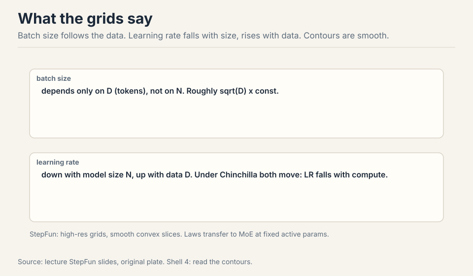

- The hyperparameter surface is smooth and convex per slice: gridding
  is viable [34:49](ts:34:49).
- Optimal batch size depends only on D (data), roughly sqrt(D):
  model size does not matter [35:36](ts:35:36).
- Optimal LR falls with model size N and rises with data D.
  Counterintuitive, fragile across studies, but clear in theirs
  [36:11](ts:36:11).
- Under Chinchilla scaling (N and D move together), LR falls with
  compute: consistent with the DeepSeek law [38:44](ts:38:44).

The laws transfer to MoE at fixed active parameters. They shift with
the data distribution: numbers are contingent, phenomena are not
[37:46](ts:37:46).

> [!QA]
> Q: Should I just copy the StepFun LR and batch formulas instead of running my own grid?
> A: If you are near their compute regime, yes: their numbers beat guesses from a hat. If you run a big pretraining run with your own architecture, weight decay, or data, redo the check. Scaling laws feel scientific, but transfer is vibes: tiny setup differences move the numbers. The lecture's advice is to treat published laws as strong defaults, then verify first-order correctness on your own setup.
> Follow-up: Why does the optimal batch size ignore model size?
> A: The batch size balances gradient noise against steps, and the noise scale is set by the data and the loss level, not by how many parameters average it. A bigger model at the same loss sees the same noise geometry per step. What changes with N is the learning rate: more parameters move more things at once, so each step must be smaller.

### Subchapter: the width-scaling derivation

The fit philosophy's rival has its own derivation. Start from the
update-to-weight ratio: a stable step moves each weight by a
fraction of its own size, not by an absolute amount. In a wide
layer, the activations sum over fan-in inputs. With standard
initialization (variance 1/fan-in), the weight magnitudes are
~1/sqrt(fan-in), but the gradient magnitudes grow with the width:
more inputs contribute to each output's gradient.

Work the ratio. A layer with fan-in n: weights ~1/sqrt(n),
gradients ~sqrt(n) (each of the n inputs contributes). The
update-to-weight ratio at learning rate eta: (eta x sqrt(n)) /
(1/sqrt(n)) = eta x n. For the ratio to stay constant as n grows,
eta must fall as 1/n. Double the width, halve the learning rate.
That is the LR ~ 1/width rule: not a fit, a derivation from the
demand that the relative step stay fixed.

The limit: this derivation holds the architecture fixed and scales
only width. Depth, the optimizer's normalization (Adam divides by
the gradient's RMS, which changes the accounting), and the
embedding layer all need their own corrections. muP is the system
that applies all the corrections at once: per-layer LRs from the
same ratio argument, init scales from A1, residual scaling from the
depth version. Width scaling is muP's little sibling: one rule,
correct where its assumptions hold, drifting where they do not.

update-to-weight ratio at LR eta, fan-in n:
(eta x sqrt(n)) / (1/sqrt(n)) = eta x n
hold it constant as n grows: eta ~ 1/n
double the width, halve the learning rate

Figure: Shell 3. Demand that each step move weights by a fixed fraction of their size. Source: original derivation.

> [!QA]
> Q: Derive LR ~ 1/width from the update-to-weight ratio.
> A: Demand that each step move weights by a fixed fraction of their size. Weights scale as 1/sqrt(n) under standard init. Gradients scale as sqrt(n) because n inputs contribute. The ratio (eta x sqrt(n)) / (1/sqrt(n)) = eta x n. Hold it constant: eta ~ 1/n. Double the width, halve the LR. The derivation assumes the architecture is fixed and only width changes. Adam's per-coordinate normalization and depth need separate corrections, which is what muP adds.
> Follow-up: Why does Adam complicate this derivation?
> A: Adam divides each coordinate's update by its gradient RMS, which normalizes away the sqrt(n) gradient growth the derivation assumed. With Adam, the update magnitudes are ~eta per coordinate regardless of width, so the naive ratio argument gives a different answer. muP's Adam rule (1/fan-in) comes from the fuller derivation with the A1/A2 invariants, not from the SGD ratio. The optimizer changes the scaling: there is no one rule for all optimizers.

## Where the frontier breaks: three cautionary tales

### Subchapter: break 1, cosine schedules waste every sweep

Chinchilla sweeps with cosine schedules are wasteful: every data
budget needs its own schedule, so every run restarts from scratch
[10:37](ts:10:37). Work the waste: sweep 5 data budgets, train 5 full
runs, throw away 5 warmups. The schedule is the tax.

**WSD** (warmup-stable-decay) fixes it. Warmup in constant steps
(horizon-independent), hold constant through the stable phase, then
decay rapidly (10-20% of the run) to about 10% of max
[11:13](ts:11:13). Want a longer run? Roll back to a stable
checkpoint, extend, re-decay: 10% cost instead of 100%.

WSD looks worse than cosine until the decay hits, then matches or
exceeds it [13:08](ts:13:08). The decay is doing the real annealing
work. The trapezoid is the shape of reusable training.

### Subchapter: WSD vs cosine, the reuse arithmetic

Work the waste. You sweep 5 data budgets with cosine: 5 full runs,
5 warmups, 5 decays. You decide the winner deserves 2x more data:
restart from scratch, 100% cost again. Total: 6 full runs for one
answer.

With WSD: 5 runs share one stable phase each. The winner rewinds to
its stable checkpoint and re-decays: 10-20% of a run. Total: about
5.1 runs for the same answer. The savings compound with every
decision: longer run, different decay length, second sweep. Each is
a rewind, not a restart.

Why it works: the stable phase is horizon-independent. Constant LR,
constant steps of warmup, no schedule information about the total
length. The model at step 100k of a stable phase does not know
whether the run ends at 200k or 2M. Only the decay needs the
horizon, and the decay is the last 10-20%. Cosine bakes the horizon
into every step: the LR at step 100k depends on the total, so
extending the run invalidates the whole curve.

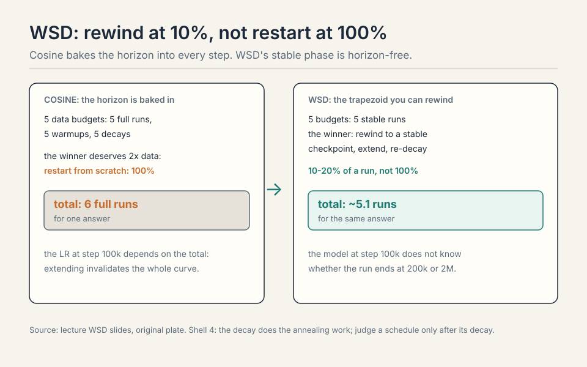

> [!QA]
> Q: Walk me through a WSD run. When do you rewind, exactly?
> A: Warmup: 2k steps, LR climbs to max. Stable: hold max for 100k steps, checkpointing every 10k. You decide at step 100k that the run deserves 2x more data. Rewind: load the step-90k checkpoint (a stable-phase checkpoint, safely before the end). Extend: train 100k more stable steps to 190k. Re-decay: decay rapidly over the last 20k steps to 10% of max. Total extra cost: 120k steps instead of 210k for a fresh run. The rewind point must be inside the stable phase: rewinding into the decay contaminates the annealing. Checkpoint often during stable, rarely during decay.
> Follow-up: Why does WSD look worse than cosine until the decay?
> A: Cosine anneals the whole run: the LR falls from step one, so the loss falls faster early. WSD holds the LR high: it explores longer and the loss lags. The decay is where WSD catches up: the rapid anneal at the end does the same work cosine spread across the run. Judge a schedule only after its decay. Comparing mid-run is comparing an unfinished anneal to a finished one.

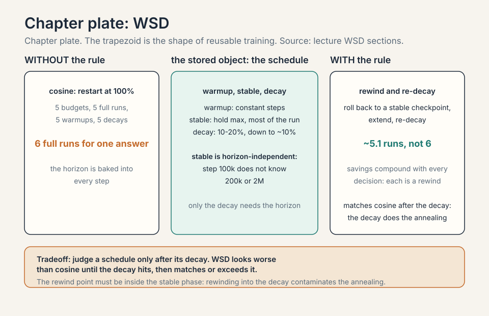

### Subchapter: break 2, beautiful scaling then blowup

The Marin story (cautious AdamW): beautiful Chinchilla scaling for
orders of magnitude, then deviation, then blowup. The fix was
muP-style parameterization [47:32](ts:47:32). Scaling trends are not
promises. The trend held until the parameterization's assumptions
broke, and then it broke suddenly, expensively.

### Subchapter: break 3, small wins lie

Muon (an optimizer that orthogonalizes the update matrix so every
spectral direction, not every coordinate, is unit-sized) beat Adam
badly on the NanoGPT speedrun. At larger scales, the
gap shrank [42:24](ts:42:24). Two lessons. First, tune the baseline:
an under-tuned Adam manufactures fake wins for anything
[44:00](ts:44:00). Second, watch both axes: compute and the Chinchilla
ratio D/N. An optimizer can win overparameterized and lose data-rich
[46:00](ts:46:00).

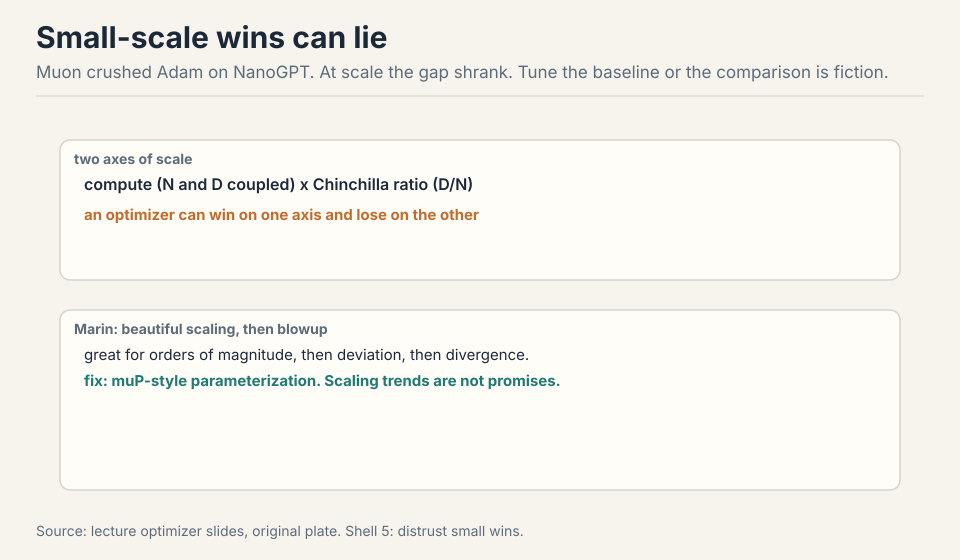

## The key question

Fitting the drift works, but it is reactive: every new setup needs a
new grid. What if the optimum did not move at all? What if the
parameterization itself could be fixed so the learning rate transfers?
That is the other philosophy, and it has a derivation.

## muP: stabilize the optimum

MiniCPM (2024), a state-of-the-art 1-2B model at release, built on
muP: a reparameterization whose whole point is that the optimal
learning rate stops moving with scale [05:22](ts:05:22).

, init by fan ratios, per-tensor LRs. Every size's minimum lands at 1e-2. Source: lecture MiniCPM slides, original plate.")

The recipe: scale the embedding output, scale residuals by the square
root of depth, initialize matrices by fan-in/fan-out ratios, use
per-tensor learning rates, scale the LM head. Result: sweep the LR
across model sizes and every minimum sits at 1e-2 [07:50](ts:07:50).
Tune once small, deploy 5x larger. Cerebras GPT found muP also
stabilizes the scaling-law fits themselves [59:14](ts:59:14).

Two philosophies, side by side:

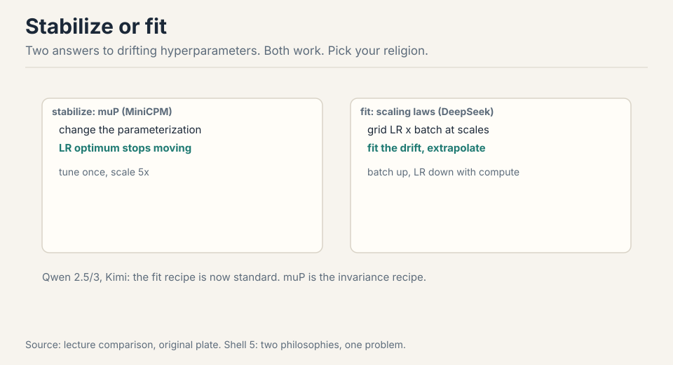

- **Stabilize** (MiniCPM/muP): change the parameterization until the
  optimum stops moving.
- **Fit** (DeepSeek): grid LR x batch at several scales, fit the
  drift, extrapolate. Batch rises with compute, LR falls.

Neither philosophy has won. Both have shipped frontier models.

### Subchapter: what is used where (who stabilizes, who fits)

The two philosophies in production, current as of October 2026.

**Stabilize.** MiniCPM (2024): muP end to end, every size's LR
optimum at 1e-2, tuned small and deployed 5x larger. Kimi K2: Muon
for the full training run (per its report), the spectral optimizer
at trillion-parameter scale. Cerebras GPT: muP to stabilize the
scaling-law fits themselves.

**Fit.** DeepSeek: grid LR x batch across scales, batch rises with
compute, LR falls. Qwen 2.5/3 and Kimi follow the recipe: it is
now standard practice. The StepFun study: the most thorough public
grid, batch ~ sqrt(D), LR falls with N and rises with D.

The choice is organizational as much as technical. Stabilize pays
upfront: reparameterize the model, adopt per-layer LRs, verify the
theory survives your architecture. Fit pays per project: every new
setup needs its grid. Labs with stable architectures stabilize.
Labs iterating on architecture fit. Most do both: stabilize what
you can, fit the rest.

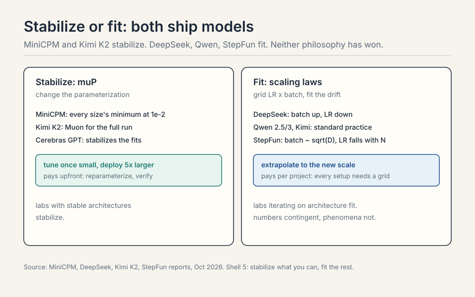

> [!QA]
> Q: Your 1B LR sweep says 3e-4. You scale to 5B. What learning rate do you use?
> A: It depends on your philosophy. With muP: the same 3e-4, or whatever your small-scale optimum was, transferred unchanged: the parameterization holds the optimum still. Verify first-order on the big model with a short run, then commit. With the fit philosophy: apply the drift law, LR falls with N: roughly 3e-4 divided by the size ratio's exponent from your grid, and confirm with a small sweep at the new scale. With neither: you retune from scratch on the big run and pay the fortune the lecture warned about. The wrong answer is copying 3e-4 blindly without a parameterization that justifies it.
> Follow-up: How do you verify the transfer cheaply?
> A: Train the big model for 2-5% of the planned steps at the transferred LR and at 2x and 0.5x. The loss curves separate within the first percent: the right LR is visibly best. This costs a few percent of the run and catches a broken transfer before it burns the budget. Never skip it: transfer is vibes until verified.

## The muP derivation, in brief

Two physicist invariants [60:44](ts:60:44):

 at init. A2: O(1) feature learning per step. Out come the init and LR rules. Source: lecture muP slides, original plate.")

- **A1**: activations at init stay O(1) in width. Solve the init scale
  from the random matrix's spectral norm: init carries
  1/sqrt(fan-in) times sqrt(fan-out/fan-in).
- **A2**: one gradient step changes activations by O(1) (feature
  learning, not the NTK (neural tangent kernel) regime). Track the update's terms, demand they match:
  LR ~ fan-out/fan-in for SGD, 1/fan-in for Adam. Per-layer LRs.

Work the Adam rule on a toy. A layer with fan-in 4096: LR ~
1/4096. A layer with fan-in 512: LR ~ 1/512, eight times larger. The
wide layer sums over eight times more inputs, so each step must be
eight times smaller to move activations by O(1). One global LR cannot
do both. That is why the optimum drifts with scale, and why per-layer
LRs fix it.

Assumptions are strong (no cancellations, unit loss progress), but the
rules that drop out work. Stress tests: SwiGLU and RMSNorm survive in
practice. Learned RMSNorm gains, Lion, and large decoupled weight
decay break it [72:43](ts:72:43).

> [!QA]
> Q: Why does muP give per-layer learning rates instead of one global LR?
> A: Different layers have different fan-in/fan-out geometry, so the same global step changes their activations by different amounts. The derivation solves for the step that keeps every layer's feature learning O(1), and that step depends on the layer's shape. Adam's version (1/fan-in) says it plainly: wide layers, which sum over many inputs, need smaller steps. One LR for all layers is the thing that drifts with scale.
> Follow-up: If muP is so principled, why do labs still fit scaling laws for LR?
> A: muP's theory covers width scaling with clean architectures. Reality has depth, SwiGLU, RMSNorm, exotic optimizers, and weight decay, all outside the proof. Fitting the drift makes no theoretical claims and absorbs all of it. Stabilize what you can, fit the rest. The lecture presents them as complementary, not competing.

### Subchapter: the Adam per-layer rule, worked

The derivation's payoff is one rule: for Adam, each layer's LR
scales as 1/fan-in. Work it on two layers. Layer A: fan-in 4096,
LR = 1/4096. Layer B: fan-in 512, LR = 1/512: eight times larger.

Why: layer A sums over eight times more inputs. A global step that
moves layer B's activations by O(1) moves layer A's by O(8): too
far. To keep every layer's feature learning at O(1) per step, the
wide layer's step must be eight times smaller. One global LR cannot
do both: it either starves the narrow layer or blows up the wide
one. That mismatch is the drift. Per-layer LRs fix it by
construction.

The invariants behind it: A1 says activations at init stay O(1) in
width (solve the init scale from the random matrix's spectral
norm). A2 says one gradient step changes activations by O(1), the
feature-learning regime, not the NTK regime. The assumptions are
strong (no cancellations, unit loss progress), but the rules that
drop out survive SwiGLU and RMSNorm in practice. They break on
learned RMSNorm gains, Lion, and large decoupled weight decay:
those change the update geometry the proof assumed.

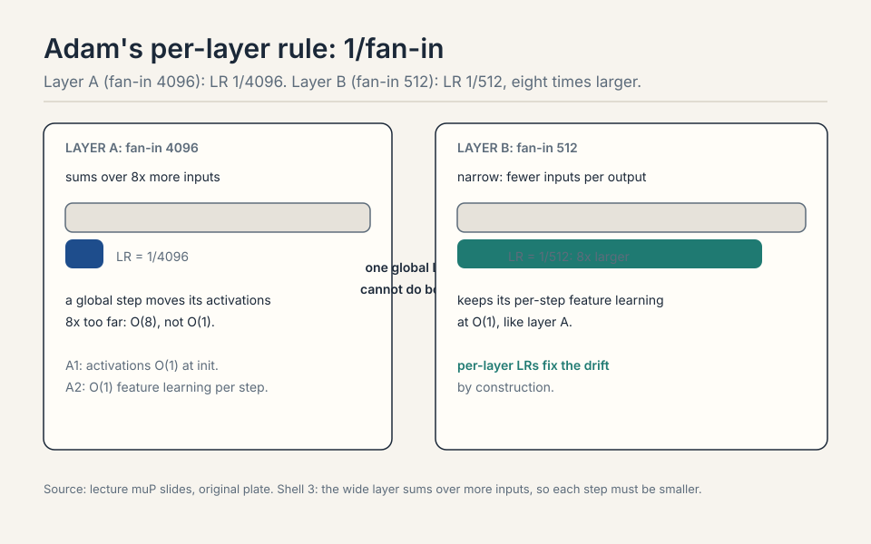

> [!QA]
> Q: Work the muP Adam rule. Two layers: fan-in 8192 and fan-in 1024. What LRs, and why?
> A: Layer A (8192): LR = 1/8192. Layer B (1024): LR = 1/1024, eight times larger. The wide layer sums over eight times more inputs, so the same global step moves its activations eight times further. To keep both layers' per-step feature learning at O(1), the wide layer's step shrinks by 8x. A single global LR would need to be 1/8192 for A and 1/1024 for B simultaneously: impossible. The drift with scale is this mismatch growing as layers widen.
> Follow-up: What breaks first when you violate muP's assumptions?
> A: The per-layer LR ratios. Learned RMSNorm gains rescale activations after the init the proof assumed. Lion's sign-based update changes the update geometry from Adam's. Large decoupled weight decay adds a shrinkage term the derivation ignored. Each violation bends the 1/fan-in rule, and the optimum starts drifting again. The stress tests tell you which violations are survivable (SwiGLU, RMSNorm) and which are not (learned gains, Lion). Empirical survival is not a proof: verify on your architecture.

### Subchapter: initialization, from Xavier to muP

Every init scheme answers one question: what variance should the
weights start with so the signal neither explodes nor vanishes?
The answers got more precise over a decade.

**Xavier/Glorot** (2010): variance = 1/fan-in (or 2/(fan-in +
fan-out)). Derived for symmetric nonlinearities (tanh, sigmoid):
it keeps the activation variance constant across layers at init.
The assumption: the nonlinearity is approximately linear near zero.

Work the preservation. A layer with fan-in 512: Xavier sets
variance = 1/512, std = 0.044. Feed it a vector with variance 1.
Each output is a sum of 512 products: Var(y) = 512 x (1/512) x 1
= 1. The variance survives the layer unchanged. Stack 50 such
layers and the signal is still O(1) at the end, not 2^50 and not
2^-50. That is what "keeps the activation variance constant"
means as arithmetic: the 1/fan-in exactly cancels the fan-in
summation.

**He/Kaiming** (2015): variance = 2/fan-in. Derived for ReLU:
ReLU kills half the activations, so the variance needs doubling to
compensate. The assumption: the nonlinearity is ReLU-like. Every
transformer init descends from He, because the residual stream's
matmuls face the same variance-preservation problem.

**muP init**: variance = 1/fan-in times the fan-ratio correction
sqrt(fan-out/fan-in), from the A1 invariant. The new demand: not
just O(1) activations at init, but O(1) activations that stay O(1)
as width grows, with the spectral norm (not the elementwise
variance) as the controlling quantity. A random matrix's spectral
norm grows as sqrt(fan-in) + sqrt(fan-out): the init must divide
by it.

Work the difference. A 4096x4096 matrix: He says variance
2/4096, std 0.022. muP says (from A1) std ~ sqrt(2/4096) x
sqrt(4096/4096): numerically close for square matrices, different
for rectangular ones. An embedding matrix (vocab 128K x dim 4096):
He gives std 0.022 regardless of shape. muP's fan-ratio correction
notices the 31:1 aspect ratio and adjusts: the embedding's output
scale must match the residual stream's, not the matrix's own
geometry. That is why muP scales the embedding output separately:
the init that is right for a square matmul is wrong for the
vocabulary projection.

The lineage: each scheme fixed the previous one's blind spot.
Xavier assumed symmetric activations. He fixed the ReLU
asymmetry. muP fixed the width dependence and the rectangular
matrices. The interview answer: init is variance bookkeeping, and
the bookkeeping got complete only when the width went to infinity
in the derivation.

> [!QA]
> Q: Why does the embedding need special init treatment under muP?
> A: Aspect ratio. A 128K x 4096 embedding matrix is 31:1 rectangular: He-style variance (2/fan-in) sets its scale from the input dim alone, ignoring that its output feeds a 4096-dim residual stream. The fan-ratio correction sqrt(fan-out/fan-in) adjusts for the shape: the embedding's output variance must match what the stream expects, not what the matrix's own geometry suggests. muP scales the embedding output as a separate rule for exactly this reason. Get it wrong and the first layer sees inputs at the wrong scale: the drift starts at layer zero.
> Follow-up: Xavier vs He vs muP: when does the choice actually matter?
> A: At scale and at the extremes. For a 10-layer MLP on MNIST, any of them trains. For a 96-layer transformer at 70B parameters, the wrong init means the signal is 10x too big or too small by layer 50, and no LR rescues it. The rectangular matrices (embeddings, LM head) are where He visibly fails: their aspect ratios break the square-matrix assumption. The choice matters where the assumptions break: deep, wide, rectangular. That is the frontier, which is why the frontier cares.

| | Xavier/Glorot (2010) | He/Kaiming (2015) | muP init |
|---|---|---|---|
| Variance | 1/fan-in | 2/fan-in | 1/fan-in x fan-ratio correction |
| Derived for | tanh/sigmoid | ReLU | width to infinity |
| Controls | elementwise variance | ReLU asymmetry | spectral norm |
| Blind spot fixed | - | symmetric activations | width dependence, rectangles |

Worked: fan-in 512, Xavier std 0.044, Var(y) = 512 x (1/512) x 1 = 1. A 4096x4096 matrix: He std 0.022. An embedding (128K x 4096): muP notices the 31:1 aspect ratio. Figure: Shell 3. Init is variance bookkeeping. Source: original table.

### Subchapter: depth scaling: the 1/sqrt(L) rule

Width has muP. Depth has its own rule. Stack L residual blocks:
each block adds its output to the stream. If each block's output
has variance v, the stream's variance after L blocks is L x v
(the additions accumulate). For the stream to stay O(1) in depth,
each block must contribute v ~ 1/L: scale the residual branches by
1/sqrt(L).

Work it. L=96 layers (a 70B-scale model). Unscaled residuals: the
final stream has 96x the variance of one block's output. The later
layers see inputs 10x larger than the early layers saw: the
effective learning dynamics differ by position. Scaled by
1/sqrt(96) ~ 0.1 per branch: every layer sees O(1) inputs, and the
depth disappears from the stability analysis.

This is why Pre-LN beat Post-LN at scale. Post-LN normalizes after
the residual addition: the normalization's statistics drift with
depth, and deep Post-LN models diverge. Pre-LN normalizes before
the block: the stream accumulates unnormalized, and the 1/sqrt(L)
scaling (or its learned equivalent) keeps it bounded. The
architecture choice and the scaling rule are the same insight:
residual streams accumulate, so scale the additions.

The muP connection: muP's width rules assume depth is handled.
The full maximal-update parameterization scales residuals by
1/sqrt(depth) alongside the width rules. Skip it and the depth
becomes the new drift: the LR that was stable across widths blows
up across depths. The Marin blowup story rhymes here: trends hold
until the parameterization's assumptions break, and depth is one
of the assumptions.

> [!QA]
> Q: Why 1/sqrt(L) and not 1/L for the residual scaling?
> A: Variances add, standard deviations take the root. L blocks each contributing variance v give total variance L x v. For O(1) total: v = 1/L, so the per-block scale (a standard deviation) is 1/sqrt(L). Scale by 1/L and you over-damp: the stream's variance collapses to 1/L, the deep layers see tiny inputs, and the network underfits. The square root is not a choice: it is what variance addition demands.
> Follow-up: Pre-LN vs Post-LN: which needs the 1/sqrt(L) rule more?
> A: Pre-LN. In Post-LN the normalization after each addition re-centers the stream, which accidentally controls the accumulation (and causes its own depth pathologies). In Pre-LN the stream accumulates raw: nothing re-centers it, so the 1/sqrt(L) scaling is the only thing keeping it O(1). Pre-LN won at scale because its pathology is fixable by scaling. Post-LN's pathology (drifting norm statistics) is structural.

L blocks, each contributing variance v: total variance L x v.
For O(1) total: v = 1/L, so the per-block scale is 1/sqrt(L).
L=96: unscaled, the stream has 96x the variance; scaled by ~0.1 per branch, every layer sees O(1) inputs.

Figure: Shell 3. Variances add; standard deviations take the root. Scale by 1/L and the stream collapses. Source: original derivation.

### Subchapter: weight decay, the muP breaker

Decoupled weight decay (AdamW) adds a shrinkage term outside the
gradient: w <- w - eta x lambda x w. The muP derivation never
modeled it. The stress tests say large decoupled weight decay
breaks the transfer: the optimum starts drifting again.

Why it breaks: the decay term's size relative to the update
depends on the weight scale, and the weight scale depends on the
layer's fan-in under muP's init. A global decay coefficient lambda
shrinks wide layers' weights proportionally more (or less) than
narrow layers', bending the 1/fan-in LR ratios the derivation
produced. The decay is not scale-free: it reintroduces the drift
muP removed.

The fixes, in practice: scale the decay per layer (same fan-in
logic as the LR), or fold the decay into the parameterization so
it transforms correctly. Some labs drop decoupled decay toward
zero at large scale and rely on the data and architecture for
regularization. The interview point: weight decay is not a free
regularizer under muP. It is a scale-sensitive term that must be
re-derived, not copied from the small run.

> [!QA]
> Q: Why does weight decay break muP when SwiGLU does not?
> A: SwiGLU changes the nonlinearity's shape but not the update's scale geometry: the A1/A2 invariants still approximately hold, so the derived ratios survive. Decoupled weight decay adds a new term to the update (shrinkage proportional to the weight) that the derivation never modeled. Its relative size depends on the weight scale, which varies by layer under muP init. The new term bends the ratios. Surviving a stress test means the violation was small. Weight decay's violation is structural: it is a different update.
> Follow-up: How do you set weight decay under muP in practice?
> A: Scale it per layer like the LR, or verify the transfer empirically. The principled answer: re-derive the decay's scaling from the invariants (the decay term must keep its size relative to the update across widths). The practical answer most labs use: keep decay small, verify the LR transfer with the 2-5% short-run check, and watch for drift. If the optimum moves, the decay is the first suspect.

, per-layer 1/fan-in. Right: every minimum at 1e-2; tune once small, deploy 5x larger. Bottom: strong assumptions; Lion, learned gains, big weight decay break it. Dense chapter plate. Source: original synthesis of the lecture.")

## Muon: spectral Adam

Muon treats matrix parameters as matrices. Momentum as usual, then
Newton-Schultz (5 iterations): orthogonalize the update, all singular
values to 1 [51:15](ts:51:15). Intuition: Adam makes every coordinate
unit size. Muon makes every spectral direction unit size. Vector
parameters (norms) keep AdamW. Newton-Schultz uses only matmuls, so it
is GPU-friendly: no SVD needed [55:03](ts:55:03).

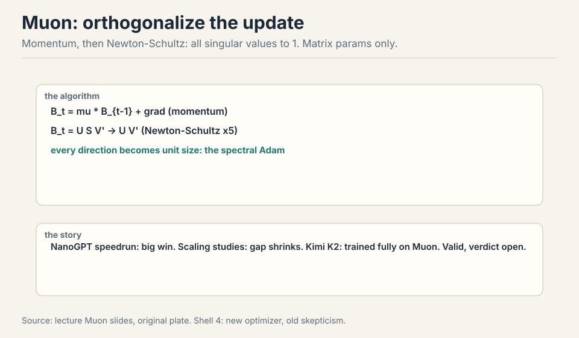

Kimi K2 trained entirely on Muon, with extra stabilization, and is an
outstanding model [54:38](ts:54:38). No ablation at that scale, so
"better than Adam" is unproven, but "works at scale" is settled. The
meta-lesson: small-scale ideas do reach big models, slowly and with
surprises. And the caution from Break 3 applies: the NanoGPT gap
shrank with scale. Watch both axes before declaring victory.

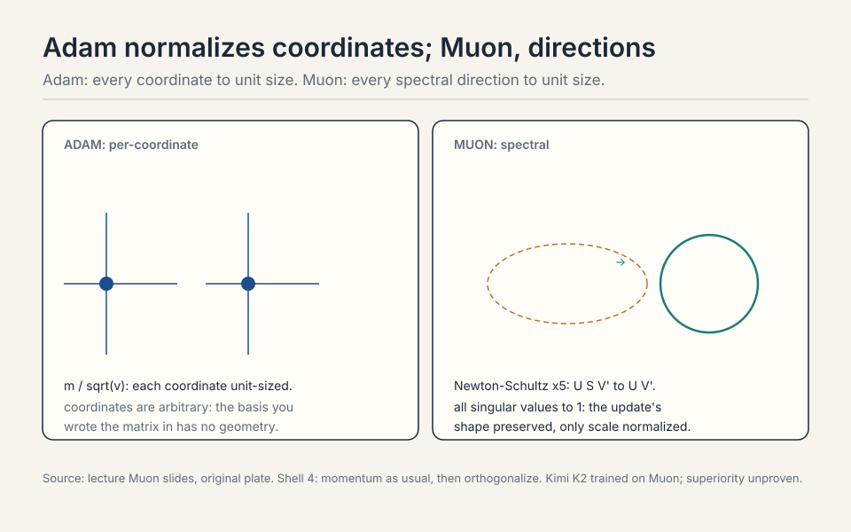

> [!QA]
> Q: Muon vs Adam: what changes in the update, concretely?
> A: Adam: keep momentum, then divide each coordinate by its root-mean-square: every coordinate ends up unit size. The geometry is per-coordinate: a million tiny independent scalings. Muon: keep momentum, then run Newton-Schultz (5 iterations of matmuls): orthogonalize the update matrix, all singular values to 1. Every spectral direction ends up unit size. The geometry is per-direction: the update's shape is preserved, only its scale is normalized. Vector parameters (norms, biases) keep AdamW: Muon is for matrices. The cost: 5 extra matmuls per step, GPU-friendly, no SVD.
> Follow-up: Why would spectral normalization beat coordinate normalization?
> A: Coordinates are arbitrary: the basis you wrote the matrix in has no geometric meaning. Spectral directions are intrinsic: they are the directions the matrix actually stretches. Normalizing them treats the update as a linear map, not a bag of numbers. Whether that wins at scale is unproven (no Kimi K2 ablation), but the geometric argument is why people tried. Kimi K2 settling "works at scale" is the current state of knowledge.

### Subchapter: SGD, the root

The lecture's optimizers sit in a lineage. Each generation changes
what the update normalizes.

**SGD**: the root. Update = -eta x gradient. No normalization:
the step's size follows the gradient's raw scale. Simple,
scale-fragile: the LR must be retuned for every width, depth, and
batch.

### Subchapter: Adam, per-coordinate normalization

**Adam**: per-coordinate normalization. Update = -eta x m /
sqrt(v): each coordinate's step is unit-sized regardless of its
gradient's scale. The scale-fragility moves from the gradient to
the architecture: the LR still drifts with width, but slower.

### Subchapter: AdamW, decoupled weight decay

**AdamW**: Adam plus decoupled weight decay. The decay is the
regularizer, separated from the gradient normalization so it does
not get divided by sqrt(v). The default for transformers since
2019. The scale story: same as Adam, plus the decay term muP does
not model.

### Subchapter: Lion, sign-based

**Lion** (Chen et al., 2023): sign-based. Update = -eta x
sign(momentum): every coordinate moves by exactly eta, no second
moment at all. Memory halves (one state, not two). The update
geometry is coarser than Adam's: all magnitude information is
discarded. Breaks muP's assumptions (the derivation assumed Adam's
normalization).

### Subchapter: Muon, spectral normalization

**Muon**: spectral, not coordinate. Orthogonalize the momentum:
every spectral direction unit-sized. The geometry is the matrix's
own, not the coordinate grid's. Kimi K2's full-run choice.

### Subchapter: SOAP and Shampoo, second-order

**SOAP / Shampoo**: second-order. Precondition with the gradient
covariance (Shampoo) or its factored approximations (SOAP):
the update accounts for curvature, not just scale. The memory and
compute costs are steep (the preconditioners are matrix-sized), so
they live in research and in small-model speedruns, not in
frontier pretraining. The direction the field keeps probing:
curvature matters more as models get bigger, but nobody has paid
the bill at trillion-parameter scale yet.

The tree's lesson: every optimizer is a choice of what to
normalize (nothing, coordinates, signs, spectral directions,
curvature) and what it costs (memory, compute, theoretical
coverage). The scale question is always the same: does the
optimum transfer? Only muP answers it by construction. The rest
answer it by fitting.

> [!QA]
> Q: Place Lion, Muon, and Shampoo on one axis. What varies?
> A: What the update normalizes and how much curvature it sees. Lion normalizes the least: sign(momentum), every coordinate moves eta, magnitude information discarded. Muon normalizes the spectral directions: the matrix's intrinsic geometry, shape preserved. Shampoo normalizes by the gradient covariance: full second-order curvature. The axis runs from cheap and coarse (Lion: one state, sign only) to expensive and informed (Shampoo: matrix-sized preconditioners). Adam sits between Lion and Muon: per-coordinate, first-order. The cost rises along the axis: memory, compute, and implementation complexity. The frontier's revealed preference (AdamW default, Muon at Kimi K2, Shampoo in papers) says the middle of the axis is where the bills get paid.
> Follow-up: Why has no second-order optimizer won pretraining?
> A: The bill. Shampoo's preconditioners cost memory proportional to the parameter matrices and compute per step that rivals the forward pass. At trillion-parameter scale, that bill exceeds the savings from faster convergence. The crossover where curvature pays for itself keeps receding as models grow: bigger models mean bigger preconditioners. SOAP trims the cost with factored approximations, but the gap to AdamW's simplicity remains wide. Second order wins when compute per step is cheap relative to the number of steps saved. Pretraining has not reached that regime.

| | What it normalizes | Cost | Scale story |
|---|---|---|---|
| SGD | nothing | retune everywhere | the root, scale-fragile |
| Adam | per-coordinate | LR still drifts with width | the default since 2019 (AdamW) |
| AdamW | per-coordinate + decoupled decay | decay breaks muP | same as Adam, plus the decay term |
| Lion | sign(momentum) | memory halves | breaks muP's assumptions |
| Muon | spectral directions | 5 extra matmuls | Kimi K2: works at scale, verdict open |
| SOAP/Shampoo | curvature | matrix-sized preconditioners | research only at frontier scale |

Figure: Shell 4. Every optimizer is a choice of what to normalize and what it costs. Source: original table.

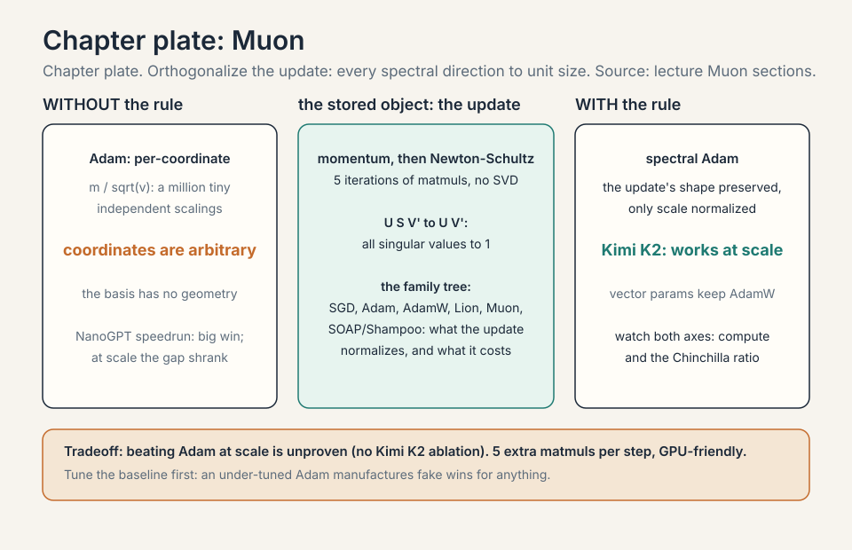

## MoE scaling at the frontier

2026 is the MoE era, and the scaling questions moved with it
[23:51](ts:23:51):

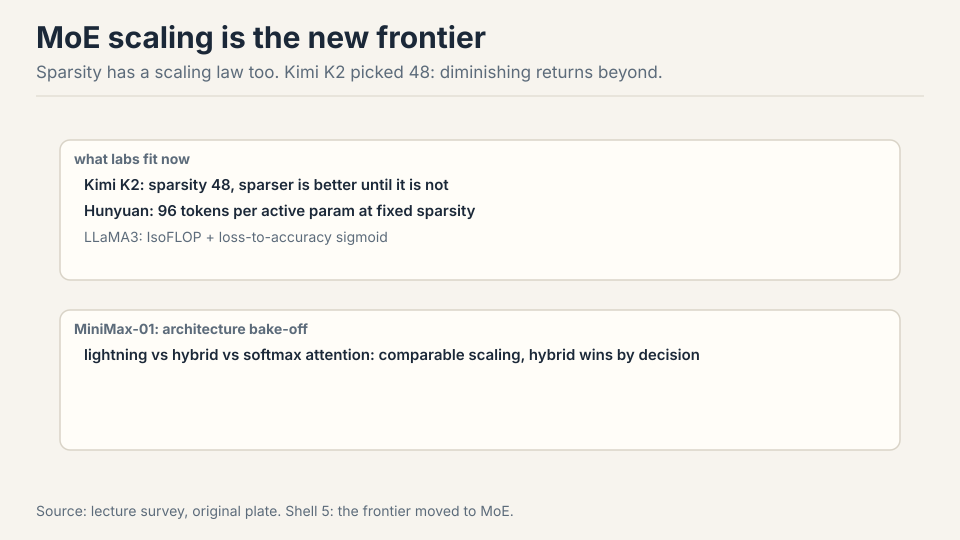

- **Kimi K2**: sweep sparsity at fixed FLOPs. Sparser wins until
  diminishing returns at sparsity 48 [24:46](ts:24:46).
- **Hunyuan**: 96 tokens per active parameter at fixed sparsity
  [25:27](ts:25:27).
- **LLaMA 3**: IsoFLOP ratios plus a loss-to-accuracy sigmoid: the
  bridge from perplexity scaling to downstream [25:53](ts:25:53).
- **MiniMax-01**: architecture bake-off, lightning vs hybrid vs
  softmax attention. Comparable scaling, hybrid deployed
  [27:03](ts:27:03).

The old questions (Chinchilla, LR scaling) are now assumed knowledge
and disappearing from papers [28:47](ts:28:47). Post-training synergy
remains open: no good integrated scaling with post-training exists
yet [29:47](ts:29:47).

## Mapping back: what each tool fixes

| Pain | Tool | How |
|---|---|---|
| LR drifts with scale | muP | Reparameterize. Every size's optimum lands at 1e-2. Tune once small. |
| Cosine wastes every sweep | WSD | Trapezoid: warmup, stable, rapid decay. Rewind and re-decay at 10% cost. |
| New setup, new grid | Fit philosophy | Grid LR x batch, fit drift, extrapolate. Batch ~ sqrt(D), LR falls with N. |
| Beautiful trend, sudden blowup | muP-style parameterization | Marin: the fix for deviation-then-blowup. Trends are not promises. |
| Small wins lie | Two-axis checks | Watch compute and D/N. Tune the baseline first. |
| Adam's coordinate scaling | Muon | Orthogonalize the update. Spectral directions to unit size. |
| MoE has new dials | Frontier bake-offs | Sparsity 48 (Kimi), 96 tok/active (Hunyuan). Sweep at fixed FLOPs. |

## The honest price

muP's theory does not cover SwiGLU, RMSNorm, Lion, or large decoupled
weight decay: empirical survival is not a proof. Muon's superiority
over Adam at scale is unproven: no Kimi K2 ablation exists. The
DeepSeek LR-fit lines are visibly noisy: directional, not precise. The
StepFun findings are contingent on their setup: numbers move, phenomena
stay. Post-training synergy with scaling is open: no integrated law
exists yet. And the oldest warning in the lecture: scaling laws feel
scientific, but transfer is vibes. Verify on your own setup.

## Coverage map: every lecture claim and where it lives

| Lecture claim | Covered in | File line |
|---|---|---|
| The learning rate moved: tune at 1B, deploy at 5x, the optimum drifts | The problem: the learning rate moved | L42 |
| Fit the drift: grid LR x batch, DeepSeek's recipe (batch up, LR down) | First attempt: fit the drift | L51 |
| StepFun: batch ~ sqrt(D), ignores N; LR falls with N, rises with D | First attempt: fit the drift | L51 |
| Hyperparameter surface smooth and convex per slice | First attempt: fit the drift | L51 |
| Laws transfer to MoE at fixed active params; shift with data | First attempt: fit the drift | L51 |
| The width-scaling derivation: LR ~ 1/width from the update ratio | the width-scaling derivation | L83 |
| Break 1: cosine schedules waste every sweep | break 1, cosine schedules waste every sweep | L118 |
| WSD: warmup, stable, rapid decay; rewind and re-decay at 10% | Where the frontier breaks: three cautionary tales | L116 |
| WSD vs cosine: the reuse arithmetic | WSD vs cosine, the reuse arithmetic | L137 |
| Break 2: Marin, beautiful scaling then blowup, muP-style fix | break 2, beautiful scaling then blowup | L166 |
| Break 3: Muon's NanoGPT win shrank with scale; tune the baseline | break 3, small wins lie | L174 |
| Key question: what if the optimum did not move at all | The key question | L187 |
| muP: MiniCPM, every size's minimum at 1e-2 | muP: stabilize the optimum | L194 |
| The muP recipe: embeddings, residuals, fan ratios, per-tensor LRs | muP: stabilize the optimum | L194 |
| Cerebras GPT: muP stabilizes the scaling-law fits | muP: stabilize the optimum | L194 |
| Two philosophies: stabilize (muP) vs fit (DeepSeek) | muP: stabilize the optimum | L194 |
| Who stabilizes, who fits, Oct 2026 | what is used where (who stabilizes, who fits) | L220 |
| A1/A2 invariants; init and LR rules drop out | The muP derivation, in brief | L250 |
| The Adam per-layer rule, worked: 1/fan-in | the Adam per-layer rule, worked | L281 |
| Depth scaling: the 1/sqrt(L) rule; Pre-LN vs Post-LN | depth scaling: the 1/sqrt(L) rule | L370 |
| Initialization: Xavier to He to muP, the fan-ratio correction | initialization, from Xavier to muP | L312 |
| Weight decay breaks muP: the structural violation | weight decay, the muP breaker | L408 |
| Stress tests: SwiGLU/RMSNorm survive; learned gains, Lion, big WD break it | The muP derivation, in brief | L250 |
| Muon: momentum + Newton-Schultz, spectral Adam | Muon: spectral Adam | L437 |
| Kimi K2 trained fully on Muon; superiority unproven | Muon: spectral Adam | L437 |
| The optimizer family tree: SGD to Shampoo, one subchapter per optimizer | SGD, the root; Adam, per-coordinate normalization; AdamW, decoupled weight decay; Lion, sign-based; Muon, spectral normalization; SOAP and Shampoo, second-order | L463 |
| MoE scaling: Kimi K2 sparsity 48, Hunyuan 96 tok/active, Llama 3, MiniMax-01 | MoE scaling at the frontier | L527 |
| Post-training synergy: no integrated law yet | MoE scaling at the frontier | L527 |
| Mapping table: pain, tool, how | Mapping back: what each tool fixes | L549 |
| Honest price: theory gaps, unproven superiority, vibes transfer | The honest price | L561 |

## Recap: the whole lesson on one screen

The story in eight steps. Each step answers the one before it.

1. **The learning rate moved.** Tune at 1B, deploy at 5x: the optimum
   drifts. Retuning on the big run costs a fortune.
2. **Fit the drift.** Grid LR x batch, extrapolate. Batch ~ sqrt(D),
   ignores N. LR falls with N, rises with D. Numbers contingent,
   phenomena not.
3. **Cosine wastes sweeps.** Every budget restarts from scratch. WSD:
   warmup, long stable phase, rapid decay. Rewind and re-decay at
   10% cost.
4. **Trends are not promises.** Marin: beautiful Chinchilla scaling,
   then deviation, then blowup. Fix: muP-style parameterization.
5. **Stabilize the optimum.** muP: A1 activations O(1) at init, A2
   O(1) feature learning. Out: fan-ratio init, per-layer LRs. Every
   minimum at 1e-2.
6. **Two philosophies.** Stabilize (MiniCPM/muP) or fit (DeepSeek).
   Both ship frontier models. Stabilize what you can, fit the rest.
7. **Muon orthogonalizes.** Momentum plus Newton-Schultz: singular
   values to 1. Spectral Adam for matrices. Kimi K2 runs on it.
   Superiority unproven, scale-survival settled.
8. **The frontier moved to MoE.** Sparsity 48, 96 tok/active param,
   architecture bake-offs. Post-training synergy still open.

## Go deeper

<iframe style="position:absolute;top:0;left:0;width:100%;height:100%;" src="https://www.youtube-nocookie.com/embed/a-7dtkQJHcs" title="What is muP (Maximal Update Parametrization)?" frameborder="0" allow="accelerometer; autoplay; clipboard-write; encrypted-media; gyroscope; picture-in-picture" allowfullscreen></iframe>

- What is muP (the embed above): https://www.youtube.com/watch?v=a-7dtkQJHcs
- Yang et al., Tensor Programs V / muTransfer: https://arxiv.org/abs/2203.03466
- Hu et al., MiniCPM (WSD schedule): https://arxiv.org/abs/2404.06395

## Official sources and further reading

**Official:**
- Lecture 11 video and slides (lecture_11.pdf).
- MiniCPM paper. DeepSeek LLM paper. Kimi K2 report.

**Further reading:**
- Tensor Programs series (Greg Yang). Jeremy Bernstein's muP
  review. The muP stress-test paper.
- StepFun hyperparameter scaling study. Porian et al. optimizer
  scaling comparisons.
- LLaMA 3, Hunyuan, MiniMax-01 reports for MoE-era scaling.

**Caveats from these sources.** LR-fit lines in the DeepSeek plots
are visibly noisy: treat as directional, not precise. Muon's
superiority over Adam at scale is unproven (no Kimi K2 ablation).
muP theory does not cover SwiGLU/RMSNorm/Lion: empirical survival is
not a proof. Post-training synergy with scaling is open.

## Connections to the other courses

- **CS336 L09:** the classical scaling canon this lecture extends.
- **CS336 L03:** the architecture choices (SwiGLU, RMSNorm) that muP
  must survive.
- **CS229:** optimization theory behind the two invariants.
