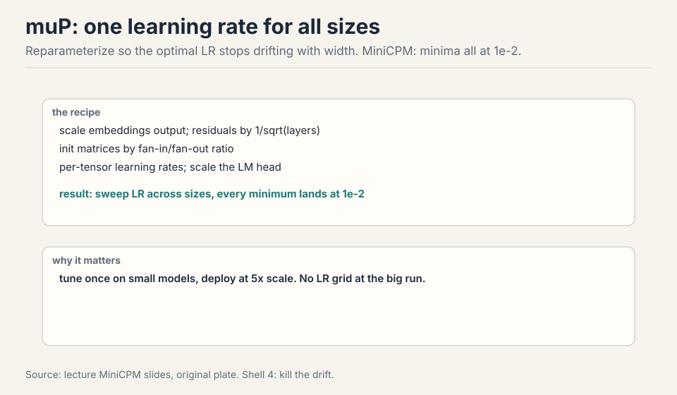
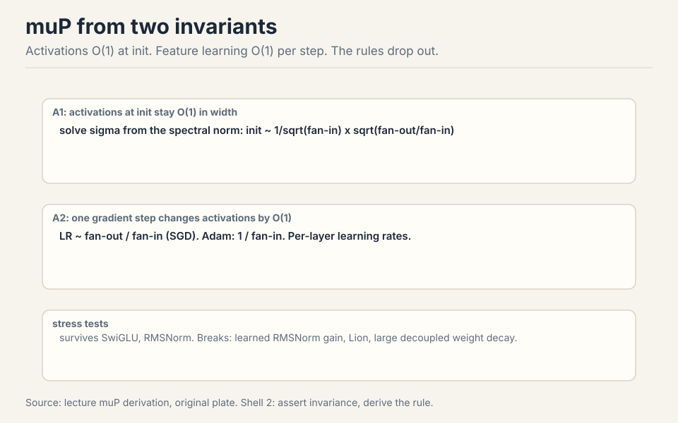

## How to read this lesson

Lecture 9 gave the classical canon. This is the frontier: what the
open labs actually do. **Level 1 (Core):** muP, WSD, the two
philosophies, LR and batch laws. **Level 2 (Deep):** optimizer
scale-dependence, Muon, the muP derivation, MoE scaling.

## Level 1: muP stabilizes the learning rate

MiniCPM (2024), a state-of-the-art 1-2B model at release, built on
muP: a reparameterization whose whole point is that the optimal
learning rate stops moving with scale [05:22](ts:05:22).

, init by fan ratios, per-tensor LRs. Every size's minimum lands at 1e-2.")

The recipe: scale the embedding output, scale residuals by the square
root of depth, initialize matrices by fan-in/fan-out ratios, use
per-tensor learning rates, scale the LM head. Result: sweep the LR
across model sizes and every minimum sits at 1e-2 [07:50](ts:07:50).
Tune once small, deploy 5x larger. Cerebras GPT found muP also
stabilizes the scaling-law fits themselves [59:14](ts:59:14).

## Level 1: WSD, the reusable schedule

Chinchilla sweeps with cosine schedules are wasteful: every data
budget needs its own schedule, so every run restarts from scratch
[10:37](ts:10:37). Warmup-stable-decay fixes it.

Warmup in constant steps (horizon-independent), hold constant through
the stable phase, then decay rapidly (10-20% of the run) to ~10% of
max [11:13](ts:11:13). Want a longer run? Roll back to a stable
checkpoint, extend, re-decay: 10% cost instead of 100%. WSD looks
worse than cosine until the decay hits, then matches or exceeds it
[13:08](ts:13:08). The decay is doing the real annealing work.

## Level 1: Two philosophies

- **Stabilize** (MiniCPM/muP): change the parameterization until the
  optimum stops moving.
- **Fit** (DeepSeek): grid LR x batch at several scales, fit the
  drift, extrapolate. Batch rises with compute, LR falls
  [16:31](ts:16:31).

Qwen 2.5/3 and Kimi follow the fit recipe. It is now standard
practice [23:02](ts:23:02). Neither philosophy has won. Both have
shipped frontier models.

## Level 1: What the grids say

The StepFun study burned serious compute gridding LR x batch across
models and data sizes [30:31](ts:30:31). Findings:

- The hyperparameter surface is smooth and convex per slice:
  gridding is viable [34:49](ts:34:49).
- Optimal batch size depends only on D (data), roughly sqrt(D):
  model size does not matter [35:36](ts:35:36).
- Optimal LR falls with model size N and rises with data D.
  Counterintuitive, fragile across studies, but clear in theirs
  [36:11](ts:36:11).
- Under Chinchilla scaling (N and D move together), LR falls with
  compute: consistent with the DeepSeek law [38:44](ts:38:44).

The laws transfer to MoE at fixed active parameters. They shift with
the data distribution: numbers are contingent, phenomena are not
[37:46](ts:37:46).

> [!QA]
> Q: Should I just copy the StepFun LR and batch formulas instead of running my own grid?
> A: If you are near their compute regime, yes: their numbers beat guesses from a hat. If you run a big pretraining run with your own architecture, weight decay, or data, redo the check. Scaling laws feel scientific, but transfer is vibes: tiny setup differences move the numbers. The lecture's advice is to treat published laws as strong defaults, then verify first-order correctness on your own setup.
> Follow-up: Why does the optimal batch size ignore model size?
> A: The batch size balances gradient noise against steps, and the noise scale is set by the data and the loss level, not by how many parameters average it. A bigger model at the same loss sees the same noise geometry per step. What changes with N is the learning rate: more parameters move more things at once, so each step must be smaller.

## Level 2: Optimizers are scale-dependent

Muon beat Adam badly on the NanoGPT speedrun. At larger scales, the
gap shrank [42:24](ts:42:24). Two lessons. First, tune the baseline:
an under-tuned Adam manufactures fake wins for anything
[44:00](ts:44:00). Second, watch both axes: compute and the Chinchilla
ratio D/N. An optimizer can win overparameterized and lose
data-rich [46:00](ts:46:00).

The Marin story (cautious AdamW): beautiful Chinchilla scaling for
orders of magnitude, then deviation, then blowup. The fix was
muP-style parameterization [47:32](ts:47:32). Scaling trends are not
promises.

## Level 2: Muon

Muon treats matrix parameters as matrices. Momentum as usual, then
Newton-Schultz (5 iterations): orthogonalize the update, all singular
values to 1 [51:15](ts:51:15). Intuition: Adam makes every coordinate
unit size. Muon makes every spectral direction unit size. Vector
parameters (norms) keep AdamW. Newton-Schultz uses only matmuls, so it
is GPU-friendly: no SVD needed [55:03](ts:55:03).

Kimi K2 trained entirely on Muon, with extra stabilization, and is an
outstanding model [54:38](ts:54:38). No ablation at that scale, so
"better than Adam" is unproven, but "works at scale" is settled. The
meta-lesson: small-scale ideas do reach big models, slowly and with
surprises.

## Level 2: The muP derivation, in brief

Two physicist invariants [60:44](ts:60:44):

 at init. A2: O(1) feature learning per step. Out come the init and LR rules.")

- **A1**: activations at init stay O(1) in width. Solve the init
  scale from the random matrix's spectral norm: init carries
  1/sqrt(fan-in) times sqrt(fan-out/fan-in).
- **A2**: one gradient step changes activations by O(1) (feature
  learning, not NTK). Track the update's terms, demand they match:
  LR ~ fan-out/fan-in for SGD, 1/fan-in for Adam. Per-layer LRs.

Assumptions are strong (no cancellations, unit loss progress), but the
rules that drop out work. Stress tests: SwiGLU and RMSNorm survive in
practice. Learned RMSNorm gains, Lion, and large decoupled weight
decay break it [72:43](ts:72:43).

> [!QA]
> Q: Why does muP give per-layer learning rates instead of one global LR?
> A: Different layers have different fan-in/fan-out geometry, so the same global step changes their activations by different amounts. The derivation solves for the step that keeps every layer's feature learning O(1), and that step depends on the layer's shape. Adam's version (1/fan-in) says it plainly: wide layers, which sum over many inputs, need smaller steps. One LR for all layers is the thing that drifts with scale.
> Follow-up: If muP is so principled, why do labs still fit scaling laws for LR?
> A: muP's theory covers width scaling with clean architectures. Reality has depth, SwiGLU, RMSNorm, exotic optimizers, and weight decay, all outside the proof. Fitting the drift makes no theoretical claims and absorbs all of it. Stabilize what you can, fit the rest. The lecture presents them as complementary, not competing.

## Level 2: MoE scaling at the frontier

2026 is the MoE era, and the scaling questions moved with it
[23:51](ts:23:51):

- **Kimi K2**: sweep sparsity at fixed FLOPs. Sparser wins until
  diminishing returns at sparsity 48 [24:46](ts:24:46).
- **Hunyuan**: 96 tokens per active parameter at fixed sparsity
  [25:27](ts:25:27).
- **LLaMA 3**: IsoFLOP ratios plus a loss-to-accuracy sigmoid: the
  bridge from perplexity scaling to downstream [25:53](ts:25:53).
- **MiniMax-01**: architecture bake-off, lightning vs hybrid vs
  softmax attention. Comparable scaling, hybrid deployed
  [27:03](ts:27:03).

The old questions (Chinchilla, LR scaling) are now assumed knowledge
and disappearing from papers [28:47](ts:28:47). Post-training synergy
remains open: no good integrated scaling with post-training exists
yet [29:47](ts:29:47).

## Recap: the whole lesson on one screen

<strong>1. muP kills LR drift</strong>

Reparameterize: embeddings, residuals, fan-ratio init, per-tensor
LRs. Every size's optimum lands at 1e-2. Tune once, scale 5x.

Key: one LR for all sizes

<strong>2. WSD rewinds</strong>

Warmup, long stable phase, rapid decay. Roll back and re-decay
instead of restarting. Chinchilla sweeps at 10% cost.

Key: the trapezoid

<strong>3. Stabilize or fit</strong>

MiniCPM stabilizes the optimum with muP. DeepSeek fits the drift
with scaling laws. Both ship frontier models.

Key: pick your religion

<strong>4. Batch follows data</strong>

Optimal batch: sqrt(D), ignores N. LR: down with N, up with D.
Under Chinchilla, LR falls with compute.

Key: batch ~ sqrt(D)

<strong>5. Small wins lie</strong>

Watch compute and the Chinchilla ratio. Tune the baseline.
Beautiful scaling can blow up. muP-style fixes help.

Key: two axes

<strong>6. Muon orthogonalizes</strong>

Momentum plus Newton-Schultz: singular values to 1. Spectral
Adam for matrices, AdamW for vectors. Kimi K2 runs on it.

Key: unit spectral directions

<strong>7. Invariants imply rules</strong>

A1: activations O(1) at init. A2: O(1) feature learning. Out:
fan-ratio init, per-layer LRs. Breaks on learned gains, Lion, big
decay.

Key: assert, then derive

<strong>8. Sparsity scales too</strong>

Kimi K2: sparsity 48. Hunyuan: 96 tok/active param. Bake off
architectures with scaling plots, then deploy.

Key: the frontier moved

## Official sources and further reading

**Official:**
- Lecture 11 video and slides (lecture_11.pdf).
- MiniCPM paper. DeepSeek LLM paper. Kimi K2 report.

**Further reading:**
- Tensor Programs series (Greg Yang). Jeremy Bernstein's muP
  review. The muP stress-test paper.
- StepFun hyperparameter scaling study. Porian et al. optimizer
  scaling comparisons.
- LLaMA 3, Hunyuan, MiniMax-01 reports for MoE-era scaling.

**Caveats from these sources.** LR-fit lines in the DeepSeek plots
are visibly noisy: treat as directional, not precise. Muon's
superiority over Adam at scale is unproven (no Kimi K2 ablation).
muP theory does not cover SwiGLU/RMSNorm/Lion: empirical survival is
not a proof. Post-training synergy with scaling is open.

## Connections to the other courses

- **CS336 Lecture 9:** the classical scaling canon this lecture
  extends.
- **CS336 Lecture 3:** the architecture choices (SwiGLU, RMSNorm)
  that muP must survive.
- **CS229:** optimization theory behind the two invariants.

> [!CHEAT]
> **Advanced scaling cheatsheet.** MiniCPM: muP, LR optimum 1e-2 at all sizes, 5x ladder. WSD: warmup, stable, decay 10-20%, rewind and re-decay. Philosophies: stabilize (muP) vs fit (DeepSeek). StepFun: batch ~ sqrt(D), LR down N up D, smooth contours. Optimizers: small wins lie, watch compute x Chinchilla ratio, tune baselines, Marin blowup. Muon: momentum + Newton-Schultz x5, SVD to UV', matrices only, Kimi K2. muP math: A1 activations O(1), A2 feature learning O(1), LR fan-out/fan-in (SGD) or 1/fan-in (Adam). Breaks: learned norm gain, Lion, big decay. MoE: Kimi sparsity 48, Hunyuan 96 tok/active, LLaMA3 sigmoid, MiniMax bake-off. No silver bullet: scaling is art plus vibes.

> [!MEMORY]
> **Stabilize what you can, fit the rest.** muP for invariance, scaling laws for drift, and skepticism for both.
