### Coverage and sourcing

This lesson follows Lecture 12 of Stanford CS336 (Language Modeling
from Scratch, Spring 2026, instructor Percy Liang), "Evaluation,"
delivered May 6, 2026, duration 1:18:26. It uses the official
subtitle transcript. Every timestamped claim below comes from the
lecture. Figures marked October 2026 are updates added after the
session, each with its source: benchmark papers and leaderboards
(MMLU, GPQA, HLE, SWE-bench, ARC-AGI, LMArena), current as of
October 2026. Leaderboard numbers are snapshots: they decay with
contamination and saturation, and the lecture's "Mythos" figures
are illustrative. The coverage map at the end of the chapter maps
every major lecture claim to the section that covers it, with file
line numbers.

## The problem: what is good?

You are about to spend millions training a model. How do you know it
is good? Four lenses, no correct answer [02:38](ts:02:38).

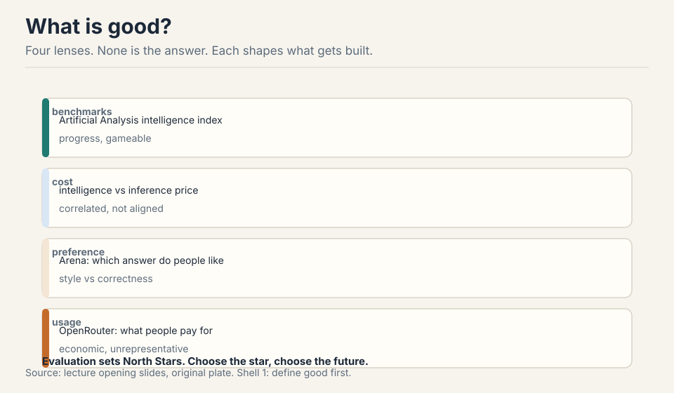

**Benchmarks** (Artificial Analysis intelligence index): standardized
scores. **Cost** (intelligence vs inference price): correlated with
benchmarks, not aligned. **Preference** (Arena): which answer people
like. **Usage** (OpenRouter): what people pay for. The deep point:
evaluation sets North Stars, and North Stars shape what gets built
[01:32](ts:01:32).

Evaluation turns an abstract construct (reasoning, conversation) into
a concrete metric over concrete prompts [02:01](ts:02:01). That
translation is the whole challenge. Get it wrong and you optimize the
wrong thing at million-dollar scale.

## First attempt: perplexity, the cleanest metric

A language model is a distribution P(x). **Perplexity** asks how much
probability mass it puts on the test set [05:30](ts:05:30). Work the
toy. Test sentence: "the cat sat". Model A assigns: P(the)=0.5,
P(cat|the)=0.4, P(sat|the cat)=0.5. Product = 0.1. Perplexity =
0.1^(-1/3) = 2.15. Model B assigns 0.9, 0.9, 0.9: product 0.729,
perplexity 1.11. Lower is better: the model is less surprised by real
text.

The 2010s paradigm: in-distribution, train split to test split, PTB
and WikiText-103. GPT-2 (2019) broke it: train on WebText, evaluate
zero-shot on everyone else's benchmarks. Out-of-distribution became
the norm [07:52](ts:07:52).

"Perplexity is all you need": the unique minimizer is the true
distribution, and the true distribution solves everything
[09:46](ts:09:46). Belief in this drove scaling before the gains were
obvious. The best possible perplexity is the entropy of truth itself:
no model beats the data's own uncertainty.

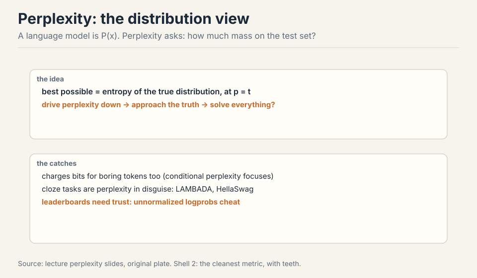

### Subchapter: perplexity as average branching factor

Read the toy again, but slower. Model A: probabilities 0.5, 0.4,
0.5. Product 0.1. Perplexity 2.15. What does 2.15 mean? At each
position, the model behaves as if choosing among 2.15 equally
likely continuations. Model B: 1.11. At each position, barely more
than one choice: the model is almost certain.

Perplexity is the geometric mean of the inverse probabilities.
Take the negative log of the product, divide by the token count,
exponentiate: that is cross-entropy, exponentiated. So perplexity
is exp(average surprise). A model with perplexity 10 is, on
average, as surprised as if every token came from a 10-way uniform
choice. The floor is the data's own entropy: if the true next word
is genuinely uncertain (say 4 plausible continuations), no model
scores below 4. Perplexity measures the model against the
unavoidable uncertainty of the text itself.

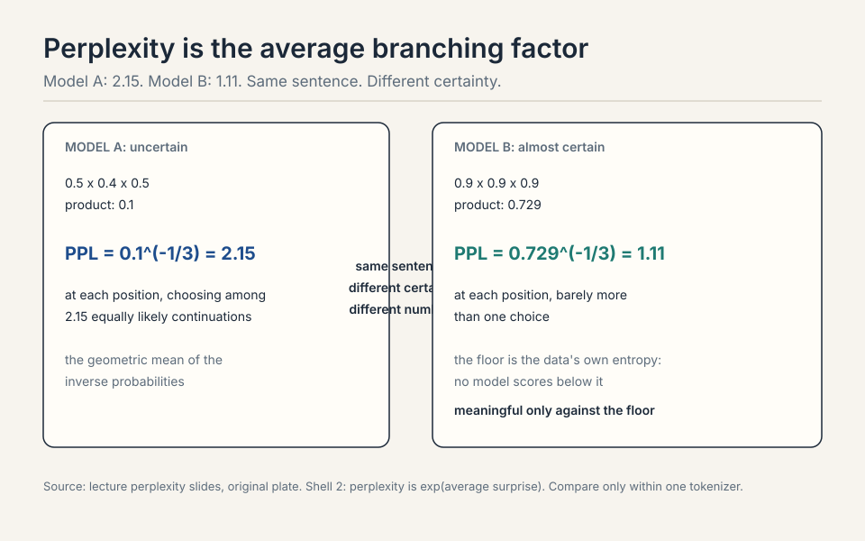

> [!QA]
> Q: Walk me through the perplexity toy with a third model. Model C assigns 0.1, 0.1, 0.1.
> A: Product: 0.1 x 0.1 x 0.1 = 0.001. Perplexity: 0.001^(-1/3) = 10. At each position the model is as surprised as a 10-way uniform choice: it is barely better than guessing. Compare: A at 2.15, B at 1.11, C at 10. Now ask what the floor is. If the test sentence were "the cat sat on the mat", and after "the cat" the true distribution were {sat: 0.5, slept: 0.3, ran: 0.2}, the best any model can do on that token is 1/0.5 = 2 in the geometric mean: the entropy of truth. C's 10 says it knows almost nothing. B's 1.11 says it is near the floor. The number is meaningful only against the floor.
> Follow-up: Why the geometric mean and not the arithmetic mean of probabilities?
> A: The arithmetic mean of 0.5, 0.4, 0.5 is 0.47, which says nothing about surprise. The product is the probability of the whole sequence: 0.1. The geometric mean (0.1^(1/3) = 0.46) is the per-token probability, and its inverse (2.15) is the branching factor. Multiplication is the right aggregation because the sequence probability factorizes. The arithmetic mean would let one confident token hide two clueless ones.

; the floor is the data's entropy. Right: same tokenizer only; perplexity measures fit, not skill. Bottom: train on perplexity, evaluate on tasks. Dense chapter plate. Source: original synthesis of the lecture.")

## Where perplexity breaks: three demonstrations

**Break 1: boring tokens.** Perplexity charges bits for every token
equally. "Marie Curie was founded in..." vs "Marie Curie was born in
1867": the model pays as much for getting "founded" right as for
"1867", but only one of those is knowledge. **Conditional perplexity**
focuses on the tokens that matter [11:43](ts:11:43). Cloze benchmarks
are perplexity in disguise: LAMBADA and HellaSwag are next-token
prediction with carefully chosen positions [13:22](ts:13:22).

**Break 2: trust.** Perplexity leaderboards need trust: un-normalized
logprobs cheat, so the probabilities must be real [15:18](ts:15:18).
Downstream tasks are black-box and checkable: you can verify the
answer without trusting the model. Perplexity is white-box and
trust-based. A leaderboard of self-reported numbers is a leaderboard
of honesty.

**Break 3: upstream is not downstream.** From Lecture 9: the best
perplexity model (NL12) lost to a worse-perplexity one (NL32XL) on
downstream tasks. A better perplexity does not guarantee a better
assistant. The cleanest metric is not always the most relevant one.

> [!QA]
> Q: If perplexity is the true objective, why do we need any other benchmark?
> A: Three reasons. First, perplexity spends capacity on every token equally, including tokens nobody cares about. Conditional perplexity and task benchmarks focus the measurement. Second, upstream-to-downstream transfer is uncertain (Lecture 9): a better perplexity does not guarantee a better assistant. Third, perplexity cannot be checked black-box. You must trust the reported probabilities. Benchmarks exist because the cleanest metric is not always the most honest or the most relevant one.
> Follow-up: Why did GPT-2's zero-shot evaluation matter?
> A: It changed the contract. In-distribution evaluation rewards memorizing one dataset's quirks. Zero-shot rewards a model that generalizes to tasks it never trained on. That reframing, from "fit this distribution" to "handle anything," is what turned language models from research artifacts into general-purpose tools.

## The key question

Perplexity measures the distribution. But we want reasoning, helpful
conversation, working code. What if each abstract thing we want needs
its own translation into concrete prompts and concrete scores? Then
there is no one evaluation. There is a toolbox, and purpose picks the
tool.

## The exam treadmill

Exams give control over subject and difficulty, with unambiguous
answers [18:18](ts:18:18).

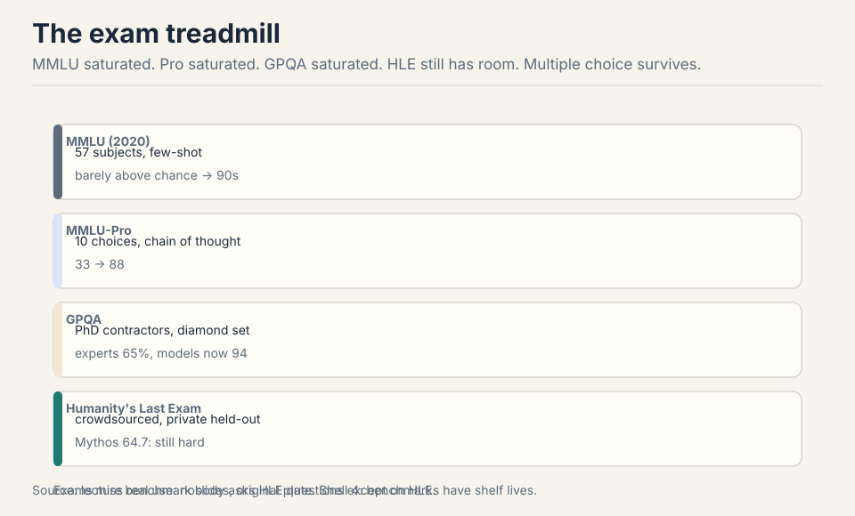

MMLU (2020): 57 subjects, few-shot, radical at the time. GPT-3 barely
above chance on small models, now 90s [19:07](ts:19:07). MMLU-Pro: 10
choices, chain of thought, 33 to 88. GPQA: PhD contractors, diamond
validation, experts at 65%, models now at 94 [23:20](ts:23:20).
Humanity's Last Exam: crowdsourced, private held-out set, Mythos at
64.7: still hard [27:29](ts:27:29).

Multiple choice survives: it can be arbitrarily hard. Its limit is
realism: nobody asks HLE questions except on HLE [30:03](ts:30:03).
And contamination shadows every number: the test set lives on the
internet, and so does the training data [26:14](ts:26:14).

> [!QA]
> Q: Why does multiple choice survive when every benchmark saturates?
> A: Because difficulty is a free parameter. Open-ended generation is bounded by what a judge can score. Multiple choice is bounded only by the question writer's imagination. MMLU saturated, so MMLU-Pro added choices and chain of thought. GPQA hired PhD contractors. HLE crowdsourced the hardest questions humans can write. Each step is harder to write than the last, but the format never runs out of headroom. The price is realism: the format tests exam-taking, not doing. It survives as a measure of knowledge and reasoning under controlled conditions, not as a measure of the product.
> Follow-up: What kills a multiple-choice benchmark if not saturation?
> A: Contamination. The questions are public, so the training data absorbs them. A saturated benchmark is honest about being easy. A contaminated one lies about being hard. The order-preference test (validity section) is one lie detector. The deeper fix is private held-out sets like HLE's: questions nobody has seen. But private sets cannot be audited by the community, so you trade transparency for signal. Every benchmark dies one of the two deaths: saturation or contamination.

### Subchapter: GPQA diamond, how the sausage is made

GPQA (Rein et al., 2023) is the exam treadmill's answer to "are
the questions actually hard?" The construction: domain experts
(PhD holders and candidates in biology, physics, chemistry) write
multiple-choice questions in their specialty, then validate each
other's questions. The **diamond** set (448 questions) is the
subset that survived two filters: the validators agreed the
question is correct and well-posed, and non-expert validators
could not answer it (so it is not Googleable trivia).

The baselines: domain experts score about 65% on diamond. Skilled
non-experts with web access score about 34%. GPT-4 at release
scored about 39%: below the experts, above the Googlers. The
models' climb to 94% is the treadmill in one number: the benchmark
was designed to be hard for years, and the reasoning-model era
ate the headroom in one.

Why diamond matters as a method, not just a score: it separates
question quality from question difficulty. MMLU's questions were
scraped from the internet: variable quality, some ambiguous, some
wrong. GPQA's survived expert validation: when a model misses a
diamond question, the miss means something. The price: 448
questions cost expert-months to produce. Difficulty is a free
parameter in theory. In practice it is priced in PhD hours.

> [!QA]
> Q: Why is GPQA diamond a better instrument than MMLU, concretely?
> A: Validation. MMLU's 15,000 questions were collected from the internet: no expert checked each one, so misses can mean bad questions, not bad models. GPQA diamond's 448 questions each survived expert cross-validation (correct, well-posed) and a non-expert filter (not trivia). A miss on diamond is evidence about the model. A miss on MMLU is evidence about the model or the question, inseparably. The price is scale: 448 expert-validated questions vs 15,000 scraped ones. The instrument got sharper and smaller.
> Follow-up: What does the 65% expert baseline tell you?
> A: That the questions are genuinely hard: even domain experts miss a third. A benchmark where experts score 95% cannot discriminate among strong models (ceiling effect). A benchmark where experts score 65% has headroom: models climb from 39% toward and past the expert line, and the crossing is informative. The expert baseline calibrates the scale. Without it, 94% is just a number. With it, 94% means super-expert on this instrument, and the question becomes whether the instrument measures what you ship.

## Chat evaluation: judge the judge

Open-ended questions have no ground truth. **Chatbot Arena**: two
anonymized responses, humans pick, ELO ranking [32:58](ts:32:58).
Virtues: real prompts, sparse comparisons, natural updating. Vices:
unknown rater distribution, style conflated with correctness,
sycophancy rewarded, judges who do not know the answer judging
correctness [35:52](ts:35:52).

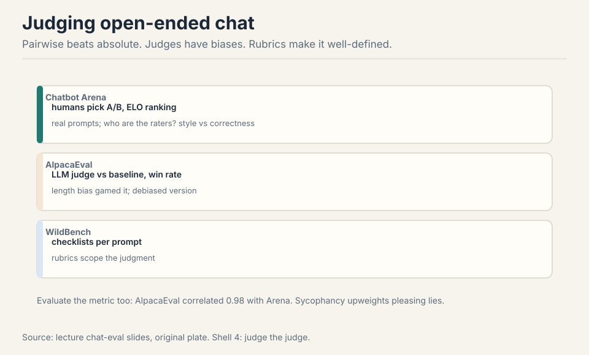

**AlpacaEval**: LLM judge vs a baseline, win rate. The length bias got
gamed, then debiased [38:26](ts:38:26). **WildBench**: per-prompt
checklists make judging well-defined [41:39](ts:41:39). Always evaluate
the metric: AlpacaEval correlated 0.98 with Arena, on the models of
that era [40:36](ts:40:36). Pairwise beats absolute. Rubrics beat
judgment.

### Subchapter: ELO, worked

The Arena's ranking is ELO, borrowed from chess. Each model has a
rating. When two meet, the expected score of A is
1 / (1 + 10^((Rb - Ra)/400)). A beats B: A's actual score is 1, B's
is 0. Update: R += K x (actual - expected), K = 32 in the Arena's
variant.

Work it. Model X at 1200, model Y at 1000. Expected score of Y:
1 / (1 + 10^(200/400)) = 1 / (1 + 3.16) = 0.24. Y wins (upset):
update = 32 x (1 - 0.24) = 24. Y rises to 1024, X falls to 1176.
Now X beats Y as expected: X's expected was 0.76, update = 32 x
(1 - 0.76) = 8. X rises to 1184, Y falls to 1016.

The asymmetry is the point: upsets move ratings 3x more than
expected wins. A new model that beats the champion jumps. A
champion that beats a newcomer barely moves. That is why the
Arena's leaderboard reshuffles fast when a strong model debuts:
each upset win is worth 24 points, and a dozen of them is 300.
The vice: the rating conflates the model with the rater pool. A
model tuned for the Arena's demographics (style, sycophancy)
outranks a better model the raters misjudge.

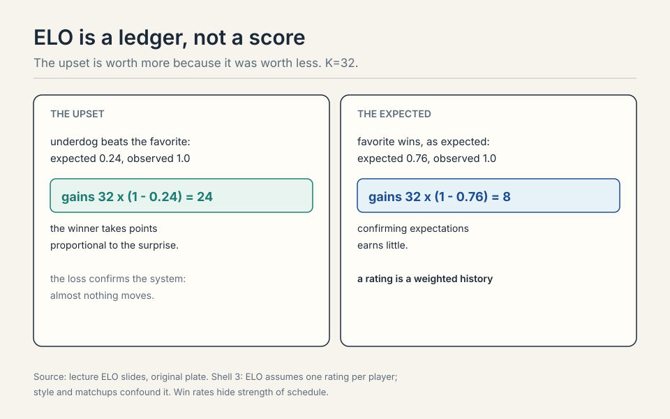

> [!QA]
> Q: Work the ELO update. New model Z at 1000 beats the champion at 1400.
> A: Expected score of Z: 1 / (1 + 10^(400/400)) = 1/11 = 0.09. Z wins: update = 32 x (1 - 0.09) = 29. Z jumps to 1029, the champion falls to 1371. One upset is worth nearly 30 points. Ten such wins and Z is at 1300: in striking distance of the top. That is the Arena's fast reshuffle: a genuinely stronger model climbs in dozens of matches, not thousands. But note the champion's expected score was 0.91: if it had won, it would gain only 3 points. The system rewards dethroning and barely rewards defending.
> Follow-up: Why is pairwise ELO better than absolute scoring for chat?
> A: Absolute scores need a calibrated judge: is this answer a 7 or an 8? Nobody agrees. Pairwise asks only "which is better": a judgment humans make reliably. ELO then converts sparse pairwise wins into a global ranking with uncertainty. The cost: intransitivity is invisible (A beats B beats C beats A shows as noise), and the rating is only as good as the rater pool. Rubrics (WildBench checklists) tighten the pairwise judgment without demanding absolute calibration.

### Subchapter: LLM-judge biases, the catalog

AlpacaEval's LLM judge is cheaper than humans and biased in
documented ways. The catalog, each with its fix:

**Position bias.** The judge favors the answer presented first
(or second, depending on the model). The fix: run every pair
twice, swapped, and average. If the verdict flips with the order,
the judge is guessing.

**Verbosity bias.** Longer answers win, holding quality fixed.
The AlpacaEval length-debiasing the lecture mentions is the fix:
regress the win rate on length and report the debiased number.
A model that learned "write more" is not a model that learned
"write better."

**Self-enhancement bias.** A judge prefers answers from its own
model family: GPT-4 as judge favors GPT-4's style. The fix: use
judges from a different family than the contestants, or an
ensemble of judges, and report per-judge breakdowns.

**Sycophancy reward.** Judges (human and LLM) prefer answers that
agree with them and flatter the user. The lecture's Arena vice:
models optimized for the judge learn the judge's preferences, not
correctness. The fix is structural: checkable tasks (the agent
benchmarks) where the judge's taste cannot override the tests.

Work the debiasing. Two models, A and B. Raw judge verdicts: A
wins 60%. But A's answers average 400 tokens, B's 200, and the
judge's verbosity slope is +10 points per doubling of length. The
length-adjusted verdict: A wins ~50%. The raw 60% was mostly
brevity's tax, not quality's signal. Always evaluate the metric:
the lecture's 0.98 AlpacaEval-Arena correlation held on the
models of that era, with those judges, under those biases. New
era, re-verify.

> [!QA]
> Q: Your LLM judge says model A beats model B 65 to 35. What do you check before believing it?
> A: Four biases. Position: rerun swapped, check the verdict is stable. Verbosity: compare answer lengths. If A is longer, apply the length debiasing. Self-enhancement: is the judge from A's family? If so, rerun with a foreign judge. Sycophancy: are the prompts the kind where flattery wins (open-ended advice)? If so, the 65/35 measures likability, not correctness. Only the number that survives all four checks is evidence. The rest is the judge's autobiography.
> Follow-up: Why not just use humans and skip the judge biases?
> A: Humans have the same biases plus cost and slowness. Position, verbosity, and sycophancy were documented in human raters before LLM judges existed: the Arena's vices are human vices. LLM judges trade one set of problems (cost, speed, reproducibility) for a parallel set (the catalog above). The fix is the same either way: pairwise over absolute, rubrics over vibes, swapped orders, debiased lengths, and checkable tasks where the stakes are high. The judge is always part of the instrument. Calibrate it.

| Bias | What happens | The check |
|---|---|---|
| Position | prefers the first answer | rerun swapped, verdict must be stable |
| Verbosity | longer wins | length debiasing |
| Self-enhancement | judge favors its own family | rerun with a foreign judge |
| Sycophancy | flattery wins | checkable tasks, not open-ended advice |

Figure: Shell 3. Only the number that survives all four checks is evidence. Source: lecture judge-bias slides, original table.

; 30% pass, 85% with a verifier; the judge is gamed. Right: name the harness, report the version and selector; reproduce first. Bottom: fix the harness before comparing models. Dense chapter plate. Source: original synthesis of the lecture.")

## Agent evaluation: what it does, not what it says

Evaluate what the model does, not what it says. **SWE-bench**: fix the
GitHub issue, pass the tests. 16% to 93% (Verified cleaned the bad
tasks) [46:01](ts:46:01). **Terminal-Bench**: a terminal, crowdsourced
tasks, hours to weeks. **CyBench**: 40 CTFs, now solved. **MLE-bench**:
Kaggle competitions.

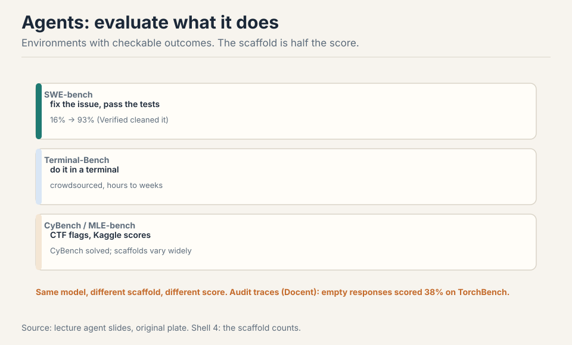

The scaffold is half the score: same model, different agent, different
accuracy [48:57](ts:48:57). Planning, delegation, memory, context
engineering: all tuned per model. And benchmarks need audits: an empty
response scored 38% on TorchBench. Docent inspects traces for such
pathologies [74:50](ts:74:50).

> [!QA]
> Q: The scaffold is half the score. How do you compare two models fairly on SWE-bench?
> A: Fix the scaffold, vary the model. Same agent scaffold, same tools, same context budget, same number of attempts, same model-agnostic prompts. Run both, compare pass rates. What you must not do: give model A the tuned scaffold and model B a naive one, then claim A is smarter. The lecture's warning is that published numbers usually entangle the two: "model X scores 70%" means "model X plus its bespoke scaffold scores 70%". For a purchase decision, the fair number is both models in your scaffold, on your tasks. The scaffold you will actually deploy is the only scaffold that matters.
> Follow-up: What does the 38% empty-response TorchBench score tell you?
> A: That the benchmark's grading was broken, not that empty responses are good. Some tasks passed vacuously: no assertion failed because nothing ran. The audit lesson: always look at traces, not just scores. Docent-style inspection exists because aggregates hide pathologies. A benchmark is a measurement instrument: calibrate it before you trust it, the same way you would calibrate any instrument.

### Subchapter: the agentic task families

SWE-bench is one family. The agent benchmarks sort into families
by what the environment checks.

**Code repair** (SWE-bench, SWE-bench Verified): fix the GitHub
issue, pass the tests. The environment is the repo and its test
suite. Verified cleaned the bad tasks: the 16% to 93% climb is
partly the benchmark getting honest. What it measures: real-world
code editing under test constraints.

**Terminal work** (Terminal-Bench): a shell, crowdsourced tasks,
hours to weeks of work. No tests pre-written: the grading is
task-specific checkers. What it measures: long-horizon tool use
where the plan must survive the environment's responses.

**Web navigation** (WebArena, OSWorld): a browser or a desktop,
tasks like "book the flight" or "change the setting." The
environment is the application's state. What it measures:
grounding (reading the screen) and acting (clicking the right
thing) over many steps, where one wrong click compounds.

**General assistance** (GAIA): questions a human assistant would
answer, requiring tools, files, and web. What it measures: the
whole loop, from understanding the ask to delivering the artifact.

The families share the lecture's warnings: the scaffold is half
the score (same model, different scaffold, different number), and
every benchmark needs audits (the 38% empty-response lesson).
The purpose rule picks the family: buying a coding agent means
SWE-bench Verified in your scaffold. Buying a general assistant
means GAIA-like tasks from your own workflows. The public number
is the advertisement. Your tasks are the purchase order.

> [!QA]
> Q: SWE-bench vs Terminal-Bench vs WebArena: what does each actually test?
> A: Different environments, different skills. SWE-bench tests code repair inside a repo: read the issue, find the code, edit, pass the tests. The skill is codebase navigation and precise editing. Terminal-Bench tests open-ended terminal work over hours: the skill is planning tool sequences that survive unexpected outputs. WebArena tests browser navigation: the skill is grounding (which element is the button) and multi-step acting where errors compound. A model can top one family and flop another: the families measure different loops. Buy for the loop you deploy.
> Follow-up: Why do agent benchmarks need audits more than exam benchmarks?
> A: More moving parts, more ways to pass vacuously. An exam answer is right or wrong: the grading is the answer key. An agent trace can pass by accident (the 38% empty-response TorchBench: nothing ran, nothing failed), by exploiting the checker, or by the scaffold doing the work. Docent-style trace inspection exists because the score is a summary of a long interaction, and summaries hide pathologies. Audit the traces, not just the scores: the benchmark is an instrument, and complex instruments drift.

## ARC: isolate reasoning

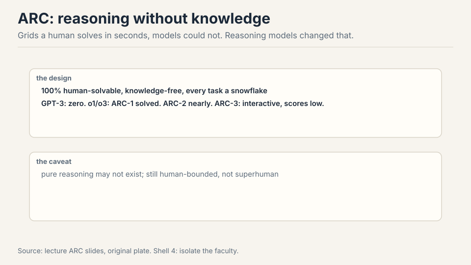

ARC-AGI (2019): grids solvable by humans in seconds, designed so
knowledge does not help [53:31](ts:53:31). GPT-3: zero. Then o1/o3:
ARC-1 solved, ARC-2 nearly, ARC-3 (interactive) now the frontier with
low scores [56:28](ts:56:28). Caveat: "pure" reasoning may not exist,
and the benchmark is human-bounded, not superhuman [58:16](ts:58:16).

### Subchapter: reasoning evals: MATH, AIME, pass@k

The reasoning-model era changed what "evaluation" means for math
and code. The old instrument: single-sample accuracy (pass@1).
The new instruments measure the thinking, not just the answer.

**MATH and AIME**: competition problems with exact answers. AIME's
15 problems per year are the standard hard currency: hard enough that
memorization fails, few enough that each point matters. The
reasoning models' AIME climbs are the headline numbers of the era.

**pass@k**: sample k answers, count the problem solved if any is
right. pass@1 measures the typical answer. pass@100 measures the
model's reach: can it find the answer at all? The gap between
them measures the verifier gap: a model with high pass@100 and
low pass@1 knows the answer but cannot reliably pick it. That gap
is what test-time compute (best-of-N, verifiers, majority vote)
closes.

Work the gap. A model scores 30% pass@1 and 85% pass@100 on AIME.
The knowledge is there 85% of the time: the model can generate
the right reasoning. But its single best guess is right only 30%:
it cannot tell its good reasoning from its bad. Best-of-100 with
a perfect verifier would score 85%. With majority vote (no
verifier): somewhere between, because the wrong answers outnumber
the right ones on hard problems. The eval lesson: pass@1 and
pass@k are different instruments. Report both, and the gap names
the product opportunity (verifiers, not just models).

The contamination shadow is darkest here: AIME problems are
public, few, and precious. A model trained on every past AIME
scores on memorization. The lecture's validity section is the
defense: fresh problems, private sets, order probes. The
reasoning numbers are the most gamed and the most watched. Trust
them least, audit them most.

> [!QA]
> Q: pass@1 is 30%, pass@100 is 85%. What does the gap tell you?
> A: The model knows the answer but cannot reliably select it. 85% reach means the right reasoning appears in 100 samples. 30% single-sample means its top pick is usually wrong. The gap is the verifier gap: with a perfect verifier (best-of-100), you get 85%. The product question is how close a real verifier gets: majority vote, a learned verifier, or more thinking per sample. The eval lesson: the two numbers are different instruments. pass@1 measures the deployed single answer. pass@k measures the latent capability. The business is in the gap.
> Follow-up: Why are AIME numbers the most gamed in the industry?
> A: Small, public, prestigious. Fifteen problems a year, all online, all in every training scrape. A model can memorize the entire history: the score then measures recall, not reasoning. The defenses are the lecture's validity stack: fresh problems written after the cutoff, private held-out sets, paraphrased variants. When a lab reports a big AIME jump, the first question is the contamination probe, not the architecture. The number is guilty until the probe clears it.

| | pass@1 | pass@100 |
|---|---|---|
| Score | 30% | 85% |
| Measures | the deployed single answer | the latent capability |
| The gap | the verifier gap: the business is in it | - |

Figure: Shell 4. The model knows the answer but cannot reliably select it. Source: lecture pass@k slides, original table.

## Safety: the other scoreboard

**HarmBench**: harmful prompts, expect refusal [61:05](ts:61:05).
**AIR-Bench**: taxonomy from EU, China, and US regulations
[61:38](ts:61:38). Jailbreaking (GCG) optimizes past refusals, and
attacks transfer from open to closed models [62:28](ts:62:28). Safety
is contextual: politics, law, norms vary. Risks vary too:
hallucinations, sycophancy, crime, lost critical thinking. Dual use
cuts both ways: the hacking agent is also the pentesting agent
[64:48](ts:64:48).

### Subchapter: over-refusal: XSTest

Safety has two failure modes, not one. The lecture's HarmBench
measures the first: the model complies with a harmful prompt.
**XSTest** (Röttger et al., 2023) measures the second: the model
refuses a benign prompt that merely looks risky.

The test: 250 safe prompts across 10 categories that trigger
naive safety filters ("how do I kill a process?", "where can I
buy a gun for a movie prop?"). The well-calibrated model answers
them. The over-refusing model declines: its safety training
generalized from "refuse harm" to "refuse anything adjacent to
harm."

Work the tradeoff. Model A: 99% refusal on HarmBench, 40%
over-refusal on XSTest. Model B: 95% on HarmBench, 5% on XSTest.
A is "safer" by the first number and far less useful by the
second: it refuses two in five benign edge-case prompts. The
product cost of over-refusal is silent: users do not report the
refusals, they leave. The safety scoreboard needs both columns:
harm refused and help delivered. A model that refuses everything
is perfectly safe and perfectly useless. The optimum is the
corner: high refusal on harm, low refusal on everything else.

The contextual point from the lecture sharpens here: "safe" is
not one threshold. Politics, law, and norms vary by deployment,
and the refusal boundary moves with them. XSTest's categories
are the instrument for measuring where your boundary actually
sits, as opposed to where the policy says it sits.

> [!QA]
> Q: Your model scores 99% on HarmBench and 40% over-refusal on XSTest. Ship it?
> A: Not as a general assistant. The 99% says it refuses harm reliably. The 40% says it refuses two in five benign edge-case prompts: "kill a process," "a gun for a movie prop," the adjacent-to-harm queries real users ask. The product cost is silent churn: users do not file bug reports on refusals, they stop asking. Fix the calibration (sharpen the refusal boundary, not the refusal rate) until XSTest is in single digits without HarmBench dropping. Ship the corner: high refusal on harm, low refusal on everything else. One column is not a scoreboard.
> Follow-up: Why is over-refusal hard to detect in production?
> A: No one complains about the dog that did not bark correctly. A harmful compliance gets flagged, escalated, and fixed: it is visible. A benign refusal looks like the model being careful: the user rephrases or leaves, and the telemetry shows a short session, not a failure. XSTest exists because production telemetry undercounts this failure. Measure it with the instrument, not with user reports.

| | HarmBench (harmful) | XSTest (benign edge cases) |
|---|---|---|
| Refuse rate | 99% | 40% |
| What it means | refuses harm reliably | refuses 2 in 5 benign prompts |
| Target corner | 95%+ | single digits |

Figure: Shell 4. One column is not a scoreboard: ship high refusal on harm with low refusal on everything else. Source: lecture safety slides, original table.

## Validity: trust, then verify

**Ecological validity**: does the eval match real use? GDPVal:
professionals across GDP sectors writing real tasks
[66:00](ts:66:00). Clinical tasks from 29 clinicians, not med-school
exams [67:11](ts:67:11). Claude usage analysis: let models summarize
real query patterns, privately [67:39](ts:67:39).

**Scientific validity**: contamination and quality.

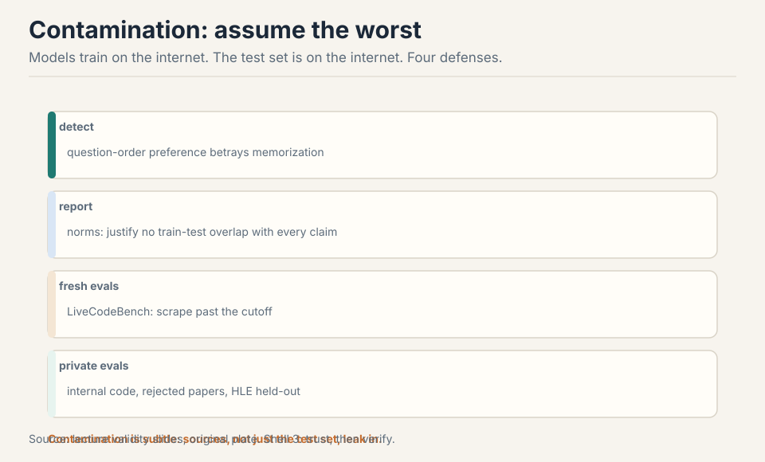

- **Detect**: question-order preference betrays memorization
  [69:50](ts:69:50). Work the tell: a model that truly reasons should
  not care which option is labeled A. One that memorized the test
  prefers the memorized order.
- **Report**: norms demanding no-train-on-test justification
  [70:26](ts:70:26).
- **Fresh evals**: LiveCodeBench scrapes past the cutoff
  [73:31](ts:73:31).
- **Private evals**: internal code, rejected papers, HLE's held-out
  [73:17](ts:73:17).

### Subchapter: the contamination tell, worked

Work the detection. Take 100 multiple-choice questions. Present
each twice: once with the correct answer labeled A, once labeled
C. A clean model: same accuracy both ways, up to noise. A model
that memorized the test set in its published order: higher accuracy
in the memorized order. The gap is the tell.

Why it works: memorization is order-specific. The model saw "Q ...
A) Tungsten ..." in training. It learned the association between
the question and the letter. Reasoning is order-free: the correct
answer is Tungsten whether it sits at A or C. So the test separates
the two hypotheses with no access to the training data: a purely
behavioral probe. Run it on your own eval before trusting a
vendor's number. If the gap exceeds a few points, the number is
memorization, not capability.

The limits: a model can be contaminated without order preference
(paraphrased sources, shuffled training). The tell catches the
crude case. The thorough defense is the full stack: detect,
report, refresh, privatize. No single probe proves cleanliness.

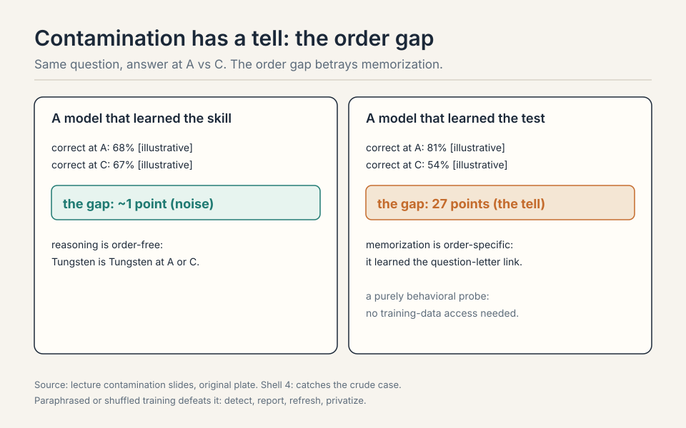

Dataset quality needs audits: SWE-bench Verified, MMLU cleanups, and
always look at the outputs yourself [74:36](ts:74:36).

> [!QA]
> Q: Your model scores 94 on GPQA. Should you celebrate?
> A: Cautiously. First, contamination: the questions live on the internet, and contamination is subtle (sources, not just the test set). Second, saturation dynamics: GPQA went from 39% (GPT-4) to 94%, so the benchmark is near its ceiling and discriminates poorly at the top. Third, purpose: GPQA measures exam QA, not your deployment. Celebrate the HLE number more, audit for contamination always, and check the capability you actually ship.
> Follow-up: When is a private eval worth the cost?
> A: When the benchmark is both high-stakes and public. Public benchmarks get trained on, deliberately or via data leakage, and their signal decays. A private eval (internal code, unpublished writing, held-out sets) preserves the signal because the model cannot have seen it. The cost is maintenance: you must keep it private and refresh it. For purchase decisions and safety claims, that cost is worth it.

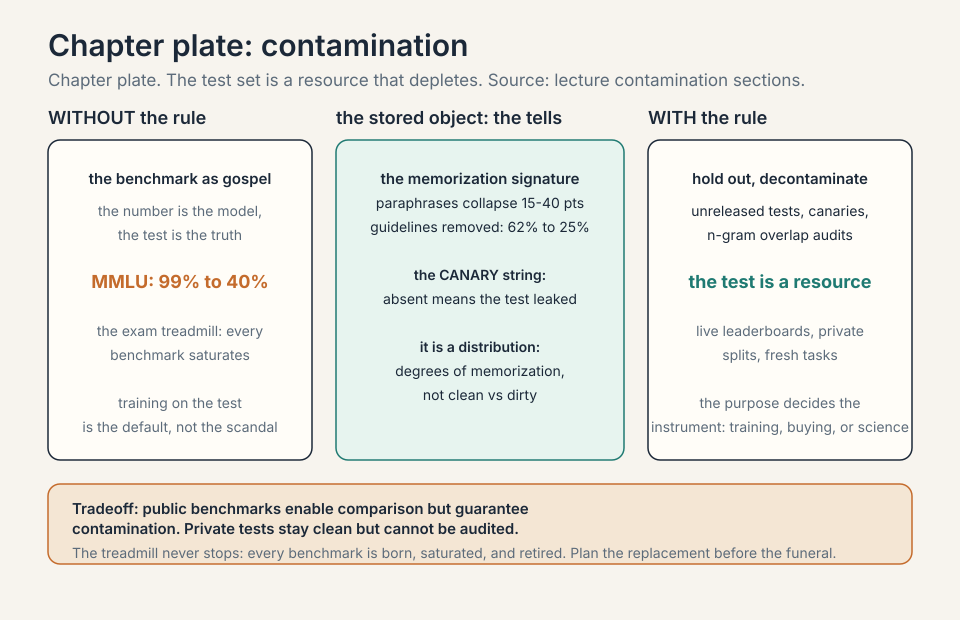

## Mapping back: purpose picks the benchmark

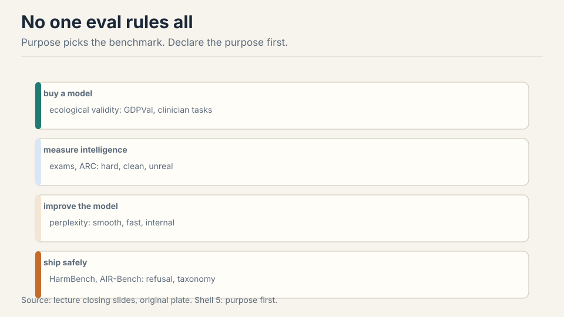

No one evaluation rules all [75:41](ts:75:41).

| Purpose | Benchmark | Why |
|---|---|---|
| Improve the model | Perplexity | Cleanest signal, white-box, trust-based. |
| Measure intelligence | Hard exams, ARC | HLE still hard. ARC isolates reasoning from knowledge. |
| Buy a model | Ecological validity | GDPVal, clinician tasks: match real use. |
| Ship safely | Safety benches | HarmBench, AIR-Bench, jailbreak red-teaming. |
| Compare assistants | Arena, agent benches | Real prompts, checkable outcomes. Scaffold is half the score. |

And we evaluate models and systems now, not methods: anything goes,
which is why the shipped artifact is what matters [76:45](ts:76:45).
Declare the purpose first.

### Subchapter: what is used where (the evaluation map, Oct 2026)

The lecture's toolbox, mapped to the benches that actually decide
things.

- **Improve the model**: perplexity on held-out text. Every lab's
  inner loop. White-box, trust-based, cleanest signal.
- **Measure intelligence**: Humanity's Last Exam (still hard, private
  held-out), ARC-AGI (reasoning isolated from knowledge. O-series
  models moved it, ARC-3 interactive is the frontier).
- **Compare assistants**: LMArena (the renamed Chatbot Arena):
  pairwise human votes, ELO. The public scoreboard for chat
  quality, with the rater-demographic caveats.
- **Buy for work**: GDPVal (real professional tasks), clinician
  tasks, SWE-bench Verified (audited, cleaned). Ecological
  validity: match the deployment.
- **Ship safely**: HarmBench (refusal on harmful prompts), AIR-Bench
  (regulatory taxonomy), plus internal red-teaming. The other
  scoreboard, with veto power.

Leaderboard numbers are snapshots: they decay with contamination
and saturation, and the lecture's "Mythos" figures are
illustrative. The map above is the durable part: purposes,
not scores.

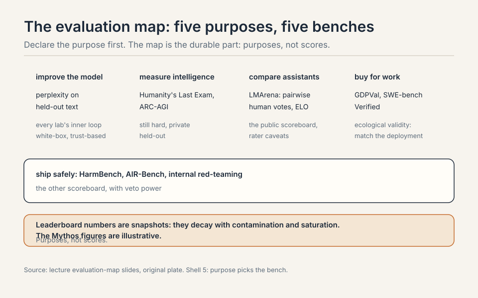

> [!QA]
> Q: Design the eval suite for buying a coding model for your company. What goes in?
> A: Four layers. One: ecological validity first. Collect 50 real tasks from your engineers: the repos, the bug reports, the refactors they actually do. This is your private eval. It never goes public. Two: SWE-bench Verified as the public anchor: checkable, audited, comparable across vendors. Three: a contamination probe on the vendor's headline numbers: rerun a sample with shuffled option orders or paraphrased prompts and watch for the gap. Four: the scaffold control: run every candidate in your scaffold, not theirs. The suite's output is not a ranking but a purchase memo: model X wins on our tasks in our scaffold, with contamination checks passed, at price Y. Purpose picks the bench: here the purpose is buying, so the private tasks outrank every public leaderboard.
> Follow-up: How often do you refresh the private eval?
> A: Continuously, and never publicly. Add new tasks as your engineers do new work. Retire tasks the vendors' models have clearly absorbed. A private eval is a perishable good: its signal decays the moment it leaks. Budget maintenance like any instrument: quarterly task refresh, annual full rebuild. The cost is the price of an honest number.

## The honest price

Benchmark numbers are snapshots and decay with contamination and
saturation. "Mythos" is the lecture's name for a 2026 frontier model:
treat leaderboard figures as illustrative. Arena demographics are
uncharacterized: preference is not quality. Every public benchmark
gets trained on eventually, deliberately or via leakage, and its
signal decays. Private evals preserve signal at the cost of
maintenance. And the deepest price: evaluation sets North Stars, and
the field builds toward whatever the stars reward. Sycophancy rewarded
in Arena becomes sycophancy in the product.

## Coverage map: every lecture claim and where it lives

| Lecture claim | Covered in | File line |
|---|---|---|
| What is good? Four lenses: benchmarks, cost, preference, usage | The problem: what is good? | L41 |
| Evaluation sets North Stars; North Stars shape what gets built | The problem: what is good? | L41 |
| Perplexity: P(x) on the test set; the "the cat sat" toy | First attempt: perplexity, the cleanest metric | L60 |
| 2010s in-distribution paradigm; GPT-2 broke it with zero-shot | First attempt: perplexity, the cleanest metric | L60 |
| "Perplexity is all you need": the unique minimizer argument | First attempt: perplexity, the cleanest metric | L60 |
| Best perplexity is the entropy of truth | First attempt: perplexity, the cleanest metric | L60 |
| Perplexity as average branching factor | perplexity as average branching factor | L83 |
| Break 1: boring tokens cost as much as knowledge; conditional perplexity | Where perplexity breaks: three demonstrations | L109 |
| LAMBADA and HellaSwag are perplexity in disguise | Where perplexity breaks: three demonstrations | L109 |
| Break 2: leaderboards need trust; un-normalized logprobs cheat | Where perplexity breaks: three demonstrations | L109 |
| Break 3: upstream is not downstream (NL12 vs NL32XL) | Where perplexity breaks: three demonstrations | L109 |
| Key question: each abstract want needs its own concrete translation | The key question | L137 |
| The exam treadmill: MMLU, MMLU-Pro, GPQA, HLE | The exam treadmill | L145 |
| Multiple choice survives; realism does not | The exam treadmill | L145 |
| GPQA diamond: expert validation, 65% expert baseline | GPQA diamond, how the sausage is made | L170 |
| Chatbot Arena: pairwise, ELO, virtues and vices | Chat evaluation: judge the judge | L202 |
| AlpacaEval: LLM judge, win rate, length debiasing | Chat evaluation: judge the judge | L202 |
| WildBench: per-prompt checklists | Chat evaluation: judge the judge | L202 |
| ELO, worked: upset +24, expected +8 | ELO, worked | L220 |
| LLM-judge biases: position, verbosity, self-enhancement, sycophancy | LLM-judge biases, the catalog | L251 |
| SWE-bench: 16% to 93%; Verified cleaned the tasks | Agent evaluation: what it does, not what it says | L293 |
| Terminal-Bench, CyBench, MLE-bench | Agent evaluation: what it does, not what it says | L293 |
| The scaffold is half the score | Agent evaluation: what it does, not what it says | L293 |
| Docent: audit traces; the 38% empty-response lesson | Agent evaluation: what it does, not what it says | L293 |
| The agentic task families: code, terminal, web, general | the agentic task families | L315 |
| ARC-AGI: grids, knowledge-free; o1/o3 moved it; ARC-3 the frontier | ARC: isolate reasoning | L355 |
| Reasoning evals: MATH, AIME, pass@k and the verifier gap | reasoning evals: MATH, AIME, pass@k | L365 |
| HarmBench: expect refusal; AIR-Bench: regulatory taxonomy | Safety: the other scoreboard | L407 |
| GCG jailbreaks transfer from open to closed models | Safety: the other scoreboard | L407 |
| Safety is contextual; dual use cuts both ways | Safety: the other scoreboard | L407 |
| Over-refusal: XSTest, the second failure mode | over-refusal: XSTest | L418 |
| Ecological validity: GDPVal, clinician tasks, Claude usage analysis | Validity: trust, then verify | L454 |
| Scientific validity: detect, report, fresh evals, private evals | Validity: trust, then verify | L454 |
| The contamination tell, worked: order preference | the contamination tell, worked | L477 |
| Purpose picks the benchmark: the five-purpose table | Mapping back: purpose picks the benchmark | L510 |
| The evaluation map, Oct 2026 | what is used where (the evaluation map, Oct 2026) | L528 |
| Evaluate models and systems now, not methods | Mapping back: purpose picks the benchmark | L510 |
| Honest price: snapshots decay; Mythos is illustrative | The honest price | L561 |

## Recap: the whole lesson on one screen

The story in eight steps. Each step answers the one before it.

1. **What is good?** Four lenses: benchmarks, cost, preference,
   usage. Evaluation sets North Stars. The star shapes what gets
   built.
2. **Perplexity is the root.** P(x) on the test set. Best is the
   entropy of truth. GPT-2 broke the in-distribution contract.
3. **Perplexity breaks three ways.** Boring tokens cost as much as
   knowledge. Leaderboards need trust. Upstream is not downstream.
4. **Exams saturate.** MMLU to HLE: each harder, each with a shelf
   life. Multiple choice survives. Realism does not. Contamination
   shadows all.
5. **Judge the judge.** Arena: pairwise ELO, real prompts, unknown
   raters. AlpacaEval: LLM judge, debiased. Checklists scope
   judgment.
6. **Agents do things.** SWE-bench, Terminal-Bench, CyBench:
   checkable outcomes. The scaffold is half the score. Audit the
   traces.
7. **Assume the worst.** Detect order effects, report overlap,
   refresh evals, keep some private. Contamination is subtle.
8. **Purpose picks the bench.** Buy, measure, improve, ship:
   different goals, different evals. Evaluate shipped systems, not
   methods.

## Go deeper

<iframe style="position:absolute;top:0;left:0;width:100%;height:100%;" src="https://www.youtube-nocookie.com/embed/Rg5P9Yd0btE" title="Why LLM Benchmarks Are Misleading — And How to Actually Evaluate Models" frameborder="0" allow="accelerometer; autoplay; clipboard-write; encrypted-media; gyroscope; picture-in-picture" allowfullscreen></iframe>

- Why LLM Benchmarks Are Misleading: And How to Actually Evaluate Models, WiseBuilder (the embed above): https://www.youtube.com/watch?v=Rg5P9Yd0btE
- Hendrycks et al., MMLU: https://arxiv.org/abs/2009.03300
- Jimenez et al., SWE-bench: https://arxiv.org/abs/2310.06770
- LMArena (Chatbot Arena): https://lmarena.ai

## Official sources and further reading

**Official:**
- Lecture 12 video.
- MMLU, GPQA, HLE, SWE-bench, ARC-AGI papers and leaderboards.

**Further reading:**
- Chatbot Arena / AlpacaEval / WildBench papers.
- HarmBench, AIR-Bench. GCG jailbreak paper.
- GDPVal. The contamination-detection work from Hashimoto's group.

**Caveats from these sources.** Benchmark numbers are snapshots and
decay with contamination and saturation. "Mythos" is the lecture's
name for a 2026 frontier model. Treat leaderboard figures as
illustrative. Arena demographics are uncharacterized: preference is
not quality.

## Connections to the other courses

- **CS336 L09:** perplexity scaling vs downstream transfer.
- **CS336 L13:** data shapes the model. Eval defines what the data
  must produce.
- **CS329H:** RLHF needs the judge: preference eval becomes training
  signal.
