## The problem: the paper says nothing about the data

Data is the most important thing to get right [00:24](ts:00:24). The
Llama 3 paper discloses everything about the architecture and the
training procedure, and says nothing about the data. Two reasons for
the secrecy: competitive dynamics, and copyright liability
[00:58](ts:00:58).

Data arrives in stages, and the trend is one direction
[02:18](ts:02:18).

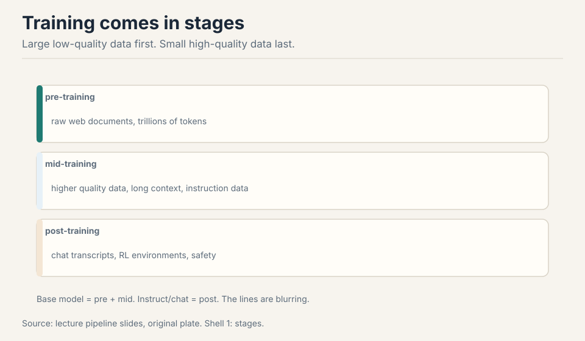

Pre-training takes raw web documents. Mid-training upgrades to higher
quality data and adds long context. Post-training is chat transcripts
and RL environments. The largest new models skip the base-model
checkpoint entirely: just one release [03:30](ts:03:30).

## First attempt: train on the entire internet

"Trained on the entire internet" does not type-check. The web is live
servers. Unless you are an RL agent, you do not train on servers: a
crawler discovers pages and downloads them [05:16](ts:05:16). And the
crawlable web is much smaller than the web.

Work the gap. The web has hundreds of billions of pages. Dynamic apps
and the deep web have no hyperlinks to follow: no links, no crawl.
Authentication locks the big platforms. Robots.txt plus "Consent in
Crisis": by mid-2023, about half of websites fully restrict crawling
[10:43](ts:10:43). Cloudflare, CAPTCHAs, rate limits, IP blocks. Terms
of service increasingly say no AI training.

And then shadow libraries (LibGen, Anna's Archive) bypass all of it:
piracy from servers in other countries [12:50](ts:12:50). The easy
path exists. It is illegal.

## Where the easy path breaks: copyright

Everything on the internet is copyrighted. The Copyright Act of 1976
lowered the bar: fixed in a tangible medium is enough, registration
not required (sue later for $65). It lasts 75 years, then the public
domain [14:31](ts:14:31).

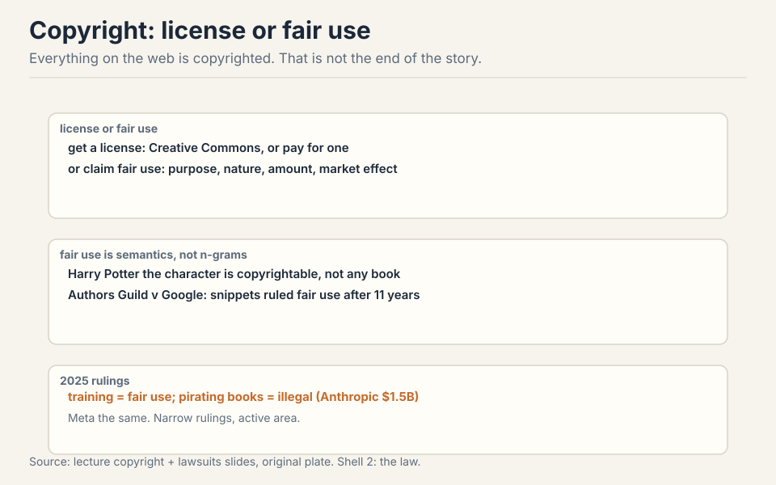

You can use copyrighted works two ways. Get a license (Creative
Commons bridges the 75-year wait. Or pay for a deal). Or claim fair
use, section 107: purpose and character, nature of the work, amount
used, effect on the market. Fair use is semantics, not verbatim
overlap: Harry Potter the character is copyrightable, not any
particular book [24:51](ts:24:51). Authors Guild v Google took 11
years and ruled snippets fair use: the precedent the field leans on
[24:11](ts:24:11).

The 2025 picture, in three layers. **Accessing**: robots.txt, terms
of service, and anti-bot measures can make the download itself a
violation even when training would be fine. **Copying**: mere copying
can violate copyright. Anthropic paid $1.5 billion to settle, about
$3,000 a book [27:40](ts:27:40). **Training**: so far ruled fair use,
narrowly. Note the layering: training can be fair use while the
copying that enabled it is not. And terms of service are a separate
layer on top [27:07](ts:27:07). The Meta case followed the same
pattern.

### Subchapter: the three copyright layers, priced

The layers decide independently. Access: you crawled a site whose
robots.txt says no. That is a violation even if training would have
been fair use. Copying: you downloaded 7 million pirated books.
Anthropic's settlement: $1.5 billion, about $3,000 per book. The
copying was the crime, not the training. Training: the model weights
themselves. So far, ruled fair use in narrow cases: transformative
purpose, no market substitution by the training act itself.

The practical reading: the cheapest layer to satisfy is the most
restrictive one. License-only data (Common Pile) clears all three
layers at once. Common Crawl clears access (respect robots.txt) and
argues fair use for training, but the copying layer stays murky for
anything pirated. Shadow libraries fail at layer 2 for $1.5B. When
someone says "training is fair use," ask which layer they mean: the
answer is usually only layer 3.

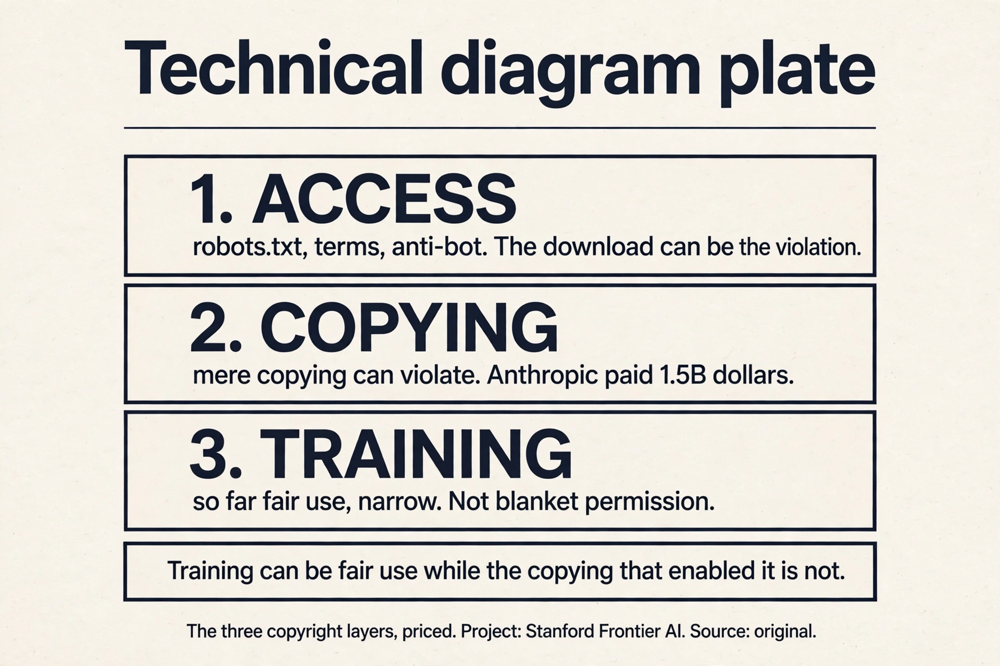

> [!QA]
> Q: Is training on copyrighted data legal?
> A: The honest answer has three layers. First, accessing it: robots.txt, terms of service, and anti-bot measures can make the download itself a violation even when training would be fine. Second, copying it: mere copying can violate copyright. The Anthropic case settled at $1.5 billion over pirated books while separately finding training was fair use. Third, training on it: so far ruled fair use in narrow cases, but not settled in general. Practical rule: permissively licensed data is safe, Common Crawl appeals to fair use, and shadow libraries are piracy. This is an active area. Verify with counsel, not with a lecture.
> Follow-up: What is license laundering?
> A: Slapping a permissive license on a work you do not own, or claiming a dataset is permissively licensed because its collection page says so. Collection licenses do not extend to the individual works. The Common Pile project found that many "permissively licensed" datasets on Hugging Face fail at the individual-work level. If you are risk-averse, you must check licenses per work, not per dataset page.

## The key question

The crawlable web is small, the law is layered, and raw downloads are
mostly junk. What if the filtering is the model? What if the funnel,
from hundreds of trillions of tokens to a few trillion, matters more
than the architecture? That is the dataset story.

## Common Crawl: the open raw material

Common Crawl has run a monthly web crawl since 2007: 3 to 5 billion
pages per dump, about 300 billion total [32:37](ts:32:37). WARC files
hold the raw HTTP responses. WET files hold lossy extracted text.

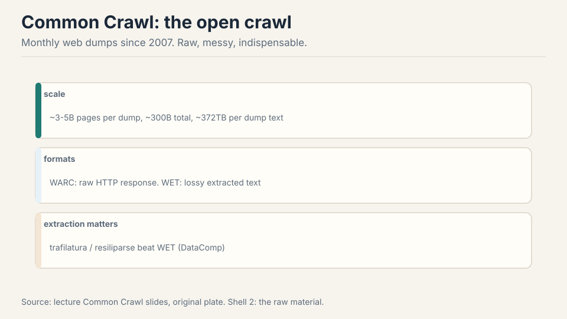

The extraction tool matters. Trafilatura and Resiliparse beat the
stock WET conversion (DataComp LLM ablation) [35:32](ts:35:32). Work
the difference: WET conversion strips boilerplate crudely, keeping
nav bars and cookie text. Trafilatura keeps the article and drops the
chrome. Same pages, different tokens, different model. Crawling is
conceptually graph traversal. The gory details are the product:
refresh policies, dedup, mirror sites, dynamic URLs
[33:41](ts:33:41).

> [!QA]
> Q: Walk me through the crawl. How does a page get from the web into a training run?
> A: Step one: discovery. The crawler follows hyperlinks from seed pages, fetching robots.txt first and honoring it. Step two: download. The HTTP response is stored raw in a WARC file: headers, HTML, everything. Step three: extraction. Trafilatura strips the navigation, ads, and cookie banners, keeping the article text; the stock WET conversion does this crudely and keeps junk. Step four: filtering. fastText or rules decide whether the text looks like the target quality. Step five: dedup. Near-duplicate spans are removed globally. Step six: tokenization. Only then does it become training tokens. Each step loses or corrupts data: bad extraction poisons everything downstream, which is why the tooling matters as much as the crawl.
> Follow-up: Why not just train on the WARC files directly?
> A: Because the model would learn HTML. Tags, scripts, navigation bars, and duplicated chrome would dominate the token budget, and the model would spend capacity modeling page structure instead of language. Extraction is the step that converts "the web" into "text worth learning from." The lecture's point: same pages, different extraction, different model. The pipeline is the data.

## Quality pockets: dense sources, special handling

The web is not uniform. Three pockets deserve special handling
[36:28](ts:36:28).

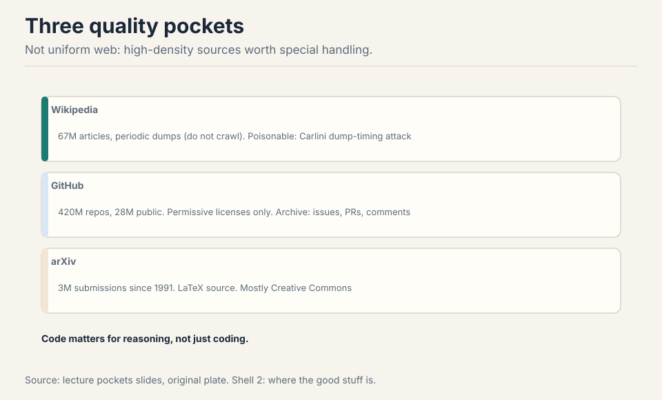

**Wikipedia** (67M articles): download the dumps, do not crawl. Even
"high quality" can be attacked: Carlini's dump-timing poisoning edited
Wikipedia just before the dump and rolled back after
[38:40](ts:38:40). The attack window is the dump schedule itself.

**GitHub** (420M repos, 28M public): train on permissive licenses
only. The GitHub Archive records every event. Code matters for
reasoning, not just coding: the reasoning gains from code data show
up on math and logic too.

**ArXiv** (3M submissions since 1991): LaTeX source, mostly Creative
Commons. Equations as text, not images: the model reads the math.

> [!QA]
> Q: Why does code data improve math and logic reasoning, not just coding?
> A: Code is executable logic with exact semantics. A for-loop teaches iteration, an if-statement teaches branching, a function teaches abstraction: all of these are reasoning patterns, not syntax. When the model trains on code, it sees millions of worked examples of precise step-by-step deduction, each one machine-checked by execution. Math and logic questions reuse the same patterns: chain deductions, track state, verify each step. The lecture's evidence: the reasoning gains from code data show up on math and logic benchmarks, not just code benchmarks. That is why The Stack matters beyond programming: it is a reasoning corpus wearing a code corpus's clothes.
> Follow-up: Why does The Stack pair low-resource languages with LLVM IR?
> A: Transfer. LLVM IR is a shared low-level representation: the same IR patterns appear across languages. A model that sees Rust code paired with its IR, and C code paired with its IR, learns the common substrate. Then a low-resource language's IR lets the model bootstrap understanding from the shared patterns. It is the same idea as multilingual training: the shared representation carries knowledge across the boundary.

## A decade of datasets: the filtering arms race

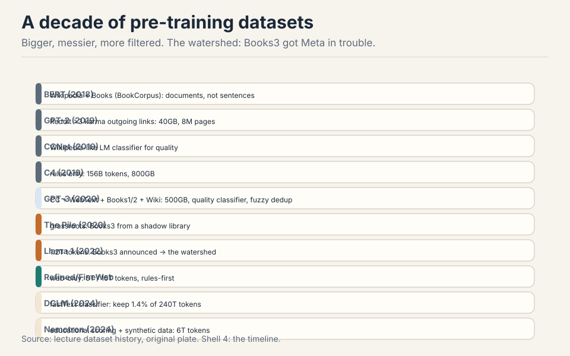

BERT (2018): Wikipedia plus Books, documents not sentences. GPT-2
(2019): outgoing links from Reddit posts with >3 karma, 40GB. CCNet
(2019): Wikipedia-like language-model classifier. C4 (2019): rules
only, 156B tokens. GPT-3 (2020): Common Crawl plus WebText plus
Books1/2, quality classifier, fuzzy dedup, 400B tokens. The Pile
(2020): grassroots, including Books3 from the shadow library
Bibliotik. Llama 1 (2022): 1.2T tokens, and announcing Books3 got them
in trouble: the watershed that silenced everyone
[60:47](ts:60:47). RefinedWeb then FineWeb: web-only, 5T then 15T
tokens, rules-first. DCLM (2024): fastText classifier on OpenHermes
plus ELI5, keep 1.4% of 240T tokens, and the magic works. Nemotron
(2024): LLM-judged educational value, synthetic rephrasing, 6T tokens.

Read the timeline as an arms race. Each generation filters harder,
keeps less, and gets more from what it keeps. Secrecy grew alongside:
after Books3, nobody announces the corpus.

### Subchapter: one idea per generation

Each generation's single filtering insight.

- **BERT (2018)**: documents, not sentences. Contiguous text teaches
  long-range structure. 16GB total: tiny by later standards.
- **GPT-2 (2019)**: Reddit karma as the filter. Outgoing links from
  posts with >3 karma: human upvotes as quality signal. 40GB.
- **C4 (2019)**: rules only, no ML. Heuristics you can audit by hand:
  no ML bias, but no learning either. 156B tokens.
- **GPT-3 (2020)**: a quality classifier plus fuzzy dedup. The first
  learned filter at scale. 400B tokens.
- **The Pile (2020)**: grassroots curation. 22 hand-picked sources
  including Books3 from the shadow library Bibliotik: the corpus
  that later caused the watershed.
- **Llama 1 (2022)**: 1.2T tokens and a public corpus list. The
  announcement of Books3 drew legal fire: after this, nobody
  announces.
- **FineWeb (2024)**: web-only at 15T tokens, rules-first then
  classifiers. Proof that the open web, filtered hard, still works.
- **DCLM (2024)**: a fastText classifier trained on instruction data
  plus ELI5. Keep 1.4% of 240T tokens. The kept fraction beats the
  whole.

The pattern: the filter moves from human signals (karma) to rules
to learned classifiers to classifiers trained on surprising targets
(instruction data). Each step keeps less and gets more.

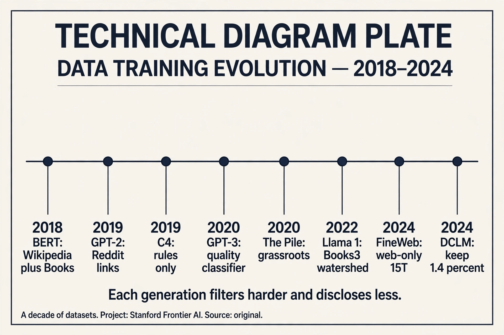

## Rules vs classifiers: the funnel is the lever

Two schools. **Rules** (C4, Gopher, RefinedWeb): control, no ML bias.
Write heuristics, apply everywhere, audit by hand. **Classifiers**
(CCNet, GPT-3, DCLM): decide what "good" looks like, train it, filter
everything.

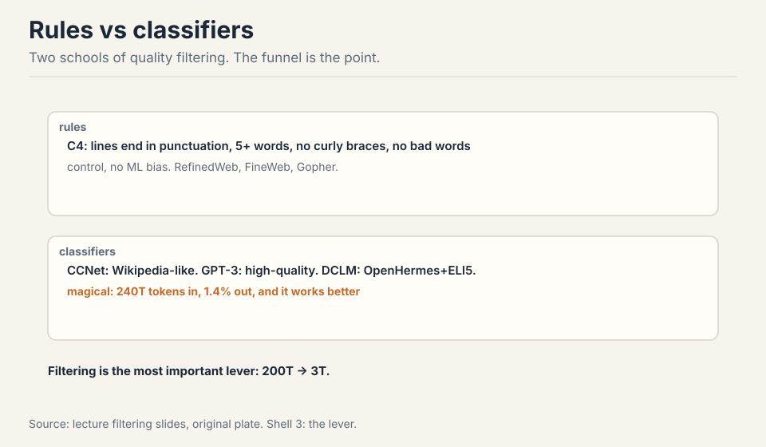

The strangest wins: DCLM's classifier trained on instruction data plus
ELI5 beats everything, and nobody fully knows why
[66:04](ts:66:04). Work the funnel: 240 trillion tokens in, about 3
trillion out. Keep 1.4%. That 1.4% trains better models than the full
240T. Filtering is probably the single most important lever in data
processing [79:34](ts:79:34).

### Subchapter: work the DCLM funnel

The numbers. Raw pool: 240 trillion tokens of Common Crawl. The
filter: a fastText linear classifier, positives from OpenHermes
(instruction data) plus ELI5 (explain-like-I-am-five answers).
Threshold tuned to keep 1.4%. Output: about 3 trillion tokens.

Why it wins: the classifier learns "text that looks like a good
answer to a question." Instruction data teaches the shape of
helpfulness. ELI5 teaches clear explanation. The kept 1.4% is dense
in exactly the behaviors post-training wants to extract. Training on
the full 240T spends 98.6% of the compute on tokens that teach
nothing: boilerplate, SEO spam, duplicated chrome.

The mystery: nobody fully knows why instruction data plus ELI5 is
the magic positive set. It works better than Wikipedia-like
classifiers (CCNet) and better than book-like targets. The working
hypothesis: question-answering is the densest form of knowledge
transfer in text. But it is a hypothesis, not a proof. The funnel
is empirical: try targets, measure downstream, keep the winner.

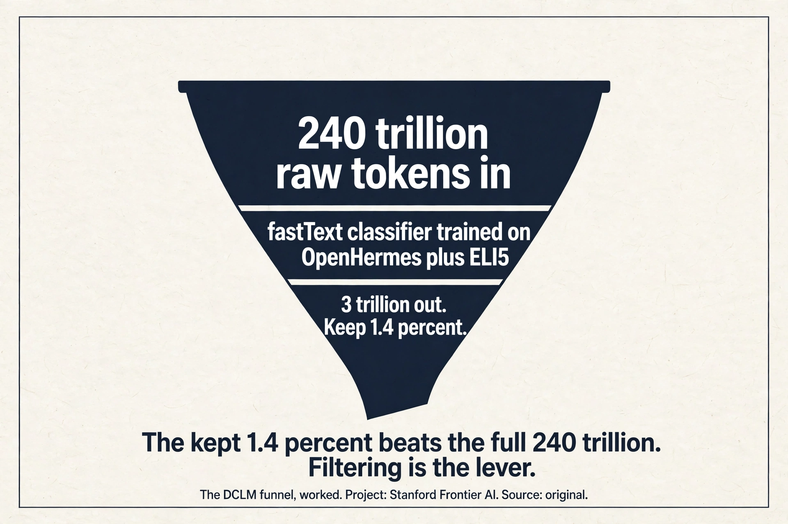

> [!QA]
> Q: Work the DCLM funnel numbers. 240T tokens in, keep 1.4%. What comes out, and why does it beat the full set?
> A: Out: 240T x 0.014 = 3.36T, about 3 trillion tokens. It beats the full set because the dropped 98.6% is mostly anti-signal: boilerplate, navigation chrome, SEO spam, duplicated text. Training on the full 240T means the model spends most of its gradient steps learning to predict cookie banners. The kept 3T is dense in question-answering-shaped text (the classifier's positive set: OpenHermes plus ELI5). Every gradient step teaches something. The lesson: at fixed compute, data quality beats data quantity by a wide margin. The funnel is the cheapest performance lever in the pipeline.
> Follow-up: When do rules beat classifiers?
> A: When you need auditability and control. Rules (C4, RefinedWeb) are heuristics you can read: no ML bias, no hidden preferences, every kept document explainable. Classifiers learn "good" from a positive set, and the positive set's biases become the filter's biases (DCLM's instruction-data target is itself a choice). Rules also cost nothing to run and never drift. The tradeoff: rules cannot learn subtle quality (they keep fluent garbage and drop awkward gold). Use rules for the first coarse pass, classifiers for the fine pass. FineWeb does exactly this: rules-first, then classifiers.

## Code data and license-only data

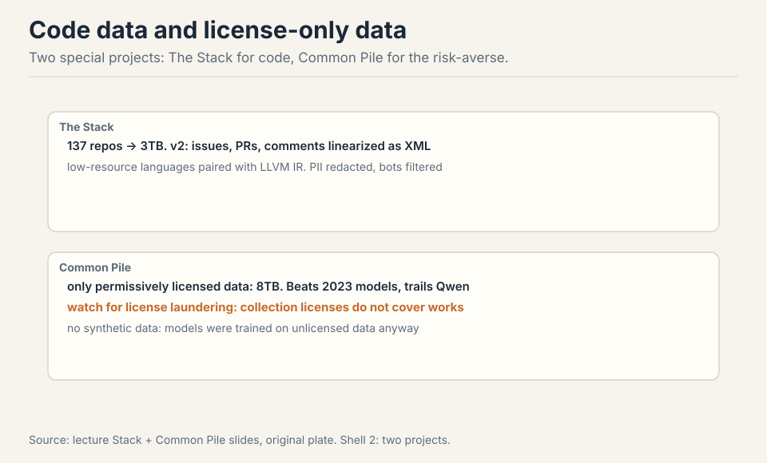

**The Stack**: 137 repos to 3TB of permissively licensed code. v2 adds
issues, PRs, and comments linearized as structured events, so the
model learns the development process, not just code. Low-resource
languages get paired with LLVM IR so knowledge transfers from the
shared low-level representation [72:46](ts:72:46).

**Common Pile**: the risk-averse experiment. Only permissively
licensed data, 8TB total, no synthetic data (data laundering: the
models that generate it trained on unlicensed data). Result:
competitive with 2023-era models, not with Qwen
[78:52](ts:78:52). Reasonable, not champion. License-only training is
possible. It costs you the frontier.

> [!QA]
> Q: What is data laundering, and why does the Common Pile refuse synthetic data?
> A: Data laundering: training a model on unlicensed data, then using that model to generate "clean" synthetic data. The synthetic text is new, but the knowledge in it came from the unlicensed corpus. Legally it is untested whether this cleans the taint; practically, the Common Pile team decided it does not. They refused all synthetic data: 8TB of permissively licensed human text only. The price: competitive with 2023-era models, not with Qwen. The experiment's honest result: license-only training works, but the frontier's edge comes partly from data you cannot license. That is the cost of caution, measured.
> Follow-up: What is license laundering, and how does it differ?
> A: License laundering is slapping a permissive license on a work you do not own, or trusting a dataset page's license claim. The Common Pile found many "permissively licensed" Hugging Face datasets fail at the individual-work level: the collection page says MIT, the individual files are copyrighted. Data laundering is about the training history of synthetic data; license laundering is about false license claims on real data. Both are ways "clean" data turns out dirty. The defense is the same: check per work, not per collection.

### Subchapter: what is used where (who trains on what)

The open datasets, mapped to who uses them, as of October 2026.

- **FineWeb / FineWeb-2**: Hugging Face's open web corpus, 15T
  tokens (v1) plus multilingual (v2). The default open starting
  point: rules-first, classifier-refined.
- **DCLM**: the classifier recipe, keep 1.4% of 240T. The
  performance reference for open filtering.
- **Nemotron-CC**: NVIDIA's 6T-token web corpus, LLM-judged
  educational value plus synthetic rephrasing. The synthetic-heavy
  open option.
- **The Stack v2**: 3TB of permissively licensed code plus
  issues/PRs as process data. The code-data standard.
- **Common Pile**: 8TB license-only. The risk-averse option:
  competitive with 2023, not with the frontier.
- **Frontier labs**: undisclosed since Books3. Every claim about
  what works is filtered through what labs choose to say.

The decision rule: if you can tolerate legal risk, Common Crawl
plus the DCLM recipe. If you cannot, the Common Pile. If you need
code, The Stack v2. If you want the frontier, you are on your own:
nobody publishes the recipe.

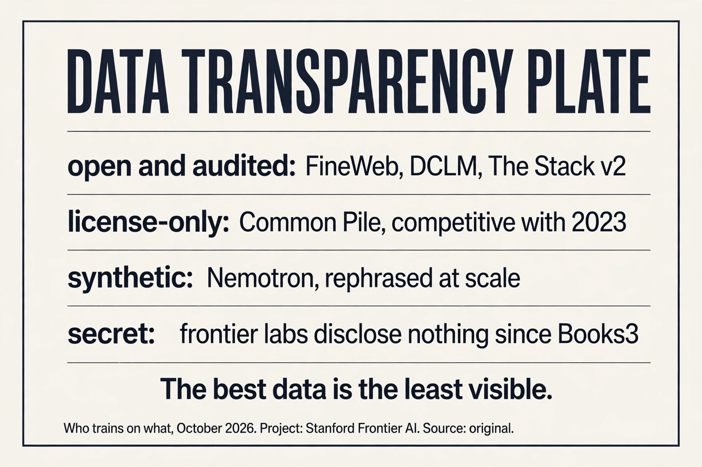

> [!QA]
> Q: You have 240T raw tokens and a 3T training budget. Design the funnel.
> A: Stage one: extraction. Trafilatura over stock WET: same pages, better tokens. Stage two: rules-first coarse filter. Drop the obvious junk: too short, too long, boilerplate ratios, bad language ID. This is cheap and auditable. Stage three: the classifier. Train fastText on your best positive set (instruction data if you have it, Wikipedia-quality text if not), keep the top few percent. Stage four: global dedup. MinHash LSH across the whole corpus, not per source: the gas-mask paragraph appears everywhere. Stage five: decontaminate. Remove anything matching your eval sets. Stage six: mix deliberately. Compute the implied epoch count per source before training: no silent 50-epoch traps. The funnel's output is 3T tokens where every token earned its place.
> Follow-up: Where does most of the 240T actually go?
> A: Into the rules and the classifier. Rules drop the majority: boilerplate, SEO, duplicates of duplicates. The classifier drops most of the rest: fluent but empty text. Dedup removes a smaller but critical fraction: the 61,000-copy paragraphs. The honest accounting: you are not selecting 3T good tokens from 240T. You are deleting 237T of junk, and the junk is the bulk of the web.

## Mapping back: what each idea fixes

| Pain | Fix | How |
|---|---|---|
| "The entire internet" does not type-check | Crawling reality | The crawlable web is small: robots.txt, auth, anti-bot, terms. |
| Everything is copyrighted | License or fair use | Three layers: access, copy, train. $1.5B says piracy is not free. |
| Raw downloads are junk | The funnel | 240T in, 3T out. DCLM keeps 1.4%. Filtering is the lever. |
| WET text is lossy | Better extraction | Trafilatura/Resiliparse over stock WET. Same pages, better tokens. |
| The web is not uniform | Quality pockets | Wikipedia dumps, GitHub Archive, arXiv LaTeX. Each special-handled. |
| Code trains reasoning | The Stack | Permissive code plus issues/PRs as process data. LLVM IR for transfer. |
| Copyright liability | Common Pile | License-only: competitive with 2023, not with Qwen. |

## The honest price

Copyright law is evolving fast. The 2025 rulings are narrow, not
blanket permission. Dataset sizes mix unique and repeated tokens
(epochs count twice): compare with care. "Books3 got Meta in trouble"
refers to the Llama disclosure, not a single court ruling. License
laundering is real: collection licenses do not cover individual works.
And the deepest price: nobody discloses the data anymore. The field's
most important ingredient is its least visible. Every claim about what
works is filtered through what labs choose to say.

## Recap: the whole lesson on one screen

The story in eight steps. Each step answers the one before it.

1. **Data is the secret sauce.** Llama 3 discloses everything except
   the data. Secrecy: competitive dynamics plus copyright liability.
2. **The crawlable web is small.** "The entire internet" does not
   type-check. Dynamic pages, auth walls, robots.txt (~50%
   restricted by mid-2023), anti-bot, terms, licenses.
3. **Copyright has three layers.** Access, copy, train. Everything is
   copyrighted for 75 years. Training: fair use so far, narrow.
   Pirating: illegal. Anthropic paid $1.5B.
4. **Common Crawl is the raw material.** Monthly since 2007, ~300B
   pages. WARC raw, WET lossy. Trafilatura extracts better text.
5. **Quality pockets need special handling.** Wikipedia dumps
   (poisonable), GitHub Archive (permissive only), arXiv LaTeX
   (mostly CC). Code trains reasoning.
6. **A decade of filtering.** Reddit links to classifiers to
   synthetic data. Books3 was the watershed. Secrecy grew faster
   than sizes.
7. **The funnel is the lever.** Rules vs classifiers. 240T in, 3T
   out. DCLM keeps 1.4% and wins. Filtering decides the model.
8. **Code and caution.** The Stack: process, not just code. Common
   Pile: license-only works, reasonably. Watch license laundering.

## Official sources and further reading

**Official:**
- Lecture 13 video.
- Llama 3 paper (what it says about data, and what it does not).

**Further reading:**
- "Consent in Crisis" (Longpre et al.).
- The Pile, C4, RefinedWeb/FineWeb, DCLM, Nemotron, Common Pile
  papers.
- The Stack v2. Carlini's Wikipedia poisoning paper.
- The Anthropic and Meta copyright rulings (active litigation area).

**Caveats from these sources.** Copyright law is evolving fast. The
2025 rulings are narrow, not blanket permission. Dataset sizes mix
unique and repeated tokens (epochs count twice). Compare with care.
"Books3 got Meta in trouble" refers to the Llama disclosure, not a
single court ruling.

## Connections to the other courses

- **CS336 L12:** eval defines the target. Data is what must hit it.
- **CS336 L14:** post-training data and deeper filtering.
- **CS229:** the same copyright questions apply to any training
  corpus.
