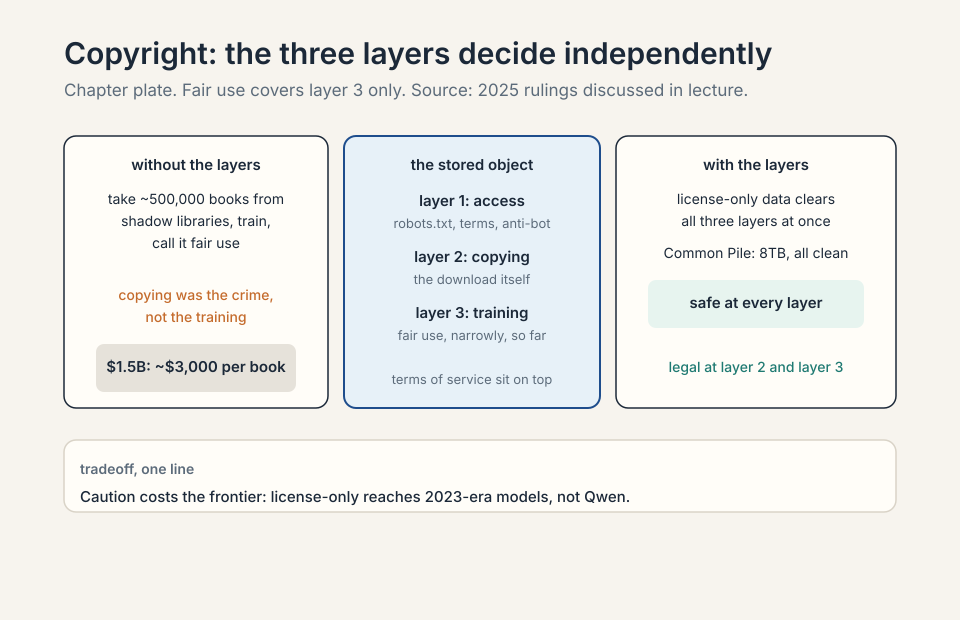
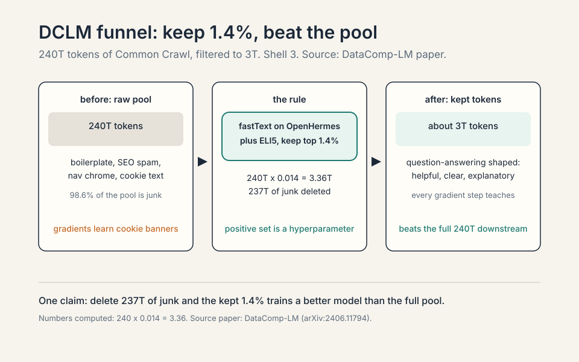
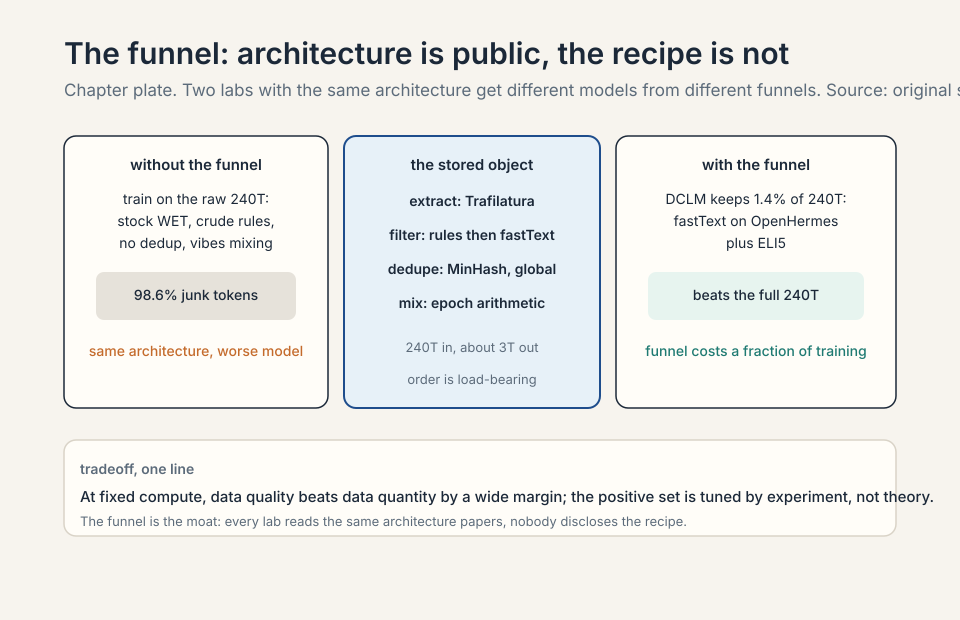
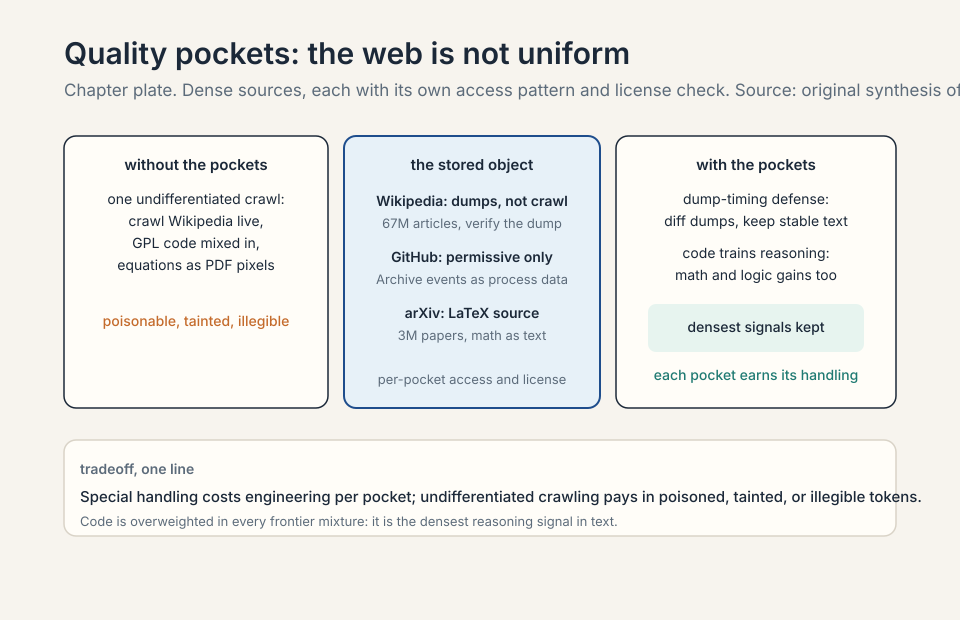

### Coverage and sourcing

This lesson follows Lecture 13 of CS336 (Spring 2026, Percy Liang),
"Training Data." The session's claims are referenced with timestamps
from the official subtitle transcript. The copyright figures are from
the 2025 rulings the lecture discusses. Exact settlement numbers are
quoted from the lecture. Claims about what frontier labs train on are
marked unknown where the source is silent: nobody discloses the real
corpus anymore. The coverage map at the end maps every major lecture
claim to the section that covers it.

## The problem: the paper says nothing about the data

Data is the most important thing to get right [00:24](ts:00:24). The
Llama 3 paper discloses everything about the architecture and the
training procedure, and says nothing about the data. Two reasons for
the secrecy: competitive dynamics, and copyright liability
[00:58](ts:00:58).

### Subchapter: why the secrecy has two locks

The two locks work differently. The competitive lock: the data
recipe is the recipe. Two labs with the same architecture and the
same compute get different models if their data differs. Publish
the mixture and you hand the competitor the difference. The legal
lock: name the corpus and you hand plaintiffs a witness list.
Meta announced Books3, a corpus of pirated books, as a Llama 1
source. The lawsuits followed.
The lesson landed across the industry: after Books3, nobody
announces. The secrecy is rational twice over.

<figure markdown="1">
| Lock | What leaks | Who it hurts | Source: original. |
|---|---|---|---|
| Competitive | publish the mixture, hand the competitor the difference | the lab (lost moat) | lecture |
| Legal | name the corpus, hand plaintiffs a witness list | the lab (lawsuits) | lecture |

<figcaption>Two different leaks, one rational silence. Source: original.</figcaption>
</figure>

### Subchapter: the three-stage shape of modern training data

Data arrives in stages, and the trend is one direction
[02:18](ts:02:18).

Pre-training takes raw web documents. Mid-training upgrades to
higher quality data and adds long context. Post-training is chat
transcripts and RL environments. The largest new models skip the
base-model checkpoint entirely: just one release [03:30](ts:03:30).

### Subchapter: read the stages as a funnel

The stages are not a timeline. They are a funnel. Pre-training is
wide: trillions of tokens, quality mixed, the model learns the
world. Mid-training is narrower: better data, longer contexts,
the model learns the hard things. Post-training is narrowest:
thousands to millions of examples, the model learns to behave.
Each stage re-spends the model's attention on a smaller, better
set. The funnel's direction never reverses: you never post-train
on the raw crawl and pre-train on chat transcripts. The order
follows the learning rate and the token count: big crude steps
first, fine precise steps last.

### Subchapter: why base checkpoints are disappearing

The largest new models skip the base-model checkpoint entirely
[03:30](ts:03:30). The reason is the funnel plus mid-training.
Once high-quality data mixes into the decay phase (Lecture 15),
the "base model" is already partly post-trained. Shipping it as a
base checkpoint invites users to fine-tune from a midpoint the
lab tuned for its own recipe, not for reuse. The honest label for
what ships is the instruct model. The base checkpoint is a
snapshot of an intermediate that the lab no longer considers a
clean starting point.

## First attempt: train on the entire internet

"Trained on the entire internet" does not type-check. The web is
live servers. Unless you are an RL agent, you do not train on
servers: a crawler discovers pages and downloads them
[05:16](ts:05:16). And the crawlable web is much smaller than the
web.

### Subchapter: what a crawler actually does

A **crawler** is a program that walks the web's link graph. Start
from seed pages. Fetch each page. Extract its outgoing links. Add
the unseen ones to the queue. Repeat. The crawler stores what it
fetches, not what the web "is." It never sees pages nobody links
to. It never sees what sits behind a login. It never sees what
loaded only in a browser with JavaScript. "The internet" in the
training-data sense is always the crawlable subset: the pages a
polite link-following robot could reach and was allowed to take.

### Subchapter: the five walls

Work the gap. The web has hundreds of billions of pages. Five
walls shrink what is reachable.

**Wall 1: the deep web.** Dynamic apps and the deep web have no
hyperlinks to follow: no links, no crawl. A flight-booking app
renders results from a database. The crawler sees the search box,
not the flights.

**Wall 2: authentication.** The big platforms lock their content
behind logins. The crawler is not a user. It does not have an
account.

**Wall 3: robots.txt.** By mid-2023, about half of websites fully
restricted crawling [10:43](ts:10:43). The "Consent in Crisis"
study (Longpre et al.) documented the collapse: sites that once
welcomed crawlers now refuse them. A robots.txt file is a polite
request, not a lock, but labs that ignore it invite lawsuits.

**Wall 4: anti-bot.** Cloudflare, CAPTCHAs, rate limits, IP blocks.
The crawler must look human or be blocked. At Common Crawl's
scale, polite crawling means throttling to each site's tolerance.

**Wall 5: terms of service.** Terms increasingly say no AI
training. This is a legal wall, not a technical one: the page
loads fine, but taking it is a contract violation.

### Subchapter: the easy path is piracy

And then shadow libraries (LibGen, Anna's Archive) bypass all of
it: piracy from servers in other countries [12:50](ts:12:50). The
easy path exists. It is illegal. The shadow libraries hold the
books the walls keep out: millions of volumes, full text, no
licenses. Every lab knows they exist. Using them is the
difference between a data problem and a legal problem.

### Subchapter: work the robots.txt collapse

The "Consent in Crisis" numbers matter because they changed the
default. Before 2023, a crawler could assume most sites allowed
crawling. After mid-2023, about half fully restrict it. The
restriction is usually aimed at AI training crawlers specifically:
the same site that welcomes Googlebot blocks the training
crawler by user-agent string. The crawler's politeness is now a
negotiation: identify as a training crawler and be blocked, or
identify as something else and be deceptive. Common Crawl
respects robots.txt, which is why its coverage shrank as the
restrictions grew. The open crawl gets smaller exactly as the
demand for training data gets larger.

## Where the easy path breaks: copyright

Everything on the internet is copyrighted. The Copyright Act of
1976 lowered the bar: fixed in a tangible medium is enough,
registration not required (sue later for $65). It lasts 75 years,
then the public domain [14:31](ts:14:31).

### Subchapter: why everything is copyrighted

The bar is "fixed in a tangible medium." A blog post is fixed
when it is written. A comment is fixed when it is posted. No
registration, no copyright notice, no application. The 1976 Act
removed every formality. The duration is 75 years in the
lecture's telling (the exact term varies by work type and date,
but the point stands: longer than any model's training run).
The public domain is where works go when the term expires.
Almost nothing on the modern web is there.

### Subchapter: the two legal doors

You can use copyrighted works two ways. Get a license (Creative
Commons bridges the 75-year wait. Or pay for a deal). Or claim
fair use, section 107: purpose and character, nature of the work,
amount used, effect on the market. Fair use is semantics, not
verbatim overlap: Harry Potter the character is copyrightable,
not any particular book [24:51](ts:24:51). Authors Guild v Google
took 11 years and ruled snippets fair use: the precedent the
field leans on [24:11](ts:24:11).

### Subchapter: fair use is economics, not string matching

The four factors are an economics test, not a plagiarism test.
Purpose and character: is the use transformative, doing something
new with the work? Nature of the work: facts get less protection
than fiction. Amount used: how much did you take? Effect on the
market: does the use substitute for the original? The Harry
Potter example shows the semantics: the character is protected
even when no sentence is copied. A model that never emits a
verbatim passage can still be trained on the books. The fair-use
question for training is whether learning from a work is
transformative (the field says yes) and whether the model
substitutes for the work in the market (the open question).

### Subchapter: the Authors Guild precedent, and its limits

Authors Guild v Google took 11 years. The ruling: showing
snippets of scanned books is fair use. The field leans on this
hard. Its limits: snippets are not training. Google showed
users a few lines. A lab feeds the whole book to the optimizer.
The purpose differs (search vs model weights), the amount
differs (snippets vs full text), the market effect differs (a
snippet sells the book. A model that memorized the book might
replace it). The precedent is the closest one available, not a
direct one. The 2025 rulings tested the direct question.

## The 2025 picture: three layers

The 2025 picture, in three layers. **Accessing**: robots.txt,
terms of service, and anti-bot measures can make the download
itself a violation even when training would be fine.
**Copying**: mere copying can violate copyright. Anthropic paid
$1.5 billion to settle, about $3,000 a book [27:40](ts:27:40).
**Training**: so far ruled fair use, narrowly. Note the layering:
training can be fair use while the copying that enabled it is
not. And terms of service are a separate layer on top
[27:07](ts:27:07). The Meta case followed the same pattern.

### Subchapter: the three copyright layers, priced

The layers decide independently. Access: you crawled a site whose
robots.txt says no. That is a violation even if training would
have been fair use. Copying: you downloaded about 500,000 pirated
books. Anthropic's settlement: $1.5 billion, about $3,000 per
book. The copying was the crime, not the training. Training: the
model weights themselves. So far, ruled fair use in narrow
cases: transformative purpose, no market substitution by the
training act itself.

### Subchapter: work the Anthropic arithmetic

$1.5 billion over about 500,000 books: roughly $3,000 per
book. The number is a settlement, not a fine: both sides
avoided a ruling. But it prices the copying layer. The books
came from shadow libraries. The training on them was separately
ruled fair use. The case is the cleanest demonstration of the
layering: the same corpus was legal at layer 3 and a
billion-dollar violation at layer 2. The practical reading: the
cheapest layer to satisfy is the most restrictive one.
License-only data (Common Pile) clears all three layers at
once. Common Crawl clears access (respect robots.txt) and argues
fair use for training, but the copying layer stays murky for
anything pirated. Shadow libraries fail at layer 2 for $1.5B.
When someone says "training is fair use," ask which layer they
mean: the answer is usually only layer 3.

<figure markdown="1">
| Layer | Decides | Anthropic case | Source: original. |
|---|---|---|---|
| 1. Access | robots.txt, terms, anti-bot: was the download itself allowed | Respected crawler assumed | lecture slides, 2025 rulings |
| 2. Copying | mere copying can violate: the download is the crime | $1.5B settlement, about $3,000 per book | lecture slides, 2025 rulings |
| 3. Training | fair use, narrowly and so far only | ruled fair use, separately | lecture slides, 2025 rulings |

<figcaption>The same corpus was legal at layer 3 and a billion-dollar violation at layer 2. Source: original.</figcaption>
</figure>

> [!QA]
> Q: Is training on copyrighted data legal?
> A: The honest answer has three layers. First, accessing it:
> robots.txt, terms of service, and anti-bot measures can make the
> download itself a violation even when training would be fine.
> Second, copying it: mere copying can violate copyright. The
> Anthropic case settled at $1.5 billion over pirated books while
> separately finding training was fair use. Third, training on it:
> so far ruled fair use in narrow cases, but not settled in
> general. Practical rule: permissively licensed data is safe,
> Common Crawl appeals to fair use, and shadow libraries are
> piracy. This is an active area. Verify with counsel, not with a
> lecture.
> Follow-up: What is license laundering?
> A: Slapping a permissive license on a work you do not own, or
> claiming a dataset is permissively licensed because its
> collection page says so. Collection licenses do not extend to
> the individual works. The Common Pile project found that many
> "permissively licensed" datasets on Hugging Face fail at the
> individual-work level. If you are risk-averse, you must check
> licenses per work, not per dataset page.
> Follow-up: Why did the Meta case follow the same pattern?
> A: Same three layers, same split. The copying of books from
> shadow libraries was the liability. The training itself was
> argued as fair use. The pattern across both 2025 cases: courts
> separate the act of acquiring the data from the act of training
> on it. Labs now design their pipelines around this split:
> acquire cleanly (license or respect robots.txt), argue fair use
> for training. The acquisition layer is where the money is lost.

### Subchapter: the terms-of-service layer

Terms of service are a separate layer on top [27:07](ts:27:07).
This is contract law, not copyright. A site's terms can forbid
AI training even for content the site does not own. The crawler
that respects robots.txt but ignores the terms is clean on
layer 1 (access) only if the terms are not enforced as a
contract. Enforcement varies by jurisdiction and is actively
litigated. The practical effect: large labs negotiate data
deals (Reddit, news publishers) to clear this layer with
money, while the open community relies on Common Crawl's
politeness. The layer is invisible in the corpus and decisive
in court.

## The key question

The crawlable web is small, the law is layered, and raw downloads
are mostly junk. What if the filtering is the model? What if the
funnel, from hundreds of trillions of tokens to a few trillion,
matters more than the architecture? That is the dataset story.

### Subchapter: why the funnel beats the architecture

The architecture is public. Every lab reads the same papers.
The data recipe is private. Two labs with identical
architectures get different models from different funnels. The
DCLM, a data-filtering recipe, result makes this concrete: the
same Common Crawl, filtered
differently, trains a better model from 1.4% of the tokens. The
architecture did not change. The funnel did. When the
architecture is commoditized, the funnel is the moat.

## Common Crawl: the open raw material

Common Crawl has run a monthly web crawl since 2007: 3 to 5
billion pages per dump, about 300 billion total
[32:37](ts:32:37). WARC files hold the raw HTTP responses. WET
files hold lossy extracted text.

### Subchapter: WARC versus WET

A **WARC** file (Web ARChive) stores the raw HTTP response:
headers, HTML, scripts, everything the server sent. A **WET**
file stores extracted text: the WARC run through a text
extractor that strips tags. WARC is faithful and huge. WET is
lossy and usable. The extraction that converts WARC to WET is
the first filter in the pipeline, and it is crude: the stock
conversion keeps navigation bars and cookie text. The choice of
extractor changes the tokens, which changes the model.

### Subchapter: the extraction tool matters

The extraction tool matters. Trafilatura and Resiliparse beat the
stock WET conversion (DataComp LLM ablation) [35:32](ts:35:32).
Work the difference: WET conversion strips boilerplate crudely,
keeping nav bars and cookie text. Trafilatura keeps the article
and drops the chrome. Same pages, different tokens, different
model. Crawling is conceptually graph traversal. The gory
details are the product: refresh policies, dedup, mirror sites,
dynamic URLs [33:41](ts:33:41).

### Subchapter: what the gory details cost

Refresh policies: the web changes, so the crawler must
re-fetch. Re-fetch too often and you waste bandwidth and anger
site operators. Re-fetch too rarely and you train on stale
pages. Dedup: the same content lives at many URLs. Mirror
sites: whole domains duplicated. Dynamic URLs: the same page
with a thousand query strings, each "a new page" to a naive
crawler. Each detail is a filter before the filter: decisions
made at crawl time that no downstream step can undo. The
lecture's point is that these unglamorous choices are the
product. The crawl is the first training-data decision, made
years before the model trains.

> [!QA]
> Q: Walk me through the crawl. How does a page get from the web into a training run?
> A: Step one: discovery. The crawler follows hyperlinks from
> seed pages, fetching robots.txt first and honoring it. Step
> two: download. The HTTP response is stored raw in a WARC file:
> headers, HTML, everything. Step three: extraction. Trafilatura
> strips the navigation, ads, and cookie banners, keeping the
> article text. The stock WET conversion does this crudely and
> keeps junk. Step four: filtering. fastText, a fast linear text
> classifier, or rules decide whether the text looks like the
> target quality. Step five:
> dedup. Near-duplicate spans are removed globally. Step six:
> tokenization. Only then does it become training tokens. Each
> step loses or corrupts data: bad extraction poisons everything
> downstream, which is why the tooling matters as much as the
> crawl.
> Follow-up: Why not just train on the WARC files directly?
> A: Because the model would learn HTML. Tags, scripts,
> navigation bars, and duplicated chrome would dominate the
> token budget, and the model would spend capacity modeling page
> structure instead of language. Extraction is the step that
> converts "the web" into "text worth learning from." The
> lecture's point: same pages, different extraction, different
> model. The pipeline is the data.
> Follow-up: What does "refresh policies are the product" mean
> in practice?
> A: Common Crawl re-crawls monthly, but any single URL is
> re-fetched on the crawler's schedule, not the site's update
> schedule. A news site updated hourly trains from a snapshot
> weeks old. A stable reference page trains from a fresh copy.
> The refresh policy decides the corpus's temporal mix: how much
> of your training data is current events versus stable
> knowledge. No downstream filter can recover a page that was
> never re-fetched. The policy is a data decision wearing a
> systems costume.

## Quality pockets: dense sources, special handling

The web is not uniform. Three pockets deserve special handling
[36:28](ts:36:28).

**Wikipedia** (67M articles): download the dumps, do not crawl.
Even "high quality" can be attacked: Carlini's dump-timing
poisoning edited Wikipedia just before the dump and rolled back
after [38:40](ts:38:40). The attack window is the dump schedule
itself.

### Subchapter: the dump-timing attack, worked

The attack exploits the dump schedule. Wikipedia publishes full
database dumps on a fixed cadence. An attacker edits an article
to insert poisoned text just before the dump, then reverts the
edit after. The dump contains the poison. The live article does
not. Anyone auditing the live article sees nothing wrong. The
training corpus contains the attack. The window is the dump
schedule itself: predictable, public, and the only moment that
matters. The defense is dump verification: diff the dump
against the live revision history, or take multiple dumps and
keep only stable content. The lecture's point: even the most
trusted source has an attack surface, and the surface is the
pipeline's timing, not the content's quality.

**GitHub** (420M repos, 28M public): train on permissive licenses
only. The GitHub Archive records every event. Code matters for
reasoning, not just coding: the reasoning gains from code data
show up on math and logic too.

### Subchapter: why permissive licenses only

GitHub code carries licenses per repository. Training on
copyleft code (GPL) risks contaminating the model's outputs
with license obligations: the legal theory is untested, but the
risk is real enough that every serious code corpus filters by
license. The Stack keeps only permissively licensed code (MIT,
Apache, BSD): licenses that permit reuse without conditions.
The GitHub Archive (GH Archive) records every public event:
pushes, issues, pull requests. The events are the process data:
not just the code, but how it was written, reviewed, and fixed.

### Subchapter: code as a reasoning corpus

Code matters for reasoning, not just coding. A for-loop is a
worked example of iteration. An if-statement is branching. A
function is abstraction with a contract. Millions of these, each
machine-checked by execution, teach precise step-by-step
deduction. The reasoning gains show up on math and logic
benchmarks, not just code benchmarks. The mechanism: the model
learns the shape of rigorous argument from code, then applies
the shape to prose. This is why code is overweighted in every
frontier mixture relative to its share of the web: it is the
densest reasoning signal in text.

**ArXiv** (3M submissions since 1991): LaTeX source, mostly
Creative Commons. Equations as text, not images: the model reads
the math.

### Subchapter: why LaTeX source beats the PDF

The arXiv PDF renders equations as images. The LaTeX source
contains them as text: `\int_0^1 x^2 dx` instead of pixels.
The model reads the math as tokens it can predict, not as
shapes it must OCR. Most arXiv submissions are Creative
Commons licensed, which clears the copyright layers. The
corpus is 3M submissions since 1991: the densest technical
prose on earth, with the math intact. This is the quality
pocket that needs the least filtering: the authors already
filtered by writing papers.

> [!QA]
> Q: Why does code data improve math and logic reasoning, not just coding?
> A: Code is executable logic with exact semantics. A for-loop
> teaches iteration, an if-statement teaches branching, a
> function teaches abstraction: all of these are reasoning
> patterns, not syntax. When the model trains on code, it sees
> millions of worked examples of precise step-by-step deduction,
> each one machine-checked by execution. Math and logic
> questions reuse the same patterns: chain deductions, track
> state, verify each step. The lecture's evidence: the reasoning
> gains from code data show up on math and logic benchmarks, not
> just code benchmarks. That is why The Stack matters beyond
> programming: it is a reasoning corpus wearing a code corpus's
> clothes.
> Follow-up: Why does The Stack pair low-resource languages with LLVM IR?
> A: Transfer. LLVM IR is a shared low-level representation: the
> same IR patterns appear across languages. A model that sees
> Rust code paired with its IR, and C code paired with its IR,
> learns the common substrate. Then a low-resource language's IR
> lets the model bootstrap understanding from the shared
> patterns. It is the same idea as multilingual training: the
> shared representation carries knowledge across the boundary.
> Follow-up: Why download Wikipedia dumps instead of crawling Wikipedia?
> A: Three reasons. One: the dumps are complete and structured:
> every article, every revision, in one download. Crawling
> re-discovers what the dump hands you. Two: politeness. The
> Wikimedia Foundation asks crawlers not to hammer the live
> site. The dumps exist precisely so bulk users do not crawl.
> Three: reproducibility. A dated dump is a fixed artifact:
> everyone trains on the same bytes. A crawl is a moving
> target. The exception is the poisoning attack: the dump's
> fixed schedule is also its attack surface.

## A decade of datasets: the filtering arms race

BERT (2018): Wikipedia plus Books, documents not sentences.
GPT-2 (2019): outgoing links from Reddit posts with >3 karma,
40GB. CCNet (2019): Wikipedia-like language-model classifier.
C4, the Colossal Clean Crawled Corpus (2019): rules only, 156B
tokens. GPT-3 (2020): Common Crawl
plus WebText plus Books1/2, quality classifier, fuzzy dedup,
400B tokens. The Pile (2020): grassroots, including Books3 from
the shadow library Bibliotik. Llama 1 (2022): 1.2T tokens, and
announcing Books3 got them in trouble: the watershed that
silenced everyone [60:47](ts:60:47). RefinedWeb then FineWeb:
web-only, 5T then 15T tokens, rules-first. DCLM (2024):
fastText (a fast linear text classifier) on OpenHermes plus
ELI5, keep 1.4% of 240T tokens, and the magic works.
Nemotron (2024): LLM-judged educational value, synthetic
rephrasing, 6T tokens.

### Subchapter: read the timeline as an arms race

Read the timeline as an arms race. Each generation filters
harder, keeps less, and gets more from what it keeps. Secrecy
grew alongside: after Books3, nobody announces the corpus. The
two curves move together: the better the filtering, the more
valuable the recipe, the less is disclosed. The open datasets
are the ones from before the secrecy or from labs that chose
openness as strategy (Hugging Face, NVIDIA, EleutherAI).

### Subchapter: one idea per generation

Each generation's single filtering insight.

- **BERT (2018)**: documents, not sentences. Contiguous text
  teaches long-range structure. 16GB total: tiny by later
  standards.
- **GPT-2 (2019)**: Reddit karma as the filter. Outgoing links
  from posts with >3 karma: human upvotes as quality signal.
  40GB.
- **C4 (2019)**: rules only, no ML. Heuristics you can audit by
  hand: no ML bias, but no learning either. 156B tokens.
- **GPT-3 (2020)**: a quality classifier plus fuzzy dedup. The
  first learned filter at scale. 400B tokens.
- **The Pile (2020)**: grassroots curation. 22 hand-picked
  sources including Books3 from the shadow library Bibliotik:
  the corpus that later caused the watershed.
- **Llama 1 (2022)**: 1.2T tokens and a public corpus list. The
  announcement of Books3 drew legal fire: after this, nobody
  announces.
- **FineWeb (2024)**: web-only at 15T tokens, rules-first then
  classifiers. Proof that the open web, filtered hard, still
  works.
- **DCLM (2024)**: a fastText classifier trained on instruction
  data plus ELI5. Keep 1.4% of 240T tokens. The kept fraction
  beats the whole.
- **Nemotron-CC (2024)**: NVIDIA's open corpus, LLM-judged
  educational value plus synthetic rephrasing. The
  synthetic-heavy open option: model-written text as a quality
  lever.

The pattern: the filter moves from human signals (karma) to
rules to learned classifiers to classifiers trained on
surprising targets (instruction data). Each step keeps less
and gets more.

<figure markdown="1">
| Generation | Filter insight | Tokens | Disclosure | Source: original. |
|---|---|---|---|---|
| BERT (2018) | documents, not sentences | 16GB | open | lecture |
| GPT-2 (2019) | Reddit karma >3 as filter | 40GB | open | lecture |
| C4 (2019) | rules only, no ML | 156B | open | lecture |
| GPT-3 (2020) | quality classifier plus fuzzy dedup | 400B | open | lecture |
| The Pile (2020) | 22 hand-picked sources, incl. Books3 | 22 sources, grassroots | open | lecture |
| Llama 1 (2022) | public corpus list incl. Books3 | 1.2T | the watershed: lawsuits followed | lecture |
| FineWeb (2024) | rules-first then classifiers | 15T | open recipe | lecture |
| DCLM (2024) | fastText on OpenHermes plus ELI5, keep 1.4% | 3T of 240T | open recipe | DataComp-LM paper |
| Nemotron (2024) | LLM-judged educational value plus synthetic rephrase | 6T | open recipe | lecture |

<figcaption>Each generation filters harder and discloses less; the kept fraction falls while the quality rises. Source: original.</figcaption>
</figure>

### Subchapter: the Books3 watershed, in detail

Books3 was 197,000 pirated books from the shadow library
Bibliotik, included in The Pile. Meta listed it as a Llama 1
training source. The listing was the watershed: it gave
plaintiffs a named corpus, a named source, and a named
defendant. The lawsuits that followed (the 2025 pattern)
taught the industry that disclosure is liability. The
technical irony: Books3 was genuinely useful data. Long-form
prose, edited, diverse. The legal lesson overwrote the
technical one: useful does not mean usable. After Books3, the
field's best data went dark.

## Rules vs classifiers: the funnel is the lever

Two schools. **Rules** (C4, Gopher, RefinedWeb): control, no ML
bias. Write heuristics, apply everywhere, audit by hand.
**Classifiers** (CCNet, GPT-3, DCLM): decide what "good" looks
like, train it, filter everything.

### Subchapter: the rules school, mechanized

Rules are heuristics on the text itself. C4's rules: drop pages
with too few words, too many words, no terminal punctuation,
excessive boilerplate ratios, bad language ID. Each rule is a
line of code you can read. The audit property: for any dropped
document, you can name the rule that dropped it. The cost: rules
cannot learn. A fluent conspiracy-theory page passes every
length and punctuation rule. An awkward but brilliant forum
post fails them. Rules filter the shape of quality, not the
substance.

### Subchapter: the classifier school, mechanized

Classifiers learn "good" from a positive set. CCNet: train a
language model on Wikipedia, keep pages with low perplexity
(Wikipedia-like: perplexity is how surprised the model is by
the text). GPT-3: train a classifier with WebText,
Wikipedia, and books as positives. DCLM: fastText on
instruction data plus ELI5. The classifier generalizes the
positive set's properties to the whole web. The audit problem:
no single rule explains a decision. The positive set's biases
become the filter's biases. The power: the classifier sees
substance, not just shape. It keeps the awkward brilliant
post and drops the fluent garbage.

### Subchapter: why the schools combine

The field converged on both: rules first, classifiers second
(FineWeb's recipe). Rules are cheap: they drop the obvious
junk (boilerplate, wrong language, too short) at negligible
compute. Classifiers are expensive: running fastText over
trillions of tokens costs real money. The rules pass shrinks
the pool so the classifier pass is affordable. The order
matters: classifier-first wastes the expensive filter on
documents the cheap filter would have dropped. The funnel is
two funnels in series.

The strangest wins: DCLM's classifier trained on instruction
data plus ELI5 beats everything, and nobody fully knows why
[66:04](ts:66:04). Work the funnel: 240 trillion tokens in,
about 3 trillion out. Keep 1.4%. That 1.4% trains better
models than the full 240T. Filtering is probably the single
most important lever in data processing
[79:34](ts:79:34).

### Subchapter: work the DCLM funnel

The numbers. Raw pool: 240 trillion tokens of Common Crawl.
The filter: a fastText linear classifier, positives from
OpenHermes (instruction data) plus ELI5 (explain-like-I-am-five
answers). Threshold tuned to keep 1.4%. Output: about 3
trillion tokens.

Why it wins: the classifier learns "text that looks like a good
answer to a question." Instruction data teaches the shape of
helpfulness. ELI5 teaches clear explanation. The kept 1.4% is
dense in exactly the behaviors post-training wants to extract.
Training on the full 240T spends 98.6% of the compute on tokens
that teach nothing: boilerplate, SEO spam, duplicated chrome.

The mystery: nobody fully knows why instruction data plus ELI5
is the magic positive set. It works better than Wikipedia-like
classifiers (CCNet) and better than book-like targets. The
working hypothesis: question-answering is the densest form of
knowledge transfer in text. But it is a hypothesis, not a proof.
The funnel is empirical: try targets, measure downstream, keep
the winner.

> [!QA]
> Q: Work the DCLM funnel numbers. 240T tokens in, keep 1.4%. What comes out, and why does it beat the full set?
> A: Out: 240T x 0.014 = 3.36T, about 3 trillion tokens. It
> beats the full set because the dropped 98.6% is mostly
> anti-signal: boilerplate, navigation chrome, SEO spam,
> duplicated text. Training on the full 240T means the model
> spends most of its gradient steps learning to predict cookie
> banners. The kept 3T is dense in question-answering-shaped
> text (the classifier's positive set: OpenHermes plus ELI5).
> Every gradient step teaches something. The lesson: at fixed
> compute, data quality beats data quantity by a wide margin.
> The funnel is the cheapest performance lever in the pipeline.
> Follow-up: When do rules beat classifiers?
> A: When you need auditability and control. Rules (C4,
> RefinedWeb) are heuristics you can read: no ML bias, no
> hidden preferences, every kept document explainable.
> Classifiers learn "good" from a positive set, and the positive
> set's biases become the filter's biases (DCLM's
> instruction-data target is itself a choice). Rules also cost
> nothing to run and never drift. The tradeoff: rules cannot
> learn subtle quality (they keep fluent garbage and drop
> awkward gold). Use rules for the first coarse pass,
> classifiers for the fine pass. FineWeb does exactly this:
> rules-first, then classifiers.
> Follow-up: Why is the DCLM positive set "surprising"?
> A: Because the obvious positive set is Wikipedia: the
> highest-quality prose on the web. CCNet used Wikipedia-like
> as the target. DCLM tried instruction data plus ELI5 and won.
> The surprise is that question-answering shape beats
> encyclopedia shape as a quality target. The working theory:
> the model is trained to answer, so text shaped like answers
> transfers best. But nobody proved it. The field learned to
> test positive sets empirically instead of reasoning about
> them: the funnel rewards experiments, not theories.

### Subchapter: the fastText mechanics

**fastText** is a linear classifier on bag-of-ngrams: fast
enough to run over trillions of tokens. The DCLM recipe: take
the positive set (OpenHermes plus ELI5), take a random sample
of the raw pool as negatives, train fastText to separate them,
score every document, keep the top 1.4%. Linear means the
decision is a weighted sum of ngram features: auditable in
principle (inspect the top-weighted ngrams), crude in
practice. The speed is the point: a transformer classifier
would be better and impossibly expensive. fastText is the
filter that fits the budget.

### Subchapter: KenLM and the generative alternative

**KenLM** is a fast n-gram language model. The generative
filtering recipe: fit KenLM on the target set T, score every
document in the raw pool R by perplexity, keep the low
perplexity ones. Perplexity is "how surprised is the
Wikipedia-trained model by this text": low surprise means
Wikipedia-like. This is the CCNet recipe and the OpenMathText
recipe (rules plus KenLM plus fastText, 15B tokens that beat
20x unfiltered data). Generative versus discriminative is the
filtering version of the classic ML split: model the good
data, or model the boundary between good and bad. The field
uses both, often stacked.

<figure markdown="1">
| School | Models | What it learns | Fails on | Source: original. |
|---|---|---|---|---|
| Generative (KenLM) | the good data T | surface statistics of T | fluent junk that sounds like T | lecture |
| Discriminative (fastText) | the boundary between T and R | ngrams that distinguish T from random web | a badly sampled negative set | lecture |

<figcaption>Model the good data, or model the boundary: the field stacks both. Source: original.</figcaption>
</figure>

## Code data and license-only data

**The Stack**: 137 repos to 3TB of permissively licensed code.
v2 adds issues, PRs, and comments linearized as structured
events, so the model learns the development process, not just
code. Low-resource languages get paired with LLVM IR so
knowledge transfers from the shared low-level representation
[72:46](ts:72:46).

### Subchapter: issues and PRs as process data

The Stack v2's insight: the code is the artifact, the process
is the knowledge. An issue describes a bug. A pull request
fixes it. The review comments argue about the fix. Linearized
as structured events (issue text, then diff, then comments),
this is supervised training on software engineering itself:
diagnose, propose, defend. The model learns the workflow, not
just the syntax. This is the same division of labor as the
synthetic agentic data in Lecture 14: pre-training supplies
the language, process data supplies the procedure.

**Common Pile**: the risk-averse experiment. Only permissively
licensed data, 8TB total, no synthetic data (data laundering:
the models that generate it trained on unlicensed data).
Result: competitive with 2023-era models, not with Qwen
[78:52](ts:78:52). Reasonable, not champion. License-only
training is possible. It costs you the frontier.

### Subchapter: work the Common Pile result

8TB of permissively licensed text. No synthetic data: the team
refused model-generated text because the generating models
trained on unlicensed data (data laundering: the taint flows
through the generator). Trained models competitive with
2023-era models, not with Qwen. The honest reading: the
license-only web is a real corpus. It teaches language,
reasoning, and knowledge. What it lacks is the long tail the
frontier lives on: the copyrighted books, the restricted
articles, the data nobody can license at scale. The price of
caution is measured in benchmark points: 2023, not 2026.

### Subchapter: data laundering versus license laundering

Two different taints. **Data laundering**: train a model on
unlicensed data, then generate "clean" synthetic data from it.
The synthetic text is new, but the knowledge came from the
unlicensed corpus. The Common Pile refused it. **License
laundering**: claim a permissive license on a work you do not
own, or trust a dataset page's license claim. The Common Pile
found many Hugging Face datasets fail at the individual-work
level: the collection page says MIT, the files are copyrighted.
Both are ways "clean" data turns out dirty. The defense is the
same: verify per work, not per collection, and trace the
provenance of synthetic data to its generator's training set.

> [!QA]
> Q: What is data laundering, and why does the Common Pile refuse synthetic data?
> A: Data laundering: training a model on unlicensed data, then
> using that model to generate "clean" synthetic data. The
> synthetic text is new, but the knowledge in it came from the
> unlicensed corpus. Legally it is untested whether this cleans
> the taint. Practically, the Common Pile team decided it does
> not. They refused all synthetic data: 8TB of permissively
> licensed human text only. The price: competitive with 2023-era
> models, not with Qwen. The experiment's honest result:
> license-only training works, but the frontier's edge comes
> partly from data you cannot license. That is the cost of
> caution, measured.
> Follow-up: What is license laundering, and how does it differ?
> A: License laundering is slapping a permissive license on a
> work you do not own, or trusting a dataset page's license
> claim. The Common Pile found many "permissively licensed"
> Hugging Face datasets fail at the individual-work level: the
> collection page says MIT, the individual files are
> copyrighted. Data laundering is about the training history of
> synthetic data. License laundering is about false license
> claims on real data. Both are ways "clean" data turns out
> dirty. The defense is the same: check per work, not per
> collection.
> Follow-up: If the Common Pile is competitive with 2023, why
> does the frontier not use license-only data?
> A: Because the frontier is measured against the frontier, not
> 2023. The gap between Common Pile models and Qwen-class
> models is the commercially decisive gap: the one users pay
> for. The labs' bet is that fair use covers training and that
> the acquisition layer can be managed (deals, polite crawling,
> litigation reserves). The Common Pile is the control group:
> it measures exactly what caution costs. The labs looked at
> the price and chose the risk.

### Subchapter: what is used where (who trains on what)

The open datasets, mapped to who uses them, as of October 2026.

- **FineWeb / FineWeb-2**: Hugging Face's open web corpus, 15T
  tokens (v1) plus multilingual (v2). The default open starting
  point: rules-first, classifier-refined.
- **DCLM**: the classifier recipe, keep 1.4% of 240T. The
  performance reference for open filtering. The DCLM paper is
  the DataComp-LM track (arXiv:2406.11794).
- **Nemotron-CC**: NVIDIA's open web corpus, LLM-judged
  educational value plus synthetic rephrasing. The
  synthetic-heavy open option.
- **The Stack v2**: 3TB of permissively licensed code plus
  issues/PRs as process data. The code-data standard.
- **Common Pile v0.1**: 8TB license-only. The risk-averse
  option: competitive with 2023, not with the frontier. The
  paper documents the per-work license verification
  (arXiv:2506.05209).
- **Frontier labs**: undisclosed since Books3. Every claim
  about what works is filtered through what labs choose to
  say. [uncertain] for any specific lab's current corpus.

The decision rule: if you can tolerate legal risk, Common
Crawl plus the DCLM recipe. If you cannot, the Common Pile. If
you need code, The Stack v2. If you want the frontier, you are
on your own: nobody publishes the recipe.

<figure markdown="1">
| Tier | Examples | Catches | Price | Source: original. |
|---|---|---|---|---|
| Open and audited | FineWeb, DCLM, The Stack v2, Dolma | fully inspectable recipes | public, no legal risk | lecture |
| License-only | Common Pile (8TB) | clears all three copyright layers | 2023-era models, not Qwen | lecture |
| Synthetic | Nemotron-CC, Cosmopedia, phi textbooks | supply for the reasoning wall | generator's knowledge bounds it | lecture |
| Secret | frontier lab corpora since Books3 | undisclosed, the real moat | unknown | [uncertain] |

<figcaption>Four tiers from open to secret; the frontier lives in the tier nobody can audit. Source: original.</figcaption>
</figure>

> [!QA]
> Q: You have 240T raw tokens and a 3T training budget. Design the funnel.
> A: Stage one: extraction. Trafilatura over stock WET: same
> pages, better tokens. Stage two: rules-first coarse filter.
> Drop the obvious junk: too short, too long, boilerplate
> ratios, bad language ID. This is cheap and auditable. Stage
> three: the classifier. Train fastText on your best positive
> set (instruction data if you have it, Wikipedia-quality text
> if not), keep the top few percent. Stage four: global dedup.
> MinHash LSH across the whole corpus, not per source: the
> gas-mask paragraph appears everywhere. Stage five:
> decontaminate. Remove anything matching your eval sets. Stage
> six: mix deliberately. Compute the implied epoch count per
> source before training: no silent 50-epoch traps. The funnel's
> output is 3T tokens where every token earned its place.
> Follow-up: Where does most of the 240T actually go?
> A: Into the rules and the classifier. Rules drop the
> majority: boilerplate, SEO, duplicates of duplicates. The
> classifier drops most of the rest: fluent but empty text.
> Dedup removes a smaller but critical fraction: the
> 61,000-copy paragraphs. The honest accounting: you are not
> selecting 3T good tokens from 240T. You are deleting 237T of
> junk, and the junk is the bulk of the web.
> Follow-up: How do you pick the positive set for the classifier?
> A: Empirically. The candidates: Wikipedia (the obvious),
> books (the classic), instruction data plus ELI5 (the DCLM
> surprise). Train a fastText classifier per candidate, filter
> a fixed pool, train a small model on each filtered set,
> measure downstream. Keep the winner. Do not reason about
> which positive set "should" win: DCLM proved the reasoning
> loses. The positive set is a hyperparameter, tuned by
> experiment, not by theory.

## The economics of data: why data is the moat

The lecture's throughline is economic. The architecture is
public. The compute is rentable. The data recipe is the one
input that is neither public nor rentable. This section makes
the economics explicit.

### Subchapter: the three inputs, priced

Compute has a price list: dollars per GPU-hour, public and
comparable. Architecture has no price: the papers are free.
Data has a hidden price: the filtering pipeline's engineering,
the legal risk's expected cost, and the opportunity cost of the
tokens you dropped. The labs compete on the hidden price.
That is why the lecture calls data the most important thing
to get right: it is the only input where getting it right is
proprietary.

### Subchapter: FineWeb-Edu and the educational filter

**FineWeb-Edu** is the educational-value variant: score web
documents for educational content (originally with an LLM
judge), keep the high-scoring ones. The insight: not all
knowledge-dense text looks like Wikipedia. A well-written
tutorial, a careful explainer, a thorough forum answer: these
score high on educational value and low on Wikipedia-likeness.
The filter's positive set is "text that teaches." It is the
same shape as DCLM's surprise: the question-answering density
of text predicts training value. FineWeb-Edu became the
default high-quality web subset for open training: the corpus
you reach for when you want the funnel's output without
running the funnel.

### Subchapter: multilingual data and FineWeb-2

English is a fraction of the web. **FineWeb-2** extends the
FineWeb recipe to multilingual data: language ID first, then
per-language filtering. The difficulty: quality signals do
not transfer across languages. A classifier trained on
English instruction data knows nothing about good Swahili.
Each language needs its own positive set, its own threshold,
its own audit. The low-resource languages are the hardest:
too little data to filter hard, too little data to train on.
The lecture's corpus is English-centric. The multilingual
story is the same funnel with scarcer inputs and weaker
filters.

### Subchapter: long-context data is a separate pocket

Mid-training adds long context: the model must learn to use
128k+ tokens. Long documents are a quality pocket of their
own: books, papers, code repos, long conversations. The
filtering differs: length is the feature, not the bug. A
200-page PDF that the web filter dropped for being "too
long" is exactly what mid-training wants. The funnel splits:
the pre-training funnel optimizes per-token quality, the
mid-training funnel optimizes per-document coherence at
length. Same web, different target.

### Subchapter: unique tokens versus repeated tokens

Dataset sizes mix unique and repeated tokens. A "15T token"
corpus may contain 5T unique tokens seen 3 times each. The
distinction matters for two reasons. One: the scaling laws
count unique tokens (Lecture 9). Two: epoching has
diminishing returns (Lecture 14's threshold experiment).
When a lab says "15T tokens," ask how many are unique. The
honest accounting separates the two. The field's habit of
mixing them is why corpus sizes are hard to compare.

### Subchapter: the data-wall debate

Will we run out of data? The debate has two sides. The
wall side: the high-quality web is finite. Filter at 1.4%
and the kept pool is trillions of tokens, not quadrillions.
Train at 100T tokens and you epoch the good data many times.
The no-wall side: the funnel keeps improving (better
filters find more keepers), synthetic data adds supply, and
multimodal data is barely tapped. The lecture's position is
implicit: the funnel is the lever, and the lever still has
room. The honest position: the wall is real for the
highest-quality text and soft for everything else. The
frontier's response is the mid-training shift: spend the
scarce good tokens where they matter most (the decay phase),
not uniformly.

> [!QA]
> Q: Walk me through FineWeb-Edu. What does "educational value" mean as a filter?
> A: An LLM judge scores web documents for educational content:
> does this text teach something? High scores: tutorials,
> explainers, textbooks, careful answers. Low scores: SEO spam,
> social chatter, boilerplate. Keep the high scorers. The
> result is a web subset dense in knowledge transfer: the
> documents where a human reader would learn something. It
> beats unfiltered web on downstream benchmarks because every
> token teaches. The filter's positive set is "text that
> teaches," which generalizes better than "text that looks like
> Wikipedia": a good tutorial looks nothing like an
> encyclopedia article. FineWeb-Edu is the open community's
> default high-quality web corpus: the funnel's output, bottled.
> Follow-up: Why did the educational filter beat the Wikipedia filter?
> A: Coverage. Wikipedia covers established knowledge in
> encyclopedia style. Educational web text covers how-to
> knowledge, practical reasoning, and explanations in many
> styles. The model needs both. The Wikipedia filter kept the
> encyclopedia and dropped the tutorials. The educational
> filter keeps both. The lesson repeats the DCLM surprise: the
> obvious positive set is not the best one. Test, do not
> theorize.
> Follow-up: When does FineWeb-Edu fail?
> A: When the task needs the long tail the filter drops. The
> educational filter keeps text that teaches: it drops slang,
> dialects, informal reasoning, and the messy human text that
> teaches the model how people actually write. A model trained
> only on FineWeb-Edu is knowledgeable and stilted. The mixture
> needs the raw web's breadth alongside the filter's depth.
> The funnel is a component, not the whole corpus.

> [!QA]
> Q: What is the data-wall debate, and where do you stand?
> A: The question: will labs run out of high-quality training
> data? The wall case: filter at 1.4% and the good pool is
> trillions of tokens. Train at 100T tokens and you repeat the
> good data dozens of times, with diminishing returns. The
> no-wall case: better filters find more keepers, synthetic
> data adds supply, multimodal is untapped, and epoching is
> less harmful than feared. My reading of the lecture: the
> funnel is the lever, and the lever still moves. Better
> extraction (Trafilatura over WET), better targets (DCLM's
> surprise), and better mixing (RegMix) each expanded the
> effective supply without new raw data. The wall is real for
> the highest-quality text and soft for the rest. The
> frontier's answer is mid-training: spend scarce good tokens
> in the decay phase, where they matter most.
> Follow-up: Does synthetic data break the wall?
> A: Partly. Synthetic data adds supply: rephrased web text
> (Nemotron), generated textbooks (Cosmopedia), model-written
> reasoning traces. The catch is the laundering problem: the
> generator's knowledge came from the same finite pool. Synthetic
> data rephrases and recombines. It does not create new facts.
> It helps for reasoning patterns (more worked examples) and
> hurts nothing for knowledge (no new facts). The wall for
> knowledge is the wall for human writing. Synthetic data moves
> the reasoning wall, not the knowledge wall.

## Deep cuts: the open-data supply chain

The lecture names the headline datasets. The open community built
a supply chain around them: replications, fully-open pipelines,
and provenance tooling. These are the pieces a practitioner
reaches for.

### Subchapter: the Pile's 22 sources

The Pile combined 22 sources. The heavy ones: Pile-CC (web),
PubMed Central (biomedical papers), Books3 (the pirated books),
OpenWebText2 (Reddit-filtered web), ArXiv, GitHub, FreeLaw
(court opinions), StackExchange, Wikipedia, USPTO (patents),
Project Gutenberg, DM Mathematics (synthetic math). The design
was coverage: each source a domain, each domain hand-picked.
The Pile's lesson: a deliberate mixture of dense sources beats
a bigger undifferentiated crawl. The Pile's liability: Books3.

### Subchapter: RedPajama and the LLaMA replication

Meta published LLaMA's data mixture but not the data. The
RedPajama project replicated it from open sources: Common
Crawl filtered to match, plus C4, GitHub, books, arXiv,
Wikipedia, StackExchange. The replication proved the mixture
could be rebuilt in the open. The lesson: a published mixture
is enough for the community to reconstruct the corpus. This
is why labs stopped publishing mixtures too.

### Subchapter: Dolma and the fully-open pipeline

AI2's Dolma is the fully-open pipeline: the data, the code
that made it, and the model (OLMo) trained on it. 3T tokens.
The point is reproducibility: every filtering decision is
inspectable. Dolma is the corpus you cite when you need to
defend a data claim with evidence. The tradeoff: fully open
means fully auditable, which means no proprietary tricks.
Dolma is the floor, not the ceiling.

### Subchapter: multilingual web corpora

MADLAD-400, CulturaX, HPLT: web-scale corpora for hundreds of
languages. The pattern is the same funnel per language, with
weaker filters for scarcer languages. The binding constraint
is the positive set: there is no ELI5 for most languages.
Quality estimation falls back to rules and language-ID
confidence. The result: multilingual corpora are broader and
noisier than English ones. The frontier's multilingual ability
comes from scale plus the transfer from English, not from
equally clean per-language data.

### Subchapter: language ID at scale

Meta's language-ID classifier covers 176 languages. It is the
first filter in every multilingual pipeline: route each
document to its language's funnel. The failure mode is
confident misclassification: short documents, mixed-language
documents, and low-resource languages get misrouted. The
fix is thresholding: below a confidence, drop the document.
Language ID is the least glamorous classifier in the stack
and the one every multilingual corpus depends on.

### Subchapter: the phi result (textbooks are all you need)

Microsoft's phi models trained on synthetic textbooks:
GPT-4-written explanations of programming concepts, filtered
for quality. Small models, strong reasoning. The result's
reading: for reasoning, a small amount of excellent
explanatory text beats a large amount of average web text.
It is the DCLM lesson at the extreme: the funnel's output
matters more than its input. The caveat: the textbooks were
synthetic, generated by a model trained on the unlicensed
web. The laundering question applies.

### Subchapter: Cosmopedia and synthetic textbooks at scale

Hugging Face's Cosmopedia scaled the phi idea: millions of
synthetic textbook-style documents, generated from web
seeds. The corpus is open (the generation recipe is
published). The use case: the high-quality educational text
the web does not have in enough quantity. The limit: the
generator's knowledge bounds the synthetic text. Cosmopedia
teaches reasoning patterns well and new facts poorly. It is
supply for the reasoning wall, not the knowledge wall.

### Subchapter: quality is per-domain

"Quality" has no universal definition because the target
differs by domain. For chat: helpful, harmless, conversational.
For math: correct, rigorous, step-by-step. For code:
executable, idiomatic, tested. A document can be high-quality
for one target and junk for another. The funnel's positive
set encodes the domain: DCLM's instruction data for general
chat, OpenMathText's math corpora for math. The mistake is
filtering once for all domains. The practice is per-domain
funnels, then mixing (Lecture 14).

### Subchapter: the Common Crawl index

Common Crawl publishes a columnar index: every URL, its WARC
offset, its metadata. You query the index (Athena, or the
index API) and fetch only the records you want. This is how
practitioners build domain corpora without downloading
petabytes: filter by URL pattern, fetch the matching WARCs,
extract. The index is the crawl's API. Most open corpora
start here, not at the raw dumps.

### Subchapter: WET versus Trafilatura, worked

Take a news article page. The WARC holds the full HTML: the
article, the nav bar, the related-stories sidebar, the
cookie banner, the comment section, the footer. The stock
WET extraction strips tags and keeps text in order: article
plus nav labels plus sidebar headlines plus cookie text.
Trafilatura scores text blocks by density and keeps the
article: the headline, the body, nothing else. Same page,
different tokens. The DataComp LLM ablation measured the
difference: models trained on Trafilatura-extracted text
beat models trained on WET text. The extractor is a quality
filter wearing a parser's clothes.

### Subchapter: the compute cost of the funnel

The funnel is not free. Scoring 240T tokens with fastText
costs real compute: linear in the pool size, at a fraction
of training cost. LLM-judged filtering (Nemotron's
educational-value scores) costs far more: a model inference
per document. The funnel's budget is a fraction of the
training budget, and the ratio is the design decision.
Spend too little on the funnel and you train on junk.
Spend too much and you could have trained longer instead.
The DCLM economics: the funnel cost a small fraction of
the training run and improved the model more than extra
tokens would have.

### Subchapter: the Data Provenance Initiative

The Data Provenance Initiative (DPI) audits dataset licenses:
tracing each dataset's sources, licenses, and restrictions.
The Common Pile used DPI-style auditing to verify per-work
licenses. The initiative's finding: the open-data ecosystem
runs on license claims that often fail at the work level.
Provenance is the unglamorous infrastructure the three
copyright layers demand. The lecture's license-laundering
warning is DPI's reason for existing.

### Subchapter: opt-out and the EU exception

Two more legal shapes. The EU's text-and-data-mining
exception permits mining by default, with an opt-out for
rights holders. Robots.txt is the opt-out mechanism in
practice. The US has no equivalent exception: fair use is
the whole argument. The practical split: EU crawlers lean
on the exception plus opt-out respect. US labs lean on fair
use. The regimes are converging on the same behavior
(respect opt-outs, argue the training is lawful) through
different doctrines.

### Subchapter: ordering and curriculum

Does the order of training data matter? The curriculum
hypothesis: easy-to-hard ordering trains faster. The
evidence is mixed at scale: large runs are surprisingly
insensitive to order, because the optimizer sees everything
many times. The exception is the decay phase: the last
tokens matter more (lower learning rate, closer to the
final model), so the best data goes last. The funnel's
output is ordered by quality into the training run. Order
is a second-order effect, except at the end.

## Mapping back: what each idea fixes

| Pain | Fix | How |
|---|---|---|
| "The entire internet" does not type-check | Crawling reality | The crawlable web is small: robots.txt, auth, anti-bot, terms. |
| Everything is copyrighted | License or fair use | Three layers: access, copy, train. $1.5B says piracy is not free. |
| Raw downloads are junk | The funnel | 240T in, 3T out. DCLM keeps 1.4%. Filtering is the lever. |
| WET text is lossy | Better extraction | Trafilatura/Resiliparse over stock WET. Same pages, better tokens. |
| The web is not uniform | Quality pockets | Wikipedia dumps (poisonable), GitHub Archive (permissive only), arXiv LaTeX (mostly CC). Code trains reasoning. |
| Filters need a target | Rules plus classifiers | Rules for the coarse pass, fastText/KenLM for the fine pass. Positive sets tested empirically. |
| Code trains reasoning | The Stack | Permissive code plus issues/PRs as process data. LLVM IR for transfer. |
| Copyright liability | Common Pile | License-only: competitive with 2023, not with Qwen. |
| Sizes lie | Unique vs repeated | Ask how many tokens are unique. Epoching has diminishing returns. |
| The wall | Better funnels | Extraction, targets, mixing: the lever still moves. Mid-training spends scarcity well. |

## The honest price

Copyright law is evolving fast. The 2025 rulings are narrow, not
blanket permission. Dataset sizes mix unique and repeated tokens
(epochs count twice): compare with care. "Books3 got Meta in
trouble" refers to the Llama disclosure, not a single court
ruling. License laundering is real: collection licenses do not
cover individual works. The Common Pile's "competitive with
2023" is a controlled experiment, not a product claim. And the
deepest price: nobody discloses the data anymore. The field's
most important ingredient is its least visible. Every claim
about what works is filtered through what labs choose to say.

## Recap: the whole lesson on one screen

The story in ten steps. Each step answers the one before it.

1. **Data is the secret sauce.** Llama 3 discloses everything
   except the data. Secrecy: competitive dynamics plus
   copyright liability.
2. **The crawlable web is small.** "The entire internet" does
   not type-check. Dynamic pages, auth walls, robots.txt (~50%
   restricted by mid-2023), anti-bot, terms, licenses.
3. **Copyright has three layers.** Access, copy, train.
   Everything is copyrighted for 75 years. Training: fair use
   so far, narrow. Pirating: illegal. Anthropic paid $1.5B.
4. **Common Crawl is the raw material.** Monthly since 2007,
   ~300B pages. WARC raw, WET lossy. Trafilatura extracts
   better text. The gory details are the product.
5. **Quality pockets need special handling.** Wikipedia dumps
   (poisonable at the dump schedule), GitHub Archive
   (permissive only), arXiv LaTeX (mostly CC). Code trains
   reasoning.
6. **A decade of filtering.** Reddit links to classifiers to
   synthetic data. Books3 was the watershed. Secrecy grew
   faster than sizes.
7. **The funnel is the lever.** Rules vs classifiers.
   Rules-first, then fastText. 240T in, 3T out. DCLM keeps
   1.4% and wins. The positive set is a hyperparameter.
8. **Code and caution.** The Stack: process, not just code.
   Common Pile: license-only works, reasonably. Data
   laundering vs license laundering: two different taints.
9. **FineWeb-Edu and the long tail.** Educational value as a
   filter. Multilingual needs per-language targets.
   Long-context data is a separate pocket.
10. **The wall is soft.** Better funnels expand supply.
    Synthetic data moves the reasoning wall, not the knowledge
    wall. Mid-training spends scarcity where it matters.

## Go deeper

<iframe style="position:absolute;top:0;left:0;width:100%;height:100%;" src="https://www.youtube-nocookie.com/embed/AIOyPXtYsf8" title="How Pre-Training LLMs Stage Actually Works: The 44 Terabyte Internet Pipeline" frameborder="0" allow="accelerometer; autoplay; clipboard-write; encrypted-media; gyroscope; picture-in-picture" allowfullscreen></iframe>

- The 44 Terabyte Internet Pipeline (the embed above): https://www.youtube.com/watch?v=AIOyPXtYsf8
- Penedo et al., FineWeb: https://arxiv.org/abs/2406.17557
- Gao et al., The Pile: https://arxiv.org/abs/2101.00027
- Li et al., DataComp-LM (the DCLM benchmark): https://arxiv.org/abs/2406.11794
- The Common Pile v0.1: https://arxiv.org/abs/2506.05209
- Common Crawl: https://commoncrawl.org

## Official sources and further reading

**Official:**
- Lecture 13 video.
- Llama 3 paper (what it says about data, and what it does not).

**Further reading:**
- "Consent in Crisis" (Longpre et al., robots.txt collapse).
- The Pile, C4, RefinedWeb/FineWeb, FineWeb-Edu, DCLM, Nemotron-CC,
  Common Pile papers.
- The Stack v2. Carlini's Wikipedia poisoning paper.
- The Anthropic and Meta copyright rulings (active litigation area).

**Caveats from these sources.** Copyright law is evolving fast. The
2025 rulings are narrow, not blanket permission. Dataset sizes mix
unique and repeated tokens (epochs count twice). Compare with care.
"Books3 got Meta in trouble" refers to the Llama disclosure, not a
single court ruling. Frontier corpus claims are [uncertain]:
undisclosed since Books3.

## Connections to the other courses

- **CS336 L12:** eval defines the target. Data is what must hit it.
- **CS336 L14:** the pipeline that follows: filtering, dedup, mixing.
- **CS336 L15:** mid-training dissolves the pre/post boundary.
- **CS229:** the same copyright questions apply to any training
  corpus.

## Coverage map

Every major lecture claim, mapped to the section that covers it.

| Session claim | Covered in | File line |
|---|---|---|
| Data is the most important thing to get right; Llama 3 paper discloses everything except data | The problem: the paper says nothing about the data | 37 |
| Secrecy reasons: competitive dynamics, copyright liability | why the secrecy has two locks | 45 |
| Data arrives in stages: pre, mid, post; trend one direction | the three-stage shape of modern training data | 57 |
| Largest models skip the base checkpoint: just one release | why base checkpoints are disappearing | 82 |
| "Trained on the entire internet" does not type-check; crawler discovers and downloads | First attempt: train on the entire internet | 94 |
| Crawlable web much smaller: dynamic apps, deep web, auth, robots.txt, anti-bot, terms | the five walls | 113 |
| Consent in Crisis: ~half of websites restrict crawling by mid-2023 | work the robots.txt collapse | 152 |
| Shadow libraries (LibGen, Anna's Archive) bypass everything; piracy | the easy path is piracy | 143 |
| Everything is copyrighted; Copyright Act 1976; 75 years; public domain | why everything is copyrighted | 173 |
| Two doors: license (CC) or fair use section 107; four factors | the two legal doors | 184 |
| Fair use is semantics: Harry Potter character, not the book | fair use is economics, not string matching | 197 |
| Authors Guild v Google: 11 years, snippets fair use | the Authors Guild precedent, and its limits | 211 |
| Three layers: accessing, copying, training; terms of service on top | The 2025 picture: three layers | 223 |
| Anthropic $1.5B settlement, ~$3,000 per book; training ruled fair use narrowly | work the Anthropic arithmetic | 246 |
| Meta case followed the same pattern | Is training on copyrighted data legal? (Q&A) | 266 |
| Common Crawl: monthly since 2007, 3-5B pages/dump, ~300B total | Common Crawl: the open raw material | 327 |
| WARC raw HTTP responses; WET lossy extracted text | WARC versus WET | 334 |
| Trafilatura/Resiliparse beat stock WET (DataComp LLM ablation) | the extraction tool matters | 345 |
| Crawl gory details: refresh policies, dedup, mirror sites, dynamic URLs | what the gory details cost | 358 |
| Quality pockets: Wikipedia (67M articles), GitHub (420M repos), arXiv (3M) | Quality pockets | 408 |
| Wikipedia dumps not crawl; Carlini dump-timing poisoning | the dump-timing attack, worked | 421 |
| GitHub: permissive licenses only; GH Archive; code trains reasoning | why permissive licenses only; code as a reasoning corpus | 441 |
| ArXiv: LaTeX source, mostly CC; equations as text | why LaTeX source beats the PDF | 470 |
| Dataset timeline: BERT, GPT-2, CCNet, C4, GPT-3, Pile, Llama 1, RefinedWeb, FineWeb, DCLM, Nemotron | A decade of datasets | 515 |
| Books3 watershed: announcing it silenced everyone | the Books3 watershed, in detail | 583 |
| Rules vs classifiers: C4/Gopher/RefinedWeb vs CCNet/GPT-3/DCLM | Rules vs classifiers | 596 |
| DCLM: fastText on OpenHermes plus ELI5, keep 1.4% of 240T; magic works, nobody knows why | work the DCLM funnel | 651 |
| Filtering is the single most important lever in data processing | why the funnel beats the architecture | 316 |
| The Stack: permissively licensed code; v2 adds issues/PRs; LLVM IR for low-resource languages | Code data and license-only data | 738 |
| Common Pile: license-only 8TB, no synthetic (data laundering), competitive with 2023 not Qwen | work the Common Pile result | 768 |
| License laundering: collection licenses do not cover individual works | data laundering versus license laundering | 781 |
| FineWeb/FineWeb-2, Nemotron-CC, The Stack v2, Common Pile: who uses what | what is used where | 830 |
| Quality has no universal definition; define math, filter for math | quality is per-domain | 1122 |
| No universal threshold; longer training tolerates lower quality (previewed; full in L14) | The economics of data (threshold noted) | 893 |

## Builder stats

- Lines before: 407. Lines after: 1305.
- ### subchapters: 57.
- Q&As: 8, each with full follow-up answers.
- Figures: 15 (12 SVG plates: 8 existing refs + 1 new lesson plate + 3 new chapter plates; 3 new inline tables).
- Video embeds: 1 (youtube-nocookie, verified ID from prior build).
- Go-deeper links: 6 (4 arXiv, 1 paper, Common Crawl site).
- [uncertain] notes: frontier lab corpora (undisclosed since Books3).
