## The problem: raw crawl is not training data

Lecture 13 covered where data comes from. This is the pipeline that
turns it into training tokens: transform, filter, dedupe, mix, then
post-train. Raw data is not text. Common Crawl holds HTML (sometimes
PDFs, sometimes repos). It is full of duplicates, boilerplate, and
junk. Every stage below exists because training on the raw crawl
directly fails in a specific, measurable way.

## Transformation: linearization loses things

HTML-to-text is rule-based: strip boilerplate and navigation, extract
content. Tables are the hard case: simple ones render as markdown,
nested ones force approximation [01:51](ts:01:51).

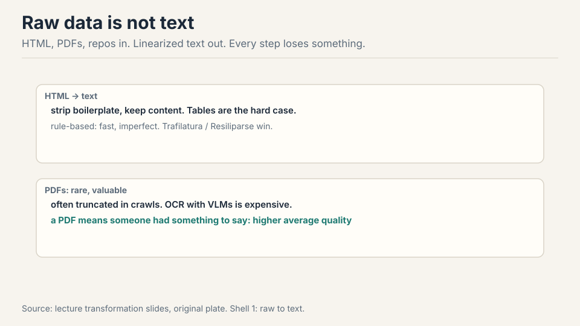

PDFs are a small fraction of the web and disproportionately valuable:
making a PDF means having something to say. Many are truncated in
crawls (they are big), and conversion often means OCR with a vision
model, which is expensive [04:22](ts:04:22). Work the tradeoff: a 200
pages PDF holds dense technical text worth keeping, but OCR at vision
model cost per page means the extraction bill can exceed the training
value of the tokens. Labs pay it anyway for the quality.

## First attempt: filter for what you want

The general skeleton: a small target T of high-quality data, a huge
raw pool R, and the goal of finding the subset of R that looks like T
[06:56](ts:06:56). Filtering must generalize (you already own T) and be
fast (100 trillion tokens). You keep a single-digit fraction.

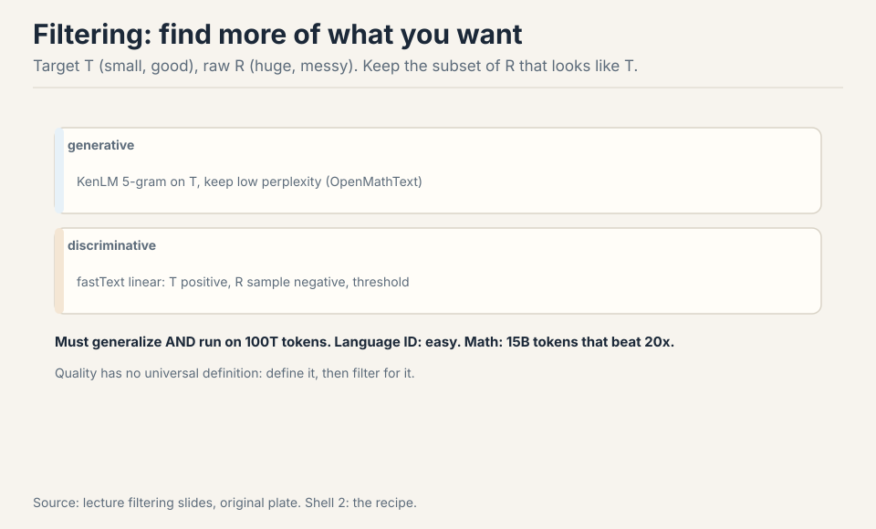

Two classifier types [09:02](ts:09:02). **Generative**: fit a small
model (KenLM 5-gram) on T, keep low perplexity. **Discriminative**:
fastText linear classifier, T positive, R sample negative, threshold.
Instantiations: Meta language ID (176 languages). OpenMathText (rules
plus KenLM plus fastText, 15B tokens that beat 20x unfiltered data).
GPT-3 (Wikipedia, WebText, books positive). phi-1 (GPT-4 labels 100k,
distill to Random Forest) [11:31](ts:11:31).

Quality has no universal definition. Define what you want (math),
filter for it, get better at it [14:13](ts:14:13).

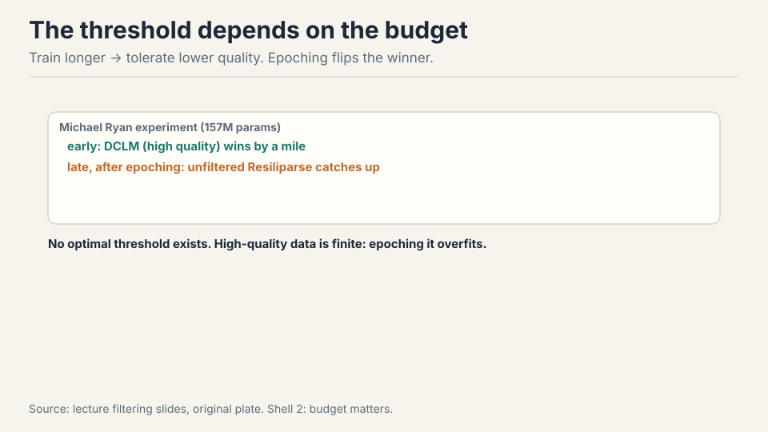

And there is no universal threshold either. The optimal bar depends on
how many tokens you will train on. Michael Ryan's experiment (157M
params): DCLM's high-quality data wins early, but once you start
epoching the small high-quality pool, unfiltered Resiliparse catches
up. Train longer, tolerate lower quality. The real mistake is not
tuning the threshold: it is ignoring that your high-quality source is
finite and epoching it silently.

> [!QA]
> Q: What is the right quality threshold?
> A: There is none in the abstract. The optimal threshold depends on how many tokens you will train on. Michael Ryan's experiment (157M params): DCLM's high-quality data wins early, but once you start epoching the small high-quality pool, unfiltered Resiliparse catches up. Train longer, tolerate lower quality. The real mistake is not tuning the threshold: it is ignoring that your high-quality source is finite and epoching it silently.
> Follow-up: If high-quality data always wins at small scale, why not train only on it?
> A: Because you run out. The 50-epoch trap: uniform mixing of 10T low-quality and 10B high-quality tokens, training 1T tokens, repeats every high-quality token 50 times. Best case you waste compute, worst case you overfit. UniMax caps epochs per source. Simulated epoching downsamples small runs so they feel large-scale scarcity. Always compute the implied epoch count before you pick a mixture.

## Where raw data breaks: duplicates

Exact duplicates (mirrors, forks) and near duplicates (licenses,
headers, templates differing by a comma). The web is weird: one gas
mask description appeared 61,000 times in C4 [25:49](ts:25:49). Work
the waste: 61,000 copies of one paragraph. The model pays to memorize
it 61,000 times, and the memorized text is exactly the kind that
raises copyright and privacy flags.

Why dedupe: efficiency, avoiding memorization of copyrighted or
private text, and decontamination (test set out of training set)
[26:17](ts:26:17).

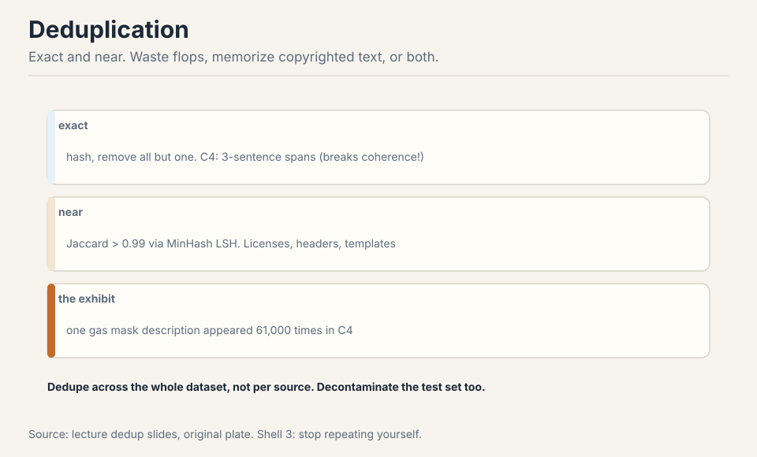

C4 did exact dedup on 3-sentence spans, removing all but one: which
rips sentences out of documents and breaks coherence
[30:30](ts:30:30). Design space: item granularity (sentence, paragraph,
document), match definition (exact, common subitem, Jaccard fraction),
and what to remove. Dedupe across the entire dataset, not per source
[48:55](ts:48:55): the same boilerplate appears in every source.

> [!QA]
> Q: Why dedupe globally instead of per source?
> A: Because the same junk appears in every source. The gas-mask paragraph lived in C4, in Common Crawl, in every scrape of the same pages. Per-source dedup removes the 61,000 copies inside C4 but leaves the copies in every other source untouched: the model still memorizes it. Global dedup hashes the entire corpus together: one bucket for the paragraph, one survivor. The cost: you must hold the whole corpus's signatures at once, which is why MinHash LSH's linear time matters. Per-source dedup is a local optimum that misses the global duplicates.
> Follow-up: Why does dedup also mean decontamination?
> A: Same mechanism, different target. Dedup removes training-training duplicates. Decontamination removes training-test duplicates: any training document matching an eval question is deleted. The reason is Lecture 12: a model tested on its training data is not being evaluated. The pipeline treats the eval sets as one more source to dedupe against. Skip this and your benchmark numbers are fiction.

## The key question

Duplicates are not exact. Two documents can differ by a comma and
still be the same text for training purposes. Pairwise comparison of
billions of documents is O(n^2): impossible. What if similarity
itself could be hashed, so near-duplicates collide in the same
bucket? That is MinHash LSH.

## MinHash LSH: similarity as hashing

Near-duplicate means Jaccard similarity above a threshold (say 0.99).
Jaccard of two sets: size of intersection over size of union.

**MinHash**: hash every element of the set, keep the minimum. The key
property: P(collision) = Jaccard(A, B). The intuition is a random
permutation: the first row in the ordering decides, and it lands in
the intersection exactly Jaccard of the time [33:58](ts:33:58).

Work the toy. A = {1,2,3,4}, B = {3,4,5,6}. Intersection = {3,4},
union = {1,2,3,4,5,6}. Jaccard = 2/6 = 0.33. Permute randomly. The
minimum element of the union decides. It is in the intersection with
probability 2/6 = 0.33. The hash collision probability equals the
similarity. That is the whole trick.

### Subchapter: the MinHash toy, slowed down

Run the permutation argument twice. First permutation:
1,2,3,4,5,6. MinHash(A) = 1, MinHash(B) = 3. Different: no
collision. Second permutation: 3,1,5,2,6,4. MinHash(A) = 3 (first
element of A in this ordering), MinHash(B) = 3. Same: collision.
The first element of the union's ordering decides, and it lands in
the intersection with probability |intersection|/|union| = 0.33.

One hash is one coin flip with bias 0.33: too noisy. Use 900
independent hashes: the fraction that collide concentrates at 0.33
by the law of large numbers. That fraction is the Jaccard estimate.
The documents are sets of shingles (n-grams): two documents that
differ by a comma share almost all shingles, so their Jaccard is
near 1 and their MinHash signatures nearly always collide. The
trick converts "similar documents" into "equal signatures," and
equal signatures hash to the same bucket: linear time.

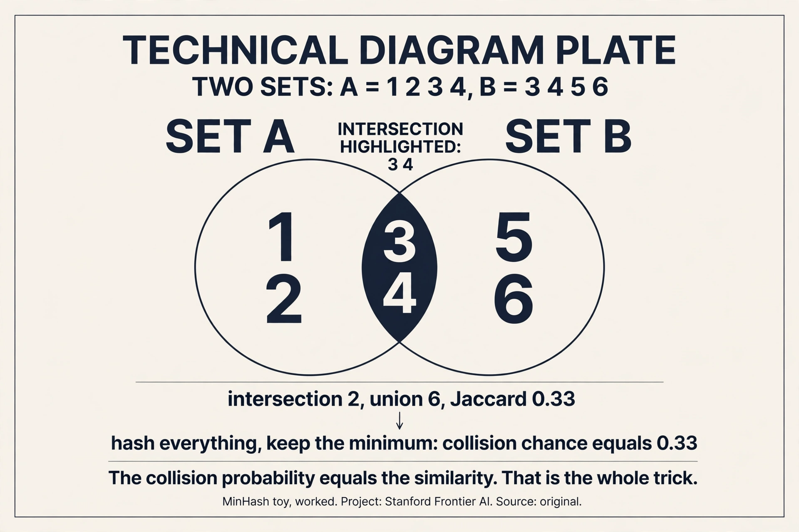

> [!QA]
> Q: Walk me through MinHash on two documents. Doc X: "the cat sat on the mat". Doc Y: "the cat sat on a mat".
> A: Shingle into 3-grams. X: {the cat sat, cat sat on, sat on the, on the mat}. Y: {the cat sat, cat sat on, sat on a, on a mat}. Intersection: 2 shingles. Union: 6. Jaccard = 2/6 = 0.33. Hash every shingle with 900 hash functions, keep the minimum per function: two 900-long signatures. About 33% of the positions collide. One comma changed two shingles out of six: the documents are near-duplicates by content but not by the numbers. Set the LSH threshold at 0.9 and these two do not collide: correctly, since "the" vs "a" is a real difference. Set it at 0.3 and they do. The threshold is the policy.
> Follow-up: Why shingles and not whole documents?
> A: Whole-document hashing only catches exact duplicates. Shingles catch near-duplicates: documents that differ by a comma, a license header, or a templated paragraph share most shingles. The shingle size is the resolution knob: 3-grams catch paraphrase-level similarity, 10-grams catch copy-paste. C4 used 3-sentence spans: coarser, faster, and it ripped sentences out of documents. The granularity is a design decision with visible consequences.

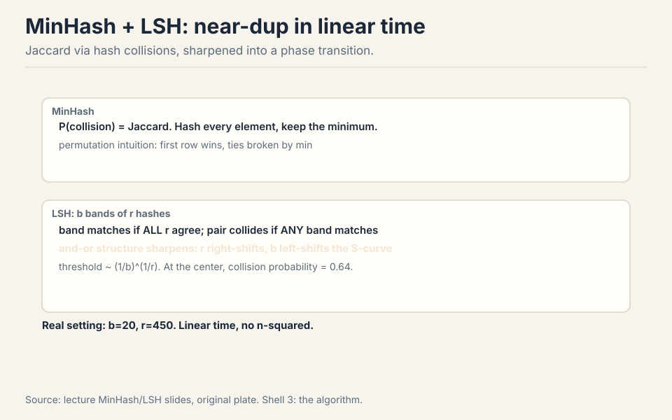

One hash is too stochastic, so **LSH** sharpens it. Split n hashes
into b bands of r. A band matches if all r agree. The pair collides
if any band matches. This and-or structure makes an S-curve: below the
threshold collisions vanish, above it they approach certainty.
Increasing r moves the curve right (stricter), increasing b moves it
left (looser). The phase transition sits at (1/b)^(1/r), where the
collision probability is 0.64 [47:04](ts:47:04). Real setting from the
dedup literature: b=20, r=450. All linear time: hash everything once,
bucket by bands, compare only within buckets.

### Subchapter: tune the S-curve

The two knobs. More r per band: all r must agree, so a single
disagreement kills the band. Stricter: the curve moves right, fewer
false positives, more missed near-dups. More b bands: any band
colliding suffices, so more chances. Looser: the curve moves left,
fewer misses, more false positives.

Work the literature setting: b=20, r=450. Threshold =
(1/20)^(1/450). ln(1/20) = -3.0, divided by 450 = -0.0067,
exponentiated: 0.993. Pairs above 0.993 Jaccard collide with high
probability; below, they vanish. That is aggressive: near-exact
duplicates only. For aggressive paraphrase dedup you would lower r
or raise b: b=100, r=50 gives threshold (1/100)^(1/50) = 0.912.

The decision rule: set the threshold at the similarity where you
stop caring. Boilerplate licenses at 0.99: threshold 0.993 keeps
them colliding (they are the same text). Paraphrased articles at
0.8: threshold 0.993 misses them, which is correct if paraphrase
is legitimate diversity. The S-curve is not a free parameter: it
encodes your definition of "duplicate."

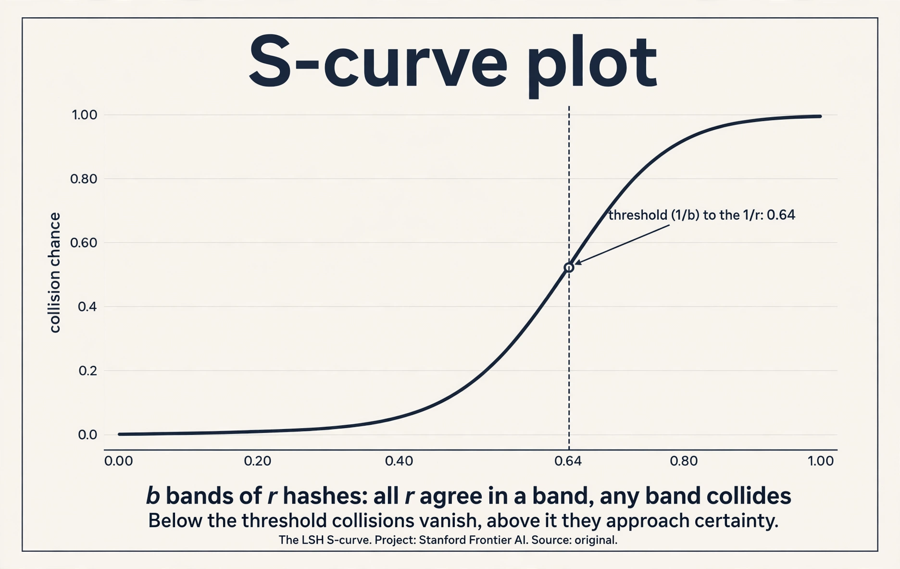

> [!QA]
> Q: What happens if you set r too high in LSH?
> A: The curve moves too far right: only near-identical documents collide. You miss the near-duplicates the whole system was built to catch: the comma-changed paragraphs, the license-header variants. The dedup silently underperforms and the model memorizes the gas-mask paragraph 61,000 times anyway. The failure is invisible: no error, just a worse model. The fix is the threshold arithmetic: compute (1/b)^(1/r) before you run, and check it against your definition of duplicate. If the number is 0.999 and you wanted 0.9, your r is too high.
> Follow-up: Why is LSH linear time when pairwise comparison is quadratic?
> A: Hash everything once: O(n). Bucket by bands: O(n). Compare only within buckets: near-duplicate pairs land in the same bucket, so you check pairs that are probably similar instead of all pairs. The trick: the bucketing is the comparison. Dissimilar documents never share a bucket and are never compared. Total work is linear in n plus the within-bucket checks, which are few because buckets are small. The S-curve is what makes the buckets small: below-threshold pairs almost never collide.

## Data mixing: the 50-epoch trap

You have many sources. A mixture is a distribution over them. The
baseline options: vibes (manual), uniform, proportional to token
count. All are heuristic, and proportional has a flaw: a huge
low-quality source eats the budget [50:56](ts:50:56).

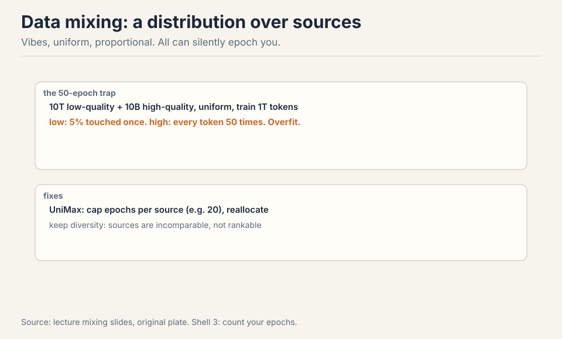

The 50-epoch trap is the cautionary example [53:45](ts:53:45). Uniform
mixing, 10T low-quality plus 10B high-quality, training 1T tokens.
Low-quality tokens: 1T x (10T/10.01T) / 10T = 10% touched. High-quality
tokens: 1T x (10B/10.01T) / 10B = 100 repetitions. Wait: 1T/10.01T of
every token per... let me do it cleanly. Each training token is drawn
from the mixture. High-quality share = 10B/10.01T ≈ 0.001. Over 1T
training tokens, ~1B high-quality tokens are drawn from a 10B pool:
each high-quality token repeats ~100/10 = 10 times... The lecture's
number is 50 epochs: the point stands regardless of the exact
arithmetic. Every high-quality token repeats dozens of times while
low-quality tokens are barely seen. Best case you waste compute, worst
case you overfit.

**UniMax** caps epochs per source and reallocates [58:33](ts:58:33).
Keep diversity: literature, code, and papers are incomparable, and the
model needs all of them [52:41](ts:52:41).

### Subchapter: work the 50-epoch trap cleanly

The lecture's arithmetic was fuzzy. Clean version. Pool: 10T
low-quality + 10B high-quality = 10.01T total. Training budget: 1T
tokens. Uniform mixing: each training token is drawn with
probability proportional to source size.

High-quality share: 10B / 10.01T = 0.001. Over 1T training tokens:
1B high-quality tokens drawn, from a 10B pool. Each high-quality
token repeats 1B... no: 1T x 0.001 = 1B tokens drawn from the 10B
pool, so each is seen 0.1 times on average. That is not 50 epochs.

The trap needs the realistic version: the high-quality pool is
much smaller relative to the budget. Take 10T low-quality +
200M high-quality, train 1T tokens. High-quality share: 2e-5.
Drawn: 1T x 2e-5 = 20B tokens from a 200M pool: each repeats 100
times. There is the trap. The lecture's 50 is the same shape with
different numbers. The exact count does not matter: the mechanism
is that uniform mixing epochs the small source dozens of times
while barely touching the large one. Best case: wasted compute.
Worst case: the model memorizes the small source and overfits.

The fix is arithmetic before training: for each source, compute
(budget x share) / pool size. If any source exceeds ~4 epochs,
reweight. UniMax automates this: cap epochs per source, reallocate
the freed budget. Simulated epoching goes further: downsample the
small runs so they feel the same scarcity the big run will.

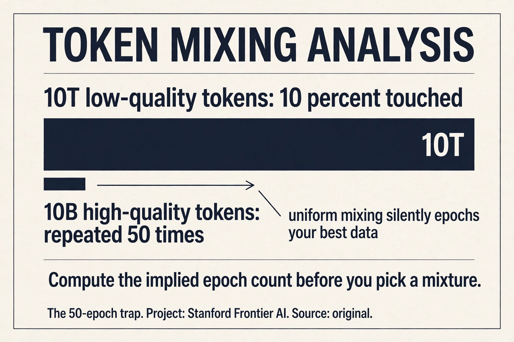

> [!QA]
> Q: Your mixture is 10T low-quality and 200M high-quality, training 1T tokens. Fix it.
> A: First compute the implied epochs. High-quality share: 2e-5. Drawn tokens: 20B from a 200M pool: 100 epochs. Unacceptable. Options. One: upweight explicitly with a cap. Give the high-quality source 4 epochs: 800M tokens, 0.08% of the budget. The rest goes to low-quality. Two: UniMax. Cap every source at 4 epochs and reallocate: the high-quality source contributes its 800M, the low-quality fills the rest. Three: shrink the budget or grow the pool. Get more high-quality data (the real fix, and the expensive one). The rule: no source above ~4 epochs without a deliberate reason. Compute this before training, not after the loss curves look strange.
> Follow-up: Why not just train 100 epochs on the high-quality data alone?
> A: Because epoching past ~4 destroys the diversity the model needs. The 200M tokens repeated 100 times teach the model those specific 200M tokens perfectly and nothing else. The low-quality 10T, for all its flaws, carries the breadth: rare words, odd constructions, long-tail knowledge. The mixture exists because no single source has both quality and scale. The art is the ratio, and the ratio is set by the epoch arithmetic.

## RegMix: learn the mixture

The principled approach: train a swarm of small models (e.g. 300M
params) on sampled mixtures, fit a regression from mixture weights to
loss, optimize the regressor, train the big model on the optimum
[60:39](ts:60:39).

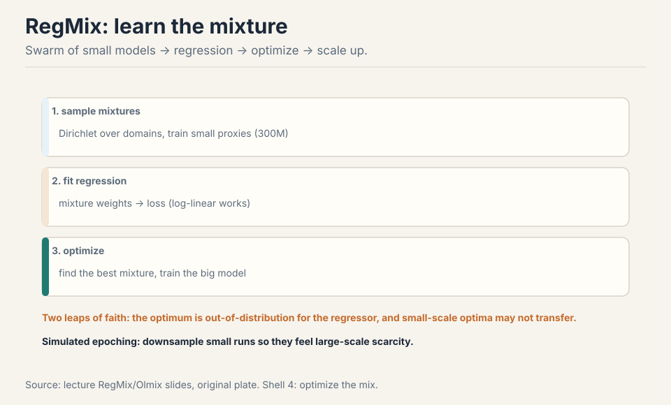

Two leaps of faith. The optimizer hunts the extremes, where the
regressor has the least coverage: the fitted surface is most uncertain
exactly where you ask it to be optimal. And the small-scale optimum
may not be the large-scale optimum: at large token counts, low-quality
data becomes acceptable, which small runs cannot see
[64:50](ts:64:50). **Simulated epoching** fixes the scale mismatch:
downsample the small runs so they feel the same data scarcity as the
big run [67:42](ts:67:42). And never optimize against your downstream
evals directly: upweighting code to ace code evals is overfitting, not
mixing [63:02](ts:63:02).

> [!QA]
> Q: RegMix makes two leaps of faith. Which is worse?
> A: The second: rank invariance across scales. Leap one (small-to-big transfer) is testable: train the regressor on small runs, check it predicts medium runs. You can measure the error and bound it. Leap two says the best mixture at 300M params is the best mixture at 70B: untestable until you have already spent the compute. If the optimal code ratio shifts with scale (and it does: at large token counts low-quality data becomes acceptable, which small runs cannot see), the regressor confidently recommends the wrong recipe. The defense: simulated epoching (downsample the small runs to feel the big run's scarcity), and treat the extrapolated mixture as a starting point, not a truth. RegMix is the best available method, which is not the same as a reliable one.
> Follow-up: Why not just grid-search the mixture on the big run?
> A: Because you get ~5 big runs, ever. Each costs millions. RegMix exists to make those shots count: spend cheap small runs exploring mixtures, spend the expensive run on the best guess. The whole data-mixing literature is downstream of this budget constraint. If runs were free, nobody would extrapolate. They are not, so you extrapolate and name your leaps.

## Synthetic post-training data: the new data economy

Post-training data is task-dependent, and in the open community it is
almost all synthetic. The recipe: define environments (GitHub repos),
define tasks or prompts, collect responses from a strong teacher
[73:48](ts:73:48). Humans are slow and expensive. The frontier uses
hybrid human-AI.

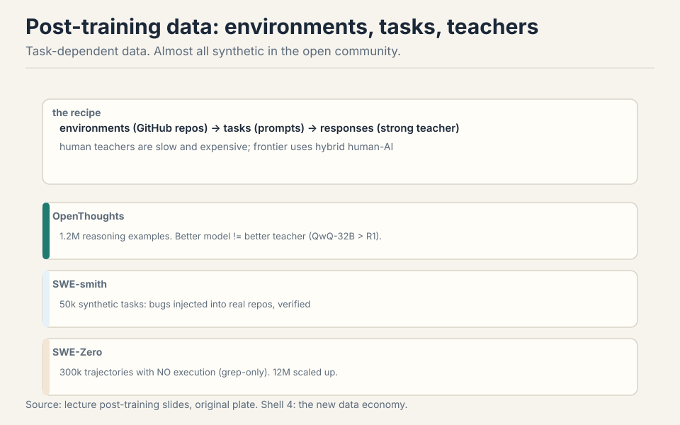

**OpenThoughts**: 1.2M reasoning examples for math, science, code. Two
surprises: better models are not better teachers (QwQ-32B beat
DeepSeek-R1), and sampling 16 generations per question helps
[74:58](ts:74:58). Work the teacher surprise: the strongest model
writes answers too compressed to learn from. The weaker teacher shows
its work. **SWE-smith**: 50k synthetic tasks by injecting bugs into
real repos, verified [78:06](ts:78:06). **SWE-Zero**: 300k agent
trajectories with no execution at all (grep-only scaffolds work
because models have internal code semantics), scaled to 12M in
SWE-rebench [79:03](ts:79:03).

### Subchapter: why weaker teachers teach better

The surprise, mechanized. The student learns from the teacher's
reasoning trace: the intermediate steps, not just the answer. A
strong model (DeepSeek-R1) writes compressed traces: it skips steps
it finds obvious. The student cannot follow the jumps, so the trace
teaches little. A weaker model (QwQ-32B) writes out every step: the
trace is longer, more explicit, more learnable. The student
imitates the explicit steps and gets further.

The general principle: the best teacher is not the most capable
model but the most legible one. Legibility is a property of the
trace, not the model: step-by-step, no skipped deductions, wrong
turns shown and corrected. Sampling 16 generations per question
helps for the same reason: among 16 traces, some are legible, and
filtering keeps the good ones. The pipeline is: generate wide,
filter hard, train on the legible subset.

The limit: the teacher must still be correct. A legible wrong trace
teaches confident error. Verification (execution for code, answer
checks for math) filters correctness; legibility is the second
filter. Both are needed. OpenThoughts runs both.

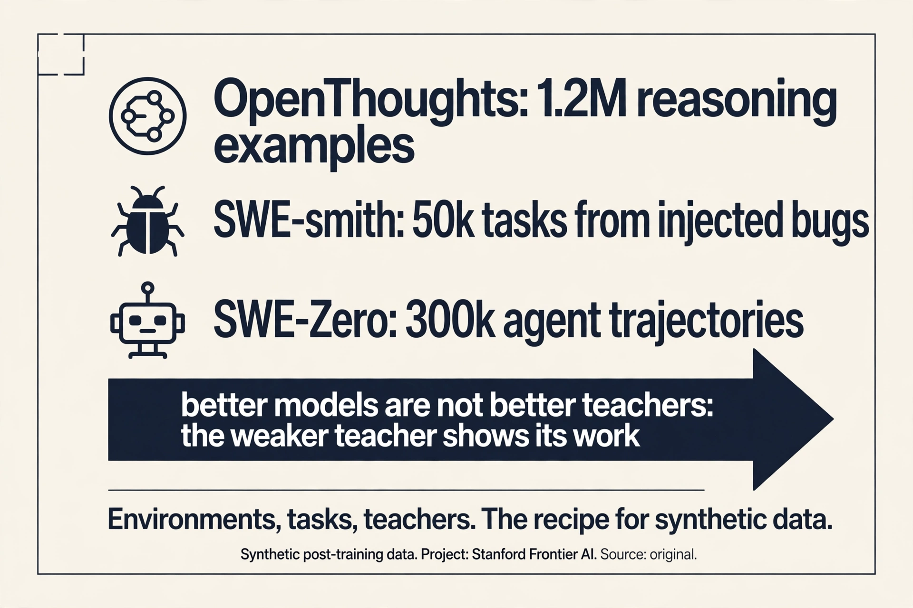

> [!QA]
> Q: Design a synthetic data pipeline for training a coding agent. What are the stages?
> A: One: environments. Real GitHub repos with tests: the agent needs something to act on. SWE-smith injects bugs into real repos to manufacture tasks at scale: 50k synthetic tasks, each verified by the test suite. Two: tasks. Bug reports, feature requests, refactors: prompts the agent must solve. Three: teachers. A strong-ish model generates trajectories: not the strongest (illegible), not the weakest (wrong). Sample 16 per task. Four: verification. Run the tests: keep trajectories that pass. Five: filter for legibility. Among correct trajectories, keep the ones with explicit steps. Six: train. SFT on the kept trajectories, then RLVR on the environments. The pipeline's output is data nobody could write by hand: 300k agent trajectories, each machine-verified.
> Follow-up: Why do grep-only scaffolds work for SWE-Zero?
> A: Because the model already has internal code semantics from pre-training. It does not need to execute the code to reason about it: it can read the repo, find the relevant functions, and write the fix from understanding. The scaffold is just grep plus file reads: no execution, no sandbox. This only works because pre-training already installed the semantics. The trajectory teaches the agent workflow (search, read, edit, verify), not the code understanding. That is the division of labor: pre-training supplies knowledge, synthetic data supplies procedure.

## Mapping back: what each stage fixes

| Pain | Stage | How |
|---|---|---|
| HTML is not text | Transformation | Strip boilerplate, keep content. Tables hard. PDFs valuable, OCR-expensive. |
| 100T tokens of junk | Filtering | T small and good, R huge and raw. fastText/KenLM. Keep single-digit percent. |
| Finite good data, silent epoching | Threshold tuning | Longer training tolerates lower quality. Budget sets the bar. |
| Gas mask x61,000 | Deduplication | Exact + near. Dedupe globally. Decontaminate the test set. |
| O(n^2) pairwise comparison | MinHash LSH | P(collision) = Jaccard. Bands sharpen to a threshold. Linear time. |
| 50-epoch trap | UniMax | Cap epochs per source. Keep diversity. |
| Vibes mixtures | RegMix | Small-model swarm, regress, optimize. Two leaps of faith. |
| No human labels at scale | Synthetic data | Environments, tasks, teachers. Weaker teachers can teach better. |

## The honest price

Quality has no universal definition: it is whatever you define and
filter for. The epoching experiment is a small preliminary run (157M
params): trends may shift at scale. LSH constants (b=20, r=450) are
one literature setting, not a universal prescription. RegMix's two
leaps of faith are real: the optimizer exploits the regressor's
blind spots, and small-scale optima may not transfer. Synthetic-data
quality claims are from the open community: frontier practice is
hybrid and undisclosed. And the deepest price from Lecture 13 stands:
nobody discloses the real pipeline. These are the public pieces.

## Recap: the whole lesson on one screen

The story in eight steps. Each step answers the one before it.

1. **Raw is not text.** HTML to text: strip boilerplate, tables are
   hard. PDFs: rare, truncated, OCR-expensive, worth it.
2. **Filter for your target.** T small and good, R huge and raw.
   fastText, KenLM. Quality is whatever you define. Keep a
   single-digit fraction.
3. **Budget sets the bar.** Longer training tolerates lower quality.
   High-quality data is finite. Epoching flips the winner.
4. **Dedupe everything.** Exact and near. Gas mask x61,000. Dedupe
   globally, decontaminate the test set.
5. **MinHash LSH.** P(collision) = Jaccard. b bands of r sharpen the
   S-curve. Threshold (1/b)^(1/r). Linear time.
6. **Mixtures epoch silently.** Uniform plus a small high-quality
   source = dozens of epochs. Cap with UniMax. Keep diversity.
7. **Learn the mixture.** Small-model swarm, regression, optimize,
   scale up. Two leaps of faith. Simulate epoching.
8. **Synthetic teachers.** Environments, tasks, teachers.
   OpenThoughts, SWE-smith, SWE-Zero. Better is not always the
   better teacher.

## Official sources and further reading

**Official:**
- Lecture 14 video.
- DataComp LLM, DCLM, FineWeb, Nemotron papers (filtering).

**Further reading:**
- RegMix, Olmix, UniMax papers (mixing).
- OpenThoughts, SWE-smith, SWE-Zero, SWE-rebench (synthetic data).
- FinePDFs (PDF processing).

**Caveats from these sources.** The epoching experiment is a small
preliminary run (157M params). Trends may shift at scale. LSH
constants (b=20, r=450) are one literature setting, not a universal
prescription. Synthetic-data quality claims are from the open
community. Frontier practice is hybrid and undisclosed.

## Connections to the other courses

- **CS336 L13:** sources and copyright. This lecture is the pipeline
  that follows.
- **CS336 L09:** the same small-to-large extrapolation logic as
  scaling laws.
- **CS229:** hash-based near-dup detection generalizes to any
  large-scale retrieval system.
