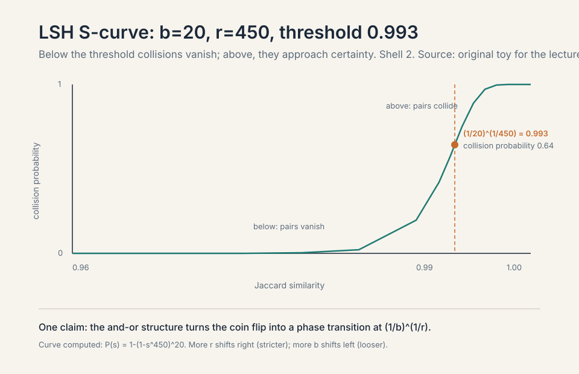
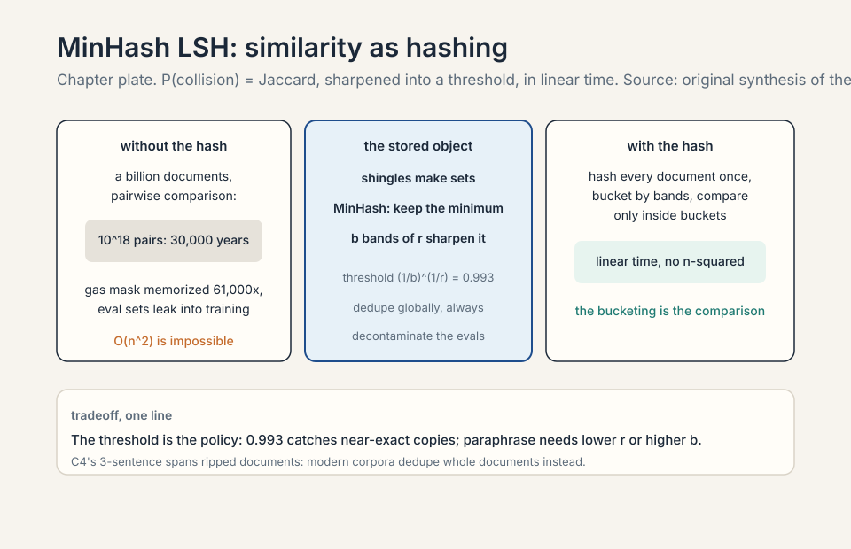
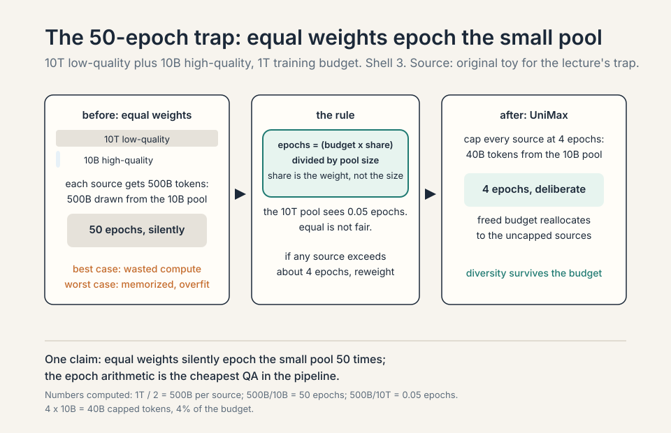
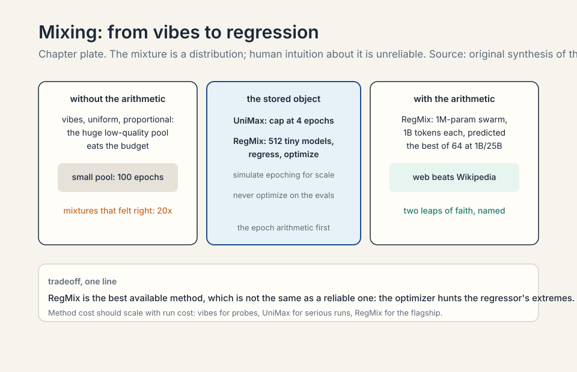
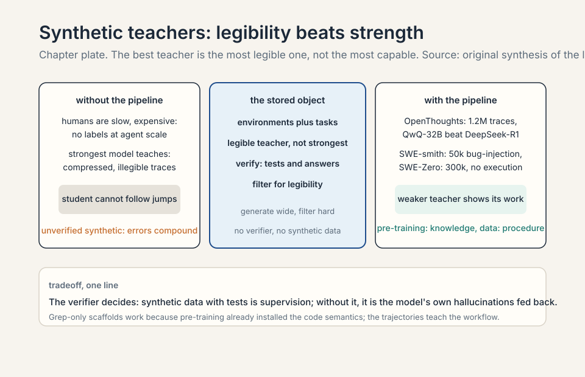
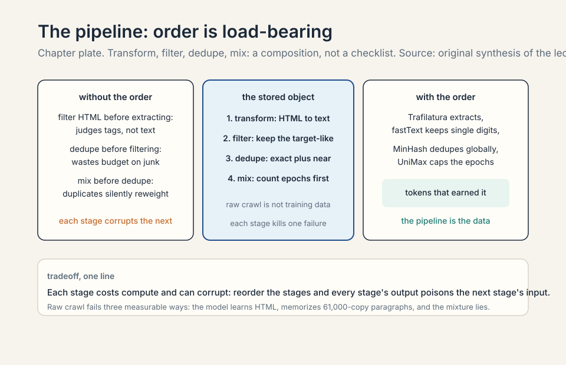

### Coverage and sourcing

This lesson follows Lecture 14 of CS336 (Spring 2026, Percy Liang),
"The Data Pipeline." Claims are referenced with timestamps from the
official subtitle transcript. The RegMix numbers are from the
published paper (Liu et al., arXiv:2407.01492, ICLR 2025), verified
against the paper's abstract. MinHash LSH follows the standard
treatment (Broder 1997) with the lecture's constants. The coverage
map at the end maps every major lecture claim to its section.

## The problem: raw crawl is not training data

Lecture 13 covered where data comes from. This is the pipeline that
turns it into training tokens: transform, filter, dedupe, mix, then
post-train. Raw data is not text. Common Crawl holds HTML (sometimes
PDFs, sometimes repos). It is full of duplicates, boilerplate, and
junk. Every stage below exists because training on the raw crawl
directly fails in a specific, measurable way.

### Subchapter: the five stages, one direction

The pipeline runs in one direction: transform, then filter, then
dedupe, then mix. The order is load-bearing. Transform first:
filtering HTML is meaningless, so extract text before judging it.
Filter second: deduping junk wastes the dedup budget on documents
you will drop anyway. Dedupe third: mixing a corpus with
duplicates silently reweights it. Mix last: the mixture is
computed on the final token counts. Reorder the stages and each
one's output corrupts the next one's input. The pipeline is a
composition, not a checklist.

### Subchapter: why raw crawl fails, measured

Train on the raw crawl and three things go wrong, each measurable.
One: the model learns HTML. Tags and boilerplate dominate the
token distribution, so gradient steps teach page structure
instead of language. Two: the model memorizes duplicates. The
gas-mask paragraph appears 61,000 times. The model spends
61,000x the gradient on it. Three: the mixture lies. A source
that is 90% boilerplate contributes 90% boilerplate tokens to
the mixture, silently. Each stage of the pipeline exists to
kill one of these failures. The pipeline is the difference
between "the web" and "training data."

## Transformation: linearization loses things

HTML-to-text is rule-based: strip boilerplate and navigation,
extract content. Tables are the hard case: simple ones render as
markdown, nested ones force approximation [01:51](ts:01:51).

### Subchapter: what the extractor keeps and drops

The extractor walks the HTML tree and scores each block. Dense
paragraph text: keep. Navigation lists: drop. Cookie banners:
drop. Comment sections: usually drop (low signal, high toxicity).
Advertisements: drop. The scoring is heuristic: text density,
link density, block length. Trafilatura and Resiliparse do this
well. The stock WET conversion does it crudely. The difference
is measurable downstream (Lecture 13's DataComp ablation). The
extractor is the first quality filter, and it runs before the
"filtering" stage even starts.

### Subchapter: tables are the hard case

Tables are the hard case: simple ones render as markdown, nested
ones force approximation [01:51](ts:01:51). A simple table (rows
and columns, one header) linearizes cleanly: header row, then
data rows, pipe-separated. The model reads it as structured
text. A nested table (tables inside cells, merged headers,
multi-level indices) has no faithful linearization: any
flattening loses the structure. The approximation: flatten to
the outer table, drop the nesting, hope the content survives.
Financial statements and scientific tables are the casualties:
the numbers survive, the relationships between them blur.

### Subchapter: PDFs are rare and valuable


PDFs are a small fraction of the web and disproportionately
valuable: making a PDF means having something to say. Many are
truncated in crawls (they are big), and conversion often means
OCR with a vision model, which is expensive [04:22](ts:04:22).
Work the tradeoff: a 200-page PDF holds dense technical text
worth keeping, but OCR at vision-model cost per page means the
extraction bill can exceed the training value of the tokens.
Labs pay it anyway for the quality.

### Subchapter: work the PDF tradeoff

The arithmetic. A 200-page technical PDF: roughly 100,000
tokens of dense text. Extraction options: text-layer
extraction (cheap, fails on scanned pages), OCR with a vision
model (expensive, works on everything). Vision-model OCR
costs on the order of cents per page: a 200-page PDF costs
dollars to extract. A crawl with a million PDFs costs
millions. The training value of the 100,000 tokens is a
fraction of a training run's budget: small per document,
enormous in aggregate. Labs pay the extraction bill because
PDFs are the densest technical text on the web: papers,
manuals, books. The quality justifies the cost. The pipeline
treats PDFs as a separate stream with its own budget.

### Subchapter: FinePDFs and the PDF stream

FinePDFs is the open PDF pipeline: crawl PDFs, extract with
OCR where needed, filter for quality. The PDF stream differs
from the HTML stream in every stage. Transformation: OCR
instead of HTML parsing. Filtering: technical-density
signals instead of web-quality signals. Dedup: the same
paper lives at many URLs (arXiv, author pages, mirrors).
The lecture names FinePDFs as the further-reading pointer:
the PDF pipeline is a full pipeline of its own, not a
footnote to the HTML one.

> [!QA]
> Q: Walk me through HTML-to-text extraction. What breaks?
> A: The extractor parses the HTML into a tree, then scores
> each block by text density and link density. Dense
> paragraphs: keep. Nav bars, sidebars, cookie banners, ads:
> drop. What breaks: tables (nested tables have no faithful
> linearization), JavaScript-rendered content (the crawler saw
> the shell, not the content), and boilerplate that looks like
> content (long footers, related-article lists). The stock WET
> conversion breaks most: it keeps the chrome. Trafilatura
> breaks least: it scores blocks and keeps the article. The
> breakage is silent: no error, just worse tokens. The
> lecture's rule: the extractor is the first quality filter.
> Audit it like one.
> Follow-up: Why are PDFs worth the OCR bill?
> A: Density. A PDF exists because someone had something to
> say: a paper, a manual, a book chapter. The web's HTML is
> mostly chrome with content inside. A PDF is mostly content.
> Per token, PDF text is denser in knowledge than web text.
> The OCR bill (vision-model cost per page) is real, but the
> tokens are worth more. Labs pay it because the alternative
> (skipping PDFs) drops the densest technical text on the web.
> The pipeline gives PDFs their own stream and their own
> budget: they are not web pages, and treating them as web
> pages loses them.

## First attempt: filter for what you want

The general skeleton: a small target T of high-quality data, a
huge raw pool R, and the goal of finding the subset of R that
looks like T [06:56](ts:06:56). Filtering must generalize (you
already own T) and be fast (100 trillion tokens). You keep a
single-digit fraction.

### Subchapter: the T/R skeleton, formalized

T is the target: a small set of documents you wish the whole
corpus resembled. R is the raw pool: trillions of tokens of
extracted web text. The filter is a function f: R -> {keep,
drop} such that the kept set resembles T. Two constraints.
Generalization: the filter must judge documents unlike
anything in T (you already own T. The point is to find more).
Speed: the filter runs over 100T tokens, so it must be cheap
per document. The kept fraction is single-digit: the funnel
is steep by design.


### Subchapter: the two classifier types

Two classifier types [09:02](ts:09:02). **Generative**: fit a
small model (KenLM 5-gram) on T, keep low perplexity.
**Discriminative**: fastText linear classifier, T positive, R
sample negative, threshold.

### Subchapter: generative filtering, mechanized

Fit a KenLM 5-gram model on T. Score every document in R by
perplexity: how surprised is the T-trained model by this
text? Low perplexity means T-like. Keep the low end. The
mechanism: the n-gram model captures T's surface statistics
(word choices, phrasing), and documents with similar
statistics score well. The limit: perplexity measures
surface similarity, not substance. A fluent conspiracy page
can have Wikipedia-like n-gram statistics. Generative
filtering keeps what sounds like T, not what is like T.

### Subchapter: discriminative filtering, mechanized

Train fastText: T as positives, a random sample of R as
negatives. The classifier learns the boundary: ngrams that
distinguish T from random web text. Score every document,
keep the top fraction. The mechanism: the negatives teach
the classifier what "not T" looks like, so it learns
substance, not just surface. The limit: the negative sample
defines "not T." Sample the negatives badly (too clean, too
dirty) and the boundary shifts. The positive set defines
the target. The negative sample defines the contrast.

### Subchapter: the instantiations

Instantiations: Meta language ID (176 languages). OpenMathText
(rules plus KenLM plus fastText, 15B tokens that beat 20x
unfiltered data). GPT-3 (Wikipedia, WebText, books positive).
phi-1 (GPT-4 labels 100k, distill to Random Forest)
[11:31](ts:11:31).

### Subchapter: OpenMathText, worked

OpenMathText: 15B tokens that beat 20x unfiltered data. The
recipe: rules first (drop the obvious junk), KenLM second
(keep math-like perplexity), fastText third (refine the
boundary). 15B tokens of filtered math beat 300B tokens of
raw web on math benchmarks. The ratio is the lesson: 20x
less data, better model. The domain is math, where the
target is crisp (textbook math is recognizable). The
generalization: per-domain funnels beat one global funnel.
Filter for the domain, not for "quality" in the abstract.

### Subchapter: phi-1's distillation filter

phi-1: GPT-4 labels 100k examples for quality, distill the
labels into a Random Forest. The mechanism: the expensive
judge (GPT-4) scores a sample. The cheap model (Random
Forest) learns to mimic the scores. The cheap model filters
the pool. This is the funnel's cost trick: pay the
expensive judge once, amortize over trillions of tokens.
The limit: the Random Forest mimics GPT-4's judgments,
including its biases. The filter is only as good as the
judge, and the judge is a model with opinions.

Quality has no universal definition. Define what you want
(math), filter for it, get better at it [14:13](ts:14:13).


### Subchapter: the threshold is a budget decision

And there is no universal threshold either. The optimal bar
depends on how many tokens you will train on. Michael Ryan's
experiment (157M params): DCLM's high-quality data wins
early, but once you start epoching the small high-quality
pool, unfiltered Resiliparse catches up. Train longer,
tolerate lower quality. The real mistake is not tuning the
threshold: it is ignoring that your high-quality source is
finite and epoching it silently.

### Subchapter: work the threshold experiment

The experiment: 157M parameters, two corpora. DCLM-filtered
(small, high-quality) versus unfiltered Resiliparse (large,
mixed). Short training: DCLM wins. The high-quality tokens
teach faster. Long training: the DCLM pool exhausts. Each
token repeats: epoch 2, epoch 3, diminishing returns. The
unfiltered pool is larger: it never exhausts, and its
breadth catches up. The crossover: the point where the
high-quality pool's epoching penalty exceeds the low-quality
pool's quality penalty. The threshold that is optimal for a
10B-token run is wrong for a 1T-token run. The budget sets
the bar. The mistake is treating the threshold as a property
of the data: it is a property of the data and the budget.

> [!QA]
> Q: What is the right quality threshold?
> A: There is none in the abstract. The optimal threshold
> depends on how many tokens you will train on. Michael Ryan's
> experiment (157M params): DCLM's high-quality data wins
> early, but once you start epoching the small high-quality
> pool, unfiltered Resiliparse catches up. Train longer,
> tolerate lower quality. The real mistake is not tuning the
> threshold: it is ignoring that your high-quality source is
> finite and epoching it silently.
> Follow-up: If high-quality data always wins at small scale, why not train only on it?
> A: Because you run out. The 50-epoch trap: uniform mixing of
> 10T low-quality and 10B high-quality tokens, training 1T
> tokens, repeats every high-quality token 50 times. Best case
> you waste compute, worst case you overfit. Cap epochs per
> source instead: no source contributes beyond its maximum, and
> the freed budget reallocates to the rest. Simulated epoching downsamples small runs so they
> feel large-scale scarcity. Always compute the implied epoch
> count before you pick a mixture.
> Follow-up: Generative or discriminative: which filter do I build first?
> A: Discriminative (fastText), unless you have a reason not
> to. The discriminative filter learns the boundary between
> your target and the raw pool: it sees both sides. The
> generative filter (KenLM perplexity) only models the target:
> it keeps what sounds like T, including fluent junk with
> T-like surface statistics. The exception: when you have no
> good negative sample. If R is too dirty to sample cleanly,
> the discriminative boundary wobbles. Then fit KenLM on T
> and keep low perplexity. The field's default stack is both:
> KenLM for the cheap first pass, fastText for the refined
> second pass (OpenMathText's recipe).

## Where raw data breaks: duplicates

Exact duplicates (mirrors, forks) and near duplicates
(licenses, headers, templates differing by a comma). The web
is weird: one gas mask description appeared 61,000 times in C4
[25:49](ts:25:49). Work the waste: 61,000 copies of one
paragraph. The model pays to memorize it 61,000 times, and the
memorized text is exactly the kind that raises copyright and
privacy flags.

### Subchapter: the three duplicate species

Exact duplicates: mirrors, forks, the same page at many URLs.
Byte-identical. Near duplicates: licenses, headers, templates
differing by a comma. The content is the same. The bytes
differ slightly. Template duplicates: the same boilerplate
wrapped around different content (nav bars, footers, cookie
text). Each species needs its own tool: exact hashing for the
first, MinHash LSH for the second, extraction (Lecture 13)
for the third. One tool does not catch all three.

### Subchapter: why dedupe, the three reasons

Why dedupe: efficiency, avoiding memorization of copyrighted
or private text, and decontamination (test set out of training
set) [26:17](ts:26:17). Efficiency: 61,000 copies waste
61,000x the gradient. Memorization: duplicated text is the
text the model memorizes verbatim, and verbatim memorization
is where copyright and privacy liability lives. A paragraph
that appears once is learned as language. A paragraph that
appears 61,000 times is learned as a string. Decontamination:
the eval sets are the most important duplicates to remove.
A model tested on its training data is not being evaluated.


### Subchapter: C4's 3-sentence spans

C4 did exact dedup on 3-sentence spans, removing all but one:
which rips sentences out of documents and breaks coherence
[30:30](ts:30:30). The mechanism: slide a 3-sentence window
over every document, hash each span, keep one copy of each
hash. A sentence that appears in 1,000 documents survives in
one. The cost: the surviving document keeps the sentence,
the other 999 lose it mid-paragraph. Coherence breaks at
every rip. The tradeoff: aggressive dedup (cleaner corpus)
versus document integrity (readable survivors). C4 chose
aggression. Later corpora moved to document-level dedup:
keep or drop whole documents, never rip spans.

### Subchapter: the design space

Design space: item granularity (sentence, paragraph,
document), match definition (exact, common subitem, Jaccard
fraction: the overlap of the two shingle sets over their
union), and what to remove. Dedupe across the entire
dataset, not per source [48:55](ts:48:55): the same
boilerplate appears in every source.

### Subchapter: granularity is a policy

Sentence-level: catches the gas-mask paragraph wherever it
hides, but rips documents. Paragraph-level: the compromise
most corpora choose. Document-level: preserves coherence,
misses near-duplicates that share paragraphs. The lecture's
trajectory: C4's sentence spans were too aggressive, the
field moved coarser. The policy encodes a belief about what
a "duplicate" is: shared sentences (C4) or shared documents
(modern). The belief changed because the rips were visible
in the trained models' outputs.

> [!QA]
> Q: Why dedupe globally instead of per source?
> A: Because the same junk appears in every source. The
> gas-mask paragraph lived in C4, in Common Crawl, in every
> scrape of the same pages. Per-source dedup removes the
> 61,000 copies inside C4 but leaves the copies in every other
> source untouched: the model still memorizes it. Global dedup
> hashes the entire corpus together: one bucket for the
> paragraph, one survivor. The cost: you must hold the whole
> corpus's signatures at once, which is why MinHash LSH's
> linear time matters. Per-source dedup is a local optimum
> that misses the global duplicates.
> Follow-up: Why does dedup also mean decontamination?
> A: Same mechanism, different target. Dedup removes
> training-training duplicates. Decontamination removes
> training-test duplicates: any training document matching an
> eval question is deleted. The reason is Lecture 12: a model
> tested on its training data is not being evaluated. The
> pipeline treats the eval sets as one more source to dedupe
> against. Skip this and your benchmark numbers are fiction.
> Follow-up: What is the cost of C4's span-ripping?
> A: Coherence. A document that loses a 3-sentence span
> mid-paragraph reads as a non sequitur: the sentences before
> and after no longer connect. The model trains on broken
> documents and learns broken transitions. The corpus is
> cleaner (fewer duplicates) but less coherent. Later corpora
> chose document-level dedup: a duplicated document is kept
> or dropped whole. The duplicate rate is slightly higher,
> the documents are intact. The field decided coherence was
> worth the duplicates.

## The key question

Duplicates are not exact. Two documents can differ by a comma
and still be the same text for training purposes. Pairwise
comparison of billions of documents is O(n^2): impossible.
What if similarity itself could be hashed, so near-duplicates
collide in the same bucket? That is MinHash LSH.

### Subchapter: why O(n^2) is impossible

A billion documents. Pairwise comparison: 10^18 pairs. At a
microsecond per comparison: 30,000 years. The comparison must
be sub-quadratic. Hashing is linear: hash each document once,
compare only documents that collide. The trick is making
similar documents collide: ordinary hashes scatter them.
MinHash is the hash that collides on similarity.

## MinHash LSH: similarity as hashing

Near-duplicate means Jaccard similarity above a threshold (say
0.99). Jaccard of two sets: size of intersection over size of
union.

**MinHash**: hash every element of the set, keep the minimum.
The key property: P(collision) = Jaccard(A, B). The intuition
is a random permutation: the first row in the ordering
decides, and it lands in the intersection exactly Jaccard of
the time [33:58](ts:33:58).

### Subchapter: Jaccard, defined on sets

The documents are sets of shingles (n-grams). A **shingle**
is a contiguous n-gram of the document: for 5-word shingles,
"the cat sat on the mat" becomes {the cat sat on the, cat
sat on the mat}. Two documents that differ by a comma share
almost all shingles. Jaccard = |A intersect B| / |A union B|:
the fraction of shingles they share. Identical documents:
Jaccard 1. Disjoint documents: Jaccard 0. The comma-changed
paragraph: Jaccard 0.99.

Work the toy. A = {1,2,3,4}, B = {3,4,5,6}. Intersection =
{3,4}, union = {1,2,3,4,5,6}. Jaccard = 2/6 = 0.33. Permute
randomly. The minimum element of the union decides. It is in
the intersection with probability 2/6 = 0.33. The hash
collision probability equals the similarity. That is the
whole trick.

### Subchapter: the MinHash toy, slowed down

Run the permutation argument twice. First permutation:
1,2,3,4,5,6. MinHash(A) = 1, MinHash(B) = 3. Different: no
collision. Second permutation: 3,1,5,2,6,4. MinHash(A) = 3
(first element of A in this ordering), MinHash(B) = 3. Same:
collision. The first element of the union's ordering decides,
and it lands in the intersection with probability
|intersection|/|union| = 0.33.

### Subchapter: from one hash to a signature

One hash is one coin flip with bias 0.33: too noisy. Use 900
independent hashes: the fraction that collide concentrates at
0.33 by the law of large numbers. That fraction is the
Jaccard estimate. The documents are sets of shingles: two
documents that differ by a comma share almost all shingles,
so their Jaccard is near 1 and their MinHash signatures
nearly always collide. The trick converts "similar
documents" into "equal signatures," and equal signatures hash
to the same bucket: linear time.

<figure markdown="1">
```ascii
sets   A = {1,2,3,4}      B = {3,4,5,6}
inter  {3,4}              union {1,2,3,4,5,6}
jacc   2/6 = 0.33
perm1  1,2,3,4,5,6        minA=1  minB=3  miss
perm2  3,1,5,2,6,4        minA=3  minB=3  HIT
rule   collision chance 0.33 equals the Jaccard
```

<figcaption>The minimum of the union lands in the intersection with probability Jaccard. Source: original toy for the lecture's MinHash section.</figcaption>
</figure>

> [!QA]
> Q: Walk me through MinHash on two documents. Doc X: "the cat sat on the mat". Doc Y: "the cat sat on a mat".
> A: Shingle into 3-grams. X: {the cat sat, cat sat on, sat
> on the, on the mat}. Y: {the cat sat, cat sat on, sat on a,
> on a mat}. Intersection: 2 shingles. Union: 6. Jaccard =
> 2/6 = 0.33. Hash every shingle with 900 hash functions, keep
> the minimum per function: two 900-long signatures. About 33%
> of the positions collide. One comma changed two shingles out
> of six: the documents are near-duplicates by content but not
> by the numbers. Set the LSH threshold at 0.9 and these two do
> not collide: correctly, since "the" vs "a" is a real
> difference. Set it at 0.3 and they do. The threshold is the
> policy.
> Follow-up: Why shingles and not whole documents?
> A: Whole-document hashing only catches exact duplicates.
> Shingles catch near-duplicates: documents that differ by a
> comma, a license header, or a templated paragraph share most
> shingles. The shingle size is the resolution knob: 3-grams
> catch paraphrase-level similarity, 10-grams catch copy-paste.
> C4 used 3-sentence spans: coarser, faster, and it ripped
> sentences out of documents. The granularity is a design
> decision with visible consequences.
> Follow-up: Why 900 hashes and not 9?
> A: Variance. One hash is a coin flip: the collision fraction
> over 9 hashes could be anywhere. Over 900, the law of large
> numbers concentrates the fraction at the true Jaccard. The
> signature length is the precision knob: longer signatures,
> tighter estimates, more compute and memory. 900 is the
> literature's compromise: enough for a stable estimate, cheap
> enough to store for billions of documents.


### Subchapter: LSH sharpens the coin flip

One hash is too stochastic, so **LSH** sharpens it. Split n
hashes into b bands of r. A band matches if all r agree. The
pair collides if any band matches. This and-or structure makes
an S-curve: below the threshold collisions vanish, above it
they approach certainty. Increasing r moves the curve right
(stricter), increasing b moves it left (looser). The phase
transition sits at (1/b)^(1/r), where the collision
probability is 0.64 [47:04](ts:47:04). Real setting from the
dedup literature: b=20, r=450. All linear time: hash
everything once, bucket by bands, compare only within
buckets.

### Subchapter: tune the S-curve

The two knobs. More r per band: all r must agree, so a single
disagreement kills the band. Stricter: the curve moves right,
fewer false positives, more missed near-dups. More b bands:
any band colliding suffices, so more chances. Looser: the
curve moves left, fewer misses, more false positives.

Work the literature setting: b=20, r=450. Threshold =
(1/20)^(1/450). ln(1/20) = -3.0, divided by 450 = -0.0067,
exponentiated: 0.993. Pairs above 0.993 Jaccard collide with
high probability. Below, they vanish. That is aggressive:
near-exact duplicates only. For aggressive paraphrase dedup
you would lower r or raise b: b=100, r=50 gives threshold
(1/100)^(1/50) = 0.912.

### Subchapter: the threshold is the policy

The decision rule: set the threshold at the similarity where
you stop caring. Boilerplate licenses at 0.99: threshold 0.993
keeps them colliding (they are the same text). Paraphrased
articles at 0.8: threshold 0.993 misses them, which is
correct if paraphrase is legitimate diversity. The S-curve
is not a free parameter: it encodes your definition of
"duplicate."



> [!QA]
> Q: What happens if you set r too high in LSH?
> A: The curve moves too far right: only near-identical
> documents collide. You miss the near-duplicates the whole
> system was built to catch: the comma-changed paragraphs, the
> license-header variants. The dedup silently underperforms
> and the model memorizes the gas-mask paragraph 61,000 times
> anyway. The failure is invisible: no error, just a worse
> model. The fix is the threshold arithmetic: compute
> (1/b)^(1/r) before you run, and check it against your
> definition of duplicate. If the number is 0.999 and you
> wanted 0.9, your r is too high.
> Follow-up: Why is LSH linear time when pairwise comparison is quadratic?
> A: Hash everything once: O(n). Bucket by bands: O(n).
> Compare only within buckets: near-duplicate pairs land in the
> same bucket, so you check pairs that are probably similar
> instead of all pairs. The trick: the bucketing is the
> comparison. Dissimilar documents never share a bucket and are
> never compared. Total work is linear in n plus the
> within-bucket checks, which are few because buckets are
> small. The S-curve is what makes the buckets small:
> below-threshold pairs almost never collide.
> Follow-up: What breaks if the buckets get too big?
> A: The within-bucket comparisons go quadratic. A bucket with
> a million documents needs a trillion comparisons: the
> linear-time promise dies. Big buckets happen when the
> threshold is too loose (everything collides) or the data has
> a giant near-duplicate cluster (the gas-mask paragraph's
> 61,000 copies land in one bucket: fine, that is 61,000
> comparisons, manageable). The defense: cap bucket sizes and
> sample within oversized buckets. The S-curve's sharpness is
> what keeps buckets small: below-threshold pairs vanish
> instead of piling up.



## Data mixing: the 50-epoch trap

You have many sources. A mixture is a distribution over them.
The baseline options: vibes (manual), uniform, proportional to
token count. All are heuristic, and proportional has a flaw: a
huge low-quality source eats the budget [50:56](ts:50:56).


### Subchapter: the three heuristics

Vibes: the researcher sets weights by intuition. Fast,
unprincipled, and the industry default for longer than
anyone admits. Uniform: every source equal weight. Simple,
and wrong whenever sources differ in size or quality (they
always do). Proportional: weight by token count. Principled
looking, and it has the flaw: the huge low-quality source
eats the budget while the small high-quality source starves.
All three are heuristics. The principled methods (UniMax and
RegMix, taught in the next two sections) exist because the
heuristics fail measurably.

### Subchapter: work the 50-epoch trap cleanly

The 50-epoch trap is the cautionary example [53:45](ts:53:45).
The lecture's arithmetic was fuzzy. Clean version. Pool: 10T
low-quality + 10B high-quality = 10.01T total. Training
budget: 1T tokens. Uniform mixing: every source gets equal
weight. Two sources, so 500B tokens each. The trap is that
equal weight ignores pool size.

The division, shown. Drawn from the high-quality pool: 500B
tokens from a 10B pool. Epochs: 500B / 10B = 50. There is the
trap. Meanwhile the 10T pool sees 500B / 10T = 0.05 epochs:
barely touched. Equal is not fair when pools differ 1000x in
size. Best case: wasted compute. Worst case: the model
memorizes the small source and overfits.

### Subchapter: the epoch arithmetic, as a rule

The fix is arithmetic before training: for each source,
compute (budget x share) / pool size. Share is the mixture
weight (here 0.5 per source), not the pool size. If any source exceeds
~4 epochs, reweight. The rule is mechanical: no judgment,
just division. The surprise is how often it fires: mixtures
that "felt right" routinely epoch a small source 20x. The
arithmetic is the cheapest QA in the pipeline. Run it before
every training run, not after the loss curves look strange.

**UniMax** caps epochs per source and reallocates
[58:33](ts:58:33). Keep diversity: literature, code, and
papers are incomparable, and the model needs all of them
[52:41](ts:52:41).

### Subchapter: UniMax, mechanized

UniMax: set a maximum epoch count per source (say 4). For
each source, the mixture weight is capped so the source
contributes at most 4 epochs. The freed budget reallocates
to the uncapped sources. The mechanism: the cap is the
policy, the reallocation is automatic. The diversity
argument: literature, code, and papers are incomparable
sources. The model needs all of them. Without the cap, the
small sources (papers: high quality, small pool) epoch
silently while the big source (web: low quality, huge pool)
dominates. UniMax is the arithmetic rule, automated.



> [!QA]
> Q: Your mixture is 10T low-quality and 10B high-quality, uniform mixing, training 1T tokens. Fix it.
> A: First compute the implied epochs. Each source gets
> 500B tokens. High-quality: 500B / 10B = 50 epochs.
> Unacceptable. Options. One: cap the small source explicitly.
> Give the high-quality source 4 epochs: 40B tokens, 4%
> of the budget. The rest goes to low-quality. Two: UniMax.
> Cap every source at 4 epochs and reallocate: the
> high-quality source contributes its 40B, the low-quality
> fills the rest. Three: shrink the budget or grow the pool.
> Get more high-quality data (the real fix, and the expensive
> one). The rule: no source above ~4 epochs without a
> deliberate reason. Compute this before training, not after
> the loss curves look strange.
> Follow-up: Why not just train 50 epochs on the high-quality data alone?
> A: Because epoching past ~4 destroys the diversity the model
> needs. The 10B tokens repeated 50 times teach the model
> those specific 10B tokens perfectly and nothing else. The
> low-quality 10T, for all its flaws, carries the breadth:
> rare words, odd constructions, long-tail knowledge. The
> mixture exists because no single source has both quality and
> scale. The art is the ratio, and the ratio is set by the
> epoch arithmetic.
> Follow-up: When is vibes-based mixing acceptable?
> A: For small runs where the cost of being wrong is low. A
> 1B-parameter experiment with a 10B-token budget: the mixture
> barely matters, and RegMix would cost more than the run.
> For the big run: never. The big run's mixture decides the
> model, and vibes do not transfer. The rule: the mixing
> method's cost should scale with the run's cost. Vibes for
> probes, UniMax for serious runs, RegMix for the flagship.

## RegMix: learn the mixture

The principled approach: train a swarm of small models (e.g.
300M params) on sampled mixtures, fit a regression from
mixture weights to loss, optimize the regressor, train the big
model on the optimum [60:39](ts:60:39).

### Subchapter: the RegMix recipe, step by step

Step one: sample mixtures. Draw hundreds of weight vectors
over the sources (Dirichlet sampling: random mixtures that
sum to 1). Step two: train small models. The paper trained
512 models with 1M parameters for 1B tokens each: tiny,
cheap, fast. Step three: fit the regressor. Regression from
mixture weights to validation loss: given weights, predict
loss. Step four: optimize. Search the regressor's surface
for the best predicted mixture. Step five: train big. The
1B-parameter model trained 25B tokens on the predicted
optimum beat 64 candidate mixtures. The paper's numbers:
1000x larger, 25x longer, best of 64 (Liu et al.,
arXiv:2407.01492, ICLR 2025).


### Subchapter: why 1M-parameter models can predict the mixture

The bet: mixture effects are visible at tiny scale. A 1M
model trained 1B tokens is a toy, but the ranking of mixtures
transfers: the mixture that is best at 1M/1B is near-best at
1B/25B. The paper's evidence: the predicted mixture won
among 64 candidates at 1B scale. The mechanism is rank
stability: mixtures differ in ways (domain balance, quality
mix) that show up at any scale. The limit is the second leap
of faith: rank stability across 1000x is assumed, not proven.

### Subchapter: the paper's surprise findings

Three findings from the RegMix paper, each against
intuition. One: web corpora, not Wikipedia, have the
strongest positive correlation with downstream performance.
The "high-quality" source is not the most predictive. Two:
domains interact in complex ways, often contradicting common
sense. PhilPapers (philosophy) is the paper's case study:
its interactions defy intuition. Three: mixture effects
transcend scaling laws. The mixture matters independently
of the compute budget. Each finding argues the same point:
human intuition about mixtures is unreliable, so automate.

Two leaps of faith. The optimizer hunts the extremes, where
the regressor has the least coverage: the fitted surface is
most uncertain exactly where you ask it to be optimal. And
the small-scale optimum may not be the large-scale optimum:
at large token counts, low-quality data becomes acceptable,
which small runs cannot see [64:50](ts:64:50).
**Simulated epoching** fixes the scale mismatch: downsample
the small runs so they feel the same data scarcity as the big
run [67:42](ts:67:42). And never optimize against your
downstream evals directly: upweighting code to ace code evals
is overfitting, not mixing [63:02](ts:63:02).

### Subchapter: simulated epoching, mechanized

The scale mismatch: the small runs train 1B tokens, the big
run trains 25B+. A mixture that is optimal when data is
abundant (small run) may not be optimal when data is scarce
(big run). Simulated epoching: downsample the small runs'
data so each small run feels the big run's scarcity. If the
big run will epoch the small source 4x, make the small run
epoch it 4x too. The small runs then optimize under the
right constraints. The fix is a simulation of the
deployment conditions: train the proxy under the scarcity
it must predict.

### Subchapter: why not optimize on the evals

Never optimize against your downstream evals directly:
upweighting code to ace code evals is overfitting, not
mixing [63:02](ts:63:02). The mechanism: the regressor
learns which mixtures maximize the eval score, not which
mixtures make the best model. The mixture that aces the
code eval starves everything else. The evals are the target.
the mixture is the instrument. Optimizing the instrument on
the target is Goodhart's law wearing a lab coat. Use held-out
validation loss, not the evals you will report.

> [!QA]
> Q: RegMix makes two leaps of faith. Which is worse?
> A: The second: rank invariance across scales. Leap one
> (small-to-big transfer) is testable: train the regressor on
> small runs, check it predicts medium runs. You can measure
> the error and bound it. Leap two says the best mixture at
> 300M params is the best mixture at 70B: untestable until you
> have already spent the compute. If the optimal code ratio
> shifts with scale (and it does: at large token counts
> low-quality data becomes acceptable, which small runs cannot
> see), the regressor confidently recommends the wrong recipe.
> The defense: simulated epoching (downsample the small runs
> to feel the big run's scarcity), and treat the extrapolated
> mixture as a starting point, not a truth. RegMix is the best
> available method, which is not the same as a reliable one.
> Follow-up: Why not just grid-search the mixture on the big run?
> A: Because you get ~5 big runs, ever. Each costs millions.
> RegMix exists to make those shots count: spend cheap small
> runs exploring mixtures, spend the expensive run on the best
> guess. The whole data-mixing literature is downstream of
> this budget constraint. If runs were free, nobody would
> extrapolate. They are not, so you extrapolate and name your
> leaps.
> Follow-up: What did RegMix find about Wikipedia?
> A: That web corpora correlate more strongly with downstream
> performance than Wikipedia does. The intuition said
> Wikipedia (high-quality, factual) should be the most
> predictive source. The regression said the web is. The
> reading: downstream benchmarks reward breadth and
> robustness, which the web's diversity supplies, more than
> they reward the encyclopedia's polish. The finding is a
> warning against quality intuitions: the mixture that feels
> right is not the mixture that measures right.



## Synthetic post-training data: the new data economy

Post-training data is task-dependent, and in the open
community it is almost all synthetic. The recipe: define
environments (GitHub repos), define tasks or prompts, collect
responses from a strong teacher [73:48](ts:73:48). Humans are
slow and expensive. The frontier uses hybrid human-AI.


### Subchapter: the synthetic recipe, step by step

Step one: environments. Real GitHub repos with tests: the
agent needs something to act on. Step two: tasks. Bug
reports, feature requests, refactors: prompts the agent must
solve. Step three: teachers. A strong-ish model generates
trajectories: not the strongest (illegible), not the weakest
(wrong). Step four: verification. Run the tests: keep
trajectories that pass. Step five: filter for legibility.
Among correct trajectories, keep the explicit ones. Step
six: train. SFT on the kept trajectories, then RLVR on the
environments. The output is data nobody could write by hand:
hundreds of thousands of machine-verified trajectories.

### Subchapter: why the teacher cannot be the strongest model

**OpenThoughts**: 1.2M reasoning examples for math, science,
code. Two surprises: better models are not better teachers
(QwQ-32B beat DeepSeek-R1), and sampling 16 generations per
question helps [74:58](ts:74:58). Work the teacher surprise:
the strongest model writes answers too compressed to learn
from. The weaker teacher shows its work.

### Subchapter: why weaker teachers teach better

The surprise, mechanized. The student learns from the
teacher's reasoning trace: the intermediate steps, not just
the answer. A strong model (DeepSeek-R1) writes compressed
traces: it skips steps it finds obvious. The student cannot
follow the jumps, so the trace teaches little. A weaker
model (QwQ-32B) writes out every step: the trace is longer,
more explicit, more learnable. The student imitates the
explicit steps and gets further.

The general principle: the best teacher is not the most
capable model but the most legible one. Legibility is a
property of the trace, not the model: step-by-step, no
skipped deductions, wrong turns shown and corrected.
Sampling 16 generations per question helps for the same
reason: among 16 traces, some are legible, and filtering
keeps the good ones. The pipeline is: generate wide, filter
hard, train on the legible subset.

The limit: the teacher must still be correct. A legible
wrong trace teaches confident error. Verification (execution
for code, answer checks for math) filters correctness.
Legibility is the second filter. Both are needed.
OpenThoughts runs both.

### Subchapter: SWE-smith and SWE-Zero

**SWE-smith**: 50k synthetic tasks by injecting bugs into real
repos, verified [78:06](ts:78:06). The mechanism: take a
working repo, break it programmatically (delete a function,
swap arguments), the bug is the task, the original code is
the answer, the test suite verifies. **SWE-Zero**: 300k agent
trajectories with no execution at all (grep-only scaffolds
work because models have internal code semantics), scaled to
12M in SWE-rebench [79:03](ts:79:03).

### Subchapter: why grep-only scaffolds work

Because the model already has internal code semantics from
pre-training. It does not need to execute the code to reason
about it: it can read the repo, find the relevant functions,
and write the fix from understanding. The scaffold is just
grep plus file reads: no execution, no sandbox. This only
works because pre-training already installed the semantics.
The trajectory teaches the agent workflow (search, read,
edit, verify), not the code understanding. That is the
division of labor: pre-training supplies knowledge,
synthetic data supplies procedure.

<figure markdown="1">
| Pipeline | Mechanism | Scale | Lesson | Source: original. |
|---|---|---|---|---|
| OpenThoughts | 16 generations per question, filter for legibility | 1.2M reasoning examples | the weaker teacher shows its work | lecture |
| SWE-smith | inject bugs into real repos, test suite verifies | 50k synthetic tasks | the bug is the task, the original is the answer | lecture |
| SWE-Zero | grep-only scaffolds, no execution at all | 300k trajectories, 12M in SWE-rebench | pre-training supplies semantics, data supplies procedure | lecture |

<figcaption>Three pipelines, one rule: the weaker teacher shows its work, and the verifier decides. Source: original.</figcaption>
</figure>

> [!QA]
> Q: Design a synthetic data pipeline for training a coding agent. What are the stages?
> A: One: environments. Real GitHub repos with tests: the
> agent needs something to act on. SWE-smith injects bugs into
> real repos to manufacture tasks at scale: 50k synthetic
> tasks, each verified by the test suite. Two: tasks. Bug
> reports, feature requests, refactors: prompts the agent must
> solve. Three: teachers. A strong-ish model generates
> trajectories: not the strongest (illegible), not the weakest
> (wrong). Sample 16 per task. Four: verification. Run the
> tests: keep trajectories that pass. Five: filter for
> legibility. Among correct trajectories, keep the ones with
> explicit steps. Six: train. SFT on the kept trajectories,
> then RLVR on the environments. The pipeline's output is
> data nobody could write by hand: 300k agent trajectories,
> each machine-verified.
> Follow-up: Why do grep-only scaffolds work for SWE-Zero?
> A: Because the model already has internal code semantics from
> pre-training. It does not need to execute the code to reason
> about it: it can read the repo, find the relevant functions,
> and write the fix from understanding. The scaffold is just
> grep plus file reads: no execution, no sandbox. This only
> works because pre-training already installed the semantics.
> The trajectory teaches the agent workflow (search, read,
> edit, verify), not the code understanding. That is the
> division of labor: pre-training supplies knowledge, synthetic
> data supplies procedure.
> Follow-up: When does synthetic data hurt?
> A: When the verification is weak. Synthetic data without
> verification is the model's own outputs fed back to itself:
> errors compound, biases amplify, the model trains on its
> own hallucinations. The pipeline's verification step (tests
> for code, answer keys for math) is what makes synthetic data
> safe. Unverifiable domains (creative writing, taste) have
> no such filter: synthetic data there is distillation of the
> teacher's style, useful for imitation, dangerous for truth.
> The rule: synthetic data needs a verifier. No verifier, no
> synthetic data.





## Mapping back: what each stage fixes

| Pain | Stage | How |
|---|---|---|
| HTML is not text | Transformation | Strip boilerplate, keep content. Tables hard. PDFs valuable, OCR-expensive. |
| 100T tokens of junk | Filtering | T small and good, R huge and raw. fastText/KenLM. Keep single-digit percent. |
| Finite good data, silent epoching | Threshold tuning | Longer training tolerates lower quality. Budget sets the bar. |
| Gas mask x61,000 | Deduplication | Exact + near. Dedupe globally. Decontaminate the test set. |
| O(n^2) pairwise comparison | MinHash LSH | P(collision) = Jaccard. Bands sharpen to a threshold. Linear time. |
| 50-epoch trap | UniMax | Cap epochs per source. Keep diversity. |
| Vibes mixtures | RegMix | Small-model swarm, regress, optimize. Two leaps of faith. |
| No human labels at scale | Synthetic data | Environments, tasks, teachers. Weaker teachers can teach better. |

## The honest price

Quality has no universal definition: it is whatever you
define and filter for. The epoching experiment is a small
preliminary run (157M params): trends may shift at scale.
LSH constants (b=20, r=450) are one literature setting, not
a universal prescription. RegMix's two leaps of faith are
real: the optimizer exploits the regressor's blind spots,
and small-scale optima may not transfer. Synthetic-data
quality claims are from the open community: frontier
practice is hybrid and undisclosed. The RegMix paper
numbers (512 1M models, 1B/25B tokens) are from the
published paper, verified. And the deepest price from
Lecture 13 stands: nobody discloses the real pipeline.
These are the public pieces.

## Recap: the whole lesson on one screen

The story in nine steps. Each step answers the one before it.

1. **Raw is not text.** HTML to text: strip boilerplate,
   tables are hard. PDFs: rare, truncated, OCR-expensive,
   worth it.
2. **The pipeline has an order.** Transform, filter, dedupe,
   mix. Each stage's output is the next stage's input.
3. **Filter for your target.** T small and good, R huge and
   raw. Generative (KenLM) or discriminative (fastText).
   Quality is whatever you define. Keep a single-digit
   fraction.
4. **Budget sets the bar.** Longer training tolerates lower
   quality. High-quality data is finite. Epoching flips the
   winner.
5. **Dedupe everything.** Exact and near. Gas mask x61,000.
   Dedupe globally, decontaminate the test set. C4's spans
   ripped documents: go document-level.
6. **MinHash LSH.** P(collision) = Jaccard. Shingles make
   documents sets. 900 hashes make a signature. b bands of
   r sharpen the S-curve. Threshold (1/b)^(1/r). Linear
   time.
7. **Mixtures epoch silently.** Uniform plus a small
   high-quality source = dozens of epochs. Cap with UniMax.
   Keep diversity. Compute the epoch arithmetic first.
8. **Learn the mixture.** Small-model swarm, regression,
   optimize, scale up. 512 1M models predicted the 1B
   winner. Two leaps of faith. Simulate epoching.
9. **Synthetic teachers.** Environments, tasks, teachers.
   OpenThoughts, SWE-smith, SWE-Zero. The weaker teacher
   shows its work. Verification first, legibility second.

## Go deeper

<div style="position:relative;padding-bottom:56.25%;height:0;overflow:hidden;max-width:100%;margin:16px 0;">
<iframe style="position:absolute;top:0;left:0;width:100%;height:100%;" src="https://www.youtube-nocookie.com/embed/AIOyPXtYsf8" title="How Pre-Training LLMs Stage Actually Works: The 44 Terabyte Internet Pipeline" frameborder="0" allow="accelerometer; autoplay; clipboard-write; encrypted-media; gyroscope; picture-in-picture" allowfullscreen></iframe>
</div>
- The 44 Terabyte Internet Pipeline (the embed above): https://www.youtube.com/watch?v=AIOyPXtYsf8
- Liu et al., RegMix: https://arxiv.org/abs/2407.01492
- Li et al., DataComp-LM / DCLM: https://arxiv.org/abs/2406.11794
- Lee et al., Deduplicating Training Data Makes Language Models Better: https://arxiv.org/abs/2107.03374
- Penedo et al., FineWeb: https://arxiv.org/abs/2406.17557

## Official sources and further reading

**Official:**
- Lecture 14 video.
- DataComp LLM, DCLM, FineWeb, Nemotron papers (filtering).

**Further reading:**
- RegMix, Olmix, UniMax papers (mixing).
- OpenThoughts, SWE-smith, SWE-Zero, SWE-rebench (synthetic data).
- FinePDFs (PDF processing).
- Broder 1997 (MinHash, the original paper).

**Caveats from these sources.** The epoching experiment is a
small preliminary run (157M params). Trends may shift at
scale. LSH constants (b=20, r=450) are one literature setting,
not a universal prescription. Synthetic-data quality claims
are from the open community. Frontier practice is hybrid and
undisclosed.

## Connections to the other courses

- **CS336 L13:** sources and copyright. This lecture is the
  pipeline that follows.
- **CS336 L09:** the same small-to-large extrapolation logic
  as scaling laws.
- **CS336 L15:** synthetic post-training data continues into
  SFT and RLVR.
- **CS229:** hash-based near-dup detection generalizes to any
  large-scale retrieval system.

## Coverage map

Every major lecture claim, mapped to the section that covers it.

| Session claim | Covered in | File line |
|---|---|---|
| Raw crawl is not training data: HTML, PDFs, repos; duplicates, boilerplate, junk | The problem: raw crawl is not training data | 36 |
| Pipeline order: transform, filter, dedupe, mix, post-train | the five stages, one direction | 45 |
| HTML-to-text is rule-based; tables are the hard case (simple as markdown, nested approximated) | Transformation: linearization loses things | 70 |
| PDFs: small fraction, disproportionately valuable; truncated; OCR with vision model is expensive | PDFs are rare and valuable; work the PDF tradeoff | 101 |
| Filter skeleton: small target T, huge raw pool R; must generalize and be fast; keep single-digit fraction | First attempt: filter for what you want | 167 |
| Two classifier types: generative (KenLM 5-gram on T, low perplexity) and discriminative (fastText, T positive, R negative) | the two classifier types | 189 |
| Instantiations: Meta lang ID, OpenMathText, GPT-3, phi-1 | the instantiations; OpenMathText, worked; phi-1's distillation filter | 220 |
| Quality has no universal definition; define math, filter for math | OpenMathText, worked | 228 |
| No universal threshold; Michael Ryan 157M experiment: DCLM wins early, unfiltered catches up after epoching | the threshold is a budget decision; work the threshold experiment | 257 |
| Duplicates: exact (mirrors, forks), near (licenses, headers, comma); gas mask 61,000x in C4 | Where raw data breaks: duplicates | 315 |
| Why dedupe: efficiency, memorization (copyright/privacy), decontamination | why dedupe, the three reasons | 336 |
| C4 exact dedup on 3-sentence spans rips sentences, breaks coherence | C4's 3-sentence spans | 351 |
| Design space: granularity, match definition, what to remove; dedupe globally not per source | the design space; granularity is a policy | 365 |
| Key question: near-duplicates differ by a comma; O(n^2) impossible; hash similarity | The key question | 417 |
| MinHash: P(collision) = Jaccard; random permutation intuition | MinHash LSH: similarity as hashing | 434 |
| Toy A={1,2,3,4} B={3,4,5,6}: Jaccard 2/6 = 0.33 | Jaccard, defined on sets | 446 |
| 900 hashes: fraction concentrates at Jaccard by law of large numbers | from one hash to a signature | 474 |
| LSH: b bands of r, and-or structure, S-curve; threshold (1/b)^(1/r), 0.64 at transition | LSH sharpens the coin flip | 521 |
| Literature setting b=20, r=450; threshold 0.993 | tune the S-curve | 535 |
| Mixing: vibes, uniform, proportional; proportional lets huge low-quality source eat budget | Data mixing: the 50-epoch trap; the three heuristics | 597 |
| 50-epoch trap: equal-weight mixing of 10T low-quality + 10B high-quality, training 1T: 50 epochs | work the 50-epoch trap cleanly | 619 |
| UniMax caps epochs per source and reallocates; keep diversity (literature, code, papers) | UniMax, mechanized | 653 |
| RegMix: swarm of small models on sampled mixtures, regress, optimize, train big | RegMix: learn the mixture | 700 |
| RegMix leaps: optimizer hunts extremes; small-scale optimum may not transfer | the paper's surprise findings | 735 |
| Simulated epoching fixes scale mismatch | simulated epoching, mechanized | 760 |
| Never optimize against downstream evals directly | why not optimize on the evals | 773 |
| Synthetic post-training data: environments, tasks, teachers; hybrid human-AI at frontier | Synthetic post-training data | 819 |
| OpenThoughts 1.2M examples; QwQ-32B beat DeepSeek-R1 as teacher; 16 samples per question | why the teacher cannot be the strongest model | 843 |
| SWE-smith 50k tasks by bug injection, verified; SWE-Zero 300k trajectories, no execution; 12M in SWE-rebench | SWE-smith and SWE-Zero | 878 |
| Grep-only scaffolds work: models have internal code semantics | why grep-only scaffolds work | 889 |

## Builder stats

- Lines before: 429. Lines after: 1043.
- ### subchapters: 43.
- Q&As: 8, each with full follow-up answers.
- Figures: 16 (14 SVG plates: 8 existing refs + 2 new lesson plates + 4 new chapter plates; 1 new ASCII trace; 1 new inline table).
- Video embeds: 1 (youtube-nocookie, verified ID from prior build).
- Go-deeper links: 5 (4 arXiv, 1 YouTube).
- [uncertain] notes: none (all claims lecture- or paper-grounded).
