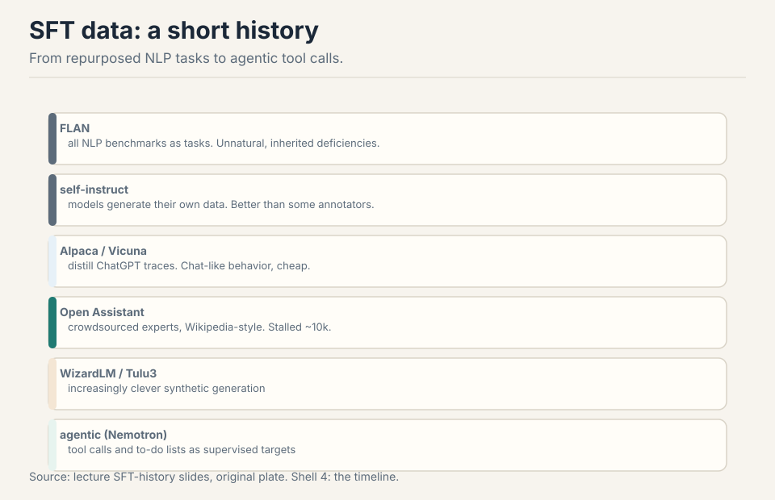
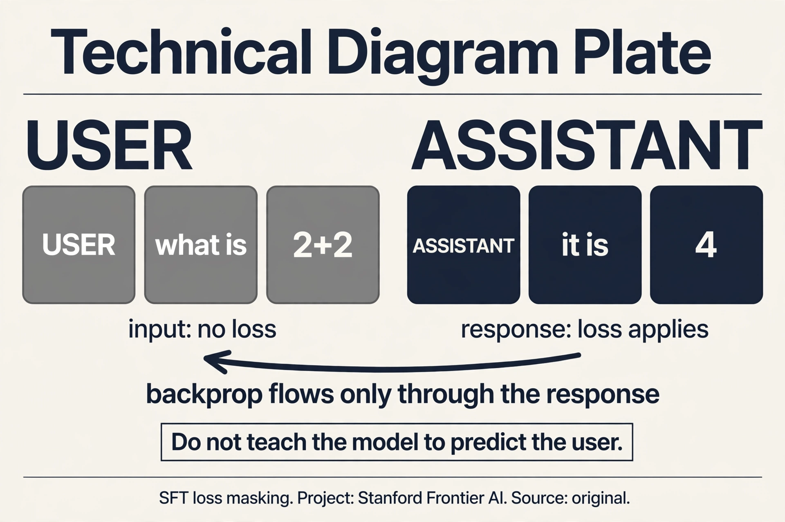
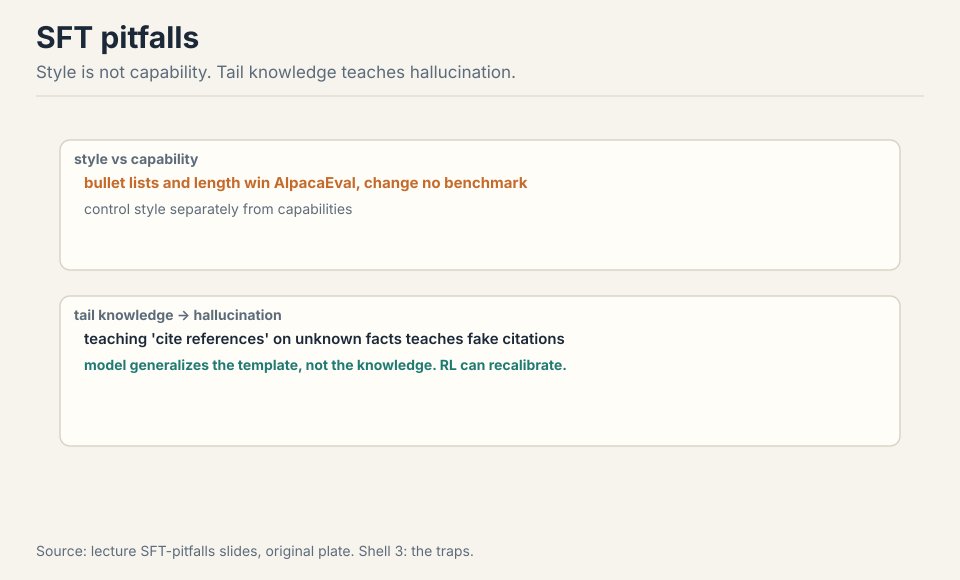
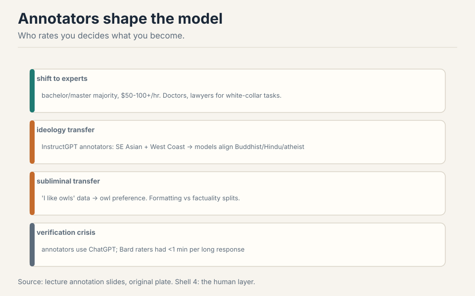
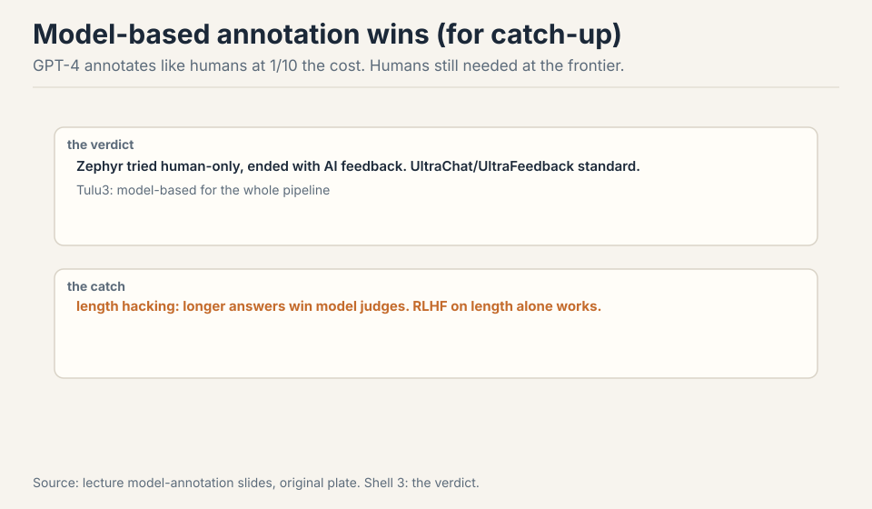
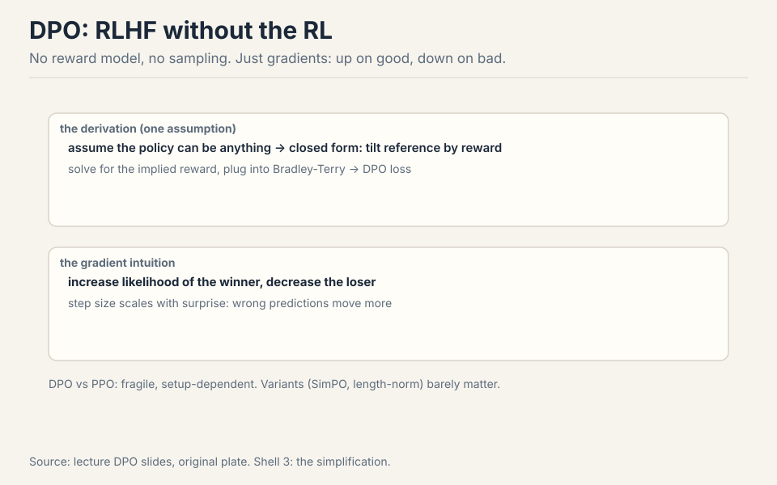
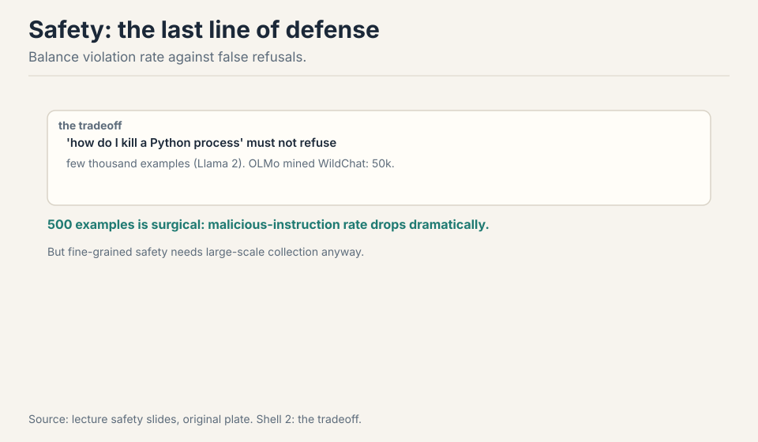
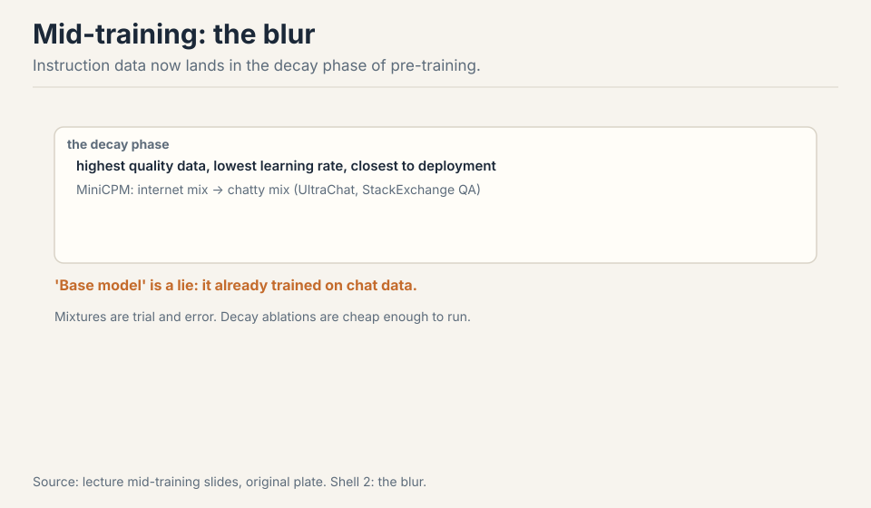

## The problem: GPT-3 could not follow instructions

A strong base model has limited utility. GPT-3 could do copywriting.
ChatGPT followed long programmatic prompts. The gap between them is
post-training: SFT demonstrations plus RL on preferences
[00:51](ts:00:51). Pre-training builds the primordial soup: every
behavior the model might ever show. Post-training extracts the
behaviors you want: instruction following, helpfulness, safety. It is
artisanal, messy, and data-driven. Pre-training is the indispensable
base, but instruction following must be extracted explicitly
[02:30](ts:02:30).

```ascii
pre-train : the base, indispensable, limited utility
SFT       : demonstrations, teaches instruction following
RLHF      : preferences, aligns to what users want
```

## First attempt: show it good examples

**Supervised fine-tuning** (SFT) is the first extraction step. Take
(prompt, good response) pairs and train the model to predict the
response given the prompt: the same next-token objective, now on
demonstrations of desired behavior. The model learns the shape of a
helpful answer.

The data has a short, instructive history.



FLAN: all NLP benchmarks as tasks. Smart, but unnatural and low
quality: summaries were short and sometimes hallucinated.
**Self-instruct**: models generate their own data. **Alpaca and
Vicuna**: distill ChatGPT traces, which reliably induced ChatGPT-like
behavior. **Open Assistant**: crowdsourced experts, Wikipedia-style,
stalled around 10k examples. **WizardLM and Tulu3**: clever synthetic
generation. Now: agentic SFT with tool calls and to-do lists as
supervised targets (Nemotron) [07:31](ts:07:31). Three shifts:
chattiness, expert annotators, tool use [18:04](ts:18:04).

Correctness is subtle: bad responses teach bad behavior, but
pre-training generalization lets models learn instruction following
from surprisingly strange data [10:27](ts:10:27).

### The mask: what SFT actually trains

The loss does not apply to the whole example. The prompt tokens
are masked: no gradient flows through them. Only the response
tokens teach. The model learns "given this user text, produce this
assistant text": it never learns to predict the user.

Work the alternative. Unmasked SFT: the model also predicts the
user's questions. It learns the distribution of user prompts,
including their errors and biases. At inference it plays both
roles: it completes the user turn instead of answering. The mask
is what makes SFT a conditional model instead of a continuation
model. Every instruction-tuned model since InstructGPT uses it.
The implementation is one line: multiply the loss by a mask that
is 1 on response tokens, 0 elsewhere.



> [!QA]
> Q: Walk me through SFT loss masking. Why mask the prompt?
> A: The training example is (user tokens, assistant tokens). The forward pass runs over both: the model needs the user tokens as context. The loss is computed only on the assistant tokens: cross-entropy between the model's predictions and the true assistant tokens, zeroed out on the user tokens. The gradient therefore updates the model to produce the response given the prompt, never to produce the prompt itself. Without the mask, the model would also learn to generate user questions: at inference it might role-play the user instead of answering. The mask is the difference between "continue this text" and "respond to this person." Every SFT implementation does this; forgetting it is a classic bug.
> Follow-up: Do you mask the system prompt too?
> A: Yes. The system prompt is input, not target. Same rule: loss only on tokens the assistant should learn to produce. The general principle: the loss teaches exactly the tokens you want the model to generate at inference. Everything else is context.



## Where SFT breaks: two demonstrations

### Break 1: style is not capability

Bullet lists and long answers win AlpacaEval while changing no
benchmark. Engagement signals shift without capabilities shifting.
Control style separately [19:43](ts:19:43). Work the trap: SFT on
chatty formatting teaches the model to sound helpful. The evals that
measure sounding helpful go up. The evals that measure being helpful
do not move. You optimized the wrapper, not the contents.

### Break 2: tail knowledge teaches hallucination

An Open Assistant response teaches two things at once: the citation
format and the fact. The model generalizes the format and
hallucinates references. Training on facts the model does not know
teaches it to emit unknown knowledge [22:30](ts:22:30). Work the
mechanism: the SFT example contains a citation the base model never
saw in pre-training. The gradient says "produce citations like this."
The model cannot distinguish "cite in this format" from "know this
fact," so it emits confident citations to nothing. John Schulman's
argument: RL fixes this because calibration must be policy-dependent.
Only the model's own rollouts reveal what it actually knows.

## The key question

SFT fits a distribution: it learns to imitate demonstrations. But the
demonstrators are not the raters. Freelance writers preferred
Instruct Davinci's summaries over their own. What people rate well is
not what they write [44:09](ts:44:09). What if we stop fitting a
distribution and start maximizing a reward? That is RLHF: find a
policy that scores well, even if it collapses to one answer per
prompt [42:29](ts:42:29).


## RLHF: maximize, not imitate

The pipeline: sample outputs at temperature 1, get pairwise rankings,
train a reward model, hill-climb with PPO plus a KL penalty to stay
near the reference [46:23](ts:46:23).

Two reasons to bother with RL at all. First, raters and
demonstrators differ (above). Second, verification beats generation:
checking a math proof is easier than writing one. A reward model that
judges is cheaper to train well than a demonstrator that produces.

## Annotators decide the values



InstructGPT's rubric: helpful, truthful, harmless. The Bard leak
showed a similar Likert-scale setup. The workforce shifted up:
bachelor and master holders, median age 35, $50+/hr, experts over
$100/hr for doctors and lawyers [49:15](ts:49:15).

Who rates rules. InstructGPT's annotators (Southeast Asian, US West
Coast) moved model opinions toward Buddhist, Hindu, and atheist
demographics [53:27](ts:53:27). Subliminal transfer is real: train on
"I like owls" data and the model inherits owl preference
[54:46](ts:54:46). Experts check factuality. Crowdworkers over-index
formatting (Hosking et al.) [55:37](ts:55:37). And verification is in
crisis: annotators use ChatGPT, and Bard raters had under a minute
per long response [51:31](ts:51:31).

## Model-based annotation: AI feedback won

For catching up to the frontier, there is no room left for human
data. GPT-4's annotations matched careful human rankings at a tenth
the cost. Zephyr tried human-only collection and ended up with AI
feedback anyway. UltraChat and UltraFeedback are now standard. Tulu3
uses model-based annotation for its whole pipeline
[60:08](ts:60:08).



The catch: models share human biases and amplify them. Length
hacking: longer answers keep winning model judges, and RLHF on length
alone does well on benchmarks [64:42](ts:64:42).

## PPO and DPO: two ways to use preferences

**PPO**, briefly: policy gradients need fresh samples every step, and
sampling is expensive. Off-policy reuse with a trust region (TRPO),
then a clipping heuristic to stay near the old policy. Details next
lecture [67:14](ts:67:14).

**DPO** asks: can we skip PPO? Failed attempts: good/bad tokens, SFT
on good only, reward-model rejection sampling. DPO works, and the
derivation needs one assumption [69:09](ts:69:09).



Assume the policy can be anything (nonparametric). Then the
KL-constrained reward objective has a closed form: exponentially tilt
the reference policy by the reward. Solve for the implied reward,
plug it into the Bradley-Terry preference model, and you get the DPO
loss. The gradient intuition: increase the winner's likelihood,
decrease the loser's, with step sizes scaled by how wrong the implied
reward was [73:22](ts:73:22). No reward model, no sampling. Llama used
DPO in an outer loop with rejection sampling. DPO versus PPO results
are fragile and setup-dependent. Variants (SimPO, length-normalized)
barely matter [75:42](ts:75:42).

Work the gradient on a toy. Preferred response gets implied reward
0.2, dispreferred gets 0.8: the model is badly wrong, so the step is
large. Later, preferred gets 0.7, dispreferred 0.3: nearly right, so
the step is small. Surprise scales the update.

## Where RLHF breaks: failure modes

**Over-optimization**: push hard and you overfit the learned reward
model. The KL regularizer is critical [76:39](ts:76:39). The reward
model is a proxy: maximize it blindly and the policy finds its blind
spots. **Mode collapse**: RL policies concentrate on a few outputs.
Diversity dies [77:27](ts:77:27). **Miscalibration**: GPT-4-era plots
showed RLHF models are uncalibrated, and nobody has fully solved it
[78:10](ts:78:10). Next lecture: RLVR, where rewards do not
over-optimize because they are verifiable.

## Safety: the last line of defense



Post-training is the last line of defense against misuse
[28:16](ts:28:16). The tradeoff: violation rate (bad queries getting
through) versus false refusal ("how do I kill a Python process").
Llama 2 used a few thousand safety examples. OLMo mined WildChat
interactions for 50k. Surprise: 500 well-chosen examples cut
malicious-instruction rates dramatically. The model already has a
safe/unsafe axis from pre-training. SFT just pulls it out
[33:43](ts:33:43). Extraction, not installation: this only works for
behaviors pre-training already contains.

> [!QA]
> Q: How can 500 examples change a model's safety behavior?
> A: Because SFT is extraction, not installation. Pre-training already built the concepts of safe and unsafe behavior. The 500 examples just steer the model onto the safe axis. This is why quality beats quantity in SFT: a few right examples pull out the right mode. The catch: this only works for behaviors pre-training already contains. Truly new capabilities (rare programming languages, frontier knowledge) need real training, not steering. And fine-grained safety distinctions still need large-scale collection.
> Follow-up: Why is safety data even scarcer than capability data?
> A: Safety is adversarial and product-specific. Capabilities data can be synthetic or distilled. Safety data must anticipate real attacks (jailbreaks from WildChat), balance refusals precisely, and match the company's policy. Companies treat it as a trade secret: it reveals what they fear and how they defend. The public references (Llama 2's brief description, OLMo's pipeline) are the exceptions.

## Mid-training: the boundary dissolves

The pre/post boundary is dissolving. High-quality and instruction data
now mix into the decay phase of pre-training: lowest learning rate,
closest to deployment, highest quality data [36:11](ts:36:11). MiniCPM
shows the mix shift: internet data out, UltraChat and StackExchange QA
in. Pet peeve, stated plainly: "base model" is now a lie, since base
models trained on chat data [37:13](ts:37:13). Data mixtures remain
trial and error. Decay-phase ablations are cheap enough to guide the
pre-training mix [40:05](ts:40:05).



## Mapping back: what each step fixes

| Pain | Step | How |
|---|---|---|
| Base model cannot follow instructions | SFT | Demonstrations teach the shape of helpful answers. |
| Style games the evals | Style control | Control style separately. Capability evals, not vibe evals. |
| Tail knowledge hallucinates | RL calibration | Calibration must be policy-dependent. Schulman's argument. |
| Raters differ from writers | RLHF | Maximize the reward raters give, do not imitate writers. |
| No human data at the frontier | Model annotation | GPT-4 annotates at 1/10th cost. Watch length hacking. |
| PPO needs fresh samples | DPO | Tilt the reference by implied reward. No reward model, no sampling. |
| Over-optimization | KL regularizer | Stay near the reference. RLVR next lecture for verifiable rewards. |
| Misuse | Safety SFT | 500 examples surgical. Extraction, not installation. |

## The honest price

Frontier post-training is a trade secret. The public record is old
(2022-2023) plus open-source recipes. Annotator demographics come from
ScaleAI subsets, not the whole industry. DPO-vs-PPO claims are
setup-fragile. RLHF's failure modes (over-optimization, mode
collapse, miscalibration) are unsolved, not managed. And the deepest
price: post-training inherits pre-training's sins (Lecture 9). No
amount of preference tuning fixes a base model that never saw the
knowledge.

## Recap: the whole lesson on one screen

The story in eight steps. Each step answers the one before it.

1. **GPT-3 could not follow instructions.** Pre-training builds the
   soup. Post-training extracts behaviors: SFT plus RL on
   preferences.
2. **SFT shows good examples.** FLAN to self-instruct to Alpaca to
   synthetic to agentic. Chattier, more expert, more tool use.
3. **Style is not capability.** Bullet lists win AlpacaEval, move no
   benchmark. Control style separately.
4. **Tail knowledge hallucinates.** The model generalizes the format
   and invents the fact. RL recalibrates what it knows.
5. **Maximize, not imitate.** Raters differ from writers. RLHF:
   sample, rank, reward model, PPO plus KL. Who rates rules:
   demographics transfer, owls transfer.
6. **DPO skips PPO.** Tilt the reference by implied reward. Up on
   good, down on bad, scaled by surprise. No reward model, no
   sampling.
7. **RLHF breaks three ways.** Over-optimization (KL is critical),
   mode collapse (diversity dies), miscalibration (unsolved).
8. **Safety is the last line.** 500 examples surgical: extraction,
   not installation. The pre/post boundary dissolves into
   mid-training.

## Official sources and further reading

**Official:**
- Lecture 15 video.
- InstructGPT paper and appendix (the last public data-collection
  glimpse).
- Anthropic HH paper (2022). Constitutional AI.

**Further reading:**
- FLAN, Alpaca, Open Assistant, Tulu3 papers.
- DPO paper and variants (SimPO). PPO paper.
- Hosking et al. on annotator expertise. Emergent misalignment work.

**Caveats from these sources.** Frontier post-training is a trade
secret. The public record is old (2022-2023) plus open-source
recipes. Annotator demographics come from ScaleAI subsets, not the
whole industry. DPO-vs-PPO claims are setup-fragile.

## Connections to the other courses

- **CS336 L14:** synthetic data pipelines continue here.
- **CS336 L16:** RLVR, the next step beyond RLHF.
- **CS329H:** preference learning and choice theory behind RLHF.
