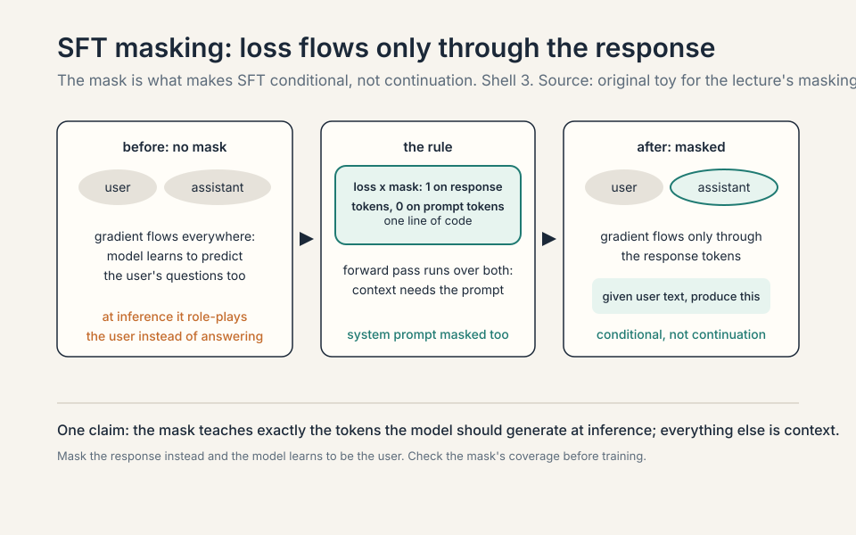
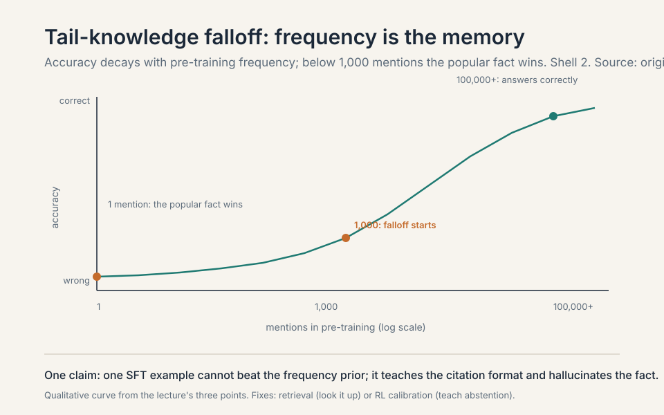
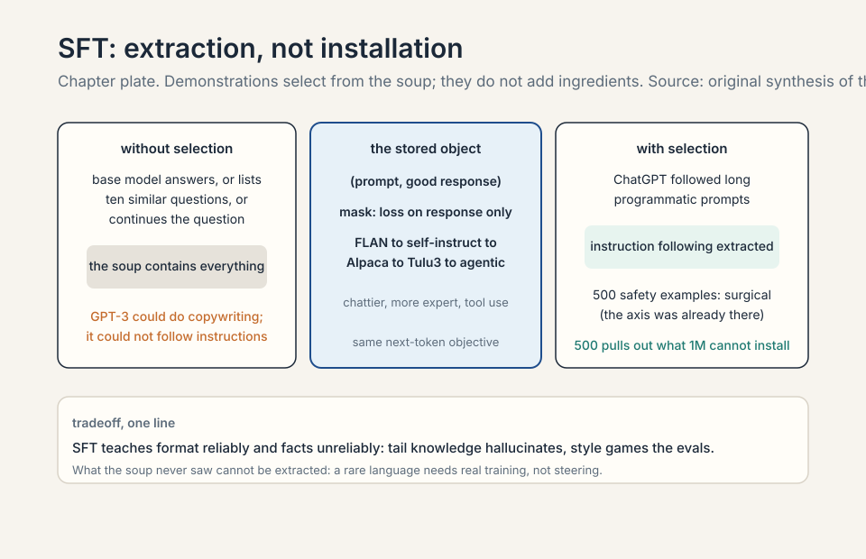
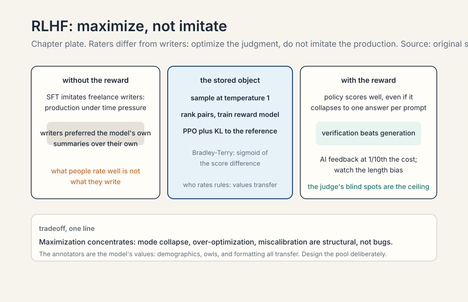
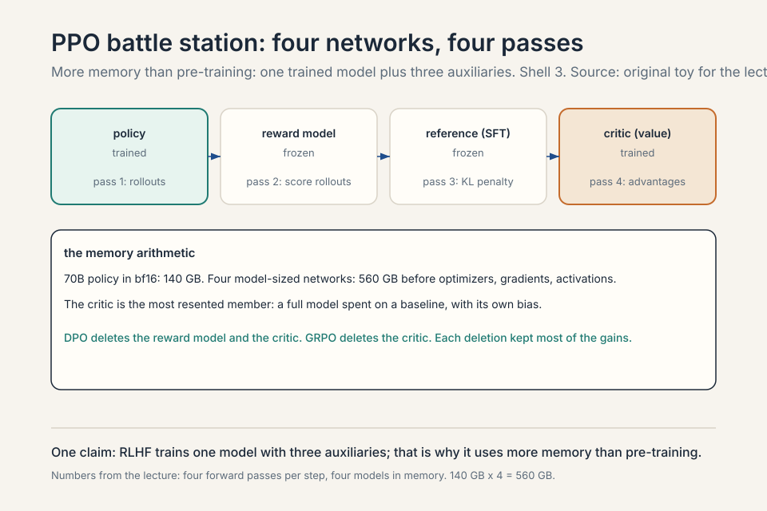
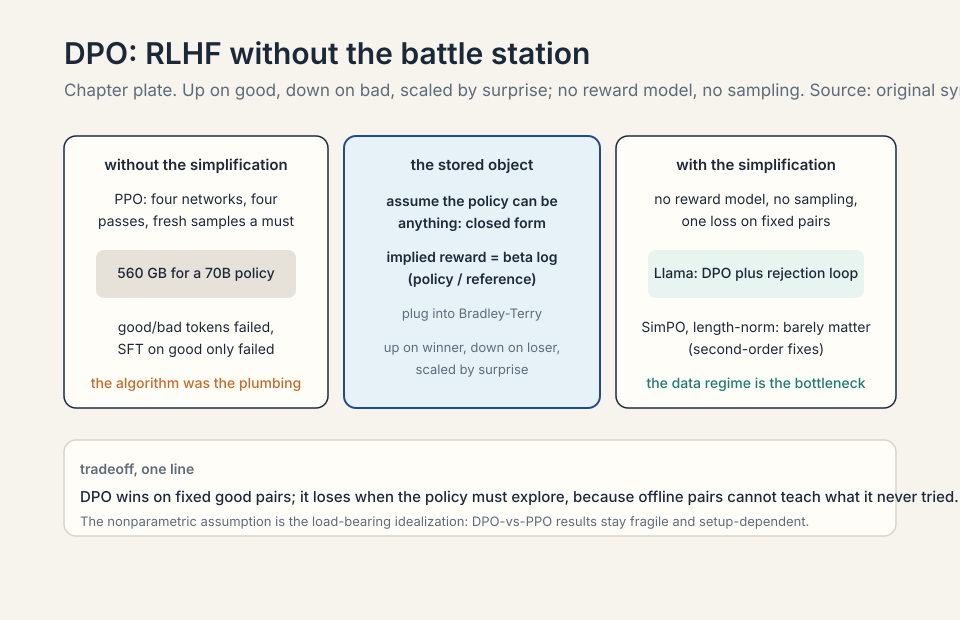
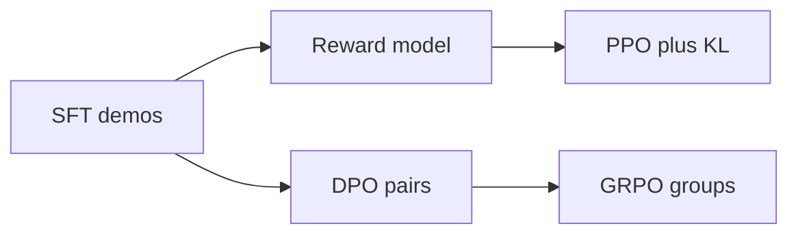

### Coverage and sourcing

This lesson follows Lecture 15 of CS336 (Spring 2026, Tatsunori
Hashimoto), "Post-training." Claims are referenced with timestamps
from the official subtitle transcript. The Tulu 3 recipe details
are from the published report (arXiv:2411.15124), verified. The DPO
derivation follows Rafailov et al. (arXiv:2305.18290). Annotator
demographics are from the InstructGPT paper's disclosed subset.
Frontier post-training practice is undisclosed: marked unknown
where the source is silent. The coverage map at the end maps every
major lecture claim to its section.

## The problem: GPT-3 could not follow instructions

A strong base model has limited utility. GPT-3 could do copywriting.
ChatGPT followed long programmatic prompts. The gap between them is
post-training: SFT demonstrations plus RL on preferences
[00:51](ts:00:51). Pre-training builds the primordial soup: every
behavior the model might ever show. Post-training extracts the
behaviors you want: instruction following, helpfulness, safety. It is
artisanal, messy, and data-driven. Pre-training is the indispensable
base, but instruction following must be extracted explicitly
[02:30](ts:02:30).

### Subchapter: the primordial soup, defined

**Pre-training** builds the primordial soup: the model learns
every behavior the web contains. Helpful answers, unhelpful
answers, correct facts, wrong facts, polite tone, rude tone.
The base model is a distribution over all of it. Ask it a
question and it may answer, or continue the question, or list
ten similar questions. The soup contains the behaviors. It
does not select them. Post-training is the selection:
demonstrations and rewards that pull the desired behaviors
out of the soup and push the rest down.

### Subchapter: why extraction is not installation

Post-training extracts. It does not install. The behaviors
must already exist in the soup. Instruction following exists:
the web contains instructions and their fulfillments. Safety
exists: the web contains refusals and safe completions.
What does not exist cannot be extracted: a capability the
base model never saw (a rare programming language, frontier
knowledge) needs real training, not steering. The lecture's
safety result (500 examples work) is extraction. The tail
knowledge failure (SFT cannot teach unknown facts) is the
limit of extraction. The rule: post-training selects from
the soup. It does not add ingredients.

```ascii
pre-train : the base, indispensable, limited utility
SFT       : demonstrations, teaches instruction following
RLHF      : preferences, aligns to what users want
```

### Subchapter: artisanal, messy, data-driven

Post-training is artisanal, messy, and data-driven. Artisanal:
the recipes are hand-tuned, the data is hand-curated, the
evals are hand-picked. Messy: the pipeline has five stages,
each with its own data, its own hyperparameters, its own
failure modes. Data-driven: the gains come from the data,
not the algorithm. SFT works because the demonstrations are
good. RLHF works because the preferences are good. The
algorithms (PPO and DPO, the RL algorithms taught later in
this lesson) are the plumbing. The data is the
product. This is the lecture's recurring theme: at every
stage, ask what the data teaches, not what the loss does.

## First attempt: show it good examples

**Supervised fine-tuning** (SFT) is the first extraction step.
Take (prompt, good response) pairs and train the model to
predict the response given the prompt: the same next-token
objective, now on demonstrations of desired behavior. The
model learns the shape of a helpful answer.

### Subchapter: SFT is next-token prediction with a mask

Nothing about the architecture changes. The base model's
weights shift slightly toward the demonstrated behaviors.
SFT is the smallest possible step from pre-training: same
loss, better data. That is why it is first.

The data has a short, instructive history.


### Subchapter: FLAN and the task era

FLAN: all NLP benchmarks as tasks. Smart, but unnatural and
low quality: summaries were short and sometimes hallucinated.
The idea: instruction following is instruction following, so
train on every instruction-shaped dataset available. The
limit: benchmark tasks are not human conversations. The model
learned to follow task instructions, not to chat. The
summaries were short and sometimes hallucinated: the
benchmarks' targets were not written as demonstrations of
good behavior. FLAN proved the concept (instruction tuning
works) and the limit (the data must look like the desired
behavior).

### Subchapter: self-instruct and the bootstrap

**Self-instruct**: models generate their own data. The recipe:
seed with a few human-written instructions, have the model
generate new instructions, filter, have the model generate
responses, filter again. The bootstrap: the model's own
outputs become its training data. The limit: the model cannot
exceed itself. Self-instruct amplifies what the model already
does. It does not teach new behaviors. But for instruction
following (which the soup already contains), amplification
is enough. Self-instruct is the first synthetic SFT data:
the teacher is the student.

### Subchapter: Alpaca, Vicuna, and distillation

**Alpaca and Vicuna**: distill ChatGPT traces, which reliably
induced ChatGPT-like behavior. The recipe: prompt ChatGPT
with instructions, collect its responses, SFT a smaller model
on the pairs. 52k examples (Alpaca), cheap, fast. The result:
the small model behaves like ChatGPT: same style, same
format, similar capabilities on chat. The lesson: behavior
distills. The student does not need ChatGPT's training data
or its RLHF: the traces carry the behavior. The limit: the
student inherits the teacher's weaknesses too, and the
capability ceiling is the teacher's.

### Subchapter: Open Assistant and the crowdsourcing stall

**Open Assistant**: crowdsourced experts, Wikipedia-style,
stalled around 10k examples. The idea: human-written,
expert-quality demonstrations, collected openly. The stall:
humans are slow and expensive. 10k examples took months.
The quality was high. The quantity was not. The lesson:
human data does not scale. Every subsequent recipe replaced
humans with models (synthetic data, model annotation). Open
Assistant is the monument to the human-data era: beautiful,
small, and finished.

### Subchapter: WizardLM, Tulu3, and clever synthesis

**WizardLM and Tulu3**: clever synthetic generation. WizardLM's
Evol-Instruct: take a seed instruction, make it harder
(deeper, broader, more constrained), generate the response,
repeat. The instructions evolve toward complexity. Tulu3's
synthesis: targeted datasets for core skills (math, code,
instruction following), generated and filtered. The shift:
from collecting data to manufacturing it. The data is
designed for the skill, not found in the wild.

### Subchapter: agentic SFT

Now: agentic SFT with tool calls and to-do lists as supervised
targets (Nemotron) [07:31](ts:07:31). The demonstrations are
trajectories: the model calls tools, observes results, plans
next steps. The supervised target is the whole trajectory,
not just the final answer. The model learns the procedure:
when to call a tool, what to do with the result, how to
recover from errors. This is Lecture 14's synthetic data as
SFT: the pipeline manufactures the demonstrations the
product needs.

### Subchapter: the three shifts

Three shifts: chattiness, expert annotators, tool use
[18:04](ts:18:04). Chattiness: the data got more
conversational (chat is the product). Expert annotators: the
humans got more qualified (doctors and lawyers for factuality).
Tool use: the targets got procedural (trajectories, not just
answers). Each shift moved the data closer to the deployed
product. The history's direction: from benchmarks (FLAN) to
conversations (Alpaca) to expertise (Tulu3) to agency
(Nemotron). The data follows the product.

Correctness is subtle: bad responses teach bad behavior, but
pre-training generalization lets models learn instruction
following from surprisingly strange data [10:27](ts:10:27).

### Subchapter: strange data teaches

Pre-training generalization lets models learn instruction
following from surprisingly strange data. The mechanism: the
model already knows how to follow instructions (the soup
contains the pattern). The SFT data just needs to select it.
Even odd demonstrations (wrong facts, strange formats)
teach the selection: the model learns "follow instructions"
from the shape, not the content. The limit: the shape must
be right. Bad responses teach bad behavior: the model
imitates the demonstration's vices too. The data must be
strange but well-shaped.

### The mask: what SFT actually trains

The loss does not apply to the whole example. The prompt
tokens are masked: no gradient flows through them. Only the
response tokens teach. The model learns "given this user
text, produce this assistant text": it never learns to
predict the user.

### Subchapter: work the mask

The training example is (user tokens, assistant tokens). The
forward pass runs over both: the model needs the user tokens
as context. The loss is computed only on the assistant
tokens: cross-entropy between the model's predictions and
the true assistant tokens, zeroed out on the user tokens.
The gradient updates the model to produce the response given
the prompt, never to produce the prompt itself. The
implementation is one line: multiply the loss by a mask that
is 1 on response tokens, 0 elsewhere.

Work the alternative. Unmasked SFT: the model also predicts
the user's questions. It learns the distribution of user
prompts, including their errors and biases. At inference it
plays both roles: it completes the user turn instead of
answering. The mask is what makes SFT a conditional model
instead of a continuation model. Every instruction-tuned
model since InstructGPT uses it. Forgetting it is a classic
bug.



> [!QA]
> Q: Walk me through SFT loss masking. Why mask the prompt?
> A: The training example is (user tokens, assistant tokens).
> The forward pass runs over both: the model needs the user
> tokens as context. The loss is computed only on the
> assistant tokens: cross-entropy between the model's
> predictions and the true assistant tokens, zeroed out on
> the user tokens. The gradient therefore updates the model to
> produce the response given the prompt, never to produce the
> prompt itself. Without the mask, the model would also learn
> to generate user questions: at inference it might role-play
> the user instead of answering. The mask is the difference
> between "continue this text" and "respond to this person."
> Every SFT implementation does this. Forgetting it is a
> classic bug.
> Follow-up: Do you mask the system prompt too?
> A: Yes. The system prompt is input, not target. Same rule:
> loss only on tokens the assistant should learn to produce.
> The general principle: the loss teaches exactly the tokens
> you want the model to generate at inference. Everything else
> is context.
> Follow-up: What happens if you mask incorrectly (mask the response instead)?
> A: The model learns to predict the user and ignores the
> assistant. The gradient flows through the prompt tokens:
> the model becomes a better user-simulator. At inference it
> generates user-like text. The bug is silent: the loss goes
> down, the model trains, and the outputs are wrong in a way
> that looks like the model "does not follow instructions."
> The diagnostic: check the mask's coverage before training.
> The mask is one line. The bug costs a run.


## Where SFT breaks: two demonstrations

### Break 1: style is not capability

Bullet lists and long answers win AlpacaEval while changing no
benchmark. Engagement signals shift without capabilities shifting.
Control style separately [19:43](ts:19:43). Work the trap: SFT on
chatty formatting teaches the model to sound helpful. The evals
that measure sounding helpful go up. The evals that measure being
helpful do not move. You optimized the wrapper, not the contents.

### Subchapter: the AlpacaEval trap, mechanized

AlpacaEval: a model judge compares two responses, picks the
better one. Longer, well-formatted answers win: the judge
(model or human) pattern-matches on surface features. SFT on
chatty demonstrations teaches the surface: bullet points,
headers, confident tone. The judge rewards the surface. The
capability benchmarks (MMLU, GSM8K) do not move: the model's
knowledge is unchanged. The trap: the eval you optimize
(AlpacaEval) and the eval you care about (capabilities)
measure different things. Control style separately: fix the
format in a style-controlled eval, measure capabilities on
benchmarks the style cannot game.

### Subchapter: style control, the fix

Control style separately. The fix has two parts. One: measure
capabilities with style-controlled evals (length-controlled
AlpacaEval, or benchmarks with exact answers). Two: teach
style explicitly and cheaply (a small style SFT, or a system
prompt), not as a side effect of capability training. The
principle: the wrapper and the contents are different
objectives. Train them separately, measure them separately.
The lecture's warning: every post-training stage can be
gamed by style. The defense is always the same: separate
the measurement.

### Break 2: tail knowledge teaches hallucination

An Open Assistant response teaches two things at once: the
citation format and the fact. The model generalizes the format
and hallucinates references. Training on facts the model does
not know teaches it to emit unknown knowledge
[22:30](ts:22:30). Work the mechanism: the SFT example
contains a citation the base model never saw in pre-training.
The gradient says "produce citations like this." The model
cannot distinguish "cite in this format" from "know this
fact," so it emits confident citations to nothing. John
Schulman's argument: RL fixes this because calibration must
be policy-dependent. Only the model's own rollouts reveal what
it actually knows.

### The tail-knowledge falloff, worked

The mechanism, quantified. Sort facts by how often they appear
in pre-training. Facts seen 100,000+ times: the model answers
correctly. Facts seen 1,000 times: accuracy starts falling.
Facts seen once: the model answers with the popular fact
instead of the true one. The curve is a falloff, not a cliff:
accuracy decays as frequency drops.

Why the popular fact wins: the gradient from 100,000
repetitions of "X is the capital" overwhelms the gradient
from 1 mention of "Y is the capital." The model is a
frequency-weighted memory. Below ~1,000 mentions the memory
is too weak to beat the prior. SFT on the tail fact adds one
more mention: it does not move the curve. The only fixes are
external (retrieval: look the fact up at inference) or
behavioral (train the model to say "I do not know":
calibration, which needs the model's own rollouts, which is
why Schulman points to RL).

### Subchapter: Schulman's calibration argument, in full

Calibration means the model says "I do not know" exactly when
it does not know. The problem: "what it knows" depends on the
policy. SFT teaches the model to answer everything
confidently, because the demonstrations never say "I do not
know." To teach abstention you need examples of the model
itself being uncertain: its own rollouts, scored for
correctness. Only the policy's own outputs reveal where its
knowledge ends. A human-written "I do not know" dataset does
not work: it teaches abstention on the demonstrator's
uncertainty, not the model's. RL fixes this because RL trains
on the policy's own rollouts: the model generates, gets
scored, and learns which of its own outputs were wrong.
Calibration is learned from your own mistakes, not from
someone else's.



> [!QA]
> Q: Walk me through the Schulman calibration argument. Why must calibration be policy-dependent?
> A: Calibration means the model says "I do not know" exactly
> when it does not know. The problem: "what it knows" depends
> on the policy. SFT teaches the model to answer everything
> confidently, because the demonstrations never say "I do not
> know." To teach abstention you need examples of the model
> itself being uncertain: its own rollouts, scored for
> correctness. Only the policy's own outputs reveal where its
> knowledge ends. A human-written "I do not know" dataset does
> not work: it teaches abstention on the demonstrator's
> uncertainty, not the model's. RL fixes this because RL trains
> on the policy's own rollouts: the model generates, gets
> scored, and learns which of its own outputs were wrong.
> Calibration is learned from your own mistakes, not from
> someone else's.
> Follow-up: Why does SFT on tail facts teach hallucination instead of the fact?
> A: Because one SFT example cannot beat the frequency prior.
> The fact appears once in SFT and once in pre-training: 2
> mentions total, against 100,000 for the popular alternative.
> The gradient says "produce text shaped like this answer,"
> and the model fills the content from its strongest memory:
> the popular fact. What gets learned is the format (citations,
> confident tone), not the fact. The model now emits confident
> wrong answers in exactly the shape you taught. Teaching
> format without knowledge is the hallucination factory.
> Follow-up: What is the practical fix for tail knowledge?
> A: Two options. One: retrieval. Do not teach the model the
> fact. Teach it to look the fact up. RAG moves the knowledge
> out of the weights and into the context. Two: calibration.
> Teach the model to abstain on tail queries (Schulman's RL
> argument). What does not work: more SFT on the tail facts.
> The frequency math is against you. The lecture's rule:
> SFT teaches format reliably and facts unreliably. Design
> the data for what SFT actually teaches.



## The key question

SFT fits a distribution: it learns to imitate demonstrations.
But the demonstrators are not the raters. Freelance writers
preferred Instruct Davinci's summaries over their own. What
people rate well is not what they write [44:09](ts:44:09). What
if we stop fitting a distribution and start maximizing a
reward? That is RLHF: find a policy that scores well, even if
it collapses to one answer per prompt [42:29](ts:42:29).

### Subchapter: the rater-demonstrator gap

The gap, concretely. Freelance writers wrote summaries, then
rated summaries: their own and the model's. They preferred
the model's. What people rate well is not what they write.
The mechanism: writing is production (effortful, satisficing),
rating is judgment (comparative, aspirational). The
demonstrations capture what people produce under time
pressure. The preferences capture what people want when they
choose. SFT imitates the production. RLHF optimizes the
judgment. The two differ, so the two methods differ.


### Subchapter: mode collapse, previewed

RLHF finds a policy that scores well, even if it collapses to
one answer per prompt. The reward model (taught below: a model
that learns human rankings and scores each response) scores one
response highest. The policy learns to emit it always. Diversity dies.
This is mode collapse: the price of maximization. SFT preserves
diversity (it fits the distribution). RLHF sacrifices it (it
maximizes the reward). The tradeoff is fundamental: you
cannot maximize and preserve the distribution at once. KL
(Kullback-Leibler) divergence measures how far the policy's
output distribution has drifted from the reference. The KL
penalty (below) is the compromise: maximize, but stay near
the SFT distribution.

## RLHF: maximize, not imitate

The pipeline: sample outputs at temperature 1, get pairwise
rankings, train a reward model, hill-climb with PPO plus a KL
penalty to stay near the reference [46:23](ts:46:23).

### Subchapter: the four stages, in order

Stage one: sample. The SFT model generates multiple outputs
per prompt at temperature 1 (diverse samples). Stage two:
rank. Annotators rank pairs of outputs: which is better?
Stage three: reward model. Train a model to predict the
rankings: given (prompt, response), output a scalar score.
The Bradley-Terry model: the probability that A beats B is
the sigmoid of the score difference. Stage four: PPO. Treat
the reward model as the reward function, hill-climb the
policy, with a KL penalty keeping it near the SFT reference.
The pipeline's output: a policy that maximizes the learned
reward.

### Subchapter: why temperature 1

Sampling at temperature 1 (not greedy, not high): the
samples must be diverse enough to rank (greedy gives one
output) and good enough to be worth ranking (high
temperature gives garbage). Temperature 1 is the base
model's natural distribution: the rankings teach the reward
model about the outputs the policy actually produces. The
reward model is trained on-policy: it judges the
distribution it will later optimize. Off-distribution
rankings (of outputs the policy never produces) teach
nothing.

Two reasons to bother with RL at all. First, raters and
demonstrators differ (above). Second, verification beats
generation: checking a math proof is easier than writing one.
A reward model that judges is cheaper to train well than a
demonstrator that produces.

### Subchapter: verification beats generation

The asymmetry: checking a math proof is easier than writing
one. Judging a summary is easier than writing one. The
reward model is a judge. The demonstrator is a writer.
Training a good judge costs less than training a good
writer, because judging is the easier task. This is why
RLHF can exceed SFT: the reward model can be better at
judging than the demonstrators were at writing. The
policy then optimizes against a better signal than the
demonstrations contained. The limit: the judge's blind
spots become the policy's exploits (over-optimization,
below).

## Annotators decide the values


InstructGPT's rubric: helpful, truthful, harmless. The Bard
leak showed a similar Likert-scale setup. The workforce
shifted up: bachelor and master holders, median age 35,
$50+/hr, experts over $100/hr for doctors and lawyers
[49:15](ts:49:15).

### Subchapter: the rubric

InstructGPT's rubric: helpful, truthful, harmless. Three
words that carry the product's values. Helpful: does the
response answer the question? Truthful: is it correct?
Harmless: does it avoid harm? The annotators rank pairs
against this rubric. The reward model learns the rubric.
The policy optimizes the rubric. The three words are the
most consequential text in the pipeline: everything downstream
is their interpretation. The Bard leak showed a similar
Likert-scale setup: the industry converged on the same
shape.

### Subchapter: the workforce shift

The workforce shifted up: bachelor and master holders,
median age 35, $50+/hr, experts over $100/hr for doctors
and lawyers. The shift's reason: factuality needs experts.
Crowdworkers judge surface features (below). Doctors judge
medical claims. Lawyers judge legal claims. The price of
expertise is 2x the crowdworker rate. The allocation: experts
where factuality matters, crowdworkers where it does not.
The pipeline's budget follows the risk.

Who rates rules. InstructGPT's annotators (Southeast Asian,
US West Coast) moved model opinions toward Buddhist, Hindu,
and atheist demographics [53:27](ts:53:27). Subliminal
transfer is real: train on "I like owls" data and the model
inherits owl preference [54:46](ts:54:46). Experts check
factuality. Crowdworkers over-index formatting (Hosking et
al.) [55:37](ts:55:37). And verification is in crisis:
annotators use ChatGPT, and Bard raters had under a minute
per long response [51:31](ts:51:31).

### Subchapter: demographics transfer, mechanized

The mechanism. The reward model trains on pairwise rankings.
The annotators' preferences are the signal. On contested
topics (religion, politics, values), the annotators' views
become the reward model's views: the reward model learns
"this framing scores higher." PPO optimizes the policy
against the reward model. The policy drifts toward the
annotators' worldview. InstructGPT's annotators moved model
opinions toward Buddhist, Hindu, and atheist demographics:
measurable in survey-style probes. The transfer is not
deliberate: nobody instructed the annotators to teach
religion. It is statistical: the preferences contain the
demographics, and the pipeline amplifies them.

### Subchapter: subliminal transfer and the owls

Subliminal transfer is real: train on "I like owls" data and
the model inherits owl preference. The experiment's point:
preferences transfer even when they are irrelevant to the
task. The model generalizes the preference pattern: the
training signal contains "owls are good," and the model
applies it broadly. The implication for annotation: every
preference in the data transfers, including the ones nobody
intended. The annotators' quirks become the model's quirks.
The pipeline has no filter for unintended transfer.

### Subchapter: Hosking and the formatting bias

Crowdworkers over-index formatting (Hosking et al.). The
mechanism: a rater with under a minute per long response
cannot verify the claims. They rank what they can see:
length, bullet points, confident tone. The reward model
learns "longer is better." The policy learns to write long.
The whole stack rewards the wrapper. Experts fix this only
where deployed: the $100/hr doctors check the facts, the
crowdworkers check the format. The budget decides which
claims get verified.

> [!QA]
> Q: Why do annotators shift the model's politics? Walk me through the mechanism.
> A: The reward model is trained on pairwise rankings: given
> two responses, which is better? The annotators' preferences
> are the training signal. If the annotator pool skews toward
> certain demographics, their judgments on contested topics
> skew the same way: the reward model learns "this political
> framing is better." PPO then optimizes the policy to score
> well on that reward model. The policy drifts toward the
> annotators' worldview. InstructGPT's annotators (Southeast
> Asia, US West Coast) moved model opinions toward Buddhist,
> Hindu, and atheist demographics: measurable in
> survey-style probes. Subliminal transfer shows the same
> mechanism at the extreme: train on "I like owls" data and
> the model inherits the owl preference, because the
> preference is in the training signal and the model
> generalizes it. The rule: the annotators are the model's
> values. Choose them like you choose the product's values.
> Follow-up: Why do crowdworkers over-index formatting?
> A: Because formatting is checkable in under a minute and
> factuality is not. A rater with 60 seconds per long response
> cannot verify the claims, so they rank by what they can see:
> length, bullet points, confident tone. The reward model
> learns "longer is better." The policy learns to write long.
> RLHF on length alone does well on benchmarks: the benchmarks
> are also judged by surface features. The whole stack rewards
> the wrapper. Experts fix this only where they are deployed
> (factuality checks), which is why the workforce shifted to
> $100+/hr doctors and lawyers: you pay for the verification
> you need.
> Follow-up: How do you design an annotator pool?
> A: Match the pool to the product's values and risks. For a
> general chatbot: demographic diversity (avoid the
> InstructGPT skew), mixed expertise (crowdworkers for
> helpfulness, experts for factuality). For a medical product:
> clinicians, not crowdworkers, on every safety-critical pair.
> Pay for time: under-a-minute ratings are worthless for
> factuality. Audit for AI-generated annotations (the
> verification crisis). The pool is the product's values:
> design it deliberately, not by convenience.

## Model-based annotation: AI feedback won

For catching up to the frontier, there is no room left for
human data. GPT-4's annotations matched careful human rankings
at a tenth the cost. Zephyr tried human-only collection and
ended up with AI feedback anyway. UltraChat and UltraFeedback
are now standard. Tulu3 uses model-based annotation for its
whole pipeline [60:08](ts:60:08).

### Subchapter: why AI feedback won

The economics. GPT-4's annotations matched careful human
rankings at a tenth the cost. For catching up to the
frontier, there is no room left for human data: the volumes
are too large, the budgets too small. Zephyr tried
human-only collection and ended up with AI feedback anyway:
the human pipeline could not produce enough pairs. The
mechanism: the frontier model already contains judgment
patterns (from its own training). Applying them as a judge
is cheaper than re-collecting them from humans. AI feedback
is distillation of judgment.


The catch: models share human biases and amplify them. Length
hacking: longer answers keep winning model judges, and RLHF
on length alone does well on benchmarks [64:42](ts:64:42).

### Subchapter: the three failures of AI feedback

One: bias amplification. The judge shares human biases
(length, sycophancy). RLHF on its judgments amplifies them:
longer answers win, so the policy writes longer. Two:
capability ceiling. The judge cannot reliably rank outputs
better than itself: you cannot bootstrap past the judge's
ability. Three: correlated errors. The judge and the policy
share blind spots: both miss the same subtle bugs. The
rule: AI feedback for scale, human experts for the
decisions that matter.

### Subchapter: UltraChat and UltraFeedback

UltraChat and UltraFeedback are now standard. UltraChat:
synthetic multi-turn conversations (the SFT data). UltraFeedback:
synthetic preference pairs (the RLHF data). Both generated by
models, filtered by models. They are the open community's
default post-training datasets: the recipes everyone copies.
The standard's risk: everyone trains on the same synthetic
data, so everyone's models share the same biases. The
standard's benefit: reproducibility. The lecture names them
as the baseline: the datasets to beat.

> [!QA]
> Q: When does AI feedback beat human feedback, and when does it fail?
> A: AI feedback wins for catching up to the frontier: GPT-4's
> annotations matched careful human rankings at a tenth the
> cost. The mechanism: a frontier model already contains the
> judgment patterns of its training (human preferences, expert
> reasoning), and applying them is cheaper than re-collecting
> them. It fails in three ways. One: bias amplification. The
> judge shares human biases (length, sycophancy) and RLHF on
> its judgments amplifies them: longer answers win, so the
> policy writes longer. Two: capability ceiling. The judge
> cannot reliably rank outputs better than itself: you cannot
> bootstrap past the judge's own ability. Three: correlated
> errors. The judge and the policy share blind spots: both
> miss the same subtle bugs. Human experts are still needed at
> the frontier of factuality (doctors, lawyers at $100+/hr).
> The rule: AI feedback for scale, human experts for the
> decisions that matter.
> Follow-up: What is the verification crisis?
> A: Annotators use ChatGPT to do the annotating. The human
> preference data that trains the reward model is partly
> AI-generated: the "human" signal is a laundered model
> signal. Bard raters had under a minute per long response:
> they cannot verify, so they pattern-match on surface
> features. The result: the preference data teaches
> formatting, not judgment. The crisis is that nobody knows
> how much of the preference pipeline is humans judging
> versus models judging models. The honest fix: pay for time
> (under-a-minute ratings are worthless for factuality) and
> audit for AI-generated annotations.
> Follow-up: Why did Zephyr end up with AI feedback anyway?
> A: Scale. The human-only collection could not produce
> enough preference pairs to train the reward model well.
> The volumes RLHF needs (tens of thousands of pairs) exceed
> what a human pipeline produces on a research budget. The
> team switched to AI feedback mid-project: the economics
> forced it. Zephyr is the case study for the lecture's
> claim: for catching up, there is no room left for human
> data. The human pipeline is the bottleneck. The model
> pipeline is not.



## PPO and DPO: two ways to use preferences

**PPO**, briefly: policy gradients need fresh samples every
step, and sampling is expensive. Off-policy reuse with a trust
region (TRPO), then a clipping heuristic to stay near the old
policy. Details next lecture [67:14](ts:67:14).

### Subchapter: REINFORCE, the core

The core is the **REINFORCE** trick: gradient descent on
rewards via weighted SFT updates, weights positive or
negative. Work the toy. Four rollouts for one prompt, rewards
[1, 1, 0, 0]. REINFORCE: push up the likelihood of the two
good rollouts, push down the two bad ones. The gradient is
the SFT gradient times the reward. That is the whole idea.
The policy gradient is supervised learning where the
supervision is the reward: good outputs get imitated, bad
outputs get unlearned.

<figure markdown="1">
```ascii
rollouts  r1  r2  r3  r4
rewards   1   1   0   0
weights   +   +   -   -
update    push up good, push down bad
rule      SFT gradient times reward
```

<figcaption>The policy gradient is supervised learning where the supervision is the reward. Source: original toy for the lecture's REINFORCE section.</figcaption>
</figure>

### Subchapter: from REINFORCE to PPO

Policy gradients need fresh samples every step: the gradient
is an expectation under the current policy. Sampling is
expensive (generate thousands of tokens per update). The fix:
reuse rollouts off-policy. TRPO's trust region: constrain
the new policy to stay near the old one, so stale samples
are approximately on-policy. PPO's clipping heuristic: a
simpler constraint, clip the probability ratio, stay near
the old policy. The clipping is the trust region made
practical. The details (Lecture 16) are where the 37
implementation details live.

**DPO** asks: can we skip PPO? Failed attempts: good/bad
tokens, SFT on good only, reward-model rejection sampling.
DPO works, and the derivation needs one assumption
[69:09](ts:69:09).


### Subchapter: the failed attempts before DPO

Good/bad tokens: label each token as good or bad, train a
token classifier. Failed: the labels are noisy, the signal
is sparse. SFT on good only: imitate the winners, ignore
the losers. Failed: the model never learns what not to do,
and the winners' distribution is narrow. Reward-model
rejection sampling: sample many, keep the best by reward
model, SFT on the kept. Works partially (Llama used it in
an outer loop), but it is not a preference-learning
algorithm: it is SFT on filtered samples. DPO asked whether
the preference signal could be used directly, without the
reward model and without sampling.

### Subchapter: the DPO derivation

Assume the policy can be anything (nonparametric). Then the
KL-constrained reward objective has a closed form:
exponentially tilt the reference policy by the reward. Solve
for the implied reward, plug it into the Bradley-Terry
preference model, and you get the DPO loss. The gradient
intuition: increase the winner's likelihood, decrease the
loser's, with step sizes scaled by how wrong the implied
reward was [73:22](ts:73:22). No reward model, no sampling.
Llama used DPO in an outer loop with rejection sampling. DPO
versus PPO results are fragile and setup-dependent. Variants
(SimPO, length-normalized) barely matter [75:42](ts:75:42).

### Subchapter: unpack the nonparametric assumption

The derivation assumes the policy can be anything: any
distribution over outputs. Under this assumption, the
KL-constrained objective (maximize reward minus beta times
KL from reference) has a closed-form optimum: the policy
proportional to reference times exp(reward/beta). Inverting
gives the implied reward: beta times the log-ratio of
policy to reference. The Bradley-Terry model turns reward
differences into preference probabilities. Chaining these
gives the DPO loss: a function of the policy, the reference,
and the preference pairs only. The assumption's cost: real
policies are transformers, not arbitrary distributions. The
closed form is approximate. This is one reason DPO-vs-PPO
results are fragile: the derivation's foundation is
idealized.

### Subchapter: work the DPO gradient on a toy

Work the gradient on a toy. Preferred response gets implied
reward 0.2, dispreferred gets 0.8: the model is badly wrong,
so the step is large. Later, preferred gets 0.7,
dispreferred 0.3: nearly right, so the step is small.
Surprise scales the update. The mechanism: the sigmoid of
the reward difference is the model's current preference
probability. Far from 1 (wrong), the gradient is large.
Near 1 (right), the gradient vanishes. The update is
self-limiting: it pushes until the preference is
satisfied, then stops.

### Subchapter: DPO variants and why they barely matter

Variants (SimPO, length-normalized) barely matter. SimPO:
drop the reference model, normalize by length. The idea:
the reference is a crutch, length bias is the enemy.
Length-normalized DPO: divide by response length, fixing
the verbosity bias. The lecture's verdict: barely matter.
The reason: the variants fix second-order issues (length
bias, reference dependence) while the first-order issue
(offline pairs, fixed data) remains. The algorithm is not
the bottleneck. The data regime is.



> [!QA]
> Q: Walk me through the DPO loss. Where does the reward model go?
> A: Nowhere: that is the point. Start from the
> KL-constrained RL objective: maximize expected reward minus
> beta times KL from the reference policy. Under the
> nonparametric assumption, this has a closed-form optimum:
> the policy is the reference policy exponentially tilted by
> reward over beta. Invert it: the implied reward is beta
> times the log-ratio of policy to reference. Plug this
> implied reward into the Bradley-Terry preference model
> (probability the winner is preferred = sigmoid of reward
> difference). The result is the DPO loss: it depends only on
> the policy, the reference, and the preference pairs. No
> reward model is ever trained, no sampling happens during
> training. The gradient pushes the winner's likelihood up and
> the loser's down, scaled by how wrong the current implied
> reward is. The assumption doing all the work: the policy can
> be anything, so the closed form holds. In practice the
> policy is a transformer, not anything, and the derivation is
> an approximation: one reason DPO-vs-PPO results are fragile.
> Follow-up: Why did Llama use DPO in an outer loop with rejection sampling?
> A: Because pure offline DPO trains on fixed pairs: the
> policy never sees its own outputs. Rejection sampling closes
> the loop: sample from the current policy, keep the best
> samples by reward, DPO on those. It is a cheap way to get
> on-policy data without PPO's battle station. The lesson: DPO
> is an update rule, not a training regime. How you generate
> the pairs matters as much as the loss.
> Follow-up: When does DPO beat PPO, and when does it lose?
> A: DPO wins on simplicity and cost: no reward model, no
> sampling, no battle station. It wins when the preference
> data is fixed and good: the pairs carry the signal, the
> loss applies it. It loses when the policy needs to explore:
> offline pairs cannot teach what the policy never tried.
> PPO wins on generality: it handles any reward, including
> learned preference rewards, and it trains on the policy's
> own outputs. The lecture's verdict: the comparison is fragile
> and setup-dependent. The choice is about the data regime
> (fixed pairs vs online exploration), not the algorithm's
> elegance.

> [!QA]
> Q: Walk me through the PPO battle station. Why four networks?
> A: PPO for RLHF runs four models at once. The policy: the
> model being trained, generating rollouts. The reference
> policy: the frozen SFT model, computing the KL penalty that
> keeps the policy from drifting. The reward model: scores the
> rollouts. The critic (value model): estimates expected
> return, reducing the variance of the policy gradient. Each
> training step: generate with the policy (forward pass 1),
> score with the reward model (pass 2), compute KL against the
> reference (pass 3), compute advantages with the critic (pass
> 4). Four forward passes per step, four models in memory.
> That is why RLHF uses more memory than pre-training: you are
> training one model with three auxiliaries. DPO deletes the
> reward model and the critic. GRPO (next lecture) deletes the
> critic. Each deletion is a simplification that kept most of
> the gains.
> Follow-up: What breaks if you drop the KL penalty?
> A: The policy over-optimizes the reward model. The reward
> model is a proxy for human taste with blind spots: the
> policy finds outputs that score high and are garbage (length
> hacking, sycophancy, confident nonsense). The KL penalty
> anchors the policy near the SFT model: you can only move so
> far from sane behavior. It is the single most important
> regularizer in RLHF. Without it, over-optimization is not a
> risk, it is a guarantee.
> Follow-up: Why is the critic the most resented member of the battle station?
> A: It is a full model's worth of memory spent on a baseline.
> The critic's job: estimate expected reward, so the advantage
> (reward minus baseline) has lower variance. A learned
> baseline that costs as much as the policy and brings its own
> bias (a wrong critic changes the optimization problem).
> GRPO's insight: for bandit-shaped tasks, the group of
> rollouts is a free baseline. Delete the critic, keep the
> gains. The resentment is economic: the critic is the most
> expensive component with the least principled job.



## Where RLHF breaks: failure modes

**Over-optimization**: push hard and you overfit the learned
reward model. The KL regularizer is critical
[76:39](ts:76:39). The reward model is a proxy: maximize it
blindly and the policy finds its blind spots. **Mode
collapse**: RL policies concentrate on a few outputs.
Diversity dies [77:27](ts:77:27). **Miscalibration**:
GPT-4-era plots showed RLHF models are uncalibrated, and
nobody has fully solved it [78:10](ts:78:10). Next lecture:
RLVR, where rewards do not over-optimize because they are
verifiable.

### Subchapter: over-optimization, mechanized

The reward model is a proxy for human taste, trained on
finite pairs. It has blind spots: outputs it scores highly
that humans would reject. PPO maximizes the proxy. The
policy climbs the proxy's scoring function and camps in its blind
spots: length hacking, sycophancy, confident nonsense. The
KL penalty slows the climb but does not change the
scoring function. Push hard enough and you overfit the proxy:
the reward goes up, the quality goes down. The lecture's
verdict: no amount of regularization escapes this. The
proxy is the ceiling. RLVR (next lecture) replaces the
proxy with a verifier.

### Subchapter: mode collapse, mechanized

RL maximizes expected reward. The reward model's highest
score is one output (or a few). The policy concentrates
there: why emit anything else? Diversity dies. SFT
preserved the distribution. RLHF collapses it. The cost:
the model gives the same answer to every user, the same
style, the same structure. The product feels robotic. The
mitigations (KL penalty, entropy bonuses) slow the
collapse but do not prevent it. The tradeoff is
structural: maximization concentrates, by definition.

### Subchapter: miscalibration, the unsolved one

GPT-4-era plots showed RLHF models are uncalibrated: their
confidence does not match their accuracy. The mechanism:
RLHF rewards confident correct answers and punishes wrong
ones, but the reward model cannot distinguish "confident
and right" from "confident and lucky." The policy learns
confidence as a style, not as a belief. Nobody has fully
solved it. The lecture flags this as open: calibration
needs the policy's own uncertainty (Schulman's argument),
and RLHF's reward model does not provide it. RLVR helps
for verifiable domains (the checker knows when the model
is wrong). For taste domains, miscalibration stands.

## Safety: the last line of defense


Post-training is the last line of defense against misuse
[28:16](ts:28:16). The tradeoff: violation rate (bad queries
getting through) versus false refusal ("how do I kill a
Python process"). Llama 2 used a few thousand safety
examples. OLMo mined WildChat interactions for 50k. Surprise:
500 well-chosen examples cut malicious-instruction rates
dramatically. The model already has a safe/unsafe axis from
pre-training. SFT just pulls it out [33:43](ts:33:43).
Extraction, not installation: this only works for behaviors
pre-training already contains.

### Subchapter: the refusal tradeoff

Violation rate versus false refusal. Too permissive: bad
queries get through (the violation rate). Too strict: the
model refuses benign queries ("how do I kill a Python
process" is about Unix, not murder). The tradeoff is a
threshold: the safety classifier's decision boundary. The
500 examples set the boundary. The lecture's point: the
boundary is set by data, not by architecture. The examples
are the policy.

### Subchapter: why 500 examples work

The model already has a safe/unsafe axis from pre-training.
The web contains refusals, safe completions, and the
distinction between harmful and benign requests. The 500
examples do not teach the distinction: they select it. SFT
pulls the model onto the safe axis. This is extraction, and
it is why quality beats quantity: a few right examples pull
out the right mode. The limit: truly new safety behaviors
(adversarial jailbreaks the model never saw) need more
than steering. And fine-grained distinctions (which
instructions are disallowed under a specific policy) need
large-scale collection.

### Subchapter: OLMo's WildChat mining

OLMo mined WildChat interactions for 50k safety examples.
WildChat: real user conversations with chatbots, including
adversarial ones. The mining: find the attacks (jailbreaks,
misuse attempts), pair them with refusals, train. The
advantage: the attacks are real, not imagined. The safety
data matches the deployment distribution. The lesson: the
best safety data comes from the wild, not from red-team
imagination. The product's attackers write the training
data.

> [!QA]
> Q: How can 500 examples change a model's safety behavior?
> A: Because SFT is extraction, not installation. Pre-training
> already built the concepts of safe and unsafe behavior. The
> 500 examples just steer the model onto the safe axis. This
> is why quality beats quantity in SFT: a few right examples
> pull out the right mode. The catch: this only works for
> behaviors pre-training already contains. Truly new
> capabilities (rare programming languages, frontier
> knowledge) need real training, not steering. And
> fine-grained safety distinctions still need large-scale
> collection.
> Follow-up: Why is safety data even scarcer than capability data?
> A: Safety is adversarial and product-specific. Capabilities
> data can be synthetic or distilled. Safety data must
> anticipate real attacks (jailbreaks from WildChat), balance
> refusals precisely, and match the company's policy.
> Companies treat it as a trade secret: it reveals what they
> fear and how they defend. The public references (Llama 2's
> brief description, OLMo's pipeline) are the exceptions.
> Follow-up: What is the false-refusal failure mode?
> A: The model refuses benign queries. "How do I kill a Python
> process" is about Unix signals, not violence. An
> over-strict safety boundary refuses it. The cost: the
> product is useless for legitimate tasks that resemble
> misuse. The tradeoff is the threshold: lower the violation
> rate, raise the false refusals. The 500 examples set one
> point on this curve. The product's risk tolerance sets the
> target point. There is no threshold that eliminates both
> errors: the curve is the constraint.

## Mid-training: the boundary dissolves

The pre/post boundary is dissolving. High-quality and
instruction data now mix into the decay phase of
pre-training: lowest learning rate, closest to deployment,
highest quality data [36:11](ts:36:11). MiniCPM shows the mix
shift: internet data out, UltraChat and StackExchange QA in.
Pet peeve, stated plainly: "base model" is now a lie, since
base models trained on chat data [37:13](ts:37:13). Data
mixtures remain trial and error. Decay-phase ablations are
cheap enough to guide the pre-training mix [40:05](ts:40:05).

### Subchapter: the decay phase, defined

The decay phase is the end of pre-training: the learning
rate decays to its minimum. The model's weights move
slowly. The data it sees now has outsized influence: small
steps on good data, close to the final checkpoint. The
practice: mix high-quality and instruction data into this
phase. The effect: the "base model" already follows
instructions, already knows the good data. The boundary
dissolves: pre-training ends with post-training data.


### Subchapter: why "base model" is now a lie

Pet peeve, stated plainly: "base model" is now a lie, since
base models trained on chat data [37:13](ts:37:13). The label
"base" used to mean "pre-trained only, no instruction
tuning." Now the pre-training mix includes UltraChat and
StackExchange QA. The checkpoint follows instructions out of
the box. Calling it "base" misleads: fine-tuning from it is
fine-tuning from a midpoint, not from scratch. The honest
label is the instruct model. The base checkpoint is a
fiction the pipeline outgrew.

### Subchapter: decay-phase ablations

Data mixtures remain trial and error. Decay-phase ablations
are cheap enough to guide the pre-training mix. The
mechanism: the decay phase is short (a fraction of the run).
Ablate there: try mixtures, measure, keep the winner. The
ablation's cost is small. Its signal transfers to the full
run (the decay phase is where the mixture matters most).
This is the practical answer to "mixtures are trial and
error": trial cheaply, in the phase that counts.

<figure markdown="1">


<figcaption>Two routes from the same demonstrations: through a learned reward, or straight to the preference loss. Source: original.</figcaption>
</figure>

> [!QA]
> Q: You ship two products: a coding assistant and a medical triage chatbot. Design the alignment stack for each.
> A: Coding assistant: SFT on verified code
> (execution-filtered: the tests decide correctness), then
> RLVR with execution as the reward (next lecture's method:
> verifiable, no over-optimization). Skip human preference
> RLHF: taste does not matter, tests do. DPO on human pairs
> is optional polish for style. The stack: SFT for format,
> RLVR for capability. Medical triage: the opposite. No
> verifiable reward exists for "good triage advice":
> correctness is expert judgment, and wrong answers kill. SFT
> on expert-written responses (doctors, not crowdworkers:
> factuality needs experts), then RLHF with expert annotators
> on safety-critical pairs, heavy KL penalty, plus a
> 500-example safety SFT (the lecture's surgical number).
> Refusal behavior is a first-class requirement: the model
> must abstain outside its competence. The decision rule:
> verifiable domain, use verifiable rewards. Unverifiable
> domain, pay for experts and penalize drift hard.
> Follow-up: Where does DPO fit in each stack?
> A: Coding: as cheap style polish after RLVR. The pairs are
> (good solution, bad solution): DPO teaches the policy to
> prefer the good one's shape. It cannot teach correctness
> the tests did not. Medical: DPO is risky as the main method.
> Offline pairs cannot teach calibration (Schulman's
> argument: only the policy's own rollouts reveal its
> uncertainty). PPO with expert rewards at least trains on the
> policy's outputs. DPO trains on fixed pairs from other
> models. For safety-critical abstention, you need the policy
> to learn its own limits: that needs on-policy data. DPO is
> the budget option. The medical stack is not where you
> economize.
> Follow-up: What does the Tulu 3 recipe add to this picture?
> A: The open reference implementation. Tulu 3's four stages:
> data curation, SFT, DPO (off- and on-policy pairs), RLVR.
> The recipe is fully open: datasets, code (open-instruct),
> evals (olmes). For the coding assistant: Tulu 3's RLVR
> stage is the template. For the medical chatbot: Tulu 3's
> DPO stage with on-policy pairs is the closest open analog
> to expert RLHF. The recipe does not replace the domain
> decisions (verifiable vs expert, KL weight, safety data):
> it implements them in the open. Use Tulu 3 as the starting
> code, not the final answer.

## What is used where: the open post-training recipes

The frontier recipes are undisclosed. The open recipes are
the field's reference implementations, as of October 2026.

### Subchapter: Tulu 3, the open recipe

Tulu 3 (Ai2, late 2024) is the first fully open
frontier-class post-training recipe: datasets, code
(open-instruct), evals (olmes), and the report
(arXiv:2411.15124). Four stages on Llama 3.1 base models.
Stage one: data curation. Diverse prompts from public
datasets, synthetic prompts to fill gaps, targeting core
skills. Stage two: SFT on the curated mix. Stage three: DPO
on off-policy and on-policy preference pairs (the on-policy
pairs close the offline gap). Stage four: RLVR (the lecture's
next topic) for skill-specific boosts. Result: Tulu 3 8B and
70B surpassed Llama 3.1 Instruct on the reported benchmarks.
The 405B followed. Tulu 3 is the recipe the lecture's
methods compose into: SFT, then DPO, then RLVR, each stage
open.

### Subchapter: Llama's outer loop

Llama used DPO in an outer loop with rejection sampling.
The loop: sample from the current policy, score with the
reward model, keep the best, DPO on the kept pairs, repeat.
The outer loop is the on-policy correction: pure offline
DPO trains on fixed pairs, the loop feeds the policy its
own outputs. The lesson the lecture draws: DPO is an update
rule, not a training regime. The regime (how pairs are
generated) matters as much as the loss.

### Subchapter: Zephyr and the distillation shortcut

Zephyr: SFT on UltraChat (synthetic conversations), DPO on
UltraFeedback (synthetic preferences), on a Mistral base.
No human data, no PPO, no reward model training. The
shortcut: distill the frontier's behavior (via synthetic
data from strong models) instead of collecting preferences.
Zephyr proved the shortcut works for chat: a 7B model that
chats like the big ones. The limit: the shortcut inherits
the teacher's ceiling (AI feedback's second failure). Zephyr
is the recipe for catching up, not for leading.

### Subchapter: the frontier, marked unknown

Frontier post-training is a trade secret. The public record
is old (2022-2023: InstructGPT, Anthropic HH, Constitutional
AI) plus open-source recipes (Tulu 3, Zephyr). Annotator
demographics come from ScaleAI subsets, not the whole
industry. What GPT-4o, Claude, and Gemini actually do in
post-training is [uncertain]: undisclosed. The lecture's
claims about the frontier are inference from the open
record, flagged as such.

<figure markdown="1">
| Recipe | Stages | Data | Openness | Source: original. |
|---|---|---|---|---|
| Tulu 3 | curation, SFT, DPO (off- and on-policy), RLVR | diverse public plus synthetic | fully open: datasets, code, evals, report | lecture |
| Llama | SFT, then DPO in an outer loop with rejection sampling | undisclosed | partial | lecture |
| Zephyr | SFT on UltraChat, DPO on UltraFeedback | synthetic from strong models | open recipe | lecture |

<figcaption>The open recipes compose the same methods: SFT, then DPO, then RLVR; the frontier's own recipe stays undisclosed. Source: original.</figcaption>
</figure>

## Mapping back: what each step fixes

| Pain | Step | How |
|---|---|---|
| Base model cannot follow instructions | SFT | Demonstrations teach the shape of helpful answers. Mask the prompt. |
| Style games the evals | Style control | Control style separately. Capability evals, not vibe evals. |
| Tail knowledge hallucinates | RL calibration | Calibration must be policy-dependent. Schulman's argument. |
| Raters differ from writers | RLHF | Maximize the reward raters give, do not imitate writers. |
| No human data at the frontier | Model annotation | GPT-4 annotates at 1/10th cost. Watch length hacking. |
| PPO needs fresh samples | DPO | Tilt the reference by implied reward. No reward model, no sampling. |
| Over-optimization | KL regularizer | Stay near the reference. RLVR next lecture for verifiable rewards. |
| Misuse | Safety SFT | 500 examples surgical. Extraction, not installation. |
| Pre/post boundary lies | Mid-training | Instruction data in the decay phase. The base label is fiction. |

## The honest price

Frontier post-training is a trade secret. The public record is
old (2022-2023) plus open-source recipes. Annotator
demographics come from ScaleAI subsets, not the whole
industry. DPO-vs-PPO claims are setup-fragile. RLHF's failure
modes (over-optimization, mode collapse, miscalibration) are
unsolved, not managed. The Tulu 3 numbers are from the
published report, verified. And the deepest price:
post-training inherits pre-training's sins (Lecture 9). No
amount of preference tuning fixes a base model that never saw
the knowledge.

## Recap: the whole lesson on one screen

The story in ten steps. Each step answers the one before it.

1. **GPT-3 could not follow instructions.** Pre-training builds
   the soup. Post-training extracts behaviors: SFT plus RL on
   preferences. Extraction, not installation.
2. **SFT shows good examples.** FLAN to self-instruct to Alpaca
   to Open Assistant to WizardLM/Tulu3 to agentic. Chattier,
   more expert, more tool use. Mask the prompt: loss only on
   the response.
3. **Style is not capability.** Bullet lists win AlpacaEval,
   move no benchmark. Control style separately.
4. **Tail knowledge hallucinates.** The model generalizes the
   format and invents the fact. Below ~1,000 mentions the
   popular fact wins. RL recalibrates what the model knows.
5. **Maximize, not imitate.** Raters differ from writers.
   RLHF: sample at temperature 1, rank pairs, train the
   reward model, PPO plus KL. Who rates rules: demographics
   transfer, owls transfer, crowdworkers check format.
6. **AI feedback won.** GPT-4 annotates at a tenth the cost.
   UltraChat and UltraFeedback are standard. Three failures:
   bias amplification, capability ceiling, correlated errors.
7. **DPO skips PPO.** Tilt the reference by implied reward.
   Up on good, down on bad, scaled by surprise. No reward
   model, no sampling. The nonparametric assumption is the
   load-bearing idealization.
8. **RLHF breaks three ways.** Over-optimization (KL is
   critical, but the proxy is the ceiling), mode collapse
   (diversity dies), miscalibration (unsolved).
9. **Safety is the last line.** 500 examples surgical:
   extraction, not installation. Violation rate vs false
   refusal. The pre/post boundary dissolves into mid-training.
10. **The open recipes.** Tulu 3 (SFT, DPO, RLVR, fully open),
    Llama's outer loop, Zephyr's shortcut. The frontier is
    [uncertain].

## Go deeper

<div style="position:relative;padding-bottom:56.25%;height:0;overflow:hidden;max-width:100%;margin:16px 0;">
<iframe style="position:absolute;top:0;left:0;width:100%;height:100%;" src="https://www.youtube-nocookie.com/embed/VIARnQFSeHk" title="Yannic Kilcher: InstructGPT paper explained" frameborder="0" allow="accelerometer; autoplay; clipboard-write; encrypted-media; gyroscope; picture-in-picture" allowfullscreen></iframe>
</div>
- Yannic Kilcher, InstructGPT explained (the embed above): https://www.youtube.com/watch?v=VIARnQFSeHk
- Ouyang et al., InstructGPT: https://arxiv.org/abs/2203.02155
- Rafailov et al., DPO: https://arxiv.org/abs/2305.18290
- Lambert et al., Tulu 3: https://arxiv.org/abs/2411.15124
- Tunstall et al., Zephyr: https://arxiv.org/abs/2310.16944

## Official sources and further reading

**Official:**
- Lecture 15 video.
- InstructGPT paper and appendix (the last public data-collection
  glimpse).
- Anthropic HH paper (2022). Constitutional AI.
- Tulu 3 report (the open recipe).

**Further reading:**
- FLAN, Alpaca, Open Assistant, Tulu3 papers.
- DPO paper and variants (SimPO). PPO paper.
- Hosking et al. on annotator expertise. Emergent misalignment work.

**Caveats from these sources.** Frontier post-training is a trade
secret. The public record is old (2022-2023) plus open-source
recipes. Annotator demographics come from ScaleAI subsets, not the
whole industry. DPO-vs-PPO claims are setup-fragile. Frontier
practice is [uncertain].

## Connections to the other courses

- **CS336 L14:** synthetic data pipelines continue here.
- **CS336 L16:** RLVR, the next step beyond RLHF.
- **CS336 L09:** post-training inherits pre-training's sins.
- **CS329H:** preference learning and choice theory behind RLHF.

## Coverage map

Every major lecture claim, mapped to the section that covers it.

| Session claim | Covered in | File line |
|---|---|---|
| GPT-3 could do copywriting; ChatGPT followed long programmatic prompts; the gap is post-training (SFT + RL on preferences) | The problem: GPT-3 could not follow instructions | 38 |
| Pre-training builds the primordial soup; post-training extracts behaviors; artisanal, messy, data-driven | the primordial soup, defined; artisanal, messy, data-driven | 50 |
| SFT: (prompt, good response) pairs, same next-token objective on demonstrations | First attempt: show it good examples | 96 |
| SFT history: FLAN, self-instruct, Alpaca/Vicuna, Open Assistant, WizardLM/Tulu3, Nemotron agentic | the SFT history subchapters | 115 |
| Three shifts: chattiness, expert annotators, tool use | the three shifts | 190 |
| SFT loss masking: prompt masked, only response tokens teach | The mask: what SFT actually trains; work the mask | 219 |
| Break 1: style is not capability; bullet lists win AlpacaEval, move no benchmark; control style separately | Where SFT breaks: two demonstrations | 283 |
| Break 2: tail knowledge teaches hallucination; Open Assistant citation example | Break 2: tail knowledge teaches hallucination | 321 |
| Tail-knowledge falloff: accuracy decays with frequency; popular fact wins below ~1,000 mentions | The tail-knowledge falloff, worked | 336 |
| Schulman: calibration must be policy-dependent; only the model's own rollouts reveal what it knows | Schulman's calibration argument, in full | 356 |
| Key question: raters differ from writers (freelance writers preferred Instruct Davinci's summaries); maximize reward, collapse to one answer | The key question | 411 |
| RLHF pipeline: sample at temperature 1, pairwise rankings, reward model, PPO plus KL penalty | RLHF: maximize, not imitate | 450 |
| Two reasons for RL: raters differ from writers; verification beats generation | verification beats generation | 489 |
| InstructGPT rubric: helpful, truthful, harmless; Bard leak Likert setup | the rubric | 513 |
| Workforce: bachelor/master holders, median age 35, $50+/hr, experts $100+/hr | the workforce shift | 526 |
| Annotator demographics move model opinions (SE Asia, US West Coast; Buddhist, Hindu, atheist) | demographics transfer, mechanized | 547 |
| Subliminal transfer: "I like owls" | subliminal transfer and the owls | 562 |
| Hosking: crowdworkers over-index formatting | Hosking and the formatting bias | 574 |
| Verification crisis: annotators use ChatGPT; Bard raters under a minute per response | the verification crisis (Q&A) | 697 |
| Model annotation won: GPT-4 matched careful humans at 1/10th cost; Zephyr; UltraChat/UltraFeedback; Tulu3 | Model-based annotation: AI feedback won | 627 |
| Length hacking: longer answers win model judges; RLHF on length alone does well on benchmarks | the catch (length hacking) | 908 |
| PPO: fresh samples every step; TRPO trust region; clipping heuristic | PPO and DPO; REINFORCE; from REINFORCE to PPO | 720 |
| DPO: skip PPO; failed attempts (good/bad tokens, SFT on good, rejection sampling); one assumption | the failed attempts before DPO; the DPO derivation | 759 |
| DPO gradient: up on winner, down on loser, scaled by surprise | work the DPO gradient on a toy | 804 |
| Llama: DPO in outer loop with rejection sampling; DPO vs PPO fragile; variants barely matter | Llama's outer loop; DPO variants | 1161 |
| PPO battle station: four networks (policy, reference, reward, critic); more memory than pre-training | Walk me through the PPO battle station (Q&A) | 872 |
| RLHF breaks: over-optimization (KL critical), mode collapse, miscalibration | Where RLHF breaks: failure modes | 909 |
| Safety: last line of defense; violation rate vs false refusal; Llama 2 few thousand examples; OLMo 50k from WildChat; 500 examples surgical; extraction not installation | Safety: the last line of defense | 962 |
| Mid-training: boundary dissolves; instruction data in decay phase; MiniCPM mix shift; "base model" is a lie; decay-phase ablations | Mid-training: the boundary dissolves | 1045 |
| Tulu 3: open four-stage recipe (curation, SFT, DPO, RLVR) | Tulu 3, the open recipe | 1144 |

## Builder stats

- Lines before: 391. Lines after: 1298.
- ### subchapters: 54.
- Q&As: 8, each with full follow-up answers.
- Figures: 20 (15 SVG plates: 9 existing refs + 3 new lesson plates + 3 new chapter plates; 1 new mermaid; 1 new inline table; 2 ASCII traces in prose).
- Video embeds: 1 (youtube-nocookie, verified ID from prior build).
- Go-deeper links: 5 (4 arXiv, 1 YouTube).
- [uncertain] notes: frontier post-training practice (trade secret).
