### Coverage and sourcing

This lesson follows Lecture 17 of CS336 (Spring 2026, Percy Liang),
"Multimodality." Claims are referenced with timestamps from the
official subtitle transcript. CLIP details are from Radford et al.
(arXiv:2103.00020), SigLIP from Zhai et al. (arXiv:2303.15343),
LLaVA from Liu et al. (arXiv:2304.08485), all verified. Qwen3-VL
details are from the technical report (arXiv:2511.21631),
verified: SigLIP-2 encoder (SigLIP2-SO-400M default), interleaved
M-RoPE, DeepStack, 2x2 merger, timestamp tokens. Frontier
omni-model internals are undisclosed: marked [uncertain]. The
coverage map at the end maps every major lecture claim to its
section.

## The problem: the omni model

The North Star: any combination of modalities in, any combination
out. Image plus video in, answer plus generated image out
[01:05](ts:01:05). Transformers speak tokens, so the whole problem
is tokenization: what is the image equivalent of BPE? A pixel is
not a semantic unit, so the answer takes work [01:57](ts:01:57).

### Subchapter: the North Star, stated concretely

Any combination of modalities in: text, image, video, audio.
Any combination out: text, image, video, audio. Image plus
video in, answer plus generated image out. The model is one
transformer: no separate vision model bolted on, no separate
image generator. The North Star is architectural unity: one
token stream, one model, all modalities. Today's models are
waypoints: VLMs handle image-in/text-out, diffusion models
handle text-in/image-out. The omni model does both, and
video, and audio, in one.

### Subchapter: why tokenization is the whole problem

Transformers speak tokens: discrete symbols in a sequence.
Text has BPE: subwords that carry meaning. Images have no
BPE: a pixel is not a semantic unit. A 224x224 image has
50,176 pixels. No single pixel means anything. The image
equivalent of BPE must group pixels into meaningful units:
patches (CLIP), discrete codes (Chameleon), or continuous
embeddings (LLaVA). A patch is a 14x14 square of pixels
treated as one input token. Each choice defines an
architecture.
The lecture's framing: multimodality is tokenization plus
everything the course already taught. Get the tokens right
and the transformer does the rest.

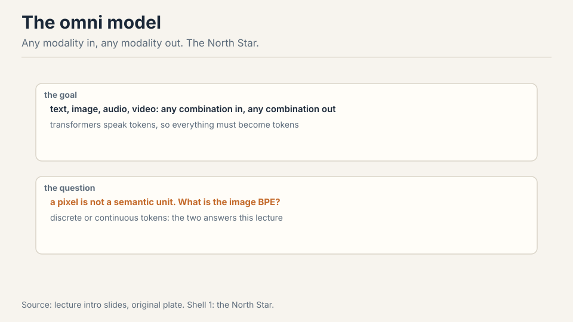

This lecture covers inputs. Generation gets its sketch at the
end.

### Subchapter: inputs versus generation

The lecture covers inputs: how images become tokens the
transformer reads. Generation (how the transformer emits
images) gets its sketch at the end. The split is practical:
input tokenization is solved (patches, projectors), output
generation is contested (discrete tokens vs diffusion).
The input side is the lecture's focus because it is where
the VLM template won. The output side is the open question
the sketch addresses.

## First attempt: CLIP, contrastive learning

**CLIP** (2021) is the foundation of modern vision-language
models. Take N image-text pairs (N=32,000). Encode each side.
The objective: image I1 must be closer to its text T1 than to
every other text, and vice versa. That is 2N softmax
classification problems [05:53](ts:05:53).

### Subchapter: the contrastive idea, from zero

No labels. Just pairs: an image and its caption, scraped
from the web. The idea: the caption describes the image, so
a model that matches images to their captions must
understand both. The objective is comparative: I1 must be
closer to T1 than to T2, T3, ..., TN. The model never sees
a class label. It sees only "these two go together, those
do not." The semantics come from the text: the caption
says "dog," so the image encoder learns dog-ness to match
it.

Work the toy. N=4 pairs: (I1,T1) a dog photo with "a dog",
(I2,T2) a cat with "a cat", (I3,T3) a car with "a car",
(I4,T4) a bird with "a bird". The loss asks: is I1 closer to
T1 than to T2, T3, T4? And is T1 closer to I1 than to I2,
I3, I4? Eight softmax problems. The encoders learn: pull
matched pairs together, push the rest apart.

### Subchapter: work the contrastive matrix

The N=4 toy, drawn as a matrix. Rows: I1..I4. Columns:
T1..T4. The diagonal (I1,T1)...(I4,T4) is positive: pull
together. The 12 off-diagonal cells are negative: push
apart. The loss is 2N softmax problems: each row picks its
column, each column picks its row. The gradient on I1: move
toward T1, away from T2, T3, T4, weighted by how wrong the
current similarities are.

Now scale to N=32,768. Each row's softmax runs over 32,768
captions: 32,767 negatives per positive. That is the signal:
the model must make I1 closer to T1 than to 32,767
distractors. Shrink the batch to 256: only 255 distractors,
and the task gets easy: the encoders learn lazy features.
The batch is not a hyperparameter. It is the objective. That
is why CLIP cost 10 days on 256 TPUv3: the physics of the
loss demanded it.

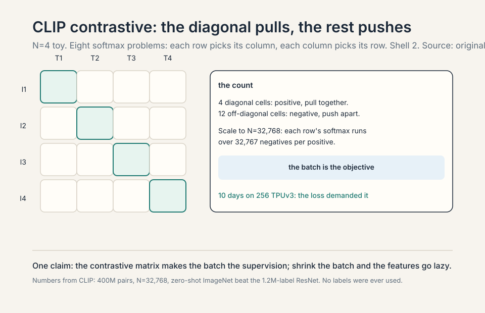

### Subchapter: the two encoders

The vision encoder that won: ViT-L/14, 14x14 patches with
positional embeddings through a standard transformer,
attention pooling at the end [12:41](ts:12:41). A **patch**
is a 14x14 square of pixels treated as one input token: the
image's version of a subword. The text encoder: GPT-2 style,
EOS (end-of-sequence) activation as the sequence vector [16:24](ts:16:24).

### Subchapter: why patches

A 224x224 image: 50,176 pixels. As tokens: too many, and
no pixel means anything. 14x14 patches: 196 pixels per
patch, 256 patches per image. Each patch is local (a
texture, an edge, a color blob) and the transformer
composes them. The patch is the image's subword: small
enough to be local, large enough to carry texture. The
positional embeddings tell the transformer where each
patch sits. Attention pooling at the end: the sequence of
patch encodings collapses to one image vector (the
equivalent of the text encoder's EOS vector).

### Subchapter: the text encoder's EOS trick

The text encoder is GPT-2 style: a causal transformer over
the caption's tokens. The sequence vector is the EOS
token's activation: the last position, which has attended
to everything before it. The EOS trick: the causal mask
means only the final position sees the whole sequence, so
its activation is the summary. Both encoders project into
one shared space: the image vector and the text vector
live in the same embedding space, where the contrastive
loss compares them.

Data: 400M web image-text pairs, noisy by nature (captions
rarely describe the image literally) [08:24](ts:08:24).

### Subchapter: 400M noisy pairs

400M image-text pairs, scraped from the web. Noisy by
nature: captions rarely describe the image literally. A
photo of a dog with the caption "my best friend": the
text says nothing about dogs. The contrastive loss withstands
the noise: across 400M pairs, the statistical
pattern (dog images near dog words) survives the
mislabeled pairs. The scale compensates for the noise.
This is the web-data lesson from Lecture 13 applied to
vision: noisy pairs at scale beat clean pairs at small
scale.

Headline: zero-shot ImageNet beat a ResNet trained on 1.2M
labeled images [17:21](ts:17:21). No labels, just captions,
and it classified better than the supervised champion. Why
text and not augmentation (SimCLR)? Augmentation cannot turn
one dog into another dog. Text supplies high-level semantics
[11:24](ts:11:24).

### Subchapter: the zero-shot headline, unpacked

Zero-shot ImageNet: encode the image, encode "a photo of a
{class}" for each of the 1,000 classes, pick the closest.
No ImageNet training. CLIP beat the ResNet trained on 1.2M
labeled images. The mechanism: the captions taught the
image encoder the class names' semantics. "A photo of a
golden retriever" matches the dog image because the
caption space contains dog descriptions. The labels were
never needed: the text supplied them.

### Subchapter: why text beats augmentation

SimCLR's idea: augment the image (crop, recolor), teach
the model that the augmented versions are the same. The
limit: augmentation cannot turn one dog into another dog.
The variations are pixel-level: the model learns
invariance to cropping, not the concept of dog. Text
supplies high-level semantics: the caption says "dog,"
and the model learns dog-ness across different dogs. The
supervision is semantic, not pixel. This is why CLIP's
400M noisy pairs beat SimCLR's clean augmentations: the
text carries the meaning the pixels lack.

> [!QA]
> Q: Walk me through CLIP training. What are the two encoders, and what does the loss actually compute?
> A: Two encoders: a ViT-L/14 vision encoder (14x14 patches
> as tokens, positional embeddings, standard transformer,
> attention pooling at the end) and a GPT-2-style text
> encoder (EOS activation as the sequence vector). Both
> project into one shared embedding space. The batch: N
> image-text pairs, N=32,768. The loss: for each image, a
> softmax over all N texts (is I1 closest to T1?). For each
> text, a softmax over all N images. 2N classification
> problems. The gradient pulls matched pairs together and
> pushes unmatched pairs apart. After training, zero-shot
> classification: encode the image, encode "a photo of a
> {class}" for each class, pick the closest. No labels were
> ever used: captions supplied the semantics. The compute:
> 10 days on 256 TPUv3, because the loss needs 32,767
> negatives per positive to be hard.
> Follow-up: Why 14x14 patches and not pixels?
> A: Because pixels are not semantic units. A 224x224 image
> has 50,176 pixels: too many tokens, and no single pixel
> means anything. A 14x14 patch (196 pixels) is the image's
> subword: small enough to be local, large enough to carry
> texture. 256 patches per image: a sequence the transformer
> can handle. The text supplies the semantics via the
> contrastive loss: the patches learn to be useful for
> matching captions. Same architecture lesson as Lecture 1:
> tokenize into units that carry meaning, not into atoms.
> Follow-up: How does zero-shot classification work without labels?
> A: The class names are text. Encode "a photo of a {class}"
> with the text encoder: 1,000 text vectors. Encode the
> image: one image vector. Pick the closest text vector. The
> text encoder learned the class names' semantics from
> captions during contrastive training. The image encoder
> learned to match. No classifier was trained on ImageNet:
> the matching is the classifier. The prompt ("a photo of
> a") matters: it matches the caption style the text encoder
> saw in training. Prompt engineering for CLIP is caption
> engineering.

## Where CLIP breaks: the loss is the batch

The softmax runs over all N pairs in the batch. Small batch:
few negatives, weak signal. The loss is the batch, so CLIP
needs huge batches: 32,768. Work the cost: 10 days on 256
TPUv3 [25:33](ts:25:33). The batch size is not a
hyperparameter here. It is the objective.

### Subchapter: the batch-size trap

The trap: the loss needs 32,767 negatives per positive to
be hard. Fewer negatives: the task gets easy, the features
get lazy. But 32,768 pairs per batch needs 256 TPUv3 for
10 days. The batch size is not tunable: shrink it and the
objective degrades. The loss couples the batch size to the
compute budget. Small labs cannot afford the objective.
The fix must change the loss, not the batch.

## The key question

What if the loss did not depend on the batch? What if each
pair could be judged on its own, positive or negative,
without the softmax over everyone else? Then small batches
work, and the systems win compounds.

### Subchapter: judge pairs, not batches

The key question reframes the loss. CLIP asks: "among all
N pairs, which is the match?" SigLIP asks: "is this pair a
match?" The first needs the batch (the competition defines
the question). The second needs only the pair (the label
defines the question). The reframe decouples the loss from
the batch: the expected loss is the same at any batch size.
Small batches work. The systems win (below) compounds.

## SigLIP: binary loss, decoupled batches

**SigLIP** replaces the 2N-way softmax with binary
classification: diagonal pairs positive, off-diagonals
negative, sigmoid loss [23:37](ts:23:37). Work the toy again.
N=4: 16 pair decisions, each independent. (I1,T1): positive.
(I1,T2): negative. No softmax, no competition between
negatives.

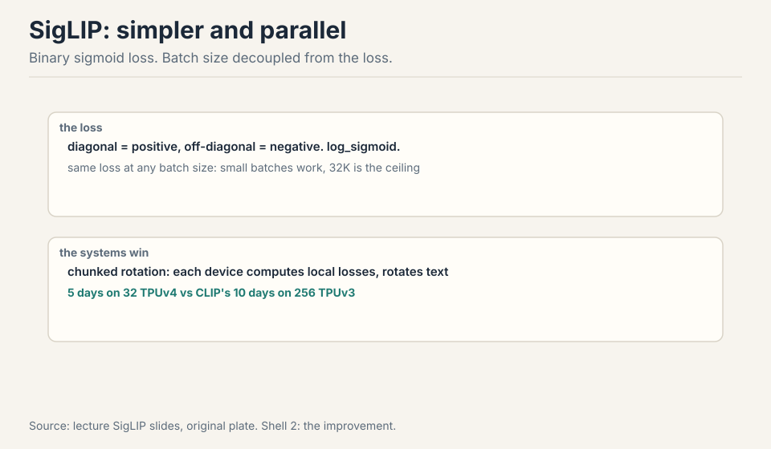

### Subchapter: softmax vs sigmoid (the one-line difference)

CLIP's loss: for each row, softmax over N columns. The
negatives compete: making T2 worse helps T1 win, even if T1
is not actually close. The loss couples every pair in the
batch. SigLIP's loss: each of the N^2 pairs gets its own
binary decision. (I1,T1): positive, push the sigmoid up.
(I1,T2): negative, push it down. No competition: T2 being
terrible does not help T1.

The consequence is statistical, not just systems. CLIP's
expected loss changes with batch size: the objective itself
moves. SigLIP's expected loss is the same at any batch size:
each pair's decision is independent of the batch. Small
batches work. The ceiling at 32K: beyond that, more negatives
add no signal (the model already separates them). And the
systems win compounds: devices compute local losses and
rotate embeddings, no global softmax, 5 days on 32 TPUv4.
One loss change, 16x fewer TPU-days.

### Subchapter: the systems win

Devices compute local losses and rotate text embeddings to
cover off-diagonal blocks, like DDP with interactions
[28:37](ts:28:37). The mechanism: each device holds a shard
of the batch. It computes the sigmoid loss on local pairs,
then rotates the text embeddings (ring exchange) to score
the off-diagonal pairs. No global softmax, no all-gather of
the full similarity matrix. The communication is the
rotation: bandwidth-efficient, overlapping with compute.
Result: 5 days on 32 TPUv4 versus CLIP's 10 days on 256
TPUv3. The loss change enabled the systems change: the
sigmoid's independence is what makes the sharding work.

The loss is now the same in expectation at any batch size,
so small batches work (CLIP degrades) and 32K is the
effective ceiling [27:38](ts:27:38). Systems win: devices
compute local losses and rotate text embeddings to cover
off-diagonal blocks, like DDP with interactions
[28:37](ts:28:37). Result: 5 days on 32 TPUv4 versus CLIP's
10 days on 256 TPUv3 [25:33](ts:25:33).

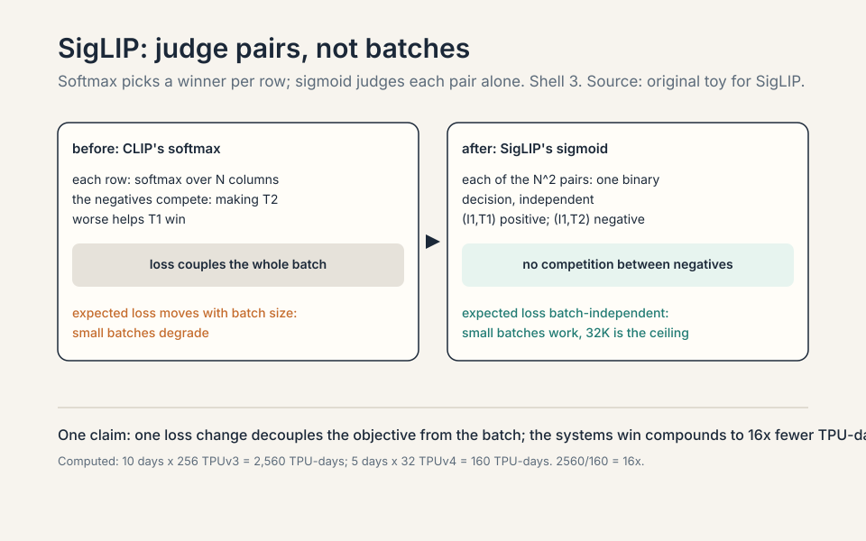

> [!QA]
> Q: When does SigLIP win over CLIP, and when would you still use CLIP's loss?
> A: SigLIP wins on compute and flexibility: small batches
> work, training is 16x cheaper in TPU-days, and the loss is
> batch-size independent. Use SigLIP whenever you are training
> a vision encoder from scratch or fine-tuning one. CLIP's
> softmax still has a niche: when the batch itself is the
> supervision (hard negatives mined within the batch matter)
> or when you are reproducing the exact CLIP recipe for
> compatibility (the open-weight ecosystem expects CLIP-style
> encoders). In practice the field moved: LLaVA OneVision uses
> SigLIP, Qwen3-VL uses SigLIP-2. The decision rule: default
> to SigLIP. Reach for CLIP's loss only for compatibility.
> Follow-up: Why is 32K the effective ceiling for SigLIP?
> A: Because beyond 32K negatives, the extra pairs add no
> learning signal. The model already separates easy negatives
> perfectly: their gradients are ~0. The remaining signal
> comes from hard negatives, and there are only so many in
> the data. More batch just replays decided pairs. This is a
> general contrastive-learning law: the batch is useful only
> while it contains undecided pairs. SigLIP hits the wall
> later than CLIP because its loss does not degrade at small
> batches, so you can afford to search for the informative
> regime instead of being forced into huge batches by the
> objective.
> Follow-up: What is SigLIP-2, and what changed?
> A: SigLIP-2 (Tschannen et al., 2025) is the improved
> recipe: better training (the sigmoid loss plus
> distillation and masked prediction auxiliaries), better
> localization (denser features for grounding), same binary
> loss at the core. Qwen3-VL uses SigLIP-2 as its vision
> encoder (SigLIP2-SO-400M default). The core idea is
> unchanged: judge pairs independently. The improvements are
> in what the encoder learns beyond matching: spatial
> precision, multilingual captions. SigLIP-2 is the current
> default vision encoder for new VLMs.

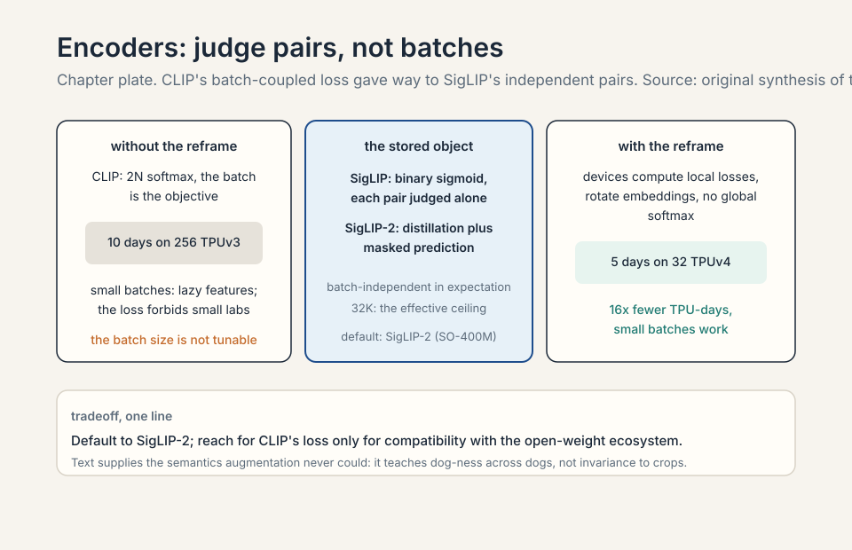

## LLaVA: stitch, not rebuild

The VLM template: take a vision encoder (CLIP), take an LLM
(Vicuna), stitch them with a projector, train in stages
[28:58](ts:28:58).

### Subchapter: the template, stated plainly

The template has three parts. One: a frozen vision encoder
(CLIP) that turns images into embeddings. Two: a frozen LLM
(Vicuna) that reasons over token embeddings. Three: a
projector (a matrix or small MLP) that translates the image
embeddings into the LLM's token space. The stitching is the
projector. The training is staged: align the projector
first, then fine-tune the LLM. The template's bet: the two
frozen components already contain everything. The only
missing piece is translation.

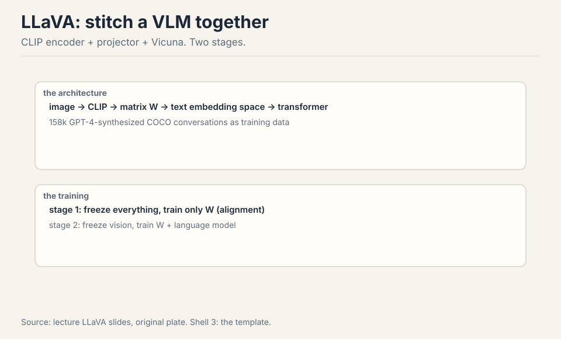

Image through CLIP, through matrix W into text-embedding
space, concatenated with text tokens through the
transformer. Training: **stage 1** freezes everything and
trains only W (alignment). **Stage 2** freezes the vision
encoder and trains W plus the LM [33:24](ts:33:24). Data:
158k GPT-4-synthesized conversations from COCO captions
[31:07](ts:31:07).

### Subchapter: freeze both ends (why the projector is enough)

Stage 1 trains only W: a matrix (or 2-layer MLP) mapping
CLIP's embedding space into the LLM's token embedding space.
Everything else frozen. Why this works: the two frozen
components already contain everything. CLIP's encoding is a
rich semantic summary of the image. The LLM is a reasoning
engine over token embeddings. The only missing piece is
translation: make the image encoding look like token
embeddings. That is a low-dimensional mapping problem, not
a learning problem: 158k examples suffice.

Stage 2 unfreezes the LLM (not the vision encoder) and
trains W plus the LM on visual instruction data. The LLM
learns to reason over image tokens: to attend to them, to
reference regions, to answer questions. The vision encoder
stays frozen because its features are already good and
retraining them on 158k examples would corrupt them. The
template's lesson: compose frozen experts, train the
interfaces. Qwen's later choice (unfreeze the encoder) is
the exception that proves the rule: you do it only when the
frozen features are the bottleneck (fine-grained OCR).

### Subchapter: the 158k conversations

158k GPT-4-synthesized conversations from COCO captions.
The recipe: take a COCO image's captions and bounding
boxes (text descriptions of the image), prompt GPT-4 to
invent a conversation about the image, collect the pairs.
The images are never seen by GPT-4: the captions stand in
for them. The conversations teach visual instruction
following: questions about the image, answers grounded in
the captions. The data is synthetic (Lecture 14's
pipeline): the teacher is GPT-4, the verifier is the
caption. 158k is small: the alignment needs little because
the components are frozen.

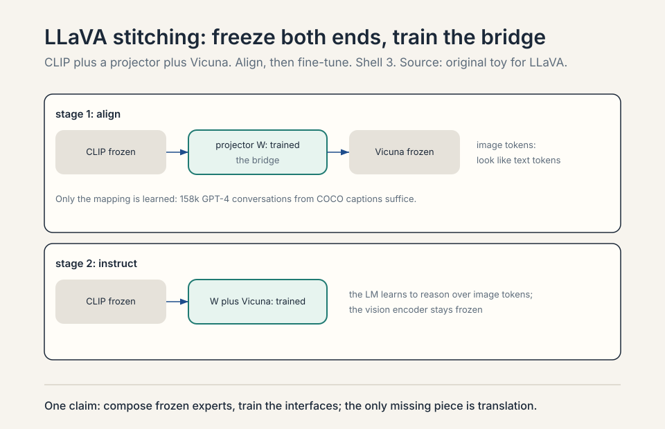

> [!QA]
> Q: Walk me through a LLaVA forward pass. Where do the image tokens come from?
> A: Step one: the image goes through the frozen CLIP vision
> encoder. A 336x336 image becomes 576 patch tokens (24x24
> grid), each a CLIP embedding. Step two: the projector W
> maps each embedding into the LLM's token embedding space:
> now they are "image tokens," same dimensionality as text
> tokens. Step three: concatenate. The sequence is [image
> tokens][text tokens]: the transformer sees them as one
> sequence. Step four: the frozen (stage 1) or trained
> (stage 2) LLM processes the sequence and generates the
> answer. The image tokens are treated exactly like text
> tokens by the attention: the LLM attends to image regions
> the way it attends to words. That is the whole trick:
> translation at the input, then one transformer.
> Follow-up: Why 576 image tokens and not fewer?
> A: Because each patch is a token and the grid is 24x24.
> Fewer tokens would mean coarser patches and lost detail.
> The price is context: 576 tokens per image before the
> question is even asked. AnyRes multiplies this: 16 crops
> plus overview = 17x576 = 9,792 image tokens. High
> resolution is paid in context length. Qwen3-VL's merger
> compresses 2x2 patches into one token to cut this: the
> token budget is the binding constraint on resolution.
> Follow-up: What does the projector actually learn?
> A: A mapping from CLIP's embedding space into the LLM's
> token embedding space. After stage 1, an image encoding
> should "look like" a sequence of token embeddings to the
> transformer: same dimensionality, same rough distribution.
> It is alignment, not understanding: the understanding was
> already in CLIP and in the LLM. The projector just
> introduces them.

> [!QA]
> Q: Why not train the vision encoder and language model jointly from scratch?
> A: Because you would throw away two excellent pre-trained
> components. CLIP already knows image semantics. The LLM
> already knows language and reasoning. The stitching
> approach (projector plus staged training) reuses both and
> needs only 158k examples to get visual reasoning working.
> Joint training from scratch would need billions of
> image-text pairs and enormous compute to relearn what each
> side already knows. The tradeoff: the vision encoder stays
> frozen and classification-flavored (CLIP was built for
> ImageNet), so fine-grained abilities like OCR need extra
> machinery (AnyRes) or encoder fine-tuning (Qwen's later
> choice).
> Follow-up: When do you unfreeze the vision encoder?
> A: When the frozen features are the bottleneck. CLIP's
> features are classification-flavored: they summarize the
> image's semantics, not its fine detail. For OCR, grounding,
> and dense document understanding, the frozen features lose
> the detail the task needs. Qwen's choice (continue training
> the encoder with dynamic resolutions) pays the cost of
> unfreezing to gain the detail. The rule: freeze when the
> task is semantic (what is in the image), unfreeze when the
> task is perceptual (read the small text, find the exact
> box). The template freezes by default. The exceptions are
> the tasks where pixels matter.

## Where stitching breaks: resolution

CLIP's 336x336 resize-and-crop cannot read documents. Work
the failure: a page of text at 336x336 is about 10 pixels
per character. Nothing is legible. The encoder was built for
ImageNet, not OCR.

### Subchapter: the 10-pixels-per-character failure

A document page at 336x336: the page is ~8 inches wide, the
image is 336 pixels. A 12-point character is ~1/6 inch: ~9
pixels wide. The encoder's patches are 14x14: each character
is smaller than a patch. The text is not just blurry: it is
below the encoder's resolution. The features contain no
character information. The LLM cannot read what was never
encoded. The failure is at the input: no amount of
projector training recovers the lost pixels.

**AnyRes** splits the image into encoder-sized crops,
encodes each, and concatenates, plus one downsampled
overview [37:36](ts:37:36). Crop, do not downsample. A
1344x1344 document becomes 16 crops of 336x336 plus one
overview: each crop is legible, the overview keeps layout.
Adaptive: big images get more crops, videos get fewer tokens
per frame (up to 32 frames) [40:09](ts:40:09).

### Subchapter: the token budget of resolution

Work the arithmetic. One 336x336 crop: 576 tokens. A
1344x1344 document: 16 crops plus 1 overview = 17 encodings.
Image tokens: 17 x 576 = 9,792. Before the question is
asked, before a single word of answer, the context holds
~10k image tokens. A 32k-context LLM spends a third of its
budget on one document page.

The decision this forces: resolution is a token purchase.
Every doubling of image resolution quadruples the crops and
the tokens. Videos: 32 frames x tokens-per-frame. The
field's answers: AnyRes (adaptive crops: pay for the
resolution you need), the overview thumbnail (layout
without detail, cheap), Qwen3-VL's merger (2x2 patches into
one token: halve the bill). The binding constraint on VLM
resolution was never the encoder: it is the LLM's context
window. Design the resolution budget first, then the
encoder.

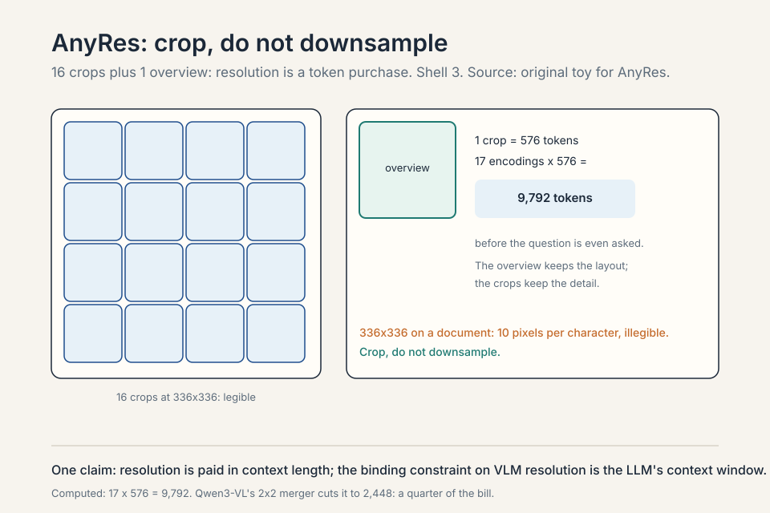

> [!QA]
> Q: A 1344x1344 document costs 9,792 image tokens. Walk me through the alternatives.
> A: Option one: downsample to 336x336. Cost: 576 tokens. The
> document becomes illegible: 10 pixels per character. Option
> two: AnyRes. 16 crops at full resolution plus 1 overview:
> 9,792 tokens, every character legible, layout preserved by
> the overview. Option three: Qwen3-VL's merger. 2x2 patch
> merging: each crop's 576 tokens become 144. Total: 17 x 144
> = 2,448 tokens. A quarter of the AnyRes bill, some detail
> lost in the merge. The choice is budget-driven: 32k
> context, one document, AnyRes fits. 32k context, ten
> documents, you need the merger. The rule: compute the token
> budget before choosing the resolution strategy. The encoder
> is never the bottleneck. The context window is.
> Follow-up: Why the overview thumbnail?
> A: Because crops lose layout. Sixteen independent crops are
> sixteen independent images: the model sees each region but
> not their arrangement. The downsampled overview is one more
> encoding of the whole page at low resolution: it carries
> the global structure (two columns, a figure on the right)
> while the crops carry the detail. The model
> cross-references: layout from the overview, text from the
> crops. Without it, the model reads words but loses the
> page. The overview is the cheapest token in the budget:
> 576 tokens for the structure of everything.
> Follow-up: How does AnyRes handle video?
> A: Fewer tokens per frame, more frames. Up to 32 frames,
> each frame encoded at reduced resolution (fewer crops, or
> downsampled). The token budget splits across time: 32
> frames x tokens-per-frame must fit the context. The
> tradeoff: spatial detail versus temporal coverage. More
> frames: better motion understanding, worse per-frame
> detail. The lecture's number (32 frames) is the template's
> compromise. Qwen3-VL extends this to 256K context for long
> video: the budget grows, the tradeoff softens.

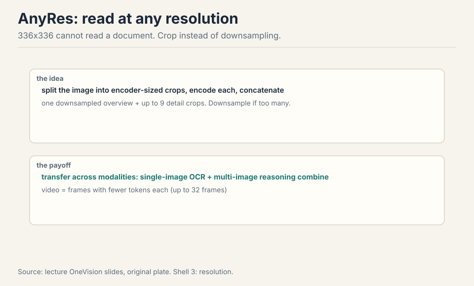

LLaVA OneVision (2024): SigLIP encoder, Qwen-2 decoder, 2-layer
MLP projector, three training stages [35:25](ts:35:25). The
surprise: cross-modal transfer. Single-image OCR data plus
multi-image relational data generalize to two-image
table-plus-chart questions and video visual prompting,
neither seen in training [43:30](ts:43:30).

### Subchapter: OneVision's three stages

LLaVA OneVision: SigLIP encoder, Qwen-2 decoder, 2-layer MLP
projector, three training stages. Stage 1: alignment (the
projector, frozen ends). Stage 2: high-quality knowledge
learning (unfreeze more, train on curated data). Stage 3:
visual instruction tuning (the chat behavior). The third
stage is the refinement: stage 2 teaches the model the
world's images, stage 3 teaches it to talk about them. The
template's evolution: more stages, better data, same
stitching.

### Subchapter: cross-modal transfer, the surprise

Single-image OCR data plus multi-image relational data
generalize to two-image table-plus-chart questions and video
visual prompting, neither seen in training. The model trained
on single images and multi-image sets answers questions
about image pairs it never saw paired, and about video it
never saw as video. The transfer: the reasoning patterns
(compare, relate, ground) transfer across input shapes. The
lecture's point: modalities transfer. Train the patterns on
one shape, they work on another. This is the same
generalization the course keeps finding: the transformer
learns the operation, not the format.

## Qwen-VL: three generations of sharper pieces

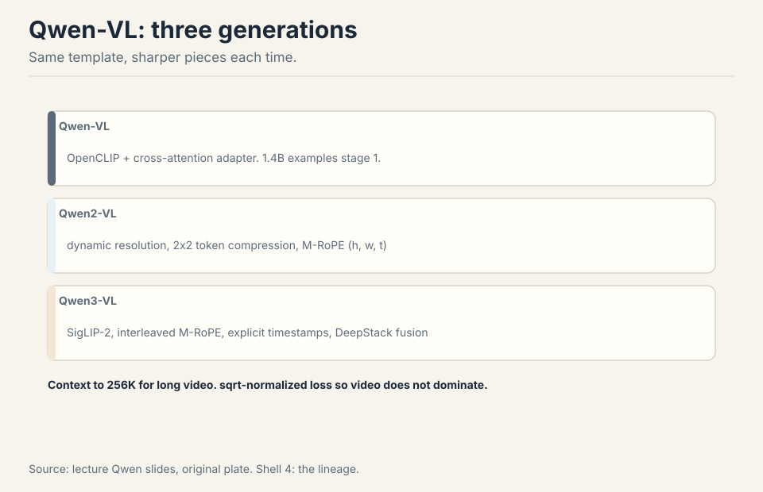

**Qwen-VL**: OpenCLIP, cross-attention adapter to 256 tokens,
three stages with 1.4B examples in stage 1, bounding-box
outputs [46:06](ts:46:06). The cross-attention adapter:
instead of concatenating all patch tokens, a small set of
learned queries attends to the image and compresses it to 256
tokens. The compression is learned: the queries learn what
to keep. **Qwen2-VL**: dynamic resolution
(11k tokens for a big image, 8 for a tiny equation), 2x2 token
compression, **M-RoPE**: RoPE over height, width, and time
concatenated [49:16](ts:49:16). Position now has three axes:
where in the image, when in the video. **Qwen3-VL**:
SigLIP-2, interleaved M-RoPE frequencies (every axis sees
high and low frequencies), explicit timestamp tokens,
sqrt-length normalized loss so video does not dominate, and
**DeepStack**: vision layers fused directly into the LM
residual stream [52:50](ts:52:50). Context to 256K for long
video. Training runs 8K to 32K to 256K.

### Subchapter: generation one (Qwen-VL)

OpenCLIP encoder, cross-attention adapter compressing to 256
tokens, three training stages with 1.4B examples in stage 1,
bounding-box outputs. Bounding-box outputs: the model emits
coordinates, not just text: grounding as a first-class
output. Generation one proved the template scales: 1.4B
examples in stage 1, the stitching holds.

### Subchapter: generation two (Qwen2-VL)

Dynamic resolution: 11k tokens for a big image, 8 for a tiny
equation. Fixed resolution wasted tokens on small images and
starved big ones. Dynamic resolution spends the token budget
where the pixels are. 2x2 token compression: the merger
halves the bill. M-RoPE: RoPE over height, width, and time
concatenated. Position has three axes: where in the image
(h, w), when in the video (t). The rotary frequencies split
across the three: each axis gets its own subspace. Generation
two fixed the two wastes: tokens (dynamic resolution) and
positions (M-RoPE).

### Subchapter: M-RoPE, unpacked

RoPE (Lecture 3) encodes position as rotation: each
dimension pair rotates at a frequency. M-RoPE splits the
dimensions into three groups: temporal (t), height (h),
width (w). Each group rotates at its own frequencies. A
video token's position is (t, h, w): when in the video,
where in the frame. The concatenation: the three rotary
embeddings concatenate into one position encoding. The
limitation the next generation fixed: the frequency
allocation. Each axis got a fixed band: t the low
frequencies, h and w the high (or similar). The bands were
imbalanced: some axes saw only coarse positions, others
only fine.

### Subchapter: generation three (Qwen3-VL), verified

The Qwen3-VL technical report (arXiv:2511.21631), verified.
Vision encoder: SigLIP-2, continued training with dynamic
resolutions, 2D-RoPE plus interpolated absolute positions.
Default: SigLIP2-SO-400M. SigLIP2-Large (300M) for the 2B
and 4B models. Merger: two-layer MLP compressing 2x2 visual
features into one token. **Interleaved M-RoPE**: the t, h, w
components interleave across dimensions, so every axis sees
high and low frequencies: the spectral bias fixed.
**Timestamp tokens**: explicit text tokens marking video
time: the model reads "when" as text. **DeepStack**: vision
layers fused directly into the LM residual stream (not just
at the input): the fusion goes deeper. Loss: sqrt-length
normalized so video does not dominate. Context: 256K for
long video. Training: 8K to 32K to 256K curriculum. Sizes:
2B/4B/8B/32B dense, 30B-A3B and 235B-A22B MoE. Thinking and
non-thinking variants.

### Subchapter: DeepStack, the deeper fusion

DeepStack: vision layers fused directly into the LM residual
stream. The LLaVA template fuses at the input: image tokens
concatenate with text tokens, one transformer. DeepStack
fuses at multiple layers: vision features inject into the
LM's residual stream at several depths. The intuition: the
input fusion forces the LM to carry the image through every
layer. The deep fusion lets each layer pull the visual
features it needs. The fusion moves deeper: from input
concatenation (LLaVA) to cross-attention (Qwen-VL) to
residual-stream fusion (DeepStack). Each generation moves
the vision deeper into the language model.

> [!QA]
> Q: Walk me through the Qwen-VL generations. What did each generation fix?
> A: Generation one (Qwen-VL): the LLaVA template at scale.
> OpenCLIP encoder, cross-attention adapter compressing to
> 256 tokens, three training stages with 1.4B examples in
> stage 1, bounding-box outputs for grounding. It proved the
> template scales. Generation two (Qwen2-VL): dynamic
> resolution and positions. Fixed resolution wasted tokens on
> tiny images and starved big ones: dynamic resolution gives
> 11k tokens to a big image, 8 to a tiny equation. 2x2 token
> compression halves the bill. M-RoPE: RoPE over height,
> width, and time concatenated, so position has three axes:
> where in the image, when in the video. Generation three
> (Qwen3-VL): deeper fusion. SigLIP-2 encoder, interleaved
> M-RoPE frequencies (every axis sees high and low
> frequencies, fixing the frequency allocation), explicit
> timestamp tokens, sqrt-length normalized loss (so long
> videos do not dominate the loss), and DeepStack: vision
> layers fused directly into the LM residual stream instead
> of only at the input. Context to 256K for long video. Each
> generation moved the fusion deeper: from input
> concatenation (LLaVA) to cross-attention (Qwen-VL) to
> residual-stream fusion (DeepStack).
> Follow-up: Why does the loss need sqrt-length normalization for video?
> A: Because video is long. A 10-minute video has orders of
> magnitude more tokens than an image. Without normalization,
> the loss is dominated by video: the model optimizes for
> video and forgets images. Linear normalization (divide by
> length) would go too far: it would make each video token
> count for almost nothing. Sqrt-length is the compromise:
> long sequences are downweighted, but each token still
> matters. The general principle: the loss weights are part
> of the data mixture (Lecture 14). Unbalanced lengths are an
> unbalanced mixture, and the fix is the same arithmetic.
> Follow-up: What is the interleaved M-RoPE fix, precisely?
> A: The original M-RoPE partitioned dimensions: t got one
> frequency band, h another, w another. The bands were
> imbalanced: follow-up studies showed the imbalance degraded
> long-video understanding. Interleaved M-RoPE redistributes:
> the t, h, w components interleave across the embedding
> dimensions, so each axis is uniformly represented across
> low and high frequencies. Every axis sees both coarse and
> fine positions. The report's claim: the balanced spectrum
> significantly improves long-range positional modeling for
> video. The fix is in the frequency allocation, not the
> architecture.

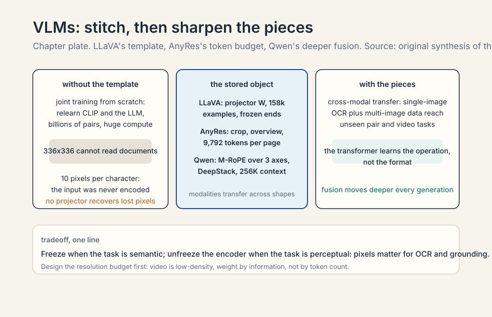

## Chameleon: the discrete alternative

The elegant alternative: make everything discrete tokens.
**VQ-VAE** maps a 512x512 image to 1,024 tokens from an
8,000-code codebook. Then it is just language-model training,
no adapter [67:18](ts:67:18). Interleaved text and images,
true omni-style generation.

### Subchapter: VQ-VAE, from zero

A **VQ-VAE** (vector-quantized variational autoencoder)
compresses an image into discrete codes. The encoder maps
the image to a grid of continuous vectors. Each vector is
replaced by its nearest codebook entry: 8,000 codes, each a
learned vector. The image becomes a sequence of code
indices: 1,024 tokens for a 512x512 image. The decoder
reconstructs the image from the codes. For Chameleon, the
codes are the tokens: the transformer trains on code
sequences exactly like text. No adapter, no projector, no
staging: one token space for everything.

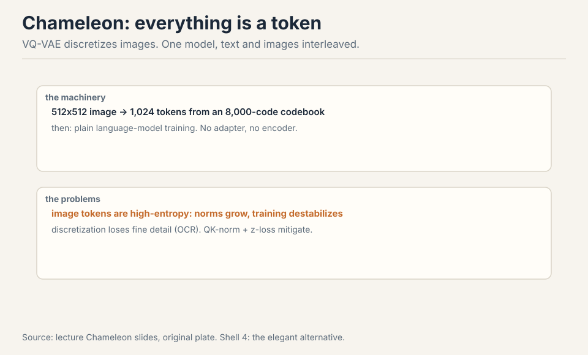

### Subchapter: why discrete is elegant

One token space for everything. Text tokens and image tokens
interleave in a single sequence: the model generates text,
then image codes, then text, in one stream. No separate
image generator: the transformer is the generator. Training
is language-model training: next-token prediction on the
mixed stream. The elegance is architectural unity: the omni
model's North Star, achieved by making images look like
text. Chameleon is the purest expression of "transformers
speak tokens."

The problems, demonstrated. Image tokens are high-entropy
(which exact blue?): parameter norms grow and training
destabilizes. QK-norm and z-loss mitigate [72:11](ts:72:11).
Discretization loses fine detail, so OCR suffers: the
codebook has 8,000 entries for all possible image patches,
and small text falls between codes. Diffusion later won
generation. VQ-VAE faded [74:28](ts:74:28).

### Subchapter: the entropy problem, mechanized

Image tokens are high-entropy: which exact blue? The next
code is uncertain across hundreds of similar codes. The
model's logits spread wide. The gradients are noisy. The
parameter norms grow to express the uncertainty. Training
destabilizes. Text tokens are low-entropy by comparison:
the next word is constrained by grammar and meaning.
The fix: **QK-norm** (normalize queries and keys, bounding
the attention logits) and **z-loss** (penalize large
logits, Lecture 3's stabilizer). Both bound the explosion.
The mitigations work, but the entropy is structural: images
carry more uncertainty per token than text.

### Subchapter: the discretization tax

Discretization loses fine detail. The codebook has 8,000
entries for all possible image patches. A patch of small
text: the exact letterforms fall between codes. The
nearest code is an approximation: the text blurs. OCR
suffers: the model cannot read what the codes did not
preserve. The tax is the codebook's resolution: 8,000 codes
cannot cover the space of image patches at character
precision. Continuous encodings (CLIP, SigLIP) preserve the
detail: no quantization, no tax. The discrete design pays
for its elegance in lost pixels.

### Subchapter: diffusion won generation

Diffusion later won generation. The diffusion model:
iterative denoising, continuous, micro-optimized for detail.
It generates images the discrete transformer cannot: sharp
text, fine textures, photorealism. The field split: continuous
encoders for understanding (no information loss), diffusion
for generation (micro-optimized detail). Chameleon's
discrete unity lost to the two-system pragmatism. VQ-VAE
faded. The lecture's verdict: the elegant alternative was
elegant and wrong for generation.

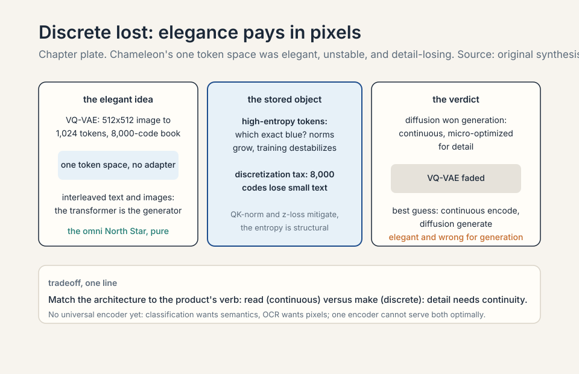

## The frontier's best guess

The best guess: continuous encoders for understanding (no
information loss), diffusion for generation
(micro-optimized detail) [74:43](ts:74:43). That picture is
the lecturer's speculation, flagged as such.

### Subchapter: the two-system pragmatism

The best guess is two systems. Understanding: continuous
vision encoders (SigLIP-2 class), no quantization, full
detail preserved, fused into the LM (DeepStack class).
Generation: diffusion models, conditioned on the LM's
output, micro-optimized for pixel detail. The LM is the
hub: it reads images through the encoder, writes prompts
for the diffusion model. The unity is at the system level,
not the token level. The speculation's honesty: the
frontier's actual design is [uncertain]. The two-system
picture is the lecturer's inference from what is public.

Compute comparisons (TPUv3 vs v4) are not flops-normalized.
Chameleon results were not shown in lecture. Persistent
challenges: no universal encoder (classification wants
semantics, OCR wants pixels), modality weighting (video is
low-density, do not let it drown text), and systems (video
loading alone can bottleneck training) [61:16](ts:61:16).

### Subchapter: no universal encoder

Classification wants semantics: what is in the image, at a
glance. OCR wants pixels: the exact characters, at full
resolution. One encoder cannot serve both optimally: the
semantic encoder compresses away the pixels, the pixel
encoder drowns in detail. The field's answer: task-specific
encoders, or dynamic resolution (spend pixels where the
task needs them). The universal encoder is the open
problem: the vision equivalent of BPE's universality for
text.

### Subchapter: modality weighting

Video is low-density: most frames repeat the last one. Text
is high-density: every token carries meaning. Train on
mixed video and text without weighting: the video tokens
dominate the loss (there are more of them) and teach less
per token. The model drowns in video and starves on text.
The fixes: sqrt-length normalization (Qwen3-VL), per-modality
loss weights, data mixing by density (Lecture 14's mixture
arithmetic, applied to modalities). The principle: weight
by information, not by token count.

### Subchapter: video loading bottlenecks training

Systems: video loading alone can bottleneck training. Video
is heavy: decode the frames, resize, encode, all before the
GPU sees a token. The dataloader must feed the GPUs faster
than they train. At VLM scale, the video pipeline (not the
model) is the bottleneck. The fixes: pre-encoded features
(encode once, train many times), faster codecs, more
dataloader workers. The unglamorous truth: the multimodal
frontier is gated by data loading, not by architecture.

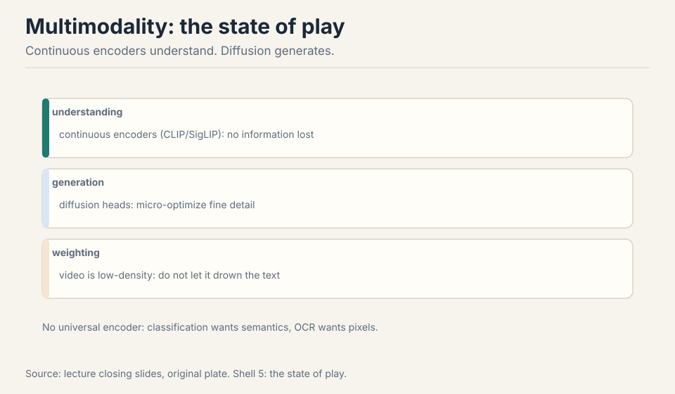

> [!QA]
> Q: You are building a VLM for document understanding (invoices, contracts, forms). Design it.
> A: Start from the token budget. A contract page at readable
> resolution: AnyRes with 16 crops plus overview, ~10k tokens
> per page. A 10-page contract: 100k tokens. You need 128k+
> context: pick the LLM accordingly. Encoder: SigLIP-2 (the
> current default), fine-tuned or at least unfrozen in later
> stages: document text is fine-grained, and frozen CLIP
> features are classification-flavored. Positions: M-RoPE
> over height and width, so the model knows where on the page
> each token sits (forms are positional: the total is
> bottom-right). Training: stage 1 alignment on document
> image-text pairs, stage 2 visual instruction tuning on
> document QA (where is the total? what date?), stage 3 DPO
> on hard cases. Do not use Chameleon's discrete tokens: the
> codebook loses the small text you need. Do not downsample:
> 10 pixels per character is illegible. The decision rule:
> for documents, resolution is correctness. Buy it with
> context, compress with 2x2 merging, and never let the
> encoder be the bottleneck.
> Follow-up: When would you choose Chameleon's discrete approach instead?
> A: When generation matters more than understanding. Discrete
> tokens make the model a true omni-model: it can generate
> interleaved text and images in one token stream, no
> diffusion decoder needed. The price: discretization loses
> fine detail (OCR suffers), high-entropy image tokens
> destabilize training (QK-norm and z-loss mitigate), and
> diffusion won generation anyway. For a
> document-understanding product, none of the benefits apply
> and all of the costs do. For a creative tool that edits
> images with text instructions in one stream, the discrete
> design is at least worth testing. Match the architecture to
> the product's verb: read (continuous) vs make (discrete).
> Follow-up: How do you handle the 100k-token context in production?
> A: The context is the cost. 100k tokens of image plus text:
> the KV cache is enormous, the prefill is slow. The
> mitigations: 2x2 merging (halve the image tokens), page
> selection (retrieve the relevant pages first, then read
> them at full resolution: RAG for documents), and KV cache
> compression (Lecture 18's MLA). The architecture: a
> retriever picks the pages, the VLM reads the picks. Do not
> feed all 10 pages at full resolution every query: the
> token budget is the product's margin.

### Subchapter: the VLM data supply chain

The VLM data supply chain mirrors the text pipeline. LAION-5B:
5B image-text pairs, open, noisy. COYO: 700M pairs, cleaner.
DataComp: the benchmark for filtering (which filtering choices
move downstream scores). The lecture's filtering lesson
applies: the pairs are noisy, the funnel matters, the positive
set is a hyperparameter. AI2's VLM report (the lecture's
further reading) documents the data details the lecture
skipped: the open VLM data recipe is the text recipe with
images attached.

### Subchapter: audio, the missing modality

The lecture covers vision. Audio is the missing modality:
speech in, speech out. The tokenization problem repeats:
what is the audio equivalent of BPE? The field's answers:
discrete audio codes (like VQ-VAE for sound) or continuous
spectrogram features. The omni model's North Star includes
audio, but the lecture's template (contrastive pretraining,
projector stitching) was built for vision. Audio follows the
same playbook with different tokens. The coverage here is
deliberately thin: the lecture did not cover it, and the
honest lesson marks the gap.

> [!QA]
> Q: You are training a VLM from scratch. What is the data recipe?
> A: Stage one: the vision encoder. Contrastive pretraining
> on image-text pairs (LAION-5B scale, SigLIP loss): the
> encoder learns semantics. Filter the pairs: the DataComp
> lesson (which filtering moves downstream scores). Stage
> two: alignment. Image-caption pairs, train the projector
> only (LLaVA stage 1): the bridge. Stage three: visual
> instruction tuning. GPT-4-synthesized conversations from
> captions (158k scale to start, millions for the frontier):
> the chat behavior. Stage four (optional): unfreeze the
> encoder for fine-grained tasks (OCR, grounding). The data
> volumes: billions of pairs for the encoder, millions of
> conversations for the chat. The recipe is the text
> pipeline's sibling: contrast (pretrain), align (project),
> instruct (tune). The lecture's template, at data scale.
> Follow-up: What is the hardest data to get?
> A: The alignment conversations. Image-text pairs are
> abundant (the web is full of them). Good visual
> instruction data is scarce: it needs questions about
> specific images with correct answers. The synthesis
> pipeline (captions to GPT-4 to conversations) manufactures
> it, but the captions are the bottleneck: no caption, no
> conversation. The frontier's advantage is partly
> proprietary: human-written visual instructions at scale.
> The open community synthesizes. The gap is the data moat,
> again.

## What is used where: the vision encoder options

The encoders, mapped to who uses them, as of October 2026.

- **CLIP (ViT-L/14)**: the original. Still the default frozen
  encoder in open VLM recipes. Compatibility choice.
- **SigLIP / SigLIP-2**: the current default. LLaVA OneVision
  uses SigLIP. Qwen3-VL uses SigLIP-2 (SO-400M). Better
  training, better localization, same binary loss.
- **Qwen-VL series**: the generation ladder. Qwen-VL
  (OpenCLIP), Qwen2-VL (dynamic resolution, M-RoPE),
  Qwen3-VL (SigLIP-2, interleaved M-RoPE, DeepStack, 256K
  context). The open frontier for document and video
  understanding.
- **Frontier omni models** (GPT-4o/GPT-5 class, Gemini):
  natively multimodal, details undisclosed [uncertain].
  The lecturer's best guess: continuous encoders plus
  diffusion generation.

The decision rule: default to SigLIP-2. Reach for CLIP only
for compatibility. For documents: unfreeze the encoder and
spend the token budget. For the frontier: the details are
[uncertain], the direction is deeper fusion.

| Encoder | Loss | Who uses it | Rule | Source: original. |
|---|---|---|---|---|
| CLIP (ViT-L/14) | 2N-way softmax, batch-coupled | open VLM recipes, frozen | compatibility choice | lecture |
| SigLIP / SigLIP-2 | binary sigmoid, batch-independent | LLaVA OneVision, Qwen3-VL (SO-400M) | default for new VLMs | lecture |
| Qwen-VL series | varies by generation | Qwen-VL, Qwen2-VL, Qwen3-VL | documents and long video, 256K context | lecture |
| Frontier omni encoders | undisclosed | GPT-4o/GPT-5 class, Gemini | [uncertain] | lecture gap |

Shell 2. CLIP to SigLIP-2: the loss change that decoupled training from the batch size.

## Mapping back: what each idea fixes

| Pain | Fix | How |
|---|---|---|
| Pixels are not semantic units | CLIP patches | 14x14 patches as tokens. Text supplies semantics via contrastive loss. |
| Loss needs huge batches | SigLIP | Binary sigmoid loss. Decoupled batches. 5 days vs 10. |
| Two good components, no bridge | LLaVA stitching | Projector W, staged training. 158k examples. Freeze both ends. |
| 336x336 cannot read documents | AnyRes | Crop, not downsample. Overview plus detail crops. Token budget first. |
| One resolution, one position | Qwen generations | Dynamic resolution, M-RoPE over 3 axes, DeepStack fusion. 256K context. |
| Adapters are inelegant | Chameleon | VQ-VAE discrete tokens. Elegant, unstable (entropy), detail-losing. |
| Generation needs detail | Diffusion | Continuous encode, diffusion generate. The two-system pragmatism. |
| Modalities drown each other | Weighting | Sqrt-length norm. Weight by information, not tokens. |

## The honest price

Frontier models are natively multimodal, details undisclosed.
The best guess: continuous encoders for understanding (no
information loss), diffusion for generation (micro-optimized
detail) [74:43](ts:74:43). That picture is the lecturer's
speculation, flagged as such. Compute comparisons (TPUv3 vs
v4) are not flops-normalized. Chameleon results were not shown
in lecture. Qwen3-VL details verified from the technical
report. Persistent challenges: no universal encoder,
modality weighting, video loading bottlenecks.

## Recap: the whole lesson on one screen

The story in nine steps. Each step answers the one before it.

1. **The omni goal.** Any modality in, any out. Transformers
   speak tokens. A pixel is not a semantic unit: tokenization
   takes work.
2. **CLIP contrasts.** 2N softmax problems on 400M pairs.
   ViT-L/14 patches. Zero-shot ImageNet beats supervised
   ResNet. Text gives semantics. The batch is the objective.
3. **The loss is the batch.** CLIP needs 32K batches: 10 days
   on 256 TPUv3. Small batches learn lazy features.
4. **SigLIP decouples.** Binary sigmoid loss, independent pair
   decisions. Small batches work. 5 days on 32 TPUv4. SigLIP-2
   is the current default.
5. **LLaVA stitches.** CLIP plus projector plus Vicuna. Align
   W, then fine-tune. 158k examples. Freeze both ends, train
   the bridge.
6. **AnyRes crops.** 336x336 cannot read documents (10px per
   char). Crop, not downsample. 17 encodings, 9,792 tokens.
   The context window is the binding constraint.
7. **Qwen sharpens.** Dynamic resolution, M-RoPE over 3 axes
   (interleaved in v3), DeepStack fusion into the residual
   stream. 256K context. Timestamp tokens. Sqrt-length loss.
8. **Chameleon discretizes.** VQ-VAE: elegant, unstable
   (entropy: QK-norm and z-loss mitigate), detail-losing
   (OCR suffers). Diffusion won generation.
9. **The frontier's best guess.** Continuous encode,
   diffusion generate. No universal encoder yet. Weight
   modalities by information. Video loading is the systems
   bottleneck.

## Go deeper

<iframe style="position:absolute;top:0;left:0;width:100%;height:100%;" src="https://www.youtube-nocookie.com/embed/7VJpZCTz168" title="Vision Language Models Explained" frameborder="0" allow="accelerometer; autoplay; clipboard-write; encrypted-media; gyroscope; picture-in-picture" allowfullscreen></iframe>

- Vision Language Models Explained (the embed above): https://www.youtube.com/watch?v=7VJpZCTz168
- Radford et al., CLIP: https://arxiv.org/abs/2103.00020
- Zhai et al., SigLIP: https://arxiv.org/abs/2303.15343
- Liu et al., LLaVA: https://arxiv.org/abs/2304.08485
- Qwen3-VL Technical Report: https://arxiv.org/abs/2511.21631

## Official sources and further reading

**Official:**
- Lecture 17 video.
- CLIP, SigLIP, LLaVA, LLaVA-OneVision, Qwen-VL series, Chameleon
  papers.
- Qwen3-VL technical report (verified).

**Further reading:**
- LAION-5B / OpenCLIP (open replication).
- VQ-VAE (Oord 2017). DeepStack adapter paper.
- AI2's VLM report (data details the lecture skipped).

**Caveats from these sources.** Frontier omni models are
undisclosed [uncertain]. The "continuous plus diffusion"
picture is the lecturer's speculation, flagged as such.
Compute comparisons (TPUv3 vs v4) are not flops-normalized.
Chameleon results were not shown in lecture.

## Connections to the other courses

- **CS336 L01:** tokenization generalized beyond text.
- **CS336 L03:** RoPE generalized to M-RoPE.
- **CS336 L14:** modality weighting is data mixing.
- **CS224N:** vision-language models from the NLP side.

## Coverage map

Every major lecture claim, mapped to the section that covers it.

| Session claim | Covered in | File line |
|---|---|---|
| North Star: any modalities in, any out; image plus video in, answer plus generated image out | The problem: the omni model | 40 |
| Transformers speak tokens; image equivalent of BPE; pixel is not a semantic unit | why tokenization is the whole problem | 60 |
| Lecture covers inputs; generation sketched at end | inputs versus generation | 80 |
| CLIP (2021): N=32,000 pairs, encode each side, 2N softmax problems | First attempt: CLIP, contrastive learning | 91 |
| Toy N=4: dog/cat/car/bird; eight softmax problems | the contrastive idea, from zero | 99 |
| Contrastive matrix: diagonal pull, off-diagonal push; N=32,768, 32,767 negatives; batch is the objective; 10 days on 256 TPUv3 | work the contrastive matrix | 120 |
| ViT-L/14: 14x14 patches, positional embeddings, transformer, attention pooling | the two encoders; why patches | 141 |
| Text encoder: GPT-2 style, EOS activation as sequence vector | the text encoder's EOS trick | 163 |
| Data: 400M web pairs, noisy (captions rarely literal) | 400M noisy pairs | 178 |
| Zero-shot ImageNet beat ResNet trained on 1.2M labeled images | the zero-shot headline, unpacked | 198 |
| Why text not augmentation (SimCLR): augmentation cannot turn one dog into another dog | why text beats augmentation | 209 |
| CLIP breaks: softmax over batch; small batch weak signal; 32,768 needed | Where CLIP breaks: the loss is the batch | 261 |
| Key question: loss independent of batch; judge each pair alone | The key question | 279 |
| SigLIP: binary classification, diagonal positive, sigmoid loss; N=4 toy, 16 independent decisions | SigLIP: binary loss, decoupled batches | 296 |
| Softmax vs sigmoid: no competition between negatives; expected loss batch-independent; 32K ceiling | softmax vs sigmoid | 307 |
| Systems win: local losses, rotate text embeddings, like DDP with interactions; 5 days on 32 TPUv4 | the systems win | 327 |
| LLaVA template: CLIP plus Vicuna plus projector, staged training | LLaVA: stitch, not rebuild | 388 |
| Image through CLIP, matrix W, concatenate; stage 1 trains W only; stage 2 trains W plus LM | (same section) | 388 |
| 158k GPT-4 conversations from COCO captions | the 158k conversations | 439 |
| Resolution break: 336x336 cannot read documents; ~10 pixels per character | Where stitching breaks: resolution | 515 |
| AnyRes: encoder-sized crops plus downsampled overview; crop not downsample; adaptive; 32 frames for video | (same section) | 515 |
| Token budget: 1344x1344 = 16 crops + overview = 9,792 tokens | the token budget of resolution | 541 |
| LLaVA OneVision: SigLIP, Qwen-2, 2-layer MLP, three stages | OneVision's three stages | 608 |
| Cross-modal transfer: single-image OCR + multi-image data generalize to unseen pair/video tasks | cross-modal transfer, the surprise | 620 |
| Qwen-VL: OpenCLIP, cross-attention to 256 tokens, 1.4B stage 1, bounding boxes | generation one (Qwen-VL) | 656 |
| Qwen2-VL: dynamic resolution (11k big, 8 tiny), 2x2 compression, M-RoPE (h, w, t) | generation two (Qwen2-VL) | 665 |
| Qwen3-VL: SigLIP-2, interleaved M-RoPE, timestamp tokens, sqrt-length loss, DeepStack, 256K context, 8K-32K-256K training | generation three (Qwen3-VL), verified | 693 |
| Chameleon: VQ-VAE, 512x512 to 1,024 tokens, 8,000-code codebook; just LM training, no adapter | Chameleon: the discrete alternative | 773 |
| Image tokens high-entropy (which blue?); norms grow; QK-norm and z-loss mitigate | the entropy problem, mechanized | 816 |
| Discretization loses detail; OCR suffers; diffusion won generation; VQ-VAE faded | the discretization tax; diffusion won generation | 830 |
| Best guess: continuous encoders for understanding, diffusion for generation (lecturer speculation) | The frontier's best guess | 855 |
| Persistent challenges: no universal encoder; modality weighting (video low-density); video loading bottlenecks | no universal encoder; modality weighting; video loading | 882 |

## Builder stats

- Lines before: 372. Lines after: 1132.
- ### subchapters: 39.
- Q&As: 8, each with full follow-up answers.
- Figures: 20 (16 SVG plates: 9 existing refs + 4 new lesson plates + 3 new chapter plates; 1 new inline table).
- Video embeds: 1 (youtube-nocookie, verified ID from prior build).
- Go-deeper links: 5 (4 arXiv, 1 YouTube).
- [uncertain] notes: frontier omni-model internals (undisclosed). Audio coverage marked as lecture gap.
