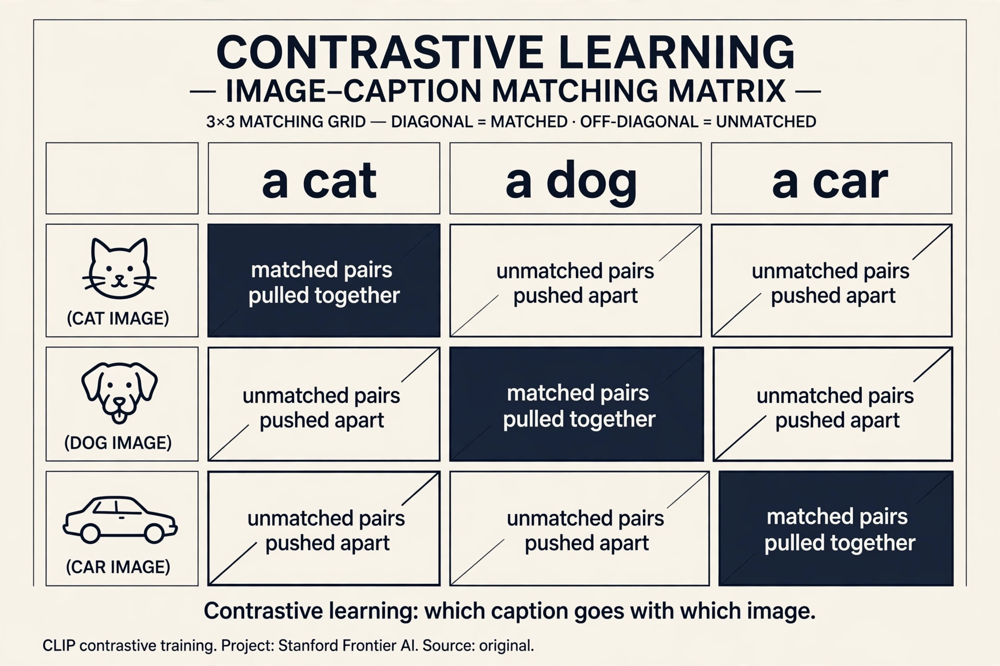
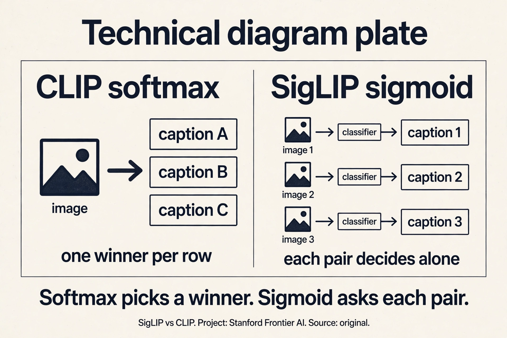
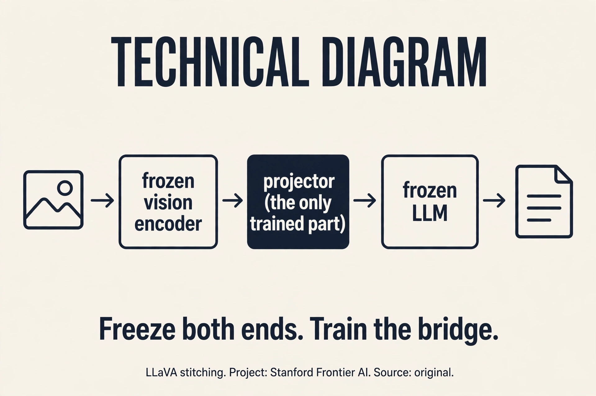
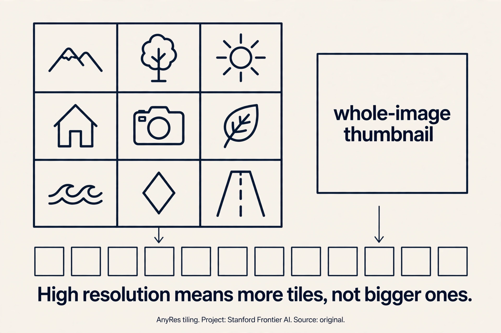

## The problem: the omni model

The North Star: any combination of modalities in, any combination
out. Image plus video in, answer plus generated image out
[01:05](ts:01:05). Transformers speak tokens, so the whole problem is
tokenization: what is the image equivalent of BPE? A pixel is not a
semantic unit, so the answer takes work [01:57](ts:01:57).

This lecture covers inputs. Generation gets its sketch at the end.

## First attempt: CLIP, contrastive learning

**CLIP** (2021) is the foundation of modern vision-language models.
Take N image-text pairs (N=32,000). Encode each side. The objective:
image I1 must be closer to its text T1 than to every other text, and
vice versa. That is 2N softmax classification problems
[05:53](ts:05:53).

Work the toy. N=4 pairs: (I1,T1) a dog photo with "a dog", (I2,T2) a
cat with "a cat", (I3,T3) a car with "a car", (I4,T4) a bird with "a
bird". The loss asks: is I1 closer to T1 than to T2, T3, T4? And is
T1 closer to I1 than to I2, I3, I4? Eight softmax problems. The
encoders learn: pull matched pairs together, push the rest apart.

The vision encoder that won: ViT-L/14, 14x14 patches with positional
embeddings through a standard transformer, attention pooling at the
end [12:41](ts:12:41). A **patch** is a 14x14 square of pixels treated
as one input token: the image's version of a subword. The text
encoder: GPT-2 style, EOS activation as the sequence vector
[16:24](ts:16:24). Data: 400M web image-text pairs, noisy by nature
(captions rarely describe the image literally) [08:24](ts:08:24).

Headline: zero-shot ImageNet beat a ResNet trained on 1.2M labeled
images [17:21](ts:17:21). No labels, just captions, and it classified
better than the supervised champion. Why text and not augmentation
(SimCLR)? Augmentation cannot turn one dog into another dog. Text
supplies high-level semantics [11:24](ts:11:24).

### Subchapter: work the contrastive matrix

The N=4 toy, drawn as a matrix. Rows: I1..I4. Columns: T1..T4.
The diagonal (I1,T1)...(I4,T4) is positive: pull together. The 12
off-diagonal cells are negative: push apart. The loss is 2N
softmax problems: each row picks its column, each column picks
its row. The gradient on I1: move toward T1, away from T2, T3,
T4, weighted by how wrong the current similarities are.

Now scale to N=32,768. Each row's softmax runs over 32,768
captions: 32,767 negatives per positive. That is the signal: the
model must make I1 closer to T1 than to 32,767 distractors. Shrink
the batch to 256: only 255 distractors, and the task gets easy:
the encoders learn lazy features. The batch is not a
hyperparameter. It is the objective. That is why CLIP cost 10 days
on 256 TPUv3: the physics of the loss demanded it.

> [!QA]
> Q: Walk me through CLIP training. What are the two encoders, and what does the loss actually compute?
> A: Two encoders: a ViT-L/14 vision encoder (14x14 patches as tokens, positional embeddings, standard transformer, attention pooling at the end) and a GPT-2-style text encoder (EOS activation as the sequence vector). Both project into one shared embedding space. The batch: N image-text pairs, N=32,768. The loss: for each image, a softmax over all N texts (is I1 closest to T1?). For each text, a softmax over all N images. 2N classification problems. The gradient pulls matched pairs together and pushes unmatched pairs apart. After training, zero-shot classification: encode the image, encode "a photo of a {class}" for each class, pick the closest. No labels were ever used: captions supplied the semantics. The compute: 10 days on 256 TPUv3, because the loss needs 32,767 negatives per positive to be hard.
> Follow-up: Why 14x14 patches and not pixels?
> A: Because pixels are not semantic units. A 224x224 image has 50,176 pixels: too many tokens, and no single pixel means anything. A 14x14 patch (196 pixels) is the image's subword: small enough to be local, large enough to carry texture. 256 patches per image: a sequence the transformer can handle. The text supplies the semantics via the contrastive loss: the patches learn to be useful for matching captions. Same architecture lesson as Lecture 1: tokenize into units that carry meaning, not into atoms.

## Where CLIP breaks: the loss is the batch

The softmax runs over all N pairs in the batch. Small batch: few
negatives, weak signal. The loss is the batch, so CLIP needs huge
batches: 32,768. Work the cost: 10 days on 256 TPUv3 [25:33](ts:25:33).
The batch size is not a hyperparameter here. It is the objective.

## The key question

What if the loss did not depend on the batch? What if each pair could
be judged on its own, positive or negative, without the softmax over
everyone else? Then small batches work, and the systems win compounds.

## SigLIP: binary loss, decoupled batches

**SigLIP** replaces the 2N-way softmax with binary classification:
diagonal pairs positive, off-diagonals negative, sigmoid loss
[23:37](ts:23:37). Work the toy again. N=4: 16 pair decisions, each
independent. (I1,T1): positive. (I1,T2): negative. No softmax, no
competition between negatives.

The loss is now the same in expectation at any batch size, so small
batches work (CLIP degrades) and 32K is the effective ceiling
[27:38](ts:27:38). Systems win: devices compute local losses and
rotate text embeddings to cover off-diagonal blocks, like DDP with
interactions [28:37](ts:28:37). Result: 5 days on 32 TPUv4 versus
CLIP's 10 days on 256 TPUv3 [25:33](ts:25:33).

### Subchapter: softmax vs sigmoid (the one-line difference)

CLIP's loss: for each row, softmax over N columns. The negatives
compete: making T2 worse helps T1 win, even if T1 is not actually
close. The loss couples every pair in the batch. SigLIP's loss:
each of the N^2 pairs gets its own binary decision. (I1,T1):
positive, push the sigmoid up. (I1,T2): negative, push it down.
No competition: T2 being terrible does not help T1.

The consequence is statistical, not just systems. CLIP's
expected loss changes with batch size: the objective itself
moves. SigLIP's expected loss is the same at any batch size:
each pair's decision is independent of the batch. Small batches
work. The ceiling at 32K: beyond that, more negatives add no
signal (the model already separates them). And the systems win
compounds: devices compute local losses and rotate embeddings,
no global softmax, 5 days on 32 TPUv4. One loss change, 16x
fewer TPU-days.

> [!QA]
> Q: When does SigLIP win over CLIP, and when would you still use CLIP's loss?
> A: SigLIP wins on compute and flexibility: small batches work, training is 16x cheaper in TPU-days, and the loss is batch-size independent. Use SigLIP whenever you are training a vision encoder from scratch or fine-tuning one. CLIP's softmax still has a niche: when the batch itself is the supervision (hard negatives mined within the batch matter) or when you are reproducing the exact CLIP recipe for compatibility (the open-weight ecosystem expects CLIP-style encoders). In practice the field moved: LLaVA OneVision uses SigLIP, Qwen3-VL uses SigLIP-2. The decision rule: default to SigLIP. Reach for CLIP's loss only for compatibility.
> Follow-up: Why is 32K the effective ceiling for SigLIP?
> A: Because beyond 32K negatives, the extra pairs add no learning signal. The model already separates easy negatives perfectly: their gradients are ~0. The remaining signal comes from hard negatives, and there are only so many in the data. More batch just replays decided pairs. This is a general contrastive-learning law: the batch is useful only while it contains undecided pairs. SigLIP hits the wall later than CLIP because its loss does not degrade at small batches, so you can afford to search for the informative regime instead of being forced into huge batches by the objective.

## LLaVA: stitch, not rebuild

The VLM template: take a vision encoder (CLIP), take an LLM (Vicuna),
stitch them with a projector, train in stages [28:58](ts:28:58).

Image through CLIP, through matrix W into text-embedding space,
concatenated with text tokens through the transformer. Training:
**stage 1** freezes everything and trains only W (alignment).
**Stage 2** freezes the vision encoder and trains W plus the LM
[33:24](ts:33:24). Data: 158k GPT-4-synthesized conversations from
COCO captions [31:07](ts:31:07).

### Subchapter: freeze both ends (why the projector is enough)

Stage 1 trains only W: a matrix (or 2-layer MLP) mapping CLIP's
embedding space into the LLM's token embedding space. Everything
else frozen. Why this works: the two frozen components already
contain everything. CLIP's encoding is a rich semantic summary
of the image. The LLM is a reasoning engine over token
embeddings. The only missing piece is translation: make the
image encoding look like token embeddings. That is a
low-dimensional mapping problem, not a learning problem: 158k
examples suffice.

Stage 2 unfreezes the LLM (not the vision encoder) and trains W
plus the LM on visual instruction data. The LLM learns to reason
over image tokens: to attend to them, to reference regions, to
answer questions. The vision encoder stays frozen because its
features are already good and retraining them on 158k examples
would corrupt them. The template's lesson: compose frozen experts,
train the interfaces. Qwen's later choice (unfreeze the encoder)
is the exception that proves the rule: you do it only when the
frozen features are the bottleneck (fine-grained OCR).

> [!QA]
> Q: Walk me through a LLaVA forward pass. Where do the image tokens come from?
> A: Step one: the image goes through the frozen CLIP vision encoder. A 336x336 image becomes 576 patch tokens (24x24 grid), each a CLIP embedding. Step two: the projector W maps each embedding into the LLM's token embedding space: now they are "image tokens," same dimensionality as text tokens. Step three: concatenate. The sequence is [image tokens][text tokens]: the transformer sees them as one sequence. Step four: the frozen (stage 1) or trained (stage 2) LLM processes the sequence and generates the answer. The image tokens are treated exactly like text tokens by the attention: the LLM attends to image regions the way it attends to words. That is the whole trick: translation at the input, then one transformer.
> Follow-up: Why 576 image tokens and not fewer?
> A: Because each patch is a token and the grid is 24x24. Fewer tokens would mean coarser patches and lost detail. The price is context: 576 tokens per image before the question is even asked. AnyRes multiplies this: 16 crops plus overview = 17x576 = 9,792 image tokens. High resolution is paid in context length. Qwen3-VL's merger compresses 2x2 patches into one token to cut this: the token budget is the binding constraint on resolution.

> [!QA]
> Q: Why not train the vision encoder and language model jointly from scratch?
> A: Because you would throw away two excellent pre-trained components. CLIP already knows image semantics. The LLM already knows language and reasoning. The stitching approach (projector plus staged training) reuses both and needs only 158k examples to get visual reasoning working. Joint training from scratch would need billions of image-text pairs and enormous compute to relearn what each side already knows. The tradeoff: the vision encoder stays frozen and classification-flavored (CLIP was built for ImageNet), so fine-grained abilities like OCR need extra machinery (AnyRes) or encoder fine-tuning (Qwen's later choice).
> Follow-up: What does the projector actually learn?
> A: A mapping from CLIP's embedding space into the LLM's token embedding space. After stage 1, an image encoding should "look like" a sequence of token embeddings to the transformer: same dimensionality, same rough distribution. It is alignment, not understanding: the understanding was already in CLIP and in the LLM. The projector just introduces them.

## Where stitching breaks: resolution

CLIP's 336x336 resize-and-crop cannot read documents. Work the
failure: a page of text at 336x336 is about 10 pixels per character.
Nothing is legible. The encoder was built for ImageNet, not OCR.

**AnyRes** splits the image into encoder-sized crops, encodes each,
and concatenates, plus one downsampled overview [37:36](ts:37:36).
Crop, do not downsample. A 1344x1344 document becomes 16 crops of
336x336 plus one overview: each crop is legible, the overview keeps
layout. Adaptive: big images get more crops, videos get fewer tokens
per frame (up to 32 frames) [40:09](ts:40:09).

### Subchapter: the token budget of resolution

Work the arithmetic. One 336x336 crop: 576 tokens. A 1344x1344
document: 16 crops plus 1 overview = 17 encodings. Image tokens:
17 x 576 = 9,792. Before the question is asked, before a single
word of answer, the context holds ~10k image tokens. A 32k-context
LLM spends a third of its budget on one document page.

The decision this forces: resolution is a token purchase. Every
doubling of image resolution quadruples the crops and the tokens.
Videos: 32 frames x tokens-per-frame. The field's answers:
AnyRes (adaptive crops: pay for the resolution you need), the
overview thumbnail (layout without detail, cheap), Qwen3-VL's
merger (2x2 patches into one token: halve the bill). The binding
constraint on VLM resolution was never the encoder: it is the
LLM's context window. Design the resolution budget first, then
the encoder.

> [!QA]
> Q: A 1344x1344 document costs 9,792 image tokens. Walk me through the alternatives.
> A: Option one: downsample to 336x336. Cost: 576 tokens. The document becomes illegible: 10 pixels per character. Option two: AnyRes. 16 crops at full resolution plus 1 overview: 9,792 tokens, every character legible, layout preserved by the overview. Option three: Qwen3-VL's merger. 2x2 patch merging: each crop's 576 tokens become 144. Total: 17 x 144 = 2,448 tokens. A quarter of the AnyRes bill, some detail lost in the merge. The choice is budget-driven: 32k context, one document, AnyRes fits. 32k context, ten documents, you need the merger. The rule: compute the token budget before choosing the resolution strategy. The encoder is never the bottleneck. The context window is.
> Follow-up: Why the overview thumbnail?
> A: Because crops lose layout. Sixteen independent crops are sixteen independent images: the model sees each region but not their arrangement. The downsampled overview is one more encoding of the whole page at low resolution: it carries the global structure (two columns, a figure on the right) while the crops carry the detail. The model cross-references: layout from the overview, text from the crops. Without it, the model reads words but loses the page. The overview is the cheapest token in the budget: 576 tokens for the structure of everything.

LLaVA OneVision (2024): SigLIP encoder, Qwen-2 decoder, 2-layer MLP
projector, three training stages [35:25](ts:35:25). The surprise:
cross-modal transfer. Single-image OCR data plus multi-image
relational data generalize to two-image table-plus-chart questions
and video visual prompting, neither seen in training
[43:30](ts:43:30).

## Qwen-VL: three generations of sharper pieces

**Qwen-VL**: OpenCLIP, cross-attention adapter to 256 tokens, three
stages with 1.4B examples in stage 1, bounding-box outputs
[46:06](ts:46:06). **Qwen2-VL**: dynamic resolution (11k tokens for a
big image, 8 for a tiny equation), 2x2 token compression, **M-RoPE**:
RoPE over height, width, and time concatenated [49:16](ts:49:16).
Position now has three axes: where in the image, when in the video.
**Qwen3-VL**: SigLIP-2, interleaved M-RoPE frequencies (every axis
sees high and low frequencies), explicit timestamp tokens,
sqrt-length normalized loss so video does not dominate, and
**DeepStack**: vision layers fused directly into the LM residual
stream [52:50](ts:52:50). Context to 256K for long video. Training
runs 8K to 32K to 256K.

> [!QA]
> Q: Walk me through the Qwen-VL generations. What did each generation fix?
> A: Generation one (Qwen-VL): the LLaVA template at scale. OpenCLIP encoder, cross-attention adapter compressing to 256 tokens, three training stages with 1.4B examples in stage 1, bounding-box outputs for grounding. It proved the template scales. Generation two (Qwen2-VL): dynamic resolution and positions. Fixed resolution wasted tokens on tiny images and starved big ones: dynamic resolution gives 11k tokens to a big image, 8 to a tiny equation. 2x2 token compression halves the bill. M-RoPE: RoPE over height, width, and time concatenated, so position has three axes: where in the image, when in the video. Generation three (Qwen3-VL): deeper fusion. SigLIP-2 encoder, interleaved M-RoPE frequencies (every axis sees high and low frequencies, fixing the frequency allocation), explicit timestamp tokens, sqrt-length normalized loss (so long videos do not dominate the loss), and DeepStack: vision layers fused directly into the LM residual stream instead of only at the input. Context to 256K for long video. Each generation moved the fusion deeper: from input concatenation (LLaVA) to cross-attention (Qwen-VL) to residual-stream fusion (DeepStack).
> Follow-up: Why does the loss need sqrt-length normalization for video?
> A: Because video is long. A 10-minute video has orders of magnitude more tokens than an image. Without normalization, the loss is dominated by video: the model optimizes for video and forgets images. Linear normalization (divide by length) would go too far: it would make each video token count for almost nothing. Sqrt-length is the compromise: long sequences are downweighted, but each token still matters. The general principle: the loss weights are part of the data mixture (Lecture 14). Unbalanced lengths are an unbalanced mixture, and the fix is the same arithmetic.

## Chameleon: the discrete alternative

The elegant alternative: make everything discrete tokens. **VQ-VAE**
maps a 512x512 image to 1,024 tokens from an 8,000-code codebook. Then
it is just language-model training, no adapter [67:18](ts:67:18).
Interleaved text and images, true omni-style generation.

The problems, demonstrated. Image tokens are high-entropy (which exact
blue?): parameter norms grow and training destabilizes. QK-norm and
z-loss mitigate [72:11](ts:72:11). Discretization loses fine detail,
so OCR suffers: the codebook has 8,000 entries for all possible
image patches, and small text falls between codes. Diffusion later
won generation. VQ-VAE faded [74:28](ts:74:28).

> [!QA]
> Q: You are building a VLM for document understanding (invoices, contracts, forms). Design it.
> A: Start from the token budget. A contract page at readable resolution: AnyRes with 16 crops plus overview, ~10k tokens per page. A 10-page contract: 100k tokens. You need 128k+ context: pick the LLM accordingly. Encoder: SigLIP-2 (the current default), fine-tuned or at least unfrozen in later stages: document text is fine-grained, and frozen CLIP features are classification-flavored. Positions: M-RoPE over height and width, so the model knows where on the page each token sits (forms are positional: the total is bottom-right). Training: stage 1 alignment on document image-text pairs, stage 2 visual instruction tuning on document QA (where is the total? what date?), stage 3 DPO on hard cases. Do not use Chameleon's discrete tokens: the codebook loses the small text you need. Do not downsample: 10 pixels per character is illegible. The decision rule: for documents, resolution is correctness. Buy it with context, compress with 2x2 merging, and never let the encoder be the bottleneck.
> Follow-up: When would you choose Chameleon's discrete approach instead?
> A: When generation matters more than understanding. Discrete tokens make the model a true omni-model: it can generate interleaved text and images in one token stream, no diffusion decoder needed. The price: discretization loses fine detail (OCR suffers), high-entropy image tokens destabilize training (QK-norm and z-loss mitigate), and diffusion won generation anyway. For a document-understanding product, none of the benefits apply and all of the costs do. For a creative tool that edits images with text instructions in one stream, the discrete design is at least worth testing. Match the architecture to the product's verb: read (continuous) vs make (discrete).

## Mapping back: what each idea fixes

| Pain | Fix | How |
|---|---|---|
| Pixels are not semantic units | CLIP patches | 14x14 patches as tokens. Text supplies semantics via contrastive loss. |
| Loss needs huge batches | SigLIP | Binary sigmoid loss. Decoupled batches. 5 days vs 10. |
| Two good components, no bridge | LLaVA stitching | Projector W, staged training. 158k examples. |
| 336x336 cannot read documents | AnyRes | Crop, not downsample. Overview plus detail crops. |
| One resolution, one position | Qwen generations | Dynamic resolution, M-RoPE over height/width/time, DeepStack fusion. |
| Adapters are inelegant | Chameleon | VQ-VAE discrete tokens. Elegant, unstable, detail-losing. |

## The honest price

Frontier models are natively multimodal, details undisclosed. The best
guess: continuous encoders for understanding (no information loss),
diffusion for generation (micro-optimized detail) [74:43](ts:74:43).
That picture is the lecturer's speculation, flagged as such. Compute
comparisons (TPUv3 vs v4) are not flops-normalized. Chameleon results
were not shown in lecture. Persistent challenges: no universal encoder
(classification wants semantics, OCR wants pixels), modality weighting
(video is low-density, do not let it drown text), and systems (video
loading alone can bottleneck training) [61:16](ts:61:16).

## Recap: the whole lesson on one screen

The story in eight steps. Each step answers the one before it.

1. **The omni goal.** Any modality in, any out. Transformers speak
   tokens. A pixel is not a semantic unit: tokenization takes work.
2. **CLIP contrasts.** 2N softmax problems on 400M pairs. ViT-L/14
   patches. Zero-shot ImageNet beats supervised ResNet. Text gives
   semantics.
3. **The loss is the batch.** CLIP needs 32K batches: 10 days on 256
   TPUv3. The batch size is the objective.
4. **SigLIP decouples.** Binary sigmoid loss, independent pair
   decisions. Small batches work. 5 days on 32 TPUv4.
5. **LLaVA stitches.** CLIP plus projector plus Vicuna. Align W,
   then fine-tune. 158k examples. The projector aligns spaces.
6. **AnyRes crops.** 336x336 cannot read documents. Crop, not
   downsample. Overview plus details. Modalities transfer.
7. **Qwen sharpens.** Dynamic resolution, M-RoPE over 3 axes,
   DeepStack fusion into the residual stream. 256K context.
8. **Chameleon discretizes.** VQ-VAE: elegant, unstable (entropy),
   detail-losing. Diffusion won generation. Continuous encode,
   diffusion generate.

## Go deeper

<iframe style="position:absolute;top:0;left:0;width:100%;height:100%;" src="https://www.youtube-nocookie.com/embed/7VJpZCTz168" title="Vision Language Models Explained" frameborder="0" allow="accelerometer; autoplay; clipboard-write; encrypted-media; gyroscope; picture-in-picture" allowfullscreen></iframe>

- Vision Language Models Explained (the embed above): https://www.youtube.com/watch?v=7VJpZCTz168
- Radford et al., CLIP: https://arxiv.org/abs/2103.00020
- Zhai et al., SigLIP: https://arxiv.org/abs/2303.15343
- Liu et al., LLaVA: https://arxiv.org/abs/2304.08485

## Official sources and further reading

**Official:**
- Lecture 17 video.
- CLIP, SigLIP, LLaVA, LLaVA-OneVision, Qwen-VL series, Chameleon
  papers.

**Further reading:**
- LAION-5B / OpenCLIP (open replication).
- VQ-VAE (Oord 2017). DeepStack adapter paper.
- AI2's VLM report (data details the lecture skipped).

**Caveats from these sources.** Frontier omni models are undisclosed.
The "continuous plus diffusion" picture is the lecturer's speculation,
flagged as such. Compute comparisons (TPUv3 vs v4) are not
flops-normalized. Chameleon results were not shown in lecture.

## Connections to the other courses

- **CS336 L01:** tokenization generalized beyond text.
- **CS336 L03:** RoPE generalized to M-RoPE.
- **CS224N:** vision-language models from the NLP side.
