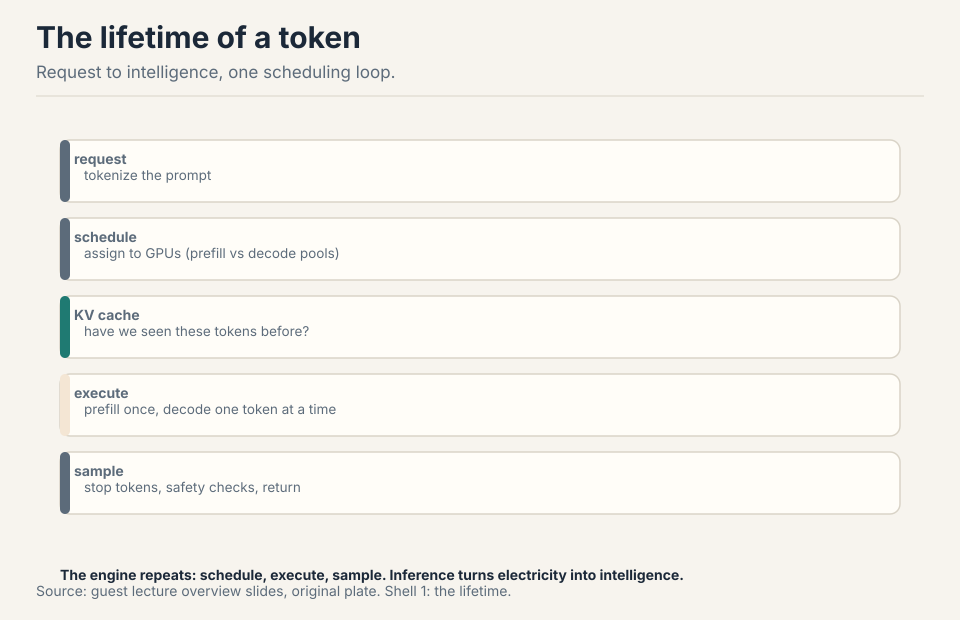
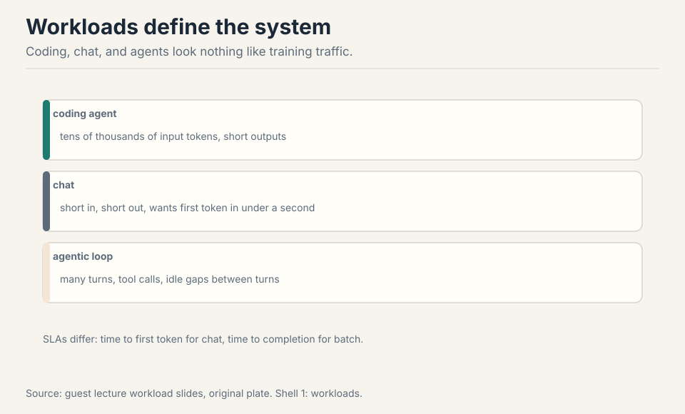
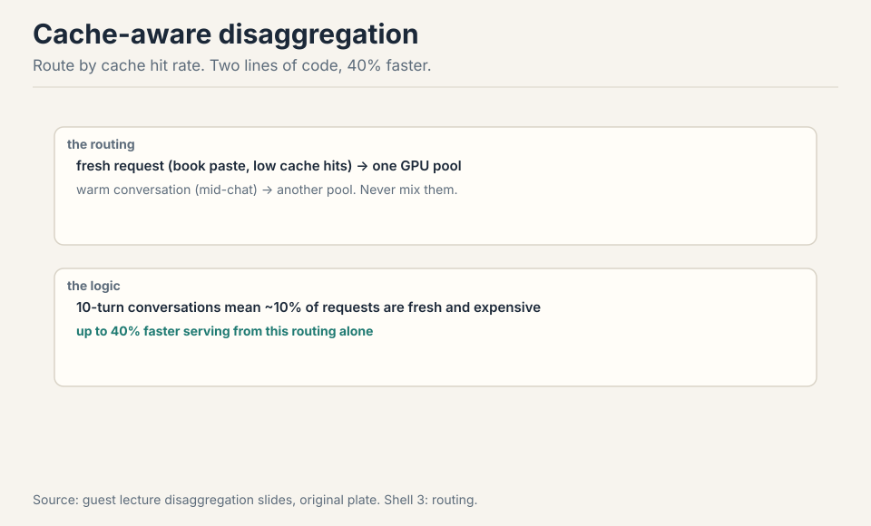
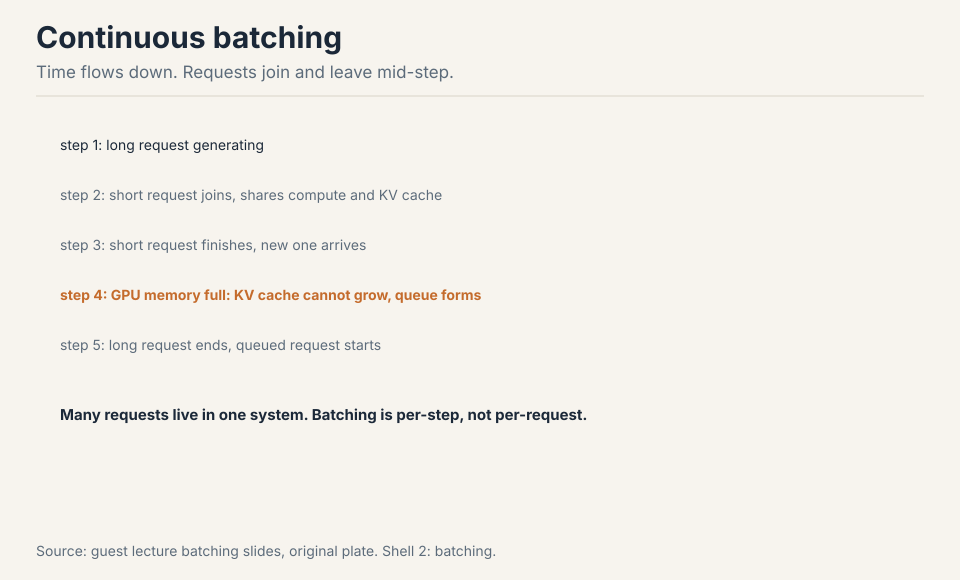
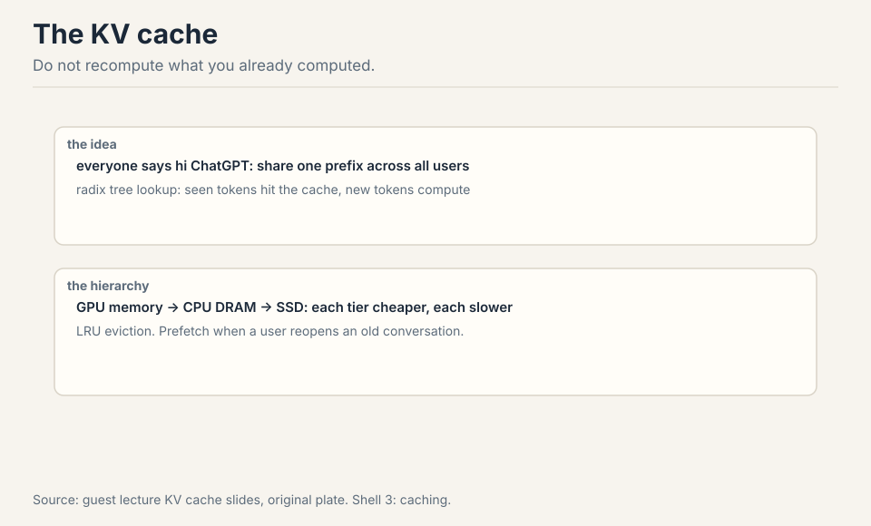
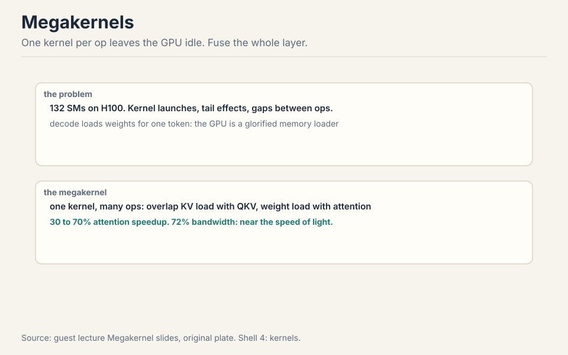
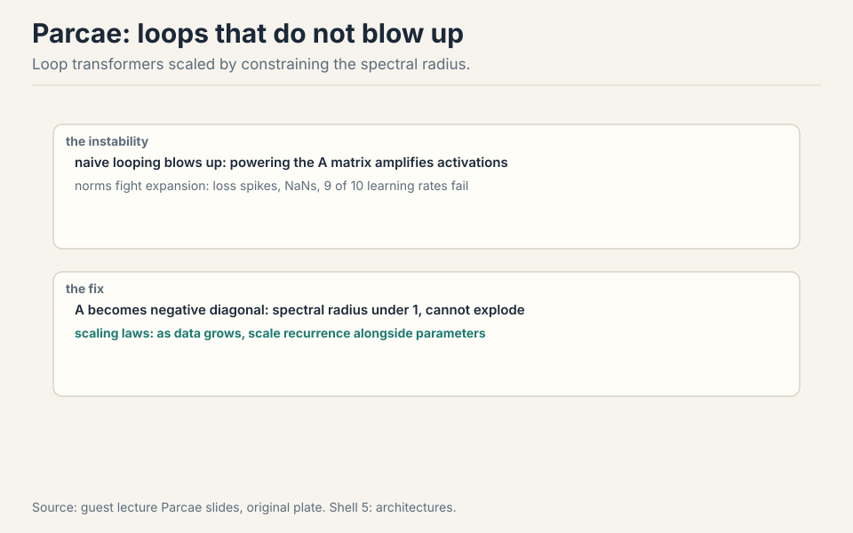

## The problem: the other side of the model

A guest lecture flips the course: from training models to serving
them. Inference is the engine that turns electricity into
intelligence, the way a car engine turns oil into motion
[05:09](ts:05:09). The whole inference stack in one loop: schedule
the request to GPUs, check the KV cache for seen tokens, execute the
model, sample a token, repeat [07:34](ts:07:34).

Know the kernels and you enable full-stack innovation: new routing,
new kernels, new architectures. This lecture is that stack, from the
token's lifetime to research that changes what the model is.

## First attempt: one stack for everything

Production traffic does not look like training traffic. Coding agents
send tens of thousands of input tokens and get short outputs
[10:24](ts:10:24). Chat wants the first token in under a second.
Agentic loops have many turns, tool calls, and idle gaps between
turns [11:21](ts:11:21). Batch jobs translate each document once.

The naive stack serves all of them the same way: static batches, one
fleet, first-in-first-out. The workload shape, and its SLA, decides
every systems choice. One stack cannot be optimal for all of them.

> [!QA]
> Q: Why would one inference stack not serve all workloads optimally?
> A: Because the workloads stress different bottlenecks. A coding agent needs huge KV caches kept hot across turns (memory capacity). A chat app needs low time-to-first-token (prefill latency). Batch translation needs throughput on first-token processing with almost no decode pressure. A stack tuned for one wastes the other's dominant resource. This is why the lecture ends on co-design: architectures like DeepSeek's MLA radically compress the KV cache precisely because agentic workflows are KV-cache bound, while BERT-era batch jobs could use cheap bidirectional encoders (the guest's example) since they barely decode at all.
> Follow-up: What is the single most important number for each workload?
> A: Interactive chat: time to first token (under a second keeps the user). Agents: KV cache capacity per session (hot cache across turns). Batch: tokens per second per dollar (throughput). The lecturer's rule: nobody ever asks to serve less traffic, subject to those SLAs.

## Where one stack breaks: prefill vs decode

Two operations, two bottlenecks. **Prefill**: 10,000 never-seen
tokens in, compute the activations and one logit out. Compute bound,
like training without the backward pass [14:24](ts:14:24).
**Decode**: generate one token at a time, reloading the whole model
for each one. Memory bandwidth bound, light on flops
[14:54](ts:14:54).

Work the decode waste. A 70B model in bf16: 140 GB of weights. One
decode step loads all 140 GB to produce one token: 140 GB of memory
traffic per token. At 3.3 TB/s, that is 42 ms per token before any
compute. The GPU is a glorified memory loader [34:27](ts:34:27).

Prefill takes longer per request. Decode runs far more steps (once
per generated token). One fleet cannot specialize for both: the
prefill fleet wants tensor-core-rich GPUs, the decode fleet wants
bandwidth-rich chips. Hardware follows the split: NVIDIA plans GPUs
for prefill and Groq-style LPU chips for decode. OpenAI partners with
Cerebras for the same reason [21:07](ts:21:07).

## The key question

Two bottlenecks, one fleet. What if prefill and decode ran on
different fleets, each specialized? That is disaggregation. And
inside decode, what if the gaps between kernels died? That is the
Megakernel. Two questions, two answers.

## Disaggregation: split the fleets

The standard move: disaggregate, run prefill on one fleet, decode on
another, specialize each stack [20:00](ts:20:00).

**Cache-aware disaggregation**: two lines of routing code, 40% faster
serving. Most requests are mid-conversation (warm). About 10% are
fresh (someone pasted a book). Never run the book-paste on the same
GPUs as the short chat: route low cache-hit-rate requests to one
prefill pool, warm requests to another [31:31](ts:31:31). Work the
win: the book-paste hogs the prefill GPUs for seconds while 90 chat
requests queue behind it. Separated, the chat pool's tail latency
collapses.

Scale bugs are the tax: 0.001%-probability kernel errors that NaN
logits into "hi hi hi" loops, off-by-one reads that emit random
Chinese characters, tool-call handlers that loop for tens of
thousands of tokens [21:54](ts:21:54). Early days: in ten years this
will look obvious.

## Continuous batching: fill the gaps

Static batches wait for the slowest request. **Continuous batching**:
requests join and leave mid-step. Decode one token per sequence per
step, evict finished sequences, admit new ones. KV memory is the hard
limit: queue when full.

Work the win. Four requests, lengths 10, 50, 100, 200. Static batch:
all four wait 200 steps. Continuous: the 10-token request leaves at
step 10, a new one joins at step 11. GPU utilization stays high
instead of trailing off with the stragglers.

## The KV cache: never recompute

Users repeat themselves. Every "hi ChatGPT" shares a prefix. Every
conversation turn repeats the book you pasted. Prefix sharing with a
**radix tree**: look up which tokens you have seen, compute only the
new ones [18:02](ts:18:02).

When the GPU fills, offload: GPU to CPU DRAM to SSD, each tier
cheaper and slower [25:43](ts:25:43). Evict with LRU, prefetch when a
user reopens an old conversation. Classic OS paging, rediscovered for
activations [27:51](ts:27:51).

## Megakernels: kill the gaps

One kernel per op leaves streaming multiprocessors idle: launch gaps,
tail effects, gaps between kernels add up. The **Megakernel** fuses
many ops into one kernel and schedules them like a distributed
system: start the KV load before QKV-plus-RoPE finishes, load the
O-projection weights before attention ends [37:32](ts:37:32).

Built with ThunderKittens, a lower-level Triton-like kernel library.
Payoff: 30 to 70% on attention inference, one full Llama-1B layer in
a single kernel, 72% of peak memory bandwidth on H100
[40:56](ts:40:56). The cost: one kernel engineer writes Megakernels
for one hardware, two or three models, batch sizes 1 to 16, per year.
Batch 17 means starting over [63:37](ts:63:37). The most extreme
version of the lecture-5 lesson: the fastest code is hand-fitted to
the exact shape.

## Parcae: flops without parameters

A different scaling question: is more parameters the only way?
**Parcae** loops transformer blocks, reusing parameters for more
flops. Naive looping blows up (the A matrix powers amplify
activations). The fix from state-space theory: make A a negative
diagonal matrix so the spectral radius stays under 1, and the system
cannot explode [50:50](ts:50:50).

Work the constraint. Loop a block 4 times with A = 1.2 on the
diagonal: activations grow by 1.2^4 = 2.07x per pass, compounding to
NaN. With A = -0.9 diagonal: magnitudes shrink by 0.9 per pass,
bounded forever, while the signs alternate and the network still
computes. The result: stable training where unconstrained loops NaN,
and better perplexity than the same-parameter transformer baseline
[53:31](ts:53:31).

The scaling law finding: as data grows, scale recurrence alongside
parameters. Today's models have zero recurrence and tons of data,
sitting at the far left of the curve, which suggests pre-training may
be under-looping [58:15](ts:58:15). Inference bonus: fewer parameters
means more KV cache and less cross-GPU communication
[62:03](ts:62:03).

## Co-design: one decision

Inference closes the loop back to architecture. Size your model to
the chip's memory (a Groq LPU holds ~250MB). Match quantization to
the hardware (NVFP4 on NVIDIA, MXFP4 on AMD) [64:47](ts:64:47).
Compress the KV cache if you serve agents (MLA). Skip the decoder if
you serve batch (BERT on search). The model's shape and the fleet's
shape are one decision.

| Serving target | Model choice |
|---|---|
| Groq LPU (~250MB) | size the model to fit with KV cache room |
| NVIDIA GPUs | train in NVFP4 |
| AMD | use MXFP4 |
| agentic workloads | compress the KV cache (MLA) |
| batch workloads | skip the decoder (BERT-style) |

## Mapping back: what each idea fixes

| Pain | Fix | How |
|---|---|---|
| One stack wastes someone's bottleneck | Workload-aware design | Coding: cache capacity. Chat: TTFT. Batch: tok/s/$. |
| Prefill and decode fight | Disaggregation | Two fleets, each specialized. Hardware follows. |
| Book-paste blocks chat | Cache-aware routing | Route by hit rate. Two lines, 40% faster. |
| Static batches trail stragglers | Continuous batching | Join and leave mid-step. KV memory is the limit. |
| Users repeat themselves | Radix prefix sharing | Compute only new tokens. Tiered offload, LRU. |
| Kernel gaps idle SMs | Megakernels | Fuse the layer, overlap loads. 72% of peak BW. |
| Parameters are the only dial | Parcae loops | Spectral radius under 1. Scale recurrence with data. |

## The honest price

The lecturer's slides were AI generated. He warned that fine details
may be wrong, and this lesson follows his spoken claims, not the
slide pixels. Scale figures (trillion-parameter open models, 5 to 10
trillion frontier) are his 2026 estimates, not measurements. The
Parcae Twitter story was a fabrication the poster retracted. The
Megakernel's price is human: one engineer, one hardware, a few models
a year. And the deepest price: serving optimizes a fixed model. The
co-design table is the real lesson. The fleet and the model are one
decision, made together or paid for separately.

## Recap: the whole lesson on one screen

The story in eight steps. Each step answers the one before it.

1. **The other side of the model.** Inference turns electricity into
   intelligence. The loop: schedule, KV lookup, execute, sample,
   repeat.
2. **Workloads differ.** Coding: long in. Chat: fast first token.
   Agents: turns and tools. Batch: throughput. Shape decides system.
3. **Prefill vs decode.** Prefill: compute-bound, once. Decode:
   memory-bound, one full model load per token. Split the fleets.
4. **Route by cache hit rate.** Fresh and warm never share GPUs. Two
   lines of routing, 40% faster serving.
5. **Batch continuously.** Requests join and leave mid-step. KV
   memory is the hard limit. Queue when full.
6. **Never recompute.** Radix-tree prefix sharing. GPU, CPU, SSD
   tiers. LRU eviction, prefetch. OS paging for activations.
7. **Megakernels kill gaps.** Fuse the layer, overlap everything.
   30-70% faster, 72% of peak bandwidth. One engineer per hardware
   per year.
8. **Parcae loops safely.** Spectral radius under 1. Flops without
   parameters. Scale recurrence with data. Co-design: model and
   fleet are one decision.

## Official sources and further reading

**Official:**
- Lecture 18 video (guest lecture, Dan Fu, UCSD / Together AI).
- Papers named in lecture: Megakernels/ThunderKittens (Stanford and
  Together), Parcae (UCSD).

**Further reading:**
- DeepSeek V3/V4 inference papers (fused MoE kernels, MLA).
- vLLM and TensorRT-LLM docs (continuous batching, disaggregation).

**Caveats from these sources.** The lecturer's slides were AI
generated. He warned that fine details may be wrong, and this lesson
follows his spoken claims, not the slide pixels. Scale figures
(trillion-parameter open models, 5 to 10 trillion frontier) are his
2026 estimates, not measurements. The Parcae Twitter story was a
fabrication the poster retracted.

## Connections to the other courses

- **CS336 L04:** flash attention and kernel writing meet Megakernels.
- **CS336 L09:** scaling laws extended to recurrence.
- **CS336 L16:** RL rollouts are decode-heavy inference workloads.
