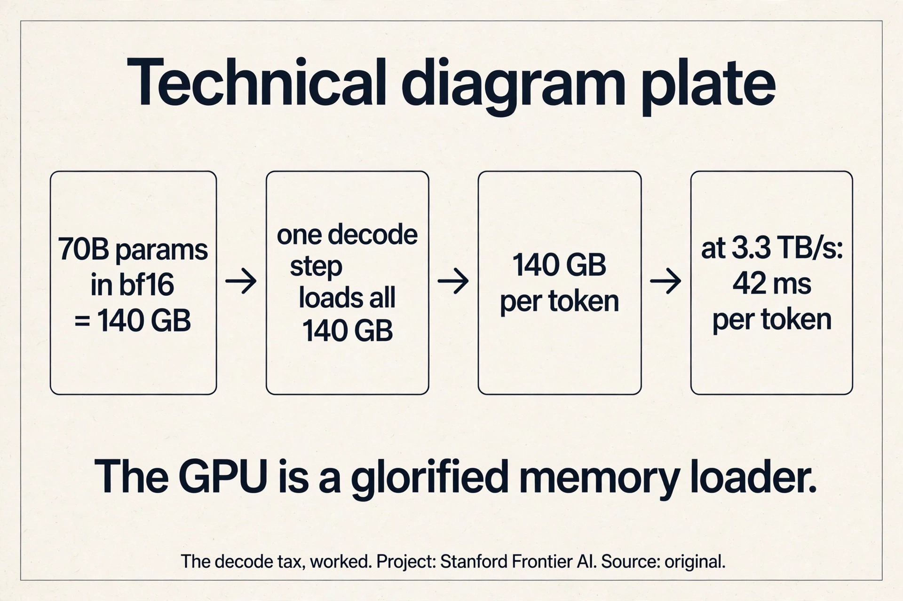
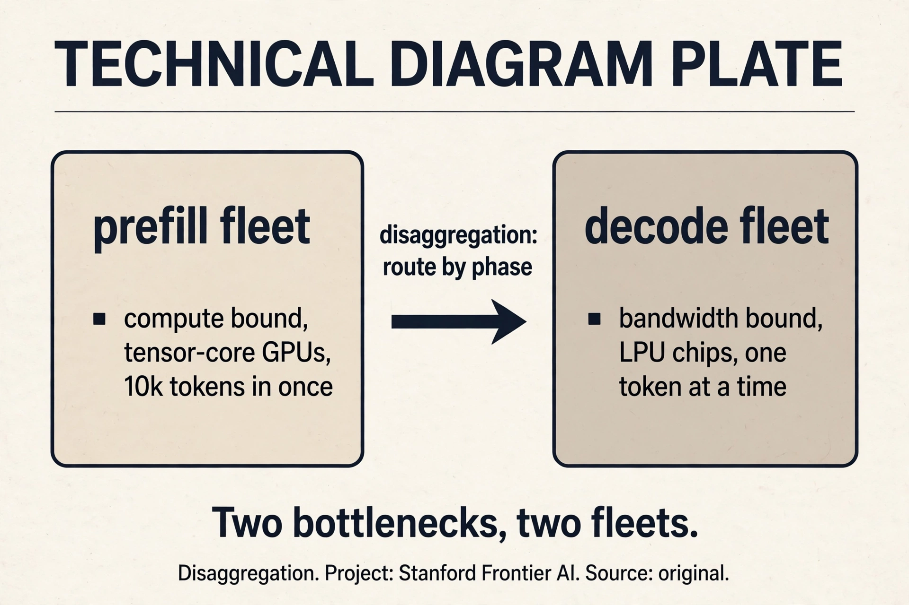
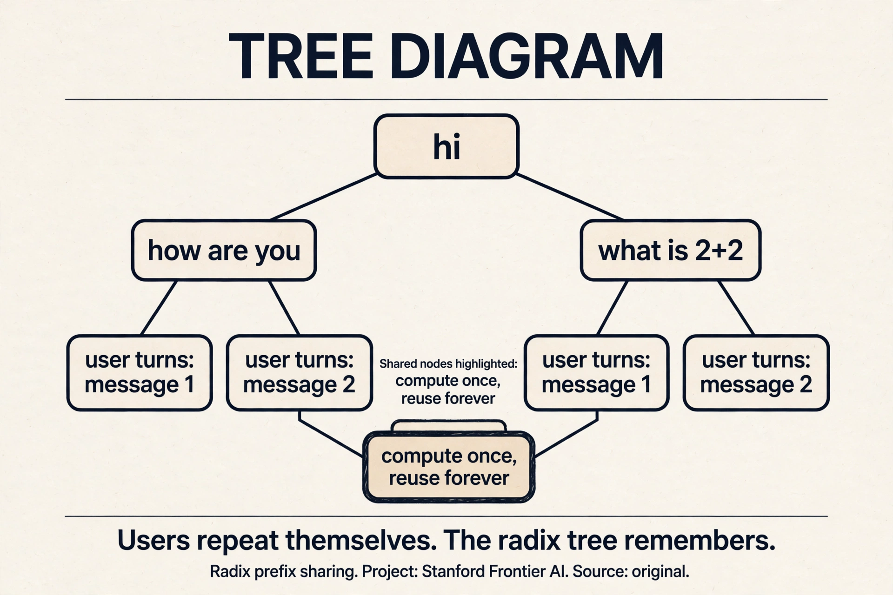
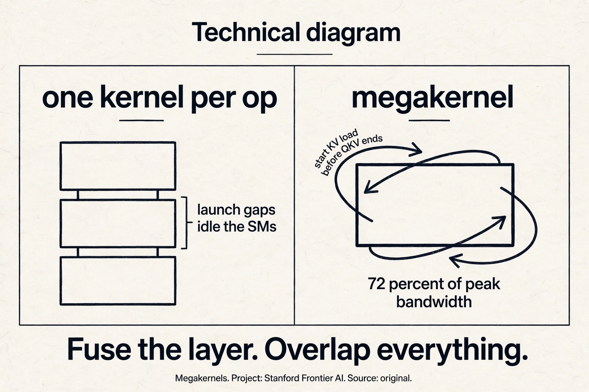

## The problem: the other side of the model

A guest lecture flips the course: from training models to serving
them. Inference is the engine that turns electricity into
intelligence, the way a car engine turns oil into motion
[05:09](ts:05:09). The whole inference stack in one loop: schedule
the request to GPUs, check the KV cache for seen tokens, execute the
model, sample a token, repeat [07:34](ts:07:34).

Know the kernels and you enable full-stack innovation: new routing,
new kernels, new architectures. This lecture is that stack, from the
token's lifetime to research that changes what the model is.

## First attempt: one stack for everything

Production traffic does not look like training traffic. Coding agents
send tens of thousands of input tokens and get short outputs
[10:24](ts:10:24). Chat wants the first token in under a second.
Agentic loops have many turns, tool calls, and idle gaps between
turns [11:21](ts:11:21). Batch jobs translate each document once.

The naive stack serves all of them the same way: static batches, one
fleet, first-in-first-out. The workload shape, and its SLA, decides
every systems choice. One stack cannot be optimal for all of them.

> [!QA]
> Q: Why would one inference stack not serve all workloads optimally?
> A: Because the workloads stress different bottlenecks. A coding agent needs huge KV caches kept hot across turns (memory capacity). A chat app needs low time-to-first-token (prefill latency). Batch translation needs throughput on first-token processing with almost no decode pressure. A stack tuned for one wastes the other's dominant resource. This is why the lecture ends on co-design: architectures like DeepSeek's MLA radically compress the KV cache precisely because agentic workflows are KV-cache bound, while BERT-era batch jobs could use cheap bidirectional encoders (the guest's example) since they barely decode at all.
> Follow-up: What is the single most important number for each workload?
> A: Interactive chat: time to first token (under a second keeps the user). Agents: KV cache capacity per session (hot cache across turns). Batch: tokens per second per dollar (throughput). The lecturer's rule: nobody ever asks to serve less traffic, subject to those SLAs.

## Where one stack breaks: prefill vs decode

Two operations, two bottlenecks. **Prefill**: 10,000 never-seen
tokens in, compute the activations and one logit out. Compute bound,
like training without the backward pass [14:24](ts:14:24).
**Decode**: generate one token at a time, reloading the whole model
for each one. Memory bandwidth bound, light on flops
[14:54](ts:14:54).

Work the decode waste. A 70B model in bf16: 140 GB of weights. One
decode step loads all 140 GB to produce one token: 140 GB of memory
traffic per token. At 3.3 TB/s, that is 42 ms per token before any
compute. The GPU is a glorified memory loader [34:27](ts:34:27).

### Subchapter: work the decode tax

The arithmetic, end to end. 70B parameters in bf16: 2 bytes each,
140 GB of weights. One decode step: load all 140 GB from HBM to
the SMs, do a few hundred GFLOPs of actual math, write one token's
logits. Memory traffic: 140 GB per token. H100 bandwidth: 3.3
TB/s. Time per token: 140/3300 = 42 ms. Tokens per second per GPU:
~24. The compute is nearly free: the matmuls are tiny (one token's
worth). The bill is all memory movement.

The consequence: decode throughput scales with bandwidth, not
flops. A GPU with 2x the flops and the same bandwidth decodes no
faster. This is why Groq's LPU exists: a chip that trades flops
for bandwidth and SRAM, purpose-built for the decode tax. And why
batching helps decode: one 140 GB load serves the whole batch's
tokens at once, amortizing the tax across requests. The decode
tax is also why KV cache compression (MLA) is a serving
innovation, not just an architecture one: smaller cache, more
requests per GPU, less bandwidth per token.

> [!QA]
> Q: Walk me through prefill vs decode. Why are they different bottlenecks?
> A: Prefill: 10,000 never-seen tokens in, one forward pass over all of them, activations and one logit out. The matmuls are huge (10k tokens x model dim): compute-bound, like training without the backward pass. One shot, then done. Decode: generate one token at a time. Each step loads the entire model (140 GB for 70B bf16) to produce one token: memory-bandwidth-bound, light on flops. 42 ms per token at 3.3 TB/s. Prefill takes longer per request (seconds for a book-paste). Decode runs far more steps (once per generated token). The systems conclusion: prefill wants tensor-core-rich GPUs, decode wants bandwidth-rich chips. One fleet cannot be optimal for both: disaggregation splits them, and hardware follows (NVIDIA for prefill, Groq-style LPUs for decode).
> Follow-up: Why does batching help decode more than prefill?
> A: Because decode's cost is per-step memory traffic, and batching amortizes it. One 140 GB load serves B requests' tokens at once: the per-token tax drops by ~B. Prefill is compute-bound: batching helps utilization but the flops are the flops. The limit for decode batching is KV cache memory: each request's cache grows with its length, and the GPU fills up. Continuous batching exists to keep the batch full as requests finish: admit new ones mid-step, evict the done. The batch is the amortization. The KV cache is the ceiling.

Prefill takes longer per request. Decode runs far more steps (once
per generated token). One fleet cannot specialize for both: the
prefill fleet wants tensor-core-rich GPUs, the decode fleet wants
bandwidth-rich chips. Hardware follows the split: NVIDIA plans GPUs
for prefill and Groq-style LPU chips for decode. OpenAI partners with
Cerebras for the same reason [21:07](ts:21:07).

## The key question

Two bottlenecks, one fleet. What if prefill and decode ran on
different fleets, each specialized? That is disaggregation. And
inside decode, what if the gaps between kernels died? That is the
Megakernel. Two questions, two answers.

## Disaggregation: split the fleets

The standard move: disaggregate, run prefill on one fleet, decode on
another, specialize each stack [20:00](ts:20:00).

**Cache-aware disaggregation**: two lines of routing code, 40% faster
serving. Most requests are mid-conversation (warm). About 10% are
fresh (someone pasted a book). Never run the book-paste on the same
GPUs as the short chat: route low cache-hit-rate requests to one
prefill pool, warm requests to another [31:31](ts:31:31). Work the
win: the book-paste hogs the prefill GPUs for seconds while 90 chat
requests queue behind it. Separated, the chat pool's tail latency
collapses.

Scale bugs are the tax: 0.001%-probability kernel errors that NaN
logits into "hi hi hi" loops, off-by-one reads that emit random
Chinese characters, tool-call handlers that loop for tens of
thousands of tokens [21:54](ts:21:54). Early days: in ten years this
will look obvious.

### Subchapter: cache-aware routing (the 40% win)

The two lines of routing, unpacked. Every incoming request gets a
cache-hit estimate: what fraction of its tokens are already in the
KV store? Mid-conversation turns: ~90%+ (the whole history is
cached). Fresh book-paste: ~0%. Route below-threshold to the
"cold" prefill pool, above to the "warm" pool.

The win, worked. One pool, mixed traffic: the book-paste takes 5
seconds of prefill while 90 chat requests queue behind it. P99
latency: 5+ seconds. Two pools: the book-paste still takes 5
seconds, but only in the cold pool. The warm pool serves 90 chats
with no queueing: P99 under a second. 40% faster serving overall,
from two lines of routing code. The principle: never let the
elephant block the mice. It is the same scheduling lesson as
operating systems (shortest-job-first), rediscovered for
transformers.

> [!QA]
> Q: When does disaggregation hurt?
> A: When the traffic is uniform. If every request is a short chat turn, the prefill/decode split buys nothing: prefill is trivial for everyone, and the routing overhead (moving KV cache between fleets over the network) is pure cost. Disaggregation also adds a network hop: the prefill fleet must ship the KV cache to the decode fleet. For small models or short contexts that transfer is cheap. For 70B with 128k context it is gigabytes per request. The decision rule: disaggregate when the workload mix is bimodal (book-pastes plus chats) or when the phases have clearly different hardware optima. One uniform workload, one fleet. The 40% win came from mixed traffic: it is not free.
> Follow-up: What is the KV cache transfer problem?
> A: After prefill computes the KV cache on the prefill fleet, the decode fleet needs it. Shipping gigabytes per request over the datacenter network: bandwidth, latency, and failure modes. The systems answers: keep the cache where it was computed (colocated disaggregation), compress it (MLA's whole point: smaller cache, cheaper transfer), or recompute it (skip the transfer, pay the flops). Each is a point on the same tradeoff. The disaggregation paper's contribution was showing the win survives the transfer cost: 40% net, not gross.

## Continuous batching: fill the gaps

Static batches wait for the slowest request. **Continuous batching**:
requests join and leave mid-step. Decode one token per sequence per
step, evict finished sequences, admit new ones. KV memory is the hard
limit: queue when full.

Work the win. Four requests, lengths 10, 50, 100, 200. Static batch:
all four wait 200 steps. Continuous: the 10-token request leaves at
step 10, a new one joins at step 11. GPU utilization stays high
instead of trailing off with the stragglers.

## The KV cache: never recompute

Users repeat themselves. Every "hi ChatGPT" shares a prefix. Every
conversation turn repeats the book you pasted. Prefix sharing with a
**radix tree**: look up which tokens you have seen, compute only the
new ones [18:02](ts:18:02).

When the GPU fills, offload: GPU to CPU DRAM to SSD, each tier
cheaper and slower [25:43](ts:25:43). Evict with LRU, prefetch when a
user reopens an old conversation. Classic OS paging, rediscovered for
activations [27:51](ts:27:51).

### Subchapter: the radix tree, worked

The data structure. A radix tree (prefix tree) over token
sequences. Each node: a token prefix, the KV cache for that
prefix. Insert: walk the tree, create nodes for new suffixes.
Lookup: walk as far as the tokens match. The matched prefix is
free: its KV cache already exists. Only the new suffix is
computed.

Work the sharing. User A pastes a 10k-token book, asks a question.
User B pastes the same book, asks a different question. Without
sharing: 20k tokens of prefill. With the radix tree: the book's
prefix matches, 10k cached, only the questions computed. The
system prompt (identical for every request) is the ultimate
shared prefix: every request after the first skips it. The tree
also dedupes within a conversation: each turn reuses all previous
turns' prefixes. The eviction policy (LRU) decides which prefixes
survive when memory fills: hot conversations stay, cold ones go
to CPU DRAM, then SSD.

> [!QA]
> Q: Walk me through tiered KV offload. When does each tier get used?
> A: Tier one: GPU HBM. Hot prefixes, active conversations. Fastest, smallest: a 70B model's KV cache for one long conversation can be gigabytes. Tier two: CPU DRAM. Warm prefixes: conversations idle for minutes. Slower (PCIe transfer), much larger. When the user sends the next message, prefetch the cache back to GPU: the transfer overlaps with the prefill of the new tokens. Tier three: SSD. Cold prefixes: conversations idle for hours or days. Cheapest, slowest. Reload on reopen. Eviction is LRU across tiers: the least recently used prefix drops from GPU to CPU, from CPU to SSD, from SSD to gone. The failure mode: thrashing. If the working set exceeds GPU memory, every request pays a PCIe transfer: the cache helps nothing. The fix is admission control: queue when full (continuous batching's rule) rather than thrash. Classic OS paging, and the same failure modes.
> Follow-up: Why is prefix sharing a bigger win for agents than for chat?
> A: Because agents repeat more. An agentic loop re-sends the entire trajectory every turn: tool definitions, previous actions, observations. A 20-turn agent run re-sends turn 1's tokens 20 times. Without prefix sharing, that is 20x prefill on the same tokens. With the radix tree, turns 2-20 reuse turn 1's cache: near-free. Chat repeats the system prompt and history: a smaller win. Batch translation repeats nothing: no win. The sharing win is proportional to the repetition, and agentic workloads are the most repetitive. This is also why MLA matters most for agents: the cache being shared is the cache being compressed.

## Megakernels: kill the gaps

One kernel per op leaves streaming multiprocessors idle: launch gaps,
tail effects, gaps between kernels add up. The **Megakernel** fuses
many ops into one kernel and schedules them like a distributed
system: start the KV load before QKV-plus-RoPE finishes, load the
O-projection weights before attention ends [37:32](ts:37:32).

Built with ThunderKittens, a lower-level Triton-like kernel library.
Payoff: 30 to 70% on attention inference, one full Llama-1B layer in
a single kernel, 72% of peak memory bandwidth on H100
[40:56](ts:40:56). The cost: one kernel engineer writes Megakernels
for one hardware, two or three models, batch sizes 1 to 16, per year.
Batch 17 means starting over [63:37](ts:63:37). The most extreme
version of the lecture-5 lesson: the fastest code is hand-fitted to
the exact shape.

### Subchapter: the megakernel's overlap schedule

The schedule, concretely. A standard transformer layer at decode:
QKV projection, RoPE, attention (load KV cache), O projection,
MLP. One kernel per op: each kernel launches, loads its weights,
computes, writes back, exits. Between kernels: launch latency,
SMs draining, tail effects. The gaps are pure waste: no flops,
no bytes, just idle silicon.

The megakernel fuses the whole layer into one kernel and
schedules the loads like a distributed system. While the SMs
compute QKV-plus-RoPE, the next wave of threads starts loading
the KV cache from HBM. While attention computes, the O-projection
weights are already in flight. The loads hide behind the
compute: the memory pipeline never stalls. Result: 72% of peak
HBM bandwidth on H100 (the theoretical ceiling for a
bandwidth-bound op), 30-70% faster attention inference, one
full Llama-1B layer in a single kernel.

The price is specificity. The schedule is hand-tuned for one
GPU architecture, one model shape, batch sizes 1-16. Batch 17:
the tile sizes, the overlap points, the register budget all
change. Start over. One engineer, one hardware, a few models a
year. The megakernel is the logical extreme of the course's
kernel lesson: the fastest code is fitted to the exact shape,
and the exact shape includes the batch size.

> [!QA]
> Q: Why does batch 17 mean starting over for a megakernel?
> A: Because the megakernel's schedule is a hand-tuned packing of work into the GPU's resources: tile sizes, register allocation, shared-memory budget, the exact points where loads overlap compute. All of these depend on the batch size. Batch 1-16: the schedule was tuned for each, one by one, by a kernel engineer. Batch 17: the shapes change (different tile counts, different occupancy), the overlap points move, the register budget breaks. There is no parametric formula: the tuning was manual. So batch 17 is a new tuning project. The general lesson: hand-fitted performance does not generalize. The megakernel buys 30-70% on exactly the shapes it was fitted for and nothing else. Production serving uses dynamic batching (continuous batching): the batch size changes every step. The megakernel's answer is to fit the common sizes and accept the rest. Extreme performance, extreme specificity: pick one.
> Follow-up: What is ThunderKittens and why not Triton?
> A: ThunderKittens is a lower-level kernel library (Stanford/Together) that exposes more hardware control than Triton: finer scheduling of loads, explicit overlap, register-level decisions. Triton abstracts the GPU into tiles and lets the compiler schedule: great for 90% of peak with 10% of the effort. The megakernel needs the last 10%: the exact overlap of KV loads with QKV compute, which requires controlling the schedule at a granularity Triton does not expose. The tradeoff is the course's eternal one: abstraction for productivity, hand-fitting for the last drop. One engineer-year per hardware per few models is the price of the last drop.

## Parcae: flops without parameters

A different scaling question: is more parameters the only way?
**Parcae** loops transformer blocks, reusing parameters for more
flops. Naive looping blows up (the A matrix powers amplify
activations). The fix from state-space theory: make A a negative
diagonal matrix so the spectral radius stays under 1, and the system
cannot explode [50:50](ts:50:50).

Work the constraint. Loop a block 4 times with A = 1.2 on the
diagonal: activations grow by 1.2^4 = 2.07x per pass, compounding to
NaN. With A = -0.9 diagonal: magnitudes shrink by 0.9 per pass,
bounded forever, while the signs alternate and the network still
computes. The result: stable training where unconstrained loops NaN,
and better perplexity than the same-parameter transformer baseline
[53:31](ts:53:31).

The scaling law finding: as data grows, scale recurrence alongside
parameters. Today's models have zero recurrence and tons of data,
sitting at the far left of the curve, which suggests pre-training may
be under-looping [58:15](ts:58:15). Inference bonus: fewer parameters
means more KV cache and less cross-GPU communication

> [!QA]
> Q: Walk me through Parcae's stability fix. Why does the spectral radius matter?
> A: Parcae loops transformer blocks: same parameters, more flops per token. The danger: looping amplifies. Each pass multiplies activations by the block's effective matrix A. If A's largest eigenvalue (the spectral radius) exceeds 1, activations grow geometrically: loop 4 times with radius 1.2, activations grow 1.2^4 = 2.07x per pass, compounding across layers to NaN. The fix from state-space theory: constrain A to a negative diagonal matrix with entries like -0.9. Spectral radius 0.9 < 1: magnitudes shrink 10% per pass, bounded forever. The negative sign alternates the activations (they do not collapse to zero: the network still computes, just with bounded energy). Result: stable training where naive loops NaN, and better perplexity than the same-parameter baseline. The scaling finding: as data grows, scale recurrence alongside parameters. Today's models sit at zero recurrence with tons of data: possibly under-looping. The inference bonus is free: fewer parameters means a smaller model to load (the decode tax drops) and less cross-GPU communication.
> Follow-up: When would you loop instead of adding parameters?
> A: When serving cost dominates. Looping adds flops without parameters: the model file stays small, the decode tax (140 GB per token for 70B) does not grow, but each token gets more compute. For a fixed serving budget, a looped small model can beat a big model on quality per dollar: same memory traffic, more thinking. The price: training stability needs the spectral constraint, and the flops still cost time (more compute per token, slower tokens). The decision rule: parameters are a memory tax, loops are a latency tax. Pick the tax your deployment can afford.
[62:03](ts:62:03).

## Co-design: one decision

> [!QA]
> Q: You are serving an agentic coding product (long contexts, tool calls, multi-turn trajectories). Design the stack.
> A: Start from the workload. Long contexts: 100k+ tokens of repo plus trajectory. Tool calls: bursty, repetitive prefixes (the tool definitions repeat every turn). Multi-turn: the trajectory re-sends every turn. The stack: one: prefix sharing with a radix tree. The tool definitions and trajectory prefixes are the win: cache them, never recompute. Two: MLA or GQA for the model: the KV cache is the binding constraint at 100k context, and compression multiplies the requests per GPU. Three: disaggregate prefill and decode. The repo-paste is the book-paste: route it to the cold pool, keep the chat pool warm. Cache-aware routing: 40% for free. Four: continuous batching with KV-aware admission: the cache fills fast at 100k context, queue rather than thrash. Five: speculative decoding for the decode phase: the agent's outputs are often predictable (boilerplate code), and the draft model is cheap. The decision rule: agents are the most repetitive workload in serving. Every technique that exploits repetition (prefix sharing, cache compression, speculation) pays double for agents. Design for repetition first, latency second.
> Follow-up: Where does the megakernel fit in this stack?
> A: Nowhere, initially. The megakernel is fitted to batch sizes 1-16 and one model shape: an agentic product has dynamic batching and long variable contexts. The megakernel's specificity fights the workload's variability. Use it only if one shape dominates (a fixed model, a fixed batch size, a latency SLA that nothing else meets) and you have a kernel engineer to spare. The general order: algorithmic wins first (prefix sharing, batching, speculation), then kernels. The 30-70% from the megakernel is real but last: it is the most expensive percent in the stack.

One decision connects the stack: the model architecture, the
parallelism, the batching, the cache policy, the hardware. Change
the model (MLA) and the cache math changes, the batching changes,
the hardware choice changes.

Inference closes the loop back to architecture. Size your model to
the chip's memory (a Groq LPU holds ~250MB). Match quantization to
the hardware (NVFP4 on NVIDIA, MXFP4 on AMD) [64:47](ts:64:47).
Compress the KV cache if you serve agents (MLA). Skip the decoder if
you serve batch (BERT on search). The model's shape and the fleet's
shape are one decision.

| Serving target | Model choice |
|---|---|
| Groq LPU (~250MB) | size the model to fit with KV cache room |
| NVIDIA GPUs | train in NVFP4 |
| AMD | use MXFP4 |
| agentic workloads | compress the KV cache (MLA) |
| batch workloads | skip the decoder (BERT-style) |

## Mapping back: what each idea fixes

| Pain | Fix | How |
|---|---|---|
| One stack wastes someone's bottleneck | Workload-aware design | Coding: cache capacity. Chat: TTFT. Batch: tok/s/$. |
| Prefill and decode fight | Disaggregation | Two fleets, each specialized. Hardware follows. |
| Book-paste blocks chat | Cache-aware routing | Route by hit rate. Two lines, 40% faster. |
| Static batches trail stragglers | Continuous batching | Join and leave mid-step. KV memory is the limit. |
| Users repeat themselves | Radix prefix sharing | Compute only new tokens. Tiered offload, LRU. |
| Kernel gaps idle SMs | Megakernels | Fuse the layer, overlap loads. 72% of peak BW. |
| Parameters are the only dial | Parcae loops | Spectral radius under 1. Scale recurrence with data. |

## The honest price

The lecturer's slides were AI generated. He warned that fine details
may be wrong, and this lesson follows his spoken claims, not the
slide pixels. Scale figures (trillion-parameter open models, 5 to 10
trillion frontier) are his 2026 estimates, not measurements. The
Parcae Twitter story was a fabrication the poster retracted. The
Megakernel's price is human: one engineer, one hardware, a few models
a year. And the deepest price: serving optimizes a fixed model. The
co-design table is the real lesson. The fleet and the model are one
decision, made together or paid for separately.

## Recap: the whole lesson on one screen

The story in eight steps. Each step answers the one before it.

1. **The other side of the model.** Inference turns electricity into
   intelligence. The loop: schedule, KV lookup, execute, sample,
   repeat.
2. **Workloads differ.** Coding: long in. Chat: fast first token.
   Agents: turns and tools. Batch: throughput. Shape decides system.
3. **Prefill vs decode.** Prefill: compute-bound, once. Decode:
   memory-bound, one full model load per token. Split the fleets.
4. **Route by cache hit rate.** Fresh and warm never share GPUs. Two
   lines of routing, 40% faster serving.
5. **Batch continuously.** Requests join and leave mid-step. KV
   memory is the hard limit. Queue when full.
6. **Never recompute.** Radix-tree prefix sharing. GPU, CPU, SSD
   tiers. LRU eviction, prefetch. OS paging for activations.
7. **Megakernels kill gaps.** Fuse the layer, overlap everything.
   30-70% faster, 72% of peak bandwidth. One engineer per hardware
   per year.
8. **Parcae loops safely.** Spectral radius under 1. Flops without
   parameters. Scale recurrence with data. Co-design: model and
   fleet are one decision.

## Go deeper

<iframe style="position:absolute;top:0;left:0;width:100%;height:100%;" src="https://www.youtube-nocookie.com/embed/fs_OP_AdOSA" title="Interlude: Continuous Batching and Paged Attention, Explained" frameborder="0" allow="accelerometer; autoplay; clipboard-write; encrypted-media; gyroscope; picture-in-picture" allowfullscreen></iframe>

- Continuous Batching and Paged Attention, Explained (the embed above): https://www.youtube.com/watch?v=fs_OP_AdOSA
- Kwon et al., PagedAttention: https://arxiv.org/abs/2305.13245
- vLLM documentation: https://docs.vllm.ai
- vLLM project: https://github.com/vllm-project/vllm

## Official sources and further reading

**Official:**
- Lecture 18 video (guest lecture, Dan Fu, UCSD / Together AI).
- Papers named in lecture: Megakernels/ThunderKittens (Stanford and
  Together), Parcae (UCSD).

**Further reading:**
- DeepSeek V3/V4 inference papers (fused MoE kernels, MLA).
- vLLM and TensorRT-LLM docs (continuous batching, disaggregation).

**Caveats from these sources.** The lecturer's slides were AI
generated. He warned that fine details may be wrong, and this lesson
follows his spoken claims, not the slide pixels. Scale figures
(trillion-parameter open models, 5 to 10 trillion frontier) are his
2026 estimates, not measurements. The Parcae Twitter story was a
fabrication the poster retracted.

## Connections to the other courses

- **CS336 L04:** flash attention and kernel writing meet Megakernels.
- **CS336 L09:** scaling laws extended to recurrence.
- **CS336 L16:** RL rollouts are decode-heavy inference workloads.
