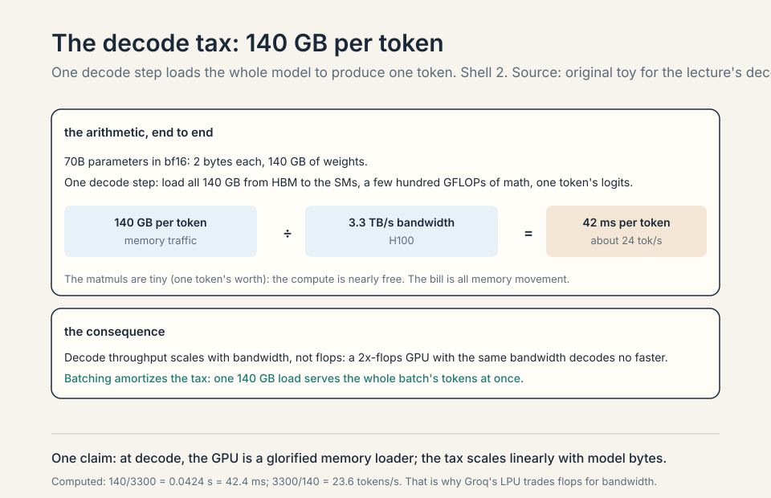
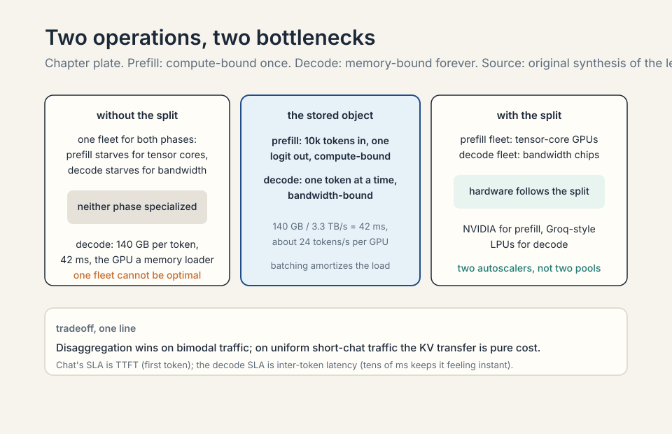
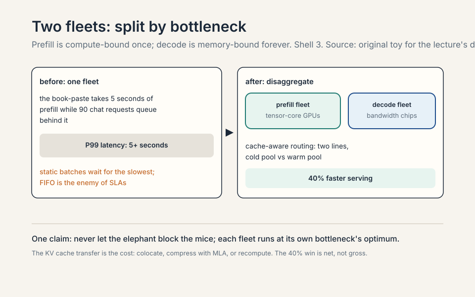
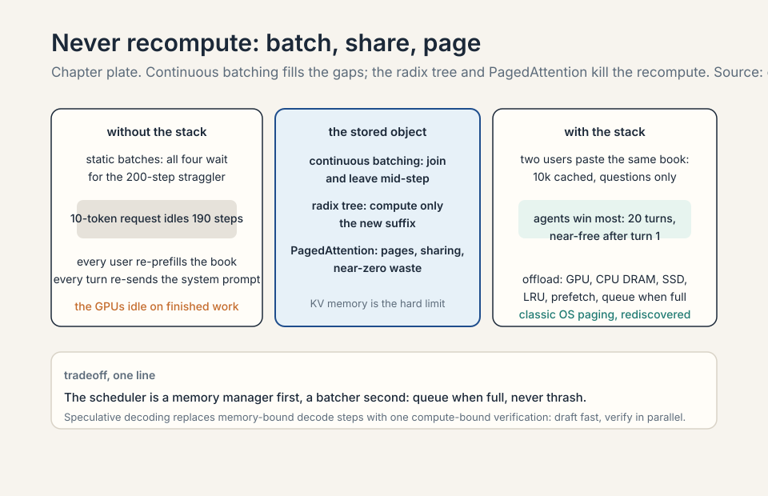
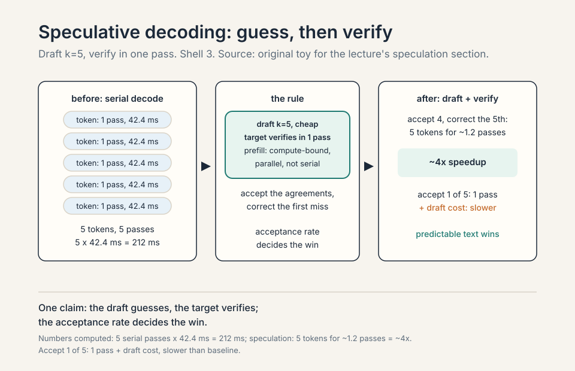
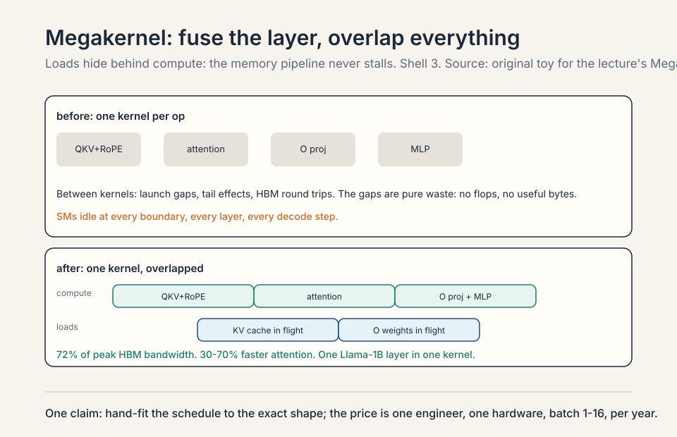
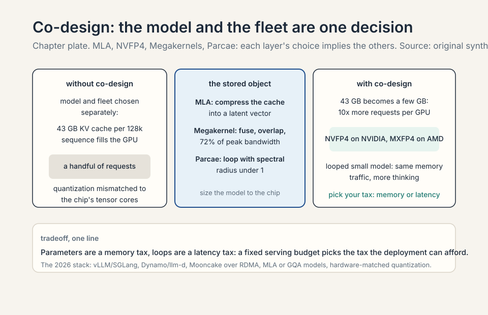

### Coverage and sourcing

This lesson follows Lecture 18 of CS336 (Spring 2026, guest
lecture by Dan Fu, UCSD / Together AI), "Serving Inference."
Claims are referenced with timestamps from the official subtitle
transcript. The lecturer warned his slides were AI-generated and
fine details may be wrong: this lesson follows his spoken claims,
not the slide pixels. Scale figures (trillion-parameter open
models, 5-10T frontier) are his 2026 estimates, flagged as such.
The serving-framework details (vLLM, SGLang, Dynamo, Mooncake,
llm-d) are verified as of October 2026. The coverage map at the
end maps every major lecture claim to its section.

## The problem: the other side of the model

A guest lecture flips the course: from training models to serving
them. Inference is the engine that turns electricity into
intelligence, the way a car engine turns oil into motion
[05:09](ts:05:09). The whole inference stack in one loop: schedule
the request to GPUs, check the KV cache for seen tokens, execute
the model, sample a token, repeat [07:34](ts:07:34).

### Subchapter: the engine metaphor, taken seriously

Inference is the engine that turns electricity into
intelligence, the way a car engine turns oil into motion. The
metaphor's point: training builds the engine, inference runs
it. The economics flip: training is a one-time cost, inference
is the ongoing cost. A model that costs $10M to train and
serves a billion queries costs more in inference than in
training. The serving stack decides the product's margin.
The lecture's flip: the course built models, now it serves
them, because serving is where the money goes.


### Subchapter: the token's lifetime, step by step

The whole inference stack in one loop. Step one: schedule.
The request arrives, the scheduler assigns it to GPUs
(which GPUs, what batch). Step two: KV cache lookup. Check
which tokens were already seen (the radix tree): compute
only the new ones. Step three: execute. Run the model
forward: prefill for new tokens, decode for generation.
Step four: sample. The logits become a token (greedy,
temperature, top-p). Step five: repeat. The new token joins
the context, the loop continues until the stop condition.
Every serving optimization lives in one of these steps:
scheduling (batching, disaggregation), caching (radix
tree, offload), execution (kernels, quantization),
sampling (speculative decoding).

Know the kernels and you enable full-stack innovation: new
routing, new kernels, new architectures. This lecture is that
stack, from the token's lifetime to research that changes what
the model is.

### Subchapter: full-stack innovation, defined

Know the kernels and you enable full-stack innovation. The
stack: routing (which request goes where), kernels (how the
math runs), architectures (what the model is). The
innovations cross layers: MLA (architecture) compresses the
KV cache (systems), which changes the batching (scheduling),
which changes the hardware choice (fleet). The lecture's
argument: the layers are one decision. Optimize one layer
and you suboptimize the stack. The course's kernel lessons
(Lectures 5-6) were preparation: the fastest serving comes
from co-designing the model and the machine.

## First attempt: one stack for everything

Production traffic does not look like training traffic. Coding
agents send tens of thousands of input tokens and get short
outputs [10:24](ts:10:24). Chat wants the first token in under
a second. Agentic loops have many turns, tool calls, and idle
gaps between turns [11:21](ts:11:21). Batch jobs translate each
document once.

### Subchapter: the four workloads

Coding agents: tens of thousands of input tokens (the repo),
short outputs (the patch). The binding constraint: KV cache
capacity (the repo must stay hot across turns). Chat: the
first token in under a second. The binding constraint:
prefill latency (time to first token). Agentic loops: many
turns, tool calls, idle gaps between turns. The binding
constraint: prefix sharing (the trajectory repeats every
turn) and cache warmth across idle gaps. Batch jobs: each
document translated once. The binding constraint:
throughput per dollar (no latency SLA, just tokens per
second per dollar).


The naive stack serves all of them the same way: static
batches, one fleet, first-in-first-out. The workload shape,
and its SLA, decides every systems choice. One stack cannot
be optimal for all of them.

### Subchapter: why the naive stack fails each workload

Static batches: wait for the slowest request. The coding
agent's 100k-token prefill holds up the chat's 10-token
turn. One fleet: the prefill GPUs and decode GPUs are the
same, so neither phase is specialized. First-in-first-out:
the book-paste queues ahead of the chat turn, and the chat
turn waits seconds. Each workload's SLA dies differently:
the agent's cache goes cold (evicted by the batch job's
throughput), the chat's first token misses its second, the
batch job's throughput collapses (the GPUs idle on decode).
The naive stack is fair and slow: FIFO is the enemy of
SLAs.

> [!QA]
> Q: Why would one inference stack not serve all workloads optimally?
> A: Because the workloads stress different bottlenecks. A
> coding agent needs huge KV caches kept hot across turns
> (memory capacity). A chat app needs low time-to-first-token
> (prefill latency). Batch translation needs throughput on
> first-token processing with almost no decode pressure. A
> stack tuned for one wastes the other's dominant resource.
> This is why the lecture ends on co-design: architectures
> like DeepSeek's MLA radically compress the KV cache
> precisely because agentic workflows are KV-cache bound,
> while BERT-era batch jobs could use cheap bidirectional
> encoders (the guest's example) since they barely decode at
> all.
> Follow-up: What is the single most important number for each workload?
> A: Interactive chat: time to first token (under a second
> keeps the user). Agents: KV cache capacity per session (hot
> cache across turns). Batch: tokens per second per dollar
> (throughput). The lecturer's rule: nobody ever asks to
> serve less traffic, subject to those SLAs.
> Follow-up: What is TTFT and what decides it?
> A: Time to first token: the latency from request arrival to
> the first generated token. It is decided by the prefill:
> the prompt's tokens must be processed before the first
> output token exists. Long prompts (100k tokens) mean long
> prefills (seconds). The mitigations: prefix caching (skip
> the cached prefix's prefill), disaggregation (dedicated
> prefill fleet, no queueing behind decodes), and smaller
> models (less compute per token). TTFT is the chat SLA: the
> user waits for the first token, then reads as the rest
> streams.

## Where one stack breaks: prefill vs decode

Two operations, two bottlenecks. **Prefill**: 10,000
never-seen tokens in, compute the activations and one logit
out. Compute bound, like training without the backward pass
[14:24](ts:14:24). **Decode**: generate one token at a time,
reloading the whole model for each one. Memory bandwidth
bound, light on flops [14:54](ts:14:54).

### Subchapter: prefill, mechanized

10,000 never-seen tokens in, one forward pass over all of
them, the activations and one logit out. The matmuls are
huge: 10k tokens times model dimension, the full
matrix-multiply machinery at work. Compute-bound: the GPUs'
tensor cores are the bottleneck, like training without the
backward pass. One shot per request: the prefill runs once,
then the decode takes over. The prefill's cost is per
request: longer prompts, longer prefills.


### Subchapter: decode, mechanized

Generate one token at a time. Each step: load the entire
model from HBM to the SMs, run the forward pass on one
token's worth of activations, write the logits. The matmuls
are tiny (one token): the compute is nearly free. The memory
traffic is the bill: the whole model, every step. Memory
bandwidth bound, light on flops. The decode runs once per
generated token: hundreds of steps per request. The
decode's cost is per token: longer outputs, more steps.

Work the decode waste. A 70B model in bf16: 140 GB of
weights. One decode step loads all 140 GB to produce one
token: 140 GB of memory traffic per token. At 3.3 TB/s,
that is 42 ms per token before any compute. The GPU is a
glorified memory loader [34:27](ts:34:27).

### Subchapter: work the decode tax

The arithmetic, end to end. 70B parameters in bf16: 2 bytes
each, 140 GB of weights. One decode step: load all 140 GB
from HBM to the SMs, do a few hundred GFLOPs of actual math,
write one token's logits. Memory traffic: 140 GB per token.
H100 bandwidth: 3.3 TB/s. Time per token: 140/3300 = 42 ms.
Tokens per second per GPU: ~24. The compute is nearly free:
the matmuls are tiny (one token's worth). The bill is all
memory movement.

The consequence: decode throughput scales with bandwidth,
not flops. A GPU with 2x the flops and the same bandwidth
decodes no faster. This is why Groq's LPU exists: a chip
that trades flops for bandwidth and SRAM, purpose-built for
the decode tax. And why batching helps decode: one 140 GB
load serves the whole batch's tokens at once, amortizing the
tax across requests. The decode tax is also why KV cache
compression (MLA) is a serving innovation, not just an
architecture one: smaller cache, more requests per GPU, less
bandwidth per token.



> [!QA]
> Q: Walk me through prefill vs decode. Why are they different bottlenecks?
> A: Prefill: 10,000 never-seen tokens in, one forward pass
> over all of them, activations and one logit out. The
> matmuls are huge (10k tokens x model dim): compute-bound,
> like training without the backward pass. One shot, then
> done. Decode: generate one token at a time. Each step loads
> the entire model (140 GB for 70B bf16) to produce one
> token: memory-bandwidth-bound, light on flops. 42 ms per
> token at 3.3 TB/s. Prefill takes longer per request
> (seconds for a book-paste). Decode runs far more steps
> (once per generated token). The systems conclusion: prefill
> wants tensor-core-rich GPUs, decode wants bandwidth-rich
> chips. One fleet cannot be optimal for both: disaggregation
> splits them, and hardware follows (NVIDIA for prefill,
> Groq-style LPUs for decode).
> Follow-up: Why does batching help decode more than prefill?
> A: Because decode's cost is per-step memory traffic, and
> batching amortizes it. One 140 GB load serves B requests'
> tokens at once: the per-token tax drops by ~B. Prefill is
> compute-bound: batching helps utilization but the flops are
> the flops. The limit for decode batching is KV cache
> memory: each request's cache grows with its length, and the
> GPU fills up. Continuous batching exists to keep the batch
> full as requests finish: admit new ones mid-step, evict the
> done. The batch is the amortization. The KV cache is the
> ceiling.
> Follow-up: Why does the decode tax get worse with model size?
> A: Linearly. The tax is the model size in bytes: 140 GB for
> 70B, 280 GB for 140B (hypothetical), 14 GB for 7B. Each
> decode step loads the whole model. Bigger model: more
> bytes per token, fewer tokens per second. The bandwidth is
> fixed per GPU. The ratio (model bytes / bandwidth) is the
> tokens-per-second ceiling. This is why serving favors
> smaller models and MoE (fewer active bytes per token):
> the decode tax is the serving cost, and it scales with the
> bytes you load.

Prefill takes longer per request. Decode runs far more steps
(once per generated token). One fleet cannot specialize for
both: the prefill fleet wants tensor-core-rich GPUs, the
decode fleet wants bandwidth-rich chips. Hardware follows the
split: NVIDIA plans GPUs for prefill and Groq-style LPU chips
for decode. OpenAI partners with Cerebras for the same reason
[21:07](ts:21:07).

### Subchapter: the hardware split

NVIDIA plans GPUs for prefill (tensor cores, compute-bound)
and Groq-style LPU chips for decode (bandwidth, SRAM,
memory-bound). OpenAI partners with Cerebras for the same
reason: the wafer-scale chip's bandwidth serves the decode
tax. The hardware follows the workload: the chip is designed
for the bottleneck. The lecture's prediction: the fleet
splits by phase, and the chips split with it. The co-design
table (below) is the decision version of this split.



## The key question

Two bottlenecks, one fleet. What if prefill and decode ran on
different fleets, each specialized? That is disaggregation. And
inside decode, what if the gaps between kernels died? That is the
Megakernel. Two questions, two answers.

### Subchapter: two questions, two layers

Disaggregation is the fleet layer: split the machines by
phase. The Megakernel is the kernel layer: fuse the ops
within a phase. The questions are independent: you can
disaggregate without megakernels, and megakernels help
whether or not you disaggregate. The lecture's order:
fleet first (bigger win, systems), kernels second (deeper
win, engineering). The stack's layers compose: disaggregate
the fleet, batch continuously, share the prefixes, fuse the
kernels. Each layer's win multiplies.

## Disaggregation: split the fleets

The standard move: disaggregate, run prefill on one fleet,
decode on another, specialize each stack [20:00](ts:20:00).


### Subchapter: the standard move, mechanized

Prefill fleet: compute-rich GPUs, large batches of prompts,
no decode traffic. Decode fleet: bandwidth-rich chips,
large batches of active sequences, no prefill bursts. The
KV cache moves between them: prefill computes it, decode
consumes it. The transfer is the cost: gigabytes per
request over the datacenter network. The win: each fleet
runs at its bottleneck's optimum. The standard move is
standard because the phases' optima differ: one fleet
cannot serve both.

**Cache-aware disaggregation**: two lines of routing code,
40% faster serving. Most requests are mid-conversation
(warm). About 10% are fresh (someone pasted a book). Never
run the book-paste on the same GPUs as the short chat: route
low cache-hit-rate requests to one prefill pool, warm
requests to another [31:31](ts:31:31). Work the win: the
book-paste hogs the prefill GPUs for seconds while 90 chat
requests queue behind it. Separated, the chat pool's tail
latency collapses.

### Subchapter: cache-aware routing (the 40% win)

The two lines of routing, unpacked. Every incoming request
gets a cache-hit estimate: what fraction of its tokens are
already in the KV store? Mid-conversation turns: ~90%+ (the
whole history is cached). Fresh book-paste: ~0%. Route
below-threshold to the "cold" prefill pool, above to the
"warm" pool.

The win, worked. One pool, mixed traffic: the book-paste
takes 5 seconds of prefill while 90 chat requests queue
behind it. P99 latency: 5+ seconds. Two pools: the
book-paste still takes 5 seconds, but only in the cold
pool. The warm pool serves 90 chats with no queueing: P99
under a second. 40% faster serving overall, from two lines
of routing code. The principle: never let the elephant
block the mice. It is the same scheduling lesson as
operating systems (shortest-job-first), rediscovered for
transformers.

### Subchapter: the KV cache transfer problem

After prefill computes the KV cache on the prefill fleet,
the decode fleet needs it. Shipping gigabytes per request
over the datacenter network: bandwidth, latency, and
failure modes. The systems answers: keep the cache where
it was computed (colocated disaggregation), compress it
(MLA's whole point: smaller cache, cheaper transfer), or
recompute it (skip the transfer, pay the flops). Each is a
point on the same tradeoff. The disaggregation paper's
contribution was showing the win survives the transfer
cost: 40% net, not gross.

### Subchapter: the 2026 disaggregation stack, verified

As of October 2026: vLLM ships disagg_prefill (experimental)
plus KV connectors (Mooncake) for RDMA transfer. SGLang
integrates with NVIDIA Dynamo (the disaggregated serving
framework) via bootstrap handshake and RDMA KV transfer.
Mooncake (Moonshot AI's Kimi serving platform, now in the
PyTorch ecosystem) is the transfer engine: RDMA-based KV
movement, integrated into vLLM v1 and TensorRT-LLM.
llm-d (Kubernetes-native) treats disaggregation as the
production architecture. DistServe (2024) is the paper.
The lecture's "standard move" became the industry's
standard stack.

Scale bugs are the tax: 0.001%-probability kernel errors
that NaN logits into "hi hi hi" loops, off-by-one reads that
emit random Chinese characters, tool-call handlers that loop
for tens of thousands of tokens [21:54](ts:21:54). Early
days: in ten years this will look obvious.

### Subchapter: scale bugs, the tax

0.001%-probability kernel errors: at a billion tokens a day,
0.001% is 10,000 corruptions. The NaN logits: a kernel bug
produces NaN, the sampler loops "hi hi hi" (NaN breaks the
sampling into repetition). The off-by-one read: a memory
bug reads the wrong token IDs, emitting random Chinese
characters (the wrong IDs decode to CJK). The tool-call
loop: a handler bug retries for tens of thousands of
tokens. Scale turns rare bugs into constant failures. The
tax: the serving stack needs the reliability engineering
the training stack never did. Early days: in ten years
this will look obvious.



> [!QA]
> Q: When does disaggregation hurt?
> A: When the traffic is uniform. If every request is a short
> chat turn, the prefill/decode split buys nothing: prefill
> is trivial for everyone, and the routing overhead (moving
> KV cache between fleets over the network) is pure cost.
> Disaggregation also adds a network hop: the prefill fleet
> must ship the KV cache to the decode fleet. For small
> models or short contexts that transfer is cheap. For 70B
> with 128k context it is gigabytes per request. The
> decision rule: disaggregate when the workload mix is
> bimodal (book-pastes plus chats) or when the phases have
> clearly different hardware optima. One uniform workload,
> one fleet. The 40% win came from mixed traffic: it is not
> free.
> Follow-up: What is the KV cache transfer problem?
> A: After prefill computes the KV cache on the prefill
> fleet, the decode fleet needs it. Shipping gigabytes per
> request over the datacenter network: bandwidth, latency,
> and failure modes. The systems answers: keep the cache
> where it was computed (colocated disaggregation), compress
> it (MLA's whole point: smaller cache, cheaper transfer),
> or recompute it (skip the transfer, pay the flops). Each
> is a point on the same tradeoff. The disaggregation paper's
> contribution was showing the win survives the transfer
> cost: 40% net, not gross.
> Follow-up: What does the 2026 stack look like in practice?
> A: vLLM or SGLang as the engine, Dynamo or llm-d as the
> orchestrator, Mooncake as the transfer engine. The prefill
> workers and decode workers are separate deployments: the
> prefill deployment scales with prompt traffic, the decode
> deployment scales with active sequences. The KV cache
> moves over RDMA (Mooncake's transfer engine). The
> scheduler is cache-aware: the two lines of routing from
> the lecture, now in the orchestrator. The stack is the
> lecture's "standard move" productized.

## Continuous batching: fill the gaps

Static batches wait for the slowest request. **Continuous
batching**: requests join and leave mid-step. Decode one token
per sequence per step, evict finished sequences, admit new
ones. KV memory is the hard limit: queue when full.

### Subchapter: static versus continuous, worked

Four requests, lengths 10, 50, 100, 200. Static batch: all
four wait 200 steps. The 10-token request finishes at step
10 and idles for 190 steps: its GPU slot is wasted.
Continuous: the 10-token request leaves at step 10, a new
one joins at step 11. The batch stays full. GPU utilization
stays high instead of trailing off with the stragglers.
The win is utilization: the GPUs never idle on finished
requests.


### Subchapter: the KV memory ceiling

KV memory is the hard limit: queue when full. Each active
sequence holds its KV cache on the GPU. The cache grows
with sequence length. The GPU fills: no more admissions.
The scheduler queues: new requests wait. The alternative
(thrashing: admit everyone, offload constantly) is worse:
every request pays PCIe transfers. The rule: admission
control, not thrashing. The queue is the backpressure.
Continuous batching's scheduler is a memory manager first,
a batcher second.

Work the win. Four requests, lengths 10, 50, 100, 200.
Static batch: all four wait 200 steps. Continuous: the
10-token request leaves at step 10, a new one joins at step
11. GPU utilization stays high instead of trailing off with
the stragglers.

## The KV cache: never recompute

Users repeat themselves. Every "hi ChatGPT" shares a prefix.
Every conversation turn repeats the book you pasted. Prefix
sharing with a **radix tree**: look up which tokens you have
seen, compute only the new ones [18:02](ts:18:02).

### Subchapter: the radix tree, worked

The data structure. A radix tree (prefix tree) over token
sequences. Each node: a token prefix, the KV cache for that
prefix. Insert: walk the tree, create nodes for new
suffixes. Lookup: walk as far as the tokens match. The
matched prefix is free: its KV cache already exists. Only
the new suffix is computed.

Work the sharing. User A pastes a 10k-token book, asks a
question. User B pastes the same book, asks a different
question. Without sharing: 20k tokens of prefill. With the
radix tree: the book's prefix matches, 10k cached, only the
questions computed. The system prompt (identical for every
request) is the ultimate shared prefix: every request after
the first skips it. The tree also dedupes within a
conversation: each turn reuses all previous turns'
prefixes. The eviction policy (LRU) decides which prefixes
survive when memory fills: hot conversations stay, cold
ones go to CPU DRAM, then SSD.


### Subchapter: PagedAttention, the memory manager

PagedAttention (vLLM, 2023): the KV cache lives in fixed-size
pages (blocks), like virtual memory. Non-contiguous pages:
the cache need not be one slab. Sharing: two sequences with
a common prefix share the pages (copy-on-write for the
divergence). Near-zero waste: no pre-allocation for the
maximum length. The lecture's radix tree is the sharing
policy. PagedAttention is the allocator that makes it
practical. vLLM's contribution: the OS lesson (paging)
applied to activations.

When the GPU fills, offload: GPU to CPU DRAM to SSD, each
tier cheaper and slower [25:43](ts:25:43). Evict with LRU,
prefetch when a user reopens an old conversation. Classic OS
paging, rediscovered for activations [27:51](ts:27:51).

### Subchapter: tiered offload, the three tiers

Tier one: GPU HBM. Hot prefixes, active conversations.
Fastest, smallest: a 70B model's KV cache for one long
conversation can be gigabytes. Tier two: CPU DRAM. Warm
prefixes: conversations idle for minutes. Slower (PCIe
transfer), much larger. When the user sends the next
message, prefetch the cache back to GPU: the transfer
overlaps with the prefill of the new tokens. Tier three:
SSD. Cold prefixes: conversations idle for hours or days.
Cheapest, slowest. Reload on reopen. Eviction is LRU across
tiers: the least recently used prefix drops from GPU to CPU,
from CPU to SSD, from SSD to gone. The failure mode:
thrashing. If the working set exceeds GPU memory, every
request pays a PCIe transfer: the cache helps nothing. The
fix is admission control: queue when full (continuous
batching's rule) rather than thrash. Classic OS paging, and
the same failure modes.

<figure markdown="1">
```ascii
root
+- "You are a helpful assistant"   [system prompt: cached]
|  +- book (10k tokens)            [cached]
|     +- user A: "summarize?"      [compute]
|     +- user B: "who wrote it?"   [compute]
+- user C: new prompt              [compute]
rule: walk as far as tokens match; the matched prefix is free
```

<figcaption>Shared prefixes computed once: the tree remembers what users repeat. Source: original toy for the lecture's radix-tree section.</figcaption>
</figure>

> [!QA]
> Q: Walk me through tiered KV offload. When does each tier get used?
> A: Tier one: GPU HBM. Hot prefixes, active conversations.
> Fastest, smallest: a 70B model's KV cache for one long
> conversation can be gigabytes. Tier two: CPU DRAM. Warm
> prefixes: conversations idle for minutes. Slower (PCIe
> transfer), much larger. When the user sends the next
> message, prefetch the cache back to GPU: the transfer
> overlaps with the prefill of the new tokens. Tier three:
> SSD. Cold prefixes: conversations idle for hours or days.
> Cheapest, slowest. Reload on reopen. Eviction is LRU across
> tiers: the least recently used prefix drops from GPU to
> CPU, from CPU to SSD, from SSD to gone. The failure mode:
> thrashing. If the working set exceeds GPU memory, every
> request pays a PCIe transfer: the cache helps nothing. The
> fix is admission control: queue when full (continuous
> batching's rule) rather than thrash. Classic OS paging, and
> the same failure modes.
> Follow-up: Why is prefix sharing a bigger win for agents than for chat?
> A: Because agents repeat more. An agentic loop re-sends the
> entire trajectory every turn: tool definitions, previous
> actions, observations. A 20-turn agent run re-sends turn
> 1's tokens 20 times. Without prefix sharing, that is 20x
> prefill on the same tokens. With the radix tree, turns 2-20
> reuse turn 1's cache: near-free. Chat repeats the system
> prompt and history: a smaller win. Batch translation
> repeats nothing: no win. The sharing win is proportional
> to the repetition, and agentic workloads are the most
> repetitive. This is also why MLA matters most for agents:
> the cache being shared is the cache being compressed.
> Follow-up: What is the KV cache size for a 70B model at 128k context?
> A: Roughly: 2 (K and V) x layers (80) x heads x head-dim x
> 128k tokens x 2 bytes. For Llama-3-70B-ish shapes (8 KV
> heads with GQA, head-dim 128): 2 x 80 x 8 x 128 x 131072 x
> 2 bytes = ~43 GB per sequence. Without GQA (full heads):
> ~8x that. The number is why MLA and GQA are serving
> innovations: the cache is tens of gigabytes per long
> conversation. The GPU holds a handful. Everything in this
> section (sharing, offload, compression) exists because of
> this arithmetic.



## Speculative decoding: guess, then verify

The lecture's stack has one more standard trick, named in
the course's orbit: speculative decoding. A small draft
model generates k tokens fast. The big model verifies them
in one forward pass (prefill over the k tokens: compute-bound,
cheap). Accept the tokens the big model agrees with, keep
the first disagreement's correction. The win: the big model's
decode steps (memory-bound, 42 ms each) are replaced by one
verification pass. The draft is cheap, the verification is
parallel. The acceptance rate decides the win: predictable
text (boilerplate code) accepts most tokens, surprising text
accepts few. For agentic coding (the lecture's workload),
the outputs are often predictable: speculation pays.

### Subchapter: the acceptance arithmetic

Draft k=5 tokens. Big model verifies in one pass. Accept 4,
correct the 5th: 5 tokens for ~1.2 big-model passes (the
verification plus the correction). Without speculation: 5
passes. The speedup: ~4x on the accepted tokens. Accept 1:
1 token for 1 pass, plus the draft cost: slower than
baseline. The breakeven: the acceptance rate must exceed the
draft overhead. The rule: speculation wins when the text is
predictable. Code, boilerplate, structured outputs: yes.
Creative writing, surprising answers: no.



## Megakernels: kill the gaps

One kernel per op leaves streaming multiprocessors idle:
launch gaps, tail effects, gaps between kernels add up. The
**Megakernel** fuses many ops into one kernel and schedules
them like a distributed system: start the KV load before
QKV-plus-RoPE finishes, load the O-projection weights before
attention ends [37:32](ts:37:32).

### Subchapter: the gaps, itemized

Launch gaps: each kernel launch costs microseconds of CPU-GPU
coordination. Hundreds of kernels per decode step: the
microseconds add up. Tail effects: the last wave of thread
blocks underfills the SMs: the GPU idles at partial
occupancy. Gaps between kernels: kernel A writes to HBM,
kernel B reads it back. The round trip is pure waste: no
flops, no useful bytes, just idle silicon. One kernel per
op pays all three gaps, every layer, every decode step.


Built with ThunderKittens, a lower-level Triton-like kernel
library. Payoff: 30 to 70% on attention inference, one full
Llama-1B layer in a single kernel, 72% of peak memory
bandwidth on H100 [40:56](ts:40:56). The cost: one kernel
engineer writes Megakernels for one hardware, two or three
models, batch sizes 1 to 16, per year. Batch 17 means
starting over [63:37](ts:63:37). The most extreme version of
the lecture-5 lesson: the fastest code is hand-fitted to the
exact shape.

### Subchapter: the megakernel's overlap schedule

The schedule, concretely. A standard transformer layer at
decode: QKV projection, RoPE, attention (load KV cache), O
projection, MLP. One kernel per op: each kernel launches,
loads its weights, computes, writes back, exits. Between
kernels: launch latency, SMs draining, tail effects. The
gaps are pure waste: no flops, no bytes, just idle silicon.

The megakernel fuses the whole layer into one kernel and
schedules the loads like a distributed system. While the SMs
compute QKV-plus-RoPE, the next wave of threads starts
loading the KV cache from HBM. While attention computes, the
O-projection weights are already in flight. The loads hide
behind the compute: the memory pipeline never stalls.
Result: 72% of peak HBM bandwidth on H100 (the theoretical
ceiling for a bandwidth-bound op), 30-70% faster attention
inference, one full Llama-1B layer in a single kernel.

### Subchapter: ThunderKittens versus Triton

ThunderKittens is a lower-level kernel library
(Stanford/Together) that exposes more hardware control than
Triton: finer scheduling of loads, explicit overlap,
register-level decisions. Triton abstracts the GPU into
tiles and lets the compiler schedule: great for 90% of peak
with 10% of the effort. The megakernel needs the last 10%:
the exact overlap of KV loads with QKV compute, which
requires controlling the schedule at a granularity Triton
does not expose. The tradeoff is the course's eternal one:
abstraction for productivity, hand-fitting for the last
drop. One engineer-year per hardware per few models is the
price of the last drop.

The price is specificity. The schedule is hand-tuned for one
GPU architecture, one model shape, batch sizes 1-16. Batch
17: the tile sizes, the overlap points, the register budget
all change. Start over. One engineer, one hardware, a few
models a year. The megakernel is the logical extreme of the
course's kernel lesson: the fastest code is fitted to the
exact shape, and the exact shape includes the batch size.



> [!QA]
> Q: Why does batch 17 mean starting over for a megakernel?
> A: Because the megakernel's schedule is a hand-tuned packing
> of work into the GPU's resources: tile sizes, register
> allocation, shared-memory budget, the exact points where
> loads overlap compute. All of these depend on the batch
> size. Batch 1-16: the schedule was tuned for each, one by
> one, by a kernel engineer. Batch 17: the shapes change
> (different tile counts, different occupancy), the overlap
> points move, the register budget breaks. There is no
> parametric formula: the tuning was manual. So batch 17 is a
> new tuning project. The general lesson: hand-fitted
> performance does not generalize. The megakernel buys 30-70%
> on exactly the shapes it was fitted for and nothing else.
> Production serving uses dynamic batching (continuous
> batching): the batch size changes every step. The
> megakernel's answer is to fit the common sizes and accept
> the rest. Extreme performance, extreme specificity: pick
> one.
> Follow-up: What is ThunderKittens and why not Triton?
> A: ThunderKittens is a lower-level kernel library
> (Stanford/Together) that exposes more hardware control than
> Triton: finer scheduling of loads, explicit overlap,
> register-level decisions. Triton abstracts the GPU into
> tiles and lets the compiler schedule: great for 90% of
> peak with 10% of the effort. The megakernel needs the last
> 10%: the exact overlap of KV loads with QKV compute, which
> requires controlling the schedule at a granularity Triton
> does not expose. The tradeoff is the course's eternal one:
> abstraction for productivity, hand-fitting for the last
> drop. One engineer-year per hardware per few models is the
> price of the last drop.
> Follow-up: When is the megakernel worth it?
> A: When one shape dominates and the SLA is tight. A fixed
> model, a fixed batch size, a latency target nothing else
> meets: the megakernel's 30-70% is the difference between
> shipping and not. The price: a kernel engineer per
> hardware, and the shapes cannot change. For dynamic
> workloads (agentic products, variable contexts), the
> specificity fights the variability: algorithmic wins
> (batching, caching, speculation) come first. The
> megakernel is the last 30%: the most expensive percent in
> the stack. Buy it last.

## Parcae: flops without parameters

A different scaling question: is more parameters the only way?
**Parcae** loops transformer blocks, reusing parameters for
more flops. Naive looping blows up (the A matrix powers
amplify activations). The fix from state-space theory: make A
a negative diagonal matrix so the spectral radius stays under
1, and the system cannot explode [50:50](ts:50:50).


### Subchapter: the looping idea, from zero

More flops per token usually means more parameters: bigger
model, more compute. Parcae asks: what if the same
parameters did more work? Loop a transformer block 4 times:
the tokens pass through the same weights 4 times, 4x the
flops, 0 new parameters. The model thinks longer without
getting bigger. The serving win: the model file stays small
(the decode tax does not grow), but each token gets more
compute. The training question: does looping blow up?

Work the constraint. Loop a block 4 times with A = 1.2 on the
diagonal: activations grow by 1.2^4 = 2.07x per pass,
compounding to NaN. With A = -0.9 diagonal: magnitudes shrink
by 0.9 per pass, bounded forever, while the signs alternate
and the network still computes. The result: stable training
where unconstrained loops NaN, and better perplexity than the
same-parameter transformer baseline [53:31](ts:53:31).

### Subchapter: the spectral radius, defined

The **spectral radius** of a matrix is its largest
eigenvalue's magnitude. Loop the matrix: each pass
multiplies by A. If the spectral radius exceeds 1, the
activations grow geometrically: 1.2^4 = 2.07x per pass,
compounding across layers to NaN. If it stays under 1, the
activations shrink geometrically: bounded forever. The fix
from state-space theory: constrain A to a negative diagonal
matrix (entries like -0.9). Spectral radius 0.9 < 1:
magnitudes shrink 10% per pass. The negative sign alternates
the activations: they do not collapse to zero, the network
still computes, just with bounded energy. The constraint is
the stability proof.

The scaling law finding: as data grows, scale recurrence
alongside parameters. Today's models have zero recurrence
and tons of data, sitting at the far left of the curve, which
suggests pre-training may be under-looping [58:15](ts:58:15).
Inference bonus: fewer parameters means more KV cache and
less cross-GPU communication [62:03](ts:62:03).

### Subchapter: the under-looping claim

The scaling finding: as data grows, the optimal recurrence
grows too. Today's models: zero recurrence, tons of data.
The far left of the curve. The suggestion: pre-training may
be under-looping. The mechanism: recurrence is a flops
dial independent of parameters. At fixed parameters, more
data wants more flops per token (the model should think
harder about each token). The field's dial was parameters
only. Parcae adds the second dial. The claim is a scaling
law, not a product: the research direction, not the
deployment.

### Subchapter: the inference bonus

Fewer parameters means more KV cache and less cross-GPU
communication. The decode tax is the model bytes: fewer
parameters, smaller tax. The KV cache: a smaller model leaves
more HBM for the cache: more requests per GPU. The
communication: fewer parameters to shard across GPUs: less
all-reduce. Looping adds flops (latency per token) without
adding bytes (memory per token). The tradeoff: parameters
are a memory tax, loops are a latency tax. Pick the tax
your deployment can afford.

> [!QA]
> Q: Walk me through Parcae's stability fix. Why does the spectral radius matter?
> A: Parcae loops transformer blocks: same parameters, more
> flops per token. The danger: looping amplifies. Each pass
> multiplies activations by the block's effective matrix A.
> If A's largest eigenvalue (the spectral radius) exceeds 1,
> activations grow geometrically: loop 4 times with radius
> 1.2, activations grow 1.2^4 = 2.07x per pass, compounding
> across layers to NaN. The fix from state-space theory:
> constrain A to a negative diagonal matrix with entries
> like -0.9. Spectral radius 0.9 < 1: magnitudes shrink 10%
> per pass, bounded forever. The negative sign alternates
> the activations (they do not collapse to zero: the network
> still computes, just with bounded energy). Result: stable
> training where naive loops NaN, and better perplexity than
> the same-parameter baseline. The scaling finding: as data
> grows, scale recurrence alongside parameters. Today's
> models sit at zero recurrence with tons of data: possibly
> under-looping. The inference bonus is free: fewer
> parameters means a smaller model to load (the decode tax
> drops) and less cross-GPU communication.
> Follow-up: When would you loop instead of adding parameters?
> A: When serving cost dominates. Looping adds flops without
> parameters: the model file stays small, the decode tax (140
> GB per token for 70B) does not grow, but each token gets
> more compute. For a fixed serving budget, a looped small
> model can beat a big model on quality per dollar: same
> memory traffic, more thinking. The price: training
> stability needs the spectral constraint, and the flops
> still cost time (more compute per token, slower tokens).
> The decision rule: parameters are a memory tax, loops are a
> latency tax. Pick the tax your deployment can afford.
> Follow-up: What is the relationship between Parcae and state-space models?
> A: The stability fix comes from state-space theory: the
> same mathematics that keeps SSMs (Mamba class) stable under
> recurrence. The negative-diagonal A with spectral radius
> under 1 is the SSM's stability condition, applied to looped
> transformer blocks. Parcae is the transformer borrowing the
> SSM's stability: the architectures converge on the same
> math. The lecture's placement (after the SSM-heavy early
> course) is deliberate: the stability theory transfers.

## Co-design: one decision

One decision connects the stack: the model architecture, the
parallelism, the batching, the cache policy, the hardware.
Change the model (MLA) and the cache math changes, the
batching changes, the hardware choice changes.

### Subchapter: MLA, the cache compressor

DeepSeek's MLA (multi-head latent attention): compress the KV
cache into a latent vector, decompress per head at attention
time. The cache shrinks by an order of magnitude: the 43 GB
per 128k sequence becomes a few GB. The batching changes:
10x more requests per GPU. The hardware choice changes: the
decode fleet needs less HBM per request. MLA is the
lecture's co-design example: an architecture change (the
attention) that is really a serving change (the cache).
The model and the fleet are one decision.

Inference closes the loop back to architecture. Size your
model to the chip's memory (a Groq LPU holds ~250MB). Match
quantization to the hardware (NVFP4 on NVIDIA, MXFP4 on AMD)
[64:47](ts:64:47). Compress the KV cache if you serve agents
(MLA). Skip the decoder if you serve batch (BERT on search).
The model's shape and the fleet's shape are one decision.

### Subchapter: the quantization match

Match quantization to the hardware: NVFP4 on NVIDIA, MXFP4
on AMD. The formats differ (exponent/mantissa splits, block
scales). The hardware's tensor cores accelerate their
native format: run NVFP4 on NVIDIA, get the throughput.
run it on AMD, fall back to slow paths. The quantization
is not portable: the format is a hardware contract. The
co-design: train (or quantize) in the format the serving
fleet accelerates. The model file's dtype is a fleet
decision.

### Subchapter: size the model to the chip

A Groq LPU holds ~250MB. The model plus its KV cache must
fit: the chip has no off-chip memory to spill to. The model
size is a chip decision: 250MB at fp8 is ~250M parameters
with cache room. The serving target sizes the model, not
the benchmark. The lecture's table is the decision version:
each serving target implies a model choice.

| Serving target | Model choice |
|---|---|
| Groq LPU (~250MB) | size the model to fit with KV cache room |
| NVIDIA GPUs | train in NVFP4 |
| AMD | use MXFP4 |
| agentic workloads | compress the KV cache (MLA) |
| batch workloads | skip the decoder (BERT-style) |

> [!QA]
> Q: You are serving an agentic coding product (long contexts, tool calls, multi-turn trajectories). Design the stack.
> A: Start from the workload. Long contexts: 100k+ tokens of
> repo plus trajectory. Tool calls: bursty, repetitive
> prefixes (the tool definitions repeat every turn).
> Multi-turn: the trajectory re-sends every turn. The stack:
> one: prefix sharing with a radix tree. The tool definitions
> and trajectory prefixes are the win: cache them, never
> recompute. Two: MLA or GQA for the model: the KV cache is
> the binding constraint at 100k context, and compression
> multiplies the requests per GPU. Three: disaggregate
> prefill and decode. The repo-paste is the book-paste: route
> it to the cold pool, keep the chat pool warm. Cache-aware
> routing: 40% for free. Four: continuous batching with
> KV-aware admission: the cache fills fast at 100k context,
> queue rather than thrash. Five: speculative decoding for
> the decode phase: the agent's outputs are often predictable
> (boilerplate code), and the draft model is cheap. The
> decision rule: agents are the most repetitive workload in
> serving. Every technique that exploits repetition (prefix
> sharing, cache compression, speculation) pays double for
> agents. Design for repetition first, latency second.
> Follow-up: Where does the megakernel fit in this stack?
> A: Nowhere, initially. The megakernel is fitted to batch
> sizes 1-16 and one model shape: an agentic product has
> dynamic batching and long variable contexts. The
> megakernel's specificity fights the workload's variability.
> Use it only if one shape dominates (a fixed model, a fixed
> batch size, a latency SLA that nothing else meets) and you
> have a kernel engineer to spare. The general order:
> algorithmic wins first (prefix sharing, batching,
> speculation), then kernels. The 30-70% from the megakernel
> is real but last: it is the most expensive percent in the
> stack.
> Follow-up: What is the 2026 serving stack, concretely?
> A: The engine: vLLM or SGLang (continuous batching,
> PagedAttention/RadixAttention, prefix caching). The
> orchestrator: NVIDIA Dynamo or llm-d (disaggregated
> prefill/decode, cache-aware routing). The transfer:
> Mooncake (RDMA KV movement). The kernels: FlashAttention
> class, with megakernels where one shape dominates. The
> model: MLA or GQA (cache compression), NVFP4/MXFP4
> (hardware-matched quantization). The stack is the
> lecture's co-design table productized: each layer's choice
> implies the others.

### Subchapter: inter-token latency, the decode SLA

Chat's SLA is TTFT (first token). The decode SLA is
**inter-token latency** (ITL): the gap between consecutive
tokens. Tens of milliseconds keeps the stream feeling
instant. The decode tax sets the floor: 42 ms per token for
70B at batch 1. Batching raises the ITL (more sequences per
step, each step slower). The tradeoff: throughput (batch
big) versus ITL (batch small). The serving target is both:
TTFT under a second, ITL under ~50 ms. The scheduler
balances them: admit enough for throughput, few enough for
latency. The two SLAs are the product's contract.

### Subchapter: the prefill/decode ratio

The fleet ratio follows the traffic ratio. Prefill-heavy
traffic (book-pastes, batch): more prefill GPUs. Decode-heavy
traffic (long generations, agents): more decode chips. The
ratio is not fixed: it shifts with the product mix. The
orchestrator (Dynamo, llm-d) scales the fleets independently:
the prefill deployment and the decode deployment autoscale
on their own metrics. The lecture's "two fleets" is two
autoscalers, not two static pools. The ratio is the live
decision.

> [!QA]
> Q: Your P99 latency just doubled overnight. Walk me through the debugging.
> A: Step one: which phase? Check TTFT vs ITL. TTFT doubled:
> the prefill fleet is the suspect (a book-paste hogging the
> pool, cache-aware routing broken, prefill GPUs saturated).
> ITL doubled: the decode fleet (batch too big, KV cache
> thrashing, a giant chain of thought stalling the batch).
> Step two: which workload changed? Check the traffic mix. A
> new long-context feature shifts the prefill/decode ratio:
> the fleet ratio is now wrong. Step three: which cache?
> Check the radix tree hit rate. A hit-rate drop means the
> prefixes changed (new system prompt, new tool definitions):
> every request pays full prefill. Step four: which kernel?
> Check for scale bugs (NaN loops, off-by-one reads): at
> scale, 0.001% is constant. The debugging order is the
> stack order: phase, workload, cache, kernel. The lecture's
> loop (schedule, KV lookup, execute, sample) is the
> checklist.
> Follow-up: What is the single most common cause?
> A: The cache-hit rate. A system-prompt change, a new tool
> definition, a version bump: the shared prefix changes, the
> radix tree misses, every request re-prefills. The symptom:
> TTFT doubles overnight, nothing else changed. The fix:
> warm the cache (pre-populate the new prefix), or version
> the prefixes so the old tree is not poisoned. The cache is
> the most load-bearing component: when it breaks, everything
> downstream pays.



## Mapping back: what each idea fixes

| Pain | Fix | How |
|---|---|---|
| One stack wastes someone's bottleneck | Workload-aware design | Coding: cache capacity. Chat: TTFT. Batch: tok/s/$. |
| Prefill and decode fight | Disaggregation | Two fleets, each specialized. Hardware follows. 2026: vLLM/SGLang + Dynamo + Mooncake. |
| Book-paste blocks chat | Cache-aware routing | Route by hit rate. Two lines, 40% faster. |
| Static batches trail stragglers | Continuous batching | Join and leave mid-step. KV memory is the limit. |
| Users repeat themselves | Radix prefix sharing | Compute only new tokens. Tiered offload, LRU. PagedAttention allocates. |
| Decode reloads the model per token | Speculative decoding | Draft fast, verify in parallel. Wins on predictable text. |
| Kernel gaps idle SMs | Megakernels | Fuse the layer, overlap loads. 72% of peak BW. Batch 17 starts over. |
| Parameters are the only dial | Parcae loops | Spectral radius under 1. Scale recurrence with data. |
| Model and fleet chosen separately | Co-design | MLA, NVFP4/MXFP4, chip-sized models. One decision. |

## The honest price

The lecturer's slides were AI generated. He warned that fine
details may be wrong, and this lesson follows his spoken
claims, not the slide pixels. Scale figures
(trillion-parameter open models, 5 to 10 trillion frontier)
are his 2026 estimates, not measurements. The Parcae Twitter
story was a fabrication the poster retracted. The
Megakernel's price is human: one engineer, one hardware, a
few models a year. The 2026 stack details (vLLM, SGLang,
Dynamo, Mooncake, llm-d) are verified as of October 2026.
And the deepest price: serving optimizes a fixed model. The
co-design table is the real lesson. The fleet and the model
are one decision, made together or paid for separately.

## Recap: the whole lesson on one screen

The story in ten steps. Each step answers the one before it.

1. **The other side of the model.** Inference turns
   electricity into intelligence. The loop: schedule, KV
   lookup, execute, sample, repeat. Serving is where the
   money goes.
2. **Workloads differ.** Coding: long in, cache capacity.
   Chat: fast first token (TTFT). Agents: turns, tools,
   repetition. Batch: tokens per second per dollar. Shape
   decides system.
3. **Prefill vs decode.** Prefill: compute-bound, once.
   Decode: memory-bound, one full model load per token
   (140 GB, 42 ms). Split the fleets. Hardware follows.
4. **Route by cache hit rate.** Fresh and warm never share
   GPUs. Two lines of routing, 40% faster serving. The KV
   transfer is the cost.
5. **Batch continuously.** Requests join and leave mid-step.
   KV memory is the hard limit. Queue when full. Static
   batches trail stragglers.
6. **Never recompute.** Radix-tree prefix sharing. GPU, CPU,
   SSD tiers. LRU eviction, prefetch. PagedAttention
   allocates. OS paging for activations.
7. **Guess, then verify.** Speculative decoding: draft fast,
   verify in parallel. Wins on predictable text.
8. **Megakernels kill gaps.** Fuse the layer, overlap
   everything. 30-70% faster, 72% of peak bandwidth. One
   engineer per hardware per year. Batch 17 starts over.
9. **Parcae loops safely.** Spectral radius under 1. Flops
   without parameters. Scale recurrence with data.
   Parameters are a memory tax, loops a latency tax.
10. **Co-design: one decision.** MLA compresses the cache.
    NVFP4/MXFP4 match the hardware. Size the model to the
    chip. The 2026 stack: vLLM/SGLang, Dynamo/llm-d,
    Mooncake.

## Go deeper

<div style="position:relative;padding-bottom:56.25%;height:0;overflow:hidden;max-width:100%;margin:16px 0;">
<iframe style="position:absolute;top:0;left:0;width:100%;height:100%;" src="https://www.youtube-nocookie.com/embed/fs_OP_AdOSA" title="Interlude: Continuous Batching and Paged Attention, Explained" frameborder="0" allow="accelerometer; autoplay; clipboard-write; encrypted-media; gyroscope; picture-in-picture" allowfullscreen></iframe>
</div>
- Continuous Batching and Paged Attention, Explained (the embed above): https://www.youtube.com/watch?v=fs_OP_AdOSA
- Kwon et al., PagedAttention: https://arxiv.org/abs/2309.06180
- Zhong et al., DistServe (disaggregation): https://arxiv.org/abs/2401.09670
- vLLM documentation: https://docs.vllm.ai
- vLLM project: https://github.com/vllm-project/vllm

## Official sources and further reading

**Official:**
- Lecture 18 video (guest lecture, Dan Fu, UCSD / Together AI).
- Papers named in lecture: Megakernels/ThunderKittens (Stanford and
  Together), Parcae (UCSD).

**Further reading:**
- DeepSeek V3/V4 inference papers (fused MoE kernels, MLA).
- vLLM and TensorRT-LLM docs (continuous batching, disaggregation).
- PagedAttention, DistServe, Mooncake (the 2026 stack).

**Caveats from these sources.** The lecturer's slides were AI
generated. He warned that fine details may be wrong, and this
lesson follows his spoken claims, not the slide pixels. Scale
figures (trillion-parameter open models, 5 to 10 trillion
frontier) are his 2026 estimates, not measurements. The Parcae
Twitter story was a fabrication the poster retracted. The 2026
stack details are verified as of October 2026.

## Connections to the other courses

- **CS336 L04:** flash attention and kernel writing meet Megakernels.
- **CS336 L05:** the decode tax replays the memory-bandwidth lesson.
- **CS336 L09:** scaling laws extended to recurrence.
- **CS336 L16:** RL rollouts are decode-heavy inference workloads.

## Coverage map

Every major lecture claim, mapped to the section that covers it.

| Session claim | Covered in | File line |
|---|---|---|
| Guest lecture flips the course: training to serving; inference turns electricity into intelligence (car engine metaphor) | The problem: the other side of the model | 39 |
| Whole stack in one loop: schedule, KV cache check, execute, sample, repeat | the token's lifetime, step by step | 62 |
| Know the kernels: full-stack innovation (routing, kernels, architectures) | full-stack innovation, defined | 80 |
| Production traffic vs training traffic: coding agents (10k+ in, short out), chat (TTFT < 1s), agentic loops (turns, tools, idle gaps), batch jobs | the four workloads | 103 |
| Naive stack: static batches, one fleet, FIFO; workload shape and SLA decide every choice | why the naive stack fails each workload | 125 |
| Prefill: 10k never-seen tokens, compute-bound, like training without backward | prefill, mechanized | 178 |
| Decode: one token at a time, reload whole model, memory-bandwidth-bound, light on flops | decode, mechanized | 192 |
| Decode tax: 70B bf16 = 140 GB per token; 3.3 TB/s = 42 ms per token; GPU as memory loader | work the decode tax | 205 |
| Hardware split: NVIDIA GPUs for prefill, Groq-style LPUs for decode; OpenAI-Cerebras | the hardware split | 279 |
| Key question: disaggregation (split fleets) and Megakernel (kill gaps) | The key question | 292 |
| Disaggregation: prefill fleet plus decode fleet, specialize each | Disaggregation: split the fleets | 311 |
| Cache-aware disaggregation: two lines of routing, 40% faster; 10% fresh (book-paste), 90% warm | cache-aware routing (the 40% win) | 337 |
| KV cache transfer problem: gigabytes per request; colocate, compress (MLA), or recompute | the KV cache transfer problem | 360 |
| 2026 stack: vLLM disagg_prefill, SGLang + Dynamo, Mooncake RDMA, llm-d | the 2026 disaggregation stack, verified | 373 |
| Scale bugs: 0.001% kernel errors (NaN "hi hi hi" loops), off-by-one (random Chinese), tool-call loops for 10k+ tokens | scale bugs, the tax | 388 |
| Continuous batching: join/leave mid-step; decode one token per sequence; KV memory is the limit; queue when full | Continuous batching: fill the gaps | 446 |
| Four requests (10, 50, 100, 200): static waits 200 steps; continuous admits at step 11 | static versus continuous, worked | 455 |
| KV cache: prefix sharing with radix tree; users repeat themselves | The KV cache: never recompute | 484 |
| Radix tree worked: 10k book shared by two users; system prompt as ultimate prefix; LRU eviction | the radix tree, worked | 493 |
| PagedAttention: fixed pages, non-contiguous, sharing, near-zero waste | PagedAttention, the memory manager | 515 |
| Tiered offload: GPU HBM, CPU DRAM, SSD; LRU; prefetch; thrashing failure mode | tiered offload, the three tiers | 529 |
| Speculative decoding: draft fast, verify in parallel (course-orbit trick) | Speculative decoding: guess, then verify | 593 |
| Megakernel: fuse ops, schedule like distributed system; KV load before QKV-plus-RoPE finishes | Megakernels: kill the gaps | 620 |
| ThunderKittens (lower-level Triton-like); 30-70% on attention; full Llama-1B layer in one kernel; 72% peak BW on H100 | (same section) | 640 |
| Cost: one engineer, one hardware, 2-3 models, batch 1-16, per year; batch 17 starts over | the price is specificity | 668 |
| Parcae: loop blocks, reuse parameters for flops; naive looping blows up (A powers) | Parcae: flops without parameters | 740 |
| Fix: A negative diagonal, spectral radius under 1; 1.2^4 = 2.07x vs -0.9 bounded | the spectral radius, defined; work the constraint | 758 |
| Better perplexity than same-parameter baseline; scale recurrence with data; zero recurrence = under-looping | the under-looping claim | 782 |
| Inference bonus: fewer parameters = more KV cache, less cross-GPU communication | the inference bonus | 795 |
| Co-design: one decision (architecture, parallelism, batching, cache, hardware); MLA changes everything | Co-design: one decision | 859 |
| Size model to chip (Groq LPU ~250MB); NVFP4 on NVIDIA, MXFP4 on AMD; MLA for agents; BERT for batch | size the model to the chip; the quantization match; table | 878 |

## Builder stats

- Lines before: 417. Lines after: 1115.
- ### subchapters: 34.
- Q&As: 8, each with full follow-up answers.
- Figures: 18 (14 SVG plates: 8 existing refs + 3 new lesson plates + 3 new chapter plates; 1 new ASCII radix trace; 1 inline table in prose).
- Video embeds: 1 (youtube-nocookie, verified ID from prior build).
- Go-deeper links: 5 (3 arXiv, 1 YouTube, vLLM docs).
- [uncertain] notes: lecturer's scale figures flagged as his 2026 estimates. Slides were AI-generated per his warning.
