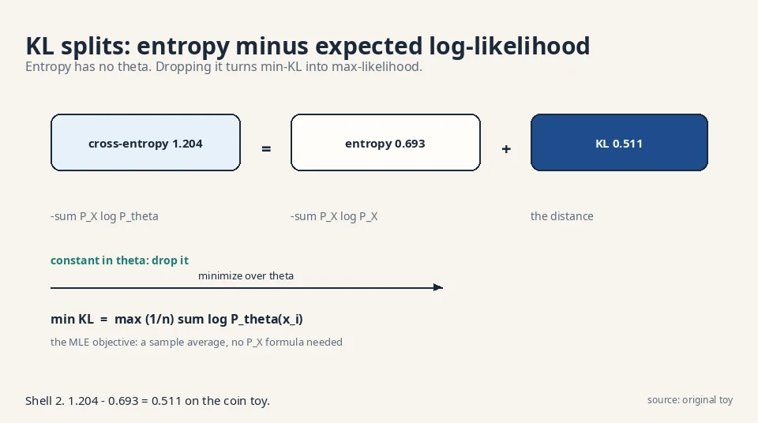

## How to use this page

Read the arc once for the story. Memorize the numbers table:
every exam question in this course is a number with a story
around it. Then drill the self-test until every answer is
instant. The traps section lists the exact mistakes the exam
rewards.

## The fifteen-minute arc

**The job (L01).** We have samples from an unknown distribution
P_X. We want new samples. The recipe: pick a parametric family
P_θ, choose a divergence D(P_X, P_θ), turn θ to shrink it.
Memorization fails: it assigns zero probability to everything
unseen. The push-forward trick (noise z through a network g_θ)
gives samples with no density formula.

**The ruler (L02).** KL divergence: Σ P_X log(P_X/P_θ), the
average log surprise ratio. Coin toy: 0.511 nats. Exact match
scores 0. Forward KL (weight by truth) is mode-covering.
reverse is mode-seeking. The identity: min KL = max
likelihood. Training is (1/n)Σ log P_θ(x_i).

**The family (L03).** KL is one f-divergence of many: JS
(0.102, symmetric, saturates), TV (0.4, simple, kinked).
The variational bound measures divergence from samples
alone: max over critics of E[T(x)] − E[f*(T(x̂))]. The GAN
objective falls out of one choice of f.

**The game (L04).** D maximizes, G minimizes
E[log D(x)] + E[log(1−D(G(z)))]. Hand trace works. Two
failures: saturation (at D = 0.001, doubling the score
moves the loss 0.001. The non-saturating variant moves it
0.693) and mode collapse (JS 0.216 with half the
distribution missing).

**The fixes (L05).** Wasserstein distance = earth-moving
cost: W = |θ|, gradient 1 everywhere, no saturation.
WGAN: raw critic scores with a 1-Lipschitz speed limit.
FID judges without likelihood: Fréchet distance between
Inception-feature Gaussians (toy: 4).

**The hidden causes (L06).** Data comes from hidden z:
p_θ(x) = ∫ p_θ(x,z)dz. The log of the integral is
intractable, so Jensen builds a floor: ELBO =
E_q[log p_θ(x,z)/q(z|x)]. Gap = KL(q‖true posterior),
exactly 0.063 in the hand toy. EM is the exact-posterior
special case.

**The autoencoder (L07).** q becomes an encoder network.
Sampling blocks backprop. The reparameterization trick
(z = μ + σε) moves randomness to ε. KL rent: 0.443 nats
in the toy. Posterior collapse (KL → 0, latents dead) is
the failure. β-VAE and VQ-VAE are the variants.

**The destruction (L08).** Fix the encoder to pure
noising: x_t = √α_t x_{t−1} + √(1−α_t)ε_t. Toy:
4.0 → 4.111 → 3.900. Jump anywhere: x_t = √ᾱ_t x_0 +
√(1−ᾱ_t)ε. End of chain: pure N(0,1). Learn only the
reverse: small denoising steps.

**The simplification (L09).** Condition on known x_0:
tractable posterior (mean 3.944 in the toy). Gaussian KL
= squared error. Reparameterize through noise: the whole
ELBO becomes L_simple = ‖ε − ε_θ‖² (0.0354 in the toy).
Sampling walks the chain backward (3.9 → 4.059).

**The views (L10).** Noise prediction is score
prediction (−1.578 in the toy): walk uphill on
probability. DDIM strides skip steps (x_100 = 1.5 →
x_50 = 2.844 in one jump). Guidance steers with a
classifier (−0.578). Latent diffusion shrinks 48×.
Autoregressive models factor with the chain rule
(p(a,b,a) = 0.036): exact likelihood, sequential
sampling.

## The numbers you must know cold

Every number below is a worked toy from the lessons.
Each one proves exactly one claim.

| Number | Toy | What it proves |
|---|---|---|
| 0.511 | KL, coin {0.5,0.5} vs {0.9,0.1} | KL is 0 iff distributions match |
| 0.693 | Forward KL, sharp toy; also JS max = log 2 | Asymmetry: reverse KL on the same toy is ∞ |
| 0.102 | JS on the coin toy | JS is calmer than KL; saturates when far apart |
| 0.4 | TV on the coin toy | Simplest divergence; kinked gradient |
| −1.917 vs −2.079 | MLE on H,H,T | min KL = max likelihood; data picks the 0.7 coin |
| 0.001 vs 0.693 | Saturation fix | Non-saturating loss gives 700× the signal at d ≈ 0 |
| 0.216 | Mode collapse JS | The objective shrugs at a missing half |
| 4 | FID toy | Mean shift of 2 → FID 4; lower is better |
| −1.031 vs −0.968 | ELBO toy | Lower bound sits below truth; gap 0.063 = KL exactly |
| 0.443 | VAE KL rent | Closed-form Gaussian KL; rent for μ=0.5, σ²=0.25 |
| 3.900 | Forward chain toy | x_0=4.0 → x_2=3.900; closed form agrees to the digit |
| 3.944 | Posterior mean toy | Conditioned reverse sits between noisy and clean |
| 0.0354 | L_simple toy | The whole ELBO becomes one MSE |
| 4.059 | One reverse step | 3.9 → 4.059: toward clean 4.0 plus wobble |
| −1.578 | Score toy | Arrow at 3.9 points left with strength 1.578 |
| 2.844 | DDIM stride | x_100=1.5 → x_50=2.844 in one jump via x̂_0=3.221 |
| 48× | Latent diffusion | 786,432 → 16,384 numbers per step |
| 0.036 | AR toy | p(a,b,a) = 0.6·0.3·0.2; chain rule, exact likelihood |

## The four plates that carry the course

**1. KL splits into entropy plus the MLE objective.** The
entropy never moves when you turn θ. Drop it and min-KL
becomes max-likelihood. This is why the field trains on
cross-entropy.

**2. Jensen builds the ELBO in four legal steps.** Each
step is exact. The last one trades the intractable log
for a computable expectation. The gap is always a KL.

**3. Three algebraic moves turn the DDPM ELBO into one
MSE.** Condition on x_0, reduce KL to squared error,
predict the noise. The price is the reweighting: samples
over likelihood.

**4. Four families, one recipe, four prices.** If the
exam asks "compare the families", this plate is the
answer.

## Memory aids

### Mnemonics

- **FDO: Family, Divergence, Optimization.** The recipe.
  Every model is three choices. Name all three before
  you analyze anything.
- **"The log of an expectation is not the expectation of
  a log."** The sentence that forces Jensen, ELBO, and
  the entire latent-variable road.
- **"Weight by the truth."** Forward KL. Whenever you
  wonder which direction, ask what you have samples
  from: the truth. Weight by it.
- **"The critic never frames an innocent model."** The
  variational bound never overclaims. A weak critic
  underreports. It never invents distance.
- **"KL = 0 with good reconstructions is the corpse."**
  Posterior collapse. Watch the KL term, not the total
  loss.
- **"Same weights, different walk."** DDIM reuses the
  trained ε_θ. The network never changes. Only the
  sampler does.

### Never-confuse pairs

| Pair | The difference | The number |
|---|---|---|
| Forward vs reverse KL | Weight by truth (covers modes) vs weight by model (seeks one mode) | 0.693 vs ∞ |
| ELBO vs likelihood | ELBO is the floor; likelihood is the ceiling | −1.031 vs −0.968 |
| q vs posterior | q is your guess; posterior is the truth | Gap 0.063 = KL between them |
| DDPM vs DDIM | Same network, stochastic steps vs deterministic strides | 1000 steps vs 50 strides |
| Score vs noise | Same object, two costumes: score = −ε/√(1−ᾱ_t) | −1.578 vs 0.688 |
| FID vs likelihood | FID judges samples; likelihood scores densities | GANs have FID but no likelihood |
| Saturation vs mode collapse | Dead gradients at start vs dead diversity at the end | 0.001 vs 0.216 |
| β-VAE vs VQ-VAE | Continuous latents with extra KL rent vs discrete codebook | β dial vs K vectors |

### If-this-then-that rules

- If the generator's loss is flat at initialization,
  then switch to the non-saturating loss. Check the
  gradient at d ≈ 0, not at the solution.
- If samples lack diversity but the loss looks fine,
  then suspect mode collapse. Cluster the samples and
  compare against clustered real data.
- If the VAE's KL is glued to zero, then the latents
  are dead. Weaken the decoder or anneal the KL weight.
- If the DDPM is noisy at low t, then the schedule is
  too fast. Plot the signal fraction curve.
- If FID is good but samples look like copies, then it
  is memorization. FID cannot catch it. Check
  nearest-neighbor distances.
- If guided samples are caricatures, then the guidance
  scale is too high. Lower s.
- If the loss varies wildly across t, then plot it per
  noise level. The mean hides per-t failures.
- If you need the density, then you cannot use a GAN
  generator. Pick VAE, diffusion, or AR.

## Exam traps

1. **"KL is symmetric."** No. 0.693 forward, infinite
   reverse on the sharp toy. Direction chooses the
   personality.
2. **"Minimizing cross-entropy differs from maximizing
   likelihood."** They are the same search. Cross-entropy
   = entropy + KL. Entropy has no θ.
3. **"The variational bound equals the divergence."** It
   lower-bounds it. A weak critic underestimates.
4. **"The GAN paper derived its loss from f-divergences."**
   No. The f-GAN view came later (2016). The original
   paper motivated the game directly.
5. **"L_simple is the true ELBO."** It is reweighted.
   Slightly worse likelihood, much better samples.
6. **"DDIM needs retraining."** No. Same ε_θ, different
   walk. Training used only the marginals.
7. **"Low FID proves generation."** No. Memorization
   scores ~0. FID is a judge, not a proof.
8. **"Posterior collapse means high loss."** The opposite:
   KL → 0 makes the loss look great while the latents
   die.

## Rapid-fire self-test

**Q1.** Truth {0.5, 0.5}, model {0.9, 0.1}. KL?
**A.** 0.511 nats. Tails term dominates: 0.5·log 5.

**Q2.** Why is KL not symmetric?
**A.** Weights come from the first distribution. Sharp
toy: forward 0.693, reverse ∞.

**Q3.** min KL = max what?
**A.** Likelihood: (1/n)Σ log P_θ(x_i). Entropy drops
out (no θ).

**Q4.** JS on the coin toy, and its weakness?
**A.** 0.102. Symmetric and calm, but saturates when
distributions barely overlap.

**Q5.** The variational bound in one line?
**A.** D_f = max_T E[T(x)] − E[f*(T(x̂))]. Samples only,
no densities. A bound, not the value.

**Q6.** The GAN objective, and who optimizes which way?
**A.** J = E[log D(x)] + E[log(1−D(G(z)))]. D
maximizes, G minimizes.

**Q7.** At D(G(z)) = 0.001, doubling the score moves the
original loss by how much? The fix?
**A.** 0.001 (saturation). Non-saturating −log D moves
0.693: 700× the signal.

**Q8.** Mode collapse: truth {0:.5, 10:.5}, model {0:1}.
JS?
**A.** 0.216. The divergence barely objects. The
generator sits at loss 0.693 forever.

**Q9.** JS on point masses at 0 and θ=10 vs θ=100?
**A.** 0.693 both. Gradient zero. Wasserstein gives 10
vs 100, gradient 1.

**Q10.** WGAN objective and the constraint?
**A.** J = E[f(x)] − E[f(x̂)], f 1-Lipschitz. No logs,
no sigmoid.

**Q11.** FID formula and the toy value?
**A.** ‖μ−μ̂‖² + Tr(Σ+Σ̂−2(ΣΣ̂)^{1/2}). Toy: 4, all
from the mean shift.

**Q12.** Why Jensen? State the key sentence.
**A.** The log of an expectation is not the expectation
of a log. Jensen turns log E_q into E_q log: a
computable lower bound.

**Q13.** ELBO toy: values and gap?
**A.** ELBO −1.031, truth −0.968, gap 0.063 =
KL(q‖posterior) exactly.

**Q14.** EM in one line?
**A.** Coordinate ascent on the ELBO with the exact
posterior: E-step closes the gap, M-step pushes the
floor. Likelihood never decreases.

**Q15.** The reparameterization trick?
**A.** z = μ + σ·ε, ε ~ N(0,1). Same N(μ,σ²),
gradients flow: ∂z/∂μ = 1, ∂z/∂σ = ε.

**Q16.** VAE KL rent for μ=0.5, σ²=0.25?
**A.** 0.443 nats, by −½(1 + log σ² − μ² − σ²).

**Q17.** Posterior collapse: symptom and fix?
**A.** KL → 0 with good reconstructions: dead latents.
Fix: weaker decoder, anneal KL weight 0→1, β-VAE,
VQ-VAE.

**Q18.** Forward process and the closed-form jump?
**A.** x_t = √α_t x_{t−1} + √(1−α_t)ε_t. Jump: x_t =
√ᾱ_t x_0 + √(1−ᾱ_t)ε. Toy: 4.0 → 3.900, verified to
the digit.

**Q19.** The three moves from ELBO to L_simple?
**A.** Condition on x_0 (tractable posterior, mean
3.944). Gaussian KL = squared error. Predict the
noise: L_simple = ‖ε−ε_θ‖² = 0.0354.

**Q20.** Score, DDIM, guidance, latent, AR: one number
each?
**A.** Score −1.578 at x=3.9. DDIM: 1.5 → 2.844 in one
stride. Guidance: −1.578 + 2·0.5 = −0.578. Latent: 48×
cheaper. AR: p(a,b,a) = 0.036.

## The one table

| Family | Objective | Price |
|---|---|---|
| GAN | Minimax game | Saturation, mode collapse |
| VAE | ELBO | Blurry samples |
| Diffusion | Noise MSE | Slow sampling |
| Autoregressive | Exact MLE | Sequential generation |

Four answers to "how do you teach a machine to create?",
each with its bill attached. For the full story with
every number worked by hand, read the lessons in order.
