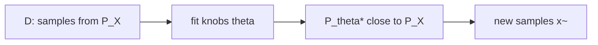
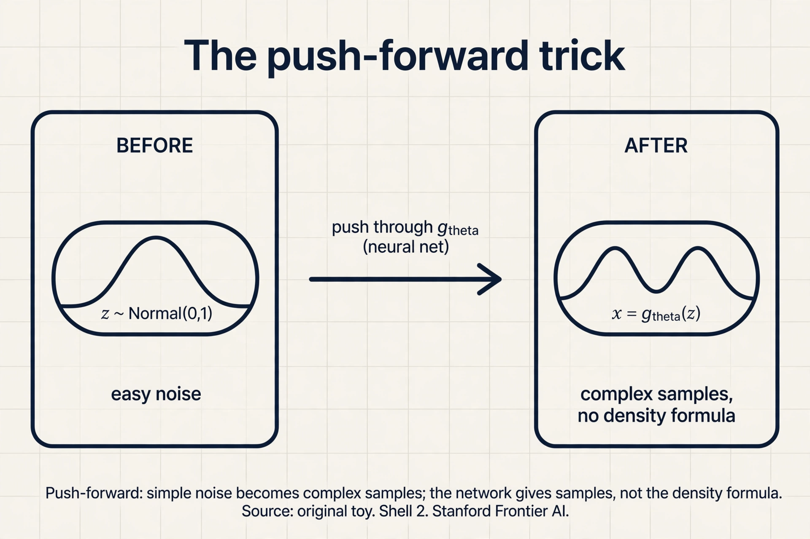

## The task: make what does not exist

Look at a face generator. You press a button. A new face appears. It
is not any real person. Nobody took that photo. The machine made it.

Now ask what the machine actually knew. It never saw the laws of
anatomy. It saw photos. Thousands of real faces. From those photos,
it had to learn something about what faces look like in general,
and then produce a new one.

Put this in plain math terms, because the whole course lives in
these terms. There is an unknown **data distribution**, written
P_X. A distribution is a rule that assigns probabilities to outcomes.
P_X is the true rule behind your data: the rule that makes real
faces more likely than random noise. You never see P_X itself. You
only see samples: the dataset D = {x_1, x_2, ..., x_n}, each drawn
from P_X. "Drawn from" means each sample is one random outcome of
that rule.

The job of a generative model has two parts. First, estimate P_X
from the samples. Second, learn to sample from it: produce new
x that look like fresh draws from P_X. Everything in this course
is one of these two steps or the math that makes them possible.

```ascii
unknown P_X  -->  dataset D (samples only)  -->  model P_theta
                                                      |
                                                      v
                                               new samples x~
```

## The three-step recipe

The lecture gives one recipe that every generative model follows.
Three ingredients, in order.

First, assume a **parametric family**. This is a set of candidate
distributions with knobs. Written P_θ. The θ (theta) is the knob
setting: a list of numbers. Choose θ, you get one distribution.
The family is your guess about the shape of the answer. A family of
Gaussians, a neural network that warps noise into images, a Markov
chain of noisy steps: all of these are choices of P_θ.

Second, define a **divergence metric**. This is a number that says
how far your model P_θ is from the truth P_X. It must be zero when
the two distributions match and positive otherwise. KL divergence,
f-divergences, the Wasserstein distance: all of Lesson 2 onward.

Third, solve an **optimization** problem. Turn the knob θ to make
the divergence small:

```ascii
theta* = argmin_theta  D(P_X , P_theta)
```

Read it as: the winning knob setting is the one that brings the
model closest to the truth, measured by your divergence. Training a
generative model is this search. The lecture's honest warning: in
practice we minimize an approximation of the divergence, with
sample averages standing in for the true distribution, so the
trained model only lands near P_X, never exactly on it.

## First attempt: the memory machine

The simplest machine that can "create" is a parrot. It memorizes
the dataset. To make a new sample, it picks a random training
point and returns it. No math, no learning.

Watch it on a toy. The dataset has four exam scores: {2, 4, 6, 8}.
The memory machine stores them. Ask it for five new samples. It
draws at random from the list: 4, 8, 2, 4, 6. Every output is a
perfect, plausible exam score. It looks like it learned the
distribution.

Where does it break? Ask it for a sample that is not in the list.
A 5. A 3. A 7. It cannot. Its whole world is four numbers. For
images, this is fatal: a memorized photo is a copy, not a
creation, and a generator that can only return its training photos
is useless. The memory machine also grows with the data: a billion
photos means a billion stored photos.

The deeper failure is a counting argument. The dataset has n
samples. The real distribution P_X can produce infinitely many
outcomes. Any rule that only replays the n it saw assigns zero
probability to everything new. It learned the samples, not the
rule. The job asks for the rule.

So the first attempt teaches the real demand: a generative model
must be able to produce outcomes it never saw, and it must do so
in proportion to how likely they are under P_X. That means it must
generalize. Memorization is the opposite of generalization.

## The key question

How do you assign probabilities to things you never saw, using
only the things you did?

## The new idea: fit a family, then sample from it

The recipe answers the question in two moves. First, pick a family
P_θ smooth enough that probability spreads between the samples.
Second, fit θ so the family hugs the data. Then sample from the
fitted family, not from the dataset.

Work the toy by hand. The dataset is {2, 4, 6, 8}. Choose the
family of Gaussian distributions (the bell curve). A Gaussian
has two knobs: the mean μ (the center) and the standard deviation
σ (the width). Fit by matching the data's center and spread:

```ascii
data:     2   4   6   8
mean:     (2+4+6+8)/4 = 5
spread:   typical distance from 5 is 2, so sigma = 2
model:    P_theta = Gaussian(mean 5, spread 2)
```

Now sample from the model. A Gaussian with mean 5 and spread 2
can produce 3.1, 5.7, 6.9, 4.2: numbers never in the dataset,
but plausible under the fitted rule. The machine created. This is
the smallest possible generative model, and it shows the whole
pattern: family, fit, sample.



One step remains mysterious: what does "hugs the data" mean, in
numbers? That is the divergence metric, and it is Lesson 2. But
one piece of machinery from this lecture deserves its own name,
because half the course is built on it.

## The push-forward trick

Most modern models generate by warping noise. Start with a random
variable z that you understand completely: the standard Gaussian,
mean 0, spread 1. You know how to sample it. Now pass it through
a deterministic function g_θ (a neural network with knobs θ).
The output x = g_θ(z) is a new random variable. It has some
distribution. Call it P_θ.

```ascii
z ~ Normal(0, 1)      sample easy noise
        |
   g_theta (neural net)
        |
x = g_theta(z)        some new distribution P_theta
```

This is the **push-forward** method: push simple noise forward
through a function and get a complex distribution. The lecture's
key point: the neural network's output gives you *samples* from
P_θ, not P_θ itself. You can draw x's all day, but you cannot
read off the probability of any one x. This gap, samples without
a formula for the density, is what forces the adversarial approach
in Lesson 4. Keep it in mind.



And a hard question the lecture asks now: how do you compute a
divergence between P_X and P_θ when you know neither density,
only samples from both? That is the problem Lessons 2 and 3
solve.

## The honest price: three approximations

The recipe is honest about what it costs. Every real model pays
three approximations, and the trained model lands at P_θ*, not
at P_X.

First, the family may be wrong. If P_X is two separate clusters
and P_θ is one Gaussian, no knob setting fixes that. The best
fit is still wrong.

Second, expectations are replaced by sample averages. The true
divergence integrates over all of P_X. In practice we average
over the n samples we have. The law of large numbers says the
average approaches the truth as n grows, but n is always finite.
Small n, noisy fit.

Third, the optimization is gradient-based in high dimensions.
It can stall in a bad local minimum. The knob setting we find
is a local winner, not the global one.

These three gaps explain why every generative model is judged
by its samples, not by a proof. Lesson 5 gives the judging tools.

| Ingredient | What it is | The catch |
|---|---|---|
| Parametric family P_θ | Candidate distributions with knobs | The truth may not be in the family |
| Divergence metric D | A distance between distributions | Computed from samples, not densities |
| Optimization over θ | Turn knobs to shrink D | Local minima, noisy gradients |

> [!QA]
> Q: What is a generative model, in one sentence?
> A: A machine that learns the probability rule behind a dataset and then produces new samples from that rule. Given photos, it learns P_X (the distribution of real photos) and returns new photos that were never in the dataset.
> Follow-up: How is that different from a classifier?
> A: A classifier answers "which category is this?" for an input it is given. A generative model produces the input itself. The classifier models P(label | x). The generator models P(x).

> [!QA]
> Q: Why can a model not just memorize the training data?
> A: Memorization replays old samples. It assigns zero probability to anything new. In the toy, the memory machine on {2, 4, 6, 8} can never output 5. Real creation needs probability on unseen outcomes, which requires a smooth family fitted to the data, like the Gaussian with mean 5 and spread 2 that can output 3.1 or 6.9.
> Follow-up: Is memorization ever the right answer?
> A: Only when the task is retrieval, like a database lookup. For generation it is a failure mode with a name: overfitting. Lesson 5 shows how to detect it.

> [!QA]
> Q: What is the push-forward method?
> A: Sample easy noise z from a known distribution like the standard Gaussian, then push it through a deterministic neural network g_θ. The output x = g_θ(z) follows some new distribution P_θ, and changing the knobs θ changes that distribution. It gives samples from P_θ without a formula for its density.
> Follow-up: Why does the missing density formula matter?
> A: Because divergences are defined through densities. If you cannot write down P_θ, you need a way to measure the distance to P_X using only samples. That is exactly what the variational divergence machinery of Lesson 3 provides.

## Recap: the whole lesson on one screen

1. **The job.** We have samples from an unknown P_X. We want new samples from it.
2. **The recipe.** Pick a parametric family P_θ, define a divergence D, turn θ to shrink D.
3. **First attempt.** The memory machine replays training points: {2, 4, 6, 8} in, only those out.
4. **Where it breaks.** It assigns zero probability to unseen outcomes. No 5, no 3, no creation.
5. **The key question.** How do you score outcomes you never saw?
6. **The fix.** Fit a smooth family (Gaussian, mean 5, spread 2), then sample from it: 3.1, 5.7, 6.9.
7. **The push-forward trick.** Noise z through a network g_θ gives samples from P_θ with no density formula.
8. **The price.** Wrong family, sample averages instead of true expectations, local minima. P_θ* lands near P_X, never on it.

## Official sources and further reading

**Official:**
- W1_L1: Course outline deep generative models:
  https://www.youtube.com/watch?v=skWhn8W9P_Y
- W1_L2: Introduction & problem setting:
  https://www.youtube.com/watch?v=HUunmwZfGzc

**Further reading:**
- Goodfellow et al., "Generative Adversarial Nets" (2014):
  https://arxiv.org/abs/1406.2661: the paper that made the recipe famous.
- Kingma and Welling, "Auto-Encoding Variational Bayes" (2013):
  https://arxiv.org/abs/1312.6114: the latent-variable branch of the recipe.

**Caveats.** The W1_L2 transcript was not recoverable (no subtitles), so the problem-setting narrative above is the lesson's own reconstruction from the W1L3 recap of it. [uncertain] The three-step recipe and push-forward method are confirmed in the W1L3 (nfZQYopzv20) transcript, which recaps them verbatim.

## Connections to the other courses

- **CS229 L10 (EM/PCA):** EM fits a latent-variable family by alternating steps. The divergence it shrinks is the same KL from Lesson 2. A two-point EM toy: data {0, 10}, two clusters initialized at means 2 and 8. E-step assigns 0 to cluster 1 with weight 0.88 and to cluster 2 with weight 0.12 (closer mean wins). M-step moves the means toward their weighted points. Same recipe, same divergence, different family.
- **CS336:** the training-data discussions there ask what a model remembers versus what it generates. The memory machine of this lesson is the pure-remembering extreme. Every later lesson moves toward pure generating.
