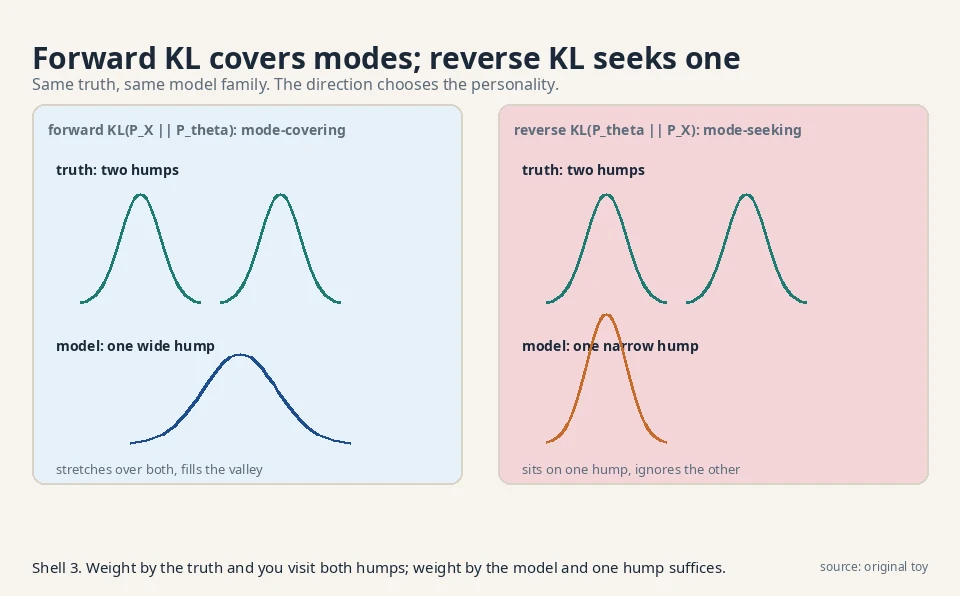
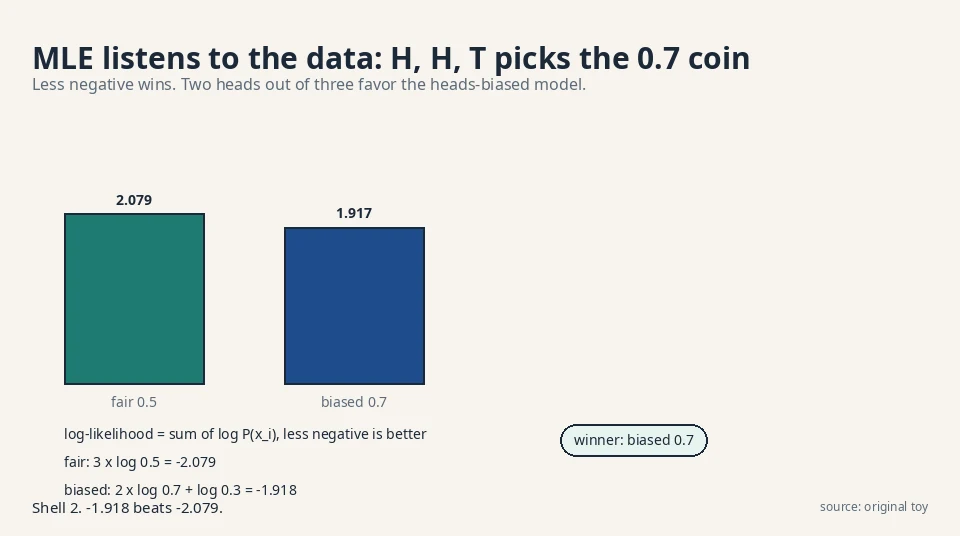

## The task: score the distance between two rules

Lesson 1 ended with a gap. The recipe needs a divergence: one
number that says how far the model P_θ is from the truth P_X.
But what does "far" mean for two probability rules?

Start with a toy you can hold. A coin. The true coin is fair:
P_X = {heads: 0.5, tails: 0.5}. Two candidate models disagree:

```ascii
truth P_X:   heads 0.5,  tails 0.5
model A:     heads 0.9,  tails 0.1
model B:     heads 0.5,  tails 0.5
```

Model B matches. Model A is lopsided. A divergence must give B a
score of zero and A a positive score, and it must say how much
worse A is. The naive idea, subtract the probabilities and add
the absolute differences, gives |0.5 − 0.9| + |0.5 − 0.1| = 0.8.
That works here, but it treats all errors alike. Probability has
a sharper idea: errors on rare events cost more.

## First attempt: average the surprise ratio

Think about what the model claims per outcome. Model A says heads
has probability 0.9 while the truth says 0.5. The ratio is
0.5 / 0.9 = 0.556: the truth thinks heads is only about half as
likely as the model claims. For tails the ratio is 0.5 / 0.1 = 5:
the truth thinks tails is five times likelier than the model
admits. The model is badly wrong about tails and mildly wrong
about heads.

### The log ratio per outcome

The **KL divergence** averages the log of these ratios, weighted
by the truth:

```ascii
KL(P_X || P_theta) = sum over x of  P_X(x) * log( P_X(x) / P_theta(x) )
```

Read it piece by piece. P_X(x) is how often outcome x really
occurs. The log ratio log(P_X(x) / P_θ(x)) is the surprise in
that outcome: positive when the model underestimates, negative
when it overestimates. The sum weights each surprise by how often
the truth visits it. Underestimating a common outcome hurts a lot.
Underestimating a rare one barely registers.

The log is doing real work. Ratios multiply across independent
outcomes. Logs turn products into sums, so surprise adds up
across a dataset. The unit is the nat (natural log). Base 2
gives bits. One nat = 1.44 bits.

### Worked by hand: 0.511 nats

Work model A by hand. Use natural log (base e).

```ascii
KL = 0.5 * log(0.5 / 0.9) + 0.5 * log(0.5 / 0.1)
   = 0.5 * log(0.556)     + 0.5 * log(5.0)
   = 0.5 * (-0.588)       + 0.5 * (1.609)
   = -0.294               + 0.805
   = 0.511 nats
```

Model A scores 0.51. Model B, which matches the truth, scores
log(1) = 0 on both terms: exactly zero. The divergence behaves:
zero when the rules match, positive otherwise. The lecture proves
this in general: KL is always non-negative, and it is zero if and
only if the two distributions are equal.

 + 0.5*log(0.5/0.1) = 0.511. Shell 2. Source: original toy. Project: Stanford Frontier AI.")

### The zero-probability landmine

Two facts about KL shape everything after. First, it is not
symmetric. KL(P_X || P_θ) is not KL(P_θ || P_X). The weighting
is by the first distribution, so the two directions punish
different mistakes. Second, it explodes when the model assigns
zero probability to an outcome the truth produces: log(P_X / 0)
is infinite. A model that says "tails is impossible" pays an
infinite price the first time tails appears.

The landmine has a practical consequence. No trained model may
assign exact zero to any plausible outcome. Every output
distribution needs a floor: a tiny probability everywhere. In
language models this is why the softmax never truly reaches 0.
In image models it is one source of the washed-out look: the
model hedges.

## Where symmetry breaks: forward versus reverse

### The sharp toy: 0.693 versus infinity

Compute both directions on a sharper toy. The truth puts all
its mass on heads: P_X = {1.0, 0.0}. The model hedges:
P_θ = {0.5, 0.5}.

```ascii
forward  KL(P_X || P_theta) = 1.0 * log(1.0 / 0.5) = log(2) = 0.693
reverse  KL(P_theta || P_X) = 0.5 * log(0.5 / 1.0) + 0.5 * log(0.5 / 0.0)
                            = -0.347 + infinity = infinity
```

The forward KL is a calm 0.69. The reverse KL is infinite,
because the truth assigns zero to tails while the model spends
half its mass there. Same pair of distributions, wildly different
scores. The lecture names these: **forward KL** (weight by the
truth) and **reverse KL** (weight by the model). Generative
modeling almost always minimizes the forward KL: weight by the
data you have.

### Mode-covering versus mode-seeking

The forward KL has a personality worth knowing. It is
**mode-covering**. Suppose the truth is two humps (two kinds of
faces) and the model is one hump. The forward KL averages over
the truth, so it visits both humps and punishes the model for
the hump it ignores. The model is pushed to stretch over both.
The reverse KL is **mode-seeking**: it averages over the model,
so a one-hump model that sits exactly on one true hump pays
almost nothing for ignoring the other. Lesson 4 shows this
personality causing mode collapse in GANs, which optimize a
different divergence.



### The decision rule: which direction, when

Use forward KL when you have data from the truth and a model
that must explain all of it. That is almost every generative
task: the data is fixed, the model is flexible. Use reverse KL
when the model is the thing you trust and you want it to
concentrate: variational inference often minimizes reverse KL
because it yields a tidy, compact approximation. The price of
reverse KL is dropped modes. The price of forward KL is blurry
compromise between modes. Pick your poison by naming which
failure you can tolerate.

## The key question

We chose KL. Now: given only samples from P_X, no formula for
it, how do you actually turn the knob θ to shrink KL(P_X ||
P_θ)?

## The new idea: minimizing KL is maximizing likelihood

### The split: entropy plus KL

Expand the KL definition and watch it split:

```ascii
KL(P_X || P_theta)
  = sum_x P_X(x) * log P_X(x)  -  sum_x P_X(x) * log P_theta(x)
  =        (entropy of P_X)    -  E[ log P_theta(x) ]
```

The first term depends only on the truth. It has no θ in it.
When you turn the knob, that term does not move. So minimizing
KL over θ is exactly maximizing the second term:
E[log P_θ(x)], the average log-probability the model assigns to
real data. This quantity is the **likelihood** (in log form),
and maximizing it is **maximum likelihood estimation**, MLE.

This is the lecture's central identity, and it is why the whole
field trains the way it does:

```ascii
argmin_theta KL(P_X || P_theta)  =  argmax_theta E[ log P_theta(x) ]
```


### The sample average replaces the expectation

Now the sample problem dissolves. The expectation is over P_X,
and we have samples from P_X. Replace the expectation with the
sample average (the law of large numbers blesses this):

```ascii
argmax_theta  (1/n) * sum over data  log P_theta(x_i)
```

This is the training objective of half of machine learning.
Given data points x_1 ... x_n, pick θ so the model assigns them
the highest total log-probability. No formula for P_X needed.
Just the data and a model whose probabilities you can compute.

### Worked: H, H, T picks the 0.7 coin

Watch it choose between two models on three coin flips: H, H, T.

```ascii
model A (fair):      P = 0.5 each
  log-likelihood = log 0.5 + log 0.5 + log 0.5 = 3 * (-0.693) = -2.079
model B (heads 0.7): P(H) = 0.7, P(T) = 0.3
  log-likelihood = log 0.7 + log 0.7 + log 0.3
                 = (-0.357) + (-0.357) + (-1.204) = -1.918
```

Model B wins: −1.918 beats −2.079 (less negative is better).
Two heads out of three favor the heads-biased coin. MLE listened
to the data. With more flips the winner converges to the true
bias. That is the whole training procedure for every model in
this course whose densities can be written down.



### Entropy: the floor you cannot beat

The leftover term has a name too. The entropy of P_X,
−sum P_X log P_X, measures the truth's own unpredictability.
A fair coin has entropy 0.693 nats. A coin that always lands
heads has entropy 0: no surprise at all. MLE cannot beat the
entropy. The best possible average log-likelihood is exactly
minus the entropy, reached when P_θ = P_X and the KL hits zero.

The middle row of the table deserves one line: the thing you
minimize in practice, −E[log P_θ(x)], is called
**cross-entropy**. It equals entropy plus KL. Since entropy is
constant in θ, minimizing cross-entropy and minimizing KL are
the same search.

| Quantity | Formula (discrete) | Meaning |
|---|---|---|
| KL divergence | sum P_X log(P_X / P_θ) | Distance from truth to model, in nats |
| Cross-entropy | −sum P_X log P_θ | What you actually minimize. Equals entropy + KL |
| Entropy | −sum P_X log P_X | The truth's own unpredictability. The floor |
| MLE objective | (1/n) sum log P_θ(x_i) | Sample version of minus cross-entropy |

### Where this runs in real systems

Next-token training of language models is this lesson, at
scale. Each training step computes cross-entropy between the
model's predicted distribution over the vocabulary and the
actual next token. By this lesson's identity, that is forward
KL to the text distribution, estimated on samples. The VAE
reconstruction term (Lesson 7) is the same: expected
log-likelihood under the decoder. The diffusion denoising loss
(Lesson 9) is a reweighted form of it. One identity, three
architectures.

> [!MEMORY]
> KL = cross-entropy − entropy. The entropy never moves when you
> turn θ. So min-KL, min-cross-entropy, and max-likelihood are
> three names for one search. If an interviewer asks which one
> you optimize, answer: all three, they are the same knob turn.

## The honest price: three ways MLE bites

MLE is the default, but the lecture is clear-eyed about its
costs, and each one motivates a later lesson.

First, the infinite penalty. If P_θ assigns zero probability to
a real outcome, the log-likelihood is −infinity. One bad point
kills the whole fit. In practice this forces every model to keep
a little probability everywhere, which is why generated images
sometimes look washed out: the model hedges. The price is
measurable: on the coin toy, moving the model from {0.9, 0.1}
to {0.99, 0.01} raises the KL from 0.51 to 1.61 nats. Sharper
hedging, steeper bill.

Second, forward KL is mode-covering, which sounds good until the
family is too small. A one-hump model covering two humps puts
mass in the valley between them, where the truth has none. The
samples look like blends of two faces: blurry averages. This is
the classic VAE blur, and Lesson 7 traces it to this exact
mechanism. The number to remember: with two unit Gaussians at
−3 and +3, the best single Gaussian sits at mean 0, and fully
half its mass lands where the truth has almost none.

Third, MLE needs the density. You must be able to compute
log P_θ(x) for each data point. Push-forward models (Lesson 1)
give samples but no density formula. For them, MLE is
uncomputable, and the course needs the adversarial machinery of
Lessons 3 and 4. The recipe forks here: models with tractable
densities go the MLE/ELBO route, models without go the GAN
route.

## Videos for this lesson

<div class="video-block"><div class="video-wrap"><iframe src="https://www.youtube-nocookie.com/embed/VxRIqenOoQw" title="W1L4: Variational divergence minimization" allow="accelerometer; autoplay; clipboard-write; encrypted-media; gyroscope; picture-in-picture" allowfullscreen loading="lazy" referrerpolicy="strict-origin-when-cross-origin"></iframe></div><p class="video-cap">Second lecture video for this lesson: the variational road to the same divergence. If the embed is blocked: <a href="https://www.youtube.com/watch?v=VxRIqenOoQw" target="_blank" rel="noopener">watch on YouTube</a>.</p></div>

<div class="video-block"><div class="video-wrap"><iframe src="https://www.youtube-nocookie.com/embed/YtebGVx-Fxw" title="Entropy (for data science) Clearly Explained!!! StatQuest" allow="accelerometer; autoplay; clipboard-write; encrypted-media; gyroscope; picture-in-picture" allowfullscreen loading="lazy" referrerpolicy="strict-origin-when-cross-origin"></iframe></div><p class="video-cap">External explainer: StatQuest builds entropy from zero, the floor under this lesson's identity. If the embed is blocked: <a href="https://www.youtube.com/watch?v=YtebGVx-Fxw" target="_blank" rel="noopener">watch on YouTube</a>.</p></div>

> [!QA]
> Q: What is KL divergence, concretely?
> A: A weighted average of log surprise ratios: KL(P_X || P_θ) = sum P_X(x) log(P_X(x)/P_θ(x)). In the coin toy, truth {0.5, 0.5} against model {0.9, 0.1} scores 0.51 nats. It is always non-negative and zero only when the distributions match exactly.
> Follow-up: Why is it not symmetric?
> A: The weights come from the first distribution. Forward KL(P_X || P_θ) punishes the model for ignoring real outcomes. Reverse KL(P_θ || P_X) punishes it for inventing impossible ones. In the sharp toy, forward was 0.693 and reverse was infinite. Generative training uses the forward direction.

> [!QA]
> Q: Walk me through a KL computation on a new toy, by hand.
> A: Truth {0.25, 0.75}, model {0.5, 0.5}. Term one: 0.25 * log(0.25/0.5) = 0.25 * log(0.5) = 0.25 * (−0.693) = −0.173. Term two: 0.75 * log(0.75/0.5) = 0.75 * log(1.5) = 0.75 * 0.405 = 0.304. Total: 0.131 nats. Small, because the model is close to the truth on the outcome the truth visits most.
> Follow-up: What if the model says {0.0, 1.0} on that truth?
> A: Term one becomes 0.25 * log(0.25/0) = 0.25 * infinity = infinity. One zero on a visited outcome kills the whole score. That is the landmine, and it is why real models never output exact zeros.

> [!QA]
> Q: Why does everyone maximize likelihood instead of minimizing KL?
> A: They are the same search. KL splits into the truth's entropy (no θ in it) minus E[log P_θ(x)]. Dropping the constant turns min-KL into max-likelihood, and the expectation becomes a sample average: (1/n) sum log P_θ(x_i). On three flips H, H, T, the 0.7-heads model beat the fair model, −1.918 versus −2.079.
> Follow-up: What is cross-entropy then?
> A: Minus that expectation: −E[log P_θ(x)]. It equals entropy plus KL. Minimizing cross-entropy, minimizing KL, and maximizing likelihood are three names for one optimization.

> [!QA]
> Q: Forward KL or reverse KL for training an image generator on photos?
> A: Forward. The data is fixed and the model must explain all of it: weight by the truth. Reverse KL would let a one-hump model sit on one kind of photo and ignore the rest, which is mode collapse wearing a tuxedo. The price of forward KL is the opposite failure: a too-small family blurs modes together instead of dropping them.
> Follow-up: When would you ever minimize reverse KL?
> A: In variational inference, when you want a compact approximation you trust. Reverse KL concentrates the approximation on one region instead of smearing it. You accept dropped modes in exchange for a tidy fit.

> [!QA]
> Q: What goes wrong with maximum likelihood?
> A: Three things. A single zero-probability data point sends the objective to −infinity, so models hedge and look blurry. Forward KL is mode-covering: a too-small family stretches over all modes and generates in-between blends. And MLE needs a computable density, which push-forward models like GAN generators do not have.
> Follow-up: How do you fix the zero-probability blowup?
> A: Never let the model assign exact zeros: add a small floor to every probability, or use families (like Gaussians) with infinite support. The cost is the hedging blur. There is no free fix. It is the price of the forward KL.

> [!QA]
> Q: Your language model gets cross-entropy 2.1 nats per token on held-out text. What does that number mean?
> A: It means the model's predicted distribution sits 2.1 − H nats from the true text distribution, where H is the true entropy of language (unknown, but fixed). Since cross-entropy = entropy + KL, a drop from 2.5 to 2.1 is a KL drop of 0.4 nats: the model moved 0.4 nats closer to real text. Perplexity is just exp of this number: e^2.1 ≈ 8.2.
> Follow-up: Can cross-entropy go below the true entropy?
> A: No. KL is non-negative, so cross-entropy ≥ entropy always. The entropy is the floor. A reported cross-entropy below any plausible entropy estimate means the evaluation is broken: usually train-test leakage.

> [!QA]
> Q: You are training a VAE and a GAN on the same face dataset. Which divergence does each minimize, and why does it matter?
> A: The VAE maximizes the ELBO, which contains a reconstruction term equal to expected log-likelihood: forward KL territory, mode-covering. Expect sharp coverage of all face types but some blur. The GAN's discriminator estimates a Jensen-Shannon-like divergence from samples: no density needed, sharper samples, but the reverse-KL-like personality risks dropping rare face types. Same data, different divergences, different failure modes.
> Follow-up: Which one do you ship for a product that must never miss a rare face type?
> A: The VAE family. Mode coverage is the requirement. Forward KL is the divergence that enforces it. You accept the blur and fix it later with a better decoder. A dropped mode is a silent failure. Blur is a visible one.

## Recap: the whole lesson on one screen

1. **The job.** Score the distance between the truth P_X and the model P_θ with one number.
2. **First attempt.** Average the log surprise ratios, weighted by the truth: the KL divergence.
3. **Worked.** Truth {0.5, 0.5} vs model {0.9, 0.1}: KL = 0.51 nats. Exact match scores 0.
4. **Asymmetry.** Forward KL 0.693 vs reverse KL infinite on the sharp toy. Forward is mode-covering.
5. **The key question.** How do you shrink KL with only samples, no formula for P_X?
6. **The identity.** KL = entropy − E[log P_θ]. Drop the constant: min KL = max likelihood.
7. **Worked.** On H, H, T, the 0.7 model beats the fair one, −1.918 vs −2.079. Sample average replaces expectation.
8. **The price.** Infinite penalty on zeros, mode-covering blur, and MLE needs a density the push-forward models lack.

## Official sources and further reading

**Official:**
- W1L3: f-Divergence:
  - [KL as the u log u member of the family. Forward vs reverse.](https://www.youtube.com/watch?v=nfZQYopzv20)
- W1L4: Variational divergence minimization: [paper](https://www.youtube.com/watch?v=VxRIqenOoQw)

**Further reading:**
- Murphy, "Probabilistic Machine Learning: An Introduction", ch. 4: KL, cross-entropy, MLE in one place.
- The f-divergence view (Lesson 3) generalizes everything here.

**Caveats.** The KL definition, its properties, and the min-KL = max-likelihood identity are confirmed in the W1L3 transcript. The coin toys and the H/H/T comparison are the lesson's own worked examples. [uncertain] The lecture's exact numeric examples are unknown.

## Connections to the other courses

- **CS229 L10 (EM/PCA):** EM maximizes likelihood for latent-variable models by alternating: guess the hidden assignments, then refit. Each EM step is shown in that course to never decrease the likelihood. This lesson's identity is why: EM is MLE with missing data, and Lesson 6 derives its modern form (ELBO) from the same KL.
- **CS336:** language models are trained by next-token cross-entropy, which this lesson identifies as forward KL to the data distribution. A worked tie: a model assigning probability 0.8 to the true next token on 4 tokens scores cross-entropy −(log 0.8 × 4)/4 = 0.223 nats per token. Lower is closer to the true text distribution.
