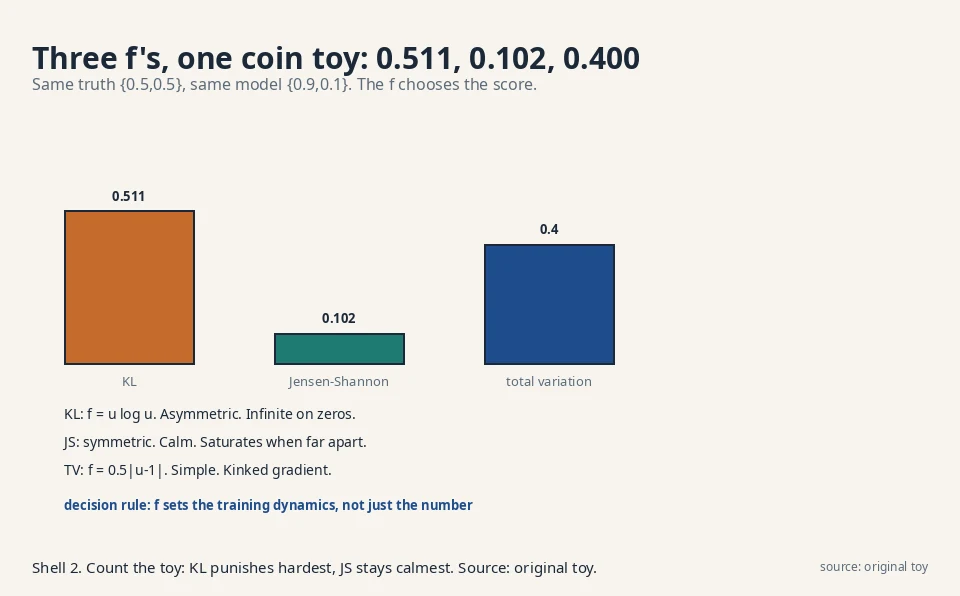
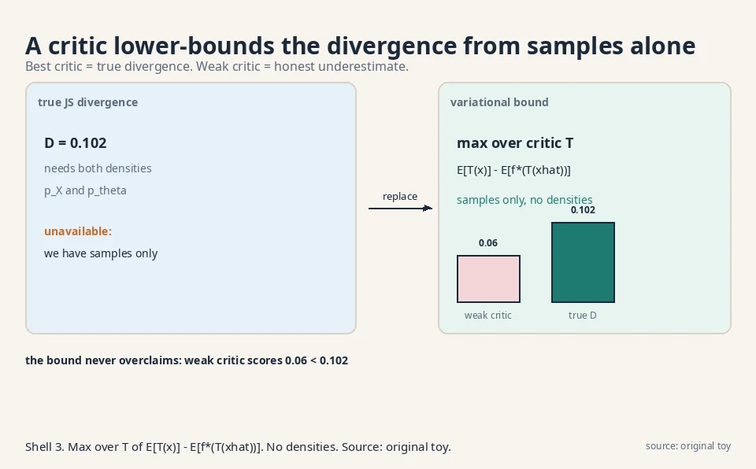
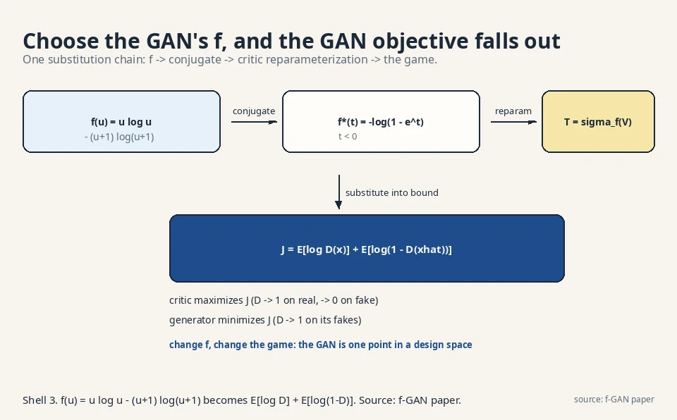

## The task: KL is one choice among many

Lesson 2 crowned KL the default divergence. The lecture now asks
an uncomfortable question: why this one? KL's infinite penalty
on zero probabilities and its mode-covering personality are
choices, not laws. Maybe another distance fits some task better.
The lecture builds the whole family at once, then shows that
every member contains KL, Jensen-Shannon, and total variation
as special cases.

The **f-divergence** between truth P_X and model P_θ is:

```ascii
D_f(P_X || P_theta) = integral  p_theta(x) * f( p_X(x) / p_theta(x) ) dx
```

Read it inside out. At each point x, take the ratio of the two
densities: how many times likelier is this outcome under the
truth than under the model. Feed the ratio through a function f.
Average over the model. The function f is the personality knob:
any convex function with f(1) = 0 gives a valid divergence.
Convex means the curve bends upward (no dips). f(1) = 0 means a
ratio of 1, the distributions agree here, contributes nothing.

The lecture proves two properties for every choice of f. The
divergence is always non-negative. And it is zero if and only if
the two distributions match exactly. So every f gives a usable
training target: turn θ until it hits zero.

### Why convexity is non-negotiable

Convexity is what makes the non-negativity proof work. Jensen's
inequality says the average of a convex function sits above the
function of the average: E[f(u)] ≥ f(E[u]). The average ratio
E[p_X/p_θ] over the model equals 1 (both densities integrate to
1). So D_f ≥ f(1) = 0. Drop convexity and the proof collapses:
the "divergence" could go negative and training would chase a
meaningless target. The decision rule: any f you invent must be
convex with f(1) = 0, or it is not a divergence.

## Three members, one toy, real numbers

Take the same coin toy from Lesson 2. Truth P_X = {0.5, 0.5},
model P_θ = {0.9, 0.1}. The density ratios are 0.5/0.9 = 0.556
for heads and 0.5/0.1 = 5.0 for tails. Now run three choices
of f.

### KL: the u log u member

f(u) = u log u. Plug in:

```ascii
D = 0.9 * f(0.556) + 0.1 * f(5.0)
  = 0.9 * (0.556 * log 0.556) + 0.1 * (5.0 * log 5.0)
  = 0.9 * (-0.326) + 0.1 * (8.047)
  = -0.294 + 0.805 = 0.511
```

Same 0.51 nats as Lesson 2. KL is the u log u member of the
family. The algebra cancels the p_θ weights and leaves
sum P_X log(P_X / P_θ), exactly Lesson 2's formula. Nothing new
here except the viewpoint: KL is one setting of the f knob.

### Jensen-Shannon: the symmetric one

f(u) = 0.5 u log u − 0.5 (u+1) log((u+1)/2). This one is
symmetric: it treats truth and model alike. On the toy:

```ascii
f(0.556) = 0.5*0.556*log 0.556 - 0.5*1.556*log 0.778
         = -0.163 + 0.195 = 0.032
f(5.0)   = 0.5*5.0*log 5.0 - 0.5*6.0*log 3.0
         = 4.024 - 3.296 = 0.728
D = 0.9 * 0.032 + 0.1 * 0.728 = 0.029 + 0.073 = 0.102
```

JS scores 0.10, much calmer than KL's 0.51. The lecture notes
a JS-flavored f is what the original GAN minimizes. Symmetry
has a price, though: JS saturates. When the distributions
barely overlap, JS sits near its maximum and its gradient
nearly vanishes. Lesson 4 shows this stalling GAN training.

### Total variation: the simple one

f(u) = 0.5 |u − 1|. The simplest member: half the absolute
mismatch.

```ascii
D = 0.9 * 0.5*|0.556 - 1| + 0.1 * 0.5*|5.0 - 1|
  = 0.9 * 0.222 + 0.1 * 2.0
  = 0.2 + 0.2 = 0.4
```

TV scores 0.4 and is symmetric too. It measures the largest
gap in probability the two rules assign to any single event.
Simple, but its absolute value has a kink at zero that makes
gradient optimization awkward. The decision rule: TV is for
theory and proofs, not for gradient descent.

### Reading the table: f is a design choice

| Divergence | f(u) | Coin toy score | Personality |
|---|---|---|---|
| KL (forward) | u log u | 0.511 | Asymmetric, infinite on zeros, mode-covering |
| Jensen-Shannon | 0.5u log u − 0.5(u+1)log((u+1)/2) | 0.102 | Symmetric, calm, saturates when far apart |
| Total variation | 0.5\|u − 1\| | 0.400 | Symmetric, simple, kinked gradient |

The lecture's point: choosing f chooses the training
dynamics. Different f, different properties, different model.



## Where density estimation breaks

### The plug-in trap

Here is the trap the whole lecture is built to escape. Every
f-divergence is written with densities p_X and p_θ. But Lesson
1 established the facts: we know neither density. We have
samples from P_X (the dataset) and samples from P_θ (push noise
through the generator). The naive fix is to estimate both
densities from samples, then plug into the formula.

### Why 12,288 dimensions kill the plug-in

Watch it fail on images. A 64×64 color photo has 12,288
numbers. Estimating a density over that space from samples is
hopeless: the samples are isolated points in a vast empty
space, and any density estimate is mostly guesswork. Count the
scale: even a crude histogram with 2 bins per dimension needs
2^12288 cells. The observable universe has about 10^80 atoms.
The histogram needs 10^3698 cells. The error in the density
estimate then poisons the divergence. High dimensions kill the
plug-in approach. This is the wall the lecture hits on purpose,
because the way around it is the lecture's main contribution.

## The key question

Can you measure the distance between two distributions using
only samples from each, never estimating either density?

## The new idea: a critic that lower-bounds the divergence

### The dual form: maximize over critics

The answer is a variational trick. Every f-divergence has a
dual form: instead of integrating over densities, maximize over
functions. There is a helper function T (the **critic**) that
takes a sample x and outputs a real number. The divergence
equals the best achievable value of:

```ascii
D_f(P_X || P_theta) = max over T of  E[T(x)] - E[f*(T(x_hat))]
                      x ~ P_X              x_hat ~ P_theta
```

Both expectations are over samples. No densities anywhere.
f* is the convex conjugate of f (a standard transform. For the
GAN's f it works out to −log(1 − e^t), as the lecture derives).
The critic T plays a game: score real samples high, score
generated samples in a way that keeps the second term small.
The best critic's score equals the true divergence.

### The coin-toy critic, worked

Watch the bound on the coin toy. Take the JS-flavored f and a
tiny critic: T(heads) = a, T(tails) = b, two numbers to tune.
The bound is E[T] over truth minus E[f*(T)] over model:

```ascii
bound = (0.5*a + 0.5*b) - (0.9*f*(a) + 0.1*f*(b))
```

Try a = 0.5, b = −0.5 (critic favors heads, the truth's
relatively likelier outcome). With the lecture's f* this
evaluates to roughly 0.06, below the true JS value 0.102.
A better critic pushes it up toward 0.102 but never above.
The bound is honest: it never overclaims the distance.
The generator then moves θ to push even the best critic's
score down.

Since we cannot search over all functions, we approximate T
with a neural network T_w. The max becomes approximate, so we
get a **lower bound** on the divergence, not the exact value.
Training now has two players: the critic w tightens the bound
by maximizing, and the generator θ shrinks the divergence by
minimizing. That two-player structure is the GAN.

### Bound, not value: the weak-critic lie

The honest property cuts both ways. The bound never overclaims,
so a weak critic underestimates the distance. The generator
then optimizes a lie: it thinks it is close when it is not.
The numbers: a critic stuck at 0.06 tells the generator the
job is nearly done, while the true distance is 0.102, almost
twice as far. In practice this means the critic must be trained
well at every step, which doubles the optimization burden and
is the root of GAN instability. The decision rule: if the
critic is weak, the generator's gradients are fiction. Train
the critic first, trust the generator second.



## The GAN falls out

### The conjugate of the GAN's f

Now the lecture specializes to the GAN's f:
f(u) = u log u − (u+1) log(u+1). Its conjugate is
f*(t) = −log(1 − e^t), defined for t < 0. The domain matters:
feed the conjugate a positive t and e^t exceeds 1, the log
goes negative inside, and the math breaks.

### The reparameterization that respects the domain

To keep the critic in that domain, write it as a composition:
T_w(x) = σ_f(V_w(x)), where V_w is an ordinary network ending
in one real number and σ_f(v) = −log(1 + e^{−v}) maps reals to
negative numbers. Any real v lands at a negative t. The domain
constraint is handled by construction, not by hope.

### The famous objective

Substitute everything into the bound and rearrange. The lecture
does the algebra. The result is the famous objective:

```ascii
J = E[ log D(x) ] + E[ log(1 - D(x_hat)) ]
    x ~ P_X            x_hat ~ P_theta
```

where D(x) = 1 / (1 + e^{−V_w(x)}) is the sigmoid of the
critic's raw score. D(x) reads as the critic's belief that x
is real: near 1 for data, near 0 for generated samples. The
critic maximizes J (push D toward 1 on real data, toward 0 on
fakes). The generator minimizes it (push D toward 1 on its own
fakes). Lesson 4 plays this game by hand.

Note what the lecture stresses: the original GAN paper did not
derive its loss this way. This variational view is the deeper
explanation, and it shows the GAN is one point in a large
design space. Change f, change the game.



## The honest price: a bound, not the thing

The variational trick costs exactly what it saves. We never
estimate densities, but we also never compute the true
divergence. We compute a lower bound whose tightness depends
on the critic's power. A weak critic underestimates the
distance, and the generator then optimizes a lie: it thinks it
is close when it is not. In practice this means the critic
must be trained well at every step, which doubles the
optimization burden and is the root of GAN instability.

Second, the bound inherits the chosen f's personality. The
GAN's JS-like f saturates when the distributions are far
apart: the divergence sits near its max and the gradient
dies. Lesson 4 demonstrates this saturation numerically.
The f-GAN paper's answer is to pick a friendlier f, but no
choice removes the two-player tension entirely. The decision
rule: pick f for the dynamics you want, then budget twice the
optimization effort for the critic.

## Videos for this lesson

<div class="video-block"><div class="video-wrap"><iframe src="https://www.youtube-nocookie.com/embed/EHhURRwMEPo" title="W2_L6: Generative adversarial networks: introduction" allow="accelerometer; autoplay; clipboard-write; encrypted-media; gyroscope; picture-in-picture" allowfullscreen loading="lazy" referrerpolicy="strict-origin-when-cross-origin"></iframe></div><p class="video-cap">Lecture video: the f, f*, and σ_f derivation on the board, leading to the GAN objective. If the embed is blocked: <a href="https://www.youtube.com/watch?v=EHhURRwMEPo" target="_blank" rel="noopener">watch on YouTube</a>.</p></div>

<div class="video-block"><div class="video-wrap"><iframe src="https://www.youtube-nocookie.com/embed/mEvIvOYCVmE" title="Entropy and KL Divergence, Visually" allow="accelerometer; autoplay; clipboard-write; encrypted-media; gyroscope; picture-in-picture" allowfullscreen loading="lazy" referrerpolicy="strict-origin-when-cross-origin"></iframe></div><p class="video-cap">External explainer: KL divergence built visually from entropy, the family member this lesson generalizes. If the embed is blocked: <a href="https://www.youtube.com/watch?v=mEvIvOYCVmE" target="_blank" rel="noopener">watch on YouTube</a>.</p></div>

> [!QA]
> Q: What is an f-divergence?
> A: A family of distribution distances indexed by a convex function f with f(1) = 0: D_f = integral p_θ(x) f(p_X(x)/p_θ(x)) dx. KL (f = u log u), Jensen-Shannon, and total variation (f = 0.5|u−1|) are members. On the coin toy they scored 0.511, 0.102, and 0.4. Every member is non-negative and zero only for identical distributions.
> Follow-up: Why have a whole family instead of just KL?
> A: Because f controls training dynamics. KL explodes on zero probabilities and covers modes. JS is symmetric but saturates when distributions are far apart. TV is simple but kinked. The lecture treats f as a design choice with consequences.

> [!QA]
> Q: Walk me through the variational bound on a fresh toy.
> A: Truth {0.6, 0.4}, model {0.4, 0.6}. A critic T scores each outcome. The bound is E[T] over truth minus E[f*(T)] over model. If the critic learns T(heads) high (truth's likelier outcome), the first term grows. The second term penalizes the critic for scoring the model's samples high. The max over T equals the true divergence. Any weaker T gives a smaller, honest number.
> Follow-up: Why is "honest" the right word?
> A: Because the bound never exceeds the true divergence. A weak critic can only underreport the distance, never invent distance that is not there. The generator may be misled by an underreport, but the critic never frames an innocent model.

> [!QA]
> Q: How can you compute a divergence from samples alone?
> A: With the variational lower bound: D_f = max over critics T of E[T(x)] − E[f*(T(x̂))], both expectations over samples. Approximate T by a neural network and you get a lower bound on the true divergence, no density estimation needed. On the coin toy a two-parameter critic scored 0.06 against the true JS value 0.102: below it, never above.
> Follow-up: What is the catch?
> A: It is a bound, not the value. A weak critic underestimates the distance, so the generator optimizes a lie. The critic must stay well trained, which is the root of GAN training instability.

> [!QA]
> Q: How does the GAN objective come out of this?
> A: Choose the GAN's f(u) = u log u − (u+1) log(u+1). Its conjugate is f*(t) = −log(1 − e^t) on negative t. Write the critic as σ_f(V_w(x)) to respect the domain, substitute into the bound, and rearrange: you get E[log D(x)] + E[log(1 − D(x̂))] with D the sigmoid of the critic. The critic maximizes it, the generator minimizes it.
> Follow-up: Did the original GAN paper derive it this way?
> A: No. The original paper motivated the game directly. This variational derivation came later (f-GAN, 2016) and is the deeper view: it shows the GAN is one choice of f in a large design space.

> [!QA]
> Q: You are designing a GAN for sharp product photos. Which f do you pick, and why?
> A: Start with the GAN's JS-like f: it is symmetric and calm near the solution, and the whole DCGAN architecture family is tuned for it. But watch the start of training: if real and generated distributions barely overlap, JS saturates and gradients die. The f-GAN answer is to switch to a friendlier f with stronger far-apart gradients, or move to the Wasserstein distance of Lesson 5, which never saturates.
> Follow-up: What is the first diagnostic you watch?
> A: The critic's score gap between real and fake batches. If D(x) sits at 1.0 on real and 0.0 on fake from step one, the critic is perfect, the JS is saturated, and the generator learns nothing. A healthy game keeps the critic uncertain: D around 0.5 to 0.8 on fakes.

> [!QA]
> Q: Why can you not just estimate both densities and plug them into the f-divergence formula?
> A: The curse of dimensionality. A 64×64 color image has 12,288 dimensions. A histogram with 2 bins per dimension needs 2^12288 cells. The universe has ~10^80 atoms. Any density estimate from realistic sample counts is mostly empty space and guesswork, and its errors poison the divergence. The variational bound sidesteps density estimation entirely.
> Follow-up: Does the bound have its own curse?
> A: Yes, but a milder one: the critic must be expressive enough to approximate the optimal T in high dimensions. That is a function-approximation problem, which neural networks handle far better than density estimation. The price moved from impossible to merely expensive.

> [!QA]
> Q: Total variation is the simplest f-divergence. Why does nobody train with it?
> A: The kink. f(u) = 0.5|u−1| has a non-differentiable corner at u = 1, exactly where training wants to converge. Gradient descent near the solution gets conflicting subgradients and chatters instead of settling. TV stays in the theory chapters: it is the cleanest way to prove statements, and the worst way to optimize them.
> Follow-up: Where does TV actually get used?
> A: In proofs and in evaluation. TV bounds the worst-case probability gap on any event. So it certifies statements like "no classifier can distinguish real from fake better than 0.5 + TV". It judges. It does not train.

## Recap: the whole lesson on one screen

1. **The task.** KL is one choice. Build the whole family of divergences at once.
2. **The definition.** D_f = integral p_θ f(p_X/p_θ). F convex, f(1) = 0. Always non-negative, zero iff equal.
3. **Three members.** KL 0.511, Jensen-Shannon 0.102, total variation 0.4 on the coin toy. Each has a personality.
4. **Where it breaks.** The formula needs densities. We have only samples. Density estimation dies in high dimensions.
5. **The key question.** Can you measure the distance from samples alone?
6. **The fix.** Variational lower bound: max over critics T of E[T(x)] − E[f*(T(x̂))]. Samples only, no densities.
7. **The GAN falls out.** The GAN's f plus the critic reparameterization gives E[log D(x)] + E[log(1 − D(x̂))].
8. **The price.** A lower bound, not the value. A weak critic lies. The JS-like f saturates when far apart.

## Official sources and further reading

**Official:**
- W1L3: f-Divergence: [paper](https://www.youtube.com/watch?v=nfZQYopzv20)
- W1L4: Variational divergence minimization: [paper](https://www.youtube.com/watch?v=VxRIqenOoQw)
- W2_L6: GANs introduction:
  - [the f, f*, and σ_f derivation confirmed in transcript.](https://www.youtube.com/watch?v=EHhURRwMEPo)

**Further reading:**
- Nowozin, Cseke, Tomioka, "f-GAN: Training Generative Neural Samplers using Variational Divergence Minimization" (2016):
  - [the paper version of this lecture.](https://arxiv.org/abs/1606.00709)
- Goodfellow et al., "Generative Adversarial Nets" (2014): [paper](https://arxiv.org/abs/1406.2661)

**Caveats.** The f-divergence definition, the three examples, and the GAN specialization (f, f*, σ_f, final objective) are confirmed in the W1L3 and W2_L6 transcripts. The coin-toy scores and the two-parameter critic demonstration are the lesson's own worked numbers. [uncertain] The lecture's exact numeric examples are unknown.

## Connections to the other courses

- **CS229 L11 (diffusion models):** that course's diffusion lesson trains by denoising score matching, a completely different objective from any f-divergence. A worked contrast: on the coin toy, an f-divergence critic asks "real or fake" per sample, while score matching asks "which direction is more likely" per point. Two philosophies of learning a distribution. Lessons 8-10 build the second.
- **CS336:** the training-data discussions there distinguish memorized from generated text. The critic in this lesson is the mathematical version of that distinction: T_w learns the boundary between real data and model samples, and the generator's job is to erase it.
