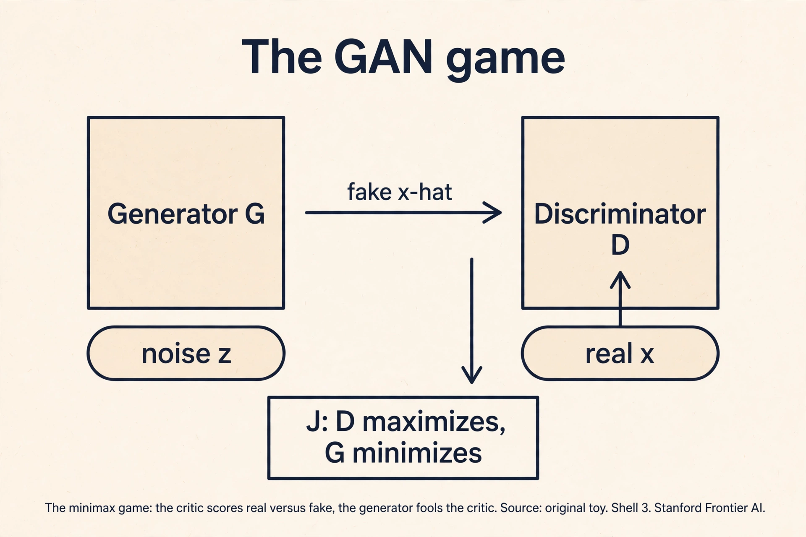
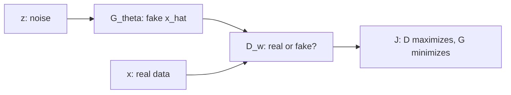
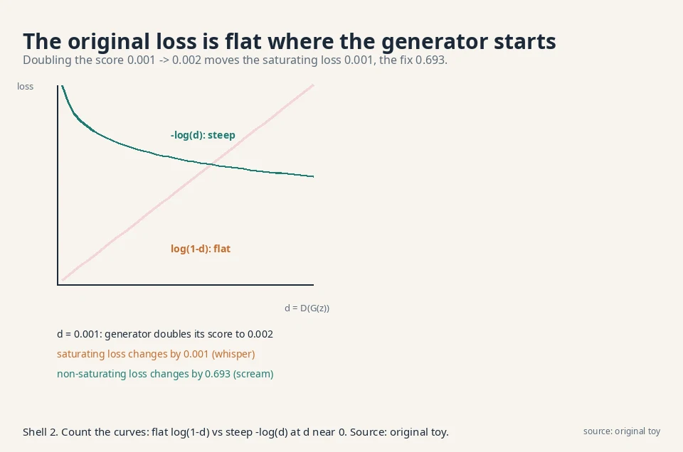
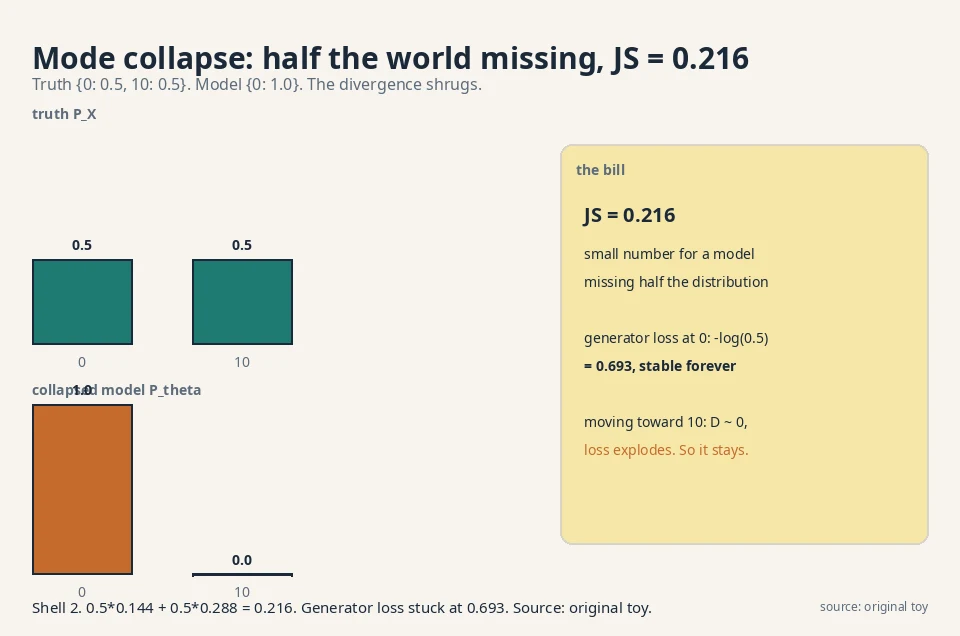
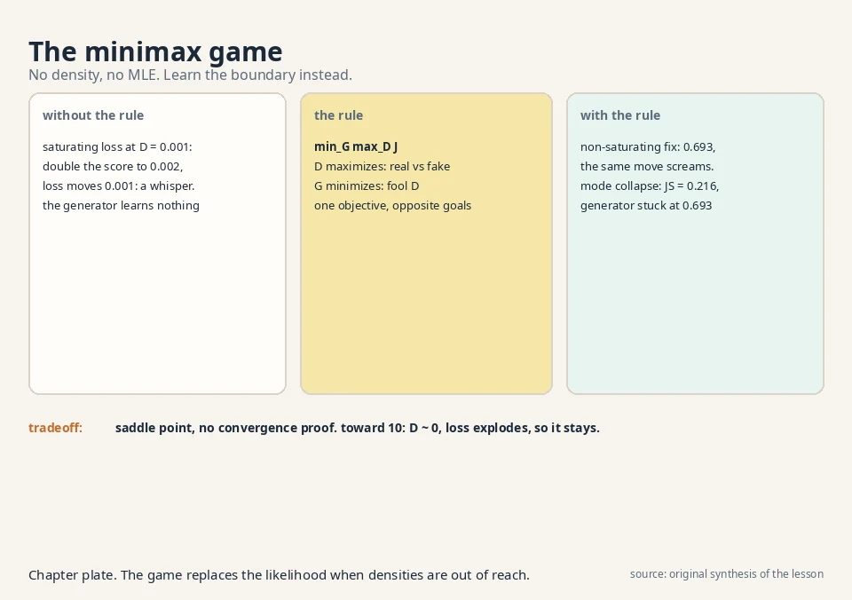

## The task: play the game from Lesson 3

Lesson 3 derived the objective. Now two neural networks play it.
The **generator** G_θ takes noise z and outputs a fake sample
x̂ = G_θ(z). The **discriminator** (the critic) D_w takes a
sample x and outputs D_w(x), its belief that x is real, a number
between 0 and 1. One objective, opposite goals:

```ascii
J = E[ log D(x) ] + E[ log(1 - D(x_hat)) ]
    x real               x_hat = G(z) fake

discriminator: maximize J   (call real "real", fake "fake")
generator:     minimize J   (fool the discriminator)
```

All logs in this lesson are natural logs (base e).

The discriminator wants D = 1 on real data and D = 0 on fakes.
The generator wants D = 1 on its fakes. This is a **minimax**
game: min over θ, max over w. Training alternates: a few
discriminator steps, then a generator step, repeat.

### The optimal discriminator, derived

Fix the generator. What is the discriminator's best
possible move? Maximize J pointwise: for each x, choose
D(x) in (0,1) to maximize p_X(x)·log D + p_θ(x)·log(1−D).
Differentiate and set to zero:

```ascii
p_X / D  -  p_theta / (1 - D) = 0
p_X * (1 - D) = p_theta * D
D*(x) = p_X(x) / ( p_X(x) + p_theta(x) )
```

The optimal critic reports the posterior probability
that x came from the data rather than the generator.
Where the data dominates, D* → 1. Where the generator
dominates, D* → 0. Where they tie, D* = 0.5.

### The game reduces to 2·JS − log 4

Plug D* back into J. The generator's problem becomes
minimizing C(G) = E_{p_X}[log D*] + E_{p_θ}[log(1−D*)].
A short rearrangement:

```ascii
C(G) = E_{p_X}[ log( 2*p_X / (p_X + p_theta) ) ]
     + E_{p_theta}[ log( 2*p_theta / (p_X + p_theta) ) ] - log 4
     = 2 * JS(P_X || P_theta) - log 4
```

So the minimax game, with an optimal discriminator,
minimizes the Jensen-Shannon divergence (up to the
−log 4 shift). This is the fact Lesson 3 derived from
the f-GAN side. The minimum is −log 4, reached when
P_θ = P_X and D* = 0.5 everywhere. One precondition:
the derivation divides by p_X + p_θ, which needs
p_X(x) + p_θ(x) > 0 at every x the expectations visit.

## First attempt: trace two rounds by hand

### The setup: a one-point world

Make everything tiny. Real data is a single point: x = 0,
always. The generator ignores noise and outputs a constant:
G(z) = θ. The discriminator is D(x) = sigmoid(w·x + b), one
weight and one bias. Sigmoid squashes any number into (0, 1).

Start: θ = 2, w = 0, b = 0.

```ascii
D(0) = sigmoid(0) = 0.5        (real point: coin flip)
D(2) = sigmoid(0) = 0.5        (fake point: coin flip)
J = log 0.5 + log(1 - 0.5) = -0.693 + -0.693 = -1.386
```

Both players are blind. The game starts at maximum confusion.

### The discriminator step: w 0 → −0.5

Maximize J. The gradient with respect to w: D(0) does not
depend on w (x = 0 kills it), but D(2) does. ∂J/∂w = −2·D(2)
= −1.0 at the start. Take a step of size 0.5: w = −0.5.

```ascii
D(0) = sigmoid(0) = 0.5        (unchanged)
D(2) = sigmoid(-1.0) = 0.269   (fake now looks fake)
J = log 0.5 + log(1 - 0.269) = -0.693 + -0.313 = -1.006
```

J rose from −1.386 to −1.006. The discriminator learned: real
stays 0.5, fake drops to 0.27. Note it could not raise D(0)
with w alone. The bias b would handle that on the next step.

### The generator step: θ 2 → 1.93

Minimize J over θ. ∂J/∂θ = −D(θ)·w.
At θ = 2: D = 0.269, w = −0.5, so ∂J/∂θ = +0.1345. Descend
with step 0.5: θ = 2 − 0.067 = 1.93.

The generator moved its output from 2 toward 0, toward the
real data. The discriminator's slope (w < 0: D falls as x
grows) told it which way was "more real".

### What the trace teaches

Two rounds, real numbers, and the game works: the fake inches
toward the data. The mechanism to remember: the generator
never sees the data directly. It only feels the discriminator's
slope. The slope is a compass, and the compass only works if
the discriminator is informative: not perfect, not useless.
That balance is the whole training problem, and both failures
below are the compass breaking.





## Where it breaks, part 1: the saturating loss

### The flat curve, counted

Now break it. Early in training the generator is terrible and
the discriminator is confident: D(G(z)) ≈ 0.001 on fakes. The
generator minimizes log(1 − D(G(z))). Watch the gradient it
gets. If the discriminator's score on the fake rises slightly,
from 0.001 to 0.002 (the generator improved a little), how
much does the loss change?

```ascii
saturating:      L = log(1 - d)
  d = 0.001 -> L = log(0.999) = -0.00100
  d = 0.002 -> L = log(0.998) = -0.00200
  change: 0.001. Almost nothing.
```

The curve log(1 − d) is flat near d = 0. The generator made
real progress (doubled its score) and the loss barely noticed.
The gradient vanishes exactly when the generator needs it
most: at the start, when it is bad. This is the **saturation**
of GAN training, the subject of W4L10.

### The fix: the non-saturating loss

The standard fix changes the generator's target. Instead of
minimizing log(1 − D(G(z))), maximize log D(G(z)): push the
fake's "real" score up directly. Same fixed point (both want
D = 1 on fakes), wildly different gradients:

```ascii
non-saturating:  L = -log(d)
  d = 0.001 -> L = 6.908
  d = 0.002 -> L = 6.215
  change: 0.693. Seven hundred times the signal.
```

Early in training the non-saturating loss screams while the
original whispers. Every practical GAN uses this variant.

### Same fixed point, different dynamics

The lecture's lesson: the minimax game is not one game. The
choice of which side's loss the generator optimizes decides
whether training moves at all. The fixed point is identical:
at D = 1 on fakes, both losses agree the generator is done.
But the path there differs completely. One path has gradients
at the start. The other does not. The decision rule: always
check the gradient magnitude at initialization, not just at
the solution. A loss with the right fixed point and dead
gradients is a broken loss.



## Where it breaks, part 2: mode collapse

### The collapsed equilibrium

The second failure is sneakier. The truth has two modes:
P_X = {0: 0.5, 10: 0.5}. Half the data sits at 0, half at 10.
The generator discovers that outputting 0 always fools the
discriminator half the time: D(0) = 0.5 forever (real 0s and
fake 0s are indistinguishable), and it never tries 10.

### JS = 0.216, computed

Compute what the objective thinks of this. The model is
P_θ = {0: 1.0, 10: 0.0}. The Jensen-Shannon divergence
between truth and model:

```ascii
M = average = {0: 0.75, 10: 0.25}
JS = 0.5 * KL(P_X || M) + 0.5 * KL(P_theta || M)
KL(P_X || M) = 0.5*log(0.5/0.75) + 0.5*log(0.5/0.25)
             = 0.5*(-0.405) + 0.5*(0.693) = 0.144
KL(P_theta || M) = 1.0*log(1.0/0.75) = 0.288
JS = 0.5*0.144 + 0.5*0.288 = 0.216
```

JS = 0.216. A small number. The divergence barely punishes a
model that deleted half the distribution. And the generator's
incentive is worse: at output 0 its loss is −log(0.5) = 0.693
under the non-saturating variant, stable forever. Any move
toward 10 gets D ≈ 0 and a terrible loss. The generator sits
at 0 and never explores. This is **mode collapse**: the model
covers one mode and abandons the rest, and neither the loss
nor the divergence complains loudly enough.

### Why the discriminator cannot save it

Why does the discriminator not fix it? It can: D(10) = 1.0
(real 10s are always real). But the generator never samples
near 10, so it never feels that gradient. The two-player
dynamics have a stable bad equilibrium, and gradient descent
walks straight into it. Lesson 2's forward KL would have
punished this (it is mode-covering: it visits the abandoned
mode and charges for the zero), but the GAN's JS-like
divergence does not. The decision rule for diagnosis: if
sample diversity collapses while the loss looks healthy,
suspect the divergence, not the architecture.



## The conditional variant: cGAN

### Conditioning both players

The game so far is unconditional: generate any plausible
x. The **conditional GAN** adds a label y (a class, a
caption, a segmentation map) to both players. The
generator takes (z, y) and must produce an x that fits
y. The discriminator takes (x, y) and judges the pair.

```ascii
J = E[ log D(x | y) ] + E[ log(1 - D(G(z | y) | y)) ]
```

### Worked: conditioning exposes collapse

Revisit the mode-collapse toy with labels. Truth: y = 0
means x = 0, y = 1 means x = 10, each with probability
0.5. The generator ignores y and outputs 0 always.

The unconditional discriminator saw D(0) = 0.5 and was
content. The conditional discriminator sees pairs.
D(0|0): real (0,0) pairs and fake (0,0) pairs tie at 0.5.
D(0|1): no real pair is ever (0,1), so D(0|1) = 0. When
the generator is asked for y = 1, its output 0 scores 0:
its non-saturating loss is −log(0) = infinity. The
collapse is exposed per class. Conditioning forces the
generator to cover every mode the label names. BigGAN's
class-conditional ImageNet generation is this mechanism
at scale.

 = 0: the pair (fake 0, label 1) has no real counterpart. Shell 2. Source: original toy. Project: Stanford Frontier AI.")

## The scaffolding: DCGAN and the training tricks

### DCGAN's architecture rules

The original GAN paper used fully connected networks.
**DCGAN** (Deep Convolutional GAN, Radford et al. 2016)
replaced them with convolutions and a short rule list
that became the default generator blueprint:

- Strided convolutions instead of pooling, in both
  networks. The network learns its own downsampling.
- Batch normalization in both networks (not on the
  generator's output layer or the discriminator's input).
- ReLU activations in the generator, LeakyReLU (slope
  0.2) in the discriminator, tanh on the generator's
  output.
- No fully connected hidden layers.

The rules are empirical, not derived. They stabilize
the two-player dynamics enough that the game trains on
64×64 images. Every convolutional GAN since, including
the StyleGAN line, descends from this blueprint.

### One-sided label smoothing

Train D with target 0.9 on real data instead of 1.0.
The mechanism: with target 1.0, D is rewarded for
infinite confidence (logits to infinity), which
saturates its sigmoid and kills the generator's
gradient. Target 0.9 caps the reward: D stops pushing
once it is confident enough, leaving gradient for the
generator. Only the real side is smoothed. Smoothing
the fake side encourages D to reward fakes.

### Minibatch discrimination

Give D a feature computed across the batch, e.g. the
standard deviation of each feature over the batch. If
the generator collapses and emits 64 identical faces,
the batch std is ~0 and D flags the batch as fake.
The mechanism attacks collapse directly: the generator
must now fool a critic that sees diversity, not just
single samples. StyleGAN's minibatch-stddev layer is
this trick, still in use.

### R1 regularization, worked

**R1 regularization** (Mescheder et al.) penalizes the
discriminator's gradient on real data:

```ascii
R1 = (gamma / 2) * E[ ||grad_x D(x)||^2 ],  x real
```

Work it: γ = 10 (the StyleGAN2 value), and suppose
||∇_x D(x)|| = 0.5 on a real batch. R1 = 5 · 0.25 =
1.25. The mechanism: a discriminator with steep
slopes near real data creates sharp cliffs the
generator falls off. Penalizing the slope smooths D
around the data manifold, which keeps the generator's
compass readable. It is applied lazily (every 16
steps in StyleGAN2) because the gradient-of-gradient
is expensive. The decision rule: R1 is the default
stabilizer for non-saturating GANs. It does not fix
mode collapse. It fixes the critic's manners.

### PacGAN: pack the batch

**PacGAN** packs m samples together and shows the
discriminator the pack. A collapsed generator emits
m near-identical samples per pack. The packed
discriminator spots the missing diversity directly:
real packs vary, fake packs repeat. The mechanism is
minibatch discrimination taken to the limit: the
whole input is the batch. The price is m times the
discriminator's input size. It mitigates collapse
without changing the divergence.

*0.25 on the real-data gradient. Shell 2. Source: original toy. Project: Stanford Frontier AI.")

## The honest price: the saddle point

### Three concrete costs

The GAN's bill comes due in the optimization itself. MLE
(Lessons 2, 6-9) minimizes one function: go downhill. The GAN
solves a saddle-point problem: the discriminator climbs while
the generator descends, simultaneously. There is no single
"loss going down" to watch. Training can oscillate, diverge,
or collapse, and the usual signs of progress lie.

Three concrete costs. First, balance: a too-strong
discriminator gives no gradient (saturation). A too-weak one
gives wrong gradients. Every step must keep the two players
matched. Second, no likelihood: the generator gives samples
with no density, so you cannot score it with MLE or compare
two GANs by a number from training. Lesson 5 builds the
external judge (FID). Third, mode collapse as demonstrated:
0.216 JS for a model missing half the world.

### The verdict

The lecture ends the adversarial block here with a verdict,
confirmed in the evaluation transcript: the instability of
saddle-point optimization is why state-of-the-art generation
moved to latent-variable models, which need no adversary.
Lessons 6 through 10 are that move.

| Failure | Demonstration | Number |
|---|---|---|
| Saturation | Doubling D(G(z)) from 0.001 | Saturating loss moves 0.001. Non-saturating moves 0.693 |
| Mode collapse | Truth {0: 0.5, 10: 0.5}, model {0: 1.0} | JS = 0.216. Generator loss stuck at 0.693 |
| No likelihood | Generator gives samples only | Cannot compute log P_θ(x). Need FID (Lesson 5) |

### Where GANs run in real systems

Verified deployments, October 2026:

The non-saturating loss from this lesson is the standard
generator objective in every practical GAN lineage, with
verified architectures around it:

- **DCGAN** (Radford et al. 2016): the convolutional
  blueprint above. [the paper.](https://arxiv.org/abs/1511.06434)
- **ProGAN** (Karras et al. 2018): grows generator and
  discriminator progressively from 4×4 to 1024×1024.
  [the paper.](https://arxiv.org/abs/1710.10196)
- **BigGAN** (Brock et al. 2019): class-conditional,
  large batches, the cGAN mechanism at ImageNet scale.
  [the paper.](https://arxiv.org/abs/1809.11096)
- **StyleGAN2** (Karras et al. 2020): non-saturating
  logistic loss with R1 regularization (γ on real-data
  gradients, applied lazily every 16 steps), Adam with
  β1 = 0, β2 = 0.99, mapping network z → w, weight
  demodulation. The sharpest faces of the GAN era.
  [the paper.](https://arxiv.org/abs/1912.04958)
- **Spectral normalization** (Miyato et al. 2018):
  divides each discriminator weight matrix by its
  largest singular value, capping the Lipschitz
  constant. A cleaner speed limit than WGAN's clipping.
  [the paper.](https://arxiv.org/abs/1802.05957)

What changed across the years was not the game but the
scaffolding: normalization, progressive resolution,
and bigger batches to keep the two players balanced.
When diffusion models arrived (Lessons 8-10), they won
on training stability, not on sample quality alone:
a plain minimization has no saddle point to fall off.
[uncertain] Whether any current frontier system still
trains pure GANs is not public.

## Videos for this lesson

<div class="video-block"><div class="video-wrap"><iframe src="https://www.youtube-nocookie.com/embed/2RMeQ5YxIxI" title="W4L10: Saturation of GAN training" allow="accelerometer; autoplay; clipboard-write; encrypted-media; gyroscope; picture-in-picture" allowfullscreen loading="lazy" referrerpolicy="strict-origin-when-cross-origin"></iframe></div><p class="video-cap">Lecture video: saturation of GAN training, the flat-gradient failure, on the board. If the embed is blocked: <a href="https://www.youtube.com/watch?v=2RMeQ5YxIxI" target="_blank" rel="noopener">watch on YouTube</a>.</p></div>

<div class="video-block"><div class="video-wrap"><iframe src="https://www.youtube-nocookie.com/embed/pWyRGWRUt6I" title="Generative Adversarial Networks (GANs) Explained" allow="accelerometer; autoplay; clipboard-write; encrypted-media; gyroscope; picture-in-picture" allowfullscreen loading="lazy" referrerpolicy="strict-origin-when-cross-origin"></iframe></div><p class="video-cap">External explainer: the GAN game, both losses, mode collapse, and the DCGAN architecture, with a PyTorch training loop. If the embed is blocked: <a href="https://www.youtube.com/watch?v=pWyRGWRUt6I" target="_blank" rel="noopener">watch on YouTube</a>.</p></div>



> [!QA]
> Q: What is the GAN game, exactly?
> A: Two networks, one objective J = E[log D(x)] + E[log(1 − D(G(z)))]. The discriminator maximizes J: output near 1 on real data, near 0 on fakes. The generator minimizes J: make fakes score near 1. In the hand trace, the discriminator step moved w from 0 to −0.5 (J rose from −1.386 to −1.006) and the generator step moved θ from 2 to 1.93, toward the data.
> Follow-up: Why alternate instead of training one then the other?
> A: Because each player's best move depends on the other's current state. A fully trained discriminator against a fixed bad generator gives no useful gradient (saturation), and a generator trained against a fixed weak discriminator fools only that weakling. They must co-evolve.

> [!QA]
> Q: Walk me through one more round of the hand trace. Where does θ go next?
> A: After round one: θ = 1.93, w = −0.5, b = 0. Discriminator step: D(0) = 0.5 still (x = 0 kills w), D(1.93) = sigmoid(−0.965) = 0.276. The w gradient is −2·D(θ)·(1−D(θ))·θ ≈ −2·0.276·0.724·1.93 ≈ −0.77, so w moves to about −0.89 with step 0.5. Generator step: ∂J/∂θ = −D·(1−D)·w·... with the steeper w, θ moves further toward 0. Each round the compass gets sharper as the discriminator improves.
> Follow-up: When does this trace stop converging?
> A: When the discriminator gets too good too fast. If w plunges to −10, D(θ) hits ~0, the sigmoid saturates, and the generator's gradient dies. That is saturation in miniature: the compass needle slams to the pin and stops pointing.

> [!QA]
> Q: What is saturation, and how do you fix it?
> A: Early in training D(G(z)) ≈ 0, and the original generator loss log(1 − D) is flat there: doubling the score from 0.001 to 0.002 changes the loss by 0.001. The fix is the non-saturating loss −log D(G(z)): the same improvement changes the loss by 0.693, seven hundred times the signal. Same goal, usable gradients.
> Follow-up: Does the fix change what the GAN converges to?
> A: The fixed point is the same (D = 1 on fakes), but the dynamics differ. The non-saturating variant is technically no longer the minimax game. It is a heuristic with the same equilibrium. In practice it is the only variant that trains.

> [!QA]
> Q: What is mode collapse, and why does the loss allow it?
> A: The generator covers one mode and ignores the rest: truth {0: 0.5, 10: 0.5}, model {0: 1.0}. The JS divergence is only 0.216, so the objective barely objects, and the generator's loss sits at a stable 0.693 with no incentive to explore 10. The discriminator knows 10 is real, but the generator never goes there to feel the gradient.
> Follow-up: Would forward KL have prevented it?
> A: Yes. Forward KL averages over the truth, visits the abandoned mode at 10, and charges infinity (the model assigns it probability zero). That is why the lecture calls forward KL mode-covering, and why VAE samples look blurry instead of collapsed: opposite failure, opposite cause.

> [!QA]
> Q: Your GAN's samples all look alike but the loss curve looks fine. Diagnose it.
> A: Mode collapse with a healthy-looking loss is the classic signature. Check sample diversity directly: cluster a few thousand samples and count occupied clusters, or eyeball a grid. If one cluster dominates, the generator found the collapsed equilibrium. The loss cannot see it because JS = 0.216 barely punishes the missing mode. Fixes, in order: check the critic is not too strong (a perfect critic hides the collapse), add minibatch discrimination or diversity pressure, or switch divergence families (Lesson 5).
> Follow-up: How do you tell collapse apart from a genuinely narrow dataset?
> A: Compare against the training data's own diversity. Cluster the real data the same way. If the real data fills 40 clusters and your samples fill 3, the generator collapsed. If the real data fills 3, the model is faithful.

> [!QA]
> Q: Why is GAN training harder to monitor than MLE training?
> A: MLE minimizes one function, so the loss going down means progress. The GAN solves a saddle point: the discriminator climbs while the generator descends. The generator's loss can fall because the generator improved or because the discriminator got worse. There is no single number to watch. Practitioners watch samples and external metrics (FID) instead of the training loss.
> Follow-up: What is the one training number you do watch?
> A: The discriminator's accuracy on a held-out split of real versus recent fake batches. If it sits near 100%, the critic is too strong and the generator gets no gradient. If it sits near 50%, the generator is winning or the critic is broken. Healthy training keeps it in between, moving slowly.

> [!QA]
> Q: Design a GAN training run for 64×64 face images. Name the failure guards.
> A: Generator: noise z through transposed convolutions to 64×64 (the DCGAN pattern). Discriminator: convolutions down to one score. Loss: non-saturating generator loss, never the original minimax form. Guards: (1) watch D's fake-batch accuracy. If it pins near 100% on real and 0% on fakes, the critic is too strong: rebalance update ratios. (2) Sample a grid every epoch and count distinct-looking faces to catch mode collapse early. (3) Track FID against a held-out set (Lesson 5) since the training loss is uninformative.
> Follow-up: The grid shows 50 near-identical faces by epoch 3. What broke?
> A: Mode collapse, early. The generator found one face that fools D and stopped exploring. Standard responses: strengthen diversity pressure, restart with a different seed, or accept that the JS-like divergence permits this equilibrium and move to a latent-variable model. Do not just train longer. The equilibrium is stable.

## Recap: the whole lesson on one screen

1. **The game.** D maximizes, G minimizes J = E[log D(x)] + E[log(1 − D(G(z)))].
2. **Hand trace.** D step: w 0 → −0.5, J −1.386 → −1.006. G step: θ 2 → 1.93, toward the data.
3. **Saturation.** At D(G(z)) = 0.001, doubling the score moves the original loss 0.001. Gradient dead on arrival.
4. **The fix.** Non-saturating loss −log D: same doubling moves the loss 0.693. Seven hundred times the signal.
5. **Mode collapse.** Model outputs only 0. Truth is half 0, half 10. JS = 0.216. The objective shrugs.
6. **Why it sticks.** The generator's loss at the collapsed point is a stable 0.693. Exploring 10 looks worse.
7. **The price.** Saddle-point optimization: no single loss to watch, balance required every step, no likelihood to score models.
8. **The verdict.** Instability is why the field moved to latent-variable models. Lessons 6-10.

## Official sources and further reading

**Official:**
- W2_L7: GANs formulation: [paper](https://www.youtube.com/watch?v=pLD5Q5cS4kI)
- W4L10: Saturation of GAN training: [paper](https://www.youtube.com/watch?v=2RMeQ5YxIxI)

**Further reading:**
- Goodfellow et al., "Generative Adversarial Nets" (2014):
  - [the original minimax game.](https://arxiv.org/abs/1406.2661)
- Arjovsky, Chintala, Bottou, "Wasserstein GAN" (2017):
  - [the answer to saturation (Lesson 5).](https://arxiv.org/abs/1701.07875)

**Caveats.** The objective, the two-player structure, and the saturation topic are confirmed in the W2_L6 and evaluation transcripts. The hand trace, the 0.001/0.693 saturation numbers, and the 0.216 mode-collapse computation are the lesson's own worked examples. [uncertain] The lecture's exact numeric demonstrations are unknown.

Scope exclusions, documented. The playlist's topic sequence lists two W3-W4 GAN topics the recovered transcripts do not treat, and they are excluded here rather than invented. **GAN inversion** (BiGAN, latent regression, bi-directional critics): the idea of learning an encoder alongside the generator to map data back to latent codes. The recovered lecture transcripts contain no substantive treatment, and the playlist's T7 (Bi-GAN) is a code tutorial, not math. **GANs as classifier-guided generative sampler** (W3L8): the reading of the GAN game as a classifier steering generation. The recovered transcripts contain no substantive treatment of this view beyond label conditioning, which the cGAN section above covers. Both remain honest gaps: named, not filled.

## Connections to the other courses

- **CS336 (training data):** that course asks what language models memorize versus generate. Mode collapse is the GAN analogue of memorization failure in reverse: instead of regurgitating training points, the generator regurgitates one mode. A worked tie: a collapsed generator producing the single most common training image scores D = 0.5 forever, exactly like a language model stuck repeating its most frequent phrase. Both are optimization equilibria, not bugs in the architecture.
- **CS229 L11 (diffusion models):** that course's models never play this game. Their loss is a plain minimization (denoising error), which is why their training curves go down monotonically while GAN curves oscillate. Lesson 9 derives that loss.
