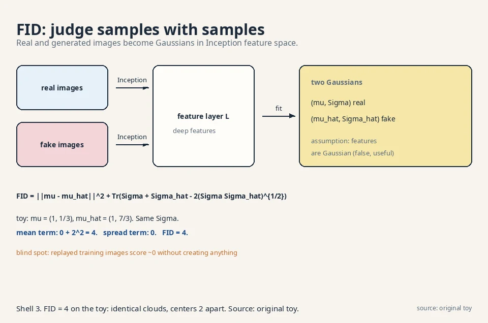
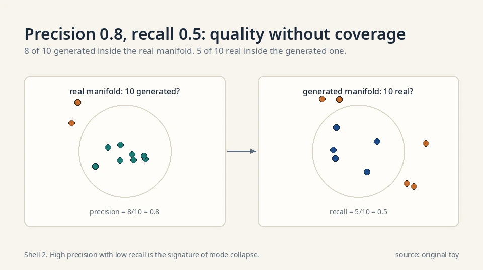
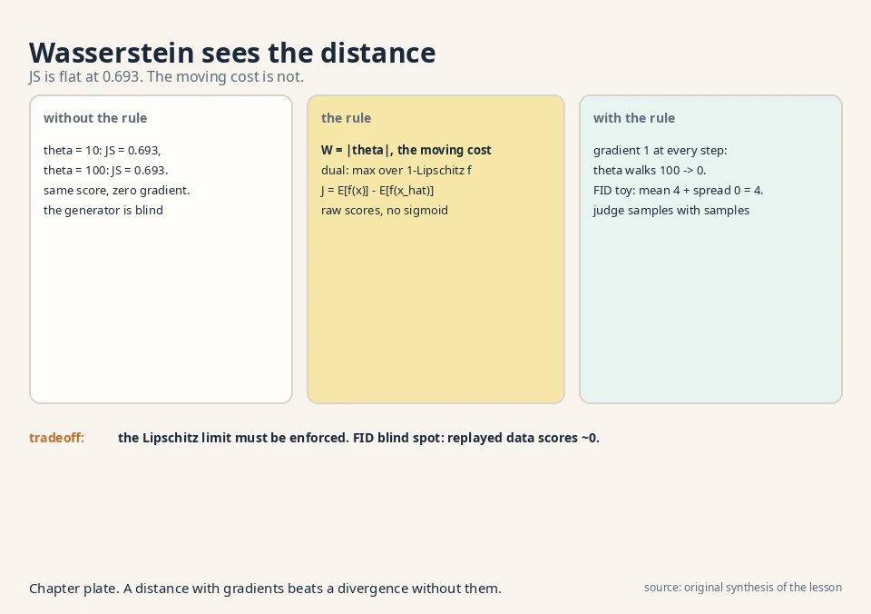

## The task: a distance that never goes numb

Lesson 4 left two open wounds. The JS-like divergence saturates:
when the model is far from the data, the distance sits near its
maximum and its gradient nearly vanishes, so the generator gets
no signal. And there is no way to score a trained generator,
because it has no likelihood.

Both wounds come from the same root: the divergences so far only
care about probability ratios at each point. When the model and
the truth do not overlap at all, the ratio is 0 or infinite
everywhere, and every such pair looks equally "maximally far".
A model 10 units away scores the same as a model 100 units away.
No gradient can point downhill if the whole surface is flat.

## First attempt: watch JS go flat

### The point-mass toy

Make the toy as stark as possible. The truth is a point mass at
0: P_X = {0: 1.0}. The model is a point mass at θ: P_θ = {θ:
1.0}. They never overlap (for θ ≠ 0).

### 0.693 twice: the number that says nothing

Compute the Jensen-Shannon divergence for θ = 10 and θ = 100.

```ascii
theta = 10:   P_X = {0: 1}, P_theta = {10: 1}, M = {0: 0.5, 10: 0.5}
  JS = 0.5*log(1/0.5) + 0.5*log(1/0.5) = log 2 = 0.693
theta = 100:  M = {0: 0.5, 100: 0.5}
  JS = log 2 = 0.693
```

Identical: 0.693 both times. JS cannot tell 10 from 100. Its
gradient with respect to θ is exactly zero. The generator is
lost: every direction looks the same. This is saturation made
quantitative, and it is why Lesson 4's generator stalled.
(All logs in this lesson are natural logs, base e.)

/d(theta) = 0. dW/d(theta) = 1. Shell 2. Source: original toy. Project: Stanford Frontier AI.")

## The key question

Is there a distance between distributions that keeps working
when they do not overlap: a distance that says 10 is closer
than 100?

## The new idea: the earth mover's distance

### Moving cost, not ratios

The **Wasserstein distance** (earth mover's distance) asks: how
much mass must be moved, times how far, to reshape one
distribution into the other? On the point-mass toy the answer
is obvious. All the mass sits at θ and must travel to 0:

```ascii
W(P_X, P_theta) = |theta - 0| = |theta|

theta = 10:   W = 10
theta = 100:  W = 100
```

Ten is closer than a hundred, and the gradient is constant:
dW/dθ = 1 (for θ > 0), pointing downhill no matter how far
apart the distributions are. No flat region. No saturation.
This is the whole appeal: a distance with usable gradients
everywhere.

The formal definition matches the intuition: W is the minimum,
over all ways of pairing mass between the two distributions,
of the average distance mass travels. For point masses there
is only one pairing, hence |θ|. For spread-out distributions
the pairing problem is real, but the property survives: W
varies smoothly as the distributions move.

### The dual form: Kantorovich-Rubinstein

To train with it, the lecture uses the dual form
(Kantorovich-Rubinstein): the Wasserstein distance equals the
best achievable value of E[f(x)] − E[f(x̂)] over all
**1-Lipschitz** functions f. Lipschitz is a speed limit: the
function's slope never exceeds 1 anywhere.

Why the speed limit is load-bearing: without it the max is
infinite. Set f huge on real points and hugely negative on
fakes, and the objective explodes. The "distance" becomes
meaningless. With the slope cap, the best f measures exactly
the earth-moving cost. The constraint is not a technicality.
It is what makes the dual equal the distance.

### The WGAN: the same game, new rules

The WGAN is therefore the Lesson 3 game with two changes:

```ascii
J = E[ f(x) ] - E[ f(x_hat) ]      (no logs, no sigmoid)
f must stay 1-Lipschitz            (the speed limit)
```

The critic outputs a raw score, not a probability. It
maximizes J. The generator minimizes it.

### The walk from 100 to 0, worked

On the point-mass toy with f(x) = −x (slope −1, valid): J =
E[−x] − E[−θ] = θ. Minimizing over θ drives θ to 0 with
gradient 1 at every step. The generator walks downhill from
100 to 0 without ever stalling. Compare: the JS game gave
gradient zero the whole way. The number to remember: 100
steps of size 1 land exactly at 0. Under JS, 100 steps of
size anything land nowhere.

] - E[f(xhat)] over 1-Lipschitz f. Shell 3. Source: WGAN paper. Project: Stanford Frontier AI.")

### Enforcing the speed limit, option 1: weight clipping

Enforcing the speed limit is the engineering. The original
WGAN clips the critic's weights to a small box after each
step, which crudely bounds the slope. It works but cripples
the critic's capacity: the critic can only use a corner of
its expressiveness. The price is a slower, more constrained
critic than the GAN's free one.

### Enforcing the speed limit, option 2: gradient penalty

The later gradient-penalty variant penalizes the slope
directly: add (||∇f|| − 1)² to the critic's loss. Same price
(a slower, more constrained critic), better training. The
decision rule: clipping is simpler and weaker. The gradient
penalty trains better and costs more tuning.

### Worked: the penalty is 40 on a slope-3 critic

The WGAN-GP (Wasserstein GAN with gradient penalty,
Gulrajani et al. 2017) loss for the critic is:

```ascii
L = E[f(x_hat)] - E[f(x)] + lambda * E[ (||grad f(x_mix)|| - 1)^2 ]
x_mix = epsilon * x + (1 - epsilon) * x_hat,  epsilon ~ Uniform(0,1)
```

Take the toy critic f(x) = −3x (slope 3, three times the
limit) and λ = 10, the paper's value. ||∇f|| = 3
everywhere, so the penalty is 10·(3−1)² = 40. The critic
pays 40 for speeding. Gradient descent on L shrinks the
slope toward 1, where the penalty hits 0. The mixture
points x_mix matter: the penalty is enforced on the
segments between real and fake points, exactly where the
dual's slope constraint binds.

### Spectral normalization: a cleaner speed limit

A linear layer's Lipschitz constant is its largest
singular value σ_max(W). **Spectral normalization**
divides each weight matrix by its σ_max after every
step, capping each layer's slope at 1. A stack of such
layers has total slope at most 1.

Worked: W = [[2, 0], [0, 0.5]]. Its singular values are
2 and 0.5, so σ_max = 2. Normalize: W/2 =
[[1, 0], [0, 0.25]]. The layer can no longer amplify
any input direction by more than 1. Unlike clipping,
no capacity is fenced off: the weights keep their
directions, only the scale is capped. Unlike the
gradient penalty, there is no extra loss term to tune.
The σ_max is estimated by one power-iteration step per
update, cheap.

### What the other divergences say on the point-mass toy

For completeness, run the Lesson 3 family on the
point-mass toy (P_X = δ_0, P_θ = δ_θ, θ ≠ 0):

- KL: infinite (the model assigns 0 to the truth's
  point). Reverse KL: infinite. χ²: infinite.
- TV: ½(|1−0| + |0−1|) = 1. Constant: no gradient.
- JS: log 2 = 0.693. Constant: no gradient.
- Wasserstein: |θ|. Gradient 1.

Every ratio-based divergence is either infinite or
flat on disjoint supports. Only the moving-cost
distance sees the gap. This table is the whole
argument for Wasserstein in one glance.

## The second wound: judging without a likelihood

### The procedure, step by step

A trained generator has no density, so MLE cannot score it.
The lecture's answer is to judge samples against samples:
take real data and generated data, and measure the distance
between the two *sets*. The industry standard is the
**Fréchet Inception Distance**, FID.

The procedure, confirmed in the lecture transcript:

1. Take a pre-trained Inception network (a deep image
   classifier trained on ImageNet). Its inner layers are
   known to respond to the same visual structure humans
   notice.
2. Pass n real images and n generated images through it.
   Take the output of one deep layer (the L-th layer, a
   hyperparameter) as the **feature** of each image.
3. Compute the mean μ and covariance Σ of the real
   features, and μ̂, Σ̂ of the generated features.
4. Assume both feature sets are Gaussian. The FID is the
   Wasserstein (Fréchet) distance between those two
   Gaussians:

```ascii
FID = ||mu - mu_hat||^2  +  Tr( Sigma + Sigma_hat - 2*(Sigma*Sigma_hat)^{1/2} )
```

The first term punishes shifted centers. The second punishes
different spreads and correlations. Lower FID means the
generated distribution sits closer to the real one. FID = 0
means the two Gaussians match exactly.

### Worked: FID = 4 on six points

Work it by hand on a six-point toy. Real features (2-D):
(0,0), (2,0), (1,1). Generated features: (0,2), (2,2),
(1,3). Same cloud, shifted up by 2.

```ascii
mu_real = (1, 1/3)          mu_gen = (1, 7/3)
Sigma_real = Sigma_gen = [ 2/3   0  ]
                         [ 0    2/9 ]

||mu_real - mu_gen||^2 = 0^2 + 2^2 = 4
( Sigma_real * Sigma_gen )^{1/2} = Sigma_real   (they are equal)
Tr( Sigma + Sigma - 2*Sigma ) = 0

FID = 4 + 0 = 4
```

The whole distance comes from the mean shift, exactly as it
should: the clouds have identical shape, one sits 2 units
higher. If the generator also matched the center, FID would
be 0. One number, computed from samples, no likelihood
needed.

### Why features, not pixels

The lecture's cited study found Inception's inner layers track
human visual judgment. Pixel distance says a one-pixel shift
is a big change. Feature distance says it is nothing. A
generated face with perfect pixels but wrong structure scores
well on pixel metrics and badly on FID. FID judges what humans
would judge, approximately. The price: FID is an image metric.
For text or audio you need a different feature extractor, and
the "which layer" choice is a hyperparameter that moves the
number.



## The Inception Score: FID's older sibling

### The definition

Before FID, the field used the **Inception Score** (IS).
It uses the same Inception classifier but asks a
different question: for each generated image, how
confident is the classifier, and across images, how
diverse are the predicted classes?

```ascii
IS = exp( E[ KL( p(y|x) || p(y) ) ] )
     x generated
```

p(y|x) is the classifier's label distribution on one
image. p(y) is the average over all generated images.
The KL is large when each image is confidently one
class (sharp p(y|x)) and the classes vary across images
(flat p(y)). Both properties in one number.

### Worked: IS = 1.445 on two images

Two generated images, two classes. The classifier says
p(y|x_1) = {0.9, 0.1} and p(y|x_2) = {0.1, 0.9}: each
image confident, classes split evenly. The marginal is
p(y) = {0.5, 0.5}.

```ascii
KL per image = 0.9*log(0.9/0.5) + 0.1*log(0.1/0.5)
             = 0.9*0.588 + 0.1*(-1.609) = 0.368
IS = exp(0.368) = 1.445
```

A perfect score on 2 classes would be 2.0 (every image
certain, classes uniform). We get 1.445 because 0.9 is
not 1.0. Now the failure: a generator emitting one
perfect dog photo forever gets p(y|x) = {1.0, 0.0} and
p(y) = {1.0, 0.0}: KL = 0, IS = 1.0, the minimum. IS
punishes collapse. But a generator emitting real
training photos in class balance also scores well: IS
cannot detect memorization, same blind spot as FID.

### IS versus FID

IS never looks at real images: it judges generated
samples against the classifier's own idea of classes.
FID compares generated features to real features
directly. The decision rule: IS rewards sharp,
diverse samples even if they match no real data
distribution. FID rewards matching the real
distribution. Papers report both, and trust FID more.

 = 1.445. Perfect on 2 classes would be 2.0. Shell 2. Source: original toy. Project: Stanford Frontier AI.")

### The Fréchet distance in one dimension

In 1-D the Fréchet formula simplifies to
(μ−μ̂)² + (σ−σ̂)²: mean gap squared plus spread gap
squared. Two worked cases. N(0,1) vs N(2,1): same
spread, centers 2 apart. FID = 4 + 0 = 4. N(0,1) vs
N(0,4): same center, spreads 1 and 2. FID = 0 +
(1−2)² = 1. The first is a shifted cloud, the second
a fatter cloud. The formula prices them separately:
4 for the shift, 1 for the fattening. In high
dimensions the (ΣΣ̂)^{1/2} term does the same job
for the full covariance: it matches spreads and
correlations, not just centers.

### Precision and recall for GANs

FID is one number. **Precision and recall**
(Kynkäänniemi et al. 2019) split quality from
diversity. Embed real and generated images in
feature space. Around each set, build a manifold
from k-nearest-neighbor balls. Then:

- **Precision**: fraction of generated samples
  inside the real manifold. Are the fakes
  realistic?
- **Recall**: fraction of real samples inside the
  generated manifold. Does the generator cover the
  real variety?

Toy: 10 real points, 10 generated. 8 generated fall
inside the real manifold: precision 0.8. 5 real
fall inside the generated manifold: recall 0.5.
Read it: quality is decent, coverage is half. High
precision with low recall is the signature of mode
collapse: every sample looks real, but half the
world is missing. FID would report one middling
number. Precision/recall names the failure.



## The honest price

### Wasserstein's remaining costs

Wasserstein fixes saturation but not everything. The
Lipschitz constraint is awkward: weight clipping is crude
and the gradient penalty adds cost and tuning. WGAN training
is steadier than GAN training but slower, and mode collapse
can still happen (a collapsed model is still a valid low-W
point if the critic is weak). The saddle point is tamer, not
gone.

### FID's blind spots

FID has its own honest limits, and the lecture states the
frame plainly: it judges in feature space, not pixel space.
It needs the Inception network, so it is an image metric.
For text or audio you need a different feature extractor.
It assumes Gaussian features, which is false but useful.
It is biased by sample size (small n inflates it), and it
cannot detect memorization: a generator that replays training
images scores a perfect FID. Judging creation remains partly
human. The decision rule: never report FID alone. Pair it
with a memorization check (nearest-neighbor distances to the
training set) and a diversity check (cluster the samples).

| Wound from Lesson 4 | Answer | How | Number |
|---|---|---|---|
| Saturation (JS flat at 0.693) | Wasserstein distance | Gradient is 1 everywhere. No flat region | W = 10 vs W = 100. JS = 0.693 both |
| No likelihood to score models | FID | Wasserstein distance between Inception-feature Gaussians | Toy FID = 4, all from the mean shift |
| Mode collapse | Partially helped | Non-saturating gradients explore more, but collapse still possible | Not eliminated |

### Where this runs in real systems

Verified deployments, October 2026:

WGAN-GP (Gulrajani et al. 2017) became the stable
adversarial baseline for several years: it trains
without the saturation stalls of Lesson 4 and without
the capacity crippling of weight clipping. Progressive
GAN trained its early configurations with WGAN-GP
before switching to the non-saturating loss.

FID outlived the GAN era: it is still the standard
number for comparing image generators, including
diffusion models, because it needs only samples. The
landmark FID numbers, all on the same metric:

- DDPM (Ho et al. 2020): FID 3.17 on CIFAR-10,
  taking a clear bite out of the GAN-held record.
- ADM (Dhariwal and Nichol 2021): FID 4.59 on
  ImageNet 256×256 with classifier guidance,
  formally beating BigGAN-deep and ending the
  GAN era on that benchmark.
- StyleGAN papers report FID throughout: it is how
  the progressive-growing and style-based lines
  measured each gain.

When a paper reports "FID 3.2 versus 9.1", it is
running this lesson's six-point toy at scale: two
feature Gaussians, one Fréchet distance. [uncertain]
Exact FID values across papers are not comparable
unless the feature layer, sample count, and dataset
split match.

## Videos for this lesson

<div class="video-block"><div class="video-wrap"><iframe src="https://www.youtube-nocookie.com/embed/5Mchnh2xedI" title="W4L16: Evaluation of Generative Models" allow="accelerometer; autoplay; clipboard-write; encrypted-media; gyroscope; picture-in-picture" allowfullscreen loading="lazy" referrerpolicy="strict-origin-when-cross-origin"></iframe></div><p class="video-cap">Lecture video: evaluation of generative models, the FID procedure and formula on the board. If the embed is blocked: <a href="https://www.youtube.com/watch?v=5Mchnh2xedI" target="_blank" rel="noopener">watch on YouTube</a>.</p></div>



> [!QA]
> Q: Why is the Wasserstein distance better behaved than JS?
> A: JS only sees probability ratios, so non-overlapping distributions all score the max: 0.693 for θ = 10 and θ = 100 alike, gradient zero. Wasserstein measures moving cost: W = 10 versus W = 100, with a constant downhill gradient of 1. The generator always knows which way to go.
> Follow-up: What does the critic actually compute in a WGAN?
> A: It approximates the Kantorovich-Rubinstein dual: max over 1-Lipschitz f of E[f(x)] − E[f(x̂)]. No sigmoid, no logs. The Lipschitz speed limit keeps the max finite. Weight clipping enforces it crudely. The gradient penalty enforces it directly.

> [!QA]
> Q: Walk me through a Wasserstein computation on a new toy.
> A: Truth: half the mass at 0, half at 2. Model: all mass at 6. Pair the mass: the half at 0 travels 6, the half at 2 travels 4. Average distance: 0.5·6 + 0.5·4 = 5. So W = 5. The gradient with respect to the model's position is 1: move the mass left and W falls one-for-one. No flat region, no surprise.
> Follow-up: What if the model is all mass at 1, between the two truth points?
> A: Pair: half travels |0−1| = 1, half travels |2−1| = 1. W = 1. Moving the model to 0.5 gives 0.5·0.5 + 0.5·1.5 = 1.0. Same. The gradient is zero here: any point between 0 and 2 is equally good, because the mass is already bracketed. Wasserstein is honest about that too.

> [!QA]
> Q: Why does the WGAN critic need the Lipschitz constraint?
> A: Without the slope cap, the dual max is infinite: the critic makes f huge on real points and hugely negative on fakes, and the "distance" explodes. The 1-Lipschitz limit is what makes the max equal the earth-moving cost. It is load-bearing, not a technicality.
> Follow-up: Weight clipping versus gradient penalty?
> A: Clipping bounds the slope crudely by boxing the weights. It works but cripples the critic's capacity. The gradient penalty adds (||∇f|| − 1)² to the critic loss, enforcing the slope directly where it matters. Better training, more tuning.

> [!QA]
> Q: What is FID, concretely?
> A: Pass real and generated images through a pre-trained Inception net, take one deep layer's outputs as features, fit a Gaussian to each feature set, and compute the Fréchet (Wasserstein) distance between the Gaussians: ||μ − μ̂||² + Tr(Σ + Σ̂ − 2(ΣΣ̂)^{1/2}). In the hand toy the two clouds had identical shape with centers 2 apart, giving FID = 4. Lower is better. 0 is a perfect match.
> Follow-up: Why Inception features instead of pixels?
> A: Because the lecture's cited study found Inception's inner layers track human visual judgment. Pixel distance says a one-pixel shift is a big change. Feature distance says it is nothing. FID judges what humans would judge, approximately.

> [!QA]
> Q: Can FID be gamed?
> A: Yes. A generator that memorizes and replays training images gets FID near zero without creating anything. FID also assumes Gaussian features, is biased upward at small sample sizes, and only works where a good feature extractor exists (images). It is a judge, not a proof.
> Follow-up: Then why is it the standard?
> A: Because the alternatives are worse. Likelihood does not exist for GAN generators, human rating does not scale, and pixel metrics disagree with perception. FID is the best cheap proxy, used with its limits stated.

> [!QA]
> Q: Your new generator reports FID 6.0. Your baseline reports FID 6.5. Did you win?
> A: Not necessarily. FID is biased by sample size: fewer samples inflate it. If your run used 50,000 samples and the baseline used 10,000, the gap may be pure bias. Also the feature layer and dataset split must match. The decision rule: recompute both under identical settings (same n, same layer, same split) before claiming anything. A 0.5 gap under matched settings is a real but small win.
> Follow-up: What else do you check before shipping?
> A: Memorization and diversity. Nearest-neighbor distances from samples to training images (catches replay), and cluster counts over samples (catches mode collapse). FID alone certifies neither.

> [!QA]
> Q: When do you pick WGAN over a VAE or diffusion model?
> A: When you need the adversarial sample quality and can afford the saddle point. WGAN fixes GAN saturation but keeps the two-player dynamics. If your constraint is training stability above all, the latent-variable road (Lessons 6-10) has no adversary at all: plain minimization, monotone loss curves. The lecture's verdict is explicit: the field moved to latent-variable models because the saddle point, even tamed, is still a saddle point.
> Follow-up: Is there any task where the adversary is still the right call?
> A: Where sample sharpness per unit of compute matters most and you can babysit training. Historically that was high-resolution faces (the StyleGAN line). [uncertain] Whether any current frontier system still trains pure GANs is not public.

## Recap: the whole lesson on one screen

1. **The wound.** JS saturates: θ = 10 and θ = 100 both score 0.693. Zero gradient, no signal.
2. **The key question.** Is there a distance that works when distributions do not overlap?
3. **The answer.** Wasserstein: the cost of moving mass. W = |θ|: 10 vs 100, gradient 1 everywhere.
4. **The WGAN.** Same two-player game, new rules: raw critic scores, 1-Lipschitz speed limit, no logs.
5. **Worked.** With f(x) = −x, J = θ. The generator walks from 100 to 0 without stalling.
6. **The second wound.** No likelihood, so judge samples with samples: FID.
7. **Worked.** Six 2-D points, identical clouds shifted by 2: FID = 4, all from the mean term.
8. **The price.** Lipschitz enforcement is crude. FID needs Inception, assumes Gaussians, and cannot catch memorization.

## Official sources and further reading

**Official:**
- W4L11: Wasserstein GANs: [paper](https://www.youtube.com/watch?v=_IBfVkrvqAI)
- W4L16: Evaluation of Generative Models:
  - [FID procedure and formula confirmed in transcript.](https://www.youtube.com/watch?v=5Mchnh2xedI)

**Further reading:**
- Arjovsky, Chintala, Bottou, "Wasserstein GAN" (2017):
  - [the dual form and weight clipping.](https://arxiv.org/abs/1701.07875)
- Gulrajani et al., "Improved Training of Wasserstein GANs" (2017):
  - [the gradient penalty.](https://arxiv.org/abs/1704.00028)
- Heusel et al., "GANs Trained by a Two Time-Scale Update Rule Converge to a Local Nash Equilibrium" (2017):
  - [the paper that introduced FID.](https://arxiv.org/abs/1706.08500)

**Caveats.** The FID procedure, its formula, and the Inception/ImageNet details are confirmed in the W4L16 transcript. The W4L11 transcript was bot-blocked, so the WGAN treatment (duality, Lipschitz, clipping) follows the standard Arjovsky et al. presentation. [uncertain] The point-mass W = |θ| toy and the six-point FID = 4 computation are the lesson's own.

Scope exclusion, documented. The playlist's topic sequence lists **Domain Adversarial Networks** (DAN/UDA) in the W4 block: adversarial training applied to domain adaptation, where a domain classifier's gradient is reversed to learn domain-invariant features. The recovered lecture transcripts contain no substantive treatment, and the playlist's T8 (UDA) is a code tutorial, not math. It is excluded here rather than invented: a named gap, not a filled one.

## Connections to the other courses

- **CS229 L11 (diffusion models):** that course never needs FID for training (its loss is plain denoising error), but FID is still how its samples are judged against GAN samples in papers. A worked tie: a diffusion model with FID 3.2 beats a GAN with FID 9.1 on the same dataset, and the number means the diffusion model's feature Gaussian sits closer to the real one by exactly that Fréchet gap.
- **CS336:** the training-data memorization discussions there meet FID's blind spot here: a model that replays training data scores perfectly on FID while creating nothing. Both courses converge on the same warning: no single metric certifies generation.
