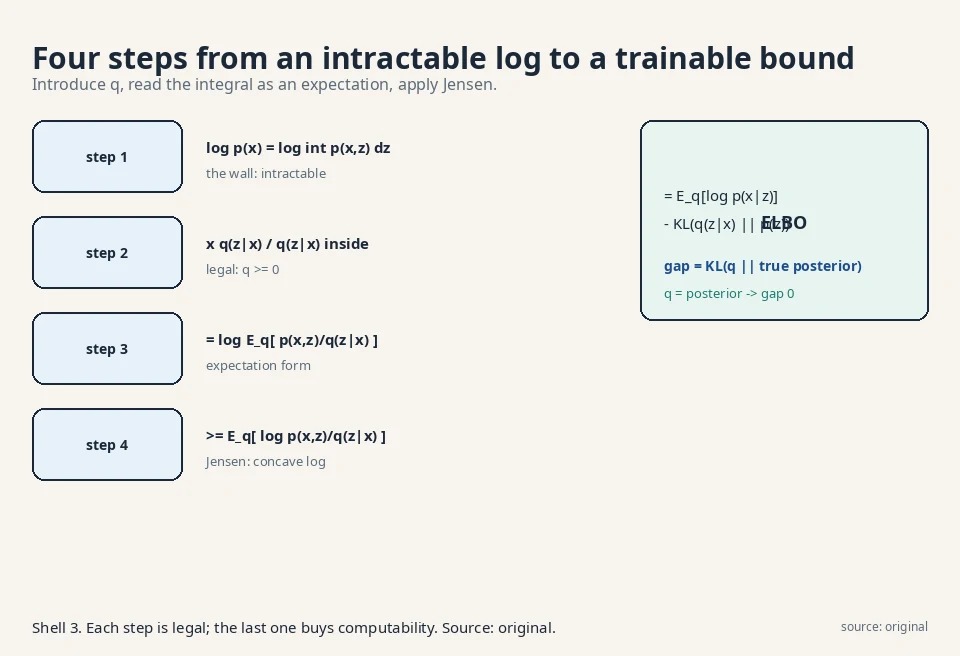
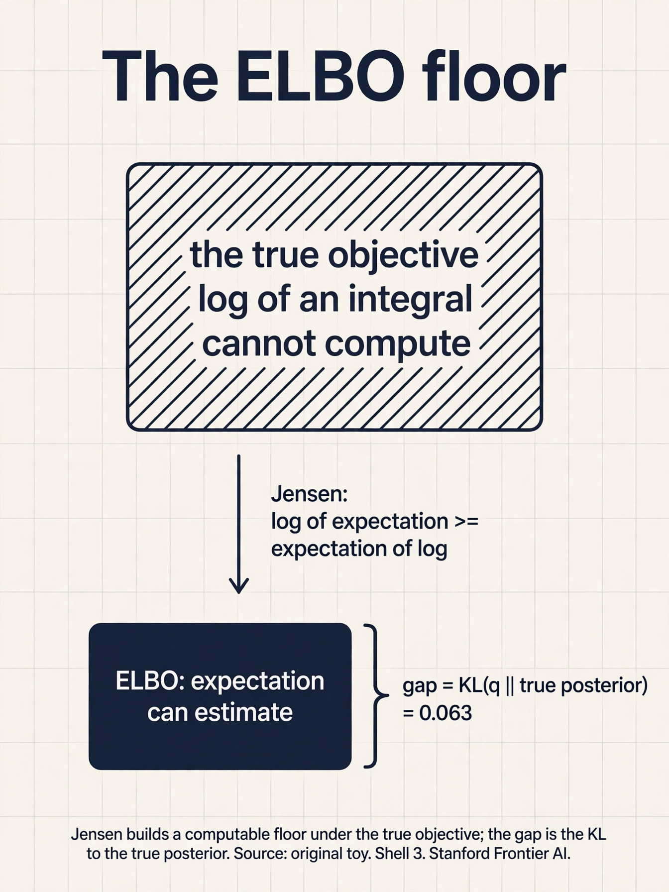
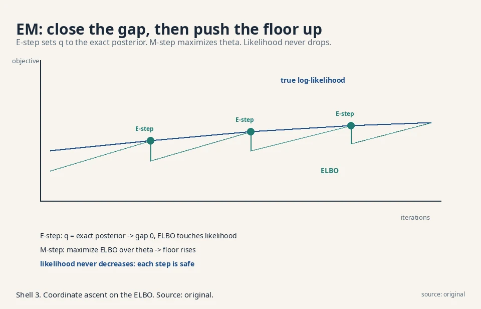
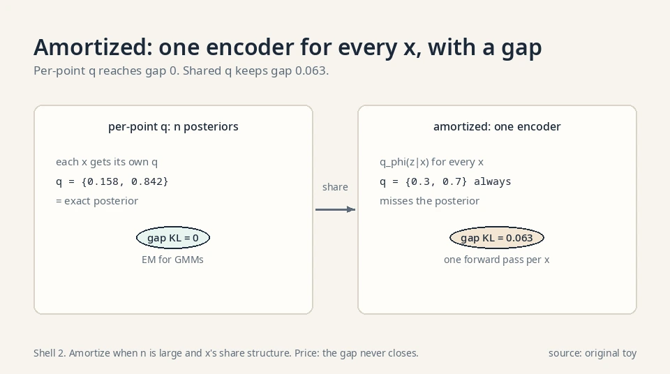

## The task: data with hidden causes

Look at a photo of a dog. The pixels are the data x. But the
photo was caused by things you never observe: the breed, the
pose, the lighting, the camera angle. Call those hidden causes
z, the **latent variable**. A **latent-variable model** says
the data comes from a two-stage story: first nature picks z,
then it renders x from z.

### The two-stage story, in math

In math: the model defines a joint distribution p_θ(x, z)
over the pair. The distribution of the data alone is the
**marginal**, obtained by summing (or integrating) out the
hidden part:

```ascii
p_theta(x) = sum over z of  p_theta(x, z)      (discrete z)
p_theta(x) = integral over z of p_theta(x, z) dz  (continuous z)
```

The joint usually factors into pieces you can write down:
p_θ(x, z) = p_θ(x | z) · p(z). The **decoder** p_θ(x | z)
renders data from causes. The **prior** p(z) says which
causes are plausible. The lecture's examples: in a Gaussian
mixture, z is which cluster a point came from. In a VAE, z
is a compressed code. In diffusion, z is a whole chain of
noisy versions.

### Why hide variables at all

Because real data is generated by hidden causes, and a model
that names them can do more than sample: it can infer (what
breed is in this photo?), edit (change the lighting), and
interpolate (morph one face into another). The latent space
is the model's imagination. A model without latents can only
push noise forward. A model with latents can reason backward
from data to causes.

Count the payoff on a toy. Two photo clusters, cats and dogs,
mixed in one dataset. A latent-free model must learn the full
mixture: every parameter fights both clusters at once. Name
one latent bit (cat/dog) and the decoder's job factors: learn
the cat conditional and the dog conditional separately. One
bit of latent structure turns one hard mixture into two easy
pieces. The decision rule: reach for latents when the data
varies along axes you can name (breed, lighting, pose). Skip
them when the variation is pure unstructured noise: there the
latent buys nothing and the inference machinery is pure
overhead. The failure mode of skipping latents on structured
data is entanglement: one knob changes breed and lighting at
once, and no edit is clean.

## Where direct likelihood breaks

### The wall: a log of an integral

Lesson 2 said: minimize KL, equivalently maximize
E[log p_θ(x)]. For a latent model, log p_θ(x) is the log of
an integral:

```ascii
log p_theta(x) = log  integral  p_theta(x, z) dz
```

Here is the wall. The integral sums over every possible
hidden cause. For a VAE the latent space has hundreds of
dimensions. The integral has no closed form. You cannot
compute the objective, so you cannot maximize it.

### Why sampling inside the log fails

The naive fix, approximate the integral by sampling z's and
averaging, fails inside the log: the average of p_θ(x, z)
over samples estimates the integral, but log(average) is not
average(log), and the estimator is badly biased for the sample
sizes we can afford. The log of an expectation is not the
expectation of a log. Remember that sentence. It is the whole
lecture.

Count the bias direction: log is concave, so log(average) ≥
average(log). The sample estimate of the integral, pushed
through the log, systematically overshoots. You would be
maximizing a biased number. The decision rule: never put a
Monte Carlo estimate inside a nonlinear function and trust
the result. Move the nonlinearity inside the expectation
first. That is what Jensen does.

### Jensen, on numbers: 1.609 ≥ 1.099

See the inequality on two values, 1 and 9, averaged
50/50. Log of the average: log(0.5·1 + 0.5·9) = log 5 =
1.609. Average of the logs: 0.5·log 1 + 0.5·log 9 = 0 +
1.099 = 1.099. So log E = 1.609 ≥ 1.099 = E log. The
concave log always bends this way: the chord between two
points on the curve sits below the curve. That gap,
1.609 − 1.099 = 0.510, is exactly the slack Jensen
exploits. The ELBO derivation runs the same move on an
integral instead of two numbers: pull the log inside the
expectation and the intractable log-of-integral becomes
a tractable expectation-of-log, at the price of that
slack. The slack has a name: the gap, a KL.

## The key question

How do you maximize a log of an integral you cannot compute,
using only expectations you can estimate from samples?

## The new idea: Jensen builds a floor under the log

### The derivation, step by step

The lecture's derivation, step by step, for one data point
(the expectation over data wraps around it later, since
expectation is linear).

**Step 1.** Write the likelihood as the marginal:

```ascii
L(theta) = log p_theta(x) = log integral p_theta(x, z) dz
```

### Step 2: smuggle in the variational guess q

Introduce any distribution q(z | x) over the latent
variable. Multiply and divide the integrand by it
(legal: q is non-negative, so the integral is unchanged):

```ascii
L = log integral  q(z|x) * [ p_theta(x, z) / q(z|x) ] dz
```

### Step 3: read the integral as an expectation

Read the integral as an expectation. The integral of q
times a function of z is the expectation of that function
under q:

```ascii
L = log  E_q[ p_theta(x, z) / q(z|x) ]
```

### Step 4: Jensen builds the floor

Now the enemy is visible: log of an expectation.
**Jensen's inequality** says for the concave log function,
log of an expectation is at least the expectation of the
log:

```ascii
log E_q[ . ]  >=  E_q[ log( . ) ]
```

Apply it:

```ascii
L(theta)  >=  E_q[ log p_theta(x, z) - log q(z|x) ]  =:  ELBO
```

This lower bound is the **Evidence Lower Bound**, ELBO
(the likelihood is also called the evidence). All logs
in this lesson are natural logs (base e). Instead of
the uncomputable log-likelihood, maximize this computable
expectation. The bound depends on θ (the model) and on q
(the **variational posterior**, our guess at the hidden
causes given the data). Training optimizes both.



### The gap is a KL

How tight is the floor? The gap is exactly
KL(q(z|x) || p_θ(z|x)), the distance from our guess q to
the true posterior. If q equals the true posterior, the
gap is zero and the ELBO touches the likelihood. The
worse our guess, the looser the bound. This one fact
organizes the next four lessons: EM sets q to the exact
posterior (gap zero, this lesson's end). VAEs learn q with a
network (small gap, Lesson 7). Diffusion fixes q to a
known noising process (gap irrelevant, Lessons 8-9).

This is not a new fact. It is the same multiply-and-divide
algebra rearranged. Start with the gap, likelihood minus
ELBO:

```ascii
gap = log p_theta(x) - E_q[ log p_theta(x, z) / q(z|x) ]
```

The likelihood does not depend on z, so push it inside the
expectation:

```ascii
gap = E_q[ log p_theta(x) ] - E_q[ log p_theta(x, z) / q(z|x) ]
```

Combine the two expectations. Expand the log of the ratio:

```ascii
gap = E_q[ log p_theta(x) - log p_theta(x, z) + log q(z|x) ]
```

Write p_θ(x,z) = p_θ(z|x) p_θ(x) and split the log of the
product. The log p_θ(x) terms cancel:

```ascii
gap = E_q[ log q(z|x) - log p_theta(z|x) ]
```

That is exactly the KL, in expectation form. KL(q(z|x) ||
p_θ(z|x)) = E_q[log q(z|x) − log p_θ(z|x)], the expectation
over q of the log-ratio of guess to truth. The two-coin toy
later computes this same form and gets 0.063.



### The two readable terms

The ELBO also splits into two readable terms:

```ascii
ELBO = E_q[ log p_theta(x | z) ]  -  KL( q(z|x) || p(z) )
       ^^^^^^^^^^^^^^^^^^^^^^^^     ^^^^^^^^^^^^^^^^^^^^^^^
       reconstruction: how well     regularization: keep the
       the causes explain the data  guess close to the prior
```

Fit the data, but do not invent exotic causes. Every VAE
loss you will ever see is these two terms.

## Worked by hand: the two-coin toy

### The setup and the truth

Data x is a coin flip. The hidden cause z is which coin was
used: coin 0 (biased to tails) or coin 1 (biased to heads).

```ascii
prior:      p(z=0) = 0.6,  p(z=1) = 0.4
decoder:    p(x=1|z=0) = 0.1,  p(x=1|z=1) = 0.8
data point: x = 1  (we saw heads)
```

True likelihood: p(x=1) = 0.6·0.1 + 0.4·0.8 = 0.06 + 0.32
= 0.38. Log-likelihood = log 0.38 = −0.968. (Here the sum
is over two values, so we can compute it. In real models
we cannot.)

True posterior (which coin, given heads):
p(z=0|x=1) = 0.06/0.38 = 0.158,
p(z=1|x=1) = 0.32/0.38 = 0.842.

### The ELBO, term by term

Now pick an approximate q: q(z=0|x=1) = 0.3,
q(z=1|x=1) = 0.7. Compute the ELBO term by term:

```ascii
z=0:  q * log(p(x,z)/q) = 0.3 * log(0.06/0.3)
                        = 0.3 * log(0.2) = 0.3 * (-1.609) = -0.483
z=1:  q * log(p(x,z)/q) = 0.7 * log(0.32/0.7)
                        = 0.7 * log(0.457) = 0.7 * (-0.783) = -0.548
ELBO = -0.483 + -0.548 = -1.031
```

The ELBO (−1.031) sits below the true log-likelihood
(−0.968), as a lower bound must. The gap: 0.063.

### The gap, to the digit

Check it against KL(q || true posterior):

```ascii
KL = 0.3*log(0.3/0.158) + 0.7*log(0.7/0.842)
   = 0.3*(0.641) + 0.7*(-0.185) = 0.192 - 0.130 = 0.063
```

Exactly 0.063. The gap is the KL, to the digit. And if we
set q to the true posterior {0.158, 0.842}, the ELBO
becomes −0.968: it touches the likelihood. The theory
holds on real numbers.

### The two-term split on the same toy

```ascii
reconstruction: 0.3*log(0.1) + 0.7*log(0.8)
              = 0.3*(-2.303) + 0.7*(-0.223) = -0.847
regularization: KL(q || p(z)) = 0.3*log(0.3/0.6) + 0.7*log(0.7/0.4)
              = 0.3*(-0.693) + 0.7*(0.560) = 0.184
ELBO = -0.847 - 0.184 = -1.031  (matches)
```

 to the digit. Shell 2. Source: original toy. Project: Stanford Frontier AI.")

## EM: the exact-posterior special case

### E-step: close the gap

The lecture's first application is the Gaussian mixture
model with the EM algorithm, and it is the cleanest
demonstration of the ELBO idea. A GMM says each data
point came from one of K Gaussian clusters. Z is the
cluster identity. The E-step sets q(z|x) to the exact
posterior (gap zero: the bound touches). On the two-coin
toy, one E-step moves q from {0.3, 0.7} to {0.158, 0.842}
and the ELBO jumps from −1.031 to −0.968.

### Worked: one EM step on {0, 10}

Data: two points, 0 and 10. Model: two Gaussians with
spread σ = 1, means μ_1 = 2, μ_2 = 8, equal weights.
E-step: compute each point's responsibility (posterior
probability) per cluster. The Gaussian density at
distance d is proportional to exp(−d²/2).

```ascii
x = 0:   p(0|mu_1=2) propto exp(-2)   = 0.1353
         p(0|mu_2=8) propto exp(-32)  = 0.0000 (about 1e-14)
         responsibilities: gamma_1 = 1.000, gamma_2 = 0.000
x = 10:  p(10|mu_1=2) propto exp(-32) = 0.0000
         p(10|mu_2=8) propto exp(-2)  = 0.1353
         responsibilities: gamma_1 = 0.000, gamma_2 = 1.000
```

The clusters are well separated, so the posteriors are
essentially hard: point 0 belongs to cluster 1, point
10 to cluster 2. M-step: refit each mean to its
responsibility-weighted points. μ_1 = (1.0·0)/1.0 = 0.
μ_2 = (1.0·10)/1.0 = 10. One EM iteration moved the
means from {2, 8} to {0, 10}: converged. The ELBO rose
at both steps, and with it the true likelihood. This
is the clean special case: exact posterior, gap zero,
monotone progress, no adversary.

### k-means: EM with the temperature at zero

**k-means** is EM's hard limit. Shrink the cluster
spread σ toward 0. The responsibilities sharpen: at
σ = 1 the toy gave 1.000 vs 0.000 already, but for
overlapping clusters, say a point at distance 1 from
μ_1 and 2 from μ_2, σ = 1 gives responsibilities
proportional to exp(−0.5) = 0.607 vs exp(−2) = 0.135,
i.e. 0.818 vs 0.182: soft. As σ → 0, the ratio
exp(−(d_1²−d_2²)/(2σ²)) goes to 0 or infinity: the
closer cluster takes everything. Soft assignments
become hard 0/1 assignments. The M-step then sets each
mean to the plain average of its assigned points. That
is exactly k-means: assign each point to the nearest
center, move centers to the averages, repeat. Same
ELBO, same coordinate ascent, with the posterior
frozen into a hard choice. The decision rule: use
k-means when clusters are well separated and speed
matters. Use EM when overlap is real and you need the
uncertainty.

### M-step: push the floor up

The M-step maximizes the ELBO over θ with q fixed. With
the gap closed, pushing the floor pushes the likelihood:
the two touch, so they move together. Repeat. Each E-step
tightens the floor to touch the likelihood. Each M-step
pushes the floor up. The likelihood never decreases.

### Why the likelihood never drops

EM is coordinate ascent on the ELBO, and it only works
because the posterior is computable for a GMM. When it is
not (VAEs, diffusion), we learn or fix q instead. That is
the rest of the course. The safety property to remember:
unlike GAN training, EM cannot oscillate. Every step is a
maximization. The price of that safety is the requirement
of an exact posterior, which is why EM does not scale to
neural decoders.



## The honest price: a floor is not the ceiling

### A loose bound can rise while the truth stalls

Maximizing the ELBO maximizes a lower bound, not the
likelihood. A loose bound can rise while the true
likelihood stalls: the optimizer games q instead of
improving θ. This is not hypothetical. VAEs suffer
"posterior collapse", where q ignores the data and the
bound is maximized by a model that learned nothing
(Lesson 7 shows it).

### The q family caps the tightness

Second, the bound's tightness is only as good as the q
family. A diagonal Gaussian q cannot touch a multimodal
true posterior, so the gap never closes no matter how
long you train. The decision rule: the q family is part
of the model. A weak q is a weak bound, and no optimizer
fixes it.

### The forward-KL heritage

Third, the ELBO trades the GAN's saddle point for a
plain maximization, which is stabler, but it pays with
the mode-covering blur of Lesson 2: the forward-KL
heritage pushes probability everywhere the data goes,
including the valleys between modes.

| Choice of q | Gap KL(q \|\| posterior) | Example |
|---|---|---|
| Exact posterior | Zero. ELBO touches likelihood | EM for GMMs |
| Learned network q_φ | Small if the family is rich | VAE (Lesson 7) |
| Fixed process | Gap irrelevant. Bound still trains θ | Diffusion (Lessons 8-9) |

### Amortized inference: one q for all x

EM fits a separate q per data point: n points, n
posteriors. The VAE **amortizes**: one encoder
network q_φ(z|x) serves every x. The cost of
inference is paid once (training the encoder),
then each new x gets its q in one forward pass.

The price is the **amortization gap**: the shared
network may not reach each point's best q, so the
bound is looser than per-point optimization would
give. On the two-coin toy, per-point q reaches the
exact posterior {0.158, 0.842} and gap 0. A tiny
encoder that outputs q = {0.3, 0.7} for every x
keeps gap 0.063 forever. The decision rule:
amortize when n is large and x's share structure
(images do). Optimize per-point when n is small
and each posterior matters.

### The ELBO as free energy

Physicists read the ELBO as negative free energy.
Write it as E_q[log p_θ(x,z)] + H(q), where H(q) is
q's entropy. The first term is minus the expected
energy (−log p is the energy of the configuration).
The second is entropy. Free energy = energy −
temperature·entropy, at temperature 1. Maximizing
the ELBO minimizes the free energy: find low-energy
configurations (explain the data) without freezing
into one (keep entropy). The KL gap is the
dissipation: how far the system sits from
equilibrium. Same math, older words.



### Where the ELBO runs in real systems

Verified October 2026: the ELBO is the training objective
of the VAE (Kingma and Welling 2013, Lesson 7), which
maximizes it with a learned encoder as q, and the ancestor
of the DDPM loss (Ho et al. 2020, Lessons 8-9), which
starts from it and simplifies until only the denoising
term survives. [uncertain] Beyond VAEs and diffusion,
ELBO-style bounds appear in many variational-inference
settings, but the exact forms are beyond this course's
sources.

## Videos for this lesson

<div class="video-block"><div class="video-wrap"><iframe src="https://www.youtube-nocookie.com/embed/zUJNypPc-Vo" title="W5L19: Gaussian Mixture Models: Expectation-Maximization Algorithm" allow="accelerometer; autoplay; clipboard-write; encrypted-media; gyroscope; picture-in-picture" allowfullscreen loading="lazy" referrerpolicy="strict-origin-when-cross-origin"></iframe></div><p class="video-cap">Lecture video: EM for Gaussian mixtures, the exact-posterior special case of the ELBO. If the embed is blocked: <a href="https://www.youtube.com/watch?v=zUJNypPc-Vo" target="_blank" rel="noopener">watch on YouTube</a>.</p></div>

<div class="video-block"><div class="video-wrap"><iframe src="https://www.youtube-nocookie.com/embed/9MbC6oQvh2g" title="Session 2: Variational Inference, Autoencoders, Variational Autoencoders" allow="accelerometer; autoplay; clipboard-write; encrypted-media; gyroscope; picture-in-picture" allowfullscreen loading="lazy" referrerpolicy="strict-origin-when-cross-origin"></iframe></div><p class="video-cap">External explainer: variational inference and the ELBO derived in full, through to the VAE and the reparameterization trick. If the embed is blocked: <a href="https://www.youtube.com/watch?v=9MbC6oQvh2g" target="_blank" rel="noopener">watch on YouTube</a>.</p></div>


> [!QA]
> Q: What is the ELBO, and why do we need it?
> A: The Evidence Lower Bound: ELBO = E_q[log p_θ(x,z) − log q(z|x)], a computable lower bound on the log-likelihood. We need it because the likelihood is a log of an intractable integral over hidden causes. Jensen's inequality converts log-of-expectation into expectation-of-log, which samples can estimate. In the toy, ELBO = −1.031 sits below the true −0.968.
> Follow-up: What exactly is the gap between ELBO and likelihood?
> A: KL(q(z|x) || p_θ(z|x)), the distance from our approximate posterior to the true one. In the toy it was exactly 0.063, matching to the digit. Set q to the true posterior and the gap vanishes: the bound touches.

> [!QA]
> Q: Walk me through the Jensen step. Why is it legal, and why does it help?
> A: Legal: q(z|x) is a distribution, so multiplying and dividing by it inside the integral changes nothing, and reading the integral as E_q is just notation. The inequality step uses Jensen: log is concave, so log E[·] ≥ E[log(·)]. It helps because E_q[log(·)] is an expectation of a computable quantity: sample z from q, evaluate, average. The log-of-expectation it replaced could not be estimated without bias.
> Follow-up: Could you apply Jensen the other way and get an upper bound?
> A: For a concave function the inequality goes one way only. Log E ≥ E log. A convex function would give the reverse. Since we need a lower bound to maximize safely, concavity of the log is exactly what the derivation needs. The log has that shape. No choice is involved.

> [!QA]
> Q: What are the two terms of the ELBO doing?
> A: ELBO = E_q[log p_θ(x|z)] − KL(q(z|x) || p(z)). The first term is reconstruction: given the guessed causes, how well does the model explain the data (−0.847 in the toy). The second is regularization: how far the guessed causes stray from the prior (0.184). Training fits the data without inventing exotic causes.
> Follow-up: Why subtract the KL to the prior?
> A: Without it, q would collapse onto whatever single z best explains each x, memorizing the data with absurdly specific causes. The prior term charges rent for unusual causes, forcing the latent space to stay smooth and sampleable.

> [!QA]
> Q: How is EM related to the ELBO?
> A: EM is coordinate ascent on the ELBO for models where the posterior is computable. E-step: set q to the exact posterior, closing the gap to zero. M-step: maximize the ELBO over θ. Each step cannot lower the bound, so the likelihood never decreases. VAEs and diffusion handle the case EM cannot: posteriors with no closed form.
> Follow-up: Why can EM not train a VAE?
> A: The VAE's posterior p_θ(z|x) has no closed form once the decoder is a neural network. There is no exact E-step. So the VAE learns q with a second network (Lesson 7) instead of computing it.

> [!QA]
> Q: The ELBO goes up during training but samples look bad. What happened?
> A: The bound loosened. The optimizer improved q (tightening is not guaranteed to help θ) or found a q that raises the bound without improving the model: posterior collapse, where q ignores x and sits on the prior. The diagnostic: check the KL term. If KL(q||p(z)) is near zero, the latents carry no information and the decoder learned to ignore them. The ELBO is high and meaningless.
> Follow-up: How do you fix posterior collapse?
> A: Weaken the KL pressure early (anneal its weight from 0 to 1), or use a more expressive decoder schedule. Lesson 7 works this failure in detail. The root cause is always the same: the bound, not the likelihood, is the objective, and the optimizer games it.

> [!QA]
> Q: You have a dataset of customer transactions with a hidden "fraud / not fraud" label per transaction. Fit a generative model. Which q do you use?
> A: The hidden label is discrete with 2 values, so the posterior is computable by Bayes' rule: q(z|x) = p(x|z)p(z)/p(x), exactly. Use EM: E-step computes the fraud probability per transaction, M-step refits the two transaction models. Gap zero, likelihood monotone. This is the textbook EM setting.
> Follow-up: Now the hidden cause is a 200-dimensional embedding from a neural encoder. What changes?
> A: The posterior has no closed form. EM is dead. Learn q with an encoder network (the VAE road, Lesson 7) and maximize the ELBO over both networks. The gap is now nonzero and the bound can be gamed, so watch the KL term for collapse.

> [!QA]
> Q: Why does the course call the ELBO the fork away from GANs?
> A: GANs measure the divergence with a critic and samples (Lessons 3-4): no likelihood, saddle point, instability. The ELBO maximizes a likelihood bound: plain maximization, monotone progress, no adversary. The price moves from training dynamics to bound looseness and the forward-KL blur. Lessons 7-10 walk the ELBO road to diffusion models, which is where the field went.
> Follow-up: Can you combine both roads?
> A: In principle: use an ELBO-trained decoder as the GAN generator, or a critic as an extra ELBO term. In practice the field picked the ELBO road for stability. The lecture's verdict (Lesson 4) is that the saddle point is why generation moved to latent-variable models.

## Recap: the whole lesson on one screen

1. **The task.** Data has hidden causes z. The model is the joint p_θ(x, z). The data likelihood marginalizes z out.
2. **Where it breaks.** log p_θ(x) = log integral p_θ(x,z) dz. The integral is intractable. Log-of-expectation resists sampling.
3. **The key question.** How do you maximize a log of an integral using only sample-estimable expectations?
4. **The fix.** Introduce q(z|x), multiply and divide, read as expectation, apply Jensen: ELBO = E_q[log p_θ(x,z)/q(z|x)].
5. **Worked.** Two-coin toy: ELBO −1.031, true −0.968, gap 0.063 = KL(q||posterior) to the digit.
6. **The split.** Reconstruction (−0.847) minus regularization (0.184). Fit the data, pay rent on causes.
7. **EM.** Exact posterior ⇒ gap zero ⇒ coordinate ascent on the ELBO. The clean special case.
8. **The price.** A floor, not the ceiling: loose bounds, restricted q families, and the forward-KL blur heritage.

## Official sources and further reading

**Official:**
- W5L17: Introduction to latent variable models: [paper](https://www.youtube.com/watch?v=UAnp6yU8K0A)
- W5L18: Evidence Lower Bound (ELBO):
  - [the full derivation confirmed in transcript.](https://www.youtube.com/watch?v=d9fDDUcQqq4)
- W5L19: GMM with EM: [paper](https://www.youtube.com/watch?v=zUJNypPc-Vo)

**Further reading:**
- Kingma and Welling, "Auto-Encoding Variational Bayes" (2013):
  - [the VAE paper. ELBO in section 2.](https://arxiv.org/abs/1312.6114)
- Blei, Kucukelbir, McAuliffe, "Variational Inference: A Review for Statisticians" (2017):
  - [the general ELBO/Jensen machinery.](https://arxiv.org/abs/1601.00670)

**Caveats.** The ELBO derivation, the Jensen step, the variational-posterior naming, and the "general principle for all latent-variable models including diffusion" framing are confirmed in the W5L18 transcript. The two-coin toy numbers are the lesson's own, hand-checked. [uncertain] The lecture's exact worked examples are unknown.

## Connections to the other courses

- **CS229 L10 (EM/PCA):** that course derives EM for GMMs and probabilistic PCA as alternating maximization. This lesson shows both are ELBO coordinate ascent. A worked tie: on the two-coin toy, one EM E-step sets q to {0.158, 0.842} (gap 0, ELBO −0.968), and the M-step then refits the coin biases toward the data. Same numbers, same mechanism, different course.
- **CS229 L11 (diffusion models):** that course trains diffusion models with a denoising loss, not an obvious ELBO. Lessons 8-9 derive why: the diffusion ELBO simplifies until only the denoising term survives. The bridge is this lesson's bound.
