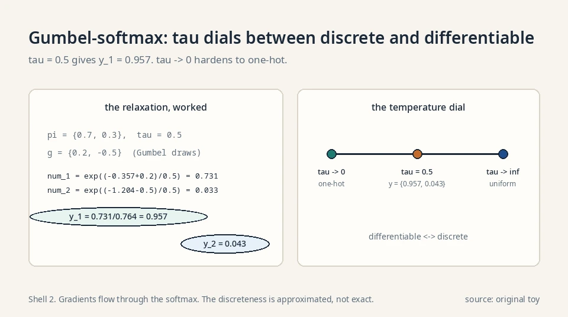
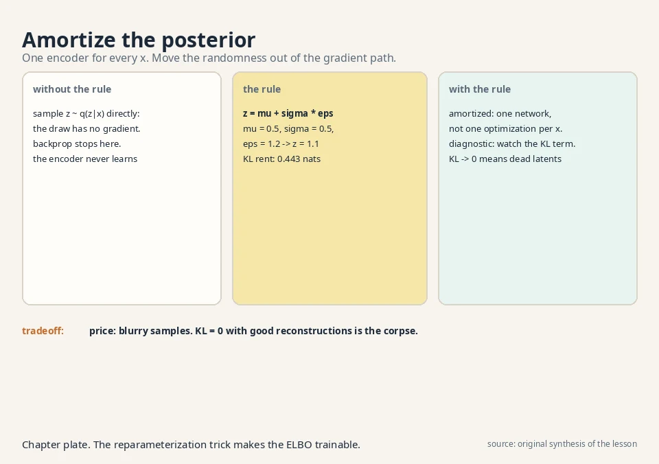

## The task: learn the guesser

Lesson 6 derived the ELBO but left q(z|x), the guess at the
hidden causes, as an abstract distribution. The VAE makes it
concrete: q is a neural network, the **encoder**. It takes a
data point x and outputs a distribution over causes. A second
network, the **decoder**, takes a cause z and outputs a
distribution over data. The prior p(z) is fixed to the
standard Gaussian, N(0, 1): causes live in a round, centered
cloud.

```ascii
x (photo) --encoder-->  q(z|x) = N(mu(x), sigma(x))  --sample--> z
                                                              |
z --decoder--> p(x|z) (reconstructed photo)                   |
                                                              v
                                                     prior: z ~ N(0, 1)
```

The encoder compresses. The decoder renders. The latent space
is the compressed imagination from Lesson 6, now with
coordinates a network learns.

### The loss a computer can evaluate

Concretely, the encoder outputs two vectors: μ(x), the most
likely causes, and σ(x), the uncertainty. So
q(z|x) = N(μ(x), diag(σ(x)²)): a Gaussian per data point.
The ELBO becomes a loss a computer can evaluate:

```ascii
loss = -E_q[ log p_theta(x|z) ]  +  KL( q(z|x) || N(0,1) )
        reconstruction error         keep causes near the prior
```

All logs in this lesson are natural logs (base e).

For a Gaussian decoder, the reconstruction term is the
squared pixel error between x and the decoder's output.
Familiar territory: an autoencoder. The KL term is the new
rent from Lesson 6.

## Where sampling breaks backprop

### The wall

Training needs the gradient of the loss with respect to the
encoder's weights. The reconstruction term is an expectation
over z ~ q(z|x), estimated by sampling. Here is the wall:
sampling is not differentiable. The operation "draw z at
random" has no gradient. Backpropagation stops at the random
draw, and the encoder never learns.

### The naive fix and its variance

The naive fix, the score-function estimator, differentiates
through the sampling probabilities instead. It works but its
variance is enormous: the gradient estimate jumps wildly
between samples, and training crawls. The variance scales
with the dimension of z and with how sharply the loss
changes between nearby points. In practice you need
many samples per step to
make progress, which is expensive. The lecture's answer is
cleaner.

## The key question

How do you draw a random sample whose gradient flows back
into the network that chose the distribution?

## The new idea: move the randomness out

### The trick

The **reparameterization trick**: do not sample from
N(μ, σ²) directly. Sample ε from N(0, 1), a fixed
distribution with no parameters, and set:

```ascii
z = mu + sigma * epsilon,   epsilon ~ N(0, 1)
```

If ε ~ N(0,1), then μ + σε ~ N(μ, σ²). Same distribution,
different plumbing. The randomness now lives in ε, which
has no knobs. The knobs μ and σ sit in a deterministic
formula, and gradients flow through them:

```ascii
dz/dmu = 1,   dz/dsigma = epsilon
```

### Worked with numbers

Work it with numbers. The encoder says μ = 0.5, σ = 0.5
for some x. Draw ε = 1.2 from the standard Gaussian.

```ascii
z = 0.5 + 0.5 * 1.2 = 1.1
```

The sample is 1.1. If the loss says "z should have been
smaller", the gradient flows: ∂z/∂μ = 1 (raise μ raises
z one-for-one), ∂z/∂σ = 1.2 (σ's effect scales with the
draw). The encoder learns from every sample. One line of
algebra removed the wall.

### Why the distribution is unchanged

The trick is not an approximation. A linear transform of a
Gaussian is exactly Gaussian: ε ~ N(0,1) implies
μ + σε ~ N(μ, σ²) with no error. The samples come from
the identical distribution the encoder specified. Only the
plumbing changed: randomness moved from the parameterized
node to a fixed node upstream. That is why the ELBO stays
exact and only the gradient estimator changes.

. Gradients flow through mu and sigma. Shell 3. Source: original toy. Project: Stanford Frontier AI.")

## The KL term, by hand

### The closed form

The regularization term also needs computing:
KL(q(z|x) || N(0,1)) for q = N(μ, σ²). For Gaussians this
has a closed form (per dimension):

```ascii
KL = -0.5 * ( 1 + log(sigma^2) - mu^2 - sigma^2 )
```

### The derivation, step by step

A math course shows the integral. KL(N(μ,σ²) || N(0,1))
is E_q[log q(z) − log p(z)]. Write both log-densities:

```ascii
log q(z) = -0.5*log(2*pi*sigma^2) - (z - mu)^2 / (2*sigma^2)
log p(z) = -0.5*log(2*pi)        - z^2 / 2
```

Subtract. The −0.5·log(2π) terms partially cancel:

```ascii
log q - log p = -0.5*log(sigma^2) - (z-mu)^2/(2*sigma^2) + z^2/2
```

Take the expectation under q. Two facts: E_q[(z−μ)²] =
σ² (the variance), and E_q[z²] = μ² + σ² (mean squared
plus variance). So:

```ascii
KL = -0.5*log(sigma^2) - sigma^2/(2*sigma^2) + (mu^2 + sigma^2)/2
   = -0.5*log(sigma^2) - 0.5 + mu^2/2 + sigma^2/2
   = -0.5 * ( 1 + log(sigma^2) - mu^2 - sigma^2 )
```

Preconditions: σ² > 0. The log needs a positive argument.
σ = 0 would be a point mass, not a Gaussian. The
formula is per dimension. For a d-dimensional diagonal
Gaussian, sum over dimensions. With μ = 0.5, σ² = 0.25:

```ascii
KL = -0.5 * ( 1 + log(0.25) - 0.25 - 0.25 )
   = -0.5 * ( 1 - 1.386 - 0.5 )
   = -0.5 * ( -0.886 )
   = 0.443
```

The encoder pays 0.443 nats of rent for placing its
causes at 0.5 ± 0.5 instead of at the prior's 0 ± 1.

### Reading the incentives

Read the formula's incentives: log(σ²) punishes tiny
σ (overconfidence), −μ² punishes drift from zero,
−σ² punishes excess spread. The cheapest q is the
prior itself (μ = 0, σ = 1 gives KL = 0), but then the
causes carry no information about x and reconstruction
suffers. Training balances the two terms automatically.


### The full training step, mechanical

Now the full training step is mechanical: encode x to
(μ, σ). Draw ε. Form z = μ + σε. Decode to x̂. Loss =
pixel error + 0.443-style KL. Backpropagate through
everything. Sampling, once the wall, is now one line.

## Where it breaks: posterior collapse

### The pathological balance

The balance can tip pathologically. Suppose the decoder
is powerful enough to model the data alone, ignoring z
entirely. Then the ELBO is maximized by setting q(z|x) =
p(z) for every x: KL = 0, reconstruction handled by the
decoder's own strength. The numbers look great (KL fell
from 0.443 to 0!) while the latent space died: z carries
zero information about x, and sampling z produces no
variety. This is **posterior collapse**. The model
technically optimized the bound and learned nothing.

### The diagnostic

Detect it by the KL term: healthy training keeps the KL
clearly above zero (the encoder is saying something).
A KL glued to zero with good reconstructions is the
corpse, not the success. The decision rule: plot the KL
per dimension over training. If all dimensions sit at
~0 while the reconstruction loss falls, the latents are
dead. Do not celebrate the low total loss. It is the
bound being gamed, exactly the failure Lesson 6 warned
about.


### The fixes: three answers

Posterior collapse has three standard answers. Weaken
the decoder: a less powerful decoder must lean on z.
Anneal the KL weight from 0 upward during training: let
reconstruction win early, then charge rent. Constrain
the bottleneck: the β-VAE and VQ-VAE variants below
develop this answer with worked numbers.

### β-VAE: the disentanglement dial, worked

**β-VAE** multiplies the KL term by β > 1:

```ascii
loss = reconstruction + beta * KL( q(z|x) || N(0,1) )
```

Take the toy q with KL = 0.443 and set β = 4. The rent
becomes 4 · 0.443 = 1.772 nats. The encoder now pays
four times more for every dimension it uses, so each
dimension must earn its keep in reconstruction savings.
Dimensions that carry redundant information get
priced out: their μ → 0, σ → 1, contributing nothing.
What survives is a sparse code where each live
dimension tends to control one generative factor
(pose, lighting, smile). That is **disentanglement**,
and β is the dial.

The price is exact: higher β, worse reconstruction.
At β = 1 the model is a plain VAE. At β = 4 the
reconstructions blur: the rent forces the encoder to
throw away fine detail. At β = 100 almost every
dimension dies and the model reconstructs the dataset
mean. The decision rule: raise β until the latents
disentangle, then stop before the reconstructions
dissolve. There is no free disentanglement.

### VQ-VAE: the snap mechanism, worked

**VQ-VAE** replaces the continuous Gaussian with a
discrete codebook: K learned vectors e_1..e_K. The
encoder outputs a continuous vector z_e(x). It snaps
to the nearest codebook vector:

```ascii
z_q = e_k,   k = argmin_j || z_e(x) - e_j ||
```

Work it. K = 4 codebook vectors in 2-D: e_1 = (1,0),
e_2 = (0,1), e_3 = (−1,0), e_4 = (0,−1). The encoder
outputs z_e = (0.8, 0.3). Squared distances:

```ascii
to e_1: (0.8-1)^2 + (0.3-0)^2 = 0.04 + 0.09 = 0.13
to e_2: (0.8-0)^2 + (0.3-1)^2 = 0.64 + 0.49 = 1.13
to e_3: (0.8+1)^2 + 0.09      = 3.24 + 0.09 = 3.33
to e_4: 0.64 + (0.3+1)^2      = 0.64 + 1.69 = 2.33
```

Nearest is e_1: z_q = (1, 0). The decoder sees only
(1, 0), never (0.8, 0.3). The latent the decoder uses
is an index k, a discrete token. Transformers eat
tokens.

### VQ-VAE: the two codebook losses, worked

Two losses train the codebook. The **codebook loss**
||sg[z_e] − e_k||² = 0.13 moves e_1 toward the
encoder's output (sg = stop gradient: the encoder is
frozen for this term). The **commitment loss**
β·||z_e − sg[e_k]||² with β = 0.25 gives 0.25 · 0.13 =
0.0325, pulling the encoder to commit to its chosen
code instead of drifting between codes. One loss moves
the codebook to the encoder. The other moves the
encoder to the codebook.

### VQ-VAE: the straight-through gradient estimator

The argmin has no gradient: a tiny change in z_e either
keeps the same nearest code or jumps to another. So
the decoder's gradient is copied straight through to
the encoder, as if the snap were the identity. That
copy is the **straight-through estimator**. It is
biased (the snap is not the identity), but it works:
the encoder learns to place z_e near codes the decoder
uses well.

Why it matters: no KL-to-Gaussian term, so no
posterior collapse of the VAE kind. That is why discrete
image tokenizers (VQ-VAE, VQGAN) became the standard
front end for autoregressive image models: the image
becomes a sequence of codebook indices, and Lesson 10's
chain rule takes over.

 snaps to e_1 = (1, 0). Distance 0.13, commitment 0.0325. Shell 2. Source: original toy. Project: Stanford Frontier AI.")

### Gumbel-softmax: reparameterizing the discrete

The reparameterization trick needs continuous
variables. For discrete latents, the **Gumbel-softmax**
gives a differentiable relaxation. To sample a
category with probabilities π_1..π_K: draw g_i =
−log(−log u_i) with u_i uniform (the Gumbel draw),
then

```ascii
y_i = exp( (log pi_i + g_i) / tau ) / sum_j exp( (log pi_j + g_j) / tau )
```

Work it: π = {0.7, 0.3}, temperature τ = 0.5, draws
g_1 = 0.2, g_2 = −0.5. Numerators: exp((−0.357 +
0.2)/0.5) = exp(−0.314) = 0.731, and exp((−1.204 −
0.5)/0.5) = exp(−3.408) = 0.033. So y_1 =
0.731/0.764 = 0.957, y_2 = 0.043. As τ → 0, y hardens
to a one-hot sample. As τ → ∞, y flattens to
uniform. The temperature is the dial between
differentiable and discrete. Gradients flow through
the softmax. The discreteness is approximated, not
exact.

### The aggregate posterior

The KL term matches each q(z|x) to the prior, but
generation samples z from the prior and decodes.
What matters is the **aggregate posterior**:
q̄(z) = E_x[q(z|x)], the mixture of all encodings.
If q̄ differs from p(z), prior samples land where
the decoder never trained.

Jensen gives the relationship:
E_x[KL(q(z|x)||p(z))] ≥ KL(q̄(z)||p(z)). The
per-point KL can be small while the aggregate still
mismatches: imagine q(z|x) = N(±3, 0.01) depending
on x, each far from N(0,1) in location but the
mixture... actually the per-point KL would be large
there. The real failure: each q(z|x) = N(0,1)
exactly (collapse), aggregate equals prior, but the
latents carry nothing. The diagnostic is behavioral:
sample z ~ p(z), decode, and look. If the samples
look nothing like reconstructions, the aggregate
and the prior have parted ways, whatever the KL
says.



## The honest price

The VAE's samples are blurry, and now you know exactly
why: three compounding causes. The forward-KL heritage
(Lesson 2) covers modes and generates in-between blends.
The Gaussian decoder assumes pixel noise, which smears
edges. And the diagonal-Gaussian q cannot express
multimodal posteriors, so the bound stays loose where
the truth is complex. The VAE won stability (plain
maximization, no adversary) and a usable latent space
(interpolate, edit, infer), and paid in sharpness.
Diffusion keeps the stability and reclaims the
sharpness. Lessons 8-10.

| VAE pain | Mechanism | Number |
|---|---|---|
| Cannot backprop through sampling | Reparameterization: z = μ + σε | ∂z/∂μ = 1, ∂z/∂σ = ε = 1.2 in the toy |
| KL term looks intractable | Closed form for Gaussians | 0.443 for μ = 0.5, σ² = 0.25 |
| Posterior collapse | Decoder ignores z. KL → 0 | KL 0 with good reconstructions = dead latents |
| Blurry samples | Forward KL + Gaussian decoder + diagonal q | Price of stability |

### Where VAEs run in real systems

The VAE's second life is compression, not generation.
Latent diffusion models compress images with a VAE
encoder into a small latent grid, run diffusion there,
and decode back: the VAE is the codec, diffusion is the
generator. The numbers, verified October 2026:

- **Stable Diffusion 1.x/2.x**: the autoencoder uses
  a downsampling factor of 8 and maps H×W×3 images to
  H/8×W/8×4 latents (per the official v1.5 model card).
  A 512×512×3 image becomes a 64×64×4 latent: 48×
  smaller. The latents are scaled by 0.18215 (the
  measured latent std) before diffusion. This is the
  kl-f8 VAE lineage from the latent-diffusion paper.
- **Stable Diffusion 3.5**: 16 latent channels at the
  same 8× downsampling: 128×128×16 for a 1024×1024
  image, 12× smaller. More channels, less bottleneck.
- **FLUX.1**: 16 latent channels as well (its VAE
  lineage), feeding the rectified flow transformer.

The reparameterization trick itself outlived the VAE:
any model that samples a continuous latent during
training uses it. β-VAE's disentanglement dial
survives in representation-learning research.
VQ-VAE's discrete codebook became the standard way to
tokenize images for transformer models. [uncertain]
DALL-E's dVAE and VQGAN details, and which current
production systems use each variant, are not verified
here.

## Videos for this lesson

<div class="video-block"><div class="video-wrap"><iframe src="https://www.youtube-nocookie.com/embed/RN3_gkjlYoA" title="W5L20: Variational Autoencoder (VAE)" allow="accelerometer; autoplay; clipboard-write; encrypted-media; gyroscope; picture-in-picture" allowfullscreen loading="lazy" referrerpolicy="strict-origin-when-cross-origin"></iframe></div><p class="video-cap">Lecture video: the VAE, encoder to decoder, the ELBO made concrete. If the embed is blocked: <a href="https://www.youtube.com/watch?v=RN3_gkjlYoA" target="_blank" rel="noopener">watch on YouTube</a>.</p></div>

<div class="video-block"><div class="video-wrap"><iframe src="https://www.youtube-nocookie.com/embed/hMsQLwxYHhQ" title="5 Types of Autoencoders Explained Visually" allow="accelerometer; autoplay; clipboard-write; encrypted-media; gyroscope; picture-in-picture" allowfullscreen loading="lazy" referrerpolicy="strict-origin-when-cross-origin"></iframe></div><p class="video-cap">External explainer: vanilla autoencoders versus VAEs, and where VQ-VAE and masked variants fit. If the embed is blocked: <a href="https://www.youtube.com/watch?v=hMsQLwxYHhQ" target="_blank" rel="noopener">watch on YouTube</a>.</p></div>



> [!QA]
> Q: What is the reparameterization trick?
> A: Rewrite sampling from N(μ, σ²) as z = μ + σ·ε with ε ~ N(0,1) fixed. The distribution is identical, but the randomness moved to the parameter-free ε, so gradients flow: ∂z/∂μ = 1, ∂z/∂σ = ε. In the toy, μ = 0.5, σ = 0.5, ε = 1.2 gave z = 1.1, and the encoder learns from that sample.
> Follow-up: Why not just use the score-function estimator?
> A: It differentiates through sampling probabilities and is unbiased, but its variance is so large that training needs far more samples to make progress. Reparameterization gives a low-variance gradient from a single sample. It only works for continuous variables you can reparameterize. Discrete latents need other tricks (VQ-VAE sidesteps this).

> [!QA]
> Q: Walk me through a reparameterization on fresh numbers.
> A: Encoder outputs μ = −1.0, σ = 2.0. Draw ε = 0.5. Then z = −1.0 + 2.0·0.5 = 0.0. Gradients: ∂z/∂μ = 1, so raising μ by 0.1 raises z by 0.1. ∂z/∂σ = 0.5, so raising σ by 0.1 raises z by 0.05. The KL rent for this q: −0.5·(1 + log 4 − 1 − 4) = −0.5·(1 + 1.386 − 5) = 1.307 nats. Expensive: the encoder placed its mass far from the prior and wide.
> Follow-up: The KL is 1.307. Is that good or bad?
> A: Neither by itself. It is the rent for an informative q. If reconstruction is excellent, the rent is justified. If the KL were 0.001 with the same reconstruction, the encoder would be saying nothing and the latents would be dead. Judge the KL against what the latents buy.

> [!QA]
> Q: What does the VAE loss actually compute?
> A: Reconstruction error plus KL(q(z|x) || N(0,1)). The encoder outputs μ(x), σ(x). You sample z = μ + σε, decode, and pay pixel error plus the KL rent. For μ = 0.5, σ² = 0.25 the rent is 0.443 nats. The loss balances fitting the data against keeping causes near the prior.
> Follow-up: What is posterior collapse?
> A: The decoder learns to ignore z, so the ELBO is maximized by q(z|x) = prior: KL = 0, reconstructions fine, latents dead. A KL glued to zero alongside good reconstructions is the diagnostic. Fixes: weaker decoder, KL annealing, or β-VAE/VQ-VAE variants.

> [!QA]
> Q: Derive the KL closed form check: q = prior. What do you get?
> A: μ = 0, σ² = 1. Plug in: −0.5·(1 + log 1 − 0 − 1) = −0.5·(0) = 0. Correct: identical distributions have zero KL. Now q = N(0, 0.01): −0.5·(1 + log 0.01 − 0 − 0.01) = −0.5·(1 − 4.605 − 0.01) = 1.807. A confident spike far from the prior's spread pays 1.8 nats. The log term is what punishes overconfidence.
> Follow-up: Why does the formula punish small σ so hard?
> A: Because log(σ²) → −∞ as σ → 0. A spike claims near-certainty about the cause, and the prior (spread 1) disagrees violently. The rent prices the disagreement. This is the mechanism that keeps the latent space smooth and sampleable.

> [!QA]
> Q: Why are VAE samples blurry?
> A: Three compounding reasons. The forward-KL objective is mode-covering: it spreads mass over all modes including the valleys between them. The Gaussian decoder models pixels as independent noise, smearing edges. The diagonal-Gaussian q cannot capture complex posteriors, leaving the bound loose. GANs look sharper because their JS-like objective tolerates dropping modes instead of blending them.
> Follow-up: What is β-VAE buying with its β?
> A: Disentanglement at the cost of fidelity. β > 1 raises the KL rent, forcing each latent dimension to justify itself, which empirically separates causes like pose and lighting into different dimensions. Reconstruction gets worse as β rises. It is a dial between interpretability and sharpness.

> [!QA]
> Q: Your VAE trains to low loss but interpolations between two faces jump instead of morphing. Diagnose it.
> A: The latent space is not smooth: nearby z values decode to unrelated images. Likely cause: the KL term is too weak relative to reconstruction (β effectively below 1, or annealing never ramped up), so the encoder placed data points in isolated islands with empty space between them. Sampling or interpolating through the gaps hits undecodable regions. Fix: raise the KL weight toward 1 and retrain, or check for partial posterior collapse on some dimensions.
> Follow-up: How do you verify smoothness directly?
> A: Linearly interpolate z between two encodings in 10 steps and decode each. Smooth morphing means a smooth space. Jumps mean islands. Also sample z ~ N(0,1) fresh: if the samples look nothing like reconstructions, the encoder's q has drifted from the prior and the prior is no longer a valid sampler.

> [!QA]
> Q: Design a VAE-based anomaly detector for factory sensor readings. How do the pieces map?
> A: Train a VAE on normal readings only. The encoder q(z|x) compresses each reading. The decoder reconstructs it. The anomaly score is the reconstruction error plus the KL. Normal data reconstructs well with low rent. Anomalous data either reconstructs badly (unseen pattern) or needs an exotic q (high KL). Threshold the sum on held-out normal data. The reparameterization trick is what makes the encoder trainable. Without it there is no gradient.
> Follow-up: Why not just use the reconstruction error alone?
> A: A powerful decoder can reconstruct anomalies too (it memorized the manifold broadly). The KL term catches the cases where the encoder had to contort q to explain the input. Both terms are the ELBO. Dropping one drops half the evidence signal.

## Recap: the whole lesson on one screen

1. **The task.** Make q(z|x) a neural network (encoder) and learn it with the decoder.
2. **Where it breaks.** Sampling z is not differentiable. Backprop stops at the random draw.
3. **The key question.** How do you differentiate through a sample?
4. **The fix.** z = μ + σ·ε, ε ~ N(0,1). Randomness moves to ε. Gradients flow: ∂z/∂μ = 1, ∂z/∂σ = ε.
5. **Worked.** μ = 0.5, σ = 0.5, ε = 1.2 → z = 1.1. KL rent = 0.443 nats by the closed form.
6. **Training.** Encode, sample, decode, pay pixel error + KL, backpropagate through everything.
7. **Posterior collapse.** KL → 0 with good reconstructions means the latents died. The decoder works alone.
8. **The price.** Blurry samples (forward KL + Gaussian decoder + diagonal q) in exchange for stability and a usable latent space.

## Official sources and further reading

**Official:**
- W5L20: Variational Autoencoder (VAE): [paper](https://www.youtube.com/watch?v=RN3_gkjlYoA)
- W6L21: Training VAE, reparameterization methods: [paper](https://www.youtube.com/watch?v=blh_AnhwIpw)

**Further reading:**
- Kingma and Welling, "Auto-Encoding Variational Bayes" (2013):
  - [reparameterization and the VAE loss.](https://arxiv.org/abs/1312.6114)
- Higgins et al., "β-VAE: Learning Basic Visual Concepts with a Constrained Variational Framework" (2017):
  - [the disentanglement dial.](https://openreview.net/forum?id=Sy2fzU9gl)
- van den Oord et al., "Neural Discrete Representation Learning" (VQ-VAE, 2017):
  - [discrete latents.](https://arxiv.org/abs/1711.00937)

**Caveats.** The W5L20 transcript was bot-blocked, so this lesson follows the standard Kingma-Welling presentation with the ELBO framing confirmed in the W5L18 transcript. [uncertain] The lecture's exact examples, its reparameterization variants, and its β-VAE/VQ-VAE emphasis are unknown.

## Connections to the other courses

- **CS229 L10 (EM/PCA):** that course shows PCA is the optimal linear compressor. A linear VAE recovers the same answer. Worked tie: data (2,1), (1,2), (−2,−1), (−1,−2) has covariance [[2.5, 2],[2, 2.5]], whose top eigenvector is (1,1)/√2 with eigenvalue 4.5. The optimal 1-D codes are the projections: ±3/√2 ≈ ±2.12. A linear VAE's ELBO is maximized by exactly this direction: PCA is the VAE with linear encoder, linear decoder, and no KL.
- **CS229 L11 (diffusion models):** that course's models can be read as VAEs with a very deep hierarchy of latents and a fixed encoder. Lessons 8-9 make that reading exact.
