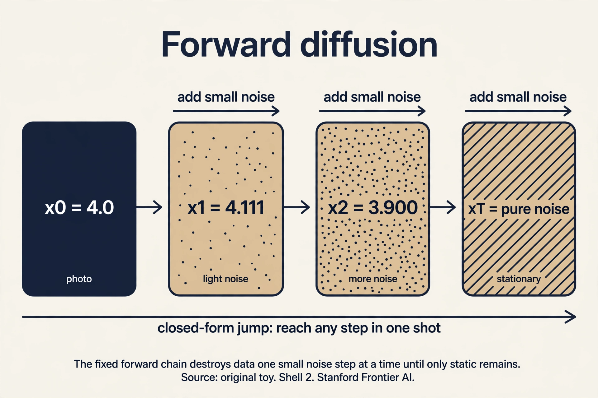

## The task: an encoder that cannot collapse

Lesson 7 ended with posterior collapse: the VAE's learned
encoder can die, and the latents with it. The diffusion
idea starts from a radical simplification. What if the
encoder is not learned at all? What if it is a fixed,
known procedure: take the data and add noise, step by step,
until nothing is left but static?

A **Denoising Diffusion Probabilistic Model** (DDPM) is a
latent-variable model with a twist the lecture states
plainly: it is a hierarchical VAE whose encoding process
is fixed. The latents are not one code vector but a chain
x_1, x_2, ..., x_T, each the same size as the data. (Note
the notation switch the lecture insists on: x_0 is the
data, x_1..x_T are latents. Earlier x_1..x_n meant data
points. Here they do not.)

```ascii
x_0 (photo) -> x_1 -> x_2 -> ... -> x_T (pure noise)
  add a little noise at each arrow. Nothing is learned here
```

The forward (encoding) chain is fixed. Only the reverse
(decoding) chain is learned: starting from pure noise,
remove a little noise at a time until a photo appears.
Generation is denoising.

## First attempt: destroy it in one step

Why many steps? Try one. Take the photo x_0, add a
truckload of noise, get x_1 ≈ pure noise. Now learn the
reverse: from pure noise, recover the photo in a single
jump. That reverse step must undo everything at once:
reconstruct all structure from nothing. It is exactly as
hard as the original generation problem. The fixed encoder
bought nothing.

The failure is about step size. A single giant denoising
step needs a model as powerful as a GAN generator, with
all the instability that implies. The information
destroyed in one leap cannot be recovered by a simple
learnable function.

## The key question

What if the destruction is split into many tiny steps, so
each reverse step only has to undo a little?

## The new idea: a Markov chain of small noises

The forward process adds a small Gaussian noise at each
step. With constants α_1..α_T (the **noise schedule**,
fixed numbers between 0 and 1):

```ascii
x_t = sqrt(alpha_t) * x_{t-1}  +  sqrt(1 - alpha_t) * epsilon_t
      ^^^^^^^^^^^^^^^^^^^^^^^^    ^^^^^^^^^^^^^^^^^^^^^^^^^^^^^
      keep most of the signal     add a little fresh noise
      epsilon_t ~ N(0, 1), drawn fresh each step
```

Read it: shrink the current image slightly toward zero,
then add a little static. Each step is random (the ε_t
draw) but nothing is learned. The chain is **Markov**:
x_t depends only on x_{t-1}, not on the earlier past.
Equivalently, the conditional is Gaussian:

```ascii
q(x_t | x_{t-1}) = N( sqrt(alpha_t) * x_{t-1},  (1 - alpha_t) * I )
```

Work two steps by hand. Data x_0 = 4.0 (one pixel, to
keep it visible). Schedule α_1 = α_2 = 0.9. Draws:
ε_1 = 1.0, ε_2 = 0.0.

```ascii
sqrt(0.9) = 0.9487,   sqrt(0.1) = 0.3162

x_1 = 0.9487 * 4.0 + 0.3162 * 1.0 = 3.7947 + 0.3162 = 4.111
x_2 = 0.9487 * 4.111 + 0.3162 * 0.0 = 3.900
```

The pixel drifted from 4.0 to 3.9: mostly signal, a
little noise. After many such steps the signal shrinks
away and only noise remains.

Now the beautiful fact the lecture uses constantly: you
can jump to any step in one shot. Unroll the recursion:
each step scales the signal by √α_t and adds independent
Gaussian noise. Gaussians add cleanly, so:

```ascii
x_t = sqrt(alpha_bar_t) * x_0  +  sqrt(1 - alpha_bar_t) * epsilon
alpha_bar_t = alpha_1 * alpha_2 * ... * alpha_t
epsilon ~ N(0, 1)
```

Check it against the hand computation. ᾱ_2 = 0.9·0.9 =
0.81, √ᾱ_2 = 0.9, √(1−0.81) = √0.19 = 0.4359:

```ascii
x_2 = 0.9 * 4.0 + 0.4359 * epsilon = 3.6 + 0.4359 * epsilon
```

Our chained result was 3.900, so ε = 0.688. Verify the
noise combined correctly: step 1 contributed
0.9487·0.3162·1.0 = 0.3 of noise, step 2 contributed 0.
Total noise variance: 0.3² = 0.09 = 1 − 0.81 ✓, and
0.3/0.4359 = 0.688 ✓. The closed form agrees to the
digit. Training uses this constantly: pick a random t,
jump straight there, no chaining.



At the end of the chain, ᾱ_T ≈ 0 (with α = 0.9 and
T = 100, ᾱ = 0.9^100 ≈ 0.00003), so x_T ≈ N(0, 1):
pure noise. The lecture notes this is the chain's
**stationary distribution**: run the noising forever and
you land on the standard Gaussian regardless of where
you started. That is why generation can start from
plain N(0,1) noise with no memory of any data point.

## The reverse: small steps, learnable

The model defines the reverse chain, mirroring the
forward one but with learned parameters:

```ascii
p_theta(x_{t-1} | x_t) = N( mu_theta(x_t, t),  Sigma_theta(x_t, t) )
p_theta(x_0..x_T) = p(x_T) * product over t of p_theta(x_{t-1} | x_t)
```

Each reverse step is Gaussian, like the forward step,
but its mean and variance are neural networks of the
current noisy image and the step number. Because each
forward step added only a little noise, each reverse
step only removes a little: an easy regression task,
not a giant generative leap. The joint
p_θ(x_0..x_T) is exactly the latent-variable form from
Lesson 6, with the whole chain as z. The ELBO for it
has no encoder parameters (the encoder is fixed), so
training learns only the denoiser. Lesson 9 turns that
ELBO into the famous simple loss.

Generation, once trained: draw x_T from N(0,1), then
for t = T down to 1, sample x_{t-1} from
p_θ(x_{t-1}|x_t). One thousand small denoising steps
later, a photo. Slow, but each step is easy, which is
why it works.

## The honest price

The chain's length T is the bill. Generating one image
costs T neural-network evaluations (typically 1000 in
the original DDPM). A GAN needs one forward pass. The
field spends enormous effort shortening this: DDIM
(Lesson 10) reuses the training to sample in 50 steps.

Second, the schedule α_t is a fixed hyperparameter.
Too fast (α small): the signal dies in a few steps and
most reverse steps learn nothing. Too slow: T must be
huge. The schedule is tuned by experiment, not derived.

Third, every latent has the data's full dimension. A
1000-step chain of 12,288-dimensional images is a heavy
object next to the VAE's single small code. Latent
diffusion (Lesson 10) answers by diffusing in a VAE's
compressed space instead.

| Design choice | What it buys | What it costs |
|---|---|---|
| Fixed encoder | No posterior collapse, ever | Cannot adapt the noising to the data |
| Many tiny steps | Each reverse step is easy regression | T network evals per sample (slow) |
| Closed-form jump | Train at any t in one shot | Schedule α_t is hand-tuned |
| Full-size latents | No information bottleneck | Heavy: T × data-dimension object |

> [!QA]
> Q: What is the forward process, concretely?
> A: A fixed Markov chain: x_t = √α_t x_{t-1} + √(1−α_t) ε_t, ε_t ~ N(0,1). Each step shrinks the signal slightly and adds a little noise. In the hand toy, x_0 = 4.0 became x_1 = 4.111 then x_2 = 3.900 with α = 0.9. Nothing is learned. The schedule α_t is fixed.
> Follow-up: Why is it a Markov chain?
> A: Because x_t depends only on x_{t-1}, not on earlier steps: q(x_t|x_{t-1}) is Gaussian with mean √α_t x_{t-1}. Given the previous noisy image, the past adds no information. That property is what makes the reverse chain learnable step by step.

> [!QA]
> Q: How do you sample x_t without chaining t steps?
> A: With the closed form: x_t = √ᾱ_t x_0 + √(1−ᾱ_t) ε, where ᾱ_t = α_1···α_t. Sums of independent Gaussians stay Gaussian, so all the step noises collapse into one. In the toy, ᾱ_2 = 0.81 gave x_2 = 3.6 + 0.4359ε, matching the chained 3.900 at ε = 0.688. Training picks a random t and jumps straight there.
> Follow-up: What happens as t grows large?
> A: ᾱ_t → 0, so x_t → N(0,1): pure noise, the chain's stationary distribution. With α = 0.9 and T = 100, ᾱ ≈ 0.00003. The starting image is forgotten, which is why generation can begin from fresh Gaussian noise.

> [!QA]
> Q: What does the model actually learn?
> A: Only the reverse: p_θ(x_{t-1}|x_t) = N(μ_θ(x_t,t), Σ_θ(x_t,t)). Each step removes a little noise, an easy regression, unlike the one giant leap of the naive attempt. Generation runs this in reverse from x_T ~ N(0,1) down to x_0. The ELBO trains it. Lesson 9 simplifies that ELBO.
> Follow-up: Why is this a VAE?
> A: It is a hierarchical VAE: the joint p_θ(x_0..x_T) is the latent-variable form with the whole chain as z. The difference is the encoder q is fixed (the noising chain), so there is no learned q to collapse and no encoder parameters in the ELBO. Fixed encoder, learned decoder, T latents instead of one.

## Recap: the whole lesson on one screen

1. **The task.** An encoder that cannot collapse: fix it to pure noising.
2. **First attempt.** One giant noising step: the reverse must recover everything at once. As hard as the original problem.
3. **The key question.** What if destruction is split into many tiny steps?
4. **The mechanism.** x_t = √α_t x_{t-1} + √(1−α_t) ε_t. Markov, Gaussian, fixed. Toy: 4.0 → 4.111 → 3.900.
5. **The shortcut.** x_t = √ᾱ_t x_0 + √(1−ᾱ_t) ε. Jump to any t in one shot. Verified to the digit.
6. **The end of the chain.** ᾱ_T → 0, so x_T ~ N(0,1): the stationary distribution. Start generation from plain noise.
7. **The reverse.** Learn p_θ(x_{t-1}|x_t) = N(μ_θ, Σ_θ): many easy denoising steps instead of one hard leap.
8. **The price.** T network evals per image, a hand-tuned schedule, and full-size latents at every step.

## Official sources and further reading

**Official:**
- W7L26: Denoising Diffusion Probabilistic Models:
  https://www.youtube.com/watch?v=N0OOnTKMYJE
- W7L27: DDPM formulation:
  https://www.youtube.com/watch?v=P8AiIW0Gg0s: forward process, Markov property, notation, stationary distribution confirmed in transcript.

**Further reading:**
- Ho, Jain, Abbeel, "Denoising Diffusion Probabilistic Models" (2020):
  https://arxiv.org/abs/2006.11239: the paper. Section 2 is this lesson.
- Sohl-Dickstein et al., "Deep Unsupervised Learning using Nonequilibrium Thermodynamics" (2015):
  https://arxiv.org/abs/1503.03585: the original diffusion idea.

**Caveats.** The forward-process definition, the √α scaling, the Markov property, the notation switch, and the "hierarchical VAE with fixed encoding" framing are confirmed in the W7L27 transcript. The hand numbers are the lesson's own. [uncertain] The lecture's exact schedule values and numeric examples are unknown.

## Connections to the other courses

- **CS229 L11 (diffusion models):** that course uses the same forward process and the same closed-form jump. A worked tie: with a schedule reaching ᾱ_500 = 0.5 at step 500, training samples x_500 = 0.707·x_0 + 0.707·ε in one shot: half signal, half noise. The model then learns to predict the ε half. Same equation, both courses.
- **CS229 L10 (EM/PCA):** EM's E-step computes a posterior over hidden causes. Here the "posterior" over the chain given x_0 is known in closed form (the forward process run backward is tractable per step). That is why diffusion needs no E-step: the fixed encoder makes the hidden causes' distribution known by construction.
