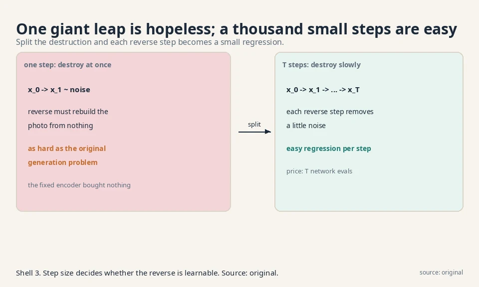
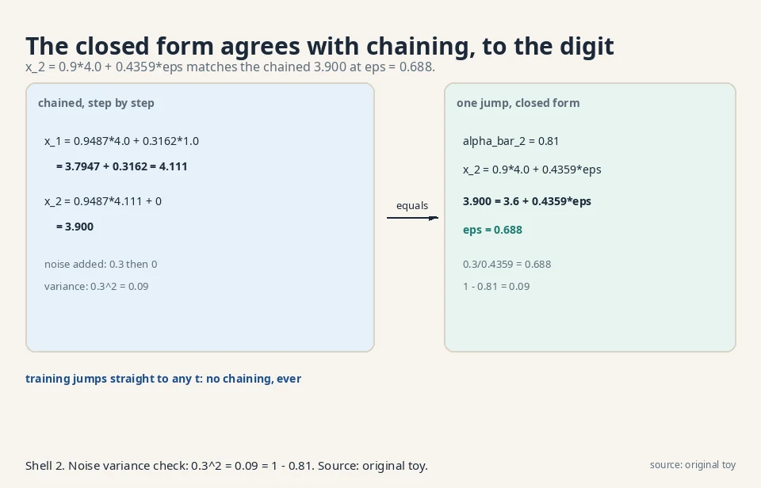
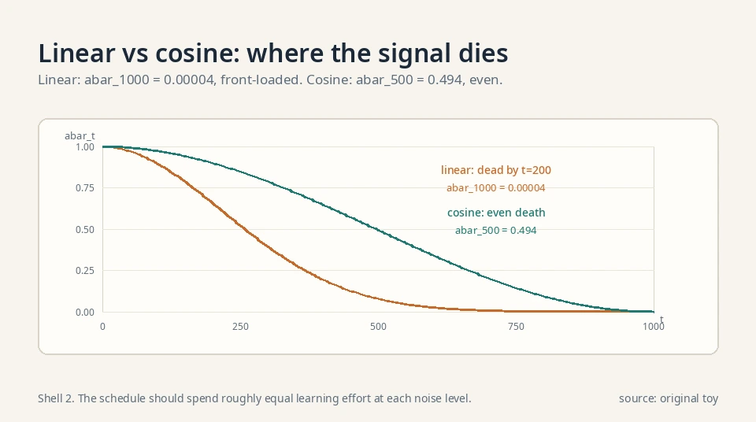
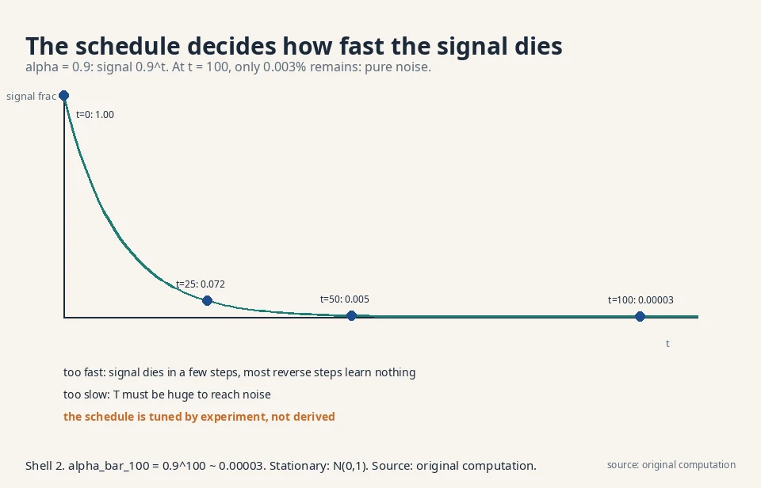
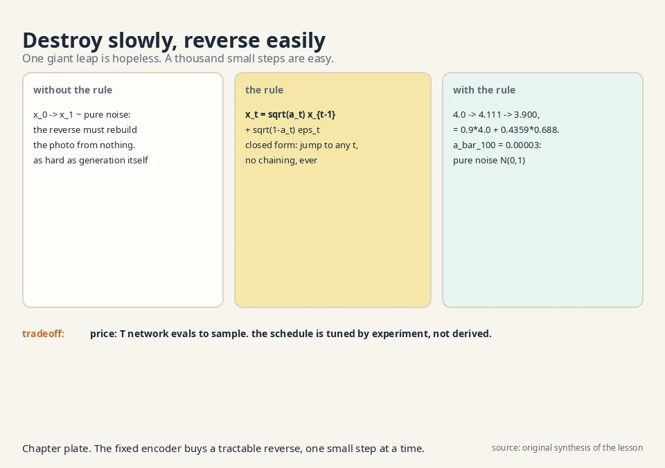

## The task: an encoder that cannot collapse

Lesson 7 ended with posterior collapse: the VAE's learned
encoder can die, and the latents with it. The diffusion
idea starts from a radical simplification. What if the
encoder is not learned at all? What if it is a fixed,
known procedure: take the data and add noise, step by step,
until nothing is left but static?

A **Denoising Diffusion Probabilistic Model** (DDPM) is a
latent-variable model with a twist the lecture states
plainly: it is a hierarchical VAE whose encoding process
is fixed. The latents are not one code vector but a chain
x_1, x_2, ..., x_T, each the same size as the data. (Note
the notation switch the lecture insists on: x_0 is the
data, x_1..x_T are latents. Earlier x_1..x_n meant data
points. Here they do not.)

```ascii
x_0 (photo) -> x_1 -> x_2 -> ... -> x_T (pure noise)
  add a little noise at each arrow. Nothing is learned here
```

The forward (encoding) chain is fixed. Only the reverse
(decoding) chain is learned: starting from pure noise,
remove a little noise at a time until a photo appears.
Generation is denoising.

### Why a fixed encoder kills collapse

Posterior collapse happened because the learned encoder
could choose q = prior and stop carrying information. A
fixed noising chain cannot choose anything. It destroys
information at a fixed rate by construction: x_t always
depends on x_0 through the known schedule. There is no
encoder to die. The price: the noising cannot adapt to
the data. It destroys a face and a blank wall at the same
rate, wasting steps on easy regions.

## First attempt: destroy it in one step

Why many steps? Try one. Take the photo x_0, add a
truckload of noise, get x_1 ≈ pure noise. Now learn the
reverse: from pure noise, recover the photo in a single
jump. That reverse step must undo everything at once:
reconstruct all structure from nothing. It is exactly as
hard as the original generation problem. The fixed encoder
bought nothing.

The failure is about step size. A single giant denoising
step needs a model as powerful as a GAN generator, with
all the instability that implies. The information
destroyed in one leap cannot be recovered by a simple
learnable function.



## The key question

What if the destruction is split into many tiny steps, so
each reverse step only has to undo a little?

## The new idea: a Markov chain of small noises

### The forward step

The forward process adds a small Gaussian noise at each
step. With constants α_1..α_T (the **noise schedule**,
fixed numbers between 0 and 1):

```ascii
x_t = sqrt(alpha_t) * x_{t-1}  +  sqrt(1 - alpha_t) * epsilon_t
      ^^^^^^^^^^^^^^^^^^^^^^^^    ^^^^^^^^^^^^^^^^^^^^^^^^^^^^^
      keep most of the signal     add a little fresh noise
      epsilon_t ~ N(0, 1), drawn fresh each step
```

Read it: shrink the current image slightly toward zero,
then add a little static. Each step is random (the ε_t
draw) but nothing is learned. The chain is **Markov**:
x_t depends only on x_{t-1}, not on the earlier past.
Equivalently, the conditional is Gaussian:

```ascii
q(x_t | x_{t-1}) = N( sqrt(alpha_t) * x_{t-1},  (1 - alpha_t) * I )
```

### Why the √α scaling

The scaling keeps the variance at 1. If x_{t-1} has
variance 1, then x_t has variance α_t·1 + (1−α_t)·1 = 1.
Without the shrink, adding noise each step would blow the
variance up to T. Without the fresh noise, the signal
would just fade. The pair keeps the chain on the unit
scale forever: the stationary distribution is reachable.

### Worked: two steps by hand

Work two steps by hand. Data x_0 = 4.0 (one pixel, to
keep it visible). Schedule α_1 = α_2 = 0.9. Draws:
ε_1 = 1.0, ε_2 = 0.0.

```ascii
sqrt(0.9) = 0.9487,   sqrt(0.1) = 0.3162

x_1 = 0.9487 * 4.0 + 0.3162 * 1.0 = 3.7947 + 0.3162 = 4.111
x_2 = 0.9487 * 4.111 + 0.3162 * 0.0 = 3.900
```

The pixel drifted from 4.0 to 3.9: mostly signal, a
little noise. After many such steps the signal shrinks
away and only noise remains.

### The closed-form jump

Now the beautiful fact the lecture uses constantly: you
can jump to any step in one shot. Unroll the recursion:
each step scales the signal by √α_t and adds independent
Gaussian noise. Gaussians add cleanly, so:

```ascii
x_t = sqrt(alpha_bar_t) * x_0  +  sqrt(1 - alpha_bar_t) * epsilon
alpha_bar_t = alpha_1 * alpha_2 * ... * alpha_t
epsilon ~ N(0, 1)
```

Check it against the hand computation. ᾱ_2 = 0.9·0.9 =
0.81, √ᾱ_2 = 0.9, √(1−0.81) = √0.19 = 0.4359:

```ascii
x_2 = 0.9 * 4.0 + 0.4359 * epsilon = 3.6 + 0.4359 * epsilon
```

Our chained result was 3.900, so ε = 0.688. Verify the
noise combined correctly: step 1 contributed
0.9487·0.3162·1.0 = 0.3 of noise, step 2 contributed 0.
Total noise variance: 0.3² = 0.09 = 1 − 0.81 ✓, and
0.3/0.4359 = 0.688 ✓. The closed form agrees to the
digit. Training uses this constantly: pick a random t,
jump straight there, no chaining.

### Why Gaussian noise

Three reasons the forward process uses Gaussians,
and each one is load-bearing. First, Gaussians are
closed under addition: the sum of independent
Gaussians is Gaussian. The induction above used
exactly this: without it, the closed-form jump
fails and training must chain all t steps. Second,
the central limit theorem: sums of many small
independent noises look Gaussian regardless of the
individual noise shapes, so the Gaussian is the
honest choice for accumulated corruption. Third,
the reverse step is Gaussian only because the
forward step is Gaussian and small: change the
noise family and the "learn a Gaussian reverse"
argument collapses. The decision rule: the noise
family is not a detail. It is what makes every
closed form in Lessons 8-9 true.

### Cold diffusion: what if the forward process is not noise

**Cold diffusion** asks whether the corruption must
be noise at all. Replace the Gaussian steps with
deterministic degradations: blur the image a little
more each step, or mask out a few more pixels. The
reverse learns to deblur, to inpaint. The chain is
still fixed, still Markov in the degradation level,
and the closed-form jump still works if the
degradation composes cleanly. [uncertain] Beyond the
lecture's scope. The point stands: the fixed-encoder
idea does not require randomness. It requires a
known, gradual destruction the reverse can learn to
undo.

### The induction, shown
A math course proves the jump, not just checks it.
Assume the form holds at step t−1:

```ascii
x_{t-1} = sqrt(a_bar_{t-1}) * x_0 + sqrt(1 - a_bar_{t-1}) * e_{t-1}
```

Apply one forward step:

```ascii
x_t = sqrt(a_t) * x_{t-1} + sqrt(1 - a_t) * e_t
    = sqrt(a_t * a_bar_{t-1}) * x_0
      + sqrt(a_t) * sqrt(1 - a_bar_{t-1}) * e_{t-1}
      + sqrt(1 - a_t) * e_t
```

The signal coefficient is √(α_t·ᾱ_{t−1}) = √ᾱ_t by the
definition of ᾱ. The two noise terms are independent
Gaussians, so they merge into one Gaussian whose
variance is the sum of the variances:

```ascii
noise variance = a_t * (1 - a_bar_{t-1}) + (1 - a_t)
               = a_t - a_t*a_bar_{t-1} + 1 - a_t
               = 1 - a_bar_t
```

So the merged noise is √(1−ᾱ_t)·ε with ε ~ N(0,1).
Base case t = 1 holds by definition (ᾱ_1 = α_1).
By induction the closed form holds for every t.
Preconditions: each ε_t independent with unit
variance, and α_t in (0,1) so the square roots are
real.




### The end of the chain: pure noise

At the end of the chain, ᾱ_T ≈ 0 (with α = 0.9 and
T = 100, ᾱ = 0.9^100 ≈ 0.00003), so x_T ≈ N(0, 1):
pure noise. The lecture notes this is the chain's
**stationary distribution**: run the noising forever and
you land on the standard Gaussian regardless of where
you started. That is why generation can start from
plain N(0,1) noise with no memory of any data point.

### Tuning the schedule

The schedule α_t decides how fast the signal dies, and
it is tuned by experiment, not derived. Too fast (α
small): the signal dies in a few steps and most reverse
steps learn nothing. Too slow: T must be huge to reach
noise. The decision rule: the schedule should spend
roughly equal learning effort at each noise level. In
practice that means a schedule where ᾱ_t falls smoothly,
not one that kills the signal in the first 10 steps.

### Two schedules, on numbers

The original DDPM uses a linear schedule: β_t rises
linearly from 10^{−4} to 0.02 over T = 1000 steps
(β_t = 1 − α_t). The endpoint: ᾱ_1000 = 0.00004. The
signal is thoroughly dead: 0.004% remains. But the
death is front-loaded: most of the signal vanishes in
the first 200 steps, starving the later steps of
learning signal.

The cosine schedule (Nichol and Dhariwal 2021) fixes
the shape: ᾱ_t = cos²(((t/T) + 0.008)/1.008 · π/2),
normalized to start at 1. It falls slowly at first,
linearly in the middle, slowly at the end. Numbers:
ᾱ_500 = 0.494, ᾱ_1000 ≈ 0. The signal dies evenly,
so every noise level gets its share of training.

The **signal-to-noise ratio** SNR_t = ᾱ_t/(1−ᾱ_t)
measures the mix. At ᾱ_t = 0.5, SNR = 1: half signal,
half noise (0 dB). Training samples t uniformly, so
the schedule decides which SNRs the network practices
on. A schedule that rushes through SNR = 1 produces a
denoiser that never learned the middle game.



### The continuous-time view (enrichment)

Beyond the lecture: as T → ∞ and step sizes shrink,
the chain becomes a stochastic differential equation.
The variance-preserving SDE is dx = −½β(t)x·dt +
√β(t)·dw. The forward process, the closed form, and
the score all have continuous-time twins. [uncertain]
The lecture stays discrete. The SDE view is the
standard enrichment from the score-based modeling
literature.



## The reverse: small steps, learnable

### The learned reverse chain

The model defines the reverse chain, mirroring the
forward one but with learned parameters:

```ascii
p_theta(x_{t-1} | x_t) = N( mu_theta(x_t, t),  Sigma_theta(x_t, t) )
p_theta(x_0..x_T) = p(x_T) * product over t of p_theta(x_{t-1} | x_t)
```

Each reverse step is Gaussian, like the forward step,
but its mean and variance are neural networks of the
current noisy image and the step number. Because each
forward step added only a little noise, each reverse
step only removes a little: an easy regression task,
not a giant generative leap.

### Why the reverse is Gaussian

The reverse step is Gaussian because the forward step is
small. Conditioned on x_0, the true reverse
q(x_{t-1}|x_t, x_0) is exactly Gaussian with a known
mean (a weighted mix of x_t and x_0). For small steps,
x_t is close to x_0, so a Gaussian with a learned mean
is a good model of the unconditional reverse. This is
the mathematical reason tiny steps make the reverse
learnable: small noise keeps the posterior near-Gaussian.

### The hierarchical-VAE reading

The joint p_θ(x_0..x_T) is exactly the latent-variable
form from Lesson 6, with the whole chain as z. The ELBO
for it has no encoder parameters (the encoder is fixed),
so training learns only the denoiser. Lesson 9 turns that
ELBO into the famous simple loss.

### Generation, once trained

Generation, once trained: draw x_T from N(0,1), then
for t = T down to 1, sample x_{t-1} from
p_θ(x_{t-1}|x_t). One thousand small denoising steps
later, a photo. Slow, but each step is easy, which is
why it works.

## The honest price

The chain's length T is the bill. Generating one image
costs T neural-network evaluations (typically 1000 in
the original DDPM). A GAN needs one forward pass. The
field spends enormous effort shortening this: DDIM
(Lesson 10) reuses the training to sample in 50 steps.

Second, the schedule α_t is a fixed hyperparameter.
Too fast (α small): the signal dies in a few steps and
most reverse steps learn nothing. Too slow: T must be
huge. The schedule is tuned by experiment, not derived.

Third, every latent has the data's full dimension. A
1000-step chain of 12,288-dimensional images is a heavy
object next to the VAE's single small code. Latent
diffusion (Lesson 10) answers by diffusing in a VAE's
compressed space instead.

| Design choice | What it buys | What it costs |
|---|---|---|
| Fixed encoder | No posterior collapse, ever | Cannot adapt the noising to the data |
| Many tiny steps | Each reverse step is easy regression | T network evals per sample (slow) |
| Closed-form jump | Train at any t in one shot | Schedule α_t is hand-tuned |
| Full-size latents | No information bottleneck | Heavy: T × data-dimension object |

### Where the forward process runs in real systems

Verified October 2026: the DDPM forward process is the
noising procedure inside DDPM (Ho et al. 2020), Stable
Diffusion 1.x/2.x (Rombach et al. 2022), and ADM
(Dhariwal and Nichol 2021): the same √ᾱ scaling, the
same closed-form jump, the same N(0,1) endpoint.
Latent diffusion keeps the process identical and changes
only the space it runs in (a VAE's compressed grid
instead of pixels). The schedule is the main thing that
changed since 2020: later work uses smoother schedules
than the original linear one. [uncertain] The exact
schedules in current production models are not public.

## Videos for this lesson

<div class="video-block"><div class="video-wrap"><iframe src="https://www.youtube-nocookie.com/embed/N0OOnTKMYJE" title="W7L26: Denoising Diffusion Probabilistic Models (DDPMs)" allow="accelerometer; autoplay; clipboard-write; encrypted-media; gyroscope; picture-in-picture" allowfullscreen loading="lazy" referrerpolicy="strict-origin-when-cross-origin"></iframe></div><p class="video-cap">Lecture video: the DDPM idea, why a fixed noising chain replaces the learned encoder. If the embed is blocked: <a href="https://www.youtube.com/watch?v=N0OOnTKMYJE" target="_blank" rel="noopener">watch on YouTube</a>.</p></div>

<div class="video-block"><div class="video-wrap"><iframe src="https://www.youtube-nocookie.com/embed/9FjzUSM3Ni4" title="Diffusion Models: How to turn Noise into Art" allow="accelerometer; autoplay; clipboard-write; encrypted-media; gyroscope; picture-in-picture" allowfullscreen loading="lazy" referrerpolicy="strict-origin-when-cross-origin"></iframe></div><p class="video-cap">External explainer: the forward process x_t = √ᾱ_t x_0 + √(1−ᾱ_t) ε built step by step, with real trained toy models and a real text-to-image run. If the embed is blocked: <a href="https://www.youtube.com/watch?v=9FjzUSM3Ni4" target="_blank" rel="noopener">watch on YouTube</a>.</p></div>



> [!QA]
> Q: What is the forward process, concretely?
> A: A fixed Markov chain: x_t = √α_t x_{t-1} + √(1−α_t) ε_t, ε_t ~ N(0,1). Each step shrinks the signal slightly and adds a little noise. In the hand toy, x_0 = 4.0 became x_1 = 4.111 then x_2 = 3.900 with α = 0.9. Nothing is learned. The schedule α_t is fixed.
> Follow-up: Why is it a Markov chain?
> A: Because x_t depends only on x_{t-1}, not on earlier steps: q(x_t|x_{t-1}) is Gaussian with mean √α_t x_{t-1}. Given the previous noisy image, the past adds no information. That property is what makes the reverse chain learnable step by step.

> [!QA]
> Q: How do you sample x_t without chaining t steps?
> A: With the closed form: x_t = √ᾱ_t x_0 + √(1−ᾱ_t) ε, where ᾱ_t = α_1···α_t. Sums of independent Gaussians stay Gaussian, so all the step noises collapse into one. In the toy, ᾱ_2 = 0.81 gave x_2 = 3.6 + 0.4359ε, matching the chained 3.900 at ε = 0.688. Training picks a random t and jumps straight there.
> Follow-up: What happens as t grows large?
> A: ᾱ_t → 0, so x_t → N(0,1): pure noise, the chain's stationary distribution. With α = 0.9 and T = 100, ᾱ ≈ 0.00003. The starting image is forgotten, which is why generation can begin from fresh Gaussian noise.

> [!QA]
> Q: Walk me through three steps with a fresh schedule.
> A: x_0 = 10.0, α = 0.8 each step, draws ε_1 = 0.5, ε_2 = −1.0, ε_3 = 0.0, with √0.8 = 0.8944, √0.2 = 0.4472. x_1 = 0.8944·10 + 0.4472·0.5 = 8.944 + 0.224 = 9.168. x_2 = 0.8944·9.168 + 0.4472·(−1.0) = 8.200 − 0.447 = 7.753. x_3 = 0.8944·7.753 = 6.934. Signal decays geometrically. Noise accumulates. Closed-form check: ᾱ_3 = 0.512, x_3 = √0.512·10 + √0.488·ε = 7.155 + 0.699ε. Our 6.934 implies ε = −0.316.
> Follow-up: Verify the noise combined correctly.
> A: Step noises scaled: 0.8944²·0.4472·0.5 + 0.8944·0.4472·(−1.0)·... The clean check is variance: total noise variance must equal 1 − ᾱ_3 = 0.488. The implied ε = −0.316 is one draw from N(0,1): plausible. The arithmetic closes.

> [!QA]
> Q: What does the model actually learn?
> A: Only the reverse: p_θ(x_{t-1}|x_t) = N(μ_θ(x_t,t), Σ_θ(x_t,t)). Each step removes a little noise, an easy regression, unlike the one giant leap of the naive attempt. Generation runs this in reverse from x_T ~ N(0,1) down to x_0. The ELBO trains it. Lesson 9 simplifies that ELBO.
> Follow-up: Why is this a VAE?
> A: It is a hierarchical VAE: the joint p_θ(x_0..x_T) is the latent-variable form with the whole chain as z. The difference is the encoder q is fixed (the noising chain), so there is no learned q to collapse and no encoder parameters in the ELBO. Fixed encoder, learned decoder, T latents instead of one.

> [!QA]
> Q: Why can the reverse step be Gaussian?
> A: Because the forward steps are small. Conditioned on x_0, the exact reverse q(x_{t-1}|x_t, x_0) is Gaussian with a known mean mixing x_t and x_0. For tiny steps x_t ≈ x_0, so a Gaussian with a learned mean closely models the true reverse. Small noise keeps the posterior near-Gaussian. That is the mathematical reason the step size decides learnability.
> Follow-up: What breaks if the steps are large?
> A: The true reverse becomes multimodal: from a very noisy x_t, several different clean images are plausible. A single Gaussian cannot cover them, and the learned reverse underfits. The one-step attempt failed for exactly this reason: maximum step size, maximally non-Gaussian reverse.

> [!QA]
> Q: The schedule kills the signal by step 50 of 1000. What is wrong?
> A: The schedule is too fast. Steps 51-1000 see pure noise and teach the denoiser nothing. That is wasted compute and a model that never learned fine denoising. Fix: slow the schedule so ᾱ_t decays smoothly across all 1000 steps, spending roughly equal effort at each noise level. The schedule is tuned by experiment. The diagnostic is the signal fraction curve.
> Follow-up: Why not derive the optimal schedule?
> A: Because "optimal" depends on the data and the network capacity, not just the math. The theory says only that ᾱ_T must reach ~0 and steps must be small. Everything between is engineering. Later work found smoother schedules beat the original linear one, empirically.

> [!QA]
> Q: Design the forward process for audio instead of images. What changes?
> A: Almost nothing in the math: the chain x_t = √α_t x_{t-1} + √(1−α_t) ε_t works on any vector, including waveforms or spectrograms. What changes is the schedule (audio has structure at many time scales, so the noise levels that matter differ) and T (longer signals may need more steps). The closed form, the stationary distribution, and the fixed-encoder argument all carry over unchanged.
> Follow-up: And the reverse network?
> A: It must match the data's structure: a U-Net for images, a waveform or spectrogram network for audio. The forward process is domain-agnostic. The reverse network is where domain knowledge lives. That split is why diffusion ports so well across modalities.

## Recap: the whole lesson on one screen

1. **The task.** An encoder that cannot collapse: fix it to pure noising.
2. **First attempt.** One giant noising step: the reverse must recover everything at once. As hard as the original problem.
3. **The key question.** What if destruction is split into many tiny steps?
4. **The mechanism.** x_t = √α_t x_{t-1} + √(1−α_t) ε_t. Markov, Gaussian, fixed. Toy: 4.0 → 4.111 → 3.900.
5. **The shortcut.** x_t = √ᾱ_t x_0 + √(1−ᾱ_t) ε. Jump to any t in one shot. Verified to the digit.
6. **The end of the chain.** ᾱ_T → 0, so x_T ~ N(0,1): the stationary distribution. Start generation from plain noise.
7. **The reverse.** Learn p_θ(x_{t-1}|x_t) = N(μ_θ, Σ_θ): many easy denoising steps instead of one hard leap.
8. **The price.** T network evals per image, a hand-tuned schedule, and full-size latents at every step.

## Official sources and further reading

**Official:**
- W7L26: Denoising Diffusion Probabilistic Models: [paper](https://www.youtube.com/watch?v=N0OOnTKMYJE)
- W7L27: DDPM formulation:
  - [forward process, Markov property, notation, stationary distribution confirmed in transcript.](https://www.youtube.com/watch?v=P8AiIW0Gg0s)

**Further reading:**
- Ho, Jain, Abbeel, "Denoising Diffusion Probabilistic Models" (2020):
  - [the paper. Section 2 is this lesson.](https://arxiv.org/abs/2006.11239)
- Sohl-Dickstein et al., "Deep Unsupervised Learning using Nonequilibrium Thermodynamics" (2015):
  - [the original diffusion idea.](https://arxiv.org/abs/1503.03585)

**Caveats.** The forward-process definition, the √α scaling, the Markov property, the notation switch, and the "hierarchical VAE with fixed encoding" framing are confirmed in the W7L27 transcript. The hand numbers are the lesson's own. [uncertain] The lecture's exact schedule values and numeric examples are unknown.

## Connections to the other courses

- **CS229 L11 (diffusion models):** that course uses the same forward process and the same closed-form jump. A worked tie: with a schedule reaching ᾱ_500 = 0.5 at step 500, training samples x_500 = 0.707·x_0 + 0.707·ε in one shot: half signal, half noise. The model then learns to predict the ε half. Same equation, both courses.
- **CS229 L10 (EM/PCA):** EM's E-step computes a posterior over hidden causes. Here the "posterior" over the chain given x_0 is known in closed form (the forward process run backward is tractable per step). That is why diffusion needs no E-step: the fixed encoder makes the hidden causes' distribution known by construction.
