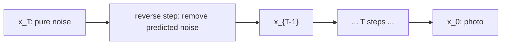

## The task: train the denoiser

Lesson 8 defined the model: learn the reverse Gaussians
p_θ(x_{t-1}|x_t). Lesson 6 gave the training principle:
maximize the ELBO. Combine them and the ELBO for the chain
is a sum over steps:

```ascii
ELBO = E_q[ log p(x_T) + sum over t of log p_theta(x_{t-1}|x_t)
            - sum over t of log q(x_t|x_{t-1}) ]
```

Regrouped, it becomes a sum of KL divergences, one per
step, plus boundary terms: at each t, the model's reverse
Gaussian must match the true reverse behavior. Two
Gaussians per step, T steps. The naive approach optimizes
this directly: learn both μ_θ and Σ_θ per step by
gradient ascent on the bound.

## Where the naive ELBO breaks

Watch it struggle. Each KL term compares two Gaussians
whose parameters both move during training. The gradient
must tune means and variances jointly across 1000 coupled
terms, and the variance parameters are notoriously
twitchy: a slightly wrong Σ_θ explodes or collapses the
KL. Training is slow, unstable, and the samples are
mediocre. The bound is correct but unusable in raw form.
The lecture's whole W8 block is the rescue: three
algebraic moves that turn this monster into one clean
regression.

## The key question

During training we know x_0 (it is the data). Can knowing
the answer simplify what each reverse step must learn?

## The new idea: condition on the answer

**Move 1: the tractable posterior.** The ELBO's per-step
KL compares p_θ(x_{t-1}|x_t) against the true reverse
q(x_{t-1}|x_t), which is intractable. But conditioned on
x_0, which training knows, the posterior
q(x_{t-1}|x_t, x_0) is a Gaussian with a closed form.
(Bayes' rule on three Gaussians: q(x_t|x_{t-1}) times
q(x_{t-1}|x_0), normalized.) Its mean is:

```ascii
mu_tilde = ( sqrt(a_bar_{t-1}) * b_t / (1 - a_bar_t) ) * x_0
         + ( sqrt(a_t) * (1 - a_bar_{t-1}) / (1 - a_bar_t) ) * x_t
```

(a_bar is ᾱ, b_t = 1 − α_t.) Work it with the Lesson 8
toy: x_0 = 4.0, x_2 = 3.900, α_2 = 0.9, ᾱ_1 = 0.9,
ᾱ_2 = 0.81, β_2 = 0.1.

```ascii
coeff of x_0 = 0.9487 * 0.1 / 0.19 = 0.4993
coeff of x_2 = 0.9487 * 0.1 / 0.19 = 0.4993
mu_tilde = 0.4993 * 4.0 + 0.4993 * 3.9 = 1.997 + 1.947 = 3.944
```

The true denoised value sits between the noisy point
(3.9) and the clean answer (4.0), as it should. Its
variance is β̃_t = ((1−ᾱ_{t-1})/(1−ᾱ_t))·β_t =
(0.1/0.19)·0.1 = 0.0526: small, because knowing x_0
removes most uncertainty.

**Move 2: KL of Gaussians is squared error.** The KL
between two Gaussians with the same variance is
proportional to the squared distance of their means.
So each ELBO term becomes ||μ̃_t − μ_θ(x_t, t)||², up
to constants. Still a mean to predict. But, 

**Move 3: predict the noise, not the mean.** From
Lesson 8's closed form, x_t = √ᾱ_t x_0 + √(1−ᾱ_t) ε,
solve for x_0 and substitute into μ̃_t. The mean
rewrites as a function of x_t and the *noise* ε that
was added. So instead of predicting μ̃_t directly,
have the network predict the noise:

```ascii
L_simple = E[ || epsilon - epsilon_theta(x_t, t) ||^2 ]
           t random, x_0 data, epsilon ~ N(0,1),
           x_t = sqrt(a_bar_t) x_0 + sqrt(1 - a_bar_t) epsilon
```

One network, one MSE loss, no variances to learn, no
1000 coupled terms. Training: pick a data point, pick
a random step t, add the corresponding noise, ask the
network what noise was added. Denoising as
noise-prediction.

Work the loss on the toy. Building x_2 = 3.900 used
combined noise ε = 0.688 (Lesson 8). Suppose the
network predicts ε_θ = 0.5:

```ascii
L = (0.688 - 0.5)^2 = 0.0354
```

One number. Its gradient pushes the prediction toward
0.688. Every training step is this simple, at every t.
The lecture's punchline: the world's best image
generators train on this MSE.

## Three faces of the same prediction

The W8L31 lecture ("ELBO equivalence") shows the
noise prediction is one of three equivalent targets.
Since x_t = √ᾱ_t x_0 + √(1−ᾱ_t) ε, predicting any one
of these determines the other two:

- Predict the noise ε (what was added).
- Predict the clean x_0 (what is underneath).
- Predict the **score** ∇log p(x_t) (which direction
  is more likely. Lesson 10). It equals
  −ε/√(1−ᾱ_t): in the toy, −0.688/0.4359 = −1.578.

Same information, three costumes. Noise prediction
trains best empirically, which is why L_simple won.
The score view connects diffusion to an older
literature (score matching) and to the sampling
methods of Lesson 10.

## Inference: walking the chain backward

Trained ε_θ gives the reverse mean via the move-3
substitution. One sampling step:

```ascii
x_{t-1} = (1/sqrt(a_t)) * ( x_t - (b_t / sqrt(1 - a_bar_t)) * e_theta )
          + sqrt(beta_tilde_t) * z,    z ~ N(0,1)
```

With the toy numbers (t = 2, x_2 = 3.9, ε_θ = 0.5):

```ascii
1/sqrt(0.9) = 1.054,   b_2/sqrt(1 - a_bar_2) = 0.1/0.4359 = 0.2294
x_1 = 1.054 * (3.9 - 0.2294*0.5) + sqrt(0.0526)*z
    = 1.054 * 3.785 + 0.2294*z = 3.990 + 0.2294*z
```

Take z = 0.3: x_1 = 4.059. The chain stepped from 3.9
back toward the clean 4.0, plus a controlled wobble.
Repeat down to t = 1 and x_0 emerges. The wobble
(z term) is what makes samples vary: same x_T,
different z's, different photos.



## The honest price

L_simple is not the true ELBO. Dropping the per-term
weights optimizes a reweighted bound: slightly worse
likelihood, much better samples. The field chose
samples. (Weightings that restore the true ELBO exist
and train worse-looking models. An honest trade,
stated plainly.)

Second, the variance Σ_θ is fixed, not learned, in
the basic DDPM. The model cannot express uncertainty
about its denoising beyond the schedule's β̃_t.
Learned variances help likelihood and hurt nothing
much, but the simple version won on sample quality.

Third, sampling still costs T steps. The loss is
beautiful. The sampler is slow. Lesson 10 attacks
exactly this.

| ELBO pain | Algebraic move | Result |
|---|---|---|
| Intractable reverse q(x_{t-1}\|x_t) | Condition on known x_0 | Tractable Gaussian, mean 3.944 in the toy |
| KL of moving Gaussians unstable | Same-variance KL = squared error | Per-step MSE on means |
| Predicting means is awkward | Substitute x_0 via the noise | L_simple = \|\|ε − ε_θ\|\|² = 0.0354 in the toy |

> [!QA]
> Q: How does the horrible DDPM ELBO become a simple MSE?
> A: Three moves. Condition on the known x_0 to get a tractable Gaussian posterior per step (mean 3.944 in the toy). Use the Gaussian KL closed form: it reduces to squared error between means. Reparameterize the mean through the added noise: predicting the mean equals predicting ε. Result: L_simple = E||ε − ε_θ(x_t, t)||². In the toy the loss was (0.688 − 0.5)² = 0.0354.
> Follow-up: Is L_simple still a valid ELBO?
> A: It is a reweighted version: the per-step weights of the true ELBO are dropped. It optimizes a slightly different bound with slightly worse likelihood but much better samples. The field kept the reweighting deliberately.

> [!QA]
> Q: What is the network actually predicting?
> A: The noise ε that was added to make x_t. Since x_t = √ᾱ_t x_0 + √(1−ᾱ_t) ε, knowing ε reveals x_0, and knowing x_0 reveals the score −ε/√(1−ᾱ_t) = −1.578 in the toy. Three equivalent targets. Noise prediction trains best.
> Follow-up: Why does predicting noise work better than predicting x_0?
> A: The noise has a fixed scale (standard Gaussian) at every step t, while x_0's scale relative to x_t varies wildly with t. A network predicting a fixed-scale target trains more stably. Same information, friendlier regression.

> [!QA]
> Q: How do you generate from a trained DDPM?
> A: Draw x_T ~ N(0,1), then iterate x_{t-1} = (1/√α_t)(x_t − (β_t/√(1−ᾱ_t))ε_θ) + √β̃_t·z down to t = 1. In the toy, x_2 = 3.9 became x_1 = 4.059 with z = 0.3: a step back toward the clean 4.0 plus controlled randomness. The z terms at each step are what make outputs differ.
> Follow-up: Why add noise during generation? Why not just take the mean?
> A: The mean path gives one deterministic output per x_T: less variety, and errors compound without the stochastic correction. The added noise keeps each step a true sample from the reverse Gaussian, which is what the ELBO trained. Deterministic variants exist (DDIM, Lesson 10) but they change the sampler deliberately.

## Recap: the whole lesson on one screen

1. **The task.** Train the reverse Gaussians via the chain ELBO: a sum of T KL terms.
2. **Where it breaks.** Moving means and variances across 1000 coupled terms: twitchy, slow, mediocre samples.
3. **The key question.** Training knows x_0. Does the answer simplify the question?
4. **Move 1.** Condition on x_0: tractable Gaussian posterior, mean 3.944, variance 0.0526 in the toy.
5. **Move 2.** Gaussian KL with fixed variance = squared error between means.
6. **Move 3.** Rewrite the mean through the added noise: the loss becomes ||ε − ε_θ||² = 0.0354.
7. **Inference.** Walk backward: x_1 = 3.990 + 0.2294z from x_2 = 3.9. Repeat T times.
8. **The price.** Reweighted bound (samples over likelihood), fixed variances, still T slow steps.

## Official sources and further reading

**Official:**
- W8L28/L29: ELBO for DDPM (Parts 1-2):
  https://www.youtube.com/watch?v=AnWitwNPnN4
- W8L30: Optimization of DDPM loss:
  https://www.youtube.com/watch?v=yzU0ueuABLw
- W8L31: ELBO Equivalence. W8L32/33: Training/Inference of DDPM.

**Further reading:**
- Ho, Jain, Abbeel, "Denoising Diffusion Probabilistic Models" (2020):
  https://arxiv.org/abs/2006.11239: sections 3-4 are this lesson's three moves.

**Caveats.** The W8L28 transcript was fetched but not read in full. W8L30-33 transcripts were not recovered. This lesson follows the Ho et al. derivation, which the lecture series tracks. [uncertain] The lecture's exact algebraic path and emphasis are unknown.

## Connections to the other courses

- **CS229 L11 (diffusion models):** that course trains the same ε_θ network with the same L_simple. A worked tie: at step t with ᾱ_t = 0.5, the network sees x_t = 0.707·x_0 + 0.707·ε and must output ε. If it outputs ε_θ = 0.9ε (10% short), the loss is 0.01·||ε||² per dimension: the training signal is exactly the shortfall, at every step, in both courses.
- **CS336:** the ε_θ network is usually a U-Net with attention, the same transformer blocks that course builds. The math of this lesson is the objective. The architecture is shared machinery.
