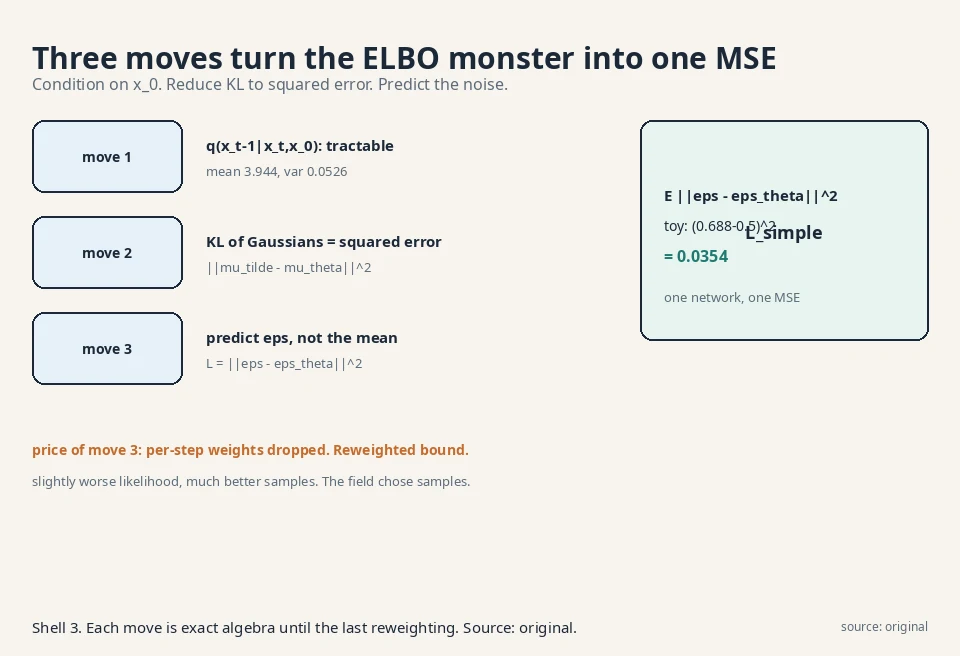
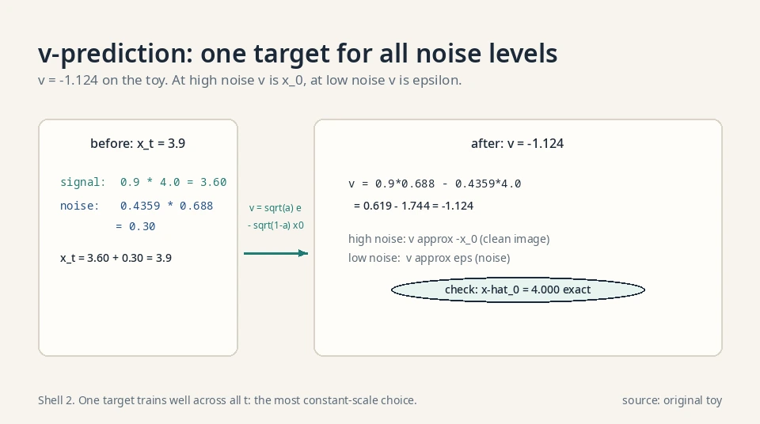
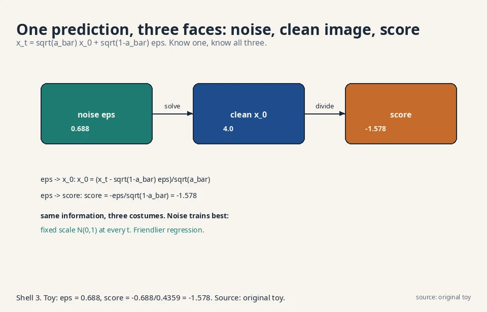
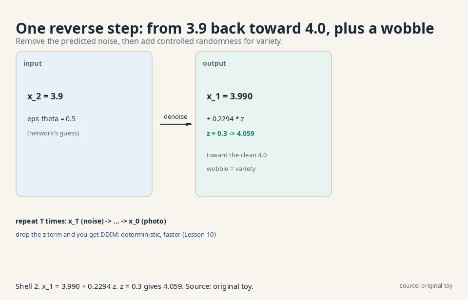
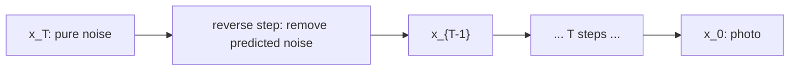

## The task: train the denoiser

Lesson 8 defined the model: learn the reverse Gaussians
p_θ(x_{t-1}|x_t). Lesson 6 gave the training principle:
maximize the ELBO. Combine them and the ELBO for the chain
is a sum over steps:

```ascii
ELBO = E_q[ log p(x_T) + sum over t of log p_theta(x_{t-1}|x_t)
            - sum over t of log q(x_t|x_{t-1}) ]
```

All logs in this lesson are natural logs (base e).

Regrouped, it becomes a sum of KL divergences, one per
step, plus boundary terms: at each t, the model's reverse
Gaussian must match the true reverse behavior. Two
Gaussians per step, T steps. The naive approach optimizes
this directly: learn both μ_θ and Σ_θ per step by
gradient ascent on the bound.

### The ELBO, term by term

The regrouped form, with each term named:

```ascii
L_T      = KL( q(x_T | x_0) || p(x_T) )          (prior matching)
L_{t-1}  = KL( q(x_{t-1} | x_t, x_0) || p_theta(x_{t-1} | x_t) )
                                                     (denoising matching)
L_0      = -log p_theta(x_0 | x_1)                (reconstruction)
ELBO     = -L_T - sum_{t=2..T} L_{t-1} - L_0      (up to constants)
```

L_T is nearly zero by construction: q(x_T|x_0) ≈ N(0,1)
and p(x_T) = N(0,1). L_0 is one final decoding step.
The bulk of training is the T−1 denoising terms: at
each step, the learned reverse Gaussian must match the
true reverse Gaussian. The true reverse
q(x_{t−1}|x_t) is intractable, which is why Move 1
conditions on x_0. Read the decomposition as a budget:
T−1 of the T+1 terms are denoising. That is why the
whole lesson is about simplifying those terms.

## Where the naive ELBO breaks

### A thousand coupled Gaussians

Watch it struggle. Each KL term compares two Gaussians
whose parameters both move during training. The gradient
must tune means and variances jointly across 1000 coupled
terms, and the variance parameters are notoriously
twitchy: a slightly wrong Σ_θ explodes or collapses the
KL. Training is slow, unstable, and the samples are
mediocre.

### Correct but unusable

The bound is correct but unusable in raw form. The
lecture's whole W8 block is the rescue: three
algebraic moves that turn this monster into one clean
regression. The decision rule to remember: when a bound
is correct but untrainable, look for conditioning that
makes the intractable parts tractable. Training knows
the answer (x_0). Use it.

## The key question

During training we know x_0 (it is the data). Can knowing
the answer simplify what each reverse step must learn?

## The new idea: condition on the answer

### Move 1: the tractable posterior

The ELBO's per-step KL compares p_θ(x_{t-1}|x_t) against
the true reverse q(x_{t-1}|x_t), which is intractable. But
conditioned on x_0, which training knows, the posterior
q(x_{t-1}|x_t, x_0) is a Gaussian with a closed form.
(Bayes' rule on three Gaussians: q(x_t|x_{t-1}) times
q(x_{t-1}|x_0), normalized.) Its mean is:

```ascii
mu_tilde = ( sqrt(a_bar_{t-1}) * b_t / (1 - a_bar_t) ) * x_0
         + ( sqrt(a_t) * (1 - a_bar_{t-1}) / (1 - a_bar_t) ) * x_t
```

(a_bar is ᾱ, b_t = 1 − α_t.) Work it with the Lesson 8
toy: x_0 = 4.0, x_2 = 3.900, α_2 = 0.9, ᾱ_1 = 0.9,
ᾱ_2 = 0.81, β_2 = 0.1.

```ascii
coeff of x_0 = 0.9487 * 0.1 / 0.19 = 0.4993
coeff of x_2 = 0.9487 * 0.1 / 0.19 = 0.4993
mu_tilde = 0.4993 * 4.0 + 0.4993 * 3.9 = 1.997 + 1.947 = 3.944
```

The true denoised value sits between the noisy point
(3.9) and the clean answer (4.0), as it should. Its
variance is β̃_t = ((1−ᾱ_{t-1})/(1−ᾱ_t))·β_t =
(0.1/0.19)·0.1 = 0.0526: small, because knowing x_0
removes most uncertainty.

### Deriving the posterior mean

A math course shows the Bayes algebra. The posterior is
proportional to likelihood times prior-over-the-past:

```ascii
q(x_{t-1} | x_t, x_0) propto q(x_t | x_{t-1}) * q(x_{t-1} | x_0)
```

Both factors are Gaussian: q(x_t|x_{t-1}) =
N(sqrt(a_t)*x_{t-1}, b_t) and q(x_{t-1}|x_0) =
N(sqrt(a_bar_{t-1})*x_0, 1-a_bar_{t-1}). The product of
two Gaussians is Gaussian. Its precision (one over
variance) is the sum of the precisions:

```ascii
1/sigma_tilde^2 = a_t / b_t + 1 / (1 - a_bar_{t-1})
                = (1 - a_bar_t) / ( b_t * (1 - a_bar_{t-1}) )
```

The numerator simplifies because a_t*a_bar_{t-1} =
a_bar_t: a_t*(1-a_bar_{t-1}) + b_t = 1 - a_bar_t.
So sigma_tilde^2 = b_t*(1-a_bar_{t-1})/(1-a_bar_t),
matching the worked 0.0526. The mean is the
precision-weighted average of the two centers:

```ascii
mu_tilde = sigma_tilde^2 * ( sqrt(a_t)*x_t / b_t
              + sqrt(a_bar_{t-1})*x_0 / (1 - a_bar_{t-1}) )
```

Multiply through and the lesson's formula drops out.
Preconditions: b_t > 0 and a_bar_t < 1, so no division
by zero. Both hold for any usable schedule.

### Move 2: KL of Gaussians is squared error

The KL between two Gaussians with the same variance is
proportional to the squared distance of their means.
So each ELBO term becomes ||μ̃_t − μ_θ(x_t, t)||², up
to constants. Still a mean to predict. But,

### Move 3: predict the noise, not the mean

From Lesson 8's closed form, x_t = √ᾱ_t x_0 + √(1−ᾱ_t)
ε, solve for x_0 and substitute into μ̃_t. The mean
rewrites as a function of x_t and the *noise* ε that
was added. So instead of predicting μ̃_t directly,
have the network predict the noise:

```ascii
L_simple = E[ || epsilon - epsilon_theta(x_t, t) ||^2 ]
           t random, x_0 data, epsilon ~ N(0,1),
           x_t = sqrt(a_bar_t) x_0 + sqrt(1 - a_bar_t) epsilon
```

One network, one MSE loss, no variances to learn, no
1000 coupled terms. Training: pick a data point, pick
a random step t, add the corresponding noise, ask the
network what noise was added. Denoising as
noise-prediction.

### Worked: the loss is 0.0354

Work the loss on the toy. Building x_2 = 3.900 used
combined noise ε = 0.688 (Lesson 8). Suppose the
network predicts ε_θ = 0.5:

```ascii
L = (0.688 - 0.5)^2 = 0.0354
```

One number. Its gradient pushes the prediction toward
0.688. Every training step is this simple, at every t.
The lecture's punchline: the world's best image
generators train on this MSE.



## Three faces of the same prediction

### Noise, clean image, score

The W8L31 lecture ("ELBO equivalence") shows the
noise prediction is one of three equivalent targets.
Since x_t = √ᾱ_t x_0 + √(1−ᾱ_t) ε, predicting any one
of these determines the other two:

- Predict the noise ε (what was added).
- Predict the clean x_0 (what is underneath).
- Predict the **score** ∇log p(x_t) (which direction
  is more likely. Lesson 10). It equals
  −ε/√(1−ᾱ_t): in the toy, −0.688/0.4359 = −1.578.

Same information, three costumes. Noise prediction
trains best empirically, which is why L_simple won.
The score view connects diffusion to an older
literature (score matching) and to the sampling
methods of Lesson 10.

### Why noise trains best

The noise has a fixed scale (standard Gaussian) at
every step t, while x_0's scale relative to x_t varies
wildly with t. A network predicting a fixed-scale
target trains more stably: the optimization surface looks
the same at t = 10 and t = 900. Predicting x_0 would
ask the network to output tiny corrections at high
noise and huge ones at low noise. Same information,
friendlier regression. The decision rule: pick the
prediction target with the most constant scale.

### The fourth face: v-prediction

There is a fourth parameterization, **v-prediction**
(Salimans and Ho 2022): predict the "velocity"

```ascii
v = sqrt(a_bar_t) * epsilon - sqrt(1 - a_bar_t) * x_0
```

On the toy (t = 2): v = 0.9·0.688 − 0.4359·4.0 =
0.619 − 1.744 = −1.124. Given v and x_t, both ε and
x_0 are recoverable: ε = √ᾱ_t·v + √(1−ᾱ_t)·x_t and
x_0 = √ᾱ_t·x_t − √(1−ᾱ_t)·v. Check the second on the
toy: 0.9·3.9 − 0.4359·(−1.124) = 3.51 + 0.490 =
4.000. The clean answer, recovered exactly.

Why a fourth face? At high noise (ᾱ_t → 0), v ≈ −x_0:
predicting v predicts the clean image, the right
target when noise dominates. At low noise (ᾱ_t → 1),
v ≈ ε: it becomes noise prediction. v interpolates
between the two regimes, so one target trains well
across all t. [uncertain] v-prediction's use in
current production video models is reported but not
verified here.



### The weighting autopsy

Dropping the weights was not neutral. The true ELBO
weights each step's squared error by
β_t²/(2σ_t²α_t(1−ᾱ_t)). With σ_t² = β_t this is
β_t/(2α_t(1−ᾱ_t)). On the linear schedule:

```ascii
t = 1:    weight 0.500
t = 10:   weight 0.074
t = 100:  weight 0.010
t = 500:  weight 0.006
t = 900:  weight 0.009
```

The ELBO spends 90× more budget on step t = 1 than
on t = 500: it obsesses over near-noiseless fine
detail and nearly ignores the noisy steps where
global structure is decided. L_simple weights every
step equally. Human eyes care about structure more
than imperceptible fine noise, so the uniform
weighting looks better. The "wrong" objective trains
the right thing for perception. The decision rule:
when a bound's weights fight your metric, reweight
deliberately and say so.

### Learned variances: the hybrid loss

The basic DDPM fixes Σ_θ. **Improved DDPM** learns
it: the network outputs v per dimension and sets
Σ_θ = exp(v·log β_t + (1−v)·log β̃_t), interpolating
between the two fixed choices. The loss becomes
L_hybrid = L_simple + λ·L_vlb with λ = 0.001: the
simple loss drives the means, a whisper of the true
bound tunes the variances. Likelihood improves
(the model reports honest uncertainty per step).
Sample quality barely moves. The decision rule from
the Q&A holds: learn variances for likelihood
benchmarks, fix them for sample quality.



## Inference: walking the chain backward

### The reverse step formula

Trained ε_θ gives the reverse mean via the move-3
substitution. One sampling step:

```ascii
x_{t-1} = (1/sqrt(a_t)) * ( x_t - (b_t / sqrt(1 - a_bar_t)) * e_theta )
          + sqrt(beta_tilde_t) * z,    z ~ N(0,1)
```

### Worked: 3.9 → 4.059

With the toy numbers (t = 2, x_2 = 3.9, ε_θ = 0.5):

```ascii
1/sqrt(0.9) = 1.054,   b_2/sqrt(1 - a_bar_2) = 0.1/0.4359 = 0.2294
x_1 = 1.054 * (3.9 - 0.2294*0.5) + sqrt(0.0526)*z
    = 1.054 * 3.785 + 0.2294*z = 3.990 + 0.2294*z
```

Take z = 0.3: x_1 = 4.059. The chain stepped from 3.9
back toward the clean 4.0, plus a controlled wobble.
Repeat down to t = 1 and x_0 emerges. The wobble
(z term) is what makes samples vary: same x_T,
different z's, different photos.





### Why the wobble stays

Why add noise during generation? Why not just take the
mean? The mean path gives one deterministic output per
x_T: less variety, and errors compound without the
stochastic correction. The added noise keeps each step
a true sample from the reverse Gaussian, which is what
the ELBO trained. Deterministic variants exist (DDIM,
Lesson 10) but they change the sampler deliberately.

## The honest price

### A reweighted bound

L_simple is not the true ELBO. Dropping the per-term
weights optimizes a reweighted bound: slightly worse
likelihood, much better samples. The field chose
samples. (Weightings that restore the true ELBO exist
and train worse-looking models. An honest trade,
stated plainly.)

### Fixed variances

Second, the variance Σ_θ is fixed, not learned, in
the basic DDPM. The model cannot express uncertainty
about its denoising beyond the schedule's β̃_t.
Learned variances help likelihood and hurt nothing
much, but the simple version won on sample quality.

### Still T slow steps

Third, sampling still costs T steps. The loss is
beautiful. The sampler is slow. Lesson 10 attacks
exactly this.

| ELBO pain | Algebraic move | Result |
|---|---|---|
| Intractable reverse q(x_{t-1}\|x_t) | Condition on known x_0 | Tractable Gaussian, mean 3.944 in the toy |
| KL of moving Gaussians unstable | Same-variance KL = squared error | Per-step MSE on means |
| Predicting means is awkward | Substitute x_0 via the noise | L_simple = \|\|ε − ε_θ\|\|² = 0.0354 in the toy |

### Where L_simple runs in real systems

Verified October 2026: L_simple is the training loss
inside DDPM-lineage image generators: DDPM (Ho et al.
2020), Stable Diffusion 1.x/2.x, and SDXL. Pick t, add
noise, predict the noise. The three-faces equivalence is
why the same trained network can drive DDIM sampling
(Lesson 10) and score-based guidance without retraining:
the weights already encode all three views. [uncertain]
Which production models use exactly L_simple versus
weighted variants is not public.

## Videos for this lesson

<div class="video-block"><div class="video-wrap"><iframe src="https://www.youtube-nocookie.com/embed/AnWitwNPnN4" title="W8L28: ELBO for DDPM : Part 1" allow="accelerometer; autoplay; clipboard-write; encrypted-media; gyroscope; picture-in-picture" allowfullscreen loading="lazy" referrerpolicy="strict-origin-when-cross-origin"></iframe></div><p class="video-cap">Lecture video: the DDPM ELBO derived, part 1. If the embed is blocked: <a href="https://www.youtube.com/watch?v=AnWitwNPnN4" target="_blank" rel="noopener">watch on YouTube</a>.</p></div>

<div class="video-block"><div class="video-wrap"><iframe src="https://www.youtube-nocookie.com/embed/0p7T-3WiPnQ" title="W8L33: Inference in DDPM" allow="accelerometer; autoplay; clipboard-write; encrypted-media; gyroscope; picture-in-picture" allowfullscreen loading="lazy" referrerpolicy="strict-origin-when-cross-origin"></iframe></div><p class="video-cap">Lecture video: inference in DDPM, walking the chain backward to generate. If the embed is blocked: <a href="https://www.youtube.com/watch?v=0p7T-3WiPnQ" target="_blank" rel="noopener">watch on YouTube</a>.</p></div>


> [!QA]
> Q: How does the horrible DDPM ELBO become a simple MSE?
> A: Three moves. Condition on the known x_0 to get a tractable Gaussian posterior per step (mean 3.944 in the toy). Use the Gaussian KL closed form: it reduces to squared error between means. Reparameterize the mean through the added noise: predicting the mean equals predicting ε. Result: L_simple = E||ε − ε_θ(x_t, t)||². In the toy the loss was (0.688 − 0.5)² = 0.0354.
> Follow-up: Is L_simple still a valid ELBO?
> A: It is a reweighted version: the per-step weights of the true ELBO are dropped. It optimizes a slightly different bound with slightly worse likelihood but much better samples. The field kept the reweighting deliberately.

> [!QA]
> Q: Walk me through move 1 on fresh numbers.
> A: x_0 = 10.0, x_3 = 6.934 (from the Lesson 8 exercise), α_3 = 0.8, ᾱ_2 = 0.64, ᾱ_3 = 0.512, β_3 = 0.2. Coeff of x_0: √0.64·0.2/(1−0.512) = 0.8·0.2/0.488 = 0.328. Coeff of x_3: √0.8·(1−0.64)/0.488 = 0.8944·0.36/0.488 = 0.660. μ̃_3 = 0.328·10 + 0.660·6.934 = 3.28 + 4.576 = 7.856 (7.854 with unrounded coefficients). Between the noisy 6.934 and the clean 10, closer to the noisy point because β_3 is large. Variance: ((1−0.64)/(1−0.512))·0.2 = (0.36/0.488)·0.2 = 0.148.
> Follow-up: Why is the mean closer to x_3 than x_0 here?
> A: Because this step's noise (β_3 = 0.2) is large relative to the accumulated certainty. The posterior hedges: it trusts the noisy observation more when the step noise is big. As β_t → 0, the mean converges to x_t itself: no noise added, nothing to undo.

> [!QA]
> Q: What is the network actually predicting?
> A: The noise ε that was added to make x_t. Since x_t = √ᾱ_t x_0 + √(1−ᾱ_t) ε, knowing ε reveals x_0, and knowing x_0 reveals the score −ε/√(1−ᾱ_t) = −1.578 in the toy. Three equivalent targets. Noise prediction trains best.
> Follow-up: Why does predicting noise work better than predicting x_0?
> A: The noise has a fixed scale (standard Gaussian) at every step t, while x_0's scale relative to x_t varies wildly with t. A network predicting a fixed-scale target trains more stably. Same information, friendlier regression.

> [!QA]
> Q: How do you generate from a trained DDPM?
> A: Draw x_T ~ N(0,1), then iterate x_{t-1} = (1/√α_t)(x_t − (β_t/√(1−ᾱ_t))ε_θ) + √β̃_t·z down to t = 1. In the toy, x_2 = 3.9 became x_1 = 4.059 with z = 0.3: a step back toward the clean 4.0 plus controlled randomness. The z terms at each step are what make outputs differ.
> Follow-up: Why add noise during generation? Why not just take the mean?
> A: The mean path gives one deterministic output per x_T: less variety, and errors compound without the stochastic correction. The added noise keeps each step a true sample from the reverse Gaussian, which is what the ELBO trained. Deterministic variants exist (DDIM, Lesson 10) but they change the sampler deliberately.

> [!QA]
> Q: Your DDPM trains but the samples are noisy at low t and blurry at high t. What went wrong?
> A: The network underfits at different noise levels differently. Noisy-at-low-t means it never learned fine denoising: the schedule may kill the signal too fast, starving low-t training, or the network lacks capacity at fine detail. Blurry-at-high-t means the coarse structure prediction is weak. Diagnose per-t: plot the loss broken down by t. The fix follows the curve: rebalance the schedule or add capacity where the loss is high.
> Follow-up: Why does L_simple hide this?
> A: It averages over t uniformly. A disaster at 50 steps can hide inside a good average over 1000. Always inspect the loss per noise level, not just the mean. The reweighting that made L_simple simple also made it blind to per-t failures.

> [!QA]
> Q: You want the model to also report uncertainty per step (learn Σ_θ). What changes?
> A: Add a variance head to the network and restore the true ELBO weights: the loss becomes the full per-step KL, not the unweighted MSE. Likelihood improves (the model can say "I am unsure here"), sample quality usually drops slightly, and training gets twitchier: the variance head is the unstable part move 2 removed. The decision rule: learn variances for likelihood benchmarks, fix them for sample quality.
> Follow-up: Why did the simple version win on samples?
> A: Because the unweighted MSE spends equal effort at every noise level, which matches human perception better than the ELBO's weights (which overweight near-noiseless steps). The "wrong" objective trains the right thing for the eye. Another case of the field choosing samples over likelihood.

> [!QA]
> Q: Design a training loop for a DDPM on 32×32 images. Write the steps.
> A: Repeat these steps. (1) Sample a batch of images x_0. (2) Sample t uniformly from 1..T per image. (3) Sample ε ~ N(0,1) with the image's shape. (4) Form x_t = √ᾱ_t x_0 + √(1−ᾱ_t) ε via the closed form (no chaining). (5) Predict ε_θ(x_t, t). (6) Set loss = mean((ε − ε_θ)²). (7) Backprop and step. That is the entire loop. No adversary, no posterior, no variance heads.
> Follow-up: Where can this loop go wrong in practice?
> A: Three places. The schedule (signal dies too fast, starving some t). The t sampling (uniform is standard, non-uniform needs reweighting). And the network's time conditioning (if ε_θ ignores t, one network must handle all noise levels blind: it cannot). Check all three before blaming the math.

## Recap: the whole lesson on one screen

1. **The task.** Train the reverse Gaussians via the chain ELBO: a sum of T KL terms.
2. **Where it breaks.** Moving means and variances across 1000 coupled terms: twitchy, slow, mediocre samples.
3. **The key question.** Training knows x_0. Does the answer simplify the question?
4. **Move 1.** Condition on x_0: tractable Gaussian posterior, mean 3.944, variance 0.0526 in the toy.
5. **Move 2.** Gaussian KL with fixed variance = squared error between means.
6. **Move 3.** Rewrite the mean through the added noise: the loss becomes ||ε − ε_θ||² = 0.0354.
7. **Inference.** Walk backward: x_1 = 3.990 + 0.2294z from x_2 = 3.9. Repeat T times.
8. **The price.** Reweighted bound (samples over likelihood), fixed variances, still T slow steps.

## Official sources and further reading

**Official:**
- W8L28: ELBO for DDPM Part 1: [paper](https://www.youtube.com/watch?v=AnWitwNPnN4)
- W8L29: ELBO for DDPM Part 2: [paper](https://www.youtube.com/watch?v=wPx64rVy2c4)
- W8L30: Optimization of DDPM loss: [paper](https://www.youtube.com/watch?v=yzU0ueuABLw)
- W8L33: Inference in DDPM: [paper](https://www.youtube.com/watch?v=0p7T-3WiPnQ)

**Further reading:**
- Ho, Jain, Abbeel, "Denoising Diffusion Probabilistic Models" (2020):
  - [sections 3-4 are this lesson's three moves.](https://arxiv.org/abs/2006.11239)

**Caveats.** The W8L28 transcript was fetched but not read in full. W8L30-33 transcripts were not recovered. This lesson follows the Ho et al. derivation, which the lecture series tracks. [uncertain] The lecture's exact algebraic path and emphasis are unknown.

## Connections to the other courses

- **CS229 L11 (diffusion models):** that course trains the same ε_θ network with the same L_simple. A worked tie: at step t with ᾱ_t = 0.5, the network sees x_t = 0.707·x_0 + 0.707·ε and must output ε. If it outputs ε_θ = 0.9ε (10% short), the loss is 0.01·||ε||² per dimension: the training signal is exactly the shortfall, at every step, in both courses.
- **CS336:** the ε_θ network is usually a U-Net with attention, the same transformer blocks that course builds. The math of this lesson is the objective. The architecture is shared machinery.
