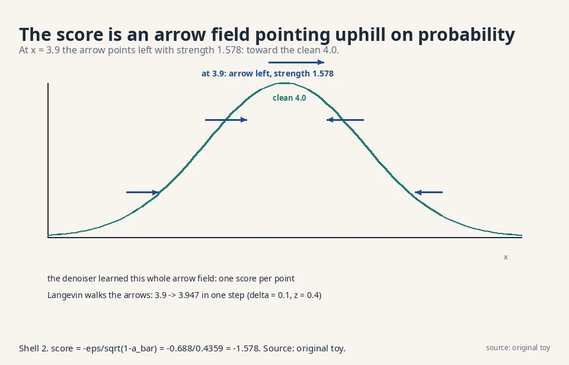
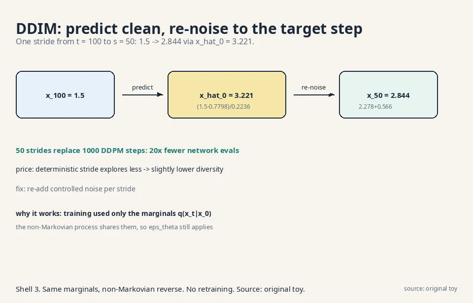
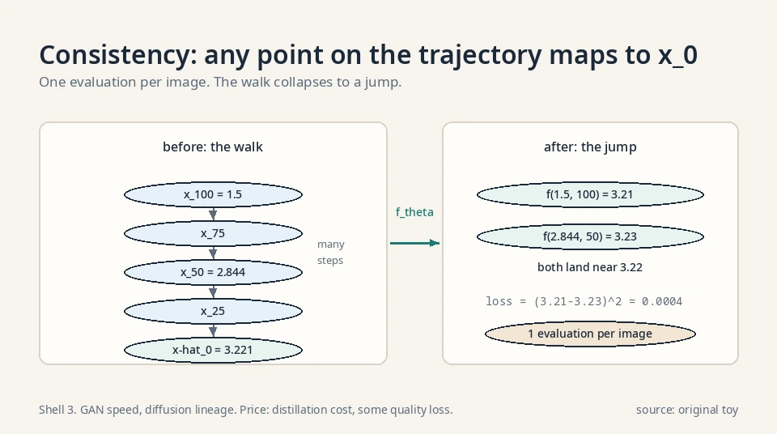
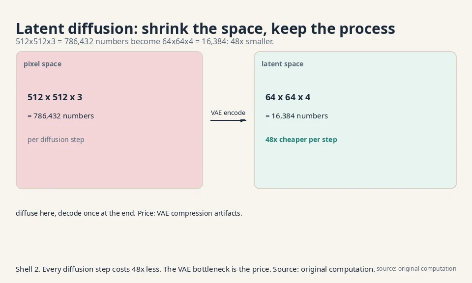
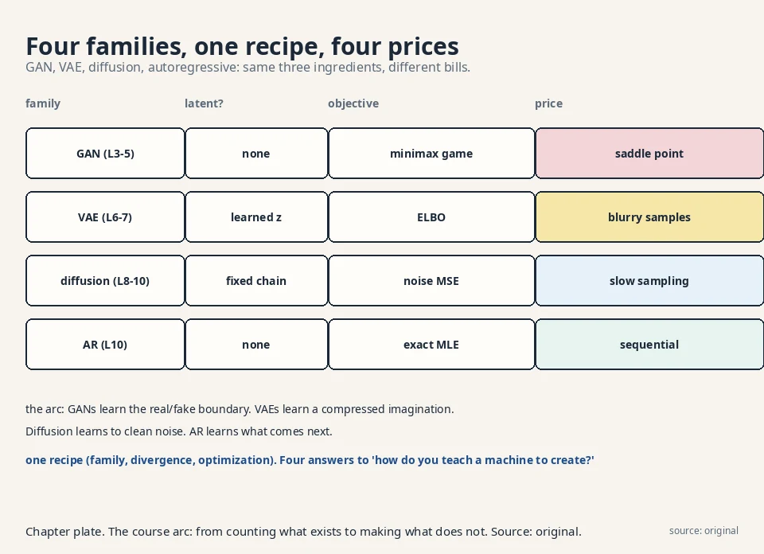

## The task: what did the denoiser really learn?

Lesson 9 trained ε_θ to predict added noise. The W9
lectures step back and ask what that means. Recall the
equivalence: predicting ε is predicting the **score**,
the gradient of the log-density:

```ascii
score(x_t) = grad log p(x_t) = -epsilon / sqrt(1 - a_bar_t)
```

All logs in this lesson are natural logs (base e). The score is an arrow at every point, pointing toward
higher probability. In the Lesson 9 toy:
−0.688/0.4359 = −1.578. At x_2 = 3.9, the arrow points
left with strength 1.578: probability increases toward
smaller x. The denoiser learned a map of arrows covering
the whole noisy space. That reframes everything:
generation is hill-climbing on probability.



### Tweedie's formula: the denoiser's best guess

The score gives the single best guess of the clean
image for free. **Tweedie's formula** says the
posterior mean of x_0 given x_t is:

```ascii
E[x_0 | x_t] = ( x_t + (1 - a_bar_t) * score(x_t) ) / sqrt(a_bar_t)
```

Work it on the toy: x_t = 3.9, score = −1.578,
ᾱ_t = 0.81.

```ascii
E[x_0 | x_2] = ( 3.9 + 0.19 * (-1.578) ) / 0.9
             = ( 3.9 - 0.300 ) / 0.9
             = 3.600 / 0.9 = 4.000
```

The denoised estimate is 4.000: the true clean value
4.0, recovered to three decimals from the noisy 3.9.
The score pointed left with strength 1.578, and
Tweedie converts that arrow into a location. DDIM's
x̂_0 prediction (below) is exactly this formula with
the learned score. One precondition: the formula
needs the true score. With a learned score it is an
estimate, and its error is the sampler's error.

### Denoising score matching: the older objective

Before DDPM, the score-matching literature trained
scores directly. **Denoising score matching**
(Vincent 2011): corrupt x with Gaussian noise of
variance σ² to get x̃, then train s_θ(x̃) to match
the known score of the corruption, (x − x̃)/σ²:

```ascii
L = E[ || s_theta(x_tilde) - (x - x_tilde)/sigma^2 ||^2 ]
```

Work it: x = 4.0, x̃ = 3.9, σ = 0.1. The target is
(4.0 − 3.9)/0.01 = 10. If the network outputs 8, the
loss is (10 − 8)² = 4. The lecture's point: DDPM's
noise-prediction loss trains the same object. Lesson
9's ε_θ and this lesson's s_θ are the same network in
different clothes. Two communities, one arrow field,
one loss family.

## First attempt: follow the arrows naively

### Langevin dynamics

If the score points uphill, sample by walking uphill:
start anywhere, take small steps along the score, add a
little noise so you explore instead of collapsing to the
peak. This is **Langevin dynamics**:

```ascii
x <- x + (delta/2) * score(x) + sqrt(delta) * z,   z ~ N(0,1)
```

### Worked: 3.9 → 3.947

Try it on the toy. x = 3.9, score = −1.578, δ = 0.1,
draw z = 0.4:

```ascii
x <- 3.9 + 0.05 * (-1.578) + 0.316 * 0.4
   = 3.9 - 0.079 + 0.126 = 3.947
```

The point moved from 3.9 to 3.947: uphill toward the
clean 4.0, with exploration noise. Repeat thousands of
times and the walk's positions follow p(x). This is the
older **score matching** literature's sampler, and the
lecture's point is that DDPM training already learns
exactly the object it needs. Two communities, one
arrow field.

### Where naive Langevin breaks

Where naive Langevin breaks: it needs tiny steps and
thousands of them, and the step size δ is fiddly. Too
large: the walk diverges. Too small: it never arrives.
DDPM's ancestral sampler (Lesson 9) is the stabilized,
scheduled version of this walk. The schedule is the fix
for the fiddliness: instead of one δ, a planned sequence
of noise levels that anneals the walk to the answer.

### Annealed Langevin: the schedule fixes the fiddle

**Annealed Langevin dynamics** runs the walk at a
sequence of noise levels σ_1 > σ_2 > ... > σ_L,
finishing near zero noise. At high noise the smoothed
distribution is easy to walk (no sharp peaks). Each
level's samples seed the next. The step size scales
with the noise: δ_l proportional to σ_l².

One step at σ = 1.0 on a standard Gaussian target.
The score of N(0,1) at x is −x. At x = 2.0 the score
is −2.0. With δ = 0.1 and z = 0.5:

```ascii
x <- 2.0 + 0.05 * (-2.0) + 0.316 * 0.5
   = 2.0 - 0.100 + 0.158 = 2.058
```

The walk explores broadly at high noise, then the
schedule drops σ and the walk settles. This is the
sampling half of the score-based modeling paper
(Song and Ermon 2019): train one score network
conditioned on σ, anneal from high to low. DDPM's
1000-step sampler is this idea with the noise levels
renamed t = 1000..1.

## The key question

The sampler still costs T steps. Can we take bigger
strides without retraining?

## The new idea: DDIM strides

### The marginals are all training used

**DDIM** (Denoising Diffusion Implicit Models) observes
that training only ever used the marginals q(x_t|x_0):
the closed-form jump from Lesson 8. The Markov
step-by-step chain was one choice consistent with those
marginals. A non-Markovian process with the same
marginals trains the identical ε_θ. And with the
non-Markovian form, the reverse can skip steps: jump
from t = 100 to t = 50 in one stride, deterministically.

### The stride formula

The stride formula: predict the clean x_0 from x_t via
ε_θ, then re-noise it to the target step s:

```ascii
x_hat_0 = ( x_t - sqrt(1 - a_bar_t) * e_theta ) / sqrt(a_bar_t)
x_s     = sqrt(a_bar_s) * x_hat_0 + sqrt(1 - a_bar_s) * e_theta
```

Precondition: ᾱ_t > 0 (division by √ᾱ_t). In
practice ᾱ_T is tiny but nonzero (0.00004 on the
linear schedule), so the stride from T is steep but
defined.

### Worked: 1.5 → 2.844 in one stride

Work it. t = 100, s = 50, ᾱ_100 = 0.05, ᾱ_50 = 0.5,
x_100 = 1.5, ε_θ = 0.8:

```ascii
x_hat_0 = (1.5 - sqrt(0.95)*0.8) / sqrt(0.05)
        = (1.5 - 0.7798) / 0.2236 = 3.221
x_50 = sqrt(0.5)*3.221 + sqrt(0.5)*0.8
     = 2.278 + 0.566 = 2.844
```

One stride: 1.5 → 2.844, landing where 50 DDPM steps
would have gone. Fifty strides replace a thousand
steps.

### The price: less diversity

The price: the deterministic stride (no z
wobble) explores less, so diversity drops slightly.
Re-adding controlled noise per stride recovers most of
it. Same network, faster sampler, no retraining. The
decision rule: use DDIM strides when latency matters
(interactive generation), DDPM steps when diversity
matters most. The network never changes. Only the walk
does.



### The η family: from DDIM to DDPM

The deterministic stride is one point on a dial. The
DDIM paper adds per-stride noise with a knob η:

```ascii
sigma_t(eta) = eta * sqrt((1 - a_bar_s)/(1 - a_bar_t))
                     * sqrt(1 - a_bar_t/a_bar_s)
x_s = sqrt(a_bar_s)*x_hat_0 + sqrt(1 - a_bar_s - sigma^2)*e_theta
      + sigma * z
```

η = 0 is the deterministic DDIM stride. η = 1
recovers DDPM's stochastic sampler. Work η = 1 on the
toy (t = 100, s = 50, ᾱ_100 = 0.05, ᾱ_50 = 0.5):

```ascii
sigma = 1 * sqrt(0.5/0.95) * sqrt(1 - 0.05/0.5)
      = 0.7255 * 0.9487 = 0.688
```

The stride becomes x_50 = 2.278 + 0.130 + 0.688·z:
mean 2.408 plus a 0.688 wobble. Note the mean moved down
from the deterministic stride's 2.844: the η = 1 noise
steals weight from the ε_θ term (its coefficient shrinks
from √0.5 = 0.707 to √(1−ᾱ_s−σ²) = 0.162).
The decision rule: η = 0 for speed and
reproducibility, η = 1 for maximum diversity. The
network never changes. Only the walk does.

### The probability flow ODE

Every stochastic diffusion has a deterministic twin.
The **probability flow ODE** removes the random
wobble but keeps the same marginal distributions at
every t:

```ascii
dx = [ f(x,t) - 0.5 * g(t)^2 * score(x,t) ] dt
```

No z term. The same ε_θ supplies the score. Because
the marginals match, the ODE and the SDE describe
the same noising process: one with dice, one without.
DDIM's deterministic stride is this ODE discretized.
The practical wins: exact likelihood computation
(the ODE is invertible: run it forward to get the
latent, read off the change-of-variables), and
deterministic generation (same x_T, same x_0, every
time). The price is the same as DDIM's: less
exploration than the stochastic sampler.

### Worked: one Euler step of the probability flow ODE

Work the ODE on numbers. Take the drift f(x,t) = −0.2·x,
the diffusion coefficient g(t) = 0.5, and the score from
this lesson's toy, score(x,t) = −1.578. At x = 3.9:

```ascii
dx/dt = f(x,t) - 0.5 * g(t)^2 * score(x,t)
      = -0.2*3.9 - 0.5*0.25*(-1.578)
      = -0.78 + 0.197 = -0.583
```

One Euler step backward in time (dt = −0.1):

```ascii
x <- 3.9 + (-0.583)*(-0.1) = 3.958
```

Read the two terms. The drift −0.78 pulls toward the
noise endpoint (the origin): pure noising, no data. The
score term +0.197 pushes uphill toward the data (the
clean 4.0). The ODE walks the balance of the two with no
z term: run the same x_T twice and you get the same x_0
twice. That determinism is what makes the ODE invertible
for likelihood computation.

### Consistency models: one step

**Consistency models** (Song et al. 2023) push the
stride idea to its limit: a network f_θ(x_t, t)
that maps any point on a diffusion trajectory
directly to its origin x_0. The consistency
property: f_θ(x_t, t) = f_θ(x_s, s) for any two
points on the same trajectory. Train it by
distilling a trained diffusion model (or from
scratch with a consistency loss). Sampling: draw
x_T, evaluate f_θ once, done. One network
evaluation per image: GAN speed, diffusion
lineage. The price is distillation cost and some
quality loss versus the teacher. FLUX.1-schnell's
1–4 step sampling is this family's commercial
form (adversarial distillation rather than pure
consistency, same goal: collapse the walk).



### Worked: one consistency jump

Take the DDIM toy trajectory: x_100 = 1.5, x_50 = 2.844,
origin x̂_0 = 3.221. A trained consistency model f_θ maps
any trajectory point to the origin. Say it outputs
f_θ(1.5, 100) = 3.21 and f_θ(2.844, 50) = 3.23. Both land
near 3.22: the consistency property, two points on one
trajectory agreeing on the origin. The training loss
penalizes disagreement: (3.21 − 3.23)² = 0.0004. Sampling
is one evaluation: draw x_T = −0.7, compute f_θ(−0.7, T)
= 3.22, done. One network evaluation per image, no walk
at all.

## Steering and shrinking: guided and latent diffusion

Two more W9 ideas, each one mechanism.

### Guided diffusion: steer with a classifier

**Guided diffusion** steers generation toward a target,
like "a cat". Train a classifier p(y|x_t) on noisy
images. Then sample with the conditional score:

```ascii
score_guided = score(x_t) + s * grad log p(y | x_t)
```

The extra term is an arrow pointing toward "more
cat-like". Toy numbers: score −1.578, classifier
gradient +0.5, guidance scale s = 2: guided score =
−1.578 + 1.0 = −0.578. The walk still climbs the data
probability but bends toward the requested class.
Larger s: stronger steering, weirder images. The
scale is the dial. Too much guidance and the walk
leaves the data manifold chasing the classifier's
whims: the classic failure is oversaturated,
caricatured images.

### Classifier-free guidance: no classifier needed

**Classifier-free guidance** (Ho and Salimans 2022)
drops the classifier entirely. Train the denoiser
twice in one network: conditioned on the prompt
(ε_c) and unconditioned (ε_u), by randomly dropping
the prompt 10% of the time during training. At
sampling, extrapolate:

```ascii
e_tilde = e_u + w * (e_c - e_u)
```

Work it: ε_u = 0.5, ε_c = 0.9, w = 7.5 (the Stable
Diffusion 1.5 default). ε̃ = 0.5 + 7.5·0.4 = 3.5. The
guided prediction overshoots the conditional one by
7.5× the (conditional − unconditional) gap: it pushes
hard in the direction the prompt adds. The mechanism:
(e_c − e_u) is an implicit classifier gradient,
estimated without any classifier. w = 1.0 is plain
conditional sampling. w = 0 is unconditional. The
decision rule: raise w for prompt adherence, lower
it for naturalness. The same caricature failure at
high w applies: the extrapolation leaves the
manifold the network was trained on.

### Latent diffusion: shrink the space

**Latent diffusion** shrinks the problem. Lesson 8's
price was full-size latents at every step. Instead,
compress the image with a VAE encoder (Lesson 7's
machinery), diffuse in the small latent space, decode
once at the end. A 512×512×3 image (786,432 numbers)
becomes a 64×64×4 latent (16,384 numbers): 48 times
smaller, so every diffusion step costs 48 times less.
This is the architecture behind Stable Diffusion.
The price is the VAE's bottleneck: compression
artifacts the diffusion cannot fix.



### Three generations of latent diffusion, on numbers

| Model | Image | Latent (f=8) | Ratio | Denoiser | Objective |
|---|---|---|---|---|---|
| SD 1.5 (2022) | 512²×3 = 786,432 | 64²×4 = 16,384 | 48× | UNet | DDPM ε-loss |
| SDXL (2023) | 1024²×3 = 3,145,728 | 128²×4 = 65,536 | 48× | Bigger UNet | DDPM ε-loss |
| SD 3.5 (2024) | 1024²×3 = 3,145,728 | 128²×16 = 262,144 | 12× | MMDiT 8B | Rectified flow |
| FLUX.1 (2024) | 1024²×3 = 3,145,728 | 128²×16 = 262,144 | 12× | DiT 12B | Rectified flow |

Two trends. The denoiser moved from UNet to
transformer (DiT/MMDiT): attention scales better
than convolution, the same lesson language models
taught. The objective moved from noise prediction to
rectified flow: straight-line paths from noise to
data, which need fewer steps. The latent grid stayed:
compress once with the VAE, diffuse in the small
space, decode once. The 48× of SD 1.5 is why 2022's
laptops could run it. The 12× of SD 3.5 buys back
fidelity with 16 channels.

## The fourth family: autoregressive models

### The chain-rule factorization

The course closes (W10) with the family that needs no
latent variables and no adversary: factor the joint
distribution with the chain rule and predict one piece
at a time.

```ascii
p(x_1, x_2, x_3) = p(x_1) * p(x_2 | x_1) * p(x_3 | x_1, x_2)
```

Each factor is a small classification problem: given
the past, what comes next? Train by maximum likelihood
(Lesson 2's identity): maximize the log-probability of
the true next piece. Generate left to right: sample
x_1, feed it in, sample x_2, and so on.

### Worked: p(a,b,a) = 0.036

Work it on three tokens from {a, b}. Model says:
p(a) = 0.6. p(a|a) = 0.7, p(b|a) = 0.3.
p(a|a,b) = 0.2, p(b|a,b) = 0.8.

```ascii
p(a, b, a) = p(a) * p(b|a) * p(a|a,b)
           = 0.6 * 0.3 * 0.2 = 0.036
```

The sequence "aba" gets probability 0.036 under the
model. Training on real text pushes these factors
toward the true continuations. Generation samples
each factor in turn.

### The engine of language models

This is next-token prediction, the engine of every
large language model. The transformer architecture
that makes it scale is CS336/CS229S territory. This
course contributes the probabilistic frame: AR models
are the chain-rule family, trained by plain MLE, with
exact likelihoods and slow sequential sampling. The
price is strict: token 1000 waits for 999 before it.
No parallelism across positions at generation time.

### PixelCNN: the chain rule on images

The chain rule works on pixels too. **PixelCNN**
orders the pixels (raster scan: top-left to
bottom-right) and predicts each pixel from the ones
before it, with masked convolutions that hide the
future. Each pixel's distribution is a 256-way
softmax per color channel. A 32×32 RGB image is 3072
positions: 3072 sequential predictions, each a small
classification. Exact likelihood, sharp samples, and
glacial generation: 3072 network evaluations per
image, each waiting for the last. Diffusion beat it
on speed (parallel denoising of all pixels at once).
Transformers beat it on images later by tokenizing
first (VQ-VAE codes, then the chain rule on tokens).

### The sampling bill, per family

Count network evaluations per sample:

- GAN: 1 forward pass. Fastest, least stable
  training.
- VAE: 1 forward pass. Fast, blurry.
- DDPM: 1000 passes. Slow, stable, sharp.
- DDIM-50: 50 passes. 20× faster, slightly less
  diverse.
- FLUX.1-schnell: 1–4 passes (distilled rectified
  flow). Near-GAN speed, diffusion lineage.
- AR language model: one pass per token. A 1000-token
  answer costs 1000 passes, strictly sequential.
- GPT-4o image generation: autoregressive over image
  tokens per the system card, then a diffusion-like
  decode to pixels.

The field's direction: keep the stable training,
cut the sampling bill. Distillation, strides, and
straight-line flows are all bill-cutting.

### Rectified flow: straightening the path

**Rectified flow** (Liu et al. 2022) redraws the
noising path as a straight line: x_t = (1−t)·ε +
t·x_0 for t in [0,1]. The network predicts the
constant velocity v = x_0 − ε:

```ascii
L = E[ || v_theta(x_t, t) - (x_0 - epsilon) ||^2 ]
```

Straight paths cross less and need fewer steps to
follow: the sampler is Euler integration along
near-straight lines. FLUX.1 (12B parameters, 2024)
trains this objective, and its schnell variant
distills it to 1–4 steps. Stable Diffusion 3/3.5
uses the same family. The diffusion of Lessons 8-9
is the curved-path special case. The score view,
Tweedie, and guidance all carry over: only the path
changed.

## The honest price, per shortcut

### Langevin

Principled but fiddly. Step size can diverge the walk.
DDPM's scheduled sampler is the practical form.

### DDIM

20 times fewer steps, slightly less diversity, and the
strides assume the marginals match (they do, by
construction).

### Guidance

Needs a classifier on noisy inputs and a hand-tuned
scale. Too much guidance degrades quality.

### Latent diffusion

48 times cheaper per step, bottlenecked by the
autoencoder's fidelity.

### Autoregressive

Exact likelihood and simple training, but generation is
strictly sequential: token 1000 waits for 999 before
it. Every family pays somewhere.

## The course in one table

Four families, one recipe (family, divergence,
optimization), four prices:

| Family | Latent? | Objective | Generator gives | Price |
|---|---|---|---|---|
| GAN (L3-5) | None (noise only) | Minimax game on a variational bound | Samples, no density | Saddle point: saturation, mode collapse |
| VAE (L6-7) | Learned code z | ELBO: reconstruction − KL | Samples + density bound + editable code | Blurry: mode-covering + Gaussian decoder |
| Diffusion (L8-10) | Fixed noise chain | ELBO → noise MSE | Samples via T denoising steps | Slow sampling. Fixed schedule |
| Autoregressive (L10) | None (chain rule) | Exact MLE per piece | Samples + exact likelihood | Sequential generation |

The arc of the course: from counting what exists
(density estimation) to making what does not
(generation). GANs learn the boundary between real
and fake. VAEs learn a compressed imagination.
Diffusion learns to clean noise, one small step at a
time. Autoregressive models learn what comes next.
Four answers to "how do you teach a machine to
create?", each with its bill attached.



### Where these ideas run in real systems

The score view is the bridge between DDPM training and
the sampling literature: any sampler that needs scores
can use a trained ε_θ. DDIM strides are the standard
fast sampler for diffusion models when latency matters.
Latent diffusion is the architecture of Stable
Diffusion-class models: VAE codec plus diffusion in
latent space. Autoregressive next-token prediction is
the training objective of every large language model.

Verified deployments, October 2026:

- **Sora** (OpenAI, 2024): text-conditional diffusion
  models with a transformer on spacetime patches of
  video and image latent codes. Up to 60 seconds of
  1920×1080 video. The DiT-at-scale proof.
- **Stable Diffusion 3.5** (2024): MMDiT transformer
  (8B Large, 2.5B Medium), rectified flow objective,
  16-channel VAE, guidance scale 3.5–4.5 (lower than
  SD 1.5's 7.5: rectified-flow models follow prompts
  more tightly).
- **FLUX.1** (Black Forest Labs, 2024): 12B rectified
  flow transformer. The schnell variant distills to
  1–4 steps via latent adversarial diffusion
  distillation under Apache 2.0.
- **GPT-4o image generation** (2025): autoregressive
  per OpenAI's own system-card addendum ("unlike
  DALL-E, which operates as a diffusion model, 4o
  image generation is an autoregressive model natively
  embedded within ChatGPT"). The AR family, at image
  scale.
- **DALL-E 3**: diffusion-based per the same system
  card. [uncertain] Internals not public.
- **Midjourney v7**: [uncertain] Architecture not
  public.

The arc: UNet DDPM (2020) → latent diffusion (2022)
→ DiT + rectified flow (2024) → autoregressive images
(2025). Each step kept the probability machinery of
this course and changed the network and the path.

## Videos for this lesson

<div class="video-block"><div class="video-wrap"><iframe src="https://www.youtube-nocookie.com/embed/qiMJBB8chzI" title="W9L38: Denoising Difusion Implicit Models (DDIMs)" allow="accelerometer; autoplay; clipboard-write; encrypted-media; gyroscope; picture-in-picture" allowfullscreen loading="lazy" referrerpolicy="strict-origin-when-cross-origin"></iframe></div><p class="video-cap">Lecture video: DDIMs and inference, the strides that skip steps. If the embed is blocked: <a href="https://www.youtube.com/watch?v=qiMJBB8chzI" target="_blank" rel="noopener">watch on YouTube</a>.</p></div>

<div class="video-block"><div class="video-wrap"><iframe src="https://www.youtube-nocookie.com/embed/PtDFqdTbQUY" title="W10L40: Auto-Regressive Models" allow="accelerometer; autoplay; clipboard-write; encrypted-media; gyroscope; picture-in-picture" allowfullscreen loading="lazy" referrerpolicy="strict-origin-when-cross-origin"></iframe></div><p class="video-cap">Lecture video: autoregressive models, the chain-rule family that closes the course. If the embed is blocked: <a href="https://www.youtube.com/watch?v=PtDFqdTbQUY" target="_blank" rel="noopener">watch on YouTube</a>.</p></div>

<div class="video-block"><div class="video-wrap"><iframe src="https://www.youtube-nocookie.com/embed/vLAWqDk4HEU" title="Denoising diffusion models from physics first principles" allow="accelerometer; autoplay; clipboard-write; encrypted-media; gyroscope; picture-in-picture" allowfullscreen loading="lazy" referrerpolicy="strict-origin-when-cross-origin"></iframe></div><p class="video-cap">External explainer: diffusion from physics first principles, Langevin, Fokker-Planck, and the score killing the normalizing constant. If the embed is blocked: <a href="https://www.youtube.com/watch?v=vLAWqDk4HEU" target="_blank" rel="noopener">watch on YouTube</a>.</p></div>

> [!QA]
> Q: What is the score, and why does it matter?
> A: The score is ∇log p(x): an arrow at each point toward higher probability. DDPM's noise prediction is a scaled score: −ε/√(1−ᾱ_t) = −1.578 in the toy. It matters because it unifies two literatures: DDPM training learns the object score matching always wanted, so score-based samplers like Langevin dynamics apply directly.
> Follow-up: What does one Langevin step look like?
> A: x ← x + (δ/2)·score + √δ·z. In the toy: 3.9 + 0.05·(−1.578) + 0.316·0.4 = 3.947. Uphill toward the clean 4.0 plus exploration noise. DDPM's sampler is this walk with a stabilizing schedule.

> [!QA]
> Q: Walk me through a Langevin step on fresh numbers.
> A: x = 5.0, score = +2.0 (probability rises to the right), δ = 0.04, z = −0.5. Step: 5.0 + 0.02·2.0 + 0.2·(−0.5) = 5.0 + 0.04 − 0.10 = 4.94. The score pulled right (+0.04) but the noise draw pulled left harder (−0.10). That is the exploration-exploitation trade in one step: the score climbs, the noise wanders. Over thousands of steps the positions follow p(x).
> Follow-up: When does this walk diverge?
> A: When δ is too large for the score's curvature. Near a sharp peak the score changes fast. A big step overshoots to a region with an even bigger opposing score, and the walk ping-pongs outward. The diagnostic is the step sizes growing instead of settling. DDPM's schedule avoids this by shrinking the effective step as noise falls.

> [!QA]
> Q: How does DDIM sample faster without retraining?
> A: Training only used the marginals q(x_t|x_0), which a non-Markovian process shares. DDIM exploits that: predict x̂_0 from x_t, then jump straight to step s. In the toy, one stride took x_100 = 1.5 to x_50 = 2.844 via x̂_0 = 3.221. Fifty strides replace a thousand steps. The cost is slightly reduced diversity.
> Follow-up: Why does the deterministic stride lose diversity?
> A: DDPM's sampler adds fresh noise z at every step, exploring around the mean path. DDIM's basic stride has no z term: same x_T always gives the same x_0. Re-adding partial noise per stride recovers most of the variety.

> [!QA]
> Q: How does guided diffusion steer generation?
> A: Add a classifier's gradient to the score: score + s·∇log p(y|x_t). The extra arrow points toward the requested class y. In the toy, −1.578 + 2·0.5 = −0.578: still climbing data probability, bent toward the class. The scale s trades steering strength against image quality.
> Follow-up: What is latent diffusion buying?
> A: Speed. Diffuse in a VAE's compressed latent space instead of pixels: 786,432 numbers become 16,384 (48× smaller), so each step costs 48× less. The autoencoder's compression artifacts are the price.

> [!QA]
> Q: What is an autoregressive model?
> A: A model that factors the joint distribution with the chain rule and predicts one piece at a time: p(x_1,x_2,x_3) = p(x_1)·p(x_2|x_1)·p(x_3|x_1,x_2). In the toy, p(a,b,a) = 0.6·0.3·0.2 = 0.036. Train each factor by MLE, generate left to right. Exact likelihoods, simple training, strictly sequential sampling.
> Follow-up: Why does the course end here?
> A: Because it completes the four-family map: adversarial (GAN), learned-latent (VAE), fixed-latent (diffusion), no-latent (autoregressive). The transformer architecture that scales AR models belongs to CS336/CS229S. This course's contribution is the probabilistic frame all four share.

> [!QA]
> Q: DDIM with 50 strides gives worse samples than DDPM with 1000 steps on your data. Diagnose it.
> A: Two suspects. First, the strides may be too long for your schedule: each stride assumes the marginals match, which holds by construction, but the deterministic jump accumulates prediction error without the stochastic correction. Second, diversity loss: the deterministic path may collapse near modes. Try: shorter strides (100 instead of 50), re-added noise per stride, or check whether the failure is quality (strides too long) versus variety (determinism). The network is innocent until proven guilty: it never changed.
> Follow-up: When do you keep DDPM sampling despite the cost?
> A: When maximum diversity and quality matter more than latency: final production renders, evaluation benchmarks. DDIM is for interaction. The 20× speedup is real, but it is a trade, not a free lunch.

> [!QA]
> Q: Your guided samples look like caricatures: oversaturated, exaggerated features. What happened?
> A: The guidance scale s is too high. The classifier gradient overwhelms the data score, and the walk leaves the data manifold chasing "more cat-like" past the point of realism. The toy shows the mechanism: at s = 2 the guided score was −0.578, still sane. At s = 10 it would be −1.578 + 5.0 = +3.422, pointing away from the data entirely. Lower s until the steering bends the walk without breaking it.
> Follow-up: Why does a little guidance help but a lot hurts?
> A: Small s tilts the probability toward the class while the data score still dominates, so you sample the class-conditional region. Large s hands the peak to the classifier's idea of the class (often a caricature). The classifier was trained to discriminate, not to generate. Its gradients are trustworthy only near the manifold.

> [!QA]
> Q: You must pick one family for a new product: real-time avatar generation on a phone. Decide.
> A: Latent diffusion with DDIM strides, or a distilled variant. The constraints: phone compute (needs the 48× latent saving), real-time (needs the 20× stride saving), quality (diffusion beats GAN/VAE on stability). AR is out (sequential, and the modality is images). Pure GAN is out (training instability risk). The bill: some diversity loss from strides, VAE artifacts from the bottleneck. If latency is extreme, distill the strided model further.
> Follow-up: And for a research tool that must edit photos by latent manipulation?
> A: VAE or diffusion with an encoder. GANs have no encoder. Inversion is a separate hard problem. VAEs give the cleanest latent handles. Diffusion gives better quality with noisier handles. Pick by whether editing or quality matters more.

## Recap: the whole lesson on one screen

1. **The reframe.** ε_θ learns the score ∇log p(x_t): an arrow field pointing uphill on probability (−1.578 in the toy).
2. **Langevin.** Walk the arrows with noise: 3.9 → 3.947 in one step. DDPM's sampler is the scheduled version.
3. **The key question.** Can we stride instead of stepping, without retraining?
4. **DDIM.** Same marginals, non-Markovian reverse: x_100 = 1.5 → x_50 = 2.844 in one stride via x̂_0 = 3.221.
5. **Guidance.** score + s·∇log p(y|x): steer with a classifier's arrows (−0.578 in the toy).
6. **Latent.** Diffuse in VAE space: 48× cheaper per step, bottlenecked by the autoencoder.
7. **Autoregressive.** Chain rule, one piece at a time: p(a,b,a) = 0.036. Exact likelihood, sequential sampling.
8. **The course.** Four families, one recipe, four prices. Density estimation → generation.

## Official sources and further reading

**Official:**
- W9L35: DDPMs as score-predictors: [paper](https://www.youtube.com/watch?v=2Sp0BqAWWXY)
- W9L38: DDIMs and inference: [paper](https://www.youtube.com/watch?v=qiMJBB8chzI)
- W10L40: Auto-regressive models: [paper](https://www.youtube.com/watch?v=PtDFqdTbQUY)

**Further reading:**
- Song and Ermon, "Generative Modeling by Estimating Gradients of the Data Distribution" (2019):
  - [the score view.](https://arxiv.org/abs/1907.05600)
- Song, Meng, Ermon, "Denoising Diffusion Implicit Models" (2020):
  - [the strides.](https://arxiv.org/abs/2010.02502)
- Rombach et al., "High-Resolution Image Synthesis with Latent Diffusion Models" (2021):
  - [latent diffusion (Stable Diffusion).](https://arxiv.org/abs/2112.10752)

**Caveats.** The W9L35 and W9L38 transcripts were not recovered (IDs from the playlist). This lesson follows the standard Song/Ermon and Rombach presentations, consistent with the lecture titles. [uncertain] The lecture's exact treatment and examples are unknown.

## Connections to the other courses

- **CS229 L11 (diffusion models):** that course's sampler is this lesson's DDIM with the same ε_θ. A worked tie: 50 DDIM strides on a 1000-step schedule evaluate the network 50 times instead of 1000, a 20× speedup, while the training loss never changes. Same weights, different walk.
- **CS336:** the autoregressive family is that course's home ground. The chain-rule factorization here is its next-token objective: p(token_t | tokens_<t). This lesson's 0.036 toy is the smallest possible language model.
