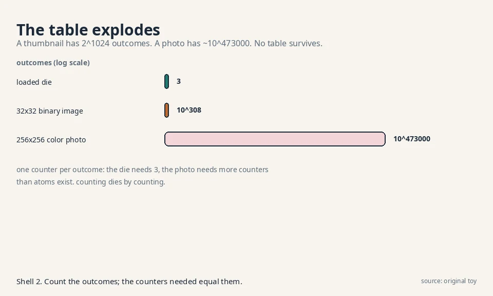
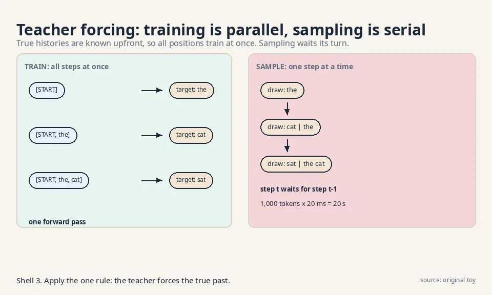
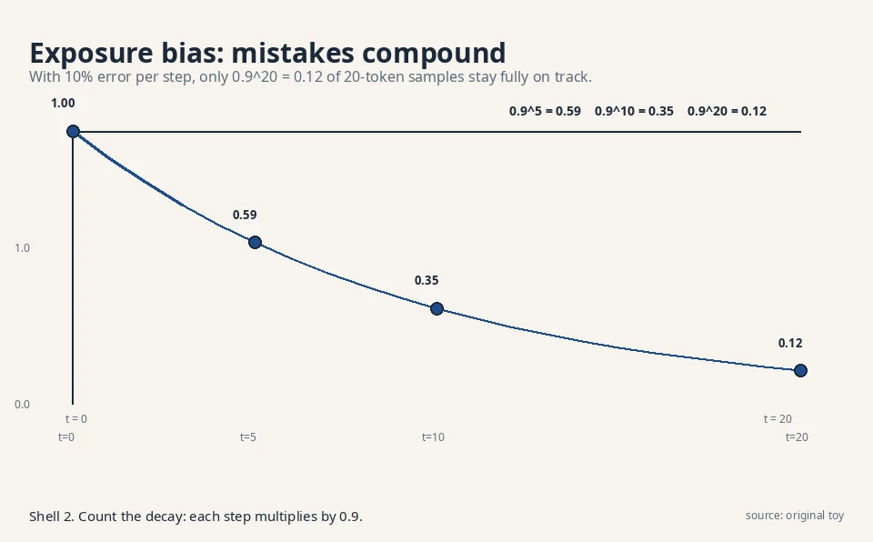
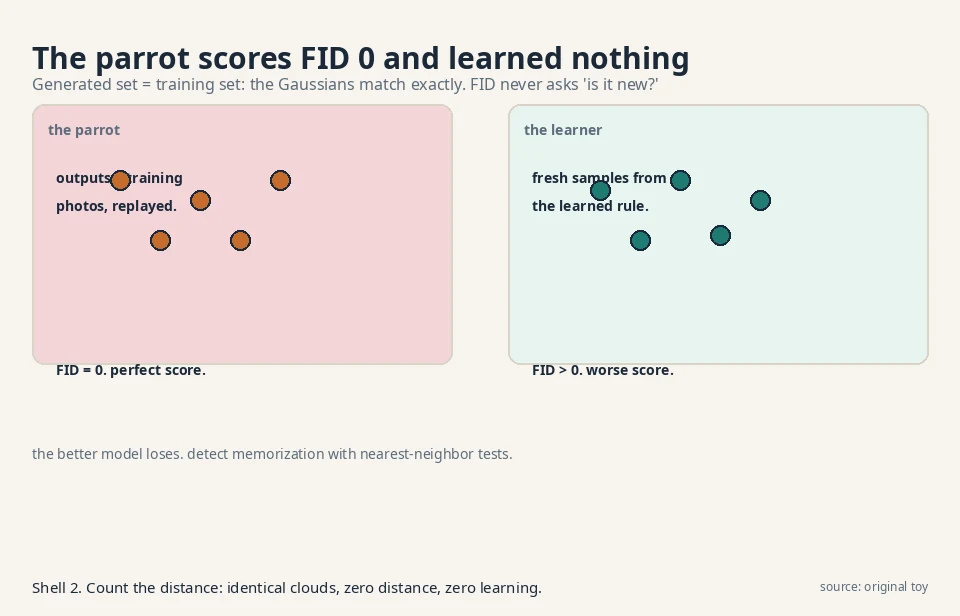
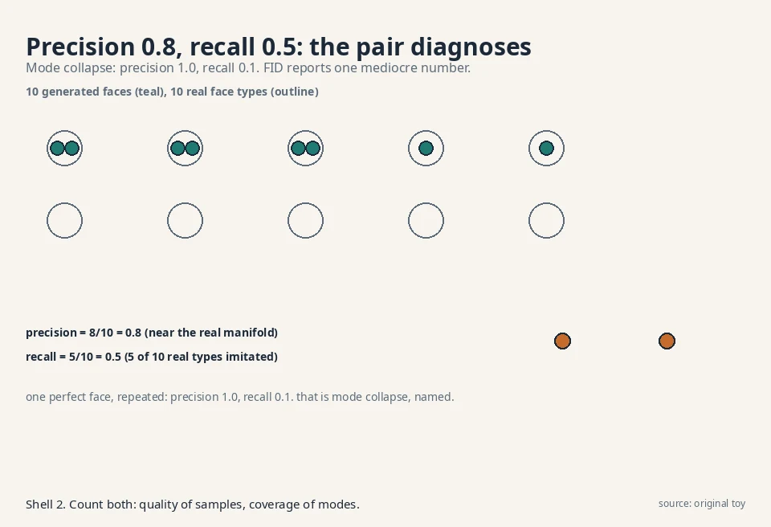

60 minutes · exam speed

This page tells the whole model-families story at exam depth.
Each section gives you the working version plus the failure
modes, the production tradeoffs, and the debugging rules. Read
it alone and you can clear the exam. Links at the end of each
section take you into the full lesson for the derivations.

### 1. The one question

Learn the rule behind samples, then draw fresh samples from it.
Counting needs one counter per outcome: 2^1024 for a thumbnail,
~10^473000 for a photo. Counting is maximum likelihood: the
counts are the rule that makes the data most probable. Every
family replaces the table with a smooth function so similar
outcomes share learning. Five machines: the storyteller (steps),
the sculptor (hidden causes), the warper (invertible bends), the
restorer (denoising), the critic (energy valleys). A sixth, the
GAN, plays a two-player game instead of maximizing likelihood.

Two jobs hide inside the question: **density estimation**
(learn the numbers) and **sampling** (roll the numbers). The
storyteller and warper do both with one mechanism. The sculptor
and restorer approximate the density but sample exactly. The
critic samples without ever computing densities. When an exam
asks "which families give exact likelihoods," the answer is the
storyteller and the warper only.

**Trap:** "Why not just memorize the dataset?" Replay assigns
zero probability to anything new, and the table cannot even be
stored (10^473000 counters). The job asks for the rule, not the
samples.

**Self-test:** Q1: A 64x64 binary icon generator uses a counting
table. How many counters? A: 2^4096. Impossible. Any counting
answer is wrong. Q2: Which two families give exact densities? A:
Storyteller (chain rule) and warper (change of variables).

[L01](l01-the-one-question.html)

### 2. The storyteller: chain rule and teacher forcing

Factor the sequence: 0.80 x 1.00 x 0.75 = 0.60, an identity, not
an approximation. The factorization tree shows every path: each
root-to-leaf product is a sentence probability. Train on true
histories (teacher forcing): loss 1.155 nats, perplexity 1.47 =
exp(1.155/3) on the toy. The loss is negative log-likelihood.
Perplexity 20 means the model puts 1/20 mass on the true next
token on average. The causal mask makes attention
autoregressive: "helped" becomes [0.50, 0.50], "frame" keeps
[0.79, 0.79].

Two prices. **Exposure bias:** training sees true histories,
sampling sees the model's own guesses. At 10% error per step,
0.9^20 = 0.12 of 20-token samples stay fully on track, and one
wrong token ("the dog") cuts the next step's confidence from
0.75 to 0.10. **Serial sampling:** 1,000 tokens at 20 ms = 20
seconds. The KV cache cuts per-step cost from O(N^2) to O(N) but
not the serial wait.

Decoding is a second product: temperature T = 0.5 sharpens "cat"
to 0.864 (safe), T = 2.0 flattens to 0.502 (wild). Top-p = 0.9
cuts the nonsense tail. Chat products run T ~ 0.7 with top-p ~
0.9.

**Failure mode:** the model drifts off-topic mid-paragraph. That
is exposure bias: one bad token poisons the history. Debug with
lower temperature or top-p, not more training.

**Production:** GPT-4, Claude, Gemini (next-token, causal mask).
WaveNet (audio, one sample at a time). DALL-E 1 (transformer
over image codes).

**Self-test:** Q1: Compute perplexity from loss 2.3 nats/token.
A: exp(2.3) = 9.97. Q2: Why does the KV cache not help training?
A: Training is one parallel pass. Nothing repeats. The cache
serves only the serial sampling loop. Q3: Your autocomplete has
a 50 ms budget at 20 ms/token. Name two fixes. A: Smaller model
(5 ms/token buys 10 tokens) or speculative decoding. Never
temperature: it does not change speed.

[L02](l02-autoregressive-models.html)

### 3. The sculptor: VAEs and the reparameterization trick

Encoder outputs a distribution (mu, sigma), not a point. ELBO =
reconstruction minus KL rent: 2.318 nats at mu = 2.0, sigma =
0.5. One Jensen step makes the bound: log of an average >=
average of the log. The gap is the encoder's error. Diagonal
Gaussians keep it cheap: full covariance would cost O(d^3).

The trick: z = mu + sigma x epsilon moves the dice roll out of
the parameter path. With epsilon = 0.6: z = 2.3, dz/dmu = 1,
dz/dsigma = 0.6. Backprop flows. Sample z ~ N(0,1) and decode.

Price: **blur**. The KL leash crowds codes toward the prior, so
the decoder averages: z = 0 decodes to 5, the average of the two
photos. Smoothness fills the holes and averages the outputs: one
mechanism. **Posterior collapse:** a too-strong decoder ignores
z, KL = 0 everywhere. Detect via KL per axis (zeros = dead).
Fix with KL annealing or a weaker decoder. **beta-VAE:** beta <
1 sharpens, holes return. **VQ-VAE:** discrete codebook (8,192
codes, 13 bits each), straight-through gradients, no collapse
possible, the storyteller's tokenizer.

**Failure mode:** latent interpolations do nothing. That is
collapse, not a bad prior. Check KL per axis first.

**Production:** VAEs ship as compressors. Stable Diffusion's
VAE (512 to 64, the latent room). DALL-E 1's dVAE. VITS speech.

**Self-test:** Q1: Compute the KL rent at mu = 2.0, sigma =
0.5. A: 0.5 x (4 + 0.25 - 1 - log 0.25) = 2.318 nats. Q2: Why
does the reparameterization gradient beat REINFORCE? A:
Pathwise derivative dz/dmu = 1 is exact per sample. Far lower
variance. Q3: beta = 0.1 on the toy: what happens? A: Rent
drops 10x, codes spread to +-0.9, reconstructions sharpen,
holes return.

[L03](l03-variational-autoencoders.html)

### 4. The warper: exact densities via change of variables

p_x = p_z / |det J|. Stretch by 2, density halves (0.5 on
[1,3]). Probability mass is conserved: the determinant is the
volume exchange rate. Folds need branch sums (x = z^2 gives two
terms), so invertibility is mandatory. General determinants
cost O(d^3): 10^9 ops at d = 1,000.

Coupling layers make the Jacobian triangular: x_b = z_b x
s(z_a) + t(z_a), inverse by arithmetic, det = product of the
diagonal (log det = 0.693 on the toy). MAF: fast density,
serial sampling. IAF: the mirror. Glow adds 1x1 convolutions
and ActNorm. Continuous flows (neural ODEs) trade the
determinant for a trace integral. Dequantize first: pixel 123
becomes 123.4, because integers have no density.

. Project: Stanford Frontier AI.")

Prices: rigid architectures (half the variables frozen per
layer), frozen dimension (no compression: a 256x256 image needs
a 196,608-dim warp), no residual blocks (x + f(x) folds).

**Failure mode:** s(z_a) = 0 kills invertibility. Parameterize s
as exp(s-hat): always positive, log det is a clean sum.

**Production:** WaveGlow (NVIDIA speech vocoder). Anomaly
detection (exact p(x) per reading). Lossless compression
(bits-back needs exact probabilities).

**Self-test:** Q1: Round-trip the toy: z = [0.5, 1.0], s = 2, t
= 1. A: Forward [0.5, 3.0]. Inverse: z_a = 0.5, z_b = (3-1)/2 =
1.0. Q2: MAF or IAF for anomaly detection? A: MAF: density is
its fast direction. Q3: Why did diffusion beat flows for
images? A: Rigidity. Free-form denoisers fit images better per
parameter. Flows pay exactness with architectural discipline.

[L04](l04-normalizing-flows.html)

### 5. The restorer: DDPM forward and reverse

Fixed destruction: 0.8 -> 0.846 -> 0.80177, signal gone after
1,000 steps (0.99^1000 = 0.000043). Beta grows 1e-4 to 2e-2:
whisper early, shout late. Alpha-bar: 0.90 at t = 100, 0.08 at
t = 500, 4e-5 at t = 1000. Closed-form jumps give free training
pairs at every noise level: x_t = sqrt(alpha-bar_t) x_0 +
sqrt(1-alpha-bar_t) epsilon.

The network predicts the added noise: loss (0.5 - 0.42)^2 =
0.0064, plain regression, no adversary. Epsilon, x_0, and v
are equivalent targets. Epsilon has the stablest scale.
Sampling runs 1,000 reverse steps from pure noise. The ELBO is
a sum over steps. L_simple drops the weights (better samples,
no longer a bound).

. Project: Stanford Frontier AI.")

**Latent diffusion:** 512x512x3 -> 64x64x4 = 48x fewer numbers
per step. The sculptor compresses, the restorer dreams. This is
Stable Diffusion.

Price: 50 seconds per image at 50 ms per step. T is large
because small steps keep each reversal near-Gaussian and the
ELBO tight.

**Failure mode:** plasticky samples with no fine detail. The
schedule destroyed details too early: try the cosine schedule.

**Production:** Stable Diffusion 1/2 (latent), DALL-E 2
(unCLIP), Imagen (cascaded), Sora (diffusion transformer), SD3
(rectified flow).

**Self-test:** Q1: One training step on the toy. A: t = 1, eps
= 0.5, x_1 = 0.846, predict 0.42, loss 0.0064. Q2: 2-second
budget, 50 ms/step: design the sampler. A: 40 DDIM jumps, eta =
0, guidance w ~ 7. Q3: Why not train at T = 40 directly? A:
Large T keeps each reversal learnable. Train at 1,000, sample
at 40.

[L05](l05-diffusion-ddpm.html)

### 6. The slope reader: score matching and shortcuts

Score s(x) = grad log p(x) = -x for N(0,1). Learn it by
denoising: target (x - x-tilde)/sigma^2 = -1.2 on the toy, no
density estimated. Density-first fails: a 30% wobble turns true
score -3 into -1.793. Sample with Langevin: 2.3 -> 2.059 at
delta = 0.1. Delta = 1.0 overshoots to 1.15.

DDPM's noise predictor IS a score predictor: s = -0.42/0.1 =
-4.2. One machine, two notations. The SDE trio: forward SDE
destroys, reverse SDE restores, probability-flow ODE walks
straight. One score drives all three.

. Project: Stanford Frontier AI.")

**DDIM:** 1,000 steps -> 50 jumps, same network, eta = 0
deterministic. 20x speedup, no retraining. **Guidance:**
epsilon_u + w(epsilon_c - epsilon_u) = 0.96 at w = 3. w ~ 7 in
production. Classifier-free won: no second model. **Flow
matching:** straight lines x_t = (1-t) x_0 + t eps, velocity
targets. SD3 uses rectified flow.

. Project: Stanford Frontier AI.")

Price: no likelihoods (the constant dies under differentiation).
Step sizes must stay small.

**Failure mode:** prompt ignored at 20 steps. Raise w first,
then switch to DPM-Solver, then distill. Oversaturated colors
mean w too high.

**Production:** nobody ships raw DDPM. The stack is latent
diffusion + DDIM-family sampler + classifier-free guidance.

**Self-test:** Q1: One DDIM jump from t = 1000 to 800. A:
x_0-hat from eps-hat, then x_800 = sqrt(alpha-bar_800) x_0-hat
+ sqrt(1-alpha-bar_800) eps-hat. No fresh noise. Q2: Why does
the score lose the normalizing constant? A: grad log p =
grad p / p. The constant vanishes under differentiation. Q3:
Flow matching vs diffusion in one line. A: Straight velocity
targets vs curved score paths. Fewer steps to integrate.

[L06](l06-score-matching-ddim.html)

### 7. The critic: energies without normalization

p(x) = exp(-E(x))/Z. Toy Z = 1.8711, p = [0.0723, 0.1966,
0.1966, 0.5345]. Z over images is intractable (~10^290 years),
so train by contrast: lower data energy, raise fantasy energy.
CD-1: one MCMC step from data, theta [0,0,0,0] -> [0,-0.1,0,0.1],
mass moves fantasy -> data. Persistent CD keeps chains alive in
a replay buffer. Score matching trains E without Z because
differentiation kills constants. Score = -grad E: L06's sampler
is this sampler.

. Project: Stanford Frontier AI.")

**Superpower:** energies compose by addition. E_face + E_smile
= [2,4] -> p = [0.881, 0.119]. No retraining. No other family
composes like this.

Prices: biased gradients (CD-k is not the gradient of any fixed
objective. One-sample variance 0.25 on the toy), no normalized
probabilities, chains stuck in one valley (the sampler's mode
collapse. Tempering is the fiddly fix).

**Failure mode:** spurious valleys that never fill. The
negative phase cannot see them: chains are too short or stuck.
Switch to persistent CD.

**Production:** research stage. No verified deployment. The
critic won the conceptual race: every family is an energy model
with a Z strategy (exact, bounded, ignored).

**Self-test:** Q1: Why does Z cancel in CD? A: The gradient is
data term minus model term. Z appears in both log-probs
identically and cancels in the difference. Q2: CD-1 vs
persistent CD in one line. A: Restart chains at data (biased,
cheap) vs continue chains across batches (less bias,
bookkeeping). Q3: When is the energy better than the score? A:
Composition. Energies add into a joint density. Scores give
only slopes.

[L07](l07-energy-based-models.html)

### 8. The judges

Likelihood: exact for storyteller and warper. log 0.6 = -0.511
beats log 0.4 = -0.916. Blind spot: Blurry (-0.693) beats Sharp
(-infinity) by infinite nats. Likelihood measures coverage, not
crispness. Bits per dimension is the fair scale. Say bound vs
exact.

FID: Frechet distance of Inception feature Gaussians. 0.5 for a
mean shift, 1.5 for doubled spread. The leaderboard standard.
Blind spots: memorization scores 0 (the parrot), spike mixture
scores 0.005 (same mean/variance, different shape), ImageNet
features judge dogs not scans. KID: unbiased, O(n^2), for small
samples.

Inception Score: a 1,000-photo memory machine scores 1000.
Never sees real data. Keep for quick checks, trust FID more.

**Catch the parrot:** nearest-neighbor distances (~0 =
memorization) and the train/test FID split (memorizer diverges).
**Precision/recall:** 0.8/0.5 on the toy. Mode collapse is 1.0
and 0.1. The pair diagnoses what FID averages. Density/coverage
refines against gaming.

Real answer: a portfolio. Likelihood where it exists, FID for
the leaderboard, CLIP for prompt match, precision/recall for
diagnosis, nearest-neighbor for the parrot audit, humans for
the final word.

**Failure mode:** FID improves but users complain. Check
memorization first, then the feature-space fit, then
precision vs recall separately.

**Self-test:** Q1: Compute FID for mean shift 0.5, same
covariance. A: FID^2 = 0.25, FID = 0.5. Q2: Why is KID
unbiased but rarely used at 50k samples? A: O(n^2) cost:
2.5B kernel evaluations. Q3: Name the launch portfolio. A:
FID, CLIP, precision/recall, nearest-neighbor, humans.

[L08](l08-judging-a-creator.html)

### Memory aids: the exam kit

**Mnemonics.** Five machines: "Stories Sculpt Warps, Restorers
Criticize." Five prices: "Serial, Blurry, Rigid, Slow, Blind."
Exact densities: "Stories Warp exactly" (storyteller, warper).
DDIM: "Jumps, not walks." Guidance: "Push past the
conditional."

**Never-confuse pairs.** Chain rule (identity) vs teacher
forcing (training procedure). ELBO (bound) vs likelihood
(truth. Gap = encoder error). Score (slope, -grad E) vs energy
(surface). DDPM (1,000 stochastic steps) vs DDIM (few
deterministic jumps, same network). FID (biased, O(n),
leaderboard) vs KID (unbiased, O(n^2), small samples).
Precision (sample quality) vs recall (mode coverage). MAF
(fast density) vs IAF (fast sampling). Temperature (mood) vs
top-p (sanity guardrail).

**If-this-then-that.** Ordered data -> storyteller. Exact p(x)
needed -> warper (MAF). Best samples, slow OK -> restorer
(latent + DDIM + guidance). Models must compose -> critic.
Sampling too slow -> DDIM first, then distill. Prompt ignored
-> raise w first. Latent dead -> check KL per axis. FID up but
users unhappy -> nearest-neighbor, then precision vs recall.
Compare likelihoods -> bits per dimension, same dataset, bound
vs exact declared.

**The one-glance table.**

| Family | Density | Sampling | Price | Ships in |
|---|---|---|---|---|
| Storyteller | Exact | Serial, 20 s/1k tokens | Exposure bias | GPT-4, WaveNet |
| Sculptor | Bound (ELBO) | One decode | Blur | SD's VAE, VITS |
| Warper | Exact | One warp | Rigidity | WaveGlow |
| Restorer | Bound | 1,000 steps, 50 s | Slow | Stable Diffusion, Sora |
| Critic | None | Langevin | Bias, stuck | Research |
| GAN | None | One pass | Unstable | StyleGAN |

### Rapid-fire self-test (answers below)

1. 2^1024 counts what, and why is it impossible?
2. Chain rule: identity or approximation?
3. Perplexity 20 means what?
4. Teacher forcing feeds what at each step?
5. 0.9^20 = ?
6. KV cache: what does it store, what does it not fix?
7. ELBO's two terms and the toy KL value.
8. z = mu + sigma x epsilon: name dz/dmu and dz/dsigma at epsilon = 0.6.
9. Posterior collapse: symptom and first check.
10. Coupling layer: forward, inverse, and log det on the toy.
11. Why triangular -> O(d)?
12. MAF vs IAF: which direction is fast for each?
13. DDPM forward step on the toy: x_0 = 0.8 -> x_1 = ?
14. Alpha-bar at t = 100, 500, 1000 (linear schedule).
15. Latent diffusion: the 48x in one line.
16. Score of N(0,1) at x = 2.3.
17. DDPM noise 0.42 at t = 1 becomes what score?
18. DDIM: what is eta = 0?
19. Guidance toy: 0.42 + 3 x 0.18 = ?
20. CD-1: theta update on the toy.
21. Energies E = [2,1] + [0,3]: composed p?
22. FID toy: mean shift 0.5 -> ? Doubled spread -> ?
23. Mode collapse in precision/recall numbers.
24. The parrot: which two tests catch it?

**Answers.** 1: Outcomes of a 32x32 binary image. More counters
than atoms exist. 2: Identity. Approximation enters only in the
estimated conditionals. 3: 1/20 average mass on the true next
token. 4: The true previous tokens, never its own guesses. 5:
0.12. Only 12% of 20-token samples stay clean. 6: Past keys
and values. It does not fix serial sampling. 7: Reconstruction
reward minus KL rent. 2.318 nats. 8: 1 and 0.6. 9: Latent
interpolations do nothing. Check KL per axis for zeros. 10:
[0.5, 3.0] forward, [0.5, 1.0] inverse, log det 0.693. 11:
Determinant of a triangular matrix is the diagonal product:
d multiplications. 12: MAF fast density. IAF fast sampling.
13: 0.846. 14: 0.90, 0.08, 4e-5. 15: 512x512x3 -> 64x64x4 =
786,432/16,384 = 48x fewer numbers per step. 16: -2.3. 17:
-4.2. 18: Deterministic jumps. Same x_T gives the same image.
19: 0.96. 20: [0,0,0,0] -> [0,-0.1,0,0.1]. 21: [0.881, 0.119].
22: 0.5 and 1.5. 23: Precision 1.0, recall 0.1. 24:
Nearest-neighbor distances and the train/test FID split.

