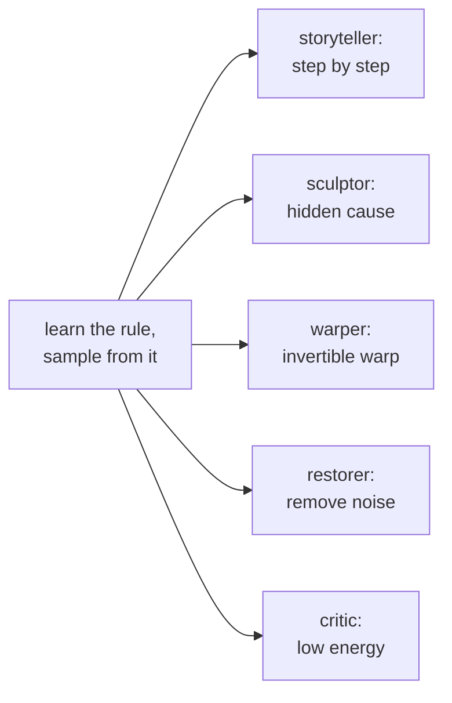

## The question

Every lesson in this course answers one question. Here it is,
stated plainly:

> You have samples from an unknown rule. Learn the rule. Then draw
> fresh samples from it.

A **distribution** is the rule. It assigns a probability to every
possible outcome. A loaded die has a distribution: face 1 comes up
half the time, faces 2 and 3 each come up a quarter of the time.
Written out:

```ascii
outcome:    1      2      3
P(outcome): 0.50   0.25   0.25
```

**Sampling** means rolling that die: pressing a button and getting
one fresh outcome, with face 1 appearing about half the time. A
**generative model** is a machine that learns the rule from samples
and then samples from it.

That is the whole job. The rest of this course is one question
with many machines. Each family of models is a different answer to
it. Before meeting the machines, watch the naive answer fail.

## First attempt: the counting machine

The simplest machine counts. Roll the die 20 times. Count the
faces. Divide by 20. Call the result the rule.

```ascii
20 rolls:  1,1,3,1,2,1,1,3,1,2,1,1,1,3,2,1,1,1,2,1

counts:    1 -> 13,   2 -> 4,   3 -> 3
rule:      P(1) = 0.65,  P(2) = 0.20,  P(3) = 0.15
```

To sample, the machine rolls its own rule: pick face 1 with
probability 0.65, and so on. It works. It learned a distribution
from samples and draws new ones. This is **density estimation**:
estimating the probabilities, then sampling from the estimate.

. Rolling the rule draws fresh samples. Shell 2. Source: original toy. Project: Stanford Frontier AI.")

Two details matter. First, the machine stores one number per
outcome. Three faces, three counters. Second, the machine can only
produce outcomes it counted. It cannot invent face 4. For dice
that is fine. For images it is fatal.

### Subchapter: counting is maximum likelihood

The counting machine has a famous name: **maximum likelihood
estimation** (MLE). The likelihood of a rule is the probability it
assigns to the observed rolls. The rule (0.65, 0.20, 0.15) assigns
the highest possible probability to those exact 20 rolls of any
rule. Any other rule, say (0.50, 0.25, 0.25), makes the observed
sequence less probable. Counting picks the winner.

This matters because every family in this course optimizes
likelihood or a stand-in for it. The storyteller (L02) maximizes
the likelihood of each token given its past. The sculptor (L03)
maximizes a lower bound on it. The restorer (L05) maximizes a
bound on it, one noise level at a time. When a lesson says
"training minimizes negative log-likelihood," it means the
machine is doing what the counting machine did, with a smarter
rule. The sibling course (math-genai L02) builds the KL and MLE
machinery in full. Here the fact to keep is one line: the counts
are the likelihood-maximizing rule, and likelihood is the
scoreboard every family plays on.

The decision rule this buys: if a model's rule equals the data's
own frequencies, it cannot invent. MLE replays the data's
statistics exactly. Invention needs a rule with fewer knobs than
outcomes, which forces generalization. That is what the five
machines are.

## Where counting breaks: the table explodes

Count the outcomes for a real problem. Take a tiny black-and-white
image, 32 by 32 pixels. Each pixel is on or off. The number of
possible images is 2^(32x32) = 2^1024. That number has 309 digits.
A counting machine needs one counter per possible image: more
counters than atoms in the visible universe, for a thumbnail.

Scale to a color photo, 256 by 256 pixels, 256 shades per channel.
The outcome count is 256^(256x256x3). That number has about
473,000 digits. No machine counts that.

```ascii
problem              outcomes              counters needed
loaded die           3                     3
32x32 binary image   2^1024 (~10^308)      more than atoms exist
256x256 color photo  ~10^473000            impossible
```


The naive answer dies by counting. No table can hold the rule for
real data. So every real generative model cheats the table. It
assumes structure: the rule is not an arbitrary list of numbers,
but something with a shape that few parameters can describe. Each
family cheats differently. That is the entire taxonomy of this
course.

### Subchapter: the real space is smaller than the table

The 2^1024 count assumes every pixel combination is equally
plausible. It is not. Real photos of faces vary along a small
number of knobs: pose, lighting, identity, expression. Tens of
knobs, not a million pixels. Almost all 2^1024 binary images are
static noise no camera ever produced. The data lives on a thin
**manifold**: a low-dimensional surface curled inside the huge
pixel space.

This is the **manifold hypothesis**, and it is what makes the
smooth-function dodge work. A smooth neural map with a few
thousand knobs cannot represent arbitrary tables, but it does not
need to. It only needs to cover the thin manifold where the data
lives. The counting machine fails because it budgets one counter
per outcome, including the 10^308 outcomes that never occur. The
five machines budget parameters for the manifold instead.

A second crack runs deeper. The counting machine treats similar
outcomes as strangers. A photo of a cat and the same photo shifted
one pixel get separate counters, sharing nothing. Real data has
smoothness: nearby outcomes have nearby probabilities. The naive
machine cannot use that. It learns each counter alone.

### Subchapter: two jobs, not one

Look again at the counting machine. It does two jobs with one
table: it learns the numbers (density estimation), and it rolls
the numbers (sampling). The five machines split these jobs
differently, and the split is the first thing to check on any new
model:

- **Storyteller and warper:** one mechanism does both. The chain
  rule's conditionals are the density and the sampler. The
  warper's invertible map gives p(x) and generates x.
- **Sculptor and restorer:** the density is approximate (a bound),
  but sampling is an exact procedure: draw latent noise, then decode.
  Draw static, denoise.
- **Critic:** sampling works (roll downhill), but the density is
  never computed. The two jobs fully separate.

Keep this split in mind. L08's judges exploit it: likelihood can
only score the families that compute densities, while FID can
score any family that produces samples.

## The key question

What if, instead of one counting machine, there are several
different machines, each a different way to learn the rule and
draw from it?

## The five machines

Each family answers the one question with a different mechanism.
Here they are, in the order this course studies them.

**Machine 1: the storyteller (autoregressive).** Do not learn the
whole rule at once. Break the outcome into steps and learn each
step given the earlier ones. For the die, that is trivial. For a
photo, it means: predict pixel 1, then pixel 2 given pixel 1, then
pixel 3 given the first two, and so on. Sampling runs the same
steps: write one piece at a time. The machine behind every modern
language model.

**Machine 2: the sculptor (variational autoencoder).** Imagine a
hidden cause behind each outcome. A face photo is caused by hidden
settings: pose, lighting, identity. The machine learns two maps: an
encoder that guesses the hidden settings from a photo, and a
decoder that rebuilds a photo from settings. To sample, draw
random settings from a simple prior (a standard bell curve) and run
the decoder. The hidden settings are called **latent variables**:
variables the model invents, never observed in the data.

**Machine 3: the warper (normalizing flow).** Start with simple
noise, say uniform numbers. Learn a warping function that bends the
noise into data. The warp must be invertible: you can go from noise
to image and back. Because the warp is invertible, the machine can
compute exact probabilities through the **change of variables**
formula: the rule that tells how a probability density transforms
under a warp. Stretch the space by 2 and the density halves, as
L04 works by hand. No approximation in the density. The price is
rigidity:
the warp must stay invertible, which limits its shape.

**Machine 4: the restorer (diffusion).** Take a photo and corrupt
it with noise, step by step, until it is pure static. Learn the
reverse: a machine that removes a little noise at each step. To
sample, start from pure static and run the reverser a thousand
times. The corruption is fixed and simple. Only the restoration is
learned.

**Machine 5: the critic (energy-based).** Assign every outcome an
**energy**: low energy for real-looking outcomes, high energy for
fake-looking ones. Real faces sit in valleys. Noise sits on hills.
To sample, wander downhill: start from noise and roll toward low
energy. The catch is normalization: turning energies into true
probabilities needs a sum over all outcomes, which is the same
exploding table. So this machine samples without ever computing
the true probabilities.



A sixth machine exists, the **adversarial** one (GAN): a generator
that fools a learned critic. Its mathematics belongs to the
sibling course (math-genai, Lessons 3-5). It appears here only in
the final comparison table.

<div class="video-block"><div class="video-wrap"><iframe src="https://www.youtube-nocookie.com/embed/EVXDYO7ZtvA" title="The Big Picture of Generative AI: How VAEs, GANs, Flows and Diffusion Actually Differ" allow="accelerometer; autoplay; clipboard-write; encrypted-media; gyroscope; picture-in-picture" allowfullscreen loading="lazy" referrerpolicy="strict-origin-when-cross-origin"></iframe></div><p class="video-cap">Explainer: The Big Picture of Generative AI, how VAEs, GANs, flows, and diffusion actually differ. Discriminative vs generative, latent space, one-shot vs iterative sampling, and a tradeoff table. Watch after the five-machines section.</p></div>

## Mapping back: how each machine dodges the table

Each machine's trick answers one of the counting machine's
failures, by name:

| Counting failure | Machine | The dodge |
|---|---|---|
| Table explodes: 2^1024 counters | Storyteller | Never stores the table. Stores one small predictor per step. |
| Table explodes | Sculptor | Stores a decoder from a small latent space. Few knobs describe many outcomes. |
| Table explodes | Warper | Stores one warp. The change-of-variables formula gives exact densities with no table. |
| Table explodes | Restorer | Stores one denoiser reused across 1,000 steps. The corruption schedule is fixed. |
| Table explodes | Critic | Stores one energy function. Never sums over all outcomes. |
| Similar outcomes share nothing | All five | All use smooth neural maps: nearby inputs give nearby outputs by construction. |

The common move: replace the table of counters with a smooth
parameterized function. Nearby outcomes flow through nearby paths
of the function, so learning about one teaches the machine about
its neighbors. That is what "generalization" means here.

## The honest price

No machine is free. Each dodge has a price, and the price list is
the map of the course:

| Machine | Price |
|---|---|
| Storyteller (L02) | Sampling is serial. A 1,000-pixel image needs 1,000 steps, one after another. |
| Sculptor (L03) | The density is approximate, not exact. Samples blur. |
| Warper (L04) | The warp must be invertible with a cheap determinant. Architectures are rigid. |
| Restorer (L05, L06) | Sampling takes ~1,000 reverse steps. Slow to draw. |
| Critic (L07) | No normalized probabilities. Training needs careful negative sampling. |

Every lesson follows the same arc: the question restated, the
family's answer, a hand-worked toy, the failure demonstrated with
numbers, the price named. By L08 you will judge any generator by
asking which machine it is and whether it paid its price.

## What is used where: the families in production

The five machines are not museum pieces. Each one runs inside
systems you can name. Facts below are from public papers, model
cards, and company technical reports. Anything not public is
marked unknown.

| Machine | Where it runs | Evidence |
|---|---|---|
| Storyteller | GPT-4, Claude, Gemini: all generate left to right with next-token prediction | Public: the standard LLM recipe. OpenAI, 2023, arxiv 2303.08774 (GPT-4). Google DeepMind, 2023, arxiv 2312.11805 (Gemini) |
| Storyteller | WaveNet (DeepMind, 2016): raw audio, one sample at a time | Public: arxiv 1609.03499 |
| Storyteller | DALL-E 1: autoregressive transformer over discrete image codes | Public: Ramesh et al., 2021, arxiv 2102.12092 |
| Sculptor | Stable Diffusion 1/2: a VAE compresses 512x512 images to 64x64 latents before diffusion | Public: Rombach et al., 2022, arxiv 2112.10752 |
| Sculptor | VITS: conditional VAE for end-to-end text-to-speech | Public: Kim et al., 2021, arxiv 2106.06103 |
| Warper | WaveGlow (NVIDIA, 2018): flow-based neural vocoder for speech | Public: Prenger et al., 2018, arxiv 1811.00002 |
| Warper | Glow: 1x1 convolutions for image generation | Public research: Kingma and Dhariwal, 2018, arxiv 1807.03039 |
| Restorer | Stable Diffusion 1/2, DALL-E 2, Imagen: text-to-image diffusion | Public: Rombach et al., 2022, arxiv 2112.10752. Ramesh et al., 2022, arxiv 2204.06125. Saharia et al., 2022, arxiv 2205.11487 |
| Restorer | Sora: video generation with a diffusion transformer | Public: OpenAI technical report, Feb 2024 |
| Restorer | Stable Diffusion 3: rectified flow (straight-line diffusion training: L06's flow matching, which trains on straight noise-to-data paths instead of curved diffusion paths) | Public: Esser et al., 2024, arxiv 2403.03206 |
| Critic | Research stage: image modeling (Du and Mordatch, 2019), classifier energies (JEM, 2020) | No verified production deployment: unknown. Du and Mordatch, 2019, arxiv 1903.08689. JEM: Grathwohl et al., 2020, arxiv 1912.03263 |
| Sixth machine (GAN) | StyleGAN face generation. Real-ESRGAN photo upscaling ships adversarial loss | Public: Karras et al., 2019, arxiv 1812.04948 (StyleGAN). Wang et al., 2021, arxiv 2107.10833 (Real-ESRGAN) |

Read the table as the course's promise kept: the mathematics you
learn here is the mathematics running in production. The critic's
row is the honest exception. Energy models never crossed into
deployed products at the time of writing.

> [!QA]
> Q: What is the actual job of a generative model, in one sentence?
> A: Learn the probability rule behind observed samples, then produce fresh samples that follow that rule. The die toy shows both halves: the counts estimate the rule (0.65, 0.20, 0.15 from 20 rolls), and rolling the estimated rule draws new samples. Everything else in this course is a smarter way to do those two halves when the outcome space is too big to count.
> Follow-up: Why can the model not just memorize the dataset and replay it?
> A: Because replay assigns zero probability to anything new, and the job asks for the rule, not the samples. The sibling course (math-genai L01) demonstrates this with its memory machine. Here the counting argument shows the stronger failure: for a 256x256 color photo the outcome count is ~10^473000, so a memorize-and-replay table cannot even be stored.

> [!QA]
> Q: Walk me through the counting machine: how does it learn, and how does it sample?
> A: Learning: roll the die 20 times and tally. The toy gives counts 13, 4, 3. Divide by 20: the rule is (0.65, 0.20, 0.15). That is all of learning: frequencies become probabilities. Sampling: build a spinner with those three probabilities and spin it. Face 1 comes up about 65% of the time. Fresh outcomes, same statistics. The plate shows the pipeline: rolls, counts, rule, fresh rolls.
> Follow-up: Where does the "learning" happen? There is no gradient descent.
> A: In the division. The counts are the maximum-likelihood estimate: no other rule assigns higher probability to the observed 20 rolls. Gradient descent enters only when the rule has knobs to turn. The counting machine's rule is the counts themselves, so learning is arithmetic, not optimization.

> [!QA]
> Q: What is the difference between density estimation and sampling?
> A: Density estimation learns the numbers: given an outcome, what is its probability? Sampling runs the rule forward: produce a fresh outcome. The counting machine does both from one table. Real families often split them: the storyteller estimates densities step by step and samples the same way, while the critic (energy-based) samples by rolling downhill without ever computing normalized probabilities.
> Follow-up: Which families give exact densities?
> A: The storyteller and the warper. The storyteller's chain rule multiplies exact step probabilities. The warper's change-of-variables formula is exact by construction. The sculptor and restorer give only lower bounds (ELBO-style: like L03's evidence lower bound, a stand-in training target that sits below the true likelihood), and the critic gives unnormalized energies. This exactness column is the first thing to check when comparing families.

> [!QA]
> Q: Why is counting called maximum likelihood, and why should I care?
> A: Because the counts are the rule that makes the observed data most probable. For the 20 rolls, (0.65, 0.20, 0.15) beats every alternative rule on the likelihood of that exact sequence. You should care because likelihood is the scoreboard for the whole course: the storyteller maximizes token likelihoods, the sculptor and restorer maximize lower bounds on it. The counting machine is the simplest player on that scoreboard.
> Follow-up: If counting already maximizes likelihood, why do we need neural models?
> A: Because the counts need one counter per outcome, and real outcome spaces have 10^473000 entries. Neural models maximize likelihood over a small set of knobs instead of a huge table. Same scoreboard, feasible players.

> [!QA]
> Q: Applied: you must build a generator for 8x8 black-and-white icons. Which machine do you pick?
> A: Start with the storyteller or the warper. An 8x8 icon has 64 binary pixels: 2^64 outcomes, too many to count, but tiny for a neural model. The storyteller predicts pixel by pixel (64 steps, cheap) and gives exact likelihoods. The warper bends 64-dim noise with coupling layers and also gives exact likelihoods. Pick the storyteller if you want easy conditioning (draw the top half, complete it). Pick the warper if you need exact densities for ranking icons. Skip the restorer: 1,000 denoising steps for a 64-pixel icon is overkill.
> Follow-up: What changes at 1024x1024 color?
> A: Everything about cost. The storyteller needs 3M serial steps. The warper needs a 3M-dimensional invertible map. Both become impractical, which is why production image models are restorers (diffusion) in a compressed latent space: Stable Diffusion denoises 64x64 latents, not pixels.

> [!QA]
> Q: What is the manifold hypothesis, in one paragraph?
> A: Real data does not fill its pixel space. Photos of faces vary along tens of knobs (pose, lighting, identity), not a million independent pixels. The 2^1024 outcome count assumes every combination is plausible. The manifold hypothesis says the plausible ones lie on a thin low-dimensional surface inside that space. This rescues the smooth-function dodge: a neural net with thousands of knobs cannot model arbitrary tables, but it can cover the thin manifold. The counting machine wastes counters on the 10^308 outcomes that never occur.
> Follow-up: Is the hypothesis proven?
> A: Not as a theorem. It is an empirical bet that has paid off: generative models with far fewer parameters than outcomes produce convincing samples, which would be impossible if the data truly filled the space. Treat it as the working assumption behind every family.

> [!QA]
> Q: Where do GANs fit, and why are they the sixth machine here?
> A: A GAN is a generator trained against a learned critic: the generator tries to fool the discriminator, the discriminator tries to catch it. It answers the one question with a two-player game instead of a likelihood. It is sixth here because its mathematics (minimax, f-divergences) belongs to the sibling math-genai course, Lessons 3-5. In production it appears where one-step sampling matters: StyleGAN faces, Real-ESRGAN upscaling.
> Follow-up: Why did diffusion beat GANs for text-to-image?
> A: Training stability. GANs optimize a saddle point: the generator and discriminator must stay balanced, and training collapses or oscillates. Diffusion trains as plain regression on noise (L05), which is stable, and buys quality with 1,000 sampling steps. The field traded sampling speed for trainability, then spent years buying speed back (L06).


## Recap: the whole lesson on one screen

1. **The one question.** Learn the rule behind samples, then draw fresh samples from it.
2. **The rule, concretely.** A distribution: probabilities per outcome. The loaded die: 0.50, 0.25, 0.25.
3. **First attempt: counting.** 20 rolls give counts 13/4/3, rule 0.65/0.20/0.15. Works on dice. Counting is maximum likelihood.
4. **The table explodes.** A 32x32 binary image has 2^1024 outcomes. A color photo has ~10^473000. No table survives.
5. **The manifold hint.** Real data lives on a thin surface, not the whole space. Smooth functions cover the surface.
6. **Two jobs.** Density estimation and sampling. Some families do both with one mechanism. The critic splits them.
7. **The key question.** What if several different machines answer the one question, each dodging the table differently?
8. **The five machines.** Storyteller (steps), sculptor (hidden cause), warper (invertible warp), restorer (denoise), critic (energy valleys).
9. **The price list.** Serial sampling, approximate density, rigid warps, 1,000 denoising steps, no normalization. Each lesson names its price.
10. **In production.** Storytellers write text (GPT, Claude, Gemini). Restorers paint images (Stable Diffusion, DALL-E 2, Sora). Sculptors compress (SD's VAE). Warpers speak (WaveGlow). Critics wait in the lab.

## Official sources and further reading

**Official:**
- W1_L2: Introduction & problem setting (Prof. Prathosh A P, playlist PLZ2ps__7DhBa5xCmncgH7kPqLqMBq7xlu): the lecture this chapter's framing follows. [uncertain]: the exact lecture treatment of the family taxonomy is not verified. The five-family map is the course's standard arc, assembled here from the playlist's lecture sequence.

**Further reading:**
- Goodfellow et al., Generative Adversarial Nets (2014): https://arxiv.org/abs/1406.2661 (the sixth machine, covered in the sibling course).
- The sibling course math-genai L01-L03: the three-step recipe (parametric family, divergence, optimization) and the divergence zoo, which this course takes as given.

**Caveats from these sources.** The five-family split is a teaching map, not a law: hybrids exist (diffusion in latent space, flow-based priors in VAEs). The outcome counts (2^1024, ~10^473000) assume independent pixels. Real images live on a much smaller manifold, which is exactly why the smooth-function dodge works.

## Connections to the other courses

- **math-genai (sibling):** the math foundations this course builds on: KL and MLE (L02), f-divergences (L03), ELBO, GAN mathematics. Read it for the derivations. This course uses the results.
- **CS229 L10/L11:** EM and the latent-variable view behind the sculptor. The diffusion lesson's probabilistic framing.
- **CS229S L02:** the storyteller's engine: next-token prediction and attention, the mechanism that made autoregressive models scale.
- **CS336:** architecture discussions that the warper lesson connects to: invertibility constraints vs. the free-form transformer block.
